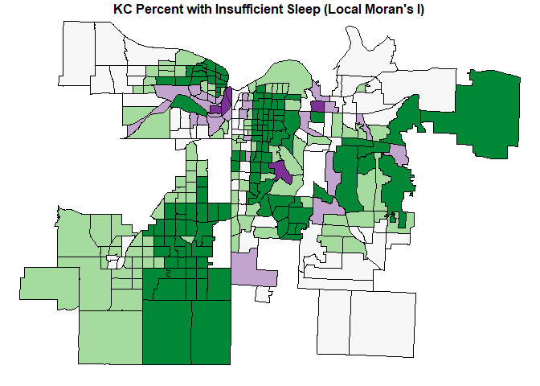
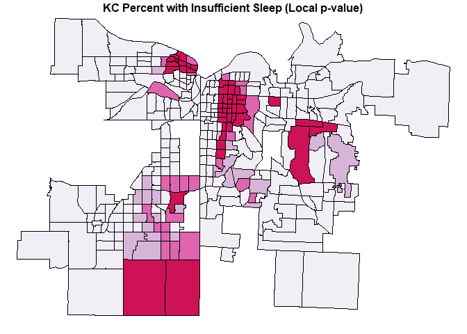
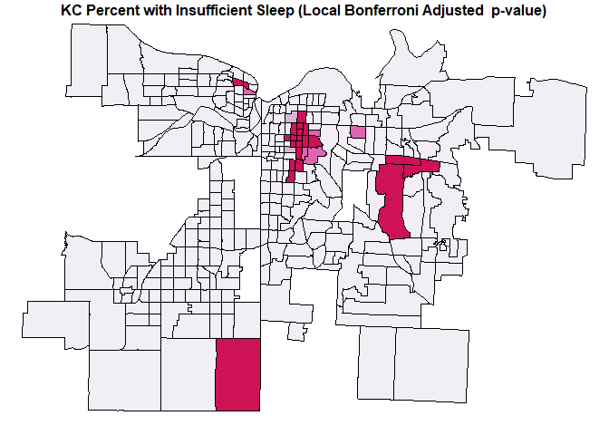
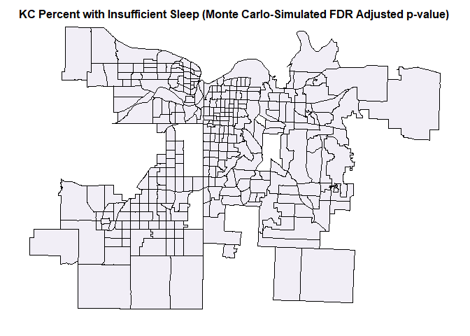
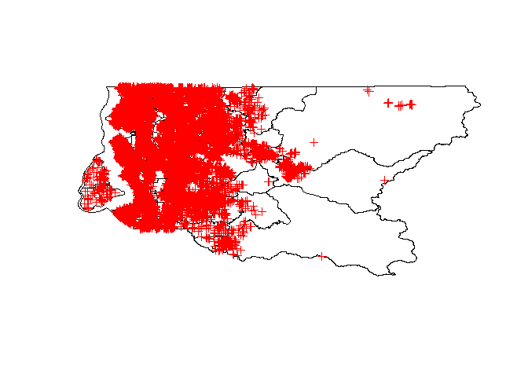
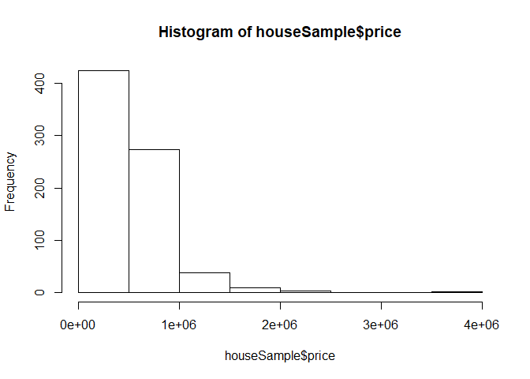

Creating a census tract map for the greater Kansas City region for analysis.


```r
knitr::opts_chunk$set(echo = TRUE)
knitr::opts_knit$set(progress = FALSE)
# Load packages
library(tidyverse)
library(tidycensus)
library(tigris)
library(spdep)
# Read in important health indicator data
sleep <- read.csv("C:/Users/Andrew/Desktop/Rockhurst University/WS19/A Term/BIA 6313 Spatial and GIS Analytics/Homework 3/indicator_data_download_20190216.csv")
# Check out the columns
names(sleep)
```

```
##  [1] "Indicator.Name"                    
##  [2] "What.Is.This.Indicator"            
##  [3] "Location.Type"                     
##  [4] "Location"                          
##  [5] "Indicator.Value"                   
##  [6] "Indicator.Value.Units"             
##  [7] "Lower.Confidence.Interval"         
##  [8] "Upper.Confidence.Interval"         
##  [9] "Indicator.Value.Unstable"          
## [10] "Period.of.Measure"                 
## [11] "Data.Source"                       
## [12] "Technical.Note"                    
## [13] "Breakout.Title"                    
## [14] "Breakout.Category"                 
## [15] "Breakout.Subcategory"              
## [16] "Breakout.Value"                    
## [17] "Breakout.Value.Units"              
## [18] "Breakout.Lower.Confidence.Interval"
## [19] "Breakout.Upper.Confidence.Interval"
## [20] "Breakout.Unstable"                 
## [21] "Breakout.Footer"
```

```r
# Filter the data to get a better subset
data <- sleep %>% filter(Period.of.Measure == 2014)
# Select the location and indicator columns
data <- data[, 4:5]
# Rename the column names
colnames(data) <- c("census_tract", "indicator")
# Pull census data from API
# tidycensus::census_api_key('60759d8b7e662b4e41566c69d17ed0199a8a3c16',
# install=TRUE)
readRenviron("~/.Renviron")
# American Community Survey census tract data information
inc.mo <- get_acs(geography = "tract", variable = "B06011_001E", state = "MO", 
    county = c("Jackson", "Cass"), year = 2014, geometry = FALSE)
# American Community Survey census tract data information
inc.ks <- get_acs(geography = "tract", variable = "B06011_001E", state = "KS", 
    county = c("Johnson", "Wyandotte"), year = 2014, geometry = FALSE)
# Row bind
inc.total <- rbind(inc.mo, inc.ks)
# Select the GEOID and estimate columns
inc.total <- inc.total[, c(1, 4)]
# Rename estimate to median income
names(inc.total)[2] <- "median_income"
# Check a summary of the statement
summary(inc.total$median_income)
```

```
##    Min. 1st Qu.  Median    Mean 3rd Qu.    Max.    NA's 
##    9541   20621   29382   30399   37809   74375      14
```

```r
# Set Nan values to zero
inc.total$median_income <- ifelse(is.na(inc.total$median_income), 0, inc.total$median_income)
# Change the data type from numeric to character
data$census_tract <- as.character(data$census_tract)
# Merge the data
health_data <- merge(data, inc.total, by.x = "census_tract", by.y = "GEOID")
# Check out the head of the data frame
head(health_data)
```

```
##   census_tract indicator median_income
## 1  20091050400      29.8         28664
## 2  20091050500      29.3         30052
## 3  20091050600      25.5         38093
## 4  20091051100      28.6         31685
## 5  20091051200      27.5         35065
## 6  20091051300      26.6         34132
```

```r
# Load Packages
library(tigris)
```


```r
# Load Packages
library(tigris)
# Define the counties of interest
mo.cass <- tracts(state = "29", county = "037")
mo.jackson <- tracts(state = "29", county = "095")
ks.johnson <- tracts(state = "20", county = "091")
ks.wyandotte <- tracts(state = "20", county = "209")
```


```r
# Combine the selected counties into a single boundary region
kc <- rbind(mo.cass, mo.jackson, ks.johnson, ks.wyandotte)
# Plot the kc tract boundaries
par(mar = c(0, 0, 0, 0))
plot(kc)
```

<!-- -->

```r
# Check the CRS of kc
proj4string(kc)
```

```
## [1] "+proj=longlat +datum=NAD83 +no_defs +ellps=GRS80 +towgs84=0,0,0"
```

```r
# Merge the data
data.sp <- merge(kc, health_data, by.x = "GEOID", by.y = "census_tract")
# Check the CRS of data.sp
proj4string(data.sp)
```

```
## [1] "+proj=longlat +datum=NAD83 +no_defs +ellps=GRS80 +towgs84=0,0,0"
```

```r
# Set CRS and scale
data.sp <- spTransform(data.sp, CRS = "+init=epsg:2817 +units=km")
# Load packages
library(GISTools)
library(tigris)
library(rgdal)
# Save SpatialPolygonDataFrame
setwd("C:/Users/Andrew/Desktop/Rockhurst University/WS19/A Term/BIA 6313 Spatial and GIS Analytics/Homework 3/")
# writeOGR(data.sp, dsn='.', layer='Insufficient_Sleep_KC', driver='ESRI
# Shapefile') Read in the shapefile as a sf object
Sleep_KC <- st_read("Insufficient_Sleep_KC.shp")
```

```
## Reading layer `Insufficient_Sleep_KC' from data source `C:\Users\Andrew\Desktop\Rockhurst University\WS19\A Term\BIA 6313 Spatial and GIS Analytics\Homework 3\Insufficient_Sleep_KC.shp' using driver `ESRI Shapefile'
## Simple feature collection with 419 features and 14 fields
## geometry type:  POLYGON
## dimension:      XY
## bbox:           xmin: 801.6259 ymin: 252.9146 xmax: 887.9682 ymax: 340.792
## epsg (SRID):    NA
## proj4string:    +proj=tmerc +lat_0=36.16666666666666 +lon_0=-94.5 +k=0.999941177 +x_0=850000 +y_0=0 +ellps=GRS80 +units=km +no_defs
```

```r
# Load packages
library(leaflet)
library(stringr)
library(purrr)
library(sf)
# Transform to simple feature
Sleep_KC.sf <- st_as_sf(Sleep_KC)
# Plot simple feature
plot(Sleep_KC.sf["indictr"], main = "Percent with Insufficient Sleep")
```

<!-- -->

```r
# Create a color pallete
pal <- colorQuantile(palette = "viridis", domain = Sleep_KC$indictr, n = 10)
# Transform the CRS and plot using leaflet
Sleep_KC %>% st_transform(crs = "+init=epsg:4326") %>% leaflet(width = "100%") %>% 
    addProviderTiles(provider = "CartoDB.Positron") %>% addPolygons(popup = ~str_extract(NAME, 
    "^([^,]*)"), stroke = FALSE, smoothFactor = 0, fillOpacity = 0.7, color = ~pal(indictr)) %>% 
    addLegend("bottomright", pal = pal, values = ~indictr, title = "Percent with Insufficient Sleep", 
        opacity = 1)
```

<!--html_preserve--><div id="htmlwidget-e9b42f6d5f1567b93478" style="width:100%;height:480px;" class="leaflet html-widget"></div>
<script type="application/json" data-for="htmlwidget-e9b42f6d5f1567b93478">{"x":{"options":{"crs":{"crsClass":"L.CRS.EPSG3857","code":null,"proj4def":null,"projectedBounds":null,"options":{}}},"calls":[{"method":"addProviderTiles","args":["CartoDB.Positron",null,null,{"errorTileUrl":"","noWrap":false,"detectRetina":false}]},{"method":"addPolygons","args":[[[[{"lng":[-94.294247,-94.294003,-94.293865,-94.293764,-94.293732,-94.293621,-94.29373,-94.293739,-94.293272,-94.292934,-94.292704,-94.29269,-94.292537,-94.292442,-94.292075,-94.292033,-94.291671,-94.29139,-94.291259,-94.291213,-94.291195,-94.291036,-94.290865,-94.290716,-94.290202,-94.289898,-94.289704,-94.288894,-94.288516,-94.288203,-94.288039,-94.287901,-94.287726,-94.287352,-94.287018,-94.286534,-94.286415,-94.286238,-94.286082,-94.285928,-94.285813,-94.285442,-94.285015,-94.28454,-94.284336,-94.284297,-94.284278,-94.284362,-94.284346,-94.284245,-94.283906,-94.283552,-94.283331,-94.283087,-94.282928,-94.28271,-94.282434,-94.282165,-94.281902,-94.281476,-94.281319,-94.281094,-94.280985,-94.280932,-94.280778,-94.280545,-94.280331,-94.280049,-94.279554,-94.27909,-94.278991,-94.278955,-94.279013,-94.279247,-94.279592,-94.279853,-94.279954,-94.28,-94.279956,-94.27985,-94.279824,-94.279657,-94.279468,-94.279314,-94.279209,-94.279108,-94.279062,-94.279018,-94.278951,-94.278706,-94.278467,-94.277972,-94.27745,-94.277065,-94.276884,-94.276481,-94.276248,-94.275975,-94.275615,-94.275521,-94.275393,-94.275251,-94.275148,-94.274915,-94.274672,-94.2744,-94.27373,-94.273495,-94.273123,-94.272828,-94.272612,-94.272384,-94.27237,-94.272207,-94.272007,-94.271748,-94.271248,-94.271091,-94.27102,-94.270744,-94.270655,-94.270583,-94.270535,-94.27044,-94.270344,-94.270248,-94.270052,-94.269827,-94.269641,-94.269437,-94.269133,-94.268773,-94.268447,-94.268365,-94.26811,-94.267723,-94.267599,-94.267468,-94.267356,-94.267215,-94.267093,-94.266862,-94.266528,-94.266291,-94.264773,-94.264311,-94.263784,-94.263548,-94.262771,-94.262575,-94.262444,-94.262245,-94.261489,-94.260952,-94.26064,-94.260095,-94.259778,-94.259453,-94.259213,-94.258955,-94.258604,-94.258325,-94.258165,-94.258097,-94.258091,-94.258233,-94.258298,-94.258346,-94.258357,-94.25835,-94.258214,-94.258123,-94.258001,-94.257866,-94.257722,-94.257518,-94.257393,-94.257268,-94.257024,-94.25663,-94.256286,-94.256127,-94.255898,-94.255586,-94.255483,-94.255331,-94.255115,-94.254917,-94.254702,-94.254477,-94.253488,-94.253384,-94.25337,-94.253352,-94.253352,-94.253363,-94.253343,-94.253312,-94.253186,-94.253052,-94.253029,-94.253003,-94.252986,-94.252964,-94.252962,-94.248478,-94.247375,-94.245061,-94.243784,-94.242774,-94.24159,-94.239276,-94.237203,-94.237132,-94.237034,-94.236932,-94.236823,-94.236734,-94.236675,-94.236545,-94.236473,-94.236451,-94.236445,-94.23655,-94.236746,-94.23695,-94.237193,-94.237602,-94.237899,-94.238125,-94.238212,-94.238241,-94.238197,-94.238132,-94.237925,-94.237741,-94.237684,-94.237736,-94.237626,-94.237518,-94.237444,-94.237398,-94.237481,-94.237539,-94.237399,-94.237317,-94.237262,-94.23736,-94.237513,-94.237502,-94.237537,-94.237841,-94.23807,-94.238368,-94.238424,-94.238338,-94.23824,-94.238139,-94.238192,-94.237966,-94.237697,-94.2375,-94.237425,-94.237601,-94.237828,-94.238504,-94.23846,-94.238256,-94.238117,-94.238078,-94.238424,-94.238733,-94.239102,-94.239415,-94.239959,-94.240238,-94.240447,-94.240462,-94.24064,-94.240469,-94.240418,-94.240474,-94.240664,-94.240577,-94.240233,-94.239921,-94.239565,-94.239505,-94.239499,-94.239603,-94.239603,-94.239634,-94.239917,-94.240258,-94.240193,-94.239939,-94.239731,-94.239804,-94.240062,-94.240328,-94.240553,-94.240626,-94.240731,-94.240937,-94.241137,-94.241389,-94.241575,-94.24173,-94.241873,-94.241896,-94.241876,-94.241796,-94.241726,-94.241801,-94.241974,-94.242037,-94.242077,-94.242339,-94.242485,-94.242615,-94.242674,-94.242519,-94.242484,-94.242478,-94.24249,-94.24238,-94.242145,-94.24218,-94.242333,-94.242454,-94.242491,-94.24256,-94.242517,-94.242631,-94.242971,-94.242995,-94.243076,-94.243074,-94.24309,-94.243096,-94.24294,-94.242995,-94.243152,-94.243671,-94.244554,-94.245819,-94.246445,-94.246783,-94.246921,-94.246771,-94.246584,-94.246533,-94.246562,-94.246478,-94.246414,-94.246012,-94.245617,-94.245448,-94.245318,-94.245218,-94.244896,-94.244813,-94.244597,-94.244259,-94.244045,-94.243687,-94.243532,-94.243359,-94.243271,-94.243114,-94.243057,-94.242669,-94.24235,-94.242108,-94.242073,-94.241729,-94.241594,-94.241054,-94.240989,-94.241019,-94.240874,-94.240795,-94.240793,-94.240986,-94.241238,-94.241174,-94.241031,-94.240934,-94.240697,-94.240585,-94.240584,-94.240663,-94.240487,-94.240168,-94.239898,-94.2395,-94.239388,-94.239674,-94.239672,-94.239654,-94.239715,-94.239777,-94.239649,-94.239362,-94.239265,-94.239279,-94.239389,-94.239562,-94.239625,-94.23983,-94.239783,-94.239431,-94.239399,-94.23962,-94.239969,-94.240287,-94.240475,-94.2406,-94.240758,-94.241136,-94.240993,-94.240659,-94.240389,-94.240054,-94.240245,-94.24037,-94.240162,-94.24002,-94.239878,-94.239383,-94.239097,-94.239207,-94.239124,-94.23889,-94.23876,-94.238948,-94.238984,-94.239037,-94.238971,-94.238829,-94.238856,-94.238867,-94.239061,-94.239025,-94.238965,-94.239083,-94.238991,-94.238929,-94.241116,-94.242492,-94.242626,-94.242877,-94.243211,-94.243411,-94.243572,-94.243748,-94.243919,-94.244082,-94.244238,-94.244412,-94.244626,-94.244768,-94.244952,-94.245114,-94.245284,-94.245459,-94.245675,-94.24586,-94.246005,-94.247411,-94.248271,-94.248682,-94.249566,-94.25049,-94.252786,-94.253405,-94.255075,-94.255047,-94.254968,-94.254949,-94.254865,-94.254831,-94.254818,-94.254822,-94.254816,-94.25479,-94.254758,-94.254723,-94.256932,-94.262968,-94.264049,-94.266866,-94.267057,-94.267512,-94.268621,-94.269206,-94.270083,-94.27052,-94.272742,-94.274373,-94.275236,-94.275967,-94.277875,-94.277943,-94.278006,-94.278057,-94.278073,-94.27811,-94.278129,-94.278156,-94.278309,-94.278353,-94.278513,-94.278513,-94.278513,-94.278626,-94.278832,-94.279025,-94.279042,-94.279068,-94.2791,-94.279139,-94.279422,-94.279491,-94.279515,-94.279537,-94.279547,-94.279542,-94.279539,-94.279547,-94.284434,-94.284578,-94.284812,-94.285149,-94.285218,-94.285352,-94.288454,-94.288987,-94.289302,-94.289765,-94.289802,-94.289642,-94.289515,-94.289358,-94.288878,-94.288859,-94.288872,-94.288846,-94.288743,-94.288211,-94.287906,-94.287646,-94.287668,-94.287671,-94.287661,-94.287593,-94.278167,-94.272497,-94.268115,-94.267951,-94.263003,-94.249404,-94.249381,-94.249208,-94.243678,-94.237955,-94.232239,-94.230672,-94.229986,-94.226206,-94.225744,-94.222338,-94.21965,-94.218465,-94.2161,-94.212074,-94.211671,-94.211326,-94.210249,-94.201978,-94.200909,-94.194019,-94.193698,-94.193558,-94.193309,-94.18991,-94.18727,-94.185427,-94.182351,-94.176874,-94.17563,-94.17539,-94.175298,-94.172042,-94.165433,-94.159241,-94.158925,-94.158669,-94.158463,-94.158399,-94.15734,-94.157238,-94.156609,-94.146286,-94.137664,-94.133813,-94.133453,-94.130517,-94.128154,-94.126038,-94.125922,-94.125497,-94.120778,-94.11979,-94.119096,-94.119198,-94.119323,-94.1194,-94.119456,-94.119507,-94.119547,-94.119578,-94.119664,-94.119679,-94.119707,-94.119709,-94.119722,-94.11973,-94.119757,-94.119771,-94.119782,-94.119792,-94.119823,-94.119837,-94.11984,-94.119852,-94.11991,-94.119913,-94.119915,-94.119916,-94.119918,-94.119936,-94.120159,-94.120168,-94.120285,-94.120319,-94.120343,-94.120352,-94.120353,-94.12037,-94.12038,-94.120394,-94.12036,-94.120312,-94.120272,-94.120257,-94.120269,-94.120312,-94.120396,-94.120418,-94.120409,-94.12034,-94.120334,-94.12031,-94.120336,-94.120354,-94.120407,-94.120559,-94.120623,-94.120626,-94.120626,-94.120625,-94.120619,-94.120679,-94.12069,-94.120702,-94.120765,-94.120766,-94.120782,-94.120783,-94.120936,-94.120948,-94.120985,-94.120997,-94.121009,-94.12121,-94.121274,-94.12131,-94.121312,-94.121361,-94.121334,-94.121308,-94.121265,-94.121286,-94.12131,-94.121334,-94.121338,-94.121352,-94.121365,-94.121577,-94.121597,-94.121598,-94.121789,-94.121789,-94.121829,-94.121844,-94.121844,-94.121846,-94.121869,-94.121911,-94.121953,-94.121953,-94.121972,-94.121992,-94.121993,-94.122172,-94.122352,-94.12239,-94.122429,-94.122436,-94.122442,-94.122534,-94.122625,-94.122761,-94.122813,-94.122814,-94.122823,-94.122823,-94.122824,-94.122827,-94.123316,-94.124053,-94.124115,-94.124134,-94.12425,-94.124393,-94.124414,-94.124444,-94.124501,-94.124567,-94.124642,-94.12479,-94.124864,-94.124971,-94.12502,-94.125064,-94.125078,-94.125123,-94.125124,-94.125125,-94.125165,-94.125183,-94.125183,-94.125193,-94.125241,-94.125335,-94.125355,-94.125367,-94.125378,-94.125396,-94.125397,-94.125457,-94.125475,-94.125491,-94.125519,-94.125521,-94.125536,-94.125537,-94.125546,-94.125632,-94.125637,-94.125653,-94.125653,-94.125654,-94.125654,-94.125655,-94.125665,-94.12573,-94.125737,-94.125822,-94.125853,-94.125854,-94.125857,-94.125883,-94.125946,-94.12601,-94.126062,-94.126167,-94.126299,-94.126339,-94.12634,-94.126458,-94.126517,-94.126518,-94.126523,-94.126542,-94.126621,-94.126695,-94.126758,-94.126861,-94.126862,-94.126864,-94.126895,-94.126903,-94.126906,-94.126946,-94.126961,-94.126966,-94.127,-94.127055,-94.127063,-94.127135,-94.127235,-94.129576,-94.132471,-94.133793,-94.135155,-94.136283,-94.13633,-94.136396,-94.136509,-94.139372,-94.140435,-94.14248,-94.145741,-94.148441,-94.149263,-94.154854,-94.1598,-94.161885,-94.163286,-94.164163,-94.164292,-94.164532,-94.164955,-94.165358,-94.166754,-94.174015,-94.182654,-94.182672,-94.18407,-94.18802,-94.19142,-94.192009,-94.195489,-94.201316,-94.203575,-94.2107,-94.220174,-94.221298,-94.222354,-94.225982,-94.227167,-94.238573,-94.23872,-94.248037,-94.249637,-94.257317,-94.258499,-94.259857,-94.263189,-94.265421,-94.266033,-94.266542,-94.267744,-94.272343,-94.273524,-94.275788,-94.277527,-94.282798,-94.284022,-94.285441,-94.288624,-94.289803,-94.291021,-94.292666,-94.293168,-94.293972,-94.294028,-94.29414,-94.294247],"lat":[38.704512,38.709938,38.712743,38.716393,38.716429,38.718797,38.718804,38.718986,38.729817,38.737287,38.743463,38.743623,38.748001,38.749995,38.755207,38.756443,38.76325,38.768556,38.770276,38.770884,38.77131,38.771391,38.771579,38.771671,38.771691,38.771625,38.771553,38.771186,38.771025,38.770847,38.770707,38.770584,38.770407,38.769961,38.769651,38.769417,38.769589,38.769742,38.769894,38.770067,38.770145,38.770205,38.770209,38.770198,38.770173,38.77014,38.770017,38.769497,38.769297,38.769169,38.769138,38.769158,38.769201,38.769397,38.769513,38.769584,38.769614,38.76958,38.769473,38.769231,38.768994,38.768935,38.768954,38.769057,38.769259,38.769351,38.769382,38.769333,38.769193,38.769001,38.768906,38.768798,38.768568,38.768286,38.767813,38.767447,38.767229,38.767045,38.766924,38.766837,38.766833,38.766802,38.766816,38.766899,38.766993,38.767274,38.767433,38.767742,38.767905,38.768053,38.768142,38.768246,38.768384,38.768569,38.768722,38.769014,38.769094,38.769067,38.768924,38.76883,38.768393,38.768137,38.768076,38.768077,38.768131,38.768417,38.768721,38.768884,38.769132,38.76938,38.769767,38.770226,38.770254,38.770494,38.770601,38.770666,38.770711,38.770722,38.770727,38.770748,38.770754,38.770745,38.770723,38.770628,38.770489,38.770368,38.770227,38.770108,38.770099,38.770133,38.770221,38.770278,38.770322,38.770332,38.770387,38.770532,38.770627,38.770819,38.771001,38.771119,38.771147,38.771128,38.771033,38.77085,38.769853,38.769561,38.769293,38.769222,38.769127,38.76906,38.768964,38.768742,38.768332,38.76817,38.768109,38.768082,38.768119,38.768237,38.76831,38.768315,38.768274,38.768229,38.768255,38.76835,38.768558,38.768917,38.769112,38.769462,38.76995,38.770205,38.77063,38.770745,38.770837,38.770884,38.770948,38.77108,38.771121,38.771114,38.771022,38.770647,38.770422,38.770248,38.769915,38.769823,38.769788,38.769716,38.769573,38.769482,38.769436,38.769429,38.769413,38.769379,38.769453,38.769658,38.769863,38.770016,38.770611,38.771068,38.772863,38.774608,38.774862,38.775244,38.775627,38.775929,38.776251,38.775522,38.775338,38.774948,38.77474,38.774579,38.774387,38.774008,38.77367,38.773883,38.774201,38.774614,38.775148,38.775623,38.775789,38.775915,38.776005,38.776112,38.776137,38.776436,38.776792,38.777097,38.7773,38.777484,38.777664,38.777969,38.77823,38.778359,38.778565,38.778729,38.778751,38.778829,38.779054,38.779253,38.779496,38.779653,38.779848,38.779988,38.780149,38.780341,38.780591,38.780789,38.780963,38.781143,38.781232,38.781447,38.781579,38.781679,38.781603,38.781556,38.781655,38.781802,38.781913,38.782062,38.782176,38.782234,38.78222,38.782225,38.782745,38.782887,38.783001,38.783131,38.783325,38.783514,38.783729,38.783791,38.783947,38.784093,38.784128,38.7841,38.783747,38.783679,38.783739,38.783754,38.783967,38.784149,38.784231,38.784411,38.784626,38.784809,38.784861,38.784749,38.784777,38.785011,38.785157,38.785402,38.785686,38.785868,38.785982,38.786145,38.786338,38.786379,38.786581,38.786809,38.786882,38.78686,38.786855,38.787098,38.787233,38.787295,38.787162,38.78708,38.786994,38.786991,38.787092,38.787206,38.787438,38.787558,38.787691,38.78781,38.78794,38.788188,38.788225,38.788371,38.788425,38.788473,38.788614,38.78884,38.788984,38.789009,38.789186,38.789291,38.78949,38.789575,38.789681,38.789815,38.789961,38.790235,38.790353,38.790529,38.790842,38.790864,38.790999,38.791117,38.791418,38.791752,38.792136,38.792157,38.792217,38.792499,38.792434,38.793111,38.793503,38.794229,38.795475,38.795936,38.796351,38.796465,38.796632,38.796719,38.796785,38.796984,38.797116,38.797267,38.797738,38.797807,38.79815,38.798341,38.798619,38.798853,38.799253,38.799886,38.800096,38.800377,38.800465,38.800622,38.800687,38.801133,38.801491,38.801718,38.801761,38.801987,38.802075,38.802407,38.802739,38.80293,38.803137,38.803199,38.803407,38.803454,38.80363,38.803725,38.803867,38.803994,38.804009,38.804165,38.804278,38.804421,38.804563,38.804657,38.804688,38.804844,38.804955,38.805274,38.805575,38.805893,38.806322,38.806608,38.806846,38.807146,38.807415,38.807669,38.808019,38.808306,38.808561,38.808593,38.808689,38.808909,38.809163,38.809339,38.809421,38.809342,38.80974,38.810059,38.810313,38.810776,38.810855,38.810854,38.811042,38.8112,38.811423,38.811773,38.811977,38.811739,38.811707,38.811958,38.812227,38.812577,38.812877,38.813194,38.813416,38.813719,38.81383,38.814043,38.814128,38.814296,38.814538,38.814807,38.814971,38.815267,38.81547,38.815688,38.815952,38.816213,38.816263,38.816295,38.816301,38.816304,38.816292,38.816275,38.816246,38.816202,38.816146,38.816079,38.816001,38.815894,38.815733,38.815641,38.815544,38.815475,38.815417,38.815371,38.815332,38.815313,38.815307,38.815368,38.815406,38.815476,38.815489,38.815502,38.815596,38.815613,38.815658,38.816203,38.817821,38.81806,38.81913,38.819416,38.819687,38.819906,38.819975,38.820047,38.82009,38.820119,38.820242,38.820335,38.82024,38.820294,38.820298,38.820307,38.820335,38.820351,38.820375,38.820402,38.820488,38.820554,38.820571,38.820601,38.820668,38.82066,38.820638,38.820606,38.820593,38.820545,38.820493,38.819862,38.817557,38.816806,38.814089,38.81335,38.813082,38.810846,38.807797,38.804651,38.804312,38.803948,38.803621,38.803296,38.79904,38.798022,38.797827,38.797576,38.797324,38.796973,38.796732,38.796415,38.797694,38.79772,38.797756,38.797786,38.797788,38.797792,38.79777,38.797773,38.797769,38.797755,38.798332,38.802427,38.803157,38.80462,38.813423,38.813489,38.813512,38.813946,38.815439,38.824228,38.827829,38.832434,38.832476,38.832522,38.832556,38.835084,38.835056,38.835044,38.835038,38.835037,38.835032,38.834955,38.834957,38.834957,38.834968,38.834896,38.83487,38.834874,38.834868,38.834863,38.834861,38.834842,38.834827,38.834857,38.834855,38.834854,38.834854,38.834854,38.834885,38.834828,38.834821,38.834816,38.834791,38.83478,38.83478,38.834784,38.834743,38.834745,38.834764,38.834797,38.834805,38.83481,38.834812,38.834742,38.834562,38.834404,38.83438,38.834345,38.8343,38.834272,38.834287,38.834292,38.834283,38.833962,38.833697,38.833544,38.833535,38.833459,38.833398,38.833109,38.83311,38.833112,38.833006,38.833138,38.833167,38.833149,38.833139,38.833112,38.833082,38.833033,38.83296,38.832872,38.832081,38.831946,38.831262,38.831216,38.830886,38.830789,38.830475,38.830302,38.83017,38.830039,38.829647,38.829165,38.829045,38.828649,38.827836,38.827793,38.827771,38.827748,38.827713,38.827456,38.824317,38.8242,38.822703,38.821919,38.821367,38.821173,38.821147,38.820762,38.820562,38.82027,38.819827,38.81961,38.819522,38.819422,38.819317,38.819185,38.819048,38.818967,38.818879,38.818655,38.818617,38.818469,38.818342,38.818306,38.818198,38.817887,38.817631,38.817617,38.81757,38.817495,38.816772,38.81591,38.815747,38.815578,38.814098,38.814067,38.813774,38.813753,38.810918,38.810688,38.810158,38.809981,38.809792,38.806709,38.80501,38.804344,38.804311,38.803422,38.802622,38.801822,38.800516,38.799668,38.799308,38.798949,38.798863,38.798562,38.79826,38.793468,38.793017,38.793001,38.788677,38.788642,38.785759,38.78465,38.784611,38.784492,38.782841,38.779808,38.776774,38.776748,38.775348,38.773922,38.773912,38.770866,38.767809,38.767157,38.766505,38.766383,38.766261,38.764258,38.762256,38.759316,38.758201,38.758173,38.757912,38.757901,38.757882,38.757865,38.755459,38.751839,38.750377,38.749929,38.747788,38.744839,38.744746,38.744687,38.744619,38.744569,38.744533,38.74449,38.744469,38.744419,38.744379,38.744323,38.744224,38.743151,38.743132,38.743113,38.742167,38.741312,38.741295,38.740824,38.739169,38.73664,38.736117,38.735834,38.735587,38.73529,38.735281,38.734297,38.733993,38.733734,38.732992,38.732929,38.732526,38.732499,38.732228,38.730696,38.730603,38.730037,38.72997,38.729403,38.729393,38.7292,38.729125,38.728619,38.728515,38.72722,38.726672,38.726646,38.726602,38.726123,38.72497,38.723817,38.722624,38.720633,38.718677,38.717921,38.717902,38.715379,38.714274,38.714252,38.714154,38.713735,38.712044,38.710786,38.709458,38.706978,38.70695,38.706891,38.706115,38.705916,38.705883,38.705485,38.705137,38.705009,38.704218,38.703299,38.703158,38.701821,38.699646,38.699734,38.699839,38.699894,38.699948,38.699992,38.69999,38.700003,38.700008,38.70014,38.700188,38.700281,38.70043,38.70047,38.700458,38.700592,38.700708,38.700765,38.700953,38.700889,38.700919,38.700987,38.700935,38.700889,38.700912,38.701125,38.701465,38.701094,38.701151,38.701318,38.701423,38.701454,38.701609,38.701847,38.70185,38.701726,38.702346,38.70238,38.702413,38.702524,38.702561,38.702909,38.702914,38.703239,38.703294,38.703558,38.703608,38.703664,38.703802,38.703896,38.703919,38.703938,38.703979,38.704099,38.704129,38.704188,38.704225,38.704336,38.704361,38.704392,38.704458,38.704483,38.704504,38.704531,38.70454,38.704553,38.704551,38.704537,38.704512]}]],[[{"lng":[-94.566244,-94.56608,-94.566056,-94.565916,-94.565526,-94.565545,-94.564876,-94.564215,-94.56269,-94.562616,-94.562234,-94.56208,-94.560456,-94.559752,-94.558104,-94.557732,-94.555222,-94.554772,-94.554552,-94.554421,-94.554205,-94.553485,-94.55229,-94.552262,-94.551538,-94.550834,-94.550553,-94.550536,-94.548841,-94.548731,-94.548313,-94.547947,-94.54701,-94.546428,-94.546182,-94.5452,-94.544631,-94.544547,-94.543829,-94.543536,-94.543483,-94.543182,-94.543101,-94.542652,-94.542147,-94.542013,-94.541828,-94.541863,-94.54187,-94.541876,-94.542023,-94.539586,-94.537638,-94.535516,-94.536409,-94.536538,-94.537094,-94.537226,-94.537685,-94.537485,-94.537964,-94.53811,-94.539884,-94.539902,-94.542798,-94.542899,-94.542876,-94.541258,-94.54063,-94.5407,-94.540924,-94.541038,-94.543256,-94.544286,-94.549172,-94.549297,-94.549302,-94.549309,-94.54975,-94.55231,-94.552316,-94.553206,-94.554663,-94.555146,-94.556129,-94.557452,-94.560256,-94.560891,-94.561864,-94.561905,-94.566267,-94.566244],"lat":[38.824619,38.82725,38.827631,38.82987,38.831048,38.83282,38.835673,38.83845,38.844992,38.844983,38.845007,38.845002,38.844951,38.844935,38.844903,38.844907,38.844702,38.844666,38.844649,38.844638,38.844625,38.844581,38.844509,38.844508,38.844476,38.844445,38.844433,38.844432,38.844353,38.844348,38.844328,38.844309,38.844265,38.844276,38.844238,38.844161,38.844134,38.84413,38.844096,38.844082,38.844079,38.844065,38.844061,38.844041,38.844018,38.844007,38.843994,38.842936,38.842735,38.842533,38.837911,38.837822,38.837751,38.837674,38.836596,38.836381,38.835588,38.835121,38.833231,38.832918,38.832615,38.831931,38.831992,38.831856,38.831966,38.829788,38.829461,38.829425,38.829394,38.827699,38.824113,38.822335,38.822409,38.822537,38.822756,38.822926,38.822871,38.822761,38.822764,38.822871,38.823106,38.82306,38.823114,38.823132,38.82302,38.822974,38.82389,38.824415,38.824452,38.824328,38.824259,38.824619]}]],[[{"lng":[-94.291195,-94.290944,-94.290696,-94.289794,-94.289765,-94.289302,-94.288987,-94.288454,-94.285352,-94.285218,-94.285149,-94.284812,-94.284578,-94.284434,-94.279547,-94.279539,-94.279542,-94.279547,-94.279537,-94.279515,-94.279491,-94.279422,-94.279139,-94.2791,-94.279068,-94.279042,-94.279025,-94.278832,-94.278626,-94.278513,-94.278513,-94.278513,-94.278353,-94.278309,-94.278156,-94.278129,-94.27811,-94.278073,-94.278057,-94.278006,-94.277943,-94.277875,-94.275967,-94.275236,-94.274373,-94.272742,-94.27052,-94.270083,-94.269206,-94.268621,-94.267512,-94.267057,-94.266866,-94.264049,-94.262968,-94.256932,-94.254723,-94.254758,-94.25479,-94.254816,-94.254822,-94.254818,-94.254831,-94.254865,-94.254949,-94.254968,-94.255047,-94.255075,-94.253405,-94.252786,-94.25049,-94.249566,-94.248682,-94.248271,-94.247411,-94.246005,-94.24586,-94.245675,-94.245459,-94.245284,-94.245114,-94.244952,-94.244768,-94.244626,-94.244412,-94.244238,-94.244082,-94.243919,-94.243748,-94.243572,-94.243411,-94.243211,-94.242877,-94.242626,-94.242492,-94.241116,-94.238929,-94.238991,-94.239083,-94.238965,-94.239025,-94.239061,-94.238867,-94.238856,-94.238829,-94.238971,-94.239037,-94.238984,-94.238948,-94.23876,-94.23889,-94.239124,-94.239207,-94.239097,-94.239383,-94.239878,-94.24002,-94.240162,-94.24037,-94.240245,-94.240054,-94.240389,-94.240659,-94.240993,-94.241136,-94.240758,-94.2406,-94.240475,-94.240287,-94.239969,-94.23962,-94.239399,-94.239431,-94.239783,-94.23983,-94.239625,-94.239562,-94.239389,-94.239279,-94.239265,-94.239362,-94.239649,-94.239777,-94.239715,-94.239654,-94.239672,-94.239674,-94.239388,-94.2395,-94.239898,-94.240168,-94.240487,-94.240663,-94.240584,-94.240585,-94.240697,-94.240934,-94.241031,-94.241174,-94.241238,-94.240986,-94.240793,-94.240795,-94.240874,-94.241019,-94.240989,-94.241054,-94.241594,-94.241729,-94.242073,-94.242108,-94.24235,-94.242669,-94.243057,-94.243114,-94.243271,-94.243359,-94.243532,-94.243687,-94.244045,-94.244259,-94.244597,-94.244813,-94.244896,-94.245218,-94.245318,-94.245448,-94.245617,-94.246012,-94.246414,-94.246478,-94.246562,-94.246533,-94.246584,-94.246771,-94.246921,-94.246783,-94.246445,-94.245819,-94.244554,-94.243671,-94.243152,-94.242995,-94.24294,-94.243096,-94.24309,-94.243074,-94.243076,-94.242995,-94.242971,-94.242631,-94.242517,-94.24256,-94.242491,-94.242454,-94.242333,-94.24218,-94.242145,-94.24238,-94.24249,-94.242478,-94.242484,-94.242519,-94.242674,-94.242615,-94.242485,-94.242339,-94.242077,-94.242037,-94.241974,-94.241801,-94.241726,-94.241796,-94.241876,-94.241896,-94.241873,-94.24173,-94.241575,-94.241389,-94.241137,-94.240937,-94.240731,-94.240626,-94.240553,-94.240328,-94.240062,-94.239804,-94.239731,-94.239939,-94.240193,-94.240258,-94.239917,-94.239634,-94.239603,-94.239603,-94.239499,-94.239505,-94.239565,-94.239921,-94.240233,-94.240577,-94.240664,-94.240474,-94.240418,-94.240469,-94.24064,-94.240462,-94.240447,-94.240238,-94.239959,-94.239415,-94.239102,-94.238733,-94.238424,-94.238078,-94.238117,-94.238256,-94.23846,-94.238504,-94.237828,-94.237601,-94.237425,-94.2375,-94.237697,-94.237966,-94.238192,-94.238139,-94.23824,-94.238338,-94.238424,-94.238368,-94.23807,-94.237841,-94.237537,-94.237502,-94.237513,-94.23736,-94.237262,-94.237317,-94.237399,-94.237539,-94.237481,-94.237398,-94.237444,-94.237518,-94.237626,-94.237736,-94.237684,-94.237741,-94.237925,-94.238132,-94.238197,-94.238241,-94.238212,-94.238125,-94.237899,-94.237602,-94.237193,-94.23695,-94.236746,-94.23655,-94.236445,-94.236451,-94.236473,-94.236545,-94.236675,-94.236734,-94.236823,-94.236932,-94.237034,-94.237132,-94.237203,-94.239276,-94.24159,-94.242774,-94.243784,-94.245061,-94.247375,-94.248478,-94.252962,-94.252964,-94.252986,-94.253003,-94.253029,-94.253052,-94.253186,-94.253312,-94.253343,-94.253363,-94.253352,-94.253352,-94.25337,-94.253384,-94.253488,-94.254477,-94.254702,-94.254917,-94.255115,-94.255331,-94.255483,-94.255586,-94.255898,-94.256127,-94.256286,-94.25663,-94.257024,-94.257268,-94.257393,-94.257518,-94.257722,-94.257866,-94.258001,-94.258123,-94.258214,-94.25835,-94.258357,-94.258346,-94.258298,-94.258233,-94.258091,-94.258097,-94.258165,-94.258325,-94.258604,-94.258955,-94.259213,-94.259453,-94.259778,-94.260095,-94.26064,-94.260952,-94.261489,-94.262245,-94.262444,-94.262575,-94.262771,-94.263548,-94.263784,-94.264311,-94.264773,-94.266291,-94.266528,-94.266862,-94.267093,-94.267215,-94.267356,-94.267468,-94.267599,-94.267723,-94.26811,-94.268365,-94.268447,-94.268773,-94.269133,-94.269437,-94.269641,-94.269827,-94.270052,-94.270248,-94.270344,-94.27044,-94.270535,-94.270583,-94.270655,-94.270744,-94.27102,-94.271091,-94.271248,-94.271748,-94.272007,-94.272207,-94.27237,-94.272384,-94.272612,-94.272828,-94.273123,-94.273495,-94.27373,-94.2744,-94.274672,-94.274915,-94.275148,-94.275251,-94.275393,-94.275521,-94.275615,-94.275975,-94.276248,-94.276481,-94.276884,-94.277065,-94.27745,-94.277972,-94.278467,-94.278706,-94.278951,-94.279018,-94.279062,-94.279108,-94.279209,-94.279314,-94.279468,-94.279657,-94.279824,-94.27985,-94.279956,-94.28,-94.279954,-94.279853,-94.279592,-94.279247,-94.279013,-94.278955,-94.278991,-94.27909,-94.279554,-94.280049,-94.280331,-94.280545,-94.280778,-94.280932,-94.280985,-94.281094,-94.281319,-94.281476,-94.281902,-94.282165,-94.282434,-94.28271,-94.282928,-94.283087,-94.283331,-94.283552,-94.283906,-94.284245,-94.284346,-94.284362,-94.284278,-94.284297,-94.284336,-94.28454,-94.285015,-94.285442,-94.285813,-94.285928,-94.286082,-94.286238,-94.286415,-94.286534,-94.287018,-94.287352,-94.287726,-94.287901,-94.288039,-94.288203,-94.288516,-94.288894,-94.289704,-94.289898,-94.290202,-94.290716,-94.290865,-94.291036,-94.291195],"lat":[38.77131,38.777513,38.782395,38.79727,38.797755,38.797769,38.797773,38.79777,38.797792,38.797788,38.797786,38.797756,38.79772,38.797694,38.796415,38.796732,38.796973,38.797324,38.797576,38.797827,38.798022,38.79904,38.803296,38.803621,38.803948,38.804312,38.804651,38.807797,38.810846,38.813082,38.81335,38.814089,38.816806,38.817557,38.819862,38.820493,38.820545,38.820593,38.820606,38.820638,38.82066,38.820668,38.820601,38.820571,38.820554,38.820488,38.820402,38.820375,38.820351,38.820335,38.820307,38.820298,38.820294,38.82024,38.820335,38.820242,38.820119,38.82009,38.820047,38.819975,38.819906,38.819687,38.819416,38.81913,38.81806,38.817821,38.816203,38.815658,38.815613,38.815596,38.815502,38.815489,38.815476,38.815406,38.815368,38.815307,38.815313,38.815332,38.815371,38.815417,38.815475,38.815544,38.815641,38.815733,38.815894,38.816001,38.816079,38.816146,38.816202,38.816246,38.816275,38.816292,38.816304,38.816301,38.816295,38.816263,38.816213,38.815952,38.815688,38.81547,38.815267,38.814971,38.814807,38.814538,38.814296,38.814128,38.814043,38.81383,38.813719,38.813416,38.813194,38.812877,38.812577,38.812227,38.811958,38.811707,38.811739,38.811977,38.811773,38.811423,38.8112,38.811042,38.810854,38.810855,38.810776,38.810313,38.810059,38.80974,38.809342,38.809421,38.809339,38.809163,38.808909,38.808689,38.808593,38.808561,38.808306,38.808019,38.807669,38.807415,38.807146,38.806846,38.806608,38.806322,38.805893,38.805575,38.805274,38.804955,38.804844,38.804688,38.804657,38.804563,38.804421,38.804278,38.804165,38.804009,38.803994,38.803867,38.803725,38.80363,38.803454,38.803407,38.803199,38.803137,38.80293,38.802739,38.802407,38.802075,38.801987,38.801761,38.801718,38.801491,38.801133,38.800687,38.800622,38.800465,38.800377,38.800096,38.799886,38.799253,38.798853,38.798619,38.798341,38.79815,38.797807,38.797738,38.797267,38.797116,38.796984,38.796785,38.796719,38.796632,38.796465,38.796351,38.795936,38.795475,38.794229,38.793503,38.793111,38.792434,38.792499,38.792217,38.792157,38.792136,38.791752,38.791418,38.791117,38.790999,38.790864,38.790842,38.790529,38.790353,38.790235,38.789961,38.789815,38.789681,38.789575,38.78949,38.789291,38.789186,38.789009,38.788984,38.78884,38.788614,38.788473,38.788425,38.788371,38.788225,38.788188,38.78794,38.78781,38.787691,38.787558,38.787438,38.787206,38.787092,38.786991,38.786994,38.78708,38.787162,38.787295,38.787233,38.787098,38.786855,38.78686,38.786882,38.786809,38.786581,38.786379,38.786338,38.786145,38.785982,38.785868,38.785686,38.785402,38.785157,38.785011,38.784777,38.784749,38.784861,38.784809,38.784626,38.784411,38.784231,38.784149,38.783967,38.783754,38.783739,38.783679,38.783747,38.7841,38.784128,38.784093,38.783947,38.783791,38.783729,38.783514,38.783325,38.783131,38.783001,38.782887,38.782745,38.782225,38.78222,38.782234,38.782176,38.782062,38.781913,38.781802,38.781655,38.781556,38.781603,38.781679,38.781579,38.781447,38.781232,38.781143,38.780963,38.780789,38.780591,38.780341,38.780149,38.779988,38.779848,38.779653,38.779496,38.779253,38.779054,38.778829,38.778751,38.778729,38.778565,38.778359,38.77823,38.777969,38.777664,38.777484,38.7773,38.777097,38.776792,38.776436,38.776137,38.776112,38.776005,38.775915,38.775789,38.775623,38.775148,38.774614,38.774201,38.773883,38.77367,38.774008,38.774387,38.774579,38.77474,38.774948,38.775338,38.775522,38.776251,38.775929,38.775627,38.775244,38.774862,38.774608,38.772863,38.771068,38.770611,38.770016,38.769863,38.769658,38.769453,38.769379,38.769413,38.769429,38.769436,38.769482,38.769573,38.769716,38.769788,38.769823,38.769915,38.770248,38.770422,38.770647,38.771022,38.771114,38.771121,38.77108,38.770948,38.770884,38.770837,38.770745,38.77063,38.770205,38.76995,38.769462,38.769112,38.768917,38.768558,38.76835,38.768255,38.768229,38.768274,38.768315,38.76831,38.768237,38.768119,38.768082,38.768109,38.76817,38.768332,38.768742,38.768964,38.76906,38.769127,38.769222,38.769293,38.769561,38.769853,38.77085,38.771033,38.771128,38.771147,38.771119,38.771001,38.770819,38.770627,38.770532,38.770387,38.770332,38.770322,38.770278,38.770221,38.770133,38.770099,38.770108,38.770227,38.770368,38.770489,38.770628,38.770723,38.770745,38.770754,38.770748,38.770727,38.770722,38.770711,38.770666,38.770601,38.770494,38.770254,38.770226,38.769767,38.76938,38.769132,38.768884,38.768721,38.768417,38.768131,38.768077,38.768076,38.768137,38.768393,38.76883,38.768924,38.769067,38.769094,38.769014,38.768722,38.768569,38.768384,38.768246,38.768142,38.768053,38.767905,38.767742,38.767433,38.767274,38.766993,38.766899,38.766816,38.766802,38.766833,38.766837,38.766924,38.767045,38.767229,38.767447,38.767813,38.768286,38.768568,38.768798,38.768906,38.769001,38.769193,38.769333,38.769382,38.769351,38.769259,38.769057,38.768954,38.768935,38.768994,38.769231,38.769473,38.76958,38.769614,38.769584,38.769513,38.769397,38.769201,38.769158,38.769138,38.769169,38.769297,38.769497,38.770017,38.77014,38.770173,38.770198,38.770209,38.770205,38.770145,38.770067,38.769894,38.769742,38.769589,38.769417,38.769651,38.769961,38.770407,38.770584,38.770707,38.770847,38.771025,38.771186,38.771553,38.771625,38.771691,38.771671,38.771579,38.771391,38.77131]}]],[[{"lng":[-94.608033,-94.606106,-94.596896,-94.593789,-94.586389,-94.585572,-94.584845,-94.582632,-94.575074,-94.575032,-94.574948,-94.574377,-94.569263,-94.567346,-94.566494,-94.565993,-94.565726,-94.564921,-94.564633,-94.563895,-94.563251,-94.562928,-94.56269,-94.564215,-94.564876,-94.565545,-94.565526,-94.565916,-94.566056,-94.56608,-94.566244,-94.566267,-94.561905,-94.561864,-94.560891,-94.560256,-94.557452,-94.556129,-94.555146,-94.554663,-94.553206,-94.552316,-94.55231,-94.54975,-94.549309,-94.549302,-94.549297,-94.549172,-94.544286,-94.543256,-94.541038,-94.540924,-94.5407,-94.54063,-94.541258,-94.542876,-94.542899,-94.542798,-94.539902,-94.539884,-94.53811,-94.537964,-94.537485,-94.537685,-94.537226,-94.537094,-94.536538,-94.536409,-94.535516,-94.537638,-94.539586,-94.542023,-94.541876,-94.54187,-94.541863,-94.541828,-94.541715,-94.541065,-94.539838,-94.539545,-94.539062,-94.537827,-94.534949,-94.533329,-94.532769,-94.532213,-94.532272,-94.532697,-94.532887,-94.532932,-94.533001,-94.533093,-94.533167,-94.53322,-94.533345,-94.533345,-94.533441,-94.533487,-94.53362,-94.533686,-94.533783,-94.533825,-94.533828,-94.534049,-94.534139,-94.534152,-94.534194,-94.534277,-94.534498,-94.534507,-94.534548,-94.534591,-94.53461,-94.534617,-94.534624,-94.534624,-94.53464,-94.534704,-94.534735,-94.534791,-94.534784,-94.536021,-94.537672,-94.539285,-94.539873,-94.541448,-94.542211,-94.542341,-94.542964,-94.543265,-94.544099,-94.544367,-94.544776,-94.547905,-94.548339,-94.548889,-94.549859,-94.554415,-94.55595,-94.558306,-94.559707,-94.560171,-94.561365,-94.562824,-94.564134,-94.565432,-94.56675,-94.569453,-94.575627,-94.576283,-94.576402,-94.580644,-94.584007,-94.58575,-94.587101,-94.587555,-94.587687,-94.587801,-94.587896,-94.58798,-94.588798,-94.588918,-94.589423,-94.589484,-94.589601,-94.589752,-94.589812,-94.589852,-94.589984,-94.590458,-94.591214,-94.591571,-94.591944,-94.593499,-94.595009,-94.595454,-94.59766,-94.59794,-94.598254,-94.59824,-94.59824,-94.598262,-94.598281,-94.598351,-94.598453,-94.598562,-94.598598,-94.598583,-94.598324,-94.598269,-94.598259,-94.599485,-94.600855,-94.603351,-94.604658,-94.604706,-94.606477,-94.607433,-94.608031,-94.607924,-94.607902,-94.607677,-94.607673,-94.607669,-94.607625,-94.60767,-94.607711,-94.607736,-94.607879,-94.608033],"lat":[38.847207,38.847118,38.846703,38.846564,38.846232,38.8462,38.846177,38.846107,38.845737,38.845735,38.845731,38.845702,38.845442,38.845345,38.845302,38.845277,38.845263,38.845221,38.845207,38.845125,38.845053,38.845018,38.844992,38.83845,38.835673,38.83282,38.831048,38.82987,38.827631,38.82725,38.824619,38.824259,38.824328,38.824452,38.824415,38.82389,38.822974,38.82302,38.823132,38.823114,38.82306,38.823106,38.822871,38.822764,38.822761,38.822871,38.822926,38.822756,38.822537,38.822409,38.822335,38.824113,38.827699,38.829394,38.829425,38.829461,38.829788,38.831966,38.831856,38.831992,38.831931,38.832615,38.832918,38.833231,38.835121,38.835588,38.836381,38.836596,38.837674,38.837751,38.837822,38.837911,38.842533,38.842735,38.842936,38.843994,38.843986,38.843964,38.844019,38.844032,38.844042,38.84403,38.843907,38.843839,38.843811,38.843784,38.843537,38.841593,38.840885,38.840708,38.840436,38.839991,38.83953,38.839075,38.837372,38.837254,38.835703,38.834823,38.832304,38.831459,38.830035,38.829317,38.829287,38.825811,38.824001,38.823733,38.823242,38.82208,38.819622,38.819407,38.818431,38.817419,38.816952,38.816867,38.816633,38.816584,38.816341,38.816123,38.816033,38.815917,38.814736,38.81482,38.814905,38.814989,38.815019,38.8151,38.81514,38.815146,38.815178,38.815194,38.815237,38.815255,38.815281,38.815484,38.815517,38.815543,38.8156,38.815866,38.815973,38.816114,38.816198,38.816226,38.816298,38.816385,38.816464,38.816541,38.81662,38.8168,38.817215,38.817259,38.817267,38.817548,38.817771,38.817866,38.81794,38.817957,38.817934,38.817895,38.817847,38.817788,38.81701,38.816896,38.816416,38.816365,38.816282,38.816201,38.81619,38.816184,38.816175,38.816213,38.816272,38.816288,38.816291,38.816311,38.816332,38.81635,38.816437,38.816539,38.81666,38.816551,38.816424,38.816276,38.816166,38.814874,38.814439,38.814101,38.813896,38.813524,38.811436,38.810814,38.810692,38.81073,38.810812,38.810945,38.811014,38.811017,38.811064,38.811095,38.811096,38.815489,38.816398,38.82564,38.825816,38.825955,38.82756,38.829769,38.83171,38.832916,38.839829,38.847207]}]],[[{"lng":[-94.612882,-94.612739,-94.612697,-94.61281,-94.612851,-94.612872,-94.612876,-94.612866,-94.612755,-94.612764,-94.612703,-94.612691,-94.612672,-94.612686,-94.612681,-94.612653,-94.612538,-94.612433,-94.612423,-94.612399,-94.612331,-94.612331,-94.612328,-94.612327,-94.612324,-94.612312,-94.612303,-94.612302,-94.612298,-94.612274,-94.612265,-94.612156,-94.612107,-94.612095,-94.612153,-94.612167,-94.612167,-94.611985,-94.611852,-94.611853,-94.611846,-94.611824,-94.611801,-94.611802,-94.611803,-94.611803,-94.611889,-94.611886,-94.61189,-94.611894,-94.611902,-94.611903,-94.611905,-94.611896,-94.611762,-94.611747,-94.611745,-94.611736,-94.611711,-94.611706,-94.611678,-94.611629,-94.611612,-94.611466,-94.611473,-94.611475,-94.611522,-94.611523,-94.611575,-94.611585,-94.611477,-94.611428,-94.611363,-94.611327,-94.6113,-94.611282,-94.611269,-94.611253,-94.611247,-94.611187,-94.611175,-94.611107,-94.611095,-94.611095,-94.611097,-94.611059,-94.611042,-94.611031,-94.611008,-94.610991,-94.610932,-94.610925,-94.61091,-94.610893,-94.610898,-94.610906,-94.61088,-94.610866,-94.610839,-94.610836,-94.610801,-94.610795,-94.610793,-94.610749,-94.610734,-94.610711,-94.610708,-94.610674,-94.610653,-94.61065,-94.610606,-94.610604,-94.610569,-94.610566,-94.610028,-94.609772,-94.605866,-94.604723,-94.603471,-94.602281,-94.601104,-94.599923,-94.597697,-94.597017,-94.595229,-94.594235,-94.59354,-94.593192,-94.592372,-94.591535,-94.590317,-94.590131,-94.586783,-94.585894,-94.585809,-94.583532,-94.581414,-94.578347,-94.575951,-94.575889,-94.575608,-94.574449,-94.573661,-94.573586,-94.573516,-94.573449,-94.573398,-94.573362,-94.573353,-94.572672,-94.570447,-94.561377,-94.551756,-94.54795,-94.545734,-94.543278,-94.542869,-94.5425,-94.541952,-94.541836,-94.541234,-94.541082,-94.540789,-94.540036,-94.53711,-94.529539,-94.518668,-94.518235,-94.517641,-94.510511,-94.50195,-94.501237,-94.500681,-94.500095,-94.499454,-94.498735,-94.495201,-94.491963,-94.491724,-94.490054,-94.487961,-94.484613,-94.484561,-94.484505,-94.484444,-94.481393,-94.477634,-94.477296,-94.473197,-94.472075,-94.471208,-94.471185,-94.470882,-94.470727,-94.469964,-94.469689,-94.467374,-94.464057,-94.463908,-94.463777,-94.463648,-94.463522,-94.463465,-94.463386,-94.463259,-94.463158,-94.463092,-94.463055,-94.463001,-94.462925,-94.462827,-94.46274,-94.462682,-94.462462,-94.461598,-94.459327,-94.458404,-94.458353,-94.458286,-94.458261,-94.448141,-94.448372,-94.448407,-94.448461,-94.448487,-94.448494,-94.448546,-94.448618,-94.448622,-94.448626,-94.448752,-94.448864,-94.448953,-94.449022,-94.449104,-94.449156,-94.449194,-94.449218,-94.449222,-94.44923,-94.449307,-94.449315,-94.4498,-94.449834,-94.449826,-94.44988,-94.449935,-94.450107,-94.450193,-94.450227,-94.450383,-94.450935,-94.450999,-94.451298,-94.451722,-94.451728,-94.451782,-94.451837,-94.451877,-94.45189,-94.451952,-94.452071,-94.452079,-94.452106,-94.452192,-94.452182,-94.452247,-94.45239,-94.452434,-94.452501,-94.452495,-94.452498,-94.452505,-94.452543,-94.452568,-94.452578,-94.45271,-94.452562,-94.45157,-94.448066,-94.445811,-94.443457,-94.442273,-94.439914,-94.437065,-94.436778,-94.436463,-94.436015,-94.435761,-94.434184,-94.432206,-94.432062,-94.432024,-94.431865,-94.431405,-94.430651,-94.424988,-94.422187,-94.421828,-94.421493,-94.421107,-94.420868,-94.420685,-94.420653,-94.420348,-94.42005,-94.41985,-94.419778,-94.417545,-94.417495,-94.417376,-94.417255,-94.417092,-94.416859,-94.416353,-94.415721,-94.41223,-94.41115,-94.411016,-94.406206,-94.405175,-94.404043,-94.397653,-94.397174,-94.397254,-94.397312,-94.397458,-94.397513,-94.397577,-94.397649,-94.397705,-94.397718,-94.397757,-94.397817,-94.397833,-94.397835,-94.397839,-94.397887,-94.397944,-94.397959,-94.398396,-94.39843,-94.398358,-94.398335,-94.398312,-94.398297,-94.398352,-94.398403,-94.398411,-94.398473,-94.398796,-94.398867,-94.399103,-94.399163,-94.399312,-94.399379,-94.399387,-94.399438,-94.399853,-94.399878,-94.399901,-94.400132,-94.40122,-94.402299,-94.402511,-94.403109,-94.4037,-94.403887,-94.404858,-94.405909,-94.406095,-94.406641,-94.406981,-94.407589,-94.407674,-94.408025,-94.40816,-94.409683,-94.4149,-94.414924,-94.416483,-94.416584,-94.417847,-94.417868,-94.417888,-94.417921,-94.418242,-94.418361,-94.419115,-94.419146,-94.419183,-94.419232,-94.419449,-94.419811,-94.420114,-94.421136,-94.421209,-94.421649,-94.423425,-94.423503,-94.423779,-94.424531,-94.424944,-94.425358,-94.425607,-94.425657,-94.425882,-94.426056,-94.426069,-94.426161,-94.426181,-94.426197,-94.426764,-94.427134,-94.427883,-94.427957,-94.428027,-94.429021,-94.42905,-94.429908,-94.430172,-94.430902,-94.431429,-94.432618,-94.432989,-94.43324,-94.433808,-94.434948,-94.435515,-94.436095,-94.437266,-94.437622,-94.437724,-94.437915,-94.437955,-94.437979,-94.439544,-94.440361,-94.440729,-94.440763,-94.441888,-94.442945,-94.444226,-94.445386,-94.44547,-94.446513,-94.446587,-94.446699,-94.446784,-94.447511,-94.447562,-94.447579,-94.448679,-94.448756,-94.448791,-94.449284,-94.449973,-94.451097,-94.452321,-94.453441,-94.453687,-94.454623,-94.455742,-94.455759,-94.456832,-94.456857,-94.457967,-94.459175,-94.46005,-94.460198,-94.460347,-94.461435,-94.462726,-94.463895,-94.465005,-94.466192,-94.466566,-94.466619,-94.466648,-94.466677,-94.467348,-94.468435,-94.468867,-94.469591,-94.470746,-94.471058,-94.471922,-94.472134,-94.473091,-94.474228,-94.474489,-94.475406,-94.476509,-94.477682,-94.478819,-94.479931,-94.479943,-94.480028,-94.481201,-94.48144,-94.481454,-94.482301,-94.483512,-94.48465,-94.48526,-94.485823,-94.486946,-94.488134,-94.4892,-94.490427,-94.490462,-94.490595,-94.491082,-94.491618,-94.492532,-94.492752,-94.492778,-94.493019,-94.494986,-94.496796,-94.497403,-94.499514,-94.499749,-94.502029,-94.502244,-94.502261,-94.503369,-94.504268,-94.504291,-94.504312,-94.504331,-94.505289,-94.505327,-94.506513,-94.506556,-94.50657,-94.506582,-94.506647,-94.507809,-94.507933,-94.508958,-94.509268,-94.509329,-94.510088,-94.510991,-94.51107,-94.511141,-94.511165,-94.511189,-94.511205,-94.515083,-94.515099,-94.515127,-94.51518,-94.515307,-94.515351,-94.515954,-94.516017,-94.516602,-94.516674,-94.516782,-94.516799,-94.516828,-94.516858,-94.516878,-94.516894,-94.517838,-94.518086,-94.518367,-94.520357,-94.520464,-94.521765,-94.521864,-94.52385,-94.524233,-94.526514,-94.526593,-94.526606,-94.526735,-94.526908,-94.528145,-94.529059,-94.52909,-94.529104,-94.52912,-94.529138,-94.529158,-94.52918,-94.529204,-94.52923,-94.529257,-94.529285,-94.529313,-94.529558,-94.529595,-94.530261,-94.530281,-94.530306,-94.530751,-94.531916,-94.533088,-94.53388,-94.5339,-94.53398,-94.534188,-94.535318,-94.535656,-94.536483,-94.537626,-94.538811,-94.539984,-94.54115,-94.542229,-94.542441,-94.54336,-94.544376,-94.544412,-94.544626,-94.545765,-94.545874,-94.545918,-94.546601,-94.546868,-94.547012,-94.547434,-94.547941,-94.547971,-94.549077,-94.550206,-94.551374,-94.552542,-94.55365,-94.554879,-94.554903,-94.556047,-94.556306,-94.556973,-94.557023,-94.557147,-94.558349,-94.559483,-94.560652,-94.561426,-94.561786,-94.561961,-94.562901,-94.563173,-94.564088,-94.565222,-94.565303,-94.565317,-94.566322,-94.566375,-94.566733,-94.567167,-94.567204,-94.567578,-94.56875,-94.568881,-94.569883,-94.57022,-94.570952,-94.571569,-94.572117,-94.57234,-94.573285,-94.574446,-94.575424,-94.575593,-94.576752,-94.577111,-94.577867,-94.579289,-94.580156,-94.580953,-94.581327,-94.582221,-94.582272,-94.58247,-94.582656,-94.582906,-94.583363,-94.583455,-94.583626,-94.584626,-94.584673,-94.584743,-94.585874,-94.586952,-94.58813,-94.589175,-94.589261,-94.589537,-94.590349,-94.59156,-94.592058,-94.592351,-94.592363,-94.592376,-94.592666,-94.59387,-94.594066,-94.59425,-94.595042,-94.596165,-94.597351,-94.598451,-94.598581,-94.599581,-94.600788,-94.601351,-94.601461,-94.601917,-94.602801,-94.60283,-94.603123,-94.603656,-94.604042,-94.604226,-94.604254,-94.604604,-94.604646,-94.604795,-94.605407,-94.605426,-94.606712,-94.606725,-94.606763,-94.607177,-94.607195,-94.607367,-94.607889,-94.60879,-94.608827,-94.608843,-94.61041,-94.610424,-94.611257,-94.611339,-94.611581,-94.611642,-94.611813,-94.611954,-94.611974,-94.612017,-94.612258,-94.612296,-94.612308,-94.612768,-94.612882],"lat":[38.477597,38.482127,38.483009,38.48306,38.483102,38.483143,38.483171,38.484366,38.489164,38.489429,38.490144,38.490289,38.491294,38.491538,38.491703,38.491827,38.495839,38.500014,38.501842,38.506343,38.518761,38.518893,38.520516,38.520826,38.522286,38.528181,38.532717,38.533282,38.535217,38.546596,38.546675,38.547637,38.547673,38.549765,38.550323,38.564303,38.565534,38.571858,38.576483,38.576516,38.57653,38.576571,38.577854,38.578491,38.579713,38.580235,38.580714,38.585437,38.588538,38.592554,38.601628,38.602089,38.60589,38.607598,38.609213,38.609399,38.609511,38.610327,38.612323,38.612715,38.614639,38.617984,38.620585,38.625006,38.625564,38.625694,38.629286,38.629359,38.633833,38.634739,38.634747,38.634771,38.634804,38.634845,38.63505,38.635828,38.636527,38.637654,38.638188,38.640823,38.641305,38.642624,38.643583,38.643615,38.643966,38.644977,38.645718,38.646183,38.647163,38.647536,38.649111,38.649298,38.650209,38.652192,38.652598,38.653241,38.655003,38.656025,38.656763,38.656847,38.657811,38.658176,38.658324,38.660365,38.661587,38.663562,38.663797,38.666063,38.667475,38.668508,38.670699,38.670802,38.672484,38.672619,38.672593,38.672606,38.672417,38.672361,38.672301,38.672243,38.672186,38.672127,38.672008,38.671971,38.671876,38.671822,38.671812,38.671775,38.671732,38.671702,38.671613,38.671607,38.67149,38.67151,38.671498,38.671286,38.671192,38.670991,38.67098,38.670988,38.670976,38.670919,38.670877,38.670886,38.670908,38.670945,38.67099,38.671042,38.671063,38.670963,38.670831,38.670463,38.670062,38.669908,38.669813,38.669872,38.669775,38.669705,38.66972,38.669748,38.669847,38.669858,38.669754,38.669585,38.669394,38.669154,38.66866,38.668651,38.668624,38.66838,38.668085,38.668054,38.668033,38.668013,38.667999,38.667963,38.667775,38.667581,38.667564,38.667468,38.66739,38.667232,38.667263,38.667283,38.667294,38.667186,38.667048,38.667035,38.666878,38.666836,38.666802,38.666797,38.666786,38.666778,38.666752,38.666743,38.666662,38.666548,38.666538,38.666543,38.666561,38.66659,38.66661,38.666638,38.666701,38.666766,38.666819,38.666742,38.666671,38.666603,38.666545,38.666511,38.666495,38.666474,38.66646,38.666347,38.666302,38.666311,38.666335,38.66635,38.66599,38.661259,38.659301,38.659248,38.659196,38.659143,38.657881,38.656218,38.655995,38.655776,38.652664,38.650605,38.648787,38.647348,38.645192,38.644571,38.64395,38.643352,38.643035,38.642451,38.639926,38.638582,38.628343,38.627698,38.627075,38.626052,38.625074,38.621259,38.619624,38.617273,38.616241,38.605203,38.602876,38.59798,38.587016,38.586848,38.585163,38.583311,38.582006,38.581583,38.579743,38.57637,38.576212,38.576127,38.575609,38.574446,38.571149,38.56836,38.567878,38.567213,38.567162,38.567072,38.567014,38.566792,38.566292,38.564442,38.561458,38.561453,38.561439,38.561386,38.561348,38.561302,38.561287,38.561259,38.561224,38.56123,38.561223,38.561205,38.561189,38.561115,38.561104,38.561104,38.561104,38.561103,38.561106,38.561096,38.560978,38.560878,38.560861,38.560858,38.56087,38.560887,38.560904,38.560907,38.560919,38.560921,38.560916,38.560939,38.560837,38.560851,38.560873,38.560885,38.560885,38.560872,38.56085,38.56084,38.560756,38.560729,38.560728,38.560662,38.560649,38.560633,38.560547,38.56054,38.558757,38.557463,38.553369,38.551667,38.54985,38.547932,38.546294,38.546257,38.546196,38.546142,38.546133,38.546096,38.546028,38.545265,38.539861,38.538837,38.531768,38.531354,38.531304,38.531251,38.531181,38.531072,38.529596,38.528147,38.527904,38.526158,38.51696,38.515183,38.509339,38.507882,38.504199,38.502418,38.502292,38.500603,38.487947,38.478323,38.473379,38.473384,38.473406,38.473428,38.473432,38.473444,38.473456,38.47346,38.473479,38.473501,38.473505,38.473516,38.473523,38.47348,38.473474,38.47345,38.473453,38.473482,38.473582,38.473582,38.473597,38.4736,38.473637,38.473638,38.473639,38.47364,38.473649,38.473649,38.473663,38.473663,38.473664,38.473665,38.473669,38.473676,38.473682,38.473701,38.473702,38.47371,38.473744,38.473746,38.473771,38.473784,38.473789,38.473772,38.47379,38.473793,38.473813,38.473851,38.473854,38.473863,38.473861,38.473864,38.473859,38.473859,38.473878,38.47388,38.473881,38.473901,38.473902,38.473921,38.473927,38.473943,38.473954,38.473974,38.47398,38.473984,38.473994,38.474016,38.474027,38.474039,38.474062,38.474069,38.474071,38.474075,38.474076,38.474076,38.474105,38.474121,38.474128,38.474129,38.47415,38.47417,38.474194,38.474216,38.474218,38.474238,38.474239,38.474241,38.474243,38.474257,38.474258,38.474258,38.474279,38.47428,38.474281,38.47429,38.474303,38.474325,38.474348,38.474369,38.474374,38.474392,38.474413,38.474413,38.474432,38.474432,38.474453,38.474474,38.47449,38.474492,38.474495,38.474514,38.47454,38.474567,38.474592,38.474619,38.474627,38.474628,38.474629,38.47463,38.474645,38.474669,38.474679,38.474696,38.474722,38.474729,38.474748,38.474753,38.474775,38.474801,38.474806,38.474824,38.474846,38.474869,38.474892,38.474914,38.474914,38.474916,38.474939,38.474944,38.474944,38.474961,38.474985,38.475007,38.475019,38.475031,38.475053,38.475076,38.475098,38.475122,38.475123,38.475126,38.475135,38.475146,38.475165,38.475168,38.475168,38.47517,38.475216,38.475256,38.475274,38.475334,38.475338,38.475386,38.47539,38.47539,38.475412,38.47543,38.47543,38.47543,38.47543,38.475447,38.475448,38.47547,38.475471,38.475471,38.475471,38.475472,38.475493,38.475495,38.475515,38.475521,38.475522,38.475535,38.475552,38.475567,38.475598,38.475616,38.475633,38.475651,38.475702,38.475702,38.475702,38.475703,38.475705,38.475706,38.475714,38.475715,38.475721,38.475722,38.475723,38.475723,38.475723,38.475723,38.475724,38.475724,38.475733,38.475735,38.475738,38.475767,38.475767,38.475772,38.475772,38.475769,38.47577,38.475774,38.475802,38.475806,38.475815,38.475816,38.475831,38.475841,38.475841,38.475841,38.475841,38.475841,38.475841,38.475841,38.475841,38.475841,38.475841,38.475841,38.475842,38.475846,38.475847,38.475851,38.475851,38.475851,38.475854,38.475861,38.475875,38.475885,38.475885,38.475886,38.475888,38.4759,38.475903,38.475909,38.475919,38.475932,38.475947,38.475962,38.475979,38.475982,38.475996,38.476012,38.476013,38.476016,38.476035,38.476037,38.476038,38.476049,38.476053,38.476055,38.476062,38.476071,38.476072,38.476085,38.476098,38.476112,38.476126,38.47614,38.476154,38.476154,38.476172,38.476177,38.476189,38.47619,38.476192,38.476214,38.476234,38.476255,38.476269,38.476276,38.476279,38.476296,38.476301,38.476317,38.476337,38.476339,38.476339,38.476357,38.476358,38.476352,38.476345,38.476344,38.476339,38.47632,38.476318,38.476344,38.476353,38.476373,38.476389,38.476403,38.476409,38.476434,38.476465,38.476491,38.476495,38.476525,38.476535,38.476555,38.476592,38.476615,38.476635,38.476645,38.476669,38.47667,38.476675,38.47668,38.476687,38.476699,38.476701,38.476706,38.476732,38.476733,38.476735,38.47677,38.476804,38.476841,38.476874,38.476877,38.476886,38.476911,38.476949,38.476964,38.476973,38.476973,38.476973,38.476983,38.477021,38.477029,38.477036,38.477058,38.477093,38.47713,38.477164,38.477168,38.4772,38.477237,38.477254,38.477258,38.477272,38.4773,38.477301,38.47731,38.477333,38.477345,38.47735,38.477351,38.47736,38.477361,38.477365,38.477381,38.477381,38.477426,38.477427,38.477428,38.477442,38.477442,38.477447,38.477461,38.477493,38.477494,38.477495,38.47755,38.477551,38.477581,38.477584,38.477593,38.477595,38.477601,38.477607,38.477608,38.477609,38.477618,38.477619,38.477619,38.477633,38.477597]}]],[[{"lng":[-94.452578,-94.452568,-94.452543,-94.452505,-94.452498,-94.452495,-94.452501,-94.452434,-94.45239,-94.452247,-94.452182,-94.452192,-94.452106,-94.452079,-94.452071,-94.451952,-94.45189,-94.451877,-94.451837,-94.451782,-94.451728,-94.451722,-94.451298,-94.450999,-94.450935,-94.450383,-94.450227,-94.450193,-94.450107,-94.449935,-94.44988,-94.449826,-94.449834,-94.4498,-94.449315,-94.449307,-94.44923,-94.449222,-94.449218,-94.449194,-94.449156,-94.449104,-94.449022,-94.448953,-94.448864,-94.448752,-94.448626,-94.448622,-94.448618,-94.448546,-94.448494,-94.448487,-94.448461,-94.448407,-94.448372,-94.448141,-94.444212,-94.444119,-94.443996,-94.443891,-94.443787,-94.443667,-94.443562,-94.443089,-94.442872,-94.442617,-94.441713,-94.436915,-94.435969,-94.435282,-94.434781,-94.434661,-94.434573,-94.434477,-94.43435,-94.43423,-94.433525,-94.433177,-94.432465,-94.429873,-94.426193,-94.425953,-94.425953,-94.42503,-94.423824,-94.423664,-94.42062,-94.418865,-94.4182,-94.416654,-94.411167,-94.411097,-94.411036,-94.411007,-94.408988,-94.407451,-94.407306,-94.407189,-94.407174,-94.407163,-94.407167,-94.407143,-94.406733,-94.405849,-94.405903,-94.405925,-94.40593,-94.405923,-94.40579,-94.40569,-94.405628,-94.40553,-94.405461,-94.405259,-94.404608,-94.404022,-94.40406,-94.40382,-94.403744,-94.40396,-94.403828,-94.403545,-94.399222,-94.395749,-94.394886,-94.394545,-94.386567,-94.385476,-94.38078,-94.376141,-94.370338,-94.366827,-94.365469,-94.363214,-94.362192,-94.361368,-94.360848,-94.358078,-94.357711,-94.355663,-94.350303,-94.348951,-94.348498,-94.348121,-94.347919,-94.34267,-94.341859,-94.341202,-94.341013,-94.340778,-94.340597,-94.340421,-94.340158,-94.339979,-94.339744,-94.339594,-94.339375,-94.339103,-94.338667,-94.338403,-94.338189,-94.33792,-94.337534,-94.336917,-94.335411,-94.331692,-94.329737,-94.32839,-94.326169,-94.325863,-94.324983,-94.311304,-94.310048,-94.304585,-94.301504,-94.29806,-94.296694,-94.293625,-94.292537,-94.29269,-94.292704,-94.292934,-94.293272,-94.293739,-94.29373,-94.293621,-94.293732,-94.293764,-94.293865,-94.294003,-94.294247,-94.294855,-94.294935,-94.295066,-94.295153,-94.295528,-94.295752,-94.295911,-94.296165,-94.296431,-94.28175,-94.281759,-94.281813,-94.282114,-94.282136,-94.282165,-94.282188,-94.282226,-94.282338,-94.282351,-94.282485,-94.282556,-94.282632,-94.283035,-94.283049,-94.283053,-94.283119,-94.283187,-94.283354,-94.283407,-94.283592,-94.283795,-94.283863,-94.283929,-94.283982,-94.284018,-94.284072,-94.284086,-94.284111,-94.284146,-94.284157,-94.284159,-94.284185,-94.284348,-94.284417,-94.284446,-94.284465,-94.28457,-94.284714,-94.284728,-94.284893,-94.285174,-94.285201,-94.285223,-94.285265,-94.285313,-94.285327,-94.285432,-94.285452,-94.285461,-94.285499,-94.28566,-94.285835,-94.285858,-94.286042,-94.286226,-94.28641,-94.286771,-94.286856,-94.287015,-94.287132,-94.287215,-94.287427,-94.287636,-94.287848,-94.288201,-94.288384,-94.288595,-94.288804,-94.288967,-94.289047,-94.289128,-94.289209,-94.289288,-94.28944,-94.289632,-94.289812,-94.289993,-94.290491,-94.291101,-94.293427,-94.294583,-94.296268,-94.296799,-94.297421,-94.29762,-94.298593,-94.299264,-94.29972,-94.300888,-94.302663,-94.303023,-94.303251,-94.303812,-94.304338,-94.309525,-94.320574,-94.322882,-94.326387,-94.33679,-94.338983,-94.34063,-94.341264,-94.347147,-94.348299,-94.348528,-94.349087,-94.349486,-94.34995,-94.350037,-94.350608,-94.350986,-94.351306,-94.352252,-94.352332,-94.353786,-94.355282,-94.355894,-94.356587,-94.356871,-94.357824,-94.357995,-94.359527,-94.369187,-94.370227,-94.370422,-94.37735,-94.378489,-94.38194,-94.383096,-94.390061,-94.390567,-94.390709,-94.390994,-94.391023,-94.391214,-94.391494,-94.391951,-94.39448,-94.395645,-94.396402,-94.397174,-94.397653,-94.404043,-94.405175,-94.406206,-94.411016,-94.41115,-94.41223,-94.415721,-94.416353,-94.416859,-94.417092,-94.417255,-94.417376,-94.417495,-94.417545,-94.419778,-94.41985,-94.42005,-94.420348,-94.420653,-94.420685,-94.420868,-94.421107,-94.421493,-94.421828,-94.422187,-94.424988,-94.430651,-94.431405,-94.431865,-94.432024,-94.432062,-94.432206,-94.434184,-94.435761,-94.436015,-94.436463,-94.436778,-94.437065,-94.439914,-94.442273,-94.443457,-94.445811,-94.448066,-94.45157,-94.452562,-94.45271,-94.452578],"lat":[38.564442,38.566292,38.566792,38.567014,38.567072,38.567162,38.567213,38.567878,38.56836,38.571149,38.574446,38.575609,38.576127,38.576212,38.57637,38.579743,38.581583,38.582006,38.583311,38.585163,38.586848,38.587016,38.59798,38.602876,38.605203,38.616241,38.617273,38.619624,38.621259,38.625074,38.626052,38.627075,38.627698,38.628343,38.638582,38.639926,38.642451,38.643035,38.643352,38.64395,38.644571,38.645192,38.647348,38.648787,38.650605,38.652664,38.655776,38.655995,38.656218,38.657881,38.659143,38.659196,38.659248,38.659301,38.661259,38.66599,38.665882,38.665843,38.66581,38.665798,38.665834,38.665856,38.665861,38.665854,38.665847,38.66584,38.665796,38.66564,38.665626,38.665619,38.665629,38.665609,38.665557,38.665517,38.665484,38.665472,38.665444,38.66543,38.665403,38.665301,38.665159,38.665156,38.665072,38.665073,38.665068,38.665066,38.664977,38.664898,38.664875,38.664834,38.664673,38.664656,38.664625,38.664601,38.664489,38.664343,38.667149,38.669237,38.6695,38.669713,38.669786,38.670422,38.678899,38.693469,38.693534,38.69359,38.693645,38.693688,38.697851,38.700773,38.703001,38.705429,38.708059,38.713239,38.729935,38.743806,38.743972,38.749988,38.750679,38.751764,38.751759,38.751751,38.751629,38.751515,38.751485,38.751476,38.751232,38.751198,38.751023,38.750891,38.750667,38.750532,38.750487,38.750414,38.750377,38.750348,38.750329,38.750228,38.750214,38.75014,38.749946,38.749896,38.749857,38.749798,38.749858,38.749702,38.749671,38.749658,38.749665,38.749688,38.749711,38.749724,38.749724,38.749713,38.749698,38.749686,38.749669,38.749642,38.7496,38.74956,38.749541,38.749534,38.749537,38.749526,38.749473,38.749341,38.749283,38.749245,38.749158,38.749147,38.749105,38.748557,38.748484,38.748256,38.748121,38.748095,38.748146,38.748041,38.748001,38.743623,38.743463,38.737287,38.729817,38.718986,38.718804,38.718797,38.716429,38.716393,38.712743,38.709938,38.704512,38.695501,38.692927,38.690022,38.689113,38.679067,38.675467,38.671053,38.666959,38.660834,38.660478,38.660298,38.659373,38.65256,38.652539,38.652502,38.652445,38.651128,38.648959,38.648631,38.645315,38.643479,38.641628,38.631326,38.630817,38.630715,38.628988,38.627151,38.622688,38.621269,38.616303,38.610767,38.60894,38.607135,38.605553,38.60532,38.603924,38.603544,38.602906,38.602033,38.60175,38.601658,38.600588,38.596226,38.594416,38.593623,38.593249,38.591115,38.58737,38.587121,38.581491,38.576246,38.575404,38.575091,38.573893,38.572705,38.572357,38.570478,38.570203,38.569479,38.568517,38.563793,38.558591,38.558158,38.558163,38.558157,38.558142,38.558092,38.558089,38.558094,38.558109,38.558125,38.558176,38.558213,38.558232,38.55824,38.558237,38.558222,38.558196,38.558167,38.558159,38.558157,38.558162,38.558173,38.558209,38.558247,38.558272,38.558286,38.558301,38.558349,38.558376,38.558367,38.558387,38.558394,38.558393,38.558392,38.558407,38.558424,38.558444,38.558492,38.558552,38.558573,38.558582,38.558594,38.55859,38.558685,38.558887,38.558929,38.559011,38.559251,38.559301,38.55934,38.559354,38.559497,38.559524,38.55953,38.559554,38.559565,38.559573,38.559575,38.559574,38.559569,38.559576,38.559597,38.559599,38.559631,38.559663,38.559677,38.559692,38.559701,38.559719,38.559723,38.559757,38.559964,38.559988,38.559991,38.560139,38.560164,38.560233,38.560257,38.560397,38.560415,38.560429,38.560445,38.560445,38.560447,38.560436,38.560435,38.560486,38.560529,38.560524,38.56054,38.560547,38.560633,38.560649,38.560662,38.560728,38.560729,38.560756,38.56084,38.56085,38.560872,38.560885,38.560885,38.560873,38.560851,38.560837,38.560939,38.560916,38.560921,38.560919,38.560907,38.560904,38.560887,38.56087,38.560858,38.560861,38.560878,38.560978,38.561096,38.561106,38.561103,38.561104,38.561104,38.561104,38.561115,38.561189,38.561205,38.561223,38.56123,38.561224,38.561259,38.561287,38.561302,38.561348,38.561386,38.561439,38.561453,38.561458,38.564442]},{"lng":[-94.377375,-94.376928,-94.376745,-94.376796,-94.377108,-94.377215,-94.374439,-94.372801,-94.371823,-94.370463,-94.370347,-94.370224,-94.370163,-94.370172,-94.370172,-94.370242,-94.370235,-94.371331,-94.374743,-94.374743,-94.374734,-94.374866,-94.374884,-94.370343,-94.370375,-94.370105,-94.370127,-94.367143,-94.367343,-94.367089,-94.367185,-94.362384,-94.361509,-94.352252,-94.352162,-94.351128,-94.350791,-94.350292,-94.350148,-94.349606,-94.34839,-94.343224,-94.3432,-94.343105,-94.343012,-94.342896,-94.340282,-94.34028,-94.337208,-94.337087,-94.33739,-94.338747,-94.338736,-94.335657,-94.334582,-94.332884,-94.332905,-94.332914,-94.332906,-94.332892,-94.332818,-94.332702,-94.330558,-94.329463,-94.32943,-94.329379,-94.329574,-94.329779,-94.329923,-94.330091,-94.33023,-94.330359,-94.330477,-94.330568,-94.33066,-94.330728,-94.330798,-94.330848,-94.330881,-94.330897,-94.330898,-94.330889,-94.330861,-94.331339,-94.33131,-94.331304,-94.331313,-94.331344,-94.331402,-94.331477,-94.331569,-94.331695,-94.332132,-94.332064,-94.331904,-94.331745,-94.331553,-94.331366,-94.331153,-94.330943,-94.330813,-94.330651,-94.33049,-94.330407,-94.330343,-94.330314,-94.330306,-94.3303,-94.330481,-94.330633,-94.330941,-94.331168,-94.331363,-94.331855,-94.33208,-94.332239,-94.332383,-94.332354,-94.332349,-94.332344,-94.332317,-94.332255,-94.332184,-94.332161,-94.331964,-94.331759,-94.331532,-94.331361,-94.331185,-94.331059,-94.329089,-94.328045,-94.327001,-94.32691,-94.324641,-94.324633,-94.324617,-94.324618,-94.324644,-94.324677,-94.324726,-94.32485,-94.325287,-94.325866,-94.325996,-94.326082,-94.326123,-94.326146,-94.326145,-94.326155,-94.326145,-94.326125,-94.326107,-94.325122,-94.325079,-94.325056,-94.324978,-94.324674,-94.324613,-94.324573,-94.324546,-94.324531,-94.324513,-94.324511,-94.324519,-94.324558,-94.324608,-94.324771,-94.324658,-94.324576,-94.324508,-94.324437,-94.3244,-94.324376,-94.324343,-94.323167,-94.322421,-94.322322,-94.322248,-94.314925,-94.3148,-94.314594,-94.312607,-94.312553,-94.31245,-94.313677,-94.314532,-94.314637,-94.315661,-94.31838,-94.320457,-94.322524,-94.32397,-94.324357,-94.325095,-94.329329,-94.330134,-94.330385,-94.331047,-94.331146,-94.332403,-94.333405,-94.33388,-94.336171,-94.337304,-94.338263,-94.339898,-94.341113,-94.341108,-94.340916,-94.340837,-94.341325,-94.34364,-94.343838,-94.344006,-94.344399,-94.344647,-94.344611,-94.344392,-94.344459,-94.344745,-94.347245,-94.351467,-94.351417,-94.351352,-94.351308,-94.351208,-94.351694,-94.35472,-94.355729,-94.360488,-94.36189,-94.362436,-94.362904,-94.365281,-94.365322,-94.365367,-94.365423,-94.36572,-94.365733,-94.36585,-94.366027,-94.366131,-94.366328,-94.366337,-94.366471,-94.366626,-94.366796,-94.366921,-94.367047,-94.367091,-94.367227,-94.367271,-94.36893,-94.37036,-94.373441,-94.37404,-94.375049,-94.375075,-94.375095,-94.375107,-94.375116,-94.375273,-94.375433,-94.375436,-94.374842,-94.374953,-94.374941,-94.377192,-94.377271,-94.377383,-94.377375],"lat":[38.656189,38.655894,38.655553,38.655258,38.654872,38.654743,38.654651,38.654596,38.654563,38.654546,38.654558,38.654588,38.654611,38.654316,38.653576,38.651178,38.650937,38.650247,38.648114,38.647943,38.644758,38.644413,38.643671,38.643534,38.642891,38.642886,38.639958,38.639859,38.635202,38.634407,38.632548,38.632399,38.63239,38.632332,38.632312,38.632299,38.632304,38.632293,38.632308,38.632296,38.632268,38.632226,38.633823,38.637309,38.638884,38.640842,38.640832,38.640305,38.640195,38.64238,38.642704,38.642733,38.643178,38.643104,38.643079,38.643038,38.642469,38.642219,38.642209,38.642189,38.642184,38.64219,38.642139,38.642114,38.642949,38.644348,38.64436,38.644385,38.644412,38.644458,38.644512,38.64458,38.644659,38.644736,38.644834,38.644928,38.645053,38.645176,38.645302,38.645431,38.645518,38.645625,38.646115,38.64613,38.646343,38.646514,38.646685,38.646888,38.647019,38.647145,38.647264,38.647392,38.647747,38.64779,38.647876,38.647944,38.648007,38.64805,38.648059,38.648086,38.648114,38.648174,38.648252,38.64831,38.648375,38.648498,38.648588,38.649148,38.649137,38.649139,38.649163,38.649196,38.649216,38.64929,38.649333,38.649351,38.649355,38.650221,38.650265,38.650306,38.650393,38.650497,38.650582,38.650604,38.65051,38.650427,38.650352,38.650314,38.65029,38.650282,38.650246,38.650215,38.650195,38.652766,38.652737,38.65303,38.653616,38.653739,38.653862,38.653938,38.654001,38.654139,38.65451,38.655042,38.655252,38.655425,38.6555,38.655587,38.655675,38.655811,38.656099,38.656249,38.656853,38.656836,38.658323,38.658433,38.658542,38.658817,38.658893,38.658966,38.659044,38.659191,38.65957,38.659718,38.659786,38.659834,38.659869,38.65994,38.660164,38.660357,38.660554,38.66082,38.661022,38.661224,38.661706,38.661646,38.661609,38.66378,38.664968,38.664969,38.664971,38.664975,38.665009,38.666252,38.66868,38.668712,38.668736,38.668739,38.668769,38.668836,38.668896,38.668954,38.668992,38.668978,38.668975,38.668669,38.66858,38.668553,38.668553,38.668554,38.668722,38.668713,38.668523,38.667205,38.666694,38.666298,38.665642,38.665206,38.665638,38.669543,38.671396,38.671461,38.671466,38.67149,38.671493,38.671501,38.671447,38.671534,38.671996,38.672013,38.67197,38.67202,38.672193,38.673158,38.674392,38.675234,38.677079,38.677083,38.677164,38.67719,38.677356,38.677404,38.677423,38.67744,38.677522,38.676987,38.676539,38.676092,38.673972,38.673875,38.672887,38.67164,38.670965,38.669646,38.669592,38.668586,38.667476,38.666435,38.665583,38.664673,38.66433,38.663505,38.663093,38.663148,38.663195,38.663285,38.663303,38.663331,38.663004,38.662761,38.662526,38.662358,38.662407,38.662445,38.661561,38.661538,38.657343,38.657155,38.657188,38.656802,38.656575,38.656189]}]],[[{"lng":[-94.610559,-94.610526,-94.610514,-94.610501,-94.610495,-94.610494,-94.610485,-94.610437,-94.610382,-94.610358,-94.610344,-94.610296,-94.610289,-94.610259,-94.610214,-94.610205,-94.610202,-94.610194,-94.610171,-94.610128,-94.610124,-94.610101,-94.610093,-94.610087,-94.610066,-94.61004,-94.61002,-94.610018,-94.609998,-94.609979,-94.609973,-94.609938,-94.60994,-94.609942,-94.609937,-94.609927,-94.609909,-94.609888,-94.609887,-94.609884,-94.609808,-94.609771,-94.609766,-94.609752,-94.609746,-94.609733,-94.609726,-94.609696,-94.609652,-94.609642,-94.60964,-94.609639,-94.609637,-94.609578,-94.609537,-94.609504,-94.609476,-94.60947,-94.609467,-94.609438,-94.60941,-94.609418,-94.609396,-94.609387,-94.609377,-94.609375,-94.609352,-94.609348,-94.609341,-94.609329,-94.60931,-94.609205,-94.609164,-94.609164,-94.609164,-94.609163,-94.60908,-94.6091,-94.609099,-94.609095,-94.609096,-94.60909,-94.609085,-94.609077,-94.609076,-94.609075,-94.609075,-94.609075,-94.609074,-94.609069,-94.609052,-94.609051,-94.609024,-94.609,-94.608989,-94.608954,-94.608949,-94.608947,-94.608946,-94.608944,-94.608941,-94.608941,-94.60894,-94.608939,-94.608935,-94.608935,-94.608935,-94.608933,-94.608922,-94.608911,-94.608911,-94.60889,-94.608884,-94.608867,-94.608854,-94.608848,-94.608818,-94.608785,-94.608748,-94.608708,-94.608707,-94.608707,-94.608707,-94.608693,-94.60868,-94.60867,-94.608661,-94.608631,-94.608626,-94.608606,-94.608605,-94.608602,-94.608602,-94.608593,-94.608589,-94.608588,-94.60858,-94.608574,-94.608568,-94.608545,-94.608541,-94.608537,-94.608536,-94.608535,-94.608535,-94.608531,-94.608529,-94.608527,-94.60852,-94.60853,-94.608508,-94.608505,-94.608491,-94.608497,-94.608471,-94.608467,-94.60847,-94.60847,-94.608472,-94.608471,-94.608475,-94.608468,-94.608459,-94.608448,-94.608444,-94.608442,-94.608441,-94.608441,-94.608441,-94.608433,-94.608425,-94.608422,-94.60842,-94.608416,-94.608408,-94.608404,-94.6084,-94.608392,-94.608384,-94.6073,-94.606205,-94.603882,-94.602651,-94.599192,-94.598057,-94.594432,-94.593806,-94.590119,-94.589673,-94.588567,-94.587351,-94.586375,-94.585055,-94.573574,-94.568744,-94.567656,-94.56189,-94.559594,-94.558549,-94.555842,-94.554945,-94.55393,-94.552634,-94.550314,-94.546966,-94.544833,-94.541294,-94.540126,-94.538997,-94.538739,-94.538242,-94.537577,-94.536912,-94.53639,-94.536221,-94.536134,-94.536058,-94.535902,-94.535757,-94.535499,-94.534726,-94.534631,-94.534494,-94.534352,-94.534221,-94.534076,-94.53328,-94.53215,-94.532098,-94.530597,-94.530149,-94.529303,-94.528416,-94.52754,-94.524206,-94.523654,-94.516471,-94.51559,-94.513863,-94.513924,-94.514058,-94.514208,-94.51428,-94.514319,-94.514414,-94.514505,-94.514597,-94.514684,-94.514797,-94.514874,-94.514964,-94.515001,-94.51511,-94.515141,-94.515176,-94.515231,-94.51527,-94.515329,-94.515363,-94.510603,-94.50936,-94.508451,-94.50686,-94.498671,-94.497343,-94.488602,-94.488228,-94.486007,-94.4857,-94.484809,-94.482759,-94.482472,-94.482441,-94.482367,-94.482277,-94.482172,-94.482047,-94.481976,-94.481888,-94.481734,-94.481617,-94.481489,-94.481336,-94.481201,-94.48104,-94.480822,-94.480642,-94.480438,-94.480306,-94.480121,-94.479939,-94.47819,-94.478186,-94.478172,-94.478163,-94.478151,-94.47808,-94.478078,-94.478117,-94.478125,-94.478274,-94.47838,-94.478525,-94.478526,-94.478952,-94.479025,-94.479116,-94.47912,-94.479127,-94.47923,-94.479346,-94.479582,-94.479705,-94.479715,-94.479759,-94.479801,-94.479881,-94.480046,-94.480095,-94.480244,-94.480294,-94.480343,-94.480391,-94.480422,-94.48044,-94.48047,-94.480578,-94.481091,-94.481393,-94.484444,-94.484505,-94.484561,-94.484613,-94.487961,-94.490054,-94.491724,-94.491963,-94.495201,-94.498735,-94.499454,-94.500095,-94.500681,-94.501237,-94.50195,-94.510511,-94.517641,-94.518235,-94.518668,-94.529539,-94.53711,-94.540036,-94.540789,-94.541082,-94.541234,-94.541836,-94.541952,-94.5425,-94.542869,-94.543278,-94.545734,-94.54795,-94.551756,-94.561377,-94.570447,-94.572672,-94.573353,-94.573362,-94.573398,-94.573449,-94.573516,-94.573586,-94.573661,-94.574449,-94.575608,-94.575889,-94.575951,-94.578347,-94.581414,-94.583532,-94.585809,-94.585894,-94.586783,-94.590131,-94.590317,-94.591535,-94.592372,-94.593192,-94.59354,-94.594235,-94.595229,-94.597017,-94.597697,-94.599923,-94.601104,-94.602281,-94.603471,-94.604723,-94.605866,-94.609772,-94.610028,-94.610566,-94.610559],"lat":[38.672988,38.674161,38.674692,38.675354,38.676396,38.676522,38.677908,38.679216,38.681325,38.683373,38.683991,38.685674,38.685919,38.686586,38.688089,38.688677,38.68887,38.689158,38.690475,38.69196,38.692514,38.694064,38.694461,38.69465,38.695263,38.697272,38.698227,38.6983,38.698934,38.70008,38.700675,38.701462,38.70165,38.701865,38.702189,38.702814,38.704021,38.705442,38.705494,38.705762,38.707315,38.708254,38.708365,38.709032,38.70921,38.70957,38.710844,38.712673,38.714475,38.715218,38.715607,38.715947,38.71644,38.718202,38.719892,38.721705,38.723239,38.723595,38.723829,38.725889,38.72662,38.727171,38.728609,38.728888,38.729337,38.729676,38.730129,38.730344,38.730776,38.731154,38.731755,38.733846,38.735335,38.735505,38.735627,38.735936,38.738099,38.738568,38.738645,38.739143,38.740143,38.74045,38.740728,38.741132,38.741176,38.741218,38.741243,38.741258,38.741297,38.741565,38.742437,38.742504,38.744226,38.745675,38.746085,38.747874,38.748231,38.748332,38.748369,38.748524,38.748709,38.748723,38.748753,38.748817,38.749039,38.749063,38.749092,38.749215,38.749877,38.75036,38.750377,38.751281,38.751544,38.752691,38.753346,38.753662,38.755111,38.757015,38.758863,38.760555,38.760586,38.760604,38.760625,38.762345,38.763392,38.764195,38.765007,38.765819,38.766076,38.766878,38.766934,38.767217,38.76723,38.767625,38.767781,38.76782,38.769106,38.769339,38.769565,38.771286,38.771591,38.77218,38.772327,38.772391,38.772421,38.772675,38.772798,38.772898,38.77335,38.773421,38.774103,38.774196,38.775186,38.777049,38.777874,38.778558,38.778702,38.778713,38.778816,38.780688,38.781625,38.781837,38.782095,38.782442,38.782921,38.783176,38.783266,38.783326,38.783353,38.784326,38.784735,38.784875,38.784974,38.786164,38.787103,38.787595,38.788042,38.789666,38.789757,38.789758,38.789708,38.789585,38.789521,38.789338,38.789277,38.789075,38.789042,38.788839,38.788815,38.78874,38.788655,38.78859,38.788506,38.787784,38.787479,38.787411,38.787056,38.786917,38.786863,38.786726,38.786666,38.786601,38.786531,38.786404,38.786223,38.786106,38.785909,38.785841,38.785784,38.785772,38.785749,38.785726,38.785692,38.785655,38.785629,38.785606,38.785586,38.785528,38.785456,38.7853,38.784835,38.784766,38.784693,38.78464,38.784607,38.784587,38.784566,38.784538,38.785421,38.785332,38.785304,38.785254,38.78521,38.785166,38.785001,38.784969,38.78456,38.78451,38.784411,38.78338,38.780795,38.777962,38.776092,38.775383,38.773619,38.771854,38.769993,38.768252,38.765881,38.76455,38.762975,38.761888,38.759805,38.759125,38.75836,38.757167,38.756327,38.755396,38.754663,38.754564,38.754539,38.754527,38.75438,38.754007,38.754242,38.754261,38.754243,38.754162,38.754139,38.754099,38.754029,38.75402,38.753844,38.753495,38.753149,38.752804,38.75245,38.752269,38.75201,38.751627,38.751375,38.751127,38.750858,38.750642,38.750405,38.750112,38.749841,38.749512,38.749329,38.749105,38.748911,38.747291,38.747013,38.746638,38.74606,38.745272,38.740006,38.73988,38.739145,38.738983,38.73627,38.734528,38.732181,38.732172,38.725332,38.723987,38.72234,38.722251,38.722132,38.720246,38.718125,38.713813,38.711451,38.710805,38.708875,38.706998,38.703479,38.696213,38.694384,38.688904,38.687028,38.685251,38.683344,38.682148,38.681634,38.681031,38.679179,38.671536,38.667186,38.667294,38.667283,38.667263,38.667232,38.66739,38.667468,38.667564,38.667581,38.667775,38.667963,38.667999,38.668013,38.668033,38.668054,38.668085,38.66838,38.668624,38.668651,38.66866,38.669154,38.669394,38.669585,38.669754,38.669858,38.669847,38.669748,38.66972,38.669705,38.669775,38.669872,38.669813,38.669908,38.670062,38.670463,38.670831,38.670963,38.671063,38.671042,38.67099,38.670945,38.670908,38.670886,38.670877,38.670919,38.670976,38.670988,38.67098,38.670991,38.671192,38.671286,38.671498,38.67151,38.67149,38.671607,38.671613,38.671702,38.671732,38.671775,38.671812,38.671822,38.671876,38.671971,38.672008,38.672127,38.672186,38.672243,38.672301,38.672361,38.672417,38.672606,38.672593,38.672619,38.672988]}]],[[{"lng":[-94.40396,-94.403325,-94.403051,-94.403,-94.402875,-94.402772,-94.402649,-94.402629,-94.402653,-94.402684,-94.402676,-94.402621,-94.402512,-94.402422,-94.402261,-94.402253,-94.402214,-94.40218,-94.402166,-94.401841,-94.401835,-94.40148,-94.401475,-94.401471,-94.401248,-94.401238,-94.401176,-94.401103,-94.401083,-94.401073,-94.401056,-94.400994,-94.400986,-94.400921,-94.400886,-94.400854,-94.400796,-94.400738,-94.400717,-94.400599,-94.400461,-94.400398,-94.400299,-94.400242,-94.400224,-94.400169,-94.400163,-94.400063,-94.400052,-94.400045,-94.400014,-94.399958,-94.399881,-94.399824,-94.399801,-94.399659,-94.399447,-94.396317,-94.394931,-94.393625,-94.393445,-94.39307,-94.392427,-94.392338,-94.39001,-94.389152,-94.388902,-94.388293,-94.388027,-94.387151,-94.386998,-94.386858,-94.386235,-94.385983,-94.385185,-94.384838,-94.384652,-94.384531,-94.384006,-94.383907,-94.382844,-94.381733,-94.380916,-94.380729,-94.378466,-94.376388,-94.376081,-94.376002,-94.370147,-94.369027,-94.367699,-94.366787,-94.363955,-94.362133,-94.361971,-94.353948,-94.348105,-94.344362,-94.343622,-94.335461,-94.335429,-94.335364,-94.327648,-94.327252,-94.327195,-94.324994,-94.324894,-94.324627,-94.320327,-94.317049,-94.31657,-94.306197,-94.299652,-94.298193,-94.297431,-94.287593,-94.287661,-94.287671,-94.287668,-94.287646,-94.287906,-94.288211,-94.288743,-94.288846,-94.288872,-94.288859,-94.288878,-94.289358,-94.289515,-94.289642,-94.289802,-94.289765,-94.289794,-94.290696,-94.290944,-94.291195,-94.291213,-94.291259,-94.29139,-94.291671,-94.292033,-94.292075,-94.292442,-94.292537,-94.293625,-94.296694,-94.29806,-94.301504,-94.304585,-94.310048,-94.311304,-94.324983,-94.325863,-94.326169,-94.32839,-94.329737,-94.331692,-94.335411,-94.336917,-94.337534,-94.33792,-94.338189,-94.338403,-94.338667,-94.339103,-94.339375,-94.339594,-94.339744,-94.339979,-94.340158,-94.340421,-94.340597,-94.340778,-94.341013,-94.341202,-94.341859,-94.34267,-94.347919,-94.348121,-94.348498,-94.348951,-94.350303,-94.355663,-94.357711,-94.358078,-94.360848,-94.361368,-94.362192,-94.363214,-94.365469,-94.366827,-94.370338,-94.376141,-94.38078,-94.385476,-94.386567,-94.394545,-94.394886,-94.395749,-94.399222,-94.403545,-94.403828,-94.40396],"lat":[38.751764,38.760224,38.7662,38.767575,38.770762,38.773713,38.776619,38.7775,38.777731,38.777952,38.778074,38.778544,38.779626,38.780799,38.785129,38.785201,38.786244,38.787299,38.787405,38.795296,38.795445,38.802528,38.802633,38.802699,38.806671,38.806841,38.808121,38.809631,38.809934,38.81012,38.810515,38.811537,38.811708,38.813056,38.813752,38.814388,38.815534,38.816663,38.817089,38.819375,38.821043,38.822704,38.824364,38.824638,38.824994,38.826089,38.826211,38.827755,38.827924,38.828025,38.828508,38.829369,38.830545,38.831631,38.832073,38.83477,38.838809,38.838684,38.838646,38.83867,38.838708,38.838708,38.838708,38.838702,38.838543,38.838484,38.838467,38.838426,38.838408,38.838368,38.838361,38.838354,38.838328,38.838316,38.838278,38.838263,38.838255,38.838248,38.838248,38.838248,38.838234,38.83822,38.83821,38.838209,38.838088,38.838016,38.838007,38.838005,38.837832,38.8378,38.837768,38.837736,38.837656,38.837608,38.837602,38.837291,38.837115,38.837032,38.837021,38.836922,38.836922,38.836923,38.836624,38.836601,38.836599,38.836601,38.836602,38.83659,38.836055,38.83611,38.836101,38.835747,38.835547,38.835519,38.835481,38.835084,38.832556,38.832522,38.832476,38.832434,38.827829,38.824228,38.815439,38.813946,38.813512,38.813489,38.813423,38.80462,38.803157,38.802427,38.798332,38.797755,38.79727,38.782395,38.777513,38.77131,38.770884,38.770276,38.768556,38.76325,38.756443,38.755207,38.749995,38.748001,38.748041,38.748146,38.748095,38.748121,38.748256,38.748484,38.748557,38.749105,38.749147,38.749158,38.749245,38.749283,38.749341,38.749473,38.749526,38.749537,38.749534,38.749541,38.74956,38.7496,38.749642,38.749669,38.749686,38.749698,38.749713,38.749724,38.749724,38.749711,38.749688,38.749665,38.749658,38.749671,38.749702,38.749858,38.749798,38.749857,38.749896,38.749946,38.75014,38.750214,38.750228,38.750329,38.750348,38.750377,38.750414,38.750487,38.750532,38.750667,38.750891,38.751023,38.751198,38.751232,38.751476,38.751485,38.751515,38.751629,38.751751,38.751759,38.751764]}]],[[{"lng":[-94.482472,-94.48111,-94.480746,-94.480422,-94.478275,-94.478156,-94.477686,-94.459576,-94.457338,-94.456176,-94.455785,-94.453957,-94.451597,-94.450379,-94.44959,-94.44776,-94.446796,-94.446358,-94.445644,-94.444601,-94.443434,-94.441074,-94.437654,-94.436402,-94.434066,-94.431697,-94.424931,-94.423781,-94.422345,-94.421434,-94.421105,-94.417916,-94.414631,-94.412057,-94.409662,-94.408545,-94.406943,-94.405856,-94.404645,-94.40396,-94.403744,-94.40382,-94.40406,-94.404022,-94.404608,-94.405259,-94.405461,-94.40553,-94.405628,-94.40569,-94.40579,-94.405923,-94.40593,-94.405925,-94.405903,-94.405849,-94.406733,-94.407143,-94.407167,-94.407163,-94.407174,-94.407189,-94.407306,-94.407451,-94.408988,-94.411007,-94.411036,-94.411097,-94.411167,-94.416654,-94.4182,-94.418865,-94.42062,-94.423664,-94.423824,-94.42503,-94.425953,-94.425953,-94.426193,-94.429873,-94.432465,-94.433177,-94.433525,-94.43423,-94.43435,-94.434477,-94.434573,-94.434661,-94.434781,-94.435282,-94.435969,-94.436915,-94.441713,-94.442617,-94.442872,-94.443089,-94.443562,-94.443667,-94.443787,-94.443891,-94.443996,-94.444119,-94.444212,-94.448141,-94.458261,-94.458286,-94.458353,-94.458404,-94.459327,-94.461598,-94.462462,-94.462682,-94.46274,-94.462827,-94.462925,-94.463001,-94.463055,-94.463092,-94.463158,-94.463259,-94.463386,-94.463465,-94.463522,-94.463648,-94.463777,-94.463908,-94.464057,-94.467374,-94.469689,-94.469964,-94.470727,-94.470882,-94.471185,-94.471208,-94.472075,-94.473197,-94.477296,-94.477634,-94.481393,-94.481091,-94.480578,-94.48047,-94.48044,-94.480422,-94.480391,-94.480343,-94.480294,-94.480244,-94.480095,-94.480046,-94.479881,-94.479801,-94.479759,-94.479715,-94.479705,-94.479582,-94.479346,-94.47923,-94.479127,-94.47912,-94.479116,-94.479025,-94.478952,-94.478526,-94.478525,-94.47838,-94.478274,-94.478125,-94.478117,-94.478078,-94.47808,-94.478151,-94.478163,-94.478172,-94.478186,-94.47819,-94.479939,-94.480121,-94.480306,-94.480438,-94.480642,-94.480822,-94.48104,-94.481201,-94.481336,-94.481489,-94.481617,-94.481734,-94.481888,-94.481976,-94.482047,-94.482172,-94.482277,-94.482367,-94.482441,-94.482472],"lat":[38.75402,38.753908,38.753873,38.753841,38.750148,38.753622,38.753577,38.753033,38.75295,38.752911,38.7529,38.752849,38.752777,38.75274,38.752717,38.752663,38.752637,38.752634,38.752615,38.752572,38.75254,38.752476,38.752427,38.752406,38.752363,38.752318,38.752192,38.752171,38.752159,38.752129,38.752118,38.752052,38.751984,38.751939,38.751897,38.751874,38.751839,38.751814,38.751787,38.751764,38.750679,38.749988,38.743972,38.743806,38.729935,38.713239,38.708059,38.705429,38.703001,38.700773,38.697851,38.693688,38.693645,38.69359,38.693534,38.693469,38.678899,38.670422,38.669786,38.669713,38.6695,38.669237,38.667149,38.664343,38.664489,38.664601,38.664625,38.664656,38.664673,38.664834,38.664875,38.664898,38.664977,38.665066,38.665068,38.665073,38.665072,38.665156,38.665159,38.665301,38.665403,38.66543,38.665444,38.665472,38.665484,38.665517,38.665557,38.665609,38.665629,38.665619,38.665626,38.66564,38.665796,38.66584,38.665847,38.665854,38.665861,38.665856,38.665834,38.665798,38.66581,38.665843,38.665882,38.66599,38.66635,38.666335,38.666311,38.666302,38.666347,38.66646,38.666474,38.666495,38.666511,38.666545,38.666603,38.666671,38.666742,38.666819,38.666766,38.666701,38.666638,38.66661,38.66659,38.666561,38.666543,38.666538,38.666548,38.666662,38.666743,38.666752,38.666778,38.666786,38.666797,38.666802,38.666836,38.666878,38.667035,38.667048,38.667186,38.671536,38.679179,38.681031,38.681634,38.682148,38.683344,38.685251,38.687028,38.688904,38.694384,38.696213,38.703479,38.706998,38.708875,38.710805,38.711451,38.713813,38.718125,38.720246,38.722132,38.722251,38.72234,38.723987,38.725332,38.732172,38.732181,38.734528,38.73627,38.738983,38.739145,38.73988,38.740006,38.745272,38.74606,38.746638,38.747013,38.747291,38.748911,38.749105,38.749329,38.749512,38.749841,38.750112,38.750405,38.750642,38.750858,38.751127,38.751375,38.751627,38.75201,38.752269,38.75245,38.752804,38.753149,38.753495,38.753844,38.75402]}]],[[{"lng":[-94.534791,-94.534735,-94.534704,-94.53464,-94.534624,-94.534624,-94.534617,-94.53461,-94.534591,-94.534548,-94.534507,-94.534498,-94.534277,-94.534194,-94.534152,-94.534139,-94.534049,-94.533828,-94.533825,-94.533783,-94.533686,-94.53362,-94.533487,-94.533441,-94.533345,-94.533345,-94.53322,-94.533167,-94.533093,-94.533001,-94.532932,-94.532887,-94.532697,-94.532272,-94.532213,-94.531396,-94.530568,-94.530087,-94.529564,-94.529421,-94.528803,-94.528406,-94.528239,-94.527792,-94.527687,-94.526849,-94.526745,-94.526673,-94.526584,-94.526534,-94.526354,-94.524837,-94.524226,-94.523429,-94.523274,-94.522522,-94.521808,-94.521613,-94.520623,-94.52031,-94.520049,-94.519711,-94.519633,-94.51939,-94.519322,-94.518767,-94.518518,-94.517537,-94.517126,-94.51633,-94.51583,-94.515079,-94.514709,-94.513858,-94.513676,-94.512626,-94.512449,-94.512408,-94.511255,-94.510649,-94.510121,-94.509068,-94.508289,-94.507148,-94.50673,-94.505276,-94.503265,-94.499422,-94.49213,-94.490979,-94.490031,-94.490353,-94.490532,-94.490712,-94.490898,-94.490963,-94.490995,-94.491065,-94.49113,-94.491156,-94.491204,-94.495282,-94.496582,-94.500516,-94.501542,-94.501779,-94.502581,-94.503053,-94.50356,-94.504301,-94.505551,-94.506868,-94.508187,-94.509347,-94.509514,-94.511181,-94.5114,-94.511398,-94.511416,-94.512226,-94.513311,-94.513445,-94.515486,-94.51571,-94.515895,-94.516005,-94.516185,-94.516323,-94.51636,-94.517465,-94.517955,-94.51802,-94.518199,-94.518379,-94.51859,-94.5192,-94.52019,-94.520556,-94.520688,-94.518069,-94.51797,-94.515142,-94.511929,-94.507273,-94.506588,-94.506153,-94.505724,-94.505302,-94.505019,-94.504718,-94.504435,-94.504256,-94.504219,-94.504003,-94.504931,-94.505519,-94.505963,-94.507262,-94.508692,-94.509494,-94.509838,-94.510493,-94.511037,-94.511632,-94.512253,-94.512841,-94.513309,-94.514063,-94.519079,-94.51975,-94.520659,-94.52222,-94.522307,-94.522926,-94.522964,-94.523941,-94.525745,-94.527445,-94.527507,-94.527584,-94.528284,-94.528532,-94.529068,-94.529143,-94.529201,-94.530141,-94.53024,-94.530326,-94.530628,-94.532071,-94.532218,-94.532347,-94.532982,-94.533122,-94.533317,-94.533505,-94.533704,-94.533824,-94.533978,-94.534043,-94.534065,-94.534083,-94.534116,-94.534151,-94.534277,-94.534463,-94.534567,-94.534784,-94.534791],"lat":[38.815917,38.816033,38.816123,38.816341,38.816584,38.816633,38.816867,38.816952,38.817419,38.818431,38.819407,38.819622,38.82208,38.823242,38.823733,38.824001,38.825811,38.829287,38.829317,38.830035,38.831459,38.832304,38.834823,38.835703,38.837254,38.837372,38.839075,38.83953,38.839991,38.840436,38.840708,38.840885,38.841593,38.843537,38.843784,38.843743,38.843702,38.843678,38.843652,38.843645,38.843611,38.843565,38.843545,38.843451,38.843432,38.843281,38.843271,38.84327,38.843275,38.843262,38.843247,38.843183,38.843156,38.843113,38.843105,38.843065,38.843057,38.843075,38.843004,38.842981,38.842964,38.842941,38.842936,38.84292,38.842915,38.842878,38.842866,38.842818,38.842799,38.842762,38.842738,38.842703,38.842686,38.842646,38.842638,38.842589,38.84258,38.84258,38.842516,38.842477,38.842464,38.842302,38.842314,38.842294,38.842407,38.842333,38.84223,38.842035,38.841707,38.841705,38.841713,38.837854,38.835632,38.833289,38.831187,38.830391,38.830002,38.829153,38.828275,38.827937,38.827289,38.827494,38.82756,38.827757,38.827806,38.827818,38.827858,38.827881,38.827907,38.827944,38.828004,38.828066,38.828128,38.828182,38.828178,38.828273,38.828286,38.828259,38.827988,38.828034,38.828095,38.828103,38.828218,38.828214,38.828196,38.82818,38.828143,38.828104,38.828094,38.827689,38.827477,38.827442,38.827346,38.827232,38.827075,38.826542,38.825709,38.825389,38.825263,38.823379,38.82331,38.821351,38.819125,38.815819,38.815376,38.815082,38.814781,38.814475,38.814261,38.814011,38.813749,38.813567,38.813527,38.813287,38.813327,38.813345,38.813366,38.813427,38.813495,38.813537,38.813554,38.813575,38.813585,38.813588,38.813582,38.813582,38.8136,38.813636,38.813916,38.813954,38.814005,38.814098,38.814103,38.81414,38.814141,38.81418,38.814249,38.814324,38.814327,38.814331,38.814363,38.814375,38.814401,38.814406,38.814409,38.81447,38.814477,38.814482,38.814501,38.814597,38.814606,38.814615,38.814647,38.814667,38.814696,38.814742,38.814823,38.814879,38.814983,38.814935,38.814919,38.814907,38.814883,38.814855,38.814772,38.814729,38.814719,38.814736,38.815917]}]],[[{"lng":[-94.537487,-94.537475,-94.537433,-94.537367,-94.537326,-94.537281,-94.53725,-94.537239,-94.537247,-94.537259,-94.537266,-94.537315,-94.537274,-94.537104,-94.536999,-94.536769,-94.536577,-94.536491,-94.536395,-94.536114,-94.535906,-94.535763,-94.535739,-94.535735,-94.535713,-94.535574,-94.5352,-94.534823,-94.534629,-94.534469,-94.534403,-94.534376,-94.534416,-94.534495,-94.534569,-94.534562,-94.534479,-94.534231,-94.534103,-94.534024,-94.534298,-94.534433,-94.534583,-94.534711,-94.534851,-94.534962,-94.535067,-94.535162,-94.535248,-94.535318,-94.535663,-94.535952,-94.535639,-94.535504,-94.53539,-94.535319,-94.535279,-94.535205,-94.535132,-94.535203,-94.535255,-94.535369,-94.535465,-94.535542,-94.535522,-94.535479,-94.535416,-94.535368,-94.535321,-94.5353,-94.535268,-94.535236,-94.535187,-94.535137,-94.535111,-94.535039,-94.535021,-94.53494,-94.534934,-94.534903,-94.534849,-94.534784,-94.534567,-94.534463,-94.534277,-94.534151,-94.534116,-94.534083,-94.534065,-94.534043,-94.533978,-94.533824,-94.533704,-94.533505,-94.533317,-94.533122,-94.532982,-94.532347,-94.532218,-94.532071,-94.530628,-94.530326,-94.53024,-94.530141,-94.529201,-94.529143,-94.529068,-94.528532,-94.528284,-94.527584,-94.527507,-94.527445,-94.525745,-94.523941,-94.522964,-94.522926,-94.522307,-94.52222,-94.520659,-94.51975,-94.519079,-94.514063,-94.513309,-94.512841,-94.512253,-94.511632,-94.511037,-94.510493,-94.509838,-94.509494,-94.508692,-94.507262,-94.505963,-94.505519,-94.504931,-94.504003,-94.503803,-94.503614,-94.5036,-94.503435,-94.503268,-94.503112,-94.502941,-94.502521,-94.502308,-94.501736,-94.501316,-94.500835,-94.500218,-94.499267,-94.498777,-94.498643,-94.49851,-94.498395,-94.498291,-94.4982,-94.498121,-94.498054,-94.498015,-94.497999,-94.497957,-94.497927,-94.497908,-94.497769,-94.497463,-94.497166,-94.497179,-94.497,-94.496891,-94.496807,-94.496794,-94.496712,-94.49671,-94.496665,-94.496624,-94.496551,-94.496534,-94.496525,-94.496461,-94.496268,-94.495857,-94.494065,-94.492884,-94.492053,-94.491651,-94.491376,-94.491275,-94.491204,-94.491148,-94.491013,-94.490956,-94.490769,-94.490612,-94.490564,-94.490525,-94.490451,-94.490368,-94.490317,-94.4903,-94.490226,-94.490168,-94.490037,-94.489762,-94.489301,-94.488747,-94.487876,-94.485644,-94.485022,-94.484244,-94.483535,-94.482667,-94.482313,-94.482217,-94.481837,-94.481421,-94.481054,-94.480735,-94.480442,-94.480422,-94.480746,-94.48111,-94.482472,-94.482759,-94.484809,-94.4857,-94.486007,-94.488228,-94.488602,-94.497343,-94.498671,-94.50686,-94.508451,-94.50936,-94.510603,-94.515363,-94.515329,-94.51527,-94.515231,-94.515176,-94.515141,-94.51511,-94.515001,-94.514964,-94.514874,-94.514797,-94.514684,-94.514597,-94.514505,-94.514414,-94.514319,-94.51428,-94.514208,-94.514058,-94.513924,-94.513863,-94.51559,-94.516471,-94.523654,-94.524206,-94.52754,-94.528416,-94.529303,-94.530149,-94.530597,-94.532098,-94.53215,-94.53328,-94.534076,-94.534221,-94.534352,-94.534494,-94.534631,-94.534726,-94.535499,-94.535757,-94.535902,-94.536058,-94.536134,-94.536256,-94.536465,-94.536679,-94.536889,-94.536939,-94.537019,-94.537055,-94.537068,-94.537066,-94.537029,-94.53691,-94.536776,-94.536693,-94.536736,-94.536843,-94.537091,-94.53728,-94.537423,-94.537432,-94.537472,-94.537489,-94.537487],"lat":[38.790107,38.790355,38.790595,38.791381,38.791652,38.791832,38.792178,38.792468,38.792553,38.792678,38.792696,38.792764,38.792796,38.792949,38.793021,38.793046,38.793084,38.793166,38.79326,38.793418,38.793656,38.793917,38.794152,38.794377,38.794463,38.794481,38.794459,38.794453,38.794473,38.794568,38.794713,38.794933,38.795082,38.795195,38.795252,38.795403,38.795622,38.795784,38.796058,38.796476,38.796834,38.797075,38.797041,38.797033,38.797044,38.797069,38.797107,38.797157,38.797219,38.797289,38.797755,38.797804,38.798212,38.798387,38.798852,38.799144,38.799517,38.800162,38.801726,38.80237,38.802431,38.802585,38.802746,38.802913,38.803397,38.804344,38.805287,38.806006,38.806717,38.807024,38.807502,38.807983,38.808715,38.809458,38.809846,38.810915,38.81119,38.812401,38.81249,38.81295,38.813758,38.814736,38.814719,38.814729,38.814772,38.814855,38.814883,38.814907,38.814919,38.814935,38.814983,38.814879,38.814823,38.814742,38.814696,38.814667,38.814647,38.814615,38.814606,38.814597,38.814501,38.814482,38.814477,38.81447,38.814409,38.814406,38.814401,38.814375,38.814363,38.814331,38.814327,38.814324,38.814249,38.81418,38.814141,38.81414,38.814103,38.814098,38.814005,38.813954,38.813916,38.813636,38.8136,38.813582,38.813582,38.813588,38.813585,38.813575,38.813554,38.813537,38.813495,38.813427,38.813366,38.813345,38.813327,38.813287,38.813053,38.812813,38.812794,38.812569,38.81232,38.812067,38.81176,38.811068,38.810718,38.809777,38.809086,38.808294,38.807257,38.805658,38.804834,38.804585,38.804311,38.804045,38.803776,38.803504,38.803229,38.802953,38.802757,38.802675,38.802396,38.802116,38.801764,38.798378,38.798426,38.798472,38.798374,38.795157,38.792367,38.790939,38.790781,38.788582,38.788523,38.787311,38.786083,38.783931,38.783424,38.783136,38.782476,38.781638,38.780628,38.776912,38.774381,38.772575,38.77168,38.771068,38.770791,38.770595,38.770441,38.770133,38.77001,38.769554,38.769088,38.768918,38.768776,38.76846,38.767983,38.767503,38.767146,38.76633,38.765888,38.76528,38.764445,38.763532,38.762763,38.76187,38.760176,38.760284,38.759695,38.759056,38.758085,38.7576,38.757457,38.756888,38.756176,38.755449,38.754707,38.753876,38.753841,38.753873,38.753908,38.75402,38.754029,38.754099,38.754139,38.754162,38.754243,38.754261,38.754242,38.754007,38.75438,38.754527,38.754539,38.754564,38.754663,38.755396,38.756327,38.757167,38.75836,38.759125,38.759805,38.761888,38.762975,38.76455,38.765881,38.768252,38.769993,38.771854,38.773619,38.775383,38.776092,38.777962,38.780795,38.78338,38.784411,38.78451,38.78456,38.784969,38.785001,38.785166,38.78521,38.785254,38.785304,38.785332,38.785421,38.784538,38.784566,38.784587,38.784607,38.78464,38.784693,38.784766,38.784835,38.7853,38.785456,38.785528,38.785586,38.785606,38.786024,38.786081,38.786091,38.786084,38.78612,38.786241,38.786414,38.786767,38.787438,38.787514,38.787571,38.78765,38.787805,38.788,38.788165,38.788417,38.788582,38.788689,38.788988,38.789416,38.789813,38.790107]}]],[[{"lng":[-94.608378,-94.608373,-94.608374,-94.608378,-94.60837,-94.608366,-94.608367,-94.60836,-94.608359,-94.608352,-94.60835,-94.608349,-94.608349,-94.608346,-94.60833,-94.608324,-94.608321,-94.60832,-94.608317,-94.608317,-94.60832,-94.608302,-94.608299,-94.608294,-94.608294,-94.60829,-94.60828,-94.608277,-94.608268,-94.608254,-94.608254,-94.608245,-94.608239,-94.608235,-94.608225,-94.608225,-94.608223,-94.608218,-94.608216,-94.608201,-94.60818,-94.608181,-94.608186,-94.608189,-94.608183,-94.608182,-94.608179,-94.608174,-94.608164,-94.608172,-94.608031,-94.607433,-94.606477,-94.604706,-94.604658,-94.603351,-94.600855,-94.599485,-94.598259,-94.598269,-94.598324,-94.598583,-94.598598,-94.598562,-94.598453,-94.598351,-94.598281,-94.598262,-94.59824,-94.59824,-94.598254,-94.59794,-94.59766,-94.595454,-94.595009,-94.593499,-94.591944,-94.591571,-94.591214,-94.590458,-94.589984,-94.589852,-94.589812,-94.589752,-94.589601,-94.589484,-94.589423,-94.588918,-94.588798,-94.58798,-94.587896,-94.587801,-94.587687,-94.587555,-94.587101,-94.58575,-94.584007,-94.580644,-94.576402,-94.576283,-94.575627,-94.569453,-94.56675,-94.565432,-94.564134,-94.562824,-94.561365,-94.560171,-94.559707,-94.558306,-94.55595,-94.554415,-94.549859,-94.548889,-94.548339,-94.547905,-94.544776,-94.544367,-94.544099,-94.543265,-94.542964,-94.542341,-94.542211,-94.541448,-94.539873,-94.539285,-94.537672,-94.536021,-94.534784,-94.534849,-94.534903,-94.534934,-94.53494,-94.535021,-94.535039,-94.535111,-94.535137,-94.535187,-94.535236,-94.535268,-94.5353,-94.535321,-94.535368,-94.535416,-94.535479,-94.535522,-94.535542,-94.535465,-94.535369,-94.535255,-94.535203,-94.535132,-94.535205,-94.535279,-94.535319,-94.53539,-94.535504,-94.535639,-94.535952,-94.535663,-94.535318,-94.535248,-94.535162,-94.535067,-94.534962,-94.534851,-94.534711,-94.534583,-94.534433,-94.534298,-94.534024,-94.534103,-94.534231,-94.534479,-94.534562,-94.534569,-94.534495,-94.534416,-94.534376,-94.534403,-94.534469,-94.534629,-94.534823,-94.5352,-94.535574,-94.535713,-94.535735,-94.535739,-94.535763,-94.535906,-94.536114,-94.536395,-94.536491,-94.536577,-94.536769,-94.536999,-94.537104,-94.537274,-94.537315,-94.537266,-94.537259,-94.537247,-94.537239,-94.53725,-94.537281,-94.537326,-94.537367,-94.537433,-94.537475,-94.537487,-94.537489,-94.537472,-94.537432,-94.537423,-94.53728,-94.537091,-94.536843,-94.536736,-94.536693,-94.536776,-94.53691,-94.537029,-94.537066,-94.537068,-94.537055,-94.537019,-94.536939,-94.536889,-94.536679,-94.536465,-94.536256,-94.536134,-94.536221,-94.53639,-94.536912,-94.537577,-94.538242,-94.538739,-94.538997,-94.540126,-94.541294,-94.544833,-94.546966,-94.550314,-94.552634,-94.55393,-94.554945,-94.555842,-94.558549,-94.559594,-94.56189,-94.567656,-94.568744,-94.573574,-94.585055,-94.586375,-94.587351,-94.588567,-94.589673,-94.590119,-94.593806,-94.594432,-94.598057,-94.599192,-94.602651,-94.603882,-94.606205,-94.6073,-94.608384,-94.608378],"lat":[38.789838,38.789895,38.79005,38.790412,38.790892,38.791159,38.79154,38.792978,38.793369,38.794031,38.794223,38.794325,38.794359,38.794656,38.79529,38.796233,38.796354,38.796389,38.796486,38.796546,38.797052,38.798142,38.798336,38.798607,38.798618,38.798846,38.799898,38.800213,38.800643,38.801426,38.801448,38.80193,38.802526,38.802973,38.804045,38.804091,38.804315,38.805049,38.805343,38.80649,38.808236,38.808582,38.809238,38.809685,38.809961,38.810009,38.810135,38.81036,38.810738,38.811095,38.811096,38.811095,38.811064,38.811017,38.811014,38.810945,38.810812,38.81073,38.810692,38.810814,38.811436,38.813524,38.813896,38.814101,38.814439,38.814874,38.816166,38.816276,38.816424,38.816551,38.81666,38.816539,38.816437,38.81635,38.816332,38.816311,38.816291,38.816288,38.816272,38.816213,38.816175,38.816184,38.81619,38.816201,38.816282,38.816365,38.816416,38.816896,38.81701,38.817788,38.817847,38.817895,38.817934,38.817957,38.81794,38.817866,38.817771,38.817548,38.817267,38.817259,38.817215,38.8168,38.81662,38.816541,38.816464,38.816385,38.816298,38.816226,38.816198,38.816114,38.815973,38.815866,38.8156,38.815543,38.815517,38.815484,38.815281,38.815255,38.815237,38.815194,38.815178,38.815146,38.81514,38.8151,38.815019,38.814989,38.814905,38.81482,38.814736,38.813758,38.81295,38.81249,38.812401,38.81119,38.810915,38.809846,38.809458,38.808715,38.807983,38.807502,38.807024,38.806717,38.806006,38.805287,38.804344,38.803397,38.802913,38.802746,38.802585,38.802431,38.80237,38.801726,38.800162,38.799517,38.799144,38.798852,38.798387,38.798212,38.797804,38.797755,38.797289,38.797219,38.797157,38.797107,38.797069,38.797044,38.797033,38.797041,38.797075,38.796834,38.796476,38.796058,38.795784,38.795622,38.795403,38.795252,38.795195,38.795082,38.794933,38.794713,38.794568,38.794473,38.794453,38.794459,38.794481,38.794463,38.794377,38.794152,38.793917,38.793656,38.793418,38.79326,38.793166,38.793084,38.793046,38.793021,38.792949,38.792796,38.792764,38.792696,38.792678,38.792553,38.792468,38.792178,38.791832,38.791652,38.791381,38.790595,38.790355,38.790107,38.789813,38.789416,38.788988,38.788689,38.788582,38.788417,38.788165,38.788,38.787805,38.78765,38.787571,38.787514,38.787438,38.786767,38.786414,38.786241,38.78612,38.786084,38.786091,38.786081,38.786024,38.785606,38.785629,38.785655,38.785692,38.785726,38.785749,38.785772,38.785784,38.785841,38.785909,38.786106,38.786223,38.786404,38.786531,38.786601,38.786666,38.786726,38.786863,38.786917,38.787056,38.787411,38.787479,38.787784,38.788506,38.78859,38.788655,38.78874,38.788815,38.788839,38.789042,38.789075,38.789277,38.789338,38.789521,38.789585,38.789708,38.789758,38.789757,38.789838]}]],[[{"lng":[-94.497166,-94.497145,-94.496753,-94.496646,-94.496523,-94.496407,-94.496268,-94.496141,-94.494083,-94.49347,-94.490883,-94.488207,-94.48746,-94.484724,-94.483594,-94.48296,-94.482828,-94.481785,-94.477749,-94.476887,-94.475571,-94.475508,-94.474737,-94.473674,-94.472966,-94.472869,-94.471989,-94.470258,-94.466315,-94.465765,-94.464824,-94.464121,-94.46256,-94.460991,-94.459392,-94.457407,-94.457437,-94.457509,-94.457666,-94.457823,-94.457831,-94.457993,-94.457997,-94.458043,-94.45809,-94.458092,-94.458097,-94.458141,-94.458213,-94.458321,-94.458347,-94.458398,-94.458414,-94.458502,-94.458535,-94.458579,-94.458592,-94.458684,-94.458727,-94.45878,-94.458849,-94.458888,-94.458951,-94.458982,-94.459043,-94.459141,-94.459183,-94.459261,-94.459311,-94.459323,-94.45933,-94.459401,-94.459434,-94.459495,-94.459506,-94.459576,-94.477686,-94.478156,-94.478275,-94.480422,-94.480442,-94.480735,-94.481054,-94.481421,-94.481837,-94.482217,-94.482313,-94.482667,-94.483535,-94.484244,-94.485022,-94.485644,-94.487876,-94.488747,-94.489301,-94.489762,-94.490037,-94.490168,-94.490226,-94.4903,-94.490317,-94.490368,-94.490451,-94.490525,-94.490564,-94.490612,-94.490769,-94.490956,-94.491013,-94.491148,-94.491204,-94.491275,-94.491376,-94.491651,-94.492053,-94.492884,-94.494065,-94.495857,-94.496268,-94.496461,-94.496525,-94.496534,-94.496551,-94.496624,-94.496665,-94.49671,-94.496712,-94.496794,-94.496807,-94.496891,-94.497,-94.497179,-94.497166],"lat":[38.798472,38.798475,38.798536,38.798463,38.7984,38.798356,38.79832,38.798301,38.798199,38.798169,38.798075,38.797984,38.797954,38.797846,38.797801,38.797776,38.797771,38.797726,38.797554,38.797517,38.79746,38.797458,38.797433,38.7974,38.797378,38.797375,38.797347,38.797293,38.797169,38.797152,38.797122,38.797098,38.797046,38.796993,38.796939,38.796855,38.795849,38.794671,38.792135,38.789589,38.789459,38.786838,38.786777,38.786031,38.785083,38.785044,38.78495,38.784043,38.782314,38.78065,38.780256,38.779006,38.778718,38.777077,38.776475,38.775446,38.775151,38.773091,38.772145,38.771124,38.769808,38.768753,38.767652,38.766752,38.765618,38.763133,38.762223,38.760391,38.759088,38.758764,38.758582,38.756707,38.755862,38.754335,38.754062,38.753033,38.753577,38.753622,38.750148,38.753841,38.753876,38.754707,38.755449,38.756176,38.756888,38.757457,38.7576,38.758085,38.759056,38.759695,38.760284,38.760176,38.76187,38.762763,38.763532,38.764445,38.76528,38.765888,38.76633,38.767146,38.767503,38.767983,38.76846,38.768776,38.768918,38.769088,38.769554,38.77001,38.770133,38.770441,38.770595,38.770791,38.771068,38.77168,38.772575,38.774381,38.776912,38.780628,38.781638,38.782476,38.783136,38.783424,38.783931,38.786083,38.787311,38.788523,38.788582,38.790781,38.790939,38.792367,38.795157,38.798374,38.798472]}]],[[{"lng":[-94.377383,-94.377271,-94.377192,-94.374941,-94.374953,-94.374842,-94.375436,-94.375433,-94.375273,-94.375116,-94.375107,-94.375095,-94.375075,-94.375049,-94.37404,-94.373441,-94.37036,-94.36893,-94.367271,-94.367227,-94.367091,-94.367047,-94.366921,-94.366796,-94.366626,-94.366471,-94.366337,-94.366328,-94.366131,-94.366027,-94.36585,-94.365733,-94.36572,-94.365423,-94.365367,-94.365322,-94.365281,-94.362904,-94.362436,-94.36189,-94.360488,-94.355729,-94.35472,-94.351694,-94.351208,-94.351308,-94.351352,-94.351417,-94.351467,-94.347245,-94.344745,-94.344459,-94.344392,-94.344611,-94.344647,-94.344399,-94.344006,-94.343838,-94.34364,-94.341325,-94.340837,-94.340916,-94.341108,-94.341113,-94.339898,-94.338263,-94.337304,-94.336171,-94.33388,-94.333405,-94.332403,-94.331146,-94.331047,-94.330385,-94.330134,-94.329329,-94.325095,-94.324357,-94.32397,-94.322524,-94.320457,-94.31838,-94.315661,-94.314637,-94.314532,-94.313677,-94.31245,-94.312553,-94.312607,-94.314594,-94.3148,-94.314925,-94.322248,-94.322322,-94.322421,-94.323167,-94.324343,-94.324376,-94.3244,-94.324437,-94.324508,-94.324576,-94.324658,-94.324771,-94.324859,-94.324978,-94.325109,-94.325219,-94.325402,-94.325611,-94.325736,-94.325951,-94.326257,-94.326498,-94.326726,-94.328824,-94.331126,-94.331953,-94.332304,-94.332667,-94.332882,-94.333147,-94.333461,-94.333783,-94.33411,-94.334443,-94.334953,-94.336825,-94.337689,-94.338108,-94.338884,-94.33941,-94.3395,-94.339844,-94.340113,-94.340374,-94.340635,-94.340871,-94.341314,-94.342661,-94.34337,-94.344358,-94.345078,-94.345844,-94.346609,-94.347362,-94.348019,-94.348841,-94.349506,-94.35025,-94.351001,-94.351763,-94.352599,-94.354566,-94.356187,-94.356414,-94.357645,-94.357877,-94.357974,-94.35803,-94.358037,-94.35804,-94.358048,-94.35809,-94.35917,-94.359771,-94.360592,-94.360715,-94.361182,-94.361775,-94.362599,-94.362936,-94.363044,-94.363387,-94.363635,-94.363993,-94.36433,-94.364419,-94.364516,-94.364598,-94.364803,-94.365,-94.365737,-94.365817,-94.366077,-94.367606,-94.367802,-94.368104,-94.368488,-94.37,-94.370235,-94.370242,-94.370172,-94.370172,-94.370163,-94.370224,-94.370347,-94.370463,-94.371823,-94.372801,-94.374439,-94.377215,-94.377108,-94.376796,-94.376745,-94.376928,-94.377375,-94.377383],"lat":[38.656575,38.656802,38.657188,38.657155,38.657343,38.661538,38.661561,38.662445,38.662407,38.662358,38.662526,38.662761,38.663004,38.663331,38.663303,38.663285,38.663195,38.663148,38.663093,38.663505,38.66433,38.664673,38.665583,38.666435,38.667476,38.668586,38.669592,38.669646,38.670965,38.67164,38.672887,38.673875,38.673972,38.676092,38.676539,38.676987,38.677522,38.67744,38.677423,38.677404,38.677356,38.67719,38.677164,38.677083,38.677079,38.675234,38.674392,38.673158,38.672193,38.67202,38.67197,38.672013,38.671996,38.671534,38.671447,38.671501,38.671493,38.67149,38.671466,38.671461,38.671396,38.669543,38.665638,38.665206,38.665642,38.666298,38.666694,38.667205,38.668523,38.668713,38.668722,38.668554,38.668553,38.668553,38.66858,38.668669,38.668975,38.668978,38.668992,38.668954,38.668896,38.668836,38.668769,38.668739,38.668736,38.668712,38.66868,38.666252,38.665009,38.664975,38.664971,38.664969,38.664968,38.66378,38.661609,38.661646,38.661706,38.661224,38.661022,38.66082,38.660554,38.660357,38.660164,38.65994,38.659788,38.659607,38.659431,38.6593,38.659105,38.658906,38.658797,38.658624,38.658407,38.658256,38.658127,38.656898,38.655544,38.655058,38.654866,38.654688,38.654593,38.654459,38.654307,38.654163,38.654029,38.653903,38.653732,38.65325,38.653104,38.653048,38.652957,38.652902,38.652894,38.652876,38.652875,38.652884,38.652899,38.652907,38.652911,38.652951,38.652968,38.652991,38.653008,38.653033,38.653057,38.653081,38.653102,38.653128,38.653147,38.653167,38.653179,38.653198,38.653216,38.653271,38.653317,38.653323,38.653364,38.653372,38.653319,38.653241,38.653364,38.653415,38.653549,38.654239,38.654251,38.654262,38.654276,38.654279,38.654284,38.654291,38.654309,38.654309,38.65431,38.654299,38.654282,38.654248,38.654184,38.654169,38.65415,38.654134,38.654077,38.654015,38.653712,38.653669,38.653528,38.652575,38.652452,38.652262,38.652038,38.651084,38.650937,38.651178,38.653576,38.654316,38.654611,38.654588,38.654558,38.654546,38.654563,38.654596,38.654651,38.654743,38.654872,38.655258,38.655553,38.655894,38.656189,38.656575]}]],[[{"lng":[-94.520556,-94.52019,-94.5192,-94.51859,-94.518379,-94.518199,-94.51802,-94.517955,-94.517465,-94.51636,-94.516323,-94.516185,-94.516005,-94.515895,-94.51571,-94.515486,-94.513445,-94.513311,-94.512226,-94.511416,-94.511398,-94.5114,-94.511181,-94.509514,-94.509347,-94.508187,-94.506868,-94.505551,-94.504301,-94.50356,-94.503053,-94.502581,-94.501779,-94.501542,-94.500516,-94.496582,-94.495282,-94.491204,-94.491369,-94.491514,-94.491722,-94.491792,-94.491989,-94.492049,-94.492059,-94.492089,-94.492253,-94.492341,-94.492362,-94.492369,-94.492377,-94.493981,-94.495704,-94.496423,-94.497077,-94.49719,-94.497414,-94.497591,-94.499536,-94.499919,-94.500676,-94.501705,-94.501791,-94.502221,-94.502862,-94.50363,-94.504003,-94.504219,-94.504256,-94.504435,-94.504718,-94.505019,-94.505302,-94.505724,-94.506153,-94.506588,-94.507273,-94.511929,-94.515142,-94.51797,-94.518069,-94.520688,-94.520556],"lat":[38.825389,38.825709,38.826542,38.827075,38.827232,38.827346,38.827442,38.827477,38.827689,38.828094,38.828104,38.828143,38.82818,38.828196,38.828214,38.828218,38.828103,38.828095,38.828034,38.827988,38.828259,38.828286,38.828273,38.828178,38.828182,38.828128,38.828066,38.828004,38.827944,38.827907,38.827881,38.827858,38.827818,38.827806,38.827757,38.82756,38.827494,38.827289,38.825255,38.823722,38.821299,38.82045,38.818047,38.817322,38.817206,38.81686,38.814712,38.813788,38.813199,38.812982,38.812765,38.812832,38.812903,38.812926,38.812947,38.812951,38.812958,38.812966,38.813048,38.813065,38.813098,38.813178,38.813184,38.813216,38.813258,38.81327,38.813287,38.813527,38.813567,38.813749,38.814011,38.814261,38.814475,38.814781,38.815082,38.815376,38.815819,38.819125,38.821351,38.82331,38.823379,38.825263,38.825389]}]],[[{"lng":[-94.374866,-94.374734,-94.374743,-94.374743,-94.371331,-94.370235,-94.37,-94.368488,-94.368104,-94.367802,-94.367606,-94.366077,-94.365817,-94.365737,-94.365,-94.364803,-94.364598,-94.364516,-94.364419,-94.36433,-94.363993,-94.363635,-94.363387,-94.363044,-94.362936,-94.362599,-94.361775,-94.361182,-94.360715,-94.360592,-94.359771,-94.35917,-94.35809,-94.358048,-94.35804,-94.358037,-94.35803,-94.357974,-94.357877,-94.357645,-94.356414,-94.356187,-94.354566,-94.352599,-94.351763,-94.351001,-94.35025,-94.349506,-94.348841,-94.348019,-94.347362,-94.346609,-94.345844,-94.345078,-94.344358,-94.34337,-94.342661,-94.341314,-94.340871,-94.340635,-94.340374,-94.340113,-94.339844,-94.3395,-94.33941,-94.338884,-94.338108,-94.337689,-94.336825,-94.334953,-94.334443,-94.33411,-94.333783,-94.333461,-94.333147,-94.332882,-94.332667,-94.332304,-94.331953,-94.331126,-94.328824,-94.326726,-94.326498,-94.326257,-94.325951,-94.325736,-94.325611,-94.325402,-94.325219,-94.325109,-94.324978,-94.324859,-94.324771,-94.324608,-94.324558,-94.324519,-94.324511,-94.324513,-94.324531,-94.324546,-94.324573,-94.324613,-94.324674,-94.324978,-94.325056,-94.325079,-94.325122,-94.326107,-94.326125,-94.326145,-94.326155,-94.326145,-94.326146,-94.326123,-94.326082,-94.325996,-94.325866,-94.325287,-94.32485,-94.324726,-94.324677,-94.324644,-94.324618,-94.324617,-94.324633,-94.324641,-94.32691,-94.327001,-94.328045,-94.329089,-94.331059,-94.331185,-94.331361,-94.331532,-94.331759,-94.331964,-94.332161,-94.332184,-94.332255,-94.332317,-94.332344,-94.332349,-94.332354,-94.332383,-94.332239,-94.33208,-94.331855,-94.331363,-94.331168,-94.330941,-94.330633,-94.330481,-94.3303,-94.330306,-94.330314,-94.330343,-94.330407,-94.33049,-94.330651,-94.330813,-94.330943,-94.331153,-94.331366,-94.331553,-94.331745,-94.331904,-94.332064,-94.332132,-94.331695,-94.331569,-94.331477,-94.331402,-94.331344,-94.331313,-94.331304,-94.33131,-94.331339,-94.330861,-94.330889,-94.330898,-94.330897,-94.330881,-94.330848,-94.330798,-94.330728,-94.33066,-94.330568,-94.330477,-94.330359,-94.33023,-94.330091,-94.329923,-94.329779,-94.329574,-94.329379,-94.32943,-94.329463,-94.330558,-94.332702,-94.332818,-94.332892,-94.332906,-94.332914,-94.332905,-94.332884,-94.334582,-94.335657,-94.338736,-94.338747,-94.33739,-94.337087,-94.337208,-94.34028,-94.340282,-94.342896,-94.343012,-94.343105,-94.3432,-94.343224,-94.34839,-94.349606,-94.350148,-94.350292,-94.350791,-94.351128,-94.352162,-94.352252,-94.361509,-94.362384,-94.367185,-94.367089,-94.367343,-94.367143,-94.370127,-94.370105,-94.370375,-94.370343,-94.374884,-94.374866],"lat":[38.644413,38.644758,38.647943,38.648114,38.650247,38.650937,38.651084,38.652038,38.652262,38.652452,38.652575,38.653528,38.653669,38.653712,38.654015,38.654077,38.654134,38.65415,38.654169,38.654184,38.654248,38.654282,38.654299,38.65431,38.654309,38.654309,38.654291,38.654284,38.654279,38.654276,38.654262,38.654251,38.654239,38.653549,38.653415,38.653364,38.653241,38.653319,38.653372,38.653364,38.653323,38.653317,38.653271,38.653216,38.653198,38.653179,38.653167,38.653147,38.653128,38.653102,38.653081,38.653057,38.653033,38.653008,38.652991,38.652968,38.652951,38.652911,38.652907,38.652899,38.652884,38.652875,38.652876,38.652894,38.652902,38.652957,38.653048,38.653104,38.65325,38.653732,38.653903,38.654029,38.654163,38.654307,38.654459,38.654593,38.654688,38.654866,38.655058,38.655544,38.656898,38.658127,38.658256,38.658407,38.658624,38.658797,38.658906,38.659105,38.6593,38.659431,38.659607,38.659788,38.65994,38.659869,38.659834,38.659786,38.659718,38.65957,38.659191,38.659044,38.658966,38.658893,38.658817,38.658542,38.658433,38.658323,38.656836,38.656853,38.656249,38.656099,38.655811,38.655675,38.655587,38.6555,38.655425,38.655252,38.655042,38.65451,38.654139,38.654001,38.653938,38.653862,38.653739,38.653616,38.65303,38.652737,38.652766,38.650195,38.650215,38.650246,38.650282,38.65029,38.650314,38.650352,38.650427,38.65051,38.650604,38.650582,38.650497,38.650393,38.650306,38.650265,38.650221,38.649355,38.649351,38.649333,38.64929,38.649216,38.649196,38.649163,38.649139,38.649137,38.649148,38.648588,38.648498,38.648375,38.64831,38.648252,38.648174,38.648114,38.648086,38.648059,38.64805,38.648007,38.647944,38.647876,38.64779,38.647747,38.647392,38.647264,38.647145,38.647019,38.646888,38.646685,38.646514,38.646343,38.64613,38.646115,38.645625,38.645518,38.645431,38.645302,38.645176,38.645053,38.644928,38.644834,38.644736,38.644659,38.64458,38.644512,38.644458,38.644412,38.644385,38.64436,38.644348,38.642949,38.642114,38.642139,38.64219,38.642184,38.642189,38.642209,38.642219,38.642469,38.643038,38.643079,38.643104,38.643178,38.642733,38.642704,38.64238,38.640195,38.640305,38.640832,38.640842,38.638884,38.637309,38.633823,38.632226,38.632268,38.632296,38.632308,38.632293,38.632304,38.632299,38.632312,38.632332,38.63239,38.632399,38.632548,38.634407,38.635202,38.639859,38.639958,38.642886,38.642891,38.643534,38.643671,38.644413]}]],[[{"lng":[-94.504003,-94.50363,-94.502862,-94.502221,-94.501791,-94.501705,-94.500676,-94.499919,-94.499536,-94.497591,-94.497414,-94.49719,-94.497077,-94.496423,-94.495704,-94.493981,-94.492377,-94.492369,-94.492362,-94.492341,-94.492253,-94.492089,-94.492059,-94.492049,-94.491989,-94.491792,-94.491722,-94.491514,-94.491369,-94.491204,-94.491156,-94.49113,-94.491065,-94.490995,-94.490963,-94.490898,-94.490712,-94.490532,-94.490353,-94.490031,-94.489926,-94.489907,-94.482043,-94.480702,-94.472449,-94.469405,-94.468745,-94.468356,-94.464437,-94.464329,-94.45925,-94.45503,-94.455088,-94.455185,-94.455246,-94.45541,-94.45552,-94.455591,-94.455605,-94.455799,-94.455909,-94.455973,-94.456068,-94.456073,-94.456079,-94.456121,-94.45615,-94.456207,-94.456259,-94.456311,-94.456359,-94.456403,-94.456426,-94.456438,-94.456529,-94.456574,-94.456688,-94.456736,-94.456739,-94.456872,-94.456916,-94.456958,-94.457001,-94.457037,-94.457075,-94.457152,-94.457202,-94.457213,-94.457295,-94.457309,-94.457407,-94.459392,-94.460991,-94.46256,-94.464121,-94.464824,-94.465765,-94.466315,-94.470258,-94.471989,-94.472869,-94.472966,-94.473674,-94.474737,-94.475508,-94.475571,-94.476887,-94.477749,-94.481785,-94.482828,-94.48296,-94.483594,-94.484724,-94.48746,-94.488207,-94.490883,-94.49347,-94.494083,-94.496141,-94.496268,-94.496407,-94.496523,-94.496646,-94.496753,-94.497145,-94.497166,-94.497463,-94.497769,-94.497908,-94.497927,-94.497957,-94.497999,-94.498015,-94.498054,-94.498121,-94.4982,-94.498291,-94.498395,-94.49851,-94.498643,-94.498777,-94.499267,-94.500218,-94.500835,-94.501316,-94.501736,-94.502308,-94.502521,-94.502941,-94.503112,-94.503268,-94.503435,-94.5036,-94.503614,-94.503803,-94.504003],"lat":[38.813287,38.81327,38.813258,38.813216,38.813184,38.813178,38.813098,38.813065,38.813048,38.812966,38.812958,38.812951,38.812947,38.812926,38.812903,38.812832,38.812765,38.812982,38.813199,38.813788,38.814712,38.81686,38.817206,38.817322,38.818047,38.82045,38.821299,38.823722,38.825255,38.827289,38.827937,38.828275,38.829153,38.830002,38.830391,38.831187,38.833289,38.835632,38.837854,38.841713,38.841712,38.841711,38.841419,38.841369,38.841062,38.84095,38.840926,38.840912,38.840713,38.840708,38.840598,38.840419,38.83876,38.836845,38.83566,38.83269,38.830787,38.829238,38.82893,38.826064,38.823867,38.822572,38.820719,38.82061,38.820507,38.819762,38.819283,38.818328,38.817167,38.816274,38.815418,38.814612,38.814208,38.814001,38.81237,38.811454,38.809417,38.808559,38.808528,38.806811,38.805543,38.804369,38.803728,38.803203,38.802149,38.801071,38.799982,38.799799,38.798442,38.798219,38.796855,38.796939,38.796993,38.797046,38.797098,38.797122,38.797152,38.797169,38.797293,38.797347,38.797375,38.797378,38.7974,38.797433,38.797458,38.79746,38.797517,38.797554,38.797726,38.797771,38.797776,38.797801,38.797846,38.797954,38.797984,38.798075,38.798169,38.798199,38.798301,38.79832,38.798356,38.7984,38.798463,38.798536,38.798475,38.798472,38.798426,38.798378,38.801764,38.802116,38.802396,38.802675,38.802757,38.802953,38.803229,38.803504,38.803776,38.804045,38.804311,38.804585,38.804834,38.805658,38.807257,38.808294,38.809086,38.809777,38.810718,38.811068,38.81176,38.812067,38.81232,38.812569,38.812794,38.812813,38.813053,38.813287]}]],[[{"lng":[-94.459506,-94.459495,-94.459434,-94.459401,-94.45933,-94.459323,-94.459311,-94.459261,-94.459183,-94.459141,-94.459043,-94.458982,-94.458951,-94.458888,-94.458849,-94.45878,-94.458727,-94.458684,-94.458592,-94.458579,-94.458535,-94.458502,-94.458414,-94.458398,-94.458347,-94.458321,-94.458213,-94.458141,-94.458097,-94.458092,-94.45809,-94.458043,-94.457997,-94.457993,-94.457831,-94.457823,-94.457666,-94.457509,-94.457437,-94.457407,-94.457309,-94.457295,-94.457213,-94.457202,-94.457152,-94.457075,-94.457037,-94.457001,-94.456958,-94.456916,-94.456872,-94.456739,-94.456736,-94.456688,-94.456574,-94.456529,-94.456438,-94.456426,-94.456403,-94.456359,-94.456311,-94.456259,-94.456207,-94.45615,-94.456121,-94.456079,-94.456073,-94.456068,-94.455973,-94.455909,-94.455799,-94.455605,-94.455591,-94.45552,-94.45541,-94.455246,-94.455185,-94.455088,-94.45503,-94.448233,-94.445914,-94.441401,-94.441128,-94.438195,-94.436905,-94.436806,-94.436727,-94.436649,-94.436184,-94.432321,-94.431361,-94.431277,-94.430985,-94.430756,-94.427832,-94.426801,-94.424825,-94.421722,-94.421366,-94.418523,-94.417928,-94.417875,-94.41319,-94.409233,-94.409157,-94.408423,-94.404566,-94.402883,-94.402732,-94.399447,-94.399659,-94.399801,-94.399824,-94.399881,-94.399958,-94.400014,-94.400045,-94.400052,-94.400063,-94.400163,-94.400169,-94.400224,-94.400242,-94.400299,-94.400398,-94.400461,-94.400599,-94.400717,-94.400738,-94.400796,-94.400854,-94.400886,-94.400921,-94.400986,-94.400994,-94.401056,-94.401073,-94.401083,-94.401103,-94.401176,-94.401238,-94.401248,-94.401471,-94.401475,-94.40148,-94.401835,-94.401841,-94.402166,-94.40218,-94.402214,-94.402253,-94.402261,-94.402422,-94.402512,-94.402621,-94.402676,-94.402684,-94.402653,-94.402629,-94.402649,-94.402772,-94.402875,-94.403,-94.403051,-94.403325,-94.40396,-94.404645,-94.405856,-94.406943,-94.408545,-94.409662,-94.412057,-94.414631,-94.417916,-94.421105,-94.421434,-94.422345,-94.423781,-94.424931,-94.431697,-94.434066,-94.436402,-94.437654,-94.441074,-94.443434,-94.444601,-94.445644,-94.446358,-94.446796,-94.44776,-94.44959,-94.450379,-94.451597,-94.453957,-94.455785,-94.456176,-94.457338,-94.459576,-94.459506],"lat":[38.754062,38.754335,38.755862,38.756707,38.758582,38.758764,38.759088,38.760391,38.762223,38.763133,38.765618,38.766752,38.767652,38.768753,38.769808,38.771124,38.772145,38.773091,38.775151,38.775446,38.776475,38.777077,38.778718,38.779006,38.780256,38.78065,38.782314,38.784043,38.78495,38.785044,38.785083,38.786031,38.786777,38.786838,38.789459,38.789589,38.792135,38.794671,38.795849,38.796855,38.798219,38.798442,38.799799,38.799982,38.801071,38.802149,38.803203,38.803728,38.804369,38.805543,38.806811,38.808528,38.808559,38.809417,38.811454,38.81237,38.814001,38.814208,38.814612,38.815418,38.816274,38.817167,38.818328,38.819283,38.819762,38.820507,38.82061,38.820719,38.822572,38.823867,38.826064,38.82893,38.829238,38.830787,38.83269,38.83566,38.836845,38.83876,38.840419,38.840185,38.840103,38.839943,38.839933,38.839829,38.839783,38.839713,38.839708,38.839707,38.839701,38.839634,38.839618,38.839617,38.839612,38.839608,38.839533,38.839506,38.839456,38.839375,38.839368,38.839316,38.839308,38.839307,38.839179,38.839072,38.83907,38.839051,38.838947,38.838901,38.838897,38.838809,38.83477,38.832073,38.831631,38.830545,38.829369,38.828508,38.828025,38.827924,38.827755,38.826211,38.826089,38.824994,38.824638,38.824364,38.822704,38.821043,38.819375,38.817089,38.816663,38.815534,38.814388,38.813752,38.813056,38.811708,38.811537,38.810515,38.81012,38.809934,38.809631,38.808121,38.806841,38.806671,38.802699,38.802633,38.802528,38.795445,38.795296,38.787405,38.787299,38.786244,38.785201,38.785129,38.780799,38.779626,38.778544,38.778074,38.777952,38.777731,38.7775,38.776619,38.773713,38.770762,38.767575,38.7662,38.760224,38.751764,38.751787,38.751814,38.751839,38.751874,38.751897,38.751939,38.751984,38.752052,38.752118,38.752129,38.752159,38.752171,38.752192,38.752318,38.752363,38.752406,38.752427,38.752476,38.75254,38.752572,38.752615,38.752634,38.752637,38.752663,38.752717,38.75274,38.752777,38.752849,38.7529,38.752911,38.75295,38.753033,38.754062]}]],[[{"lng":[-94.296165,-94.295911,-94.295752,-94.295528,-94.295153,-94.295066,-94.294935,-94.294855,-94.294247,-94.29414,-94.294028,-94.293972,-94.293168,-94.292666,-94.291021,-94.289803,-94.288624,-94.285441,-94.284022,-94.282798,-94.277527,-94.275788,-94.273524,-94.272343,-94.267744,-94.266542,-94.266033,-94.265421,-94.263189,-94.259857,-94.258499,-94.257317,-94.249637,-94.248037,-94.23872,-94.238573,-94.227167,-94.225982,-94.222354,-94.221298,-94.220174,-94.2107,-94.203575,-94.201316,-94.195489,-94.192009,-94.19142,-94.18802,-94.18407,-94.182672,-94.182654,-94.174015,-94.166754,-94.165358,-94.164955,-94.164532,-94.164292,-94.164163,-94.163286,-94.161885,-94.1598,-94.154854,-94.149263,-94.148441,-94.145741,-94.14248,-94.140435,-94.139372,-94.136509,-94.136396,-94.13633,-94.136283,-94.135155,-94.133793,-94.132471,-94.129576,-94.127235,-94.127236,-94.127408,-94.12744,-94.127451,-94.127456,-94.127489,-94.127492,-94.127562,-94.127566,-94.127605,-94.127627,-94.127649,-94.127745,-94.127746,-94.127749,-94.127751,-94.127754,-94.127767,-94.127836,-94.127869,-94.127937,-94.12795,-94.127952,-94.127971,-94.128004,-94.128038,-94.128056,-94.128138,-94.128199,-94.1283,-94.128304,-94.128305,-94.128366,-94.128366,-94.128366,-94.128529,-94.128531,-94.128535,-94.128587,-94.128664,-94.128797,-94.128832,-94.128894,-94.12917,-94.129372,-94.127716,-94.127399,-94.126825,-94.126707,-94.125741,-94.12572,-94.122511,-94.121543,-94.12153,-94.121465,-94.121432,-94.121063,-94.119786,-94.11888,-94.118861,-94.11799,-94.117437,-94.116408,-94.116474,-94.116478,-94.116483,-94.116518,-94.116518,-94.116521,-94.116569,-94.11657,-94.116911,-94.117004,-94.117005,-94.117139,-94.11714,-94.117141,-94.117227,-94.117235,-94.117247,-94.117272,-94.117278,-94.117299,-94.117318,-94.117334,-94.117335,-94.117335,-94.117372,-94.117412,-94.117467,-94.117467,-94.117492,-94.117501,-94.117584,-94.117741,-94.11796,-94.117961,-94.117982,-94.118015,-94.11802,-94.118024,-94.118068,-94.118079,-94.118194,-94.118318,-94.118329,-94.118334,-94.118351,-94.118556,-94.118676,-94.118798,-94.118845,-94.118846,-94.118846,-94.118846,-94.118847,-94.118914,-94.118933,-94.118988,-94.119023,-94.119058,-94.119079,-94.119086,-94.119089,-94.119098,-94.1191,-94.119111,-94.119139,-94.119164,-94.119179,-94.11919,-94.119193,-94.119274,-94.119275,-94.119277,-94.119289,-94.1193,-94.119344,-94.119391,-94.119414,-94.119411,-94.119428,-94.11949,-94.119505,-94.119507,-94.119533,-94.119549,-94.119574,-94.119664,-94.119694,-94.119851,-94.119912,-94.119923,-94.11995,-94.119989,-94.119967,-94.120146,-94.120271,-94.120237,-94.12158,-94.124778,-94.129462,-94.130473,-94.136323,-94.137974,-94.138594,-94.139824,-94.145499,-94.146672,-94.147776,-94.1513,-94.152366,-94.153592,-94.156736,-94.15697,-94.157264,-94.171538,-94.173088,-94.175176,-94.175424,-94.175516,-94.176308,-94.179106,-94.179406,-94.179664,-94.181022,-94.181444,-94.181771,-94.182289,-94.182711,-94.183133,-94.183554,-94.184081,-94.185111,-94.185329,-94.185488,-94.186998,-94.187976,-94.189983,-94.190165,-94.191316,-94.191955,-94.192574,-94.193681,-94.193879,-94.194185,-94.194949,-94.196225,-94.19699,-94.197435,-94.198567,-94.199711,-94.201984,-94.203172,-94.204265,-94.205496,-94.207778,-94.208988,-94.211782,-94.212262,-94.212406,-94.214644,-94.216354,-94.21732,-94.217764,-94.218198,-94.218383,-94.220502,-94.221648,-94.224029,-94.225473,-94.227848,-94.228652,-94.229825,-94.230419,-94.230942,-94.232033,-94.23324,-94.234167,-94.234379,-94.234805,-94.235552,-94.237379,-94.239036,-94.240175,-94.241293,-94.242521,-94.243637,-94.244798,-94.24711,-94.247403,-94.248283,-94.249424,-94.255294,-94.256368,-94.259269,-94.260974,-94.262152,-94.264507,-94.267356,-94.267704,-94.267948,-94.275971,-94.276508,-94.276651,-94.276974,-94.277149,-94.278257,-94.279419,-94.280578,-94.281755,-94.282706,-94.283799,-94.28482,-94.285858,-94.285835,-94.28566,-94.285499,-94.285461,-94.285452,-94.285432,-94.285327,-94.285313,-94.285265,-94.285223,-94.285201,-94.285174,-94.284893,-94.284728,-94.284714,-94.28457,-94.284465,-94.284446,-94.284417,-94.284348,-94.284185,-94.284159,-94.284157,-94.284146,-94.284111,-94.284086,-94.284072,-94.284018,-94.283982,-94.283929,-94.283863,-94.283795,-94.283592,-94.283407,-94.283354,-94.283187,-94.283119,-94.283053,-94.283049,-94.283035,-94.282632,-94.282556,-94.282485,-94.282351,-94.282338,-94.282226,-94.282188,-94.282165,-94.282136,-94.282114,-94.281813,-94.281759,-94.28175,-94.296431,-94.296165],"lat":[38.666959,38.671053,38.675467,38.679067,38.689113,38.690022,38.692927,38.695501,38.704512,38.704537,38.704551,38.704553,38.70454,38.704531,38.704504,38.704483,38.704458,38.704392,38.704361,38.704336,38.704225,38.704188,38.704129,38.704099,38.703979,38.703938,38.703919,38.703896,38.703802,38.703664,38.703608,38.703558,38.703294,38.703239,38.702914,38.702909,38.702561,38.702524,38.702413,38.70238,38.702346,38.701726,38.70185,38.701847,38.701609,38.701454,38.701423,38.701318,38.701151,38.701094,38.701465,38.701125,38.700912,38.700889,38.700935,38.700987,38.700919,38.700889,38.700953,38.700765,38.700708,38.700592,38.700458,38.70047,38.70043,38.700281,38.700188,38.70014,38.700008,38.700003,38.69999,38.699992,38.699948,38.699894,38.699839,38.699734,38.699646,38.699611,38.695485,38.695007,38.694845,38.69473,38.693976,38.693912,38.69233,38.69225,38.691587,38.691214,38.690842,38.688853,38.688823,38.688755,38.688721,38.688661,38.688356,38.687292,38.686484,38.685295,38.68502,38.68497,38.684578,38.683862,38.683145,38.682732,38.681424,38.680098,38.678303,38.677754,38.677723,38.675938,38.675924,38.675905,38.671016,38.670962,38.670911,38.670166,38.668571,38.666223,38.665717,38.664577,38.659572,38.655862,38.655813,38.655794,38.65578,38.655777,38.655748,38.655748,38.65568,38.655646,38.655646,38.655644,38.655643,38.655632,38.655596,38.655578,38.655578,38.655561,38.65555,38.655518,38.653321,38.653214,38.653106,38.652101,38.652091,38.652011,38.650798,38.65077,38.642036,38.639005,38.638971,38.636154,38.636138,38.636117,38.634302,38.634133,38.633752,38.632901,38.632703,38.631988,38.631676,38.631045,38.630579,38.630566,38.630557,38.628952,38.626637,38.626626,38.625576,38.625098,38.622775,38.618417,38.612283,38.612267,38.611499,38.6103,38.610124,38.609947,38.608365,38.607972,38.603762,38.599204,38.598813,38.598546,38.597927,38.590514,38.590517,38.590484,38.590392,38.590364,38.590353,38.590343,38.590322,38.588223,38.587799,38.586734,38.585477,38.584773,38.584432,38.584322,38.584164,38.583689,38.583414,38.583235,38.582513,38.581863,38.581172,38.58105,38.580791,38.579047,38.57902,38.578975,38.578732,38.578441,38.577821,38.576096,38.575871,38.57573,38.575398,38.5732,38.57269,38.572618,38.57226,38.57164,38.571295,38.568712,38.568212,38.563317,38.561698,38.561648,38.561602,38.561562,38.561015,38.557434,38.555038,38.554161,38.554184,38.55424,38.554321,38.554346,38.554485,38.554525,38.554539,38.554565,38.554682,38.55471,38.554738,38.554828,38.554853,38.554879,38.554948,38.554953,38.55496,38.555312,38.55535,38.555402,38.555408,38.555408,38.555308,38.555374,38.555376,38.555377,38.555518,38.555514,38.555515,38.555522,38.555535,38.555553,38.555578,38.555616,38.55564,38.555645,38.555649,38.555679,38.555713,38.555782,38.555788,38.555804,38.555814,38.555824,38.555855,38.55586,38.55587,38.555884,38.555909,38.555927,38.555936,38.555964,38.555993,38.556056,38.556088,38.556113,38.556142,38.556193,38.556219,38.556277,38.556299,38.556302,38.556354,38.556392,38.556423,38.556424,38.556441,38.556448,38.556491,38.556517,38.556577,38.556611,38.556667,38.556686,38.556725,38.556746,38.556757,38.556792,38.556829,38.556853,38.556856,38.55686,38.55686,38.556909,38.556952,38.556985,38.557023,38.557047,38.557054,38.557079,38.557132,38.557148,38.557167,38.557193,38.55737,38.557403,38.557478,38.557521,38.557552,38.557612,38.557686,38.557701,38.557709,38.557915,38.557925,38.55792,38.557881,38.557872,38.557913,38.55795,38.557986,38.558024,38.558053,38.55809,38.558123,38.558158,38.558591,38.563793,38.568517,38.569479,38.570203,38.570478,38.572357,38.572705,38.573893,38.575091,38.575404,38.576246,38.581491,38.587121,38.58737,38.591115,38.593249,38.593623,38.594416,38.596226,38.600588,38.601658,38.60175,38.602033,38.602906,38.603544,38.603924,38.60532,38.605553,38.607135,38.60894,38.610767,38.616303,38.621269,38.622688,38.627151,38.628988,38.630715,38.630817,38.631326,38.641628,38.643479,38.645315,38.648631,38.648959,38.651128,38.652445,38.652502,38.652539,38.65256,38.659373,38.660298,38.660478,38.660834,38.666959]}]],[[{"lng":[-94.399878,-94.399853,-94.399438,-94.399387,-94.399379,-94.399312,-94.399163,-94.399103,-94.398867,-94.398796,-94.398473,-94.398411,-94.398403,-94.398352,-94.398297,-94.398312,-94.398335,-94.398358,-94.39843,-94.398396,-94.397959,-94.397944,-94.397887,-94.397839,-94.397835,-94.397833,-94.397817,-94.397757,-94.397718,-94.397705,-94.397649,-94.397577,-94.397513,-94.397458,-94.397312,-94.397254,-94.397174,-94.396402,-94.395645,-94.39448,-94.391951,-94.391494,-94.391214,-94.391023,-94.390994,-94.390709,-94.390567,-94.390061,-94.383096,-94.38194,-94.378489,-94.37735,-94.370422,-94.370227,-94.369187,-94.359527,-94.357995,-94.357824,-94.356871,-94.356587,-94.355894,-94.355282,-94.353786,-94.352332,-94.352252,-94.351306,-94.350986,-94.350608,-94.350037,-94.34995,-94.349486,-94.349087,-94.348528,-94.348299,-94.347147,-94.341264,-94.34063,-94.338983,-94.33679,-94.326387,-94.322882,-94.320574,-94.309525,-94.304338,-94.303812,-94.303251,-94.303023,-94.302663,-94.300888,-94.29972,-94.299264,-94.298593,-94.29762,-94.297421,-94.296799,-94.296268,-94.294583,-94.293427,-94.291101,-94.290491,-94.289993,-94.289812,-94.289632,-94.28944,-94.289288,-94.289209,-94.289128,-94.289047,-94.288967,-94.288804,-94.288595,-94.288384,-94.288201,-94.287848,-94.287636,-94.287427,-94.287215,-94.287132,-94.287015,-94.286856,-94.286771,-94.28641,-94.286226,-94.286042,-94.285858,-94.28482,-94.283799,-94.282706,-94.281755,-94.280578,-94.279419,-94.278257,-94.277149,-94.276974,-94.276651,-94.276508,-94.275971,-94.267948,-94.267704,-94.267356,-94.264507,-94.262152,-94.260974,-94.259269,-94.256368,-94.255294,-94.249424,-94.248283,-94.247403,-94.24711,-94.244798,-94.243637,-94.242521,-94.241293,-94.240175,-94.239036,-94.237379,-94.235552,-94.234805,-94.234379,-94.234167,-94.23324,-94.232033,-94.230942,-94.230419,-94.229825,-94.228652,-94.227848,-94.225473,-94.224029,-94.221648,-94.220502,-94.218383,-94.218198,-94.217764,-94.21732,-94.216354,-94.214644,-94.212406,-94.212262,-94.211782,-94.208988,-94.207778,-94.205496,-94.204265,-94.203172,-94.201984,-94.199711,-94.198567,-94.197435,-94.19699,-94.196225,-94.194949,-94.194185,-94.193879,-94.193681,-94.192574,-94.191955,-94.191316,-94.190165,-94.189983,-94.187976,-94.186998,-94.185488,-94.185329,-94.185111,-94.184081,-94.183554,-94.183133,-94.182711,-94.182289,-94.181771,-94.181444,-94.181022,-94.179664,-94.179406,-94.179106,-94.176308,-94.175516,-94.175424,-94.175176,-94.173088,-94.171538,-94.157264,-94.15697,-94.156736,-94.153592,-94.152366,-94.1513,-94.147776,-94.146672,-94.145499,-94.139824,-94.138594,-94.137974,-94.136323,-94.130473,-94.129462,-94.124778,-94.12158,-94.120237,-94.120271,-94.120146,-94.119967,-94.119989,-94.11995,-94.119923,-94.119912,-94.119851,-94.119694,-94.119664,-94.119652,-94.119631,-94.118788,-94.118535,-94.118012,-94.117572,-94.115214,-94.112139,-94.103609,-94.102354,-94.102331,-94.102316,-94.101582,-94.101426,-94.10116,-94.100211,-94.099351,-94.098986,-94.096395,-94.093739,-94.093105,-94.092122,-94.091647,-94.090795,-94.089547,-94.088404,-94.082691,-94.079535,-94.078336,-94.078007,-94.077826,-94.077783,-94.077451,-94.076751,-94.0765,-94.076462,-94.076441,-94.076406,-94.076393,-94.076355,-94.076334,-94.076097,-94.075739,-94.075247,-94.075085,-94.07464,-94.073855,-94.073841,-94.07362,-94.073554,-94.073101,-94.072954,-94.072807,-94.072464,-94.068227,-94.068074,-94.067149,-94.064754,-94.064727,-94.064702,-94.06459,-94.064404,-94.064347,-94.064317,-94.064366,-94.064368,-94.06437,-94.064533,-94.06455,-94.064553,-94.064553,-94.064554,-94.06456,-94.064583,-94.064583,-94.064818,-94.064838,-94.064838,-94.064991,-94.065042,-94.065052,-94.065054,-94.065056,-94.065058,-94.065062,-94.065074,-94.065156,-94.065381,-94.065582,-94.065755,-94.065756,-94.065836,-94.065868,-94.065887,-94.065889,-94.065953,-94.066072,-94.066183,-94.066287,-94.066309,-94.06631,-94.066313,-94.066311,-94.066299,-94.066353,-94.066516,-94.066517,-94.066518,-94.066802,-94.066829,-94.066906,-94.066907,-94.066913,-94.066916,-94.066935,-94.066946,-94.066947,-94.066986,-94.066988,-94.066988,-94.06699,-94.066993,-94.067001,-94.067002,-94.067043,-94.067043,-94.067074,-94.067075,-94.067281,-94.067397,-94.067413,-94.067444,-94.067474,-94.067603,-94.067621,-94.067621,-94.06782,-94.067075,-94.06691,-94.066348,-94.066299,-94.06502,-94.065345,-94.065361,-94.065528,-94.065532,-94.065619,-94.065628,-94.065638,-94.065662,-94.065672,-94.065679,-94.065681,-94.065681,-94.065683,-94.065685,-94.065713,-94.066265,-94.066767,-94.066922,-94.06718,-94.068817,-94.068839,-94.068897,-94.068909,-94.068923,-94.068954,-94.06944,-94.069639,-94.070109,-94.070309,-94.070598,-94.07069,-94.070702,-94.070864,-94.071084,-94.07137,-94.071579,-94.071594,-94.071719,-94.071853,-94.071946,-94.07213,-94.072302,-94.072516,-94.072846,-94.072961,-94.072983,-94.073207,-94.073392,-94.073467,-94.073534,-94.073575,-94.073589,-94.073722,-94.073734,-94.074192,-94.074359,-94.074824,-94.075865,-94.076138,-94.07642,-94.07694,-94.077233,-94.077488,-94.077916,-94.07806,-94.078084,-94.078122,-94.078088,-94.077891,-94.077671,-94.077217,-94.077005,-94.07677,-94.07656,-94.076511,-94.076448,-94.076435,-94.076144,-94.075978,-94.075939,-94.075855,-94.075823,-94.075866,-94.075873,-94.075952,-94.076216,-94.076432,-94.076527,-94.076591,-94.076705,-94.076724,-94.076908,-94.077054,-94.077287,-94.077678,-94.077994,-94.078413,-94.07899,-94.079082,-94.079208,-94.079486,-94.079506,-94.07974,-94.07991,-94.079936,-94.080035,-94.080288,-94.080433,-94.080592,-94.080765,-94.081126,-94.081376,-94.081435,-94.081669,-94.082083,-94.082235,-94.082531,-94.082552,-94.08256,-94.082582,-94.082674,-94.083008,-94.083688,-94.084147,-94.084369,-94.08452,-94.084722,-94.084724,-94.084974,-94.085288,-94.085479,-94.085629,-94.085755,-94.086149,-94.08641,-94.086873,-94.087166,-94.087317,-94.08743,-94.087608,-94.087635,-94.087695,-94.087694,-94.087727,-94.087782,-94.087868,-94.088028,-94.088245,-94.088565,-94.088593,-94.088594,-94.088666,-94.08871,-94.088711,-94.088712,-94.088915,-94.08932,-94.089421,-94.089699,-94.090049,-94.090195,-94.090212,-94.090455,-94.090658,-94.090718,-94.090921,-94.091475,-94.092489,-94.092696,-94.092755,-94.092837,-94.092926,-94.092989,-94.093034,-94.093164,-94.093455,-94.093747,-94.093928,-94.094053,-94.094067,-94.094241,-94.094677,-94.094813,-94.094939,-94.095021,-94.095064,-94.095389,-94.095434,-94.095551,-94.095697,-94.095842,-94.096482,-94.097181,-94.101635,-94.102131,-94.102256,-94.102393,-94.102489,-94.102507,-94.102538,-94.102651,-94.102733,-94.10399,-94.104511,-94.105629,-94.105798,-94.106085,-94.106218,-94.106292,-94.107238,-94.107268,-94.107423,-94.107444,-94.10755,-94.107578,-94.108063,-94.108786,-94.1088,-94.108826,-94.10917,-94.109233,-94.109246,-94.109257,-94.108999,-94.108334,-94.108155,-94.108188,-94.108216,-94.108303,-94.10842,-94.108679,-94.109348,-94.109581,-94.109959,-94.110806,-94.112459,-94.112989,-94.113346,-94.113624,-94.114441,-94.114481,-94.114533,-94.115235,-94.115959,-94.116452,-94.116713,-94.116878,-94.116972,-94.11722,-94.117324,-94.117441,-94.117848,-94.11802,-94.118058,-94.11807,-94.118099,-94.118197,-94.118257,-94.118286,-94.118875,-94.119307,-94.119322,-94.119346,-94.119421,-94.120188,-94.120648,-94.120707,-94.121697,-94.121967,-94.122394,-94.12321,-94.123387,-94.123794,-94.124848,-94.12537,-94.12579,-94.125919,-94.125995,-94.127003,-94.127221,-94.127959,-94.128164,-94.128776,-94.128853,-94.129555,-94.129998,-94.130226,-94.130621,-94.131829,-94.131845,-94.132253,-94.132688,-94.132773,-94.134136,-94.134604,-94.134649,-94.135137,-94.135854,-94.136057,-94.136223,-94.137946,-94.138329,-94.138402,-94.138616,-94.139108,-94.140929,-94.140967,-94.142131,-94.142676,-94.142744,-94.142758,-94.143006,-94.143053,-94.143246,-94.143373,-94.143448,-94.143737,-94.143984,-94.143998,-94.144155,-94.144203,-94.144837,-94.145052,-94.145283,-94.145463,-94.145787,-94.145925,-94.145937,-94.145955,-94.146011,-94.146432,-94.147507,-94.147682,-94.147696,-94.148305,-94.149111,-94.14961,-94.149748,-94.149791,-94.149986,-94.150001,-94.150013,-94.150026,-94.15003,-94.150174,-94.150169,-94.150292,-94.150349,-94.150398,-94.151232,-94.151386,-94.151455,-94.151742,-94.151881,-94.152049,-94.152251,-94.152593,-94.152843,-94.152903,-94.152978,-94.15314,-94.153226,-94.153182,-94.152949,-94.152873,-94.152863,-94.152614,-94.15257,-94.15256,-94.152509,-94.152501,-94.152492,-94.152485,-94.152478,-94.152472,-94.152467,-94.152437,-94.152365,-94.152121,-94.152021,-94.152121,-94.152263,-94.152459,-94.152498,-94.152697,-94.152927,-94.15325,-94.153455,-94.153576,-94.153734,-94.154073,-94.154516,-94.154815,-94.155223,-94.155347,-94.155509,-94.155628,-94.155703,-94.156125,-94.156225,-94.15624,-94.156902,-94.156958,-94.157205,-94.157836,-94.158326,-94.158733,-94.158799,-94.158937,-94.158941,-94.158995,-94.15906,-94.159082,-94.159344,-94.159448,-94.159498,-94.159693,-94.159836,-94.159868,-94.160295,-94.16045,-94.160655,-94.161033,-94.161149,-94.161197,-94.161295,-94.161421,-94.161528,-94.162867,-94.163944,-94.164439,-94.16482,-94.164851,-94.16489,-94.164966,-94.165079,-94.165252,-94.165588,-94.165602,-94.165923,-94.166679,-94.167263,-94.167523,-94.167902,-94.168059,-94.168066,-94.168076,-94.168035,-94.168015,-94.167989,-94.167931,-94.167902,-94.167786,-94.167611,-94.16761,-94.167553,-94.167568,-94.167641,-94.167903,-94.168485,-94.16863,-94.168975,-94.169009,-94.169037,-94.169161,-94.169416,-94.170492,-94.170508,-94.170656,-94.171569,-94.172384,-94.172552,-94.172966,-94.173137,-94.173344,-94.173458,-94.173548,-94.173686,-94.173781,-94.173927,-94.173919,-94.173882,-94.173839,-94.173577,-94.172821,-94.172607,-94.172145,-94.170609,-94.170555,-94.170435,-94.170433,-94.170377,-94.170493,-94.170959,-94.171308,-94.17157,-94.171986,-94.17221,-94.172883,-94.173212,-94.173457,-94.173528,-94.17373,-94.173856,-94.174043,-94.174074,-94.174158,-94.174189,-94.174247,-94.173996,-94.173927,-94.173927,-94.174102,-94.174946,-94.175993,-94.17662,-94.176642,-94.177245,-94.17745,-94.177617,-94.17766,-94.177711,-94.177748,-94.177957,-94.178467,-94.179049,-94.17942,-94.179515,-94.179612,-94.17988,-94.179893,-94.179951,-94.18001,-94.180068,-94.180068,-94.1802,-94.180272,-94.180795,-94.181406,-94.181756,-94.181874,-94.181996,-94.182018,-94.182089,-94.182163,-94.182163,-94.182183,-94.182202,-94.182221,-94.18228,-94.1826,-94.183997,-94.184797,-94.184899,-94.185314,-94.185371,-94.185656,-94.185782,-94.185801,-94.185976,-94.185947,-94.185859,-94.185918,-94.186005,-94.186102,-94.186209,-94.186674,-94.186921,-94.187664,-94.187878,-94.187949,-94.188062,-94.188391,-94.188915,-94.189236,-94.189643,-94.189882,-94.189963,-94.190021,-94.190007,-94.189992,-94.189983,-94.18995,-94.189643,-94.188096,-94.187926,-94.187852,-94.18781,-94.187635,-94.187664,-94.1881,-94.1883,-94.188944,-94.189963,-94.190315,-94.190351,-94.190487,-94.190894,-94.191975,-94.192045,-94.192058,-94.192073,-94.192321,-94.192408,-94.193164,-94.193765,-94.19427,-94.19491,-94.195389,-94.197256,-94.197273,-94.197443,-94.198757,-94.198941,-94.199158,-94.199673,-94.199844,-94.200006,-94.200232,-94.200351,-94.200495,-94.200524,-94.200613,-94.201137,-94.201516,-94.202051,-94.202488,-94.202566,-94.202856,-94.203002,-94.203088,-94.203203,-94.203408,-94.203729,-94.204031,-94.204208,-94.204368,-94.204631,-94.204917,-94.204952,-94.205066,-94.205424,-94.205533,-94.205679,-94.20582,-94.206173,-94.206459,-94.206611,-94.206698,-94.206698,-94.206784,-94.206815,-94.206856,-94.206872,-94.207077,-94.207512,-94.207833,-94.207979,-94.208405,-94.208533,-94.208661,-94.209181,-94.209364,-94.210007,-94.210056,-94.210661,-94.211045,-94.211127,-94.211328,-94.211326,-94.211239,-94.210629,-94.209871,-94.209767,-94.209695,-94.209619,-94.209605,-94.209521,-94.209375,-94.209356,-94.209303,-94.209259,-94.20934,-94.209346,-94.20946,-94.209603,-94.209811,-94.210451,-94.210975,-94.211006,-94.211674,-94.21176,-94.212023,-94.212023,-94.211936,-94.211965,-94.212041,-94.212344,-94.212955,-94.21409,-94.214788,-94.215109,-94.215115,-94.215416,-94.215546,-94.216146,-94.216186,-94.216339,-94.216506,-94.216518,-94.216593,-94.216572,-94.216564,-94.216565,-94.216565,-94.216605,-94.216751,-94.216768,-94.216786,-94.216885,-94.217176,-94.217235,-94.217293,-94.21738,-94.217701,-94.217933,-94.218115,-94.218293,-94.218486,-94.218775,-94.219359,-94.22019,-94.220931,-94.221607,-94.22282,-94.223346,-94.22355,-94.223812,-94.223694,-94.223667,-94.223657,-94.223434,-94.223085,-94.222968,-94.222474,-94.2223,-94.222358,-94.222534,-94.222883,-94.223495,-94.224289,-94.224571,-94.224834,-94.224852,-94.225065,-94.225212,-94.225223,-94.225269,-94.225298,-94.225444,-94.225678,-94.225734,-94.225781,-94.225902,-94.225938,-94.225994,-94.226345,-94.226899,-94.227627,-94.229257,-94.22949,-94.229463,-94.229462,-94.229444,-94.229024,-94.228908,-94.228701,-94.22757,-94.227395,-94.226903,-94.226667,-94.226376,-94.226162,-94.226144,-94.226136,-94.226123,-94.226199,-94.226327,-94.22643,-94.226473,-94.226488,-94.226587,-94.226625,-94.226728,-94.226913,-94.227055,-94.227119,-94.227186,-94.227335,-94.227785,-94.227932,-94.228776,-94.228915,-94.228882,-94.228648,-94.228477,-94.228408,-94.228315,-94.227836,-94.227406,-94.227087,-94.226682,-94.226405,-94.225961,-94.225708,-94.225444,-94.225398,-94.225138,-94.225013,-94.224979,-94.225144,-94.225265,-94.22543,-94.225861,-94.226302,-94.226656,-94.226694,-94.226854,-94.226835,-94.22671,-94.226484,-94.226296,-94.226347,-94.226669,-94.226678,-94.226712,-94.227168,-94.227563,-94.22761,-94.227837,-94.228228,-94.228407,-94.22899,-94.229837,-94.230039,-94.230365,-94.230959,-94.231143,-94.231541,-94.231778,-94.232367,-94.232927,-94.233008,-94.233492,-94.234167,-94.234265,-94.234745,-94.235298,-94.235644,-94.236052,-94.236551,-94.237031,-94.237628,-94.237989,-94.238403,-94.238889,-94.239288,-94.23944,-94.239824,-94.239758,-94.23956,-94.239241,-94.239128,-94.238376,-94.238048,-94.237683,-94.237627,-94.237478,-94.237593,-94.237787,-94.238142,-94.238565,-94.238675,-94.23876,-94.239326,-94.239831,-94.240442,-94.2406,-94.240616,-94.240667,-94.240815,-94.240968,-94.241327,-94.241451,-94.241582,-94.241793,-94.241912,-94.242183,-94.242219,-94.242606,-94.242791,-94.24289,-94.242813,-94.242709,-94.242908,-94.243352,-94.243648,-94.244289,-94.244322,-94.244487,-94.244568,-94.244681,-94.244867,-94.244878,-94.244895,-94.245188,-94.24536,-94.246167,-94.246892,-94.247414,-94.248161,-94.248582,-94.248856,-94.2491,-94.249818,-94.249865,-94.249891,-94.250216,-94.250408,-94.250907,-94.251197,-94.251292,-94.25159,-94.251601,-94.251612,-94.25164,-94.251678,-94.251718,-94.25209,-94.252385,-94.252971,-94.253538,-94.253758,-94.254028,-94.254621,-94.25469,-94.255193,-94.255994,-94.256549,-94.256719,-94.257162,-94.257936,-94.258235,-94.258399,-94.258481,-94.258552,-94.258723,-94.258966,-94.259329,-94.25951,-94.259784,-94.260264,-94.260306,-94.260482,-94.260811,-94.260824,-94.261729,-94.262389,-94.262549,-94.262657,-94.262949,-94.263485,-94.263735,-94.26393,-94.263946,-94.26396,-94.264033,-94.264074,-94.264305,-94.264351,-94.264557,-94.265386,-94.265764,-94.26595,-94.266756,-94.26711,-94.267057,-94.266933,-94.266635,-94.266338,-94.266093,-94.265755,-94.265518,-94.265427,-94.265151,-94.265225,-94.265224,-94.265217,-94.265214,-94.265195,-94.265177,-94.265172,-94.265166,-94.265193,-94.265205,-94.265231,-94.265367,-94.265526,-94.265832,-94.265971,-94.26611,-94.266526,-94.266784,-94.266881,-94.26715,-94.267618,-94.267964,-94.268234,-94.2683,-94.268668,-94.26869,-94.268792,-94.26898,-94.269108,-94.269187,-94.269237,-94.26946,-94.269713,-94.269781,-94.27006,-94.270223,-94.270479,-94.27081,-94.271119,-94.271286,-94.271417,-94.271495,-94.271907,-94.271992,-94.272063,-94.272119,-94.272206,-94.272953,-94.273128,-94.273306,-94.27439,-94.274788,-94.275014,-94.275199,-94.275479,-94.275743,-94.275918,-94.275983,-94.275951,-94.275624,-94.275507,-94.275325,-94.275294,-94.275312,-94.275393,-94.2754,-94.275411,-94.27572,-94.275954,-94.276128,-94.276234,-94.276249,-94.276429,-94.276588,-94.276769,-94.2773,-94.277501,-94.277531,-94.277737,-94.278116,-94.278225,-94.278377,-94.278842,-94.279126,-94.279599,-94.280056,-94.280314,-94.280695,-94.281112,-94.281437,-94.28151,-94.281602,-94.281767,-94.282106,-94.282179,-94.282201,-94.282196,-94.282197,-94.282257,-94.28235,-94.282539,-94.282553,-94.282738,-94.282941,-94.282991,-94.283118,-94.283275,-94.283372,-94.283603,-94.283956,-94.284196,-94.2844,-94.284676,-94.284779,-94.284827,-94.284838,-94.284852,-94.284851,-94.284859,-94.284929,-94.285017,-94.285029,-94.285114,-94.285253,-94.285373,-94.285415,-94.285683,-94.285953,-94.286259,-94.286559,-94.286662,-94.286787,-94.287014,-94.287257,-94.287548,-94.287672,-94.287766,-94.287882,-94.288012,-94.288195,-94.288408,-94.28865,-94.288917,-94.289156,-94.289334,-94.289952,-94.289964,-94.289988,-94.290033,-94.290065,-94.290146,-94.290165,-94.29021,-94.290329,-94.290566,-94.290794,-94.29107,-94.291196,-94.291256,-94.291391,-94.291515,-94.291653,-94.291661,-94.291673,-94.291733,-94.291739,-94.291754,-94.291746,-94.291746,-94.291713,-94.291636,-94.291425,-94.290851,-94.290483,-94.290241,-94.290086,-94.289925,-94.289862,-94.289862,-94.289885,-94.289895,-94.289971,-94.289983,-94.290168,-94.290461,-94.290736,-94.291019,-94.291262,-94.291424,-94.291607,-94.292019,-94.292413,-94.292498,-94.292654,-94.292746,-94.293063,-94.293236,-94.293339,-94.293464,-94.29352,-94.293504,-94.293304,-94.293105,-94.292926,-94.29286,-94.292786,-94.292746,-94.29275,-94.292786,-94.292882,-94.293025,-94.29318,-94.293405,-94.293652,-94.293979,-94.294103,-94.29411,-94.29419,-94.29421,-94.294232,-94.294266,-94.294284,-94.294308,-94.294452,-94.294702,-94.295216,-94.295311,-94.295724,-94.296425,-94.29651,-94.296871,-94.297048,-94.297106,-94.297267,-94.297489,-94.29751,-94.297635,-94.297669,-94.29766,-94.297632,-94.297624,-94.297623,-94.297719,-94.297737,-94.297856,-94.297899,-94.298093,-94.298125,-94.298481,-94.298501,-94.298968,-94.299356,-94.299474,-94.299874,-94.30022,-94.300296,-94.300671,-94.301057,-94.30114,-94.301312,-94.301522,-94.301856,-94.302058,-94.302206,-94.302448,-94.302856,-94.303341,-94.303407,-94.303569,-94.303799,-94.303867,-94.30388,-94.303914,-94.303918,-94.303949,-94.304109,-94.304308,-94.304311,-94.304325,-94.304323,-94.304353,-94.304404,-94.304556,-94.304596,-94.304678,-94.304749,-94.304828,-94.305118,-94.305156,-94.305266,-94.305441,-94.305587,-94.305677,-94.305727,-94.305773,-94.305817,-94.305941,-94.305952,-94.305974,-94.305987,-94.305965,-94.305966,-94.306015,-94.30606,-94.306148,-94.306292,-94.306513,-94.306825,-94.307233,-94.307697,-94.308076,-94.308225,-94.308414,-94.309138,-94.309344,-94.309639,-94.309673,-94.310281,-94.310455,-94.310595,-94.310902,-94.31099,-94.311122,-94.311273,-94.311368,-94.311418,-94.311448,-94.311428,-94.311409,-94.311321,-94.311297,-94.311242,-94.311035,-94.310847,-94.310815,-94.310667,-94.310608,-94.310475,-94.310461,-94.310455,-94.310443,-94.310447,-94.31049,-94.310496,-94.310627,-94.310642,-94.310799,-94.310925,-94.311056,-94.311397,-94.311586,-94.311899,-94.312206,-94.312227,-94.312286,-94.312301,-94.312509,-94.312523,-94.31277,-94.313064,-94.31323,-94.313333,-94.313355,-94.313549,-94.31362,-94.313684,-94.313798,-94.313833,-94.31392,-94.313938,-94.313929,-94.313916,-94.313915,-94.313797,-94.313617,-94.313512,-94.313435,-94.31339,-94.312622,-94.312371,-94.312244,-94.312219,-94.312173,-94.312167,-94.312164,-94.312155,-94.312148,-94.312166,-94.31217,-94.312293,-94.313703,-94.313722,-94.313753,-94.31377,-94.313782,-94.313896,-94.314221,-94.314373,-94.315111,-94.316296,-94.317269,-94.317376,-94.317433,-94.317477,-94.318129,-94.319976,-94.320282,-94.320363,-94.320375,-94.320409,-94.320779,-94.323275,-94.323429,-94.323853,-94.323893,-94.324629,-94.324655,-94.32469,-94.325166,-94.325236,-94.326509,-94.327375,-94.327492,-94.327616,-94.327667,-94.328656,-94.328682,-94.328724,-94.3288,-94.329384,-94.329699,-94.329919,-94.329958,-94.33078,-94.331071,-94.331129,-94.332265,-94.332409,-94.333319,-94.333365,-94.33454,-94.334608,-94.335095,-94.335708,-94.336074,-94.336903,-94.337997,-94.339172,-94.33929,-94.340273,-94.340358,-94.341011,-94.341061,-94.34142,-94.341434,-94.341521,-94.341744,-94.342495,-94.342682,-94.343029,-94.34339,-94.343405,-94.343817,-94.344509,-94.344573,-94.344937,-94.346143,-94.347173,-94.34838,-94.349586,-94.350698,-94.351803,-94.352425,-94.352467,-94.352923,-94.353677,-94.353744,-94.353831,-94.35395,-94.354134,-94.363426,-94.363496,-94.363557,-94.363581,-94.365747,-94.367133,-94.368539,-94.369147,-94.369416,-94.375226,-94.379509,-94.381328,-94.381457,-94.385431,-94.386622,-94.386747,-94.386912,-94.387673,-94.387884,-94.388844,-94.389156,-94.389971,-94.391067,-94.392217,-94.39244,-94.39337,-94.394524,-94.39566,-94.396796,-94.397593,-94.397931,-94.398453,-94.398782,-94.398871,-94.399067,-94.399279,-94.399901,-94.399878],"lat":[38.478323,38.487947,38.500603,38.502292,38.502418,38.504199,38.507882,38.509339,38.515183,38.51696,38.526158,38.527904,38.528147,38.529596,38.531072,38.531181,38.531251,38.531304,38.531354,38.531768,38.538837,38.539861,38.545265,38.546028,38.546096,38.546133,38.546142,38.546196,38.546257,38.546294,38.547932,38.54985,38.551667,38.553369,38.557463,38.558757,38.56054,38.560524,38.560529,38.560486,38.560435,38.560436,38.560447,38.560445,38.560445,38.560429,38.560415,38.560397,38.560257,38.560233,38.560164,38.560139,38.559991,38.559988,38.559964,38.559757,38.559723,38.559719,38.559701,38.559692,38.559677,38.559663,38.559631,38.559599,38.559597,38.559576,38.559569,38.559574,38.559575,38.559573,38.559565,38.559554,38.55953,38.559524,38.559497,38.559354,38.55934,38.559301,38.559251,38.559011,38.558929,38.558887,38.558685,38.55859,38.558594,38.558582,38.558573,38.558552,38.558492,38.558444,38.558424,38.558407,38.558392,38.558393,38.558394,38.558387,38.558367,38.558376,38.558349,38.558301,38.558286,38.558272,38.558247,38.558209,38.558173,38.558162,38.558157,38.558159,38.558167,38.558196,38.558222,38.558237,38.55824,38.558232,38.558213,38.558176,38.558125,38.558109,38.558094,38.558089,38.558092,38.558142,38.558157,38.558163,38.558158,38.558123,38.55809,38.558053,38.558024,38.557986,38.55795,38.557913,38.557872,38.557881,38.55792,38.557925,38.557915,38.557709,38.557701,38.557686,38.557612,38.557552,38.557521,38.557478,38.557403,38.55737,38.557193,38.557167,38.557148,38.557132,38.557079,38.557054,38.557047,38.557023,38.556985,38.556952,38.556909,38.55686,38.55686,38.556856,38.556853,38.556829,38.556792,38.556757,38.556746,38.556725,38.556686,38.556667,38.556611,38.556577,38.556517,38.556491,38.556448,38.556441,38.556424,38.556423,38.556392,38.556354,38.556302,38.556299,38.556277,38.556219,38.556193,38.556142,38.556113,38.556088,38.556056,38.555993,38.555964,38.555936,38.555927,38.555909,38.555884,38.55587,38.55586,38.555855,38.555824,38.555814,38.555804,38.555788,38.555782,38.555713,38.555679,38.555649,38.555645,38.55564,38.555616,38.555578,38.555553,38.555535,38.555522,38.555515,38.555514,38.555518,38.555377,38.555376,38.555374,38.555308,38.555408,38.555408,38.555402,38.55535,38.555312,38.55496,38.554953,38.554948,38.554879,38.554853,38.554828,38.554738,38.55471,38.554682,38.554565,38.554539,38.554525,38.554485,38.554346,38.554321,38.55424,38.554184,38.554161,38.555038,38.557434,38.561015,38.561562,38.561602,38.561648,38.561698,38.563317,38.568212,38.568712,38.568712,38.568712,38.568712,38.568688,38.568683,38.568679,38.568607,38.568512,38.568248,38.56821,38.568209,38.568209,38.568187,38.568182,38.568137,38.568116,38.56811,38.568108,38.56809,38.568046,38.568035,38.568018,38.56801,38.567996,38.567976,38.567957,38.567833,38.567764,38.567738,38.567731,38.567725,38.567724,38.567714,38.567692,38.567684,38.567683,38.567683,38.567682,38.567682,38.567681,38.567681,38.567674,38.567668,38.567658,38.567657,38.567656,38.567654,38.567654,38.56765,38.567649,38.567646,38.567645,38.567642,38.567635,38.56758,38.567577,38.567557,38.567408,38.567406,38.567405,38.567398,38.567386,38.567382,38.56738,38.566488,38.566431,38.566354,38.561579,38.561077,38.56099,38.56098,38.560962,38.560798,38.560118,38.560105,38.553368,38.55285,38.552837,38.549218,38.548019,38.54778,38.547749,38.547697,38.547647,38.547553,38.547272,38.545329,38.540009,38.535256,38.531149,38.531132,38.528539,38.527476,38.526848,38.526798,38.524055,38.520209,38.516603,38.513238,38.513082,38.513073,38.513051,38.513026,38.51281,38.511075,38.505794,38.505774,38.505743,38.500338,38.499903,38.499012,38.498998,38.498941,38.498911,38.498719,38.4986,38.4985,38.495947,38.495819,38.495787,38.495641,38.495452,38.494919,38.494879,38.492439,38.492411,38.491362,38.49132,38.484309,38.480401,38.479862,38.47882,38.477806,38.473446,38.473148,38.473134,38.466016,38.465962,38.46595,38.465911,38.465908,38.465816,38.457016,38.456577,38.451994,38.451906,38.449884,38.44967,38.449357,38.448628,38.448319,38.448104,38.448053,38.448043,38.448007,38.447943,38.447087,38.447068,38.447015,38.446998,38.446971,38.446823,38.446821,38.446816,38.446813,38.446809,38.446801,38.446685,38.446659,38.446596,38.446629,38.446678,38.446705,38.446709,38.446756,38.44697,38.447295,38.447647,38.447675,38.447901,38.448129,38.448352,38.448581,38.448807,38.448978,38.449117,38.449146,38.449152,38.44909,38.448958,38.448808,38.448675,38.448347,38.448141,38.44791,38.44789,38.447773,38.447736,38.44773,38.447681,38.447668,38.447709,38.447785,38.447808,38.447828,38.447968,38.448093,38.448114,38.448344,38.448481,38.448633,38.448654,38.448727,38.448766,38.44881,38.448868,38.448881,38.448899,38.448902,38.449032,38.449162,38.449379,38.449839,38.450121,38.450416,38.450467,38.450678,38.451235,38.451476,38.451573,38.451639,38.451756,38.451777,38.451872,38.451917,38.451989,38.452039,38.452043,38.451992,38.451892,38.451837,38.45176,38.451555,38.451539,38.451332,38.45097,38.450653,38.450417,38.449968,38.449695,38.449617,38.449532,38.449531,38.449609,38.449627,38.449937,38.450448,38.450636,38.452701,38.452843,38.4529,38.452946,38.453142,38.453258,38.453366,38.453438,38.453553,38.453666,38.454036,38.454149,38.454513,38.454969,38.455247,38.45537,38.455467,38.455798,38.455934,38.45591,38.455789,38.455727,38.455541,38.455249,38.455156,38.45511,38.455017,38.454991,38.454945,38.454742,38.454451,38.454056,38.453416,38.453324,38.453255,38.453226,38.453209,38.453155,38.453003,38.452705,38.452429,38.452435,38.452453,38.452658,38.452956,38.453072,38.45474,38.455197,38.455403,38.455861,38.456341,38.456829,38.456981,38.45712,38.457442,38.457791,38.458034,38.458093,38.458264,38.458516,38.458606,38.458555,38.458519,38.458515,38.458355,38.457484,38.457189,38.456914,38.456826,38.456781,38.456434,38.456386,38.455998,38.45554,38.455265,38.454874,38.454648,38.4546,38.454762,38.454904,38.455058,38.455438,38.455505,38.455632,38.45564,38.455646,38.455735,38.455772,38.455851,38.455863,38.455884,38.455898,38.455905,38.455921,38.455921,38.455924,38.455924,38.455925,38.455925,38.455935,38.455949,38.455949,38.455939,38.455812,38.455789,38.455715,38.455651,38.455376,38.454816,38.454665,38.454453,38.454254,38.454116,38.453931,38.453521,38.452951,38.452837,38.452651,38.452469,38.452452,38.452446,38.452343,38.452262,38.452217,38.452215,38.452223,38.45233,38.452558,38.45281,38.452901,38.452901,38.452893,38.452818,38.452786,38.45271,38.452443,38.452199,38.452145,38.452128,38.452087,38.45195,38.451866,38.451826,38.451917,38.451983,38.451995,38.452015,38.452077,38.452235,38.452305,38.452314,38.452466,38.452507,38.452571,38.452694,38.452721,38.452782,38.452941,38.452994,38.453036,38.453049,38.453057,38.453125,38.45314,38.453222,38.453233,38.453263,38.453273,38.453361,38.453417,38.453446,38.453505,38.453686,38.453688,38.453756,38.453821,38.453834,38.453841,38.453807,38.453804,38.453763,38.453704,38.453674,38.453654,38.453417,38.453366,38.453327,38.453213,38.45295,38.451725,38.451714,38.451371,38.451302,38.451293,38.451291,38.45124,38.451237,38.451234,38.451232,38.451231,38.451231,38.451232,38.451232,38.451232,38.451233,38.451247,38.451256,38.451265,38.451285,38.451264,38.451196,38.45119,38.451181,38.451154,38.450947,38.450675,38.450673,38.450673,38.450653,38.450857,38.451229,38.451354,38.451392,38.451567,38.451581,38.451698,38.45182,38.451856,38.452107,38.452155,38.452343,38.452546,38.452587,38.453292,38.453422,38.453433,38.453465,38.453469,38.453473,38.453371,38.453336,38.453229,38.453195,38.453152,38.45305,38.452959,38.452756,38.452539,38.452393,38.452372,38.451818,38.45172,38.451702,38.451634,38.451623,38.451611,38.451602,38.451593,38.451584,38.451577,38.451537,38.451441,38.451116,38.450616,38.450116,38.449892,38.449826,38.449813,38.449777,38.44978,38.449844,38.449905,38.44995,38.449997,38.45012,38.450181,38.450178,38.45008,38.450025,38.449845,38.449626,38.449464,38.44911,38.449027,38.449014,38.44866,38.44863,38.44863,38.448631,38.448814,38.449203,38.449329,38.449592,38.449657,38.450462,38.450651,38.450714,38.45092,38.450954,38.45097,38.451034,38.451038,38.451039,38.451052,38.451057,38.451011,38.450783,38.4506,38.450408,38.450027,38.449923,38.449844,38.449616,38.44925,38.449227,38.449506,38.449533,38.449594,38.449714,38.449891,38.450051,38.450359,38.450372,38.450486,38.450669,38.450654,38.450647,38.450486,38.450219,38.450207,38.450189,38.449946,38.449833,38.449685,38.449594,38.449502,38.449182,38.448403,38.448387,38.44758,38.447552,38.447419,38.447213,38.447168,38.447213,38.447673,38.447723,38.447854,38.447974,38.448221,38.448701,38.448712,38.448816,38.449457,38.449869,38.449922,38.450052,38.450073,38.450098,38.450059,38.450029,38.44992,38.449846,38.449526,38.449502,38.449398,38.449274,38.448816,38.448038,38.447923,38.447674,38.446848,38.446756,38.44655,38.446539,38.446275,38.446092,38.446001,38.446161,38.446321,38.44653,38.446642,38.446783,38.446852,38.446904,38.446917,38.446917,38.446917,38.446917,38.446878,38.446772,38.446733,38.446459,38.446028,38.445909,38.445635,38.445452,38.445383,38.445749,38.445921,38.445927,38.446093,38.446103,38.446111,38.446112,38.446116,38.44611,38.446079,38.446001,38.445727,38.445654,38.445635,38.445694,38.445856,38.445864,38.446001,38.446368,38.446459,38.446505,38.446726,38.446848,38.447421,38.44781,38.447878,38.447847,38.447816,38.44781,38.44772,38.447627,38.447617,38.447212,38.446836,38.446459,38.446299,38.446116,38.446047,38.446129,38.446139,38.446302,38.446324,38.446437,38.446596,38.44662,38.446848,38.447535,38.447695,38.448405,38.448611,38.448796,38.449,38.449366,38.449452,38.44971,38.449905,38.44997,38.450073,38.450373,38.450602,38.450648,38.450625,38.450488,38.450442,38.450305,38.45017,38.45003,38.450024,38.45,38.449778,38.449346,38.449298,38.449222,38.449179,38.449,38.448725,38.448451,38.448375,38.44813,38.44726,38.447168,38.447159,38.447123,38.447169,38.447657,38.447689,38.447695,38.447697,38.44773,38.447741,38.447626,38.44734,38.4471,38.446894,38.446781,38.446342,38.446338,38.446274,38.445947,38.445902,38.4458,38.445557,38.445485,38.445417,38.445319,38.445268,38.445343,38.445358,38.445405,38.445978,38.446207,38.446289,38.446355,38.446368,38.446482,38.446733,38.447327,38.447556,38.447739,38.447877,38.447854,38.44784,38.447828,38.447808,38.44763,38.447608,38.447536,38.447219,38.447122,38.447031,38.447051,38.447099,38.448769,38.449662,38.449754,38.44989,38.449975,38.450006,38.450171,38.450234,38.450487,38.450784,38.450853,38.450815,38.450704,38.450671,38.450601,38.450345,38.450255,38.450108,38.450103,38.45004,38.449815,38.449703,38.449429,38.449018,38.448904,38.448698,38.448516,38.448469,38.448437,38.448402,38.448396,38.448357,38.448219,38.448163,38.448007,38.447876,38.447663,38.447647,38.447518,38.447356,38.447121,38.446754,38.446594,38.446594,38.446594,38.446634,38.446754,38.447258,38.447464,38.447853,38.447913,38.44815,38.448379,38.448287,38.448195,38.447989,38.44798,38.447507,38.447302,38.446787,38.446753,38.446786,38.446822,38.446825,38.446844,38.447164,38.447279,38.447771,38.447806,38.447883,38.448163,38.448195,38.448209,38.448286,38.448881,38.449133,38.449545,38.449797,38.450094,38.450186,38.450148,38.450111,38.450071,38.449874,38.449476,38.449318,38.449178,38.448867,38.448309,38.448307,38.448399,38.448696,38.44909,38.449176,38.449184,38.449359,38.449793,38.450045,38.450937,38.451783,38.452309,38.452561,38.452904,38.453018,38.453017,38.453017,38.452925,38.452911,38.452741,38.452444,38.452388,38.45217,38.452031,38.451551,38.451255,38.451183,38.451152,38.45107,38.451046,38.451049,38.451069,38.451228,38.451708,38.45237,38.452714,38.452975,38.452987,38.452989,38.453033,38.45301,38.452965,38.452728,38.45269,38.452674,38.452667,38.45285,38.453281,38.453318,38.453397,38.45353,38.45353,38.453629,38.453709,38.453742,38.453754,38.453836,38.453867,38.453894,38.453942,38.453978,38.453992,38.454006,38.454038,38.454134,38.454234,38.454808,38.455036,38.455419,38.455526,38.455626,38.455666,38.45572,38.45571,38.455608,38.455515,38.455569,38.455631,38.455878,38.456053,38.456313,38.456358,38.456644,38.457081,38.457425,38.457628,38.45789,38.458016,38.458754,38.459074,38.459223,38.459239,38.459152,38.459094,38.458706,38.458439,38.458138,38.457794,38.45749,38.457482,38.45745,38.457275,38.457354,38.457363,38.457412,38.457495,38.457533,38.457625,38.457815,38.457854,38.457917,38.458169,38.458247,38.458392,38.458291,38.458039,38.457821,38.457838,38.457942,38.458059,38.458058,38.458054,38.458016,38.457647,38.457327,38.457138,38.457013,38.456529,38.456111,38.455801,38.455617,38.455748,38.455981,38.45648,38.457106,38.457392,38.457578,38.457644,38.458123,38.458332,38.458715,38.458835,38.459156,38.459418,38.459728,38.459995,38.460176,38.460223,38.460228,38.460262,38.460131,38.459622,38.459456,38.459439,38.459386,38.459231,38.45907,38.458651,38.458507,38.458509,38.458511,38.458512,38.458521,38.458522,38.458556,38.458464,38.458328,38.45808,38.457747,38.457402,38.457179,38.457049,38.456777,38.456732,38.456506,38.456307,38.456031,38.455652,38.455635,38.455627,38.455481,38.455396,38.455134,38.455071,38.455212,38.455586,38.455649,38.45569,38.455727,38.455916,38.455912,38.45591,38.455883,38.455867,38.455562,38.455149,38.455014,38.454165,38.454133,38.4541,38.454018,38.453903,38.453854,38.453402,38.453043,38.452816,38.452719,38.452679,38.45263,38.452448,38.452427,38.452273,38.451661,38.451035,38.450502,38.450072,38.450016,38.45033,38.450502,38.45083,38.451206,38.451872,38.452306,38.452682,38.452783,38.452936,38.452829,38.452813,38.45274,38.452605,38.452602,38.452384,38.452149,38.452091,38.452054,38.451901,38.451587,38.451107,38.450551,38.45009,38.449783,38.449683,38.449626,38.449609,38.449605,38.449628,38.449817,38.449904,38.449949,38.450144,38.450464,38.450802,38.451061,38.451456,38.451795,38.452036,38.452311,38.45273,38.452848,38.453205,38.453187,38.453203,38.453221,38.453235,38.453319,38.453402,38.453423,38.453451,38.453557,38.453604,38.453706,38.453901,38.454144,38.454446,38.454567,38.454688,38.454961,38.455082,38.455108,38.45518,38.455324,38.455494,38.455638,38.455673,38.45574,38.455744,38.455752,38.455764,38.455773,38.455774,38.455779,38.455787,38.455796,38.455798,38.455841,38.455923,38.456129,38.45651,38.456857,38.457026,38.457159,38.457218,38.45753,38.457594,38.457649,38.457693,38.457761,38.458304,38.458396,38.458445,38.458741,38.45882,38.458873,38.458917,38.45894,38.458917,38.45883,38.458648,38.458471,38.457846,38.457643,38.457437,38.457224,38.457012,38.456868,38.456855,38.456848,38.456651,38.456554,38.456537,38.456526,38.456525,38.456529,38.456582,38.456717,38.457458,38.457719,38.457758,38.457998,38.458314,38.458362,38.458429,38.458603,38.458676,38.458688,38.45866,38.458654,38.458646,38.458672,38.45874,38.458755,38.458804,38.458892,38.459271,38.459443,38.45976,38.459972,38.460274,38.460565,38.46092,38.46131,38.461338,38.461643,38.461852,38.461904,38.462018,38.462158,38.462223,38.462378,38.462589,38.462699,38.462723,38.462714,38.46268,38.462596,38.46248,38.46233,38.462123,38.461773,38.461397,38.461133,38.461118,38.461008,38.460896,38.460846,38.460828,38.460789,38.460793,38.460893,38.461032,38.46108,38.461138,38.461331,38.461639,38.462081,38.462339,38.462728,38.463388,38.463729,38.464046,38.4643,38.464543,38.464772,38.464938,38.465045,38.465346,38.465352,38.465363,38.465385,38.465372,38.465437,38.465448,38.465459,38.465489,38.465579,38.465649,38.465668,38.465661,38.465658,38.465602,38.465506,38.465331,38.465321,38.46528,38.465067,38.464971,38.464735,38.464326,38.463516,38.46322,38.463044,38.462775,38.462224,38.461777,38.461456,38.461196,38.460808,38.46052,38.46026,38.460068,38.459986,38.459834,38.45981,38.459665,38.459555,38.459526,38.459547,38.45964,38.459767,38.459995,38.4606,38.461012,38.461067,38.461114,38.461142,38.461154,38.461107,38.461079,38.460974,38.46083,38.460638,38.460177,38.459774,38.459384,38.459099,38.458619,38.458234,38.458185,38.45792,38.457714,38.457605,38.457548,38.457526,38.457544,38.457795,38.457952,38.457971,38.458183,38.458236,38.458294,38.458384,38.458432,38.45845,38.458563,38.458633,38.458652,38.458654,38.458663,38.458686,38.458694,38.458725,38.458752,38.458761,38.458786,38.458871,38.458879,38.459011,38.459167,38.459446,38.459664,38.459745,38.459989,38.460163,38.460196,38.460302,38.460334,38.460479,38.460503,38.460687,38.460697,38.460938,38.460997,38.461015,38.46103,38.461009,38.461004,38.460987,38.461004,38.461027,38.461075,38.461246,38.461639,38.46173,38.46179,38.461887,38.461975,38.462107,38.462125,38.462216,38.462438,38.46268,38.462782,38.463055,38.463083,38.463252,38.463359,38.463506,38.463529,38.463643,38.464043,38.464433,38.464716,38.465561,38.465711,38.466017,38.466222,38.46642,38.467139,38.467233,38.467276,38.467309,38.467279,38.467238,38.46721,38.467148,38.46709,38.466809,38.466738,38.466599,38.466515,38.466198,38.465982,38.465763,38.465685,38.465532,38.465381,38.465294,38.46521,38.465151,38.465137,38.465146,38.465164,38.465187,38.465247,38.465257,38.46527,38.465271,38.465311,38.465339,38.465361,38.465458,38.465507,38.465581,38.465705,38.465841,38.465912,38.466077,38.466167,38.466186,38.466271,38.466294,38.466347,38.466585,38.466812,38.46686,38.467081,38.467169,38.467428,38.46753,38.467576,38.467663,38.467918,38.468102,38.468115,38.468417,38.468438,38.468664,38.468796,38.468831,38.468865,38.468839,38.468803,38.468765,38.468743,38.46868,38.468664,38.468646,38.468646,38.468627,38.468636,38.468684,38.468714,38.46872,38.468803,38.468838,38.46887,38.468932,38.468951,38.469058,38.469271,38.469308,38.469355,38.469364,38.46949,38.469642,38.469723,38.469783,38.469809,38.470259,38.470514,38.470701,38.470796,38.470966,38.470988,38.471001,38.471216,38.471386,38.471478,38.471496,38.471497,38.471511,38.471511,38.471512,38.471512,38.471512,38.471513,38.471516,38.471517,38.471524,38.471535,38.471542,38.471543,38.471543,38.471543,38.471547,38.47156,38.471562,38.471568,38.471568,38.47157,38.471592,38.471737,38.471746,38.471755,38.471756,38.471773,38.471773,38.471774,38.471785,38.471787,38.471815,38.471834,38.471837,38.47184,38.471841,38.471863,38.471864,38.471865,38.471866,38.471879,38.471885,38.47189,38.471891,38.471909,38.471916,38.471917,38.471942,38.471945,38.471966,38.471967,38.471993,38.471994,38.472005,38.472018,38.472026,38.472044,38.472068,38.472094,38.472097,38.472118,38.47212,38.472135,38.472137,38.472152,38.472152,38.472154,38.47216,38.472181,38.472183,38.472188,38.472194,38.472194,38.472201,38.472212,38.472213,38.47222,38.472245,38.472267,38.472292,38.472317,38.472342,38.472366,38.47238,38.472381,38.472391,38.472408,38.472411,38.472416,38.472429,38.472448,38.47272,38.47272,38.47272,38.47272,38.47271,38.472703,38.472697,38.472694,38.472699,38.472814,38.472914,38.472956,38.472959,38.473052,38.473108,38.473111,38.473115,38.47313,38.473134,38.473154,38.47316,38.473177,38.473199,38.473222,38.473227,38.473246,38.473269,38.473293,38.473316,38.473332,38.473339,38.473349,38.473356,38.473358,38.473362,38.473366,38.473379,38.478323]}]],[[{"lng":[-94.579019,-94.578825,-94.568729,-94.566346,-94.566226,-94.566107,-94.566029,-94.566004,-94.565836,-94.565803,-94.565491,-94.56492,-94.564675,-94.564625,-94.564571,-94.564475,-94.56442,-94.564369,-94.564352,-94.564359,-94.564361,-94.564361,-94.564363,-94.56437,-94.564476,-94.564484,-94.564501,-94.564503,-94.564517,-94.564523,-94.56455,-94.564557,-94.564572,-94.564577,-94.564588,-94.564614,-94.564597,-94.564571,-94.564795,-94.564825,-94.564868,-94.56495,-94.56506,-94.565198,-94.565412,-94.56557,-94.565806,-94.566069,-94.566435,-94.566509,-94.566756,-94.567527,-94.567435,-94.567923,-94.568363,-94.569223,-94.569883,-94.570205,-94.570477,-94.570711,-94.570972,-94.571212,-94.571506,-94.57187,-94.572535,-94.572809,-94.573608,-94.574482,-94.574618,-94.574791,-94.575328,-94.575957,-94.576409,-94.576658,-94.576924,-94.576919,-94.576911,-94.576876,-94.576858,-94.576869,-94.576911,-94.577002,-94.57702,-94.577193,-94.57819,-94.578094,-94.577955,-94.577912,-94.577892,-94.577897,-94.578147,-94.578213,-94.578226,-94.578053,-94.577905,-94.577791,-94.577944,-94.577971,-94.578148,-94.578171,-94.578213,-94.578368,-94.578557,-94.578677,-94.578977,-94.579019],"lat":[39.117367,39.117476,39.121951,39.123007,39.123062,39.123117,39.123151,39.123162,39.123236,39.12325,39.122581,39.121592,39.121212,39.121072,39.120727,39.120359,39.120086,39.119719,39.119332,39.118785,39.118661,39.11865,39.118624,39.118544,39.117319,39.117119,39.116692,39.116635,39.116142,39.115946,39.114983,39.114766,39.114248,39.114057,39.113784,39.113234,39.112676,39.112066,39.11236,39.112104,39.111849,39.11153,39.111216,39.110909,39.110525,39.110281,39.109967,39.109667,39.109312,39.109251,39.109047,39.108505,39.108418,39.108162,39.107932,39.10741,39.106997,39.106857,39.10676,39.106691,39.106655,39.106634,39.106628,39.10659,39.1066,39.106543,39.106397,39.106452,39.10646,39.106471,39.106504,39.106542,39.106564,39.106573,39.106582,39.106678,39.106837,39.107621,39.10836,39.108616,39.108982,39.109437,39.109475,39.109593,39.110269,39.110347,39.110541,39.110639,39.110736,39.110965,39.11195,39.112298,39.112578,39.112622,39.112659,39.112688,39.113214,39.113308,39.113921,39.114036,39.114051,39.114121,39.115057,39.115651,39.11714,39.117367]}]],[[{"lng":[-94.387731,-94.387402,-94.384584,-94.383014,-94.381995,-94.38146,-94.380391,-94.38031,-94.379834,-94.379083,-94.375984,-94.375678,-94.372423,-94.372157,-94.371236,-94.370922,-94.369829,-94.369155,-94.367483,-94.366888,-94.366273,-94.365044,-94.363954,-94.362924,-94.361901,-94.360619,-94.360475,-94.360279,-94.360463,-94.360851,-94.3619,-94.362056,-94.362255,-94.362321,-94.362406,-94.362454,-94.362527,-94.362573,-94.362772,-94.363159,-94.362783,-94.36283,-94.362833,-94.362993,-94.363022,-94.363069,-94.363072,-94.36307,-94.36371,-94.36551,-94.366141,-94.371136,-94.37302,-94.37309,-94.373095,-94.373181,-94.373316,-94.373782,-94.375953,-94.376079,-94.376193,-94.376416,-94.376548,-94.376595,-94.376708,-94.377001,-94.377118,-94.377255,-94.377468,-94.377731,-94.378706,-94.379581,-94.379701,-94.380499,-94.380809,-94.381086,-94.381384,-94.381814,-94.38228,-94.382651,-94.383009,-94.383109,-94.383172,-94.3848,-94.384883,-94.3851,-94.385433,-94.385743,-94.386029,-94.386373,-94.386601,-94.386804,-94.387032,-94.387249,-94.387678,-94.387731],"lat":[38.925248,38.925231,38.92511,38.92507,38.925051,38.925041,38.925039,38.92504,38.925044,38.925042,38.924952,38.924946,38.924854,38.924823,38.924715,38.924692,38.924613,38.924603,38.924534,38.924515,38.924514,38.924503,38.92445,38.92445,38.924433,38.924386,38.92438,38.924374,38.923221,38.921639,38.917631,38.916874,38.914855,38.913829,38.912775,38.912063,38.911125,38.910262,38.907081,38.907049,38.90693,38.906317,38.906272,38.904549,38.90378,38.903204,38.902884,38.902741,38.902756,38.9028,38.902784,38.902907,38.902986,38.902989,38.90301,38.903131,38.903321,38.903977,38.907036,38.907285,38.907504,38.908066,38.908526,38.908752,38.909293,38.910397,38.910812,38.911152,38.911545,38.911928,38.913325,38.914583,38.914746,38.915836,38.916259,38.916591,38.916912,38.917319,38.917702,38.917972,38.918204,38.918269,38.918315,38.919525,38.9196,38.919797,38.92013,38.920477,38.920836,38.921331,38.921714,38.922106,38.922641,38.923325,38.925026,38.925248]}]],[[{"lng":[-94.285781,-94.285749,-94.28569,-94.285647,-94.285622,-94.285546,-94.28552,-94.28551,-94.284829,-94.277653,-94.277093,-94.275665,-94.275473,-94.27532,-94.274683,-94.274165,-94.272392,-94.271791,-94.268661,-94.267511,-94.266569,-94.265043,-94.255848,-94.253551,-94.253396,-94.253222,-94.251373,-94.249061,-94.243992,-94.243473,-94.242646,-94.239529,-94.238279,-94.233245,-94.229663,-94.225279,-94.221644,-94.221663,-94.221662,-94.221712,-94.221756,-94.2212,-94.221244,-94.221348,-94.221352,-94.22141,-94.221425,-94.221449,-94.221463,-94.221526,-94.22328,-94.224616,-94.225959,-94.2263,-94.227144,-94.230118,-94.233534,-94.233904,-94.235397,-94.235426,-94.235518,-94.239624,-94.240102,-94.243253,-94.243834,-94.244801,-94.244893,-94.245713,-94.245945,-94.24724,-94.247304,-94.248499,-94.249396,-94.250529,-94.253745,-94.256257,-94.257713,-94.258277,-94.258326,-94.258632,-94.259334,-94.259886,-94.260614,-94.261308,-94.261872,-94.262553,-94.263212,-94.263788,-94.264235,-94.264691,-94.265467,-94.265917,-94.266635,-94.267011,-94.267287,-94.267626,-94.268022,-94.268551,-94.268935,-94.269373,-94.26977,-94.270411,-94.270828,-94.271995,-94.272638,-94.273584,-94.275148,-94.277068,-94.277271,-94.280448,-94.281949,-94.281948,-94.281938,-94.281917,-94.28185,-94.28182,-94.28179,-94.281761,-94.281741,-94.281662,-94.281633,-94.28158,-94.28153,-94.281492,-94.28144,-94.281391,-94.28139,-94.281346,-94.281327,-94.28132,-94.281305,-94.281271,-94.28126,-94.281209,-94.28117,-94.281169,-94.281098,-94.281088,-94.281035,-94.281043,-94.281068,-94.281109,-94.282181,-94.282863,-94.284491,-94.28514,-94.285489,-94.28582,-94.285781],"lat":[39.028133,39.028261,39.029183,39.029853,39.030241,39.031365,39.031807,39.031966,39.031885,39.031035,39.030974,39.030817,39.030796,39.030769,39.030656,39.030594,39.030384,39.030312,39.02994,39.029803,39.029691,39.02951,39.028418,39.028144,39.028126,39.028106,39.027886,39.027611,39.027001,39.026938,39.026838,39.026465,39.026315,39.02571,39.025279,39.024752,39.024315,39.024142,39.02382,39.022793,39.021916,39.021903,39.020865,39.01824,39.018151,39.016697,39.016331,39.01601,39.015824,39.01496,39.014697,39.014541,39.014421,39.014401,39.014353,39.014219,39.014066,39.014048,39.013977,39.013976,39.013972,39.013793,39.013772,39.013629,39.013603,39.013559,39.013554,39.013517,39.013507,39.013447,39.013445,39.013392,39.013351,39.0133,39.013151,39.013045,39.012984,39.012948,39.01295,39.012936,39.012905,39.01286,39.012779,39.012625,39.012488,39.012279,39.012033,39.011787,39.011559,39.0113,39.010831,39.010527,39.010135,39.009943,39.009831,39.009683,39.009558,39.00941,39.009318,39.009223,39.009153,39.009083,39.009067,39.009068,39.009134,39.009155,39.009189,39.009262,39.009292,39.009368,39.009399,39.009529,39.00992,39.010221,39.011487,39.012072,39.012658,39.013156,39.013647,39.015121,39.015714,39.016805,39.017652,39.018497,39.019648,39.02025,39.020458,39.02125,39.021601,39.021721,39.021816,39.022048,39.022479,39.023601,39.024069,39.024485,39.02571,39.026322,39.027143,39.027286,39.027468,39.027709,39.027736,39.027753,39.027793,39.027814,39.027894,39.028024,39.028133]}]],[[{"lng":[-94.537591,-94.537526,-94.537478,-94.53744,-94.5374,-94.537352,-94.537303,-94.537272,-94.53723,-94.537153,-94.536142,-94.536104,-94.53609,-94.536077,-94.536099,-94.535925,-94.535804,-94.5319,-94.531093,-94.527732,-94.527449,-94.527709,-94.527723,-94.527781,-94.527826,-94.527871,-94.527882,-94.527926,-94.527989,-94.528102,-94.528186,-94.528281,-94.528375,-94.529163,-94.529536,-94.530321,-94.530709,-94.531517,-94.531904,-94.533024,-94.534132,-94.535277,-94.535332,-94.537224,-94.537657,-94.537591],"lat":[39.106761,39.107659,39.108583,39.10948,39.110381,39.11128,39.112179,39.113081,39.114111,39.115143,39.115107,39.116119,39.116633,39.117063,39.11713,39.118609,39.119799,39.119996,39.120057,39.120037,39.12004,39.118227,39.11816,39.116901,39.115875,39.114834,39.114581,39.11381,39.112775,39.110974,39.109143,39.107335,39.105544,39.105575,39.105589,39.105611,39.105623,39.105646,39.105657,39.1057,39.105742,39.10578,39.105782,39.10583,39.105841,39.106761]}]],[[{"lng":[-94.54843,-94.54836,-94.548347,-94.548174,-94.548168,-94.548158,-94.548152,-94.548148,-94.548059,-94.548026,-94.548079,-94.548182,-94.548146,-94.54664,-94.539434,-94.538426,-94.537444,-94.537194,-94.536705,-94.535804,-94.535925,-94.536099,-94.536077,-94.53609,-94.536104,-94.536142,-94.537153,-94.53723,-94.537272,-94.537303,-94.537352,-94.5374,-94.53744,-94.537478,-94.537526,-94.537591,-94.537657,-94.538751,-94.539064,-94.540493,-94.541812,-94.542275,-94.544071,-94.544585,-94.545942,-94.54695,-94.548181,-94.548484,-94.54843],"lat":[39.106944,39.107315,39.107862,39.110909,39.111612,39.112576,39.113575,39.114251,39.116113,39.117348,39.117695,39.118183,39.118184,39.118381,39.119521,39.119655,39.119732,39.119739,39.119754,39.119799,39.118609,39.11713,39.117063,39.116633,39.116119,39.115107,39.115143,39.114111,39.113081,39.112179,39.11128,39.110381,39.10948,39.108583,39.107659,39.106761,39.105841,39.105885,39.105899,39.10596,39.106008,39.106024,39.106088,39.106106,39.106153,39.106181,39.106215,39.106223,39.106944]}]],[[{"lng":[-94.519006,-94.518992,-94.518913,-94.518909,-94.518905,-94.51885,-94.518805,-94.518733,-94.518708,-94.518686,-94.518568,-94.518542,-94.518514,-94.518472,-94.518363,-94.518318,-94.518209,-94.51357,-94.512356,-94.511606,-94.509381,-94.50891,-94.508518,-94.508143,-94.507808,-94.507772,-94.507746,-94.507744,-94.507782,-94.508161,-94.508254,-94.508393,-94.508573,-94.508791,-94.508928,-94.509041,-94.509149,-94.509187,-94.509234,-94.509348,-94.509439,-94.509504,-94.509565,-94.509635,-94.509652,-94.509775,-94.509931,-94.509951,-94.510005,-94.510102,-94.51074,-94.511747,-94.512905,-94.513043,-94.51321,-94.513369,-94.513506,-94.514045,-94.514137,-94.514228,-94.514331,-94.514379,-94.514455,-94.514491,-94.515585,-94.516775,-94.516987,-94.517939,-94.51874,-94.519107,-94.519006],"lat":[39.107066,39.107247,39.108337,39.108544,39.108846,39.109803,39.11063,39.111622,39.11236,39.11247,39.11426,39.114769,39.11533,39.116088,39.117883,39.118645,39.120063,39.119928,39.119892,39.11987,39.119811,39.119759,39.119686,39.11957,39.119427,39.119405,39.119285,39.119191,39.11888,39.115731,39.115546,39.11539,39.115263,39.115174,39.115094,39.114993,39.114856,39.114672,39.113938,39.112126,39.110334,39.108986,39.108763,39.10864,39.108621,39.108566,39.108454,39.10842,39.10827,39.106787,39.106458,39.105953,39.105359,39.105306,39.105271,39.105266,39.105281,39.105443,39.105452,39.10544,39.105394,39.105311,39.105584,39.105036,39.105077,39.105121,39.105129,39.105165,39.105194,39.105208,39.107066]}]],[[{"lng":[-94.528281,-94.528186,-94.528102,-94.527989,-94.527926,-94.527882,-94.527871,-94.527826,-94.527781,-94.527723,-94.527709,-94.527449,-94.526542,-94.523665,-94.522755,-94.52063,-94.518209,-94.518318,-94.518363,-94.518472,-94.518514,-94.518542,-94.518568,-94.518686,-94.518708,-94.518733,-94.518805,-94.51885,-94.518905,-94.518909,-94.518913,-94.518992,-94.519006,-94.519107,-94.520255,-94.521082,-94.521415,-94.522615,-94.523372,-94.523774,-94.524914,-94.525745,-94.526135,-94.527243,-94.52799,-94.528375,-94.528281],"lat":[39.107335,39.109143,39.110974,39.112775,39.11381,39.114581,39.114834,39.115875,39.116901,39.11816,39.118227,39.12004,39.12005,39.120085,39.120082,39.120073,39.120063,39.118645,39.117883,39.116088,39.11533,39.114769,39.11426,39.11247,39.11236,39.111622,39.11063,39.109803,39.108846,39.108544,39.108337,39.107247,39.107066,39.105208,39.105251,39.105284,39.105298,39.105346,39.105376,39.105388,39.105422,39.105443,39.105463,39.1055,39.105529,39.105544,39.107335]}]],[[{"lng":[-94.551371,-94.551323,-94.551269,-94.551213,-94.551153,-94.551145,-94.551116,-94.551091,-94.551083,-94.551037,-94.55081,-94.549297,-94.548484,-94.548181,-94.54695,-94.545942,-94.544585,-94.544071,-94.542275,-94.541812,-94.540493,-94.539064,-94.538751,-94.537657,-94.537224,-94.53726,-94.537262,-94.537303,-94.537349,-94.537414,-94.537473,-94.537497,-94.537498,-94.537522,-94.53755,-94.537552,-94.537609,-94.538749,-94.539904,-94.541043,-94.542181,-94.543384,-94.544466,-94.545575,-94.546032,-94.547105,-94.548188,-94.54925,-94.550412,-94.551413,-94.551371],"lat":[39.099722,39.100639,39.101547,39.102471,39.103467,39.103595,39.104486,39.105229,39.105394,39.106302,39.106295,39.106247,39.106223,39.106215,39.106181,39.106153,39.106106,39.106088,39.106024,39.106008,39.10596,39.105899,39.105885,39.105841,39.10583,39.105004,39.104953,39.104032,39.103014,39.102022,39.101135,39.10078,39.100755,39.100242,39.099637,39.099596,39.098364,39.098406,39.098449,39.098491,39.098534,39.098577,39.098616,39.098656,39.098672,39.098708,39.098744,39.098776,39.098814,39.098848,39.099722]}]],[[{"lng":[-94.537552,-94.53755,-94.537522,-94.537498,-94.537497,-94.537473,-94.537414,-94.537349,-94.537303,-94.537262,-94.53726,-94.537224,-94.535332,-94.535277,-94.534132,-94.533024,-94.531904,-94.531517,-94.530709,-94.530321,-94.529536,-94.529163,-94.528375,-94.52799,-94.527243,-94.526135,-94.525745,-94.524914,-94.523774,-94.523372,-94.522615,-94.521415,-94.521082,-94.520255,-94.519107,-94.51874,-94.517939,-94.516987,-94.516775,-94.515585,-94.514491,-94.51433,-94.513143,-94.513021,-94.511209,-94.511288,-94.512345,-94.512858,-94.514454,-94.514419,-94.514443,-94.514454,-94.514471,-94.514503,-94.51452,-94.514566,-94.514563,-94.514591,-94.515708,-94.516879,-94.518014,-94.519172,-94.52011,-94.521005,-94.522058,-94.523151,-94.523822,-94.526073,-94.528347,-94.529388,-94.529757,-94.530209,-94.532538,-94.533006,-94.534627,-94.535992,-94.536687,-94.537609,-94.537552],"lat":[39.099596,39.099637,39.100242,39.100755,39.10078,39.101135,39.102022,39.103014,39.104032,39.104953,39.105004,39.10583,39.105782,39.10578,39.105742,39.1057,39.105657,39.105646,39.105623,39.105611,39.105589,39.105575,39.105544,39.105529,39.1055,39.105463,39.105443,39.105422,39.105388,39.105376,39.105346,39.105298,39.105284,39.105251,39.105208,39.105194,39.105165,39.105129,39.105121,39.105077,39.105036,39.10503,39.10499,39.104986,39.104926,39.103138,39.102505,39.102197,39.101287,39.101285,39.100343,39.099921,39.099422,39.098826,39.098498,39.097637,39.097597,39.097598,39.097627,39.097666,39.097705,39.097744,39.097781,39.097815,39.097856,39.097897,39.097922,39.098004,39.098053,39.098076,39.098083,39.098093,39.098168,39.098186,39.098249,39.098302,39.098329,39.098364,39.099596]}]],[[{"lng":[-94.481166,-94.481159,-94.481146,-94.481093,-94.48101,-94.480887,-94.480678,-94.480441,-94.480401,-94.479207,-94.478712,-94.478427,-94.477224,-94.477048,-94.476835,-94.476652,-94.476541,-94.476477,-94.47643,-94.476348,-94.473861,-94.472622,-94.470711,-94.470038,-94.469231,-94.465955,-94.465895,-94.465373,-94.464843,-94.464247,-94.463968,-94.463104,-94.462033,-94.45971,-94.459255,-94.456923,-94.45379,-94.453709,-94.452814,-94.451037,-94.450934,-94.449924,-94.448824,-94.448138,-94.445379,-94.444081,-94.442989,-94.441633,-94.441484,-94.438846,-94.438475,-94.436649,-94.436138,-94.435923,-94.435929,-94.436685,-94.436703,-94.436727,-94.436759,-94.436819,-94.4371,-94.437412,-94.437469,-94.437469,-94.437455,-94.437619,-94.43762,-94.437636,-94.439668,-94.443047,-94.443226,-94.443791,-94.444378,-94.444589,-94.447099,-94.448439,-94.449325,-94.449319,-94.449344,-94.449477,-94.449501,-94.450431,-94.451506,-94.452616,-94.454551,-94.455641,-94.456624,-94.457376,-94.462514,-94.466049,-94.46934,-94.469713,-94.471135,-94.471338,-94.471706,-94.471807,-94.472804,-94.473483,-94.473852,-94.47534,-94.477701,-94.478635,-94.479946,-94.480121,-94.480223,-94.481174,-94.481166],"lat":[39.028234,39.028464,39.028657,39.02927,39.029759,39.030177,39.030665,39.031079,39.031144,39.033057,39.033802,39.034125,39.035303,39.035498,39.035769,39.036042,39.036253,39.036411,39.036526,39.03681,39.034532,39.035087,39.035941,39.036209,39.036479,39.037397,39.037414,39.03754,39.037613,39.037634,39.037622,39.037582,39.037533,39.037426,39.037405,39.037302,39.037164,39.03716,39.037121,39.037042,39.037037,39.036992,39.036943,39.036914,39.036797,39.036742,39.036696,39.036643,39.036637,39.036535,39.036521,39.03645,39.03643,39.036074,39.03589,39.035941,39.035706,39.035578,39.035407,39.035238,39.034661,39.034515,39.033659,39.03271,39.031917,39.030366,39.030259,39.029236,39.029326,39.029472,39.02948,39.029501,39.029435,39.029424,39.029534,39.029681,39.029679,39.029477,39.029372,39.027301,39.026672,39.026686,39.02673,39.026776,39.026867,39.026916,39.026959,39.026917,39.027216,39.027354,39.027511,39.027512,39.027571,39.027584,39.027626,39.027619,39.027638,39.0276,39.027612,39.027682,39.027753,39.027783,39.027878,39.027913,39.027949,39.027985,39.028234]}]],[[{"lng":[-94.414523,-94.414283,-94.414272,-94.414199,-94.414269,-94.414457,-94.414585,-94.41475,-94.414805,-94.41482,-94.414783,-94.414777,-94.414742,-94.41464,-94.414451,-94.414256,-94.414096,-94.413966,-94.413863,-94.413818,-94.413787,-94.413754,-94.413629,-94.413589,-94.413527,-94.413076,-94.412267,-94.410825,-94.409562,-94.409172,-94.408622,-94.407519,-94.406317,-94.406124,-94.405279,-94.404827,-94.404291,-94.403295,-94.403024,-94.402483,-94.401115,-94.400884,-94.400284,-94.399952,-94.399242,-94.398903,-94.398698,-94.398434,-94.397804,-94.396749,-94.395898,-94.395156,-94.394824,-94.394109,-94.393802,-94.3931,-94.392493,-94.391948,-94.391039,-94.386463,-94.384261,-94.383245,-94.38196,-94.380413,-94.380244,-94.380286,-94.379271,-94.378421,-94.377305,-94.377435,-94.378545,-94.380102,-94.380148,-94.378738,-94.377837,-94.377123,-94.376906,-94.376672,-94.376498,-94.376378,-94.376163,-94.375885,-94.375619,-94.375332,-94.375316,-94.375275,-94.375111,-94.374844,-94.374331,-94.37393,-94.37348,-94.373438,-94.373219,-94.373245,-94.37327,-94.373513,-94.373545,-94.373659,-94.373694,-94.373846,-94.374002,-94.374124,-94.374258,-94.374734,-94.374922,-94.374965,-94.376448,-94.376862,-94.376885,-94.377255,-94.377696,-94.377947,-94.378409,-94.378128,-94.378003,-94.377953,-94.37792,-94.377838,-94.377817,-94.380236,-94.380553,-94.382735,-94.383102,-94.383787,-94.384761,-94.385701,-94.38723,-94.387564,-94.388561,-94.389985,-94.391234,-94.394252,-94.395238,-94.396553,-94.39701,-94.398001,-94.399275,-94.399913,-94.401337,-94.402346,-94.402956,-94.403655,-94.404187,-94.405676,-94.40785,-94.409691,-94.411522,-94.414986,-94.414523],"lat":[38.897494,38.901321,38.901428,38.90264,38.902947,38.903323,38.903509,38.903861,38.904081,38.904254,38.904584,38.905233,38.905447,38.905749,38.90613,38.906431,38.906834,38.907084,38.907362,38.907593,38.908114,38.908526,38.910547,38.911296,38.911908,38.91188,38.911848,38.911785,38.911736,38.911716,38.911695,38.911662,38.911611,38.911606,38.911565,38.911538,38.911516,38.911481,38.911473,38.911454,38.911407,38.911407,38.911408,38.911391,38.91138,38.911372,38.911376,38.911362,38.911366,38.911326,38.911316,38.911316,38.911311,38.911285,38.911275,38.910653,38.91021,38.909715,38.909253,38.90693,38.905841,38.905339,38.904704,38.903949,38.903873,38.904097,38.903729,38.90349,38.90328,38.903239,38.903442,38.903916,38.903829,38.903431,38.903232,38.903122,38.902635,38.902085,38.901791,38.901398,38.900722,38.900105,38.898882,38.896769,38.896439,38.896111,38.89551,38.8949,38.894114,38.893485,38.892635,38.89249,38.891738,38.889136,38.888709,38.884585,38.884037,38.881262,38.88088,38.880903,38.880927,38.880954,38.880983,38.881125,38.881148,38.881154,38.881153,38.88113,38.881125,38.880947,38.880696,38.880525,38.879994,38.884822,38.886977,38.887489,38.887825,38.888462,38.888919,38.889004,38.889015,38.889135,38.889156,38.889174,38.889201,38.889227,38.889269,38.88929,38.889332,38.889385,38.889446,38.889564,38.889602,38.889665,38.88963,38.889617,38.889577,38.889591,38.889655,38.889683,38.889711,38.889733,38.889754,38.889804,38.889874,38.889938,38.890009,38.890151,38.897494]}]],[[{"lng":[-94.360851,-94.360463,-94.360279,-94.360229,-94.360108,-94.360092,-94.36007,-94.359952,-94.359345,-94.359055,-94.357843,-94.356842,-94.355578,-94.355213,-94.354908,-94.353631,-94.352545,-94.352041,-94.35112,-94.35077,-94.350684,-94.350685,-94.350645,-94.350631,-94.350545,-94.350427,-94.350162,-94.34993,-94.349736,-94.349006,-94.348543,-94.347541,-94.347027,-94.34647,-94.344236,-94.34363,-94.342318,-94.341514,-94.341107,-94.339969,-94.339726,-94.339021,-94.338225,-94.336636,-94.336807,-94.336854,-94.336951,-94.336967,-94.336987,-94.337015,-94.337046,-94.337055,-94.337156,-94.337204,-94.337562,-94.337659,-94.338667,-94.338683,-94.338784,-94.338822,-94.338881,-94.338945,-94.338967,-94.338989,-94.339056,-94.339774,-94.340789,-94.340821,-94.343095,-94.343538,-94.343742,-94.344153,-94.344922,-94.345219,-94.346751,-94.348393,-94.348997,-94.349516,-94.349761,-94.350185,-94.350411,-94.351964,-94.352835,-94.353074,-94.353588,-94.354019,-94.35475,-94.355955,-94.357206,-94.359212,-94.35943,-94.360561,-94.3619,-94.360851],"lat":[38.921639,38.923221,38.924374,38.925835,38.927562,38.928393,38.929512,38.93159,38.931586,38.931589,38.931553,38.931547,38.93154,38.931538,38.931527,38.931482,38.931475,38.931484,38.931449,38.931445,38.93323,38.933543,38.934337,38.934669,38.934787,38.934866,38.934993,38.935045,38.935075,38.935055,38.935029,38.935009,38.934994,38.93497,38.93494,38.934945,38.934926,38.934894,38.934877,38.934833,38.934831,38.934825,38.934803,38.934759,38.931091,38.93021,38.928413,38.927577,38.926536,38.926162,38.925756,38.925641,38.925429,38.92533,38.925009,38.924912,38.923911,38.923857,38.923521,38.922641,38.921135,38.91973,38.919161,38.9186,38.916865,38.916894,38.916945,38.916946,38.917004,38.917015,38.917023,38.91704,38.917052,38.917059,38.917117,38.917174,38.917196,38.917212,38.917219,38.91722,38.91723,38.917248,38.917267,38.917272,38.917305,38.917321,38.917326,38.917376,38.917433,38.917492,38.917503,38.917565,38.917631,38.921639]}]],[[{"lng":[-94.377123,-94.376746,-94.375147,-94.373687,-94.37309,-94.37302,-94.371136,-94.366141,-94.36551,-94.36371,-94.36307,-94.363072,-94.363069,-94.363022,-94.362993,-94.362833,-94.36283,-94.362783,-94.363159,-94.362772,-94.362573,-94.362527,-94.362454,-94.362406,-94.362321,-94.362255,-94.362056,-94.3619,-94.360561,-94.35943,-94.359212,-94.357206,-94.355955,-94.35475,-94.354019,-94.353588,-94.353074,-94.352835,-94.351964,-94.350411,-94.350185,-94.349761,-94.349516,-94.348997,-94.348393,-94.346751,-94.345219,-94.344922,-94.344153,-94.343742,-94.343538,-94.343095,-94.340821,-94.340789,-94.339774,-94.339056,-94.339159,-94.339162,-94.33917,-94.339225,-94.339292,-94.339332,-94.339442,-94.339501,-94.339511,-94.339524,-94.339607,-94.339601,-94.339697,-94.33977,-94.33981,-94.339821,-94.339835,-94.339867,-94.339899,-94.340009,-94.340093,-94.340195,-94.340208,-94.340453,-94.340522,-94.340636,-94.340705,-94.340765,-94.34077,-94.340815,-94.34072,-94.340976,-94.341003,-94.341293,-94.341384,-94.341593,-94.341818,-94.341822,-94.341842,-94.341842,-94.341842,-94.342621,-94.345636,-94.348497,-94.348823,-94.3489,-94.349513,-94.3497,-94.349928,-94.350218,-94.350463,-94.350771,-94.351312,-94.351853,-94.356383,-94.363124,-94.36785,-94.370906,-94.370914,-94.371024,-94.371037,-94.371346,-94.371547,-94.371645,-94.371564,-94.371285,-94.371264,-94.371286,-94.371447,-94.373284,-94.373694,-94.373659,-94.373545,-94.373513,-94.37327,-94.373245,-94.373219,-94.373438,-94.37348,-94.37393,-94.374331,-94.374844,-94.375111,-94.375275,-94.375316,-94.375332,-94.375619,-94.375885,-94.376163,-94.376378,-94.376498,-94.376672,-94.376906,-94.377123],"lat":[38.903122,38.903082,38.903011,38.903009,38.902989,38.902986,38.902907,38.902784,38.9028,38.902756,38.902741,38.902884,38.903204,38.90378,38.904549,38.906272,38.906317,38.90693,38.907049,38.907081,38.910262,38.911125,38.912063,38.912775,38.913829,38.914855,38.916874,38.917631,38.917565,38.917503,38.917492,38.917433,38.917376,38.917326,38.917321,38.917305,38.917272,38.917267,38.917248,38.91723,38.91722,38.917219,38.917212,38.917196,38.917174,38.917117,38.917059,38.917052,38.91704,38.917023,38.917015,38.917004,38.916946,38.916945,38.916894,38.916865,38.914543,38.913852,38.913809,38.912937,38.912185,38.911597,38.910006,38.908818,38.908181,38.907198,38.905417,38.90523,38.903925,38.903136,38.902606,38.902344,38.902013,38.901272,38.900351,38.898801,38.897117,38.896465,38.895054,38.889974,38.887891,38.887895,38.886455,38.885204,38.8851,38.884158,38.88416,38.880811,38.880328,38.875071,38.873519,38.870374,38.866403,38.866344,38.866059,38.86604,38.866,38.866064,38.866213,38.866289,38.866296,38.866443,38.867617,38.867997,38.868363,38.868747,38.869045,38.869377,38.869874,38.870287,38.873296,38.877706,38.880818,38.882851,38.882604,38.882424,38.882409,38.882292,38.882124,38.882013,38.881736,38.881339,38.881142,38.880958,38.880836,38.880836,38.88088,38.881262,38.884037,38.884585,38.888709,38.889136,38.891738,38.89249,38.892635,38.893485,38.894114,38.8949,38.89551,38.896111,38.896439,38.896769,38.898882,38.900105,38.900722,38.901398,38.901791,38.902085,38.902635,38.903122]}]],[[{"lng":[-94.219372,-94.219062,-94.219007,-94.218988,-94.218964,-94.218946,-94.218896,-94.214285,-94.211703,-94.204939,-94.204363,-94.200968,-94.19795,-94.197259,-94.194441,-94.192625,-94.190979,-94.189506,-94.186529,-94.186391,-94.186327,-94.186297,-94.186167,-94.185976,-94.185956,-94.185888,-94.18584,-94.185817,-94.184207,-94.183411,-94.182382,-94.180723,-94.17673,-94.176667,-94.176633,-94.176614,-94.176579,-94.176562,-94.176402,-94.176308,-94.176304,-94.172381,-94.171625,-94.169676,-94.167234,-94.164538,-94.163903,-94.161749,-94.160019,-94.158609,-94.158067,-94.154148,-94.15331,-94.151759,-94.151666,-94.15159,-94.150151,-94.149596,-94.149467,-94.149341,-94.148682,-94.148362,-94.144408,-94.144303,-94.144185,-94.143945,-94.143779,-94.143677,-94.141933,-94.141781,-94.141659,-94.140211,-94.140155,-94.140116,-94.140024,-94.139091,-94.139,-94.138959,-94.139011,-94.138979,-94.13877,-94.138456,-94.138229,-94.138033,-94.137771,-94.137565,-94.137537,-94.137359,-94.137198,-94.135943,-94.135577,-94.135288,-94.134863,-94.134583,-94.134505,-94.134429,-94.134382,-94.134363,-94.134476,-94.134516,-94.134544,-94.13456,-94.13472,-94.135267,-94.136472,-94.136557,-94.136619,-94.136838,-94.137036,-94.137196,-94.137414,-94.137523,-94.139083,-94.139219,-94.13938,-94.140355,-94.140412,-94.140434,-94.140474,-94.141645,-94.14303,-94.143776,-94.144335,-94.144589,-94.144797,-94.144899,-94.144934,-94.14498,-94.145061,-94.145136,-94.145139,-94.145147,-94.145165,-94.145221,-94.145458,-94.145796,-94.145987,-94.155522,-94.159906,-94.163073,-94.165581,-94.167264,-94.169598,-94.172694,-94.174066,-94.17392,-94.173915,-94.173739,-94.173709,-94.17368,-94.173628,-94.176055,-94.179438,-94.182811,-94.189454,-94.192251,-94.192147,-94.192042,-94.192011,-94.191938,-94.191932,-94.191882,-94.191871,-94.191801,-94.191779,-94.191772,-94.191758,-94.194537,-94.197007,-94.199744,-94.203723,-94.204446,-94.205335,-94.206275,-94.207357,-94.214513,-94.215232,-94.219411,-94.219372],"lat":[38.881784,38.882363,38.882589,38.882792,38.883794,38.884586,38.885617,38.885611,38.885616,38.885595,38.885594,38.885592,38.88559,38.88559,38.885573,38.885578,38.885583,38.885627,38.885789,38.885827,38.885881,38.885951,38.889201,38.892974,38.893025,38.893085,38.893101,38.893106,38.893181,38.893217,38.893288,38.893402,38.893628,38.893642,38.893662,38.893673,38.893714,38.893779,38.898756,38.900918,38.900994,38.901226,38.90123,38.901167,38.901098,38.901028,38.901011,38.900955,38.900911,38.900876,38.900862,38.900737,38.900671,38.900623,38.900592,38.900539,38.899136,38.898555,38.898481,38.898456,38.898413,38.898409,38.898563,38.898542,38.898476,38.898115,38.89787,38.897779,38.896855,38.896824,38.896823,38.896948,38.896947,38.896947,38.896925,38.896507,38.896422,38.896314,38.894195,38.894116,38.893816,38.893474,38.893278,38.893134,38.892968,38.892859,38.892844,38.892796,38.89277,38.892727,38.892678,38.892593,38.89235,38.892215,38.8921,38.891946,38.891786,38.891621,38.889572,38.888848,38.888328,38.888054,38.885376,38.884962,38.884051,38.883997,38.883957,38.883847,38.883707,38.883559,38.883188,38.88306,38.881874,38.881817,38.881788,38.881804,38.881786,38.881781,38.881759,38.880127,38.878321,38.877415,38.876737,38.87643,38.876179,38.875976,38.875791,38.874726,38.872878,38.871153,38.871101,38.870908,38.87053,38.869445,38.864868,38.859265,38.856097,38.856425,38.856557,38.856657,38.856694,38.856737,38.856799,38.856925,38.856987,38.859645,38.86017,38.862556,38.863042,38.863786,38.86435,38.864281,38.864187,38.864092,38.863907,38.86385,38.865653,38.867465,38.868016,38.869292,38.869382,38.870302,38.870496,38.871778,38.872186,38.872318,38.872583,38.873491,38.874298,38.875211,38.876538,38.876779,38.877072,38.877382,38.877738,38.880096,38.880332,38.881711,38.881784]}]],[[{"lng":[-94.593134,-94.59311,-94.593089,-94.593074,-94.593056,-94.593019,-94.592939,-94.592858,-94.592788,-94.592732,-94.592677,-94.592669,-94.592626,-94.592574,-94.592513,-94.592446,-94.592367,-94.591206,-94.590044,-94.58933,-94.589225,-94.589049,-94.588887,-94.587723,-94.586776,-94.58478,-94.584609,-94.583071,-94.583123,-94.583175,-94.583281,-94.583387,-94.583487,-94.583545,-94.583618,-94.583663,-94.583704,-94.583745,-94.583796,-94.584912,-94.586066,-94.58717,-94.588361,-94.58946,-94.590588,-94.590641,-94.590797,-94.591455,-94.592867,-94.593153,-94.593134],"lat":[39.015015,39.015862,39.016612,39.017148,39.017577,39.017984,39.018867,39.01972,39.020592,39.021498,39.022406,39.022556,39.023307,39.02423,39.025298,39.0265,39.027833,39.027788,39.02775,39.027726,39.027723,39.027717,39.027712,39.027672,39.027636,39.027565,39.02756,39.027508,39.026607,39.025698,39.023888,39.022079,39.020267,39.018632,39.01699,39.016098,39.015344,39.014587,39.013667,39.01372,39.013765,39.013812,39.013869,39.013922,39.013981,39.013984,39.013993,39.014033,39.014118,39.014125,39.015015]}]],[[{"lng":[-94.447553,-94.447534,-94.44746,-94.447354,-94.447211,-94.447208,-94.447168,-94.44713,-94.447038,-94.446864,-94.446729,-94.446535,-94.446405,-94.446359,-94.446318,-94.446231,-94.44622,-94.44616,-94.44434,-94.443406,-94.442431,-94.441585,-94.440976,-94.439806,-94.438673,-94.437286,-94.437053,-94.436075,-94.434857,-94.434135,-94.433505,-94.432326,-94.432421,-94.432451,-94.432487,-94.432522,-94.432562,-94.432581,-94.432593,-94.432607,-94.432638,-94.432644,-94.432736,-94.432776,-94.432828,-94.43285,-94.432864,-94.432929,-94.432985,-94.43301,-94.433038,-94.43309,-94.433125,-94.43323,-94.433275,-94.433322,-94.433374,-94.433397,-94.433466,-94.433549,-94.433579,-94.433599,-94.433602,-94.433671,-94.433688,-94.433702,-94.433708,-94.436063,-94.438819,-94.439482,-94.442319,-94.442778,-94.443178,-94.443506,-94.443504,-94.443905,-94.443947,-94.444444,-94.444496,-94.44454,-94.447586,-94.447553],"lat":[39.049464,39.049845,39.051334,39.05347,39.056715,39.056793,39.057714,39.058565,39.060528,39.06426,39.066993,39.070243,39.073114,39.074381,39.075524,39.077965,39.078279,39.08035,39.080278,39.080241,39.080203,39.080169,39.080145,39.080099,39.080054,39.08,39.07999,39.079952,39.079904,39.079876,39.079851,39.079805,39.077402,39.076689,39.075834,39.074982,39.073866,39.0733,39.072979,39.072609,39.071792,39.071641,39.069343,39.068498,39.067407,39.066925,39.066626,39.065257,39.064007,39.063453,39.062836,39.061601,39.060513,39.058009,39.057021,39.05606,39.055005,39.05454,39.053125,39.050819,39.049991,39.049443,39.049362,39.047605,39.04721,39.04686,39.046713,39.04681,39.046923,39.04695,39.047067,39.047239,39.047256,39.04727,39.047115,39.047287,39.047305,39.047536,39.047534,39.047532,39.048753,39.049464]}]],[[{"lng":[-94.215448,-94.215277,-94.215204,-94.215194,-94.215087,-94.215057,-94.214988,-94.214865,-94.214348,-94.214129,-94.213698,-94.212697,-94.211475,-94.211225,-94.211084,-94.210921,-94.210774,-94.210573,-94.21044,-94.210352,-94.21022,-94.210087,-94.210065,-94.210001,-94.209964,-94.209937,-94.20988,-94.209801,-94.209704,-94.20957,-94.209389,-94.209072,-94.207917,-94.207624,-94.20748,-94.207402,-94.206601,-94.206232,-94.206792,-94.20674,-94.206341,-94.20388,-94.201218,-94.200908,-94.200657,-94.200349,-94.200261,-94.200268,-94.200208,-94.200099,-94.200037,-94.199994,-94.199803,-94.199787,-94.199758,-94.19972,-94.199571,-94.199563,-94.199463,-94.199358,-94.19929,-94.199285,-94.199231,-94.199196,-94.199039,-94.199031,-94.198797,-94.198769,-94.198717,-94.198631,-94.198609,-94.198581,-94.198543,-94.198504,-94.198497,-94.198444,-94.198468,-94.19846,-94.198456,-94.198447,-94.198446,-94.198414,-94.198409,-94.19772,-94.197561,-94.197089,-94.196678,-94.194369,-94.192972,-94.190171,-94.189892,-94.186186,-94.186171,-94.186162,-94.186162,-94.18614,-94.186046,-94.185885,-94.185501,-94.18487,-94.184196,-94.183961,-94.183664,-94.183242,-94.182978,-94.182645,-94.182457,-94.182388,-94.182275,-94.182246,-94.182312,-94.182496,-94.182532,-94.182601,-94.182678,-94.182721,-94.182775,-94.182777,-94.182781,-94.182784,-94.177937,-94.176645,-94.175356,-94.174714,-94.174074,-94.172798,-94.171531,-94.168752,-94.161557,-94.160957,-94.160713,-94.160793,-94.161131,-94.16129,-94.161364,-94.16146,-94.16146,-94.161477,-94.161583,-94.161553,-94.161526,-94.161634,-94.161717,-94.161847,-94.160063,-94.157072,-94.152982,-94.1528,-94.152537,-94.152367,-94.152292,-94.152273,-94.152098,-94.150533,-94.149774,-94.149552,-94.14926,-94.14912,-94.148759,-94.148409,-94.14816,-94.147984,-94.147857,-94.14771,-94.147511,-94.147079,-94.146646,-94.145837,-94.14489,-94.144674,-94.144597,-94.144434,-94.144692,-94.144978,-94.145576,-94.145657,-94.14457,-94.144618,-94.138802,-94.13902,-94.139194,-94.139455,-94.139999,-94.14127,-94.141797,-94.142172,-94.14244,-94.148313,-94.148336,-94.148384,-94.148437,-94.148473,-94.148487,-94.148552,-94.148568,-94.148519,-94.14852,-94.148556,-94.148643,-94.148748,-94.148751,-94.148757,-94.148764,-94.148773,-94.14881,-94.148963,-94.148985,-94.149099,-94.149231,-94.149363,-94.149455,-94.149454,-94.149499,-94.148732,-94.146859,-94.146594,-94.144415,-94.141823,-94.140604,-94.140398,-94.140274,-94.140426,-94.140394,-94.140316,-94.139185,-94.135919,-94.133947,-94.131163,-94.128591,-94.12656,-94.124501,-94.124118,-94.122294,-94.121862,-94.115157,-94.113819,-94.112928,-94.112985,-94.112991,-94.11299,-94.11299,-94.11299,-94.113014,-94.113059,-94.113058,-94.113249,-94.113252,-94.113276,-94.113282,-94.113283,-94.113284,-94.113357,-94.113358,-94.113428,-94.11354,-94.113546,-94.113639,-94.113691,-94.113694,-94.113695,-94.113696,-94.113698,-94.113709,-94.113712,-94.113714,-94.113733,-94.11427,-94.11427,-94.119486,-94.12236,-94.122472,-94.122542,-94.122652,-94.122697,-94.122808,-94.123183,-94.123259,-94.123303,-94.123193,-94.124572,-94.127297,-94.128679,-94.129254,-94.132476,-94.132522,-94.132642,-94.134345,-94.134505,-94.13465,-94.135019,-94.135327,-94.135793,-94.136138,-94.136715,-94.13689,-94.137166,-94.13746,-94.137762,-94.138478,-94.138815,-94.139124,-94.139651,-94.140136,-94.140462,-94.141213,-94.141354,-94.14169,-94.142076,-94.142317,-94.142908,-94.143273,-94.146128,-94.146748,-94.147034,-94.147389,-94.14748,-94.147722,-94.147999,-94.148234,-94.148415,-94.148701,-94.149001,-94.149296,-94.149678,-94.149954,-94.150264,-94.150594,-94.151391,-94.151725,-94.15207,-94.153941,-94.154544,-94.156835,-94.158591,-94.160081,-94.161291,-94.161942,-94.162267,-94.163442,-94.168389,-94.169317,-94.174187,-94.177233,-94.177534,-94.177893,-94.178187,-94.178475,-94.17897,-94.179395,-94.183182,-94.184675,-94.185125,-94.185597,-94.185659,-94.185959,-94.186324,-94.186747,-94.187621,-94.188736,-94.188929,-94.189308,-94.190062,-94.190251,-94.19153,-94.192547,-94.197059,-94.199401,-94.201178,-94.202322,-94.203054,-94.203313,-94.20544,-94.205894,-94.206261,-94.206326,-94.206472,-94.206544,-94.20685,-94.207099,-94.207219,-94.207356,-94.207407,-94.207527,-94.207699,-94.207863,-94.208161,-94.208344,-94.208508,-94.208857,-94.209147,-94.209413,-94.209785,-94.210187,-94.215475,-94.215448],"lat":[38.942408,38.945605,38.946075,38.946142,38.946496,38.946593,38.946768,38.947077,38.948151,38.948607,38.949264,38.950241,38.951365,38.951622,38.95181,38.95206,38.952311,38.952763,38.953239,38.954017,38.95467,38.955528,38.95586,38.956331,38.9566,38.956795,38.957105,38.957408,38.95772,38.95815,38.958639,38.959377,38.96207,38.962776,38.963047,38.963198,38.963395,38.963487,38.964135,38.964206,38.964653,38.967025,38.96953,38.969823,38.970116,38.970594,38.970767,38.970818,38.970884,38.971183,38.971427,38.971687,38.975839,38.976184,38.976801,38.977622,38.980851,38.981035,38.983083,38.985229,38.986931,38.987047,38.988321,38.98906,38.992414,38.992603,38.997883,38.998512,38.999705,39.001654,39.00215,39.002777,39.003951,39.005144,39.005335,39.006974,39.007567,39.007951,39.008142,39.008546,39.008599,39.010103,39.01037,39.010354,39.010364,39.010419,39.0105,39.011139,39.011524,39.012298,39.012375,39.013371,39.013581,39.013692,39.014591,39.01496,39.015147,39.015324,39.01566,39.016134,39.016566,39.016731,39.016881,39.016986,39.01703,39.017134,39.01727,39.017321,39.017494,39.017684,39.01792,39.018083,39.018171,39.018343,39.018457,39.018919,39.020095,39.02018,39.020333,39.020524,39.020402,39.020331,39.020225,39.020159,39.020084,39.019908,39.019698,39.019173,39.017813,39.017699,39.017653,39.017472,39.016711,39.012469,39.011555,39.009189,39.009168,39.008407,39.006068,39.005802,39.005554,39.003138,39.001274,38.998389,38.998369,38.998299,38.998203,38.998206,38.99821,38.998212,38.998213,38.998213,38.998216,38.998157,38.998129,38.998102,38.998014,38.997945,38.997767,38.997567,38.997455,38.997397,38.997356,38.997327,38.997288,38.997272,38.997274,38.997307,38.997346,38.997386,38.996802,38.996177,38.995607,38.995131,38.994058,38.993052,38.992991,38.994204,38.993976,38.990098,38.986886,38.986892,38.98691,38.986952,38.98697,38.986984,38.986994,38.987225,38.987221,38.987209,38.987177,38.987132,38.987081,38.985896,38.985156,38.984464,38.984258,38.983951,38.983586,38.98185,38.981792,38.981261,38.980684,38.980108,38.97947,38.976731,38.976346,38.973858,38.971017,38.968176,38.966665,38.966407,38.965573,38.965534,38.965464,38.965463,38.965409,38.965352,38.965297,38.965257,38.965165,38.961803,38.961733,38.96169,38.961631,38.961562,38.961533,38.96146,38.96138,38.961317,38.961272,38.961263,38.961225,38.961216,38.960921,38.96091,38.960904,38.960645,38.96062,38.953744,38.953717,38.953706,38.953484,38.952204,38.952151,38.947296,38.947213,38.946634,38.946478,38.946458,38.946439,38.945083,38.945057,38.943786,38.941773,38.941659,38.939978,38.939035,38.938978,38.938962,38.938947,38.938898,38.938702,38.938647,38.938616,38.938285,38.92857,38.928542,38.928724,38.92884,38.928887,38.928971,38.929637,38.929711,38.929777,38.929818,38.929862,38.929927,38.932488,38.932548,38.932643,38.932691,38.932711,38.932824,38.933118,38.933425,38.934303,38.934416,38.934542,38.934975,38.935242,38.935557,38.935767,38.936072,38.93614,38.936229,38.936302,38.936354,38.936449,38.936531,38.936666,38.937013,38.937249,38.93737,38.937571,38.937596,38.937632,38.937633,38.937613,38.93753,38.937511,38.937641,38.937671,38.937707,38.937794,38.937829,38.937923,38.938063,38.938214,38.938361,38.938634,38.938844,38.938991,38.939125,38.939254,38.939432,38.939671,38.940171,38.940315,38.94044,38.940717,38.940765,38.94083,38.940831,38.940744,38.940667,38.940655,38.940663,38.940781,38.94093,38.940959,38.941114,38.941189,38.941184,38.941152,38.941103,38.941034,38.940862,38.940648,38.938916,38.938239,38.938097,38.938006,38.938,38.937971,38.937966,38.937998,38.938033,38.938078,38.93808,38.938086,38.938086,38.938086,38.938103,38.938117,38.938211,38.938273,38.938328,38.938364,38.938386,38.938396,38.93848,38.938498,38.938553,38.93857,38.938608,38.938627,38.938744,38.938873,38.938954,38.939047,38.939092,38.939196,38.939391,38.939615,38.94008,38.940299,38.940465,38.940753,38.940899,38.941002,38.941104,38.941167,38.9416,38.942408]}]],[[{"lng":[-94.553491,-94.553487,-94.553393,-94.553376,-94.553304,-94.553298,-94.553291,-94.553203,-94.552033,-94.550884,-94.549751,-94.548599,-94.547509,-94.546351,-94.545133,-94.544,-94.544092,-94.544186,-94.54428,-94.544373,-94.545523,-94.546711,-94.547895,-94.548987,-94.550145,-94.551278,-94.552442,-94.55359,-94.553491],"lat":[39.057234,39.057315,39.059012,39.059329,39.060716,39.060824,39.060951,39.062627,39.062585,39.062548,39.062517,39.062482,39.062448,39.062412,39.062376,39.062339,39.060547,39.058735,39.05692,39.055122,39.055171,39.055222,39.055254,39.055283,39.055314,39.055358,39.055407,39.055445,39.057234]}]],[[{"lng":[-94.335213,-94.333203,-94.331752,-94.328155,-94.324644,-94.322317,-94.3223,-94.322219,-94.322212,-94.32209,-94.321634,-94.321455,-94.320498,-94.320066,-94.319362,-94.319088,-94.319058,-94.318754,-94.31757,-94.317218,-94.31677,-94.315826,-94.315074,-94.314002,-94.31325,-94.312417,-94.311543,-94.310001,-94.308932,-94.308028,-94.307685,-94.307009,-94.306905,-94.306465,-94.305553,-94.304961,-94.304609,-94.304437,-94.302638,-94.301878,-94.301703,-94.300929,-94.298817,-94.296353,-94.295105,-94.293313,-94.291745,-94.290785,-94.289873,-94.287905,-94.285857,-94.285737,-94.284993,-94.278325,-94.27387,-94.2674,-94.262938,-94.259317,-94.257315,-94.255424,-94.25322,-94.250068,-94.250046,-94.249856,-94.249128,-94.247643,-94.245266,-94.245204,-94.244907,-94.244864,-94.243405,-94.243311,-94.242188,-94.239906,-94.239819,-94.238429,-94.236877,-94.235456,-94.234382,-94.233427,-94.232453,-94.229561,-94.228759,-94.227362,-94.226855,-94.224225,-94.221275,-94.217744,-94.216816,-94.215744,-94.214528,-94.213104,-94.212515,-94.211468,-94.210186,-94.208521,-94.207254,-94.204916,-94.2042,-94.203776,-94.202619,-94.201042,-94.200479,-94.199935,-94.199551,-94.196543,-94.194847,-94.193391,-94.191359,-94.190143,-94.188895,-94.186271,-94.184703,-94.181599,-94.180431,-94.178783,-94.178611,-94.178047,-94.177823,-94.176143,-94.173519,-94.172255,-94.171519,-94.170495,-94.169823,-94.169423,-94.169343,-94.169551,-94.169903,-94.170047,-94.170143,-94.170079,-94.170239,-94.170751,-94.171679,-94.172735,-94.174143,-94.175327,-94.176447,-94.178079,-94.179775,-94.181519,-94.182767,-94.183306,-94.184015,-94.185056,-94.185535,-94.185735,-94.18624,-94.186688,-94.187008,-94.187168,-94.187174,-94.187184,-94.18688,-94.186608,-94.18584,-94.184576,-94.18304,-94.181152,-94.179984,-94.178784,-94.176831,-94.172704,-94.169056,-94.164128,-94.163648,-94.159104,-94.154016,-94.149968,-94.147152,-94.145361,-94.142784,-94.140559,-94.139904,-94.138624,-94.136863,-94.135423,-94.133664,-94.131775,-94.129919,-94.128479,-94.128079,-94.126367,-94.125407,-94.124991,-94.124303,-94.123487,-94.122223,-94.114032,-94.104823,-94.104839,-94.104852,-94.104864,-94.104935,-94.105202,-94.105225,-94.105225,-94.105225,-94.105225,-94.105225,-94.105223,-94.105223,-94.10525,-94.105268,-94.105474,-94.105577,-94.105605,-94.105624,-94.105626,-94.105629,-94.105633,-94.10794,-94.109309,-94.113603,-94.1148,-94.12392,-94.12485,-94.126534,-94.131614,-94.131694,-94.133123,-94.134629,-94.145293,-94.145604,-94.151024,-94.151615,-94.152019,-94.152324,-94.152632,-94.153043,-94.153557,-94.155,-94.160116,-94.167557,-94.176876,-94.177467,-94.177762,-94.178129,-94.178157,-94.178206,-94.178663,-94.178941,-94.179929,-94.180904,-94.181281,-94.181563,-94.181833,-94.18204,-94.182285,-94.182468,-94.183284,-94.183908,-94.184506,-94.184718,-94.185016,-94.18541,-94.18574,-94.186171,-94.186594,-94.186927,-94.187266,-94.187601,-94.191523,-94.188126,-94.189513,-94.191402,-94.192119,-94.194345,-94.195228,-94.197066,-94.198753,-94.199984,-94.200542,-94.201197,-94.202034,-94.202742,-94.206442,-94.209947,-94.212735,-94.215923,-94.220531,-94.225308,-94.229945,-94.232367,-94.243975,-94.248706,-94.253323,-94.254748,-94.257957,-94.258375,-94.258717,-94.259019,-94.25932,-94.262769,-94.266639,-94.267167,-94.267655,-94.268155,-94.268661,-94.272751,-94.276413,-94.281954,-94.284825,-94.285259,-94.285887,-94.287437,-94.287792,-94.288157,-94.291218,-94.292065,-94.293101,-94.293792,-94.29409,-94.295011,-94.303538,-94.313731,-94.317227,-94.317345,-94.317977,-94.318597,-94.319207,-94.319659,-94.320114,-94.320372,-94.321383,-94.322665,-94.322673,-94.325287,-94.3258,-94.326352,-94.326616,-94.328316,-94.328565,-94.328862,-94.329259,-94.331899,-94.33221,-94.33084,-94.330659,-94.329583,-94.329426,-94.329323,-94.329179,-94.328872,-94.328566,-94.32838,-94.328298,-94.328254,-94.328234,-94.328244,-94.328223,-94.328001,-94.327975,-94.327964,-94.328086,-94.327691,-94.327354,-94.325893,-94.325786,-94.325751,-94.325732,-94.325404,-94.324152,-94.321424,-94.321246,-94.321118,-94.321137,-94.321179,-94.321253,-94.321338,-94.321478,-94.321751,-94.321953,-94.322175,-94.322507,-94.323632,-94.323896,-94.324143,-94.324408,-94.324644,-94.324827,-94.324945,-94.324989,-94.324703,-94.32469,-94.324687,-94.324662,-94.324673,-94.324712,-94.324775,-94.324918,-94.330627,-94.331006,-94.331276,-94.331495,-94.332136,-94.332428,-94.332612,-94.332703,-94.332846,-94.33346,-94.333597,-94.333766,-94.333949,-94.335046,-94.335213],"lat":[39.183337,39.185429,39.187088,39.191232,39.195717,39.198647,39.198666,39.198838,39.198901,39.19914,39.200035,39.200307,39.201763,39.202915,39.204611,39.205749,39.205874,39.207139,39.213459,39.214675,39.215731,39.217491,39.219331,39.221267,39.222307,39.222883,39.223573,39.225571,39.227351,39.227865,39.228211,39.22902,39.229145,39.229571,39.230419,39.230979,39.231411,39.231497,39.232482,39.232926,39.233028,39.233395,39.234147,39.235043,39.235523,39.236003,39.236563,39.236915,39.237107,39.237027,39.236739,39.23673,39.236675,39.236159,39.235723,39.235396,39.235822,39.235946,39.236219,39.236219,39.235686,39.234852,39.234845,39.234676,39.234318,39.233788,39.232975,39.232954,39.232823,39.232804,39.232053,39.232004,39.231189,39.229466,39.229344,39.228219,39.226246,39.224428,39.222179,39.220233,39.218449,39.215356,39.21465,39.213686,39.213381,39.211941,39.210134,39.208452,39.208004,39.207685,39.207445,39.207173,39.207086,39.206787,39.206548,39.206377,39.206324,39.206531,39.206695,39.206933,39.207177,39.207664,39.207941,39.208101,39.208197,39.209829,39.210725,39.211541,39.212485,39.213013,39.213461,39.214085,39.214293,39.214293,39.214229,39.214213,39.214198,39.214149,39.214229,39.214149,39.213829,39.213382,39.21295,39.21231,39.211494,39.210614,39.209542,39.20855,39.207734,39.20735,39.206166,39.205046,39.204486,39.203702,39.202422,39.200726,39.198774,39.19719,39.196038,39.194885,39.193701,39.192613,39.191589,39.191111,39.190439,39.189285,39.188491,39.188029,39.186501,39.185078,39.184677,39.184134,39.183843,39.183333,39.182438,39.18191,39.18103,39.180262,39.17967,39.179014,39.178793,39.17847,39.178118,39.177942,39.177766,39.177334,39.177222,39.176839,39.176263,39.175671,39.175175,39.174711,39.174119,39.173511,39.173415,39.173127,39.172567,39.171959,39.171239,39.170151,39.168903,39.167655,39.167431,39.165783,39.164647,39.164087,39.163287,39.161655,39.159307,39.149714,39.143507,39.143177,39.142841,39.142565,39.140933,39.133303,39.131811,39.13179,39.131732,39.131547,39.131501,39.131441,39.130307,39.13007,39.12991,39.128083,39.12717,39.126916,39.126751,39.126734,39.126709,39.126585,39.127117,39.127408,39.128317,39.128571,39.130504,39.130702,39.13106,39.132137,39.132154,39.132457,39.132797,39.135201,39.135271,39.136477,39.136608,39.13667,39.136702,39.136721,39.136728,39.136704,39.136556,39.136036,39.135276,39.134359,39.134341,39.134356,39.134397,39.134239,39.133962,39.133948,39.133941,39.133993,39.134072,39.134163,39.134255,39.134366,39.134468,39.134611,39.134736,39.135428,39.135982,39.136463,39.136608,39.136787,39.136987,39.137128,39.137287,39.137391,39.137457,39.137504,39.137533,39.137687,39.137668,39.137721,39.137793,39.137818,39.137899,39.137926,39.137982,39.138034,39.138072,39.138089,39.138109,39.138135,39.138157,39.138295,39.138425,39.138528,39.138646,39.138813,39.138986,39.139154,39.139237,39.139414,39.139533,39.139662,39.139701,39.139788,39.139772,39.139728,39.139667,39.139582,39.138312,39.136854,39.136688,39.136583,39.136518,39.136494,39.136579,39.136656,39.136771,39.136831,39.136823,39.136801,39.136653,39.13662,39.136585,39.136294,39.136227,39.136186,39.136182,39.136191,39.136219,39.136467,39.136653,39.136737,39.136869,39.137636,39.138482,39.139427,39.140237,39.141167,39.141768,39.1445,39.147994,39.148028,39.147014,39.146849,39.146774,39.146761,39.146825,39.146818,39.146788,39.146707,39.145972,39.145912,39.148163,39.148315,39.14891,39.149019,39.149111,39.149282,39.149773,39.150199,39.150554,39.150802,39.151012,39.151225,39.151576,39.151886,39.153042,39.153363,39.153697,39.156233,39.156232,39.156293,39.156836,39.156876,39.156958,39.157067,39.163472,39.163421,39.163324,39.166831,39.169294,39.169495,39.169666,39.169853,39.169989,39.170133,39.170336,39.170441,39.170516,39.17057,39.170619,39.170673,39.170761,39.17091,39.171104,39.171335,39.17159,39.171814,39.177275,39.177474,39.177516,39.177856,39.177929,39.177996,39.17805,39.178098,39.178266,39.178276,39.17865,39.179012,39.179835,39.180244,39.180564,39.180675,39.180803,39.181345,39.181508,39.181778,39.181941,39.183153,39.183337]}]],[[{"lng":[-94.507907,-94.507845,-94.507707,-94.507605,-94.507353,-94.507093,-94.506691,-94.5052,-94.503887,-94.503505,-94.503031,-94.50218,-94.501856,-94.501524,-94.501119,-94.50032,-94.500003,-94.499722,-94.499448,-94.499142,-94.498894,-94.498662,-94.498416,-94.498259,-94.497982,-94.497858,-94.497757,-94.49774,-94.497667,-94.497617,-94.497607,-94.497581,-94.497598,-94.497644,-94.497769,-94.497856,-94.497984,-94.49822,-94.498753,-94.498992,-94.499316,-94.499446,-94.499614,-94.499722,-94.499783,-94.499819,-94.499746,-94.499631,-94.499436,-94.499009,-94.497963,-94.494635,-94.493376,-94.490001,-94.488315,-94.488127,-94.488147,-94.48815,-94.488252,-94.488301,-94.48842,-94.488475,-94.488492,-94.488489,-94.488452,-94.488448,-94.487345,-94.4869,-94.486658,-94.486424,-94.486131,-94.486017,-94.485983,-94.485944,-94.485872,-94.485639,-94.485433,-94.485313,-94.485158,-94.485071,-94.484882,-94.48466,-94.483969,-94.484057,-94.484219,-94.485266,-94.486224,-94.487633,-94.487685,-94.488713,-94.489931,-94.494046,-94.495939,-94.496896,-94.498016,-94.49807,-94.499221,-94.499381,-94.500236,-94.501294,-94.502272,-94.503231,-94.50329,-94.506152,-94.507942,-94.507907],"lat":[38.953298,38.953775,38.954165,38.954357,38.954715,38.955,38.955346,38.956354,38.957286,38.957488,38.957687,38.957897,38.957951,38.957987,38.958011,38.95808,38.958106,38.958148,38.958214,38.958318,38.95843,38.958561,38.958737,38.958882,38.959218,38.959418,38.959625,38.959667,38.959882,38.960113,38.960471,38.961448,38.961724,38.962023,38.962471,38.962687,38.962945,38.963317,38.964036,38.964312,38.964629,38.964783,38.965043,38.965283,38.965496,38.965749,38.966097,38.966413,38.96641,38.966403,38.966385,38.966328,38.96629,38.966185,38.966147,38.966143,38.96558,38.9655,38.962626,38.961551,38.959953,38.959614,38.959291,38.959142,38.958876,38.958471,38.958434,38.958383,38.95833,38.958262,38.958128,38.958064,38.958028,38.958019,38.957972,38.957793,38.957591,38.957445,38.957181,38.956929,38.956985,38.957011,38.956978,38.954728,38.951432,38.951475,38.951514,38.951571,38.951573,38.951604,38.951641,38.951764,38.95182,38.951867,38.951923,38.951926,38.951982,38.95199,38.952033,38.952085,38.952133,38.952181,38.952184,38.952295,38.952392,38.953298]}]],[[{"lng":[-94.564625,-94.564598,-94.564581,-94.564568,-94.564571,-94.564597,-94.564614,-94.564588,-94.564577,-94.564572,-94.564557,-94.563243,-94.559644,-94.55869,-94.556775,-94.553802,-94.553391,-94.552374,-94.551463,-94.551222,-94.55025,-94.549867,-94.549143,-94.548223,-94.548182,-94.548079,-94.548026,-94.548059,-94.548148,-94.548152,-94.548158,-94.548168,-94.548174,-94.548347,-94.54836,-94.54843,-94.548484,-94.549297,-94.55081,-94.551037,-94.552286,-94.552623,-94.553228,-94.553709,-94.55439,-94.554475,-94.55567,-94.557147,-94.558588,-94.560076,-94.560244,-94.561262,-94.562092,-94.563426,-94.563415,-94.563421,-94.563437,-94.563464,-94.563522,-94.56362,-94.563757,-94.564179,-94.56431,-94.564443,-94.564481,-94.564521,-94.564573,-94.564589,-94.564666,-94.564625],"lat":[39.111324,39.111528,39.111685,39.111838,39.112066,39.112676,39.113234,39.113784,39.114057,39.114248,39.114766,39.115128,39.11588,39.11608,39.11648,39.117115,39.117203,39.11742,39.117614,39.117659,39.117842,39.117913,39.118028,39.118174,39.118183,39.117695,39.117348,39.116113,39.114251,39.113575,39.112576,39.111612,39.110909,39.107862,39.107315,39.106944,39.106223,39.106247,39.106295,39.106302,39.106341,39.106352,39.106378,39.106399,39.106428,39.106432,39.106483,39.106529,39.106574,39.106643,39.10665,39.106688,39.106719,39.106769,39.106948,39.107143,39.107279,39.107425,39.107624,39.107856,39.108102,39.108851,39.109174,39.10963,39.109762,39.110011,39.110337,39.110472,39.111127,39.111324]}]],[[{"lng":[-94.596457,-94.596336,-94.596016,-94.595296,-94.595069,-94.595385,-94.594761,-94.594291,-94.594183,-94.59407,-94.593983,-94.593602,-94.593527,-94.593484,-94.593434,-94.593381,-94.593337,-94.593305,-94.592902,-94.592113,-94.592013,-94.591916,-94.59163,-94.592104,-94.591295,-94.591047,-94.590443,-94.590141,-94.588226,-94.588219,-94.588162,-94.588157,-94.588084,-94.588152,-94.588158,-94.5882,-94.58825,-94.58832,-94.588381,-94.58842,-94.588483,-94.58855,-94.588571,-94.588584,-94.588593,-94.588599,-94.588602,-94.588957,-94.589517,-94.59,-94.590335,-94.590415,-94.590628,-94.590661,-94.590689,-94.590683,-94.590701,-94.590718,-94.590777,-94.591034,-94.591068,-94.591104,-94.59154,-94.591611,-94.591865,-94.591961,-94.592139,-94.592439,-94.5925,-94.593228,-94.593458,-94.59384,-94.59439,-94.594946,-94.595507,-94.59568,-94.595967,-94.596521,-94.596457],"lat":[39.097125,39.097397,39.098119,39.099849,39.100347,39.100363,39.102455,39.103751,39.103967,39.104125,39.104315,39.104932,39.105054,39.105127,39.105198,39.10525,39.105287,39.10533,39.105749,39.1066,39.106654,39.10668,39.106679,39.106831,39.106812,39.106808,39.106846,39.106873,39.10688,39.106841,39.106572,39.106549,39.106482,39.105649,39.105573,39.104717,39.103745,39.102389,39.101012,39.100109,39.098802,39.097425,39.096933,39.096621,39.096401,39.096242,39.096171,39.096156,39.096146,39.096148,39.096161,39.09619,39.096267,39.096268,39.096269,39.096278,39.096269,39.09627,39.096282,39.096294,39.096294,39.096298,39.096318,39.096188,39.095727,39.095794,39.095885,39.095986,39.095998,39.096118,39.096173,39.096232,39.096344,39.09648,39.096626,39.096682,39.096798,39.09698,39.097125]}]],[[{"lng":[-94.574469,-94.574387,-94.574297,-94.574202,-94.574099,-94.573997,-94.573895,-94.573794,-94.573185,-94.572617,-94.571485,-94.57031,-94.56915,-94.567966,-94.567512,-94.566814,-94.566504,-94.565659,-94.564493,-94.564607,-94.56472,-94.564833,-94.564947,-94.566093,-94.567243,-94.568398,-94.568446,-94.568466,-94.568591,-94.568596,-94.568525,-94.568672,-94.568858,-94.569986,-94.570454,-94.572268,-94.573426,-94.574554,-94.574469],"lat":[39.014961,39.016625,39.018294,39.019965,39.021774,39.023571,39.025378,39.027183,39.027163,39.027145,39.027104,39.027064,39.027027,39.02699,39.026975,39.026949,39.026937,39.026905,39.026861,39.025044,39.023243,39.021445,39.01963,39.01967,39.01971,39.01975,39.019543,39.019355,39.016538,39.016407,39.016404,39.013972,39.013026,39.01307,39.013089,39.013159,39.013204,39.01325,39.014961]}]],[[{"lng":[-94.571641,-94.571632,-94.571531,-94.571469,-94.57142,-94.571313,-94.570009,-94.568683,-94.56683,-94.566733,-94.565552,-94.564402,-94.563235,-94.562091,-94.562188,-94.56228,-94.562368,-94.562457,-94.563568,-94.564776,-94.565883,-94.567098,-94.568236,-94.568377,-94.56938,-94.569496,-94.57052,-94.570586,-94.571723,-94.571641],"lat":[39.064841,39.065024,39.066872,39.067881,39.06867,39.070502,39.070457,39.070411,39.070348,39.070344,39.070304,39.070266,39.070225,39.070185,39.068373,39.066558,39.064747,39.062937,39.062978,39.063021,39.063058,39.063097,39.063132,39.063136,39.063167,39.06317,39.063204,39.063207,39.063246,39.064841]}]],[[{"lng":[-94.534961,-94.534878,-94.534876,-94.534782,-94.534694,-94.534691,-94.534619,-94.534553,-94.534482,-94.533264,-94.532141,-94.532059,-94.530997,-94.530756,-94.529831,-94.52877,-94.528653,-94.527728,-94.526771,-94.526002,-94.525692,-94.525019,-94.524534,-94.524002,-94.521713,-94.521059,-94.520762,-94.520595,-94.52021,-94.520087,-94.518455,-94.51823,-94.517621,-94.517448,-94.517359,-94.516531,-94.516289,-94.51615,-94.515944,-94.515709,-94.5156,-94.514953,-94.514217,-94.514092,-94.512909,-94.513114,-94.513175,-94.51322,-94.513282,-94.513334,-94.513406,-94.513426,-94.513501,-94.513641,-94.513809,-94.513974,-94.514259,-94.514327,-94.514561,-94.514882,-94.515218,-94.51554,-94.515901,-94.516261,-94.516617,-94.519315,-94.519676,-94.520132,-94.52047,-94.520633,-94.520802,-94.521229,-94.521107,-94.520828,-94.520744,-94.520664,-94.520655,-94.520815,-94.521247,-94.521601,-94.521917,-94.522195,-94.52245,-94.522745,-94.523018,-94.523296,-94.523403,-94.524373,-94.524457,-94.524479,-94.524866,-94.5252,-94.525486,-94.52603,-94.526221,-94.526633,-94.527025,-94.527111,-94.527411,-94.527578,-94.527812,-94.528213,-94.529528,-94.529691,-94.529886,-94.530067,-94.530525,-94.531748,-94.532874,-94.533995,-94.53517,-94.534961],"lat":[39.05846,39.060252,39.060302,39.062066,39.063866,39.063928,39.065662,39.067449,39.069272,39.069236,39.0692,39.069197,39.069163,39.069155,39.069125,39.069091,39.069087,39.069057,39.069026,39.069002,39.068991,39.068967,39.06895,39.068931,39.068849,39.068845,39.068843,39.068839,39.068782,39.06862,39.066705,39.066391,39.06524,39.064912,39.064743,39.062929,39.0624,39.062142,39.061818,39.061506,39.061376,39.060727,39.060091,39.059988,39.058963,39.058828,39.058756,39.058662,39.057786,39.057582,39.057404,39.057368,39.057233,39.057044,39.05687,39.056734,39.056561,39.05653,39.056423,39.056315,39.056238,39.056197,39.056183,39.056199,39.056245,39.056735,39.056777,39.056769,39.056727,39.056686,39.056643,39.056483,39.056252,39.055633,39.055363,39.054923,39.054353,39.05436,39.054434,39.054434,39.054458,39.054507,39.054572,39.054673,39.054792,39.054953,39.055055,39.055072,39.055071,39.055071,39.055065,39.055078,39.055105,39.055181,39.055226,39.05535,39.055501,39.055544,39.055615,39.055632,39.055618,39.055473,39.054827,39.054761,39.054709,39.054684,39.054687,39.054727,39.054763,39.054796,39.054831,39.05846]}]],[[{"lng":[-94.553107,-94.553013,-94.552932,-94.552845,-94.55167,-94.550548,-94.549344,-94.54823,-94.547099,-94.546022,-94.545955,-94.544718,-94.543626,-94.543672,-94.543721,-94.543814,-94.543906,-94.544,-94.545133,-94.546351,-94.547509,-94.548599,-94.549751,-94.550884,-94.552033,-94.553203,-94.553107],"lat":[39.06444,39.066236,39.068053,39.069866,39.069827,39.069789,39.069748,39.069711,39.069674,39.069647,39.069645,39.069594,39.069558,39.068681,39.067736,39.065933,39.06415,39.062339,39.062376,39.062412,39.062448,39.062482,39.062517,39.062548,39.062585,39.062627,39.06444]}]],[[{"lng":[-94.54428,-94.544186,-94.544092,-94.544,-94.543906,-94.543814,-94.543721,-94.543672,-94.543626,-94.542481,-94.54136,-94.540212,-94.539052,-94.537941,-94.537893,-94.536865,-94.536764,-94.535606,-94.534482,-94.534553,-94.534619,-94.534691,-94.534694,-94.534782,-94.534876,-94.534878,-94.534961,-94.53517,-94.536322,-94.537474,-94.538641,-94.539783,-94.540903,-94.542075,-94.543232,-94.544373,-94.54428],"lat":[39.05692,39.058735,39.060547,39.062339,39.06415,39.065933,39.067736,39.068681,39.069558,39.06952,39.069483,39.069445,39.069409,39.069375,39.069374,39.069343,39.06934,39.069306,39.069272,39.067449,39.065662,39.063928,39.063866,39.062066,39.060302,39.060252,39.05846,39.054831,39.054866,39.054901,39.054937,39.054972,39.055006,39.05504,39.055075,39.055122,39.05692]}]],[[{"lng":[-94.545375,-94.54503,-94.544989,-94.544944,-94.544848,-94.544753,-94.544563,-94.544467,-94.544373,-94.543232,-94.542075,-94.540903,-94.539783,-94.538641,-94.537474,-94.536322,-94.53517,-94.535266,-94.535356,-94.535361,-94.535553,-94.535649,-94.535742,-94.536877,-94.538023,-94.53919,-94.540323,-94.540418,-94.540468,-94.540517,-94.543214,-94.545043,-94.545375],"lat":[39.042442,39.042437,39.043298,39.044259,39.046072,39.047883,39.051496,39.053312,39.055122,39.055075,39.05504,39.055006,39.054972,39.054937,39.054901,39.054866,39.054831,39.053017,39.05133,39.051226,39.047587,39.045746,39.043967,39.044005,39.044047,39.044078,39.044104,39.042309,39.041399,39.040514,39.040582,39.042157,39.042442]}]],[[{"lng":[-94.554258,-94.554161,-94.554064,-94.553967,-94.553872,-94.553777,-94.553684,-94.55359,-94.552442,-94.551278,-94.550145,-94.548987,-94.547895,-94.546711,-94.545523,-94.544373,-94.544467,-94.544563,-94.544753,-94.544848,-94.544944,-94.544989,-94.54503,-94.545375,-94.545043,-94.543214,-94.542448,-94.542253,-94.542145,-94.542077,-94.542051,-94.542067,-94.542098,-94.542437,-94.542667,-94.54293,-94.543075,-94.543107,-94.543406,-94.543653,-94.544432,-94.54537,-94.546158,-94.546539,-94.546831,-94.547328,-94.547899,-94.548325,-94.548604,-94.549747,-94.54995,-94.550181,-94.551133,-94.552036,-94.553205,-94.553515,-94.553869,-94.554078,-94.554348,-94.554258],"lat":[39.042786,39.044607,39.046416,39.048245,39.050035,39.051843,39.053638,39.055445,39.055407,39.055358,39.055314,39.055283,39.055254,39.055222,39.055171,39.055122,39.053312,39.051496,39.047883,39.046072,39.044259,39.043298,39.042437,39.042442,39.042157,39.040582,39.039918,39.039661,39.039446,39.039223,39.038985,39.038758,39.038611,39.038678,39.03877,39.038926,39.039044,39.039089,39.03928,39.039414,39.039736,39.040084,39.040352,39.040471,39.040547,39.040646,39.040716,39.040733,39.040745,39.040791,39.0408,39.040809,39.040841,39.040872,39.040912,39.040931,39.040978,39.041018,39.041103,39.042786]}]],[[{"lng":[-94.58,-94.579236,-94.577973,-94.5768,-94.575639,-94.574469,-94.573325,-94.57212,-94.572228,-94.57233,-94.57243,-94.572529,-94.573723,-94.574881,-94.576045,-94.577209,-94.578408,-94.578721,-94.57887,-94.578966,-94.579197,-94.579322,-94.579332,-94.579358,-94.579349,-94.579365,-94.579366,-94.579421,-94.579518,-94.57956,-94.579651,-94.579785,-94.58],"lat":[39.056349,39.056327,39.056291,39.056253,39.05621,39.056167,39.056125,39.05608,39.054322,39.052523,39.050708,39.04891,39.048949,39.048986,39.049025,39.049065,39.049096,39.049099,39.049369,39.049632,39.050713,39.051441,39.051631,39.052166,39.052282,39.052769,39.052793,39.054171,39.055178,39.055438,39.055729,39.056014,39.056349]}]],[[{"lng":[-94.586895,-94.586875,-94.586844,-94.586823,-94.586724,-94.586592,-94.586536,-94.58597,-94.585378,-94.584803,-94.584206,-94.583024,-94.582523,-94.582226,-94.581884,-94.581576,-94.581311,-94.58103,-94.580773,-94.580384,-94.579954,-94.579808,-94.579669,-94.579785,-94.578721,-94.578408,-94.577209,-94.576045,-94.574881,-94.573723,-94.572529,-94.57262,-94.572628,-94.57273,-94.572832,-94.572942,-94.574145,-94.575288,-94.576413,-94.577594,-94.578078,-94.578522,-94.578659,-94.57895,-94.579951,-94.5823,-94.5825,-94.583675,-94.585195,-94.586371,-94.586735,-94.586799,-94.586836,-94.586875,-94.586892,-94.586895],"lat":[39.042657,39.043003,39.04356,39.043915,39.045667,39.048027,39.049331,39.049315,39.0493,39.049284,39.049268,39.049235,39.049227,39.049223,39.049246,39.04926,39.049238,39.049173,39.049069,39.048867,39.048575,39.048553,39.048593,39.0491,39.049099,39.049096,39.049065,39.049025,39.048986,39.048949,39.04891,39.047248,39.047109,39.045285,39.043547,39.041669,39.041717,39.041763,39.041804,39.041847,39.041865,39.041845,39.041842,39.041842,39.041878,39.041964,39.041974,39.042031,39.042065,39.042092,39.042101,39.042215,39.042295,39.042424,39.042529,39.042657]}]],[[{"lng":[-94.543375,-94.543325,-94.543087,-94.542973,-94.542667,-94.542222,-94.542004,-94.541571,-94.541085,-94.540762,-94.540753,-94.539581,-94.539041,-94.538631,-94.538022,-94.537522,-94.536378,-94.536103,-94.535527,-94.533927,-94.531584,-94.530501,-94.530469,-94.530428,-94.529258,-94.527961,-94.527409,-94.527037,-94.526595,-94.526603,-94.526564,-94.526469,-94.526255,-94.526176,-94.525907,-94.525751,-94.525394,-94.525203,-94.525038,-94.524939,-94.524501,-94.524171,-94.523754,-94.523707,-94.523558,-94.523516,-94.523524,-94.523648,-94.523786,-94.523827,-94.523844,-94.523849,-94.523882,-94.52394,-94.52402,-94.524103,-94.524268,-94.524404,-94.52482,-94.525303,-94.52586,-94.525986,-94.526079,-94.526425,-94.527336,-94.527751,-94.528532,-94.529272,-94.529132,-94.528632,-94.528604,-94.527011,-94.526536,-94.525507,-94.525438,-94.525003,-94.524758,-94.524578,-94.524319,-94.524259,-94.524264,-94.52427,-94.524378,-94.524706,-94.524749,-94.524815,-94.524843,-94.524833,-94.524769,-94.524586,-94.524408,-94.524154,-94.523156,-94.522642,-94.522524,-94.522215,-94.522184,-94.522207,-94.52229,-94.522478,-94.522663,-94.522919,-94.522971,-94.523,-94.523039,-94.52301,-94.522929,-94.522799,-94.522758,-94.522585,-94.522434,-94.522282,-94.522259,-94.520908,-94.520652,-94.5205,-94.520076,-94.51983,-94.519696,-94.51969,-94.519719,-94.519803,-94.520163,-94.520323,-94.520812,-94.521672,-94.521894,-94.522449,-94.522949,-94.524927,-94.525255,-94.525535,-94.525577,-94.525673,-94.525688,-94.52565,-94.525573,-94.525321,-94.525209,-94.526103,-94.526293,-94.526651,-94.527051,-94.527971,-94.528408,-94.52863,-94.529024,-94.529678,-94.530387,-94.531271,-94.531671,-94.53197,-94.532424,-94.532704,-94.533547,-94.534338,-94.534552,-94.534968,-94.536049,-94.536185,-94.536348,-94.536687,-94.536969,-94.537569,-94.537559,-94.537474,-94.537407,-94.537337,-94.537303,-94.537294,-94.537252,-94.537221,-94.537156,-94.537113,-94.537023,-94.536917,-94.5369,-94.53682,-94.536719,-94.537867,-94.539024,-94.541323,-94.541361,-94.54191,-94.542241,-94.542331,-94.542388,-94.542436,-94.542456,-94.542438,-94.542286,-94.542283,-94.542306,-94.542396,-94.542619,-94.54285,-94.542993,-94.543047,-94.543161,-94.543375,-94.543375],"lat":[39.0363,39.036485,39.036376,39.036335,39.036223,39.036116,39.036067,39.036027,39.036012,39.035998,39.036167,39.036067,39.035977,39.035807,39.035577,39.035377,39.034978,39.034927,39.034872,39.034817,39.034737,39.034715,39.034706,39.034711,39.034647,39.034523,39.034489,39.034466,39.034408,39.033321,39.033132,39.03294,39.032769,39.032706,39.032568,39.032459,39.03221,39.032111,39.03206,39.03203,39.031946,39.031865,39.031592,39.031532,39.031338,39.031189,39.030881,39.0302,39.029798,39.029488,39.029156,39.029081,39.028471,39.028131,39.027909,39.027815,39.027734,39.027694,39.02765,39.027655,39.027691,39.027651,39.027575,39.027576,39.02749,39.027403,39.026805,39.023845,39.023405,39.023805,39.023836,39.025679,39.026144,39.026311,39.026291,39.026259,39.026159,39.026036,39.025779,39.025671,39.025498,39.02548,39.025269,39.024362,39.024145,39.023761,39.023555,39.023204,39.02306,39.022833,39.022698,39.022556,39.022102,39.021779,39.021682,39.021379,39.021188,39.020934,39.020655,39.020399,39.020111,39.019423,39.019181,39.01905,39.018718,39.018289,39.017923,39.017685,39.017612,39.017386,39.017276,39.017216,39.017211,39.017209,39.017182,39.017141,39.016909,39.01672,39.0165,39.016362,39.016165,39.015962,39.015775,39.015695,39.015518,39.015296,39.015238,39.015163,39.01515,39.015141,39.015104,39.015026,39.014999,39.014937,39.01479,39.014621,39.014455,39.014138,39.014009,39.013867,39.013833,39.01377,39.013702,39.013541,39.01344,39.013372,39.013255,39.01299,39.012743,39.012459,39.012357,39.012269,39.012173,39.01214,39.012098,39.01208,39.01206,39.011976,39.011619,39.011586,39.011546,39.011498,39.011476,39.011486,39.011702,39.013442,39.014738,39.016106,39.016782,39.016953,39.017792,39.018385,39.018643,39.018812,39.020463,39.022344,39.022646,39.024089,39.025898,39.025936,39.025974,39.026058,39.026059,39.026079,39.026724,39.027001,39.027284,39.029013,39.029714,39.030141,39.031205,39.031436,39.031666,39.032031,39.032518,39.032967,39.033346,39.033565,39.034453,39.036143,39.0363]}]],[[{"lng":[-94.556072,-94.555988,-94.555902,-94.5559,-94.555849,-94.555755,-94.555623,-94.555538,-94.55541,-94.555282,-94.555166,-94.55421,-94.553316,-94.553272,-94.552863,-94.552603,-94.552071,-94.551716,-94.551024,-94.550589,-94.549995,-94.549443,-94.549125,-94.548268,-94.547195,-94.545957,-94.544818,-94.542204,-94.54191,-94.541361,-94.541323,-94.539024,-94.537867,-94.536719,-94.53682,-94.5369,-94.536917,-94.537023,-94.537113,-94.537156,-94.537221,-94.537252,-94.537294,-94.537303,-94.537337,-94.537407,-94.537474,-94.537559,-94.537569,-94.539676,-94.540797,-94.54126,-94.542075,-94.542364,-94.542658,-94.54687,-94.548038,-94.549193,-94.550335,-94.551508,-94.552666,-94.553694,-94.553955,-94.554106,-94.554451,-94.554657,-94.555045,-94.555093,-94.555533,-94.556159,-94.556072],"lat":[39.014229,39.015928,39.017653,39.017695,39.018727,39.019307,39.020087,39.021114,39.022921,39.024725,39.026535,39.026497,39.026468,39.026465,39.026452,39.026443,39.026425,39.026413,39.026389,39.026374,39.026354,39.026333,39.026321,39.026288,39.026248,39.026202,39.026167,39.026088,39.026079,39.026059,39.026058,39.025974,39.025936,39.025898,39.024089,39.022646,39.022344,39.020463,39.018812,39.018643,39.018385,39.017792,39.016953,39.016782,39.016106,39.014738,39.013442,39.011702,39.011486,39.011568,39.011631,39.011691,39.011911,39.011909,39.011903,39.012086,39.012139,39.012191,39.012243,39.012296,39.012344,39.012384,39.012395,39.012401,39.012415,39.012424,39.01244,39.012442,39.01246,39.012489,39.014229]}]],[[{"lng":[-94.568672,-94.568525,-94.568596,-94.568591,-94.568466,-94.568446,-94.568398,-94.567243,-94.566093,-94.564947,-94.564833,-94.56472,-94.564607,-94.564493,-94.563329,-94.562176,-94.561007,-94.559827,-94.558674,-94.557505,-94.556346,-94.555166,-94.555282,-94.55541,-94.555538,-94.555623,-94.555755,-94.555849,-94.5559,-94.555902,-94.555988,-94.556072,-94.556159,-94.557277,-94.558377,-94.559182,-94.559438,-94.560624,-94.560785,-94.563068,-94.564656,-94.564775,-94.568156,-94.568858,-94.568672],"lat":[39.013972,39.016404,39.016407,39.016538,39.019355,39.019543,39.01975,39.01971,39.01967,39.01963,39.021445,39.023243,39.025044,39.026861,39.026817,39.026777,39.026738,39.026699,39.026661,39.026621,39.026578,39.026535,39.024725,39.022921,39.021114,39.020087,39.019307,39.018727,39.017695,39.017653,39.015928,39.014229,39.012489,39.012541,39.01259,39.012622,39.012632,39.01268,39.012687,39.012779,39.012849,39.012854,39.012999,39.013026,39.013972]}]],[[{"lng":[-94.583745,-94.583704,-94.583663,-94.583618,-94.583545,-94.583487,-94.583387,-94.583281,-94.583175,-94.583123,-94.583071,-94.578933,-94.578445,-94.577288,-94.57709,-94.576118,-94.574968,-94.573794,-94.573895,-94.573997,-94.574099,-94.574202,-94.574297,-94.574387,-94.574469,-94.574554,-94.57572,-94.576885,-94.579182,-94.581516,-94.583796,-94.583745],"lat":[39.014587,39.015344,39.016098,39.01699,39.018632,39.020267,39.022079,39.023888,39.025698,39.026607,39.027508,39.027364,39.027347,39.027305,39.027298,39.027262,39.027222,39.027183,39.025378,39.023571,39.021774,39.019965,39.018294,39.016625,39.014961,39.01325,39.013303,39.013355,39.013448,39.013548,39.013667,39.014587]}]],[[{"lng":[-94.607745,-94.607723,-94.607719,-94.607724,-94.60771,-94.607711,-94.60771,-94.60771,-94.607685,-94.607662,-94.60764,-94.607639,-94.607658,-94.60764,-94.607639,-94.607638,-94.607633,-94.607621,-94.607617,-94.607614,-94.607594,-94.607565,-94.60372,-94.603128,-94.602799,-94.599558,-94.597169,-94.594762,-94.592367,-94.592446,-94.592513,-94.592574,-94.592626,-94.592669,-94.592677,-94.592732,-94.592788,-94.592858,-94.592939,-94.593019,-94.593056,-94.593074,-94.593089,-94.59311,-94.593134,-94.593153,-94.595952,-94.597596,-94.598233,-94.600014,-94.601945,-94.602518,-94.606303,-94.606574,-94.606718,-94.607104,-94.607252,-94.607525,-94.607625,-94.607743,-94.607745],"lat":[39.015275,39.016611,39.016693,39.016779,39.017396,39.017634,39.017707,39.017817,39.019311,39.020839,39.021091,39.021152,39.021336,39.022573,39.022735,39.023208,39.023456,39.024139,39.024229,39.02488,39.026086,39.028344,39.02822,39.0282,39.028189,39.028082,39.027995,39.027916,39.027833,39.0265,39.025298,39.02423,39.023307,39.022556,39.022406,39.021498,39.020592,39.01972,39.018867,39.017984,39.017577,39.017148,39.016612,39.015862,39.015015,39.014125,39.014193,39.014245,39.014268,39.014411,39.014498,39.014524,39.014709,39.014762,39.014808,39.01502,39.015097,39.015173,39.01519,39.015166,39.015275]}]],[[{"lng":[-94.607864,-94.607867,-94.607868,-94.607859,-94.607853,-94.607851,-94.607845,-94.607845,-94.607842,-94.607837,-94.607836,-94.607826,-94.607818,-94.607818,-94.607812,-94.60781,-94.607785,-94.607778,-94.607783,-94.607775,-94.607774,-94.607766,-94.607764,-94.607758,-94.607761,-94.607755,-94.607743,-94.607625,-94.607525,-94.607252,-94.607104,-94.606718,-94.606574,-94.606303,-94.602518,-94.601945,-94.600014,-94.598233,-94.597596,-94.595952,-94.593153,-94.593173,-94.593182,-94.593183,-94.593186,-94.593252,-94.593285,-94.593301,-94.593329,-94.593382,-94.593404,-94.593445,-94.593514,-94.593524,-94.593646,-94.593703,-94.593758,-94.593813,-94.594961,-94.596103,-94.597229,-94.598398,-94.600729,-94.603002,-94.603391,-94.607478,-94.607717,-94.607872,-94.607864],"lat":[39.000245,39.000523,39.00109,39.001896,39.002144,39.002705,39.003081,39.003559,39.004319,39.00444,39.005135,39.006007,39.006497,39.006948,39.007174,39.007912,39.010838,39.011286,39.011415,39.01195,39.012356,39.012777,39.01346,39.013883,39.014026,39.014589,39.015166,39.01519,39.015173,39.015097,39.01502,39.014808,39.014762,39.014709,39.014524,39.014498,39.014411,39.014268,39.014245,39.014193,39.014125,39.012277,39.010481,39.01025,39.009576,39.008227,39.007562,39.007232,39.006681,39.005817,39.005462,39.004791,39.003652,39.00353,39.001883,39.001105,39.000366,38.999614,38.999668,38.999723,38.999776,38.999828,38.999931,39.000023,39.000033,39.000227,39.000195,39.000178,39.000245]}]],[[{"lng":[-94.593758,-94.593703,-94.593646,-94.593524,-94.593514,-94.593445,-94.593404,-94.593382,-94.593329,-94.593301,-94.593285,-94.593252,-94.593186,-94.593183,-94.593182,-94.593173,-94.593153,-94.592867,-94.591455,-94.590797,-94.590641,-94.590588,-94.58946,-94.588361,-94.58717,-94.586066,-94.584912,-94.583796,-94.581516,-94.579182,-94.576885,-94.57572,-94.574554,-94.574645,-94.574747,-94.574821,-94.57489,-94.574914,-94.574963,-94.575046,-94.575129,-94.575214,-94.575259,-94.575305,-94.576254,-94.579913,-94.58222,-94.584518,-94.584594,-94.585624,-94.586783,-94.587979,-94.589149,-94.590308,-94.591495,-94.593278,-94.59355,-94.593813,-94.593758],"lat":[39.000366,39.001105,39.001883,39.00353,39.003652,39.004791,39.005462,39.005817,39.006681,39.007232,39.007562,39.008227,39.009576,39.01025,39.010481,39.012277,39.014125,39.014118,39.014033,39.013993,39.013984,39.013981,39.013922,39.013869,39.013812,39.013765,39.01372,39.013667,39.013548,39.013448,39.013355,39.013303,39.01325,39.011475,39.009645,39.008458,39.007327,39.006951,39.005996,39.004177,39.002419,39.000608,38.999716,38.998797,38.998844,38.999018,38.999119,38.999219,38.999222,38.999265,38.999312,38.999362,38.99941,38.999458,38.999507,38.999588,38.999601,38.999614,39.000366]}]],[[{"lng":[-94.556862,-94.556814,-94.556766,-94.556719,-94.556672,-94.556623,-94.556576,-94.556528,-94.556434,-94.556416,-94.556249,-94.556159,-94.555533,-94.555093,-94.555045,-94.554657,-94.554451,-94.554106,-94.553955,-94.553694,-94.552666,-94.551508,-94.550335,-94.549193,-94.548038,-94.54687,-94.542658,-94.542364,-94.542553,-94.542565,-94.542551,-94.542537,-94.542523,-94.542492,-94.542432,-94.542466,-94.542523,-94.542523,-94.54258,-94.540349,-94.537924,-94.536259,-94.533241,-94.533355,-94.533536,-94.533531,-94.533504,-94.5337,-94.533913,-94.534265,-94.534596,-94.535091,-94.535278,-94.53558,-94.535934,-94.536967,-94.538062,-94.538451,-94.538704,-94.538972,-94.540157,-94.5405,-94.540816,-94.54116,-94.541462,-94.54288,-94.543669,-94.543923,-94.545031,-94.545254,-94.545439,-94.546427,-94.547591,-94.548752,-94.549914,-94.551084,-94.552251,-94.55342,-94.553638,-94.553797,-94.554585,-94.554909,-94.556034,-94.556646,-94.556748,-94.556907,-94.556862],"lat":[38.998948,38.999864,39.000764,39.001664,39.002566,39.003496,39.004376,39.005292,39.00706,39.007413,39.010711,39.012489,39.01246,39.012442,39.01244,39.012424,39.012415,39.012401,39.012395,39.012384,39.012344,39.012296,39.012243,39.012191,39.012139,39.012086,39.011903,39.011909,39.008004,39.007546,39.00742,39.007357,39.007319,39.007296,39.007277,39.006834,39.006092,39.005782,39.004661,39.004576,39.004446,39.00436,39.004238,39.00064,38.997287,38.99711,38.996941,38.996953,38.996966,38.997035,38.99715,38.997411,38.997489,38.997567,38.997603,38.997592,38.997581,38.997578,38.997589,38.997641,38.998082,38.998161,38.998216,38.998258,38.998278,38.998307,38.998036,38.997949,38.997569,38.997519,38.997516,38.99756,38.997612,38.997666,38.997721,38.997776,38.997831,38.997885,38.997893,38.997858,38.997892,38.997909,38.997976,38.997994,38.998031,38.998039,38.998948]}]],[[{"lng":[-94.576007,-94.575979,-94.575972,-94.575938,-94.575929,-94.575893,-94.575879,-94.57585,-94.575826,-94.575804,-94.575774,-94.57576,-94.575721,-94.575716,-94.575693,-94.57567,-94.57558,-94.575488,-94.575445,-94.575395,-94.575351,-94.575305,-94.574187,-94.573008,-94.571884,-94.570681,-94.569547,-94.568422,-94.56725,-94.566188,-94.566125,-94.564362,-94.564037,-94.561493,-94.5592,-94.558059,-94.556907,-94.556996,-94.557088,-94.557181,-94.557269,-94.557275,-94.557279,-94.557456,-94.557505,-94.557519,-94.557562,-94.557596,-94.557625,-94.560157,-94.56102,-94.56116,-94.562224,-94.562716,-94.563411,-94.564529,-94.565652,-94.566325,-94.566455,-94.566854,-94.570811,-94.572139,-94.575706,-94.576025,-94.576007],"lat":[38.984711,38.985284,38.985424,38.986142,38.986325,38.987062,38.98736,38.987941,38.988442,38.988876,38.98948,38.989764,38.99053,38.990642,38.991099,38.991557,38.99336,38.995184,38.99603,38.997009,38.997901,38.998797,38.998744,38.99869,38.998638,38.998583,38.998532,38.998489,38.998445,38.998405,38.998402,38.99834,38.998329,38.998233,38.998134,38.998086,38.998039,38.996239,38.99441,38.992603,38.990815,38.990774,38.990692,38.987181,38.986198,38.985902,38.985029,38.984359,38.983555,38.983658,38.983661,38.983734,38.983773,38.983791,38.983816,38.983858,38.9839,38.983926,38.983931,38.983946,38.984125,38.984182,38.984322,38.984334,38.984711]}]],[[{"lng":[-94.594372,-94.594337,-94.594284,-94.594328,-94.594343,-94.594284,-94.594204,-94.594149,-94.594061,-94.593937,-94.593813,-94.59355,-94.593278,-94.591495,-94.590308,-94.589149,-94.587979,-94.586783,-94.585624,-94.584594,-94.584518,-94.58222,-94.579913,-94.576254,-94.575305,-94.575351,-94.575395,-94.575445,-94.575488,-94.57558,-94.57567,-94.575693,-94.575716,-94.575721,-94.57576,-94.575774,-94.575804,-94.575826,-94.57585,-94.578157,-94.579358,-94.580471,-94.582715,-94.582828,-94.58397,-94.585109,-94.586272,-94.587423,-94.58854,-94.589771,-94.590911,-94.592037,-94.592132,-94.592219,-94.593692,-94.593933,-94.594368,-94.594372],"lat":[38.989685,38.990702,38.991886,38.992413,38.993166,38.99336,38.994171,38.995068,38.995963,38.997783,38.999614,38.999601,38.999588,38.999507,38.999458,38.99941,38.999362,38.999312,38.999265,38.999222,38.999219,38.999119,38.999018,38.998844,38.998797,38.997901,38.997009,38.99603,38.995184,38.99336,38.991557,38.991099,38.990642,38.99053,38.989764,38.98948,38.988876,38.988442,38.987941,38.98805,38.988102,38.988142,38.988225,38.988229,38.988272,38.988306,38.988378,38.988449,38.988492,38.988539,38.988568,38.988597,38.988599,38.988668,38.988711,38.988706,38.988716,38.989685]}]],[[{"lng":[-94.608001,-94.607977,-94.607965,-94.607953,-94.607952,-94.60796,-94.607956,-94.607955,-94.607952,-94.607935,-94.607922,-94.607924,-94.607918,-94.607911,-94.607902,-94.607913,-94.607902,-94.607906,-94.60789,-94.607901,-94.607894,-94.607887,-94.60789,-94.607888,-94.607874,-94.60787,-94.607875,-94.607872,-94.607717,-94.607478,-94.603391,-94.603002,-94.600729,-94.598398,-94.597229,-94.596103,-94.594961,-94.593813,-94.593937,-94.594061,-94.594149,-94.594204,-94.594284,-94.594343,-94.594328,-94.594284,-94.594337,-94.594372,-94.594368,-94.595393,-94.596462,-94.597483,-94.598829,-94.600153,-94.601282,-94.602221,-94.60364,-94.603641,-94.603662,-94.603849,-94.604873,-94.605281,-94.605933,-94.606128,-94.606214,-94.60634,-94.606507,-94.607002,-94.607994,-94.608001],"lat":[38.987771,38.989105,38.990898,38.992719,38.992815,38.992945,38.993168,38.993269,38.993522,38.993722,38.994422,38.994795,38.994966,38.995772,38.996386,38.996613,38.997171,38.997512,38.998218,38.99846,38.998552,38.998974,38.999231,38.999279,38.999657,38.999916,39.000064,39.000178,39.000195,39.000227,39.000033,39.000023,38.999931,38.999828,38.999776,38.999723,38.999668,38.999614,38.997783,38.995963,38.995068,38.994171,38.99336,38.993166,38.992413,38.991886,38.990702,38.989685,38.988716,38.98876,38.988807,38.988851,38.98891,38.988963,38.989005,38.98904,38.989093,38.98907,38.988606,38.988594,38.988494,38.988099,38.987933,38.987779,38.987738,38.9877,38.987683,38.987688,38.987619,38.987771]}]],[[{"lng":[-94.608439,-94.608326,-94.608201,-94.608154,-94.608128,-94.608115,-94.608104,-94.608001,-94.607994,-94.607002,-94.606507,-94.60634,-94.606214,-94.606128,-94.605933,-94.605281,-94.604873,-94.603849,-94.603662,-94.603641,-94.60364,-94.602221,-94.601282,-94.600153,-94.598829,-94.597483,-94.596462,-94.595393,-94.594368,-94.594408,-94.594454,-94.5945,-94.594546,-94.594592,-94.594637,-94.594684,-94.594731,-94.594734,-94.594777,-94.594798,-94.594822,-94.594927,-94.594992,-94.595078,-94.599776,-94.600899,-94.601041,-94.602035,-94.603223,-94.604342,-94.605472,-94.606563,-94.606914,-94.607429,-94.60827,-94.608287,-94.608349,-94.608353,-94.608382,-94.608396,-94.608415,-94.608437,-94.608457,-94.608439],"lat":[38.980028,38.981943,38.984012,38.984877,38.985194,38.985507,38.98563,38.987548,38.987619,38.987688,38.987683,38.9877,38.987738,38.987779,38.987933,38.988099,38.988494,38.988594,38.988606,38.98907,38.989093,38.98904,38.989005,38.988963,38.98891,38.988851,38.988807,38.98876,38.988716,38.987811,38.986895,38.985989,38.985066,38.984165,38.983273,38.982352,38.981441,38.981387,38.980526,38.98012,38.979648,38.977398,38.97603,38.974192,38.974383,38.974429,38.974434,38.974476,38.974516,38.97456,38.974603,38.974644,38.974658,38.974677,38.9747,38.975142,38.976522,38.976704,38.97743,38.977773,38.978132,38.978724,38.979298,38.980028]}]],[[{"lng":[-94.594992,-94.594927,-94.594822,-94.594798,-94.594777,-94.594734,-94.594731,-94.594684,-94.594637,-94.594592,-94.594546,-94.5945,-94.594454,-94.594408,-94.594368,-94.593933,-94.593692,-94.592219,-94.592132,-94.592037,-94.590911,-94.589771,-94.58854,-94.587423,-94.586272,-94.585109,-94.58397,-94.582828,-94.582715,-94.580471,-94.579358,-94.578157,-94.57585,-94.575879,-94.575893,-94.575929,-94.575938,-94.575972,-94.575979,-94.576007,-94.576025,-94.576039,-94.576069,-94.576085,-94.576116,-94.576124,-94.576162,-94.576167,-94.576172,-94.576196,-94.576227,-94.576276,-94.576298,-94.576325,-94.576333,-94.576344,-94.576414,-94.576451,-94.576453,-94.576489,-94.57656,-94.576906,-94.577329,-94.577588,-94.577857,-94.578319,-94.578856,-94.579405,-94.580007,-94.580487,-94.581179,-94.581936,-94.58236,-94.583515,-94.584703,-94.585183,-94.585796,-94.587318,-94.58769,-94.590421,-94.591549,-94.595078,-94.594992],"lat":[38.97603,38.977398,38.979648,38.98012,38.980526,38.981387,38.981441,38.982352,38.983273,38.984165,38.985066,38.985989,38.986895,38.987811,38.988716,38.988706,38.988711,38.988668,38.988599,38.988597,38.988568,38.988539,38.988492,38.988449,38.988378,38.988306,38.988272,38.988229,38.988225,38.988142,38.988102,38.98805,38.987941,38.98736,38.987062,38.986325,38.986142,38.985424,38.985284,38.984711,38.984334,38.984035,38.983428,38.983103,38.982496,38.982351,38.981627,38.981533,38.981422,38.980979,38.980372,38.979438,38.979014,38.978453,38.977893,38.977719,38.976648,38.975861,38.975822,38.975035,38.973485,38.973501,38.97352,38.973548,38.973588,38.973692,38.973762,38.97381,38.973831,38.973806,38.973725,38.973664,38.973667,38.973726,38.97378,38.973802,38.97383,38.973889,38.973904,38.97401,38.974053,38.974192,38.97603]}]],[[{"lng":[-94.576579,-94.576577,-94.57656,-94.576489,-94.576453,-94.576451,-94.576414,-94.576344,-94.576333,-94.576325,-94.576298,-94.576276,-94.576227,-94.576196,-94.576172,-94.576167,-94.576162,-94.576124,-94.576116,-94.576085,-94.576069,-94.576039,-94.576025,-94.575706,-94.572139,-94.570811,-94.566854,-94.566455,-94.566325,-94.565652,-94.564529,-94.563411,-94.562716,-94.562224,-94.56224,-94.562321,-94.562424,-94.562443,-94.562473,-94.562503,-94.562533,-94.562561,-94.562579,-94.562591,-94.562626,-94.562652,-94.562755,-94.56163,-94.560449,-94.559295,-94.558297,-94.558172,-94.558214,-94.558217,-94.558668,-94.558865,-94.559433,-94.559793,-94.560478,-94.561066,-94.561598,-94.562013,-94.562348,-94.562555,-94.562635,-94.563319,-94.565674,-94.56577,-94.565729,-94.565775,-94.56577,-94.56589,-94.56602,-94.566187,-94.566372,-94.566566,-94.566779,-94.567039,-94.567335,-94.567474,-94.567752,-94.567983,-94.568029,-94.56814,-94.568446,-94.568807,-94.569187,-94.569418,-94.569502,-94.569668,-94.569761,-94.569863,-94.569964,-94.570113,-94.570307,-94.570502,-94.570714,-94.571002,-94.571289,-94.571427,-94.571557,-94.571585,-94.571613,-94.571668,-94.571798,-94.571992,-94.57215,-94.572298,-94.5724,-94.572511,-94.572668,-94.572844,-94.573122,-94.573483,-94.573696,-94.574048,-94.574307,-94.574492,-94.574826,-94.575381,-94.57589,-94.57633,-94.576506,-94.576586,-94.576579],"lat":[38.973035,38.97309,38.973485,38.975035,38.975822,38.975861,38.976648,38.977719,38.977893,38.978453,38.979014,38.979438,38.980372,38.980979,38.981422,38.981533,38.981627,38.982351,38.982496,38.983103,38.983428,38.984035,38.984334,38.984322,38.984182,38.984125,38.983946,38.983931,38.983926,38.9839,38.983858,38.983816,38.983791,38.983773,38.983459,38.981936,38.980109,38.97976,38.979057,38.978316,38.977594,38.976882,38.976394,38.976054,38.975143,38.97468,38.972873,38.972824,38.972769,38.972715,38.972668,38.972663,38.971768,38.971695,38.97138,38.971215,38.970702,38.970348,38.969591,38.968839,38.968036,38.967289,38.966604,38.966042,38.965799,38.966032,38.966849,38.966888,38.967016,38.967158,38.967379,38.967509,38.96762,38.967648,38.967657,38.967777,38.968009,38.968194,38.968203,38.968166,38.968157,38.968287,38.968462,38.968638,38.968768,38.968768,38.968787,38.968787,38.968777,38.96874,38.968712,38.968675,38.968601,38.968546,38.968518,38.96849,38.96849,38.968527,38.968712,38.968953,38.969231,38.969499,38.969759,38.969981,38.970194,38.970351,38.970407,38.970537,38.970703,38.970842,38.971166,38.971342,38.971453,38.971601,38.971685,38.971796,38.971925,38.972092,38.972101,38.972268,38.972444,38.972662,38.972756,38.972879,38.973035]}]],[[{"lng":[-94.501025,-94.500929,-94.500902,-94.500838,-94.500783,-94.500601,-94.500455,-94.500413,-94.500409,-94.500394,-94.500364,-94.500243,-94.500226,-94.500151,-94.499935,-94.499914,-94.499885,-94.499958,-94.499982,-94.500063,-94.500064,-94.500072,-94.500046,-94.499982,-94.4999,-94.499791,-94.499642,-94.49947,-94.499269,-94.498862,-94.498679,-94.4985,-94.498296,-94.498218,-94.497402,-94.496077,-94.495444,-94.494084,-94.493506,-94.492955,-94.492692,-94.492515,-94.491783,-94.491599,-94.491467,-94.491036,-94.490565,-94.489785,-94.488744,-94.487587,-94.487201,-94.486643,-94.486133,-94.485849,-94.483549,-94.483402,-94.48338,-94.483081,-94.482701,-94.48237,-94.482008,-94.481584,-94.481287,-94.480993,-94.48067,-94.480124,-94.47843,-94.477624,-94.476348,-94.47643,-94.476477,-94.476541,-94.476652,-94.476835,-94.477048,-94.477224,-94.478427,-94.478712,-94.479207,-94.480401,-94.480441,-94.480678,-94.480887,-94.48101,-94.481093,-94.481146,-94.481159,-94.481166,-94.481174,-94.481516,-94.481545,-94.482089,-94.482124,-94.482195,-94.482182,-94.482321,-94.482425,-94.482528,-94.482552,-94.482643,-94.482754,-94.483152,-94.483155,-94.48315,-94.48315,-94.483173,-94.483284,-94.48332,-94.483672,-94.484045,-94.484397,-94.484956,-94.485103,-94.48522,-94.485283,-94.485339,-94.485543,-94.485619,-94.485784,-94.486007,-94.486093,-94.486258,-94.486269,-94.486416,-94.486752,-94.489425,-94.489593,-94.491624,-94.49184,-94.490815,-94.495724,-94.496575,-94.496768,-94.498645,-94.498904,-94.499359,-94.499874,-94.500721,-94.500835,-94.500969,-94.501093,-94.501025],"lat":[39.022809,39.024684,39.025222,39.026501,39.027613,39.031119,39.034197,39.035099,39.035178,39.035493,39.036133,39.038731,39.03909,39.040702,39.044176,39.044678,39.045355,39.046179,39.046679,39.047423,39.047502,39.047963,39.048384,39.048889,39.049295,39.049697,39.05014,39.050564,39.050981,39.051674,39.051502,39.051334,39.051142,39.05107,39.050266,39.04896,39.048456,39.047368,39.046886,39.046395,39.046171,39.04602,39.045384,39.045239,39.045153,39.044928,39.044759,39.044578,39.044382,39.044165,39.044059,39.043862,39.043567,39.043366,39.041574,39.041485,39.041471,39.041314,39.041154,39.041044,39.04096,39.040887,39.04081,39.040706,39.040556,39.040164,39.038668,39.037956,39.03681,39.036526,39.036411,39.036253,39.036042,39.035769,39.035498,39.035303,39.034125,39.033802,39.033057,39.031144,39.031079,39.030665,39.030177,39.029759,39.02927,39.028657,39.028464,39.028234,39.027985,39.027997,39.027997,39.028001,39.026636,39.023856,39.023855,39.02015,39.016628,39.014565,39.013807,39.012235,39.009664,39.003508,39.003455,39.002457,39.001888,39.001465,39.001576,39.001612,39.002011,39.00249,39.002564,39.003179,39.00339,39.003613,39.003798,39.003962,39.004975,39.005279,39.005725,39.006177,39.006335,39.006555,39.006617,39.006822,39.007212,39.00981,39.00997,39.011909,39.01211,39.011443,39.016158,39.016965,39.017148,39.018981,39.019261,39.019778,39.02034,39.021184,39.021297,39.021432,39.02157,39.022809]}]],[[{"lng":[-94.4763,-94.476261,-94.476244,-94.476077,-94.475931,-94.475923,-94.475871,-94.475834,-94.475821,-94.475779,-94.475695,-94.475638,-94.475633,-94.475586,-94.475572,-94.475525,-94.475445,-94.475411,-94.47531,-94.475188,-94.474743,-94.474687,-94.474442,-94.474226,-94.471657,-94.471512,-94.471276,-94.471085,-94.470505,-94.468992,-94.468498,-94.467717,-94.467324,-94.467069,-94.466241,-94.465722,-94.465029,-94.464119,-94.463949,-94.461605,-94.460984,-94.459902,-94.458848,-94.458097,-94.453988,-94.453163,-94.451889,-94.447654,-94.445962,-94.443504,-94.442684,-94.43888,-94.436441,-94.433886,-94.433316,-94.433508,-94.433527,-94.433774,-94.43401,-94.43566,-94.435705,-94.435689,-94.435778,-94.435859,-94.435869,-94.435933,-94.436138,-94.436649,-94.438475,-94.438846,-94.441484,-94.441633,-94.442989,-94.444081,-94.445379,-94.448138,-94.448824,-94.449924,-94.450934,-94.451037,-94.452814,-94.453709,-94.45379,-94.456923,-94.459255,-94.45971,-94.462033,-94.463104,-94.463968,-94.464247,-94.464843,-94.465373,-94.465895,-94.465955,-94.469231,-94.470038,-94.470711,-94.472622,-94.473861,-94.476348,-94.4763],"lat":[39.037088,39.037611,39.037828,39.040002,39.04201,39.04216,39.04317,39.043901,39.044151,39.044999,39.046851,39.048232,39.048372,39.049513,39.049847,39.050112,39.050359,39.05044,39.050638,39.050828,39.051393,39.051464,39.051776,39.051675,39.050471,39.050404,39.050294,39.050204,39.049932,39.049246,39.049022,39.048701,39.048569,39.048484,39.048269,39.048157,39.04805,39.047967,39.04796,39.047863,39.047837,39.047792,39.047749,39.047718,39.047548,39.047513,39.047461,39.047285,39.047215,39.047115,39.046737,39.044864,39.043753,39.04206,39.041693,39.039902,39.039744,39.039744,39.039755,39.039815,39.039451,39.038754,39.03805,39.037294,39.037173,39.036422,39.03643,39.03645,39.036521,39.036535,39.036637,39.036643,39.036696,39.036742,39.036797,39.036914,39.036943,39.036992,39.037037,39.037042,39.037121,39.03716,39.037164,39.037302,39.037405,39.037426,39.037533,39.037582,39.037622,39.037634,39.037613,39.03754,39.037414,39.037397,39.036479,39.036209,39.035941,39.035087,39.034532,39.03681,39.037088]}]],[[{"lng":[-94.498862,-94.498626,-94.498368,-94.49829,-94.497917,-94.497433,-94.497417,-94.496928,-94.496353,-94.495899,-94.497137,-94.496714,-94.495991,-94.493888,-94.493733,-94.493147,-94.492584,-94.490585,-94.490479,-94.490071,-94.489529,-94.488717,-94.487957,-94.483651,-94.482814,-94.481159,-94.478047,-94.477439,-94.474865,-94.474755,-94.474442,-94.474687,-94.474743,-94.475188,-94.47531,-94.475411,-94.475445,-94.475525,-94.475572,-94.475586,-94.475633,-94.475638,-94.475695,-94.475779,-94.475821,-94.475834,-94.475871,-94.475923,-94.475931,-94.476077,-94.476244,-94.476261,-94.4763,-94.476348,-94.477624,-94.47843,-94.480124,-94.48067,-94.480993,-94.481287,-94.481584,-94.482008,-94.48237,-94.482701,-94.483081,-94.48338,-94.483402,-94.483549,-94.485849,-94.486133,-94.486643,-94.487201,-94.487587,-94.488744,-94.489785,-94.490565,-94.491036,-94.491467,-94.491599,-94.491783,-94.492515,-94.492692,-94.492955,-94.493506,-94.494084,-94.495444,-94.496077,-94.497402,-94.498218,-94.498296,-94.4985,-94.498679,-94.498862],"lat":[39.051674,39.052013,39.052334,39.052431,39.05283,39.053299,39.053314,39.053733,39.054182,39.05461,39.05325,39.053612,39.054173,39.055868,39.055993,39.056486,39.057015,39.059098,39.059208,39.05902,39.058771,39.058397,39.058047,39.056028,39.055635,39.054859,39.053431,39.053153,39.051973,39.051923,39.051776,39.051464,39.051393,39.050828,39.050638,39.05044,39.050359,39.050112,39.049847,39.049513,39.048372,39.048232,39.046851,39.044999,39.044151,39.043901,39.04317,39.04216,39.04201,39.040002,39.037828,39.037611,39.037088,39.03681,39.037956,39.038668,39.040164,39.040556,39.040706,39.04081,39.040887,39.04096,39.041044,39.041154,39.041314,39.041471,39.041485,39.041574,39.043366,39.043567,39.043862,39.044059,39.044165,39.044382,39.044578,39.044759,39.044928,39.045153,39.045239,39.045384,39.04602,39.046171,39.046395,39.046886,39.047368,39.048456,39.04896,39.050266,39.05107,39.051142,39.051334,39.051502,39.051674]}]],[[{"lng":[-94.416648,-94.416635,-94.416593,-94.416575,-94.416541,-94.416515,-94.416466,-94.41642,-94.416382,-94.416319,-94.416181,-94.416258,-94.41631,-94.416334,-94.416296,-94.416254,-94.416111,-94.416071,-94.416082,-94.416083,-94.416093,-94.416293,-94.416301,-94.416311,-94.416207,-94.416157,-94.416127,-94.416073,-94.41587,-94.415783,-94.415681,-94.414113,-94.41159,-94.410407,-94.40862,-94.407523,-94.406652,-94.406184,-94.402028,-94.401675,-94.399577,-94.397019,-94.392156,-94.391089,-94.387841,-94.386583,-94.385463,-94.384753,-94.384423,-94.383574,-94.379526,-94.37741,-94.373792,-94.371478,-94.370852,-94.370392,-94.369267,-94.368241,-94.36716,-94.366168,-94.365946,-94.365899,-94.365634,-94.365334,-94.364546,-94.364513,-94.364474,-94.364066,-94.36322,-94.363093,-94.362206,-94.361308,-94.360224,-94.359153,-94.358102,-94.357475,-94.357303,-94.357136,-94.356861,-94.356906,-94.358744,-94.359546,-94.359604,-94.361407,-94.362687,-94.36416,-94.364646,-94.365701,-94.367113,-94.368782,-94.369492,-94.370159,-94.370491,-94.372369,-94.374318,-94.374815,-94.377907,-94.37874,-94.381862,-94.38296,-94.383881,-94.384096,-94.384139,-94.384249,-94.384649,-94.384861,-94.385124,-94.385571,-94.385625,-94.385819,-94.385941,-94.386161,-94.38622,-94.387246,-94.388037,-94.389434,-94.389662,-94.389917,-94.390095,-94.390286,-94.390395,-94.390554,-94.390816,-94.39213,-94.392342,-94.392431,-94.392621,-94.3928,-94.392948,-94.393364,-94.393556,-94.394013,-94.396258,-94.396507,-94.396688,-94.396826,-94.397253,-94.3975,-94.397754,-94.400803,-94.402027,-94.402669,-94.403325,-94.40338,-94.405325,-94.406789,-94.406864,-94.407372,-94.407887,-94.411512,-94.412833,-94.413926,-94.415299,-94.416695,-94.416648],"lat":[39.102455,39.10265,39.103484,39.10385,39.10453,39.105033,39.106007,39.107051,39.108337,39.108533,39.108704,39.10877,39.108849,39.108935,39.109653,39.110461,39.1135,39.114514,39.115752,39.115885,39.117558,39.119092,39.119152,39.11958,39.121566,39.123146,39.123973,39.125336,39.127972,39.129081,39.130346,39.130289,39.13019,39.130141,39.130059,39.130009,39.129971,39.12995,39.129754,39.129738,39.129636,39.129535,39.129328,39.129282,39.129121,39.129058,39.128991,39.128948,39.128928,39.128876,39.128629,39.128476,39.128255,39.128116,39.128074,39.128058,39.128021,39.127988,39.127954,39.127928,39.127922,39.127945,39.127985,39.128057,39.128341,39.128426,39.128981,39.128999,39.128629,39.128332,39.128287,39.128266,39.128236,39.128171,39.128108,39.12807,39.128038,39.127962,39.127748,39.127721,39.1266,39.126111,39.126076,39.124984,39.124253,39.123409,39.123156,39.122673,39.122026,39.121364,39.121082,39.120818,39.120701,39.120143,39.119573,39.119441,39.118615,39.118474,39.118059,39.117823,39.117596,39.117525,39.117509,39.117468,39.117299,39.117186,39.11705,39.116773,39.116735,39.116571,39.116452,39.116206,39.116149,39.115344,39.11473,39.113646,39.113416,39.113111,39.112856,39.112525,39.11229,39.111843,39.111119,39.107565,39.106994,39.106804,39.106473,39.106218,39.106033,39.105618,39.105448,39.105107,39.103508,39.103363,39.103244,39.103176,39.103014,39.102949,39.1029,39.102528,39.102385,39.102303,39.10216,39.102144,39.101553,39.10114,39.101126,39.10106,39.101042,39.1012,39.101259,39.101308,39.101369,39.101429,39.102455]}]],[[{"lng":[-94.396895,-94.396881,-94.396853,-94.396822,-94.396653,-94.396616,-94.396561,-94.396473,-94.396427,-94.396443,-94.396507,-94.396258,-94.394013,-94.393556,-94.393364,-94.392948,-94.3928,-94.392621,-94.392431,-94.392342,-94.39213,-94.391236,-94.38914,-94.386306,-94.385897,-94.384994,-94.384478,-94.383292,-94.381311,-94.380921,-94.380677,-94.380396,-94.380044,-94.379797,-94.379272,-94.378879,-94.37815,-94.377005,-94.375499,-94.374122,-94.370235,-94.366412,-94.365724,-94.364129,-94.363814,-94.363117,-94.362879,-94.362655,-94.362462,-94.362242,-94.362042,-94.361832,-94.361697,-94.361375,-94.361184,-94.361159,-94.360978,-94.36075,-94.360703,-94.360579,-94.360431,-94.360216,-94.359407,-94.358374,-94.357894,-94.357318,-94.356731,-94.356356,-94.356255,-94.356205,-94.356172,-94.356147,-94.356093,-94.35602,-94.355905,-94.355728,-94.355491,-94.354501,-94.354151,-94.353448,-94.352451,-94.350554,-94.349078,-94.347655,-94.346877,-94.346952,-94.347071,-94.347168,-94.347135,-94.347125,-94.347085,-94.346994,-94.346953,-94.342684,-94.342569,-94.3425,-94.342807,-94.342784,-94.342624,-94.34259,-94.342546,-94.342534,-94.342614,-94.342729,-94.342679,-94.342667,-94.34278,-94.339558,-94.338491,-94.338131,-94.336093,-94.332351,-94.331374,-94.329133,-94.328937,-94.324065,-94.32242,-94.3222,-94.322001,-94.322763,-94.323901,-94.324055,-94.324713,-94.32719,-94.328,-94.328591,-94.329219,-94.329862,-94.330385,-94.331399,-94.332614,-94.332648,-94.333985,-94.334942,-94.337311,-94.342888,-94.343277,-94.347385,-94.348742,-94.348932,-94.349566,-94.350682,-94.352689,-94.355409,-94.362409,-94.362943,-94.364932,-94.366061,-94.369365,-94.370521,-94.371975,-94.372552,-94.373222,-94.37335,-94.373817,-94.374387,-94.376621,-94.377036,-94.379097,-94.379232,-94.381213,-94.38127,-94.383663,-94.384072,-94.38514,-94.38612,-94.386508,-94.38834,-94.390667,-94.390598,-94.390535,-94.390508,-94.39042,-94.390338,-94.390249,-94.390221,-94.390207,-94.390158,-94.390089,-94.390096,-94.390136,-94.390208,-94.390295,-94.390332,-94.390405,-94.390558,-94.390712,-94.39088,-94.390979,-94.390138,-94.390216,-94.391082,-94.39163,-94.392064,-94.392653,-94.39326,-94.393915,-94.393939,-94.393985,-94.39432,-94.394361,-94.39448,-94.394949,-94.395422,-94.395739,-94.396939,-94.396895],"lat":[39.093771,39.094531,39.095314,39.095848,39.098793,39.099463,39.100524,39.102324,39.103139,39.103223,39.103363,39.103508,39.105107,39.105448,39.105618,39.106033,39.106218,39.106473,39.106804,39.106994,39.107565,39.107488,39.107381,39.107232,39.107222,39.107199,39.107187,39.107157,39.10717,39.107201,39.107204,39.107183,39.107128,39.1071,39.107044,39.107023,39.107012,39.106992,39.106965,39.106917,39.106782,39.106628,39.106593,39.106513,39.106497,39.106462,39.106497,39.10657,39.106673,39.106837,39.107054,39.1075,39.107713,39.108047,39.108216,39.108239,39.108419,39.10868,39.108734,39.108823,39.108896,39.108958,39.109095,39.109233,39.109316,39.109445,39.109611,39.109754,39.109824,39.109907,39.110016,39.110485,39.110795,39.110918,39.111003,39.111081,39.111123,39.111096,39.111081,39.111052,39.111011,39.110954,39.110889,39.110835,39.110805,39.109553,39.107574,39.105598,39.105511,39.105494,39.105461,39.105429,39.105427,39.105202,39.105169,39.105089,39.098503,39.098457,39.09837,39.098337,39.098261,39.098179,39.096095,39.093858,39.093619,39.093438,39.091261,39.091133,39.091105,39.091065,39.091024,39.090931,39.090909,39.090855,39.090848,39.090678,39.090621,39.090587,39.090511,39.090042,39.089389,39.089306,39.08895,39.08752,39.087081,39.086781,39.086479,39.0862,39.085995,39.085645,39.085278,39.085268,39.084927,39.084735,39.084291,39.083263,39.083192,39.082432,39.082181,39.082146,39.082029,39.081823,39.081452,39.080942,39.079633,39.079534,39.079165,39.078955,39.078346,39.078133,39.077854,39.077764,39.07769,39.077684,39.077665,39.077678,39.077758,39.077773,39.077839,39.077843,39.077914,39.077916,39.078004,39.078019,39.078058,39.078095,39.078112,39.078194,39.078302,39.080173,39.081908,39.08264,39.084027,39.085297,39.087244,39.087869,39.088182,39.089246,39.090261,39.090473,39.090682,39.090887,39.091055,39.091109,39.091215,39.09139,39.091528,39.091655,39.09173,39.092781,39.092798,39.092885,39.092974,39.093093,39.093247,39.093342,39.093403,39.093399,39.093391,39.093387,39.093387,39.09337,39.093285,39.093172,39.093124,39.093161,39.093771]}]],[[{"lng":[-94.39213,-94.390816,-94.390554,-94.390395,-94.390286,-94.390095,-94.389917,-94.389662,-94.389434,-94.388037,-94.387246,-94.38622,-94.386161,-94.385941,-94.385819,-94.385625,-94.385571,-94.385124,-94.384861,-94.384649,-94.384249,-94.384139,-94.384096,-94.383881,-94.38296,-94.381862,-94.37874,-94.377907,-94.374815,-94.374318,-94.372369,-94.371857,-94.371753,-94.371557,-94.371342,-94.371158,-94.370534,-94.370246,-94.370089,-94.369868,-94.369773,-94.369691,-94.369611,-94.369361,-94.368929,-94.366611,-94.366335,-94.366276,-94.365927,-94.366209,-94.366955,-94.367258,-94.367419,-94.367496,-94.367517,-94.36854,-94.368773,-94.368954,-94.36913,-94.370422,-94.3716,-94.372415,-94.372695,-94.372987,-94.374498,-94.374554,-94.374587,-94.374651,-94.374785,-94.37492,-94.374947,-94.374773,-94.373765,-94.37348,-94.373498,-94.373516,-94.373562,-94.373563,-94.37371,-94.374115,-94.374175,-94.37413,-94.374122,-94.375499,-94.377005,-94.37815,-94.378879,-94.379272,-94.379797,-94.380044,-94.380396,-94.380677,-94.380921,-94.381311,-94.383292,-94.384478,-94.384994,-94.385897,-94.386306,-94.38914,-94.391236,-94.39213],"lat":[39.107565,39.111119,39.111843,39.11229,39.112525,39.112856,39.113111,39.113416,39.113646,39.11473,39.115344,39.116149,39.116206,39.116452,39.116571,39.116735,39.116773,39.11705,39.117186,39.117299,39.117468,39.117509,39.117525,39.117596,39.117823,39.118059,39.118474,39.118615,39.119441,39.119573,39.120143,39.118903,39.118701,39.118411,39.11817,39.118,39.117483,39.117228,39.117118,39.117007,39.116971,39.116957,39.116924,39.116861,39.116794,39.116591,39.116535,39.116522,39.116404,39.116171,39.115664,39.115453,39.115286,39.11506,39.114796,39.114832,39.11484,39.114862,39.114903,39.115261,39.115589,39.115824,39.115929,39.11606,39.116814,39.115538,39.114816,39.11396,39.112217,39.110623,39.110119,39.109702,39.10967,39.108157,39.107959,39.107866,39.107759,39.107673,39.107659,39.10751,39.107492,39.10719,39.106917,39.106965,39.106992,39.107012,39.107023,39.107044,39.1071,39.107128,39.107183,39.107204,39.107201,39.10717,39.107157,39.107187,39.107199,39.107222,39.107232,39.107381,39.107488,39.107565]}]],[[{"lng":[-94.470788,-94.47076,-94.470741,-94.470637,-94.470317,-94.470255,-94.470183,-94.469495,-94.468028,-94.467742,-94.467147,-94.465961,-94.464963,-94.464831,-94.464133,-94.463093,-94.463007,-94.462075,-94.46084,-94.46063,-94.459637,-94.459517,-94.458588,-94.458443,-94.457337,-94.455523,-94.454435,-94.454023,-94.453758,-94.453218,-94.451783,-94.450886,-94.449312,-94.447724,-94.44616,-94.44622,-94.446231,-94.446318,-94.446359,-94.446405,-94.446535,-94.446729,-94.447012,-94.447753,-94.447872,-94.44803,-94.448082,-94.448102,-94.448124,-94.448196,-94.448255,-94.448506,-94.449071,-94.449658,-94.450376,-94.451952,-94.453067,-94.454153,-94.456095,-94.458056,-94.459393,-94.460301,-94.461257,-94.463883,-94.467201,-94.467577,-94.468969,-94.468458,-94.468433,-94.468456,-94.468465,-94.468862,-94.46969,-94.469761,-94.469798,-94.469821,-94.469914,-94.4703,-94.470683,-94.470757,-94.470809,-94.470788],"lat":[39.073252,39.073811,39.074206,39.076308,39.07672,39.07939,39.081314,39.081282,39.081225,39.081217,39.08124,39.081198,39.081152,39.081146,39.081115,39.081067,39.081063,39.081021,39.080965,39.080955,39.08091,39.080904,39.080865,39.080859,39.080817,39.080747,39.080706,39.080689,39.080678,39.080655,39.080591,39.080551,39.080481,39.080413,39.08035,39.078279,39.077965,39.075524,39.074381,39.073114,39.070243,39.066993,39.066791,39.066353,39.066283,39.066203,39.06619,39.066174,39.066162,39.066137,39.066116,39.066043,39.066374,39.065982,39.066014,39.066077,39.066128,39.066177,39.066258,39.066339,39.066403,39.066442,39.066484,39.066601,39.066745,39.066761,39.066795,39.068436,39.068653,39.068797,39.068863,39.069313,39.070254,39.07035,39.070401,39.07044,39.0706,39.071385,39.072151,39.072369,39.072717,39.073252]}]],[[{"lng":[-94.414949,-94.414899,-94.414834,-94.414702,-94.414354,-94.414261,-94.414215,-94.414146,-94.414104,-94.414081,-94.414016,-94.413948,-94.413905,-94.413892,-94.41228,-94.410748,-94.409231,-94.408111,-94.408052,-94.406908,-94.405747,-94.404588,-94.404445,-94.40316,-94.40156,-94.399958,-94.399735,-94.398847,-94.398079,-94.397912,-94.397156,-94.396011,-94.39527,-94.394654,-94.390667,-94.390804,-94.39084,-94.390908,-94.390959,-94.390985,-94.391024,-94.391034,-94.391065,-94.391116,-94.391256,-94.391259,-94.391301,-94.39134,-94.391376,-94.391412,-94.391448,-94.391485,-94.391552,-94.39164,-94.391627,-94.391614,-94.391524,-94.391374,-94.391167,-94.391029,-94.390922,-94.390778,-94.390568,-94.390341,-94.390101,-94.389757,-94.389076,-94.388841,-94.388567,-94.388262,-94.388017,-94.38784,-94.387608,-94.387451,-94.387809,-94.387992,-94.388567,-94.389151,-94.389859,-94.390566,-94.390883,-94.391151,-94.391725,-94.392359,-94.393039,-94.393647,-94.394214,-94.395322,-94.395732,-94.396388,-94.397086,-94.397572,-94.398071,-94.403495,-94.404243,-94.405047,-94.405511,-94.40596,-94.406071,-94.406673,-94.407076,-94.40844,-94.409196,-94.409286,-94.409312,-94.409328,-94.410158,-94.41113,-94.411646,-94.411988,-94.412013,-94.412298,-94.412691,-94.413096,-94.413406,-94.413828,-94.414257,-94.414618,-94.414671,-94.414789,-94.414897,-94.414907,-94.414948,-94.414949],"lat":[39.067365,39.067687,39.067906,39.068218,39.069041,39.069489,39.069863,39.071832,39.072332,39.073676,39.075531,39.077499,39.078745,39.079106,39.07906,39.079017,39.078976,39.078946,39.078944,39.078904,39.078849,39.078793,39.078788,39.078737,39.078686,39.07864,39.078633,39.078607,39.078584,39.07858,39.078557,39.078514,39.078485,39.078461,39.078302,39.07489,39.073975,39.072085,39.070657,39.069837,39.068612,39.068122,39.067673,39.067306,39.066302,39.066279,39.065979,39.064872,39.064075,39.06327,39.062488,39.061651,39.060117,39.058081,39.057957,39.057837,39.05753,39.057238,39.056967,39.056829,39.056745,39.056629,39.056497,39.056384,39.05629,39.056194,39.056093,39.056046,39.055968,39.05585,39.055727,39.05561,39.055399,39.055206,39.055093,39.05505,39.054942,39.054873,39.054843,39.054871,39.054908,39.054939,39.055046,39.055213,39.055458,39.055742,39.056073,39.056841,39.057099,39.057443,39.057732,39.057892,39.058026,39.059238,39.059472,39.059786,39.06,39.060233,39.060299,39.06066,39.060939,39.061926,39.062473,39.062538,39.062549,39.062568,39.063169,39.063872,39.064185,39.064357,39.06437,39.064495,39.064644,39.064771,39.064851,39.064939,39.065003,39.065038,39.065638,39.066289,39.06673,39.066771,39.067044,39.067365]}]],[[{"lng":[-94.443506,-94.443178,-94.442778,-94.442319,-94.439482,-94.438819,-94.436063,-94.433708,-94.429141,-94.421274,-94.418516,-94.415175,-94.415183,-94.415189,-94.415208,-94.415244,-94.415318,-94.415407,-94.415491,-94.415605,-94.415651,-94.415684,-94.415697,-94.415739,-94.42241,-94.425125,-94.425123,-94.425123,-94.425125,-94.425229,-94.42527,-94.425328,-94.425375,-94.426545,-94.427865,-94.428987,-94.429995,-94.433245,-94.434638,-94.436756,-94.437893,-94.437636,-94.43762,-94.437619,-94.437455,-94.437469,-94.437469,-94.437412,-94.4371,-94.436819,-94.436759,-94.436727,-94.436703,-94.436685,-94.435929,-94.435923,-94.436138,-94.435933,-94.435869,-94.435859,-94.435778,-94.435689,-94.435705,-94.43566,-94.43401,-94.433774,-94.433527,-94.433508,-94.433316,-94.433886,-94.436441,-94.43888,-94.442684,-94.443504,-94.443506],"lat":[39.04727,39.047256,39.047239,39.047067,39.04695,39.046923,39.04681,39.046713,39.046525,39.046201,39.046087,39.045946,39.045627,39.045401,39.044681,39.043961,39.042458,39.040655,39.038909,39.036519,39.035617,39.035048,39.034803,39.034056,39.034056,39.034133,39.032474,39.032085,39.031136,39.028731,39.028699,39.027298,39.026309,39.026356,39.02641,39.026455,39.026444,39.026578,39.026631,39.026774,39.026753,39.029236,39.030259,39.030366,39.031917,39.03271,39.033659,39.034515,39.034661,39.035238,39.035407,39.035578,39.035706,39.035941,39.03589,39.036074,39.03643,39.036422,39.037173,39.037294,39.03805,39.038754,39.039451,39.039815,39.039755,39.039744,39.039744,39.039902,39.041693,39.04206,39.043753,39.044864,39.046737,39.047115,39.04727]}]],[[{"lng":[-94.46444,-94.464391,-94.464339,-94.464261,-94.464195,-94.464144,-94.464125,-94.464082,-94.464031,-94.464002,-94.463966,-94.463939,-94.46392,-94.463879,-94.463869,-94.46382,-94.463781,-94.463735,-94.46371,-94.463685,-94.463634,-94.463577,-94.46353,-94.46352,-94.462973,-94.462696,-94.462545,-94.462401,-94.462269,-94.462162,-94.462043,-94.461968,-94.46192,-94.461897,-94.461816,-94.460403,-94.459656,-94.459358,-94.458774,-94.457678,-94.457152,-94.455943,-94.454764,-94.454153,-94.451807,-94.450133,-94.450062,-94.448915,-94.448098,-94.447581,-94.446534,-94.444882,-94.44417,-94.444289,-94.444378,-94.444362,-94.444338,-94.444397,-94.44443,-94.444511,-94.444698,-94.444746,-94.44477,-94.444825,-94.444855,-94.44483,-94.444901,-94.444965,-94.445253,-94.445273,-94.445255,-94.442636,-94.442347,-94.441396,-94.440341,-94.440338,-94.440507,-94.44063,-94.44065,-94.440641,-94.440932,-94.440939,-94.441106,-94.442148,-94.443831,-94.444899,-94.445889,-94.446379,-94.446442,-94.447064,-94.447433,-94.447817,-94.450498,-94.453103,-94.455932,-94.456031,-94.456732,-94.457485,-94.459187,-94.45997,-94.460746,-94.461329,-94.462128,-94.462589,-94.463159,-94.464462,-94.46444],"lat":[38.986995,38.988118,38.989144,38.990702,38.992014,38.993037,38.993408,38.994272,38.99538,38.996045,38.996845,38.997458,38.9979,38.998831,38.999035,39.00016,39.001035,39.002163,39.002779,39.003389,39.004594,39.00572,39.006639,39.006848,39.006827,39.006852,39.006889,39.006943,39.007011,39.00709,39.007241,39.007409,39.007672,39.007911,39.008749,39.008688,39.008656,39.008642,39.008615,39.008563,39.008537,39.008479,39.008422,39.008393,39.00828,39.008202,39.008199,39.008145,39.008107,39.008083,39.008033,39.007955,39.007796,39.005521,39.003433,39.003363,39.00303,39.000962,39.000576,39.00023,38.996353,38.99536,38.99488,38.993225,38.992512,38.992157,38.991541,38.990553,38.989222,38.98712,38.986697,38.986714,38.986691,38.986665,38.986616,38.985856,38.983669,38.981805,38.981,38.980156,38.976773,38.973775,38.970473,38.971548,38.973287,38.974389,38.975411,38.975831,38.975885,38.976331,38.97656,38.976774,38.978047,38.979256,38.98056,38.980606,38.98093,38.981277,38.982062,38.982437,38.982885,38.983281,38.983904,38.98431,38.98488,38.986453,38.986995]}]],[[{"lng":[-94.48315,-94.48315,-94.483155,-94.483152,-94.482754,-94.482643,-94.482552,-94.482528,-94.482425,-94.482167,-94.481762,-94.480397,-94.479149,-94.478305,-94.477515,-94.476896,-94.476131,-94.475507,-94.47423,-94.473716,-94.472713,-94.47244,-94.470864,-94.470066,-94.469339,-94.468075,-94.467731,-94.467253,-94.466573,-94.465713,-94.465,-94.464268,-94.46356,-94.463456,-94.463263,-94.463083,-94.463107,-94.463141,-94.463155,-94.463206,-94.463213,-94.463239,-94.463282,-94.463346,-94.463361,-94.463381,-94.463434,-94.46319,-94.462959,-94.461816,-94.461897,-94.46192,-94.461968,-94.462043,-94.462162,-94.462269,-94.462401,-94.462545,-94.462696,-94.462973,-94.46352,-94.46353,-94.463577,-94.463634,-94.463685,-94.46371,-94.463735,-94.463781,-94.46382,-94.463869,-94.463879,-94.46392,-94.463939,-94.463966,-94.464002,-94.464031,-94.464082,-94.464125,-94.464144,-94.464195,-94.464261,-94.464339,-94.464391,-94.46444,-94.464462,-94.46491,-94.466617,-94.466797,-94.46737,-94.46828,-94.468782,-94.468908,-94.468989,-94.469232,-94.469776,-94.470609,-94.471051,-94.472144,-94.473945,-94.474818,-94.47609,-94.477034,-94.479227,-94.47978,-94.480232,-94.480575,-94.480915,-94.481077,-94.482313,-94.482313,-94.482312,-94.482372,-94.482796,-94.483173,-94.48315],"lat":[39.001888,39.002457,39.003455,39.003508,39.009664,39.012235,39.013807,39.014565,39.016628,39.016618,39.016603,39.016553,39.016498,39.016461,39.016428,39.016402,39.016369,39.016342,39.016286,39.016264,39.01622,39.016225,39.016222,39.016223,39.016205,39.01619,39.016186,39.016182,39.016154,39.016138,39.016136,39.016097,39.015913,39.01584,39.015656,39.015403,39.01487,39.014276,39.014029,39.01317,39.013051,39.0126,39.011813,39.010576,39.010255,39.009835,39.008714,39.008752,39.008769,39.008749,39.007911,39.007672,39.007409,39.007241,39.00709,39.007011,39.006943,39.006889,39.006852,39.006827,39.006848,39.006639,39.00572,39.004594,39.003389,39.002779,39.002163,39.001035,39.00016,38.999035,38.998831,38.9979,38.997458,38.996845,38.996045,38.99538,38.994272,38.993408,38.993037,38.992014,38.990702,38.989144,38.988118,38.986995,38.986453,38.987002,38.988987,38.989196,38.989803,38.990683,38.991128,38.99124,38.991307,38.991509,38.991962,38.99261,38.992925,38.993653,38.994765,38.995306,38.99609,38.996679,38.998037,38.998384,38.998717,38.998971,38.999251,38.999393,39.000475,39.000669,39.001259,39.00072,39.00109,39.001465,39.001888]}]],[[{"lng":[-94.563607,-94.563326,-94.563115,-94.563074,-94.562875,-94.562143,-94.561984,-94.561978,-94.561946,-94.561711,-94.561504,-94.561479,-94.561442,-94.561044,-94.560828,-94.560063,-94.553681,-94.551161,-94.550684,-94.543056,-94.542977,-94.542974,-94.543002,-94.54175,-94.54105,-94.538167,-94.538212,-94.538264,-94.53827,-94.538286,-94.538304,-94.538384,-94.538384,-94.538314,-94.538174,-94.538064,-94.537934,-94.537211,-94.536511,-94.536377,-94.536267,-94.536182,-94.536122,-94.536088,-94.536079,-94.536097,-94.536155,-94.536189,-94.536276,-94.536794,-94.536913,-94.537303,-94.537517,-94.537779,-94.537956,-94.538167,-94.538305,-94.538435,-94.538586,-94.538678,-94.539181,-94.539242,-94.539413,-94.539523,-94.539625,-94.539814,-94.539963,-94.540352,-94.540636,-94.540734,-94.541024,-94.541186,-94.541461,-94.541769,-94.541992,-94.542446,-94.541505,-94.541036,-94.539798,-94.539895,-94.539945,-94.539987,-94.540166,-94.541112,-94.54292,-94.544573,-94.544683,-94.544757,-94.544798,-94.544894,-94.545019,-94.545075,-94.545121,-94.545175,-94.545285,-94.545288,-94.543764,-94.542905,-94.54287,-94.542841,-94.542722,-94.542632,-94.542278,-94.542122,-94.541224,-94.540892,-94.539074,-94.536944,-94.53561,-94.534928,-94.534194,-94.533086,-94.532443,-94.532357,-94.532289,-94.531995,-94.530419,-94.530264,-94.53002,-94.529744,-94.529579,-94.529293,-94.529224,-94.52894,-94.528764,-94.528631,-94.526872,-94.526424,-94.526559,-94.526674,-94.526798,-94.526921,-94.5274,-94.531213,-94.534335,-94.545855,-94.545875,-94.545914,-94.545978,-94.546086,-94.547827,-94.557239,-94.557294,-94.557352,-94.559888,-94.560478,-94.563155,-94.563223,-94.563841,-94.563607],"lat":[38.869221,38.871936,38.874247,38.874697,38.877609,38.888908,38.89173,38.891913,38.892416,38.896053,38.899259,38.89969,38.900334,38.907231,38.910095,38.910078,38.909725,38.909586,38.909576,38.909243,38.909731,38.909821,38.910253,38.910194,38.910161,38.910027,38.909864,38.909657,38.909645,38.909594,38.909523,38.909042,38.908588,38.908138,38.907699,38.907454,38.90722,38.906128,38.90507,38.9048,38.904524,38.904243,38.903957,38.903669,38.90338,38.903091,38.902732,38.90259,38.902324,38.900733,38.900636,38.90028,38.900054,38.899739,38.899495,38.899157,38.898898,38.898609,38.898181,38.897813,38.894996,38.894649,38.893695,38.893074,38.892507,38.891446,38.890865,38.889618,38.888752,38.888453,38.887774,38.887453,38.886969,38.886496,38.886188,38.885604,38.885569,38.885538,38.885459,38.884348,38.883762,38.883281,38.880456,38.880503,38.880604,38.880697,38.880653,38.88057,38.88017,38.878871,38.877154,38.876421,38.875782,38.875021,38.873471,38.873425,38.873336,38.873289,38.873275,38.873251,38.873162,38.87305,38.873181,38.873239,38.873186,38.873157,38.87307,38.872969,38.872921,38.872896,38.872848,38.872776,38.872736,38.872731,38.872727,38.872709,38.872626,38.872555,38.872393,38.872227,38.872073,38.871742,38.871667,38.871853,38.872073,38.872527,38.87244,38.872451,38.870529,38.86888,38.867097,38.865305,38.865328,38.865511,38.865661,38.866216,38.86605,38.865894,38.865714,38.865493,38.866311,38.866764,38.866762,38.866769,38.86685,38.866869,38.866956,38.866959,38.866933,38.869221]}]],[[{"lng":[-94.608035,-94.608035,-94.608022,-94.608021,-94.608021,-94.608032,-94.608033,-94.608033,-94.608032,-94.60803,-94.60803,-94.608029,-94.608029,-94.608029,-94.608029,-94.608029,-94.608028,-94.607998,-94.607993,-94.608019,-94.60802,-94.608033,-94.608033,-94.608032,-94.608031,-94.608032,-94.608027,-94.608023,-94.608019,-94.608009,-94.608004,-94.607999,-94.607996,-94.607994,-94.607973,-94.607966,-94.60796,-94.607956,-94.607958,-94.604028,-94.60246,-94.595288,-94.59522,-94.592489,-94.589463,-94.586002,-94.584029,-94.582804,-94.582022,-94.581228,-94.580738,-94.578893,-94.578608,-94.578434,-94.578366,-94.578331,-94.578126,-94.577894,-94.577583,-94.577411,-94.577251,-94.577085,-94.577061,-94.57702,-94.57696,-94.576807,-94.576699,-94.576636,-94.576517,-94.576495,-94.57643,-94.576294,-94.576108,-94.575355,-94.574765,-94.574482,-94.574191,-94.57388,-94.573549,-94.573272,-94.572839,-94.57244,-94.572034,-94.571517,-94.569776,-94.568039,-94.566862,-94.562208,-94.561711,-94.561946,-94.561978,-94.561984,-94.562143,-94.562875,-94.563074,-94.563115,-94.563326,-94.563607,-94.563841,-94.563223,-94.563155,-94.560478,-94.559888,-94.557352,-94.557294,-94.557239,-94.547827,-94.546086,-94.545978,-94.545914,-94.545875,-94.545855,-94.534335,-94.531213,-94.5274,-94.526921,-94.526978,-94.52703,-94.527102,-94.527165,-94.527199,-94.527345,-94.527672,-94.527935,-94.528071,-94.528074,-94.528125,-94.528506,-94.528767,-94.528797,-94.529353,-94.529564,-94.530087,-94.530568,-94.531396,-94.532213,-94.532769,-94.533329,-94.534949,-94.537827,-94.539062,-94.539545,-94.539838,-94.541065,-94.541715,-94.541828,-94.542013,-94.542147,-94.542652,-94.543101,-94.543182,-94.543483,-94.543536,-94.543829,-94.544547,-94.544631,-94.5452,-94.546182,-94.546428,-94.54701,-94.547947,-94.548313,-94.548731,-94.548841,-94.550536,-94.550553,-94.550834,-94.551538,-94.552262,-94.55229,-94.553485,-94.554205,-94.554421,-94.554552,-94.554772,-94.555222,-94.557732,-94.558104,-94.559752,-94.560456,-94.56208,-94.562234,-94.562616,-94.56269,-94.562928,-94.563251,-94.563895,-94.564633,-94.564921,-94.565726,-94.565993,-94.566494,-94.567346,-94.569263,-94.574377,-94.574948,-94.575032,-94.575074,-94.582632,-94.584845,-94.585572,-94.586389,-94.593789,-94.596896,-94.606106,-94.608033,-94.608027,-94.608027,-94.608027,-94.608024,-94.608021,-94.607932,-94.607936,-94.607938,-94.608002,-94.608009,-94.608018,-94.608028,-94.608033,-94.608033,-94.608033,-94.608033,-94.608035,-94.608035],"lat":[38.854983,38.855005,38.856258,38.856331,38.856387,38.858689,38.858792,38.859417,38.859503,38.859837,38.859882,38.860554,38.8607,38.86124,38.861325,38.861383,38.862035,38.866517,38.867271,38.867957,38.868031,38.869207,38.869478,38.86975,38.871834,38.872554,38.873823,38.874794,38.876065,38.878875,38.880171,38.881452,38.882433,38.88287,38.883822,38.886626,38.888639,38.890078,38.890942,38.890723,38.89063,38.890233,38.89025,38.890083,38.889906,38.889703,38.889601,38.889538,38.889497,38.889456,38.889431,38.889336,38.889321,38.889327,38.889315,38.889337,38.889369,38.889427,38.889547,38.889639,38.889744,38.889883,38.889925,38.889947,38.890013,38.890226,38.890456,38.890714,38.892321,38.892611,38.892891,38.893276,38.893648,38.894545,38.89525,38.895486,38.895688,38.895869,38.896029,38.896138,38.896257,38.896322,38.89635,38.896339,38.896289,38.896241,38.896207,38.896077,38.896053,38.892416,38.891913,38.89173,38.888908,38.877609,38.874697,38.874247,38.871936,38.869221,38.866933,38.866959,38.866956,38.866869,38.86685,38.866769,38.866762,38.866764,38.866311,38.865493,38.865714,38.865894,38.86605,38.866216,38.865661,38.865511,38.865328,38.865305,38.864467,38.86371,38.863063,38.862672,38.862513,38.861677,38.859888,38.858622,38.857966,38.857931,38.85772,38.855964,38.854117,38.853011,38.846225,38.843652,38.843678,38.843702,38.843743,38.843784,38.843811,38.843839,38.843907,38.84403,38.844042,38.844032,38.844019,38.843964,38.843986,38.843994,38.844007,38.844018,38.844041,38.844061,38.844065,38.844079,38.844082,38.844096,38.84413,38.844134,38.844161,38.844238,38.844276,38.844265,38.844309,38.844328,38.844348,38.844353,38.844432,38.844433,38.844445,38.844476,38.844508,38.844509,38.844581,38.844625,38.844638,38.844649,38.844666,38.844702,38.844907,38.844903,38.844935,38.844951,38.845002,38.845007,38.844983,38.844992,38.845018,38.845053,38.845125,38.845207,38.845221,38.845263,38.845277,38.845302,38.845345,38.845442,38.845702,38.845731,38.845735,38.845737,38.846107,38.846177,38.8462,38.846232,38.846564,38.846703,38.847118,38.847207,38.849864,38.849947,38.850042,38.850131,38.850235,38.853102,38.853143,38.853158,38.853803,38.853874,38.853964,38.85406,38.854111,38.854649,38.854767,38.854799,38.854955,38.854983]}]],[[{"lng":[-94.608002,-94.607969,-94.607971,-94.607977,-94.607982,-94.607983,-94.607981,-94.60798,-94.607981,-94.607982,-94.607979,-94.60798,-94.607984,-94.607983,-94.607979,-94.607981,-94.607985,-94.607998,-94.608002,-94.607999,-94.607992,-94.607974,-94.607978,-94.607973,-94.607974,-94.607975,-94.607975,-94.607975,-94.607975,-94.607974,-94.607973,-94.607972,-94.607977,-94.607972,-94.607986,-94.606063,-94.605572,-94.604926,-94.604418,-94.603641,-94.603246,-94.602108,-94.600705,-94.599548,-94.598405,-94.597316,-94.596179,-94.595054,-94.594131,-94.593296,-94.593345,-94.593458,-94.593522,-94.593581,-94.593642,-94.593754,-94.593887,-94.594003,-94.594058,-94.594095,-94.594119,-94.594327,-94.594347,-94.594368,-94.59442,-94.594478,-94.594506,-94.594539,-94.594612,-94.594654,-94.594704,-94.594744,-94.594789,-94.594852,-94.594962,-94.59522,-94.595288,-94.60246,-94.604028,-94.607958,-94.607965,-94.607974,-94.607997,-94.608,-94.60801,-94.608002],"lat":[38.8943,38.894661,38.896471,38.89692,38.898256,38.89867,38.899065,38.899312,38.899592,38.900039,38.900204,38.900371,38.900846,38.901081,38.901829,38.902479,38.902598,38.902977,38.903368,38.903538,38.903705,38.904771,38.90563,38.906005,38.906697,38.907552,38.908035,38.908725,38.909022,38.909694,38.91103,38.911829,38.912255,38.912672,38.912924,38.912925,38.912936,38.912973,38.913021,38.913123,38.913191,38.913419,38.913855,38.914256,38.914653,38.915032,38.915428,38.915788,38.916084,38.916353,38.915701,38.914226,38.913313,38.91243,38.911528,38.909934,38.90832,38.906913,38.906246,38.905798,38.905511,38.902982,38.902744,38.902412,38.901639,38.900766,38.900333,38.899837,38.898786,38.898191,38.897476,38.896899,38.896264,38.895398,38.893884,38.89025,38.890233,38.89063,38.890723,38.890942,38.893412,38.893697,38.893978,38.894018,38.894133,38.8943]}]],[[{"lng":[-94.350304,-94.350151,-94.350052,-94.349986,-94.349705,-94.34957,-94.349253,-94.349225,-94.34888,-94.348691,-94.348272,-94.347674,-94.347174,-94.345266,-94.345047,-94.344773,-94.344569,-94.344053,-94.343818,-94.343407,-94.343046,-94.342754,-94.342527,-94.34235,-94.341897,-94.341503,-94.341102,-94.340998,-94.340946,-94.340872,-94.340792,-94.340032,-94.339441,-94.339245,-94.338578,-94.338141,-94.33798,-94.337837,-94.3378,-94.337695,-94.337622,-94.337525,-94.337492,-94.337349,-94.337244,-94.337221,-94.337203,-94.337142,-94.337074,-94.336862,-94.336747,-94.336694,-94.336716,-94.336771,-94.336674,-94.336607,-94.336588,-94.336642,-94.336538,-94.336355,-94.335956,-94.335608,-94.335345,-94.335089,-94.334682,-94.334148,-94.333749,-94.333001,-94.332795,-94.332528,-94.332325,-94.332153,-94.331986,-94.331871,-94.331854,-94.33189,-94.332002,-94.332247,-94.332259,-94.332242,-94.332177,-94.33233,-94.332094,-94.332253,-94.33232,-94.332345,-94.332293,-94.332314,-94.332476,-94.332571,-94.33288,-94.333243,-94.333411,-94.333633,-94.333843,-94.334618,-94.334954,-94.335913,-94.336081,-94.336222,-94.336518,-94.336741,-94.336858,-94.337059,-94.337074,-94.33706,-94.336988,-94.336984,-94.337155,-94.336928,-94.336908,-94.336864,-94.336764,-94.336485,-94.336352,-94.33575,-94.334971,-94.334921,-94.334843,-94.334721,-94.33415,-94.333839,-94.333784,-94.333594,-94.333382,-94.333235,-94.332966,-94.332802,-94.332742,-94.332593,-94.33249,-94.332477,-94.332514,-94.332524,-94.332521,-94.332498,-94.332178,-94.331717,-94.331362,-94.33094,-94.330468,-94.330239,-94.329589,-94.32931,-94.329036,-94.328695,-94.328572,-94.328513,-94.32844,-94.327875,-94.327478,-94.326842,-94.326725,-94.32627,-94.325766,-94.32532,-94.325236,-94.324284,-94.323942,-94.323699,-94.323105,-94.322269,-94.321861,-94.321756,-94.321683,-94.320956,-94.32055,-94.320482,-94.320329,-94.320025,-94.31988,-94.319731,-94.319672,-94.319662,-94.319668,-94.319796,-94.320097,-94.320258,-94.320569,-94.32067,-94.320871,-94.320949,-94.320953,-94.320951,-94.321066,-94.321096,-94.321093,-94.321036,-94.320981,-94.320948,-94.320863,-94.320712,-94.320488,-94.319533,-94.319015,-94.3189,-94.318651,-94.318233,-94.318094,-94.317854,-94.317658,-94.317367,-94.317291,-94.317191,-94.317096,-94.316805,-94.316609,-94.316535,-94.316429,-94.316252,-94.316076,-94.315854,-94.315343,-94.315034,-94.314757,-94.314315,-94.31358,-94.313123,-94.312601,-94.312478,-94.311789,-94.311197,-94.311078,-94.311002,-94.310973,-94.310956,-94.310863,-94.310841,-94.31086,-94.310865,-94.31084,-94.310795,-94.310621,-94.310253,-94.310202,-94.309931,-94.309794,-94.309487,-94.309446,-94.309271,-94.308955,-94.30858,-94.308345,-94.308171,-94.308037,-94.307602,-94.307568,-94.307523,-94.307528,-94.307485,-94.307403,-94.307376,-94.307167,-94.306622,-94.306105,-94.305347,-94.305233,-94.305067,-94.304812,-94.304419,-94.304168,-94.303991,-94.303667,-94.303344,-94.303204,-94.303139,-94.302851,-94.302161,-94.301843,-94.301063,-94.300363,-94.299991,-94.299808,-94.299655,-94.299567,-94.299522,-94.299519,-94.299536,-94.299591,-94.300021,-94.300233,-94.300617,-94.300688,-94.300703,-94.30073,-94.298094,-94.297875,-94.297008,-94.296339,-94.295948,-94.295336,-94.294788,-94.29239,-94.291699,-94.291175,-94.290657,-94.289832,-94.289387,-94.289061,-94.288951,-94.288672,-94.288111,-94.287547,-94.287075,-94.286399,-94.283183,-94.283012,-94.282793,-94.282672,-94.282529,-94.282437,-94.282491,-94.282527,-94.28254,-94.282532,-94.282503,-94.282461,-94.282411,-94.282337,-94.281939,-94.281863,-94.281831,-94.281909,-94.281985,-94.282099,-94.282107,-94.282168,-94.282175,-94.282193,-94.282204,-94.282251,-94.282357,-94.282379,-94.282538,-94.282555,-94.282544,-94.282461,-94.282309,-94.281815,-94.281387,-94.280875,-94.280675,-94.280172,-94.27933,-94.278972,-94.278711,-94.278517,-94.278361,-94.278253,-94.278184,-94.278154,-94.278181,-94.2782,-94.278337,-94.278419,-94.278586,-94.278613,-94.278764,-94.278764,-94.278571,-94.27855,-94.278526,-94.27827,-94.278197,-94.278102,-94.277977,-94.277816,-94.275691,-94.272743,-94.272426,-94.272265,-94.271376,-94.271104,-94.270961,-94.270853,-94.27078,-94.270748,-94.270741,-94.270763,-94.27078,-94.270791,-94.270813,-94.274059,-94.274967,-94.275174,-94.275364,-94.275534,-94.276338,-94.277171,-94.278303,-94.278584,-94.279139,-94.279462,-94.280261,-94.281646,-94.28195,-94.282647,-94.283875,-94.283645,-94.289032,-94.288917,-94.290398,-94.290541,-94.292352,-94.292497,-94.292666,-94.292784,-94.292882,-94.292982,-94.293066,-94.293126,-94.293147,-94.293168,-94.293212,-94.293373,-94.295626,-94.295724,-94.295837,-94.302662,-94.30281,-94.302685,-94.302572,-94.30253,-94.302482,-94.302435,-94.302317,-94.302279,-94.302268,-94.302263,-94.302278,-94.302281,-94.302274,-94.302251,-94.302172,-94.30213,-94.304587,-94.307519,-94.307875,-94.309018,-94.309372,-94.309933,-94.311618,-94.313122,-94.313683,-94.31409,-94.314772,-94.315305,-94.315184,-94.315159,-94.315157,-94.31517,-94.315361,-94.315438,-94.315426,-94.315376,-94.315352,-94.315313,-94.315237,-94.315155,-94.313113,-94.31298,-94.312917,-94.312829,-94.312709,-94.312634,-94.312571,-94.31254,-94.312515,-94.312503,-94.312601,-94.312642,-94.312655,-94.312661,-94.312689,-94.312742,-94.312711,-94.312661,-94.312598,-94.311912,-94.311676,-94.31149,-94.311387,-94.311261,-94.311177,-94.311117,-94.310269,-94.308492,-94.306649,-94.306397,-94.305496,-94.305408,-94.305376,-94.305369,-94.305385,-94.305429,-94.305437,-94.305426,-94.305385,-94.308875,-94.311287,-94.313671,-94.313907,-94.330661,-94.330725,-94.331925,-94.332202,-94.333215,-94.333391,-94.333611,-94.336177,-94.341151,-94.34641,-94.349685,-94.349825,-94.349994,-94.350225,-94.350296,-94.350321,-94.350304],"lat":[39.04161,39.042077,39.042377,39.042433,39.042577,39.042716,39.042985,39.043001,39.043202,39.043277,39.043386,39.043598,39.043643,39.043639,39.043609,39.043502,39.043488,39.04349,39.043538,39.043704,39.043978,39.044223,39.044333,39.044406,39.044535,39.044626,39.044631,39.044589,39.044587,39.044585,39.044582,39.044557,39.044492,39.044487,39.044531,39.044698,39.044774,39.044879,39.044906,39.045017,39.045173,39.045559,39.046254,39.047367,39.048183,39.048891,39.04898,39.049282,39.049383,39.049488,39.049569,39.049881,39.05013,39.050376,39.050245,39.050053,39.0499,39.049607,39.049613,39.049651,39.049768,39.049828,39.049893,39.04991,39.049873,39.049865,39.049921,39.050116,39.050193,39.050322,39.050441,39.050588,39.050776,39.050982,39.05115,39.051378,39.052082,39.053383,39.053553,39.05376,39.053869,39.054191,39.05442,39.054905,39.055036,39.055262,39.056653,39.056793,39.05719,39.057332,39.057707,39.058071,39.058285,39.058479,39.058606,39.058872,39.059035,39.059349,39.059404,39.059496,39.059746,39.059946,39.060095,39.060549,39.060699,39.060967,39.061175,39.061229,39.061258,39.061322,39.061342,39.061482,39.061588,39.061807,39.061951,39.062514,39.062841,39.062859,39.062891,39.062967,39.063163,39.063243,39.063276,39.063528,39.063904,39.064357,39.064778,39.065266,39.065575,39.066009,39.066235,39.066311,39.066432,39.066529,39.066636,39.066702,39.067087,39.067465,39.067657,39.067803,39.067939,39.068053,39.068443,39.068576,39.068616,39.06876,39.068819,39.068926,39.068978,39.069181,39.06941,39.069724,39.069805,39.070184,39.070528,39.070904,39.071002,39.071593,39.071715,39.071773,39.07188,39.071982,39.072002,39.071966,39.071961,39.07207,39.072208,39.072243,39.072365,39.072689,39.073041,39.073522,39.073777,39.074071,39.074311,39.074809,39.075613,39.075963,39.077117,39.077436,39.077668,39.077782,39.077898,39.078429,39.078662,39.079041,39.079265,39.07972,39.079853,39.07993,39.080071,39.080237,39.080447,39.081114,39.081368,39.081453,39.081636,39.081979,39.082127,39.082536,39.083145,39.084482,39.084708,39.084878,39.084999,39.085227,39.085352,39.085468,39.085557,39.085649,39.085707,39.085719,39.085708,39.085745,39.085816,39.085961,39.086233,39.086497,39.086833,39.086912,39.08759,39.08844,39.088645,39.088844,39.088918,39.089414,39.089733,39.08992,39.090267,39.090368,39.090582,39.090766,39.091135,39.091625,39.091662,39.091797,39.091818,39.091821,39.091823,39.091932,39.092155,39.092519,39.092726,39.092919,39.093113,39.093828,39.09394,39.094086,39.094114,39.094191,39.094271,39.094288,39.094414,39.094684,39.094874,39.095491,39.095592,39.095727,39.095994,39.096306,39.096419,39.096637,39.097036,39.097374,39.097432,39.09746,39.097479,39.09747,39.097488,39.09763,39.097799,39.097905,39.097973,39.098093,39.098235,39.098382,39.098641,39.098804,39.099037,39.099465,39.099656,39.100094,39.100265,39.100305,39.100418,39.100759,39.100798,39.100983,39.101154,39.101269,39.101482,39.101712,39.102933,39.103269,39.103455,39.10364,39.103884,39.104,39.104059,39.104079,39.104119,39.104188,39.104235,39.104257,39.104259,39.104241,39.10428,39.104352,39.104405,39.104483,39.104546,39.104466,39.104393,39.104323,39.104141,39.104005,39.103901,39.103825,39.103734,39.103357,39.103232,39.103095,39.10077,39.099109,39.096725,39.096568,39.095292,39.095149,39.094767,39.09447,39.093222,39.090464,39.090098,39.087512,39.085966,39.08579,39.085497,39.085234,39.084685,39.08424,39.083746,39.083599,39.08329,39.082884,39.08265,39.082431,39.082225,39.082,39.081773,39.081541,39.081287,39.080968,39.079151,39.077496,39.075051,39.072061,39.071585,39.068892,39.068657,39.066657,39.06649,39.066305,39.064301,39.064073,39.063899,39.063737,39.063583,39.061364,39.058393,39.058074,39.057902,39.056952,39.056602,39.05635,39.056087,39.055817,39.055589,39.055359,39.054444,39.053694,39.053412,39.052824,39.052942,39.052998,39.05301,39.053022,39.053023,39.053065,39.05311,39.053143,39.053147,39.053156,39.053161,39.053176,39.0532,39.053206,39.053223,39.053233,39.060442,39.060663,39.064316,39.06435,39.064353,39.064407,39.064389,39.064334,39.064267,39.064182,39.064029,39.063636,39.06286,39.062758,39.062709,39.062667,39.05836,39.058402,39.058404,39.05717,39.057306,39.055042,39.054942,39.054824,39.05478,39.054688,39.054595,39.054446,39.054334,39.054269,39.054174,39.054041,39.053913,39.053816,39.053692,39.053457,39.053351,39.05354,39.053758,39.053785,39.053875,39.053899,39.053926,39.053979,39.054024,39.054041,39.054053,39.054074,39.054104,39.053598,39.053438,39.053219,39.053061,39.052146,39.051772,39.051615,39.051486,39.051459,39.051413,39.051343,39.051294,39.050326,39.050252,39.050203,39.050134,39.050015,39.049902,39.049779,39.049666,39.049513,39.049385,39.047568,39.046978,39.046698,39.046579,39.046,39.044946,39.044734,39.044616,39.044498,39.043801,39.043562,39.043372,39.043268,39.043139,39.043054,39.042993,39.042131,39.040345,39.038493,39.038238,39.037325,39.03719,39.03708,39.036923,39.036427,39.03597,39.035527,39.034753,39.03432,39.034766,39.035076,39.035383,39.035413,39.037567,39.037576,39.03773,39.037774,39.037936,39.03796,39.03799,39.03834,39.039019,39.039735,39.040182,39.040201,39.040562,39.041004,39.041244,39.041425,39.04161]}]],[[{"lng":[-94.338989,-94.338967,-94.338945,-94.338881,-94.338822,-94.338784,-94.338683,-94.338667,-94.337659,-94.337562,-94.337204,-94.337156,-94.337055,-94.337046,-94.337015,-94.336987,-94.336967,-94.336951,-94.336854,-94.336807,-94.336636,-94.338225,-94.339021,-94.338279,-94.33816,-94.337917,-94.337682,-94.337536,-94.337476,-94.33743,-94.337334,-94.337299,-94.337277,-94.337206,-94.337145,-94.33697,-94.33688,-94.336765,-94.336717,-94.336635,-94.33648,-94.336285,-94.336111,-94.335702,-94.335428,-94.335389,-94.335353,-94.335214,-94.335145,-94.335086,-94.335033,-94.335019,-94.334935,-94.334822,-94.334459,-94.334337,-94.334138,-94.334055,-94.333987,-94.333811,-94.333712,-94.333677,-94.333644,-94.333528,-94.333532,-94.333575,-94.33363,-94.33362,-94.333566,-94.333471,-94.333146,-94.333,-94.332931,-94.332826,-94.332678,-94.332528,-94.332416,-94.332072,-94.331957,-94.331951,-94.332008,-94.332345,-94.332367,-94.332317,-94.331349,-94.331042,-94.331007,-94.330857,-94.330481,-94.330336,-94.330111,-94.330003,-94.329946,-94.329848,-94.329768,-94.329726,-94.329737,-94.329724,-94.329614,-94.329358,-94.32921,-94.329017,-94.328845,-94.328598,-94.328369,-94.327956,-94.327664,-94.327507,-94.327368,-94.326965,-94.326827,-94.326732,-94.326656,-94.32662,-94.326628,-94.326651,-94.326708,-94.3268,-94.327659,-94.328173,-94.328374,-94.328512,-94.328798,-94.328905,-94.329113,-94.329282,-94.329374,-94.329462,-94.329486,-94.329476,-94.329402,-94.329333,-94.329238,-94.329133,-94.329021,-94.330291,-94.330656,-94.33097,-94.331824,-94.331871,-94.331873,-94.331821,-94.331789,-94.331815,-94.332102,-94.331515,-94.331135,-94.329556,-94.329053,-94.328958,-94.326953,-94.326816,-94.325969,-94.324092,-94.322864,-94.322801,-94.322758,-94.322728,-94.322708,-94.322688,-94.322586,-94.322461,-94.322237,-94.321973,-94.32158,-94.321315,-94.32136,-94.321651,-94.321956,-94.322267,-94.322436,-94.322614,-94.322787,-94.322847,-94.322874,-94.322915,-94.32305,-94.323272,-94.323582,-94.323944,-94.324529,-94.324816,-94.325646,-94.325786,-94.326289,-94.326324,-94.326342,-94.32633,-94.326321,-94.326094,-94.325766,-94.325063,-94.3249,-94.324723,-94.324507,-94.324376,-94.324384,-94.324454,-94.324552,-94.324537,-94.324488,-94.324298,-94.324122,-94.323736,-94.324084,-94.324206,-94.324268,-94.32435,-94.324399,-94.324524,-94.324703,-94.324746,-94.324784,-94.324781,-94.324895,-94.324981,-94.325289,-94.325923,-94.326319,-94.326597,-94.326899,-94.327506,-94.327879,-94.328043,-94.32828,-94.328706,-94.328889,-94.329246,-94.32925,-94.329255,-94.329246,-94.329228,-94.326854,-94.324564,-94.316973,-94.317144,-94.317241,-94.31728,-94.317254,-94.31735,-94.317379,-94.317359,-94.317308,-94.3173,-94.317283,-94.317231,-94.31728,-94.317287,-94.317399,-94.317596,-94.317624,-94.317594,-94.317421,-94.317252,-94.317245,-94.317322,-94.317311,-94.317218,-94.317044,-94.317025,-94.317272,-94.317537,-94.317931,-94.318205,-94.318387,-94.318428,-94.318433,-94.318432,-94.315488,-94.315488,-94.312285,-94.30494,-94.303834,-94.303809,-94.305181,-94.305514,-94.305476,-94.303564,-94.301636,-94.30119,-94.300081,-94.297541,-94.291374,-94.28962,-94.289802,-94.289889,-94.29006,-94.290119,-94.290274,-94.290295,-94.290363,-94.290494,-94.292478,-94.296063,-94.296299,-94.296484,-94.296642,-94.296784,-94.296826,-94.2969,-94.296951,-94.29704,-94.297045,-94.297093,-94.297124,-94.297174,-94.297218,-94.297285,-94.297445,-94.298359,-94.300649,-94.301072,-94.301516,-94.303794,-94.30438,-94.304819,-94.305542,-94.306981,-94.308211,-94.31083,-94.31125,-94.311356,-94.311702,-94.312113,-94.313974,-94.314501,-94.315193,-94.315421,-94.316018,-94.316489,-94.316618,-94.316946,-94.317631,-94.318142,-94.318811,-94.319537,-94.32009,-94.320982,-94.321373,-94.321823,-94.32379,-94.324805,-94.327529,-94.328556,-94.32925,-94.330305,-94.33128,-94.3316,-94.331786,-94.332284,-94.333313,-94.334335,-94.335325,-94.336261,-94.338428,-94.339056,-94.338989],"lat":[38.9186,38.919161,38.91973,38.921135,38.922641,38.923521,38.923857,38.923911,38.924912,38.925009,38.92533,38.925429,38.925641,38.925756,38.926162,38.926536,38.927577,38.928413,38.93021,38.931091,38.934759,38.934803,38.934825,38.936095,38.936178,38.93628,38.936328,38.936327,38.936259,38.93617,38.936149,38.93616,38.93636,38.936451,38.936624,38.936853,38.93704,38.937395,38.937639,38.938739,38.938883,38.938982,38.939054,38.939187,38.939295,38.939298,38.939275,38.938989,38.938938,38.93893,38.939604,38.939687,38.939925,38.940104,38.94033,38.940462,38.940588,38.940607,38.940595,38.940496,38.940402,38.940382,38.940386,38.940672,38.940697,38.940735,38.940818,38.940927,38.940998,38.941062,38.941156,38.941154,38.941123,38.941019,38.940956,38.940934,38.940875,38.940639,38.940606,38.940634,38.940734,38.941258,38.941341,38.941409,38.94175,38.941751,38.941764,38.941893,38.941885,38.941896,38.942023,38.942113,38.94212,38.942047,38.942031,38.942042,38.942191,38.942304,38.942475,38.942738,38.942806,38.942845,38.942843,38.942815,38.942751,38.942566,38.942436,38.942352,38.942251,38.94212,38.942044,38.941946,38.941822,38.941654,38.941467,38.941303,38.941223,38.941163,38.94096,38.940689,38.940616,38.940497,38.940371,38.940247,38.940058,38.939864,38.939717,38.939449,38.939165,38.939076,38.9388,38.938646,38.938472,38.938351,38.938193,38.938242,38.938252,38.938261,38.938285,38.938286,38.938217,38.934629,38.934642,38.934614,38.930969,38.93095,38.930949,38.930895,38.930869,38.930866,38.930808,38.930799,38.930776,38.930707,38.930665,38.934952,38.935066,38.935234,38.935579,38.935631,38.935692,38.935706,38.935698,38.93582,38.935916,38.936042,38.936078,38.936019,38.935982,38.935977,38.935995,38.936042,38.936123,38.936214,38.936444,38.936621,38.936821,38.937047,38.937218,38.937358,38.937548,38.937661,38.938123,38.938175,38.938324,38.938358,38.938503,38.93857,38.938623,38.93895,38.93937,38.939957,38.940145,38.940245,38.940297,38.940303,38.940328,38.940386,38.940597,38.940811,38.940931,38.941097,38.941209,38.941349,38.941464,38.941528,38.94191,38.942303,38.942467,38.942625,38.942767,38.942852,38.943023,38.943157,38.943122,38.943114,38.943327,38.943644,38.943881,38.944016,38.944106,38.944467,38.944642,38.944681,38.944712,38.944732,38.944761,38.944869,38.944962,38.94504,38.945225,38.945437,38.945319,38.945307,38.945056,38.942724,38.941945,38.941497,38.940818,38.940266,38.939955,38.939574,38.939056,38.938981,38.938846,38.938424,38.937749,38.937646,38.936908,38.936424,38.93593,38.935216,38.934497,38.934044,38.933393,38.931677,38.93107,38.93061,38.929858,38.929127,38.928111,38.927694,38.927141,38.926633,38.926112,38.924095,38.923875,38.923396,38.923181,38.923127,38.923037,38.922822,38.94236,38.943281,38.943308,38.943292,38.944685,38.944628,38.944574,38.944562,38.944531,38.944464,38.944301,38.944259,38.940408,38.938735,38.934625,38.933366,38.930128,38.929679,38.928073,38.92553,38.924738,38.923314,38.923182,38.923041,38.922881,38.922683,38.922586,38.922421,38.922151,38.920384,38.920268,38.919329,38.918726,38.917739,38.916858,38.915653,38.915657,38.915682,38.915746,38.915768,38.915802,38.91588,38.915887,38.915893,38.915902,38.915943,38.915978,38.916033,38.916042,38.916044,38.916064,38.916088,38.916154,38.916173,38.916181,38.916184,38.916198,38.916208,38.916211,38.916221,38.916242,38.916257,38.916281,38.916293,38.916302,38.916316,38.916336,38.916348,38.916401,38.916431,38.916516,38.916545,38.91657,38.916603,38.916631,38.916628,38.916638,38.916654,38.916696,38.916735,38.916755,38.916775,38.916844,38.916865,38.9186]}]],[[{"lng":[-94.496697,-94.496674,-94.496596,-94.496402,-94.496252,-94.49617,-94.496098,-94.496037,-94.495999,-94.495925,-94.495874,-94.495828,-94.495739,-94.495645,-94.494208,-94.494121,-94.494038,-94.493875,-94.493741,-94.492688,-94.489439,-94.485748,-94.485668,-94.484846,-94.481089,-94.477815,-94.477738,-94.477649,-94.477634,-94.477589,-94.477566,-94.477714,-94.477827,-94.477858,-94.47789,-94.477983,-94.477951,-94.477834,-94.477797,-94.477745,-94.478079,-94.478225,-94.478324,-94.478517,-94.478872,-94.479102,-94.479561,-94.479744,-94.480096,-94.480523,-94.480815,-94.481378,-94.481801,-94.482323,-94.482584,-94.482912,-94.483398,-94.483846,-94.484235,-94.484965,-94.485048,-94.48738,-94.487601,-94.487821,-94.487861,-94.487908,-94.488009,-94.488033,-94.488527,-94.489084,-94.490439,-94.491599,-94.492928,-94.493596,-94.49465,-94.496594,-94.496566,-94.496511,-94.496487,-94.496504,-94.496573,-94.496631,-94.496682,-94.496697],"lat":[38.915327,38.915516,38.916578,38.918467,38.920434,38.921495,38.922459,38.923265,38.923985,38.924094,38.924127,38.924157,38.924185,38.924194,38.924157,38.92508,38.92595,38.927676,38.929986,38.929931,38.929759,38.929675,38.929671,38.929635,38.929467,38.929313,38.929294,38.929246,38.929228,38.929175,38.929064,38.927042,38.925444,38.925013,38.924575,38.92333,38.923234,38.92299,38.922908,38.922753,38.922627,38.922558,38.922488,38.922313,38.921971,38.921808,38.921555,38.921494,38.921393,38.921336,38.921344,38.921389,38.92145,38.921577,38.921658,38.921781,38.922005,38.922266,38.922524,38.922993,38.921704,38.921704,38.918929,38.91616,38.915825,38.915761,38.914947,38.914561,38.914525,38.914536,38.914591,38.914626,38.914666,38.914686,38.914717,38.914751,38.914873,38.914972,38.914998,38.915021,38.915085,38.915174,38.91526,38.915327]}]],[[{"lng":[-94.588593,-94.588584,-94.588571,-94.58855,-94.588483,-94.58842,-94.588381,-94.58832,-94.58825,-94.5882,-94.588158,-94.588152,-94.588084,-94.588157,-94.588162,-94.588219,-94.588226,-94.58806,-94.588057,-94.587847,-94.587387,-94.586997,-94.585436,-94.585335,-94.585231,-94.583549,-94.582591,-94.58143,-94.581164,-94.58094,-94.580173,-94.577985,-94.577431,-94.577082,-94.576924,-94.577085,-94.577464,-94.577777,-94.57803,-94.57867,-94.578737,-94.578824,-94.578282,-94.578321,-94.578371,-94.57842,-94.57847,-94.578534,-94.578605,-94.578654,-94.578676,-94.578699,-94.578725,-94.578728,-94.578731,-94.578733,-94.578741,-94.579928,-94.581112,-94.582275,-94.583396,-94.584515,-94.58492,-94.585773,-94.586109,-94.586484,-94.587179,-94.587221,-94.587847,-94.588599,-94.588593],"lat":[39.096401,39.096621,39.096933,39.097425,39.098802,39.100109,39.101012,39.102389,39.103745,39.104717,39.105573,39.105649,39.106482,39.106549,39.106572,39.106841,39.10688,39.106876,39.106854,39.10687,39.106857,39.106845,39.106806,39.106803,39.1068,39.106748,39.106719,39.106683,39.106677,39.106672,39.106655,39.106608,39.106595,39.106587,39.106582,39.10652,39.106374,39.106254,39.106157,39.10618,39.105353,39.104358,39.104339,39.104161,39.103412,39.102174,39.100947,39.099765,39.098455,39.097519,39.097095,39.096693,39.096127,39.096063,39.095994,39.095958,39.095794,39.095858,39.095923,39.095983,39.096038,39.09609,39.096103,39.096131,39.096142,39.096185,39.096215,39.096305,39.09631,39.096242,39.096401]}]],[[{"lng":[-94.55209,-94.552027,-94.551956,-94.551884,-94.551878,-94.551811,-94.55178,-94.551744,-94.551672,-94.551618,-94.551611,-94.551556,-94.551534,-94.551527,-94.551523,-94.551503,-94.551476,-94.551413,-94.550412,-94.54925,-94.548188,-94.547105,-94.546032,-94.545575,-94.544466,-94.543384,-94.542181,-94.541043,-94.539904,-94.538749,-94.537609,-94.537648,-94.53767,-94.53773,-94.537757,-94.537758,-94.537703,-94.537738,-94.537743,-94.53783,-94.537834,-94.537875,-94.537973,-94.53802,-94.538025,-94.538059,-94.538093,-94.538165,-94.538235,-94.538353,-94.539445,-94.539499,-94.54051,-94.540652,-94.54113,-94.541313,-94.541688,-94.541755,-94.541844,-94.54188,-94.542713,-94.542921,-94.544228,-94.544597,-94.545607,-94.545771,-94.546397,-94.547472,-94.548313,-94.548653,-94.548936,-94.549798,-94.549813,-94.550962,-94.552135,-94.55209],"lat":[39.085509,39.086707,39.088043,39.089424,39.089508,39.090807,39.091435,39.092137,39.093574,39.094665,39.09479,39.095873,39.096311,39.096458,39.096538,39.096951,39.097515,39.098848,39.098814,39.098776,39.098744,39.098708,39.098672,39.098656,39.098616,39.098577,39.098534,39.098491,39.098449,39.098406,39.098364,39.097522,39.097014,39.095656,39.095126,39.095038,39.094731,39.094671,39.094653,39.094263,39.094165,39.093236,39.091112,39.090331,39.090234,39.08958,39.088905,39.087475,39.086193,39.083845,39.08389,39.083892,39.083934,39.08394,39.083959,39.083967,39.083984,39.084004,39.084238,39.084224,39.084259,39.084268,39.08431,39.084322,39.084354,39.084359,39.084377,39.084405,39.084422,39.08446,39.084509,39.084539,39.084473,39.084515,39.084558,39.085509]}]],[[{"lng":[-94.562562,-94.562275,-94.561708,-94.561607,-94.561525,-94.561471,-94.561468,-94.561412,-94.561346,-94.560216,-94.557878,-94.556746,-94.555569,-94.554429,-94.553284,-94.552146,-94.552204,-94.552265,-94.552315,-94.552398,-94.55248,-94.552531,-94.552567,-94.552586,-94.552639,-94.552654,-94.552693,-94.552751,-94.552845,-94.554012,-94.555149,-94.556301,-94.557462,-94.558615,-94.559588,-94.560083,-94.560167,-94.560491,-94.560954,-94.562091,-94.561998,-94.561976,-94.561961,-94.561921,-94.561854,-94.561899,-94.562132,-94.562255,-94.562285,-94.562465,-94.562562],"lat":[39.077368,39.077379,39.077401,39.079212,39.081018,39.082201,39.08226,39.083384,39.084641,39.084606,39.084526,39.084489,39.08445,39.084411,39.08437,39.084331,39.0831,39.081804,39.080722,39.078906,39.077094,39.076017,39.075284,39.074891,39.073808,39.073503,39.072755,39.071665,39.069866,39.069906,39.069944,39.069983,39.070023,39.070063,39.070097,39.070114,39.070117,39.070129,39.070145,39.070185,39.071988,39.072419,39.072709,39.072859,39.073791,39.073934,39.074733,39.075454,39.075603,39.076502,39.077368]}]],[[{"lng":[-94.351571,-94.351815,-94.35174,-94.35162,-94.351627,-94.351605,-94.351523,-94.346873,-94.346933,-94.346947,-94.346659,-94.346643,-94.346627,-94.346355,-94.346019,-94.346019,-94.346227,-94.346291,-94.346755,-94.347026,-94.347011,-94.346659,-94.346371,-94.346211,-94.346227,-94.346291,-94.346467,-94.346691,-94.34685,-94.346547,-94.344922,-94.344319,-94.344082,-94.344016,-94.343778,-94.343799,-94.343796,-94.343713,-94.343693,-94.343713,-94.343786,-94.343897,-94.344096,-94.344425,-94.344565,-94.344601,-94.344531,-94.344278,-94.344254,-94.344336,-94.344433,-94.344487,-94.344439,-94.333067,-94.332987,-94.332938,-94.332711,-94.331797,-94.331444,-94.330235,-94.329736,-94.329273,-94.328938,-94.328616,-94.328168,-94.327717,-94.327152,-94.325373,-94.325258,-94.323767,-94.323696,-94.323717,-94.323734,-94.323853,-94.322516,-94.322528,-94.319726,-94.31933,-94.319215,-94.319098,-94.319195,-94.319759,-94.319205,-94.311186,-94.311175,-94.310936,-94.310053,-94.30984,-94.308905,-94.309041,-94.307504,-94.307472,-94.306214,-94.306116,-94.305678,-94.305824,-94.30534,-94.30526,-94.30418,-94.303757,-94.303185,-94.30319,-94.300862,-94.300563,-94.298602,-94.297032,-94.296837,-94.296184,-94.295863,-94.295906,-94.295951,-94.296301,-94.296323,-94.296487,-94.296279,-94.296136,-94.296053,-94.295952,-94.295845,-94.293823,-94.292413,-94.292147,-94.2921,-94.291893,-94.291954,-94.291975,-94.291185,-94.291066,-94.29043,-94.289587,-94.289591,-94.289624,-94.296854,-94.297048,-94.293897,-94.293614,-94.293577,-94.29349,-94.293403,-94.293213,-94.293031,-94.292882,-94.292733,-94.292626,-94.292333,-94.29157,-94.291583,-94.292329,-94.292424,-94.292416,-94.292387,-94.292354,-94.292338,-94.292351,-94.292374,-94.296183,-94.296234,-94.294689,-94.292602,-94.29272,-94.291986,-94.291992,-94.287207,-94.287496,-94.288032,-94.288131,-94.288667,-94.288667,-94.288326,-94.288423,-94.293235,-94.293191,-94.29319,-94.293296,-94.294268,-94.297808,-94.297869,-94.297811,-94.297723,-94.29402,-94.29427,-94.296658,-94.297677,-94.297575,-94.297541,-94.29756,-94.303226,-94.307633,-94.307635,-94.307785,-94.307817,-94.308011,-94.311091,-94.310996,-94.310915,-94.310874,-94.310863,-94.310845,-94.311023,-94.312114,-94.312185,-94.312226,-94.312367,-94.312453,-94.312431,-94.312372,-94.312541,-94.311031,-94.311179,-94.308201,-94.306764,-94.305476,-94.305514,-94.305181,-94.303809,-94.303834,-94.30494,-94.312285,-94.315488,-94.315488,-94.318432,-94.318433,-94.318428,-94.318387,-94.318205,-94.317931,-94.317537,-94.317272,-94.317025,-94.317044,-94.317218,-94.317311,-94.317322,-94.317245,-94.317252,-94.317421,-94.317594,-94.317624,-94.317596,-94.317399,-94.317287,-94.31728,-94.317231,-94.317283,-94.3173,-94.317308,-94.317359,-94.317379,-94.31735,-94.317254,-94.31728,-94.317241,-94.317144,-94.316973,-94.324564,-94.326854,-94.329228,-94.329246,-94.329255,-94.32925,-94.329246,-94.328889,-94.328706,-94.32828,-94.328043,-94.327879,-94.327506,-94.326899,-94.326597,-94.326319,-94.325923,-94.325289,-94.324981,-94.324895,-94.324781,-94.324784,-94.324746,-94.324703,-94.324524,-94.324399,-94.32435,-94.324268,-94.324206,-94.324084,-94.323736,-94.324122,-94.324298,-94.324488,-94.324537,-94.324552,-94.324454,-94.324384,-94.324376,-94.324507,-94.324723,-94.3249,-94.325063,-94.325766,-94.326094,-94.326321,-94.32633,-94.326342,-94.326324,-94.326289,-94.325786,-94.325646,-94.324816,-94.324529,-94.323944,-94.323582,-94.323272,-94.32305,-94.322915,-94.322874,-94.322847,-94.322787,-94.322614,-94.322436,-94.322267,-94.321956,-94.321651,-94.32136,-94.321315,-94.32158,-94.321973,-94.322237,-94.322461,-94.322586,-94.322688,-94.322708,-94.322728,-94.322758,-94.322801,-94.322864,-94.324092,-94.325969,-94.326816,-94.326953,-94.328958,-94.329053,-94.329556,-94.331135,-94.331515,-94.332102,-94.331815,-94.331789,-94.331821,-94.331873,-94.331871,-94.331824,-94.33097,-94.330656,-94.330291,-94.329021,-94.329133,-94.329238,-94.329333,-94.329402,-94.329476,-94.329486,-94.329462,-94.329374,-94.329282,-94.329113,-94.328905,-94.328798,-94.328512,-94.328374,-94.328173,-94.327659,-94.3268,-94.326708,-94.326651,-94.326628,-94.32662,-94.326656,-94.326732,-94.326827,-94.326965,-94.327368,-94.327507,-94.327664,-94.327956,-94.328369,-94.328598,-94.328845,-94.329017,-94.32921,-94.329358,-94.329614,-94.329724,-94.329737,-94.329726,-94.329768,-94.329848,-94.329946,-94.330003,-94.330111,-94.330336,-94.330481,-94.330857,-94.331007,-94.331042,-94.331349,-94.332317,-94.332367,-94.332345,-94.332008,-94.331951,-94.331957,-94.332072,-94.332416,-94.332528,-94.332678,-94.332826,-94.332931,-94.333,-94.333146,-94.333471,-94.333566,-94.33362,-94.33363,-94.333575,-94.333532,-94.333528,-94.333644,-94.333677,-94.333712,-94.333811,-94.333987,-94.334055,-94.334138,-94.334337,-94.334459,-94.334822,-94.334935,-94.335019,-94.335033,-94.335086,-94.335145,-94.335214,-94.335353,-94.335389,-94.335428,-94.335702,-94.336111,-94.336285,-94.33648,-94.336635,-94.336717,-94.336765,-94.33688,-94.33697,-94.337145,-94.337206,-94.337277,-94.337299,-94.337334,-94.33743,-94.337476,-94.337536,-94.337682,-94.337917,-94.33816,-94.338279,-94.338452,-94.338641,-94.338434,-94.338377,-94.338357,-94.338373,-94.338459,-94.338433,-94.338329,-94.338281,-94.338233,-94.338263,-94.338357,-94.338623,-94.339128,-94.339582,-94.340082,-94.340403,-94.340664,-94.340815,-94.341111,-94.341186,-94.34116,-94.340845,-94.340468,-94.34062,-94.340998,-94.340935,-94.340757,-94.340332,-94.34003,-94.339674,-94.339363,-94.338732,-94.338515,-94.338463,-94.338446,-94.338464,-94.33851,-94.338668,-94.338744,-94.338819,-94.338987,-94.339131,-94.339168,-94.339296,-94.339438,-94.339504,-94.339582,-94.339611,-94.339586,-94.339498,-94.339381,-94.339258,-94.339181,-94.339027,-94.338913,-94.338637,-94.338376,-94.338256,-94.338044,-94.337985,-94.337937,-94.337867,-94.337642,-94.337584,-94.337569,-94.337253,-94.337217,-94.337183,-94.337026,-94.336987,-94.33698,-94.336867,-94.336809,-94.336793,-94.336746,-94.336611,-94.336484,-94.336109,-94.336236,-94.336248,-94.336223,-94.336125,-94.336096,-94.336059,-94.335962,-94.33586,-94.340548,-94.34045,-94.347319,-94.347209,-94.346933,-94.346353,-94.345882,-94.345823,-94.343824,-94.343625,-94.342744,-94.341057,-94.340159,-94.340148,-94.340112,-94.334365,-94.334307,-94.334203,-94.330852,-94.330754,-94.330897,-94.330561,-94.329488,-94.329497,-94.331088,-94.331088,-94.333874,-94.334361,-94.334345,-94.334279,-94.343183,-94.343134,-94.345132,-94.34513,-94.344881,-94.348397,-94.34862,-94.348672,-94.34857,-94.348537,-94.348663,-94.349303,-94.351055,-94.351875,-94.351571],"lat":[39.01147,39.01147,39.012401,39.012382,39.012674,39.014021,39.018704,39.018554,39.019231,39.01943,39.019398,39.019302,39.01911,39.019046,39.019142,39.019366,39.019574,39.019718,39.019894,39.020069,39.02031,39.020422,39.020614,39.020886,39.021142,39.021286,39.021446,39.021638,39.021813,39.0255,39.025458,39.025458,39.025355,39.025176,39.025071,39.024807,39.024678,39.024391,39.02416,39.023982,39.02387,39.023819,39.023771,39.023752,39.0237,39.023516,39.023337,39.023119,39.02308,39.02288,39.022715,39.022583,39.022396,39.021782,39.021778,39.021958,39.021903,39.021489,39.021399,39.021093,39.020897,39.02068,39.0205,39.020308,39.020015,39.019688,39.019224,39.017667,39.017566,39.016257,39.016195,39.014713,39.014225,39.010506,39.010493,39.010435,39.010459,39.010471,39.010479,39.010488,39.007034,39.006695,39.006794,39.006622,39.007096,39.00915,39.009109,39.009099,39.009069,39.006584,39.006505,39.006544,39.006508,39.005486,39.00541,39.004501,39.004571,39.004553,39.004537,39.004536,39.00452,39.002758,39.002714,39.002705,39.00266,39.002568,39.002551,39.002542,39.002677,39.002204,39.00169,38.99891,38.99865,38.995112,38.995202,38.995219,38.995247,38.995275,38.995286,38.99524,38.995197,38.995201,38.995215,38.995203,38.994482,38.994248,38.99423,38.994228,38.994211,38.994197,38.993901,38.991514,38.991621,38.988033,38.987959,38.987957,38.987956,38.987943,38.98793,38.987884,38.987813,38.987742,38.987644,38.987554,38.987556,38.987538,38.987262,38.987266,38.987266,38.987248,38.987178,38.987062,38.986939,38.986584,38.985984,38.986146,38.984898,38.982868,38.982817,38.981094,38.981055,38.980797,38.980643,38.980362,38.98039,38.978176,38.978163,38.976184,38.976183,38.973211,38.973326,38.970302,38.970284,38.966311,38.966347,38.966487,38.966482,38.968266,38.970002,38.96992,38.970337,38.973627,38.973425,38.973268,38.973123,38.972603,38.972731,38.972791,38.972433,38.967002,38.966629,38.962945,38.963033,38.96301,38.962961,38.962907,38.962891,38.962813,38.959398,38.959423,38.959278,38.959096,38.955772,38.953233,38.953152,38.953083,38.948475,38.948437,38.944865,38.944767,38.944724,38.944685,38.943292,38.943308,38.943281,38.94236,38.922822,38.923037,38.923127,38.923181,38.923396,38.923875,38.924095,38.926112,38.926633,38.927141,38.927694,38.928111,38.929127,38.929858,38.93061,38.93107,38.931677,38.933393,38.934044,38.934497,38.935216,38.93593,38.936424,38.936908,38.937646,38.937749,38.938424,38.938846,38.938981,38.939056,38.939574,38.939955,38.940266,38.940818,38.941497,38.941945,38.942724,38.945056,38.945307,38.945319,38.945437,38.945225,38.94504,38.944962,38.944869,38.944761,38.944732,38.944712,38.944681,38.944642,38.944467,38.944106,38.944016,38.943881,38.943644,38.943327,38.943114,38.943122,38.943157,38.943023,38.942852,38.942767,38.942625,38.942467,38.942303,38.94191,38.941528,38.941464,38.941349,38.941209,38.941097,38.940931,38.940811,38.940597,38.940386,38.940328,38.940303,38.940297,38.940245,38.940145,38.939957,38.93937,38.93895,38.938623,38.93857,38.938503,38.938358,38.938324,38.938175,38.938123,38.937661,38.937548,38.937358,38.937218,38.937047,38.936821,38.936621,38.936444,38.936214,38.936123,38.936042,38.935995,38.935977,38.935982,38.936019,38.936078,38.936042,38.935916,38.93582,38.935698,38.935706,38.935692,38.935631,38.935579,38.935234,38.935066,38.934952,38.930665,38.930707,38.930776,38.930799,38.930808,38.930866,38.930869,38.930895,38.930949,38.93095,38.930969,38.934614,38.934642,38.934629,38.938217,38.938286,38.938285,38.938261,38.938252,38.938242,38.938193,38.938351,38.938472,38.938646,38.9388,38.939076,38.939165,38.939449,38.939717,38.939864,38.940058,38.940247,38.940371,38.940497,38.940616,38.940689,38.94096,38.941163,38.941223,38.941303,38.941467,38.941654,38.941822,38.941946,38.942044,38.94212,38.942251,38.942352,38.942436,38.942566,38.942751,38.942815,38.942843,38.942845,38.942806,38.942738,38.942475,38.942304,38.942191,38.942042,38.942031,38.942047,38.94212,38.942113,38.942023,38.941896,38.941885,38.941893,38.941764,38.941751,38.94175,38.941409,38.941341,38.941258,38.940734,38.940634,38.940606,38.940639,38.940875,38.940934,38.940956,38.941019,38.941123,38.941154,38.941156,38.941062,38.940998,38.940927,38.940818,38.940735,38.940697,38.940672,38.940386,38.940382,38.940402,38.940496,38.940595,38.940607,38.940588,38.940462,38.94033,38.940104,38.939925,38.939687,38.939604,38.93893,38.938938,38.938989,38.939275,38.939298,38.939295,38.939187,38.939054,38.938982,38.938883,38.938739,38.937639,38.937395,38.93704,38.936853,38.936624,38.936451,38.93636,38.93616,38.936149,38.93617,38.936259,38.936327,38.936328,38.93628,38.936178,38.936095,38.935974,38.935941,38.936177,38.936315,38.936732,38.93678,38.93679,38.936863,38.936946,38.937083,38.937602,38.937711,38.937879,38.938213,38.938513,38.938535,38.938655,38.938781,38.938925,38.93897,38.939015,38.939153,38.939185,38.939294,38.939341,38.939389,38.939411,38.939461,38.939489,38.939471,38.939439,38.939345,38.939318,38.939262,38.939264,38.939289,38.93937,38.939486,38.939527,38.939616,38.939765,38.939844,38.939953,38.940233,38.940272,38.940343,38.940475,38.940593,38.940815,38.940962,38.941437,38.941375,38.941361,38.941368,38.941208,38.941046,38.940971,38.940658,38.940472,38.940434,38.940294,38.940293,38.940312,38.940379,38.940653,38.940763,38.940848,38.941009,38.941043,38.941225,38.941334,38.941427,38.941508,38.941576,38.941579,38.941459,38.941432,38.94142,38.941439,38.941596,38.942524,38.943047,38.94349,38.944273,38.944853,38.945612,38.949179,38.952906,38.952983,38.958513,38.958665,38.960432,38.967847,38.98211,38.982242,38.982245,38.982163,38.982171,38.982113,38.982042,38.98209,38.98264,38.983969,38.983853,38.983847,38.98643,38.986431,38.988212,38.988363,38.988441,38.988791,38.990182,38.990381,38.992796,38.992796,38.992796,38.993595,38.994724,38.994916,38.996735,38.996773,38.996799,39.000402,39.000506,39.000556,39.000701,39.003375,39.004256,39.004271,39.004275,39.004231,39.004217,39.01147]}]],[[{"lng":[-94.472573,-94.472455,-94.472284,-94.471976,-94.471908,-94.471524,-94.471481,-94.471443,-94.471129,-94.470767,-94.470435,-94.470388,-94.470151,-94.469916,-94.469665,-94.469265,-94.468474,-94.468176,-94.467841,-94.467511,-94.467307,-94.46714,-94.466956,-94.466827,-94.466624,-94.466535,-94.466486,-94.466453,-94.466449,-94.466207,-94.466093,-94.465718,-94.465581,-94.465428,-94.465425,-94.465405,-94.461446,-94.459424,-94.458661,-94.458413,-94.458218,-94.457999,-94.457927,-94.457456,-94.457428,-94.457242,-94.456914,-94.456854,-94.456284,-94.456086,-94.45591,-94.454835,-94.454508,-94.454115,-94.453916,-94.453719,-94.45268,-94.452477,-94.452379,-94.452334,-94.452255,-94.452146,-94.452029,-94.451728,-94.451557,-94.451491,-94.451149,-94.45074,-94.450494,-94.450264,-94.450209,-94.450245,-94.450248,-94.447184,-94.447032,-94.446537,-94.446512,-94.446393,-94.446277,-94.445511,-94.445225,-94.444855,-94.444682,-94.444601,-94.444486,-94.44437,-94.444259,-94.4441,-94.443782,-94.443666,-94.443527,-94.443355,-94.443138,-94.443031,-94.442915,-94.442746,-94.442378,-94.441948,-94.441737,-94.439925,-94.439406,-94.439222,-94.437823,-94.43586,-94.435784,-94.435716,-94.435613,-94.435283,-94.435122,-94.43425,-94.434134,-94.433991,-94.433536,-94.433189,-94.433083,-94.432981,-94.432858,-94.432108,-94.432048,-94.431875,-94.431183,-94.431069,-94.430817,-94.430407,-94.429348,-94.429234,-94.429184,-94.429325,-94.429341,-94.429023,-94.428969,-94.428488,-94.427795,-94.427659,-94.427513,-94.426923,-94.426684,-94.426365,-94.426196,-94.42409,-94.423628,-94.422769,-94.421897,-94.421802,-94.421697,-94.421626,-94.421249,-94.421198,-94.421111,-94.420996,-94.420854,-94.420688,-94.420527,-94.420322,-94.420101,-94.418632,-94.418062,-94.417584,-94.417123,-94.415753,-94.41514,-94.41479,-94.413578,-94.413116,-94.412577,-94.412072,-94.411604,-94.411175,-94.410787,-94.410443,-94.410143,-94.410003,-94.409855,-94.409693,-94.409597,-94.409139,-94.409585,-94.409669,-94.409623,-94.409634,-94.409508,-94.409592,-94.410162,-94.410457,-94.416372,-94.423804,-94.424253,-94.424605,-94.426967,-94.427017,-94.427094,-94.429087,-94.429389,-94.43132,-94.431986,-94.433449,-94.436979,-94.438015,-94.43874,-94.439635,-94.447529,-94.448024,-94.448081,-94.448191,-94.448232,-94.448221,-94.448233,-94.448234,-94.448242,-94.448234,-94.448234,-94.448261,-94.448266,-94.448226,-94.448269,-94.448474,-94.448488,-94.448493,-94.448507,-94.44855,-94.448582,-94.448776,-94.448907,-94.44971,-94.449722,-94.449894,-94.450673,-94.45103,-94.463676,-94.467044,-94.467174,-94.467282,-94.467565,-94.467727,-94.467749,-94.467953,-94.468041,-94.468322,-94.468731,-94.468761,-94.468915,-94.469077,-94.469377,-94.469509,-94.469814,-94.470376,-94.470579,-94.47075,-94.47107,-94.472005,-94.472467,-94.472578,-94.472573],"lat":[38.935699,38.936043,38.936461,38.937071,38.936914,38.937603,38.937684,38.937755,38.938367,38.939041,38.939506,38.939576,38.939781,38.939955,38.940115,38.94033,38.940672,38.94082,38.941024,38.941275,38.941462,38.941641,38.941875,38.942072,38.942483,38.94275,38.942967,38.943222,38.943312,38.948376,38.950632,38.958337,38.961366,38.964631,38.964705,38.965132,38.964941,38.964854,38.964821,38.964783,38.964735,38.964658,38.96462,38.964375,38.964364,38.964293,38.964258,38.964256,38.964213,38.964182,38.964126,38.963671,38.96357,38.963483,38.963472,38.963494,38.963765,38.963765,38.963746,38.96373,38.963703,38.96364,38.963534,38.963155,38.962904,38.962784,38.962155,38.961354,38.960871,38.960421,38.960185,38.959821,38.959798,38.959643,38.95963,38.959586,38.959584,38.959564,38.95951,38.959028,38.958818,38.95859,38.958488,38.958442,38.958432,38.958442,38.958509,38.958608,38.958814,38.958883,38.958946,38.958981,38.959038,38.959034,38.959022,38.958921,38.958544,38.95818,38.958035,38.957084,38.956811,38.956758,38.956647,38.956494,38.956498,38.956502,38.956529,38.956684,38.956739,38.956887,38.956918,38.956981,38.957275,38.9575,38.95757,38.957664,38.957856,38.960716,38.960885,38.96121,38.962504,38.962645,38.962856,38.963635,38.965345,38.965529,38.965491,38.965308,38.965287,38.964742,38.96474,38.964526,38.964807,38.964702,38.964566,38.963927,38.963668,38.963323,38.963107,38.960403,38.95986,38.95885,38.957825,38.957682,38.957462,38.957204,38.954574,38.95441,38.954224,38.954048,38.953884,38.953735,38.953621,38.953505,38.95341,38.952978,38.952823,38.952661,38.952474,38.95181,38.951501,38.951325,38.950714,38.950436,38.950067,38.949669,38.949245,38.948797,38.948326,38.947835,38.947327,38.947043,38.946766,38.946345,38.945996,38.944243,38.944225,38.944221,38.943697,38.943398,38.942519,38.942321,38.940865,38.940886,38.941056,38.941401,38.941422,38.941511,38.941689,38.941673,38.941662,38.941721,38.941658,38.941833,38.941841,38.94186,38.941959,38.942095,38.942029,38.941949,38.942306,38.942331,38.941101,38.938726,38.937836,38.93747,38.936956,38.936903,38.936424,38.936302,38.936205,38.935734,38.935647,38.933905,38.933592,38.931996,38.931739,38.931683,38.93152,38.930697,38.930037,38.928064,38.928071,38.928113,38.927936,38.927922,38.927858,38.928185,38.928594,38.928604,38.933698,38.933689,38.933748,38.933754,38.933746,38.933659,38.933231,38.932979,38.932769,38.932806,38.932902,38.933038,38.933358,38.933466,38.933518,38.933525,38.933541,38.933649,38.93393,38.935069,38.935564,38.93568,38.935699]}]],[[{"lng":[-94.415605,-94.415491,-94.415407,-94.415318,-94.415244,-94.415208,-94.415189,-94.415183,-94.415175,-94.411503,-94.405215,-94.403762,-94.402983,-94.390902,-94.387435,-94.385268,-94.383812,-94.382905,-94.381289,-94.375334,-94.373109,-94.369232,-94.363223,-94.362667,-94.362333,-94.362186,-94.362007,-94.361782,-94.361687,-94.361543,-94.361391,-94.361255,-94.36123,-94.361544,-94.361785,-94.362002,-94.362407,-94.362951,-94.36316,-94.3633,-94.363617,-94.364627,-94.364758,-94.365028,-94.369422,-94.370323,-94.371039,-94.374018,-94.375052,-94.377052,-94.378987,-94.381295,-94.384233,-94.385369,-94.387102,-94.388035,-94.391275,-94.395169,-94.400616,-94.400685,-94.406356,-94.407325,-94.407707,-94.407847,-94.408201,-94.408576,-94.409216,-94.409813,-94.411036,-94.41466,-94.415651,-94.415605],"lat":[39.036519,39.038909,39.040655,39.042458,39.043961,39.044681,39.045401,39.045627,39.045946,39.045791,39.045528,39.045467,39.045434,39.044949,39.044802,39.044709,39.044576,39.044492,39.044317,39.043513,39.043213,39.04269,39.041871,39.041793,39.041747,39.040612,39.039232,39.037534,39.036768,39.035669,39.034449,39.033357,39.033168,39.03325,39.033305,39.033355,39.033433,39.033518,39.033543,39.03356,39.033575,39.033622,39.033628,39.033637,39.03378,39.033809,39.033832,39.033929,39.033963,39.03403,39.034089,39.03416,39.034244,39.034307,39.03437,39.034417,39.034643,39.034809,39.035023,39.035026,39.035266,39.035308,39.035325,39.035331,39.035344,39.035359,39.035382,39.035404,39.035447,39.03558,39.035617,39.036519]}]],[[{"lng":[-94.388891,-94.38884,-94.388827,-94.38869,-94.388579,-94.388546,-94.388454,-94.388431,-94.388422,-94.388365,-94.388278,-94.38816,-94.38811,-94.38803,-94.388034,-94.388051,-94.388035,-94.387102,-94.385369,-94.384233,-94.381295,-94.378987,-94.377052,-94.375052,-94.374018,-94.371039,-94.370323,-94.369422,-94.365028,-94.364758,-94.364627,-94.363617,-94.3633,-94.36316,-94.362951,-94.362407,-94.362002,-94.361785,-94.361544,-94.36123,-94.361255,-94.361391,-94.361543,-94.361687,-94.361782,-94.362007,-94.362186,-94.362333,-94.360786,-94.360754,-94.360379,-94.360136,-94.358127,-94.356616,-94.355903,-94.355571,-94.355501,-94.349825,-94.349685,-94.34641,-94.341151,-94.336177,-94.333611,-94.333391,-94.333215,-94.332202,-94.332202,-94.3322,-94.332215,-94.33226,-94.33236,-94.332465,-94.332875,-94.332848,-94.332836,-94.333854,-94.334689,-94.334718,-94.337656,-94.337922,-94.338612,-94.340401,-94.341797,-94.343626,-94.344252,-94.344672,-94.351548,-94.352297,-94.353342,-94.354531,-94.354575,-94.360332,-94.360626,-94.363733,-94.363957,-94.364226,-94.364394,-94.364453,-94.364481,-94.364487,-94.36457,-94.364893,-94.365065,-94.365264,-94.365425,-94.365693,-94.36615,-94.366451,-94.366821,-94.367375,-94.367519,-94.36835,-94.368747,-94.369104,-94.369214,-94.369445,-94.36987,-94.370102,-94.370302,-94.370518,-94.370713,-94.370853,-94.370981,-94.371316,-94.371462,-94.371705,-94.371829,-94.3721,-94.372282,-94.372611,-94.373274,-94.373505,-94.373529,-94.374168,-94.374329,-94.374386,-94.374408,-94.374415,-94.3744,-94.374342,-94.3742,-94.374028,-94.373871,-94.373789,-94.373739,-94.373749,-94.373946,-94.374047,-94.374178,-94.374352,-94.374491,-94.374857,-94.375351,-94.375804,-94.376412,-94.376576,-94.376757,-94.376936,-94.377037,-94.377082,-94.377232,-94.377776,-94.377976,-94.378002,-94.378155,-94.37825,-94.378479,-94.378678,-94.378854,-94.379028,-94.379364,-94.379838,-94.380145,-94.380387,-94.380414,-94.380511,-94.380863,-94.381137,-94.381551,-94.381764,-94.382112,-94.382292,-94.382375,-94.382822,-94.383044,-94.384183,-94.384411,-94.384513,-94.384597,-94.384844,-94.38513,-94.385377,-94.385969,-94.38604,-94.386199,-94.386433,-94.386937,-94.387113,-94.387525,-94.387554,-94.387974,-94.388463,-94.388498,-94.388667,-94.388746,-94.38876,-94.388887,-94.38891,-94.388891],"lat":[39.020561,39.020805,39.020847,39.021266,39.021836,39.022293,39.023566,39.023913,39.024055,39.024916,39.02638,39.028369,39.029874,39.031574,39.03176,39.032453,39.034417,39.03437,39.034307,39.034244,39.03416,39.034089,39.03403,39.033963,39.033929,39.033832,39.033809,39.03378,39.033637,39.033628,39.033622,39.033575,39.03356,39.033543,39.033518,39.033433,39.033355,39.033305,39.03325,39.033168,39.033357,39.034449,39.035669,39.036768,39.037534,39.039232,39.040612,39.041747,39.041531,39.041501,39.041348,39.041203,39.041159,39.041126,39.041111,39.041011,39.040974,39.040201,39.040182,39.039735,39.039019,39.03834,39.03799,39.03796,39.037936,39.037774,39.037638,39.036405,39.035668,39.03445,39.032992,39.032317,39.028562,39.027054,39.026306,39.026277,39.026254,39.026253,39.026171,39.026164,39.026147,39.026105,39.025835,39.025482,39.025713,39.025916,39.026109,39.02613,39.026133,39.026137,39.026137,39.026157,39.026159,39.026174,39.025954,39.025653,39.02543,39.025296,39.025159,39.02487,39.024725,39.024392,39.024254,39.024148,39.024091,39.024031,39.023962,39.023943,39.023951,39.024051,39.02406,39.023938,39.023916,39.023919,39.02394,39.023985,39.024002,39.023993,39.023969,39.023918,39.023832,39.023742,39.023627,39.023216,39.023065,39.022899,39.022879,39.02287,39.022884,39.022962,39.023177,39.023213,39.023212,39.023205,39.023174,39.023141,39.023057,39.022836,39.02271,39.022506,39.022349,39.022257,39.022148,39.022027,39.021878,39.021684,39.021233,39.021062,39.020787,39.020524,39.020362,39.020168,39.019947,39.019814,39.019845,39.019889,39.019887,39.019816,39.019709,39.019661,39.019644,39.019638,39.019659,39.019668,39.019715,39.019745,39.019866,39.019992,39.020126,39.020195,39.020295,39.020375,39.020462,39.020568,39.020575,39.020603,39.020664,39.020702,39.020704,39.020685,39.020562,39.02046,39.020367,39.019817,39.019503,39.018846,39.018198,39.018077,39.018032,39.01792,39.017845,39.017841,39.017921,39.01792,39.017918,39.017868,39.017679,39.017613,39.017389,39.017369,39.017978,39.018704,39.018756,39.019165,39.019389,39.019449,39.019982,39.020355,39.020561]}]],[[{"lng":[-94.415172,-94.415155,-94.415136,-94.415104,-94.415021,-94.414901,-94.41486,-94.414792,-94.414816,-94.414886,-94.414961,-94.414968,-94.414922,-94.414745,-94.414614,-94.414618,-94.414257,-94.413828,-94.413406,-94.413096,-94.412691,-94.412298,-94.412013,-94.411988,-94.411646,-94.41113,-94.410158,-94.409328,-94.409312,-94.409286,-94.409196,-94.40844,-94.407076,-94.406673,-94.406071,-94.40596,-94.405511,-94.405047,-94.404243,-94.403495,-94.398071,-94.397572,-94.397086,-94.396388,-94.395732,-94.395322,-94.394214,-94.393647,-94.393039,-94.392359,-94.391725,-94.391151,-94.390883,-94.390566,-94.389859,-94.389151,-94.388567,-94.387992,-94.387809,-94.387451,-94.387285,-94.387168,-94.387159,-94.387119,-94.38714,-94.387158,-94.387176,-94.387203,-94.387219,-94.387236,-94.387329,-94.387355,-94.3874,-94.387428,-94.387435,-94.390902,-94.402983,-94.403762,-94.405215,-94.411503,-94.415175,-94.415172],"lat":[39.046092,39.046368,39.046662,39.047957,39.05007,39.053259,39.054368,39.056158,39.056662,39.05736,39.058066,39.058363,39.058778,39.062118,39.064576,39.065038,39.065003,39.064939,39.064851,39.064771,39.064644,39.064495,39.06437,39.064357,39.064185,39.063872,39.063169,39.062568,39.062549,39.062538,39.062473,39.061926,39.060939,39.06066,39.060299,39.060233,39.06,39.059786,39.059472,39.059238,39.058026,39.057892,39.057732,39.057443,39.057099,39.056841,39.056073,39.055742,39.055458,39.055213,39.055046,39.054939,39.054908,39.054871,39.054843,39.054873,39.054942,39.05505,39.055093,39.055206,39.054943,39.054644,39.05461,39.054403,39.053429,39.052576,39.051716,39.050449,39.049703,39.0489,39.046985,39.046449,39.045535,39.044948,39.044802,39.044949,39.045434,39.045467,39.045528,39.045791,39.045946,39.046092]}]],[[{"lng":[-94.39164,-94.391552,-94.391485,-94.391448,-94.391412,-94.391376,-94.39134,-94.389074,-94.389033,-94.388983,-94.388863,-94.388721,-94.388603,-94.388534,-94.388484,-94.388448,-94.388452,-94.388465,-94.386902,-94.386703,-94.386491,-94.386336,-94.386172,-94.386131,-94.386072,-94.385508,-94.385677,-94.385788,-94.385871,-94.385923,-94.385936,-94.38591,-94.385865,-94.38585,-94.385788,-94.384907,-94.384924,-94.384903,-94.384826,-94.384696,-94.384632,-94.384187,-94.383153,-94.382144,-94.381062,-94.380701,-94.38033,-94.380188,-94.380073,-94.379219,-94.379072,-94.378691,-94.378379,-94.378029,-94.37758,-94.377334,-94.377374,-94.377642,-94.377974,-94.378235,-94.378556,-94.378633,-94.378559,-94.37852,-94.378519,-94.378554,-94.378609,-94.378686,-94.378784,-94.3789,-94.379032,-94.379179,-94.379459,-94.379773,-94.380017,-94.380495,-94.380759,-94.381023,-94.381299,-94.381564,-94.382591,-94.383043,-94.383485,-94.383582,-94.384008,-94.384492,-94.384629,-94.384783,-94.384879,-94.384929,-94.384915,-94.384695,-94.38412,-94.383551,-94.383139,-94.382493,-94.382079,-94.381667,-94.381204,-94.381047,-94.380847,-94.380702,-94.380311,-94.380159,-94.37996,-94.379866,-94.379783,-94.379503,-94.379451,-94.379425,-94.379346,-94.379245,-94.379021,-94.378183,-94.377861,-94.377688,-94.377735,-94.377756,-94.375427,-94.374986,-94.374824,-94.374721,-94.374616,-94.374438,-94.374179,-94.373929,-94.373829,-94.373602,-94.373505,-94.373372,-94.373288,-94.373243,-94.373229,-94.373207,-94.373173,-94.373119,-94.37298,-94.372883,-94.372819,-94.372779,-94.372742,-94.372735,-94.372786,-94.372823,-94.372961,-94.37298,-94.372996,-94.37303,-94.37308,-94.373109,-94.375334,-94.381289,-94.382905,-94.383812,-94.385268,-94.387435,-94.387428,-94.3874,-94.387355,-94.387329,-94.387236,-94.387219,-94.387203,-94.387176,-94.387158,-94.38714,-94.387119,-94.387159,-94.387168,-94.387285,-94.387451,-94.387608,-94.38784,-94.388017,-94.388262,-94.388567,-94.388841,-94.389076,-94.389757,-94.390101,-94.390341,-94.390568,-94.390778,-94.390922,-94.391029,-94.391167,-94.391374,-94.391524,-94.391614,-94.391627,-94.39164],"lat":[39.058081,39.060117,39.061651,39.062488,39.06327,39.064075,39.064872,39.064838,39.064828,39.064815,39.06477,39.064689,39.064586,39.064498,39.064402,39.064267,39.063993,39.063203,39.063168,39.063169,39.063212,39.063275,39.063388,39.063434,39.063499,39.064359,39.064449,39.064544,39.064655,39.064776,39.06484,39.065755,39.065799,39.065813,39.065827,39.065806,39.065432,39.065291,39.065124,39.064979,39.06493,39.064732,39.064273,39.063841,39.063379,39.063192,39.062937,39.062803,39.062662,39.063118,39.063178,39.063281,39.063343,39.063392,39.063425,39.06342,39.062635,39.062622,39.062586,39.062541,39.062464,39.062459,39.062302,39.062138,39.061971,39.061807,39.06168,39.06156,39.06145,39.061352,39.061267,39.061198,39.061117,39.061037,39.060958,39.060754,39.060626,39.060526,39.060449,39.060398,39.060251,39.060152,39.06,39.059952,39.059682,39.059387,39.059289,39.059138,39.058998,39.05886,39.058591,39.058568,39.058641,39.058735,39.058786,39.058901,39.058914,39.058908,39.058869,39.058825,39.058769,39.058624,39.058138,39.057931,39.057659,39.057382,39.057069,39.056276,39.056116,39.056048,39.055955,39.055932,39.055917,39.0559,39.055893,39.055889,39.054995,39.054058,39.054048,39.054017,39.053995,39.053969,39.053928,39.053856,39.053712,39.053544,39.053477,39.053332,39.053214,39.053038,39.052849,39.052692,39.052597,39.052463,39.052332,39.052202,39.051993,39.051737,39.051565,39.051373,39.051047,39.050498,39.049334,39.048459,39.045606,39.045182,39.044827,39.044056,39.043352,39.043213,39.043513,39.044317,39.044492,39.044576,39.044709,39.044802,39.044948,39.045535,39.046449,39.046985,39.0489,39.049703,39.050449,39.051716,39.052576,39.053429,39.054403,39.05461,39.054644,39.054943,39.055206,39.055399,39.05561,39.055727,39.05585,39.055968,39.056046,39.056093,39.056194,39.05629,39.056384,39.056497,39.056629,39.056745,39.056829,39.056967,39.057238,39.05753,39.057837,39.057957,39.058081]}]],[[{"lng":[-94.391301,-94.391259,-94.391256,-94.391116,-94.391065,-94.391034,-94.391024,-94.390985,-94.390959,-94.390908,-94.39084,-94.390804,-94.390667,-94.38834,-94.386508,-94.38612,-94.38514,-94.384072,-94.383663,-94.38127,-94.381213,-94.379232,-94.379097,-94.379151,-94.379126,-94.379073,-94.378988,-94.378936,-94.378807,-94.3788,-94.378572,-94.378322,-94.37788,-94.377781,-94.377467,-94.377365,-94.377155,-94.377058,-94.376909,-94.376496,-94.374829,-94.373951,-94.373252,-94.37292,-94.372719,-94.372562,-94.372178,-94.371721,-94.37143,-94.370833,-94.370424,-94.369604,-94.368847,-94.368425,-94.368091,-94.367938,-94.367648,-94.36751,-94.367254,-94.367053,-94.366885,-94.366866,-94.366723,-94.366657,-94.366613,-94.366467,-94.366355,-94.366258,-94.366227,-94.366012,-94.365752,-94.365723,-94.365454,-94.365181,-94.365012,-94.36411,-94.363699,-94.363636,-94.363438,-94.36318,-94.363039,-94.362898,-94.362854,-94.362469,-94.362354,-94.362333,-94.362667,-94.363223,-94.369232,-94.373109,-94.37308,-94.37303,-94.372996,-94.37298,-94.372961,-94.372823,-94.372786,-94.372735,-94.372742,-94.372779,-94.372819,-94.372883,-94.37298,-94.373119,-94.373173,-94.373207,-94.373229,-94.373243,-94.373288,-94.373372,-94.373505,-94.373602,-94.373829,-94.373929,-94.374179,-94.374438,-94.374616,-94.374721,-94.374824,-94.374986,-94.375427,-94.377756,-94.377735,-94.377688,-94.377861,-94.378183,-94.379021,-94.379245,-94.379346,-94.379425,-94.379451,-94.379503,-94.379783,-94.379866,-94.37996,-94.380159,-94.380311,-94.380702,-94.380847,-94.381047,-94.381204,-94.381667,-94.382079,-94.382493,-94.383139,-94.383551,-94.38412,-94.384695,-94.384915,-94.384929,-94.384879,-94.384783,-94.384629,-94.384492,-94.384008,-94.383582,-94.383485,-94.383043,-94.382591,-94.381564,-94.381299,-94.381023,-94.380759,-94.380495,-94.380017,-94.379773,-94.379459,-94.379179,-94.379032,-94.3789,-94.378784,-94.378686,-94.378609,-94.378554,-94.378519,-94.37852,-94.378559,-94.378633,-94.378556,-94.378235,-94.377974,-94.377642,-94.377374,-94.377334,-94.37758,-94.378029,-94.378379,-94.378691,-94.379072,-94.379219,-94.380073,-94.380188,-94.38033,-94.380701,-94.381062,-94.382144,-94.383153,-94.384187,-94.384632,-94.384696,-94.384826,-94.384903,-94.384924,-94.384907,-94.385788,-94.38585,-94.385865,-94.38591,-94.385936,-94.385923,-94.385871,-94.385788,-94.385677,-94.385508,-94.386072,-94.386131,-94.386172,-94.386336,-94.386491,-94.386703,-94.386902,-94.388465,-94.388452,-94.388448,-94.388484,-94.388534,-94.388603,-94.388721,-94.388863,-94.388983,-94.389033,-94.389074,-94.39134,-94.391301],"lat":[39.065979,39.066279,39.066302,39.067306,39.067673,39.068122,39.068612,39.069837,39.070657,39.072085,39.073975,39.07489,39.078302,39.078194,39.078112,39.078095,39.078058,39.078019,39.078004,39.077916,39.077914,39.077843,39.077839,39.076776,39.076094,39.075429,39.074692,39.074318,39.073381,39.073351,39.072312,39.071443,39.070182,39.069946,39.069194,39.068981,39.068545,39.068361,39.068078,39.067375,39.06477,39.063428,39.062359,39.06196,39.061745,39.061576,39.061207,39.060813,39.060593,39.060191,39.059951,39.059504,39.059017,39.058683,39.058375,39.058212,39.057879,39.057708,39.057325,39.056961,39.056587,39.056533,39.056108,39.055715,39.055449,39.053975,39.051725,39.051135,39.050861,39.05099,39.051146,39.051084,39.050619,39.050192,39.049956,39.048785,39.048162,39.048046,39.047686,39.047115,39.046647,39.046033,39.04579,39.04279,39.041907,39.041747,39.041793,39.041871,39.04269,39.043213,39.043352,39.044056,39.044827,39.045182,39.045606,39.048459,39.049334,39.050498,39.051047,39.051373,39.051565,39.051737,39.051993,39.052202,39.052332,39.052463,39.052597,39.052692,39.052849,39.053038,39.053214,39.053332,39.053477,39.053544,39.053712,39.053856,39.053928,39.053969,39.053995,39.054017,39.054048,39.054058,39.054995,39.055889,39.055893,39.0559,39.055917,39.055932,39.055955,39.056048,39.056116,39.056276,39.057069,39.057382,39.057659,39.057931,39.058138,39.058624,39.058769,39.058825,39.058869,39.058908,39.058914,39.058901,39.058786,39.058735,39.058641,39.058568,39.058591,39.05886,39.058998,39.059138,39.059289,39.059387,39.059682,39.059952,39.06,39.060152,39.060251,39.060398,39.060449,39.060526,39.060626,39.060754,39.060958,39.061037,39.061117,39.061198,39.061267,39.061352,39.06145,39.06156,39.06168,39.061807,39.061971,39.062138,39.062302,39.062459,39.062464,39.062541,39.062586,39.062622,39.062635,39.06342,39.063425,39.063392,39.063343,39.063281,39.063178,39.063118,39.062662,39.062803,39.062937,39.063192,39.063379,39.063841,39.064273,39.064732,39.06493,39.064979,39.065124,39.065291,39.065432,39.065806,39.065827,39.065813,39.065799,39.065755,39.06484,39.064776,39.064655,39.064544,39.064449,39.064359,39.063499,39.063434,39.063388,39.063275,39.063212,39.063169,39.063168,39.063203,39.063993,39.064267,39.064402,39.064498,39.064586,39.064689,39.06477,39.064815,39.064828,39.064838,39.064872,39.065979]}]],[[{"lng":[-94.373951,-94.373077,-94.372942,-94.372741,-94.372539,-94.372289,-94.372116,-94.37181,-94.371097,-94.369727,-94.369564,-94.369377,-94.369112,-94.368844,-94.368542,-94.368377,-94.368214,-94.368045,-94.368004,-94.367904,-94.367645,-94.367438,-94.366778,-94.366674,-94.366623,-94.366458,-94.366087,-94.363649,-94.363493,-94.363295,-94.363001,-94.362757,-94.362683,-94.36187,-94.361147,-94.359777,-94.35745,-94.354037,-94.353325,-94.351155,-94.350904,-94.350053,-94.347248,-94.346284,-94.346203,-94.346108,-94.344495,-94.34181,-94.341533,-94.340215,-94.337661,-94.337248,-94.33724,-94.336352,-94.336485,-94.336764,-94.336864,-94.336908,-94.336928,-94.337155,-94.336984,-94.336988,-94.33706,-94.337074,-94.337059,-94.336858,-94.336741,-94.336518,-94.336222,-94.336081,-94.335913,-94.334954,-94.334618,-94.333843,-94.333633,-94.333411,-94.333243,-94.33288,-94.332571,-94.332476,-94.332314,-94.332293,-94.332345,-94.33232,-94.332253,-94.332094,-94.33233,-94.332177,-94.332242,-94.332259,-94.332247,-94.332002,-94.33189,-94.331854,-94.331871,-94.331986,-94.332153,-94.332325,-94.332528,-94.332795,-94.333001,-94.333749,-94.334148,-94.334682,-94.335089,-94.335345,-94.335608,-94.335956,-94.336355,-94.336538,-94.336642,-94.336588,-94.336607,-94.336674,-94.336771,-94.336716,-94.336694,-94.336747,-94.336862,-94.337074,-94.337142,-94.337203,-94.337221,-94.337244,-94.337349,-94.337492,-94.337525,-94.337622,-94.337695,-94.3378,-94.337837,-94.33798,-94.338141,-94.338578,-94.339245,-94.339441,-94.340032,-94.340792,-94.340872,-94.340946,-94.340998,-94.341102,-94.341503,-94.341897,-94.34235,-94.342527,-94.342754,-94.343046,-94.343407,-94.343818,-94.344053,-94.344569,-94.344773,-94.345047,-94.345266,-94.347174,-94.347674,-94.348272,-94.348691,-94.34888,-94.349225,-94.349253,-94.34957,-94.349705,-94.349986,-94.350052,-94.350151,-94.350304,-94.350321,-94.350296,-94.350225,-94.349994,-94.349825,-94.355501,-94.355571,-94.355903,-94.356616,-94.358127,-94.360136,-94.360379,-94.360754,-94.360786,-94.362333,-94.362354,-94.362469,-94.362854,-94.362898,-94.363039,-94.36318,-94.363438,-94.363636,-94.363699,-94.36411,-94.365012,-94.365181,-94.365454,-94.365723,-94.365752,-94.366012,-94.366227,-94.366258,-94.366355,-94.366467,-94.366613,-94.366657,-94.366723,-94.366866,-94.366885,-94.367053,-94.367254,-94.36751,-94.367648,-94.367938,-94.368091,-94.368425,-94.368847,-94.369604,-94.370424,-94.370833,-94.37143,-94.371721,-94.372178,-94.372562,-94.372719,-94.37292,-94.373252,-94.373951],"lat":[39.063428,39.063747,39.063775,39.063798,39.063799,39.063769,39.063724,39.063599,39.063221,39.062435,39.062374,39.062325,39.062284,39.06226,39.062256,39.062266,39.06229,39.062332,39.062342,39.062379,39.062492,39.062588,39.06293,39.062965,39.062982,39.063012,39.063017,39.062923,39.062901,39.062855,39.062743,39.062704,39.062702,39.062678,39.062657,39.062617,39.06255,39.062471,39.062451,39.062374,39.062365,39.062335,39.062241,39.062208,39.062206,39.062203,39.062157,39.062081,39.062073,39.062036,39.061977,39.061968,39.061993,39.061951,39.061807,39.061588,39.061482,39.061342,39.061322,39.061258,39.061229,39.061175,39.060967,39.060699,39.060549,39.060095,39.059946,39.059746,39.059496,39.059404,39.059349,39.059035,39.058872,39.058606,39.058479,39.058285,39.058071,39.057707,39.057332,39.05719,39.056793,39.056653,39.055262,39.055036,39.054905,39.05442,39.054191,39.053869,39.05376,39.053553,39.053383,39.052082,39.051378,39.05115,39.050982,39.050776,39.050588,39.050441,39.050322,39.050193,39.050116,39.049921,39.049865,39.049873,39.04991,39.049893,39.049828,39.049768,39.049651,39.049613,39.049607,39.0499,39.050053,39.050245,39.050376,39.05013,39.049881,39.049569,39.049488,39.049383,39.049282,39.04898,39.048891,39.048183,39.047367,39.046254,39.045559,39.045173,39.045017,39.044906,39.044879,39.044774,39.044698,39.044531,39.044487,39.044492,39.044557,39.044582,39.044585,39.044587,39.044589,39.044631,39.044626,39.044535,39.044406,39.044333,39.044223,39.043978,39.043704,39.043538,39.04349,39.043488,39.043502,39.043609,39.043639,39.043643,39.043598,39.043386,39.043277,39.043202,39.043001,39.042985,39.042716,39.042577,39.042433,39.042377,39.042077,39.04161,39.041425,39.041244,39.041004,39.040562,39.040201,39.040974,39.041011,39.041111,39.041126,39.041159,39.041203,39.041348,39.041501,39.041531,39.041747,39.041907,39.04279,39.04579,39.046033,39.046647,39.047115,39.047686,39.048046,39.048162,39.048785,39.049956,39.050192,39.050619,39.051084,39.051146,39.05099,39.050861,39.051135,39.051725,39.053975,39.055449,39.055715,39.056108,39.056533,39.056587,39.056961,39.057325,39.057708,39.057879,39.058212,39.058375,39.058683,39.059017,39.059504,39.059951,39.060191,39.060593,39.060813,39.061207,39.061576,39.061745,39.06196,39.062359,39.063428]}]],[[{"lng":[-94.379151,-94.379097,-94.377036,-94.376621,-94.374387,-94.373817,-94.37335,-94.373222,-94.372552,-94.371975,-94.370521,-94.369365,-94.366061,-94.364932,-94.362943,-94.362409,-94.355409,-94.352689,-94.350682,-94.349566,-94.348932,-94.348742,-94.347385,-94.343277,-94.342888,-94.337311,-94.334942,-94.333985,-94.332648,-94.332614,-94.331399,-94.330385,-94.329862,-94.329219,-94.328591,-94.328,-94.32719,-94.324713,-94.324055,-94.323901,-94.322763,-94.322001,-94.321813,-94.31656,-94.316371,-94.309936,-94.307371,-94.306705,-94.305854,-94.304994,-94.30411,-94.30073,-94.300703,-94.300688,-94.300617,-94.300233,-94.300021,-94.299591,-94.299536,-94.299519,-94.299522,-94.299567,-94.299655,-94.299808,-94.299991,-94.300363,-94.301063,-94.301843,-94.302161,-94.302851,-94.303139,-94.303204,-94.303344,-94.303667,-94.303991,-94.304168,-94.304419,-94.304812,-94.305067,-94.305233,-94.305347,-94.306105,-94.306622,-94.307167,-94.307376,-94.307403,-94.307485,-94.307528,-94.307523,-94.307568,-94.307602,-94.308037,-94.308171,-94.308345,-94.30858,-94.308955,-94.309271,-94.309446,-94.309487,-94.309794,-94.309931,-94.310202,-94.310253,-94.310621,-94.310795,-94.31084,-94.310865,-94.31086,-94.310841,-94.310863,-94.310956,-94.310973,-94.311002,-94.311078,-94.311197,-94.311789,-94.312478,-94.312601,-94.313123,-94.31358,-94.314315,-94.314757,-94.315034,-94.315343,-94.315854,-94.316076,-94.316252,-94.316429,-94.316535,-94.316609,-94.316805,-94.317096,-94.317191,-94.317291,-94.317367,-94.317658,-94.317854,-94.318094,-94.318233,-94.318651,-94.3189,-94.319015,-94.319533,-94.320488,-94.320712,-94.320863,-94.320948,-94.320981,-94.321036,-94.321093,-94.321096,-94.321066,-94.320951,-94.320953,-94.320949,-94.320871,-94.32067,-94.320569,-94.320258,-94.320097,-94.319796,-94.319668,-94.319662,-94.319672,-94.319731,-94.31988,-94.320025,-94.320329,-94.320482,-94.32055,-94.320956,-94.321683,-94.321756,-94.321861,-94.322269,-94.323105,-94.323699,-94.323942,-94.324284,-94.325236,-94.32532,-94.325766,-94.32627,-94.326725,-94.326842,-94.327478,-94.327875,-94.32844,-94.328513,-94.328572,-94.328695,-94.329036,-94.32931,-94.329589,-94.330239,-94.330468,-94.33094,-94.331362,-94.331717,-94.332178,-94.332498,-94.332521,-94.332524,-94.332514,-94.332477,-94.33249,-94.332593,-94.332742,-94.332802,-94.332966,-94.333235,-94.333382,-94.333594,-94.333784,-94.333839,-94.33415,-94.334721,-94.334843,-94.334921,-94.334971,-94.33575,-94.336352,-94.33724,-94.337248,-94.337661,-94.340215,-94.341533,-94.34181,-94.344495,-94.346108,-94.346203,-94.346284,-94.347248,-94.350053,-94.350904,-94.351155,-94.353325,-94.354037,-94.35745,-94.359777,-94.361147,-94.36187,-94.362683,-94.362757,-94.363001,-94.363295,-94.363493,-94.363649,-94.366087,-94.366458,-94.366623,-94.366674,-94.366778,-94.367438,-94.367645,-94.367904,-94.368004,-94.368045,-94.368214,-94.368377,-94.368542,-94.368844,-94.369112,-94.369377,-94.369564,-94.369727,-94.371097,-94.37181,-94.372116,-94.372289,-94.372539,-94.372741,-94.372942,-94.373077,-94.373951,-94.374829,-94.376496,-94.376909,-94.377058,-94.377155,-94.377365,-94.377467,-94.377781,-94.37788,-94.378322,-94.378572,-94.3788,-94.378807,-94.378936,-94.378988,-94.379073,-94.379126,-94.379151],"lat":[39.076776,39.077839,39.077773,39.077758,39.077678,39.077665,39.077684,39.07769,39.077764,39.077854,39.078133,39.078346,39.078955,39.079165,39.079534,39.079633,39.080942,39.081452,39.081823,39.082029,39.082146,39.082181,39.082432,39.083192,39.083263,39.084291,39.084735,39.084927,39.085268,39.085278,39.085645,39.085995,39.0862,39.086479,39.086781,39.087081,39.08752,39.08895,39.089306,39.089389,39.090042,39.090511,39.09063,39.093646,39.093754,39.097449,39.098912,39.099222,39.099533,39.099778,39.099963,39.100418,39.100305,39.100265,39.100094,39.099656,39.099465,39.099037,39.098804,39.098641,39.098382,39.098235,39.098093,39.097973,39.097905,39.097799,39.09763,39.097488,39.09747,39.097479,39.09746,39.097432,39.097374,39.097036,39.096637,39.096419,39.096306,39.095994,39.095727,39.095592,39.095491,39.094874,39.094684,39.094414,39.094288,39.094271,39.094191,39.094114,39.094086,39.09394,39.093828,39.093113,39.092919,39.092726,39.092519,39.092155,39.091932,39.091823,39.091821,39.091818,39.091797,39.091662,39.091625,39.091135,39.090766,39.090582,39.090368,39.090267,39.08992,39.089733,39.089414,39.088918,39.088844,39.088645,39.08844,39.08759,39.086912,39.086833,39.086497,39.086233,39.085961,39.085816,39.085745,39.085708,39.085719,39.085707,39.085649,39.085557,39.085468,39.085352,39.085227,39.084999,39.084878,39.084708,39.084482,39.083145,39.082536,39.082127,39.081979,39.081636,39.081453,39.081368,39.081114,39.080447,39.080237,39.080071,39.07993,39.079853,39.07972,39.079265,39.079041,39.078662,39.078429,39.077898,39.077782,39.077668,39.077436,39.077117,39.075963,39.075613,39.074809,39.074311,39.074071,39.073777,39.073522,39.073041,39.072689,39.072365,39.072243,39.072208,39.07207,39.071961,39.071966,39.072002,39.071982,39.07188,39.071773,39.071715,39.071593,39.071002,39.070904,39.070528,39.070184,39.069805,39.069724,39.06941,39.069181,39.068978,39.068926,39.068819,39.06876,39.068616,39.068576,39.068443,39.068053,39.067939,39.067803,39.067657,39.067465,39.067087,39.066702,39.066636,39.066529,39.066432,39.066311,39.066235,39.066009,39.065575,39.065266,39.064778,39.064357,39.063904,39.063528,39.063276,39.063243,39.063163,39.062967,39.062891,39.062859,39.062841,39.062514,39.061951,39.061993,39.061968,39.061977,39.062036,39.062073,39.062081,39.062157,39.062203,39.062206,39.062208,39.062241,39.062335,39.062365,39.062374,39.062451,39.062471,39.06255,39.062617,39.062657,39.062678,39.062702,39.062704,39.062743,39.062855,39.062901,39.062923,39.063017,39.063012,39.062982,39.062965,39.06293,39.062588,39.062492,39.062379,39.062342,39.062332,39.06229,39.062266,39.062256,39.06226,39.062284,39.062325,39.062374,39.062435,39.063221,39.063599,39.063724,39.063769,39.063799,39.063798,39.063775,39.063747,39.063428,39.06477,39.067375,39.068078,39.068361,39.068545,39.068981,39.069194,39.069946,39.070182,39.071443,39.072312,39.073351,39.073381,39.074318,39.074692,39.075429,39.076094,39.076776]}]],[[{"lng":[-94.216883,-94.216731,-94.216711,-94.216489,-94.216289,-94.215936,-94.215923,-94.212735,-94.209947,-94.206442,-94.202742,-94.202034,-94.201197,-94.200542,-94.199984,-94.198753,-94.197066,-94.195228,-94.194345,-94.192119,-94.192127,-94.192397,-94.192413,-94.196669,-94.196677,-94.194441,-94.19429,-94.193289,-94.19286,-94.193047,-94.193124,-94.193123,-94.188278,-94.188799,-94.19034,-94.19641,-94.198571,-94.203418,-94.213283,-94.214771,-94.217294,-94.216883],"lat":[39.124297,39.125879,39.126251,39.131397,39.136056,39.138355,39.138646,39.138528,39.138425,39.138295,39.138157,39.138135,39.138109,39.138089,39.138072,39.138034,39.137982,39.137926,39.137899,39.137818,39.137711,39.133796,39.133636,39.132859,39.132683,39.132591,39.132606,39.132708,39.132751,39.131009,39.123606,39.123378,39.123187,39.115866,39.115923,39.116135,39.11621,39.116394,39.116799,39.116856,39.116987,39.124297]}]],[[{"lng":[-94.278526,-94.277838,-94.274615,-94.274403,-94.274258,-94.274236,-94.274167,-94.274104,-94.273973,-94.273766,-94.273585,-94.26884,-94.268192,-94.267287,-94.266032,-94.264538,-94.263693,-94.261549,-94.260333,-94.25849,-94.256309,-94.256346,-94.256351,-94.256348,-94.256498,-94.256589,-94.256634,-94.256651,-94.25662,-94.256617,-94.256666,-94.2567,-94.256701,-94.256854,-94.256859,-94.256884,-94.256927,-94.25698,-94.257045,-94.257057,-94.257054,-94.257072,-94.257115,-94.257143,-94.257258,-94.255411,-94.253671,-94.252635,-94.252653,-94.252713,-94.252776,-94.252798,-94.252841,-94.252857,-94.252908,-94.253,-94.253028,-94.253063,-94.253085,-94.253106,-94.253131,-94.253161,-94.25319,-94.253206,-94.253223,-94.253239,-94.253241,-94.253263,-94.253278,-94.253229,-94.253227,-94.253222,-94.253396,-94.253551,-94.255848,-94.265043,-94.266569,-94.267511,-94.268661,-94.271791,-94.271765,-94.271757,-94.271753,-94.271748,-94.271757,-94.271699,-94.271693,-94.271599,-94.271483,-94.271367,-94.271281,-94.271214,-94.271136,-94.271132,-94.271033,-94.270942,-94.270936,-94.270903,-94.270813,-94.270791,-94.27078,-94.270763,-94.270741,-94.270748,-94.27078,-94.270853,-94.270961,-94.271104,-94.271376,-94.272265,-94.272426,-94.272743,-94.275691,-94.277816,-94.277977,-94.278102,-94.278197,-94.27827,-94.278526],"lat":[39.066305,39.066312,39.066213,39.066235,39.066338,39.066489,39.067303,39.067436,39.067508,39.067517,39.067476,39.067274,39.067252,39.067207,39.067124,39.067051,39.067009,39.066938,39.066898,39.066839,39.066734,39.065718,39.065591,39.064411,39.062557,39.060066,39.059914,39.059758,39.059142,39.059095,39.057732,39.056764,39.05674,39.052279,39.052217,39.051892,39.051061,39.050148,39.049721,39.049462,39.04887,39.04863,39.048083,39.04733,39.045018,39.044939,39.044875,39.044838,39.044286,39.042565,39.040828,39.040246,39.039194,39.038804,39.037556,39.035123,39.034398,39.033491,39.032897,39.03259,39.031747,39.030834,39.03035,39.03008,39.02978,39.029519,39.029481,39.028859,39.028444,39.028147,39.028136,39.028106,39.028126,39.028144,39.028418,39.02951,39.029691,39.029803,39.02994,39.030312,39.030605,39.030694,39.030851,39.031039,39.031835,39.032618,39.032693,39.035517,39.038297,39.040853,39.042452,39.04369,39.045676,39.04579,39.047795,39.050215,39.050277,39.050599,39.052824,39.053412,39.053694,39.054444,39.055359,39.055589,39.055817,39.056087,39.05635,39.056602,39.056952,39.057902,39.058074,39.058393,39.061364,39.063583,39.063737,39.063899,39.064073,39.064301,39.066305]}]],[[{"lng":[-94.315438,-94.315361,-94.31517,-94.315157,-94.315159,-94.315184,-94.315305,-94.314772,-94.31409,-94.313683,-94.313122,-94.311618,-94.309933,-94.309372,-94.309018,-94.307875,-94.307519,-94.307549,-94.307886,-94.307463,-94.305223,-94.30537,-94.303088,-94.303079,-94.303106,-94.303065,-94.304834,-94.304923,-94.304946,-94.30508,-94.305186,-94.303829,-94.303822,-94.303729,-94.303071,-94.30307,-94.301574,-94.30141,-94.300921,-94.300895,-94.298767,-94.29877,-94.298774,-94.297696,-94.297201,-94.297239,-94.296859,-94.29673,-94.296417,-94.295802,-94.29567,-94.295497,-94.295351,-94.295149,-94.294958,-94.294736,-94.294429,-94.294292,-94.294118,-94.293913,-94.293747,-94.293628,-94.293569,-94.293427,-94.293356,-94.293288,-94.293201,-94.293082,-94.292929,-94.292838,-94.292732,-94.292657,-94.292576,-94.292313,-94.292189,-94.292054,-94.291909,-94.291339,-94.291002,-94.290848,-94.290665,-94.290476,-94.290161,-94.290016,-94.289886,-94.289662,-94.289505,-94.289345,-94.289199,-94.289164,-94.289084,-94.288969,-94.28877,-94.288595,-94.288442,-94.288299,-94.288194,-94.287979,-94.287887,-94.287776,-94.287674,-94.287576,-94.287325,-94.287108,-94.286949,-94.286814,-94.286719,-94.286575,-94.286222,-94.282853,-94.280594,-94.280593,-94.280566,-94.280554,-94.278296,-94.278358,-94.278179,-94.278085,-94.279574,-94.279471,-94.279462,-94.279139,-94.278584,-94.278303,-94.277171,-94.276338,-94.275534,-94.275364,-94.275174,-94.274967,-94.274059,-94.270813,-94.270903,-94.270936,-94.270942,-94.271033,-94.271132,-94.271136,-94.271214,-94.271281,-94.271367,-94.271483,-94.271599,-94.271693,-94.271699,-94.271757,-94.271748,-94.271753,-94.271757,-94.271765,-94.271791,-94.272392,-94.274165,-94.274683,-94.27532,-94.275473,-94.275665,-94.277093,-94.277653,-94.284829,-94.28551,-94.292533,-94.294653,-94.297398,-94.300724,-94.305385,-94.305426,-94.305437,-94.305429,-94.305385,-94.305369,-94.305376,-94.305408,-94.305496,-94.306397,-94.306649,-94.308492,-94.310269,-94.311117,-94.311177,-94.311261,-94.311387,-94.31149,-94.311676,-94.311912,-94.312598,-94.312661,-94.312711,-94.312742,-94.312689,-94.312661,-94.312655,-94.312642,-94.312601,-94.312503,-94.312515,-94.31254,-94.312571,-94.312634,-94.312709,-94.312829,-94.312917,-94.31298,-94.313113,-94.315155,-94.315237,-94.315313,-94.315352,-94.315376,-94.315426,-94.315438],"lat":[39.051772,39.052146,39.053061,39.053219,39.053438,39.053598,39.054104,39.054074,39.054053,39.054041,39.054024,39.053979,39.053926,39.053899,39.053875,39.053785,39.053758,39.053048,39.048785,39.048813,39.048757,39.046538,39.046544,39.046431,39.045723,39.044238,39.043949,39.042592,39.04201,39.038253,39.037321,39.037307,39.037385,39.039186,39.039173,39.039203,39.039164,39.040846,39.040853,39.041488,39.041484,39.041847,39.042167,39.042126,39.042108,39.041124,39.041447,39.041765,39.041945,39.042001,39.041958,39.04192,39.04188,39.041821,39.041775,39.041727,39.041631,39.041581,39.041532,39.041452,39.041335,39.041268,39.041245,39.041227,39.041226,39.041232,39.041246,39.04129,39.041381,39.041445,39.041504,39.04152,39.041531,39.041545,39.041536,39.041511,39.041489,39.041352,39.041295,39.041273,39.041298,39.041293,39.041275,39.041261,39.041221,39.041136,39.041097,39.041062,39.041062,39.041066,39.041073,39.041096,39.041166,39.041241,39.041293,39.041325,39.041353,39.041382,39.041378,39.041365,39.041332,39.04129,39.041141,39.041003,39.040914,39.040857,39.040803,39.040735,39.04054,39.04132,39.041274,39.041378,39.044865,39.046594,39.046619,39.047948,39.047976,39.050578,39.050647,39.052944,39.053161,39.053156,39.053147,39.053143,39.05311,39.053065,39.053023,39.053022,39.05301,39.052998,39.052942,39.052824,39.050599,39.050277,39.050215,39.047795,39.04579,39.045676,39.04369,39.042452,39.040853,39.038297,39.035517,39.032693,39.032618,39.031835,39.031039,39.030851,39.030694,39.030605,39.030312,39.030384,39.030594,39.030656,39.030769,39.030796,39.030817,39.030974,39.031035,39.031885,39.031966,39.032798,39.033049,39.033374,39.033768,39.03432,39.034753,39.035527,39.03597,39.036427,39.036923,39.03708,39.03719,39.037325,39.038238,39.038493,39.040345,39.042131,39.042993,39.043054,39.043139,39.043268,39.043372,39.043562,39.043801,39.044498,39.044616,39.044734,39.044946,39.046,39.046579,39.046698,39.046978,39.047568,39.049385,39.049513,39.049666,39.049779,39.049902,39.050015,39.050134,39.050203,39.050252,39.050326,39.051294,39.051343,39.051413,39.051459,39.051486,39.051615,39.051772]}]],[[{"lng":[-94.607334,-94.607222,-94.607234,-94.607248,-94.607234,-94.607206,-94.607178,-94.607118,-94.607068,-94.607022,-94.606828,-94.604333,-94.604212,-94.604178,-94.602151,-94.600848,-94.60078,-94.600744,-94.600697,-94.601115,-94.601537,-94.601867,-94.602226,-94.602695,-94.602775,-94.602997,-94.603099,-94.603161,-94.603234,-94.60322,-94.603215,-94.603113,-94.60277,-94.601876,-94.600302,-94.599066,-94.598903,-94.598627,-94.598149,-94.597981,-94.597505,-94.597061,-94.596683,-94.596521,-94.595967,-94.59568,-94.595507,-94.594946,-94.59439,-94.59384,-94.593458,-94.593228,-94.5925,-94.592439,-94.592139,-94.591961,-94.591865,-94.591611,-94.59154,-94.591104,-94.591068,-94.591034,-94.590777,-94.590718,-94.590701,-94.590683,-94.590689,-94.590661,-94.590628,-94.590415,-94.590335,-94.59,-94.589517,-94.588957,-94.588602,-94.58861,-94.588614,-94.588621,-94.588657,-94.588662,-94.588735,-94.58878,-94.588826,-94.588878,-94.588927,-94.589026,-94.589512,-94.590204,-94.591487,-94.592026,-94.592083,-94.592209,-94.592476,-94.592538,-94.592619,-94.592806,-94.593754,-94.593837,-94.59388,-94.593883,-94.593941,-94.593964,-94.593987,-94.594058,-94.59434,-94.594383,-94.594403,-94.594401,-94.594334,-94.594254,-94.594231,-94.594151,-94.594019,-94.593942,-94.593932,-94.593972,-94.593981,-94.59395,-94.594032,-94.594139,-94.594143,-94.594183,-94.594244,-94.594367,-94.594408,-94.594482,-94.594608,-94.595217,-94.595792,-94.596201,-94.598044,-94.599059,-94.599993,-94.600234,-94.601301,-94.602076,-94.602183,-94.603947,-94.605702,-94.606434,-94.606624,-94.606772,-94.606977,-94.607273,-94.607334,-94.607335,-94.60733,-94.607283,-94.607233,-94.607236,-94.607235,-94.607241,-94.607312,-94.607335,-94.607332,-94.607336,-94.607334,-94.607333,-94.607333,-94.607332,-94.607333,-94.607333,-94.607316,-94.60733,-94.60733,-94.607331,-94.607341,-94.607334],"lat":[39.082113,39.08247,39.083131,39.083206,39.083301,39.083277,39.083262,39.083234,39.083224,39.083221,39.083213,39.083139,39.083136,39.083136,39.083076,39.083038,39.083047,39.083063,39.083118,39.08333,39.083613,39.083881,39.084202,39.084686,39.084768,39.085133,39.085366,39.085557,39.085948,39.086332,39.086366,39.086784,39.087438,39.08885,39.091339,39.093293,39.093549,39.094002,39.094878,39.095263,39.094564,39.095672,39.096615,39.09698,39.096798,39.096682,39.096626,39.09648,39.096344,39.096232,39.096173,39.096118,39.095998,39.095986,39.095885,39.095794,39.095727,39.096188,39.096318,39.096298,39.096294,39.096294,39.096282,39.09627,39.096269,39.096278,39.096269,39.096268,39.096267,39.09619,39.096161,39.096148,39.096146,39.096156,39.096171,39.095981,39.09588,39.095694,39.094773,39.09466,39.092849,39.091932,39.091052,39.09013,39.089238,39.087728,39.087424,39.086991,39.086177,39.085833,39.085796,39.085716,39.085545,39.085506,39.085457,39.085344,39.08477,39.084721,39.083735,39.083697,39.082263,39.081459,39.081302,39.081116,39.080628,39.0805,39.080371,39.08025,39.080048,39.079898,39.079855,39.079742,39.079563,39.079346,39.079211,39.078678,39.078556,39.07758,39.076359,39.074761,39.074665,39.073745,39.0733,39.072812,39.07258,39.071405,39.071411,39.071434,39.071434,39.071434,39.071501,39.071537,39.071571,39.07158,39.071618,39.071646,39.07165,39.071713,39.071775,39.071803,39.071846,39.07191,39.072055,39.072308,39.072431,39.072454,39.07312,39.073412,39.073807,39.07403,39.074342,39.074416,39.074857,39.075003,39.075079,39.075129,39.075613,39.075812,39.075976,39.076285,39.076876,39.077728,39.079571,39.081627,39.08169,39.081836,39.081985,39.082113]}]],[[{"lng":[-94.607354,-94.607217,-94.604778,-94.603901,-94.602747,-94.602635,-94.602552,-94.601059,-94.599627,-94.599483,-94.598663,-94.597756,-94.595725,-94.592248,-94.590595,-94.589685,-94.589597,-94.589515,-94.588932,-94.588901,-94.588456,-94.588012,-94.587237,-94.586462,-94.586112,-94.58525,-94.58339,-94.580945,-94.579922,-94.579954,-94.579019,-94.578977,-94.578677,-94.578557,-94.578368,-94.578213,-94.578171,-94.578148,-94.577971,-94.577944,-94.577791,-94.577905,-94.578053,-94.578226,-94.578213,-94.578147,-94.577897,-94.577892,-94.577912,-94.577955,-94.578094,-94.57819,-94.577193,-94.57702,-94.577002,-94.576911,-94.576869,-94.576858,-94.576876,-94.576911,-94.576919,-94.576924,-94.577082,-94.577431,-94.577985,-94.580173,-94.58094,-94.581164,-94.58143,-94.582591,-94.583549,-94.585231,-94.585335,-94.585436,-94.586997,-94.587387,-94.587847,-94.588057,-94.58806,-94.588226,-94.590141,-94.590443,-94.591047,-94.591295,-94.592104,-94.59163,-94.591916,-94.592013,-94.592113,-94.592902,-94.593305,-94.593337,-94.593381,-94.593434,-94.593484,-94.593527,-94.593602,-94.593983,-94.59407,-94.594183,-94.594291,-94.594761,-94.595385,-94.595069,-94.595296,-94.596016,-94.596336,-94.596457,-94.596521,-94.596683,-94.597061,-94.597505,-94.597981,-94.598149,-94.598627,-94.598903,-94.599066,-94.600302,-94.601876,-94.60277,-94.603113,-94.603215,-94.60322,-94.603234,-94.603161,-94.603099,-94.602997,-94.602775,-94.602695,-94.602226,-94.601867,-94.601537,-94.601115,-94.600697,-94.600744,-94.60078,-94.600848,-94.602151,-94.604178,-94.604212,-94.604333,-94.606828,-94.607022,-94.607068,-94.607118,-94.607178,-94.607206,-94.607234,-94.607232,-94.607238,-94.607234,-94.607234,-94.607223,-94.607234,-94.607165,-94.607136,-94.607136,-94.607136,-94.607136,-94.607137,-94.60714,-94.607136,-94.607233,-94.607212,-94.607218,-94.607205,-94.607167,-94.607132,-94.607142,-94.607142,-94.607142,-94.607149,-94.607151,-94.607151,-94.607153,-94.607233,-94.607232,-94.607231,-94.607234,-94.607233,-94.607231,-94.607258,-94.607272,-94.607281,-94.607338,-94.607352,-94.607343,-94.607338,-94.607323,-94.607354],"lat":[39.113444,39.113343,39.111558,39.110916,39.110677,39.110654,39.110637,39.110328,39.110031,39.110001,39.109831,39.109763,39.110004,39.111174,39.111932,39.11253,39.112556,39.112599,39.112903,39.112917,39.113112,39.113307,39.11359,39.113898,39.114038,39.114409,39.11521,39.116297,39.116735,39.116848,39.117367,39.11714,39.115651,39.115057,39.114121,39.114051,39.114036,39.113921,39.113308,39.113214,39.112688,39.112659,39.112622,39.112578,39.112298,39.11195,39.110965,39.110736,39.110639,39.110541,39.110347,39.110269,39.109593,39.109475,39.109437,39.108982,39.108616,39.10836,39.107621,39.106837,39.106678,39.106582,39.106587,39.106595,39.106608,39.106655,39.106672,39.106677,39.106683,39.106719,39.106748,39.1068,39.106803,39.106806,39.106845,39.106857,39.10687,39.106854,39.106876,39.10688,39.106873,39.106846,39.106808,39.106812,39.106831,39.106679,39.10668,39.106654,39.1066,39.105749,39.10533,39.105287,39.10525,39.105198,39.105127,39.105054,39.104932,39.104315,39.104125,39.103967,39.103751,39.102455,39.100363,39.100347,39.099849,39.098119,39.097397,39.097125,39.09698,39.096615,39.095672,39.094564,39.095263,39.094878,39.094002,39.093549,39.093293,39.091339,39.08885,39.087438,39.086784,39.086366,39.086332,39.085948,39.085557,39.085366,39.085133,39.084768,39.084686,39.084202,39.083881,39.083613,39.08333,39.083118,39.083063,39.083047,39.083038,39.083076,39.083136,39.083136,39.083139,39.083213,39.083221,39.083224,39.083234,39.083262,39.083277,39.083301,39.083721,39.086137,39.086585,39.087504,39.089709,39.091204,39.097032,39.098482,39.098619,39.098825,39.098971,39.099176,39.099201,39.099701,39.099904,39.099995,39.100035,39.100132,39.100412,39.100675,39.101428,39.101819,39.101901,39.104466,39.105358,39.105428,39.10559,39.105943,39.106682,39.107309,39.10749,39.107597,39.107804,39.108361,39.108741,39.108901,39.109908,39.110441,39.111203,39.111716,39.112415,39.113444]}]],[[{"lng":[-94.578737,-94.57867,-94.57803,-94.577777,-94.577464,-94.577085,-94.576924,-94.576658,-94.576409,-94.575957,-94.575328,-94.574791,-94.574618,-94.574482,-94.573608,-94.572809,-94.572535,-94.57187,-94.571506,-94.571212,-94.570972,-94.570711,-94.570477,-94.570205,-94.569883,-94.569861,-94.570055,-94.570375,-94.570599,-94.57086,-94.571022,-94.571269,-94.571475,-94.571205,-94.570758,-94.570205,-94.569761,-94.569586,-94.569689,-94.569725,-94.569778,-94.569835,-94.569893,-94.569956,-94.569994,-94.569973,-94.569945,-94.569943,-94.569958,-94.569976,-94.569998,-94.570069,-94.571353,-94.571435,-94.571534,-94.571709,-94.571723,-94.571807,-94.571925,-94.572096,-94.572176,-94.572312,-94.572542,-94.572769,-94.572892,-94.572934,-94.573172,-94.573378,-94.573507,-94.574011,-94.574118,-94.574378,-94.574676,-94.574815,-94.574985,-94.575228,-94.576216,-94.576735,-94.577475,-94.577591,-94.577593,-94.57762,-94.577656,-94.577828,-94.57796,-94.578245,-94.578479,-94.578741,-94.578733,-94.578731,-94.578728,-94.578725,-94.578699,-94.578676,-94.578654,-94.578605,-94.578534,-94.57847,-94.57842,-94.578371,-94.578321,-94.578282,-94.578824,-94.578737],"lat":[39.105353,39.10618,39.106157,39.106254,39.106374,39.10652,39.106582,39.106573,39.106564,39.106542,39.106504,39.106471,39.10646,39.106452,39.106397,39.106543,39.1066,39.10659,39.106628,39.106634,39.106655,39.106691,39.10676,39.106857,39.106997,39.106912,39.10677,39.106518,39.10633,39.106098,39.105935,39.105654,39.105389,39.105399,39.105415,39.105435,39.105451,39.105445,39.104056,39.10313,39.101887,39.10069,39.09946,39.098163,39.097396,39.097167,39.096951,39.096748,39.096533,39.096281,39.096142,39.096182,39.096201,39.096211,39.096224,39.096295,39.096374,39.0966,39.096809,39.097014,39.097084,39.096963,39.096814,39.096707,39.096663,39.096648,39.096587,39.096555,39.096541,39.096454,39.096293,39.09629,39.096276,39.096266,39.096247,39.096213,39.096075,39.096001,39.095846,39.095822,39.095794,39.0958,39.095808,39.095835,39.095815,39.095796,39.09579,39.095794,39.095958,39.095994,39.096063,39.096127,39.096693,39.097095,39.097519,39.098455,39.099765,39.100947,39.102174,39.103412,39.104161,39.104339,39.104358,39.105353]}]],[[{"lng":[-94.593837,-94.593754,-94.592806,-94.592619,-94.592538,-94.592476,-94.592209,-94.592083,-94.592026,-94.591487,-94.590204,-94.589512,-94.589026,-94.588927,-94.588878,-94.588826,-94.58878,-94.588735,-94.588662,-94.588657,-94.588621,-94.588614,-94.58861,-94.588602,-94.588599,-94.587847,-94.587221,-94.587179,-94.586484,-94.586109,-94.585773,-94.58492,-94.584515,-94.583396,-94.582275,-94.581112,-94.579928,-94.578741,-94.578479,-94.578245,-94.57796,-94.577828,-94.577656,-94.57762,-94.577593,-94.577591,-94.577475,-94.576735,-94.576216,-94.575228,-94.574985,-94.574815,-94.574676,-94.574378,-94.574118,-94.574011,-94.573507,-94.573378,-94.573172,-94.572934,-94.572892,-94.572769,-94.572542,-94.572312,-94.572176,-94.572096,-94.571925,-94.571807,-94.571723,-94.571709,-94.571534,-94.571435,-94.571353,-94.570069,-94.569998,-94.570072,-94.570097,-94.570101,-94.570156,-94.570203,-94.570273,-94.570337,-94.570402,-94.570389,-94.570409,-94.570381,-94.570306,-94.570199,-94.570164,-94.570121,-94.570084,-94.570074,-94.570091,-94.570106,-94.570163,-94.570252,-94.570274,-94.570374,-94.570396,-94.570474,-94.570531,-94.570548,-94.570583,-94.57119,-94.571468,-94.571849,-94.573243,-94.574644,-94.57578,-94.576408,-94.57833,-94.578299,-94.578284,-94.578219,-94.578193,-94.578261,-94.578294,-94.578616,-94.579041,-94.579226,-94.579424,-94.579473,-94.579673,-94.579924,-94.580202,-94.580521,-94.581723,-94.583299,-94.583687,-94.58411,-94.584449,-94.585864,-94.586559,-94.587056,-94.587695,-94.588686,-94.589256,-94.589221,-94.589211,-94.589208,-94.589555,-94.589749,-94.590506,-94.591003,-94.591135,-94.592643,-94.592873,-94.59388,-94.593837],"lat":[39.084721,39.08477,39.085344,39.085457,39.085506,39.085545,39.085716,39.085796,39.085833,39.086177,39.086991,39.087424,39.087728,39.089238,39.09013,39.091052,39.091932,39.092849,39.09466,39.094773,39.095694,39.09588,39.095981,39.096171,39.096242,39.09631,39.096305,39.096215,39.096185,39.096142,39.096131,39.096103,39.09609,39.096038,39.095983,39.095923,39.095858,39.095794,39.09579,39.095796,39.095815,39.095835,39.095808,39.0958,39.095794,39.095822,39.095846,39.096001,39.096075,39.096213,39.096247,39.096266,39.096276,39.09629,39.096293,39.096454,39.096541,39.096555,39.096587,39.096648,39.096663,39.096707,39.096814,39.096963,39.097084,39.097014,39.096809,39.0966,39.096374,39.096295,39.096224,39.096211,39.096201,39.096182,39.096142,39.095734,39.095415,39.095323,39.094075,39.092983,39.09137,39.090027,39.088693,39.088653,39.088234,39.08797,39.087695,39.087444,39.087349,39.087231,39.087046,39.08681,39.086683,39.086562,39.08637,39.086146,39.086093,39.085884,39.085821,39.085593,39.085346,39.085272,39.084957,39.08498,39.084991,39.085007,39.085051,39.085093,39.085186,39.085181,39.085262,39.084975,39.084658,39.084358,39.084044,39.083256,39.081976,39.081632,39.082845,39.083184,39.083492,39.083568,39.083756,39.083895,39.083979,39.084008,39.084051,39.084108,39.084084,39.084027,39.083957,39.083594,39.083443,39.08339,39.083361,39.083368,39.08338,39.084802,39.085238,39.085337,39.085166,39.085065,39.084716,39.084525,39.08449,39.08408,39.084017,39.083735,39.084721]}]],[[{"lng":[-94.543257,-94.542989,-94.542958,-94.542271,-94.54217,-94.542098,-94.542067,-94.542051,-94.542077,-94.542145,-94.542253,-94.542448,-94.543214,-94.540517,-94.540468,-94.540418,-94.540323,-94.53919,-94.538023,-94.536877,-94.535742,-94.535649,-94.535553,-94.535361,-94.535356,-94.535266,-94.53517,-94.533995,-94.532874,-94.531748,-94.530525,-94.530067,-94.529886,-94.529691,-94.529528,-94.528213,-94.527812,-94.527578,-94.527411,-94.527111,-94.527025,-94.526633,-94.526221,-94.52603,-94.525486,-94.5252,-94.524866,-94.524479,-94.524457,-94.524373,-94.523403,-94.523296,-94.523018,-94.522745,-94.52245,-94.522195,-94.521917,-94.521601,-94.521247,-94.520815,-94.520655,-94.520664,-94.520744,-94.520828,-94.521107,-94.521229,-94.520802,-94.520633,-94.52047,-94.520132,-94.519676,-94.519315,-94.516617,-94.516261,-94.515901,-94.51554,-94.515218,-94.514882,-94.514561,-94.514327,-94.514259,-94.513974,-94.513809,-94.513641,-94.513501,-94.513426,-94.513406,-94.513334,-94.513282,-94.51322,-94.513175,-94.513114,-94.512909,-94.512634,-94.512463,-94.512371,-94.511948,-94.512606,-94.513196,-94.513514,-94.513548,-94.513483,-94.513403,-94.513377,-94.513311,-94.513098,-94.512297,-94.512096,-94.511803,-94.511562,-94.511185,-94.510825,-94.509495,-94.509463,-94.509281,-94.509142,-94.508818,-94.508484,-94.508225,-94.507938,-94.507611,-94.50731,-94.507142,-94.507055,-94.506827,-94.506583,-94.505945,-94.505907,-94.505894,-94.505899,-94.505931,-94.505947,-94.506078,-94.506298,-94.506663,-94.507818,-94.508103,-94.508286,-94.508485,-94.508687,-94.509034,-94.509217,-94.509421,-94.510604,-94.51207,-94.513069,-94.513493,-94.515105,-94.515777,-94.51704,-94.517427,-94.517581,-94.518601,-94.519211,-94.519584,-94.51986,-94.52014,-94.520476,-94.520728,-94.520885,-94.52099,-94.521017,-94.521015,-94.521015,-94.521008,-94.520928,-94.520728,-94.52067,-94.520629,-94.520606,-94.520568,-94.52048,-94.520322,-94.520286,-94.520149,-94.520083,-94.520057,-94.52,-94.520004,-94.520063,-94.520192,-94.520315,-94.520565,-94.520942,-94.520962,-94.521016,-94.521231,-94.521758,-94.522033,-94.522489,-94.522703,-94.523872,-94.525138,-94.52551,-94.525875,-94.526058,-94.526156,-94.526593,-94.527114,-94.527203,-94.527273,-94.527325,-94.527037,-94.527409,-94.527961,-94.529258,-94.530428,-94.530469,-94.530501,-94.531584,-94.533927,-94.535527,-94.536103,-94.536378,-94.537522,-94.538022,-94.538631,-94.539041,-94.539581,-94.540753,-94.540762,-94.541085,-94.541571,-94.542004,-94.542222,-94.542667,-94.542973,-94.543087,-94.543325,-94.543257],"lat":[39.036647,39.037174,39.037218,39.038224,39.038412,39.038611,39.038758,39.038985,39.039223,39.039446,39.039661,39.039918,39.040582,39.040514,39.041399,39.042309,39.044104,39.044078,39.044047,39.044005,39.043967,39.045746,39.047587,39.051226,39.05133,39.053017,39.054831,39.054796,39.054763,39.054727,39.054687,39.054684,39.054709,39.054761,39.054827,39.055473,39.055618,39.055632,39.055615,39.055544,39.055501,39.05535,39.055226,39.055181,39.055105,39.055078,39.055065,39.055071,39.055071,39.055072,39.055055,39.054953,39.054792,39.054673,39.054572,39.054507,39.054458,39.054434,39.054434,39.05436,39.054353,39.054923,39.055363,39.055633,39.056252,39.056483,39.056643,39.056686,39.056727,39.056769,39.056777,39.056735,39.056245,39.056199,39.056183,39.056197,39.056238,39.056315,39.056423,39.05653,39.056561,39.056734,39.05687,39.057044,39.057233,39.057368,39.057404,39.057582,39.057786,39.058662,39.058756,39.058828,39.058963,39.058726,39.058606,39.058554,39.058375,39.05724,39.056163,39.055351,39.05482,39.054322,39.054103,39.054032,39.053851,39.053384,39.052041,39.05181,39.051593,39.051484,39.051362,39.051268,39.050993,39.050987,39.050928,39.050881,39.050675,39.050392,39.050108,39.049852,39.04952,39.049033,39.048794,39.048683,39.048396,39.048106,39.047347,39.047242,39.047028,39.046836,39.046714,39.046697,39.046604,39.046518,39.046437,39.046298,39.046183,39.046038,39.04579,39.045409,39.044956,39.044803,39.044742,39.044581,39.044403,39.044297,39.044277,39.044287,39.044327,39.04453,39.044583,39.044604,39.044743,39.044743,39.044707,39.044624,39.04447,39.044242,39.044012,39.043769,39.04342,39.043104,39.043045,39.042997,39.042688,39.042215,39.041402,39.040814,39.040402,39.039567,39.039213,39.038867,39.03824,39.038098,39.03775,39.037492,39.037387,39.037099,39.036879,39.036708,39.036569,39.036518,39.0365,39.036524,39.036525,39.036537,39.036586,39.036822,39.036883,39.03689,39.036774,39.036246,39.035704,39.03545,39.035208,39.03498,39.034843,39.034649,39.034704,39.034776,39.034798,39.034772,39.034466,39.034489,39.034523,39.034647,39.034711,39.034706,39.034715,39.034737,39.034817,39.034872,39.034927,39.034978,39.035377,39.035577,39.035807,39.035977,39.036067,39.036167,39.035998,39.036012,39.036027,39.036067,39.036116,39.036223,39.036335,39.036376,39.036485,39.036647]}]],[[{"lng":[-94.49063,-94.49056,-94.490451,-94.490259,-94.490001,-94.489951,-94.489965,-94.489815,-94.489814,-94.489723,-94.489711,-94.489816,-94.489785,-94.489696,-94.489199,-94.489127,-94.48902,-94.488889,-94.488892,-94.488796,-94.488768,-94.488569,-94.487429,-94.487248,-94.486341,-94.486315,-94.484424,-94.483885,-94.484272,-94.487452,-94.487785,-94.487861,-94.487821,-94.487601,-94.48738,-94.485048,-94.484965,-94.484235,-94.483846,-94.483398,-94.482912,-94.482584,-94.482323,-94.481801,-94.481378,-94.480815,-94.480523,-94.480096,-94.479744,-94.479561,-94.479102,-94.478872,-94.478517,-94.478324,-94.478225,-94.478079,-94.477745,-94.477797,-94.477834,-94.477951,-94.477983,-94.47789,-94.477858,-94.473379,-94.473298,-94.473252,-94.473241,-94.473083,-94.473064,-94.473035,-94.473033,-94.472975,-94.472903,-94.472873,-94.472837,-94.472743,-94.472578,-94.472467,-94.472005,-94.47107,-94.47075,-94.470579,-94.470376,-94.469814,-94.469509,-94.469377,-94.469077,-94.468915,-94.468761,-94.468731,-94.468322,-94.468041,-94.467953,-94.467749,-94.467727,-94.467565,-94.467282,-94.467174,-94.467044,-94.463676,-94.45103,-94.450673,-94.449894,-94.449722,-94.449723,-94.449732,-94.449747,-94.449788,-94.449857,-94.449934,-94.450017,-94.450034,-94.450467,-94.450588,-94.450764,-94.450835,-94.450838,-94.450831,-94.450808,-94.450719,-94.450822,-94.453273,-94.453865,-94.458036,-94.458107,-94.458126,-94.458646,-94.458726,-94.453474,-94.453345,-94.451858,-94.451586,-94.451407,-94.451413,-94.451685,-94.451636,-94.451415,-94.45163,-94.451819,-94.451817,-94.451807,-94.451799,-94.451769,-94.450888,-94.449743,-94.44908,-94.448966,-94.44858,-94.448403,-94.448275,-94.448129,-94.447969,-94.447895,-94.444207,-94.443469,-94.442429,-94.442374,-94.442502,-94.442672,-94.442785,-94.442794,-94.442847,-94.442856,-94.442933,-94.447404,-94.44764,-94.447655,-94.443159,-94.44321,-94.443305,-94.44336,-94.443394,-94.443411,-94.443442,-94.443476,-94.443493,-94.443589,-94.443669,-94.443673,-94.443684,-94.443746,-94.45307,-94.4529,-94.457117,-94.458569,-94.458343,-94.460458,-94.461953,-94.461812,-94.46294,-94.462827,-94.462606,-94.464801,-94.467975,-94.470135,-94.470495,-94.470546,-94.471197,-94.471382,-94.472404,-94.472814,-94.473298,-94.47392,-94.474433,-94.475824,-94.475831,-94.477377,-94.47783,-94.478431,-94.481069,-94.481735,-94.481944,-94.482348,-94.480855,-94.481511,-94.481609,-94.486215,-94.486136,-94.490792,-94.49063],"lat":[38.86837,38.869332,38.870839,38.873502,38.878341,38.879739,38.879831,38.882399,38.882831,38.885556,38.885704,38.888346,38.888675,38.889998,38.897381,38.898538,38.899884,38.901797,38.901999,38.903661,38.904151,38.907211,38.907188,38.909527,38.909486,38.908902,38.908841,38.915891,38.915864,38.915907,38.915868,38.915825,38.91616,38.918929,38.921704,38.921704,38.922993,38.922524,38.922266,38.922005,38.921781,38.921658,38.921577,38.92145,38.921389,38.921344,38.921336,38.921393,38.921494,38.921555,38.921808,38.921971,38.922313,38.922488,38.922558,38.922627,38.922753,38.922908,38.92299,38.923234,38.92333,38.924575,38.925013,38.924935,38.925394,38.92597,38.926103,38.92802,38.928425,38.92905,38.929106,38.930368,38.932948,38.934047,38.934465,38.935045,38.93568,38.935564,38.935069,38.93393,38.933649,38.933541,38.933525,38.933518,38.933466,38.933358,38.933038,38.932902,38.932806,38.932769,38.932979,38.933231,38.933659,38.933746,38.933754,38.933748,38.933689,38.933698,38.928604,38.928594,38.928185,38.927858,38.927922,38.927936,38.92791,38.92779,38.927558,38.926722,38.925856,38.924996,38.92391,38.923751,38.918817,38.917427,38.915549,38.91492,38.914597,38.914286,38.913903,38.913141,38.913144,38.913272,38.913288,38.913429,38.91298,38.912867,38.905614,38.9045,38.904332,38.905907,38.905886,38.905882,38.905941,38.90588,38.904296,38.903239,38.903238,38.903103,38.902815,38.902702,38.901976,38.901385,38.898953,38.898893,38.898278,38.898284,38.898248,38.898129,38.898089,38.898078,38.898093,38.898173,38.898234,38.898303,38.898304,38.898307,38.89528,38.895143,38.894617,38.893105,38.892986,38.892266,38.892148,38.891113,38.891332,38.887744,38.887511,38.887405,38.886666,38.885021,38.884246,38.883769,38.883359,38.882225,38.88153,38.881182,38.879821,38.878461,38.878433,38.877871,38.876753,38.877105,38.880332,38.880528,38.880596,38.884196,38.884284,38.884306,38.887094,38.88716,38.888126,38.888723,38.887855,38.886602,38.885748,38.885607,38.885587,38.88533,38.885257,38.884948,38.884818,38.884727,38.884687,38.884689,38.884746,38.884613,38.884647,38.884674,38.884739,38.885098,38.885155,38.885165,38.877845,38.877816,38.864765,38.863282,38.86334,38.86519,38.865323,38.86837]}]],[[{"lng":[-94.307549,-94.307519,-94.304587,-94.30213,-94.302172,-94.302251,-94.302274,-94.302281,-94.302278,-94.302263,-94.302268,-94.302279,-94.302317,-94.302435,-94.302482,-94.30253,-94.302572,-94.302685,-94.30281,-94.302662,-94.295837,-94.295724,-94.295626,-94.293373,-94.293212,-94.293168,-94.293147,-94.293126,-94.293066,-94.292982,-94.292882,-94.292784,-94.292666,-94.292497,-94.292352,-94.290541,-94.290398,-94.288917,-94.289032,-94.283645,-94.283875,-94.282647,-94.28195,-94.281646,-94.280261,-94.279462,-94.279471,-94.279574,-94.278085,-94.278179,-94.278358,-94.278296,-94.280554,-94.280566,-94.280593,-94.280594,-94.282853,-94.286222,-94.286575,-94.286719,-94.286814,-94.286949,-94.287108,-94.287325,-94.287576,-94.287674,-94.287776,-94.287887,-94.287979,-94.288194,-94.288299,-94.288442,-94.288595,-94.28877,-94.288969,-94.289084,-94.289164,-94.289199,-94.289345,-94.289505,-94.289662,-94.289886,-94.290016,-94.290161,-94.290476,-94.290665,-94.290848,-94.291002,-94.291339,-94.291909,-94.292054,-94.292189,-94.292313,-94.292576,-94.292657,-94.292732,-94.292838,-94.292929,-94.293082,-94.293201,-94.293288,-94.293356,-94.293427,-94.293569,-94.293628,-94.293747,-94.293913,-94.294118,-94.294292,-94.294429,-94.294736,-94.294958,-94.295149,-94.295351,-94.295497,-94.29567,-94.295802,-94.296417,-94.29673,-94.296859,-94.297239,-94.297201,-94.297696,-94.298774,-94.29877,-94.298767,-94.300895,-94.300921,-94.30141,-94.301574,-94.30307,-94.303071,-94.303729,-94.303822,-94.303829,-94.305186,-94.30508,-94.304946,-94.304923,-94.304834,-94.303065,-94.303106,-94.303079,-94.303088,-94.30537,-94.305223,-94.307463,-94.307886,-94.307549],"lat":[39.053048,39.053758,39.05354,39.053351,39.053457,39.053692,39.053816,39.053913,39.054041,39.054174,39.054269,39.054334,39.054446,39.054595,39.054688,39.05478,39.054824,39.054942,39.055042,39.057306,39.05717,39.058404,39.058402,39.05836,39.062667,39.062709,39.062758,39.06286,39.063636,39.064029,39.064182,39.064267,39.064334,39.064389,39.064407,39.064353,39.06435,39.064316,39.060663,39.060442,39.053233,39.053223,39.053206,39.0532,39.053176,39.053161,39.052944,39.050647,39.050578,39.047976,39.047948,39.046619,39.046594,39.044865,39.041378,39.041274,39.04132,39.04054,39.040735,39.040803,39.040857,39.040914,39.041003,39.041141,39.04129,39.041332,39.041365,39.041378,39.041382,39.041353,39.041325,39.041293,39.041241,39.041166,39.041096,39.041073,39.041066,39.041062,39.041062,39.041097,39.041136,39.041221,39.041261,39.041275,39.041293,39.041298,39.041273,39.041295,39.041352,39.041489,39.041511,39.041536,39.041545,39.041531,39.04152,39.041504,39.041445,39.041381,39.04129,39.041246,39.041232,39.041226,39.041227,39.041245,39.041268,39.041335,39.041452,39.041532,39.041581,39.041631,39.041727,39.041775,39.041821,39.04188,39.04192,39.041958,39.042001,39.041945,39.041765,39.041447,39.041124,39.042108,39.042126,39.042167,39.041847,39.041484,39.041488,39.040853,39.040846,39.039164,39.039203,39.039173,39.039186,39.037385,39.037307,39.037321,39.038253,39.04201,39.042592,39.043949,39.044238,39.045723,39.046431,39.046544,39.046538,39.048757,39.048813,39.048785,39.053048]}]],[[{"lng":[-94.273552,-94.273447,-94.273411,-94.273353,-94.273282,-94.273186,-94.273093,-94.273045,-94.272984,-94.272951,-94.272926,-94.272862,-94.272805,-94.272709,-94.272671,-94.27266,-94.272638,-94.271995,-94.270828,-94.270411,-94.26977,-94.269373,-94.268935,-94.268551,-94.268022,-94.267626,-94.267287,-94.267011,-94.266635,-94.265917,-94.265467,-94.264691,-94.264235,-94.263788,-94.263212,-94.262553,-94.261872,-94.261308,-94.260614,-94.259886,-94.259334,-94.258632,-94.258326,-94.258277,-94.257713,-94.256257,-94.253745,-94.250529,-94.249396,-94.248499,-94.247304,-94.24724,-94.245945,-94.245713,-94.244893,-94.244801,-94.243834,-94.243253,-94.240102,-94.239624,-94.235518,-94.235426,-94.235397,-94.235411,-94.235359,-94.2351,-94.234762,-94.234529,-94.234189,-94.233934,-94.233937,-94.233943,-94.233885,-94.233618,-94.232648,-94.232429,-94.232019,-94.231687,-94.231501,-94.231289,-94.231069,-94.23095,-94.23085,-94.230715,-94.230507,-94.230463,-94.230423,-94.230338,-94.230278,-94.23002,-94.229667,-94.229519,-94.229424,-94.229368,-94.229229,-94.229024,-94.228832,-94.228744,-94.228656,-94.228566,-94.22831,-94.22811,-94.228018,-94.227004,-94.226294,-94.22621,-94.226141,-94.226186,-94.22621,-94.226165,-94.22598,-94.225478,-94.225279,-94.225442,-94.225833,-94.226063,-94.226561,-94.227018,-94.227547,-94.227792,-94.227992,-94.228241,-94.228405,-94.228713,-94.228954,-94.229344,-94.229584,-94.229974,-94.230025,-94.230033,-94.230007,-94.228737,-94.228466,-94.228234,-94.227904,-94.226203,-94.226227,-94.226234,-94.226266,-94.226278,-94.226295,-94.226314,-94.226422,-94.226509,-94.226543,-94.22658,-94.226583,-94.226584,-94.226585,-94.226642,-94.226646,-94.226651,-94.226781,-94.226863,-94.226927,-94.229021,-94.229112,-94.231691,-94.231724,-94.236115,-94.236242,-94.236352,-94.236367,-94.236435,-94.236487,-94.236502,-94.236435,-94.23643,-94.236289,-94.236274,-94.236286,-94.236335,-94.236615,-94.236609,-94.236567,-94.236576,-94.236641,-94.236667,-94.236759,-94.236855,-94.23715,-94.238332,-94.243312,-94.244665,-94.245689,-94.245962,-94.248078,-94.250394,-94.253014,-94.253445,-94.253671,-94.253908,-94.254981,-94.255124,-94.256166,-94.25714,-94.257539,-94.257674,-94.258344,-94.259116,-94.259593,-94.259624,-94.26016,-94.261207,-94.26157,-94.262218,-94.263219,-94.264105,-94.265675,-94.26734,-94.267862,-94.268199,-94.268623,-94.26987,-94.270521,-94.272019,-94.273469,-94.273552],"lat":[38.987479,38.989537,38.990707,38.991629,38.993337,38.995805,38.997555,38.999049,39.000295,39.000954,39.001944,39.004711,39.005684,39.007041,39.007752,39.007984,39.009134,39.009068,39.009067,39.009083,39.009153,39.009223,39.009318,39.00941,39.009558,39.009683,39.009831,39.009943,39.010135,39.010527,39.010831,39.0113,39.011559,39.011787,39.012033,39.012279,39.012488,39.012625,39.012779,39.01286,39.012905,39.012936,39.01295,39.012948,39.012984,39.013045,39.013151,39.0133,39.013351,39.013392,39.013445,39.013447,39.013507,39.013517,39.013554,39.013559,39.013603,39.013629,39.013772,39.013793,39.013972,39.013976,39.013977,39.01386,39.013466,39.013056,39.012815,39.01285,39.012903,39.012955,39.01309,39.013315,39.013382,39.013394,39.013382,39.013393,39.013548,39.013582,39.013574,39.013532,39.013417,39.013417,39.013498,39.013576,39.013591,39.013555,39.013432,39.013306,39.013257,39.013051,39.012826,39.012684,39.012256,39.012094,39.012005,39.012005,39.012187,39.012199,39.012167,39.011952,39.011945,39.011967,39.012072,39.012036,39.012062,39.012067,39.012031,39.011955,39.011685,39.011529,39.011385,39.011197,39.011176,39.01112,39.010902,39.010809,39.01078,39.010736,39.010557,39.01054,39.010579,39.010588,39.010528,39.010246,39.009804,39.009378,39.009038,39.00879,39.008662,39.008399,39.008239,39.008635,39.008701,39.008738,39.008763,39.008702,39.008264,39.008142,39.007538,39.007315,39.007011,39.006641,39.004651,39.002509,39.001674,39.00074,39.000519,39.000202,38.999851,38.998886,38.998822,38.998741,38.996551,38.995171,38.993382,38.993425,38.993427,38.993567,38.989903,38.990018,38.989983,38.989921,38.989906,38.989839,38.989741,38.989637,38.989053,38.989032,38.988406,38.988203,38.988,38.987765,38.98691,38.986756,38.98665,38.986573,38.986485,38.986477,38.986429,38.986415,38.986416,38.986421,38.986603,38.986631,38.986651,38.986657,38.986742,38.986836,38.986892,38.986904,38.98691,38.986917,38.986947,38.986951,38.986981,38.987009,38.98702,38.987023,38.987043,38.987065,38.987078,38.987079,38.987085,38.98711,38.987123,38.987145,38.987171,38.98719,38.98725,38.987287,38.987306,38.987318,38.98733,38.987367,38.987386,38.987433,38.987477,38.987479]}]],[[{"lng":[-94.38938,-94.389377,-94.38872,-94.388618,-94.388618,-94.388668,-94.388807,-94.389018,-94.389024,-94.388967,-94.388447,-94.388285,-94.388251,-94.388168,-94.38808,-94.387824,-94.387716,-94.387622,-94.387191,-94.386662,-94.386654,-94.386673,-94.386714,-94.386764,-94.386883,-94.38704,-94.387554,-94.387525,-94.387113,-94.386937,-94.386433,-94.386199,-94.38604,-94.385969,-94.385377,-94.38513,-94.384844,-94.384597,-94.384513,-94.384411,-94.384183,-94.383044,-94.382822,-94.382375,-94.382292,-94.382112,-94.381764,-94.381551,-94.381137,-94.380863,-94.380511,-94.380414,-94.380387,-94.380145,-94.379838,-94.379364,-94.379028,-94.378854,-94.378678,-94.378479,-94.37825,-94.378155,-94.378002,-94.377976,-94.377776,-94.377232,-94.377082,-94.377037,-94.376936,-94.376757,-94.376576,-94.376412,-94.375804,-94.375351,-94.374857,-94.374491,-94.374352,-94.374178,-94.374047,-94.373946,-94.373749,-94.373739,-94.373789,-94.373871,-94.374028,-94.3742,-94.374342,-94.3744,-94.374415,-94.374408,-94.374386,-94.374329,-94.374168,-94.373529,-94.373505,-94.373274,-94.372611,-94.372282,-94.3721,-94.371829,-94.371705,-94.371462,-94.371316,-94.370981,-94.370853,-94.370713,-94.370518,-94.370302,-94.370102,-94.36987,-94.369445,-94.369214,-94.369104,-94.368747,-94.36835,-94.367519,-94.367375,-94.366821,-94.366451,-94.36615,-94.365693,-94.365425,-94.365264,-94.365065,-94.364893,-94.36457,-94.364487,-94.364481,-94.364453,-94.364394,-94.364226,-94.363957,-94.363733,-94.360626,-94.360332,-94.360324,-94.360289,-94.360067,-94.359969,-94.359866,-94.359598,-94.359461,-94.359348,-94.359198,-94.358987,-94.35868,-94.358385,-94.357918,-94.357783,-94.357498,-94.357212,-94.357066,-94.356851,-94.356719,-94.356551,-94.356479,-94.35644,-94.356411,-94.356386,-94.356379,-94.356518,-94.356698,-94.357007,-94.357874,-94.359094,-94.359323,-94.359848,-94.36039,-94.360868,-94.361242,-94.361675,-94.361918,-94.362409,-94.36359,-94.363961,-94.364675,-94.365461,-94.366052,-94.366331,-94.366509,-94.367088,-94.367455,-94.36788,-94.368359,-94.368543,-94.36966,-94.371887,-94.372135,-94.372434,-94.372635,-94.375673,-94.375874,-94.376433,-94.376702,-94.376808,-94.377069,-94.377352,-94.377694,-94.379079,-94.379714,-94.380189,-94.381317,-94.382151,-94.382392,-94.382694,-94.382891,-94.383248,-94.383434,-94.383598,-94.38471,-94.38842,-94.388483,-94.388913,-94.389417,-94.38938],"lat":[38.998143,38.998153,39.001166,39.002649,39.003336,39.003713,39.004335,39.004979,39.00518,39.005376,39.006379,39.006692,39.0068,39.007184,39.00802,39.009321,39.009875,39.010356,39.012577,39.015312,39.015556,39.015759,39.01596,39.016094,39.016378,39.01664,39.017369,39.017389,39.017613,39.017679,39.017868,39.017918,39.01792,39.017921,39.017841,39.017845,39.01792,39.018032,39.018077,39.018198,39.018846,39.019503,39.019817,39.020367,39.02046,39.020562,39.020685,39.020704,39.020702,39.020664,39.020603,39.020575,39.020568,39.020462,39.020375,39.020295,39.020195,39.020126,39.019992,39.019866,39.019745,39.019715,39.019668,39.019659,39.019638,39.019644,39.019661,39.019709,39.019816,39.019887,39.019889,39.019845,39.019814,39.019947,39.020168,39.020362,39.020524,39.020787,39.021062,39.021233,39.021684,39.021878,39.022027,39.022148,39.022257,39.022349,39.022506,39.02271,39.022836,39.023057,39.023141,39.023174,39.023205,39.023212,39.023213,39.023177,39.022962,39.022884,39.02287,39.022879,39.022899,39.023065,39.023216,39.023627,39.023742,39.023832,39.023918,39.023969,39.023993,39.024002,39.023985,39.02394,39.023919,39.023916,39.023938,39.02406,39.024051,39.023951,39.023943,39.023962,39.024031,39.024091,39.024148,39.024254,39.024392,39.024725,39.02487,39.025159,39.025296,39.02543,39.025653,39.025954,39.026174,39.026159,39.026157,39.026098,39.02585,39.024088,39.023407,39.022566,39.0205,39.019571,39.019092,39.018661,39.018144,39.017551,39.0171,39.016442,39.016259,39.015842,39.015365,39.015093,39.014618,39.014255,39.013684,39.013383,39.013088,39.01282,39.01251,39.012269,39.007834,39.004332,39.004344,39.004361,39.004398,39.004402,39.004323,39.00423,39.0041,39.003968,39.003767,39.003636,39.003296,39.002328,39.002117,39.001843,39.001674,39.001628,39.001635,39.001635,39.001656,39.001597,39.001492,39.001218,39.000992,38.999617,38.996799,38.996641,38.996523,38.996468,38.99597,38.995937,38.995866,38.995851,38.995845,38.995846,38.995863,38.995901,38.996132,38.996264,38.996399,38.996908,38.997355,38.997452,38.997556,38.997611,38.997675,38.997698,38.997713,38.997756,38.997887,38.997889,38.997909,38.997933,38.998143]}]],[[{"lng":[-94.305385,-94.300724,-94.297398,-94.294653,-94.292533,-94.28551,-94.28552,-94.285546,-94.285622,-94.285647,-94.28569,-94.285749,-94.285781,-94.28582,-94.285489,-94.28514,-94.284491,-94.282863,-94.282181,-94.281109,-94.281068,-94.281043,-94.281035,-94.281088,-94.281098,-94.281169,-94.28117,-94.281209,-94.28126,-94.281271,-94.281305,-94.28132,-94.281327,-94.281346,-94.28139,-94.281391,-94.28144,-94.281492,-94.28153,-94.28158,-94.281633,-94.281662,-94.281741,-94.281761,-94.28179,-94.28182,-94.28185,-94.281917,-94.281938,-94.281948,-94.281949,-94.283087,-94.283282,-94.283893,-94.28493,-94.285745,-94.286116,-94.286624,-94.287363,-94.288265,-94.288959,-94.289715,-94.291463,-94.292373,-94.292781,-94.29319,-94.293616,-94.293723,-94.293789,-94.294526,-94.295236,-94.296011,-94.296032,-94.296493,-94.29693,-94.296962,-94.297837,-94.297951,-94.299628,-94.300628,-94.300582,-94.300577,-94.300536,-94.300525,-94.300508,-94.300497,-94.300475,-94.300468,-94.30045,-94.300439,-94.300427,-94.300404,-94.300382,-94.300372,-94.300371,-94.300364,-94.300349,-94.300324,-94.30032,-94.300311,-94.300303,-94.300298,-94.300261,-94.300251,-94.300245,-94.300224,-94.300265,-94.30033,-94.300364,-94.300493,-94.300668,-94.301268,-94.30151,-94.301727,-94.301822,-94.302177,-94.30233,-94.302357,-94.302511,-94.302653,-94.3028,-94.302846,-94.3031,-94.303269,-94.303352,-94.303343,-94.304377,-94.304469,-94.304575,-94.304669,-94.304706,-94.304694,-94.304708,-94.304647,-94.304615,-94.30457,-94.304537,-94.304447,-94.304398,-94.30435,-94.304323,-94.304329,-94.304347,-94.304411,-94.304468,-94.304639,-94.304939,-94.305024,-94.305115,-94.305236,-94.305311,-94.305314,-94.305364,-94.305385],"lat":[39.03432,39.033768,39.033374,39.033049,39.032798,39.031966,39.031807,39.031365,39.030241,39.029853,39.029183,39.028261,39.028133,39.028024,39.027894,39.027814,39.027793,39.027753,39.027736,39.027709,39.027468,39.027286,39.027143,39.026322,39.02571,39.024485,39.024069,39.023601,39.022479,39.022048,39.021816,39.021721,39.021601,39.02125,39.020458,39.02025,39.019648,39.018497,39.017652,39.016805,39.015714,39.015121,39.013647,39.013156,39.012658,39.012072,39.011487,39.010221,39.00992,39.009529,39.009399,39.009445,39.009439,39.009449,39.00947,39.009464,39.009451,39.009417,39.009351,39.009274,39.009181,39.009054,39.008797,39.008699,39.008668,39.008634,39.008618,39.008596,39.008596,39.008592,39.008604,39.008629,39.00863,39.008645,39.008661,39.008662,39.008694,39.008698,39.008759,39.008796,39.01001,39.010129,39.01118,39.011382,39.011713,39.011912,39.012336,39.012456,39.012824,39.013027,39.013283,39.013743,39.014186,39.01457,39.014607,39.014739,39.01507,39.015628,39.015702,39.015902,39.016055,39.016155,39.016866,39.01726,39.017516,39.017627,39.017723,39.017814,39.017851,39.017991,39.018181,39.018774,39.019024,39.019247,39.019344,39.019694,39.019853,39.01988,39.02002,39.020131,39.020234,39.020266,39.02041,39.020489,39.020533,39.020511,39.020917,39.020953,39.021018,39.021128,39.021229,39.02158,39.021704,39.022747,39.023292,39.024096,39.024692,39.026334,39.02731,39.028291,39.028879,39.029003,39.029133,39.029399,39.029522,39.03005,39.030915,39.031364,39.032007,39.032855,39.033723,39.033752,39.034168,39.03432]}]],[[{"lng":[-94.257143,-94.257115,-94.257072,-94.257054,-94.257057,-94.257045,-94.25698,-94.256927,-94.256884,-94.256859,-94.256854,-94.256473,-94.255972,-94.255754,-94.255003,-94.254899,-94.252198,-94.251461,-94.251367,-94.250312,-94.249888,-94.249609,-94.249178,-94.245495,-94.245161,-94.244666,-94.244346,-94.244118,-94.244061,-94.243123,-94.243112,-94.243122,-94.242888,-94.242592,-94.2425,-94.242208,-94.242012,-94.241781,-94.241717,-94.241631,-94.241662,-94.241056,-94.240892,-94.240882,-94.240873,-94.24075,-94.240704,-94.240712,-94.24072,-94.240058,-94.239782,-94.238529,-94.238524,-94.238434,-94.237684,-94.237052,-94.236713,-94.236392,-94.235402,-94.234953,-94.234886,-94.234448,-94.234381,-94.233999,-94.233913,-94.233651,-94.231445,-94.23132,-94.229314,-94.226565,-94.223741,-94.222616,-94.22143,-94.221335,-94.220481,-94.218418,-94.216299,-94.215666,-94.215529,-94.215551,-94.215553,-94.215574,-94.215586,-94.215708,-94.215745,-94.215764,-94.215765,-94.215791,-94.215817,-94.215824,-94.215831,-94.215857,-94.215861,-94.215878,-94.215891,-94.215905,-94.217491,-94.22049,-94.220503,-94.220631,-94.220641,-94.220758,-94.220827,-94.220839,-94.220886,-94.220978,-94.221232,-94.22132,-94.221392,-94.22143,-94.221519,-94.221522,-94.221575,-94.221596,-94.221611,-94.221644,-94.225279,-94.229663,-94.233245,-94.238279,-94.239529,-94.242646,-94.243473,-94.243992,-94.249061,-94.251373,-94.253222,-94.253227,-94.253229,-94.253278,-94.253263,-94.253241,-94.253239,-94.253223,-94.253206,-94.25319,-94.253161,-94.253131,-94.253106,-94.253085,-94.253063,-94.253028,-94.253,-94.252908,-94.252857,-94.252841,-94.252798,-94.252776,-94.252713,-94.252653,-94.252635,-94.253671,-94.255411,-94.257258,-94.257143],"lat":[39.04733,39.048083,39.04863,39.04887,39.049462,39.049721,39.050148,39.051061,39.051892,39.052217,39.052279,39.052274,39.052269,39.052267,39.052259,39.052254,39.052129,39.052095,39.052091,39.052042,39.052023,39.05201,39.05199,39.051801,39.051784,39.051786,39.051771,39.05178,39.051786,39.051589,39.05184,39.051939,39.051991,39.052037,39.052051,39.052073,39.052071,39.052057,39.052049,39.052039,39.051539,39.051519,39.051513,39.051654,39.051786,39.051767,39.051761,39.051633,39.051508,39.051485,39.05147,39.051275,39.051458,39.051446,39.051356,39.051281,39.05125,39.051242,39.051317,39.051361,39.051367,39.051387,39.051394,39.051396,39.051394,39.051388,39.051336,39.051333,39.051238,39.051143,39.051102,39.051069,39.051025,39.051015,39.050928,39.050819,39.050775,39.050773,39.050772,39.050264,39.050225,39.049527,39.049232,39.046129,39.044432,39.043561,39.043506,39.042175,39.040839,39.040511,39.040129,39.038839,39.038664,39.037784,39.037172,39.036311,39.036345,39.03641,39.036236,39.034505,39.033006,39.031228,39.029365,39.029345,39.029269,39.029188,39.029059,39.029015,39.028925,39.028823,39.027048,39.026983,39.025574,39.02502,39.024632,39.024315,39.024752,39.025279,39.02571,39.026315,39.026465,39.026838,39.026938,39.027001,39.027611,39.027886,39.028106,39.028136,39.028147,39.028444,39.028859,39.029481,39.029519,39.02978,39.03008,39.03035,39.030834,39.031747,39.03259,39.032897,39.033491,39.034398,39.035123,39.037556,39.038804,39.039194,39.040246,39.040828,39.042565,39.044286,39.044838,39.044875,39.044939,39.045018,39.04733]}]],[[{"lng":[-94.39056,-94.390459,-94.390374,-94.390112,-94.38961,-94.389214,-94.389194,-94.389196,-94.389196,-94.389184,-94.389196,-94.389438,-94.389495,-94.389495,-94.38949,-94.389458,-94.389442,-94.389417,-94.388913,-94.388483,-94.38842,-94.38471,-94.383598,-94.383434,-94.383248,-94.382891,-94.382694,-94.382392,-94.382151,-94.381317,-94.380189,-94.379714,-94.379079,-94.377694,-94.377352,-94.377069,-94.376808,-94.376702,-94.376433,-94.375874,-94.375673,-94.372635,-94.372434,-94.372135,-94.371887,-94.36966,-94.368543,-94.368359,-94.36788,-94.367455,-94.367088,-94.366509,-94.366331,-94.366052,-94.365461,-94.364675,-94.363961,-94.36359,-94.362409,-94.361918,-94.361675,-94.361242,-94.360868,-94.36039,-94.359848,-94.359323,-94.359094,-94.357874,-94.357007,-94.356698,-94.356872,-94.357099,-94.357339,-94.357383,-94.357372,-94.357295,-94.357168,-94.356925,-94.356535,-94.356103,-94.356036,-94.356059,-94.356064,-94.356065,-94.356259,-94.357504,-94.358122,-94.358707,-94.358881,-94.359045,-94.359305,-94.359538,-94.359833,-94.360533,-94.360688,-94.36079,-94.360966,-94.361063,-94.36106,-94.361038,-94.361357,-94.362323,-94.362849,-94.36305,-94.363136,-94.363278,-94.363833,-94.364082,-94.364324,-94.364584,-94.365791,-94.366676,-94.369546,-94.370265,-94.374312,-94.375782,-94.378133,-94.377945,-94.377827,-94.378399,-94.379133,-94.380326,-94.382292,-94.384037,-94.38418,-94.384638,-94.385286,-94.38597,-94.387597,-94.387799,-94.387983,-94.388085,-94.388202,-94.388334,-94.388441,-94.388488,-94.388644,-94.388743,-94.388793,-94.38887,-94.389035,-94.390345,-94.390469,-94.390547,-94.39056],"lat":[38.972179,38.973822,38.974377,38.976199,38.9791,38.981479,38.981655,38.983462,38.98349,38.987354,38.988769,38.992804,38.993428,38.994492,38.995896,38.996518,38.997631,38.997933,38.997909,38.997889,38.997887,38.997756,38.997713,38.997698,38.997675,38.997611,38.997556,38.997452,38.997355,38.996908,38.996399,38.996264,38.996132,38.995901,38.995863,38.995846,38.995845,38.995851,38.995866,38.995937,38.99597,38.996468,38.996523,38.996641,38.996799,38.999617,39.000992,39.001218,39.001492,39.001597,39.001656,39.001635,39.001635,39.001628,39.001674,39.001843,39.002117,39.002328,39.003296,39.003636,39.003767,39.003968,39.0041,39.00423,39.004323,39.004402,39.004398,39.004361,39.004344,39.004332,39.000957,38.997105,38.993054,38.990268,38.989635,38.989102,38.988358,38.987301,38.985461,38.983232,38.982496,38.982182,38.982113,38.981452,38.979981,38.971985,38.968017,38.964904,38.963339,38.961868,38.960655,38.958835,38.956419,38.952375,38.951109,38.950464,38.948561,38.947443,38.946332,38.946189,38.946193,38.946207,38.946225,38.946724,38.946564,38.946239,38.946244,38.946261,38.946272,38.946284,38.94631,38.946317,38.946388,38.946421,38.946554,38.946602,38.946622,38.950513,38.952153,38.952877,38.953347,38.954005,38.95508,38.956126,38.95632,38.95688,38.958108,38.959543,38.962803,38.963316,38.963906,38.964353,38.965149,38.966213,38.967076,38.967451,38.968867,38.969891,38.970048,38.970198,38.970403,38.971627,38.971803,38.972019,38.972179]}]],[[{"lng":[-94.481944,-94.481735,-94.481069,-94.478431,-94.47783,-94.477377,-94.475831,-94.475824,-94.474433,-94.47392,-94.473298,-94.472814,-94.472404,-94.471382,-94.471197,-94.470546,-94.470495,-94.470135,-94.467975,-94.464801,-94.462606,-94.462827,-94.46294,-94.461812,-94.461953,-94.460458,-94.458343,-94.458569,-94.457117,-94.4529,-94.45307,-94.443746,-94.443684,-94.443673,-94.443669,-94.443589,-94.443493,-94.443476,-94.443442,-94.443411,-94.443394,-94.44336,-94.443305,-94.44321,-94.443159,-94.447655,-94.44764,-94.447404,-94.442933,-94.441867,-94.441287,-94.435646,-94.414986,-94.41507,-94.415213,-94.415286,-94.415346,-94.415429,-94.415572,-94.415678,-94.415764,-94.415863,-94.415934,-94.416185,-94.416211,-94.416284,-94.419364,-94.421531,-94.423016,-94.425537,-94.426651,-94.428589,-94.428781,-94.429016,-94.429246,-94.429314,-94.429446,-94.429512,-94.429605,-94.42968,-94.429766,-94.429918,-94.430058,-94.430339,-94.432351,-94.434988,-94.443802,-94.447737,-94.462719,-94.462685,-94.462697,-94.462706,-94.462681,-94.462653,-94.462546,-94.464326,-94.465791,-94.467252,-94.469298,-94.470196,-94.470468,-94.470558,-94.471221,-94.471314,-94.471452,-94.471681,-94.473582,-94.476418,-94.476453,-94.476542,-94.476706,-94.476844,-94.476974,-94.477158,-94.478682,-94.480686,-94.480877,-94.48104,-94.481236,-94.481352,-94.481511,-94.480855,-94.482348,-94.481944],"lat":[38.885165,38.885155,38.885098,38.884739,38.884674,38.884647,38.884613,38.884746,38.884689,38.884687,38.884727,38.884818,38.884948,38.885257,38.88533,38.885587,38.885607,38.885748,38.886602,38.887855,38.888723,38.888126,38.88716,38.887094,38.884306,38.884284,38.884196,38.880596,38.880528,38.880332,38.877105,38.876753,38.877871,38.878433,38.878461,38.879821,38.881182,38.88153,38.882225,38.883359,38.883769,38.884246,38.885021,38.886666,38.887405,38.887511,38.887744,38.891332,38.891113,38.891044,38.891022,38.890836,38.890151,38.888453,38.886682,38.885429,38.884184,38.882966,38.880892,38.879363,38.878102,38.876668,38.875636,38.871522,38.87109,38.868404,38.868486,38.868538,38.868574,38.868637,38.868669,38.868723,38.868734,38.868747,38.868753,38.868755,38.868753,38.868752,38.868753,38.868754,38.868755,38.868758,38.868764,38.868776,38.868849,38.868849,38.86912,38.869319,38.869816,38.870045,38.87025,38.870418,38.870733,38.871013,38.873497,38.873581,38.87363,38.873689,38.873759,38.87379,38.873799,38.873803,38.873828,38.873831,38.873836,38.873845,38.873901,38.874016,38.873416,38.87301,38.87261,38.872371,38.872187,38.871967,38.870447,38.868449,38.868196,38.867931,38.867487,38.867025,38.864765,38.877816,38.877845,38.885165]}]],[[{"lng":[-94.312372,-94.312431,-94.312453,-94.312367,-94.312226,-94.312185,-94.312114,-94.311023,-94.310845,-94.310863,-94.310874,-94.310915,-94.310996,-94.311091,-94.308011,-94.307817,-94.307785,-94.307635,-94.307633,-94.303226,-94.29756,-94.297541,-94.297575,-94.297677,-94.296658,-94.29427,-94.29402,-94.297723,-94.297811,-94.297869,-94.297808,-94.294268,-94.293296,-94.29319,-94.293191,-94.293235,-94.288423,-94.288326,-94.288667,-94.288667,-94.288131,-94.288032,-94.287496,-94.287207,-94.291992,-94.291986,-94.29272,-94.292602,-94.294689,-94.296234,-94.296183,-94.292374,-94.292351,-94.292338,-94.292354,-94.292387,-94.292416,-94.292424,-94.292329,-94.291583,-94.29157,-94.292333,-94.292626,-94.292733,-94.292882,-94.293031,-94.293213,-94.293403,-94.29349,-94.293028,-94.29234,-94.291879,-94.288847,-94.28887,-94.290569,-94.290718,-94.290817,-94.290908,-94.290999,-94.29104,-94.291074,-94.291099,-94.291086,-94.291034,-94.291027,-94.291035,-94.29106,-94.291102,-94.291144,-94.291152,-94.291136,-94.291067,-94.29098,-94.290396,-94.290297,-94.290206,-94.290207,-94.290224,-94.289185,-94.28902,-94.288863,-94.288731,-94.288385,-94.28714,-94.285723,-94.285506,-94.285509,-94.28551,-94.284406,-94.283963,-94.283902,-94.283817,-94.283758,-94.283412,-94.283291,-94.282989,-94.281961,-94.281202,-94.279965,-94.278628,-94.277623,-94.277122,-94.276595,-94.276124,-94.275583,-94.273843,-94.273928,-94.273931,-94.273986,-94.27402,-94.274003,-94.27402,-94.274021,-94.274078,-94.274082,-94.274085,-94.27409,-94.274093,-94.274111,-94.274151,-94.274154,-94.274161,-94.274244,-94.274249,-94.274251,-94.274291,-94.274315,-94.274325,-94.274398,-94.274492,-94.274837,-94.274862,-94.274931,-94.27496,-94.274964,-94.274995,-94.275015,-94.275169,-94.275333,-94.275488,-94.275533,-94.27554,-94.276308,-94.276786,-94.277755,-94.278624,-94.279558,-94.280779,-94.282138,-94.282666,-94.28962,-94.291374,-94.297541,-94.300081,-94.30119,-94.301636,-94.303564,-94.305476,-94.306764,-94.308201,-94.311179,-94.311031,-94.312541,-94.312372],"lat":[38.953083,38.953152,38.953233,38.955772,38.959096,38.959278,38.959423,38.959398,38.962813,38.962891,38.962907,38.962961,38.96301,38.963033,38.962945,38.966629,38.967002,38.972433,38.972791,38.972731,38.972603,38.973123,38.973268,38.973425,38.973627,38.970337,38.96992,38.970002,38.968266,38.966482,38.966487,38.966347,38.966311,38.970284,38.970302,38.973326,38.973211,38.976183,38.976184,38.978163,38.978176,38.98039,38.980362,38.980643,38.980797,38.981055,38.981094,38.982817,38.982868,38.984898,38.986146,38.985984,38.986584,38.986939,38.987062,38.987178,38.987248,38.987266,38.987266,38.987262,38.987538,38.987556,38.987554,38.987644,38.987742,38.987813,38.987884,38.98793,38.987943,38.988023,38.988023,38.988024,38.988037,38.987417,38.987465,38.987446,38.987414,38.987369,38.987305,38.98724,38.987163,38.98706,38.986993,38.986674,38.986434,38.986204,38.986043,38.985856,38.98574,38.98565,38.985553,38.985444,38.98536,38.98487,38.984818,38.984753,38.98456,38.98427,38.98423,38.984217,38.984197,38.984171,38.984054,38.983583,38.983045,38.982974,38.982418,38.9823,38.982361,38.982393,38.982366,38.982339,38.982321,38.98229,38.982287,38.982282,38.982243,38.982226,38.982185,38.982151,38.982114,38.982099,38.982085,38.982074,38.982063,38.982014,38.980333,38.980255,38.979128,38.978357,38.977022,38.976068,38.975659,38.974527,38.974457,38.974392,38.974293,38.974223,38.973881,38.973076,38.973019,38.972878,38.971307,38.971216,38.971148,38.970004,38.969335,38.969032,38.967576,38.965714,38.958962,38.958466,38.956819,38.956148,38.956042,38.955284,38.954821,38.951177,38.947983,38.944975,38.944082,38.943957,38.944015,38.94403,38.944061,38.944089,38.944077,38.944029,38.944055,38.944068,38.944259,38.944301,38.944464,38.944531,38.944562,38.944574,38.944628,38.944685,38.944724,38.944767,38.944865,38.948437,38.948475,38.953083]}]],[[{"lng":[-94.514566,-94.51452,-94.514503,-94.514471,-94.514454,-94.514443,-94.514419,-94.514454,-94.512858,-94.512345,-94.511288,-94.511209,-94.509233,-94.508514,-94.508328,-94.507372,-94.506247,-94.50514,-94.505041,-94.503952,-94.502775,-94.501645,-94.500679,-94.500264,-94.500032,-94.497517,-94.496904,-94.496589,-94.496556,-94.495837,-94.495313,-94.494227,-94.493763,-94.493591,-94.49066,-94.489126,-94.48909,-94.489041,-94.488102,-94.487396,-94.486454,-94.48619,-94.486216,-94.486219,-94.486269,-94.486382,-94.486529,-94.486869,-94.486918,-94.487048,-94.487323,-94.487754,-94.487816,-94.487867,-94.487876,-94.488084,-94.488168,-94.4888,-94.489244,-94.490108,-94.490569,-94.49122,-94.491468,-94.491745,-94.494145,-94.494198,-94.497028,-94.497864,-94.498179,-94.498375,-94.500824,-94.503135,-94.503347,-94.504233,-94.505406,-94.50657,-94.507699,-94.509993,-94.511581,-94.51228,-94.513421,-94.514563,-94.514566],"lat":[39.097637,39.098498,39.098826,39.099422,39.099921,39.100343,39.101285,39.101287,39.102197,39.102505,39.103138,39.104926,39.104855,39.10483,39.104823,39.104784,39.104737,39.104703,39.1047,39.104672,39.104641,39.104603,39.104571,39.104557,39.10455,39.104456,39.104457,39.104457,39.104459,39.104504,39.104564,39.104304,39.104357,39.104352,39.104157,39.104225,39.104183,39.104158,39.104092,39.104364,39.104047,39.103958,39.103478,39.103415,39.102753,39.102097,39.101445,39.100262,39.10009,39.099643,39.098696,39.097273,39.096965,39.096551,39.096148,39.09586,39.095806,39.096111,39.096217,39.096501,39.096655,39.096863,39.096911,39.09694,39.097029,39.097031,39.097134,39.097161,39.097171,39.097177,39.097247,39.097311,39.097317,39.097342,39.097376,39.09741,39.097437,39.097492,39.09753,39.097546,39.097572,39.097597,39.097637]}]],[[{"lng":[-94.515178,-94.515165,-94.515145,-94.515125,-94.515124,-94.515121,-94.515099,-94.515092,-94.515079,-94.515045,-94.515043,-94.515039,-94.515036,-94.515022,-94.515001,-94.514977,-94.514969,-94.514959,-94.514943,-94.514878,-94.514855,-94.514815,-94.514792,-94.514782,-94.514752,-94.514749,-94.51471,-94.514668,-94.514591,-94.514563,-94.513421,-94.51228,-94.511581,-94.509993,-94.507699,-94.50657,-94.505406,-94.504233,-94.503347,-94.503135,-94.500824,-94.498375,-94.498179,-94.497864,-94.497028,-94.494198,-94.494145,-94.491745,-94.491468,-94.49122,-94.490569,-94.490108,-94.489244,-94.4888,-94.488168,-94.488084,-94.487876,-94.487887,-94.487865,-94.487572,-94.487558,-94.487221,-94.487209,-94.487231,-94.48729,-94.487379,-94.487542,-94.487695,-94.487872,-94.488083,-94.488776,-94.490295,-94.49041,-94.490458,-94.490724,-94.491139,-94.49151,-94.491935,-94.492465,-94.492715,-94.493811,-94.493895,-94.493949,-94.49433,-94.494572,-94.495583,-94.495791,-94.497609,-94.499468,-94.501158,-94.501432,-94.5021,-94.502322,-94.502731,-94.503778,-94.505215,-94.511337,-94.512368,-94.514961,-94.515285,-94.515178],"lat":[39.084532,39.084902,39.085497,39.085856,39.085883,39.085936,39.086368,39.086492,39.086718,39.087358,39.087493,39.087687,39.087795,39.088487,39.088861,39.089536,39.08982,39.090001,39.090332,39.09126,39.091582,39.092152,39.092726,39.093027,39.09394,39.094031,39.094911,39.095776,39.097598,39.097597,39.097572,39.097546,39.09753,39.097492,39.097437,39.09741,39.097376,39.097342,39.097317,39.097311,39.097247,39.097177,39.097171,39.097161,39.097134,39.097031,39.097029,39.09694,39.096911,39.096863,39.096655,39.096501,39.096217,39.096111,39.095806,39.09586,39.096148,39.095671,39.095205,39.093003,39.092879,39.089804,39.089292,39.088564,39.08814,39.087726,39.08718,39.086777,39.08639,39.085992,39.08489,39.082492,39.082237,39.082128,39.082202,39.082299,39.082361,39.082433,39.082516,39.082527,39.082577,39.082582,39.082585,39.082603,39.082614,39.082662,39.082672,39.082758,39.082843,39.082877,39.082879,39.082884,39.082886,39.08289,39.082898,39.082922,39.083035,39.083054,39.083108,39.083118,39.084532]}]],[[{"lng":[-94.528859,-94.528347,-94.526073,-94.523822,-94.523151,-94.522058,-94.521005,-94.52011,-94.519172,-94.518014,-94.516879,-94.515708,-94.514591,-94.514668,-94.51471,-94.514749,-94.514752,-94.514782,-94.514792,-94.514815,-94.514855,-94.514878,-94.514943,-94.514959,-94.514969,-94.514977,-94.515001,-94.515022,-94.515036,-94.515039,-94.515043,-94.515045,-94.515079,-94.515092,-94.515099,-94.515121,-94.515124,-94.515125,-94.515145,-94.515165,-94.515178,-94.515285,-94.516423,-94.517596,-94.518735,-94.519895,-94.521088,-94.522219,-94.523357,-94.524514,-94.525526,-94.526585,-94.527591,-94.527499,-94.52741,-94.527048,-94.526989,-94.526919,-94.526917,-94.526874,-94.526782,-94.526716,-94.527796,-94.52846,-94.52865,-94.528862,-94.528859],"lat":[39.094276,39.098053,39.098004,39.097922,39.097897,39.097856,39.097815,39.097781,39.097744,39.097705,39.097666,39.097627,39.097598,39.095776,39.094911,39.094031,39.09394,39.093027,39.092726,39.092152,39.091582,39.09126,39.090332,39.090001,39.08982,39.089536,39.088861,39.088487,39.087795,39.087687,39.087493,39.087358,39.086718,39.086492,39.086368,39.085936,39.085883,39.085856,39.085497,39.084902,39.084532,39.083118,39.083152,39.083187,39.083223,39.08326,39.083299,39.083337,39.083379,39.083422,39.083459,39.083498,39.083533,39.085333,39.087123,39.08711,39.08853,39.089953,39.089983,39.090734,39.092427,39.0942,39.094232,39.09425,39.09423,39.094181,39.094276]}]],[[{"lng":[-94.580835,-94.580815,-94.580746,-94.580655,-94.580607,-94.579665,-94.579077,-94.578616,-94.578294,-94.578261,-94.578193,-94.578219,-94.578284,-94.578299,-94.57833,-94.576408,-94.57578,-94.574644,-94.573243,-94.571849,-94.571468,-94.57119,-94.570583,-94.57065,-94.570753,-94.570779,-94.57088,-94.57097,-94.571049,-94.571141,-94.571227,-94.571313,-94.572586,-94.573928,-94.574,-94.575401,-94.576545,-94.577718,-94.578898,-94.580043,-94.579969,-94.579883,-94.579845,-94.579826,-94.579764,-94.579386,-94.579333,-94.579343,-94.579384,-94.579868,-94.580108,-94.580786,-94.580826,-94.580835],"lat":[39.078184,39.078436,39.079432,39.08093,39.081678,39.08166,39.08165,39.081632,39.081976,39.083256,39.084044,39.084358,39.084658,39.084975,39.085262,39.085181,39.085186,39.085093,39.085051,39.085007,39.084991,39.08498,39.084957,39.083677,39.081794,39.081322,39.079449,39.077726,39.076108,39.074119,39.072303,39.070502,39.070547,39.070599,39.070601,39.070655,39.070699,39.070744,39.07079,39.070835,39.072639,39.074327,39.074385,39.074396,39.074425,39.074425,39.075367,39.075467,39.075574,39.076403,39.076813,39.07797,39.078089,39.078184]}]],[[{"lng":[-94.594408,-94.594367,-94.594244,-94.594183,-94.594143,-94.594139,-94.594032,-94.59395,-94.593981,-94.593972,-94.593932,-94.593942,-94.594019,-94.594151,-94.594231,-94.594254,-94.594334,-94.594401,-94.594403,-94.594383,-94.59434,-94.594058,-94.593987,-94.593964,-94.593941,-94.593883,-94.59388,-94.592873,-94.592643,-94.591135,-94.591003,-94.590506,-94.589749,-94.589555,-94.589208,-94.589211,-94.589221,-94.589256,-94.588686,-94.587695,-94.587056,-94.586559,-94.585864,-94.584449,-94.58411,-94.583687,-94.583299,-94.581723,-94.580521,-94.580202,-94.579924,-94.579673,-94.579473,-94.579424,-94.579226,-94.579041,-94.578616,-94.579077,-94.579665,-94.580607,-94.580655,-94.580746,-94.580815,-94.580835,-94.580826,-94.580786,-94.580108,-94.579868,-94.579384,-94.579343,-94.579333,-94.579386,-94.579764,-94.579826,-94.579845,-94.579883,-94.579969,-94.580043,-94.580925,-94.581222,-94.581797,-94.58238,-94.583027,-94.584127,-94.58532,-94.586582,-94.587683,-94.588567,-94.588593,-94.589925,-94.591152,-94.592197,-94.592241,-94.593809,-94.594482,-94.594408],"lat":[39.07258,39.072812,39.0733,39.073745,39.074665,39.074761,39.076359,39.07758,39.078556,39.078678,39.079211,39.079346,39.079563,39.079742,39.079855,39.079898,39.080048,39.08025,39.080371,39.0805,39.080628,39.081116,39.081302,39.081459,39.082263,39.083697,39.083735,39.084017,39.08408,39.08449,39.084525,39.084716,39.085065,39.085166,39.085337,39.085238,39.084802,39.08338,39.083368,39.083361,39.08339,39.083443,39.083594,39.083957,39.084027,39.084084,39.084108,39.084051,39.084008,39.083979,39.083895,39.083756,39.083568,39.083492,39.083184,39.082845,39.081632,39.08165,39.08166,39.081678,39.08093,39.079432,39.078436,39.078184,39.078089,39.07797,39.076813,39.076403,39.075574,39.075467,39.075367,39.074425,39.074425,39.074396,39.074385,39.074327,39.072639,39.070835,39.070869,39.07088,39.070902,39.070924,39.070948,39.070987,39.071032,39.071079,39.071121,39.071154,39.071155,39.071206,39.071253,39.071294,39.071296,39.071372,39.071405,39.07258]}]],[[{"lng":[-94.533991,-94.533908,-94.533826,-94.533818,-94.533736,-94.532682,-94.531639,-94.530601,-94.52955,-94.52854,-94.527591,-94.526585,-94.525526,-94.524514,-94.523357,-94.522219,-94.521088,-94.519895,-94.518735,-94.517596,-94.516423,-94.515285,-94.515382,-94.515418,-94.515412,-94.515461,-94.515466,-94.515563,-94.515621,-94.515662,-94.516774,-94.517959,-94.519098,-94.520262,-94.520513,-94.52145,-94.521896,-94.52257,-94.522924,-94.523705,-94.523963,-94.524871,-94.524952,-94.52585,-94.526864,-94.527378,-94.527808,-94.528305,-94.528849,-94.529463,-94.529894,-94.530533,-94.530937,-94.531535,-94.531974,-94.532464,-94.53303,-94.533269,-94.534101,-94.533991],"lat":[39.07829,39.080103,39.08207,39.082273,39.0837,39.083676,39.083652,39.083629,39.083601,39.083566,39.083533,39.083498,39.083459,39.083422,39.083379,39.083337,39.083299,39.08326,39.083223,39.083187,39.083152,39.083118,39.082144,39.080998,39.080709,39.079902,39.079203,39.077733,39.076724,39.075917,39.075939,39.075988,39.07603,39.076063,39.07607,39.076098,39.076112,39.076134,39.076145,39.076168,39.076175,39.0762,39.076203,39.076227,39.076257,39.076272,39.076284,39.076299,39.07632,39.076344,39.076361,39.076386,39.076401,39.076415,39.076425,39.076436,39.076449,39.076454,39.076482,39.07829]}]],[[{"lng":[-94.552398,-94.552315,-94.552265,-94.552204,-94.552146,-94.552135,-94.550962,-94.549813,-94.549798,-94.548936,-94.548653,-94.548313,-94.547472,-94.546397,-94.545771,-94.545607,-94.544597,-94.544228,-94.542921,-94.542978,-94.54298,-94.543026,-94.543054,-94.543083,-94.543169,-94.54327,-94.544612,-94.545953,-94.546587,-94.547838,-94.54899,-94.550159,-94.551273,-94.55248,-94.552398],"lat":[39.078906,39.080722,39.081804,39.0831,39.084331,39.084558,39.084515,39.084473,39.084539,39.084509,39.08446,39.084422,39.084405,39.084377,39.084359,39.084354,39.084322,39.08431,39.084268,39.082886,39.082821,39.081699,39.081033,39.080406,39.078589,39.076773,39.076817,39.076861,39.076882,39.076923,39.076964,39.077008,39.07705,39.077094,39.078906]}]],[[{"lng":[-94.607343,-94.607333,-94.607332,-94.607315,-94.607294,-94.607289,-94.607279,-94.607264,-94.607261,-94.60727,-94.607222,-94.607167,-94.607331,-94.607328,-94.607234,-94.60726,-94.607295,-94.607302,-94.607331,-94.607336,-94.607321,-94.607234,-94.607334,-94.607273,-94.606977,-94.606772,-94.606624,-94.606434,-94.605702,-94.603947,-94.602183,-94.602076,-94.601301,-94.600234,-94.599993,-94.599059,-94.598044,-94.596201,-94.595792,-94.595217,-94.594608,-94.594482,-94.594519,-94.59459,-94.594637,-94.594697,-94.594746,-94.594813,-94.594923,-94.594991,-94.595098,-94.595158,-94.595211,-94.595311,-94.5954,-94.595436,-94.595501,-94.595748,-94.596076,-94.598328,-94.599798,-94.600188,-94.601442,-94.601517,-94.602637,-94.602723,-94.60369,-94.603776,-94.604941,-94.606109,-94.607347,-94.607343],"lat":[39.057774,39.058703,39.058887,39.060565,39.061911,39.062241,39.062786,39.063692,39.063817,39.063925,39.063964,39.064601,39.064705,39.064766,39.065704,39.06633,39.067201,39.067513,39.068904,39.069704,39.06981,39.070704,39.072431,39.072308,39.072055,39.07191,39.071846,39.071803,39.071775,39.071713,39.07165,39.071646,39.071618,39.07158,39.071571,39.071537,39.071501,39.071434,39.071434,39.071434,39.071411,39.071405,39.070736,39.069556,39.068777,39.067724,39.066804,39.067651,39.065871,39.06485,39.063134,39.062091,39.061145,39.059554,39.058112,39.057553,39.056909,39.056924,39.056946,39.057024,39.057075,39.057088,39.057131,39.057134,39.057173,39.057176,39.05721,39.057213,39.057255,39.057299,39.057337,39.057774]}]],[[{"lng":[-94.340195,-94.340093,-94.340009,-94.339899,-94.339867,-94.339835,-94.339821,-94.33981,-94.33977,-94.339697,-94.339601,-94.339607,-94.339524,-94.339511,-94.339501,-94.339442,-94.339332,-94.339292,-94.339225,-94.33917,-94.339162,-94.339159,-94.339056,-94.338428,-94.336261,-94.335325,-94.334335,-94.333313,-94.332284,-94.331786,-94.3316,-94.33128,-94.330305,-94.32925,-94.328556,-94.327529,-94.324805,-94.32379,-94.321823,-94.321373,-94.320982,-94.32009,-94.319537,-94.318811,-94.318142,-94.317631,-94.316946,-94.316618,-94.316489,-94.316018,-94.315421,-94.315193,-94.314501,-94.313974,-94.312113,-94.311702,-94.311356,-94.31125,-94.31083,-94.308211,-94.306981,-94.305542,-94.304819,-94.30438,-94.303794,-94.301516,-94.301072,-94.300649,-94.298359,-94.297445,-94.297285,-94.297678,-94.297952,-94.298063,-94.29808,-94.298135,-94.298233,-94.298409,-94.298563,-94.298668,-94.299179,-94.299367,-94.299906,-94.300454,-94.301012,-94.301206,-94.301576,-94.302147,-94.302687,-94.310729,-94.311257,-94.314471,-94.317105,-94.321302,-94.324928,-94.326141,-94.327596,-94.329823,-94.329854,-94.329868,-94.329877,-94.329893,-94.330272,-94.330458,-94.330591,-94.340208,-94.340195],"lat":[38.896465,38.897117,38.898801,38.900351,38.901272,38.902013,38.902344,38.902606,38.903136,38.903925,38.90523,38.905417,38.907198,38.908181,38.908818,38.910006,38.911597,38.912185,38.912937,38.913809,38.913852,38.914543,38.916865,38.916844,38.916775,38.916755,38.916735,38.916696,38.916654,38.916638,38.916628,38.916631,38.916603,38.91657,38.916545,38.916516,38.916431,38.916401,38.916348,38.916336,38.916316,38.916302,38.916293,38.916281,38.916257,38.916242,38.916221,38.916211,38.916208,38.916198,38.916184,38.916181,38.916173,38.916154,38.916088,38.916064,38.916044,38.916042,38.916033,38.915978,38.915943,38.915902,38.915893,38.915887,38.91588,38.915802,38.915768,38.915746,38.915682,38.915657,38.915653,38.908611,38.903441,38.900976,38.900734,38.900539,38.900355,38.900113,38.900187,38.900239,38.900425,38.900493,38.900659,38.900802,38.900922,38.900956,38.90102,38.901094,38.901143,38.901429,38.901448,38.901563,38.901647,38.901781,38.90187,38.9019,38.901944,38.90201,38.901726,38.901595,38.901507,38.901359,38.897841,38.896101,38.894874,38.895054,38.896465]}]],[[{"lng":[-94.585999,-94.585893,-94.585784,-94.584591,-94.583443,-94.582798,-94.582271,-94.581632,-94.581607,-94.581151,-94.580764,-94.579959,-94.578789,-94.578284,-94.578143,-94.577626,-94.576466,-94.575305,-94.574137,-94.572998,-94.573001,-94.571818,-94.571916,-94.571956,-94.572012,-94.572016,-94.57212,-94.573325,-94.574469,-94.575639,-94.5768,-94.577973,-94.579236,-94.58,-94.581451,-94.582543,-94.582603,-94.583775,-94.584921,-94.585044,-94.586105,-94.585999],"lat":[39.058382,39.06018,39.061983,39.061941,39.061899,39.061878,39.061861,39.061838,39.061837,39.061817,39.061801,39.061768,39.061727,39.061709,39.061703,39.061682,39.061634,39.06159,39.061547,39.061507,39.061445,39.061403,39.059657,39.058936,39.057938,39.057869,39.05608,39.056125,39.056167,39.05621,39.056253,39.056291,39.056327,39.056349,39.056403,39.056444,39.056447,39.056491,39.056534,39.056538,39.056576,39.058382]}]],[[{"lng":[-94.572016,-94.572012,-94.571956,-94.571916,-94.571818,-94.571815,-94.571723,-94.570586,-94.57052,-94.569496,-94.56938,-94.568377,-94.568236,-94.567098,-94.565883,-94.564776,-94.563568,-94.562457,-94.562551,-94.562643,-94.56274,-94.562795,-94.562865,-94.563989,-94.56515,-94.566246,-94.566345,-94.567486,-94.568637,-94.568682,-94.568724,-94.569736,-94.57087,-94.57212,-94.572016],"lat":[39.057869,39.057938,39.058936,39.059657,39.061403,39.061451,39.063246,39.063207,39.063204,39.06317,39.063167,39.063136,39.063132,39.063097,39.063058,39.063021,39.062978,39.062937,39.061126,39.059346,39.057778,39.056914,39.055749,39.055787,39.05583,39.055874,39.055877,39.055915,39.055963,39.055965,39.055967,39.056005,39.056041,39.05608,39.057869]}]],[[{"lng":[-94.562368,-94.56228,-94.562188,-94.562091,-94.560954,-94.560491,-94.560167,-94.560083,-94.559588,-94.558615,-94.557462,-94.556301,-94.555149,-94.554012,-94.552845,-94.552932,-94.553013,-94.553107,-94.553203,-94.554344,-94.554368,-94.555501,-94.556665,-94.557835,-94.558969,-94.560134,-94.560552,-94.56088,-94.561287,-94.562457,-94.562368],"lat":[39.064747,39.066558,39.068373,39.070185,39.070145,39.070129,39.070117,39.070114,39.070097,39.070063,39.070023,39.069983,39.069944,39.069906,39.069866,39.068053,39.066236,39.06444,39.062627,39.062667,39.062668,39.062701,39.062735,39.062772,39.062813,39.062854,39.062869,39.06288,39.062895,39.062937,39.064747]}]],[[{"lng":[-94.562795,-94.56274,-94.562643,-94.562551,-94.562457,-94.561287,-94.56088,-94.560552,-94.560134,-94.558969,-94.557835,-94.556665,-94.555501,-94.554368,-94.554344,-94.553203,-94.553291,-94.553298,-94.553304,-94.553376,-94.553393,-94.553487,-94.553491,-94.55359,-94.554704,-94.555803,-94.555881,-94.556994,-94.557034,-94.558085,-94.558209,-94.559355,-94.559676,-94.560362,-94.560466,-94.560639,-94.560715,-94.561178,-94.561461,-94.561743,-94.562051,-94.562865,-94.562795],"lat":[39.056914,39.057778,39.059346,39.061126,39.062937,39.062895,39.06288,39.062869,39.062854,39.062813,39.062772,39.062735,39.062701,39.062668,39.062667,39.062627,39.060951,39.060824,39.060716,39.059329,39.059012,39.057315,39.057234,39.055445,39.055477,39.055508,39.055511,39.055549,39.055551,39.055588,39.055592,39.055633,39.055644,39.055667,39.055671,39.055677,39.055679,39.055694,39.055702,39.055711,39.055721,39.055749,39.056914]}]],[[{"lng":[-94.586493,-94.586452,-94.58639,-94.586384,-94.586315,-94.586246,-94.586191,-94.586177,-94.586105,-94.585044,-94.584921,-94.583775,-94.582603,-94.582543,-94.581451,-94.58,-94.579785,-94.579651,-94.57956,-94.579518,-94.579421,-94.579366,-94.579365,-94.579349,-94.579358,-94.579332,-94.579322,-94.579197,-94.578966,-94.57887,-94.578721,-94.579785,-94.579669,-94.579808,-94.579954,-94.580384,-94.580773,-94.58103,-94.581311,-94.581576,-94.581884,-94.582226,-94.582523,-94.583024,-94.584206,-94.584803,-94.585378,-94.58597,-94.586536,-94.586493],"lat":[39.049977,39.050606,39.051768,39.051865,39.053011,39.054169,39.055092,39.05534,39.056576,39.056538,39.056534,39.056491,39.056447,39.056444,39.056403,39.056349,39.056014,39.055729,39.055438,39.055178,39.054171,39.052793,39.052769,39.052282,39.052166,39.051631,39.051441,39.050713,39.049632,39.049369,39.049099,39.0491,39.048593,39.048553,39.048575,39.048867,39.049069,39.049173,39.049238,39.04926,39.049246,39.049223,39.049227,39.049235,39.049268,39.049284,39.0493,39.049315,39.049331,39.049977]}]],[[{"lng":[-94.596014,-94.595985,-94.595955,-94.59592,-94.594677,-94.594629,-94.594581,-94.594377,-94.593488,-94.593159,-94.592049,-94.590608,-94.59045,-94.589391,-94.588267,-94.587991,-94.587698,-94.586536,-94.586592,-94.586724,-94.586823,-94.586844,-94.586875,-94.586895,-94.586892,-94.586875,-94.586836,-94.586799,-94.586735,-94.586926,-94.588037,-94.588032,-94.588028,-94.588078,-94.588143,-94.588212,-94.589496,-94.589735,-94.589952,-94.591265,-94.591455,-94.592332,-94.593384,-94.594566,-94.596105,-94.596014],"lat":[39.046059,39.046701,39.047324,39.047959,39.047914,39.04874,39.049559,39.049552,39.049526,39.049516,39.049483,39.04944,39.049446,39.049412,39.049375,39.049369,39.049362,39.049331,39.048027,39.045667,39.043915,39.04356,39.043003,39.042657,39.042529,39.042424,39.042295,39.042215,39.042101,39.042105,39.042149,39.042257,39.042341,39.042668,39.04295,39.043187,39.04322,39.04404,39.044047,39.044094,39.044101,39.044129,39.044165,39.044216,39.04425,39.046059]}]],[[{"lng":[-94.607396,-94.607382,-94.607371,-94.607355,-94.607338,-94.607334,-94.607327,-94.607323,-94.60643,-94.606355,-94.605497,-94.605322,-94.604483,-94.604269,-94.603537,-94.603197,-94.602624,-94.602087,-94.601326,-94.600988,-94.60044,-94.600056,-94.599299,-94.598629,-94.598374,-94.598113,-94.598089,-94.598061,-94.597889,-94.597638,-94.596997,-94.597001,-94.596901,-94.596853,-94.59613,-94.59583,-94.595242,-94.594581,-94.594629,-94.594677,-94.59592,-94.595955,-94.595985,-94.596014,-94.596105,-94.597285,-94.598427,-94.59846,-94.598465,-94.598526,-94.599694,-94.600824,-94.60166,-94.601704,-94.602547,-94.603418,-94.603456,-94.604332,-94.604409,-94.605225,-94.605943,-94.606648,-94.607403,-94.607396],"lat":[39.042993,39.044086,39.04464,39.046445,39.048304,39.048801,39.049522,39.050236,39.050215,39.050211,39.050172,39.050165,39.050133,39.050125,39.050097,39.050065,39.050018,39.049989,39.049954,39.049938,39.049913,39.049896,39.049861,39.049833,39.049807,39.049763,39.04977,39.049752,39.049711,39.049666,39.049633,39.049695,39.049736,39.049629,39.049607,39.049598,39.04958,39.049559,39.04874,39.047914,39.047959,39.047324,39.046701,39.046059,39.04425,39.04429,39.044341,39.043719,39.04362,39.042537,39.042574,39.042604,39.042634,39.042635,39.042665,39.042695,39.042696,39.042724,39.042727,39.042753,39.042774,39.042795,39.042818,39.042993]}]],[[{"lng":[-94.607538,-94.607536,-94.607528,-94.607511,-94.607483,-94.607476,-94.607483,-94.607494,-94.607489,-94.607475,-94.607475,-94.607475,-94.607477,-94.607478,-94.607479,-94.607479,-94.607479,-94.607485,-94.607482,-94.607461,-94.60744,-94.607439,-94.607437,-94.607426,-94.60742,-94.607415,-94.607412,-94.60741,-94.607405,-94.607402,-94.607396,-94.607403,-94.606648,-94.605943,-94.605225,-94.604409,-94.604332,-94.603456,-94.603418,-94.602547,-94.601704,-94.60166,-94.600824,-94.599694,-94.598526,-94.598619,-94.598665,-94.598679,-94.598718,-94.598732,-94.598753,-94.59873,-94.598639,-94.598587,-94.59856,-94.597397,-94.597341,-94.594794,-94.59465,-94.594281,-94.593624,-94.591802,-94.591657,-94.591711,-94.591726,-94.591775,-94.591826,-94.591906,-94.591917,-94.591951,-94.591971,-94.591977,-94.592004,-94.592112,-94.592117,-94.592177,-94.592185,-94.592228,-94.592276,-94.592367,-94.594762,-94.597169,-94.599558,-94.602799,-94.603128,-94.60372,-94.607565,-94.607538],"lat":[39.030333,39.030865,39.030971,39.032078,39.033869,39.034028,39.03421,39.034398,39.034491,39.035435,39.035589,39.03587,39.036398,39.036643,39.036869,39.036927,39.036988,39.037084,39.03731,39.03747,39.03761,39.037706,39.038072,39.039688,39.039765,39.040455,39.040893,39.041193,39.041605,39.041907,39.042718,39.042818,39.042795,39.042774,39.042753,39.042727,39.042724,39.042696,39.042695,39.042665,39.042635,39.042634,39.042604,39.042574,39.042537,39.040726,39.03956,39.039211,39.039194,39.03883,39.03829,39.038001,39.038055,39.038105,39.038108,39.038461,39.038478,39.039246,39.039282,39.039373,39.039492,39.039834,39.039861,39.038982,39.038685,39.037811,39.036896,39.036056,39.035813,39.035098,39.034753,39.034647,39.03418,39.032305,39.032217,39.031225,39.03109,39.030195,39.029359,39.027833,39.027916,39.027995,39.028082,39.028189,39.0282,39.02822,39.028344,39.030333]}]],[[{"lng":[-94.474145,-94.47372,-94.473636,-94.47343,-94.473231,-94.473149,-94.472861,-94.47268,-94.472474,-94.472319,-94.472001,-94.471227,-94.471093,-94.470954,-94.470691,-94.470649,-94.470495,-94.47043,-94.470405,-94.4704,-94.470405,-94.470417,-94.47049,-94.470546,-94.470547,-94.470526,-94.470461,-94.470388,-94.470021,-94.470013,-94.468973,-94.467849,-94.467841,-94.467828,-94.467791,-94.467877,-94.467621,-94.467638,-94.467846,-94.467601,-94.467558,-94.467443,-94.46743,-94.467326,-94.46724,-94.46723,-94.46627,-94.465792,-94.464803,-94.46159,-94.456844,-94.455429,-94.455527,-94.455436,-94.455432,-94.456303,-94.457099,-94.458403,-94.458913,-94.459301,-94.459621,-94.460004,-94.460667,-94.460732,-94.458599,-94.45646,-94.456369,-94.456282,-94.455034,-94.453135,-94.453126,-94.453164,-94.453202,-94.453241,-94.453324,-94.453407,-94.453575,-94.45374,-94.453386,-94.452386,-94.452181,-94.4512,-94.449984,-94.448404,-94.446585,-94.445848,-94.445217,-94.442821,-94.440797,-94.440592,-94.439549,-94.437376,-94.437034,-94.43619,-94.436173,-94.436221,-94.436228,-94.436346,-94.43634,-94.436317,-94.4363,-94.436318,-94.436357,-94.436413,-94.438005,-94.438515,-94.439462,-94.440933,-94.441084,-94.442845,-94.443097,-94.4445,-94.444633,-94.445668,-94.446839,-94.447396,-94.447898,-94.447967,-94.449125,-94.450264,-94.451268,-94.451602,-94.452007,-94.452086,-94.453338,-94.454553,-94.455067,-94.45623,-94.456351,-94.45739,-94.458584,-94.458655,-94.459768,-94.460849,-94.460874,-94.460959,-94.461059,-94.461156,-94.461303,-94.461484,-94.461639,-94.461905,-94.46209,-94.462172,-94.46236,-94.462488,-94.464026,-94.46405,-94.46407,-94.464948,-94.465312,-94.465565,-94.46582,-94.466051,-94.466256,-94.466422,-94.466632,-94.466734,-94.466815,-94.466904,-94.466978,-94.467025,-94.467124,-94.467275,-94.467291,-94.467294,-94.467428,-94.467452,-94.467608,-94.467817,-94.468122,-94.468339,-94.470272,-94.470624,-94.470986,-94.471499,-94.472146,-94.472489,-94.474008,-94.474026,-94.474007,-94.474145],"lat":[39.112095,39.111626,39.111686,39.111775,39.111806,39.111819,39.111825,39.111807,39.11176,39.111703,39.111554,39.111186,39.111123,39.111288,39.111574,39.111619,39.111847,39.112007,39.112104,39.112198,39.112286,39.11238,39.112699,39.113008,39.113093,39.113147,39.113194,39.113219,39.113197,39.114002,39.11417,39.114352,39.115085,39.115316,39.115705,39.115971,39.119975,39.120074,39.120896,39.122054,39.122461,39.122671,39.123604,39.124148,39.124265,39.124304,39.123635,39.123302,39.122612,39.120372,39.122477,39.123104,39.122561,39.121587,39.121544,39.121112,39.120799,39.120195,39.119928,39.119689,39.119395,39.119014,39.11848,39.116856,39.116864,39.115418,39.116303,39.116876,39.116828,39.117014,39.116053,39.115213,39.114401,39.113566,39.111762,39.10996,39.106335,39.102775,39.102762,39.102725,39.102717,39.102679,39.102632,39.102577,39.102514,39.10249,39.10247,39.102393,39.102327,39.10232,39.102285,39.1022,39.102186,39.102153,39.101352,39.100612,39.100498,39.098555,39.098422,39.098329,39.098283,39.097191,39.095883,39.094529,39.094594,39.094615,39.094653,39.094713,39.094719,39.094788,39.094796,39.094842,39.094848,39.094873,39.09493,39.094945,39.094964,39.094967,39.095011,39.095054,39.095093,39.095106,39.095122,39.095125,39.095173,39.095219,39.095237,39.095276,39.09528,39.095316,39.095361,39.095363,39.095407,39.095449,39.096459,39.097039,39.09742,39.097702,39.09804,39.098374,39.098618,39.098978,39.099195,39.099279,39.099471,39.099591,39.100777,39.100792,39.10081,39.101462,39.101774,39.102021,39.102299,39.102592,39.102897,39.103193,39.103678,39.103985,39.104297,39.104822,39.105681,39.106028,39.106472,39.106865,39.106884,39.106906,39.107156,39.107191,39.107423,39.107678,39.107995,39.108185,39.109746,39.11003,39.110275,39.110537,39.110806,39.110907,39.11135,39.111367,39.111698,39.112095]}]],[[{"lng":[-94.460667,-94.460004,-94.459621,-94.459301,-94.458913,-94.458403,-94.457099,-94.456303,-94.455432,-94.455436,-94.455527,-94.455429,-94.454578,-94.45036,-94.44852,-94.444292,-94.440642,-94.439262,-94.438717,-94.431581,-94.430365,-94.426554,-94.423287,-94.422205,-94.421497,-94.420793,-94.420236,-94.419826,-94.419851,-94.419855,-94.420384,-94.419719,-94.421119,-94.42135,-94.421962,-94.422971,-94.423568,-94.424518,-94.424563,-94.424622,-94.424606,-94.424557,-94.424329,-94.424287,-94.42429,-94.424393,-94.424511,-94.425607,-94.425419,-94.425126,-94.424813,-94.424593,-94.423867,-94.423666,-94.423579,-94.423685,-94.423806,-94.424622,-94.424786,-94.423515,-94.423561,-94.423452,-94.422779,-94.42275,-94.422739,-94.422874,-94.423476,-94.424537,-94.424659,-94.42594,-94.42595,-94.426029,-94.427129,-94.427703,-94.429369,-94.431378,-94.431721,-94.431992,-94.432033,-94.432118,-94.432133,-94.432133,-94.432376,-94.432386,-94.433562,-94.435897,-94.436124,-94.437035,-94.437034,-94.437376,-94.439549,-94.440592,-94.440797,-94.442821,-94.445217,-94.445848,-94.446585,-94.448404,-94.449984,-94.4512,-94.452181,-94.452386,-94.453386,-94.45374,-94.453575,-94.453407,-94.453324,-94.453241,-94.453202,-94.453164,-94.453126,-94.453135,-94.455034,-94.456282,-94.456369,-94.45646,-94.458599,-94.460732,-94.460667],"lat":[39.11848,39.119014,39.119395,39.119689,39.119928,39.120195,39.120799,39.121112,39.121544,39.121587,39.122561,39.123104,39.123578,39.12593,39.126956,39.129007,39.13078,39.13177,39.132167,39.137369,39.138026,39.14002,39.141728,39.141944,39.142359,39.142032,39.142674,39.143184,39.142657,39.142573,39.141976,39.141968,39.140563,39.140293,39.139477,39.137713,39.136628,39.135348,39.135238,39.135017,39.134834,39.134655,39.134124,39.133838,39.133548,39.132608,39.131945,39.130731,39.130538,39.130614,39.13065,39.130653,39.130626,39.130618,39.130018,39.128208,39.126878,39.126825,39.123006,39.123002,39.121523,39.120418,39.120402,39.117387,39.116161,39.114224,39.114216,39.114202,39.113506,39.113569,39.113384,39.112639,39.112704,39.10971,39.109757,39.109815,39.109195,39.108317,39.107418,39.106559,39.105649,39.104699,39.102749,39.102673,39.102652,39.102698,39.10271,39.102807,39.102186,39.1022,39.102285,39.10232,39.102327,39.102393,39.10247,39.10249,39.102514,39.102577,39.102632,39.102679,39.102717,39.102725,39.102762,39.102775,39.106335,39.10996,39.111762,39.113566,39.114401,39.115213,39.116053,39.117014,39.116828,39.116876,39.116303,39.115418,39.116864,39.116856,39.11848]}]],[[{"lng":[-94.437035,-94.436124,-94.435897,-94.433562,-94.432386,-94.432376,-94.432133,-94.432133,-94.432118,-94.432033,-94.431992,-94.431721,-94.431378,-94.429369,-94.427703,-94.427129,-94.426029,-94.42595,-94.42594,-94.424659,-94.424537,-94.423476,-94.422874,-94.422739,-94.42275,-94.422779,-94.423452,-94.423561,-94.423515,-94.424786,-94.424622,-94.423806,-94.423685,-94.423579,-94.423666,-94.42334,-94.420609,-94.420141,-94.415681,-94.415783,-94.41587,-94.416073,-94.416127,-94.416157,-94.416207,-94.416311,-94.416301,-94.416293,-94.416093,-94.416083,-94.416082,-94.416071,-94.416111,-94.416254,-94.416296,-94.416334,-94.41631,-94.416258,-94.416181,-94.416319,-94.416382,-94.41642,-94.416466,-94.416515,-94.416541,-94.416575,-94.416593,-94.416635,-94.416648,-94.416695,-94.418069,-94.419413,-94.419485,-94.420029,-94.420736,-94.420778,-94.423095,-94.423472,-94.426121,-94.427358,-94.428719,-94.429384,-94.431468,-94.433573,-94.434962,-94.435873,-94.43619,-94.437034,-94.437035],"lat":[39.102807,39.10271,39.102698,39.102652,39.102673,39.102749,39.104699,39.105649,39.106559,39.107418,39.108317,39.109195,39.109815,39.109757,39.10971,39.112704,39.112639,39.113384,39.113569,39.113506,39.114202,39.114216,39.114224,39.116161,39.117387,39.120402,39.120418,39.121523,39.123002,39.123006,39.126825,39.126878,39.128208,39.130018,39.130618,39.130605,39.130508,39.130492,39.130346,39.129081,39.127972,39.125336,39.123973,39.123146,39.121566,39.11958,39.119152,39.119092,39.117558,39.115885,39.115752,39.114514,39.1135,39.110461,39.109653,39.108935,39.108849,39.10877,39.108704,39.108533,39.108337,39.107051,39.106007,39.105033,39.10453,39.10385,39.103484,39.10265,39.102455,39.101429,39.101484,39.101538,39.101541,39.101562,39.10159,39.101592,39.10168,39.101694,39.101792,39.10184,39.101893,39.101918,39.101995,39.102072,39.102114,39.102141,39.102153,39.102186,39.102807]}]],[[{"lng":[-94.592276,-94.592228,-94.592185,-94.592177,-94.592117,-94.592112,-94.592004,-94.591977,-94.591971,-94.591951,-94.591917,-94.591906,-94.591826,-94.591775,-94.591726,-94.591163,-94.590586,-94.590319,-94.589628,-94.589424,-94.588319,-94.587129,-94.585956,-94.584887,-94.585136,-94.585312,-94.585056,-94.584863,-94.584602,-94.584394,-94.584045,-94.583683,-94.583161,-94.582477,-94.582459,-94.582396,-94.5823,-94.579951,-94.57895,-94.578659,-94.578522,-94.578078,-94.577594,-94.576413,-94.575288,-94.574145,-94.572942,-94.572991,-94.573007,-94.57305,-94.573157,-94.573177,-94.573186,-94.573262,-94.573365,-94.573474,-94.573524,-94.573584,-94.573692,-94.573794,-94.574968,-94.576118,-94.57709,-94.577288,-94.578445,-94.578933,-94.583071,-94.584609,-94.58478,-94.586776,-94.587723,-94.588887,-94.589049,-94.589225,-94.58933,-94.590044,-94.591206,-94.592367,-94.592276],"lat":[39.029359,39.030195,39.03109,39.031225,39.032217,39.032305,39.03418,39.034647,39.034753,39.035098,39.035813,39.036056,39.036896,39.037811,39.038685,39.038676,39.038753,39.038749,39.038649,39.038631,39.038579,39.038522,39.038495,39.038455,39.038947,39.039267,39.039146,39.03905,39.038945,39.03888,39.038789,39.038746,39.038705,39.038679,39.039004,39.040158,39.041964,39.041878,39.041842,39.041842,39.041845,39.041865,39.041847,39.041804,39.041763,39.041717,39.041669,39.040851,39.040593,39.039872,39.038104,39.037761,39.037587,39.036253,39.034457,39.032655,39.031831,39.03083,39.028997,39.027183,39.027222,39.027262,39.027298,39.027305,39.027347,39.027364,39.027508,39.02756,39.027565,39.027636,39.027672,39.027712,39.027717,39.027723,39.027726,39.02775,39.027788,39.027833,39.029359]}]],[[{"lng":[-94.598732,-94.598718,-94.598679,-94.598665,-94.598619,-94.598526,-94.598465,-94.59846,-94.598427,-94.597285,-94.596105,-94.594566,-94.593384,-94.592332,-94.591455,-94.591265,-94.589952,-94.589735,-94.589496,-94.588212,-94.588143,-94.588078,-94.588028,-94.588032,-94.588037,-94.586926,-94.586735,-94.586371,-94.585195,-94.583675,-94.5825,-94.5823,-94.582396,-94.582459,-94.582477,-94.583161,-94.583683,-94.584045,-94.584394,-94.584602,-94.584863,-94.585056,-94.585312,-94.585136,-94.584887,-94.585956,-94.587129,-94.588319,-94.589424,-94.589628,-94.590319,-94.590586,-94.591163,-94.591726,-94.591711,-94.591657,-94.591802,-94.593624,-94.594281,-94.59465,-94.594794,-94.597341,-94.597397,-94.59856,-94.598587,-94.598639,-94.59873,-94.598753,-94.598732],"lat":[39.03883,39.039194,39.039211,39.03956,39.040726,39.042537,39.04362,39.043719,39.044341,39.04429,39.04425,39.044216,39.044165,39.044129,39.044101,39.044094,39.044047,39.04404,39.04322,39.043187,39.04295,39.042668,39.042341,39.042257,39.042149,39.042105,39.042101,39.042092,39.042065,39.042031,39.041974,39.041964,39.040158,39.039004,39.038679,39.038705,39.038746,39.038789,39.03888,39.038945,39.03905,39.039146,39.039267,39.038947,39.038455,39.038495,39.038522,39.038579,39.038631,39.038649,39.038749,39.038753,39.038676,39.038685,39.038982,39.039861,39.039834,39.039492,39.039373,39.039282,39.039246,39.038478,39.038461,39.038108,39.038105,39.038055,39.038001,39.03829,39.03883]}]],[[{"lng":[-94.573692,-94.573584,-94.573524,-94.573474,-94.573365,-94.573262,-94.573186,-94.573177,-94.573157,-94.57305,-94.573007,-94.572991,-94.572942,-94.571751,-94.570605,-94.569792,-94.569655,-94.569655,-94.568908,-94.56838,-94.568082,-94.567814,-94.5675,-94.567394,-94.567263,-94.567051,-94.566856,-94.566758,-94.56688,-94.566788,-94.566554,-94.566329,-94.566217,-94.566105,-94.565997,-94.564664,-94.563694,-94.563748,-94.563787,-94.563826,-94.563867,-94.563961,-94.564013,-94.564065,-94.564187,-94.564262,-94.564376,-94.564493,-94.565659,-94.566504,-94.566814,-94.567512,-94.567966,-94.56915,-94.57031,-94.571485,-94.572617,-94.573185,-94.573794,-94.573692],"lat":[39.028997,39.03083,39.031831,39.032655,39.034457,39.036253,39.037587,39.037761,39.038104,39.039872,39.040593,39.040851,39.041669,39.041624,39.041582,39.04157,39.041608,39.041563,39.041244,39.040002,39.040266,39.040505,39.04077,39.040836,39.040911,39.041013,39.041093,39.041121,39.040908,39.040945,39.041021,39.041069,39.041087,39.0411,39.041101,39.041066,39.04103,39.040144,39.039347,39.038555,39.037731,39.03593,39.035027,39.03414,39.032372,39.0305,39.028665,39.026861,39.026905,39.026937,39.026949,39.026975,39.02699,39.027027,39.027064,39.027104,39.027145,39.027163,39.027183,39.028997]}]],[[{"lng":[-94.555056,-94.554945,-94.554839,-94.554734,-94.554633,-94.554592,-94.55457,-94.554541,-94.554467,-94.554459,-94.55436,-94.554348,-94.554078,-94.553869,-94.553515,-94.553205,-94.552036,-94.551133,-94.550181,-94.54995,-94.549747,-94.548604,-94.548325,-94.547899,-94.547328,-94.546831,-94.546539,-94.546158,-94.54537,-94.544432,-94.543653,-94.543406,-94.543107,-94.543075,-94.54293,-94.542667,-94.542437,-94.542098,-94.54217,-94.542271,-94.542958,-94.542989,-94.543257,-94.543325,-94.543375,-94.543375,-94.543161,-94.543047,-94.542993,-94.54285,-94.542619,-94.542396,-94.542306,-94.542283,-94.542286,-94.542438,-94.542456,-94.542436,-94.542388,-94.542331,-94.542241,-94.54191,-94.542204,-94.544818,-94.545957,-94.547195,-94.548268,-94.549125,-94.549443,-94.549995,-94.550589,-94.551024,-94.551716,-94.552071,-94.552603,-94.552863,-94.553272,-94.553316,-94.55421,-94.555166,-94.555056],"lat":[39.028336,39.030146,39.031949,39.033759,39.035565,39.036422,39.036819,39.037404,39.038871,39.039012,39.040867,39.041103,39.041018,39.040978,39.040931,39.040912,39.040872,39.040841,39.040809,39.0408,39.040791,39.040745,39.040733,39.040716,39.040646,39.040547,39.040471,39.040352,39.040084,39.039736,39.039414,39.03928,39.039089,39.039044,39.038926,39.03877,39.038678,39.038611,39.038412,39.038224,39.037218,39.037174,39.036647,39.036485,39.0363,39.036143,39.034453,39.033565,39.033346,39.032967,39.032518,39.032031,39.031666,39.031436,39.031205,39.030141,39.029714,39.029013,39.027284,39.027001,39.026724,39.026079,39.026088,39.026167,39.026202,39.026248,39.026288,39.026321,39.026333,39.026354,39.026374,39.026389,39.026413,39.026425,39.026443,39.026452,39.026465,39.026468,39.026497,39.026535,39.028336]}]],[[{"lng":[-94.431102,-94.431077,-94.430986,-94.430904,-94.430862,-94.430835,-94.430762,-94.430653,-94.430627,-94.43059,-94.430492,-94.430468,-94.430453,-94.430409,-94.430401,-94.430249,-94.430194,-94.430172,-94.430136,-94.43009,-94.430048,-94.429995,-94.428987,-94.427865,-94.426545,-94.425375,-94.425328,-94.42527,-94.425229,-94.425125,-94.425123,-94.425123,-94.425125,-94.42241,-94.415739,-94.415697,-94.415684,-94.415651,-94.41466,-94.411036,-94.409813,-94.409216,-94.408576,-94.408201,-94.407847,-94.407707,-94.407325,-94.406356,-94.400685,-94.400616,-94.395169,-94.391275,-94.388035,-94.388051,-94.388034,-94.38803,-94.38811,-94.38816,-94.388278,-94.388365,-94.388422,-94.388431,-94.388454,-94.388546,-94.388579,-94.38869,-94.388827,-94.38884,-94.388891,-94.38891,-94.388887,-94.38876,-94.388746,-94.388667,-94.388498,-94.388463,-94.387974,-94.387554,-94.38704,-94.386883,-94.386764,-94.386714,-94.386673,-94.386654,-94.386662,-94.387191,-94.387622,-94.387716,-94.387824,-94.38808,-94.388168,-94.388251,-94.388285,-94.388447,-94.388967,-94.389024,-94.389018,-94.388807,-94.388668,-94.388618,-94.388618,-94.38872,-94.389377,-94.38938,-94.389417,-94.389442,-94.389458,-94.38949,-94.389495,-94.389495,-94.389438,-94.389196,-94.389184,-94.389196,-94.389196,-94.389194,-94.389214,-94.38961,-94.390112,-94.390374,-94.390459,-94.39056,-94.390547,-94.390469,-94.390345,-94.389035,-94.38887,-94.388793,-94.388743,-94.388644,-94.388488,-94.388441,-94.388334,-94.388202,-94.388085,-94.387983,-94.387799,-94.387597,-94.38597,-94.385286,-94.384638,-94.38418,-94.384037,-94.382292,-94.380326,-94.379133,-94.378399,-94.377827,-94.377945,-94.378133,-94.378196,-94.380365,-94.381575,-94.382787,-94.382894,-94.383505,-94.386217,-94.386589,-94.387092,-94.38744,-94.388933,-94.395932,-94.396894,-94.397497,-94.398314,-94.398768,-94.401038,-94.403,-94.404584,-94.405358,-94.406151,-94.407425,-94.407622,-94.408119,-94.408957,-94.409029,-94.409139,-94.409597,-94.409693,-94.409855,-94.410003,-94.410143,-94.410443,-94.410787,-94.411175,-94.411604,-94.412072,-94.412577,-94.413116,-94.413578,-94.41479,-94.41514,-94.415753,-94.417123,-94.417584,-94.418062,-94.418632,-94.420101,-94.420322,-94.420527,-94.420688,-94.420854,-94.420996,-94.421111,-94.421198,-94.421249,-94.421626,-94.421697,-94.421802,-94.421897,-94.422769,-94.423628,-94.42409,-94.426196,-94.426365,-94.426684,-94.426923,-94.427513,-94.427659,-94.427795,-94.428488,-94.428969,-94.429023,-94.429341,-94.429325,-94.429184,-94.429234,-94.429192,-94.428295,-94.428014,-94.427509,-94.426859,-94.42667,-94.42653,-94.426496,-94.426439,-94.426415,-94.426385,-94.426321,-94.426251,-94.425852,-94.425807,-94.425774,-94.425707,-94.425587,-94.425528,-94.425361,-94.425145,-94.424923,-94.423141,-94.423066,-94.422538,-94.422253,-94.421999,-94.421467,-94.421028,-94.420505,-94.41921,-94.41896,-94.418777,-94.418357,-94.417942,-94.417808,-94.417701,-94.417685,-94.417456,-94.41733,-94.417256,-94.417208,-94.417195,-94.417209,-94.41725,-94.417539,-94.417602,-94.417603,-94.417472,-94.417417,-94.417241,-94.417161,-94.417082,-94.416431,-94.416124,-94.416073,-94.416032,-94.416034,-94.416055,-94.416168,-94.416343,-94.416623,-94.417341,-94.418521,-94.418712,-94.41892,-94.419383,-94.42012,-94.420349,-94.420634,-94.421487,-94.421658,-94.421889,-94.422699,-94.423024,-94.425416,-94.426378,-94.426519,-94.426638,-94.426933,-94.42724,-94.427458,-94.427649,-94.427899,-94.428073,-94.428192,-94.428375,-94.428655,-94.428848,-94.429071,-94.429245,-94.429677,-94.429778,-94.430035,-94.43022,-94.430903,-94.431011,-94.431087,-94.431102],"lat":[39.003537,39.004263,39.005851,39.007475,39.008373,39.008978,39.010684,39.013334,39.013978,39.014447,39.015689,39.016284,39.016667,39.017837,39.018401,39.021164,39.022174,39.022578,39.023228,39.024315,39.025377,39.026444,39.026455,39.02641,39.026356,39.026309,39.027298,39.028699,39.028731,39.031136,39.032085,39.032474,39.034133,39.034056,39.034056,39.034803,39.035048,39.035617,39.03558,39.035447,39.035404,39.035382,39.035359,39.035344,39.035331,39.035325,39.035308,39.035266,39.035026,39.035023,39.034809,39.034643,39.034417,39.032453,39.03176,39.031574,39.029874,39.028369,39.02638,39.024916,39.024055,39.023913,39.023566,39.022293,39.021836,39.021266,39.020847,39.020805,39.020561,39.020355,39.019982,39.019449,39.019389,39.019165,39.018756,39.018704,39.017978,39.017369,39.01664,39.016378,39.016094,39.01596,39.015759,39.015556,39.015312,39.012577,39.010356,39.009875,39.009321,39.00802,39.007184,39.0068,39.006692,39.006379,39.005376,39.00518,39.004979,39.004335,39.003713,39.003336,39.002649,39.001166,38.998153,38.998143,38.997933,38.997631,38.996518,38.995896,38.994492,38.993428,38.992804,38.988769,38.987354,38.98349,38.983462,38.981655,38.981479,38.9791,38.976199,38.974377,38.973822,38.972179,38.972019,38.971803,38.971627,38.970403,38.970198,38.970048,38.969891,38.968867,38.967451,38.967076,38.966213,38.965149,38.964353,38.963906,38.963316,38.962803,38.959543,38.958108,38.95688,38.95632,38.956126,38.95508,38.954005,38.953347,38.952877,38.952153,38.950513,38.946622,38.946618,38.946695,38.94671,38.946628,38.94661,38.946524,38.945874,38.945798,38.94572,38.945684,38.945588,38.945093,38.945025,38.944983,38.944926,38.944894,38.944735,38.944595,38.944483,38.944428,38.944371,38.944316,38.944308,38.944287,38.944251,38.944248,38.944243,38.945996,38.946345,38.946766,38.947043,38.947327,38.947835,38.948326,38.948797,38.949245,38.949669,38.950067,38.950436,38.950714,38.951325,38.951501,38.95181,38.952474,38.952661,38.952823,38.952978,38.95341,38.953505,38.953621,38.953735,38.953884,38.954048,38.954224,38.95441,38.954574,38.957204,38.957462,38.957682,38.957825,38.95885,38.95986,38.960403,38.963107,38.963323,38.963668,38.963927,38.964566,38.964702,38.964807,38.964526,38.96474,38.964742,38.965287,38.965308,38.965491,38.965529,38.965596,38.967035,38.967486,38.968295,38.96934,38.969767,38.970204,38.970369,38.97065,38.970893,38.971207,38.97199,38.972859,38.977784,38.978351,38.97858,38.978873,38.979233,38.979375,38.979652,38.979957,38.980221,38.981779,38.981835,38.982258,38.98245,38.982601,38.982865,38.983057,38.983294,38.983731,38.983844,38.983946,38.984238,38.984603,38.984751,38.98487,38.984889,38.985267,38.985564,38.985819,38.986106,38.986352,38.986598,38.986843,38.987709,38.988071,38.988315,38.99024,38.991073,38.993726,38.994516,38.994883,38.996462,38.99755,38.997763,38.998086,38.998411,38.998594,38.999104,38.999894,38.999847,38.999596,38.998995,38.998922,38.998866,38.998773,38.99866,38.998648,38.998669,38.99888,38.998906,38.99892,38.99886,38.998837,38.998807,38.998761,38.998793,38.998862,38.999143,38.999489,38.999781,39.000084,39.000639,39.001153,39.001407,39.001681,39.001995,39.002142,39.002261,39.002327,39.002441,39.002468,39.002578,39.00269,39.003166,39.003275,39.003428,39.003537]}]],[[{"lng":[-94.278764,-94.278613,-94.278586,-94.278419,-94.278337,-94.2782,-94.278181,-94.278154,-94.278184,-94.278253,-94.278193,-94.277845,-94.277658,-94.27754,-94.277213,-94.276977,-94.276662,-94.276306,-94.276072,-94.275703,-94.273766,-94.273425,-94.272557,-94.271891,-94.270633,-94.269754,-94.265398,-94.256388,-94.256071,-94.255787,-94.255649,-94.251018,-94.250745,-94.247867,-94.245762,-94.244841,-94.243523,-94.242537,-94.241108,-94.239265,-94.237527,-94.2352,-94.235135,-94.228207,-94.227795,-94.227247,-94.226838,-94.223582,-94.222736,-94.22203,-94.221489,-94.22068,-94.218937,-94.218846,-94.218395,-94.218382,-94.218379,-94.218,-94.217936,-94.217673,-94.217691,-94.217703,-94.217695,-94.217644,-94.217412,-94.217294,-94.214771,-94.213283,-94.203418,-94.198571,-94.19641,-94.19034,-94.188799,-94.188278,-94.193123,-94.193124,-94.193047,-94.19286,-94.193289,-94.19429,-94.194441,-94.196677,-94.196669,-94.192413,-94.192397,-94.192127,-94.192119,-94.191402,-94.189513,-94.188126,-94.191523,-94.187601,-94.187266,-94.186927,-94.186594,-94.186171,-94.18574,-94.18541,-94.185016,-94.184718,-94.184506,-94.183908,-94.183284,-94.182468,-94.182285,-94.18204,-94.181833,-94.181563,-94.181281,-94.180904,-94.179929,-94.178941,-94.178663,-94.178206,-94.178157,-94.178129,-94.177762,-94.177467,-94.176876,-94.167557,-94.160116,-94.155,-94.153557,-94.153043,-94.152632,-94.152324,-94.152019,-94.151615,-94.151024,-94.145604,-94.145293,-94.134629,-94.133123,-94.131694,-94.131614,-94.126534,-94.12485,-94.12392,-94.1148,-94.113603,-94.109309,-94.10794,-94.105633,-94.105636,-94.105638,-94.105639,-94.105817,-94.105819,-94.10594,-94.105941,-94.105941,-94.105963,-94.105969,-94.105972,-94.106286,-94.106102,-94.106056,-94.106056,-94.106586,-94.106604,-94.106607,-94.106609,-94.10661,-94.106613,-94.106614,-94.106621,-94.106636,-94.106762,-94.106764,-94.106767,-94.106768,-94.107106,-94.107119,-94.107393,-94.107418,-94.10742,-94.107423,-94.107935,-94.108145,-94.108181,-94.108288,-94.108335,-94.108432,-94.108428,-94.108423,-94.108497,-94.108524,-94.108525,-94.108535,-94.108573,-94.108593,-94.108617,-94.108628,-94.108646,-94.108669,-94.108696,-94.108822,-94.108825,-94.108827,-94.10886,-94.109012,-94.109106,-94.109127,-94.109252,-94.109323,-94.109325,-94.109925,-94.111033,-94.112439,-94.114086,-94.114536,-94.115565,-94.117108,-94.118304,-94.118636,-94.122544,-94.124124,-94.127909,-94.12798,-94.128003,-94.128035,-94.128125,-94.12821,-94.12824,-94.128243,-94.128293,-94.128483,-94.128524,-94.128593,-94.128639,-94.128657,-94.128764,-94.130888,-94.132937,-94.140159,-94.141219,-94.143971,-94.147363,-94.147553,-94.148111,-94.152637,-94.155648,-94.156532,-94.157726,-94.158984,-94.160447,-94.160713,-94.160957,-94.161557,-94.168752,-94.171531,-94.172798,-94.174074,-94.174714,-94.175356,-94.176645,-94.177937,-94.182784,-94.182786,-94.18279,-94.182795,-94.182832,-94.182968,-94.183365,-94.18359,-94.183775,-94.183968,-94.184306,-94.184446,-94.184451,-94.184367,-94.184046,-94.183943,-94.183762,-94.183526,-94.183265,-94.183105,-94.182831,-94.182478,-94.182312,-94.182241,-94.18225,-94.182356,-94.182699,-94.182714,-94.183156,-94.183533,-94.18381,-94.183884,-94.184081,-94.184483,-94.184955,-94.185305,-94.185681,-94.185996,-94.186246,-94.187313,-94.187968,-94.188465,-94.188519,-94.188473,-94.188447,-94.188437,-94.188369,-94.188365,-94.188297,-94.188119,-94.188114,-94.188283,-94.189284,-94.190578,-94.193167,-94.19735,-94.197485,-94.197937,-94.200356,-94.202124,-94.204701,-94.206131,-94.206757,-94.2072,-94.207261,-94.207287,-94.207399,-94.208283,-94.208345,-94.209257,-94.209318,-94.209658,-94.210795,-94.211396,-94.211464,-94.211516,-94.212119,-94.213078,-94.213258,-94.214271,-94.215052,-94.215905,-94.215891,-94.215878,-94.215861,-94.215857,-94.215831,-94.215824,-94.215817,-94.215791,-94.215765,-94.215764,-94.215745,-94.215708,-94.215586,-94.215574,-94.215553,-94.215551,-94.215529,-94.215666,-94.216299,-94.218418,-94.220481,-94.221335,-94.22143,-94.222616,-94.223741,-94.226565,-94.229314,-94.23132,-94.231445,-94.233651,-94.233913,-94.233999,-94.234381,-94.234448,-94.234886,-94.234953,-94.235402,-94.236392,-94.236713,-94.237052,-94.237684,-94.238434,-94.238524,-94.238529,-94.239782,-94.240058,-94.24072,-94.240712,-94.240704,-94.24075,-94.240873,-94.240882,-94.240892,-94.241056,-94.241662,-94.241631,-94.241717,-94.241781,-94.242012,-94.242208,-94.2425,-94.242592,-94.242888,-94.243122,-94.243112,-94.243123,-94.244061,-94.244118,-94.244346,-94.244666,-94.245161,-94.245495,-94.249178,-94.249609,-94.249888,-94.250312,-94.251367,-94.251461,-94.252198,-94.254899,-94.255003,-94.255754,-94.255972,-94.256473,-94.256854,-94.256701,-94.2567,-94.256666,-94.256617,-94.25662,-94.256651,-94.256634,-94.256589,-94.256498,-94.256348,-94.256351,-94.256346,-94.256309,-94.25849,-94.260333,-94.261549,-94.263693,-94.264538,-94.266032,-94.267287,-94.268192,-94.26884,-94.273585,-94.273766,-94.273973,-94.274104,-94.274167,-94.274236,-94.274258,-94.274403,-94.274615,-94.277838,-94.278526,-94.27855,-94.278571,-94.278764,-94.278764],"lat":[39.068892,39.071585,39.072061,39.075051,39.077496,39.079151,39.080968,39.081287,39.081541,39.081773,39.081803,39.08198,39.082056,39.082104,39.082198,39.082242,39.082284,39.082296,39.0823,39.082292,39.082251,39.082223,39.082152,39.082076,39.081897,39.081813,39.081625,39.081163,39.081146,39.081131,39.081123,39.080972,39.080963,39.080839,39.080688,39.080636,39.08059,39.080573,39.080547,39.080495,39.08043,39.080342,39.080339,39.080098,39.080095,39.080115,39.080151,39.080533,39.080586,39.080588,39.080572,39.080521,39.080359,39.083594,39.095034,39.095219,39.09534,39.106229,39.107893,39.108833,39.10958,39.109704,39.109866,39.111023,39.114527,39.116987,39.116856,39.116799,39.116394,39.11621,39.116135,39.115923,39.115866,39.123187,39.123378,39.123606,39.131009,39.132751,39.132708,39.132606,39.132591,39.132683,39.132859,39.133636,39.133796,39.137711,39.137818,39.137793,39.137721,39.137668,39.137687,39.137533,39.137504,39.137457,39.137391,39.137287,39.137128,39.136987,39.136787,39.136608,39.136463,39.135982,39.135428,39.134736,39.134611,39.134468,39.134366,39.134255,39.134163,39.134072,39.133993,39.133941,39.133948,39.133962,39.134239,39.134397,39.134356,39.134341,39.134359,39.135276,39.136036,39.136556,39.136704,39.136728,39.136721,39.136702,39.13667,39.136608,39.136477,39.135271,39.135201,39.132797,39.132457,39.132154,39.132137,39.13106,39.130702,39.130504,39.128571,39.128317,39.127408,39.127117,39.126585,39.1265,39.126453,39.126406,39.121086,39.121018,39.117408,39.117258,39.117221,39.112523,39.112373,39.112289,39.109169,39.108832,39.108747,39.108414,39.095895,39.095467,39.095394,39.095365,39.095339,39.095271,39.095238,39.095076,39.094723,39.091742,39.091703,39.091623,39.091595,39.083615,39.083316,39.076841,39.076249,39.076201,39.076135,39.066247,39.06233,39.060972,39.058661,39.057384,39.055051,39.054961,39.054867,39.053328,39.052757,39.052734,39.052381,39.051657,39.051281,39.051164,39.051128,39.051066,39.051034,39.050995,39.04526,39.045191,39.045147,39.044342,39.040704,39.038424,39.037941,39.034938,39.033236,39.033189,39.033144,39.033167,39.033232,39.033347,39.033374,39.033435,39.033502,39.033532,39.03354,39.03364,39.03368,39.033776,39.032067,39.031525,39.030748,39.028595,39.026566,39.025848,39.025792,39.024628,39.020241,39.019285,39.017809,39.016831,39.016445,39.01645,39.016545,39.016597,39.016711,39.016727,39.016771,39.016841,39.016843,39.01685,39.016911,39.01698,39.017023,39.017138,39.017337,39.017603,39.017653,39.017699,39.017813,39.019173,39.019698,39.019908,39.020084,39.020159,39.020225,39.020331,39.020402,39.020524,39.020673,39.020705,39.020735,39.020915,39.021287,39.021489,39.021542,39.021615,39.021672,39.021774,39.021949,39.022138,39.022232,39.022331,39.022417,39.022569,39.022983,39.023113,39.023234,39.023579,39.023774,39.023927,39.024099,39.024328,39.02441,39.02452,39.024551,39.024426,39.024295,39.024198,39.024185,39.024152,39.02413,39.024151,39.024212,39.02435,39.024484,39.024591,39.024811,39.025032,39.025181,39.02519,39.027109,39.028177,39.028595,39.030032,39.030112,39.031597,39.035409,39.035518,39.035545,39.0356,39.035633,39.0357,39.035808,39.035811,39.035804,39.035874,39.035925,39.035992,39.036028,39.036045,39.036064,39.036066,39.036067,39.036072,39.036107,39.036109,39.036144,39.036144,39.036144,39.036112,39.036116,39.036114,39.036103,39.036128,39.036169,39.036177,39.036228,39.036268,39.036311,39.037172,39.037784,39.038664,39.038839,39.040129,39.040511,39.040839,39.042175,39.043506,39.043561,39.044432,39.046129,39.049232,39.049527,39.050225,39.050264,39.050772,39.050773,39.050775,39.050819,39.050928,39.051015,39.051025,39.051069,39.051102,39.051143,39.051238,39.051333,39.051336,39.051388,39.051394,39.051396,39.051394,39.051387,39.051367,39.051361,39.051317,39.051242,39.05125,39.051281,39.051356,39.051446,39.051458,39.051275,39.05147,39.051485,39.051508,39.051633,39.051761,39.051767,39.051786,39.051654,39.051513,39.051519,39.051539,39.052039,39.052049,39.052057,39.052071,39.052073,39.052051,39.052037,39.051991,39.051939,39.05184,39.051589,39.051786,39.05178,39.051771,39.051786,39.051784,39.051801,39.05199,39.05201,39.052023,39.052042,39.052091,39.052095,39.052129,39.052254,39.052259,39.052267,39.052269,39.052274,39.052279,39.05674,39.056764,39.057732,39.059095,39.059142,39.059758,39.059914,39.060066,39.062557,39.064411,39.065591,39.065718,39.066734,39.066839,39.066898,39.066938,39.067009,39.067051,39.067124,39.067207,39.067252,39.067274,39.067476,39.067517,39.067508,39.067436,39.067303,39.066489,39.066338,39.066235,39.066213,39.066312,39.066305,39.06649,39.066657,39.068657,39.068892]}]],[[{"lng":[-94.564376,-94.564262,-94.564187,-94.564065,-94.564013,-94.563961,-94.563867,-94.563826,-94.563787,-94.563748,-94.563694,-94.561369,-94.560187,-94.559797,-94.559549,-94.559193,-94.5588,-94.558607,-94.558563,-94.557781,-94.555658,-94.555144,-94.554856,-94.554606,-94.554467,-94.554541,-94.55457,-94.554592,-94.554633,-94.554734,-94.554839,-94.554945,-94.555056,-94.555166,-94.556346,-94.557505,-94.558674,-94.559827,-94.561007,-94.562176,-94.563329,-94.564493,-94.564376],"lat":[39.028665,39.0305,39.032372,39.03414,39.035027,39.03593,39.037731,39.038555,39.039347,39.040144,39.04103,39.04094,39.040897,39.040883,39.040867,39.040804,39.040695,39.040634,39.040619,39.040269,39.039317,39.039087,39.038975,39.0389,39.038871,39.037404,39.036819,39.036422,39.035565,39.033759,39.031949,39.030146,39.028336,39.026535,39.026578,39.026621,39.026661,39.026699,39.026738,39.026777,39.026817,39.026861,39.028665]}]],[[{"lng":[-94.538235,-94.538165,-94.538093,-94.538059,-94.538025,-94.53802,-94.537973,-94.537875,-94.537834,-94.53783,-94.537743,-94.537738,-94.537703,-94.537758,-94.537757,-94.53773,-94.53767,-94.537648,-94.537609,-94.536687,-94.535992,-94.534627,-94.533006,-94.532538,-94.530209,-94.529757,-94.529388,-94.528347,-94.528859,-94.528862,-94.52865,-94.52846,-94.527796,-94.526716,-94.526782,-94.526874,-94.526917,-94.526919,-94.526989,-94.527048,-94.52741,-94.527499,-94.527591,-94.52854,-94.52955,-94.530601,-94.531639,-94.532682,-94.533736,-94.53488,-94.53578,-94.536988,-94.538353,-94.538235],"lat":[39.086193,39.087475,39.088905,39.08958,39.090234,39.090331,39.091112,39.093236,39.094165,39.094263,39.094653,39.094671,39.094731,39.095038,39.095126,39.095656,39.097014,39.097522,39.098364,39.098329,39.098302,39.098249,39.098186,39.098168,39.098093,39.098083,39.098076,39.098053,39.094276,39.094181,39.09423,39.09425,39.094232,39.0942,39.092427,39.090734,39.089983,39.089953,39.08853,39.08711,39.087123,39.085333,39.083533,39.083566,39.083601,39.083629,39.083652,39.083676,39.0837,39.083734,39.083762,39.083799,39.083845,39.086193]}]],[[{"lng":[-94.474932,-94.474982,-94.474949,-94.474728,-94.474714,-94.474706,-94.472405,-94.471266,-94.468969,-94.467577,-94.467201,-94.463883,-94.461257,-94.460301,-94.459393,-94.458056,-94.456095,-94.454153,-94.453067,-94.451952,-94.450376,-94.449658,-94.449071,-94.448506,-94.448255,-94.448196,-94.448124,-94.448102,-94.448082,-94.44803,-94.447872,-94.447753,-94.447012,-94.446729,-94.446864,-94.447038,-94.44713,-94.447168,-94.447208,-94.447211,-94.447354,-94.44746,-94.447534,-94.447553,-94.447586,-94.448552,-94.448884,-94.450276,-94.450298,-94.450442,-94.452592,-94.454386,-94.456686,-94.461263,-94.461827,-94.463125,-94.468176,-94.470113,-94.471217,-94.472529,-94.473679,-94.474983,-94.474932],"lat":[39.06141,39.061438,39.061832,39.064154,39.06534,39.067085,39.066985,39.06693,39.066795,39.066761,39.066745,39.066601,39.066484,39.066442,39.066403,39.066339,39.066258,39.066177,39.066128,39.066077,39.066014,39.065982,39.066374,39.066043,39.066116,39.066137,39.066162,39.066174,39.06619,39.066203,39.066283,39.066353,39.066791,39.066993,39.06426,39.060528,39.058565,39.057714,39.056793,39.056715,39.05347,39.051334,39.049845,39.049464,39.048753,39.048979,39.049145,39.049838,39.049849,39.04992,39.05096,39.051749,39.052789,39.054522,39.054751,39.055275,39.057316,39.058114,39.058569,39.0591,39.059741,39.060647,39.06141]}]],[[{"lng":[-94.595737,-94.595702,-94.595652,-94.595585,-94.595511,-94.595411,-94.594899,-94.594816,-94.594763,-94.594755,-94.594796,-94.594945,-94.595093,-94.595354,-94.595442,-94.595522,-94.59555,-94.595489,-94.595497,-94.595457,-94.595406,-94.595371,-94.595358,-94.595339,-94.595303,-94.595252,-94.59523,-94.595198,-94.595154,-94.59514,-94.595078,-94.591549,-94.590421,-94.58769,-94.587318,-94.585796,-94.585183,-94.584703,-94.583515,-94.58236,-94.581936,-94.581179,-94.58118,-94.581184,-94.581198,-94.581214,-94.581253,-94.581306,-94.581332,-94.581344,-94.581381,-94.581437,-94.581508,-94.581584,-94.581622,-94.581661,-94.581741,-94.581784,-94.581837,-94.581893,-94.581909,-94.581938,-94.582003,-94.583362,-94.583806,-94.583872,-94.58458,-94.58538,-94.585779,-94.586353,-94.587932,-94.588274,-94.588585,-94.588896,-94.589205,-94.589432,-94.589748,-94.590207,-94.590512,-94.590761,-94.591078,-94.591349,-94.594248,-94.595817,-94.595737],"lat":[38.957666,38.958475,38.958801,38.95903,38.959203,38.959373,38.96026,38.960468,38.960713,38.960992,38.961239,38.96169,38.962052,38.962588,38.96282,38.963152,38.963514,38.965005,38.965301,38.966026,38.966933,38.967956,38.968273,38.968757,38.969574,38.970623,38.971072,38.971726,38.972636,38.973442,38.974192,38.974053,38.97401,38.973904,38.973889,38.97383,38.973802,38.97378,38.973726,38.973667,38.973664,38.973725,38.97368,38.973583,38.973276,38.972899,38.971985,38.970727,38.970127,38.969835,38.968974,38.967768,38.966371,38.96458,38.963674,38.962782,38.960975,38.960058,38.959117,38.958128,38.957844,38.956851,38.955523,38.955583,38.955603,38.955607,38.955661,38.955665,38.955643,38.955582,38.955459,38.955424,38.955412,38.955422,38.955453,38.955496,38.955561,38.955711,38.955791,38.95584,38.955881,38.955894,38.956032,38.956097,38.957666]}]],[[{"lng":[-94.60827,-94.607429,-94.606914,-94.606563,-94.605472,-94.604342,-94.603223,-94.602035,-94.601041,-94.600899,-94.599776,-94.595078,-94.59514,-94.595154,-94.595198,-94.59523,-94.595252,-94.595303,-94.595339,-94.595358,-94.595371,-94.595406,-94.595457,-94.595497,-94.595489,-94.59555,-94.595522,-94.595442,-94.595354,-94.595093,-94.594945,-94.594796,-94.594755,-94.594763,-94.594816,-94.594899,-94.595411,-94.595511,-94.595585,-94.595652,-94.595702,-94.595737,-94.595817,-94.599429,-94.601142,-94.601217,-94.601944,-94.602451,-94.603413,-94.603768,-94.604676,-94.605758,-94.606861,-94.60743,-94.608131,-94.608128,-94.608125,-94.608117,-94.608113,-94.60811,-94.608102,-94.608101,-94.6081,-94.608099,-94.608097,-94.608095,-94.608102,-94.608117,-94.608118,-94.60812,-94.60814,-94.608162,-94.60818,-94.608197,-94.608201,-94.608203,-94.608207,-94.608209,-94.608231,-94.608249,-94.608253,-94.608247,-94.60827],"lat":[38.9747,38.974677,38.974658,38.974644,38.974603,38.97456,38.974516,38.974476,38.974434,38.974429,38.974383,38.974192,38.973442,38.972636,38.971726,38.971072,38.970623,38.969574,38.968757,38.968273,38.967956,38.966933,38.966026,38.965301,38.965005,38.963514,38.963152,38.96282,38.962588,38.962052,38.96169,38.961239,38.960992,38.960713,38.960468,38.96026,38.959373,38.959203,38.95903,38.958801,38.958475,38.957666,38.956097,38.956218,38.956269,38.956271,38.956293,38.956308,38.956337,38.956346,38.95637,38.956438,38.956548,38.956619,38.956722,38.957388,38.958176,38.959896,38.96085,38.961364,38.962784,38.962895,38.963047,38.963113,38.963372,38.963706,38.964112,38.964789,38.964961,38.965426,38.966424,38.9675,38.969095,38.970625,38.970992,38.972002,38.972922,38.973104,38.973748,38.973911,38.973976,38.974076,38.9747]}]],[[{"lng":[-94.577435,-94.577029,-94.57008,-94.567758,-94.566445,-94.565846,-94.565455,-94.564287,-94.564265,-94.564181,-94.564059,-94.563732,-94.563459,-94.563319,-94.562635,-94.562555,-94.562348,-94.562013,-94.561598,-94.561066,-94.560478,-94.559793,-94.559433,-94.558865,-94.558668,-94.558217,-94.558214,-94.558172,-94.558297,-94.559295,-94.560449,-94.56163,-94.562755,-94.562652,-94.562626,-94.562591,-94.562579,-94.562561,-94.562533,-94.562503,-94.562473,-94.562443,-94.562424,-94.562321,-94.56224,-94.562224,-94.56116,-94.56102,-94.560157,-94.557625,-94.557596,-94.557562,-94.557519,-94.557505,-94.557456,-94.556831,-94.556388,-94.552783,-94.552036,-94.5517,-94.550456,-94.548198,-94.548125,-94.548108,-94.547968,-94.547918,-94.546769,-94.546064,-94.545555,-94.544787,-94.543647,-94.543289,-94.543051,-94.54246,-94.541866,-94.54162,-94.541305,-94.541246,-94.540811,-94.539883,-94.539622,-94.539303,-94.538791,-94.538729,-94.538252,-94.537863,-94.537816,-94.537378,-94.536333,-94.531543,-94.528944,-94.527833,-94.528248,-94.528464,-94.529121,-94.529153,-94.529449,-94.529653,-94.529834,-94.530023,-94.530258,-94.532016,-94.532706,-94.533163,-94.533499,-94.533814,-94.534121,-94.534394,-94.534659,-94.534863,-94.536387,-94.536666,-94.536885,-94.537126,-94.537589,-94.537849,-94.53809,-94.538284,-94.538444,-94.538584,-94.539066,-94.539135,-94.53918,-94.539262,-94.539346,-94.539452,-94.539578,-94.539723,-94.539959,-94.540143,-94.540249,-94.540574,-94.540931,-94.541423,-94.541874,-94.543149,-94.543824,-94.543918,-94.544579,-94.544828,-94.545184,-94.545372,-94.545693,-94.545745,-94.545843,-94.545977,-94.546145,-94.546251,-94.546488,-94.54746,-94.548088,-94.548322,-94.548498,-94.549114,-94.551337,-94.55239,-94.552817,-94.553068,-94.553354,-94.553536,-94.554474,-94.554724,-94.554852,-94.555016,-94.55569,-94.555846,-94.556182,-94.556815,-94.556885,-94.557943,-94.55807,-94.558199,-94.558352,-94.558404,-94.558605,-94.558732,-94.558612,-94.55855,-94.558445,-94.558329,-94.55798,-94.558289,-94.558679,-94.558899,-94.559178,-94.559823,-94.559917,-94.560125,-94.560273,-94.560417,-94.560512,-94.56061,-94.560714,-94.560857,-94.561116,-94.561283,-94.561386,-94.561599,-94.561892,-94.562053,-94.562164,-94.562355,-94.562826,-94.563218,-94.56335,-94.563371,-94.563681,-94.564011,-94.564549,-94.564869,-94.56536,-94.566208,-94.56714,-94.570667,-94.571671,-94.573793,-94.575135,-94.577862,-94.577435],"lat":[38.95977,38.964285,38.96406,38.963971,38.963937,38.963911,38.963959,38.964101,38.964317,38.964647,38.964956,38.965451,38.965833,38.966032,38.965799,38.966042,38.966604,38.967289,38.968036,38.968839,38.969591,38.970348,38.970702,38.971215,38.97138,38.971695,38.971768,38.972663,38.972668,38.972715,38.972769,38.972824,38.972873,38.97468,38.975143,38.976054,38.976394,38.976882,38.977594,38.978316,38.979057,38.97976,38.980109,38.981936,38.983459,38.983773,38.983734,38.983661,38.983658,38.983555,38.984359,38.985029,38.985902,38.986198,38.987181,38.987149,38.987127,38.986956,38.986924,38.98691,38.986851,38.986757,38.986731,38.986711,38.989175,38.990368,38.990317,38.990284,38.99026,38.990225,38.990162,38.990089,38.990018,38.989805,38.989651,38.989588,38.989527,38.989515,38.989458,38.989305,38.989247,38.989137,38.988892,38.988862,38.988639,38.988509,38.988499,38.988451,38.988413,38.988239,38.98825,38.988256,38.987899,38.987677,38.986921,38.986899,38.986684,38.986574,38.986496,38.986431,38.98637,38.986089,38.985978,38.985869,38.985745,38.985591,38.985396,38.985173,38.984881,38.98456,38.981319,38.980798,38.980455,38.98012,38.979559,38.97929,38.979011,38.978753,38.97848,38.978147,38.976621,38.976265,38.975686,38.975355,38.97512,38.974889,38.974665,38.974449,38.974169,38.973993,38.973893,38.973642,38.973419,38.97316,38.972949,38.972446,38.972157,38.972116,38.971819,38.971679,38.971451,38.971277,38.970978,38.970929,38.97084,38.970739,38.970637,38.970583,38.970482,38.970098,38.969831,38.969705,38.969579,38.968955,38.966701,38.965521,38.965042,38.964842,38.964671,38.964587,38.964218,38.964063,38.96395,38.963766,38.962761,38.962473,38.962063,38.961503,38.961442,38.960434,38.960278,38.960081,38.959731,38.959527,38.958425,38.957906,38.958131,38.957734,38.957365,38.95707,38.956318,38.956517,38.956735,38.956858,38.957013,38.957378,38.957432,38.957523,38.957557,38.957582,38.957582,38.957681,38.957764,38.957854,38.958001,38.958102,38.958138,38.958203,38.958283,38.95832,38.958331,38.958332,38.958309,38.958231,38.958185,38.958175,38.958027,38.957867,38.957607,38.957427,38.957164,38.956761,38.956317,38.955555,38.955399,38.955167,38.955222,38.955341,38.95977]}]],[[{"lng":[-94.608159,-94.608155,-94.608136,-94.608134,-94.608134,-94.608146,-94.60814,-94.608139,-94.608139,-94.608138,-94.608131,-94.60743,-94.606861,-94.605758,-94.604676,-94.603768,-94.603413,-94.602451,-94.601944,-94.601217,-94.601142,-94.599429,-94.595817,-94.595861,-94.595887,-94.595908,-94.595969,-94.595973,-94.59604,-94.596117,-94.59616,-94.596263,-94.596302,-94.596345,-94.596349,-94.59638,-94.596434,-94.596478,-94.596487,-94.59649,-94.596496,-94.596499,-94.596581,-94.596611,-94.596646,-94.596665,-94.596676,-94.597749,-94.598658,-94.600179,-94.601045,-94.602917,-94.604502,-94.607981,-94.607995,-94.60801,-94.608014,-94.608042,-94.608085,-94.608091,-94.608095,-94.608104,-94.608123,-94.608128,-94.608124,-94.608123,-94.608126,-94.608128,-94.608128,-94.608133,-94.608146,-94.608154,-94.608147,-94.608149,-94.608153,-94.608158,-94.608159],"lat":[38.948602,38.949325,38.951659,38.951879,38.951962,38.953509,38.955183,38.955824,38.956192,38.956226,38.956722,38.956619,38.956548,38.956438,38.95637,38.956346,38.956337,38.956308,38.956293,38.956271,38.956269,38.956218,38.956097,38.954385,38.953716,38.953409,38.952512,38.952453,38.951589,38.950627,38.950095,38.948821,38.947956,38.947032,38.946882,38.946301,38.945435,38.944399,38.944205,38.944146,38.944025,38.943949,38.942156,38.941568,38.94089,38.940518,38.940298,38.940064,38.93983,38.939346,38.93907,38.938474,38.93797,38.936847,38.93709,38.937267,38.937387,38.937829,38.938389,38.938493,38.938541,38.938626,38.939501,38.94,38.940082,38.940196,38.940604,38.940889,38.940991,38.942071,38.942972,38.943026,38.943164,38.944096,38.946134,38.946816,38.948602]}]],[[{"lng":[-94.596665,-94.596646,-94.596611,-94.596581,-94.596499,-94.596496,-94.59649,-94.596487,-94.596478,-94.596434,-94.59638,-94.596349,-94.596345,-94.596302,-94.596263,-94.59616,-94.596117,-94.59604,-94.595973,-94.595969,-94.595908,-94.595887,-94.595861,-94.595817,-94.594248,-94.591349,-94.591078,-94.590761,-94.590512,-94.590207,-94.589748,-94.589432,-94.589205,-94.588896,-94.588585,-94.588274,-94.587932,-94.586353,-94.585779,-94.58538,-94.58458,-94.583872,-94.583806,-94.583362,-94.582003,-94.582043,-94.58207,-94.582174,-94.582233,-94.582284,-94.582344,-94.582388,-94.582425,-94.582453,-94.582518,-94.582501,-94.582525,-94.582601,-94.582625,-94.582638,-94.582644,-94.582817,-94.583037,-94.58729,-94.588703,-94.589745,-94.592231,-94.593259,-94.593597,-94.594152,-94.594855,-94.595902,-94.596676,-94.596665],"lat":[38.940518,38.94089,38.941568,38.942156,38.943949,38.944025,38.944146,38.944205,38.944399,38.945435,38.946301,38.946882,38.947032,38.947956,38.948821,38.950095,38.950627,38.951589,38.952453,38.952512,38.953409,38.953716,38.954385,38.956097,38.956032,38.955894,38.955881,38.95584,38.955791,38.955711,38.955561,38.955496,38.955453,38.955422,38.955412,38.955424,38.955459,38.955582,38.955643,38.955665,38.955661,38.955607,38.955603,38.955583,38.955523,38.954454,38.953823,38.951881,38.950425,38.949534,38.94828,38.947036,38.946004,38.945354,38.944278,38.943988,38.943285,38.941881,38.941044,38.940603,38.940386,38.940393,38.940403,38.940582,38.940642,38.940669,38.940733,38.940706,38.94067,38.940648,38.940576,38.940433,38.940298,38.940518]}]],[[{"lng":[-94.581938,-94.581909,-94.581893,-94.581837,-94.581784,-94.581741,-94.581661,-94.581622,-94.581584,-94.581508,-94.581437,-94.581381,-94.581344,-94.581332,-94.581306,-94.581253,-94.581214,-94.581198,-94.581184,-94.58118,-94.581179,-94.580487,-94.580007,-94.579405,-94.578856,-94.578319,-94.577857,-94.577588,-94.577329,-94.576906,-94.57656,-94.576577,-94.576579,-94.576586,-94.576506,-94.57633,-94.57589,-94.575381,-94.574826,-94.574492,-94.574307,-94.574048,-94.573696,-94.573483,-94.573122,-94.572844,-94.572668,-94.572511,-94.5724,-94.572298,-94.57215,-94.571992,-94.571798,-94.571668,-94.571613,-94.571585,-94.571557,-94.571427,-94.571289,-94.571002,-94.570714,-94.570502,-94.570307,-94.570113,-94.569964,-94.569863,-94.569761,-94.569668,-94.569502,-94.569418,-94.569187,-94.568807,-94.568446,-94.56814,-94.568029,-94.567983,-94.567752,-94.567474,-94.567335,-94.567039,-94.566779,-94.566566,-94.566372,-94.566187,-94.56602,-94.56589,-94.56577,-94.565775,-94.565729,-94.56577,-94.565674,-94.563319,-94.563459,-94.563732,-94.564059,-94.564181,-94.564265,-94.564287,-94.565455,-94.565846,-94.566445,-94.567758,-94.57008,-94.577029,-94.577435,-94.577862,-94.578531,-94.580717,-94.582003,-94.581938],"lat":[38.956851,38.957844,38.958128,38.959117,38.960058,38.960975,38.962782,38.963674,38.96458,38.966371,38.967768,38.968974,38.969835,38.970127,38.970727,38.971985,38.972899,38.973276,38.973583,38.97368,38.973725,38.973806,38.973831,38.97381,38.973762,38.973692,38.973588,38.973548,38.97352,38.973501,38.973485,38.97309,38.973035,38.972879,38.972756,38.972662,38.972444,38.972268,38.972101,38.972092,38.971925,38.971796,38.971685,38.971601,38.971453,38.971342,38.971166,38.970842,38.970703,38.970537,38.970407,38.970351,38.970194,38.969981,38.969759,38.969499,38.969231,38.968953,38.968712,38.968527,38.96849,38.96849,38.968518,38.968546,38.968601,38.968675,38.968712,38.96874,38.968777,38.968787,38.968787,38.968768,38.968768,38.968638,38.968462,38.968287,38.968157,38.968166,38.968203,38.968194,38.968009,38.967777,38.967657,38.967648,38.96762,38.967509,38.967379,38.967158,38.967016,38.966888,38.966849,38.966032,38.965833,38.965451,38.964956,38.964647,38.964317,38.964101,38.963959,38.963911,38.963937,38.963971,38.96406,38.964285,38.95977,38.955341,38.95537,38.955467,38.955523,38.956851]}]],[[{"lng":[-94.582638,-94.582625,-94.582601,-94.582525,-94.582501,-94.582518,-94.582453,-94.582425,-94.582388,-94.582344,-94.582284,-94.582233,-94.582174,-94.58207,-94.582043,-94.582003,-94.580717,-94.578531,-94.577862,-94.575135,-94.573793,-94.571671,-94.570667,-94.56714,-94.566208,-94.56536,-94.564869,-94.564549,-94.564011,-94.563681,-94.563371,-94.56335,-94.563218,-94.562826,-94.562355,-94.562164,-94.562053,-94.561892,-94.561599,-94.561386,-94.561283,-94.561116,-94.560857,-94.560714,-94.56061,-94.560512,-94.560417,-94.560273,-94.560125,-94.559917,-94.559823,-94.559178,-94.558899,-94.558679,-94.558289,-94.55798,-94.557833,-94.557814,-94.557663,-94.557432,-94.557338,-94.557262,-94.557193,-94.556807,-94.556743,-94.556706,-94.556703,-94.556744,-94.556813,-94.556987,-94.557186,-94.557425,-94.557908,-94.558355,-94.558855,-94.561213,-94.563186,-94.563447,-94.563711,-94.563891,-94.563978,-94.564008,-94.564033,-94.563993,-94.56399,-94.563917,-94.563814,-94.563682,-94.563564,-94.562456,-94.562226,-94.561936,-94.561603,-94.561328,-94.561147,-94.560989,-94.560854,-94.560734,-94.56065,-94.560602,-94.560565,-94.560519,-94.560501,-94.561399,-94.563916,-94.565071,-94.567236,-94.567702,-94.579015,-94.582644,-94.582638],"lat":[38.940603,38.941044,38.941881,38.943285,38.943988,38.944278,38.945354,38.946004,38.947036,38.94828,38.949534,38.950425,38.951881,38.953823,38.954454,38.955523,38.955467,38.95537,38.955341,38.955222,38.955167,38.955399,38.955555,38.956317,38.956761,38.957164,38.957427,38.957607,38.957867,38.958027,38.958175,38.958185,38.958231,38.958309,38.958332,38.958331,38.95832,38.958283,38.958203,38.958138,38.958102,38.958001,38.957854,38.957764,38.957681,38.957582,38.957582,38.957557,38.957523,38.957432,38.957378,38.957013,38.956858,38.956735,38.956517,38.956318,38.955963,38.955902,38.955421,38.954418,38.954008,38.953654,38.953333,38.952508,38.952302,38.952091,38.951738,38.951392,38.951108,38.950653,38.950272,38.949905,38.949275,38.948782,38.948321,38.946634,38.945241,38.945014,38.944708,38.944433,38.944158,38.944066,38.943763,38.943594,38.94358,38.943435,38.943303,38.943186,38.94311,38.942592,38.942467,38.942253,38.941896,38.941563,38.941314,38.941056,38.94079,38.940489,38.940223,38.940022,38.939864,38.939553,38.939346,38.93939,38.939512,38.939568,38.939673,38.939695,38.94023,38.940386,38.940603]}]],[[{"lng":[-94.608042,-94.607973,-94.60797,-94.607965,-94.607964,-94.607971,-94.607981,-94.604502,-94.602917,-94.601045,-94.600179,-94.598658,-94.597749,-94.596676,-94.596696,-94.59674,-94.596788,-94.596831,-94.596863,-94.5969,-94.596924,-94.596919,-94.596881,-94.596822,-94.596794,-94.596654,-94.59649,-94.596376,-94.595985,-94.595591,-94.595218,-94.594381,-94.594051,-94.593964,-94.593523,-94.593098,-94.592513,-94.59251,-94.592657,-94.592685,-94.592717,-94.592751,-94.592777,-94.592824,-94.592882,-94.593008,-94.593086,-94.593091,-94.593153,-94.593184,-94.593196,-94.593296,-94.594131,-94.595054,-94.596179,-94.597316,-94.598405,-94.599548,-94.600705,-94.602108,-94.603246,-94.603641,-94.604418,-94.604926,-94.605572,-94.606063,-94.607986,-94.607995,-94.607984,-94.607973,-94.607992,-94.607996,-94.608001,-94.608005,-94.60801,-94.608005,-94.607991,-94.607988,-94.607989,-94.60799,-94.607991,-94.607995,-94.607996,-94.607999,-94.607994,-94.607998,-94.608,-94.608004,-94.607992,-94.607998,-94.608002,-94.608006,-94.608012,-94.608013,-94.608017,-94.608028,-94.608028,-94.608032,-94.608032,-94.608034,-94.608034,-94.608034,-94.608036,-94.608042],"lat":[38.933845,38.935134,38.935406,38.935977,38.936112,38.936361,38.936847,38.93797,38.938474,38.93907,38.939346,38.93983,38.940064,38.940298,38.939897,38.939065,38.938513,38.937338,38.936701,38.935985,38.935525,38.935347,38.935082,38.934864,38.934784,38.934525,38.934202,38.933976,38.933204,38.932435,38.931707,38.930075,38.929429,38.929259,38.928397,38.927564,38.926407,38.926174,38.92452,38.924169,38.923773,38.923358,38.923105,38.922042,38.92124,38.919938,38.919191,38.919143,38.91832,38.917896,38.917727,38.916353,38.916084,38.915788,38.915428,38.915032,38.914653,38.914256,38.913855,38.913419,38.913191,38.913123,38.913021,38.912973,38.912936,38.912925,38.912924,38.913051,38.913123,38.913459,38.919224,38.919312,38.919412,38.919598,38.919817,38.919924,38.920275,38.92044,38.920809,38.921167,38.921433,38.922376,38.922473,38.922963,38.923344,38.923444,38.923727,38.924175,38.924387,38.925171,38.925657,38.926149,38.926851,38.927002,38.927073,38.927522,38.927733,38.92926,38.929515,38.930847,38.931182,38.932457,38.932856,38.933845]}]],[[{"lng":[-94.482321,-94.482182,-94.482195,-94.482124,-94.482089,-94.481545,-94.481516,-94.481174,-94.480223,-94.480121,-94.479946,-94.478635,-94.477701,-94.47534,-94.473852,-94.473483,-94.472804,-94.471807,-94.471706,-94.471338,-94.471135,-94.469713,-94.46934,-94.466049,-94.462514,-94.457376,-94.456624,-94.455641,-94.454551,-94.452616,-94.451506,-94.450431,-94.449501,-94.449477,-94.449344,-94.449319,-94.449325,-94.448439,-94.448634,-94.448677,-94.448741,-94.448776,-94.448844,-94.45001,-94.451194,-94.452049,-94.452315,-94.452408,-94.452456,-94.452834,-94.453135,-94.453563,-94.453596,-94.453888,-94.454102,-94.454249,-94.454444,-94.45462,-94.454842,-94.455044,-94.456103,-94.456583,-94.456621,-94.457022,-94.45737,-94.458324,-94.458436,-94.45939,-94.459794,-94.460106,-94.460606,-94.461114,-94.461258,-94.461361,-94.461391,-94.461422,-94.461495,-94.46164,-94.461684,-94.461816,-94.462959,-94.46319,-94.463434,-94.463381,-94.463361,-94.463346,-94.463282,-94.463239,-94.463213,-94.463206,-94.463155,-94.463141,-94.463107,-94.463083,-94.463263,-94.463456,-94.46356,-94.464268,-94.465,-94.465713,-94.466573,-94.467253,-94.467731,-94.468075,-94.469339,-94.470066,-94.470864,-94.47244,-94.472713,-94.473716,-94.47423,-94.475507,-94.476131,-94.476896,-94.477515,-94.478305,-94.479149,-94.480397,-94.481762,-94.482167,-94.482425,-94.482321],"lat":[39.02015,39.023855,39.023856,39.026636,39.028001,39.027997,39.027997,39.027985,39.027949,39.027913,39.027878,39.027783,39.027753,39.027682,39.027612,39.0276,39.027638,39.027619,39.027626,39.027584,39.027571,39.027512,39.027511,39.027354,39.027216,39.026917,39.026959,39.026916,39.026867,39.026776,39.02673,39.026686,39.026672,39.027301,39.029372,39.029477,39.029679,39.029681,39.026079,39.025272,39.024026,39.023342,39.021963,39.02162,39.021272,39.021021,39.020897,39.020862,39.020808,39.020496,39.020198,39.019663,39.019617,39.019169,39.018934,39.018806,39.018666,39.018562,39.018456,39.018379,39.01815,39.018004,39.017989,39.017794,39.017549,39.016666,39.016549,39.01569,39.015305,39.014915,39.014105,39.013226,39.012931,39.012627,39.01248,39.012326,39.011753,39.010505,39.010068,39.008749,39.008769,39.008752,39.008714,39.009835,39.010255,39.010576,39.011813,39.0126,39.013051,39.01317,39.014029,39.014276,39.01487,39.015403,39.015656,39.01584,39.015913,39.016097,39.016136,39.016138,39.016154,39.016182,39.016186,39.01619,39.016205,39.016223,39.016222,39.016225,39.01622,39.016264,39.016286,39.016342,39.016369,39.016402,39.016428,39.016461,39.016498,39.016553,39.016603,39.016618,39.016628,39.02015]}]],[[{"lng":[-94.461684,-94.46164,-94.461495,-94.461422,-94.461391,-94.461361,-94.461258,-94.461114,-94.460606,-94.460106,-94.459794,-94.45939,-94.458436,-94.458324,-94.45737,-94.457022,-94.456621,-94.456583,-94.456103,-94.455044,-94.454842,-94.45462,-94.454444,-94.454249,-94.454102,-94.453888,-94.453596,-94.453563,-94.453135,-94.452834,-94.452456,-94.452408,-94.452315,-94.452049,-94.451194,-94.45001,-94.448844,-94.448776,-94.448741,-94.448677,-94.448634,-94.448439,-94.447099,-94.444589,-94.444378,-94.443791,-94.443226,-94.443047,-94.439668,-94.437636,-94.437893,-94.440424,-94.440755,-94.44087,-94.441035,-94.441128,-94.441258,-94.441473,-94.442142,-94.442112,-94.442109,-94.442205,-94.442208,-94.443475,-94.443474,-94.443561,-94.443655,-94.443806,-94.443892,-94.44392,-94.443923,-94.443917,-94.443963,-94.443948,-94.444005,-94.444095,-94.444118,-94.44412,-94.444139,-94.44417,-94.444882,-94.446534,-94.447581,-94.448098,-94.448915,-94.450062,-94.450133,-94.451807,-94.454153,-94.454764,-94.455943,-94.457152,-94.457678,-94.458774,-94.459358,-94.459656,-94.460403,-94.461816,-94.461684],"lat":[39.010068,39.010505,39.011753,39.012326,39.01248,39.012627,39.012931,39.013226,39.014105,39.014915,39.015305,39.01569,39.016549,39.016666,39.017549,39.017794,39.017989,39.018004,39.01815,39.018379,39.018456,39.018562,39.018666,39.018806,39.018934,39.019169,39.019617,39.019663,39.020198,39.020496,39.020808,39.020862,39.020897,39.021021,39.021272,39.02162,39.021963,39.023342,39.024026,39.025272,39.026079,39.029681,39.029534,39.029424,39.029435,39.029501,39.02948,39.029472,39.029326,39.029236,39.026753,39.026802,39.026821,39.026671,39.026371,39.02612,39.025774,39.025776,39.025767,39.025643,39.025539,39.024726,39.024647,39.024395,39.024373,39.02224,39.02044,39.017236,39.016124,39.014991,39.01395,39.013391,39.012548,39.012448,39.011662,39.009971,39.009154,39.008902,39.008329,39.007796,39.007955,39.008033,39.008083,39.008107,39.008145,39.008199,39.008202,39.00828,39.008393,39.008422,39.008479,39.008537,39.008563,39.008615,39.008642,39.008656,39.008688,39.008749,39.010068]}]],[[{"lng":[-94.573434,-94.573352,-94.573304,-94.573245,-94.573115,-94.572961,-94.572612,-94.572244,-94.572203,-94.571978,-94.570228,-94.569727,-94.569457,-94.569208,-94.56898,-94.568643,-94.568447,-94.568308,-94.56817,-94.567702,-94.567236,-94.565071,-94.563916,-94.561399,-94.560501,-94.560249,-94.559746,-94.545448,-94.544968,-94.543914,-94.543943,-94.543975,-94.543729,-94.543267,-94.542087,-94.541126,-94.540325,-94.539519,-94.538714,-94.538307,-94.538257,-94.538206,-94.538113,-94.53806,-94.538019,-94.537963,-94.537744,-94.537502,-94.537096,-94.536986,-94.53689,-94.536779,-94.53675,-94.536589,-94.536429,-94.536266,-94.536116,-94.535308,-94.534149,-94.533526,-94.533339,-94.533191,-94.532711,-94.531031,-94.529986,-94.529658,-94.529566,-94.529491,-94.529467,-94.529177,-94.528869,-94.528629,-94.528352,-94.528143,-94.528054,-94.527974,-94.527859,-94.527844,-94.527839,-94.527859,-94.527888,-94.527886,-94.527881,-94.52827,-94.52912,-94.529067,-94.529119,-94.529462,-94.529494,-94.529522,-94.529615,-94.529779,-94.529924,-94.529949,-94.529577,-94.529689,-94.530104,-94.531881,-94.532151,-94.532291,-94.533761,-94.535094,-94.535482,-94.536107,-94.539673,-94.540573,-94.541601,-94.544257,-94.545144,-94.546196,-94.548519,-94.549312,-94.550027,-94.551407,-94.551755,-94.552578,-94.553678,-94.554128,-94.555556,-94.556801,-94.55851,-94.559172,-94.560137,-94.561071,-94.561945,-94.562256,-94.563047,-94.563336,-94.565046,-94.566043,-94.567429,-94.567759,-94.568704,-94.570069,-94.570957,-94.571472,-94.572182,-94.572882,-94.573498,-94.573434],"lat":[38.925974,38.926509,38.926747,38.927042,38.927571,38.928097,38.929069,38.929909,38.92999,38.930438,38.933245,38.934049,38.934526,38.935009,38.9355,38.936337,38.936913,38.937389,38.937912,38.939695,38.939673,38.939568,38.939512,38.93939,38.939346,38.939334,38.93931,38.938626,38.938603,38.938549,38.938678,38.93882,38.938889,38.938983,38.939223,38.939456,38.939737,38.940079,38.940484,38.940769,38.940804,38.940833,38.94089,38.940928,38.940958,38.940999,38.941158,38.941345,38.941724,38.941439,38.94122,38.940999,38.940924,38.940557,38.940239,38.939945,38.939721,38.938585,38.937241,38.936636,38.936454,38.93631,38.935893,38.934528,38.93362,38.933281,38.933187,38.933109,38.933084,38.932708,38.932264,38.931892,38.931406,38.930942,38.930684,38.9304,38.929817,38.929653,38.929447,38.927592,38.926247,38.925943,38.924236,38.92404,38.923724,38.92538,38.92536,38.925306,38.925298,38.925293,38.925272,38.925208,38.925119,38.925113,38.925498,38.925521,38.925564,38.925615,38.924598,38.92385,38.923914,38.923979,38.923999,38.92403,38.924168,38.924202,38.924242,38.924376,38.924403,38.924434,38.924509,38.924538,38.924565,38.924617,38.92463,38.92466,38.924706,38.924724,38.92478,38.924797,38.924847,38.924877,38.924921,38.924971,38.92501,38.925024,38.925048,38.925035,38.925107,38.925122,38.925192,38.925212,38.925377,38.92556,38.92562,38.92566,38.925601,38.925497,38.925363,38.925974]}]],[[{"lng":[-94.569826,-94.569492,-94.569333,-94.569022,-94.568895,-94.568795,-94.56859,-94.56828,-94.567677,-94.567416,-94.567155,-94.566926,-94.566801,-94.566498,-94.566419,-94.566333,-94.566224,-94.566146,-94.566083,-94.566043,-94.565046,-94.563336,-94.563047,-94.562256,-94.561945,-94.561071,-94.560137,-94.559172,-94.55851,-94.556801,-94.555556,-94.554128,-94.553678,-94.552578,-94.551755,-94.551407,-94.550027,-94.549312,-94.548519,-94.546196,-94.545144,-94.544257,-94.541601,-94.540573,-94.539673,-94.536107,-94.535482,-94.535094,-94.533761,-94.532291,-94.532151,-94.531881,-94.530104,-94.529689,-94.529577,-94.529949,-94.529924,-94.529779,-94.529615,-94.529522,-94.529494,-94.529462,-94.529119,-94.529067,-94.52912,-94.52827,-94.527881,-94.527863,-94.528008,-94.527974,-94.52792,-94.527906,-94.527827,-94.527623,-94.52761,-94.527375,-94.52692,-94.52572,-94.525074,-94.524811,-94.524694,-94.52462,-94.524174,-94.524109,-94.524007,-94.52393,-94.523877,-94.523868,-94.524152,-94.524178,-94.524211,-94.52427,-94.524333,-94.524711,-94.525773,-94.527071,-94.528212,-94.533391,-94.538167,-94.54105,-94.54175,-94.543002,-94.542974,-94.542977,-94.543056,-94.550684,-94.551161,-94.553681,-94.560063,-94.560828,-94.560799,-94.561268,-94.564825,-94.565112,-94.565772,-94.566187,-94.566365,-94.567728,-94.567576,-94.567527,-94.567502,-94.567518,-94.567551,-94.568225,-94.568302,-94.568401,-94.568529,-94.568729,-94.569507,-94.569603,-94.56966,-94.569669,-94.569826],"lat":[38.916842,38.916732,38.917122,38.918004,38.918346,38.918616,38.919014,38.919483,38.920206,38.920562,38.921011,38.921549,38.922028,38.92407,38.924438,38.924673,38.924895,38.925024,38.925098,38.925122,38.925107,38.925035,38.925048,38.925024,38.92501,38.924971,38.924921,38.924877,38.924847,38.924797,38.92478,38.924724,38.924706,38.92466,38.92463,38.924617,38.924565,38.924538,38.924509,38.924434,38.924403,38.924376,38.924242,38.924202,38.924168,38.92403,38.923999,38.923979,38.923914,38.92385,38.924598,38.925615,38.925564,38.925521,38.925498,38.925113,38.925119,38.925208,38.925272,38.925293,38.925298,38.925306,38.92536,38.92538,38.923724,38.92404,38.924236,38.923613,38.919655,38.919192,38.918757,38.918649,38.918242,38.9177,38.917669,38.917089,38.91633,38.9141,38.912896,38.912406,38.912189,38.91205,38.911009,38.91083,38.910442,38.91005,38.909652,38.909368,38.909382,38.909383,38.909385,38.909388,38.909391,38.90941,38.909464,38.909529,38.909587,38.90985,38.910027,38.910161,38.910194,38.910253,38.909821,38.909731,38.909243,38.909576,38.909586,38.909725,38.910078,38.910095,38.910472,38.910492,38.910596,38.910588,38.910527,38.910529,38.910541,38.910838,38.911146,38.911288,38.911471,38.911654,38.911773,38.913516,38.913782,38.914002,38.914214,38.914463,38.915527,38.915714,38.91591,38.91603,38.916842]}]],[[{"lng":[-94.564008,-94.563978,-94.563891,-94.563711,-94.563447,-94.563186,-94.561213,-94.558855,-94.558355,-94.557908,-94.557425,-94.557186,-94.556987,-94.556813,-94.556744,-94.556703,-94.556706,-94.556743,-94.556807,-94.557193,-94.557262,-94.557338,-94.557432,-94.557663,-94.557814,-94.557833,-94.55798,-94.558329,-94.558445,-94.55855,-94.558612,-94.558732,-94.558605,-94.558404,-94.558352,-94.558199,-94.55807,-94.557943,-94.556885,-94.556815,-94.556182,-94.555846,-94.55569,-94.555016,-94.554852,-94.554724,-94.554474,-94.553536,-94.553354,-94.553068,-94.552817,-94.55239,-94.551337,-94.549114,-94.548498,-94.548322,-94.548088,-94.54746,-94.546488,-94.546251,-94.546145,-94.545977,-94.545843,-94.545745,-94.545693,-94.545634,-94.545457,-94.545421,-94.545186,-94.54484,-94.544787,-94.544429,-94.543935,-94.544196,-94.543878,-94.543621,-94.543343,-94.543058,-94.54285,-94.542047,-94.540866,-94.540608,-94.540138,-94.539329,-94.538626,-94.538345,-94.538244,-94.537796,-94.537502,-94.5379,-94.537761,-94.537558,-94.53732,-94.537286,-94.537096,-94.537502,-94.537744,-94.537963,-94.538019,-94.53806,-94.538113,-94.538206,-94.538257,-94.538307,-94.538714,-94.539519,-94.540325,-94.541126,-94.542087,-94.543267,-94.543729,-94.543975,-94.543943,-94.543914,-94.544968,-94.545448,-94.559746,-94.560249,-94.560501,-94.560519,-94.560565,-94.560602,-94.56065,-94.560734,-94.560854,-94.560989,-94.561147,-94.561328,-94.561603,-94.561936,-94.562226,-94.562456,-94.563564,-94.563682,-94.563814,-94.563917,-94.56399,-94.563993,-94.564033,-94.564008],"lat":[38.944066,38.944158,38.944433,38.944708,38.945014,38.945241,38.946634,38.948321,38.948782,38.949275,38.949905,38.950272,38.950653,38.951108,38.951392,38.951738,38.952091,38.952302,38.952508,38.953333,38.953654,38.954008,38.954418,38.955421,38.955902,38.955963,38.956318,38.95707,38.957365,38.957734,38.958131,38.957906,38.958425,38.959527,38.959731,38.960081,38.960278,38.960434,38.961442,38.961503,38.962063,38.962473,38.962761,38.963766,38.96395,38.964063,38.964218,38.964587,38.964671,38.964842,38.965042,38.965521,38.966701,38.968955,38.969579,38.969705,38.969831,38.970098,38.970482,38.970583,38.970637,38.970739,38.97084,38.970929,38.970978,38.970744,38.970158,38.970081,38.969578,38.968839,38.968726,38.968043,38.967104,38.967013,38.966455,38.965972,38.965328,38.964539,38.963936,38.961024,38.956737,38.955711,38.953781,38.950368,38.947272,38.946128,38.945716,38.943778,38.942861,38.94524,38.944629,38.943805,38.943043,38.942843,38.941724,38.941345,38.941158,38.940999,38.940958,38.940928,38.94089,38.940833,38.940804,38.940769,38.940484,38.940079,38.939737,38.939456,38.939223,38.938983,38.938889,38.93882,38.938678,38.938549,38.938603,38.938626,38.93931,38.939334,38.939346,38.939553,38.939864,38.940022,38.940223,38.940489,38.94079,38.941056,38.941314,38.941563,38.941896,38.942253,38.942467,38.942592,38.94311,38.943186,38.943303,38.943435,38.94358,38.943594,38.943763,38.944066]}]],[[{"lng":[-94.552751,-94.552693,-94.552654,-94.552639,-94.552586,-94.552567,-94.552531,-94.55248,-94.551273,-94.550159,-94.54899,-94.547838,-94.546587,-94.545953,-94.544612,-94.54327,-94.543338,-94.543369,-94.54339,-94.543444,-94.543455,-94.543494,-94.54354,-94.543626,-94.544718,-94.545955,-94.546022,-94.547099,-94.54823,-94.549344,-94.550548,-94.55167,-94.552845,-94.552751],"lat":[39.071665,39.072755,39.073503,39.073808,39.074891,39.075284,39.076017,39.077094,39.07705,39.077008,39.076964,39.076923,39.076882,39.076861,39.076817,39.076773,39.075614,39.074986,39.074558,39.073413,39.073181,39.072369,39.071364,39.069558,39.069594,39.069645,39.069647,39.069674,39.069711,39.069748,39.069789,39.069827,39.069866,39.071665]}]],[[{"lng":[-94.575259,-94.575214,-94.575129,-94.575046,-94.574963,-94.574914,-94.57489,-94.574821,-94.574747,-94.574645,-94.574554,-94.573426,-94.572268,-94.570454,-94.569986,-94.568858,-94.568156,-94.564775,-94.564656,-94.563068,-94.560785,-94.560624,-94.559438,-94.559182,-94.558377,-94.557277,-94.556159,-94.556249,-94.556416,-94.556434,-94.556528,-94.556576,-94.556623,-94.556672,-94.556719,-94.556766,-94.556814,-94.556862,-94.556907,-94.558059,-94.5592,-94.561493,-94.564037,-94.564362,-94.566125,-94.566188,-94.56725,-94.568422,-94.569547,-94.570681,-94.571884,-94.573008,-94.574187,-94.575305,-94.575259],"lat":[38.999716,39.000608,39.002419,39.004177,39.005996,39.006951,39.007327,39.008458,39.009645,39.011475,39.01325,39.013204,39.013159,39.013089,39.01307,39.013026,39.012999,39.012854,39.012849,39.012779,39.012687,39.01268,39.012632,39.012622,39.01259,39.012541,39.012489,39.010711,39.007413,39.00706,39.005292,39.004376,39.003496,39.002566,39.001664,39.000764,38.999864,38.998948,38.998039,38.998086,38.998134,38.998233,38.998329,38.99834,38.998402,38.998405,38.998445,38.998489,38.998532,38.998583,38.998638,38.99869,38.998744,38.998797,38.999716]}]],[[{"lng":[-94.341842,-94.341842,-94.341822,-94.341818,-94.341593,-94.341384,-94.341293,-94.341003,-94.340976,-94.34072,-94.340815,-94.34077,-94.340765,-94.340705,-94.340636,-94.340522,-94.340453,-94.340208,-94.330591,-94.330458,-94.330272,-94.329893,-94.329877,-94.329868,-94.329854,-94.329823,-94.327596,-94.326141,-94.324928,-94.321302,-94.317105,-94.314471,-94.311257,-94.310729,-94.302687,-94.302147,-94.301576,-94.301206,-94.301012,-94.300454,-94.299906,-94.299367,-94.299179,-94.298668,-94.298563,-94.298409,-94.298233,-94.298135,-94.29808,-94.298063,-94.297952,-94.297678,-94.297285,-94.297218,-94.297174,-94.297124,-94.297093,-94.297045,-94.29704,-94.296951,-94.2969,-94.296826,-94.296784,-94.296642,-94.296484,-94.296299,-94.296063,-94.292478,-94.290494,-94.290363,-94.290295,-94.290274,-94.290119,-94.29006,-94.289889,-94.289802,-94.28962,-94.282666,-94.282138,-94.280779,-94.279558,-94.278624,-94.277755,-94.276786,-94.276308,-94.27554,-94.275466,-94.274552,-94.272985,-94.271782,-94.270617,-94.269736,-94.267058,-94.266261,-94.265174,-94.264774,-94.264149,-94.263765,-94.263195,-94.262362,-94.261624,-94.261437,-94.260404,-94.258699,-94.257683,-94.257013,-94.25641,-94.25574,-94.252921,-94.250929,-94.247321,-94.245935,-94.242356,-94.24161,-94.239602,-94.234441,-94.233361,-94.232891,-94.231349,-94.227231,-94.224896,-94.220051,-94.215989,-94.215448,-94.215475,-94.210187,-94.209785,-94.209413,-94.209147,-94.208857,-94.208508,-94.208344,-94.208161,-94.207863,-94.207699,-94.207527,-94.207407,-94.207356,-94.207219,-94.207099,-94.20685,-94.206544,-94.206472,-94.206326,-94.206261,-94.205894,-94.20544,-94.203313,-94.203054,-94.202322,-94.201178,-94.199401,-94.197059,-94.192547,-94.19153,-94.190251,-94.190062,-94.189308,-94.188929,-94.188736,-94.187621,-94.186747,-94.186324,-94.185959,-94.185659,-94.185597,-94.185125,-94.184675,-94.183182,-94.179395,-94.17897,-94.178475,-94.178187,-94.177893,-94.177534,-94.177233,-94.174187,-94.169317,-94.168389,-94.163442,-94.162267,-94.161942,-94.161291,-94.160081,-94.158591,-94.156835,-94.154544,-94.153941,-94.15207,-94.151725,-94.151391,-94.150594,-94.150264,-94.149954,-94.149678,-94.149296,-94.149001,-94.148701,-94.148415,-94.148234,-94.147999,-94.147722,-94.14748,-94.147389,-94.147034,-94.146748,-94.146128,-94.143273,-94.142908,-94.142317,-94.142076,-94.14169,-94.141354,-94.141213,-94.140462,-94.140136,-94.139651,-94.139124,-94.138815,-94.138478,-94.137762,-94.13746,-94.137166,-94.13689,-94.136715,-94.136138,-94.135793,-94.135327,-94.135019,-94.13465,-94.134505,-94.134345,-94.132642,-94.132522,-94.132476,-94.129254,-94.128679,-94.127297,-94.124572,-94.123193,-94.123303,-94.123259,-94.123183,-94.122808,-94.122697,-94.122652,-94.122542,-94.122472,-94.12236,-94.119486,-94.11427,-94.114185,-94.11418,-94.114175,-94.114175,-94.113809,-94.113634,-94.113648,-94.113712,-94.113778,-94.113843,-94.113851,-94.113859,-94.11399,-94.114092,-94.114194,-94.114296,-94.114563,-94.11483,-94.114836,-94.114839,-94.114841,-94.115158,-94.115475,-94.115671,-94.115759,-94.115762,-94.115763,-94.115867,-94.115914,-94.11596,-94.115959,-94.11596,-94.11596,-94.11596,-94.116206,-94.116262,-94.116291,-94.11632,-94.116334,-94.116339,-94.116366,-94.116406,-94.116412,-94.11651,-94.116513,-94.116514,-94.11664,-94.116767,-94.116774,-94.11678,-94.116788,-94.116795,-94.116959,-94.117158,-94.117335,-94.117514,-94.117689,-94.117716,-94.117736,-94.117701,-94.117677,-94.117665,-94.117667,-94.117681,-94.117699,-94.117783,-94.117821,-94.117875,-94.117885,-94.117905,-94.117904,-94.117902,-94.117946,-94.117961,-94.117969,-94.118097,-94.118201,-94.118205,-94.118237,-94.118269,-94.11829,-94.118298,-94.118311,-94.118324,-94.118348,-94.118395,-94.118412,-94.118445,-94.118479,-94.118484,-94.118485,-94.118491,-94.118498,-94.118509,-94.11852,-94.118614,-94.118621,-94.118664,-94.118721,-94.118742,-94.118786,-94.118839,-94.119096,-94.11979,-94.120778,-94.125497,-94.125922,-94.126038,-94.128154,-94.130517,-94.133453,-94.133813,-94.137664,-94.146286,-94.156609,-94.157238,-94.15734,-94.158399,-94.158463,-94.158669,-94.158925,-94.159241,-94.165433,-94.172042,-94.175298,-94.17539,-94.17563,-94.176874,-94.182351,-94.185427,-94.18727,-94.18991,-94.193309,-94.193558,-94.193698,-94.194019,-94.200909,-94.201978,-94.210249,-94.211326,-94.211671,-94.212074,-94.2161,-94.218465,-94.21965,-94.222338,-94.225744,-94.226206,-94.229986,-94.230672,-94.232239,-94.237955,-94.243678,-94.249208,-94.249381,-94.249404,-94.263003,-94.267951,-94.268115,-94.272497,-94.278167,-94.287593,-94.287592,-94.287586,-94.287535,-94.287472,-94.28723,-94.287154,-94.287124,-94.287135,-94.287158,-94.287215,-94.287349,-94.289523,-94.290002,-94.290508,-94.290811,-94.291116,-94.291217,-94.291491,-94.29171,-94.291817,-94.291867,-94.291905,-94.291537,-94.291219,-94.290645,-94.290604,-94.290413,-94.290352,-94.290301,-94.290273,-94.291849,-94.292667,-94.295173,-94.297476,-94.29991,-94.300299,-94.304234,-94.304319,-94.304495,-94.304536,-94.304603,-94.304645,-94.304657,-94.305272,-94.305633,-94.305859,-94.306092,-94.306271,-94.306419,-94.306567,-94.307432,-94.308104,-94.308218,-94.308331,-94.308459,-94.308646,-94.308783,-94.30892,-94.309096,-94.309256,-94.30933,-94.309348,-94.309406,-94.309516,-94.309823,-94.310143,-94.31041,-94.310507,-94.310807,-94.311143,-94.311779,-94.312381,-94.314685,-94.322375,-94.323836,-94.325053,-94.332443,-94.341842,-94.341842],"lat":[38.86604,38.866059,38.866344,38.866403,38.870374,38.873519,38.875071,38.880328,38.880811,38.88416,38.884158,38.8851,38.885204,38.886455,38.887895,38.887891,38.889974,38.895054,38.894874,38.896101,38.897841,38.901359,38.901507,38.901595,38.901726,38.90201,38.901944,38.9019,38.90187,38.901781,38.901647,38.901563,38.901448,38.901429,38.901143,38.901094,38.90102,38.900956,38.900922,38.900802,38.900659,38.900493,38.900425,38.900239,38.900187,38.900113,38.900355,38.900539,38.900734,38.900976,38.903441,38.908611,38.915653,38.916858,38.917739,38.918726,38.919329,38.920268,38.920384,38.922151,38.922421,38.922586,38.922683,38.922881,38.923041,38.923182,38.923314,38.924738,38.92553,38.928073,38.929679,38.930128,38.933366,38.934625,38.938735,38.940408,38.944259,38.944068,38.944055,38.944029,38.944077,38.944089,38.944061,38.94403,38.944015,38.943957,38.943954,38.943928,38.943884,38.943851,38.943817,38.943792,38.943713,38.943691,38.943665,38.943656,38.943641,38.943631,38.943615,38.943594,38.943571,38.943565,38.943537,38.943489,38.943461,38.943443,38.94342,38.943395,38.94329,38.943216,38.943098,38.943054,38.94295,38.942933,38.942886,38.942786,38.94274,38.94272,38.942683,38.942633,38.942582,38.942483,38.942405,38.942408,38.9416,38.941167,38.941104,38.941002,38.940899,38.940753,38.940465,38.940299,38.94008,38.939615,38.939391,38.939196,38.939092,38.939047,38.938954,38.938873,38.938744,38.938627,38.938608,38.93857,38.938553,38.938498,38.93848,38.938396,38.938386,38.938364,38.938328,38.938273,38.938211,38.938117,38.938103,38.938086,38.938086,38.938086,38.93808,38.938078,38.938033,38.937998,38.937966,38.937971,38.938,38.938006,38.938097,38.938239,38.938916,38.940648,38.940862,38.941034,38.941103,38.941152,38.941184,38.941189,38.941114,38.940959,38.94093,38.940781,38.940663,38.940655,38.940667,38.940744,38.940831,38.94083,38.940765,38.940717,38.94044,38.940315,38.940171,38.939671,38.939432,38.939254,38.939125,38.938991,38.938844,38.938634,38.938361,38.938214,38.938063,38.937923,38.937829,38.937794,38.937707,38.937671,38.937641,38.937511,38.93753,38.937613,38.937633,38.937632,38.937596,38.937571,38.93737,38.937249,38.937013,38.936666,38.936531,38.936449,38.936354,38.936302,38.936229,38.93614,38.936072,38.935767,38.935557,38.935242,38.934975,38.934542,38.934416,38.934303,38.933425,38.933118,38.932824,38.932711,38.932691,38.932643,38.932548,38.932488,38.929927,38.929862,38.929818,38.929777,38.929711,38.929637,38.928971,38.928887,38.92884,38.928724,38.928542,38.918548,38.917995,38.917347,38.917304,38.917073,38.916964,38.916707,38.915366,38.914062,38.91276,38.912599,38.912437,38.908056,38.906242,38.904305,38.902368,38.897302,38.892236,38.892135,38.892071,38.892034,38.886026,38.880019,38.876488,38.8749,38.874845,38.874827,38.872958,38.872097,38.871236,38.871206,38.871081,38.871016,38.870998,38.870417,38.870285,38.870212,38.870139,38.870124,38.870092,38.870024,38.869923,38.86991,38.869673,38.86956,38.86953,38.866378,38.86322,38.863094,38.862961,38.862764,38.862566,38.858461,38.853598,38.852928,38.852253,38.851586,38.851484,38.851406,38.85136,38.851302,38.851239,38.851192,38.850757,38.850222,38.848993,38.848167,38.847479,38.847363,38.847137,38.84706,38.846891,38.846244,38.845751,38.845517,38.843664,38.842049,38.841984,38.841489,38.840995,38.840625,38.840483,38.840254,38.839986,38.839469,38.838894,38.838686,38.838274,38.837565,38.837468,38.837453,38.837328,38.837189,38.83705,38.83691,38.83568,38.83547,38.834295,38.83331,38.833261,38.833208,38.833187,38.833167,38.833138,38.833006,38.833112,38.83311,38.833109,38.833398,38.833459,38.833535,38.833544,38.833697,38.833962,38.834283,38.834292,38.834287,38.834272,38.8343,38.834345,38.83438,38.834404,38.834562,38.834742,38.834812,38.83481,38.834805,38.834797,38.834764,38.834745,38.834743,38.834784,38.83478,38.83478,38.834791,38.834816,38.834821,38.834828,38.834885,38.834854,38.834854,38.834854,38.834855,38.834857,38.834827,38.834842,38.834861,38.834863,38.834868,38.834874,38.83487,38.834896,38.834968,38.834957,38.834957,38.834955,38.835032,38.835037,38.835038,38.835044,38.835056,38.835084,38.835118,38.835642,38.836633,38.838742,38.843184,38.84402,38.844162,38.84437,38.844416,38.844468,38.844505,38.844609,38.844665,38.844679,38.844688,38.844719,38.84474,38.84478,38.844831,38.844857,38.844887,38.844954,38.84973,38.854865,38.864179,38.864859,38.868391,38.869785,38.870957,38.871593,38.871635,38.871659,38.871753,38.87184,38.87194,38.871955,38.872022,38.870505,38.868952,38.868515,38.867328,38.866578,38.865542,38.865611,38.865624,38.865612,38.865583,38.865522,38.865437,38.8653,38.864143,38.863349,38.863245,38.863181,38.863137,38.863108,38.863103,38.863114,38.863155,38.863223,38.86328,38.863293,38.863334,38.86345,38.863875,38.864264,38.864556,38.864629,38.864802,38.864926,38.864997,38.865033,38.865088,38.865374,38.865423,38.865498,38.86572,38.866,38.86604]},{"lng":[-94.219411,-94.215232,-94.214513,-94.207357,-94.206275,-94.205335,-94.204446,-94.203723,-94.199744,-94.197007,-94.194537,-94.191758,-94.191772,-94.191779,-94.191801,-94.191871,-94.191882,-94.191932,-94.191938,-94.192011,-94.192042,-94.192147,-94.192251,-94.189454,-94.182811,-94.179438,-94.176055,-94.173628,-94.17368,-94.173709,-94.173739,-94.173915,-94.17392,-94.174066,-94.172694,-94.169598,-94.167264,-94.165581,-94.163073,-94.159906,-94.155522,-94.145987,-94.145796,-94.145458,-94.145221,-94.145165,-94.145147,-94.145139,-94.145136,-94.145061,-94.14498,-94.144934,-94.144899,-94.144797,-94.144589,-94.144335,-94.143776,-94.14303,-94.141645,-94.140474,-94.140434,-94.140412,-94.140355,-94.13938,-94.139219,-94.139083,-94.137523,-94.137414,-94.137196,-94.137036,-94.136838,-94.136619,-94.136557,-94.136472,-94.135267,-94.13472,-94.13456,-94.134544,-94.134516,-94.134476,-94.134363,-94.134382,-94.134429,-94.134505,-94.134583,-94.134863,-94.135288,-94.135577,-94.135943,-94.137198,-94.137359,-94.137537,-94.137565,-94.137771,-94.138033,-94.138229,-94.138456,-94.13877,-94.138979,-94.139011,-94.138959,-94.139,-94.139091,-94.140024,-94.140116,-94.140155,-94.140211,-94.141659,-94.141781,-94.141933,-94.143677,-94.143779,-94.143945,-94.144185,-94.144303,-94.144408,-94.148362,-94.148682,-94.149341,-94.149467,-94.149596,-94.150151,-94.15159,-94.151666,-94.151759,-94.15331,-94.154148,-94.158067,-94.158609,-94.160019,-94.161749,-94.163903,-94.164538,-94.167234,-94.169676,-94.171625,-94.172381,-94.176304,-94.176308,-94.176402,-94.176562,-94.176579,-94.176614,-94.176633,-94.176667,-94.17673,-94.180723,-94.182382,-94.183411,-94.184207,-94.185817,-94.18584,-94.185888,-94.185956,-94.185976,-94.186167,-94.186297,-94.186327,-94.186391,-94.186529,-94.189506,-94.190979,-94.192625,-94.194441,-94.197259,-94.19795,-94.200968,-94.204363,-94.204939,-94.211703,-94.214285,-94.218896,-94.218946,-94.218964,-94.218988,-94.219007,-94.219062,-94.219372,-94.219411],"lat":[38.881711,38.880332,38.880096,38.877738,38.877382,38.877072,38.876779,38.876538,38.875211,38.874298,38.873491,38.872583,38.872318,38.872186,38.871778,38.870496,38.870302,38.869382,38.869292,38.868016,38.867465,38.865653,38.86385,38.863907,38.864092,38.864187,38.864281,38.86435,38.863786,38.863042,38.862556,38.86017,38.859645,38.856987,38.856925,38.856799,38.856737,38.856694,38.856657,38.856557,38.856425,38.856097,38.859265,38.864868,38.869445,38.87053,38.870908,38.871101,38.871153,38.872878,38.874726,38.875791,38.875976,38.876179,38.87643,38.876737,38.877415,38.878321,38.880127,38.881759,38.881781,38.881786,38.881804,38.881788,38.881817,38.881874,38.88306,38.883188,38.883559,38.883707,38.883847,38.883957,38.883997,38.884051,38.884962,38.885376,38.888054,38.888328,38.888848,38.889572,38.891621,38.891786,38.891946,38.8921,38.892215,38.89235,38.892593,38.892678,38.892727,38.89277,38.892796,38.892844,38.892859,38.892968,38.893134,38.893278,38.893474,38.893816,38.894116,38.894195,38.896314,38.896422,38.896507,38.896925,38.896947,38.896947,38.896948,38.896823,38.896824,38.896855,38.897779,38.89787,38.898115,38.898476,38.898542,38.898563,38.898409,38.898413,38.898456,38.898481,38.898555,38.899136,38.900539,38.900592,38.900623,38.900671,38.900737,38.900862,38.900876,38.900911,38.900955,38.901011,38.901028,38.901098,38.901167,38.90123,38.901226,38.900994,38.900918,38.898756,38.893779,38.893714,38.893673,38.893662,38.893642,38.893628,38.893402,38.893288,38.893217,38.893181,38.893106,38.893101,38.893085,38.893025,38.892974,38.889201,38.885951,38.885881,38.885827,38.885789,38.885627,38.885583,38.885578,38.885573,38.88559,38.88559,38.885592,38.885594,38.885595,38.885616,38.885611,38.885617,38.884586,38.883794,38.882792,38.882589,38.882363,38.881784,38.881711]}]],[[{"lng":[-94.37492,-94.374785,-94.374651,-94.374587,-94.374554,-94.374498,-94.372987,-94.372695,-94.372415,-94.3716,-94.370422,-94.36913,-94.368954,-94.368773,-94.36854,-94.367517,-94.367496,-94.367419,-94.367258,-94.366955,-94.366209,-94.365927,-94.366276,-94.366335,-94.366611,-94.368929,-94.369361,-94.369611,-94.369691,-94.369773,-94.369868,-94.370089,-94.370246,-94.370534,-94.371158,-94.371342,-94.371557,-94.371753,-94.371857,-94.372369,-94.370491,-94.370159,-94.369492,-94.368782,-94.367113,-94.365701,-94.364646,-94.36416,-94.362687,-94.361407,-94.359604,-94.359546,-94.358744,-94.356906,-94.356489,-94.356224,-94.355601,-94.355354,-94.355108,-94.354904,-94.354759,-94.354546,-94.354422,-94.35419,-94.353942,-94.353435,-94.351545,-94.351031,-94.350807,-94.350533,-94.350322,-94.350201,-94.350118,-94.349992,-94.349952,-94.349977,-94.35,-94.349997,-94.34993,-94.348492,-94.346396,-94.346498,-94.346506,-94.346533,-94.346601,-94.346658,-94.346877,-94.347655,-94.349078,-94.350554,-94.352451,-94.353448,-94.354151,-94.354501,-94.355491,-94.355728,-94.355905,-94.35602,-94.356093,-94.356147,-94.356172,-94.356205,-94.356255,-94.356356,-94.356731,-94.357318,-94.357894,-94.358374,-94.359407,-94.360216,-94.360431,-94.360579,-94.360703,-94.36075,-94.360978,-94.361159,-94.361184,-94.361375,-94.361697,-94.361832,-94.362042,-94.362242,-94.362462,-94.362655,-94.362879,-94.363117,-94.363814,-94.364129,-94.365724,-94.366412,-94.370235,-94.374122,-94.37413,-94.374175,-94.374115,-94.37371,-94.373563,-94.373562,-94.373516,-94.373498,-94.37348,-94.373765,-94.374773,-94.374947,-94.37492],"lat":[39.110623,39.112217,39.11396,39.114816,39.115538,39.116814,39.11606,39.115929,39.115824,39.115589,39.115261,39.114903,39.114862,39.11484,39.114832,39.114796,39.11506,39.115286,39.115453,39.115664,39.116171,39.116404,39.116522,39.116535,39.116591,39.116794,39.116861,39.116924,39.116957,39.116971,39.117007,39.117118,39.117228,39.117483,39.118,39.11817,39.118411,39.118701,39.118903,39.120143,39.120701,39.120818,39.121082,39.121364,39.122026,39.122673,39.123156,39.123409,39.124253,39.124984,39.126076,39.126111,39.1266,39.127721,39.127407,39.127238,39.126949,39.126808,39.126618,39.126401,39.126181,39.125772,39.125584,39.125324,39.125118,39.124841,39.123943,39.123699,39.123568,39.123352,39.123118,39.122944,39.122791,39.122426,39.122132,39.121683,39.121278,39.120983,39.120515,39.120471,39.120405,39.117763,39.117576,39.117135,39.116049,39.114964,39.110805,39.110835,39.110889,39.110954,39.111011,39.111052,39.111081,39.111096,39.111123,39.111081,39.111003,39.110918,39.110795,39.110485,39.110016,39.109907,39.109824,39.109754,39.109611,39.109445,39.109316,39.109233,39.109095,39.108958,39.108896,39.108823,39.108734,39.10868,39.108419,39.108239,39.108216,39.108047,39.107713,39.1075,39.107054,39.106837,39.106673,39.10657,39.106497,39.106462,39.106497,39.106513,39.106593,39.106628,39.106782,39.106917,39.10719,39.107492,39.10751,39.107659,39.107673,39.107759,39.107866,39.107959,39.108157,39.10967,39.109702,39.110119,39.110623]}]],[[{"lng":[-94.413807,-94.413757,-94.41369,-94.413666,-94.413628,-94.413601,-94.413579,-94.413561,-94.413517,-94.413468,-94.413303,-94.411805,-94.411731,-94.410248,-94.408727,-94.408683,-94.408612,-94.408804,-94.409135,-94.41103,-94.411022,-94.410924,-94.412178,-94.413064,-94.413114,-94.413105,-94.413091,-94.413064,-94.413043,-94.412998,-94.412908,-94.412833,-94.411512,-94.407887,-94.407372,-94.406864,-94.406789,-94.405325,-94.40338,-94.403325,-94.402669,-94.402027,-94.400803,-94.397754,-94.3975,-94.397253,-94.396826,-94.396688,-94.396507,-94.396443,-94.396427,-94.396473,-94.396561,-94.396616,-94.396653,-94.396822,-94.396853,-94.396881,-94.396895,-94.396939,-94.395739,-94.395422,-94.394949,-94.39448,-94.394361,-94.39432,-94.393985,-94.393939,-94.393915,-94.39326,-94.392653,-94.392064,-94.39163,-94.391082,-94.390216,-94.390138,-94.390979,-94.39088,-94.390712,-94.390558,-94.390405,-94.390332,-94.390295,-94.390208,-94.390136,-94.390096,-94.390089,-94.390158,-94.390207,-94.390221,-94.390249,-94.390338,-94.39042,-94.390508,-94.390535,-94.390598,-94.390667,-94.394654,-94.39527,-94.396011,-94.397156,-94.397912,-94.398079,-94.398847,-94.399735,-94.399958,-94.40156,-94.40316,-94.404445,-94.404588,-94.405747,-94.406908,-94.408052,-94.408111,-94.409231,-94.410748,-94.41228,-94.413892,-94.413807],"lat":[39.081461,39.082851,39.084688,39.08552,39.086875,39.087812,39.088803,39.089392,39.089691,39.089897,39.08989,39.089863,39.09094,39.09088,39.090828,39.091907,39.092903,39.093115,39.093531,39.093596,39.093768,39.09544,39.095478,39.095514,39.095789,39.096196,39.09662,39.097439,39.098088,39.098726,39.099998,39.101259,39.1012,39.101042,39.10106,39.101126,39.10114,39.101553,39.102144,39.10216,39.102303,39.102385,39.102528,39.1029,39.102949,39.103014,39.103176,39.103244,39.103363,39.103223,39.103139,39.102324,39.100524,39.099463,39.098793,39.095848,39.095314,39.094531,39.093771,39.093161,39.093124,39.093172,39.093285,39.09337,39.093387,39.093387,39.093391,39.093399,39.093403,39.093342,39.093247,39.093093,39.092974,39.092885,39.092798,39.092781,39.09173,39.091655,39.091528,39.09139,39.091215,39.091109,39.091055,39.090887,39.090682,39.090473,39.090261,39.089246,39.088182,39.087869,39.087244,39.085297,39.084027,39.08264,39.081908,39.080173,39.078302,39.078461,39.078485,39.078514,39.078557,39.07858,39.078584,39.078607,39.078633,39.07864,39.078686,39.078737,39.078788,39.078793,39.078849,39.078904,39.078944,39.078946,39.078976,39.079017,39.07906,39.079106,39.081461]}]],[[{"lng":[-94.436357,-94.436318,-94.4363,-94.436317,-94.43634,-94.436346,-94.436228,-94.436221,-94.436173,-94.43619,-94.435873,-94.434962,-94.433573,-94.431468,-94.429384,-94.428719,-94.427358,-94.426121,-94.423472,-94.423095,-94.420778,-94.420736,-94.420029,-94.419485,-94.419413,-94.418069,-94.416695,-94.415299,-94.413926,-94.412833,-94.412908,-94.412998,-94.413043,-94.413064,-94.413091,-94.413105,-94.413114,-94.413064,-94.412178,-94.410924,-94.411022,-94.41103,-94.409135,-94.408804,-94.408612,-94.408683,-94.408727,-94.410248,-94.411731,-94.411805,-94.413303,-94.413468,-94.413517,-94.413561,-94.413579,-94.413601,-94.413628,-94.413666,-94.41369,-94.413757,-94.413807,-94.413892,-94.415584,-94.417168,-94.418767,-94.419784,-94.419873,-94.419931,-94.420737,-94.421923,-94.422049,-94.422085,-94.42205,-94.422063,-94.422064,-94.422064,-94.422,-94.421985,-94.421738,-94.421707,-94.421666,-94.421625,-94.421529,-94.421527,-94.423116,-94.426509,-94.426592,-94.426878,-94.427525,-94.427442,-94.427378,-94.427343,-94.427307,-94.42726,-94.427252,-94.427219,-94.429388,-94.431766,-94.432211,-94.43439,-94.434996,-94.436413,-94.436357],"lat":[39.095883,39.097191,39.098283,39.098329,39.098422,39.098555,39.100498,39.100612,39.101352,39.102153,39.102141,39.102114,39.102072,39.101995,39.101918,39.101893,39.10184,39.101792,39.101694,39.10168,39.101592,39.10159,39.101562,39.101541,39.101538,39.101484,39.101429,39.101369,39.101308,39.101259,39.099998,39.098726,39.098088,39.097439,39.09662,39.096196,39.095789,39.095514,39.095478,39.09544,39.093768,39.093596,39.093531,39.093115,39.092903,39.091907,39.090828,39.09088,39.09094,39.089863,39.08989,39.089897,39.089691,39.089392,39.088803,39.087812,39.086875,39.08552,39.084688,39.082851,39.081461,39.079106,39.079156,39.079204,39.079251,39.079281,39.079284,39.079286,39.079321,39.079372,39.080127,39.080342,39.081428,39.081928,39.08195,39.081968,39.081966,39.081952,39.081957,39.082951,39.083901,39.084723,39.08662,39.086656,39.086711,39.086852,39.086865,39.086942,39.086984,39.088832,39.090281,39.090978,39.091699,39.092822,39.093078,39.094173,39.094251,39.094341,39.094358,39.094452,39.094475,39.094529,39.095883]}]],[[{"lng":[-94.44614,-94.446119,-94.446101,-94.446067,-94.446042,-94.44597,-94.445965,-94.445909,-94.445907,-94.44584,-94.445824,-94.445773,-94.445668,-94.444633,-94.4445,-94.443097,-94.442845,-94.441084,-94.440933,-94.439462,-94.438515,-94.438005,-94.436413,-94.434996,-94.43439,-94.432211,-94.431766,-94.429388,-94.427219,-94.427252,-94.42726,-94.427307,-94.427343,-94.427378,-94.427442,-94.427525,-94.426878,-94.426592,-94.426509,-94.423116,-94.421527,-94.421529,-94.421625,-94.421666,-94.421707,-94.421738,-94.421985,-94.422,-94.422064,-94.422064,-94.422063,-94.42205,-94.422085,-94.422049,-94.421923,-94.423128,-94.423206,-94.424649,-94.425517,-94.426786,-94.427744,-94.429224,-94.429866,-94.432326,-94.433505,-94.434135,-94.434857,-94.436075,-94.437053,-94.437286,-94.438673,-94.439806,-94.440976,-94.441585,-94.442431,-94.443406,-94.44434,-94.44616,-94.44614],"lat":[39.081347,39.082384,39.083268,39.084593,39.085378,39.087564,39.0877,39.089385,39.089434,39.091284,39.091744,39.09312,39.094873,39.094848,39.094842,39.094796,39.094788,39.094719,39.094713,39.094653,39.094615,39.094594,39.094529,39.094475,39.094452,39.094358,39.094341,39.094251,39.094173,39.093078,39.092822,39.091699,39.090978,39.090281,39.088832,39.086984,39.086942,39.086865,39.086852,39.086711,39.086656,39.08662,39.084723,39.083901,39.082951,39.081957,39.081952,39.081966,39.081968,39.08195,39.081928,39.081428,39.080342,39.080127,39.079372,39.079424,39.079428,39.07949,39.079528,39.079583,39.079621,39.07968,39.079706,39.079805,39.079851,39.079876,39.079904,39.079952,39.07999,39.08,39.080054,39.080099,39.080145,39.080169,39.080203,39.080241,39.080278,39.08035,39.081347]}]],[[{"lng":[-94.470762,-94.470655,-94.470723,-94.470719,-94.470397,-94.470195,-94.470086,-94.470011,-94.470006,-94.470393,-94.469992,-94.468763,-94.46755,-94.46752,-94.466712,-94.466262,-94.465923,-94.465586,-94.465386,-94.464499,-94.464383,-94.464284,-94.462652,-94.460849,-94.459768,-94.458655,-94.458584,-94.45739,-94.456351,-94.45623,-94.455067,-94.454553,-94.453338,-94.452086,-94.452007,-94.451602,-94.451268,-94.450264,-94.449125,-94.447967,-94.447898,-94.447396,-94.446839,-94.445668,-94.445773,-94.445824,-94.44584,-94.445907,-94.445909,-94.445965,-94.44597,-94.446042,-94.446067,-94.446101,-94.446119,-94.44614,-94.44616,-94.447724,-94.449312,-94.450886,-94.451783,-94.453218,-94.453758,-94.454023,-94.454435,-94.455523,-94.457337,-94.458443,-94.458588,-94.459517,-94.459637,-94.46063,-94.46084,-94.462075,-94.463007,-94.463093,-94.464133,-94.464831,-94.464963,-94.465961,-94.467147,-94.467742,-94.468028,-94.468032,-94.467956,-94.468199,-94.468243,-94.468365,-94.468881,-94.468944,-94.468972,-94.469118,-94.469175,-94.469199,-94.469162,-94.469044,-94.469052,-94.469072,-94.469133,-94.469415,-94.469561,-94.469734,-94.469919,-94.470047,-94.470244,-94.470388,-94.470433,-94.470462,-94.470418,-94.470354,-94.470338,-94.470387,-94.470467,-94.4706,-94.470749,-94.470711,-94.470762],"lat":[39.092701,39.092824,39.093258,39.093447,39.093561,39.093675,39.093768,39.094011,39.094066,39.094017,39.094163,39.094596,39.095022,39.095033,39.09531,39.095465,39.095576,39.095632,39.095638,39.0956,39.095595,39.095591,39.095522,39.095449,39.095407,39.095363,39.095361,39.095316,39.09528,39.095276,39.095237,39.095219,39.095173,39.095125,39.095122,39.095106,39.095093,39.095054,39.095011,39.094967,39.094964,39.094945,39.09493,39.094873,39.09312,39.091744,39.091284,39.089434,39.089385,39.0877,39.087564,39.085378,39.084593,39.083268,39.082384,39.081347,39.08035,39.080413,39.080481,39.080551,39.080591,39.080655,39.080678,39.080689,39.080706,39.080747,39.080817,39.080859,39.080865,39.080904,39.08091,39.080955,39.080965,39.081021,39.081063,39.081067,39.081115,39.081146,39.081152,39.081198,39.08124,39.081217,39.081225,39.08133,39.085686,39.085691,39.085727,39.085744,39.08617,39.086393,39.08664,39.08691,39.087191,39.087714,39.088011,39.08846,39.08859,39.088918,39.089195,39.089709,39.089845,39.090039,39.090159,39.090271,39.090531,39.090809,39.091041,39.091335,39.091552,39.09164,39.091728,39.091975,39.092077,39.092152,39.092394,39.092583,39.092701]}]],[[{"lng":[-94.361949,-94.361901,-94.361883,-94.361782,-94.361682,-94.361618,-94.361572,-94.361564,-94.361364,-94.361331,-94.361273,-94.361222,-94.360956,-94.36094,-94.36092,-94.360899,-94.352002,-94.349658,-94.348823,-94.348497,-94.345636,-94.342621,-94.341842,-94.332443,-94.325053,-94.323836,-94.322375,-94.314685,-94.312381,-94.311779,-94.311143,-94.310807,-94.310507,-94.31041,-94.310143,-94.309823,-94.309516,-94.309406,-94.309348,-94.30933,-94.309256,-94.309096,-94.30892,-94.308783,-94.308646,-94.308459,-94.308331,-94.308218,-94.308104,-94.307432,-94.306567,-94.306419,-94.306271,-94.306092,-94.305859,-94.305633,-94.305272,-94.304657,-94.304645,-94.304603,-94.304536,-94.304495,-94.304319,-94.304234,-94.300299,-94.29991,-94.297476,-94.295173,-94.292667,-94.291849,-94.290273,-94.290301,-94.290352,-94.290413,-94.290604,-94.290645,-94.291219,-94.291537,-94.291905,-94.291867,-94.291817,-94.29171,-94.291491,-94.291217,-94.291116,-94.290811,-94.290508,-94.290002,-94.289523,-94.287349,-94.287215,-94.287158,-94.287135,-94.287124,-94.287154,-94.28723,-94.287472,-94.287535,-94.287586,-94.287592,-94.287593,-94.297431,-94.298193,-94.299652,-94.306197,-94.31657,-94.317049,-94.320327,-94.324627,-94.324894,-94.324994,-94.327195,-94.327252,-94.327648,-94.335364,-94.335429,-94.335461,-94.343622,-94.344362,-94.348105,-94.353948,-94.361971,-94.361949],"lat":[38.838009,38.839709,38.840124,38.842187,38.844351,38.845151,38.846247,38.846388,38.849987,38.850597,38.851483,38.85208,38.865589,38.865664,38.865766,38.866553,38.866396,38.866325,38.866296,38.866289,38.866213,38.866064,38.866,38.86572,38.865498,38.865423,38.865374,38.865088,38.865033,38.864997,38.864926,38.864802,38.864629,38.864556,38.864264,38.863875,38.86345,38.863334,38.863293,38.86328,38.863223,38.863155,38.863114,38.863103,38.863108,38.863137,38.863181,38.863245,38.863349,38.864143,38.8653,38.865437,38.865522,38.865583,38.865612,38.865624,38.865611,38.865542,38.866578,38.867328,38.868515,38.868952,38.870505,38.872022,38.871955,38.87194,38.87184,38.871753,38.871659,38.871635,38.871593,38.870957,38.869785,38.868391,38.864859,38.864179,38.854865,38.84973,38.844954,38.844887,38.844857,38.844831,38.84478,38.84474,38.844719,38.844688,38.844679,38.844665,38.844609,38.844505,38.844468,38.844416,38.84437,38.844162,38.84402,38.843184,38.838742,38.836633,38.835642,38.835118,38.835084,38.835481,38.835519,38.835547,38.835747,38.836101,38.83611,38.836055,38.83659,38.836602,38.836601,38.836599,38.836601,38.836624,38.836923,38.836922,38.836922,38.837021,38.837032,38.837115,38.837291,38.837602,38.838009]}]],[[{"lng":[-94.594962,-94.594852,-94.594789,-94.594744,-94.594704,-94.594654,-94.594612,-94.594539,-94.594506,-94.594478,-94.59442,-94.594368,-94.594347,-94.594327,-94.594119,-94.594095,-94.594058,-94.594003,-94.593887,-94.593754,-94.593642,-94.593581,-94.593522,-94.593458,-94.593345,-94.593296,-94.592042,-94.591323,-94.59095,-94.590714,-94.590611,-94.59046,-94.59044,-94.590368,-94.590338,-94.590126,-94.590057,-94.590015,-94.589995,-94.590013,-94.590003,-94.589999,-94.589942,-94.589868,-94.589789,-94.589659,-94.589504,-94.589329,-94.58915,-94.588935,-94.588788,-94.588419,-94.588104,-94.586917,-94.586649,-94.584927,-94.583691,-94.583916,-94.580978,-94.579601,-94.579518,-94.579448,-94.579432,-94.579091,-94.574238,-94.574187,-94.574079,-94.574053,-94.574045,-94.573945,-94.573598,-94.573601,-94.573593,-94.573498,-94.572882,-94.572182,-94.571472,-94.570957,-94.570069,-94.568704,-94.567759,-94.567429,-94.566043,-94.566083,-94.566146,-94.566224,-94.566333,-94.566419,-94.566498,-94.566801,-94.566926,-94.567155,-94.567416,-94.567677,-94.56828,-94.56859,-94.568795,-94.568895,-94.569022,-94.569333,-94.569492,-94.569826,-94.569669,-94.56966,-94.569603,-94.569507,-94.568729,-94.568529,-94.568401,-94.568302,-94.568225,-94.567551,-94.567518,-94.567502,-94.567527,-94.567576,-94.567728,-94.566365,-94.566187,-94.565772,-94.565112,-94.564825,-94.561268,-94.560799,-94.560828,-94.561044,-94.561442,-94.561479,-94.561504,-94.561711,-94.562208,-94.566862,-94.568039,-94.569776,-94.571517,-94.572034,-94.57244,-94.572839,-94.573272,-94.573549,-94.57388,-94.574191,-94.574482,-94.574765,-94.575355,-94.576108,-94.576294,-94.57643,-94.576495,-94.576517,-94.576636,-94.576699,-94.576807,-94.57696,-94.57702,-94.577061,-94.577085,-94.577251,-94.577411,-94.577583,-94.577894,-94.578126,-94.578331,-94.578366,-94.578434,-94.578608,-94.578893,-94.580738,-94.581228,-94.582022,-94.582804,-94.584029,-94.586002,-94.589463,-94.592489,-94.59522,-94.594962],"lat":[38.893884,38.895398,38.896264,38.896899,38.897476,38.898191,38.898786,38.899837,38.900333,38.900766,38.901639,38.902412,38.902744,38.902982,38.905511,38.905798,38.906246,38.906913,38.90832,38.909934,38.911528,38.91243,38.913313,38.914226,38.915701,38.916353,38.916771,38.917044,38.917195,38.917291,38.917333,38.917396,38.917406,38.917456,38.917477,38.917794,38.917955,38.918108,38.918292,38.918524,38.918847,38.918946,38.91978,38.920832,38.921094,38.921301,38.92142,38.921508,38.921564,38.921595,38.921596,38.921569,38.921546,38.921464,38.921446,38.921337,38.921261,38.918577,38.918415,38.918343,38.91832,38.918282,38.918268,38.918256,38.918149,38.918762,38.919805,38.920047,38.92013,38.921083,38.924415,38.924439,38.924462,38.925363,38.925497,38.925601,38.92566,38.92562,38.92556,38.925377,38.925212,38.925192,38.925122,38.925098,38.925024,38.924895,38.924673,38.924438,38.92407,38.922028,38.921549,38.921011,38.920562,38.920206,38.919483,38.919014,38.918616,38.918346,38.918004,38.917122,38.916732,38.916842,38.91603,38.91591,38.915714,38.915527,38.914463,38.914214,38.914002,38.913782,38.913516,38.911773,38.911654,38.911471,38.911288,38.911146,38.910838,38.910541,38.910529,38.910527,38.910588,38.910596,38.910492,38.910472,38.910095,38.907231,38.900334,38.89969,38.899259,38.896053,38.896077,38.896207,38.896241,38.896289,38.896339,38.89635,38.896322,38.896257,38.896138,38.896029,38.895869,38.895688,38.895486,38.89525,38.894545,38.893648,38.893276,38.892891,38.892611,38.892321,38.890714,38.890456,38.890226,38.890013,38.889947,38.889925,38.889883,38.889744,38.889639,38.889547,38.889427,38.889369,38.889337,38.889315,38.889327,38.889321,38.889336,38.889431,38.889456,38.889497,38.889538,38.889601,38.889703,38.889906,38.890083,38.89025,38.893884]}]],[[{"lng":[-94.572832,-94.57273,-94.572628,-94.57262,-94.572529,-94.571271,-94.570022,-94.569994,-94.568954,-94.567909,-94.566751,-94.565576,-94.564415,-94.563253,-94.56242,-94.561978,-94.561896,-94.561586,-94.561499,-94.561165,-94.560992,-94.56085,-94.559773,-94.558612,-94.557458,-94.556296,-94.55513,-94.553967,-94.554064,-94.554161,-94.554258,-94.554348,-94.55436,-94.554459,-94.554467,-94.554606,-94.554856,-94.555144,-94.555658,-94.557781,-94.558563,-94.558607,-94.5588,-94.559193,-94.559549,-94.559797,-94.560187,-94.561369,-94.563694,-94.564664,-94.565997,-94.566105,-94.566217,-94.566329,-94.566554,-94.566788,-94.56688,-94.566758,-94.566856,-94.567051,-94.567263,-94.567394,-94.5675,-94.567814,-94.568082,-94.56838,-94.568908,-94.569655,-94.569655,-94.569792,-94.570605,-94.571751,-94.572942,-94.572832],"lat":[39.043547,39.045285,39.047109,39.047248,39.04891,39.048867,39.048825,39.048824,39.048787,39.048751,39.048713,39.048672,39.048629,39.048576,39.048533,39.048514,39.048511,39.0485,39.048497,39.048486,39.048482,39.048479,39.048456,39.04842,39.048371,39.04833,39.048291,39.048245,39.046416,39.044607,39.042786,39.041103,39.040867,39.039012,39.038871,39.0389,39.038975,39.039087,39.039317,39.040269,39.040619,39.040634,39.040695,39.040804,39.040867,39.040883,39.040897,39.04094,39.04103,39.041066,39.041101,39.0411,39.041087,39.041069,39.041021,39.040945,39.040908,39.041121,39.041093,39.041013,39.040911,39.040836,39.04077,39.040505,39.040266,39.040002,39.041244,39.041563,39.041608,39.04157,39.041582,39.041624,39.041669,39.043547]}]],[[{"lng":[-94.433702,-94.433688,-94.433671,-94.433602,-94.433599,-94.433579,-94.433549,-94.433466,-94.433397,-94.433374,-94.433322,-94.433275,-94.43323,-94.433125,-94.43309,-94.433038,-94.43301,-94.432985,-94.432929,-94.432864,-94.43285,-94.432828,-94.432776,-94.432736,-94.432644,-94.432638,-94.432607,-94.432593,-94.432581,-94.432562,-94.432522,-94.432487,-94.432451,-94.432421,-94.432326,-94.429866,-94.429224,-94.427744,-94.426786,-94.425517,-94.424649,-94.423206,-94.423128,-94.421923,-94.420737,-94.419931,-94.419873,-94.419784,-94.418767,-94.417168,-94.415584,-94.413892,-94.413905,-94.413948,-94.414016,-94.414081,-94.414104,-94.414146,-94.414215,-94.414261,-94.414354,-94.414702,-94.414834,-94.414899,-94.414949,-94.414948,-94.414907,-94.414897,-94.414789,-94.414671,-94.414618,-94.414614,-94.414745,-94.414922,-94.414968,-94.414961,-94.414886,-94.414816,-94.414792,-94.41486,-94.414901,-94.415021,-94.415104,-94.415136,-94.415155,-94.415172,-94.415175,-94.418516,-94.421274,-94.429141,-94.433708,-94.433702],"lat":[39.04686,39.04721,39.047605,39.049362,39.049443,39.049991,39.050819,39.053125,39.05454,39.055005,39.05606,39.057021,39.058009,39.060513,39.061601,39.062836,39.063453,39.064007,39.065257,39.066626,39.066925,39.067407,39.068498,39.069343,39.071641,39.071792,39.072609,39.072979,39.0733,39.073866,39.074982,39.075834,39.076689,39.077402,39.079805,39.079706,39.07968,39.079621,39.079583,39.079528,39.07949,39.079428,39.079424,39.079372,39.079321,39.079286,39.079284,39.079281,39.079251,39.079204,39.079156,39.079106,39.078745,39.077499,39.075531,39.073676,39.072332,39.071832,39.069863,39.069489,39.069041,39.068218,39.067906,39.067687,39.067365,39.067044,39.066771,39.06673,39.066289,39.065638,39.065038,39.064576,39.062118,39.058778,39.058363,39.058066,39.05736,39.056662,39.056158,39.054368,39.053259,39.05007,39.047957,39.046662,39.046368,39.046092,39.045946,39.046087,39.046201,39.046525,39.046713,39.04686]}]],[[{"lng":[-94.488492,-94.488475,-94.48842,-94.488301,-94.488252,-94.48815,-94.488147,-94.488127,-94.487023,-94.486485,-94.485856,-94.484725,-94.483515,-94.482303,-94.481243,-94.481037,-94.480367,-94.480102,-94.479396,-94.479159,-94.477901,-94.474746,-94.473641,-94.472386,-94.471526,-94.47111,-94.470576,-94.470086,-94.468913,-94.465405,-94.465425,-94.465428,-94.465581,-94.465718,-94.466093,-94.467843,-94.475395,-94.478254,-94.480074,-94.48325,-94.484219,-94.484057,-94.483969,-94.48466,-94.484882,-94.485071,-94.485158,-94.485313,-94.485433,-94.485639,-94.485872,-94.485944,-94.485983,-94.486017,-94.486131,-94.486424,-94.486658,-94.4869,-94.487345,-94.488448,-94.488452,-94.488489,-94.488492],"lat":[38.959291,38.959614,38.959953,38.961551,38.962626,38.9655,38.96558,38.966143,38.966118,38.966106,38.966092,38.96606,38.966013,38.965959,38.965923,38.965901,38.965871,38.965859,38.965827,38.965816,38.96576,38.965614,38.965562,38.965504,38.96546,38.965438,38.965409,38.965383,38.96532,38.965132,38.964705,38.964631,38.961366,38.958337,38.950632,38.950694,38.951052,38.951182,38.951263,38.951393,38.951432,38.954728,38.956978,38.957011,38.956985,38.956929,38.957181,38.957445,38.957591,38.957793,38.957972,38.958019,38.958028,38.958064,38.958128,38.958262,38.95833,38.958383,38.958434,38.958471,38.958876,38.959142,38.959291]}]],[[{"lng":[-94.465339,-94.465283,-94.465244,-94.465208,-94.465169,-94.465153,-94.465121,-94.465088,-94.465054,-94.465025,-94.464987,-94.464946,-94.464903,-94.464867,-94.464833,-94.4648,-94.464766,-94.464731,-94.464693,-94.464655,-94.464619,-94.464615,-94.464571,-94.464532,-94.46448,-94.464462,-94.463159,-94.462589,-94.462128,-94.461329,-94.460746,-94.45997,-94.459187,-94.457485,-94.456732,-94.456031,-94.455932,-94.453103,-94.450498,-94.447817,-94.447433,-94.447064,-94.446442,-94.446379,-94.445889,-94.444899,-94.443831,-94.442148,-94.441106,-94.439414,-94.438312,-94.43803,-94.437669,-94.436967,-94.436522,-94.435951,-94.435346,-94.433185,-94.433139,-94.432751,-94.432324,-94.431832,-94.431323,-94.431125,-94.429949,-94.429897,-94.429192,-94.429234,-94.429348,-94.430407,-94.430817,-94.431069,-94.431183,-94.431875,-94.432048,-94.432108,-94.432858,-94.432981,-94.433083,-94.433189,-94.433536,-94.433991,-94.434134,-94.43425,-94.435122,-94.435283,-94.435613,-94.435716,-94.435784,-94.43586,-94.437823,-94.439222,-94.439406,-94.439925,-94.441737,-94.441948,-94.442378,-94.442746,-94.442915,-94.443031,-94.443138,-94.443355,-94.443527,-94.443666,-94.443782,-94.4441,-94.444259,-94.44437,-94.444486,-94.444601,-94.444682,-94.444855,-94.445225,-94.445511,-94.446277,-94.446393,-94.446512,-94.446537,-94.447032,-94.447184,-94.450248,-94.450245,-94.450209,-94.450264,-94.450494,-94.45074,-94.451149,-94.451491,-94.451557,-94.451728,-94.452029,-94.452146,-94.452255,-94.452334,-94.452379,-94.452477,-94.45268,-94.453719,-94.453916,-94.454115,-94.454508,-94.454835,-94.45591,-94.456086,-94.456284,-94.456854,-94.456914,-94.457242,-94.457428,-94.457456,-94.457927,-94.457999,-94.458218,-94.458413,-94.458661,-94.459424,-94.461446,-94.465405,-94.465339],"lat":[38.966479,38.967628,38.968419,38.969155,38.969961,38.970315,38.970982,38.971696,38.972415,38.973025,38.973846,38.974728,38.975633,38.976479,38.977298,38.978091,38.978917,38.979754,38.98065,38.981572,38.982472,38.982572,38.983684,38.984672,38.985998,38.986453,38.98488,38.98431,38.983904,38.983281,38.982885,38.982437,38.982062,38.981277,38.98093,38.980606,38.98056,38.979256,38.978047,38.976774,38.97656,38.976331,38.975885,38.975831,38.975411,38.974389,38.973287,38.971548,38.970473,38.969527,38.967979,38.967833,38.967677,38.967424,38.967299,38.967176,38.967091,38.966961,38.966955,38.966904,38.966819,38.966683,38.966504,38.966423,38.965867,38.965934,38.965596,38.965529,38.965345,38.963635,38.962856,38.962645,38.962504,38.96121,38.960885,38.960716,38.957856,38.957664,38.95757,38.9575,38.957275,38.956981,38.956918,38.956887,38.956739,38.956684,38.956529,38.956502,38.956498,38.956494,38.956647,38.956758,38.956811,38.957084,38.958035,38.95818,38.958544,38.958921,38.959022,38.959034,38.959038,38.958981,38.958946,38.958883,38.958814,38.958608,38.958509,38.958442,38.958432,38.958442,38.958488,38.95859,38.958818,38.959028,38.95951,38.959564,38.959584,38.959586,38.95963,38.959643,38.959798,38.959821,38.960185,38.960421,38.960871,38.961354,38.962155,38.962784,38.962904,38.963155,38.963534,38.96364,38.963703,38.96373,38.963746,38.963765,38.963765,38.963494,38.963472,38.963483,38.96357,38.963671,38.964126,38.964182,38.964213,38.964256,38.964258,38.964293,38.964364,38.964375,38.96462,38.964658,38.964735,38.964783,38.964821,38.964854,38.964941,38.965132,38.966479]}]],[[{"lng":[-94.537096,-94.536901,-94.536295,-94.535534,-94.534457,-94.533455,-94.531738,-94.531198,-94.531086,-94.530709,-94.529737,-94.529597,-94.529446,-94.528854,-94.528727,-94.527981,-94.526602,-94.5251,-94.521944,-94.521882,-94.521778,-94.521177,-94.520347,-94.51893,-94.518306,-94.517755,-94.51601,-94.514939,-94.513204,-94.511991,-94.511394,-94.51082,-94.510119,-94.509458,-94.507942,-94.508038,-94.508081,-94.508122,-94.508162,-94.508198,-94.50827,-94.508307,-94.508349,-94.508403,-94.508518,-94.508521,-94.508562,-94.508586,-94.508596,-94.509063,-94.509536,-94.509784,-94.510446,-94.510895,-94.510918,-94.511257,-94.511565,-94.513003,-94.520236,-94.520969,-94.521737,-94.522373,-94.522804,-94.523178,-94.523653,-94.523958,-94.524873,-94.525285,-94.525491,-94.525693,-94.525837,-94.526001,-94.52601,-94.526019,-94.526123,-94.526152,-94.526789,-94.526928,-94.527059,-94.527952,-94.528505,-94.528878,-94.529322,-94.529641,-94.529986,-94.531031,-94.532711,-94.533191,-94.533339,-94.533526,-94.534149,-94.535308,-94.536116,-94.536266,-94.536429,-94.536589,-94.53675,-94.536779,-94.53689,-94.536986,-94.537096],"lat":[38.941724,38.941907,38.942502,38.943619,38.945733,38.94766,38.950288,38.951118,38.951291,38.951831,38.953235,38.953231,38.953227,38.953211,38.953208,38.953189,38.953182,38.953124,38.952948,38.952946,38.952941,38.952916,38.952881,38.952841,38.952826,38.952813,38.952734,38.952673,38.952594,38.952545,38.952528,38.952512,38.952478,38.952455,38.952392,38.950134,38.949228,38.948334,38.947456,38.946664,38.945161,38.944387,38.943526,38.94244,38.94013,38.940078,38.939256,38.938885,38.938722,38.938689,38.93862,38.938584,38.938442,38.938304,38.938295,38.938164,38.938044,38.937352,38.933844,38.933553,38.933286,38.933115,38.933,38.932897,38.932784,38.932722,38.932371,38.932273,38.932228,38.932171,38.932113,38.932017,38.932034,38.932051,38.932222,38.932269,38.93251,38.932563,38.932613,38.933047,38.933154,38.933255,38.9334,38.933527,38.93362,38.934528,38.935893,38.93631,38.936454,38.936636,38.937241,38.938585,38.939721,38.939945,38.940239,38.940557,38.940924,38.940999,38.94122,38.941439,38.941724]}]],[[{"lng":[-94.529986,-94.529641,-94.529322,-94.528878,-94.528505,-94.527952,-94.527059,-94.526928,-94.526789,-94.526152,-94.526123,-94.526019,-94.52601,-94.526001,-94.525837,-94.525693,-94.525491,-94.525285,-94.524873,-94.523958,-94.523653,-94.523178,-94.522804,-94.522373,-94.521737,-94.520969,-94.520236,-94.513003,-94.511565,-94.511257,-94.510918,-94.510895,-94.510446,-94.509784,-94.509536,-94.509063,-94.508596,-94.508618,-94.508636,-94.508592,-94.508397,-94.507837,-94.507784,-94.507737,-94.507726,-94.507804,-94.507924,-94.508141,-94.508334,-94.509094,-94.509261,-94.509275,-94.509309,-94.509735,-94.510228,-94.510508,-94.510721,-94.510945,-94.511221,-94.511429,-94.511696,-94.512004,-94.51228,-94.512662,-94.513293,-94.514607,-94.515988,-94.516854,-94.517618,-94.518427,-94.519222,-94.519968,-94.522491,-94.5229,-94.52292,-94.522932,-94.523248,-94.523691,-94.523776,-94.523774,-94.523868,-94.523877,-94.52393,-94.524007,-94.524109,-94.524174,-94.52462,-94.524694,-94.524811,-94.525074,-94.52572,-94.52692,-94.527375,-94.52761,-94.527623,-94.527827,-94.527906,-94.52792,-94.527974,-94.528008,-94.527863,-94.527881,-94.527886,-94.527888,-94.527859,-94.527839,-94.527844,-94.527859,-94.527974,-94.528054,-94.528143,-94.528352,-94.528629,-94.528869,-94.529177,-94.529467,-94.529491,-94.529566,-94.529658,-94.529986],"lat":[38.93362,38.933527,38.9334,38.933255,38.933154,38.933047,38.932613,38.932563,38.93251,38.932269,38.932222,38.932051,38.932034,38.932017,38.932113,38.932171,38.932228,38.932273,38.932371,38.932722,38.932784,38.932897,38.933,38.933115,38.933286,38.933553,38.933844,38.937352,38.938044,38.938164,38.938295,38.938304,38.938442,38.938584,38.93862,38.938689,38.938722,38.938369,38.937846,38.93711,38.93585,38.931975,38.931451,38.930535,38.929677,38.928563,38.927535,38.926396,38.92562,38.92312,38.92259,38.922544,38.922436,38.921077,38.919584,38.918778,38.918312,38.917903,38.917473,38.917202,38.916883,38.91655,38.916276,38.915932,38.915457,38.914554,38.913609,38.913017,38.912487,38.911925,38.911374,38.910856,38.909125,38.908844,38.90883,38.908822,38.908847,38.908897,38.908905,38.909366,38.909368,38.909652,38.91005,38.910442,38.91083,38.911009,38.91205,38.912189,38.912406,38.912896,38.9141,38.91633,38.917089,38.917669,38.9177,38.918242,38.918649,38.918757,38.919192,38.919655,38.923613,38.924236,38.925943,38.926247,38.927592,38.929447,38.929653,38.929817,38.9304,38.930684,38.930942,38.931406,38.931892,38.932264,38.932708,38.933084,38.933109,38.933187,38.933281,38.93362]}]],[[{"lng":[-94.512662,-94.51228,-94.512004,-94.511696,-94.511429,-94.511221,-94.510945,-94.510721,-94.510508,-94.510228,-94.509735,-94.509309,-94.509275,-94.509261,-94.509094,-94.508334,-94.508141,-94.507924,-94.507804,-94.507726,-94.507737,-94.50581,-94.504872,-94.503526,-94.501902,-94.500399,-94.499613,-94.496532,-94.495275,-94.494201,-94.493741,-94.493875,-94.494038,-94.494121,-94.494208,-94.495645,-94.495739,-94.495828,-94.495874,-94.495925,-94.495999,-94.496037,-94.496098,-94.49617,-94.496252,-94.496402,-94.496596,-94.496674,-94.496697,-94.496682,-94.496631,-94.496573,-94.496504,-94.496487,-94.496511,-94.496566,-94.496594,-94.497138,-94.497731,-94.500047,-94.50156,-94.502573,-94.503587,-94.503626,-94.5046,-94.505286,-94.505721,-94.506356,-94.506635,-94.507648,-94.508661,-94.509125,-94.509727,-94.510391,-94.512031,-94.513293,-94.512662],"lat":[38.915932,38.916276,38.91655,38.916883,38.917202,38.917473,38.917903,38.918312,38.918778,38.919584,38.921077,38.922436,38.922544,38.92259,38.92312,38.92562,38.926396,38.927535,38.928563,38.929677,38.930535,38.930443,38.930398,38.930355,38.930303,38.930241,38.930209,38.930082,38.930039,38.930002,38.929986,38.927676,38.92595,38.92508,38.924157,38.924194,38.924185,38.924157,38.924127,38.924094,38.923985,38.923265,38.922459,38.921495,38.920434,38.918467,38.916578,38.915516,38.915327,38.91526,38.915174,38.915085,38.915021,38.914998,38.914972,38.914873,38.914751,38.914761,38.914772,38.914825,38.91487,38.9149,38.914929,38.914931,38.914959,38.914979,38.914992,38.915017,38.915028,38.915079,38.915139,38.915168,38.915205,38.915246,38.915378,38.915457,38.915932]}]],[[{"lng":[-94.545285,-94.545175,-94.545121,-94.545075,-94.545019,-94.544894,-94.544798,-94.544757,-94.544683,-94.544573,-94.54292,-94.541112,-94.540166,-94.539987,-94.539945,-94.539895,-94.539798,-94.541036,-94.541505,-94.542446,-94.541992,-94.541769,-94.541461,-94.541186,-94.541024,-94.540734,-94.540636,-94.540352,-94.539963,-94.539814,-94.539625,-94.539523,-94.539413,-94.539242,-94.539181,-94.538678,-94.538586,-94.538435,-94.538305,-94.538167,-94.537956,-94.537779,-94.537517,-94.537303,-94.536913,-94.536794,-94.536276,-94.536189,-94.536155,-94.536097,-94.536079,-94.536088,-94.536122,-94.536182,-94.536267,-94.536377,-94.536511,-94.537211,-94.537934,-94.538064,-94.538174,-94.538314,-94.538384,-94.538384,-94.538304,-94.538286,-94.53827,-94.538264,-94.538212,-94.538167,-94.533391,-94.528212,-94.527071,-94.525773,-94.524711,-94.524333,-94.52427,-94.524211,-94.524178,-94.524152,-94.523868,-94.523774,-94.523776,-94.523691,-94.523693,-94.523709,-94.523735,-94.523757,-94.523776,-94.523923,-94.523927,-94.52405,-94.524401,-94.524429,-94.524468,-94.524656,-94.524722,-94.524911,-94.524918,-94.525094,-94.525272,-94.525284,-94.525402,-94.525666,-94.52584,-94.525919,-94.526116,-94.52617,-94.526364,-94.526424,-94.526872,-94.528631,-94.528764,-94.52894,-94.529224,-94.529293,-94.529579,-94.529744,-94.53002,-94.530264,-94.530419,-94.531995,-94.532289,-94.532357,-94.532443,-94.533086,-94.534194,-94.534928,-94.53561,-94.536944,-94.539074,-94.540892,-94.541224,-94.542122,-94.542278,-94.542632,-94.542722,-94.542841,-94.54287,-94.542905,-94.543764,-94.545288,-94.545285],"lat":[38.873471,38.875021,38.875782,38.876421,38.877154,38.878871,38.88017,38.88057,38.880653,38.880697,38.880604,38.880503,38.880456,38.883281,38.883762,38.884348,38.885459,38.885538,38.885569,38.885604,38.886188,38.886496,38.886969,38.887453,38.887774,38.888453,38.888752,38.889618,38.890865,38.891446,38.892507,38.893074,38.893695,38.894649,38.894996,38.897813,38.898181,38.898609,38.898898,38.899157,38.899495,38.899739,38.900054,38.90028,38.900636,38.900733,38.902324,38.90259,38.902732,38.903091,38.90338,38.903669,38.903957,38.904243,38.904524,38.9048,38.90507,38.906128,38.90722,38.907454,38.907699,38.908138,38.908588,38.909042,38.909523,38.909594,38.909645,38.909657,38.909864,38.910027,38.90985,38.909587,38.909529,38.909464,38.90941,38.909391,38.909388,38.909385,38.909383,38.909382,38.909368,38.909366,38.908905,38.908897,38.908859,38.90864,38.908264,38.907949,38.907681,38.905615,38.905552,38.903813,38.898849,38.898457,38.897913,38.897942,38.897,38.89433,38.894238,38.891656,38.889046,38.888877,38.887163,38.883343,38.880819,38.879682,38.87684,38.876071,38.87331,38.872451,38.87244,38.872527,38.872073,38.871853,38.871667,38.871742,38.872073,38.872227,38.872393,38.872555,38.872626,38.872709,38.872727,38.872731,38.872736,38.872776,38.872848,38.872896,38.872921,38.872969,38.87307,38.873157,38.873186,38.873239,38.873181,38.87305,38.873162,38.873251,38.873275,38.873289,38.873336,38.873425,38.873471]}]],[[{"lng":[-94.16146,-94.161364,-94.16129,-94.161131,-94.160793,-94.160713,-94.160447,-94.158984,-94.157726,-94.156532,-94.155648,-94.152637,-94.148111,-94.147553,-94.147363,-94.143971,-94.141219,-94.140159,-94.132937,-94.130888,-94.128764,-94.128657,-94.128639,-94.128593,-94.128524,-94.128483,-94.128293,-94.128243,-94.12824,-94.12821,-94.128125,-94.128035,-94.128003,-94.12798,-94.127909,-94.124124,-94.122544,-94.118636,-94.118304,-94.117108,-94.115565,-94.114536,-94.114086,-94.112439,-94.111033,-94.109925,-94.109325,-94.109339,-94.109401,-94.109424,-94.109425,-94.109426,-94.109427,-94.109432,-94.109568,-94.109569,-94.109569,-94.109569,-94.109569,-94.109569,-94.109569,-94.109569,-94.109569,-94.109569,-94.109569,-94.10957,-94.109611,-94.109584,-94.109584,-94.109584,-94.10965,-94.109664,-94.109918,-94.109953,-94.109956,-94.109977,-94.110005,-94.110005,-94.110005,-94.110006,-94.110005,-94.109988,-94.109998,-94.110127,-94.110132,-94.110136,-94.110499,-94.110969,-94.114062,-94.115483,-94.116681,-94.117219,-94.117732,-94.11868,-94.119156,-94.119525,-94.11965,-94.119732,-94.120046,-94.120601,-94.121167,-94.121623,-94.12219,-94.122701,-94.123207,-94.124122,-94.124309,-94.126131,-94.12788,-94.129145,-94.129158,-94.131,-94.132281,-94.132269,-94.133724,-94.134467,-94.135565,-94.136251,-94.136871,-94.136928,-94.138245,-94.140309,-94.143281,-94.143357,-94.14481,-94.145518,-94.147008,-94.147312,-94.147444,-94.147977,-94.14812,-94.148378,-94.148473,-94.149253,-94.150009,-94.150602,-94.151192,-94.15171,-94.152136,-94.152781,-94.152944,-94.153676,-94.154484,-94.155139,-94.155806,-94.156484,-94.157244,-94.157737,-94.158678,-94.159249,-94.159797,-94.160148,-94.16146,-94.16146],"lat":[39.009189,39.011555,39.012469,39.016711,39.017472,39.017653,39.017603,39.017337,39.017138,39.017023,39.01698,39.016911,39.01685,39.016843,39.016841,39.016771,39.016727,39.016711,39.016597,39.016545,39.01645,39.016445,39.016831,39.017809,39.019285,39.020241,39.024628,39.025792,39.025848,39.026566,39.028595,39.030748,39.031525,39.032067,39.033776,39.03368,39.03364,39.03354,39.033532,39.033502,39.033435,39.033374,39.033347,39.033232,39.033167,39.033144,39.033189,39.032857,39.031341,39.030778,39.030762,39.030734,39.030696,39.030579,39.027245,39.027216,39.027195,39.027179,39.027159,39.027133,39.027099,39.027055,39.026998,39.026981,39.026971,39.026925,39.02157,39.018767,39.018745,39.018458,39.017368,39.017146,39.01597,39.015815,39.015753,39.015441,39.015087,39.015052,39.014987,39.014808,39.014562,39.01434,39.013925,39.010614,39.010492,39.010383,39.010284,39.01008,39.008506,39.007778,39.007164,39.00688,39.00661,39.006113,39.005895,39.005748,39.005703,39.005681,39.005597,39.005486,39.005412,39.005381,39.005388,39.005424,39.005487,39.005576,39.00559,39.005727,39.005879,39.005988,39.005807,39.005948,39.00602,39.006255,39.006384,39.006429,39.006439,39.006405,39.006321,39.006314,39.006063,39.005669,39.005116,39.005102,39.004831,39.004734,39.004588,39.004558,39.004552,39.00453,39.004528,39.004525,39.004524,39.004543,39.004584,39.004635,39.004703,39.004784,39.004862,39.004979,39.005005,39.005167,39.005394,39.0056,39.005833,39.006094,39.006426,39.006664,39.007166,39.007503,39.007863,39.008115,39.009168,39.009189]}]],[[{"lng":[-94.498592,-94.497353,-94.496578,-94.495947,-94.495599,-94.495299,-94.495123,-94.495094,-94.4951,-94.494663,-94.493056,-94.490436,-94.489147,-94.487881,-94.485182,-94.483408,-94.480707,-94.479404,-94.477589,-94.475282,-94.474163,-94.473786,-94.473078,-94.472885,-94.472062,-94.471242,-94.471044,-94.470075,-94.46918,-94.464731,-94.464766,-94.4648,-94.464833,-94.464867,-94.464903,-94.464946,-94.464987,-94.465025,-94.465054,-94.465088,-94.465121,-94.465153,-94.465169,-94.465208,-94.465244,-94.465283,-94.465339,-94.465405,-94.468913,-94.470086,-94.470576,-94.47111,-94.471526,-94.472386,-94.473641,-94.474746,-94.477901,-94.479159,-94.479396,-94.480102,-94.480367,-94.481037,-94.481243,-94.482303,-94.483515,-94.484725,-94.485856,-94.486485,-94.487023,-94.488127,-94.488315,-94.490001,-94.493376,-94.494635,-94.497963,-94.499009,-94.498592],"lat":[38.967016,38.967904,38.968429,38.969005,38.969385,38.969826,38.970456,38.970561,38.971319,38.972263,38.973661,38.975946,38.977043,38.978311,38.980658,38.980597,38.980483,38.980423,38.98034,38.980197,38.980173,38.980165,38.980131,38.980122,38.980082,38.980043,38.980033,38.979987,38.979944,38.979754,38.978917,38.978091,38.977298,38.976479,38.975633,38.974728,38.973846,38.973025,38.972415,38.971696,38.970982,38.970315,38.969961,38.969155,38.968419,38.967628,38.966479,38.965132,38.96532,38.965383,38.965409,38.965438,38.96546,38.965504,38.965562,38.965614,38.96576,38.965816,38.965827,38.965859,38.965871,38.965901,38.965923,38.965959,38.966013,38.96606,38.966092,38.966106,38.966118,38.966143,38.966147,38.966185,38.96629,38.966328,38.966385,38.966403,38.967016]}]],[[{"lng":[-94.274398,-94.274325,-94.274315,-94.274291,-94.274251,-94.274249,-94.274244,-94.274161,-94.274154,-94.274151,-94.274111,-94.274093,-94.27409,-94.274085,-94.274082,-94.274078,-94.274021,-94.27402,-94.274003,-94.27402,-94.273986,-94.273931,-94.273928,-94.273843,-94.273806,-94.273796,-94.273738,-94.273697,-94.27366,-94.273633,-94.273617,-94.273613,-94.273552,-94.273469,-94.272019,-94.270521,-94.26987,-94.268623,-94.268199,-94.267862,-94.26734,-94.265675,-94.264105,-94.263219,-94.262218,-94.26157,-94.261207,-94.26016,-94.259624,-94.259593,-94.259116,-94.258344,-94.257674,-94.257539,-94.25714,-94.256166,-94.255124,-94.254981,-94.253908,-94.253671,-94.253445,-94.253014,-94.250394,-94.248078,-94.245962,-94.245689,-94.244665,-94.243312,-94.238332,-94.23715,-94.236855,-94.236759,-94.236667,-94.236641,-94.236576,-94.236567,-94.236609,-94.236615,-94.236335,-94.236286,-94.236274,-94.236289,-94.23643,-94.236435,-94.236502,-94.236487,-94.236435,-94.236367,-94.236352,-94.236242,-94.236115,-94.231724,-94.231691,-94.229112,-94.229021,-94.226927,-94.226944,-94.22709,-94.227159,-94.227192,-94.224556,-94.222708,-94.222685,-94.22264,-94.222611,-94.222605,-94.22259,-94.222541,-94.221283,-94.220595,-94.217943,-94.213828,-94.213692,-94.213597,-94.213504,-94.213485,-94.21343,-94.213397,-94.213493,-94.213488,-94.213444,-94.211954,-94.211149,-94.206979,-94.206392,-94.204776,-94.204508,-94.204237,-94.204007,-94.203745,-94.202241,-94.201892,-94.201707,-94.199563,-94.199571,-94.19972,-94.199758,-94.199787,-94.199803,-94.199994,-94.200037,-94.200099,-94.200208,-94.200268,-94.202463,-94.202519,-94.203834,-94.204398,-94.205893,-94.206994,-94.207993,-94.208132,-94.208621,-94.209303,-94.210108,-94.210181,-94.210766,-94.211153,-94.211935,-94.213425,-94.214553,-94.214838,-94.215702,-94.216569,-94.21856,-94.22026,-94.223288,-94.224281,-94.225857,-94.226368,-94.227946,-94.229191,-94.230098,-94.230946,-94.231553,-94.231637,-94.232369,-94.233268,-94.233604,-94.234634,-94.234822,-94.23568,-94.239576,-94.24382,-94.243968,-94.244212,-94.245574,-94.246558,-94.246558,-94.246559,-94.246561,-94.246642,-94.246844,-94.247065,-94.247464,-94.25355,-94.256016,-94.257014,-94.25747,-94.257545,-94.258309,-94.260543,-94.261109,-94.26147,-94.262421,-94.262923,-94.263205,-94.264347,-94.264607,-94.265294,-94.267356,-94.27115,-94.273232,-94.274492,-94.274398],"lat":[38.967576,38.969032,38.969335,38.970004,38.971148,38.971216,38.971307,38.972878,38.973019,38.973076,38.973881,38.974223,38.974293,38.974392,38.974457,38.974527,38.975659,38.976068,38.977022,38.978357,38.979128,38.980255,38.980333,38.982014,38.982715,38.982889,38.983934,38.984678,38.98559,38.986284,38.98651,38.986558,38.987479,38.987477,38.987433,38.987386,38.987367,38.98733,38.987318,38.987306,38.987287,38.98725,38.98719,38.987171,38.987145,38.987123,38.98711,38.987085,38.987079,38.987078,38.987065,38.987043,38.987023,38.98702,38.987009,38.986981,38.986951,38.986947,38.986917,38.98691,38.986904,38.986892,38.986836,38.986742,38.986657,38.986651,38.986631,38.986603,38.986421,38.986416,38.986415,38.986429,38.986477,38.986485,38.986573,38.98665,38.986756,38.98691,38.987765,38.988,38.988203,38.988406,38.989032,38.989053,38.989637,38.989741,38.989839,38.989906,38.989921,38.989983,38.990018,38.989903,38.993567,38.993427,38.993425,38.993382,38.993001,38.989767,38.988261,38.987093,38.987011,38.986974,38.98697,38.986954,38.986912,38.986132,38.986084,38.986052,38.986005,38.985979,38.985886,38.98574,38.985757,38.985741,38.985693,38.985682,38.985623,38.985525,38.982175,38.98215,38.982115,38.982038,38.982009,38.981863,38.981837,38.981765,38.981782,38.981773,38.981745,38.981689,38.981227,38.981147,38.981124,38.981035,38.980851,38.977622,38.976801,38.976184,38.975839,38.971687,38.971427,38.971183,38.970884,38.970818,38.970858,38.97086,38.970884,38.970903,38.970952,38.970988,38.97102,38.971025,38.971049,38.970546,38.971131,38.971135,38.97115,38.97116,38.971191,38.971251,38.971296,38.971314,38.971367,38.971402,38.971482,38.971544,38.971654,38.971686,38.971657,38.971668,38.971703,38.971758,38.971779,38.971775,38.971795,38.971798,38.971821,38.971849,38.971857,38.97188,38.971885,38.971906,38.971997,38.972079,38.971927,38.971945,38.971961,38.971975,38.971961,38.971945,38.971922,38.969966,38.965074,38.964927,38.964939,38.96513,38.965175,38.96521,38.965227,38.96523,38.965256,38.965335,38.965355,38.965368,38.965402,38.965414,38.965422,38.965452,38.965459,38.965477,38.965531,38.965629,38.965681,38.965714,38.967576]}]],[[{"lng":[-94.527273,-94.527203,-94.527114,-94.526593,-94.526156,-94.526058,-94.525875,-94.52551,-94.525138,-94.523872,-94.522703,-94.522489,-94.522033,-94.521758,-94.521231,-94.521016,-94.520962,-94.520942,-94.520565,-94.520315,-94.520192,-94.520063,-94.520004,-94.52,-94.520057,-94.520083,-94.520149,-94.520286,-94.520322,-94.52048,-94.520568,-94.520606,-94.520629,-94.52067,-94.520728,-94.520928,-94.521008,-94.521015,-94.521015,-94.521017,-94.52099,-94.520885,-94.520728,-94.520476,-94.52014,-94.51986,-94.519584,-94.519211,-94.518601,-94.517581,-94.517427,-94.51704,-94.515777,-94.515105,-94.513493,-94.513069,-94.51207,-94.510604,-94.509421,-94.509217,-94.509034,-94.508687,-94.508485,-94.508286,-94.508103,-94.507818,-94.506663,-94.506298,-94.506078,-94.505947,-94.505931,-94.505899,-94.505894,-94.505907,-94.505945,-94.506583,-94.506827,-94.507055,-94.507142,-94.50731,-94.507611,-94.507938,-94.508225,-94.508484,-94.508818,-94.509142,-94.509281,-94.509463,-94.509495,-94.510825,-94.511185,-94.511562,-94.511803,-94.512096,-94.512297,-94.513098,-94.513311,-94.513377,-94.513403,-94.513483,-94.513548,-94.513514,-94.513196,-94.512606,-94.511948,-94.512371,-94.512463,-94.512634,-94.512909,-94.514092,-94.514217,-94.514953,-94.5156,-94.515709,-94.515944,-94.51615,-94.516289,-94.516531,-94.517359,-94.517448,-94.517621,-94.51823,-94.518455,-94.520087,-94.52021,-94.520247,-94.519479,-94.51855,-94.518313,-94.517422,-94.516457,-94.516,-94.515967,-94.515951,-94.515941,-94.515937,-94.515916,-94.515888,-94.515848,-94.515812,-94.515794,-94.51578,-94.515755,-94.51573,-94.5157,-94.515662,-94.515621,-94.515563,-94.515466,-94.515461,-94.515412,-94.515418,-94.515382,-94.515285,-94.514961,-94.512368,-94.511337,-94.505215,-94.503778,-94.502731,-94.502322,-94.5021,-94.501432,-94.501158,-94.499468,-94.497609,-94.495791,-94.495583,-94.494572,-94.49433,-94.493949,-94.493895,-94.493811,-94.492715,-94.492465,-94.491935,-94.49151,-94.491139,-94.490724,-94.490458,-94.490587,-94.490677,-94.490746,-94.490804,-94.490824,-94.490815,-94.490768,-94.490705,-94.490651,-94.490513,-94.489764,-94.488915,-94.488296,-94.488099,-94.488003,-94.487934,-94.487846,-94.487807,-94.487886,-94.487959,-94.488038,-94.488065,-94.487963,-94.488007,-94.488118,-94.488378,-94.488432,-94.488571,-94.48875,-94.489,-94.489304,-94.489387,-94.48986,-94.490143,-94.490392,-94.490479,-94.490585,-94.492584,-94.493147,-94.493733,-94.493888,-94.495991,-94.496714,-94.497137,-94.495899,-94.496353,-94.496928,-94.497417,-94.497433,-94.497917,-94.49829,-94.498368,-94.498626,-94.498862,-94.499269,-94.49947,-94.499642,-94.499791,-94.4999,-94.499982,-94.500046,-94.500072,-94.500064,-94.500063,-94.499982,-94.499958,-94.499885,-94.499914,-94.499935,-94.500151,-94.500226,-94.500243,-94.500364,-94.500394,-94.500409,-94.500413,-94.500455,-94.500601,-94.500783,-94.500838,-94.500902,-94.500929,-94.501025,-94.501093,-94.503002,-94.504375,-94.504394,-94.506097,-94.507904,-94.508431,-94.50851,-94.508862,-94.50931,-94.509409,-94.510009,-94.510518,-94.51141,-94.512941,-94.514058,-94.514303,-94.514451,-94.514952,-94.515234,-94.515498,-94.515828,-94.516751,-94.516942,-94.517389,-94.517673,-94.517848,-94.51805,-94.51809,-94.518523,-94.519688,-94.521735,-94.523511,-94.523778,-94.524717,-94.525228,-94.52601,-94.526227,-94.526595,-94.527037,-94.527325,-94.527273],"lat":[39.034798,39.034776,39.034704,39.034649,39.034843,39.03498,39.035208,39.03545,39.035704,39.036246,39.036774,39.03689,39.036883,39.036822,39.036586,39.036537,39.036525,39.036524,39.0365,39.036518,39.036569,39.036708,39.036879,39.037099,39.037387,39.037492,39.03775,39.038098,39.03824,39.038867,39.039213,39.039567,39.040402,39.040814,39.041402,39.042215,39.042688,39.042997,39.043045,39.043104,39.04342,39.043769,39.044012,39.044242,39.04447,39.044624,39.044707,39.044743,39.044743,39.044604,39.044583,39.04453,39.044327,39.044287,39.044277,39.044297,39.044403,39.044581,39.044742,39.044803,39.044956,39.045409,39.04579,39.046038,39.046183,39.046298,39.046437,39.046518,39.046604,39.046697,39.046714,39.046836,39.047028,39.047242,39.047347,39.048106,39.048396,39.048683,39.048794,39.049033,39.04952,39.049852,39.050108,39.050392,39.050675,39.050881,39.050928,39.050987,39.050993,39.051268,39.051362,39.051484,39.051593,39.05181,39.052041,39.053384,39.053851,39.054032,39.054103,39.054322,39.05482,39.055351,39.056163,39.05724,39.058375,39.058554,39.058606,39.058726,39.058963,39.059988,39.060091,39.060727,39.061376,39.061506,39.061818,39.062142,39.0624,39.062929,39.064743,39.064912,39.06524,39.066391,39.066705,39.06862,39.068782,39.068831,39.068792,39.068715,39.068712,39.068701,39.068669,39.068626,39.069404,39.06977,39.070229,39.070382,39.070853,39.070886,39.071565,39.072294,39.072634,39.073007,39.073745,39.074458,39.07518,39.075917,39.076724,39.077733,39.079203,39.079902,39.080709,39.080998,39.082144,39.083118,39.083108,39.083054,39.083035,39.082922,39.082898,39.08289,39.082886,39.082884,39.082879,39.082877,39.082843,39.082758,39.082672,39.082662,39.082614,39.082603,39.082585,39.082582,39.082577,39.082527,39.082516,39.082433,39.082361,39.082299,39.082202,39.082128,39.081774,39.081459,39.081141,39.080713,39.080314,39.07997,39.079513,39.079205,39.078946,39.0785,39.076514,39.07427,39.07265,39.072172,39.071871,39.071565,39.070814,39.070113,39.067669,39.066735,39.064997,39.063603,39.063273,39.062711,39.062716,39.062718,39.062361,39.061821,39.061347,39.060917,39.060475,39.060368,39.059858,39.059556,39.059299,39.059208,39.059098,39.057015,39.056486,39.055993,39.055868,39.054173,39.053612,39.05325,39.05461,39.054182,39.053733,39.053314,39.053299,39.05283,39.052431,39.052334,39.052013,39.051674,39.050981,39.050564,39.05014,39.049697,39.049295,39.048889,39.048384,39.047963,39.047502,39.047423,39.046679,39.046179,39.045355,39.044678,39.044176,39.040702,39.03909,39.038731,39.036133,39.035493,39.035178,39.035099,39.034197,39.031119,39.027613,39.026501,39.025222,39.024684,39.022809,39.02157,39.023433,39.024785,39.024806,39.026628,39.028563,39.02907,39.029138,39.029437,39.029779,39.029855,39.030313,39.030652,39.031248,39.032302,39.033026,39.033195,39.033297,39.033708,39.033903,39.034048,39.034188,39.034464,39.034506,39.034607,39.03465,39.034677,39.034708,39.034711,39.034734,39.034684,39.034595,39.034519,39.034505,39.034452,39.034439,39.034437,39.034443,39.034454,39.034466,39.034772,39.034798]}]],[[{"lng":[-94.528071,-94.527935,-94.527672,-94.527345,-94.527199,-94.527165,-94.527102,-94.52703,-94.526978,-94.526921,-94.526798,-94.526674,-94.526559,-94.526424,-94.526251,-94.525866,-94.522241,-94.51957,-94.518221,-94.518224,-94.517908,-94.517381,-94.517071,-94.513024,-94.511261,-94.510757,-94.510543,-94.510289,-94.510019,-94.509691,-94.509457,-94.509322,-94.509106,-94.508709,-94.508336,-94.508376,-94.508336,-94.507672,-94.507421,-94.507289,-94.507045,-94.506922,-94.506682,-94.50655,-94.506421,-94.506157,-94.506058,-94.505951,-94.50582,-94.505246,-94.505119,-94.504948,-94.504937,-94.504397,-94.504249,-94.503981,-94.503665,-94.503508,-94.503308,-94.502913,-94.50265,-94.502116,-94.50189,-94.501702,-94.501605,-94.490451,-94.49056,-94.49063,-94.490792,-94.491244,-94.491249,-94.491274,-94.4913,-94.491474,-94.491934,-94.492378,-94.492916,-94.493322,-94.495847,-94.500471,-94.500603,-94.504177,-94.505956,-94.507272,-94.507809,-94.50839,-94.509584,-94.51001,-94.510168,-94.510643,-94.511165,-94.511905,-94.512017,-94.512205,-94.512736,-94.514831,-94.517059,-94.517136,-94.518534,-94.524219,-94.524427,-94.525077,-94.525311,-94.525541,-94.525597,-94.525689,-94.526013,-94.526262,-94.526504,-94.526577,-94.526857,-94.527282,-94.527379,-94.52748,-94.527538,-94.527709,-94.527898,-94.528074,-94.528071],"lat":[38.857966,38.858622,38.859888,38.861677,38.862513,38.862672,38.863063,38.86371,38.864467,38.865305,38.867097,38.86888,38.870529,38.872451,38.872464,38.872398,38.872206,38.872064,38.871993,38.87194,38.87194,38.871926,38.871932,38.871719,38.871616,38.87161,38.871639,38.871727,38.87185,38.872061,38.872301,38.872477,38.872629,38.872794,38.872895,38.872492,38.872498,38.872627,38.872739,38.872884,38.872948,38.872949,38.872953,38.872923,38.872833,38.872725,38.872617,38.872576,38.872573,38.872732,38.87271,38.872575,38.872559,38.87169,38.87158,38.871469,38.871443,38.871397,38.87128,38.87117,38.871122,38.871121,38.8712,38.871322,38.871317,38.870839,38.869332,38.86837,38.865323,38.85684,38.856738,38.856296,38.855847,38.855883,38.855977,38.856166,38.856326,38.856384,38.856457,38.856641,38.856646,38.856786,38.856838,38.856895,38.856918,38.856943,38.856995,38.857011,38.85705,38.857116,38.857216,38.857388,38.857493,38.857493,38.857506,38.857605,38.857712,38.857716,38.857768,38.858026,38.858035,38.858064,38.858058,38.85804,38.858046,38.857998,38.857941,38.857914,38.857895,38.857895,38.857892,38.857906,38.857909,38.857912,38.857914,38.857919,38.857925,38.857931,38.857966]}]],[[{"lng":[-94.542523,-94.542523,-94.542466,-94.542432,-94.542492,-94.542523,-94.542537,-94.542551,-94.542565,-94.542553,-94.542364,-94.542075,-94.54126,-94.540797,-94.539676,-94.537569,-94.536969,-94.536687,-94.536348,-94.536185,-94.536049,-94.534968,-94.534552,-94.534338,-94.533547,-94.532704,-94.532424,-94.53197,-94.531671,-94.531271,-94.530387,-94.529678,-94.529024,-94.52863,-94.528408,-94.527971,-94.527051,-94.526651,-94.526293,-94.526103,-94.525209,-94.524245,-94.523804,-94.523335,-94.523123,-94.522945,-94.522047,-94.521158,-94.520747,-94.519578,-94.518611,-94.517897,-94.516852,-94.516333,-94.515781,-94.515776,-94.515825,-94.51597,-94.515946,-94.515892,-94.515805,-94.515688,-94.51547,-94.515457,-94.515214,-94.514797,-94.511638,-94.510023,-94.50947,-94.507192,-94.506913,-94.506696,-94.506333,-94.506188,-94.505062,-94.504599,-94.504253,-94.503957,-94.503701,-94.503378,-94.503063,-94.502601,-94.502752,-94.502752,-94.502719,-94.502669,-94.502536,-94.502405,-94.502123,-94.501851,-94.501819,-94.501822,-94.50183,-94.50187,-94.501958,-94.502077,-94.502174,-94.502313,-94.502345,-94.502547,-94.502964,-94.50336,-94.503803,-94.505423,-94.505538,-94.505639,-94.506233,-94.506664,-94.507236,-94.507657,-94.508034,-94.50874,-94.508917,-94.509081,-94.509374,-94.510283,-94.510951,-94.511276,-94.511887,-94.511988,-94.512721,-94.512884,-94.512921,-94.514241,-94.51454,-94.514813,-94.515011,-94.515091,-94.515448,-94.515774,-94.515892,-94.516086,-94.517448,-94.517787,-94.518203,-94.518429,-94.518696,-94.519111,-94.519342,-94.51957,-94.519807,-94.519968,-94.519985,-94.520159,-94.520353,-94.520463,-94.520542,-94.520576,-94.520617,-94.521074,-94.521228,-94.521288,-94.521689,-94.521686,-94.52171,-94.521751,-94.521805,-94.521879,-94.522062,-94.522207,-94.523124,-94.523598,-94.525316,-94.525586,-94.525834,-94.526065,-94.526259,-94.526659,-94.526924,-94.527833,-94.528944,-94.531543,-94.536333,-94.537378,-94.537816,-94.537863,-94.538252,-94.538729,-94.538331,-94.537818,-94.532362,-94.531975,-94.531611,-94.531273,-94.531037,-94.530901,-94.530792,-94.530582,-94.530267,-94.530021,-94.52985,-94.529765,-94.529737,-94.529835,-94.530897,-94.53203,-94.533504,-94.533531,-94.533536,-94.533355,-94.533241,-94.536259,-94.537924,-94.540349,-94.54258,-94.542523],"lat":[39.005782,39.006092,39.006834,39.007277,39.007296,39.007319,39.007357,39.00742,39.007546,39.008004,39.011909,39.011911,39.011691,39.011631,39.011568,39.011486,39.011476,39.011498,39.011546,39.011586,39.011619,39.011976,39.01206,39.01208,39.012098,39.01214,39.012173,39.012269,39.012357,39.012459,39.012743,39.01299,39.013255,39.013372,39.01344,39.013541,39.013702,39.01377,39.013833,39.013867,39.014009,39.014157,39.014227,39.014314,39.014358,39.014395,39.014531,39.014646,39.014699,39.014885,39.015035,39.015126,39.015258,39.015275,39.01525,39.015225,39.014187,39.01067,39.010306,39.009956,39.00961,39.00927,39.008801,39.008773,39.008376,39.00779,39.003348,39.001075,39.000296,38.997089,38.996646,38.996246,38.995424,38.995104,38.995402,38.995517,38.995572,38.995602,38.995609,38.995606,38.995575,38.99552,38.993801,38.993396,38.992788,38.992342,38.991567,38.992424,38.990906,38.989196,38.988709,38.988573,38.988165,38.987758,38.987258,38.986787,38.986476,38.986101,38.986016,38.985563,38.984877,38.984338,38.983822,38.982388,38.982438,38.982473,38.982682,38.982817,38.982961,38.983133,38.983358,38.983904,38.984007,38.984082,38.984175,38.98435,38.984529,38.984639,38.984881,38.984921,38.98521,38.985291,38.985314,38.986145,38.986365,38.986659,38.986895,38.987015,38.987576,38.987944,38.988045,38.988144,38.988599,38.988699,38.988864,38.988975,38.989132,38.989445,38.989597,38.989716,38.989812,38.989902,38.989916,38.990048,38.990255,38.990422,38.990598,38.990858,38.990989,38.991832,38.992041,38.992117,38.992624,38.9924,38.992237,38.9921,38.992021,38.991915,38.991746,38.99165,38.991217,38.991019,38.990408,38.990281,38.990129,38.989958,38.989781,38.989307,38.989038,38.988256,38.98825,38.988239,38.988413,38.988451,38.988499,38.988509,38.988639,38.988862,38.989118,38.989374,38.991537,38.991729,38.991948,38.99219,38.992387,38.992517,38.992622,38.992857,38.993293,38.993756,38.994239,38.994663,38.995092,38.996797,38.996838,38.996885,38.996941,38.99711,38.997287,39.00064,39.004238,39.00436,39.004446,39.004576,39.004661,39.005782]}]],[[{"lng":[-94.525284,-94.525272,-94.525094,-94.524918,-94.524911,-94.524722,-94.524656,-94.524468,-94.524133,-94.523042,-94.52279,-94.522514,-94.522184,-94.521815,-94.521433,-94.520877,-94.520445,-94.520142,-94.51968,-94.515864,-94.515204,-94.514807,-94.514055,-94.513362,-94.512981,-94.512318,-94.511928,-94.511366,-94.511272,-94.511241,-94.511196,-94.511202,-94.510774,-94.506585,-94.506425,-94.506406,-94.506359,-94.506351,-94.506346,-94.505994,-94.505654,-94.505385,-94.504202,-94.503397,-94.500329,-94.498915,-94.498297,-94.493596,-94.493204,-94.492611,-94.491634,-94.491323,-94.49089,-94.490663,-94.490543,-94.49023,-94.488892,-94.488889,-94.48902,-94.489127,-94.489199,-94.489696,-94.489785,-94.489816,-94.489711,-94.489723,-94.490871,-94.491373,-94.492487,-94.494419,-94.494482,-94.495935,-94.496914,-94.497028,-94.498028,-94.499122,-94.499553,-94.501095,-94.502634,-94.503099,-94.503271,-94.507436,-94.508753,-94.510425,-94.512033,-94.512477,-94.515046,-94.515127,-94.515453,-94.515603,-94.515814,-94.516614,-94.518352,-94.519513,-94.521234,-94.523052,-94.523522,-94.524738,-94.52482,-94.525014,-94.525214,-94.525402,-94.525284],"lat":[38.888877,38.889046,38.891656,38.894238,38.89433,38.897,38.897942,38.897913,38.897907,38.89794,38.89802,38.898113,38.898205,38.898218,38.898179,38.898005,38.89781,38.897704,38.897651,38.897414,38.897374,38.897349,38.8973,38.897255,38.89723,38.897188,38.897162,38.89713,38.897124,38.897119,38.897084,38.897011,38.897058,38.896953,38.899775,38.899971,38.900472,38.900553,38.90061,38.900605,38.900535,38.90052,38.900476,38.900458,38.900354,38.900306,38.900284,38.900111,38.900084,38.900022,38.89992,38.899841,38.899674,38.900022,38.900205,38.900597,38.901999,38.901797,38.899884,38.898538,38.897381,38.889998,38.888675,38.888346,38.885704,38.885556,38.885609,38.885632,38.885675,38.885657,38.885656,38.885637,38.885667,38.885672,38.88571,38.885752,38.885768,38.885827,38.885886,38.885904,38.88591,38.886071,38.886121,38.886193,38.886268,38.886289,38.886415,38.886419,38.886461,38.886488,38.886442,38.886497,38.886596,38.886661,38.886758,38.886858,38.886884,38.88695,38.886967,38.887117,38.887141,38.887163,38.888877]}]],[[{"lng":[-94.54354,-94.543494,-94.543455,-94.543444,-94.54339,-94.543369,-94.543338,-94.54327,-94.543169,-94.543083,-94.543054,-94.543026,-94.54298,-94.542978,-94.542921,-94.542713,-94.54188,-94.541844,-94.541755,-94.541688,-94.541313,-94.54113,-94.540652,-94.54051,-94.539499,-94.539445,-94.538353,-94.536988,-94.53578,-94.53488,-94.533736,-94.533818,-94.533826,-94.533908,-94.533991,-94.534101,-94.534176,-94.534213,-94.53423,-94.534258,-94.534279,-94.534339,-94.534397,-94.534482,-94.535606,-94.536764,-94.536865,-94.537893,-94.537941,-94.539052,-94.540212,-94.54136,-94.542481,-94.543626,-94.54354],"lat":[39.071364,39.072369,39.073181,39.073413,39.074558,39.074986,39.075614,39.076773,39.078589,39.080406,39.081033,39.081699,39.082821,39.082886,39.084268,39.084259,39.084224,39.084238,39.084004,39.083984,39.083967,39.083959,39.08394,39.083934,39.083892,39.08389,39.083845,39.083799,39.083762,39.083734,39.0837,39.082273,39.08207,39.080103,39.07829,39.076482,39.074688,39.073849,39.073492,39.072888,39.072432,39.071745,39.071121,39.069272,39.069306,39.06934,39.069343,39.069374,39.069375,39.069409,39.069445,39.069483,39.06952,39.069558,39.071364]}]],[[{"lng":[-94.227159,-94.22709,-94.226944,-94.226927,-94.226863,-94.226781,-94.226651,-94.226646,-94.226642,-94.226585,-94.226584,-94.226583,-94.22658,-94.226543,-94.226509,-94.226422,-94.226314,-94.226295,-94.226278,-94.226266,-94.226234,-94.226227,-94.226203,-94.226098,-94.224855,-94.223842,-94.22188,-94.220156,-94.219698,-94.219366,-94.219038,-94.218675,-94.218331,-94.217871,-94.216776,-94.215406,-94.214493,-94.214177,-94.213887,-94.213643,-94.211566,-94.210196,-94.209012,-94.207708,-94.206685,-94.204988,-94.20455,-94.203567,-94.198409,-94.198414,-94.198446,-94.198447,-94.198456,-94.19846,-94.198468,-94.198444,-94.198497,-94.198504,-94.198543,-94.198581,-94.198609,-94.198631,-94.198717,-94.198769,-94.198797,-94.199031,-94.199039,-94.199196,-94.199231,-94.199285,-94.19929,-94.199358,-94.199463,-94.199563,-94.201707,-94.201892,-94.202241,-94.203745,-94.204007,-94.204237,-94.204508,-94.204776,-94.206392,-94.206979,-94.211149,-94.211954,-94.213444,-94.213488,-94.213493,-94.213397,-94.21343,-94.213485,-94.213504,-94.213597,-94.213692,-94.213828,-94.217943,-94.220595,-94.221283,-94.222541,-94.22259,-94.222605,-94.222611,-94.22264,-94.222685,-94.222708,-94.224556,-94.227192,-94.227159],"lat":[38.988261,38.989767,38.993001,38.993382,38.995171,38.996551,38.998741,38.998822,38.998886,38.999851,39.000202,39.000519,39.00074,39.001674,39.002509,39.004651,39.006641,39.007011,39.007315,39.007538,39.008142,39.008264,39.008702,39.008698,39.008657,39.008621,39.008553,39.008495,39.00848,39.008492,39.008536,39.008624,39.008751,39.008924,39.009513,39.010186,39.010636,39.010736,39.010783,39.010793,39.010714,39.010678,39.010648,39.010615,39.010585,39.010536,39.010524,39.010496,39.01037,39.010103,39.008599,39.008546,39.008142,39.007951,39.007567,39.006974,39.005335,39.005144,39.003951,39.002777,39.00215,39.001654,38.999705,38.998512,38.997883,38.992603,38.992414,38.98906,38.988321,38.987047,38.986931,38.985229,38.983083,38.981035,38.981124,38.981147,38.981227,38.981689,38.981745,38.981773,38.981782,38.981765,38.981837,38.981863,38.982009,38.982038,38.982115,38.98215,38.982175,38.985525,38.985623,38.985682,38.985693,38.985741,38.985757,38.98574,38.985886,38.985979,38.986005,38.986052,38.986084,38.986132,38.986912,38.986954,38.98697,38.986974,38.987011,38.987093,38.988261]}]],[[{"lng":[-94.430365,-94.425764,-94.423485,-94.422043,-94.421085,-94.420021,-94.419475,-94.417963,-94.415728,-94.412726,-94.411718,-94.408979,-94.405593,-94.404235,-94.402328,-94.401575,-94.401228,-94.399928,-94.400426,-94.402309,-94.402339,-94.402412,-94.40251,-94.402582,-94.402619,-94.403085,-94.409025,-94.408628,-94.407228,-94.402128,-94.401782,-94.401725,-94.401632,-94.401512,-94.401267,-94.395028,-94.390694,-94.389728,-94.389287,-94.387817,-94.384828,-94.38409,-94.38232,-94.381089,-94.380098,-94.378845,-94.378494,-94.377839,-94.376447,-94.375165,-94.374089,-94.373811,-94.37323,-94.371607,-94.369415,-94.367481,-94.36598,-94.363556,-94.36154,-94.3601,-94.358179,-94.356767,-94.356322,-94.355297,-94.354132,-94.353076,-94.351652,-94.350664,-94.346172,-94.341476,-94.337659,-94.335213,-94.335046,-94.333949,-94.333766,-94.333597,-94.33346,-94.332846,-94.332703,-94.332612,-94.332428,-94.332136,-94.331495,-94.331276,-94.331006,-94.330627,-94.324918,-94.324775,-94.324712,-94.324673,-94.324662,-94.324687,-94.32469,-94.324703,-94.324989,-94.324945,-94.324827,-94.324644,-94.324408,-94.324143,-94.323896,-94.323632,-94.322507,-94.322175,-94.321953,-94.321751,-94.321478,-94.321338,-94.321253,-94.321179,-94.321137,-94.321118,-94.321246,-94.321424,-94.324152,-94.325404,-94.325732,-94.325751,-94.325786,-94.325893,-94.327354,-94.327691,-94.328086,-94.327964,-94.327975,-94.328001,-94.328223,-94.328244,-94.328234,-94.328254,-94.328298,-94.32838,-94.328566,-94.328872,-94.329179,-94.329323,-94.329426,-94.329583,-94.330659,-94.33084,-94.33221,-94.331899,-94.329259,-94.328862,-94.328565,-94.328316,-94.326616,-94.326352,-94.3258,-94.325287,-94.322673,-94.322665,-94.321383,-94.320372,-94.320114,-94.319659,-94.319207,-94.318597,-94.317977,-94.317345,-94.317227,-94.31787,-94.318205,-94.318568,-94.318787,-94.319188,-94.319578,-94.320021,-94.32078,-94.322016,-94.324702,-94.325231,-94.325653,-94.326085,-94.326549,-94.326957,-94.327207,-94.328573,-94.329652,-94.333359,-94.336984,-94.337969,-94.340575,-94.342385,-94.344647,-94.345174,-94.345762,-94.346046,-94.34637,-94.346574,-94.346766,-94.346999,-94.347039,-94.348601,-94.34909,-94.350142,-94.352366,-94.35451,-94.355423,-94.355826,-94.356861,-94.357136,-94.357303,-94.357475,-94.358102,-94.359153,-94.360224,-94.361308,-94.362206,-94.363093,-94.36322,-94.364066,-94.364474,-94.364513,-94.364546,-94.365334,-94.365634,-94.365899,-94.365946,-94.366168,-94.36716,-94.368241,-94.369267,-94.370392,-94.370852,-94.371478,-94.373792,-94.37741,-94.379526,-94.383574,-94.384423,-94.384753,-94.385463,-94.386583,-94.387841,-94.391089,-94.392156,-94.397019,-94.399577,-94.401675,-94.402028,-94.406184,-94.406652,-94.407523,-94.40862,-94.410407,-94.41159,-94.414113,-94.415681,-94.420141,-94.420609,-94.42334,-94.423666,-94.423867,-94.424593,-94.424813,-94.425126,-94.425419,-94.425607,-94.424511,-94.424393,-94.42429,-94.424287,-94.424329,-94.424557,-94.424606,-94.424622,-94.424563,-94.424518,-94.423568,-94.422971,-94.421962,-94.42135,-94.421119,-94.419719,-94.420384,-94.419855,-94.419851,-94.419826,-94.420236,-94.420793,-94.421497,-94.422205,-94.423287,-94.426554,-94.430365],"lat":[39.138026,39.141807,39.144069,39.146077,39.147474,39.148707,39.149318,39.151144,39.153193,39.155941,39.157076,39.159346,39.16259,39.163691,39.164766,39.166823,39.167903,39.174803,39.175983,39.180447,39.180517,39.180693,39.180933,39.181109,39.1812,39.181982,39.192104,39.193603,39.195303,39.197003,39.197001,39.197001,39.196993,39.19698,39.196955,39.196303,39.194013,39.193503,39.192936,39.191052,39.187204,39.185218,39.180456,39.176358,39.17345,39.171104,39.170365,39.16978,39.168857,39.168099,39.167239,39.166959,39.166372,39.165075,39.163676,39.163311,39.163227,39.163656,39.164656,39.165763,39.167466,39.168623,39.169004,39.169713,39.170451,39.170676,39.171054,39.171425,39.173882,39.177472,39.180742,39.183337,39.183153,39.181941,39.181778,39.181508,39.181345,39.180803,39.180675,39.180564,39.180244,39.179835,39.179012,39.17865,39.178276,39.178266,39.178098,39.17805,39.177996,39.177929,39.177856,39.177516,39.177474,39.177275,39.171814,39.17159,39.171335,39.171104,39.17091,39.170761,39.170673,39.170619,39.17057,39.170516,39.170441,39.170336,39.170133,39.169989,39.169853,39.169666,39.169495,39.169294,39.166831,39.163324,39.163421,39.163472,39.157067,39.156958,39.156876,39.156836,39.156293,39.156232,39.156233,39.153697,39.153363,39.153042,39.151886,39.151576,39.151225,39.151012,39.150802,39.150554,39.150199,39.149773,39.149282,39.149111,39.149019,39.14891,39.148315,39.148163,39.145912,39.145972,39.146707,39.146788,39.146818,39.146825,39.146761,39.146774,39.146849,39.147014,39.148028,39.147994,39.1445,39.141768,39.141167,39.140237,39.139427,39.138482,39.137636,39.136869,39.136737,39.136728,39.136703,39.136671,39.136645,39.13659,39.136524,39.136438,39.13624,39.13581,39.134775,39.134592,39.134476,39.134384,39.134325,39.134299,39.134295,39.134355,39.134402,39.134549,39.134626,39.134625,39.134576,39.134536,39.134453,39.134406,39.134292,39.134212,39.134099,39.134011,39.133906,39.133744,39.133689,39.132754,39.132459,39.131825,39.130486,39.129181,39.128624,39.128379,39.127748,39.127962,39.128038,39.12807,39.128108,39.128171,39.128236,39.128266,39.128287,39.128332,39.128629,39.128999,39.128981,39.128426,39.128341,39.128057,39.127985,39.127945,39.127922,39.127928,39.127954,39.127988,39.128021,39.128058,39.128074,39.128116,39.128255,39.128476,39.128629,39.128876,39.128928,39.128948,39.128991,39.129058,39.129121,39.129282,39.129328,39.129535,39.129636,39.129738,39.129754,39.12995,39.129971,39.130009,39.130059,39.130141,39.13019,39.130289,39.130346,39.130492,39.130508,39.130605,39.130618,39.130626,39.130653,39.13065,39.130614,39.130538,39.130731,39.131945,39.132608,39.133548,39.133838,39.134124,39.134655,39.134834,39.135017,39.135238,39.135348,39.136628,39.137713,39.139477,39.140293,39.140563,39.141968,39.141976,39.142573,39.142657,39.143184,39.142674,39.142032,39.142359,39.141944,39.141728,39.14002,39.138026]}]],[[{"lng":[-94.361063,-94.360966,-94.36079,-94.360688,-94.360533,-94.359833,-94.359538,-94.359305,-94.359045,-94.358881,-94.358707,-94.358122,-94.357504,-94.356259,-94.356065,-94.356064,-94.356059,-94.356036,-94.356103,-94.356535,-94.356925,-94.357168,-94.357295,-94.357372,-94.357383,-94.357339,-94.357099,-94.356872,-94.356698,-94.356518,-94.356379,-94.356386,-94.356411,-94.35644,-94.356479,-94.356551,-94.356719,-94.356851,-94.357066,-94.357212,-94.357498,-94.357783,-94.357918,-94.358385,-94.35868,-94.358987,-94.359198,-94.359348,-94.359461,-94.359598,-94.359866,-94.359969,-94.360067,-94.360289,-94.360324,-94.360332,-94.354575,-94.354531,-94.353342,-94.352297,-94.351548,-94.344672,-94.344252,-94.343626,-94.343673,-94.344027,-94.344319,-94.344922,-94.346547,-94.34685,-94.346691,-94.346467,-94.346291,-94.346227,-94.346211,-94.346371,-94.346659,-94.347011,-94.347026,-94.346755,-94.346291,-94.346227,-94.346019,-94.346019,-94.346355,-94.346627,-94.346643,-94.346659,-94.346947,-94.346933,-94.346873,-94.351523,-94.351605,-94.351627,-94.35162,-94.35174,-94.351815,-94.351571,-94.351875,-94.351055,-94.349303,-94.348663,-94.348537,-94.34857,-94.348672,-94.34862,-94.348397,-94.344881,-94.34513,-94.345132,-94.343134,-94.343183,-94.334279,-94.334345,-94.334361,-94.333874,-94.331088,-94.331088,-94.329497,-94.329488,-94.330561,-94.330897,-94.330754,-94.330852,-94.334203,-94.334307,-94.334365,-94.340112,-94.340148,-94.340159,-94.341057,-94.342744,-94.343625,-94.343824,-94.345823,-94.345882,-94.346353,-94.346933,-94.347209,-94.347319,-94.34045,-94.340548,-94.33586,-94.335962,-94.336059,-94.338313,-94.338338,-94.338365,-94.338946,-94.339612,-94.340965,-94.341559,-94.342541,-94.343385,-94.345044,-94.346042,-94.348568,-94.349924,-94.354532,-94.35495,-94.35953,-94.360237,-94.361038,-94.36106,-94.361063],"lat":[38.947443,38.948561,38.950464,38.951109,38.952375,38.956419,38.958835,38.960655,38.961868,38.963339,38.964904,38.968017,38.971985,38.979981,38.981452,38.982113,38.982182,38.982496,38.983232,38.985461,38.987301,38.988358,38.989102,38.989635,38.990268,38.993054,38.997105,39.000957,39.004332,39.007834,39.012269,39.01251,39.01282,39.013088,39.013383,39.013684,39.014255,39.014618,39.015093,39.015365,39.015842,39.016259,39.016442,39.0171,39.017551,39.018144,39.018661,39.019092,39.019571,39.0205,39.022566,39.023407,39.024088,39.02585,39.026098,39.026157,39.026137,39.026137,39.026133,39.02613,39.026109,39.025916,39.025713,39.025482,39.02544,39.025458,39.025458,39.025458,39.0255,39.021813,39.021638,39.021446,39.021286,39.021142,39.020886,39.020614,39.020422,39.02031,39.020069,39.019894,39.019718,39.019574,39.019366,39.019142,39.019046,39.01911,39.019302,39.019398,39.01943,39.019231,39.018554,39.018704,39.014021,39.012674,39.012382,39.012401,39.01147,39.01147,39.004217,39.004231,39.004275,39.004271,39.004256,39.003375,39.000701,39.000556,39.000506,39.000402,38.996799,38.996773,38.996735,38.994916,38.994724,38.993595,38.992796,38.992796,38.992796,38.990381,38.990182,38.988791,38.988441,38.988363,38.988212,38.986431,38.98643,38.983847,38.983853,38.983969,38.98264,38.98209,38.982042,38.982113,38.982171,38.982163,38.982245,38.982242,38.98211,38.967847,38.960432,38.958665,38.958513,38.952983,38.952906,38.949179,38.945612,38.945697,38.945696,38.945694,38.945702,38.945724,38.945754,38.945771,38.9458,38.945814,38.945841,38.945858,38.9459,38.945922,38.946028,38.946037,38.946141,38.946177,38.946189,38.946332,38.947443]}]],[[{"lng":[-94.308905,-94.305238,-94.30492,-94.304483,-94.30294,-94.302457,-94.300628,-94.299628,-94.297951,-94.297837,-94.296962,-94.29693,-94.296493,-94.296032,-94.296011,-94.295236,-94.294526,-94.293789,-94.293723,-94.293616,-94.29319,-94.292781,-94.292373,-94.291463,-94.289715,-94.288959,-94.288265,-94.287363,-94.286624,-94.286116,-94.285745,-94.28493,-94.283893,-94.283282,-94.283087,-94.281949,-94.280448,-94.277271,-94.277068,-94.275148,-94.273584,-94.272638,-94.27266,-94.272671,-94.272709,-94.272805,-94.272862,-94.272926,-94.272951,-94.272984,-94.273045,-94.273093,-94.273186,-94.273282,-94.273353,-94.273411,-94.273447,-94.273552,-94.273613,-94.273617,-94.273633,-94.27366,-94.273697,-94.273738,-94.273796,-94.273806,-94.273843,-94.275583,-94.276124,-94.276595,-94.277122,-94.277623,-94.278628,-94.279965,-94.281202,-94.281961,-94.282989,-94.283291,-94.283412,-94.283758,-94.283817,-94.283902,-94.283963,-94.284406,-94.28551,-94.285509,-94.285506,-94.285723,-94.28714,-94.288385,-94.288731,-94.288863,-94.28902,-94.289185,-94.290224,-94.290207,-94.290206,-94.290297,-94.290396,-94.29098,-94.291067,-94.291136,-94.291152,-94.291144,-94.291102,-94.29106,-94.291035,-94.291027,-94.291034,-94.291086,-94.291099,-94.291074,-94.29104,-94.290999,-94.290908,-94.290817,-94.290718,-94.290569,-94.28887,-94.288847,-94.291879,-94.29234,-94.293028,-94.29349,-94.293577,-94.293614,-94.293897,-94.297048,-94.296854,-94.289624,-94.289591,-94.289587,-94.29043,-94.291066,-94.291185,-94.291975,-94.291954,-94.291893,-94.2921,-94.292147,-94.292413,-94.293823,-94.295845,-94.295952,-94.296053,-94.296136,-94.296279,-94.296487,-94.296323,-94.296301,-94.295951,-94.295906,-94.295863,-94.296184,-94.296837,-94.297032,-94.298602,-94.300563,-94.300862,-94.30319,-94.303185,-94.303757,-94.30418,-94.30526,-94.30534,-94.305824,-94.305678,-94.306116,-94.306214,-94.307472,-94.307504,-94.309041,-94.308905],"lat":[39.009069,39.008952,39.008941,39.008926,39.008874,39.008857,39.008796,39.008759,39.008698,39.008694,39.008662,39.008661,39.008645,39.00863,39.008629,39.008604,39.008592,39.008596,39.008596,39.008618,39.008634,39.008668,39.008699,39.008797,39.009054,39.009181,39.009274,39.009351,39.009417,39.009451,39.009464,39.00947,39.009449,39.009439,39.009445,39.009399,39.009368,39.009292,39.009262,39.009189,39.009155,39.009134,39.007984,39.007752,39.007041,39.005684,39.004711,39.001944,39.000954,39.000295,38.999049,38.997555,38.995805,38.993337,38.991629,38.990707,38.989537,38.987479,38.986558,38.98651,38.986284,38.98559,38.984678,38.983934,38.982889,38.982715,38.982014,38.982063,38.982074,38.982085,38.982099,38.982114,38.982151,38.982185,38.982226,38.982243,38.982282,38.982287,38.98229,38.982321,38.982339,38.982366,38.982393,38.982361,38.9823,38.982418,38.982974,38.983045,38.983583,38.984054,38.984171,38.984197,38.984217,38.98423,38.98427,38.98456,38.984753,38.984818,38.98487,38.98536,38.985444,38.985553,38.98565,38.98574,38.985856,38.986043,38.986204,38.986434,38.986674,38.986993,38.98706,38.987163,38.98724,38.987305,38.987369,38.987414,38.987446,38.987465,38.987417,38.988037,38.988024,38.988023,38.988023,38.987943,38.987956,38.987957,38.987959,38.988033,38.991621,38.991514,38.993901,38.994197,38.994211,38.994228,38.99423,38.994248,38.994482,38.995203,38.995215,38.995201,38.995197,38.99524,38.995286,38.995275,38.995247,38.995219,38.995202,38.995112,38.99865,38.99891,39.00169,39.002204,39.002677,39.002542,39.002551,39.002568,39.00266,39.002705,39.002714,39.002758,39.00452,39.004536,39.004537,39.004553,39.004571,39.004501,39.00541,39.005486,39.006508,39.006544,39.006505,39.006584,39.009069]}]],[[{"lng":[-94.529564,-94.529353,-94.528797,-94.528767,-94.528506,-94.528125,-94.528074,-94.527898,-94.527709,-94.527538,-94.52748,-94.527379,-94.527282,-94.526857,-94.526577,-94.526504,-94.526262,-94.526013,-94.525689,-94.525597,-94.525541,-94.525311,-94.525077,-94.524427,-94.524219,-94.518534,-94.517136,-94.517059,-94.514831,-94.512736,-94.512205,-94.512017,-94.511905,-94.511165,-94.510643,-94.510168,-94.51001,-94.509584,-94.50839,-94.507809,-94.507272,-94.505956,-94.504177,-94.500603,-94.500471,-94.495847,-94.493322,-94.492916,-94.492378,-94.491934,-94.491474,-94.4913,-94.491454,-94.49213,-94.499422,-94.503265,-94.505276,-94.50673,-94.507148,-94.508289,-94.509068,-94.510121,-94.510649,-94.511255,-94.512408,-94.512449,-94.512626,-94.513676,-94.513858,-94.514709,-94.515079,-94.51583,-94.51633,-94.517126,-94.517537,-94.518518,-94.518767,-94.519322,-94.51939,-94.519633,-94.519711,-94.520049,-94.52031,-94.520623,-94.521613,-94.521808,-94.522522,-94.523274,-94.523429,-94.524226,-94.524837,-94.526354,-94.526534,-94.526584,-94.526673,-94.526745,-94.526849,-94.527687,-94.527792,-94.528239,-94.528406,-94.528803,-94.529421,-94.529564],"lat":[38.843652,38.846225,38.853011,38.854117,38.855964,38.85772,38.857931,38.857925,38.857919,38.857914,38.857912,38.857909,38.857906,38.857892,38.857895,38.857895,38.857914,38.857941,38.857998,38.858046,38.85804,38.858058,38.858064,38.858035,38.858026,38.857768,38.857716,38.857712,38.857605,38.857506,38.857493,38.857493,38.857388,38.857216,38.857116,38.85705,38.857011,38.856995,38.856943,38.856918,38.856895,38.856838,38.856786,38.856646,38.856641,38.856457,38.856384,38.856326,38.856166,38.855977,38.855883,38.855847,38.853235,38.841707,38.842035,38.84223,38.842333,38.842407,38.842294,38.842314,38.842302,38.842464,38.842477,38.842516,38.84258,38.84258,38.842589,38.842638,38.842646,38.842686,38.842703,38.842738,38.842762,38.842799,38.842818,38.842866,38.842878,38.842915,38.84292,38.842936,38.842941,38.842964,38.842981,38.843004,38.843075,38.843057,38.843065,38.843105,38.843113,38.843156,38.843183,38.843247,38.843262,38.843275,38.84327,38.843271,38.843281,38.843432,38.843451,38.843545,38.843565,38.843611,38.843645,38.843652]}]],[[{"lng":[-94.482009,-94.482002,-94.481952,-94.481705,-94.481609,-94.481511,-94.481352,-94.481236,-94.48104,-94.480877,-94.480686,-94.478682,-94.477158,-94.476974,-94.476844,-94.476706,-94.476542,-94.476453,-94.476418,-94.473582,-94.471681,-94.471452,-94.471314,-94.471221,-94.470558,-94.470468,-94.470196,-94.469298,-94.467252,-94.465791,-94.464326,-94.462546,-94.462653,-94.462681,-94.462706,-94.462697,-94.462685,-94.462719,-94.447737,-94.443802,-94.434988,-94.432351,-94.430339,-94.430058,-94.429918,-94.429766,-94.42968,-94.429605,-94.429512,-94.429446,-94.429314,-94.429246,-94.429016,-94.428781,-94.428589,-94.426651,-94.425537,-94.423016,-94.421531,-94.419364,-94.416284,-94.416211,-94.416185,-94.415934,-94.415863,-94.415764,-94.415678,-94.415572,-94.415429,-94.415346,-94.415286,-94.415213,-94.41507,-94.414986,-94.411522,-94.409691,-94.40785,-94.405676,-94.404187,-94.403655,-94.402956,-94.402346,-94.401337,-94.399913,-94.399275,-94.398001,-94.39701,-94.396553,-94.395238,-94.394252,-94.391234,-94.389985,-94.388561,-94.387564,-94.38723,-94.385701,-94.384761,-94.383787,-94.383102,-94.382735,-94.380553,-94.380236,-94.377817,-94.377838,-94.37792,-94.377953,-94.378003,-94.378128,-94.378409,-94.377947,-94.377696,-94.377255,-94.376885,-94.376862,-94.376448,-94.374965,-94.374922,-94.374734,-94.374258,-94.374124,-94.374002,-94.373846,-94.373694,-94.373284,-94.371447,-94.371286,-94.371264,-94.371285,-94.371564,-94.371645,-94.371547,-94.371346,-94.371037,-94.371024,-94.370914,-94.370906,-94.36785,-94.363124,-94.356383,-94.351853,-94.351312,-94.350771,-94.350463,-94.350218,-94.349928,-94.3497,-94.349513,-94.3489,-94.348823,-94.349658,-94.352002,-94.360899,-94.36092,-94.36094,-94.360956,-94.361222,-94.362201,-94.372232,-94.374593,-94.37562,-94.375911,-94.376893,-94.379352,-94.380861,-94.381186,-94.383685,-94.384973,-94.38738,-94.389038,-94.390061,-94.391261,-94.3926,-94.395042,-94.397068,-94.398681,-94.403512,-94.404904,-94.407297,-94.409811,-94.415102,-94.417199,-94.430077,-94.430231,-94.430582,-94.430808,-94.431865,-94.434667,-94.435742,-94.435929,-94.4391,-94.442117,-94.443592,-94.445157,-94.449964,-94.451509,-94.454253,-94.456763,-94.463631,-94.473214,-94.473322,-94.474608,-94.475081,-94.475389,-94.475662,-94.475991,-94.477361,-94.479057,-94.480297,-94.480911,-94.48128,-94.481583,-94.482084,-94.482009],"lat":[38.856421,38.856544,38.857445,38.861859,38.863282,38.864765,38.867025,38.867487,38.867931,38.868196,38.868449,38.870447,38.871967,38.872187,38.872371,38.87261,38.87301,38.873416,38.874016,38.873901,38.873845,38.873836,38.873831,38.873828,38.873803,38.873799,38.87379,38.873759,38.873689,38.87363,38.873581,38.873497,38.871013,38.870733,38.870418,38.87025,38.870045,38.869816,38.869319,38.86912,38.868849,38.868849,38.868776,38.868764,38.868758,38.868755,38.868754,38.868753,38.868752,38.868753,38.868755,38.868753,38.868747,38.868734,38.868723,38.868669,38.868637,38.868574,38.868538,38.868486,38.868404,38.87109,38.871522,38.875636,38.876668,38.878102,38.879363,38.880892,38.882966,38.884184,38.885429,38.886682,38.888453,38.890151,38.890009,38.889938,38.889874,38.889804,38.889754,38.889733,38.889711,38.889683,38.889655,38.889591,38.889577,38.889617,38.88963,38.889665,38.889602,38.889564,38.889446,38.889385,38.889332,38.88929,38.889269,38.889227,38.889201,38.889174,38.889156,38.889135,38.889015,38.889004,38.888919,38.888462,38.887825,38.887489,38.886977,38.884822,38.879994,38.880525,38.880696,38.880947,38.881125,38.88113,38.881153,38.881154,38.881148,38.881125,38.880983,38.880954,38.880927,38.880903,38.88088,38.880836,38.880836,38.880958,38.881142,38.881339,38.881736,38.882013,38.882124,38.882292,38.882409,38.882424,38.882604,38.882851,38.880818,38.877706,38.873296,38.870287,38.869874,38.869377,38.869045,38.868747,38.868363,38.867997,38.867617,38.866443,38.866296,38.866325,38.866396,38.866553,38.865766,38.865664,38.865589,38.85208,38.852112,38.852451,38.852531,38.852567,38.852577,38.852611,38.852698,38.852692,38.852692,38.852799,38.852827,38.852922,38.852994,38.853029,38.853065,38.853105,38.85317,38.853204,38.853232,38.853388,38.853453,38.853528,38.853606,38.85365,38.853682,38.854035,38.854037,38.854049,38.854057,38.854085,38.854164,38.854178,38.854216,38.854277,38.854391,38.85444,38.854491,38.854722,38.854765,38.854887,38.855009,38.855353,38.855758,38.85575,38.855657,38.855742,38.855794,38.855825,38.855842,38.85589,38.855969,38.856008,38.85594,38.855795,38.855687,38.855595,38.856421]}]],[[{"lng":[-94.458646,-94.458126,-94.458107,-94.458036,-94.453865,-94.453273,-94.450822,-94.450719,-94.446246,-94.444553,-94.444386,-94.443863,-94.440263,-94.436649,-94.435021,-94.427465,-94.424698,-94.424267,-94.41945,-94.419131,-94.418499,-94.415516,-94.413527,-94.413589,-94.413629,-94.413754,-94.413787,-94.413818,-94.413863,-94.413966,-94.414096,-94.414256,-94.414451,-94.41464,-94.414742,-94.414777,-94.414783,-94.41482,-94.414805,-94.41475,-94.414585,-94.414457,-94.414269,-94.414199,-94.414272,-94.414283,-94.414523,-94.414986,-94.435646,-94.441287,-94.441867,-94.442933,-94.442856,-94.442847,-94.442794,-94.442785,-94.442672,-94.442502,-94.442374,-94.442429,-94.443469,-94.444207,-94.447895,-94.447969,-94.448129,-94.448275,-94.448403,-94.44858,-94.448966,-94.44908,-94.449743,-94.450888,-94.451769,-94.451799,-94.451807,-94.451817,-94.451819,-94.45163,-94.451415,-94.451636,-94.451685,-94.451413,-94.451407,-94.451586,-94.451858,-94.453345,-94.453474,-94.458726,-94.458646],"lat":[38.905614,38.912867,38.91298,38.913429,38.913288,38.913272,38.913144,38.913141,38.912978,38.912917,38.912911,38.912893,38.912815,38.912702,38.91263,38.912297,38.912174,38.912169,38.91211,38.912109,38.912108,38.911988,38.911908,38.911296,38.910547,38.908526,38.908114,38.907593,38.907362,38.907084,38.906834,38.906431,38.90613,38.905749,38.905447,38.905233,38.904584,38.904254,38.904081,38.903861,38.903509,38.903323,38.902947,38.90264,38.901428,38.901321,38.897494,38.890151,38.890836,38.891022,38.891044,38.891113,38.892148,38.892266,38.892986,38.893105,38.894617,38.895143,38.89528,38.898307,38.898304,38.898303,38.898234,38.898173,38.898093,38.898078,38.898089,38.898129,38.898248,38.898284,38.898278,38.898893,38.898953,38.901385,38.901976,38.902702,38.902815,38.903103,38.903238,38.903239,38.904296,38.90588,38.905941,38.905882,38.905886,38.905907,38.904332,38.9045,38.905614]}]],[[{"lng":[-94.557279,-94.557275,-94.557269,-94.557181,-94.557088,-94.556996,-94.556907,-94.556748,-94.556646,-94.556034,-94.554909,-94.554585,-94.553797,-94.553638,-94.55342,-94.552251,-94.551084,-94.549914,-94.548752,-94.547591,-94.546427,-94.545439,-94.545254,-94.545031,-94.543923,-94.543669,-94.54288,-94.541462,-94.54116,-94.540816,-94.5405,-94.540157,-94.538972,-94.538704,-94.538451,-94.538062,-94.536967,-94.535934,-94.53558,-94.535278,-94.535091,-94.534596,-94.534265,-94.533913,-94.5337,-94.533504,-94.53203,-94.530897,-94.529835,-94.529737,-94.529765,-94.52985,-94.530021,-94.530267,-94.530582,-94.530792,-94.530901,-94.531037,-94.531273,-94.531611,-94.531975,-94.532362,-94.537818,-94.538331,-94.538729,-94.538791,-94.539303,-94.539622,-94.539883,-94.540811,-94.541246,-94.541305,-94.54162,-94.541866,-94.54246,-94.543051,-94.543289,-94.543647,-94.544787,-94.545555,-94.546064,-94.546769,-94.547918,-94.547968,-94.548108,-94.548125,-94.548198,-94.550456,-94.5517,-94.552036,-94.552783,-94.556388,-94.556831,-94.557456,-94.557279],"lat":[38.990692,38.990774,38.990815,38.992603,38.99441,38.996239,38.998039,38.998031,38.997994,38.997976,38.997909,38.997892,38.997858,38.997893,38.997885,38.997831,38.997776,38.997721,38.997666,38.997612,38.99756,38.997516,38.997519,38.997569,38.997949,38.998036,38.998307,38.998278,38.998258,38.998216,38.998161,38.998082,38.997641,38.997589,38.997578,38.997581,38.997592,38.997603,38.997567,38.997489,38.997411,38.99715,38.997035,38.996966,38.996953,38.996941,38.996885,38.996838,38.996797,38.995092,38.994663,38.994239,38.993756,38.993293,38.992857,38.992622,38.992517,38.992387,38.99219,38.991948,38.991729,38.991537,38.989374,38.989118,38.988862,38.988892,38.989137,38.989247,38.989305,38.989458,38.989515,38.989527,38.989588,38.989651,38.989805,38.990018,38.990089,38.990162,38.990225,38.99026,38.990284,38.990317,38.990368,38.989175,38.986711,38.986731,38.986757,38.986851,38.98691,38.986924,38.986956,38.987127,38.987149,38.987181,38.990692]}]],[[{"lng":[-94.526364,-94.52617,-94.526116,-94.525919,-94.52584,-94.525666,-94.525402,-94.525214,-94.525014,-94.52482,-94.524738,-94.523522,-94.523052,-94.521234,-94.519513,-94.518352,-94.516614,-94.515814,-94.515603,-94.515453,-94.515127,-94.515046,-94.512477,-94.512033,-94.510425,-94.508753,-94.507436,-94.503271,-94.503099,-94.502634,-94.501095,-94.499553,-94.499122,-94.498028,-94.497028,-94.496914,-94.495935,-94.494482,-94.494419,-94.492487,-94.491373,-94.490871,-94.489723,-94.489814,-94.489815,-94.489965,-94.489951,-94.490001,-94.490259,-94.490451,-94.501605,-94.501702,-94.50189,-94.502116,-94.50265,-94.502913,-94.503308,-94.503508,-94.503665,-94.503981,-94.504249,-94.504397,-94.504937,-94.504948,-94.505119,-94.505246,-94.50582,-94.505951,-94.506058,-94.506157,-94.506421,-94.50655,-94.506682,-94.506922,-94.507045,-94.507289,-94.507421,-94.507672,-94.508336,-94.508376,-94.508336,-94.508709,-94.509106,-94.509322,-94.509457,-94.509691,-94.510019,-94.510289,-94.510543,-94.510757,-94.511261,-94.513024,-94.517071,-94.517381,-94.517908,-94.518224,-94.518221,-94.51957,-94.522241,-94.525866,-94.526251,-94.526424,-94.526364],"lat":[38.87331,38.876071,38.87684,38.879682,38.880819,38.883343,38.887163,38.887141,38.887117,38.886967,38.88695,38.886884,38.886858,38.886758,38.886661,38.886596,38.886497,38.886442,38.886488,38.886461,38.886419,38.886415,38.886289,38.886268,38.886193,38.886121,38.886071,38.88591,38.885904,38.885886,38.885827,38.885768,38.885752,38.88571,38.885672,38.885667,38.885637,38.885656,38.885657,38.885675,38.885632,38.885609,38.885556,38.882831,38.882399,38.879831,38.879739,38.878341,38.873502,38.870839,38.871317,38.871322,38.8712,38.871121,38.871122,38.87117,38.87128,38.871397,38.871443,38.871469,38.87158,38.87169,38.872559,38.872575,38.87271,38.872732,38.872573,38.872576,38.872617,38.872725,38.872833,38.872923,38.872953,38.872949,38.872948,38.872884,38.872739,38.872627,38.872498,38.872492,38.872895,38.872794,38.872629,38.872477,38.872301,38.872061,38.87185,38.871727,38.871639,38.87161,38.871616,38.871719,38.871932,38.871926,38.87194,38.87194,38.871993,38.872064,38.872206,38.872398,38.872464,38.872451,38.87331]}]],[[{"lng":[-94.524429,-94.524401,-94.52405,-94.523927,-94.523923,-94.523776,-94.523757,-94.523735,-94.523709,-94.523693,-94.523691,-94.523248,-94.522932,-94.522822,-94.519914,-94.518588,-94.517126,-94.515883,-94.515277,-94.514702,-94.514474,-94.511442,-94.511446,-94.505797,-94.504785,-94.503296,-94.502262,-94.501153,-94.499777,-94.497705,-94.497123,-94.488569,-94.488768,-94.488796,-94.488892,-94.49023,-94.490543,-94.490663,-94.49089,-94.491323,-94.491634,-94.492611,-94.493204,-94.493596,-94.498297,-94.498915,-94.500329,-94.503397,-94.504202,-94.505385,-94.505654,-94.505994,-94.506346,-94.506351,-94.506359,-94.506406,-94.506425,-94.506585,-94.510774,-94.511202,-94.511196,-94.511241,-94.511272,-94.511366,-94.511928,-94.512318,-94.512981,-94.513362,-94.514055,-94.514807,-94.515204,-94.515864,-94.51968,-94.520142,-94.520445,-94.520877,-94.521433,-94.521815,-94.522184,-94.522514,-94.52279,-94.523042,-94.524133,-94.524468,-94.524429],"lat":[38.898457,38.898849,38.903813,38.905552,38.905615,38.907681,38.907949,38.908264,38.90864,38.908859,38.908897,38.908847,38.908822,38.908807,38.908623,38.908532,38.908433,38.908397,38.908338,38.908312,38.9083,38.908123,38.908136,38.907791,38.907766,38.907732,38.907676,38.907648,38.907612,38.907474,38.907479,38.907211,38.904151,38.903661,38.901999,38.900597,38.900205,38.900022,38.899674,38.899841,38.89992,38.900022,38.900084,38.900111,38.900284,38.900306,38.900354,38.900458,38.900476,38.90052,38.900535,38.900605,38.90061,38.900553,38.900472,38.899971,38.899775,38.896953,38.897058,38.897011,38.897084,38.897119,38.897124,38.89713,38.897162,38.897188,38.89723,38.897255,38.8973,38.897349,38.897374,38.897414,38.897651,38.897704,38.89781,38.898005,38.898179,38.898218,38.898205,38.898113,38.89802,38.89794,38.897907,38.897913,38.898457]}]],[[{"lng":[-94.52292,-94.5229,-94.522491,-94.519968,-94.519222,-94.518427,-94.517618,-94.516854,-94.515988,-94.514607,-94.513293,-94.512031,-94.510391,-94.509727,-94.509125,-94.508661,-94.507648,-94.506635,-94.506356,-94.505721,-94.505286,-94.5046,-94.503626,-94.503587,-94.502573,-94.50156,-94.500047,-94.497731,-94.497138,-94.496594,-94.49465,-94.493596,-94.492928,-94.491599,-94.490439,-94.489084,-94.488527,-94.488033,-94.488009,-94.487908,-94.487861,-94.487785,-94.487452,-94.484272,-94.483885,-94.484424,-94.486315,-94.486341,-94.487248,-94.487429,-94.488569,-94.497123,-94.497705,-94.499777,-94.501153,-94.502262,-94.503296,-94.504785,-94.505797,-94.511446,-94.511442,-94.514474,-94.514702,-94.515277,-94.515883,-94.517126,-94.518588,-94.519914,-94.522822,-94.522932,-94.52292],"lat":[38.90883,38.908844,38.909125,38.910856,38.911374,38.911925,38.912487,38.913017,38.913609,38.914554,38.915457,38.915378,38.915246,38.915205,38.915168,38.915139,38.915079,38.915028,38.915017,38.914992,38.914979,38.914959,38.914931,38.914929,38.9149,38.91487,38.914825,38.914772,38.914761,38.914751,38.914717,38.914686,38.914666,38.914626,38.914591,38.914536,38.914525,38.914561,38.914947,38.915761,38.915825,38.915868,38.915907,38.915864,38.915891,38.908841,38.908902,38.909486,38.909527,38.907188,38.907211,38.907479,38.907474,38.907612,38.907648,38.907676,38.907732,38.907766,38.907791,38.908136,38.908123,38.9083,38.908312,38.908338,38.908397,38.908433,38.908532,38.908623,38.908807,38.908822,38.90883]}]],[[{"lng":[-94.508618,-94.508596,-94.508586,-94.508562,-94.508521,-94.508518,-94.508403,-94.508349,-94.508307,-94.50827,-94.508198,-94.508162,-94.508122,-94.508081,-94.508038,-94.507942,-94.506152,-94.50329,-94.503231,-94.502272,-94.501294,-94.500236,-94.499381,-94.499221,-94.49807,-94.498016,-94.496896,-94.495939,-94.494046,-94.489931,-94.488713,-94.487685,-94.487633,-94.486224,-94.485266,-94.484219,-94.48325,-94.480074,-94.478254,-94.475395,-94.467843,-94.466093,-94.466207,-94.466449,-94.466453,-94.466486,-94.466535,-94.466624,-94.466827,-94.466956,-94.46714,-94.467307,-94.467511,-94.467841,-94.468176,-94.468474,-94.469265,-94.469665,-94.469916,-94.470151,-94.470388,-94.470435,-94.470767,-94.471129,-94.471443,-94.471481,-94.471524,-94.471908,-94.471976,-94.472284,-94.472455,-94.472573,-94.472578,-94.472743,-94.472837,-94.472873,-94.472903,-94.472975,-94.473033,-94.473035,-94.473064,-94.473083,-94.473241,-94.473252,-94.473298,-94.473379,-94.477858,-94.477827,-94.477714,-94.477566,-94.477589,-94.477634,-94.477649,-94.477738,-94.477815,-94.481089,-94.484846,-94.485668,-94.485748,-94.489439,-94.492688,-94.493741,-94.494201,-94.495275,-94.496532,-94.499613,-94.500399,-94.501902,-94.503526,-94.504872,-94.50581,-94.507737,-94.507784,-94.507837,-94.508397,-94.508592,-94.508636,-94.508618],"lat":[38.938369,38.938722,38.938885,38.939256,38.940078,38.94013,38.94244,38.943526,38.944387,38.945161,38.946664,38.947456,38.948334,38.949228,38.950134,38.952392,38.952295,38.952184,38.952181,38.952133,38.952085,38.952033,38.95199,38.951982,38.951926,38.951923,38.951867,38.95182,38.951764,38.951641,38.951604,38.951573,38.951571,38.951514,38.951475,38.951432,38.951393,38.951263,38.951182,38.951052,38.950694,38.950632,38.948376,38.943312,38.943222,38.942967,38.94275,38.942483,38.942072,38.941875,38.941641,38.941462,38.941275,38.941024,38.94082,38.940672,38.94033,38.940115,38.939955,38.939781,38.939576,38.939506,38.939041,38.938367,38.937755,38.937684,38.937603,38.936914,38.937071,38.936461,38.936043,38.935699,38.93568,38.935045,38.934465,38.934047,38.932948,38.930368,38.929106,38.92905,38.928425,38.92802,38.926103,38.92597,38.925394,38.924935,38.925013,38.925444,38.927042,38.929064,38.929175,38.929228,38.929246,38.929294,38.929313,38.929467,38.929635,38.929671,38.929675,38.929759,38.929931,38.929986,38.930002,38.930039,38.930082,38.930209,38.930241,38.930303,38.930355,38.930398,38.930443,38.930535,38.931451,38.931975,38.93585,38.93711,38.937846,38.938369]}]],[[{"lng":[-94.450835,-94.450764,-94.450588,-94.450467,-94.450034,-94.450017,-94.449934,-94.449857,-94.449788,-94.449747,-94.449732,-94.449723,-94.449722,-94.44971,-94.448907,-94.448776,-94.448596,-94.446885,-94.446249,-94.445869,-94.445613,-94.445237,-94.444699,-94.444384,-94.444196,-94.444036,-94.443881,-94.443566,-94.443332,-94.443136,-94.44301,-94.44277,-94.442647,-94.44244,-94.442188,-94.441254,-94.440795,-94.439922,-94.439894,-94.438037,-94.4378,-94.437336,-94.436908,-94.435955,-94.435238,-94.434532,-94.4341,-94.433907,-94.433716,-94.433152,-94.432961,-94.432701,-94.431458,-94.430523,-94.429304,-94.428937,-94.42888,-94.428764,-94.428629,-94.426784,-94.426456,-94.426326,-94.42623,-94.426076,-94.424857,-94.424607,-94.423754,-94.42312,-94.421654,-94.421407,-94.421197,-94.420031,-94.418705,-94.415634,-94.412483,-94.411623,-94.411093,-94.409003,-94.407529,-94.406372,-94.405988,-94.404875,-94.404393,-94.403733,-94.403567,-94.403214,-94.401634,-94.401606,-94.401332,-94.401058,-94.400386,-94.399271,-94.397937,-94.396253,-94.395387,-94.394529,-94.393802,-94.394109,-94.394824,-94.395156,-94.395898,-94.396749,-94.397804,-94.398434,-94.398698,-94.398903,-94.399242,-94.399952,-94.400284,-94.400884,-94.401115,-94.402483,-94.403024,-94.403295,-94.404291,-94.404827,-94.405279,-94.406124,-94.406317,-94.407519,-94.408622,-94.409172,-94.409562,-94.410825,-94.412267,-94.413076,-94.413527,-94.415516,-94.418499,-94.419131,-94.41945,-94.424267,-94.424698,-94.427465,-94.435021,-94.436649,-94.440263,-94.443863,-94.444386,-94.444553,-94.446246,-94.450719,-94.450808,-94.450831,-94.450838,-94.450835],"lat":[38.91492,38.915549,38.917427,38.918817,38.923751,38.92391,38.924996,38.925856,38.926722,38.927558,38.92779,38.92791,38.927936,38.928113,38.928071,38.928064,38.928054,38.927943,38.927943,38.927968,38.928073,38.92829,38.928518,38.928532,38.92848,38.928436,38.928381,38.928257,38.928106,38.927944,38.927825,38.927735,38.927744,38.927674,38.927668,38.927827,38.927816,38.927639,38.927638,38.927563,38.927547,38.927515,38.927486,38.927426,38.927496,38.927608,38.927561,38.927504,38.927448,38.927314,38.927314,38.927295,38.927215,38.927182,38.927154,38.927142,38.927142,38.927142,38.927131,38.927035,38.927014,38.927015,38.927015,38.927006,38.926902,38.926887,38.926835,38.926807,38.926731,38.926733,38.926735,38.926674,38.926591,38.926448,38.926328,38.926276,38.926251,38.926156,38.926089,38.926014,38.926007,38.925965,38.925964,38.924477,38.924026,38.923138,38.918978,38.918905,38.918858,38.918191,38.917069,38.915898,38.914771,38.913287,38.912594,38.911857,38.911275,38.911285,38.911311,38.911316,38.911316,38.911326,38.911366,38.911362,38.911376,38.911372,38.91138,38.911391,38.911408,38.911407,38.911407,38.911454,38.911473,38.911481,38.911516,38.911538,38.911565,38.911606,38.911611,38.911662,38.911695,38.911716,38.911736,38.911785,38.911848,38.91188,38.911908,38.911988,38.912108,38.912109,38.91211,38.912169,38.912174,38.912297,38.91263,38.912702,38.912815,38.912893,38.912911,38.912917,38.912978,38.913141,38.913903,38.914286,38.914597,38.91492]}]],[[{"lng":[-94.235397,-94.233904,-94.233534,-94.230118,-94.227144,-94.2263,-94.225959,-94.224616,-94.22328,-94.221526,-94.221463,-94.221449,-94.221425,-94.22141,-94.221352,-94.221348,-94.221244,-94.2212,-94.221756,-94.221712,-94.221662,-94.221663,-94.221644,-94.221611,-94.221596,-94.221575,-94.221522,-94.221519,-94.22143,-94.221392,-94.22132,-94.221232,-94.220978,-94.220886,-94.220839,-94.220827,-94.220758,-94.220641,-94.220631,-94.220503,-94.22049,-94.217491,-94.215905,-94.215052,-94.214271,-94.213258,-94.213078,-94.212119,-94.211516,-94.211464,-94.211396,-94.210795,-94.209658,-94.209318,-94.209257,-94.208345,-94.208283,-94.207399,-94.207287,-94.207261,-94.2072,-94.206757,-94.206131,-94.204701,-94.202124,-94.200356,-94.197937,-94.197485,-94.19735,-94.193167,-94.190578,-94.189284,-94.188283,-94.188114,-94.188119,-94.188297,-94.188365,-94.188369,-94.188437,-94.188447,-94.188473,-94.188519,-94.188465,-94.187968,-94.187313,-94.186246,-94.185996,-94.185681,-94.185305,-94.184955,-94.184483,-94.184081,-94.183884,-94.18381,-94.183533,-94.183156,-94.182714,-94.182699,-94.182356,-94.18225,-94.182241,-94.182312,-94.182478,-94.182831,-94.183105,-94.183265,-94.183526,-94.183762,-94.183943,-94.184046,-94.184367,-94.184451,-94.184446,-94.184306,-94.183968,-94.183775,-94.18359,-94.183365,-94.182968,-94.182832,-94.182795,-94.18279,-94.182786,-94.182784,-94.182781,-94.182777,-94.182775,-94.182721,-94.182678,-94.182601,-94.182532,-94.182496,-94.182312,-94.182246,-94.182275,-94.182388,-94.182457,-94.182645,-94.182978,-94.183242,-94.183664,-94.183961,-94.184196,-94.18487,-94.185501,-94.185885,-94.186046,-94.18614,-94.186162,-94.186162,-94.186171,-94.186186,-94.189892,-94.190171,-94.192972,-94.194369,-94.196678,-94.197089,-94.197561,-94.19772,-94.198409,-94.203567,-94.20455,-94.204988,-94.206685,-94.207708,-94.209012,-94.210196,-94.211566,-94.213643,-94.213887,-94.214177,-94.214493,-94.215406,-94.216776,-94.217871,-94.218331,-94.218675,-94.219038,-94.219366,-94.219698,-94.220156,-94.22188,-94.223842,-94.224855,-94.226098,-94.226203,-94.227904,-94.228234,-94.228466,-94.228737,-94.230007,-94.230033,-94.230025,-94.229974,-94.229584,-94.229344,-94.228954,-94.228713,-94.228405,-94.228241,-94.227992,-94.227792,-94.227547,-94.227018,-94.226561,-94.226063,-94.225833,-94.225442,-94.225279,-94.225478,-94.22598,-94.226165,-94.22621,-94.226186,-94.226141,-94.22621,-94.226294,-94.227004,-94.228018,-94.22811,-94.22831,-94.228566,-94.228656,-94.228744,-94.228832,-94.229024,-94.229229,-94.229368,-94.229424,-94.229519,-94.229667,-94.23002,-94.230278,-94.230338,-94.230423,-94.230463,-94.230507,-94.230715,-94.23085,-94.23095,-94.231069,-94.231289,-94.231501,-94.231687,-94.232019,-94.232429,-94.232648,-94.233618,-94.233885,-94.233943,-94.233937,-94.233934,-94.234189,-94.234529,-94.234762,-94.2351,-94.235359,-94.235411,-94.235397],"lat":[39.013977,39.014048,39.014066,39.014219,39.014353,39.014401,39.014421,39.014541,39.014697,39.01496,39.015824,39.01601,39.016331,39.016697,39.018151,39.01824,39.020865,39.021903,39.021916,39.022793,39.02382,39.024142,39.024315,39.024632,39.02502,39.025574,39.026983,39.027048,39.028823,39.028925,39.029015,39.029059,39.029188,39.029269,39.029345,39.029365,39.031228,39.033006,39.034505,39.036236,39.03641,39.036345,39.036311,39.036268,39.036228,39.036177,39.036169,39.036128,39.036103,39.036114,39.036116,39.036112,39.036144,39.036144,39.036144,39.036109,39.036107,39.036072,39.036067,39.036066,39.036064,39.036045,39.036028,39.035992,39.035925,39.035874,39.035804,39.035811,39.035808,39.0357,39.035633,39.0356,39.035545,39.035518,39.035409,39.031597,39.030112,39.030032,39.028595,39.028177,39.027109,39.02519,39.025181,39.025032,39.024811,39.024591,39.024484,39.02435,39.024212,39.024151,39.02413,39.024152,39.024185,39.024198,39.024295,39.024426,39.024551,39.02452,39.02441,39.024328,39.024099,39.023927,39.023774,39.023579,39.023234,39.023113,39.022983,39.022569,39.022417,39.022331,39.022232,39.022138,39.021949,39.021774,39.021672,39.021615,39.021542,39.021489,39.021287,39.020915,39.020735,39.020705,39.020673,39.020524,39.020333,39.02018,39.020095,39.018919,39.018457,39.018343,39.018171,39.018083,39.01792,39.017684,39.017494,39.017321,39.01727,39.017134,39.01703,39.016986,39.016881,39.016731,39.016566,39.016134,39.01566,39.015324,39.015147,39.01496,39.014591,39.013692,39.013581,39.013371,39.012375,39.012298,39.011524,39.011139,39.0105,39.010419,39.010364,39.010354,39.01037,39.010496,39.010524,39.010536,39.010585,39.010615,39.010648,39.010678,39.010714,39.010793,39.010783,39.010736,39.010636,39.010186,39.009513,39.008924,39.008751,39.008624,39.008536,39.008492,39.00848,39.008495,39.008553,39.008621,39.008657,39.008698,39.008702,39.008763,39.008738,39.008701,39.008635,39.008239,39.008399,39.008662,39.00879,39.009038,39.009378,39.009804,39.010246,39.010528,39.010588,39.010579,39.01054,39.010557,39.010736,39.01078,39.010809,39.010902,39.01112,39.011176,39.011197,39.011385,39.011529,39.011685,39.011955,39.012031,39.012067,39.012062,39.012036,39.012072,39.011967,39.011945,39.011952,39.012167,39.012199,39.012187,39.012005,39.012005,39.012094,39.012256,39.012684,39.012826,39.013051,39.013257,39.013306,39.013432,39.013555,39.013591,39.013576,39.013498,39.013417,39.013417,39.013532,39.013574,39.013582,39.013548,39.013393,39.013382,39.013394,39.013382,39.013315,39.01309,39.012955,39.012903,39.01285,39.012815,39.013056,39.013466,39.01386,39.013977]}]],[[{"lng":[-94.485182,-94.483341,-94.482757,-94.482644,-94.482535,-94.482982,-94.483937,-94.4839,-94.483834,-94.483806,-94.483749,-94.483656,-94.483287,-94.4831,-94.482893,-94.48279,-94.482827,-94.48302,-94.483015,-94.483289,-94.483412,-94.483481,-94.48347,-94.483424,-94.483311,-94.483335,-94.483224,-94.483139,-94.483173,-94.482796,-94.482372,-94.482312,-94.482313,-94.482313,-94.481077,-94.480915,-94.480575,-94.480232,-94.47978,-94.479227,-94.477034,-94.47609,-94.474818,-94.473945,-94.472144,-94.471051,-94.470609,-94.469776,-94.469232,-94.468989,-94.468908,-94.468782,-94.46828,-94.46737,-94.466797,-94.466617,-94.46491,-94.464462,-94.46448,-94.464532,-94.464571,-94.464615,-94.464619,-94.464655,-94.464693,-94.464731,-94.46918,-94.470075,-94.471044,-94.471242,-94.472062,-94.472885,-94.473078,-94.473786,-94.474163,-94.475282,-94.477589,-94.479404,-94.480707,-94.483408,-94.485182],"lat":[38.980658,38.982269,38.983173,38.986548,38.987849,38.98787,38.987871,38.988141,38.988443,38.989281,38.990078,38.990825,38.991694,38.992017,38.992477,38.992696,38.993077,38.993778,38.993816,38.995184,38.995491,38.995804,38.99617,38.996571,38.996964,38.998886,39.000901,39.001223,39.001465,39.00109,39.00072,39.001259,39.000669,39.000475,38.999393,38.999251,38.998971,38.998717,38.998384,38.998037,38.996679,38.99609,38.995306,38.994765,38.993653,38.992925,38.99261,38.991962,38.991509,38.991307,38.99124,38.991128,38.990683,38.989803,38.989196,38.988987,38.987002,38.986453,38.985998,38.984672,38.983684,38.982572,38.982472,38.981572,38.98065,38.979754,38.979944,38.979987,38.980033,38.980043,38.980082,38.980122,38.980131,38.980165,38.980173,38.980197,38.98034,38.980423,38.980483,38.980597,38.980658]}]],[[{"lng":[-94.448776,-94.448582,-94.44855,-94.448507,-94.448493,-94.448488,-94.448474,-94.448269,-94.448226,-94.448266,-94.448261,-94.448234,-94.448234,-94.448242,-94.448234,-94.448233,-94.448221,-94.448232,-94.448191,-94.448081,-94.448024,-94.447529,-94.439635,-94.43874,-94.438015,-94.436979,-94.433449,-94.431986,-94.43132,-94.429389,-94.429087,-94.427094,-94.427017,-94.426967,-94.424605,-94.424253,-94.423804,-94.416372,-94.410457,-94.410162,-94.409592,-94.409508,-94.409634,-94.409623,-94.409669,-94.409585,-94.409139,-94.408649,-94.408496,-94.408459,-94.408398,-94.40802,-94.407381,-94.407009,-94.406709,-94.406592,-94.406529,-94.406524,-94.406481,-94.406398,-94.406362,-94.406324,-94.406096,-94.405739,-94.405098,-94.404999,-94.404531,-94.404393,-94.404875,-94.405988,-94.406372,-94.407529,-94.409003,-94.411093,-94.411623,-94.412483,-94.415634,-94.418705,-94.420031,-94.421197,-94.421407,-94.421654,-94.42312,-94.423754,-94.424607,-94.424857,-94.426076,-94.42623,-94.426326,-94.426456,-94.426784,-94.428629,-94.428764,-94.42888,-94.428937,-94.429304,-94.430523,-94.431458,-94.432701,-94.432961,-94.433152,-94.433716,-94.433907,-94.4341,-94.434532,-94.435238,-94.435955,-94.436908,-94.437336,-94.4378,-94.438037,-94.439894,-94.439922,-94.440795,-94.441254,-94.442188,-94.44244,-94.442647,-94.44277,-94.44301,-94.443136,-94.443332,-94.443566,-94.443881,-94.444036,-94.444196,-94.444384,-94.444699,-94.445237,-94.445613,-94.445869,-94.446249,-94.446885,-94.448596,-94.448776],"lat":[38.928064,38.930037,38.930697,38.93152,38.931683,38.931739,38.931996,38.933592,38.933905,38.935647,38.935734,38.936205,38.936302,38.936424,38.936903,38.936956,38.93747,38.937836,38.938726,38.941101,38.942331,38.942306,38.941949,38.942029,38.942095,38.941959,38.94186,38.941841,38.941833,38.941658,38.941721,38.941662,38.941673,38.941689,38.941511,38.941422,38.941401,38.941056,38.940886,38.940865,38.942321,38.942519,38.943398,38.943697,38.944221,38.944225,38.944243,38.941912,38.941187,38.940979,38.940738,38.939245,38.937403,38.936064,38.934981,38.934469,38.934195,38.934177,38.934014,38.933711,38.933561,38.933399,38.932561,38.93125,38.928588,38.928173,38.926469,38.925964,38.925965,38.926007,38.926014,38.926089,38.926156,38.926251,38.926276,38.926328,38.926448,38.926591,38.926674,38.926735,38.926733,38.926731,38.926807,38.926835,38.926887,38.926902,38.927006,38.927015,38.927015,38.927014,38.927035,38.927131,38.927142,38.927142,38.927142,38.927154,38.927182,38.927215,38.927295,38.927314,38.927314,38.927448,38.927504,38.927561,38.927608,38.927496,38.927426,38.927486,38.927515,38.927547,38.927563,38.927638,38.927639,38.927816,38.927827,38.927668,38.927674,38.927744,38.927735,38.927825,38.927944,38.928106,38.928257,38.928381,38.928436,38.92848,38.928532,38.928518,38.92829,38.928073,38.927968,38.927943,38.927943,38.928054,38.928064]}]],[[{"lng":[-94.275533,-94.275488,-94.275333,-94.275169,-94.275015,-94.274995,-94.274964,-94.27496,-94.274931,-94.274862,-94.274837,-94.274492,-94.273232,-94.27115,-94.267356,-94.265294,-94.264607,-94.264347,-94.263205,-94.262923,-94.262421,-94.26147,-94.261109,-94.260543,-94.258309,-94.257545,-94.25747,-94.257014,-94.256016,-94.25355,-94.247464,-94.247065,-94.246844,-94.246642,-94.246561,-94.246559,-94.246558,-94.246558,-94.245574,-94.244212,-94.243968,-94.24382,-94.239576,-94.23568,-94.234822,-94.234634,-94.233604,-94.233268,-94.232369,-94.231637,-94.231553,-94.230946,-94.230098,-94.229191,-94.227946,-94.226368,-94.225857,-94.224281,-94.223288,-94.22026,-94.21856,-94.216569,-94.215702,-94.214838,-94.214553,-94.213425,-94.211935,-94.211153,-94.210766,-94.210181,-94.210108,-94.209303,-94.208621,-94.208132,-94.207993,-94.206994,-94.205893,-94.204398,-94.203834,-94.202519,-94.202463,-94.200268,-94.200261,-94.200349,-94.200657,-94.200908,-94.201218,-94.20388,-94.206341,-94.20674,-94.206792,-94.206232,-94.206601,-94.207402,-94.20748,-94.207624,-94.207917,-94.209072,-94.209389,-94.20957,-94.209704,-94.209801,-94.20988,-94.209937,-94.209964,-94.210001,-94.210065,-94.210087,-94.21022,-94.210352,-94.21044,-94.210573,-94.210774,-94.210921,-94.211084,-94.211225,-94.211475,-94.212697,-94.213698,-94.214129,-94.214348,-94.214865,-94.214988,-94.215057,-94.215087,-94.215194,-94.215204,-94.215277,-94.215448,-94.215989,-94.220051,-94.224896,-94.227231,-94.231349,-94.232891,-94.233361,-94.234441,-94.239602,-94.24161,-94.242356,-94.245935,-94.247321,-94.250929,-94.252921,-94.25574,-94.25641,-94.257013,-94.257683,-94.258699,-94.260404,-94.261437,-94.261624,-94.262362,-94.263195,-94.263765,-94.264149,-94.264774,-94.265174,-94.266261,-94.267058,-94.269736,-94.270617,-94.271782,-94.272985,-94.274552,-94.275466,-94.27554,-94.275533],"lat":[38.944082,38.944975,38.947983,38.951177,38.954821,38.955284,38.956042,38.956148,38.956819,38.958466,38.958962,38.965714,38.965681,38.965629,38.965531,38.965477,38.965459,38.965452,38.965422,38.965414,38.965402,38.965368,38.965355,38.965335,38.965256,38.96523,38.965227,38.96521,38.965175,38.96513,38.964939,38.964927,38.965074,38.969966,38.971922,38.971945,38.971961,38.971975,38.971961,38.971945,38.971927,38.972079,38.971997,38.971906,38.971885,38.97188,38.971857,38.971849,38.971821,38.971798,38.971795,38.971775,38.971779,38.971758,38.971703,38.971668,38.971657,38.971686,38.971654,38.971544,38.971482,38.971402,38.971367,38.971314,38.971296,38.971251,38.971191,38.97116,38.97115,38.971135,38.971131,38.970546,38.971049,38.971025,38.97102,38.970988,38.970952,38.970903,38.970884,38.97086,38.970858,38.970818,38.970767,38.970594,38.970116,38.969823,38.96953,38.967025,38.964653,38.964206,38.964135,38.963487,38.963395,38.963198,38.963047,38.962776,38.96207,38.959377,38.958639,38.95815,38.95772,38.957408,38.957105,38.956795,38.9566,38.956331,38.95586,38.955528,38.95467,38.954017,38.953239,38.952763,38.952311,38.95206,38.95181,38.951622,38.951365,38.950241,38.949264,38.948607,38.948151,38.947077,38.946768,38.946593,38.946496,38.946142,38.946075,38.945605,38.942408,38.942405,38.942483,38.942582,38.942633,38.942683,38.94272,38.94274,38.942786,38.942886,38.942933,38.94295,38.943054,38.943098,38.943216,38.94329,38.943395,38.94342,38.943443,38.943461,38.943489,38.943537,38.943565,38.943571,38.943594,38.943615,38.943631,38.943641,38.943656,38.943665,38.943691,38.943713,38.943792,38.943817,38.943851,38.943884,38.943928,38.943954,38.943957,38.944082]}]],[[{"lng":[-94.161717,-94.161634,-94.161526,-94.161553,-94.161583,-94.161477,-94.16146,-94.160148,-94.159797,-94.159249,-94.158678,-94.157737,-94.157244,-94.156484,-94.155806,-94.155139,-94.154484,-94.153676,-94.152944,-94.152781,-94.152136,-94.15171,-94.151192,-94.150602,-94.150009,-94.149253,-94.148473,-94.148378,-94.14812,-94.147977,-94.147444,-94.147312,-94.147008,-94.145518,-94.14481,-94.143357,-94.143281,-94.140309,-94.138245,-94.136928,-94.136871,-94.136251,-94.135565,-94.134467,-94.133724,-94.132269,-94.132281,-94.131,-94.129158,-94.129145,-94.12788,-94.126131,-94.124309,-94.124122,-94.123207,-94.122701,-94.12219,-94.121623,-94.121167,-94.120601,-94.120046,-94.119732,-94.11965,-94.119525,-94.119156,-94.11868,-94.117732,-94.117219,-94.116681,-94.115483,-94.114062,-94.110969,-94.110499,-94.110136,-94.110215,-94.11027,-94.110289,-94.1103,-94.110301,-94.110318,-94.110319,-94.110388,-94.110395,-94.110406,-94.110407,-94.11054,-94.11058,-94.110591,-94.110668,-94.110674,-94.110688,-94.110684,-94.110676,-94.110675,-94.110672,-94.110671,-94.11067,-94.110656,-94.110704,-94.110624,-94.110719,-94.110863,-94.110992,-94.111002,-94.111018,-94.111344,-94.111478,-94.111481,-94.111506,-94.111834,-94.112045,-94.112062,-94.112063,-94.112384,-94.112589,-94.112592,-94.112649,-94.112799,-94.112928,-94.113819,-94.115157,-94.121862,-94.122294,-94.124118,-94.124501,-94.12656,-94.128591,-94.131163,-94.133947,-94.135919,-94.139185,-94.140316,-94.140394,-94.140426,-94.140274,-94.140398,-94.140604,-94.141823,-94.144415,-94.146594,-94.146859,-94.148732,-94.149499,-94.149454,-94.149455,-94.149363,-94.149231,-94.149099,-94.148985,-94.148963,-94.14881,-94.148773,-94.148764,-94.148757,-94.148751,-94.148748,-94.148643,-94.148556,-94.14852,-94.148519,-94.148568,-94.148552,-94.148487,-94.148473,-94.148437,-94.148384,-94.148336,-94.148313,-94.14244,-94.142172,-94.141797,-94.14127,-94.139999,-94.139455,-94.139194,-94.13902,-94.138802,-94.144618,-94.14457,-94.145657,-94.145576,-94.144978,-94.144692,-94.144434,-94.144597,-94.144674,-94.14489,-94.145837,-94.146646,-94.147079,-94.147511,-94.14771,-94.147857,-94.147984,-94.14816,-94.148409,-94.148759,-94.14912,-94.14926,-94.149552,-94.149774,-94.150533,-94.152098,-94.152273,-94.152292,-94.152367,-94.152537,-94.1528,-94.152982,-94.157072,-94.160063,-94.161847,-94.161717],"lat":[39.001274,39.003138,39.005554,39.005802,39.006068,39.008407,39.009168,39.008115,39.007863,39.007503,39.007166,39.006664,39.006426,39.006094,39.005833,39.0056,39.005394,39.005167,39.005005,39.004979,39.004862,39.004784,39.004703,39.004635,39.004584,39.004543,39.004524,39.004525,39.004528,39.00453,39.004552,39.004558,39.004588,39.004734,39.004831,39.005102,39.005116,39.005669,39.006063,39.006314,39.006321,39.006405,39.006439,39.006429,39.006384,39.006255,39.00602,39.005948,39.005807,39.005988,39.005879,39.005727,39.00559,39.005576,39.005487,39.005424,39.005388,39.005381,39.005412,39.005486,39.005597,39.005681,39.005703,39.005748,39.005895,39.006113,39.00661,39.00688,39.007164,39.007778,39.008506,39.01008,39.010284,39.010383,39.00796,39.006174,39.005548,39.00519,39.00517,39.004603,39.004557,39.002422,39.002198,39.001871,39.001844,38.998447,38.997336,38.997016,38.996494,38.996451,38.996359,38.996216,38.995944,38.995919,38.995816,38.995772,38.995726,38.995271,38.993511,38.991399,38.987927,38.986311,38.985587,38.98553,38.985438,38.983656,38.982862,38.982846,38.982073,38.975997,38.972094,38.971783,38.971768,38.966162,38.962586,38.962558,38.962286,38.961529,38.960904,38.96091,38.960921,38.961216,38.961225,38.961263,38.961272,38.961317,38.96138,38.96146,38.961533,38.961562,38.961631,38.96169,38.961733,38.961803,38.965165,38.965257,38.965297,38.965352,38.965409,38.965463,38.965464,38.965534,38.965573,38.966407,38.966665,38.968176,38.971017,38.973858,38.976346,38.976731,38.97947,38.980108,38.980684,38.981261,38.981792,38.98185,38.983586,38.983951,38.984258,38.984464,38.985156,38.985896,38.987081,38.987132,38.987177,38.987209,38.987221,38.987225,38.986994,38.986984,38.98697,38.986952,38.98691,38.986892,38.986886,38.990098,38.993976,38.994204,38.992991,38.993052,38.994058,38.995131,38.995607,38.996177,38.996802,38.997386,38.997346,38.997307,38.997274,38.997272,38.997288,38.997327,38.997356,38.997397,38.997455,38.997567,38.997767,38.997945,38.998014,38.998102,38.998129,38.998157,38.998216,38.998213,38.998213,38.998212,38.99821,38.998206,38.998203,38.998299,38.998369,38.998389,39.001274]}]],[[{"lng":[-94.344565,-94.344425,-94.344096,-94.343897,-94.343786,-94.343713,-94.343693,-94.343713,-94.343796,-94.343799,-94.343778,-94.344016,-94.344082,-94.344319,-94.344027,-94.343673,-94.343626,-94.341797,-94.340401,-94.338612,-94.337922,-94.337656,-94.334718,-94.334689,-94.333854,-94.332836,-94.332848,-94.332875,-94.332465,-94.33236,-94.33226,-94.332215,-94.3322,-94.332202,-94.332202,-94.331925,-94.330725,-94.330661,-94.313907,-94.313671,-94.311287,-94.308875,-94.305385,-94.305364,-94.305314,-94.305311,-94.305236,-94.305115,-94.305024,-94.304939,-94.304639,-94.304468,-94.304411,-94.304347,-94.304329,-94.304323,-94.30435,-94.304398,-94.304447,-94.304537,-94.30457,-94.304615,-94.304647,-94.304708,-94.304694,-94.304706,-94.304669,-94.304575,-94.304469,-94.304377,-94.303343,-94.303352,-94.303269,-94.3031,-94.302846,-94.3028,-94.302653,-94.302511,-94.302357,-94.30233,-94.302177,-94.301822,-94.301727,-94.30151,-94.301268,-94.300668,-94.300493,-94.300364,-94.30033,-94.300265,-94.300224,-94.300245,-94.300251,-94.300261,-94.300298,-94.300303,-94.300311,-94.30032,-94.300324,-94.300349,-94.300364,-94.300371,-94.300372,-94.300382,-94.300404,-94.300427,-94.300439,-94.30045,-94.300468,-94.300475,-94.300497,-94.300508,-94.300525,-94.300536,-94.300577,-94.300582,-94.300628,-94.302457,-94.30294,-94.304483,-94.30492,-94.305238,-94.308905,-94.30984,-94.310053,-94.310936,-94.311175,-94.311186,-94.319205,-94.319759,-94.319195,-94.319098,-94.319215,-94.31933,-94.319726,-94.322528,-94.322516,-94.323853,-94.323734,-94.323717,-94.323696,-94.323767,-94.325258,-94.325373,-94.327152,-94.327717,-94.328168,-94.328616,-94.328938,-94.329273,-94.329736,-94.330235,-94.331444,-94.331797,-94.332711,-94.332938,-94.332987,-94.333067,-94.344439,-94.344487,-94.344433,-94.344336,-94.344254,-94.344278,-94.344531,-94.344601,-94.344565],"lat":[39.0237,39.023752,39.023771,39.023819,39.02387,39.023982,39.02416,39.024391,39.024678,39.024807,39.025071,39.025176,39.025355,39.025458,39.025458,39.02544,39.025482,39.025835,39.026105,39.026147,39.026164,39.026171,39.026253,39.026254,39.026277,39.026306,39.027054,39.028562,39.032317,39.032992,39.03445,39.035668,39.036405,39.037638,39.037774,39.03773,39.037576,39.037567,39.035413,39.035383,39.035076,39.034766,39.03432,39.034168,39.033752,39.033723,39.032855,39.032007,39.031364,39.030915,39.03005,39.029522,39.029399,39.029133,39.029003,39.028879,39.028291,39.02731,39.026334,39.024692,39.024096,39.023292,39.022747,39.021704,39.02158,39.021229,39.021128,39.021018,39.020953,39.020917,39.020511,39.020533,39.020489,39.02041,39.020266,39.020234,39.020131,39.02002,39.01988,39.019853,39.019694,39.019344,39.019247,39.019024,39.018774,39.018181,39.017991,39.017851,39.017814,39.017723,39.017627,39.017516,39.01726,39.016866,39.016155,39.016055,39.015902,39.015702,39.015628,39.01507,39.014739,39.014607,39.01457,39.014186,39.013743,39.013283,39.013027,39.012824,39.012456,39.012336,39.011912,39.011713,39.011382,39.01118,39.010129,39.01001,39.008796,39.008857,39.008874,39.008926,39.008941,39.008952,39.009069,39.009099,39.009109,39.00915,39.007096,39.006622,39.006794,39.006695,39.007034,39.010488,39.010479,39.010471,39.010459,39.010435,39.010493,39.010506,39.014225,39.014713,39.016195,39.016257,39.017566,39.017667,39.019224,39.019688,39.020015,39.020308,39.0205,39.02068,39.020897,39.021093,39.021399,39.021489,39.021903,39.021958,39.021778,39.021782,39.022396,39.022583,39.022715,39.02288,39.02308,39.023119,39.023337,39.023516,39.0237]}]],[[{"lng":[-94.571269,-94.571022,-94.57086,-94.570599,-94.570375,-94.570055,-94.569861,-94.569883,-94.569223,-94.568363,-94.567923,-94.567435,-94.567527,-94.566756,-94.566509,-94.566435,-94.566069,-94.565806,-94.56557,-94.565412,-94.565198,-94.56506,-94.56495,-94.564868,-94.564825,-94.564795,-94.564571,-94.564568,-94.564581,-94.564598,-94.564625,-94.564666,-94.564589,-94.564573,-94.564521,-94.564481,-94.564443,-94.56431,-94.564179,-94.563757,-94.56362,-94.563522,-94.563464,-94.563437,-94.563421,-94.563415,-94.563426,-94.562092,-94.561262,-94.560244,-94.560076,-94.558588,-94.557147,-94.55567,-94.554475,-94.55439,-94.553709,-94.553228,-94.552623,-94.552286,-94.551037,-94.551083,-94.551091,-94.551116,-94.551145,-94.551153,-94.551213,-94.551269,-94.551323,-94.551371,-94.551413,-94.55254,-94.553716,-94.554873,-94.556029,-94.557187,-94.558334,-94.559599,-94.560651,-94.560708,-94.560769,-94.560783,-94.560785,-94.560794,-94.560796,-94.560961,-94.561229,-94.562837,-94.563969,-94.564447,-94.56452,-94.565166,-94.565071,-94.565843,-94.566609,-94.56783,-94.568635,-94.568748,-94.569998,-94.569976,-94.569958,-94.569943,-94.569945,-94.569973,-94.569994,-94.569956,-94.569893,-94.569835,-94.569778,-94.569725,-94.569689,-94.569586,-94.569761,-94.570205,-94.570758,-94.571205,-94.571475,-94.571269],"lat":[39.105654,39.105935,39.106098,39.10633,39.106518,39.10677,39.106912,39.106997,39.10741,39.107932,39.108162,39.108418,39.108505,39.109047,39.109251,39.109312,39.109667,39.109967,39.110281,39.110525,39.110909,39.111216,39.11153,39.111849,39.112104,39.11236,39.112066,39.111838,39.111685,39.111528,39.111324,39.111127,39.110472,39.110337,39.110011,39.109762,39.10963,39.109174,39.108851,39.108102,39.107856,39.107624,39.107425,39.107279,39.107143,39.106948,39.106769,39.106719,39.106688,39.10665,39.106643,39.106574,39.106529,39.106483,39.106432,39.106428,39.106399,39.106378,39.106352,39.106341,39.106302,39.105394,39.105229,39.104486,39.103595,39.103467,39.102471,39.101547,39.100639,39.099722,39.098848,39.098892,39.098921,39.098963,39.099011,39.099062,39.099116,39.099141,39.099107,39.097823,39.096448,39.096151,39.096115,39.095928,39.095882,39.095878,39.095941,39.09599,39.096011,39.09602,39.096021,39.096082,39.09578,39.095876,39.09597,39.096085,39.096104,39.096107,39.096142,39.096281,39.096533,39.096748,39.096951,39.097167,39.097396,39.098163,39.09946,39.10069,39.101887,39.10313,39.104056,39.105445,39.105451,39.105435,39.105415,39.105399,39.105389,39.105654]}]],[[{"lng":[-94.565779,-94.565712,-94.565543,-94.5654,-94.565327,-94.564857,-94.564724,-94.564446,-94.563765,-94.558317,-94.554952,-94.549573,-94.546736,-94.546132,-94.539232,-94.53572,-94.534962,-94.534204,-94.534061,-94.531298,-94.53079,-94.529901,-94.523463,-94.520887,-94.516534,-94.512679,-94.506406,-94.499031,-94.498387,-94.498292,-94.498198,-94.497937,-94.495411,-94.490088,-94.489764,-94.489598,-94.484616,-94.484112,-94.48023,-94.47633,-94.473854,-94.471592,-94.46933,-94.469378,-94.469356,-94.469318,-94.468657,-94.468246,-94.468196,-94.467986,-94.467896,-94.467595,-94.467546,-94.467345,-94.46729,-94.46726,-94.46723,-94.46724,-94.467326,-94.46743,-94.467443,-94.467558,-94.467601,-94.467846,-94.467638,-94.467621,-94.467877,-94.467791,-94.467828,-94.467841,-94.467849,-94.468973,-94.470013,-94.470021,-94.470388,-94.470461,-94.470526,-94.470547,-94.470546,-94.47049,-94.470417,-94.470405,-94.4704,-94.470405,-94.47043,-94.470495,-94.470649,-94.470691,-94.470954,-94.471093,-94.471227,-94.472001,-94.472319,-94.472474,-94.47268,-94.472861,-94.473149,-94.473231,-94.47343,-94.473636,-94.47372,-94.474145,-94.474007,-94.474026,-94.474061,-94.476104,-94.476437,-94.476885,-94.477375,-94.477366,-94.477353,-94.477984,-94.477954,-94.481363,-94.481382,-94.481369,-94.481428,-94.4815,-94.479646,-94.479031,-94.478973,-94.47899,-94.479098,-94.479207,-94.479197,-94.479146,-94.479002,-94.47886,-94.477607,-94.477576,-94.477084,-94.476615,-94.476383,-94.476273,-94.476365,-94.476936,-94.477769,-94.477813,-94.479979,-94.481882,-94.483786,-94.486132,-94.486729,-94.486873,-94.486539,-94.486948,-94.487092,-94.487558,-94.487572,-94.487865,-94.487887,-94.487876,-94.487867,-94.487816,-94.487754,-94.487323,-94.487048,-94.486918,-94.486869,-94.486529,-94.486382,-94.486269,-94.486219,-94.486216,-94.48619,-94.486454,-94.487396,-94.488102,-94.489041,-94.48909,-94.489126,-94.49066,-94.493591,-94.493763,-94.494227,-94.495313,-94.495837,-94.496556,-94.496589,-94.496904,-94.497517,-94.500032,-94.500264,-94.500679,-94.501645,-94.502775,-94.503952,-94.505041,-94.50514,-94.506247,-94.507372,-94.508328,-94.508514,-94.509233,-94.511209,-94.513021,-94.513143,-94.51433,-94.514491,-94.514455,-94.514379,-94.514331,-94.514228,-94.514137,-94.514045,-94.513506,-94.513369,-94.51321,-94.513043,-94.512905,-94.511747,-94.51074,-94.510102,-94.510005,-94.509951,-94.509931,-94.509775,-94.509652,-94.509635,-94.509565,-94.509504,-94.509439,-94.509348,-94.509234,-94.509187,-94.509149,-94.509041,-94.508928,-94.508791,-94.508573,-94.508393,-94.508254,-94.508161,-94.507782,-94.507744,-94.507746,-94.507772,-94.507808,-94.508143,-94.508518,-94.50891,-94.509381,-94.511606,-94.512356,-94.51357,-94.518209,-94.52063,-94.522755,-94.523665,-94.526542,-94.527449,-94.527732,-94.531093,-94.5319,-94.535804,-94.536705,-94.537194,-94.537444,-94.538426,-94.539434,-94.54664,-94.548146,-94.548182,-94.548223,-94.549143,-94.549867,-94.55025,-94.551222,-94.551463,-94.552374,-94.553391,-94.553802,-94.556775,-94.55869,-94.559644,-94.563243,-94.564557,-94.56455,-94.564523,-94.564517,-94.564503,-94.564501,-94.564484,-94.564476,-94.56437,-94.564363,-94.564361,-94.564361,-94.564359,-94.564352,-94.564369,-94.56442,-94.564475,-94.564571,-94.564625,-94.564675,-94.56492,-94.565491,-94.565803,-94.565779],"lat":[39.123261,39.12329,39.123319,39.123344,39.123356,39.123437,39.12346,39.123508,39.123702,39.125757,39.127428,39.130895,39.133842,39.134303,39.142703,39.144947,39.145404,39.145861,39.145908,39.146864,39.147082,39.147331,39.148771,39.149219,39.149872,39.150451,39.150914,39.150603,39.15046,39.150439,39.150418,39.150416,39.150394,39.148445,39.148308,39.148223,39.145504,39.145009,39.141403,39.137004,39.134776,39.13274,39.130704,39.129666,39.129359,39.128839,39.126756,39.125992,39.125445,39.125289,39.124954,39.124798,39.12478,39.124704,39.124462,39.124383,39.124304,39.124265,39.124148,39.123604,39.122671,39.122461,39.122054,39.120896,39.120074,39.119975,39.115971,39.115705,39.115316,39.115085,39.114352,39.11417,39.114002,39.113197,39.113219,39.113194,39.113147,39.113093,39.113008,39.112699,39.11238,39.112286,39.112198,39.112104,39.112007,39.111847,39.111619,39.111574,39.111288,39.111123,39.111186,39.111554,39.111703,39.11176,39.111807,39.111825,39.111819,39.111806,39.111775,39.111686,39.111626,39.112095,39.111698,39.111367,39.111365,39.111946,39.112057,39.112206,39.112404,39.112183,39.111251,39.111182,39.111261,39.111249,39.111096,39.110394,39.109387,39.108042,39.10849,39.108701,39.107857,39.107319,39.106501,39.10571,39.105552,39.105292,39.105103,39.104883,39.10382,39.103764,39.102879,39.102036,39.101567,39.100895,39.100038,39.099324,39.099367,39.099297,39.099475,39.099505,39.09958,39.099625,39.099655,39.093099,39.092909,39.092816,39.092831,39.092879,39.093003,39.095205,39.095671,39.096148,39.096551,39.096965,39.097273,39.098696,39.099643,39.10009,39.100262,39.101445,39.102097,39.102753,39.103415,39.103478,39.103958,39.104047,39.104364,39.104092,39.104158,39.104183,39.104225,39.104157,39.104352,39.104357,39.104304,39.104564,39.104504,39.104459,39.104457,39.104457,39.104456,39.10455,39.104557,39.104571,39.104603,39.104641,39.104672,39.1047,39.104703,39.104737,39.104784,39.104823,39.10483,39.104855,39.104926,39.104986,39.10499,39.10503,39.105036,39.105584,39.105311,39.105394,39.10544,39.105452,39.105443,39.105281,39.105266,39.105271,39.105306,39.105359,39.105953,39.106458,39.106787,39.10827,39.10842,39.108454,39.108566,39.108621,39.10864,39.108763,39.108986,39.110334,39.112126,39.113938,39.114672,39.114856,39.114993,39.115094,39.115174,39.115263,39.11539,39.115546,39.115731,39.11888,39.119191,39.119285,39.119405,39.119427,39.11957,39.119686,39.119759,39.119811,39.11987,39.119892,39.119928,39.120063,39.120073,39.120082,39.120085,39.12005,39.12004,39.120037,39.120057,39.119996,39.119799,39.119754,39.119739,39.119732,39.119655,39.119521,39.118381,39.118184,39.118183,39.118174,39.118028,39.117913,39.117842,39.117659,39.117614,39.11742,39.117203,39.117115,39.11648,39.11608,39.11588,39.115128,39.114766,39.114983,39.115946,39.116142,39.116635,39.116692,39.117119,39.117319,39.118544,39.118624,39.11865,39.118661,39.118785,39.119332,39.119719,39.120086,39.120359,39.120727,39.121072,39.121212,39.121592,39.122581,39.12325,39.123261]}]],[[{"lng":[-94.409029,-94.408957,-94.408119,-94.407622,-94.407425,-94.406151,-94.405358,-94.404584,-94.403,-94.401038,-94.398768,-94.398314,-94.397497,-94.396894,-94.395932,-94.388933,-94.38744,-94.387092,-94.386589,-94.386217,-94.383505,-94.382894,-94.382787,-94.381575,-94.380365,-94.378196,-94.378133,-94.375782,-94.374312,-94.370265,-94.369546,-94.366676,-94.365791,-94.364584,-94.364324,-94.364082,-94.363833,-94.363278,-94.363136,-94.36305,-94.362849,-94.362323,-94.361357,-94.361038,-94.360958,-94.360784,-94.360582,-94.360313,-94.360179,-94.359843,-94.359557,-94.35947,-94.359671,-94.359785,-94.359827,-94.359913,-94.359952,-94.36007,-94.360092,-94.360108,-94.360229,-94.360279,-94.360475,-94.360619,-94.361901,-94.362924,-94.363954,-94.365044,-94.366273,-94.366888,-94.367483,-94.369155,-94.369829,-94.370922,-94.371236,-94.372157,-94.372423,-94.375678,-94.375984,-94.379083,-94.379834,-94.38031,-94.380391,-94.38146,-94.381995,-94.383014,-94.384584,-94.387402,-94.387731,-94.389564,-94.3939,-94.394988,-94.395219,-94.396044,-94.398069,-94.398695,-94.399744,-94.400819,-94.400964,-94.401006,-94.401049,-94.401377,-94.401568,-94.401745,-94.401871,-94.40247,-94.403409,-94.403986,-94.404393,-94.404531,-94.404999,-94.405098,-94.405739,-94.406096,-94.406324,-94.406362,-94.406398,-94.406481,-94.406524,-94.406529,-94.406592,-94.406709,-94.407009,-94.407381,-94.40802,-94.408398,-94.408459,-94.408496,-94.408649,-94.409139,-94.409029],"lat":[38.944248,38.944251,38.944287,38.944308,38.944316,38.944371,38.944428,38.944483,38.944595,38.944735,38.944894,38.944926,38.944983,38.945025,38.945093,38.945588,38.945684,38.94572,38.945798,38.945874,38.946524,38.94661,38.946628,38.94671,38.946695,38.946618,38.946622,38.946602,38.946554,38.946421,38.946388,38.946317,38.94631,38.946284,38.946272,38.946261,38.946244,38.946239,38.946564,38.946724,38.946225,38.946207,38.946193,38.946189,38.945671,38.944954,38.944437,38.943909,38.943561,38.942738,38.941935,38.94023,38.939329,38.937113,38.935447,38.933656,38.93159,38.929512,38.928393,38.927562,38.925835,38.924374,38.92438,38.924386,38.924433,38.92445,38.92445,38.924503,38.924514,38.924515,38.924534,38.924603,38.924613,38.924692,38.924715,38.924823,38.924854,38.924946,38.924952,38.925042,38.925044,38.92504,38.925039,38.925041,38.925051,38.92507,38.92511,38.925231,38.925248,38.925346,38.925574,38.925632,38.925642,38.92568,38.925754,38.925777,38.925816,38.925856,38.925861,38.925863,38.925865,38.925877,38.925884,38.92589,38.925895,38.925944,38.92595,38.925968,38.925964,38.926469,38.928173,38.928588,38.93125,38.932561,38.933399,38.933561,38.933711,38.934014,38.934177,38.934195,38.934469,38.934981,38.936064,38.937403,38.939245,38.940738,38.940979,38.941187,38.941912,38.944243,38.944248]}]],[[{"lng":[-94.361038,-94.360237,-94.35953,-94.35495,-94.354532,-94.349924,-94.348568,-94.346042,-94.345044,-94.343385,-94.342541,-94.341559,-94.340965,-94.339612,-94.338946,-94.338365,-94.338338,-94.338313,-94.336059,-94.336096,-94.336125,-94.336223,-94.336248,-94.336236,-94.336109,-94.336484,-94.336611,-94.336746,-94.336793,-94.336809,-94.336867,-94.33698,-94.336987,-94.337026,-94.337183,-94.337217,-94.337253,-94.337569,-94.337584,-94.337642,-94.337867,-94.337937,-94.337985,-94.338044,-94.338256,-94.338376,-94.338637,-94.338913,-94.339027,-94.339181,-94.339258,-94.339381,-94.339498,-94.339586,-94.339611,-94.339582,-94.339504,-94.339438,-94.339296,-94.339168,-94.339131,-94.338987,-94.338819,-94.338744,-94.338668,-94.33851,-94.338464,-94.338446,-94.338463,-94.338515,-94.338732,-94.339363,-94.339674,-94.34003,-94.340332,-94.340757,-94.340935,-94.340998,-94.34062,-94.340468,-94.340845,-94.34116,-94.341186,-94.341111,-94.340815,-94.340664,-94.340403,-94.340082,-94.339582,-94.339128,-94.338623,-94.338357,-94.338263,-94.338233,-94.338281,-94.338329,-94.338433,-94.338459,-94.338373,-94.338357,-94.338377,-94.338434,-94.338641,-94.338452,-94.338279,-94.339021,-94.339726,-94.339969,-94.341107,-94.341514,-94.342318,-94.34363,-94.344236,-94.34647,-94.347027,-94.347541,-94.348543,-94.349006,-94.349736,-94.34993,-94.350162,-94.350427,-94.350545,-94.350631,-94.350645,-94.350685,-94.350684,-94.35077,-94.35112,-94.352041,-94.352545,-94.353631,-94.354908,-94.355213,-94.355578,-94.356842,-94.357843,-94.359055,-94.359345,-94.359952,-94.359913,-94.359827,-94.359785,-94.359671,-94.35947,-94.359557,-94.359843,-94.360179,-94.360313,-94.360582,-94.360784,-94.360958,-94.361038],"lat":[38.946189,38.946177,38.946141,38.946037,38.946028,38.945922,38.9459,38.945858,38.945841,38.945814,38.9458,38.945771,38.945754,38.945724,38.945702,38.945694,38.945696,38.945697,38.945612,38.944853,38.944273,38.94349,38.943047,38.942524,38.941596,38.941439,38.94142,38.941432,38.941459,38.941579,38.941576,38.941508,38.941427,38.941334,38.941225,38.941043,38.941009,38.940848,38.940763,38.940653,38.940379,38.940312,38.940293,38.940294,38.940434,38.940472,38.940658,38.940971,38.941046,38.941208,38.941368,38.941361,38.941375,38.941437,38.940962,38.940815,38.940593,38.940475,38.940343,38.940272,38.940233,38.939953,38.939844,38.939765,38.939616,38.939527,38.939486,38.93937,38.939289,38.939264,38.939262,38.939318,38.939345,38.939439,38.939471,38.939489,38.939461,38.939411,38.939389,38.939341,38.939294,38.939185,38.939153,38.939015,38.93897,38.938925,38.938781,38.938655,38.938535,38.938513,38.938213,38.937879,38.937711,38.937602,38.937083,38.936946,38.936863,38.93679,38.93678,38.936732,38.936315,38.936177,38.935941,38.935974,38.936095,38.934825,38.934831,38.934833,38.934877,38.934894,38.934926,38.934945,38.93494,38.93497,38.934994,38.935009,38.935029,38.935055,38.935075,38.935045,38.934993,38.934866,38.934787,38.934669,38.934337,38.933543,38.93323,38.931445,38.931449,38.931484,38.931475,38.931482,38.931527,38.931538,38.93154,38.931547,38.931553,38.931589,38.931586,38.93159,38.933656,38.935447,38.937113,38.939329,38.94023,38.941935,38.942738,38.943561,38.943909,38.944437,38.944954,38.945671,38.946189]}]],[[{"lng":[-94.49041,-94.490295,-94.488776,-94.488083,-94.487872,-94.487695,-94.487542,-94.487379,-94.48729,-94.487231,-94.487209,-94.487221,-94.487558,-94.487092,-94.486948,-94.486539,-94.486873,-94.486729,-94.486132,-94.483786,-94.481882,-94.479979,-94.477813,-94.477769,-94.476936,-94.476365,-94.476273,-94.476383,-94.476615,-94.477084,-94.477576,-94.477607,-94.47886,-94.479002,-94.479146,-94.479197,-94.479207,-94.479098,-94.47899,-94.478973,-94.479031,-94.479646,-94.4815,-94.481428,-94.481369,-94.481382,-94.481363,-94.477954,-94.477984,-94.477353,-94.477366,-94.477375,-94.476885,-94.476437,-94.476104,-94.474061,-94.474026,-94.474008,-94.472489,-94.472146,-94.471499,-94.470986,-94.470624,-94.470272,-94.468339,-94.468122,-94.467817,-94.467608,-94.467452,-94.467428,-94.467294,-94.467291,-94.467275,-94.467124,-94.467025,-94.466978,-94.466904,-94.466815,-94.466734,-94.466632,-94.466422,-94.466256,-94.466051,-94.46582,-94.465565,-94.465312,-94.464948,-94.46407,-94.46405,-94.464026,-94.462488,-94.46236,-94.462172,-94.46209,-94.461905,-94.461639,-94.461484,-94.461303,-94.461156,-94.461059,-94.460959,-94.460874,-94.460849,-94.462652,-94.464284,-94.464383,-94.464499,-94.465386,-94.465586,-94.465923,-94.466262,-94.466712,-94.46752,-94.46755,-94.468763,-94.469992,-94.470393,-94.470006,-94.470011,-94.470086,-94.470195,-94.470397,-94.470719,-94.470723,-94.470655,-94.470762,-94.470711,-94.470749,-94.4706,-94.470467,-94.470387,-94.470338,-94.470354,-94.470418,-94.470462,-94.470433,-94.470388,-94.470244,-94.470047,-94.469919,-94.469734,-94.469561,-94.469415,-94.469133,-94.469072,-94.469052,-94.469044,-94.469162,-94.469199,-94.469175,-94.469118,-94.468972,-94.468944,-94.468881,-94.468365,-94.468243,-94.468199,-94.467956,-94.468032,-94.468028,-94.469495,-94.470183,-94.471135,-94.472923,-94.47658,-94.477951,-94.478761,-94.479539,-94.483189,-94.483397,-94.483511,-94.484114,-94.48489,-94.485665,-94.486434,-94.487114,-94.487443,-94.488468,-94.489967,-94.490458,-94.49041],"lat":[39.082237,39.082492,39.08489,39.085992,39.08639,39.086777,39.08718,39.087726,39.08814,39.088564,39.089292,39.089804,39.092879,39.092831,39.092816,39.092909,39.093099,39.099655,39.099625,39.09958,39.099505,39.099475,39.099297,39.099367,39.099324,39.100038,39.100895,39.101567,39.102036,39.102879,39.103764,39.10382,39.104883,39.105103,39.105292,39.105552,39.10571,39.106501,39.107319,39.107857,39.108701,39.10849,39.108042,39.109387,39.110394,39.111096,39.111249,39.111261,39.111182,39.111251,39.112183,39.112404,39.112206,39.112057,39.111946,39.111365,39.111367,39.11135,39.110907,39.110806,39.110537,39.110275,39.11003,39.109746,39.108185,39.107995,39.107678,39.107423,39.107191,39.107156,39.106906,39.106884,39.106865,39.106472,39.106028,39.105681,39.104822,39.104297,39.103985,39.103678,39.103193,39.102897,39.102592,39.102299,39.102021,39.101774,39.101462,39.10081,39.100792,39.100777,39.099591,39.099471,39.099279,39.099195,39.098978,39.098618,39.098374,39.09804,39.097702,39.09742,39.097039,39.096459,39.095449,39.095522,39.095591,39.095595,39.0956,39.095638,39.095632,39.095576,39.095465,39.09531,39.095033,39.095022,39.094596,39.094163,39.094017,39.094066,39.094011,39.093768,39.093675,39.093561,39.093447,39.093258,39.092824,39.092701,39.092583,39.092394,39.092152,39.092077,39.091975,39.091728,39.09164,39.091552,39.091335,39.091041,39.090809,39.090531,39.090271,39.090159,39.090039,39.089845,39.089709,39.089195,39.088918,39.08859,39.08846,39.088011,39.087714,39.087191,39.08691,39.08664,39.086393,39.08617,39.085744,39.085727,39.085691,39.085686,39.08133,39.081225,39.081282,39.081314,39.081358,39.081435,39.081603,39.081652,39.081647,39.081594,39.081075,39.081045,39.081035,39.08098,39.080961,39.080995,39.081081,39.081202,39.081268,39.081529,39.08198,39.082128,39.082237]}]],[[{"lng":[-94.490824,-94.490804,-94.490746,-94.490677,-94.490587,-94.490458,-94.489967,-94.488468,-94.487443,-94.487114,-94.486434,-94.485665,-94.48489,-94.484114,-94.483511,-94.483397,-94.483189,-94.479539,-94.478761,-94.477951,-94.47658,-94.472923,-94.471135,-94.470183,-94.470255,-94.470317,-94.470637,-94.470741,-94.47076,-94.470788,-94.470809,-94.470757,-94.470683,-94.4703,-94.469914,-94.469821,-94.469798,-94.469761,-94.46969,-94.468862,-94.468465,-94.468456,-94.468433,-94.468458,-94.468969,-94.471266,-94.472405,-94.474706,-94.474714,-94.474728,-94.474949,-94.474982,-94.474932,-94.474983,-94.473679,-94.472529,-94.471217,-94.470113,-94.468176,-94.463125,-94.461827,-94.461263,-94.456686,-94.454386,-94.452592,-94.450442,-94.450298,-94.450276,-94.448884,-94.448552,-94.447586,-94.44454,-94.444496,-94.444444,-94.443947,-94.443905,-94.443504,-94.445962,-94.447654,-94.451889,-94.453163,-94.453988,-94.458097,-94.458848,-94.459902,-94.460984,-94.461605,-94.463949,-94.464119,-94.465029,-94.465722,-94.466241,-94.467069,-94.467324,-94.467717,-94.468498,-94.468992,-94.470505,-94.471085,-94.471276,-94.471512,-94.471657,-94.474226,-94.474442,-94.474755,-94.474865,-94.477439,-94.478047,-94.481159,-94.482814,-94.483651,-94.487957,-94.488717,-94.489529,-94.490071,-94.490479,-94.490392,-94.490143,-94.48986,-94.489387,-94.489304,-94.489,-94.48875,-94.488571,-94.488432,-94.488378,-94.488118,-94.488007,-94.487963,-94.488065,-94.488038,-94.487959,-94.487886,-94.487807,-94.487846,-94.487934,-94.488003,-94.488099,-94.488296,-94.488915,-94.489764,-94.490513,-94.490651,-94.490705,-94.490768,-94.490815,-94.490824],"lat":[39.080314,39.080713,39.081141,39.081459,39.081774,39.082128,39.08198,39.081529,39.081268,39.081202,39.081081,39.080995,39.080961,39.08098,39.081035,39.081045,39.081075,39.081594,39.081647,39.081652,39.081603,39.081435,39.081358,39.081314,39.07939,39.07672,39.076308,39.074206,39.073811,39.073252,39.072717,39.072369,39.072151,39.071385,39.0706,39.07044,39.070401,39.07035,39.070254,39.069313,39.068863,39.068797,39.068653,39.068436,39.066795,39.06693,39.066985,39.067085,39.06534,39.064154,39.061832,39.061438,39.06141,39.060647,39.059741,39.0591,39.058569,39.058114,39.057316,39.055275,39.054751,39.054522,39.052789,39.051749,39.05096,39.04992,39.049849,39.049838,39.049145,39.048979,39.048753,39.047532,39.047534,39.047536,39.047305,39.047287,39.047115,39.047215,39.047285,39.047461,39.047513,39.047548,39.047718,39.047749,39.047792,39.047837,39.047863,39.04796,39.047967,39.04805,39.048157,39.048269,39.048484,39.048569,39.048701,39.049022,39.049246,39.049932,39.050204,39.050294,39.050404,39.050471,39.051675,39.051776,39.051923,39.051973,39.053153,39.053431,39.054859,39.055635,39.056028,39.058047,39.058397,39.058771,39.05902,39.059208,39.059299,39.059556,39.059858,39.060368,39.060475,39.060917,39.061347,39.061821,39.062361,39.062718,39.062716,39.062711,39.063273,39.063603,39.064997,39.066735,39.067669,39.070113,39.070814,39.071565,39.071871,39.072172,39.07265,39.07427,39.076514,39.0785,39.078946,39.079205,39.079513,39.07997,39.080314]}]],[[{"lng":[-94.570548,-94.570531,-94.570474,-94.570396,-94.570374,-94.570274,-94.570252,-94.570163,-94.570106,-94.570091,-94.570074,-94.570084,-94.570121,-94.570164,-94.570199,-94.570306,-94.570381,-94.570409,-94.570389,-94.570402,-94.570337,-94.570273,-94.570203,-94.570156,-94.570101,-94.570097,-94.570072,-94.569998,-94.568748,-94.568635,-94.56783,-94.566609,-94.565843,-94.565071,-94.565166,-94.56452,-94.564447,-94.563969,-94.562837,-94.561229,-94.560961,-94.560796,-94.560794,-94.560785,-94.560783,-94.560769,-94.560708,-94.560651,-94.559599,-94.558334,-94.557187,-94.556029,-94.554873,-94.553716,-94.55254,-94.551413,-94.551476,-94.551503,-94.551523,-94.551527,-94.551534,-94.551556,-94.551611,-94.551618,-94.551672,-94.551744,-94.55178,-94.551811,-94.551878,-94.551884,-94.551956,-94.552027,-94.55209,-94.552135,-94.552146,-94.553284,-94.554429,-94.555569,-94.556746,-94.557878,-94.560216,-94.561346,-94.561317,-94.562534,-94.56363,-94.564801,-94.56483,-94.565818,-94.565944,-94.566327,-94.566637,-94.567924,-94.5686,-94.568998,-94.569438,-94.570024,-94.570583,-94.570548],"lat":[39.085272,39.085346,39.085593,39.085821,39.085884,39.086093,39.086146,39.08637,39.086562,39.086683,39.08681,39.087046,39.087231,39.087349,39.087444,39.087695,39.08797,39.088234,39.088653,39.088693,39.090027,39.09137,39.092983,39.094075,39.095323,39.095415,39.095734,39.096142,39.096107,39.096104,39.096085,39.09597,39.095876,39.09578,39.096082,39.096021,39.09602,39.096011,39.09599,39.095941,39.095878,39.095882,39.095928,39.096115,39.096151,39.096448,39.097823,39.099107,39.099141,39.099116,39.099062,39.099011,39.098963,39.098921,39.098892,39.098848,39.097515,39.096951,39.096538,39.096458,39.096311,39.095873,39.09479,39.094665,39.093574,39.092137,39.091435,39.090807,39.089508,39.089424,39.088043,39.086707,39.085509,39.084558,39.084331,39.08437,39.084411,39.08445,39.084489,39.084526,39.084606,39.084641,39.085113,39.085154,39.085192,39.085231,39.084758,39.08479,39.084793,39.084805,39.084815,39.08486,39.084883,39.084898,39.084914,39.084936,39.084957,39.085272]}]],[[{"lng":[-94.571227,-94.571141,-94.571049,-94.57097,-94.57088,-94.570779,-94.570753,-94.57065,-94.570583,-94.570024,-94.569438,-94.568998,-94.5686,-94.567924,-94.566637,-94.566327,-94.565944,-94.565818,-94.56483,-94.564801,-94.56363,-94.562534,-94.561317,-94.561346,-94.561412,-94.561468,-94.561471,-94.561525,-94.561607,-94.561708,-94.562275,-94.562562,-94.562465,-94.562285,-94.562255,-94.562132,-94.561899,-94.561854,-94.561921,-94.561961,-94.561976,-94.561998,-94.562091,-94.563235,-94.564402,-94.565552,-94.566733,-94.56683,-94.568683,-94.570009,-94.571313,-94.571227],"lat":[39.072303,39.074119,39.076108,39.077726,39.079449,39.081322,39.081794,39.083677,39.084957,39.084936,39.084914,39.084898,39.084883,39.08486,39.084815,39.084805,39.084793,39.08479,39.084758,39.085231,39.085192,39.085154,39.085113,39.084641,39.083384,39.08226,39.082201,39.081018,39.079212,39.077401,39.077379,39.077368,39.076502,39.075603,39.075454,39.074733,39.073934,39.073791,39.072859,39.072709,39.072419,39.071988,39.070185,39.070225,39.070266,39.070304,39.070344,39.070348,39.070411,39.070457,39.070502,39.072303]}]],[[{"lng":[-94.529272,-94.528532,-94.527751,-94.527336,-94.526425,-94.526079,-94.525986,-94.52586,-94.525303,-94.52482,-94.524404,-94.524268,-94.524103,-94.52402,-94.52394,-94.523882,-94.523849,-94.523844,-94.523827,-94.523786,-94.523648,-94.523524,-94.523516,-94.523558,-94.523707,-94.523754,-94.524171,-94.524501,-94.524939,-94.525038,-94.525203,-94.525394,-94.525751,-94.525907,-94.526176,-94.526255,-94.526469,-94.526564,-94.526603,-94.526595,-94.527037,-94.526595,-94.526227,-94.52601,-94.525228,-94.524717,-94.523778,-94.523511,-94.521735,-94.519688,-94.518523,-94.51809,-94.51805,-94.517848,-94.517673,-94.517389,-94.516942,-94.516751,-94.515828,-94.515498,-94.515234,-94.514952,-94.514451,-94.514303,-94.514058,-94.512941,-94.51141,-94.510518,-94.510009,-94.509409,-94.50931,-94.508862,-94.50851,-94.508431,-94.507904,-94.506097,-94.504394,-94.504375,-94.503002,-94.501093,-94.500969,-94.500835,-94.500721,-94.499874,-94.499359,-94.498904,-94.498645,-94.496768,-94.496575,-94.495724,-94.490815,-94.49184,-94.491624,-94.489593,-94.489425,-94.486752,-94.486416,-94.486269,-94.486258,-94.486093,-94.486007,-94.485784,-94.485619,-94.485543,-94.485339,-94.485283,-94.48522,-94.485103,-94.484956,-94.484397,-94.484045,-94.483672,-94.48332,-94.483284,-94.483173,-94.483139,-94.483224,-94.483335,-94.483311,-94.483424,-94.48347,-94.483481,-94.483412,-94.483289,-94.486379,-94.488551,-94.491808,-94.49194,-94.492776,-94.49318,-94.493685,-94.494268,-94.495584,-94.49609,-94.496632,-94.497146,-94.497622,-94.498826,-94.499628,-94.500905,-94.501321,-94.501803,-94.501957,-94.502335,-94.502601,-94.503063,-94.503378,-94.503701,-94.503957,-94.504253,-94.504599,-94.505062,-94.506188,-94.506333,-94.506696,-94.506913,-94.507192,-94.50947,-94.510023,-94.511638,-94.514797,-94.515214,-94.515457,-94.51547,-94.515688,-94.515805,-94.515892,-94.515946,-94.51597,-94.515825,-94.515776,-94.515781,-94.516333,-94.516852,-94.517897,-94.518611,-94.519578,-94.520747,-94.521158,-94.522047,-94.522945,-94.523123,-94.523335,-94.523804,-94.524245,-94.525209,-94.525321,-94.525573,-94.52565,-94.525688,-94.525673,-94.525577,-94.525535,-94.525255,-94.524927,-94.522949,-94.522449,-94.521894,-94.521672,-94.520812,-94.520323,-94.520163,-94.519803,-94.519719,-94.51969,-94.519696,-94.51983,-94.520076,-94.5205,-94.520652,-94.520908,-94.522259,-94.522282,-94.522434,-94.522585,-94.522758,-94.522799,-94.522929,-94.52301,-94.523039,-94.523,-94.522971,-94.522919,-94.522663,-94.522478,-94.52229,-94.522207,-94.522184,-94.522215,-94.522524,-94.522642,-94.523156,-94.524154,-94.524408,-94.524586,-94.524769,-94.524833,-94.524843,-94.524815,-94.524749,-94.524706,-94.524378,-94.52427,-94.524264,-94.524259,-94.524319,-94.524578,-94.524758,-94.525003,-94.525438,-94.525507,-94.526536,-94.527011,-94.528604,-94.528632,-94.529132,-94.529272],"lat":[39.023845,39.026805,39.027403,39.02749,39.027576,39.027575,39.027651,39.027691,39.027655,39.02765,39.027694,39.027734,39.027815,39.027909,39.028131,39.028471,39.029081,39.029156,39.029488,39.029798,39.0302,39.030881,39.031189,39.031338,39.031532,39.031592,39.031865,39.031946,39.03203,39.03206,39.032111,39.03221,39.032459,39.032568,39.032706,39.032769,39.03294,39.033132,39.033321,39.034408,39.034466,39.034454,39.034443,39.034437,39.034439,39.034452,39.034505,39.034519,39.034595,39.034684,39.034734,39.034711,39.034708,39.034677,39.03465,39.034607,39.034506,39.034464,39.034188,39.034048,39.033903,39.033708,39.033297,39.033195,39.033026,39.032302,39.031248,39.030652,39.030313,39.029855,39.029779,39.029437,39.029138,39.02907,39.028563,39.026628,39.024806,39.024785,39.023433,39.02157,39.021432,39.021297,39.021184,39.02034,39.019778,39.019261,39.018981,39.017148,39.016965,39.016158,39.011443,39.01211,39.011909,39.00997,39.00981,39.007212,39.006822,39.006617,39.006555,39.006335,39.006177,39.005725,39.005279,39.004975,39.003962,39.003798,39.003613,39.00339,39.003179,39.002564,39.00249,39.002011,39.001612,39.001576,39.001465,39.001223,39.000901,38.998886,38.996964,38.996571,38.99617,38.995804,38.995491,38.995184,38.99532,38.99539,38.995495,38.99549,38.99546,38.995414,38.9953,38.995099,38.994642,38.994529,38.994463,38.994445,38.99448,38.994697,38.994868,38.995164,38.995261,38.995373,38.995402,38.995475,38.99552,38.995575,38.995606,38.995609,38.995602,38.995572,38.995517,38.995402,38.995104,38.995424,38.996246,38.996646,38.997089,39.000296,39.001075,39.003348,39.00779,39.008376,39.008773,39.008801,39.00927,39.00961,39.009956,39.010306,39.01067,39.014187,39.015225,39.01525,39.015275,39.015258,39.015126,39.015035,39.014885,39.014699,39.014646,39.014531,39.014395,39.014358,39.014314,39.014227,39.014157,39.014009,39.014138,39.014455,39.014621,39.01479,39.014937,39.014999,39.015026,39.015104,39.015141,39.01515,39.015163,39.015238,39.015296,39.015518,39.015695,39.015775,39.015962,39.016165,39.016362,39.0165,39.01672,39.016909,39.017141,39.017182,39.017209,39.017211,39.017216,39.017276,39.017386,39.017612,39.017685,39.017923,39.018289,39.018718,39.01905,39.019181,39.019423,39.020111,39.020399,39.020655,39.020934,39.021188,39.021379,39.021682,39.021779,39.022102,39.022556,39.022698,39.022833,39.02306,39.023204,39.023555,39.023761,39.024145,39.024362,39.025269,39.02548,39.025498,39.025671,39.025779,39.026036,39.026159,39.026259,39.026291,39.026311,39.026144,39.025679,39.023836,39.023805,39.023405,39.023845]}]],[[{"lng":[-94.534397,-94.534339,-94.534279,-94.534258,-94.53423,-94.534213,-94.534176,-94.534101,-94.533269,-94.53303,-94.532464,-94.531974,-94.531535,-94.530937,-94.530533,-94.529894,-94.529463,-94.528849,-94.528305,-94.527808,-94.527378,-94.526864,-94.52585,-94.524952,-94.524871,-94.523963,-94.523705,-94.522924,-94.52257,-94.521896,-94.52145,-94.520513,-94.520262,-94.519098,-94.517959,-94.516774,-94.515662,-94.5157,-94.51573,-94.515755,-94.51578,-94.515794,-94.515812,-94.515848,-94.515888,-94.515916,-94.515937,-94.515941,-94.515951,-94.515967,-94.516,-94.516457,-94.517422,-94.518313,-94.51855,-94.519479,-94.520247,-94.52021,-94.520595,-94.520762,-94.521059,-94.521713,-94.524002,-94.524534,-94.525019,-94.525692,-94.526002,-94.526771,-94.527728,-94.528653,-94.52877,-94.529831,-94.530756,-94.530997,-94.532059,-94.532141,-94.533264,-94.534482,-94.534397],"lat":[39.071121,39.071745,39.072432,39.072888,39.073492,39.073849,39.074688,39.076482,39.076454,39.076449,39.076436,39.076425,39.076415,39.076401,39.076386,39.076361,39.076344,39.07632,39.076299,39.076284,39.076272,39.076257,39.076227,39.076203,39.0762,39.076175,39.076168,39.076145,39.076134,39.076112,39.076098,39.07607,39.076063,39.07603,39.075988,39.075939,39.075917,39.07518,39.074458,39.073745,39.073007,39.072634,39.072294,39.071565,39.070886,39.070853,39.070382,39.070229,39.06977,39.069404,39.068626,39.068669,39.068701,39.068712,39.068715,39.068792,39.068831,39.068782,39.068839,39.068843,39.068845,39.068849,39.068931,39.06895,39.068967,39.068991,39.069002,39.069026,39.069057,39.069087,39.069091,39.069125,39.069155,39.069163,39.069197,39.0692,39.069236,39.069272,39.071121]}]],[[{"lng":[-94.491454,-94.4913,-94.491274,-94.491249,-94.491244,-94.490792,-94.486136,-94.486215,-94.481609,-94.481705,-94.481952,-94.482002,-94.482009,-94.482084,-94.481583,-94.48128,-94.480911,-94.480297,-94.479057,-94.477361,-94.475991,-94.475662,-94.475389,-94.475081,-94.474608,-94.473322,-94.473214,-94.463631,-94.456763,-94.454253,-94.451509,-94.449964,-94.445157,-94.443592,-94.442117,-94.4391,-94.435929,-94.435742,-94.434667,-94.431865,-94.430808,-94.430582,-94.430231,-94.430077,-94.417199,-94.415102,-94.409811,-94.407297,-94.404904,-94.403512,-94.398681,-94.397068,-94.395042,-94.3926,-94.391261,-94.390061,-94.389038,-94.38738,-94.384973,-94.383685,-94.381186,-94.380861,-94.379352,-94.376893,-94.375911,-94.37562,-94.374593,-94.372232,-94.362201,-94.361222,-94.361273,-94.361331,-94.361364,-94.361564,-94.361572,-94.361618,-94.361682,-94.361782,-94.361883,-94.361901,-94.361949,-94.361971,-94.362133,-94.363955,-94.366787,-94.367699,-94.369027,-94.370147,-94.376002,-94.376081,-94.376388,-94.378466,-94.380729,-94.380916,-94.381733,-94.382844,-94.383907,-94.384006,-94.384531,-94.384652,-94.384838,-94.385185,-94.385983,-94.386235,-94.386858,-94.386998,-94.387151,-94.388027,-94.388293,-94.388902,-94.389152,-94.39001,-94.392338,-94.392427,-94.39307,-94.393445,-94.393625,-94.394931,-94.396317,-94.399447,-94.402732,-94.402883,-94.404566,-94.408423,-94.409157,-94.409233,-94.41319,-94.417875,-94.417928,-94.418523,-94.421366,-94.421722,-94.424825,-94.426801,-94.427832,-94.430756,-94.430985,-94.431277,-94.431361,-94.432321,-94.436184,-94.436649,-94.436727,-94.436806,-94.436905,-94.438195,-94.441128,-94.441401,-94.445914,-94.448233,-94.45503,-94.45925,-94.464329,-94.464437,-94.468356,-94.468745,-94.469405,-94.472449,-94.480702,-94.482043,-94.489907,-94.489926,-94.490031,-94.490979,-94.49213,-94.491454],"lat":[38.853235,38.855847,38.856296,38.856738,38.85684,38.865323,38.86519,38.86334,38.863282,38.861859,38.857445,38.856544,38.856421,38.855595,38.855687,38.855795,38.85594,38.856008,38.855969,38.85589,38.855842,38.855825,38.855794,38.855742,38.855657,38.85575,38.855758,38.855353,38.855009,38.854887,38.854765,38.854722,38.854491,38.85444,38.854391,38.854277,38.854216,38.854178,38.854164,38.854085,38.854057,38.854049,38.854037,38.854035,38.853682,38.85365,38.853606,38.853528,38.853453,38.853388,38.853232,38.853204,38.85317,38.853105,38.853065,38.853029,38.852994,38.852922,38.852827,38.852799,38.852692,38.852692,38.852698,38.852611,38.852577,38.852567,38.852531,38.852451,38.852112,38.85208,38.851483,38.850597,38.849987,38.846388,38.846247,38.845151,38.844351,38.842187,38.840124,38.839709,38.838009,38.837602,38.837608,38.837656,38.837736,38.837768,38.8378,38.837832,38.838005,38.838007,38.838016,38.838088,38.838209,38.83821,38.83822,38.838234,38.838248,38.838248,38.838248,38.838255,38.838263,38.838278,38.838316,38.838328,38.838354,38.838361,38.838368,38.838408,38.838426,38.838467,38.838484,38.838543,38.838702,38.838708,38.838708,38.838708,38.83867,38.838646,38.838684,38.838809,38.838897,38.838901,38.838947,38.839051,38.83907,38.839072,38.839179,38.839307,38.839308,38.839316,38.839368,38.839375,38.839456,38.839506,38.839533,38.839608,38.839612,38.839617,38.839618,38.839634,38.839701,38.839707,38.839708,38.839713,38.839783,38.839829,38.839933,38.839943,38.840103,38.840185,38.840419,38.840598,38.840708,38.840713,38.840912,38.840926,38.84095,38.841062,38.841369,38.841419,38.841711,38.841712,38.841713,38.841705,38.841707,38.853235]}]],[[{"lng":[-94.595436,-94.5954,-94.595311,-94.595211,-94.595158,-94.595098,-94.594991,-94.594923,-94.594813,-94.594746,-94.594697,-94.594637,-94.59459,-94.594519,-94.594482,-94.593809,-94.592241,-94.592197,-94.591152,-94.589925,-94.588593,-94.588567,-94.587683,-94.586582,-94.58532,-94.585364,-94.585375,-94.585402,-94.585447,-94.585463,-94.585494,-94.58553,-94.58558,-94.585591,-94.58563,-94.585681,-94.585784,-94.585893,-94.585999,-94.586105,-94.587311,-94.588439,-94.589458,-94.589529,-94.590768,-94.591499,-94.593068,-94.594306,-94.595387,-94.595501,-94.595436],"lat":[39.057553,39.058112,39.059554,39.061145,39.062091,39.063134,39.06485,39.065871,39.067651,39.066804,39.067724,39.068777,39.069556,39.070736,39.071405,39.071372,39.071296,39.071294,39.071253,39.071206,39.071155,39.071154,39.071121,39.071079,39.071032,39.070051,39.069806,39.06921,39.068327,39.067997,39.067375,39.066686,39.065754,39.065536,39.064802,39.063787,39.061983,39.06018,39.058382,39.056576,39.056619,39.056659,39.056696,39.056698,39.056743,39.056767,39.056822,39.056861,39.056903,39.056909,39.057553]}]],[[{"lng":[-94.585681,-94.58563,-94.585591,-94.58558,-94.58553,-94.585494,-94.585463,-94.585447,-94.585402,-94.585375,-94.585364,-94.58532,-94.584127,-94.583027,-94.58238,-94.581797,-94.581222,-94.580925,-94.580043,-94.578898,-94.577718,-94.576545,-94.575401,-94.574,-94.573928,-94.572586,-94.571313,-94.57142,-94.571469,-94.571531,-94.571632,-94.571641,-94.571723,-94.571815,-94.571818,-94.573001,-94.572998,-94.574137,-94.575305,-94.576466,-94.577626,-94.578143,-94.578284,-94.578789,-94.579959,-94.580764,-94.581151,-94.581607,-94.581632,-94.582271,-94.582798,-94.583443,-94.584591,-94.585784,-94.585681],"lat":[39.063787,39.064802,39.065536,39.065754,39.066686,39.067375,39.067997,39.068327,39.06921,39.069806,39.070051,39.071032,39.070987,39.070948,39.070924,39.070902,39.07088,39.070869,39.070835,39.07079,39.070744,39.070699,39.070655,39.070601,39.070599,39.070547,39.070502,39.06867,39.067881,39.066872,39.065024,39.064841,39.063246,39.061451,39.061403,39.061445,39.061507,39.061547,39.06159,39.061634,39.061682,39.061703,39.061709,39.061727,39.061768,39.061801,39.061817,39.061837,39.061838,39.061861,39.061878,39.061899,39.061941,39.061983,39.063787]}]],[[{"lng":[-94.607347,-94.606109,-94.604941,-94.603776,-94.60369,-94.602723,-94.602637,-94.601517,-94.601442,-94.600188,-94.599798,-94.598328,-94.596076,-94.595748,-94.595501,-94.595387,-94.594306,-94.593068,-94.591499,-94.590768,-94.589529,-94.589458,-94.588439,-94.587311,-94.586105,-94.586177,-94.586191,-94.586246,-94.586315,-94.586384,-94.58639,-94.586452,-94.586493,-94.586536,-94.587698,-94.587991,-94.588267,-94.589391,-94.59045,-94.590608,-94.592049,-94.593159,-94.593488,-94.594377,-94.594581,-94.595242,-94.59583,-94.59613,-94.596853,-94.596901,-94.597001,-94.596997,-94.597638,-94.597889,-94.598061,-94.598089,-94.598113,-94.598374,-94.598629,-94.599299,-94.600056,-94.60044,-94.600988,-94.601326,-94.602087,-94.602624,-94.603197,-94.603537,-94.604269,-94.604483,-94.605322,-94.605497,-94.606355,-94.60643,-94.607323,-94.607326,-94.60733,-94.607333,-94.607337,-94.60734,-94.607347],"lat":[39.057337,39.057299,39.057255,39.057213,39.05721,39.057176,39.057173,39.057134,39.057131,39.057088,39.057075,39.057024,39.056946,39.056924,39.056909,39.056903,39.056861,39.056822,39.056767,39.056743,39.056698,39.056696,39.056659,39.056619,39.056576,39.05534,39.055092,39.054169,39.053011,39.051865,39.051768,39.050606,39.049977,39.049331,39.049362,39.049369,39.049375,39.049412,39.049446,39.04944,39.049483,39.049516,39.049526,39.049552,39.049559,39.04958,39.049598,39.049607,39.049629,39.049736,39.049695,39.049633,39.049666,39.049711,39.049752,39.04977,39.049763,39.049807,39.049833,39.049861,39.049896,39.049913,39.049938,39.049954,39.049989,39.050018,39.050065,39.050097,39.050125,39.050133,39.050165,39.050172,39.050211,39.050215,39.050236,39.051117,39.052282,39.05318,39.054365,39.05539,39.057337]}]],[[{"lng":[-94.545693,-94.545372,-94.545184,-94.544828,-94.544579,-94.543918,-94.543824,-94.543149,-94.541874,-94.541423,-94.540931,-94.540574,-94.540249,-94.540143,-94.539959,-94.539723,-94.539578,-94.539452,-94.539346,-94.539262,-94.53918,-94.539135,-94.539066,-94.538584,-94.538444,-94.538284,-94.53809,-94.537849,-94.537589,-94.537126,-94.536885,-94.536666,-94.536387,-94.534863,-94.534659,-94.534394,-94.534121,-94.533814,-94.533499,-94.533163,-94.532706,-94.532016,-94.530258,-94.530023,-94.529834,-94.529653,-94.529449,-94.529153,-94.529121,-94.528464,-94.528248,-94.527833,-94.526924,-94.526659,-94.526259,-94.526065,-94.525834,-94.525586,-94.525316,-94.523598,-94.523124,-94.522207,-94.522062,-94.521879,-94.521805,-94.521751,-94.52171,-94.521686,-94.521689,-94.521288,-94.521228,-94.521074,-94.520617,-94.520576,-94.520542,-94.520463,-94.520353,-94.520159,-94.519985,-94.519968,-94.519807,-94.51957,-94.519342,-94.519111,-94.518696,-94.518429,-94.518203,-94.517787,-94.517448,-94.516086,-94.515892,-94.515774,-94.515448,-94.515091,-94.515011,-94.514813,-94.51454,-94.514241,-94.512921,-94.512884,-94.512721,-94.511988,-94.511887,-94.511276,-94.510951,-94.510283,-94.509374,-94.509081,-94.508917,-94.50874,-94.508034,-94.507657,-94.507236,-94.506664,-94.506233,-94.505639,-94.505538,-94.505423,-94.503803,-94.50336,-94.502964,-94.502547,-94.502345,-94.502313,-94.502174,-94.502077,-94.501958,-94.50187,-94.50183,-94.501822,-94.501819,-94.501851,-94.502123,-94.502405,-94.502536,-94.502669,-94.502719,-94.502752,-94.502752,-94.502601,-94.502335,-94.501957,-94.501803,-94.501321,-94.500905,-94.499628,-94.498826,-94.497622,-94.497146,-94.496632,-94.49609,-94.495584,-94.494268,-94.493685,-94.49318,-94.492776,-94.49194,-94.491808,-94.488551,-94.486379,-94.483289,-94.483015,-94.48302,-94.482827,-94.48279,-94.482893,-94.4831,-94.483287,-94.483656,-94.483749,-94.483806,-94.483834,-94.4839,-94.483937,-94.482982,-94.482535,-94.482644,-94.482757,-94.483341,-94.485182,-94.487881,-94.489147,-94.490436,-94.493056,-94.494663,-94.4951,-94.495094,-94.495123,-94.495299,-94.495599,-94.495947,-94.496578,-94.497353,-94.498592,-94.499009,-94.499436,-94.499631,-94.500202,-94.500867,-94.501424,-94.501896,-94.502046,-94.502106,-94.502413,-94.502654,-94.502989,-94.503359,-94.504511,-94.505575,-94.506684,-94.507718,-94.508885,-94.510743,-94.510776,-94.513702,-94.514184,-94.514209,-94.514707,-94.514805,-94.514885,-94.519041,-94.519654,-94.519952,-94.520523,-94.521118,-94.522629,-94.524806,-94.527839,-94.531869,-94.53552,-94.541687,-94.543321,-94.544126,-94.54424,-94.544565,-94.54484,-94.545186,-94.545421,-94.545457,-94.545634,-94.545693],"lat":[38.970978,38.971277,38.971451,38.971679,38.971819,38.972116,38.972157,38.972446,38.972949,38.97316,38.973419,38.973642,38.973893,38.973993,38.974169,38.974449,38.974665,38.974889,38.97512,38.975355,38.975686,38.976265,38.976621,38.978147,38.97848,38.978753,38.979011,38.97929,38.979559,38.98012,38.980455,38.980798,38.981319,38.98456,38.984881,38.985173,38.985396,38.985591,38.985745,38.985869,38.985978,38.986089,38.98637,38.986431,38.986496,38.986574,38.986684,38.986899,38.986921,38.987677,38.987899,38.988256,38.989038,38.989307,38.989781,38.989958,38.990129,38.990281,38.990408,38.991019,38.991217,38.99165,38.991746,38.991915,38.992021,38.9921,38.992237,38.9924,38.992624,38.992117,38.992041,38.991832,38.990989,38.990858,38.990598,38.990422,38.990255,38.990048,38.989916,38.989902,38.989812,38.989716,38.989597,38.989445,38.989132,38.988975,38.988864,38.988699,38.988599,38.988144,38.988045,38.987944,38.987576,38.987015,38.986895,38.986659,38.986365,38.986145,38.985314,38.985291,38.98521,38.984921,38.984881,38.984639,38.984529,38.98435,38.984175,38.984082,38.984007,38.983904,38.983358,38.983133,38.982961,38.982817,38.982682,38.982473,38.982438,38.982388,38.983822,38.984338,38.984877,38.985563,38.986016,38.986101,38.986476,38.986787,38.987258,38.987758,38.988165,38.988573,38.988709,38.989196,38.990906,38.992424,38.991567,38.992342,38.992788,38.993396,38.993801,38.99552,38.995475,38.995402,38.995373,38.995261,38.995164,38.994868,38.994697,38.99448,38.994445,38.994463,38.994529,38.994642,38.995099,38.9953,38.995414,38.99546,38.99549,38.995495,38.99539,38.99532,38.995184,38.993816,38.993778,38.993077,38.992696,38.992477,38.992017,38.991694,38.990825,38.990078,38.989281,38.988443,38.988141,38.987871,38.98787,38.987849,38.986548,38.983173,38.982269,38.980658,38.978311,38.977043,38.975946,38.973661,38.972263,38.971319,38.970561,38.970456,38.969826,38.969385,38.969005,38.968429,38.967904,38.967016,38.966403,38.96641,38.966413,38.966436,38.966462,38.966484,38.96651,38.966519,38.966522,38.966567,38.966618,38.966685,38.966725,38.966773,38.966817,38.966863,38.966906,38.966954,38.967031,38.967033,38.967135,38.967178,38.967179,38.9672,38.967204,38.967208,38.967375,38.9674,38.967411,38.967435,38.967457,38.967546,38.967634,38.967757,38.967787,38.967976,38.96989,38.969346,38.969077,38.969039,38.968931,38.968839,38.969578,38.970081,38.970158,38.970744,38.970978]}]],[[{"lng":[-94.57243,-94.57233,-94.572228,-94.57212,-94.57087,-94.569736,-94.568724,-94.568682,-94.568637,-94.567486,-94.566345,-94.566246,-94.56515,-94.563989,-94.562865,-94.562051,-94.561743,-94.561461,-94.561178,-94.560715,-94.560639,-94.560466,-94.560362,-94.559676,-94.559355,-94.558209,-94.558085,-94.557034,-94.556994,-94.555881,-94.555803,-94.554704,-94.55359,-94.553684,-94.553777,-94.553872,-94.553967,-94.55513,-94.556296,-94.557458,-94.558612,-94.559773,-94.56085,-94.560992,-94.561165,-94.561499,-94.561586,-94.561896,-94.561978,-94.56242,-94.563253,-94.564415,-94.565576,-94.566751,-94.567909,-94.568954,-94.569994,-94.570022,-94.571271,-94.572529,-94.57243],"lat":[39.050708,39.052523,39.054322,39.05608,39.056041,39.056005,39.055967,39.055965,39.055963,39.055915,39.055877,39.055874,39.05583,39.055787,39.055749,39.055721,39.055711,39.055702,39.055694,39.055679,39.055677,39.055671,39.055667,39.055644,39.055633,39.055592,39.055588,39.055551,39.055549,39.055511,39.055508,39.055477,39.055445,39.053638,39.051843,39.050035,39.048245,39.048291,39.04833,39.048371,39.04842,39.048456,39.048479,39.048482,39.048486,39.048497,39.0485,39.048511,39.048514,39.048533,39.048576,39.048629,39.048672,39.048713,39.048751,39.048787,39.048824,39.048825,39.048867,39.04891,39.050708]}]],[[{"lng":[-94.596924,-94.5969,-94.596863,-94.596831,-94.596788,-94.59674,-94.596696,-94.596676,-94.595902,-94.594855,-94.594152,-94.593597,-94.593259,-94.592231,-94.589745,-94.588703,-94.58729,-94.583037,-94.582817,-94.582644,-94.579015,-94.567702,-94.56817,-94.568308,-94.568447,-94.568643,-94.56898,-94.569208,-94.569457,-94.569727,-94.570228,-94.571978,-94.572203,-94.572244,-94.572612,-94.572961,-94.573115,-94.573245,-94.573304,-94.573352,-94.573434,-94.573498,-94.573593,-94.573601,-94.573598,-94.573945,-94.574045,-94.574053,-94.574079,-94.574187,-94.574238,-94.579091,-94.579432,-94.579448,-94.579518,-94.579601,-94.580978,-94.583916,-94.583691,-94.584927,-94.586649,-94.586917,-94.588104,-94.588419,-94.588788,-94.588935,-94.58915,-94.589329,-94.589504,-94.589659,-94.589789,-94.589868,-94.589942,-94.589999,-94.590003,-94.590013,-94.589995,-94.590015,-94.590057,-94.590126,-94.590338,-94.590368,-94.59044,-94.59046,-94.590611,-94.590714,-94.59095,-94.591323,-94.592042,-94.593296,-94.593196,-94.593184,-94.593153,-94.593091,-94.593086,-94.593008,-94.592882,-94.592824,-94.592777,-94.592751,-94.592717,-94.592685,-94.592657,-94.59251,-94.592513,-94.593098,-94.593523,-94.593964,-94.594051,-94.594381,-94.595218,-94.595591,-94.595985,-94.596376,-94.59649,-94.596654,-94.596794,-94.596822,-94.596881,-94.596919,-94.596924],"lat":[38.935525,38.935985,38.936701,38.937338,38.938513,38.939065,38.939897,38.940298,38.940433,38.940576,38.940648,38.94067,38.940706,38.940733,38.940669,38.940642,38.940582,38.940403,38.940393,38.940386,38.94023,38.939695,38.937912,38.937389,38.936913,38.936337,38.9355,38.935009,38.934526,38.934049,38.933245,38.930438,38.92999,38.929909,38.929069,38.928097,38.927571,38.927042,38.926747,38.926509,38.925974,38.925363,38.924462,38.924439,38.924415,38.921083,38.92013,38.920047,38.919805,38.918762,38.918149,38.918256,38.918268,38.918282,38.91832,38.918343,38.918415,38.918577,38.921261,38.921337,38.921446,38.921464,38.921546,38.921569,38.921596,38.921595,38.921564,38.921508,38.92142,38.921301,38.921094,38.920832,38.91978,38.918946,38.918847,38.918524,38.918292,38.918108,38.917955,38.917794,38.917477,38.917456,38.917406,38.917396,38.917333,38.917291,38.917195,38.917044,38.916771,38.916353,38.917727,38.917896,38.91832,38.919143,38.919191,38.919938,38.92124,38.922042,38.923105,38.923358,38.923773,38.924169,38.92452,38.926174,38.926407,38.927564,38.928397,38.929259,38.929429,38.930075,38.931707,38.932435,38.933204,38.933976,38.934202,38.934525,38.934784,38.934864,38.935082,38.935347,38.935525]}]],[[{"lng":[-94.54484,-94.544565,-94.54424,-94.544126,-94.543321,-94.541687,-94.53552,-94.531869,-94.527839,-94.524806,-94.522629,-94.521118,-94.520523,-94.519952,-94.519654,-94.519041,-94.514885,-94.514805,-94.514707,-94.514209,-94.514184,-94.513702,-94.510776,-94.510743,-94.508885,-94.507718,-94.506684,-94.505575,-94.504511,-94.503359,-94.502989,-94.502654,-94.502413,-94.502106,-94.502046,-94.501896,-94.501424,-94.500867,-94.500202,-94.499631,-94.499746,-94.499819,-94.499783,-94.499722,-94.499614,-94.499446,-94.499316,-94.498992,-94.498753,-94.49822,-94.497984,-94.497856,-94.497769,-94.497644,-94.497598,-94.497581,-94.497607,-94.497617,-94.497667,-94.49774,-94.497757,-94.497858,-94.497982,-94.498259,-94.498416,-94.498662,-94.498894,-94.499142,-94.499448,-94.499722,-94.500003,-94.50032,-94.501119,-94.501524,-94.501856,-94.50218,-94.503031,-94.503505,-94.503887,-94.5052,-94.506691,-94.507093,-94.507353,-94.507605,-94.507707,-94.507845,-94.507907,-94.507942,-94.509458,-94.510119,-94.51082,-94.511394,-94.511991,-94.513204,-94.514939,-94.51601,-94.517755,-94.518306,-94.51893,-94.520347,-94.521177,-94.521778,-94.521882,-94.521944,-94.5251,-94.526602,-94.527981,-94.528727,-94.528854,-94.529446,-94.529597,-94.529737,-94.530709,-94.531086,-94.531198,-94.531738,-94.533455,-94.534457,-94.535534,-94.536295,-94.536901,-94.537096,-94.537286,-94.53732,-94.537558,-94.537761,-94.5379,-94.537502,-94.537796,-94.538244,-94.538345,-94.538626,-94.539329,-94.540138,-94.540608,-94.540866,-94.542047,-94.54285,-94.543058,-94.543343,-94.543621,-94.543878,-94.544196,-94.543935,-94.544429,-94.544787,-94.54484],"lat":[38.968839,38.968931,38.969039,38.969077,38.969346,38.96989,38.967976,38.967787,38.967757,38.967634,38.967546,38.967457,38.967435,38.967411,38.9674,38.967375,38.967208,38.967204,38.9672,38.967179,38.967178,38.967135,38.967033,38.967031,38.966954,38.966906,38.966863,38.966817,38.966773,38.966725,38.966685,38.966618,38.966567,38.966522,38.966519,38.96651,38.966484,38.966462,38.966436,38.966413,38.966097,38.965749,38.965496,38.965283,38.965043,38.964783,38.964629,38.964312,38.964036,38.963317,38.962945,38.962687,38.962471,38.962023,38.961724,38.961448,38.960471,38.960113,38.959882,38.959667,38.959625,38.959418,38.959218,38.958882,38.958737,38.958561,38.95843,38.958318,38.958214,38.958148,38.958106,38.95808,38.958011,38.957987,38.957951,38.957897,38.957687,38.957488,38.957286,38.956354,38.955346,38.955,38.954715,38.954357,38.954165,38.953775,38.953298,38.952392,38.952455,38.952478,38.952512,38.952528,38.952545,38.952594,38.952673,38.952734,38.952813,38.952826,38.952841,38.952881,38.952916,38.952941,38.952946,38.952948,38.953124,38.953182,38.953189,38.953208,38.953211,38.953227,38.953231,38.953235,38.951831,38.951291,38.951118,38.950288,38.94766,38.945733,38.943619,38.942502,38.941907,38.941724,38.942843,38.943043,38.943805,38.944629,38.94524,38.942861,38.943778,38.945716,38.946128,38.947272,38.950368,38.953781,38.955711,38.956737,38.961024,38.963936,38.964539,38.965328,38.965972,38.966455,38.967013,38.967104,38.968043,38.968726,38.968839]}]],[[{"lng":[-94.356861,-94.355826,-94.355423,-94.35451,-94.352366,-94.350142,-94.34909,-94.348601,-94.347039,-94.346999,-94.346766,-94.346574,-94.34637,-94.346046,-94.345762,-94.345174,-94.344647,-94.342385,-94.340575,-94.337969,-94.336984,-94.333359,-94.329652,-94.328573,-94.327207,-94.326957,-94.326549,-94.326085,-94.325653,-94.325231,-94.324702,-94.322016,-94.32078,-94.320021,-94.319578,-94.319188,-94.318787,-94.318568,-94.318205,-94.31787,-94.317227,-94.313731,-94.303538,-94.295011,-94.29409,-94.293792,-94.293101,-94.292065,-94.291218,-94.288157,-94.287792,-94.287437,-94.285887,-94.285259,-94.284825,-94.281954,-94.276413,-94.272751,-94.268661,-94.268155,-94.267655,-94.267167,-94.266639,-94.262769,-94.25932,-94.259019,-94.258717,-94.258375,-94.257957,-94.254748,-94.253323,-94.248706,-94.243975,-94.232367,-94.229945,-94.225308,-94.220531,-94.215923,-94.215936,-94.216289,-94.216489,-94.216711,-94.216731,-94.216883,-94.217294,-94.217412,-94.217644,-94.217695,-94.217703,-94.217691,-94.217673,-94.217936,-94.218,-94.218379,-94.218382,-94.218395,-94.218846,-94.218937,-94.22068,-94.221489,-94.22203,-94.222736,-94.223582,-94.226838,-94.227247,-94.227795,-94.228207,-94.235135,-94.2352,-94.237527,-94.239265,-94.241108,-94.242537,-94.243523,-94.244841,-94.245762,-94.247867,-94.250745,-94.251018,-94.255649,-94.255787,-94.256071,-94.256388,-94.265398,-94.269754,-94.270633,-94.271891,-94.272557,-94.273425,-94.273766,-94.275703,-94.276072,-94.276306,-94.276662,-94.276977,-94.277213,-94.27754,-94.277658,-94.277845,-94.278193,-94.278253,-94.278361,-94.278517,-94.278711,-94.278972,-94.27933,-94.280172,-94.280675,-94.280875,-94.281387,-94.281815,-94.282309,-94.282461,-94.282544,-94.282555,-94.282538,-94.282379,-94.282357,-94.282251,-94.282204,-94.282193,-94.282175,-94.282168,-94.282107,-94.282099,-94.281985,-94.281909,-94.281831,-94.281863,-94.281939,-94.282337,-94.282411,-94.282461,-94.282503,-94.282532,-94.28254,-94.282527,-94.282491,-94.282437,-94.282529,-94.282672,-94.282793,-94.283012,-94.283183,-94.286399,-94.287075,-94.287547,-94.288111,-94.288672,-94.288951,-94.289061,-94.289387,-94.289832,-94.290657,-94.291175,-94.291699,-94.29239,-94.294788,-94.295336,-94.295948,-94.296339,-94.297008,-94.297875,-94.298094,-94.30073,-94.30411,-94.304994,-94.305854,-94.306705,-94.307371,-94.309936,-94.316371,-94.31656,-94.321813,-94.322001,-94.3222,-94.32242,-94.324065,-94.328937,-94.329133,-94.331374,-94.332351,-94.336093,-94.338131,-94.338491,-94.339558,-94.34278,-94.342667,-94.342679,-94.342729,-94.342614,-94.342534,-94.342546,-94.34259,-94.342624,-94.342784,-94.342807,-94.3425,-94.342569,-94.342684,-94.346953,-94.346994,-94.347085,-94.347125,-94.347135,-94.347168,-94.347071,-94.346952,-94.346877,-94.346658,-94.346601,-94.346533,-94.346506,-94.346498,-94.346396,-94.348492,-94.34993,-94.349997,-94.35,-94.349977,-94.349952,-94.349992,-94.350118,-94.350201,-94.350322,-94.350533,-94.350807,-94.351031,-94.351545,-94.353435,-94.353942,-94.35419,-94.354422,-94.354546,-94.354759,-94.354904,-94.355108,-94.355354,-94.355601,-94.356224,-94.356489,-94.356906,-94.356861],"lat":[39.127748,39.128379,39.128624,39.129181,39.130486,39.131825,39.132459,39.132754,39.133689,39.133744,39.133906,39.134011,39.134099,39.134212,39.134292,39.134406,39.134453,39.134536,39.134576,39.134625,39.134626,39.134549,39.134402,39.134355,39.134295,39.134299,39.134325,39.134384,39.134476,39.134592,39.134775,39.13581,39.13624,39.136438,39.136524,39.13659,39.136645,39.136671,39.136703,39.136728,39.136737,39.136653,39.136467,39.136219,39.136191,39.136182,39.136186,39.136227,39.136294,39.136585,39.13662,39.136653,39.136801,39.136823,39.136831,39.136771,39.136656,39.136579,39.136494,39.136518,39.136583,39.136688,39.136854,39.138312,39.139582,39.139667,39.139728,39.139772,39.139788,39.139701,39.139662,39.139533,39.139414,39.139237,39.139154,39.138986,39.138813,39.138646,39.138355,39.136056,39.131397,39.126251,39.125879,39.124297,39.116987,39.114527,39.111023,39.109866,39.109704,39.10958,39.108833,39.107893,39.106229,39.09534,39.095219,39.095034,39.083594,39.080359,39.080521,39.080572,39.080588,39.080586,39.080533,39.080151,39.080115,39.080095,39.080098,39.080339,39.080342,39.08043,39.080495,39.080547,39.080573,39.08059,39.080636,39.080688,39.080839,39.080963,39.080972,39.081123,39.081131,39.081146,39.081163,39.081625,39.081813,39.081897,39.082076,39.082152,39.082223,39.082251,39.082292,39.0823,39.082296,39.082284,39.082242,39.082198,39.082104,39.082056,39.08198,39.081803,39.081773,39.082,39.082225,39.082431,39.08265,39.082884,39.08329,39.083599,39.083746,39.08424,39.084685,39.085234,39.085497,39.08579,39.085966,39.087512,39.090098,39.090464,39.093222,39.09447,39.094767,39.095149,39.095292,39.096568,39.096725,39.099109,39.10077,39.103095,39.103232,39.103357,39.103734,39.103825,39.103901,39.104005,39.104141,39.104323,39.104393,39.104466,39.104546,39.104483,39.104405,39.104352,39.10428,39.104241,39.104259,39.104257,39.104235,39.104188,39.104119,39.104079,39.104059,39.104,39.103884,39.10364,39.103455,39.103269,39.102933,39.101712,39.101482,39.101269,39.101154,39.100983,39.100798,39.100759,39.100418,39.099963,39.099778,39.099533,39.099222,39.098912,39.097449,39.093754,39.093646,39.09063,39.090511,39.090587,39.090621,39.090678,39.090848,39.090855,39.090909,39.090931,39.091024,39.091065,39.091105,39.091133,39.091261,39.093438,39.093619,39.093858,39.096095,39.098179,39.098261,39.098337,39.09837,39.098457,39.098503,39.105089,39.105169,39.105202,39.105427,39.105429,39.105461,39.105494,39.105511,39.105598,39.107574,39.109553,39.110805,39.114964,39.116049,39.117135,39.117576,39.117763,39.120405,39.120471,39.120515,39.120983,39.121278,39.121683,39.122132,39.122426,39.122791,39.122944,39.123118,39.123352,39.123568,39.123699,39.123943,39.124841,39.125118,39.125324,39.125584,39.125772,39.126181,39.126401,39.126618,39.126808,39.126949,39.127238,39.127407,39.127721,39.127748]}]],[[{"lng":[-94.445273,-94.445253,-94.444965,-94.444901,-94.44483,-94.444855,-94.444825,-94.44477,-94.444746,-94.444698,-94.444511,-94.44443,-94.444397,-94.444338,-94.444362,-94.444378,-94.444289,-94.44417,-94.444139,-94.44412,-94.444118,-94.444095,-94.444005,-94.443948,-94.443963,-94.443917,-94.443923,-94.44392,-94.443892,-94.443806,-94.443655,-94.443561,-94.443474,-94.443475,-94.442208,-94.442205,-94.442109,-94.442112,-94.442142,-94.441473,-94.441258,-94.441128,-94.441035,-94.44087,-94.440755,-94.440424,-94.437893,-94.436756,-94.434638,-94.433245,-94.429995,-94.430048,-94.43009,-94.430136,-94.430172,-94.430194,-94.430249,-94.430401,-94.430409,-94.430453,-94.430468,-94.430492,-94.43059,-94.430627,-94.430653,-94.430762,-94.430835,-94.430862,-94.430904,-94.430986,-94.431077,-94.431102,-94.431087,-94.431011,-94.430903,-94.43022,-94.430035,-94.429778,-94.429677,-94.429245,-94.429071,-94.428848,-94.428655,-94.428375,-94.428192,-94.428073,-94.427899,-94.427649,-94.427458,-94.42724,-94.426933,-94.426638,-94.426519,-94.426378,-94.425416,-94.423024,-94.422699,-94.421889,-94.421658,-94.421487,-94.420634,-94.420349,-94.42012,-94.419383,-94.41892,-94.418712,-94.418521,-94.417341,-94.416623,-94.416343,-94.416168,-94.416055,-94.416034,-94.416032,-94.416073,-94.416124,-94.416431,-94.417082,-94.417161,-94.417241,-94.417417,-94.417472,-94.417603,-94.417602,-94.417539,-94.41725,-94.417209,-94.417195,-94.417208,-94.417256,-94.41733,-94.417456,-94.417685,-94.417701,-94.417808,-94.417942,-94.418357,-94.418777,-94.41896,-94.41921,-94.420505,-94.421028,-94.421467,-94.421999,-94.422253,-94.422538,-94.423066,-94.423141,-94.424923,-94.425145,-94.425361,-94.425528,-94.425587,-94.425707,-94.425774,-94.425807,-94.425852,-94.426251,-94.426321,-94.426385,-94.426415,-94.426439,-94.426496,-94.42653,-94.42667,-94.426859,-94.427509,-94.428014,-94.428295,-94.429192,-94.429897,-94.429949,-94.431125,-94.431323,-94.431832,-94.432324,-94.432751,-94.433139,-94.433185,-94.435346,-94.435951,-94.436522,-94.436967,-94.437669,-94.43803,-94.438312,-94.439414,-94.441106,-94.440939,-94.440932,-94.440641,-94.44065,-94.44063,-94.440507,-94.440338,-94.440341,-94.441396,-94.442347,-94.442636,-94.445255,-94.445273],"lat":[38.98712,38.989222,38.990553,38.991541,38.992157,38.992512,38.993225,38.99488,38.99536,38.996353,39.00023,39.000576,39.000962,39.00303,39.003363,39.003433,39.005521,39.007796,39.008329,39.008902,39.009154,39.009971,39.011662,39.012448,39.012548,39.013391,39.01395,39.014991,39.016124,39.017236,39.02044,39.02224,39.024373,39.024395,39.024647,39.024726,39.025539,39.025643,39.025767,39.025776,39.025774,39.02612,39.026371,39.026671,39.026821,39.026802,39.026753,39.026774,39.026631,39.026578,39.026444,39.025377,39.024315,39.023228,39.022578,39.022174,39.021164,39.018401,39.017837,39.016667,39.016284,39.015689,39.014447,39.013978,39.013334,39.010684,39.008978,39.008373,39.007475,39.005851,39.004263,39.003537,39.003428,39.003275,39.003166,39.00269,39.002578,39.002468,39.002441,39.002327,39.002261,39.002142,39.001995,39.001681,39.001407,39.001153,39.000639,39.000084,38.999781,38.999489,38.999143,38.998862,38.998793,38.998761,38.998807,38.998837,38.99886,38.99892,38.998906,38.99888,38.998669,38.998648,38.99866,38.998773,38.998866,38.998922,38.998995,38.999596,38.999847,38.999894,38.999104,38.998594,38.998411,38.998086,38.997763,38.99755,38.996462,38.994883,38.994516,38.993726,38.991073,38.99024,38.988315,38.988071,38.987709,38.986843,38.986598,38.986352,38.986106,38.985819,38.985564,38.985267,38.984889,38.98487,38.984751,38.984603,38.984238,38.983946,38.983844,38.983731,38.983294,38.983057,38.982865,38.982601,38.98245,38.982258,38.981835,38.981779,38.980221,38.979957,38.979652,38.979375,38.979233,38.978873,38.97858,38.978351,38.977784,38.972859,38.97199,38.971207,38.970893,38.97065,38.970369,38.970204,38.969767,38.96934,38.968295,38.967486,38.967035,38.965596,38.965934,38.965867,38.966423,38.966504,38.966683,38.966819,38.966904,38.966955,38.966961,38.967091,38.967176,38.967299,38.967424,38.967677,38.967833,38.967979,38.969527,38.970473,38.973775,38.976773,38.980156,38.981,38.981805,38.983669,38.985856,38.986616,38.986665,38.986691,38.986714,38.986697,38.98712]}]],[[{"lng":[-94.403986,-94.403409,-94.40247,-94.401871,-94.401745,-94.401568,-94.401377,-94.401049,-94.401006,-94.400964,-94.400819,-94.399744,-94.398695,-94.398069,-94.396044,-94.395219,-94.394988,-94.3939,-94.389564,-94.387731,-94.387678,-94.387249,-94.387032,-94.386804,-94.386601,-94.386373,-94.386029,-94.385743,-94.385433,-94.3851,-94.384883,-94.3848,-94.383172,-94.383109,-94.383009,-94.382651,-94.38228,-94.381814,-94.381384,-94.381086,-94.380809,-94.380499,-94.379701,-94.379581,-94.378706,-94.377731,-94.377468,-94.377255,-94.377118,-94.377001,-94.376708,-94.376595,-94.376548,-94.376416,-94.376193,-94.376079,-94.375953,-94.373782,-94.373316,-94.373181,-94.373095,-94.37309,-94.373687,-94.375147,-94.376746,-94.377123,-94.377837,-94.378738,-94.380148,-94.380102,-94.378545,-94.377435,-94.377305,-94.378421,-94.379271,-94.380286,-94.380244,-94.380413,-94.38196,-94.383245,-94.384261,-94.386463,-94.391039,-94.391948,-94.392493,-94.3931,-94.393802,-94.394529,-94.395387,-94.396253,-94.397937,-94.399271,-94.400386,-94.401058,-94.401332,-94.401606,-94.401634,-94.403214,-94.403567,-94.403733,-94.404393,-94.403986],"lat":[38.925968,38.92595,38.925944,38.925895,38.92589,38.925884,38.925877,38.925865,38.925863,38.925861,38.925856,38.925816,38.925777,38.925754,38.92568,38.925642,38.925632,38.925574,38.925346,38.925248,38.925026,38.923325,38.922641,38.922106,38.921714,38.921331,38.920836,38.920477,38.92013,38.919797,38.9196,38.919525,38.918315,38.918269,38.918204,38.917972,38.917702,38.917319,38.916912,38.916591,38.916259,38.915836,38.914746,38.914583,38.913325,38.911928,38.911545,38.911152,38.910812,38.910397,38.909293,38.908752,38.908526,38.908066,38.907504,38.907285,38.907036,38.903977,38.903321,38.903131,38.90301,38.902989,38.903009,38.903011,38.903082,38.903122,38.903232,38.903431,38.903829,38.903916,38.903442,38.903239,38.90328,38.90349,38.903729,38.904097,38.903873,38.903949,38.904704,38.905339,38.905841,38.90693,38.909253,38.909715,38.91021,38.910653,38.911275,38.911857,38.912594,38.913287,38.914771,38.915898,38.917069,38.918191,38.918858,38.918905,38.918978,38.923138,38.924026,38.924477,38.925964,38.925968]}]],[[{"lng":[-94.742511,-94.742503,-94.742502,-94.742501,-94.742497,-94.742485,-94.742481,-94.742471,-94.74247,-94.742461,-94.742453,-94.742449,-94.742446,-94.742428,-94.742152,-94.741791,-94.741378,-94.740348,-94.73999,-94.739705,-94.73904,-94.739002,-94.738303,-94.736353,-94.736331,-94.736327,-94.735694,-94.73523,-94.733216,-94.733079,-94.733078,-94.733071,-94.733068,-94.733067,-94.733065,-94.733063,-94.73306,-94.733058,-94.733056,-94.733053,-94.733051,-94.733048,-94.733044,-94.733038,-94.733038,-94.732786,-94.72895,-94.728421,-94.727776,-94.72764,-94.727083,-94.726173,-94.723753,-94.719939,-94.715658,-94.714595,-94.714395,-94.713467,-94.713064,-94.712226,-94.710635,-94.709858,-94.709549,-94.70837,-94.705031,-94.702922,-94.697694,-94.694878,-94.693397,-94.689415,-94.688284,-94.686392,-94.686379,-94.686378,-94.686372,-94.686381,-94.686381,-94.686374,-94.686376,-94.686354,-94.686336,-94.686339,-94.68634,-94.686332,-94.686332,-94.686333,-94.686327,-94.686337,-94.686326,-94.686327,-94.686327,-94.68634,-94.686347,-94.686343,-94.686345,-94.68635,-94.686347,-94.68635,-94.686345,-94.686355,-94.686362,-94.68645,-94.688178,-94.690376,-94.691017,-94.691104,-94.694036,-94.696539,-94.697849,-94.7001,-94.700611,-94.701635,-94.70228,-94.705216,-94.706699,-94.707495,-94.709077,-94.712025,-94.713396,-94.714461,-94.714768,-94.71696,-94.723089,-94.723812,-94.730526,-94.732487,-94.732814,-94.73633,-94.742518,-94.742511],"lat":[38.827012,38.828409,38.829608,38.830092,38.830252,38.832668,38.833532,38.834741,38.835802,38.836688,38.836819,38.83722,38.837589,38.840217,38.840185,38.840184,38.840188,38.840189,38.840189,38.840184,38.840174,38.840173,38.840175,38.840172,38.846289,38.847471,38.84747,38.847472,38.847464,38.847464,38.847668,38.848565,38.849167,38.849219,38.849648,38.850077,38.850506,38.850935,38.851364,38.851793,38.852222,38.852651,38.853426,38.854601,38.854774,38.854771,38.854758,38.854753,38.854755,38.85475,38.854741,38.854734,38.854726,38.85471,38.854694,38.85469,38.854689,38.854686,38.854685,38.854682,38.854675,38.85467,38.854671,38.854666,38.854651,38.854645,38.854628,38.85462,38.854612,38.854602,38.854594,38.854587,38.853512,38.851921,38.851598,38.850724,38.850691,38.850273,38.850178,38.847892,38.846578,38.845035,38.842739,38.84013,38.84002,38.839736,38.83943,38.838016,38.83667,38.836469,38.836318,38.835726,38.833444,38.832399,38.831922,38.830979,38.830793,38.828279,38.827589,38.825536,38.825458,38.825453,38.825457,38.825473,38.825478,38.825478,38.82549,38.8255,38.825511,38.82551,38.82551,38.825509,38.825505,38.825509,38.825464,38.825476,38.825499,38.825543,38.825564,38.82558,38.825584,38.825616,38.825707,38.825737,38.825676,38.825658,38.825662,38.825702,38.825685,38.827012]}]],[[{"lng":[-94.686497,-94.686491,-94.686495,-94.686494,-94.681802,-94.681433,-94.681383,-94.681215,-94.681076,-94.679544,-94.678289,-94.67698,-94.676681,-94.676498,-94.674289,-94.673431,-94.669964,-94.669915,-94.669518,-94.667831,-94.667833,-94.667821,-94.667811,-94.667803,-94.667801,-94.667799,-94.667809,-94.667797,-94.667795,-94.667791,-94.667789,-94.667787,-94.667938,-94.669955,-94.670644,-94.670858,-94.672761,-94.673418,-94.673806,-94.673944,-94.674027,-94.674086,-94.674547,-94.674877,-94.675475,-94.675772,-94.676092,-94.676311,-94.67639,-94.676489,-94.677096,-94.677392,-94.677966,-94.679875,-94.680089,-94.681248,-94.681662,-94.682516,-94.686392,-94.6864,-94.6864,-94.686425,-94.686448,-94.686439,-94.686451,-94.686459,-94.686458,-94.686455,-94.686469,-94.686472,-94.686476,-94.686468,-94.686469,-94.686483,-94.686493,-94.686497],"lat":[38.86833,38.868486,38.868597,38.869173,38.869181,38.869181,38.86918,38.869177,38.869181,38.869187,38.869185,38.869183,38.869181,38.869182,38.869195,38.869195,38.869197,38.869196,38.869196,38.869194,38.867106,38.865397,38.862045,38.861362,38.861209,38.859757,38.859254,38.858899,38.858332,38.857103,38.855951,38.854611,38.854616,38.854614,38.854612,38.854612,38.85461,38.854606,38.854603,38.854599,38.854599,38.854599,38.854593,38.854589,38.854571,38.854557,38.854542,38.85454,38.854543,38.85454,38.854538,38.854536,38.854533,38.854554,38.854558,38.854582,38.854581,38.854592,38.854587,38.855319,38.856292,38.857468,38.8592,38.859384,38.859557,38.860624,38.861025,38.861195,38.863416,38.864157,38.864919,38.865447,38.865543,38.866382,38.868258,38.86833]}]],[[{"lng":[-94.667787,-94.667578,-94.667119,-94.666541,-94.665736,-94.665636,-94.665339,-94.664492,-94.664328,-94.663859,-94.661178,-94.659558,-94.657937,-94.65692,-94.655894,-94.654792,-94.654264,-94.653641,-94.652404,-94.651346,-94.650562,-94.649724,-94.649145,-94.649138,-94.649148,-94.649147,-94.64914,-94.649147,-94.649157,-94.649159,-94.649175,-94.649179,-94.649187,-94.649174,-94.649171,-94.649177,-94.649155,-94.649155,-94.649158,-94.649167,-94.649175,-94.64918,-94.649189,-94.649181,-94.649179,-94.649173,-94.649179,-94.649175,-94.64918,-94.649178,-94.649184,-94.649177,-94.64917,-94.649173,-94.64917,-94.649174,-94.649171,-94.64916,-94.649167,-94.64917,-94.649162,-94.649162,-94.649194,-94.649262,-94.64937,-94.650555,-94.652286,-94.652783,-94.653857,-94.655134,-94.655337,-94.655694,-94.656271,-94.656345,-94.658403,-94.659598,-94.661009,-94.661951,-94.662551,-94.663432,-94.663796,-94.664562,-94.665518,-94.666589,-94.667065,-94.667768,-94.667759,-94.667761,-94.667761,-94.667759,-94.667754,-94.667745,-94.667742,-94.667741,-94.667738,-94.66773,-94.667723,-94.667721,-94.66772,-94.667712,-94.667712,-94.66772,-94.667724,-94.667725,-94.667734,-94.667748,-94.667759,-94.667761,-94.667777,-94.667767,-94.667769,-94.667777,-94.667787],"lat":[38.854611,38.854608,38.854619,38.854621,38.854624,38.854628,38.854625,38.854629,38.85463,38.854631,38.854636,38.854642,38.854647,38.85465,38.854651,38.854652,38.854651,38.854651,38.854649,38.854646,38.854649,38.854653,38.854656,38.854473,38.85398,38.853759,38.852155,38.851365,38.850536,38.849569,38.848233,38.847958,38.847348,38.846958,38.84621,38.846082,38.844434,38.844118,38.841505,38.841328,38.841008,38.840199,38.84011,38.839764,38.83898,38.838597,38.838249,38.837323,38.835286,38.83448,38.834058,38.833771,38.832421,38.832205,38.832029,38.830997,38.830595,38.829601,38.828843,38.826829,38.825699,38.825627,38.825565,38.825534,38.825532,38.825543,38.82554,38.825544,38.825538,38.825536,38.825532,38.82553,38.825542,38.825543,38.82552,38.825524,38.825523,38.825529,38.825528,38.825518,38.825509,38.825506,38.825497,38.825495,38.825511,38.825487,38.826539,38.827324,38.827731,38.829077,38.830143,38.83188,38.832787,38.833223,38.834571,38.836371,38.838696,38.839293,38.839898,38.840072,38.840191,38.841369,38.843352,38.844028,38.846951,38.84909,38.850495,38.850595,38.851501,38.852085,38.852262,38.853146,38.854611]}]],[[{"lng":[-94.705156,-94.705159,-94.705081,-94.704841,-94.703033,-94.70297,-94.702701,-94.701019,-94.700383,-94.699653,-94.699076,-94.697544,-94.69732,-94.696574,-94.695628,-94.694102,-94.692009,-94.691718,-94.691592,-94.689433,-94.688681,-94.686477,-94.686479,-94.686488,-94.686489,-94.68649,-94.686494,-94.686492,-94.6865,-94.686502,-94.68649,-94.686472,-94.6865,-94.686499,-94.686497,-94.686493,-94.686496,-94.686494,-94.691161,-94.691566,-94.691563,-94.693596,-94.695516,-94.695538,-94.695942,-94.697535,-94.700479,-94.700464,-94.700461,-94.700475,-94.700479,-94.700485,-94.700487,-94.70049,-94.700476,-94.70049,-94.70051,-94.700561,-94.700604,-94.700683,-94.700851,-94.70094,-94.701037,-94.701143,-94.701418,-94.701709,-94.702033,-94.702328,-94.702617,-94.702953,-94.703373,-94.703707,-94.703984,-94.704275,-94.704524,-94.70472,-94.704876,-94.705013,-94.705085,-94.705148,-94.705158,-94.705154,-94.705163,-94.705156],"lat":[38.898118,38.898256,38.898258,38.898253,38.898258,38.898258,38.898255,38.898266,38.898269,38.898266,38.898263,38.898266,38.898268,38.898276,38.898279,38.89829,38.898295,38.898299,38.898295,38.898301,38.898305,38.898315,38.896065,38.894781,38.89467,38.892372,38.891943,38.891282,38.890379,38.889664,38.889325,38.888836,38.888333,38.888131,38.887745,38.887022,38.886506,38.883739,38.883732,38.88373,38.883559,38.883559,38.883559,38.883721,38.883722,38.883716,38.883715,38.884154,38.885189,38.886451,38.886584,38.887884,38.888912,38.889022,38.889231,38.890972,38.891212,38.89146,38.891551,38.891721,38.892003,38.892108,38.892224,38.892307,38.892499,38.892673,38.892805,38.892894,38.892957,38.893004,38.893096,38.893204,38.893335,38.893515,38.893725,38.893909,38.894123,38.894379,38.894547,38.894681,38.894755,38.895833,38.896968,38.898118]}]],[[{"lng":[-94.667831,-94.662441,-94.658977,-94.658503,-94.656653,-94.654338,-94.653691,-94.652421,-94.650833,-94.649238,-94.649225,-94.649219,-94.649219,-94.64922,-94.649209,-94.649208,-94.649208,-94.649203,-94.649193,-94.64919,-94.649178,-94.64918,-94.649176,-94.649159,-94.649156,-94.649146,-94.649144,-94.64914,-94.649137,-94.649141,-94.649138,-94.649145,-94.649724,-94.650562,-94.651346,-94.652404,-94.653641,-94.654264,-94.654792,-94.655894,-94.65692,-94.657937,-94.659558,-94.661178,-94.663859,-94.664328,-94.664492,-94.665339,-94.665636,-94.665736,-94.666541,-94.667119,-94.667578,-94.667787,-94.667789,-94.667791,-94.667795,-94.667797,-94.667809,-94.667799,-94.667801,-94.667803,-94.667811,-94.667821,-94.667833,-94.667831],"lat":[38.869194,38.86919,38.869187,38.869187,38.869185,38.869183,38.869183,38.869182,38.86918,38.869179,38.867447,38.86712,38.866543,38.866146,38.865652,38.865626,38.865353,38.864118,38.863366,38.863045,38.861419,38.861201,38.860024,38.858764,38.858506,38.857727,38.857438,38.856453,38.855714,38.855236,38.855075,38.854656,38.854653,38.854649,38.854646,38.854649,38.854651,38.854651,38.854652,38.854651,38.85465,38.854647,38.854642,38.854636,38.854631,38.85463,38.854629,38.854625,38.854628,38.854624,38.854621,38.854619,38.854608,38.854611,38.855951,38.857103,38.858332,38.858899,38.859254,38.859757,38.861209,38.861362,38.862045,38.865397,38.867106,38.869194]}]],[[{"lng":[-94.757068,-94.7554,-94.751735,-94.750506,-94.749198,-94.743485,-94.742432,-94.742353,-94.740138,-94.739366,-94.737139,-94.735457,-94.735136,-94.734823,-94.733287,-94.733252,-94.732219,-94.732161,-94.731535,-94.730573,-94.730467,-94.730398,-94.730342,-94.730269,-94.729962,-94.729756,-94.729332,-94.728491,-94.727278,-94.725616,-94.725422,-94.725047,-94.724709,-94.724335,-94.723892,-94.723894,-94.723901,-94.723897,-94.723873,-94.72388,-94.723889,-94.723902,-94.723902,-94.723904,-94.723907,-94.723903,-94.723894,-94.723887,-94.723883,-94.723888,-94.723893,-94.723891,-94.723907,-94.723913,-94.723924,-94.723927,-94.723933,-94.723938,-94.72394,-94.723946,-94.723925,-94.723916,-94.723914,-94.723909,-94.723907,-94.723906,-94.725546,-94.725972,-94.726251,-94.726794,-94.727965,-94.728382,-94.72864,-94.729106,-94.729161,-94.729377,-94.729573,-94.729845,-94.730105,-94.730258,-94.730878,-94.73322,-94.737479,-94.737711,-94.737905,-94.740708,-94.741707,-94.74251,-94.742522,-94.742529,-94.742527,-94.742599,-94.742739,-94.742756,-94.74293,-94.743175,-94.743452,-94.74366,-94.743887,-94.744079,-94.74418,-94.744192,-94.744223,-94.744225,-94.744238,-94.744252,-94.744278,-94.744348,-94.74437,-94.744468,-94.744539,-94.744678,-94.744823,-94.744942,-94.745123,-94.745348,-94.745512,-94.74559,-94.74568,-94.745751,-94.745749,-94.745744,-94.745747,-94.74575,-94.745811,-94.745888,-94.74605,-94.746338,-94.746447,-94.746725,-94.7469,-94.747227,-94.747537,-94.748171,-94.748405,-94.748583,-94.748795,-94.749029,-94.749121,-94.74926,-94.74943,-94.749541,-94.74962,-94.74964,-94.749655,-94.749667,-94.749653,-94.749649,-94.749661,-94.749724,-94.749754,-94.74978,-94.749888,-94.749961,-94.750094,-94.750483,-94.750773,-94.750831,-94.751063,-94.751338,-94.751556,-94.751726,-94.751813,-94.751924,-94.752008,-94.75212,-94.75222,-94.752468,-94.752592,-94.75268,-94.752766,-94.752824,-94.752928,-94.753013,-94.753057,-94.753145,-94.75326,-94.75341,-94.7536,-94.753825,-94.753949,-94.754891,-94.755021,-94.755202,-94.755341,-94.755414,-94.755485,-94.755566,-94.755692,-94.755779,-94.755873,-94.755934,-94.756003,-94.756188,-94.756478,-94.75652,-94.756582,-94.756627,-94.756679,-94.756801,-94.757068],"lat":[39.043716,39.043739,39.043791,39.043808,39.043826,39.043905,39.04392,39.043921,39.043941,39.043951,39.04397,39.043984,39.043983,39.043982,39.04399,39.04399,39.043995,39.043995,39.043994,39.043992,39.043991,39.043991,39.043991,39.043991,39.04399,39.04399,39.043989,39.043988,39.043989,39.04399,39.04399,39.04399,39.04399,39.043994,39.043998,39.043037,39.042619,39.042531,39.042469,39.042133,39.042011,39.041817,39.041388,39.040165,39.039042,39.038823,39.038457,39.038338,39.037366,39.036562,39.036345,39.035938,39.033506,39.033334,39.032983,39.032377,39.031537,39.030599,39.029592,39.029253,39.02567,39.024683,39.02435,39.023356,39.023062,39.02283,39.022725,39.022695,39.022656,39.022565,39.022371,39.022302,39.02225,39.022134,39.022121,39.022069,39.022033,39.022,39.021988,39.021987,39.021987,39.021986,39.022008,39.022009,39.02201,39.022018,39.022021,39.022023,39.022731,39.023237,39.023497,39.023681,39.023966,39.024001,39.024195,39.024384,39.024518,39.024603,39.024735,39.024946,39.025186,39.025284,39.025559,39.025885,39.026089,39.026301,39.026665,39.027091,39.027178,39.027567,39.027784,39.028045,39.028188,39.02831,39.028435,39.028585,39.028701,39.028802,39.028921,39.029172,39.029334,39.030033,39.030204,39.030441,39.030744,39.03096,39.031227,39.031488,39.03156,39.031742,39.031804,39.031921,39.031998,39.032133,39.032196,39.032264,39.03237,39.032526,39.032596,39.032723,39.032936,39.033106,39.033339,39.033428,39.033498,39.033745,39.034145,39.034587,39.034934,39.035324,39.035424,39.035512,39.035715,39.03581,39.035983,39.036487,39.036827,39.036895,39.037163,39.037626,39.038191,39.038573,39.038761,39.038973,39.039117,39.039275,39.039398,39.039668,39.039822,39.039972,39.040161,39.040313,39.040619,39.040894,39.041043,39.041243,39.041446,39.041755,39.04171,39.041682,39.041671,39.041525,39.041512,39.04151,39.041523,39.041537,39.041556,39.041584,39.041657,39.041726,39.041832,39.041922,39.042069,39.042509,39.043204,39.043273,39.043363,39.043414,39.043462,39.04355,39.043716]}]],[[{"lng":[-94.882077,-94.882035,-94.882003,-94.881976,-94.881932,-94.881876,-94.881786,-94.881676,-94.881464,-94.88136,-94.881266,-94.880932,-94.880829,-94.880582,-94.880486,-94.880404,-94.880358,-94.880314,-94.880272,-94.880197,-94.880164,-94.880119,-94.880081,-94.880028,-94.879942,-94.879835,-94.879729,-94.878174,-94.87747,-94.876748,-94.875319,-94.872673,-94.872356,-94.872351,-94.872347,-94.87199,-94.871431,-94.871055,-94.87071,-94.86995,-94.869465,-94.869002,-94.868527,-94.868209,-94.86809,-94.86791,-94.867714,-94.867489,-94.867394,-94.867281,-94.867205,-94.867022,-94.866782,-94.865879,-94.86532,-94.863263,-94.86318,-94.863107,-94.863025,-94.863003,-94.862996,-94.862998,-94.862974,-94.86297,-94.862959,-94.862958,-94.862937,-94.86295,-94.862928,-94.86293,-94.862939,-94.862934,-94.862804,-94.862718,-94.861221,-94.860605,-94.859071,-94.858942,-94.858453,-94.858227,-94.858011,-94.857644,-94.857405,-94.855829,-94.855153,-94.854808,-94.854675,-94.854401,-94.854169,-94.854151,-94.854125,-94.85407,-94.854033,-94.853962,-94.853892,-94.853383,-94.85337,-94.853342,-94.853065,-94.852993,-94.852958,-94.85292,-94.852913,-94.852912,-94.852913,-94.852919,-94.8529,-94.852898,-94.852911,-94.85292,-94.852916,-94.85292,-94.852926,-94.852938,-94.852966,-94.852972,-94.853033,-94.853101,-94.853146,-94.853451,-94.853543,-94.853673,-94.8537,-94.853715,-94.853753,-94.853791,-94.853833,-94.85389,-94.853914,-94.853923,-94.853919,-94.854047,-94.854213,-94.854213,-94.854192,-94.85414,-94.854061,-94.853966,-94.853924,-94.853877,-94.853761,-94.853739,-94.85363,-94.853578,-94.853553,-94.853477,-94.853435,-94.853425,-94.853422,-94.853422,-94.853884,-94.863014,-94.862983,-94.862959,-94.862928,-94.862858,-94.862663,-94.861779,-94.861775,-94.861806,-94.861799,-94.862865,-94.862865,-94.862864,-94.862865,-94.862868,-94.86286,-94.862869,-94.86508,-94.866587,-94.868149,-94.869473,-94.871916,-94.872292,-94.872922,-94.874716,-94.87543,-94.875714,-94.877768,-94.878101,-94.878808,-94.880593,-94.881133,-94.881544,-94.881553,-94.881558,-94.881573,-94.881584,-94.881587,-94.881591,-94.881638,-94.881677,-94.881699,-94.881708,-94.881779,-94.8818,-94.881893,-94.881891,-94.881886,-94.881869,-94.881866,-94.881862,-94.881861,-94.881902,-94.881897,-94.88191,-94.881963,-94.881975,-94.881965,-94.881948,-94.881921,-94.881868,-94.881855,-94.881861,-94.88185,-94.881851,-94.881861,-94.881923,-94.881939,-94.882023,-94.882065,-94.882081,-94.882077],"lat":[39.010069,39.010665,39.011004,39.011125,39.011254,39.011369,39.011534,39.011706,39.011969,39.012112,39.012253,39.012798,39.012941,39.013229,39.013334,39.013447,39.013593,39.013885,39.014076,39.014296,39.014355,39.014419,39.014452,39.014497,39.014535,39.014552,39.014555,39.014537,39.014527,39.014527,39.014514,39.014502,39.014509,39.014096,39.013713,39.013733,39.013801,39.013853,39.01391,39.014009,39.014062,39.014096,39.014131,39.014161,39.014178,39.014217,39.014283,39.014391,39.014432,39.014467,39.01448,39.014488,39.014492,39.01449,39.014495,39.014483,39.014479,39.014458,39.014392,39.014333,39.014033,39.012909,39.011504,39.010558,39.010131,39.009695,39.008881,39.008328,39.007711,39.007538,39.007371,39.007237,39.007246,39.007241,39.007245,39.007237,39.007216,39.007213,39.007204,39.007203,39.007191,39.007171,39.007157,39.007154,39.007157,39.007146,39.007142,39.007143,39.007144,39.006895,39.006686,39.006298,39.005977,39.00544,39.004983,39.004052,39.00382,39.003655,39.002022,39.001501,39.001113,39.000499,39.000139,38.999911,38.999836,38.994678,38.99407,38.992957,38.99264,38.992464,38.991457,38.991203,38.987198,38.98634,38.985817,38.985694,38.985045,38.984532,38.984228,38.982491,38.981845,38.981082,38.980921,38.980862,38.980649,38.980435,38.98007,38.979429,38.978938,38.978488,38.977951,38.977951,38.977951,38.97787,38.977397,38.976772,38.976097,38.975462,38.975078,38.974734,38.973983,38.973862,38.973253,38.972877,38.972695,38.971992,38.971343,38.970923,38.970769,38.970637,38.970639,38.97064,38.971311,38.972125,38.973188,38.977932,38.977931,38.977942,38.979242,38.980763,38.981471,38.981471,38.981518,38.981643,38.982108,38.983444,38.984854,38.985299,38.985289,38.98529,38.985292,38.98529,38.985273,38.985264,38.98525,38.985258,38.985256,38.985257,38.985265,38.985266,38.985278,38.985282,38.985288,38.985277,38.985613,38.986027,38.987404,38.987822,38.988958,38.989266,38.990437,38.991947,38.992663,38.992919,38.995698,38.996334,38.999693,38.999972,39.000268,39.001583,39.002235,39.002988,39.003096,39.004903,39.005272,39.005443,39.005728,39.005859,39.005989,39.006064,39.006146,39.006357,39.006485,39.00691,39.007155,39.007307,39.007513,39.008181,39.008329,39.008959,39.009475,39.009857,39.010069]}]],[[{"lng":[-94.78464,-94.784111,-94.783215,-94.783161,-94.78302,-94.782957,-94.782799,-94.782421,-94.781764,-94.78064,-94.780269,-94.780141,-94.780015,-94.779893,-94.779554,-94.779501,-94.779425,-94.779303,-94.779202,-94.779095,-94.778627,-94.777714,-94.777379,-94.777712,-94.777552,-94.775287,-94.775182,-94.775003,-94.774522,-94.773701,-94.773381,-94.773001,-94.772325,-94.772198,-94.771945,-94.771284,-94.770332,-94.769814,-94.76797,-94.766388,-94.765243,-94.765006,-94.764693,-94.764259,-94.764142,-94.763799,-94.763331,-94.762248,-94.762024,-94.761141,-94.761059,-94.761,-94.76093,-94.76093,-94.760865,-94.760934,-94.760951,-94.760992,-94.761019,-94.761191,-94.761478,-94.761604,-94.761418,-94.761246,-94.761093,-94.761001,-94.761,-94.761016,-94.761035,-94.761031,-94.761028,-94.76102,-94.761018,-94.761012,-94.76103,-94.761028,-94.761025,-94.761021,-94.761025,-94.761002,-94.760991,-94.760988,-94.760993,-94.760985,-94.761001,-94.760996,-94.761004,-94.761016,-94.761015,-94.76237,-94.763086,-94.76388,-94.764651,-94.765061,-94.765489,-94.765918,-94.766129,-94.766605,-94.766685,-94.766988,-94.767953,-94.768771,-94.769596,-94.770798,-94.772895,-94.773013,-94.77309,-94.774275,-94.774498,-94.774632,-94.776918,-94.777396,-94.777809,-94.779567,-94.782512,-94.784149,-94.784344,-94.784514,-94.784766,-94.78464],"lat":[38.898505,38.899279,38.900533,38.900602,38.90076,38.900838,38.901068,38.90154,38.902325,38.903591,38.903999,38.904106,38.90417,38.904225,38.904254,38.904471,38.904704,38.904919,38.905122,38.905268,38.905735,38.906585,38.906893,38.907071,38.907224,38.909306,38.909404,38.909732,38.910612,38.911496,38.911803,38.912179,38.912805,38.913157,38.913426,38.913871,38.914472,38.914798,38.915961,38.917557,38.918869,38.91911,38.919441,38.919929,38.920065,38.920071,38.920081,38.920086,38.920088,38.920081,38.92008,38.92008,38.920079,38.920039,38.920039,38.919651,38.919554,38.918459,38.917838,38.917288,38.9169,38.916791,38.916675,38.916501,38.916168,38.915818,38.915491,38.914251,38.912855,38.912778,38.911462,38.910408,38.910309,38.909974,38.908701,38.90821,38.907563,38.906546,38.906345,38.90384,38.90255,38.90218,38.901876,38.901613,38.899475,38.89861,38.898335,38.898264,38.89817,38.898181,38.898182,38.898183,38.898194,38.898191,38.898199,38.898199,38.898203,38.898201,38.898195,38.898205,38.898209,38.898207,38.898219,38.898227,38.898239,38.898234,38.898235,38.898246,38.898243,38.898248,38.898256,38.898262,38.898264,38.898271,38.898256,38.898247,38.89825,38.898259,38.898291,38.898505]}]],[[{"lng":[-94.791416,-94.7914,-94.791014,-94.790977,-94.7903,-94.790221,-94.790155,-94.788714,-94.788584,-94.788413,-94.788188,-94.787947,-94.787531,-94.787292,-94.787047,-94.786468,-94.785387,-94.785247,-94.785082,-94.784936,-94.784766,-94.784514,-94.784344,-94.784149,-94.782512,-94.779567,-94.777809,-94.777396,-94.776918,-94.774632,-94.774498,-94.774275,-94.77309,-94.773013,-94.772895,-94.770798,-94.769596,-94.768771,-94.767953,-94.766988,-94.766685,-94.766605,-94.766129,-94.765918,-94.765489,-94.765061,-94.764651,-94.76388,-94.763086,-94.76237,-94.761015,-94.761,-94.761017,-94.761002,-94.761005,-94.761011,-94.761016,-94.761009,-94.761005,-94.761004,-94.760998,-94.761001,-94.760993,-94.760979,-94.760977,-94.76097,-94.760981,-94.760952,-94.760955,-94.760966,-94.760971,-94.760969,-94.760967,-94.760991,-94.762046,-94.765659,-94.766613,-94.767785,-94.768816,-94.770761,-94.772117,-94.77257,-94.772886,-94.77375,-94.774055,-94.77554,-94.775711,-94.776059,-94.776168,-94.776414,-94.776785,-94.776977,-94.777664,-94.777763,-94.777871,-94.778718,-94.779519,-94.780351,-94.781523,-94.782649,-94.784194,-94.784857,-94.7852,-94.785817,-94.786578,-94.786689,-94.787197,-94.787385,-94.788209,-94.788246,-94.788642,-94.788973,-94.78927,-94.789758,-94.789935,-94.790426,-94.791017,-94.791191,-94.791458,-94.791416],"lat":[38.883826,38.883882,38.885135,38.885303,38.887392,38.887689,38.8879,38.89257,38.892941,38.893387,38.893927,38.894441,38.895202,38.895595,38.895975,38.896818,38.898355,38.898342,38.898325,38.89831,38.898291,38.898259,38.89825,38.898247,38.898256,38.898271,38.898264,38.898262,38.898256,38.898248,38.898243,38.898246,38.898235,38.898234,38.898239,38.898227,38.898219,38.898207,38.898209,38.898205,38.898195,38.898201,38.898203,38.898199,38.898199,38.898191,38.898194,38.898183,38.898182,38.898181,38.89817,38.897954,38.89766,38.896604,38.895186,38.895107,38.89469,38.894351,38.894192,38.893499,38.892384,38.892057,38.891306,38.890586,38.88997,38.889597,38.888891,38.887765,38.887525,38.885767,38.885353,38.884604,38.883711,38.883628,38.883634,38.883639,38.883643,38.883648,38.883649,38.883652,38.883659,38.883643,38.883643,38.883653,38.883669,38.883678,38.883679,38.883662,38.883669,38.883674,38.883665,38.883661,38.883665,38.88367,38.883676,38.883671,38.883673,38.883677,38.883682,38.883682,38.883683,38.883682,38.88368,38.883676,38.883668,38.883667,38.883668,38.883673,38.883696,38.883697,38.883696,38.883689,38.883679,38.883681,38.883681,38.883686,38.883676,38.883678,38.88368,38.883826]}]],[[{"lng":[-94.723701,-94.723689,-94.723685,-94.723681,-94.723667,-94.723665,-94.723662,-94.723641,-94.723632,-94.723609,-94.723604,-94.723578,-94.723574,-94.723556,-94.723549,-94.723538,-94.723524,-94.723521,-94.723524,-94.72353,-94.723537,-94.723626,-94.723641,-94.723642,-94.723646,-94.723645,-94.723645,-94.723437,-94.721848,-94.719952,-94.719443,-94.71377,-94.712733,-94.712372,-94.708591,-94.708477,-94.707563,-94.705796,-94.705671,-94.705624,-94.705092,-94.704748,-94.704744,-94.704743,-94.704774,-94.704774,-94.70476,-94.704779,-94.704776,-94.704775,-94.704775,-94.704774,-94.704771,-94.704755,-94.704752,-94.704748,-94.704765,-94.704765,-94.704761,-94.704758,-94.704741,-94.704711,-94.704646,-94.704554,-94.704444,-94.704377,-94.704243,-94.704163,-94.704014,-94.703849,-94.703735,-94.703645,-94.703887,-94.704299,-94.704582,-94.7048,-94.70501,-94.705027,-94.705035,-94.705051,-94.705058,-94.705063,-94.705064,-94.705082,-94.705083,-94.705101,-94.70512,-94.705123,-94.705117,-94.706635,-94.707817,-94.707945,-94.708038,-94.70823,-94.70978,-94.709987,-94.711074,-94.711482,-94.711874,-94.712428,-94.713033,-94.713197,-94.713351,-94.713465,-94.713867,-94.714175,-94.714491,-94.715079,-94.718776,-94.720098,-94.721602,-94.723716,-94.723701],"lat":[38.914019,38.914635,38.91501,38.915448,38.916385,38.91656,38.916734,38.918108,38.918704,38.920556,38.920637,38.922699,38.923034,38.924505,38.925199,38.925616,38.927439,38.927734,38.930102,38.93243,38.932695,38.933629,38.933943,38.934001,38.934448,38.93503,38.935082,38.935086,38.935114,38.935116,38.935117,38.935117,38.935117,38.935099,38.934914,38.934915,38.934923,38.934939,38.93494,38.93494,38.934946,38.934949,38.934727,38.934618,38.934329,38.93262,38.932091,38.931648,38.930425,38.929892,38.929728,38.92929,38.927714,38.92741,38.927167,38.926925,38.926594,38.92625,38.926004,38.92576,38.925338,38.924916,38.924277,38.92365,38.923266,38.922817,38.922212,38.921898,38.921394,38.920902,38.920592,38.920377,38.920386,38.920418,38.92044,38.920457,38.920485,38.919358,38.918655,38.917477,38.916494,38.916305,38.916228,38.914852,38.914527,38.913967,38.91324,38.912906,38.912842,38.912842,38.912834,38.912843,38.912841,38.912829,38.912819,38.912827,38.912822,38.912865,38.912826,38.912826,38.91282,38.912813,38.912814,38.912819,38.912816,38.912817,38.912818,38.912821,38.912836,38.912842,38.912848,38.912857,38.914019]}]],[[{"lng":[-94.74248,-94.74247,-94.74247,-94.742443,-94.742399,-94.742366,-94.742351,-94.742315,-94.742276,-94.74227,-94.742222,-94.742193,-94.742173,-94.742182,-94.742161,-94.742142,-94.742123,-94.742128,-94.741893,-94.74156,-94.739177,-94.738883,-94.738699,-94.737527,-94.737461,-94.737458,-94.737399,-94.737416,-94.737411,-94.737401,-94.737358,-94.737348,-94.737346,-94.737357,-94.73741,-94.737422,-94.737414,-94.737401,-94.73751,-94.737453,-94.737517,-94.737597,-94.737485,-94.737529,-94.737889,-94.738749,-94.739367,-94.740588,-94.740994,-94.741435,-94.741784,-94.742175,-94.742177,-94.74157,-94.741379,-94.741079,-94.740765,-94.74038,-94.740016,-94.739628,-94.739205,-94.738956,-94.738345,-94.738009,-94.737736,-94.737286,-94.736999,-94.736479,-94.73618,-94.735949,-94.733736,-94.727269,-94.727126,-94.723849,-94.723645,-94.723645,-94.723646,-94.723642,-94.723641,-94.723626,-94.723537,-94.72353,-94.723524,-94.723521,-94.723524,-94.723538,-94.723549,-94.723556,-94.723574,-94.723578,-94.723604,-94.723609,-94.723632,-94.723641,-94.723662,-94.723665,-94.723667,-94.723681,-94.723685,-94.723689,-94.723701,-94.723716,-94.726103,-94.727824,-94.728243,-94.728896,-94.729568,-94.730084,-94.731171,-94.731309,-94.731508,-94.732092,-94.733333,-94.733667,-94.733959,-94.734121,-94.734363,-94.734831,-94.73559,-94.736049,-94.736658,-94.737441,-94.737927,-94.742316,-94.742423,-94.742449,-94.742455,-94.742479,-94.74248],"lat":[38.9151,38.915986,38.916005,38.916253,38.916455,38.916673,38.916897,38.918292,38.920191,38.920517,38.922876,38.924293,38.925662,38.925927,38.926179,38.92708,38.927308,38.927432,38.927413,38.927421,38.927427,38.927433,38.927431,38.927431,38.928211,38.928252,38.92895,38.929223,38.929337,38.929395,38.929574,38.929707,38.929799,38.930023,38.930239,38.930356,38.930834,38.930888,38.931312,38.93191,38.932646,38.933334,38.93439,38.934705,38.934745,38.934879,38.935026,38.935321,38.935538,38.935606,38.935653,38.93575,38.936209,38.935907,38.935819,38.935691,38.935568,38.935432,38.935314,38.935204,38.935102,38.935051,38.934948,38.934901,38.934867,38.934826,38.934808,38.934793,38.934794,38.934802,38.934852,38.935,38.935003,38.935077,38.935082,38.93503,38.934448,38.934001,38.933943,38.933629,38.932695,38.93243,38.930102,38.927734,38.927439,38.925616,38.925199,38.924505,38.923034,38.922699,38.920637,38.920556,38.918704,38.918108,38.916734,38.91656,38.916385,38.915448,38.91501,38.914635,38.914019,38.912857,38.912856,38.912856,38.912871,38.912863,38.91286,38.912853,38.912843,38.912846,38.912853,38.912849,38.912852,38.912855,38.912857,38.912855,38.912853,38.912857,38.912857,38.912864,38.912859,38.912866,38.91286,38.912849,38.912854,38.912911,38.912971,38.914204,38.9151]}]],[[{"lng":[-94.764019,-94.760719,-94.758031,-94.757909,-94.757682,-94.757582,-94.751774,-94.751417,-94.750761,-94.749827,-94.749512,-94.748443,-94.748124,-94.747935,-94.747883,-94.747839,-94.747779,-94.747695,-94.747588,-94.747015,-94.7466,-94.74364,-94.743331,-94.742344,-94.742177,-94.742175,-94.741784,-94.741435,-94.740994,-94.740588,-94.739367,-94.738749,-94.737889,-94.737529,-94.737485,-94.737597,-94.737517,-94.737453,-94.73751,-94.737401,-94.737414,-94.737422,-94.73741,-94.737357,-94.737346,-94.737348,-94.737358,-94.737401,-94.737411,-94.737416,-94.737399,-94.737458,-94.737461,-94.737527,-94.738699,-94.738883,-94.739177,-94.74156,-94.741893,-94.742128,-94.742208,-94.742289,-94.743385,-94.74385,-94.743896,-94.744414,-94.744896,-94.745046,-94.746908,-94.747021,-94.747327,-94.749916,-94.750511,-94.751189,-94.751507,-94.751503,-94.751533,-94.751541,-94.751547,-94.751572,-94.751596,-94.751605,-94.751601,-94.751601,-94.754356,-94.754527,-94.755093,-94.755155,-94.755236,-94.756267,-94.75703,-94.757783,-94.758546,-94.758605,-94.75877,-94.760214,-94.7607,-94.760865,-94.76093,-94.76093,-94.761,-94.761059,-94.761141,-94.762024,-94.762248,-94.763331,-94.763799,-94.764142,-94.764019],"lat":[38.92021,38.924068,38.927211,38.927353,38.927615,38.92773,38.934526,38.934944,38.935704,38.936819,38.937172,38.938424,38.938821,38.939043,38.939105,38.939156,38.939125,38.939081,38.939025,38.938737,38.938528,38.936985,38.93682,38.936294,38.936209,38.93575,38.935653,38.935606,38.935538,38.935321,38.935026,38.934879,38.934745,38.934705,38.93439,38.933334,38.932646,38.93191,38.931312,38.930888,38.930834,38.930356,38.930239,38.930023,38.929799,38.929707,38.929574,38.929395,38.929337,38.929223,38.92895,38.928252,38.928211,38.927431,38.927431,38.927433,38.927427,38.927421,38.927413,38.927432,38.92743,38.927429,38.927407,38.927406,38.927406,38.927402,38.927387,38.927387,38.927387,38.92739,38.927384,38.927372,38.92737,38.927367,38.927366,38.925766,38.925195,38.923554,38.923245,38.922368,38.921046,38.920556,38.920209,38.92014,38.920111,38.920109,38.920103,38.920103,38.920101,38.92009,38.920082,38.920071,38.920063,38.920062,38.920061,38.920046,38.920041,38.920039,38.920039,38.920079,38.92008,38.92008,38.920081,38.920088,38.920086,38.920081,38.920071,38.920065,38.92021]}]],[[{"lng":[-94.761031,-94.760733,-94.759652,-94.758301,-94.756254,-94.754859,-94.753389,-94.751178,-94.748823,-94.747796,-94.744726,-94.743423,-94.742615,-94.742516,-94.742423,-94.74239,-94.742377,-94.742376,-94.742378,-94.742381,-94.742381,-94.742391,-94.742397,-94.742382,-94.742375,-94.742359,-94.744635,-94.745469,-94.746896,-94.74921,-94.749532,-94.749782,-94.749898,-94.750585,-94.751461,-94.751716,-94.752078,-94.752403,-94.752758,-94.752889,-94.753121,-94.753481,-94.754457,-94.754774,-94.756324,-94.756565,-94.756702,-94.756856,-94.757019,-94.757652,-94.760564,-94.761015,-94.761016,-94.761004,-94.760996,-94.761001,-94.760985,-94.760993,-94.760988,-94.760991,-94.761002,-94.761025,-94.761021,-94.761025,-94.761028,-94.76103,-94.761012,-94.761018,-94.76102,-94.761028,-94.761031],"lat":[38.912778,38.912765,38.912768,38.912782,38.912788,38.912792,38.912796,38.912803,38.912809,38.912812,38.912831,38.912836,38.912846,38.91286,38.912854,38.912785,38.91091,38.910829,38.908838,38.906489,38.906254,38.903242,38.901547,38.900962,38.900666,38.898247,38.898186,38.898182,38.898175,38.898157,38.898137,38.898074,38.898036,38.898073,38.897823,38.897835,38.897894,38.89801,38.898074,38.898092,38.898125,38.898128,38.898135,38.898133,38.898126,38.89812,38.898135,38.898169,38.898199,38.898198,38.898174,38.89817,38.898264,38.898335,38.89861,38.899475,38.901613,38.901876,38.90218,38.90255,38.90384,38.906345,38.906546,38.907563,38.90821,38.908701,38.909974,38.910309,38.910408,38.911462,38.912778]}]],[[{"lng":[-94.742423,-94.742316,-94.737927,-94.737441,-94.736658,-94.736049,-94.73559,-94.734831,-94.734363,-94.734121,-94.733959,-94.733667,-94.733333,-94.732092,-94.731508,-94.731309,-94.731171,-94.730084,-94.729568,-94.728896,-94.728243,-94.727824,-94.726103,-94.723716,-94.723717,-94.723717,-94.723717,-94.723719,-94.723722,-94.723718,-94.723726,-94.723721,-94.723721,-94.723721,-94.723726,-94.723738,-94.723739,-94.723734,-94.723724,-94.723724,-94.72372,-94.723718,-94.723716,-94.723828,-94.724644,-94.727365,-94.728516,-94.729349,-94.729905,-94.73337,-94.73372,-94.734069,-94.736696,-94.739292,-94.740568,-94.742097,-94.742359,-94.742375,-94.742382,-94.742397,-94.742391,-94.742381,-94.742381,-94.742378,-94.742376,-94.742377,-94.74239,-94.742423],"lat":[38.912854,38.912849,38.91286,38.912866,38.912859,38.912864,38.912857,38.912857,38.912853,38.912855,38.912857,38.912855,38.912852,38.912849,38.912853,38.912846,38.912843,38.912853,38.91286,38.912863,38.912871,38.912856,38.912856,38.912857,38.912243,38.912037,38.911539,38.910192,38.909202,38.908986,38.908859,38.90814,38.907576,38.907361,38.907189,38.907115,38.906458,38.906098,38.906004,38.90381,38.901762,38.899947,38.898266,38.89826,38.898262,38.898244,38.89824,38.898245,38.898249,38.898249,38.898253,38.898258,38.898257,38.898263,38.898257,38.898256,38.898247,38.900666,38.900962,38.901547,38.903242,38.906254,38.906489,38.908838,38.910829,38.91091,38.912785,38.912854]}]],[[{"lng":[-94.723738,-94.723726,-94.723721,-94.723721,-94.723721,-94.723726,-94.723718,-94.723722,-94.723719,-94.723717,-94.723717,-94.723717,-94.723716,-94.721602,-94.720098,-94.718776,-94.715079,-94.714491,-94.714175,-94.713867,-94.713465,-94.713351,-94.713197,-94.713033,-94.712428,-94.711874,-94.711482,-94.711074,-94.709987,-94.70978,-94.70823,-94.708038,-94.707945,-94.707817,-94.706635,-94.705117,-94.705162,-94.705162,-94.705145,-94.705099,-94.705087,-94.705078,-94.70508,-94.705095,-94.70511,-94.70513,-94.705136,-94.705173,-94.705175,-94.705169,-94.705165,-94.705159,-94.705156,-94.705163,-94.705154,-94.705158,-94.705148,-94.705085,-94.705013,-94.704876,-94.70472,-94.704524,-94.704275,-94.703984,-94.703707,-94.703373,-94.702953,-94.702617,-94.702328,-94.702033,-94.701709,-94.701418,-94.701143,-94.701037,-94.70094,-94.700851,-94.700683,-94.700604,-94.700561,-94.70051,-94.70049,-94.700476,-94.70049,-94.700487,-94.700485,-94.700479,-94.700475,-94.700461,-94.700464,-94.700479,-94.704815,-94.705139,-94.707522,-94.709776,-94.71428,-94.714435,-94.714586,-94.716374,-94.716382,-94.716397,-94.716386,-94.716369,-94.716358,-94.716304,-94.716239,-94.716169,-94.716057,-94.715938,-94.715668,-94.715499,-94.715403,-94.715264,-94.715226,-94.715159,-94.715006,-94.714818,-94.714728,-94.714644,-94.714576,-94.71449,-94.714481,-94.714444,-94.714415,-94.714418,-94.714421,-94.714425,-94.714423,-94.714423,-94.714433,-94.714435,-94.714441,-94.714437,-94.716627,-94.717036,-94.718527,-94.718847,-94.719718,-94.723631,-94.723716,-94.723718,-94.72372,-94.723724,-94.723724,-94.723734,-94.723739,-94.723738],"lat":[38.907115,38.907189,38.907361,38.907576,38.90814,38.908859,38.908986,38.909202,38.910192,38.911539,38.912037,38.912243,38.912857,38.912848,38.912842,38.912836,38.912821,38.912818,38.912817,38.912816,38.912819,38.912814,38.912813,38.91282,38.912826,38.912826,38.912865,38.912822,38.912827,38.912819,38.912829,38.912841,38.912843,38.912834,38.912842,38.912842,38.909842,38.909465,38.909194,38.908831,38.908658,38.907838,38.906776,38.905547,38.903797,38.9023,38.902104,38.901677,38.900785,38.90067,38.898349,38.898256,38.898118,38.896968,38.895833,38.894755,38.894681,38.894547,38.894379,38.894123,38.893909,38.893725,38.893515,38.893335,38.893204,38.893096,38.893004,38.892957,38.892894,38.892805,38.892673,38.892499,38.892307,38.892224,38.892108,38.892003,38.891721,38.891551,38.89146,38.891212,38.890972,38.889231,38.889022,38.888912,38.887884,38.886584,38.886451,38.885189,38.884154,38.883715,38.883713,38.883713,38.883707,38.883707,38.883699,38.883706,38.883698,38.88369,38.883884,38.884232,38.884456,38.884551,38.884613,38.884745,38.884876,38.884999,38.885133,38.885296,38.885633,38.885861,38.885975,38.886104,38.886136,38.886193,38.886288,38.886437,38.886534,38.886635,38.886725,38.886909,38.88693,38.887037,38.887319,38.887999,38.89051,38.892627,38.894138,38.89421,38.895005,38.896985,38.897765,38.898258,38.898262,38.898255,38.898249,38.898251,38.898256,38.898264,38.898266,38.899947,38.901762,38.90381,38.906004,38.906098,38.906458,38.907115]}]],[[{"lng":[-94.742364,-94.742351,-94.74233,-94.742339,-94.742338,-94.74233,-94.742359,-94.742097,-94.740568,-94.739292,-94.736696,-94.734069,-94.73372,-94.73337,-94.729905,-94.729349,-94.728516,-94.727365,-94.724644,-94.723828,-94.723716,-94.723631,-94.719718,-94.718847,-94.718527,-94.717036,-94.716627,-94.714437,-94.714441,-94.714435,-94.714433,-94.714423,-94.714423,-94.714425,-94.714421,-94.714418,-94.714415,-94.714444,-94.714481,-94.71449,-94.714576,-94.714644,-94.714728,-94.714818,-94.715006,-94.715159,-94.715226,-94.715264,-94.715403,-94.715499,-94.715668,-94.715938,-94.716057,-94.716169,-94.716239,-94.716304,-94.716358,-94.716369,-94.716386,-94.716397,-94.716382,-94.716374,-94.717125,-94.718113,-94.718672,-94.72372,-94.724133,-94.726353,-94.726437,-94.727343,-94.728297,-94.730358,-94.733168,-94.737144,-94.738966,-94.73902,-94.739583,-94.741949,-94.742364,-94.742352,-94.742355,-94.74235,-94.74236,-94.742357,-94.742365,-94.742364],"lat":[38.89205,38.892474,38.893773,38.894339,38.894603,38.896057,38.898247,38.898256,38.898257,38.898263,38.898257,38.898258,38.898253,38.898249,38.898249,38.898245,38.89824,38.898244,38.898262,38.89826,38.898266,38.898264,38.898256,38.898251,38.898249,38.898255,38.898262,38.898258,38.897765,38.896985,38.895005,38.89421,38.894138,38.892627,38.89051,38.887999,38.887319,38.887037,38.88693,38.886909,38.886725,38.886635,38.886534,38.886437,38.886288,38.886193,38.886136,38.886104,38.885975,38.885861,38.885633,38.885296,38.885133,38.884999,38.884876,38.884745,38.884613,38.884551,38.884456,38.884232,38.883884,38.88369,38.88369,38.883689,38.883689,38.883675,38.883678,38.883671,38.883678,38.883672,38.883666,38.883663,38.883658,38.883657,38.883656,38.883656,38.883656,38.883651,38.883646,38.883789,38.883986,38.88647,38.88738,38.88954,38.890713,38.89205]}]],[[{"lng":[-94.761017,-94.761,-94.761015,-94.760564,-94.757652,-94.757019,-94.756856,-94.756702,-94.756565,-94.756324,-94.754774,-94.754457,-94.753481,-94.753121,-94.752889,-94.752758,-94.752403,-94.752078,-94.751716,-94.751461,-94.750585,-94.749898,-94.749782,-94.749532,-94.74921,-94.746896,-94.745469,-94.744635,-94.742359,-94.74233,-94.742338,-94.742339,-94.74233,-94.742351,-94.742364,-94.742365,-94.742357,-94.74236,-94.74235,-94.742355,-94.742352,-94.742364,-94.742601,-94.745129,-94.745383,-94.74701,-94.751664,-94.755385,-94.756363,-94.760724,-94.760991,-94.760967,-94.760969,-94.760971,-94.760966,-94.760955,-94.760952,-94.760981,-94.76097,-94.760977,-94.760979,-94.760993,-94.761001,-94.760998,-94.761004,-94.761005,-94.761009,-94.761016,-94.761011,-94.761005,-94.761002,-94.761017],"lat":[38.89766,38.897954,38.89817,38.898174,38.898198,38.898199,38.898169,38.898135,38.89812,38.898126,38.898133,38.898135,38.898128,38.898125,38.898092,38.898074,38.89801,38.897894,38.897835,38.897823,38.898073,38.898036,38.898074,38.898137,38.898157,38.898175,38.898182,38.898186,38.898247,38.896057,38.894603,38.894339,38.893773,38.892474,38.89205,38.890713,38.88954,38.88738,38.88647,38.883986,38.883789,38.883646,38.88365,38.883644,38.883643,38.883643,38.883644,38.883654,38.883652,38.883634,38.883628,38.883711,38.884604,38.885353,38.885767,38.887525,38.887765,38.888891,38.889597,38.88997,38.890586,38.891306,38.892057,38.892384,38.893499,38.894192,38.894351,38.89469,38.895107,38.895186,38.896604,38.89766]}]],[[{"lng":[-94.70512,-94.705101,-94.705083,-94.705082,-94.705064,-94.705063,-94.705058,-94.705051,-94.705035,-94.705027,-94.70501,-94.7048,-94.704582,-94.704299,-94.703887,-94.703645,-94.703735,-94.703849,-94.704014,-94.704163,-94.704243,-94.704377,-94.704444,-94.704554,-94.704646,-94.704711,-94.704741,-94.704758,-94.704761,-94.704765,-94.704765,-94.704748,-94.704752,-94.704755,-94.704771,-94.704774,-94.704775,-94.704775,-94.704776,-94.704779,-94.70476,-94.704774,-94.704774,-94.704743,-94.704744,-94.704748,-94.704147,-94.70378,-94.703318,-94.70153,-94.700004,-94.698479,-94.693593,-94.693269,-94.688718,-94.687431,-94.686619,-94.686463,-94.686347,-94.686349,-94.686338,-94.686314,-94.686275,-94.686265,-94.68625,-94.686238,-94.686233,-94.686233,-94.686231,-94.686229,-94.686228,-94.686227,-94.686226,-94.686235,-94.686238,-94.686252,-94.68627,-94.686274,-94.686277,-94.686273,-94.68625,-94.686192,-94.686159,-94.68615,-94.68616,-94.686175,-94.686187,-94.68629,-94.686311,-94.686331,-94.686346,-94.686377,-94.690242,-94.692259,-94.694584,-94.697069,-94.698323,-94.698555,-94.698845,-94.700322,-94.700833,-94.701481,-94.702178,-94.702438,-94.70304,-94.703524,-94.703872,-94.703983,-94.705008,-94.705117,-94.705123,-94.70512],"lat":[38.91324,38.913967,38.914527,38.914852,38.916228,38.916305,38.916494,38.917477,38.918655,38.919358,38.920485,38.920457,38.92044,38.920418,38.920386,38.920377,38.920592,38.920902,38.921394,38.921898,38.922212,38.922817,38.923266,38.92365,38.924277,38.924916,38.925338,38.92576,38.926004,38.92625,38.926594,38.926925,38.927167,38.92741,38.927714,38.92929,38.929728,38.929892,38.930425,38.931648,38.932091,38.93262,38.934329,38.934618,38.934727,38.934949,38.934955,38.934958,38.934962,38.934979,38.934992,38.935006,38.934711,38.934692,38.934416,38.934339,38.93429,38.934281,38.934277,38.934011,38.933712,38.933369,38.932985,38.932681,38.932246,38.931788,38.931605,38.931554,38.930964,38.930227,38.929676,38.928661,38.927468,38.92589,38.925669,38.924547,38.922295,38.922214,38.921804,38.921594,38.921339,38.92099,38.920723,38.920425,38.919795,38.919637,38.919517,38.918895,38.918606,38.917015,38.915642,38.912887,38.912878,38.912873,38.912865,38.912863,38.912877,38.91288,38.912883,38.912899,38.912907,38.912885,38.912876,38.912868,38.912855,38.912852,38.91285,38.912855,38.912846,38.912842,38.912906,38.91324]}]],[[{"lng":[-94.686346,-94.686331,-94.686311,-94.68629,-94.686187,-94.686175,-94.68616,-94.68615,-94.686159,-94.686192,-94.68625,-94.686273,-94.686277,-94.686274,-94.68627,-94.686252,-94.686238,-94.686235,-94.686226,-94.686227,-94.686228,-94.686229,-94.686231,-94.686233,-94.686233,-94.686238,-94.68625,-94.686265,-94.686275,-94.686314,-94.686338,-94.686349,-94.686347,-94.68612,-94.685959,-94.685469,-94.68446,-94.682022,-94.681406,-94.680854,-94.680142,-94.679453,-94.679087,-94.678358,-94.677672,-94.677138,-94.675307,-94.672757,-94.672589,-94.672486,-94.672383,-94.671171,-94.66957,-94.667685,-94.667714,-94.667739,-94.667809,-94.667827,-94.667837,-94.667819,-94.667807,-94.667705,-94.667648,-94.667591,-94.667573,-94.667511,-94.667453,-94.667418,-94.667407,-94.667395,-94.667395,-94.667381,-94.667394,-94.667422,-94.667447,-94.667501,-94.667606,-94.667652,-94.667706,-94.667849,-94.667927,-94.668136,-94.668292,-94.668441,-94.668473,-94.668601,-94.668652,-94.669291,-94.669762,-94.672345,-94.674516,-94.675558,-94.675942,-94.67705,-94.679148,-94.680187,-94.680416,-94.680822,-94.682299,-94.682666,-94.682884,-94.686377,-94.686346],"lat":[38.915642,38.917015,38.918606,38.918895,38.919517,38.919637,38.919795,38.920425,38.920723,38.92099,38.921339,38.921594,38.921804,38.922214,38.922295,38.924547,38.925669,38.92589,38.927468,38.928661,38.929676,38.930227,38.930964,38.931554,38.931605,38.931788,38.932246,38.932681,38.932985,38.933369,38.933712,38.934011,38.934277,38.934268,38.934261,38.934246,38.934226,38.934213,38.93421,38.934196,38.934157,38.934105,38.934069,38.933977,38.933873,38.93378,38.933422,38.932923,38.93289,38.932869,38.932848,38.932604,38.932297,38.931928,38.931436,38.931004,38.929813,38.929315,38.928968,38.928437,38.928243,38.927506,38.927118,38.926836,38.926675,38.926138,38.925724,38.925271,38.925183,38.924725,38.924302,38.923755,38.922234,38.920082,38.919468,38.91899,38.918294,38.918039,38.917774,38.917128,38.916819,38.91613,38.915714,38.915374,38.915174,38.915022,38.91491,38.913711,38.91292,38.912909,38.9129,38.912903,38.912904,38.912897,38.912883,38.912889,38.912887,38.912885,38.912895,38.912894,38.912889,38.912887,38.915642]}]],[[{"lng":[-94.698323,-94.697069,-94.694584,-94.692259,-94.690242,-94.686377,-94.682884,-94.682666,-94.682299,-94.680822,-94.680416,-94.680187,-94.679148,-94.67705,-94.675942,-94.675558,-94.674516,-94.672345,-94.669762,-94.672176,-94.672231,-94.672307,-94.672402,-94.673192,-94.673368,-94.673716,-94.674014,-94.674211,-94.675057,-94.675111,-94.675525,-94.676553,-94.676705,-94.676858,-94.676966,-94.677052,-94.677124,-94.677228,-94.677394,-94.67763,-94.677865,-94.678062,-94.678148,-94.678398,-94.678675,-94.679001,-94.679317,-94.679764,-94.680177,-94.68062,-94.681264,-94.68615,-94.686427,-94.686768,-94.68754,-94.688264,-94.688931,-94.689644,-94.690584,-94.691159,-94.691619,-94.692294,-94.6929,-94.693548,-94.69387,-94.694363,-94.694725,-94.695179,-94.695342,-94.695553,-94.695845,-94.696679,-94.69721,-94.697575,-94.698204,-94.698555,-94.698323],"lat":[38.912877,38.912863,38.912865,38.912873,38.912878,38.912887,38.912889,38.912894,38.912895,38.912885,38.912887,38.912889,38.912883,38.912897,38.912904,38.912903,38.9129,38.912909,38.91292,38.908932,38.908834,38.908718,38.90856,38.907252,38.906961,38.906422,38.905932,38.905622,38.904345,38.904283,38.903594,38.901888,38.901596,38.90127,38.900992,38.900736,38.900473,38.900647,38.900887,38.901194,38.901466,38.901672,38.901751,38.901982,38.902212,38.902454,38.902662,38.902922,38.903133,38.903326,38.903571,38.905367,38.905469,38.905598,38.90589,38.906186,38.906472,38.906797,38.907255,38.907552,38.907799,38.908177,38.908534,38.908932,38.909137,38.90947,38.909727,38.91006,38.910185,38.910329,38.910528,38.911192,38.911641,38.911961,38.912534,38.91288,38.912877]}]],[[{"lng":[-94.674014,-94.673716,-94.673368,-94.673192,-94.672402,-94.672307,-94.672231,-94.672176,-94.669762,-94.669291,-94.668652,-94.668601,-94.668473,-94.668441,-94.668292,-94.668136,-94.667927,-94.667849,-94.667706,-94.667652,-94.667606,-94.667501,-94.667447,-94.667422,-94.667394,-94.667381,-94.667395,-94.667395,-94.667407,-94.667418,-94.667453,-94.667511,-94.667573,-94.667591,-94.667648,-94.667705,-94.667807,-94.667819,-94.667837,-94.667827,-94.667809,-94.667739,-94.667714,-94.667685,-94.667675,-94.667623,-94.66716,-94.666605,-94.665707,-94.665395,-94.665226,-94.664554,-94.664413,-94.663143,-94.662394,-94.661912,-94.661343,-94.660796,-94.660265,-94.65993,-94.659638,-94.659047,-94.65847,-94.658239,-94.658005,-94.657543,-94.656952,-94.656403,-94.656233,-94.65492,-94.649073,-94.648943,-94.648732,-94.646506,-94.643099,-94.641619,-94.639849,-94.639611,-94.639319,-94.638019,-94.63718,-94.636617,-94.63432,-94.633679,-94.633522,-94.632483,-94.631834,-94.630234,-94.630241,-94.630231,-94.630213,-94.630149,-94.630128,-94.630089,-94.629922,-94.629907,-94.631097,-94.63153,-94.632582,-94.632951,-94.633344,-94.634679,-94.634944,-94.635236,-94.635419,-94.635488,-94.635551,-94.635581,-94.635683,-94.635722,-94.635748,-94.635758,-94.636158,-94.637294,-94.637804,-94.638731,-94.63947,-94.639622,-94.639434,-94.63962,-94.639645,-94.639646,-94.639673,-94.639682,-94.639701,-94.639705,-94.63971,-94.6397,-94.639733,-94.639753,-94.639779,-94.639833,-94.639829,-94.639835,-94.641333,-94.645405,-94.649113,-94.6516,-94.654645,-94.658257,-94.658234,-94.658232,-94.65824,-94.658263,-94.658313,-94.658669,-94.658691,-94.65872,-94.658723,-94.65871,-94.658689,-94.658647,-94.658591,-94.658218,-94.658171,-94.658098,-94.658065,-94.658051,-94.65807,-94.658116,-94.658185,-94.658317,-94.658686,-94.658774,-94.658825,-94.658854,-94.658861,-94.658843,-94.658794,-94.658754,-94.658672,-94.658588,-94.658492,-94.658351,-94.658156,-94.658063,-94.657806,-94.657747,-94.65768,-94.657614,-94.65759,-94.657579,-94.657599,-94.657649,-94.657716,-94.657795,-94.658138,-94.65827,-94.658375,-94.65839,-94.658446,-94.658482,-94.658491,-94.658493,-94.658499,-94.65854,-94.658597,-94.658629,-94.658689,-94.658806,-94.658925,-94.659286,-94.659869,-94.659968,-94.660089,-94.660206,-94.660289,-94.660372,-94.66041,-94.660455,-94.660531,-94.660563,-94.660578,-94.660597,-94.660598,-94.663645,-94.663848,-94.667321,-94.667781,-94.667776,-94.667768,-94.667757,-94.66776,-94.667762,-94.667762,-94.667764,-94.667768,-94.669374,-94.670461,-94.672431,-94.673402,-94.674211,-94.674014],"lat":[38.905932,38.906422,38.906961,38.907252,38.90856,38.908718,38.908834,38.908932,38.91292,38.913711,38.91491,38.915022,38.915174,38.915374,38.915714,38.91613,38.916819,38.917128,38.917774,38.918039,38.918294,38.91899,38.919468,38.920082,38.922234,38.923755,38.924302,38.924725,38.925183,38.925271,38.925724,38.926138,38.926675,38.926836,38.927118,38.927506,38.928243,38.928437,38.928968,38.929315,38.929813,38.931004,38.931436,38.931928,38.932129,38.933084,38.932832,38.932576,38.932145,38.932007,38.93194,38.931715,38.931676,38.931276,38.930891,38.930823,38.930764,38.930718,38.930688,38.930677,38.930668,38.930662,38.930669,38.930672,38.930681,38.930698,38.930737,38.930784,38.930801,38.930934,38.931528,38.931541,38.931563,38.931792,38.932129,38.93229,38.932469,38.932493,38.932523,38.932654,38.932725,38.932764,38.932842,38.932838,38.932837,38.932827,38.932821,38.932806,38.932699,38.932163,38.932047,38.931856,38.931785,38.931707,38.931432,38.931411,38.930999,38.930832,38.930616,38.930486,38.930416,38.929837,38.929667,38.929371,38.929113,38.928989,38.92881,38.92867,38.928065,38.927734,38.927634,38.92756,38.927553,38.927565,38.927564,38.92756,38.927543,38.927535,38.926096,38.923932,38.923876,38.923726,38.923471,38.923047,38.922644,38.922419,38.922206,38.921715,38.920218,38.918676,38.916581,38.913097,38.913011,38.912915,38.912914,38.912923,38.912931,38.912941,38.912952,38.912967,38.912783,38.912562,38.912306,38.912133,38.911922,38.910723,38.910626,38.91042,38.910236,38.91008,38.909952,38.909801,38.909654,38.908883,38.908786,38.908577,38.908428,38.908204,38.908017,38.907839,38.90767,38.907423,38.906744,38.906557,38.906402,38.906289,38.906056,38.905875,38.90568,38.905565,38.905339,38.905138,38.904938,38.904679,38.90437,38.904232,38.903892,38.903812,38.903694,38.90353,38.903412,38.903269,38.903108,38.902934,38.902793,38.902676,38.902279,38.902124,38.901972,38.90194,38.901822,38.901677,38.901524,38.901295,38.901184,38.901011,38.900879,38.900829,38.900736,38.900605,38.900504,38.900269,38.899899,38.899819,38.899719,38.899595,38.899495,38.899376,38.89931,38.899215,38.899032,38.898904,38.898847,38.898635,38.898321,38.898345,38.898349,38.898361,38.898363,38.899659,38.901475,38.902002,38.902568,38.903058,38.903114,38.904346,38.905649,38.905644,38.905642,38.905637,38.905643,38.905622,38.905932]}]],[[{"lng":[-94.660597,-94.660578,-94.660563,-94.660531,-94.660455,-94.66041,-94.660372,-94.660289,-94.660206,-94.660089,-94.659968,-94.659869,-94.659286,-94.658925,-94.658806,-94.658689,-94.658629,-94.658597,-94.65854,-94.658499,-94.658493,-94.658491,-94.658482,-94.658446,-94.65839,-94.658375,-94.65827,-94.658138,-94.657795,-94.657716,-94.657649,-94.657599,-94.657579,-94.65759,-94.657614,-94.65768,-94.657747,-94.657806,-94.658063,-94.658156,-94.658351,-94.658492,-94.658588,-94.658672,-94.658754,-94.658794,-94.658843,-94.658861,-94.658854,-94.658825,-94.658774,-94.658686,-94.658317,-94.658185,-94.658116,-94.65807,-94.658051,-94.658065,-94.658098,-94.658171,-94.658218,-94.658591,-94.658647,-94.658689,-94.65871,-94.658723,-94.65872,-94.658691,-94.658669,-94.658313,-94.658263,-94.65824,-94.658232,-94.658234,-94.658257,-94.654645,-94.6516,-94.649113,-94.645405,-94.641333,-94.639835,-94.639845,-94.639833,-94.639842,-94.639841,-94.637969,-94.637969,-94.635989,-94.635934,-94.63585,-94.636036,-94.636242,-94.636511,-94.636397,-94.63644,-94.636537,-94.636729,-94.636989,-94.637115,-94.637618,-94.638404,-94.639827,-94.639831,-94.63985,-94.639883,-94.639892,-94.639939,-94.640074,-94.640279,-94.640519,-94.640632,-94.640759,-94.640834,-94.640887,-94.640904,-94.640894,-94.640861,-94.640844,-94.640803,-94.640756,-94.64054,-94.640443,-94.640349,-94.640122,-94.639973,-94.639902,-94.639858,-94.639838,-94.639825,-94.639842,-94.640077,-94.640197,-94.64028,-94.640461,-94.640587,-94.641281,-94.642316,-94.642485,-94.642591,-94.642755,-94.642894,-94.643101,-94.644238,-94.644326,-94.644559,-94.645002,-94.646065,-94.646301,-94.646747,-94.647974,-94.648403,-94.648829,-94.649188,-94.649588,-94.651082,-94.651643,-94.653414,-94.654463,-94.654619,-94.655618,-94.655746,-94.657178,-94.658167,-94.658506,-94.65862,-94.660598,-94.660597],"lat":[38.898635,38.898847,38.898904,38.899032,38.899215,38.89931,38.899376,38.899495,38.899595,38.899719,38.899819,38.899899,38.900269,38.900504,38.900605,38.900736,38.900829,38.900879,38.901011,38.901184,38.901295,38.901524,38.901677,38.901822,38.90194,38.901972,38.902124,38.902279,38.902676,38.902793,38.902934,38.903108,38.903269,38.903412,38.90353,38.903694,38.903812,38.903892,38.904232,38.90437,38.904679,38.904938,38.905138,38.905339,38.905565,38.90568,38.905875,38.906056,38.906289,38.906402,38.906557,38.906744,38.907423,38.90767,38.907839,38.908017,38.908204,38.908428,38.908577,38.908786,38.908883,38.909654,38.909801,38.909952,38.91008,38.910236,38.91042,38.910626,38.910723,38.911922,38.912133,38.912306,38.912562,38.912783,38.912967,38.912952,38.912941,38.912931,38.912923,38.912914,38.912915,38.912807,38.912734,38.910833,38.9108,38.910897,38.910873,38.910913,38.910788,38.910161,38.909438,38.909197,38.908795,38.908525,38.908366,38.907966,38.907174,38.906862,38.90679,38.906349,38.905662,38.906116,38.90555,38.905334,38.905167,38.905121,38.904942,38.904595,38.904167,38.903701,38.903499,38.903199,38.902984,38.902712,38.902474,38.902239,38.902043,38.901979,38.90183,38.901702,38.901279,38.901139,38.900991,38.90058,38.900272,38.900072,38.899877,38.89968,38.898988,38.898296,38.898298,38.898291,38.89828,38.898248,38.898238,38.898238,38.898238,38.898249,38.898261,38.898266,38.89826,38.898265,38.898271,38.898275,38.898298,38.8983,38.898297,38.898296,38.898309,38.898303,38.898297,38.898292,38.898296,38.898298,38.89828,38.898269,38.898256,38.898256,38.898259,38.898276,38.898315,38.898318,38.89832,38.898321,38.898311,38.898321,38.898635]}]],[[{"lng":[-94.677255,-94.67722,-94.677209,-94.677159,-94.677124,-94.677052,-94.676966,-94.676858,-94.676705,-94.676553,-94.675525,-94.675111,-94.675057,-94.674211,-94.673402,-94.672431,-94.670461,-94.669374,-94.667768,-94.667764,-94.667762,-94.667762,-94.66776,-94.667757,-94.667768,-94.667776,-94.667781,-94.667321,-94.663848,-94.663645,-94.660598,-94.65862,-94.658506,-94.658167,-94.657178,-94.655746,-94.655618,-94.654619,-94.654463,-94.653414,-94.651643,-94.651082,-94.649588,-94.649188,-94.648829,-94.648403,-94.647974,-94.646747,-94.646301,-94.646065,-94.645002,-94.644559,-94.644326,-94.644238,-94.643101,-94.642894,-94.642755,-94.642591,-94.642485,-94.642316,-94.641281,-94.640587,-94.640461,-94.64028,-94.640197,-94.640077,-94.639842,-94.639831,-94.639839,-94.639837,-94.639835,-94.639815,-94.639809,-94.639841,-94.639839,-94.639844,-94.639844,-94.639844,-94.639845,-94.639848,-94.63985,-94.639858,-94.639853,-94.639844,-94.640082,-94.640567,-94.64172,-94.644538,-94.6457,-94.646734,-94.647151,-94.647249,-94.64922,-94.652124,-94.65837,-94.658498,-94.658697,-94.658824,-94.66315,-94.667532,-94.66764,-94.667789,-94.668015,-94.670132,-94.671536,-94.672318,-94.674535,-94.674604,-94.675792,-94.67624,-94.676242,-94.676248,-94.67627,-94.67628,-94.676284,-94.676308,-94.67631,-94.676311,-94.676329,-94.676335,-94.676683,-94.676713,-94.676758,-94.676876,-94.676983,-94.677104,-94.677157,-94.677205,-94.677216,-94.677252,-94.677267,-94.677255],"lat":[38.899628,38.899968,38.900034,38.900324,38.900473,38.900736,38.900992,38.90127,38.901596,38.901888,38.903594,38.904283,38.904345,38.905622,38.905643,38.905637,38.905642,38.905644,38.905649,38.904346,38.903114,38.903058,38.902568,38.902002,38.901475,38.899659,38.898363,38.898361,38.898349,38.898345,38.898321,38.898311,38.898321,38.89832,38.898318,38.898315,38.898276,38.898259,38.898256,38.898256,38.898269,38.89828,38.898298,38.898296,38.898292,38.898297,38.898303,38.898309,38.898296,38.898297,38.8983,38.898298,38.898275,38.898271,38.898265,38.89826,38.898266,38.898261,38.898249,38.898238,38.898238,38.898238,38.898248,38.89828,38.898291,38.898298,38.898296,38.897595,38.897103,38.896023,38.895631,38.89535,38.894914,38.894142,38.892261,38.891469,38.890553,38.889265,38.889071,38.888227,38.887202,38.884668,38.883925,38.883736,38.883725,38.883724,38.883741,38.88374,38.88374,38.883739,38.883739,38.883738,38.883736,38.883736,38.883737,38.883743,38.88374,38.883738,38.88374,38.883746,38.883741,38.883744,38.883753,38.88375,38.883748,38.883746,38.883743,38.883743,38.883743,38.883743,38.884529,38.884767,38.88561,38.886586,38.887209,38.891062,38.891382,38.892253,38.894108,38.895226,38.895257,38.895892,38.896238,38.896908,38.897413,38.897981,38.898264,38.89852,38.898613,38.898906,38.899267,38.899628]}]],[[{"lng":[-94.640279,-94.640074,-94.639939,-94.639892,-94.639883,-94.63985,-94.639831,-94.639827,-94.638404,-94.637618,-94.637115,-94.636989,-94.636729,-94.636537,-94.63644,-94.636397,-94.636511,-94.636242,-94.636036,-94.63585,-94.635934,-94.635989,-94.637969,-94.637969,-94.639841,-94.639842,-94.639833,-94.639845,-94.639835,-94.639829,-94.639833,-94.639779,-94.639753,-94.639733,-94.6397,-94.63971,-94.639705,-94.639701,-94.639682,-94.639673,-94.639646,-94.639645,-94.63962,-94.639434,-94.639622,-94.63947,-94.638731,-94.637804,-94.637294,-94.636158,-94.635758,-94.635748,-94.635722,-94.635683,-94.635581,-94.635551,-94.635488,-94.635419,-94.635236,-94.634944,-94.634679,-94.633344,-94.632951,-94.632582,-94.63153,-94.631097,-94.629907,-94.629922,-94.630089,-94.630128,-94.630149,-94.630213,-94.630231,-94.630241,-94.630234,-94.625018,-94.624555,-94.623867,-94.623809,-94.623158,-94.622639,-94.622611,-94.621905,-94.621551,-94.621097,-94.62092,-94.620673,-94.620224,-94.619923,-94.619633,-94.619439,-94.61892,-94.618694,-94.618596,-94.618085,-94.617589,-94.614167,-94.612016,-94.611933,-94.611847,-94.611662,-94.611139,-94.609363,-94.609096,-94.6087,-94.607981,-94.607971,-94.607964,-94.607965,-94.60797,-94.607973,-94.608042,-94.608036,-94.608034,-94.608034,-94.608034,-94.608032,-94.608032,-94.608028,-94.608028,-94.608017,-94.608013,-94.608012,-94.608006,-94.608002,-94.607998,-94.607992,-94.608004,-94.608,-94.607998,-94.607994,-94.607999,-94.607996,-94.607995,-94.607991,-94.60799,-94.607989,-94.607988,-94.607991,-94.608005,-94.60801,-94.608005,-94.608001,-94.607996,-94.607992,-94.607973,-94.607984,-94.607995,-94.607986,-94.607972,-94.607977,-94.607972,-94.607973,-94.607974,-94.607975,-94.607975,-94.607975,-94.607975,-94.607974,-94.607973,-94.607978,-94.609902,-94.61163,-94.612372,-94.613316,-94.614089,-94.615353,-94.617109,-94.617663,-94.618194,-94.61965,-94.620476,-94.620685,-94.621301,-94.621737,-94.623049,-94.623139,-94.623302,-94.623415,-94.624387,-94.624565,-94.624785,-94.625523,-94.625641,-94.625817,-94.626779,-94.62945,-94.62965,-94.630544,-94.630544,-94.630552,-94.630558,-94.630572,-94.630681,-94.630997,-94.631217,-94.631385,-94.631534,-94.631745,-94.631891,-94.632044,-94.632125,-94.632219,-94.632327,-94.632451,-94.632496,-94.632607,-94.632793,-94.63285,-94.63291,-94.632974,-94.63308,-94.633171,-94.633309,-94.633481,-94.633642,-94.633807,-94.633955,-94.634199,-94.634403,-94.634592,-94.634852,-94.635012,-94.635472,-94.63591,-94.636042,-94.636202,-94.636392,-94.636873,-94.636996,-94.637138,-94.637276,-94.637487,-94.63758,-94.637851,-94.637941,-94.638601,-94.638653,-94.638846,-94.638995,-94.639161,-94.639246,-94.639451,-94.639655,-94.639867,-94.640141,-94.640279],"lat":[38.904167,38.904595,38.904942,38.905121,38.905167,38.905334,38.90555,38.906116,38.905662,38.906349,38.90679,38.906862,38.907174,38.907966,38.908366,38.908525,38.908795,38.909197,38.909438,38.910161,38.910788,38.910913,38.910873,38.910897,38.9108,38.910833,38.912734,38.912807,38.912915,38.913011,38.913097,38.916581,38.918676,38.920218,38.921715,38.922206,38.922419,38.922644,38.923047,38.923471,38.923726,38.923876,38.923932,38.926096,38.927535,38.927543,38.92756,38.927564,38.927565,38.927553,38.92756,38.927634,38.927734,38.928065,38.92867,38.92881,38.928989,38.929113,38.929371,38.929667,38.929837,38.930416,38.930486,38.930616,38.930832,38.930999,38.931411,38.931432,38.931707,38.931785,38.931856,38.932047,38.932163,38.932699,38.932806,38.932753,38.932754,38.93277,38.932773,38.932806,38.932846,38.932848,38.932921,38.932967,38.933027,38.933054,38.933092,38.933167,38.933227,38.933288,38.933329,38.933445,38.933502,38.933526,38.933661,38.933803,38.934883,38.935562,38.935588,38.935616,38.935674,38.935862,38.936429,38.936507,38.936621,38.936847,38.936361,38.936112,38.935977,38.935406,38.935134,38.933845,38.932856,38.932457,38.931182,38.930847,38.929515,38.92926,38.927733,38.927522,38.927073,38.927002,38.926851,38.926149,38.925657,38.925171,38.924387,38.924175,38.923727,38.923444,38.923344,38.922963,38.922473,38.922376,38.921433,38.921167,38.920809,38.92044,38.920275,38.919924,38.919817,38.919598,38.919412,38.919312,38.919224,38.913459,38.913123,38.913051,38.912924,38.912672,38.912255,38.911829,38.91103,38.909694,38.909022,38.908725,38.908035,38.907552,38.906697,38.906005,38.90563,38.905645,38.905654,38.905642,38.905645,38.905656,38.905652,38.905646,38.905645,38.905643,38.905638,38.905636,38.90564,38.905632,38.905631,38.905627,38.90563,38.905627,38.905631,38.905623,38.905627,38.905623,38.905623,38.905628,38.905619,38.905619,38.905609,38.905613,38.905603,38.905516,38.903657,38.903008,38.902729,38.902726,38.90274,38.902766,38.902808,38.902854,38.90294,38.903017,38.903113,38.903176,38.903256,38.903371,38.903534,38.9036,38.903743,38.903995,38.904066,38.904132,38.904193,38.9043,38.904373,38.90446,38.904545,38.904605,38.904649,38.904668,38.904688,38.904678,38.904652,38.904583,38.904527,38.904352,38.904237,38.904228,38.904223,38.904235,38.904311,38.904326,38.904334,38.904334,38.904315,38.904303,38.904246,38.904231,38.904052,38.904041,38.904004,38.903983,38.903967,38.903966,38.903975,38.904007,38.904056,38.904134,38.904167]}]],[[{"lng":[-94.640904,-94.640887,-94.640834,-94.640759,-94.640632,-94.640519,-94.640279,-94.640141,-94.639867,-94.639655,-94.639451,-94.639246,-94.639161,-94.638995,-94.638846,-94.638653,-94.638601,-94.637941,-94.637851,-94.63758,-94.637487,-94.637276,-94.637138,-94.636996,-94.636873,-94.636392,-94.636202,-94.636042,-94.63591,-94.635472,-94.635012,-94.634852,-94.634592,-94.634403,-94.634199,-94.633955,-94.633807,-94.633642,-94.633481,-94.633309,-94.633171,-94.63308,-94.632974,-94.63291,-94.63285,-94.632793,-94.632607,-94.632496,-94.632451,-94.632327,-94.632219,-94.632125,-94.632044,-94.631891,-94.631745,-94.631534,-94.631385,-94.631217,-94.630997,-94.630681,-94.630572,-94.630558,-94.630552,-94.630544,-94.630544,-94.62965,-94.62945,-94.626779,-94.625817,-94.625641,-94.625523,-94.624785,-94.624565,-94.624387,-94.623415,-94.623302,-94.623139,-94.623049,-94.621737,-94.621301,-94.620685,-94.620476,-94.61965,-94.618194,-94.617663,-94.617109,-94.615353,-94.614089,-94.613316,-94.612372,-94.61163,-94.609902,-94.607978,-94.607974,-94.607992,-94.607999,-94.608002,-94.607998,-94.607985,-94.607981,-94.607979,-94.607983,-94.607984,-94.60798,-94.607979,-94.607982,-94.607981,-94.60798,-94.607981,-94.607983,-94.607982,-94.607977,-94.607971,-94.607969,-94.608002,-94.60801,-94.608,-94.607997,-94.607974,-94.607965,-94.607958,-94.607956,-94.60796,-94.607966,-94.607973,-94.609248,-94.611936,-94.612622,-94.618525,-94.62097,-94.621275,-94.625935,-94.62887,-94.629718,-94.630411,-94.63056,-94.630813,-94.631563,-94.635339,-94.638825,-94.639562,-94.639844,-94.639853,-94.639858,-94.63985,-94.639848,-94.639845,-94.639844,-94.639844,-94.639844,-94.639839,-94.639841,-94.639809,-94.639815,-94.639835,-94.639837,-94.639839,-94.639831,-94.639842,-94.639825,-94.639838,-94.639858,-94.639902,-94.639973,-94.640122,-94.640349,-94.640443,-94.64054,-94.640756,-94.640803,-94.640844,-94.640861,-94.640894,-94.640904],"lat":[38.902474,38.902712,38.902984,38.903199,38.903499,38.903701,38.904167,38.904134,38.904056,38.904007,38.903975,38.903966,38.903967,38.903983,38.904004,38.904041,38.904052,38.904231,38.904246,38.904303,38.904315,38.904334,38.904334,38.904326,38.904311,38.904235,38.904223,38.904228,38.904237,38.904352,38.904527,38.904583,38.904652,38.904678,38.904688,38.904668,38.904649,38.904605,38.904545,38.90446,38.904373,38.9043,38.904193,38.904132,38.904066,38.903995,38.903743,38.9036,38.903534,38.903371,38.903256,38.903176,38.903113,38.903017,38.90294,38.902854,38.902808,38.902766,38.90274,38.902726,38.902729,38.903008,38.903657,38.905516,38.905603,38.905613,38.905609,38.905619,38.905619,38.905628,38.905623,38.905623,38.905627,38.905623,38.905631,38.905627,38.90563,38.905627,38.905631,38.905632,38.90564,38.905636,38.905638,38.905643,38.905645,38.905646,38.905652,38.905656,38.905645,38.905642,38.905654,38.905645,38.90563,38.904771,38.903705,38.903538,38.903368,38.902977,38.902598,38.902479,38.901829,38.901081,38.900846,38.900371,38.900204,38.900039,38.899592,38.899312,38.899065,38.89867,38.898256,38.89692,38.896471,38.894661,38.8943,38.894133,38.894018,38.893978,38.893697,38.893412,38.890942,38.890078,38.888639,38.886626,38.883822,38.88383,38.883816,38.883813,38.883792,38.883783,38.883785,38.883774,38.883768,38.883778,38.883777,38.883774,38.883775,38.883756,38.883749,38.883743,38.883727,38.883736,38.883925,38.884668,38.887202,38.888227,38.889071,38.889265,38.890553,38.891469,38.892261,38.894142,38.894914,38.89535,38.895631,38.896023,38.897103,38.897595,38.898296,38.898988,38.89968,38.899877,38.900072,38.900272,38.90058,38.900991,38.901139,38.901279,38.901702,38.90183,38.901979,38.902043,38.902239,38.902474]}]],[[{"lng":[-94.761232,-94.761232,-94.761229,-94.761227,-94.761223,-94.761219,-94.761218,-94.761217,-94.761219,-94.761212,-94.761211,-94.761206,-94.761203,-94.761201,-94.761201,-94.7612,-94.761188,-94.761182,-94.761181,-94.761179,-94.761195,-94.761189,-94.761184,-94.761182,-94.761174,-94.76116,-94.761158,-94.761158,-94.761156,-94.761159,-94.761162,-94.761162,-94.761163,-94.761166,-94.761156,-94.761155,-94.761161,-94.761155,-94.761147,-94.761143,-94.761149,-94.761138,-94.761138,-94.761138,-94.761116,-94.761105,-94.761101,-94.761068,-94.761028,-94.761003,-94.761001,-94.760992,-94.760981,-94.760971,-94.760973,-94.760947,-94.760681,-94.758348,-94.757266,-94.755901,-94.754626,-94.753128,-94.752794,-94.752149,-94.751732,-94.751672,-94.750121,-94.747385,-94.746888,-94.746253,-94.744795,-94.743125,-94.742533,-94.742299,-94.740781,-94.739552,-94.739096,-94.738954,-94.737168,-94.73431,-94.73413,-94.733693,-94.732187,-94.731214,-94.731106,-94.730829,-94.727109,-94.727039,-94.723705,-94.723582,-94.723215,-94.722697,-94.722426,-94.722393,-94.722164,-94.72081,-94.719624,-94.719433,-94.719141,-94.719058,-94.719058,-94.719056,-94.714401,-94.714398,-94.714392,-94.714392,-94.714391,-94.714392,-94.71439,-94.714388,-94.714385,-94.714381,-94.716985,-94.717968,-94.719065,-94.719075,-94.719066,-94.719045,-94.719068,-94.714395,-94.71441,-94.714395,-94.714595,-94.715658,-94.719939,-94.723753,-94.726173,-94.727083,-94.72764,-94.727776,-94.728421,-94.72895,-94.732786,-94.733038,-94.733038,-94.733044,-94.733048,-94.733051,-94.733053,-94.733056,-94.733058,-94.73306,-94.733063,-94.733065,-94.733067,-94.733068,-94.733071,-94.733078,-94.733079,-94.733216,-94.73523,-94.735694,-94.736327,-94.736331,-94.736353,-94.738303,-94.739002,-94.73904,-94.739705,-94.73999,-94.740348,-94.741378,-94.741791,-94.742152,-94.742428,-94.742446,-94.742449,-94.742453,-94.742461,-94.74247,-94.742471,-94.742481,-94.742485,-94.742497,-94.742501,-94.742502,-94.742503,-94.742511,-94.742518,-94.749338,-94.754815,-94.758606,-94.761236,-94.761232],"lat":[38.82654,38.826802,38.827344,38.827749,38.828875,38.829651,38.830102,38.830357,38.831439,38.831932,38.832091,38.832425,38.832702,38.832826,38.832918,38.833069,38.836181,38.837084,38.837804,38.839367,38.840261,38.841608,38.842101,38.842275,38.843093,38.844823,38.846392,38.846633,38.84729,38.847538,38.847724,38.848579,38.850115,38.850523,38.852587,38.852835,38.854828,38.855668,38.856009,38.856171,38.856313,38.85682,38.857626,38.857731,38.858363,38.858526,38.858897,38.861063,38.863641,38.865529,38.865712,38.866372,38.866782,38.867136,38.867307,38.869082,38.869074,38.86907,38.86907,38.869076,38.869087,38.86908,38.869081,38.869078,38.869082,38.869083,38.869085,38.869083,38.869088,38.869094,38.869091,38.869088,38.86909,38.869091,38.8691,38.869098,38.869091,38.869092,38.869102,38.869104,38.869106,38.86911,38.869109,38.869101,38.869102,38.869106,38.869111,38.869108,38.869113,38.869105,38.86911,38.86911,38.869106,38.869107,38.869112,38.869115,38.869118,38.869118,38.869119,38.86912,38.868747,38.865529,38.865534,38.865399,38.865094,38.865013,38.864874,38.864627,38.864523,38.864068,38.863237,38.861942,38.861944,38.861942,38.861941,38.861772,38.861394,38.860919,38.858323,38.858314,38.857539,38.854689,38.85469,38.854694,38.85471,38.854726,38.854734,38.854741,38.85475,38.854755,38.854753,38.854758,38.854771,38.854774,38.854601,38.853426,38.852651,38.852222,38.851793,38.851364,38.850935,38.850506,38.850077,38.849648,38.849219,38.849167,38.848565,38.847668,38.847464,38.847464,38.847472,38.84747,38.847471,38.846289,38.840172,38.840175,38.840173,38.840174,38.840184,38.840189,38.840189,38.840188,38.840184,38.840185,38.840217,38.837589,38.83722,38.836819,38.836688,38.835802,38.834741,38.833532,38.832668,38.830252,38.830092,38.829608,38.828409,38.827012,38.825685,38.825713,38.825735,38.825726,38.825719,38.82654]}]],[[{"lng":[-94.705437,-94.705439,-94.705306,-94.705194,-94.705151,-94.70513,-94.70392,-94.703483,-94.702422,-94.701843,-94.701152,-94.700767,-94.700493,-94.698506,-94.69705,-94.696556,-94.696361,-94.696767,-94.696899,-94.6973,-94.697523,-94.697399,-94.697377,-94.6973,-94.697358,-94.697474,-94.697629,-94.697681,-94.697813,-94.697842,-94.698017,-94.698724,-94.699456,-94.699646,-94.699837,-94.700796,-94.701021,-94.701592,-94.705099,-94.705099,-94.705099,-94.705098,-94.705102,-94.705102,-94.705098,-94.705104,-94.705107,-94.705115,-94.705117,-94.705118,-94.70512,-94.70513,-94.705133,-94.705141,-94.705142,-94.705149,-94.70567,-94.705437],"lat":[39.007406,39.007532,39.012733,39.014135,39.014603,39.01483,39.014839,39.014841,39.014845,39.014833,39.014856,39.014863,39.014868,39.014876,39.014888,39.014892,39.014896,39.014171,39.013888,39.01303,39.012259,39.01129,39.010514,39.008595,39.007596,39.006046,39.003349,39.002468,39.00022,38.99824,38.996298,38.994621,38.993557,38.99328,38.993004,38.992994,38.992993,38.992992,38.992965,38.993506,38.993929,38.994634,38.995161,38.996124,38.996938,38.997373,38.997568,38.998461,38.998645,39.000265,39.000728,39.001844,39.002224,39.002982,39.003089,39.003894,39.006662,39.007406]}]],[[{"lng":[-94.649222,-94.649227,-94.649235,-94.649231,-94.649228,-94.649224,-94.649224,-94.641084,-94.640768,-94.640451,-94.639911,-94.639907,-94.639905,-94.639903,-94.639893,-94.639893,-94.640703,-94.644615,-94.648733,-94.649222,-94.649226,-94.64922,-94.649206,-94.649218,-94.649212,-94.649222,-94.64922,-94.647249,-94.647151,-94.646734,-94.6457,-94.644538,-94.64172,-94.640567,-94.640082,-94.639844,-94.639562,-94.638825,-94.635339,-94.631563,-94.630813,-94.63056,-94.630411,-94.629718,-94.62887,-94.625935,-94.621275,-94.62097,-94.618525,-94.612622,-94.611936,-94.609248,-94.607973,-94.607994,-94.607996,-94.607999,-94.608004,-94.608009,-94.608019,-94.608023,-94.608027,-94.608032,-94.608031,-94.608032,-94.608107,-94.608189,-94.608408,-94.608538,-94.608794,-94.608983,-94.609418,-94.610364,-94.610588,-94.610737,-94.611761,-94.611963,-94.612126,-94.613444,-94.61428,-94.61437,-94.615603,-94.616438,-94.617969,-94.618934,-94.619774,-94.621178,-94.622363,-94.623266,-94.623658,-94.624783,-94.630609,-94.630697,-94.631483,-94.632915,-94.635018,-94.637043,-94.637589,-94.637904,-94.637967,-94.63857,-94.639889,-94.640859,-94.642426,-94.643118,-94.645064,-94.645539,-94.646889,-94.64731,-94.648816,-94.649238,-94.649222],"lat":[38.870586,38.871051,38.871883,38.87219,38.872333,38.872671,38.872773,38.872826,38.87283,38.872833,38.873817,38.875492,38.875958,38.876036,38.876505,38.876694,38.876663,38.876618,38.87663,38.876632,38.877478,38.878154,38.879988,38.881502,38.88354,38.883653,38.883736,38.883738,38.883739,38.883739,38.88374,38.88374,38.883741,38.883724,38.883725,38.883736,38.883727,38.883743,38.883749,38.883756,38.883775,38.883774,38.883777,38.883778,38.883768,38.883774,38.883785,38.883783,38.883792,38.883813,38.883816,38.88383,38.883822,38.88287,38.882433,38.881452,38.880171,38.878875,38.876065,38.874794,38.873823,38.872554,38.871834,38.86975,38.869676,38.86961,38.869466,38.869396,38.869307,38.869266,38.869232,38.869196,38.869183,38.86918,38.869188,38.869197,38.869201,38.869196,38.869206,38.869204,38.869214,38.869207,38.869211,38.869204,38.869207,38.869196,38.869194,38.869185,38.869185,38.869185,38.869178,38.869176,38.869192,38.869192,38.869184,38.869198,38.869203,38.869199,38.869198,38.869206,38.869195,38.869188,38.869189,38.869189,38.86919,38.869191,38.869183,38.869183,38.869183,38.869179,38.870586]}]],[[{"lng":[-94.649238,-94.648816,-94.64731,-94.646889,-94.645539,-94.645064,-94.643118,-94.642426,-94.640859,-94.639889,-94.63857,-94.637967,-94.637904,-94.637589,-94.637043,-94.635018,-94.632915,-94.631483,-94.630697,-94.630609,-94.624783,-94.623658,-94.623266,-94.622363,-94.621178,-94.619774,-94.618934,-94.617969,-94.616438,-94.615603,-94.61437,-94.61428,-94.613444,-94.612126,-94.611963,-94.611761,-94.610737,-94.610588,-94.610364,-94.609418,-94.608983,-94.608794,-94.608538,-94.608408,-94.608189,-94.608107,-94.608032,-94.608033,-94.608033,-94.60802,-94.608019,-94.607993,-94.607998,-94.608028,-94.608029,-94.608029,-94.608029,-94.608029,-94.608029,-94.60803,-94.60803,-94.608032,-94.608033,-94.608033,-94.608032,-94.608021,-94.608021,-94.608022,-94.608035,-94.608035,-94.608035,-94.608033,-94.608033,-94.608033,-94.608033,-94.608028,-94.608018,-94.608009,-94.608002,-94.607938,-94.607936,-94.607932,-94.608021,-94.608024,-94.608027,-94.608027,-94.608027,-94.608033,-94.607879,-94.607736,-94.607711,-94.60767,-94.607625,-94.607669,-94.607673,-94.609742,-94.610041,-94.610262,-94.610883,-94.610968,-94.611736,-94.611923,-94.612124,-94.614344,-94.620268,-94.621603,-94.623678,-94.62375,-94.623878,-94.624213,-94.624314,-94.62448,-94.624705,-94.624823,-94.624932,-94.625279,-94.625395,-94.625599,-94.625757,-94.626212,-94.626329,-94.630694,-94.632335,-94.635075,-94.63766,-94.642347,-94.648397,-94.648727,-94.64896,-94.649194,-94.649162,-94.649162,-94.64917,-94.649167,-94.64916,-94.649171,-94.649174,-94.64917,-94.649173,-94.64917,-94.649177,-94.649184,-94.649178,-94.64918,-94.649175,-94.649179,-94.649173,-94.649179,-94.649181,-94.649189,-94.64918,-94.649175,-94.649167,-94.649158,-94.649155,-94.649155,-94.649177,-94.649171,-94.649174,-94.649187,-94.649179,-94.649175,-94.649159,-94.649157,-94.649147,-94.64914,-94.649147,-94.649148,-94.649138,-94.649145,-94.649138,-94.649141,-94.649137,-94.64914,-94.649144,-94.649146,-94.649156,-94.649159,-94.649176,-94.64918,-94.649178,-94.64919,-94.649193,-94.649203,-94.649208,-94.649208,-94.649209,-94.64922,-94.649219,-94.649219,-94.649225,-94.649238],"lat":[38.869179,38.869183,38.869183,38.869183,38.869191,38.86919,38.869189,38.869189,38.869188,38.869195,38.869206,38.869198,38.869199,38.869203,38.869198,38.869184,38.869192,38.869192,38.869176,38.869178,38.869185,38.869185,38.869185,38.869194,38.869196,38.869207,38.869204,38.869211,38.869207,38.869214,38.869204,38.869206,38.869196,38.869201,38.869197,38.869188,38.86918,38.869183,38.869196,38.869232,38.869266,38.869307,38.869396,38.869466,38.86961,38.869676,38.86975,38.869478,38.869207,38.868031,38.867957,38.867271,38.866517,38.862035,38.861383,38.861325,38.86124,38.8607,38.860554,38.859882,38.859837,38.859503,38.859417,38.858792,38.858689,38.856387,38.856331,38.856258,38.855005,38.854983,38.854955,38.854799,38.854767,38.854649,38.854111,38.85406,38.853964,38.853874,38.853803,38.853158,38.853143,38.853102,38.850235,38.850131,38.850042,38.849947,38.849864,38.847207,38.839829,38.832916,38.83171,38.829769,38.82756,38.825955,38.825816,38.825662,38.82564,38.825764,38.825691,38.825682,38.825682,38.825653,38.82567,38.825673,38.825659,38.825655,38.825651,38.825654,38.82565,38.82565,38.825644,38.825625,38.825583,38.825575,38.825579,38.825612,38.825618,38.825611,38.825616,38.825638,38.82564,38.825724,38.825769,38.825792,38.825669,38.825516,38.825559,38.825562,38.825563,38.825565,38.825627,38.825699,38.826829,38.828843,38.829601,38.830595,38.830997,38.832029,38.832205,38.832421,38.833771,38.834058,38.83448,38.835286,38.837323,38.838249,38.838597,38.83898,38.839764,38.84011,38.840199,38.841008,38.841328,38.841505,38.844118,38.844434,38.846082,38.84621,38.846958,38.847348,38.847958,38.848233,38.849569,38.850536,38.851365,38.852155,38.853759,38.85398,38.854473,38.854656,38.855075,38.855236,38.855714,38.856453,38.857438,38.857727,38.858506,38.858764,38.860024,38.861201,38.861419,38.863045,38.863366,38.864118,38.865353,38.865626,38.865652,38.866146,38.866543,38.86712,38.867447,38.869179]}]],[[{"lng":[-94.821475,-94.821002,-94.818425,-94.817733,-94.817043,-94.816443,-94.816355,-94.816249,-94.816178,-94.816146,-94.816096,-94.816094,-94.816093,-94.816106,-94.816152,-94.816156,-94.816152,-94.816156,-94.816152,-94.816152,-94.816154,-94.816151,-94.816099,-94.816083,-94.816013,-94.815969,-94.815899,-94.815886,-94.815897,-94.815563,-94.814341,-94.814256,-94.814177,-94.814129,-94.814013,-94.813859,-94.813294,-94.812962,-94.812845,-94.809338,-94.808172,-94.807867,-94.807022,-94.806703,-94.806614,-94.806349,-94.806001,-94.8044,-94.803167,-94.802215,-94.801927,-94.799927,-94.797275,-94.79495,-94.794753,-94.794643,-94.793345,-94.793169,-94.792876,-94.792843,-94.792651,-94.791904,-94.789578,-94.788713,-94.788399,-94.787195,-94.786799,-94.786612,-94.785814,-94.785488,-94.784494,-94.784284,-94.78301,-94.782627,-94.781857,-94.781341,-94.779579,-94.777779,-94.776327,-94.775015,-94.774522,-94.771961,-94.771407,-94.770551,-94.77034,-94.768966,-94.768203,-94.767522,-94.767357,-94.766693,-94.766051,-94.765898,-94.765791,-94.765282,-94.763888,-94.763864,-94.761773,-94.761328,-94.761195,-94.761179,-94.761181,-94.761182,-94.761188,-94.7612,-94.761201,-94.761201,-94.761203,-94.761206,-94.761211,-94.761212,-94.761219,-94.761217,-94.761218,-94.761219,-94.761223,-94.761227,-94.761229,-94.761232,-94.761232,-94.761236,-94.761239,-94.761237,-94.761235,-94.76123,-94.761235,-94.761256,-94.761241,-94.761191,-94.761175,-94.761225,-94.761188,-94.761179,-94.76115,-94.761151,-94.761144,-94.761142,-94.76113,-94.761113,-94.761106,-94.761088,-94.761066,-94.761059,-94.761044,-94.76354,-94.763805,-94.765415,-94.767748,-94.768983,-94.770082,-94.771522,-94.771931,-94.772955,-94.773859,-94.773954,-94.776082,-94.777938,-94.779587,-94.779725,-94.77978,-94.779987,-94.780308,-94.781242,-94.78179,-94.782148,-94.784358,-94.785305,-94.785946,-94.786785,-94.786983,-94.787235,-94.787456,-94.787669,-94.788171,-94.788547,-94.788693,-94.788837,-94.788907,-94.790351,-94.790695,-94.791122,-94.793003,-94.793396,-94.793932,-94.795188,-94.796017,-94.796337,-94.796421,-94.79642,-94.796421,-94.796426,-94.797276,-94.797284,-94.797281,-94.801045,-94.801394,-94.801926,-94.803038,-94.804156,-94.80473,-94.807039,-94.808292,-94.811155,-94.813256,-94.815324,-94.815877,-94.816113,-94.816781,-94.816944,-94.817383,-94.817625,-94.818145,-94.818405,-94.818656,-94.818917,-94.819151,-94.819366,-94.819684,-94.820043,-94.820358,-94.820874,-94.82123,-94.821353,-94.821401,-94.821475],"lat":[38.811058,38.811409,38.813404,38.814068,38.814955,38.81608,38.816267,38.816686,38.81721,38.819251,38.820777,38.823308,38.82551,38.826329,38.830294,38.83162,38.832772,38.833192,38.833951,38.834019,38.834155,38.834621,38.835119,38.835221,38.835705,38.835995,38.836733,38.837043,38.840036,38.84003,38.840032,38.840037,38.840033,38.840031,38.840028,38.840026,38.840015,38.840011,38.84001,38.840019,38.840024,38.840026,38.840031,38.84003,38.84003,38.840029,38.840029,38.840029,38.84004,38.840042,38.840042,38.840054,38.840067,38.840091,38.840093,38.840094,38.840111,38.840113,38.840109,38.840109,38.84012,38.840132,38.840169,38.84019,38.840197,38.840211,38.840217,38.840218,38.840224,38.840226,38.840224,38.840225,38.840231,38.840234,38.840241,38.840245,38.840245,38.84025,38.840252,38.840244,38.840246,38.840242,38.840237,38.840246,38.840246,38.840248,38.84025,38.840246,38.840245,38.840242,38.84024,38.840241,38.840241,38.840243,38.840244,38.840244,38.840259,38.840267,38.840261,38.839367,38.837804,38.837084,38.836181,38.833069,38.832918,38.832826,38.832702,38.832425,38.832091,38.831932,38.831439,38.830357,38.830102,38.829651,38.828875,38.827749,38.827344,38.826802,38.82654,38.825719,38.825119,38.824931,38.824589,38.824256,38.824199,38.82398,38.823741,38.823251,38.822802,38.822482,38.821622,38.821295,38.819268,38.819032,38.818642,38.818451,38.816904,38.815599,38.814943,38.814071,38.812446,38.811364,38.811069,38.811083,38.811085,38.811085,38.811097,38.811094,38.811082,38.811075,38.811077,38.811072,38.811076,38.811075,38.811074,38.811077,38.811077,38.811078,38.811076,38.811073,38.811073,38.811074,38.811081,38.811078,38.811086,38.811074,38.811077,38.811071,38.811072,38.811073,38.811067,38.811067,38.811068,38.81106,38.811057,38.811059,38.811058,38.811042,38.811042,38.811032,38.811014,38.81102,38.811018,38.811,38.810999,38.810997,38.810996,38.811052,38.811204,38.812017,38.812017,38.811371,38.81099,38.81101,38.811006,38.811007,38.811012,38.811006,38.811008,38.811016,38.811023,38.811018,38.811014,38.81102,38.811019,38.811019,38.811018,38.811002,38.810974,38.810933,38.810807,38.81074,38.810687,38.81062,38.810566,38.810538,38.81052,38.810544,38.810613,38.810754,38.810924,38.810991,38.811018,38.811058]}]],[[{"lng":[-94.77956,-94.779559,-94.779552,-94.779549,-94.779548,-94.779555,-94.779555,-94.779553,-94.779552,-94.779547,-94.779546,-94.779549,-94.779551,-94.779538,-94.779533,-94.779542,-94.779543,-94.77954,-94.779532,-94.77953,-94.779559,-94.779549,-94.779528,-94.779519,-94.778718,-94.777871,-94.777763,-94.777664,-94.776977,-94.776785,-94.776414,-94.776168,-94.776059,-94.775711,-94.77554,-94.774055,-94.77375,-94.772886,-94.77257,-94.772117,-94.770761,-94.768816,-94.767785,-94.766613,-94.765659,-94.762046,-94.760991,-94.760985,-94.760984,-94.760979,-94.76098,-94.760986,-94.760982,-94.760988,-94.760986,-94.760984,-94.760972,-94.760964,-94.76096,-94.760962,-94.760969,-94.760968,-94.760966,-94.760959,-94.760954,-94.760956,-94.760956,-94.760951,-94.760951,-94.760947,-94.763204,-94.764145,-94.765204,-94.768273,-94.77275,-94.773731,-94.774715,-94.775714,-94.776385,-94.777124,-94.779562,-94.77956],"lat":[38.870573,38.871453,38.873656,38.874822,38.875133,38.875592,38.875664,38.876328,38.876507,38.878203,38.878385,38.878703,38.878929,38.87914,38.879898,38.880047,38.880177,38.880334,38.880415,38.880778,38.881347,38.882376,38.882871,38.883673,38.883671,38.883676,38.88367,38.883665,38.883661,38.883665,38.883674,38.883669,38.883662,38.883679,38.883678,38.883669,38.883653,38.883643,38.883643,38.883659,38.883652,38.883649,38.883648,38.883643,38.883639,38.883634,38.883628,38.883229,38.882482,38.882287,38.882101,38.881635,38.88133,38.880981,38.880224,38.880052,38.87877,38.876808,38.875608,38.87405,38.873488,38.873248,38.8721,38.871779,38.871346,38.870664,38.870473,38.870159,38.8693,38.869082,38.869086,38.869087,38.86909,38.869087,38.869093,38.869094,38.869095,38.869095,38.869096,38.869097,38.869098,38.870573]}]],[[{"lng":[-94.815916,-94.815898,-94.815895,-94.815896,-94.815913,-94.815907,-94.815901,-94.815891,-94.81585,-94.815828,-94.81582,-94.815828,-94.815842,-94.815841,-94.814653,-94.813988,-94.813313,-94.812645,-94.812262,-94.810743,-94.810196,-94.809883,-94.809678,-94.807821,-94.806864,-94.806644,-94.806408,-94.804528,-94.803652,-94.802256,-94.801952,-94.800458,-94.800366,-94.800094,-94.797484,-94.796872,-94.796338,-94.796034,-94.795877,-94.796112,-94.795923,-94.79574,-94.795519,-94.795396,-94.795173,-94.794814,-94.794361,-94.794215,-94.79409,-94.794005,-94.793989,-94.793866,-94.792516,-94.792263,-94.792155,-94.791984,-94.791776,-94.791568,-94.791391,-94.791256,-94.7911,-94.790812,-94.790566,-94.790368,-94.790165,-94.789395,-94.78903,-94.788339,-94.787897,-94.786939,-94.786247,-94.785535,-94.78343,-94.782778,-94.78243,-94.780717,-94.779562,-94.779565,-94.779569,-94.779573,-94.779568,-94.779561,-94.779575,-94.779576,-94.779579,-94.779583,-94.779585,-94.77959,-94.779587,-94.779595,-94.779591,-94.779601,-94.779602,-94.779602,-94.779608,-94.779611,-94.779611,-94.779615,-94.779624,-94.779623,-94.779616,-94.779619,-94.779621,-94.78202,-94.783776,-94.78466,-94.788592,-94.789124,-94.789503,-94.790016,-94.790178,-94.792191,-94.793452,-94.793598,-94.794761,-94.795607,-94.795865,-94.797268,-94.798356,-94.800406,-94.802312,-94.802448,-94.804957,-94.807702,-94.808984,-94.810358,-94.811433,-94.812718,-94.81318,-94.81584,-94.81584,-94.815839,-94.815839,-94.815849,-94.815837,-94.815837,-94.815845,-94.81586,-94.815892,-94.815916,-94.815916],"lat":[38.860797,38.861118,38.861589,38.861794,38.862078,38.864134,38.86425,38.864444,38.864889,38.865253,38.865784,38.866032,38.866399,38.867704,38.867703,38.867686,38.867686,38.867692,38.867701,38.867697,38.867695,38.8677,38.867639,38.867638,38.867637,38.867637,38.867637,38.867636,38.867644,38.867661,38.867665,38.867684,38.867685,38.86775,38.869977,38.870521,38.870976,38.871271,38.871442,38.871593,38.871801,38.871992,38.872248,38.872407,38.872347,38.872193,38.872029,38.871945,38.871868,38.871805,38.871788,38.871659,38.870188,38.86992,38.869822,38.869687,38.869551,38.86944,38.869354,38.869302,38.869252,38.869186,38.869143,38.869122,38.869112,38.869111,38.86911,38.869108,38.869108,38.869107,38.869107,38.869106,38.869102,38.869101,38.869101,38.869099,38.869098,38.868457,38.86756,38.86687,38.866737,38.86663,38.866121,38.865901,38.865076,38.864169,38.863321,38.862592,38.862501,38.861675,38.861171,38.860406,38.859897,38.859319,38.857867,38.857109,38.856982,38.856596,38.856428,38.856355,38.856011,38.855245,38.854802,38.854775,38.854757,38.854747,38.854701,38.854695,38.85469,38.854688,38.854683,38.854659,38.854646,38.854645,38.854627,38.854623,38.854621,38.854608,38.854605,38.854602,38.854851,38.854868,38.855074,38.855045,38.855031,38.855017,38.855005,38.854992,38.854987,38.854835,38.854958,38.855286,38.856193,38.856773,38.857002,38.857564,38.858042,38.858256,38.858678,38.859237,38.860797]}]],[[{"lng":[-94.815899,-94.815899,-94.815899,-94.815898,-94.815896,-94.815893,-94.81589,-94.815847,-94.815842,-94.815851,-94.81585,-94.815849,-94.815849,-94.815849,-94.81584,-94.81318,-94.812718,-94.811433,-94.810358,-94.808984,-94.807702,-94.804957,-94.802448,-94.802312,-94.800406,-94.798356,-94.797268,-94.795865,-94.795607,-94.794761,-94.793598,-94.793452,-94.792191,-94.790178,-94.790016,-94.789503,-94.789124,-94.788592,-94.78466,-94.783776,-94.78202,-94.779621,-94.779613,-94.779609,-94.779607,-94.7796,-94.779597,-94.779591,-94.779591,-94.77959,-94.779589,-94.779591,-94.779586,-94.779589,-94.779586,-94.779582,-94.779581,-94.779579,-94.779578,-94.779578,-94.779575,-94.779574,-94.779569,-94.779572,-94.779579,-94.781341,-94.781857,-94.782627,-94.78301,-94.784284,-94.784494,-94.785488,-94.785814,-94.786612,-94.786799,-94.787195,-94.788399,-94.788713,-94.789578,-94.791904,-94.792651,-94.792843,-94.792876,-94.793169,-94.793345,-94.794643,-94.794753,-94.79495,-94.797275,-94.799927,-94.801927,-94.802215,-94.803167,-94.8044,-94.806001,-94.806349,-94.806614,-94.806703,-94.807022,-94.807867,-94.808172,-94.809338,-94.812845,-94.812962,-94.813294,-94.813859,-94.814013,-94.814129,-94.814177,-94.814256,-94.814341,-94.815563,-94.815897,-94.815894,-94.815896,-94.815899,-94.815924,-94.815899],"lat":[38.845157,38.845949,38.846743,38.847362,38.849452,38.84967,38.849792,38.850241,38.850923,38.851072,38.851855,38.852627,38.852835,38.852947,38.854835,38.854987,38.854992,38.855005,38.855017,38.855031,38.855045,38.855074,38.854868,38.854851,38.854602,38.854605,38.854608,38.854621,38.854623,38.854627,38.854645,38.854646,38.854659,38.854683,38.854688,38.85469,38.854695,38.854701,38.854747,38.854757,38.854775,38.854802,38.853084,38.852314,38.851546,38.850777,38.850105,38.849162,38.848427,38.847498,38.846163,38.845702,38.845063,38.844607,38.844378,38.843598,38.843524,38.843236,38.843013,38.842928,38.842407,38.842279,38.840759,38.840356,38.840245,38.840245,38.840241,38.840234,38.840231,38.840225,38.840224,38.840226,38.840224,38.840218,38.840217,38.840211,38.840197,38.84019,38.840169,38.840132,38.84012,38.840109,38.840109,38.840113,38.840111,38.840094,38.840093,38.840091,38.840067,38.840054,38.840042,38.840042,38.84004,38.840029,38.840029,38.840029,38.84003,38.84003,38.840031,38.840026,38.840024,38.840019,38.84001,38.840011,38.840015,38.840026,38.840028,38.840031,38.840033,38.840037,38.840032,38.84003,38.840036,38.841016,38.84183,38.842773,38.844297,38.845157]}]],[[{"lng":[-94.779621,-94.777544,-94.77642,-94.775515,-94.774517,-94.771923,-94.76989,-94.768344,-94.768321,-94.768197,-94.766394,-94.765819,-94.765245,-94.761161,-94.761155,-94.761156,-94.761166,-94.761163,-94.761162,-94.761162,-94.761159,-94.761156,-94.761158,-94.761158,-94.76116,-94.761174,-94.761182,-94.761184,-94.761189,-94.761195,-94.761328,-94.761773,-94.763864,-94.763888,-94.765282,-94.765791,-94.765898,-94.766051,-94.766693,-94.767357,-94.767522,-94.768203,-94.768966,-94.77034,-94.770551,-94.771407,-94.771961,-94.774522,-94.775015,-94.776327,-94.777779,-94.779579,-94.779572,-94.779569,-94.779574,-94.779575,-94.779578,-94.779578,-94.779579,-94.779581,-94.779582,-94.779586,-94.779589,-94.779586,-94.779591,-94.779589,-94.77959,-94.779591,-94.779591,-94.779597,-94.7796,-94.779607,-94.779609,-94.779613,-94.779621],"lat":[38.854802,38.854808,38.854812,38.854815,38.854818,38.854827,38.85483,38.854828,38.854831,38.854828,38.854828,38.854829,38.854831,38.854828,38.852835,38.852587,38.850523,38.850115,38.848579,38.847724,38.847538,38.84729,38.846633,38.846392,38.844823,38.843093,38.842275,38.842101,38.841608,38.840261,38.840267,38.840259,38.840244,38.840244,38.840243,38.840241,38.840241,38.84024,38.840242,38.840245,38.840246,38.84025,38.840248,38.840246,38.840246,38.840237,38.840242,38.840246,38.840244,38.840252,38.84025,38.840245,38.840356,38.840759,38.842279,38.842407,38.842928,38.843013,38.843236,38.843524,38.843598,38.844378,38.844607,38.845063,38.845702,38.846163,38.847498,38.848427,38.849162,38.850105,38.850777,38.851546,38.852314,38.853084,38.854802]}]],[[{"lng":[-94.82425,-94.823309,-94.823079,-94.822019,-94.821869,-94.82161,-94.82138,-94.82067,-94.819431,-94.818264,-94.81754,-94.817404,-94.81602,-94.813645,-94.808947,-94.80875,-94.808415,-94.807404,-94.80729,-94.807011,-94.806645,-94.806587,-94.806485,-94.806179,-94.806134,-94.806103,-94.806094,-94.806098,-94.806084,-94.806073,-94.805038,-94.804089,-94.802944,-94.801227,-94.802452,-94.802643,-94.802705,-94.803074,-94.803636,-94.803982,-94.80421,-94.804988,-94.805104,-94.806037,-94.807134,-94.809171,-94.809586,-94.809674,-94.809765,-94.810865,-94.811008,-94.811322,-94.81351,-94.814046,-94.814748,-94.817076,-94.81707,-94.817075,-94.817084,-94.818258,-94.819425,-94.820525,-94.820698,-94.820886,-94.821162,-94.821328,-94.821845,-94.821873,-94.821893,-94.822171,-94.823069,-94.824234,-94.824237,-94.82424,-94.824245,-94.824245,-94.82425],"lat":[38.886495,38.886493,38.886488,38.886471,38.886469,38.886465,38.886472,38.886472,38.886471,38.886471,38.886465,38.886465,38.88646,38.886446,38.886421,38.886423,38.886606,38.887157,38.887231,38.887383,38.887583,38.887619,38.887699,38.887856,38.887803,38.88775,38.887681,38.887212,38.885049,38.883628,38.883621,38.883622,38.883628,38.883638,38.882382,38.882041,38.881933,38.881619,38.880589,38.880587,38.880592,38.879116,38.879126,38.879124,38.87912,38.879115,38.87911,38.879109,38.879116,38.879111,38.879113,38.879108,38.879108,38.879107,38.879106,38.879104,38.878902,38.877811,38.877648,38.877647,38.877647,38.877647,38.87764,38.877633,38.877634,38.877647,38.877648,38.878329,38.879105,38.879105,38.879107,38.879108,38.880566,38.882026,38.883535,38.885045,38.886495]}]],[[{"lng":[-94.806708,-94.806543,-94.80664,-94.806697,-94.806582,-94.806272,-94.805623,-94.805023,-94.804723,-94.803636,-94.803074,-94.802705,-94.802643,-94.802452,-94.801227,-94.800784,-94.800543,-94.800293,-94.798635,-94.79728,-94.795035,-94.794884,-94.794656,-94.793991,-94.793562,-94.792945,-94.792286,-94.79181,-94.791458,-94.791512,-94.791575,-94.792067,-94.792099,-94.792257,-94.792303,-94.792489,-94.79266,-94.794074,-94.794318,-94.794451,-94.794527,-94.794566,-94.794749,-94.794925,-94.795088,-94.795271,-94.795396,-94.795519,-94.79574,-94.795923,-94.796112,-94.795877,-94.796034,-94.796338,-94.796872,-94.797484,-94.800094,-94.800366,-94.800458,-94.801952,-94.802256,-94.803652,-94.804528,-94.806408,-94.806644,-94.806652,-94.806708],"lat":[38.868512,38.86913,38.870628,38.871849,38.873763,38.875002,38.876444,38.877714,38.878227,38.880589,38.881619,38.881933,38.882041,38.882382,38.883638,38.88364,38.883635,38.883641,38.883653,38.883663,38.883666,38.883668,38.883665,38.883667,38.883677,38.883676,38.883675,38.883675,38.88368,38.883518,38.883325,38.881729,38.881643,38.881264,38.88109,38.880448,38.879818,38.875253,38.874486,38.874109,38.873921,38.873824,38.873435,38.873107,38.87284,38.872566,38.872407,38.872248,38.871992,38.871801,38.871593,38.871442,38.871271,38.870976,38.870521,38.869977,38.86775,38.867685,38.867684,38.867665,38.867661,38.867644,38.867636,38.867637,38.867637,38.867746,38.868512]}]],[[{"lng":[-94.823205,-94.822808,-94.822585,-94.822352,-94.822154,-94.822043,-94.821907,-94.821863,-94.821859,-94.821863,-94.821863,-94.821844,-94.821845,-94.821328,-94.821162,-94.820886,-94.820698,-94.820525,-94.819425,-94.818258,-94.817084,-94.817075,-94.81707,-94.817076,-94.814748,-94.814046,-94.81351,-94.811322,-94.811008,-94.810865,-94.809765,-94.809674,-94.809586,-94.809171,-94.807134,-94.806037,-94.805104,-94.804988,-94.80421,-94.803982,-94.803636,-94.804723,-94.805023,-94.805623,-94.806272,-94.806582,-94.806697,-94.80664,-94.806543,-94.806708,-94.806652,-94.806644,-94.806864,-94.807821,-94.809678,-94.809883,-94.810196,-94.810743,-94.812262,-94.812645,-94.813313,-94.813988,-94.814653,-94.815841,-94.816285,-94.817135,-94.817574,-94.818488,-94.819675,-94.822164,-94.823578,-94.823205],"lat":[38.868124,38.868744,38.869139,38.869714,38.87019,38.870647,38.871388,38.871924,38.872559,38.873631,38.875006,38.87691,38.877648,38.877647,38.877634,38.877633,38.87764,38.877647,38.877647,38.877647,38.877648,38.877811,38.878902,38.879104,38.879106,38.879107,38.879108,38.879108,38.879113,38.879111,38.879116,38.879109,38.87911,38.879115,38.87912,38.879124,38.879126,38.879116,38.880592,38.880587,38.880589,38.878227,38.877714,38.876444,38.875002,38.873763,38.871849,38.870628,38.86913,38.868512,38.867746,38.867637,38.867637,38.867638,38.867639,38.8677,38.867695,38.867697,38.867701,38.867692,38.867686,38.867686,38.867703,38.867704,38.867704,38.867687,38.867693,38.867678,38.867662,38.867691,38.867691,38.868124]}]],[[{"lng":[-94.834521,-94.834264,-94.83383,-94.833134,-94.832169,-94.831027,-94.830255,-94.829881,-94.829665,-94.828745,-94.828615,-94.827802,-94.8276,-94.826527,-94.826417,-94.825422,-94.824245,-94.82424,-94.824237,-94.824234,-94.823069,-94.822171,-94.821893,-94.821873,-94.821845,-94.821844,-94.821863,-94.821863,-94.821859,-94.821863,-94.821907,-94.822043,-94.822154,-94.822352,-94.822585,-94.822808,-94.823205,-94.823578,-94.827849,-94.828104,-94.828569,-94.829264,-94.831327,-94.834427,-94.834425,-94.834431,-94.834428,-94.834434,-94.834447,-94.834452,-94.834454,-94.834455,-94.834458,-94.83446,-94.834461,-94.834467,-94.834469,-94.834477,-94.834472,-94.834473,-94.834475,-94.834496,-94.834521],"lat":[38.883737,38.88373,38.883731,38.883732,38.883733,38.883734,38.883734,38.88374,38.883736,38.883739,38.883736,38.883739,38.883734,38.883737,38.883737,38.883628,38.883535,38.882026,38.880566,38.879108,38.879107,38.879105,38.879105,38.878329,38.877648,38.87691,38.875006,38.873631,38.872559,38.871924,38.871388,38.870647,38.87019,38.869714,38.869139,38.868744,38.868124,38.867691,38.867692,38.867692,38.867705,38.867704,38.86769,38.867689,38.867843,38.868112,38.868829,38.869144,38.870338,38.871844,38.872738,38.873304,38.874954,38.87634,38.877691,38.879161,38.880339,38.880589,38.880781,38.882046,38.88237,38.883101,38.883737]}]],[[{"lng":[-94.818199,-94.818006,-94.817993,-94.817816,-94.817706,-94.81715,-94.816051,-94.814782,-94.812824,-94.811161,-94.810109,-94.8094,-94.808948,-94.808624,-94.808508,-94.808344,-94.808313,-94.807965,-94.807837,-94.807659,-94.807407,-94.807094,-94.80675,-94.806444,-94.806085,-94.805807,-94.805429,-94.804071,-94.800361,-94.797374,-94.797382,-94.797378,-94.797376,-94.797371,-94.797361,-94.797361,-94.797363,-94.797361,-94.797357,-94.797353,-94.797351,-94.797343,-94.797314,-94.797301,-94.799223,-94.799405,-94.801495,-94.802395,-94.804085,-94.806706,-94.807122,-94.807427,-94.807585,-94.807743,-94.808272,-94.808508,-94.808608,-94.808729,-94.809483,-94.809693,-94.809861,-94.80996,-94.810378,-94.810748,-94.81091,-94.810955,-94.811139,-94.811292,-94.811772,-94.811912,-94.812099,-94.813737,-94.813894,-94.81607,-94.818445,-94.818199],"lat":[38.898799,38.899487,38.899529,38.900117,38.900329,38.901017,38.902284,38.903919,38.906154,38.908173,38.909383,38.910244,38.910793,38.911144,38.911293,38.911504,38.911544,38.911891,38.91199,38.912114,38.912249,38.912374,38.912488,38.912563,38.912608,38.912629,38.912619,38.912632,38.912667,38.912696,38.912363,38.911262,38.910881,38.909647,38.907225,38.906977,38.905829,38.905518,38.90476,38.903827,38.903025,38.901222,38.900461,38.898158,38.898157,38.898153,38.898153,38.898152,38.89815,38.89815,38.89815,38.898143,38.898141,38.898149,38.898149,38.89814,38.898136,38.898148,38.898149,38.898144,38.898142,38.898149,38.898149,38.898139,38.898147,38.898148,38.898149,38.898143,38.898148,38.898171,38.898145,38.898148,38.898152,38.89815,38.898201,38.898799]}]],[[{"lng":[-94.871883,-94.871852,-94.871838,-94.871824,-94.87181,-94.871777,-94.871751,-94.871701,-94.871668,-94.871647,-94.871644,-94.871634,-94.871596,-94.87157,-94.871547,-94.871542,-94.871538,-94.871521,-94.871519,-94.871521,-94.871512,-94.871501,-94.871503,-94.871504,-94.871496,-94.871495,-94.871498,-94.871502,-94.871503,-94.871494,-94.871473,-94.871477,-94.871476,-94.871459,-94.871456,-94.871461,-94.871458,-94.871445,-94.87145,-94.871439,-94.871414,-94.871419,-94.871109,-94.866578,-94.863445,-94.862419,-94.861496,-94.85991,-94.858028,-94.856211,-94.855524,-94.854387,-94.853743,-94.853306,-94.850747,-94.848171,-94.845183,-94.84404,-94.84388,-94.843451,-94.841994,-94.839595,-94.838045,-94.837634,-94.837413,-94.836964,-94.836707,-94.835141,-94.834412,-94.833276,-94.831411,-94.830519,-94.828541,-94.827649,-94.827065,-94.826384,-94.825735,-94.825367,-94.824811,-94.824081,-94.823708,-94.823287,-94.822831,-94.822167,-94.821794,-94.821475,-94.821401,-94.821353,-94.82123,-94.820874,-94.820358,-94.820043,-94.819684,-94.819366,-94.819151,-94.818917,-94.818656,-94.818405,-94.818145,-94.817625,-94.817383,-94.816944,-94.816781,-94.816113,-94.815877,-94.815324,-94.813256,-94.811155,-94.808292,-94.807039,-94.80473,-94.804156,-94.803038,-94.801926,-94.801394,-94.801045,-94.797281,-94.797284,-94.797276,-94.796426,-94.796421,-94.79642,-94.796421,-94.796337,-94.796017,-94.795188,-94.793932,-94.793396,-94.793003,-94.791122,-94.790695,-94.790351,-94.788907,-94.788837,-94.788693,-94.788547,-94.788171,-94.787669,-94.787456,-94.787235,-94.786983,-94.786785,-94.785946,-94.785305,-94.784358,-94.782148,-94.78179,-94.781242,-94.780308,-94.779987,-94.77978,-94.779725,-94.779587,-94.777938,-94.776082,-94.773954,-94.773859,-94.772955,-94.771931,-94.771522,-94.770082,-94.768983,-94.767748,-94.765415,-94.763805,-94.76354,-94.761044,-94.761051,-94.76104,-94.761035,-94.76102,-94.760967,-94.760951,-94.76093,-94.760921,-94.76092,-94.760898,-94.76086,-94.76085,-94.760819,-94.760825,-94.760816,-94.760817,-94.760825,-94.760821,-94.760795,-94.760791,-94.760773,-94.760748,-94.760727,-94.760722,-94.760681,-94.760669,-94.760667,-94.760636,-94.760627,-94.760615,-94.760611,-94.760564,-94.760548,-94.760534,-94.760482,-94.760475,-94.760474,-94.760414,-94.760412,-94.760363,-94.760361,-94.760366,-94.760368,-94.760376,-94.760376,-94.760354,-94.760326,-94.760314,-94.760306,-94.760288,-94.760278,-94.760289,-94.760285,-94.7603,-94.760303,-94.760302,-94.760302,-94.760298,-94.760303,-94.760317,-94.760315,-94.762456,-94.763492,-94.765388,-94.765418,-94.765453,-94.766734,-94.767339,-94.769236,-94.771504,-94.775614,-94.778919,-94.780748,-94.782669,-94.783573,-94.785896,-94.786883,-94.792683,-94.792768,-94.79377,-94.794118,-94.794433,-94.797192,-94.797522,-94.801604,-94.804542,-94.805044,-94.805659,-94.806326,-94.8068,-94.808776,-94.811518,-94.812007,-94.812841,-94.813136,-94.81315,-94.814456,-94.815389,-94.815727,-94.815811,-94.815891,-94.816047,-94.816773,-94.817384,-94.817549,-94.81813,-94.819802,-94.820495,-94.820741,-94.821664,-94.821863,-94.822167,-94.822747,-94.82291,-94.823137,-94.824412,-94.824484,-94.824988,-94.825499,-94.82672,-94.826888,-94.826923,-94.826968,-94.826986,-94.827008,-94.827122,-94.827203,-94.827277,-94.827339,-94.828652,-94.82906,-94.829469,-94.829625,-94.82979,-94.829974,-94.830261,-94.831112,-94.834115,-94.834155,-94.834484,-94.834589,-94.834641,-94.834857,-94.835515,-94.836505,-94.836751,-94.836837,-94.837432,-94.837752,-94.838551,-94.839041,-94.83933,-94.84068,-94.840735,-94.841023,-94.841132,-94.841195,-94.841912,-94.842132,-94.84388,-94.844138,-94.844657,-94.846725,-94.846805,-94.846977,-94.847401,-94.848344,-94.848463,-94.848758,-94.849342,-94.850286,-94.851442,-94.851468,-94.852118,-94.852589,-94.854356,-94.854812,-94.856503,-94.856629,-94.85764,-94.857687,-94.859257,-94.859335,-94.859389,-94.859487,-94.860335,-94.861004,-94.862236,-94.863657,-94.863684,-94.863972,-94.864092,-94.864119,-94.864133,-94.864169,-94.864315,-94.865034,-94.865317,-94.865577,-94.865616,-94.865794,-94.865962,-94.865996,-94.866298,-94.866767,-94.866965,-94.867084,-94.867115,-94.867156,-94.868178,-94.868426,-94.869501,-94.869528,-94.869859,-94.871603,-94.871613,-94.871628,-94.871624,-94.871607,-94.871616,-94.871616,-94.871623,-94.871615,-94.871618,-94.871611,-94.871608,-94.87162,-94.871624,-94.871621,-94.87163,-94.871621,-94.871625,-94.871638,-94.871647,-94.871677,-94.871694,-94.871728,-94.871768,-94.871527,-94.871692,-94.871868,-94.87188,-94.871885,-94.871883],"lat":[38.768248,38.769666,38.770086,38.770993,38.771951,38.774255,38.775235,38.776704,38.777686,38.777939,38.777974,38.778604,38.779578,38.780661,38.781341,38.781601,38.781862,38.782517,38.783835,38.783998,38.784316,38.785388,38.785786,38.786009,38.786535,38.787357,38.788578,38.788952,38.79035,38.791478,38.792541,38.792626,38.792699,38.793691,38.79489,38.796523,38.797537,38.799212,38.801501,38.803682,38.809733,38.810988,38.810994,38.810995,38.810975,38.810978,38.81098,38.810984,38.810977,38.810981,38.810965,38.810976,38.810971,38.810975,38.810958,38.810961,38.810957,38.810964,38.810965,38.810967,38.810962,38.810975,38.810979,38.81098,38.81098,38.810981,38.810982,38.810986,38.810993,38.811002,38.811002,38.811018,38.811002,38.811018,38.811034,38.811099,38.811196,38.811261,38.811375,38.811521,38.811569,38.811564,38.81153,38.811375,38.811213,38.811058,38.811018,38.810991,38.810924,38.810754,38.810613,38.810544,38.81052,38.810538,38.810566,38.81062,38.810687,38.81074,38.810807,38.810933,38.810974,38.811002,38.811018,38.811019,38.811019,38.81102,38.811014,38.811018,38.811023,38.811016,38.811008,38.811006,38.811012,38.811007,38.811006,38.81101,38.81099,38.811371,38.812017,38.812017,38.811204,38.811052,38.810996,38.810997,38.810999,38.811,38.811018,38.81102,38.811014,38.811032,38.811042,38.811042,38.811058,38.811059,38.811057,38.81106,38.811068,38.811067,38.811067,38.811073,38.811072,38.811071,38.811077,38.811074,38.811086,38.811078,38.811081,38.811074,38.811073,38.811073,38.811076,38.811078,38.811077,38.811077,38.811074,38.811075,38.811076,38.811072,38.811077,38.811075,38.811082,38.811094,38.811097,38.811085,38.811085,38.811083,38.811069,38.810844,38.810243,38.809052,38.807529,38.804478,38.803552,38.801853,38.801527,38.800888,38.799906,38.796489,38.796266,38.793911,38.793178,38.793095,38.792977,38.792683,38.791385,38.79045,38.789936,38.789262,38.787292,38.786596,38.785949,38.784569,38.783394,38.783167,38.782417,38.781881,38.7816,38.780773,38.777816,38.777272,38.776393,38.774648,38.774222,38.773793,38.771181,38.770649,38.767934,38.767326,38.767253,38.76467,38.763147,38.761779,38.760374,38.756065,38.755412,38.75456,38.752768,38.748453,38.745744,38.744876,38.743017,38.742034,38.740312,38.740253,38.740191,38.740032,38.738418,38.738235,38.738243,38.738249,38.738254,38.738254,38.738254,38.738258,38.738267,38.738294,38.738297,38.7383,38.738319,38.738318,38.738316,38.738317,38.738315,38.738314,38.738305,38.738305,38.738308,38.738309,38.738309,38.738313,38.738314,38.738324,38.738336,38.738337,38.738338,38.73834,38.738342,38.73835,38.738361,38.738362,38.738363,38.738363,38.738363,38.738367,38.738377,38.738381,38.73838,38.738379,38.738375,38.738403,38.738427,38.738427,38.738427,38.738426,38.738429,38.73843,38.738433,38.738434,38.738435,38.738436,38.738436,38.738436,38.738437,38.73845,38.738452,38.738452,38.73838,38.738373,38.738371,38.738372,38.738372,38.738372,38.738374,38.738376,38.738377,38.738378,38.7384,38.738406,38.738412,38.738416,38.738419,38.738422,38.738427,38.738441,38.738491,38.738492,38.738444,38.73843,38.738422,38.738435,38.738444,38.738452,38.738453,38.73845,38.738434,38.738433,38.738431,38.738429,38.738428,38.738425,38.738425,38.738424,38.738424,38.738424,38.738426,38.738426,38.738431,38.738431,38.738432,38.738428,38.738428,38.738427,38.738426,38.738417,38.738416,38.738417,38.738418,38.73844,38.738449,38.738449,38.738442,38.738436,38.738442,38.738443,38.738435,38.738435,38.738431,38.738431,38.738426,38.738426,38.738426,38.738426,38.738442,38.738455,38.738454,38.738492,38.738493,38.738484,38.73848,38.738479,38.738479,38.738478,38.738473,38.738451,38.738452,38.738454,38.738454,38.738455,38.738456,38.738456,38.738458,38.738442,38.738435,38.738431,38.73843,38.738429,38.738394,38.738384,38.738345,38.738344,38.738332,38.738324,38.738474,38.739097,38.740622,38.742026,38.742658,38.743192,38.743503,38.744867,38.745841,38.746346,38.746879,38.747524,38.748475,38.749773,38.750194,38.75084,38.75159,38.75244,38.752586,38.75274,38.752785,38.752876,38.752945,38.759113,38.763057,38.767284,38.767546,38.767715,38.768248]}]],[[{"lng":[-94.630447,-94.630442,-94.630443,-94.630428,-94.630429,-94.630422,-94.630403,-94.630378,-94.630373,-94.630372,-94.630372,-94.630371,-94.630369,-94.630369,-94.630367,-94.630369,-94.630368,-94.630368,-94.630367,-94.630352,-94.630321,-94.630262,-94.630158,-94.630006,-94.629948,-94.629906,-94.629745,-94.629597,-94.628334,-94.628212,-94.628179,-94.628045,-94.627976,-94.627888,-94.627758,-94.627698,-94.627652,-94.627608,-94.627589,-94.627571,-94.627552,-94.627536,-94.627505,-94.627453,-94.627412,-94.627323,-94.627266,-94.627139,-94.627001,-94.626391,-94.626275,-94.626215,-94.626116,-94.626078,-94.62602,-94.625936,-94.625932,-94.625898,-94.625864,-94.625563,-94.62535,-94.624274,-94.623802,-94.623443,-94.62308,-94.622858,-94.62261,-94.62232,-94.622054,-94.621163,-94.620652,-94.620528,-94.620343,-94.620219,-94.619995,-94.619561,-94.619432,-94.61918,-94.618833,-94.618379,-94.618157,-94.617998,-94.617674,-94.617525,-94.617357,-94.617221,-94.617055,-94.616924,-94.61686,-94.616712,-94.616615,-94.616514,-94.616458,-94.616429,-94.616415,-94.616411,-94.616407,-94.61644,-94.616474,-94.61654,-94.616668,-94.616702,-94.616665,-94.616451,-94.616181,-94.615827,-94.615587,-94.615501,-94.615388,-94.615346,-94.615272,-94.615213,-94.615106,-94.615026,-94.614941,-94.614851,-94.614773,-94.614227,-94.614062,-94.61391,-94.613762,-94.613558,-94.613194,-94.612999,-94.612887,-94.612805,-94.612699,-94.612309,-94.612088,-94.611948,-94.611635,-94.611444,-94.611277,-94.611184,-94.611092,-94.611011,-94.610869,-94.610791,-94.61064,-94.610282,-94.609995,-94.609933,-94.609879,-94.609751,-94.609698,-94.609599,-94.609327,-94.609201,-94.609164,-94.609043,-94.608954,-94.608879,-94.608733,-94.608484,-94.608364,-94.608198,-94.60803,-94.607958,-94.607799,-94.607536,-94.607538,-94.607565,-94.607594,-94.607614,-94.607617,-94.607621,-94.607633,-94.607638,-94.607639,-94.60764,-94.607658,-94.607639,-94.60764,-94.607662,-94.607685,-94.60771,-94.60771,-94.607711,-94.60771,-94.607724,-94.607719,-94.607723,-94.607745,-94.607743,-94.607755,-94.607761,-94.607758,-94.607898,-94.60828,-94.608473,-94.608613,-94.609393,-94.609569,-94.609882,-94.61033,-94.610812,-94.611018,-94.611255,-94.611595,-94.611788,-94.612052,-94.612153,-94.612426,-94.612616,-94.612957,-94.613205,-94.613447,-94.613605,-94.613746,-94.614244,-94.615055,-94.61529,-94.615754,-94.616171,-94.616272,-94.616335,-94.616424,-94.616543,-94.616593,-94.616661,-94.616741,-94.616782,-94.616808,-94.616813,-94.616785,-94.616884,-94.617179,-94.617375,-94.617613,-94.617946,-94.61865,-94.618828,-94.618943,-94.619001,-94.619068,-94.619681,-94.619915,-94.620273,-94.620641,-94.620701,-94.620884,-94.621158,-94.6217,-94.621817,-94.622044,-94.622311,-94.622624,-94.622831,-94.623146,-94.623425,-94.623716,-94.62398,-94.624172,-94.624357,-94.624603,-94.624792,-94.625822,-94.625886,-94.625962,-94.626034,-94.626166,-94.626305,-94.626304,-94.626371,-94.626418,-94.626456,-94.626531,-94.626583,-94.626629,-94.626796,-94.626989,-94.627148,-94.627227,-94.627278,-94.627353,-94.627531,-94.627608,-94.628087,-94.628269,-94.628377,-94.628789,-94.629717,-94.63006,-94.630192,-94.630239,-94.63032,-94.630376,-94.630423,-94.630427,-94.630437,-94.63043,-94.630426,-94.630428,-94.630417,-94.63043,-94.630431,-94.630431,-94.630436,-94.630434,-94.630436,-94.630445,-94.63045,-94.630447],"lat":[39.012255,39.012356,39.013593,39.015087,39.015187,39.015307,39.015646,39.016391,39.016898,39.017843,39.018812,39.019924,39.020594,39.022378,39.023926,39.024184,39.024694,39.02508,39.025559,39.025649,39.025736,39.025836,39.025914,39.026001,39.026014,39.026023,39.026045,39.026049,39.026053,39.02606,39.026064,39.026081,39.026096,39.026123,39.026203,39.026243,39.026302,39.026389,39.026449,39.026532,39.02668,39.026855,39.026992,39.02712,39.0272,39.027328,39.027393,39.027505,39.027616,39.02808,39.028185,39.028252,39.02838,39.02844,39.028541,39.02876,39.028787,39.029,39.029681,39.029677,39.029709,39.028741,39.028333,39.028042,39.027755,39.0276,39.027447,39.027284,39.027138,39.026695,39.026439,39.026382,39.026305,39.02626,39.026188,39.026082,39.026057,39.026023,39.02599,39.025946,39.02592,39.025888,39.025804,39.025759,39.025694,39.02563,39.025528,39.02543,39.02537,39.025204,39.025084,39.024844,39.024696,39.024605,39.024537,39.024509,39.024463,39.024368,39.024248,39.024088,39.023873,39.023753,39.023542,39.02353,39.02353,39.0235,39.023939,39.024144,39.024384,39.024447,39.024526,39.024572,39.024632,39.024665,39.024689,39.024706,39.024712,39.024722,39.024736,39.024761,39.024794,39.024859,39.024966,39.025174,39.025304,39.025385,39.025464,39.025709,39.025901,39.026069,39.026429,39.026677,39.026963,39.027168,39.027315,39.027405,39.027522,39.027571,39.027644,39.027796,39.027938,39.027992,39.028052,39.028228,39.028338,39.028601,39.029126,39.029372,39.029436,39.029677,39.02982,39.029909,39.030055,39.030284,39.030389,39.030513,39.030608,39.030644,39.030713,39.030865,39.030333,39.028344,39.026086,39.02488,39.024229,39.024139,39.023456,39.023208,39.022735,39.022573,39.021336,39.021152,39.021091,39.020839,39.019311,39.017817,39.017707,39.017634,39.017396,39.016779,39.016693,39.016611,39.015275,39.015166,39.014589,39.014026,39.013883,39.013916,39.013973,39.01401,39.014028,39.014093,39.014108,39.014126,39.014144,39.014151,39.014145,39.014139,39.014118,39.0141,39.01407,39.014054,39.014017,39.013983,39.013923,39.013863,39.013798,39.013781,39.013733,39.013464,39.012991,39.012859,39.01262,39.012421,39.012367,39.012433,39.012494,39.012498,39.012493,39.012471,39.012424,39.012387,39.012347,39.012237,39.012139,39.012087,39.011945,39.011844,39.011708,39.011497,39.011027,39.010944,39.010887,39.010835,39.010791,39.010495,39.010377,39.010155,39.009868,39.009821,39.009649,39.009383,39.008853,39.008747,39.008571,39.008399,39.008233,39.008143,39.008031,39.007948,39.007884,39.007847,39.007825,39.007815,39.007823,39.007823,39.007824,39.007769,39.007731,39.007687,39.007574,39.00738,39.007317,39.007044,39.006883,39.006776,39.006611,39.006507,39.00643,39.006193,39.005978,39.005822,39.005751,39.005675,39.005537,39.005479,39.005448,39.005212,39.00513,39.005072,39.004904,39.004553,39.004423,39.004606,39.004687,39.00485,39.005033,39.005257,39.005358,39.006186,39.006991,39.007812,39.008451,39.008788,39.008878,39.009306,39.009418,39.00957,39.009637,39.010518,39.011269,39.011482,39.012255]}]],[[{"lng":[-94.914528,-94.91451,-94.914446,-94.914342,-94.914238,-94.91417,-94.914173,-94.914106,-94.914075,-94.914006,-94.913904,-94.913801,-94.913698,-94.913666,-94.913637,-94.913675,-94.913678,-94.91361,-94.913472,-94.913402,-94.913298,-94.913231,-94.913306,-94.913311,-94.913278,-94.913105,-94.912717,-94.912685,-94.912728,-94.912554,-94.912271,-94.912025,-94.91192,-94.911783,-94.911679,-94.911434,-94.911362,-94.91122,-94.911185,-94.910976,-94.910871,-94.910694,-94.910516,-94.910445,-94.910229,-94.910086,-94.909906,-94.9098,-94.909548,-94.90942,-94.909384,-94.909312,-94.909204,-94.909133,-94.909099,-94.909122,-94.909161,-94.909238,-94.909295,-94.909426,-94.909483,-94.909522,-94.909562,-94.909603,-94.90954,-94.909487,-94.90931,-94.909222,-94.909043,-94.908917,-94.908793,-94.908686,-94.908598,-94.908398,-94.908309,-94.908294,-94.908242,-94.908206,-94.908135,-94.908046,-94.907825,-94.907676,-94.907546,-94.907416,-94.907306,-94.907178,-94.907105,-94.906959,-94.906907,-94.906855,-94.906821,-94.906823,-94.906844,-94.906886,-94.90687,-94.906817,-94.906783,-94.906711,-94.906583,-94.906511,-94.906475,-94.906459,-94.906462,-94.906537,-94.906631,-94.906669,-94.906745,-94.906877,-94.90697,-94.907026,-94.907118,-94.907228,-94.907321,-94.907394,-94.907505,-94.907706,-94.907833,-94.907886,-94.907921,-94.90803,-94.908214,-94.908361,-94.908436,-94.908494,-94.908532,-94.908591,-94.908627,-94.90867,-94.908728,-94.908749,-94.908793,-94.908798,-94.908727,-94.908676,-94.908551,-94.908445,-94.908228,-94.907972,-94.907771,-94.907567,-94.907345,-94.907197,-94.907086,-94.90683,-94.906719,-94.906645,-94.906514,-94.906255,-94.90609,-94.905906,-94.905816,-94.90573,-94.905713,-94.905678,-94.905661,-94.905571,-94.905501,-94.905484,-94.905577,-94.905634,-94.905656,-94.905657,-94.905734,-94.905865,-94.906052,-94.906165,-94.906153,-94.906136,-94.906123,-94.906108,-94.906114,-94.906173,-94.906211,-94.906307,-94.906418,-94.906566,-94.906897,-94.907062,-94.907226,-94.907315,-94.907548,-94.907617,-94.907705,-94.907773,-94.907862,-94.908153,-94.908245,-94.908521,-94.908838,-94.908914,-94.908954,-94.908975,-94.909015,-94.909019,-94.908991,-94.908903,-94.908911,-94.908895,-94.908898,-94.908833,-94.908781,-94.908723,-94.908639,-94.908532,-94.908371,-94.908247,-94.908159,-94.908126,-94.908127,-94.908113,-94.908133,-94.908209,-94.908302,-94.908356,-94.90843,-94.908503,-94.908562,-94.908567,-94.90851,-94.908439,-94.908332,-94.908154,-94.908047,-94.907977,-94.907802,-94.907768,-94.907752,-94.907702,-94.907711,-94.907767,-94.907823,-94.907898,-94.907972,-94.908102,-94.90823,-94.908359,-94.908505,-94.908614,-94.908741,-94.90885,-94.909052,-94.909108,-94.909176,-94.909199,-94.909476,-94.909493,-94.909579,-94.909655,-94.909695,-94.909758,-94.909723,-94.909671,-94.909638,-94.909585,-94.909509,-94.909302,-94.909268,-94.909219,-94.909149,-94.909061,-94.908865,-94.90865,-94.90854,-94.908376,-94.908191,-94.908137,-94.908082,-94.907902,-94.907652,-94.907509,-94.907457,-94.907422,-94.907389,-94.907391,-94.907375,-94.907341,-94.907325,-94.907308,-94.907323,-94.907396,-94.90747,-94.907503,-94.907485,-94.907286,-94.907058,-94.906855,-94.906743,-94.906771,-94.906867,-94.907099,-94.907466,-94.907676,-94.907867,-94.907989,-94.908108,-94.908227,-94.908528,-94.908688,-94.908709,-94.908733,-94.908739,-94.905233,-94.903551,-94.903407,-94.903306,-94.902934,-94.902892,-94.902544,-94.902324,-94.902014,-94.901619,-94.901155,-94.900752,-94.900283,-94.899797,-94.899524,-94.899229,-94.898647,-94.898282,-94.897804,-94.897242,-94.896591,-94.895978,-94.895458,-94.894906,-94.890818,-94.890244,-94.889428,-94.888919,-94.888305,-94.887901,-94.887382,-94.886747,-94.886154,-94.885671,-94.885005,-94.88462,-94.883912,-94.883287,-94.882771,-94.882078,-94.881877,-94.880313,-94.879609,-94.878455,-94.877244,-94.876644,-94.875553,-94.875058,-94.873816,-94.873692,-94.873063,-94.871386,-94.869456,-94.868991,-94.868533,-94.868224,-94.867579,-94.867461,-94.86706,-94.866652,-94.866291,-94.865737,-94.865078,-94.864482,-94.86414,-94.86338,-94.8628,-94.862145,-94.86166,-94.859145,-94.857955,-94.857374,-94.857322,-94.855695,-94.855047,-94.853756,-94.853498,-94.853337,-94.852974,-94.852963,-94.852942,-94.852927,-94.852869,-94.852877,-94.85288,-94.852845,-94.85281,-94.852806,-94.852831,-94.852838,-94.85283,-94.85282,-94.852815,-94.852829,-94.85283,-94.852853,-94.85286,-94.85288,-94.852905,-94.852909,-94.852945,-94.85296,-94.852963,-94.852982,-94.852986,-94.852981,-94.852965,-94.852941,-94.852881,-94.852822,-94.852712,-94.852638,-94.852406,-94.852259,-94.852048,-94.851723,-94.851225,-94.850511,-94.849494,-94.848153,-94.846373,-94.846017,-94.8457,-94.844084,-94.840687,-94.838802,-94.838535,-94.83812,-94.837776,-94.837375,-94.837055,-94.836703,-94.836067,-94.834501,-94.834554,-94.834556,-94.834523,-94.834507,-94.834498,-94.834484,-94.834475,-94.834486,-94.83477,-94.834648,-94.834578,-94.834559,-94.834537,-94.834521,-94.834853,-94.835243,-94.836254,-94.836871,-94.837512,-94.838437,-94.838929,-94.839772,-94.840001,-94.841021,-94.841793,-94.842614,-94.843434,-94.843743,-94.84405,-94.845497,-94.845806,-94.846678,-94.847824,-94.849651,-94.850059,-94.85079,-94.851331,-94.851828,-94.852093,-94.853153,-94.85688,-94.85987,-94.860046,-94.861118,-94.86286,-94.863487,-94.863595,-94.865725,-94.866088,-94.866931,-94.867,-94.867097,-94.867372,-94.867489,-94.868365,-94.871597,-94.872657,-94.876477,-94.878793,-94.879006,-94.879957,-94.880047,-94.880098,-94.880445,-94.881587,-94.886417,-94.888713,-94.89018,-94.890651,-94.892671,-94.893527,-94.894607,-94.895052,-94.895164,-94.895249,-94.895849,-94.896393,-94.899085,-94.899767,-94.908875,-94.908866,-94.908861,-94.90886,-94.908867,-94.908848,-94.908849,-94.908841,-94.908821,-94.908819,-94.908833,-94.908838,-94.90884,-94.908815,-94.908813,-94.90882,-94.908799,-94.908802,-94.908788,-94.908784,-94.908782,-94.908731,-94.908699,-94.908695,-94.908661,-94.90866,-94.908648,-94.908652,-94.9146,-94.914528],"lat":[38.924792,38.925049,38.925301,38.925442,38.925556,38.925669,38.92578,38.925949,38.926117,38.926229,38.926427,38.926568,38.926737,38.926877,38.927101,38.927212,38.927323,38.927436,38.927606,38.927663,38.927804,38.927973,38.928083,38.928278,38.928391,38.928589,38.92879,38.928931,38.929181,38.929379,38.929468,38.929611,38.929725,38.929922,38.930036,38.930235,38.930236,38.930266,38.930267,38.930466,38.930579,38.930638,38.930669,38.93067,38.930618,38.93062,38.930567,38.930597,38.930612,38.930643,38.930658,38.93073,38.930818,38.930905,38.930978,38.931163,38.931263,38.931391,38.931447,38.931545,38.93163,38.931716,38.931844,38.932001,38.932389,38.932476,38.932694,38.932839,38.933014,38.933102,38.933276,38.933378,38.933508,38.933597,38.933699,38.933814,38.933929,38.933973,38.934046,38.934148,38.934123,38.934053,38.93397,38.933929,38.933916,38.933933,38.933962,38.934011,38.934096,38.934197,38.934298,38.934398,38.93447,38.93467,38.934785,38.934857,38.934958,38.935002,38.935004,38.935063,38.935106,38.935193,38.935279,38.935349,38.935448,38.935476,38.935575,38.935702,38.935758,38.935785,38.935812,38.935811,38.935852,38.935851,38.935863,38.935831,38.935786,38.9357,38.935656,38.935611,38.935608,38.935649,38.935705,38.93579,38.935861,38.935989,38.936079,38.936188,38.936316,38.936416,38.936702,38.936874,38.936976,38.937105,38.937236,38.937382,38.937514,38.937561,38.937565,38.937511,38.937428,38.937388,38.937346,38.937379,38.937367,38.937325,38.937227,38.937159,38.937148,38.937151,38.937224,38.937412,38.937469,38.937527,38.937585,38.937672,38.937788,38.937817,38.937887,38.937958,38.938072,38.938144,38.938243,38.938355,38.938481,38.938608,38.938838,38.938895,38.939068,38.939197,38.93944,38.939568,38.939611,38.939781,38.939837,38.939863,38.939901,38.939869,38.939823,38.93975,38.939517,38.939373,38.939228,38.939026,38.938925,38.938819,38.938818,38.938871,38.939066,38.939151,38.939279,38.939365,38.939479,38.939651,38.939967,38.940149,38.940444,38.940529,38.940642,38.94091,38.940995,38.941031,38.941082,38.941098,38.941142,38.941215,38.941315,38.9414,38.941442,38.941611,38.941681,38.94182,38.941931,38.941944,38.941999,38.94204,38.942085,38.942123,38.942294,38.942337,38.942367,38.94244,38.942512,38.94257,38.942755,38.942854,38.942925,38.943066,38.94339,38.943487,38.943557,38.943668,38.943737,38.943876,38.943944,38.944054,38.944122,38.944149,38.944189,38.944229,38.94438,38.94445,38.944475,38.944477,38.944739,38.944711,38.944851,38.944937,38.945023,38.945325,38.945397,38.945528,38.945659,38.945746,38.945962,38.946303,38.946388,38.946572,38.946658,38.946715,38.946789,38.946835,38.94678,38.946684,38.946519,38.946505,38.946478,38.946495,38.94657,38.946628,38.946671,38.946742,38.946827,38.946911,38.946982,38.947053,38.947137,38.94718,38.947292,38.947435,38.947632,38.94801,38.948191,38.948482,38.948629,38.94876,38.948883,38.949045,38.949188,38.949256,38.949214,38.949301,38.94955,38.9498,38.949942,38.950066,38.950134,38.950117,38.952328,38.95261,38.952744,38.950489,38.949413,38.949321,38.949256,38.949037,38.949014,38.948824,38.948713,38.948564,38.948389,38.948203,38.948057,38.947906,38.94777,38.947705,38.947634,38.947519,38.94746,38.947396,38.94734,38.947306,38.947298,38.947312,38.947345,38.947658,38.947684,38.947704,38.947722,38.947721,38.947706,38.947679,38.947631,38.947571,38.947513,38.947417,38.947353,38.94722,38.947085,38.946958,38.946756,38.946699,38.946193,38.945958,38.94556,38.945148,38.944935,38.944561,38.944388,38.943953,38.94391,38.943699,38.943122,38.942457,38.942305,38.942165,38.942077,38.941908,38.94188,38.941785,38.9417,38.941624,38.941524,38.941421,38.941341,38.941303,38.941235,38.941197,38.941172,38.941162,38.941154,38.941138,38.941151,38.941151,38.941155,38.941153,38.941148,38.941133,38.941132,38.94113,38.940865,38.940543,38.940272,38.937985,38.937661,38.937558,38.936271,38.935566,38.934811,38.932122,38.931687,38.931383,38.930987,38.930633,38.930234,38.929703,38.927279,38.926576,38.926202,38.923787,38.922696,38.918721,38.917071,38.916715,38.916226,38.916089,38.915723,38.915444,38.915164,38.914715,38.914394,38.913907,38.913657,38.913023,38.912701,38.912113,38.911507,38.910749,38.909862,38.908759,38.907309,38.905419,38.90506,38.904703,38.902997,38.899425,38.897438,38.897131,38.897407,38.897618,38.897829,38.897989,38.898047,38.898078,38.898127,38.896901,38.89617,38.894018,38.892836,38.892212,38.891279,38.890616,38.889539,38.888897,38.887339,38.885364,38.884799,38.884188,38.883737,38.883731,38.88373,38.883728,38.883735,38.883732,38.883728,38.883729,38.883731,38.883725,38.883724,38.883723,38.883723,38.883722,38.883727,38.883732,38.88373,38.88373,38.883729,38.883722,38.883728,38.883731,38.883735,38.883734,38.883727,38.883724,38.88373,38.883743,38.883756,38.883752,38.883755,38.883751,38.883741,38.88374,38.88371,38.883704,38.883689,38.883688,38.883686,38.883681,38.883679,38.883664,38.883625,38.883624,38.883637,38.883642,38.883643,38.883648,38.883648,38.883648,38.88365,38.883655,38.883671,38.883673,38.883678,38.883679,38.883655,38.883651,38.883639,38.883639,38.883636,38.883639,38.883633,38.883628,38.88365,38.883646,38.883653,38.886691,38.888116,38.890832,38.893587,38.896109,38.896734,38.898078,38.89821,38.898288,38.898347,38.898459,38.898902,38.900452,38.900959,38.902982,38.904062,38.904997,38.90717,38.909148,38.912744,38.915308,38.916952,38.917162,38.923654,38.923919,38.924356,38.924555,38.924597,38.924792]}]],[[{"lng":[-94.667707,-94.667703,-94.667695,-94.667687,-94.667681,-94.667685,-94.664459,-94.663613,-94.662451,-94.661286,-94.661093,-94.66102,-94.659937,-94.658368,-94.65735,-94.656811,-94.656629,-94.655665,-94.655471,-94.653717,-94.651964,-94.651307,-94.650803,-94.649047,-94.649048,-94.64905,-94.64905,-94.649058,-94.649057,-94.64905,-94.649051,-94.649052,-94.649052,-94.649062,-94.649053,-94.649054,-94.649067,-94.649056,-94.649057,-94.649073,-94.649056,-94.649053,-94.649042,-94.649035,-94.649027,-94.649028,-94.649038,-94.649035,-94.649027,-94.649025,-94.649005,-94.648997,-94.649005,-94.649559,-94.649716,-94.650776,-94.651789,-94.651905,-94.652031,-94.652231,-94.653078,-94.654674,-94.654782,-94.654854,-94.655907,-94.656894,-94.657105,-94.658297,-94.65876,-94.659464,-94.660622,-94.661812,-94.662818,-94.662967,-94.664014,-94.664546,-94.664808,-94.665898,-94.666332,-94.666984,-94.667653,-94.667654,-94.667654,-94.66766,-94.667661,-94.667668,-94.667677,-94.667681,-94.667697,-94.667685,-94.667683,-94.667691,-94.667707,-94.667711,-94.667707],"lat":[38.987658,38.98856,38.989467,38.991433,38.992414,38.993128,38.99313,38.99313,38.993125,38.993122,38.993114,38.993117,38.993115,38.993112,38.993113,38.993109,38.99311,38.993112,38.993112,38.993107,38.993108,38.993107,38.993103,38.993112,38.992958,38.992805,38.992331,38.992173,38.992102,38.991746,38.990831,38.989482,38.988802,38.98849,38.988051,38.987733,38.987519,38.987196,38.986983,38.986696,38.985857,38.985409,38.984926,38.984016,38.982654,38.982301,38.982134,38.981772,38.980864,38.980439,38.979985,38.979283,38.978595,38.97859,38.978592,38.978591,38.978588,38.978595,38.978588,38.97859,38.978586,38.978586,38.978585,38.97858,38.978577,38.978577,38.978573,38.978569,38.978573,38.978566,38.978563,38.978559,38.978554,38.978556,38.978556,38.978556,38.978555,38.97855,38.978549,38.978549,38.978548,38.978958,38.979485,38.980021,38.980392,38.981272,38.982215,38.982499,38.983358,38.98401,38.984292,38.984603,38.985873,38.987,38.987658]}]],[[{"lng":[-94.779624,-94.779615,-94.779611,-94.779611,-94.779608,-94.779602,-94.779602,-94.779601,-94.779591,-94.779595,-94.779587,-94.77959,-94.779585,-94.779583,-94.779579,-94.779576,-94.779575,-94.779561,-94.779568,-94.779573,-94.779569,-94.779565,-94.779562,-94.777124,-94.776385,-94.775714,-94.774715,-94.773731,-94.77275,-94.768273,-94.765204,-94.764145,-94.763204,-94.760947,-94.760973,-94.760971,-94.760981,-94.760992,-94.761001,-94.761003,-94.761028,-94.761068,-94.761101,-94.761105,-94.761116,-94.761138,-94.761138,-94.761138,-94.761149,-94.761143,-94.761147,-94.761155,-94.761161,-94.765245,-94.765819,-94.766394,-94.768197,-94.768321,-94.768344,-94.76989,-94.771923,-94.774517,-94.775515,-94.77642,-94.777544,-94.779621,-94.779619,-94.779616,-94.779623,-94.779624],"lat":[38.856428,38.856596,38.856982,38.857109,38.857867,38.859319,38.859897,38.860406,38.861171,38.861675,38.862501,38.862592,38.863321,38.864169,38.865076,38.865901,38.866121,38.86663,38.866737,38.86687,38.86756,38.868457,38.869098,38.869097,38.869096,38.869095,38.869095,38.869094,38.869093,38.869087,38.86909,38.869087,38.869086,38.869082,38.867307,38.867136,38.866782,38.866372,38.865712,38.865529,38.863641,38.861063,38.858897,38.858526,38.858363,38.857731,38.857626,38.85682,38.856313,38.856171,38.856009,38.855668,38.854828,38.854831,38.854829,38.854828,38.854828,38.854831,38.854828,38.85483,38.854827,38.854818,38.854815,38.854812,38.854808,38.854802,38.855245,38.856011,38.856355,38.856428]}]],[[{"lng":[-94.83477,-94.834486,-94.834475,-94.834484,-94.834498,-94.834507,-94.834523,-94.834556,-94.834554,-94.834501,-94.834211,-94.833257,-94.830826,-94.829009,-94.828178,-94.827121,-94.825497,-94.825399,-94.825315,-94.825271,-94.825133,-94.824489,-94.823014,-94.822848,-94.821823,-94.821035,-94.8209,-94.820838,-94.82037,-94.819837,-94.819554,-94.818959,-94.818445,-94.818669,-94.818868,-94.818875,-94.818941,-94.819184,-94.81983,-94.819846,-94.820341,-94.820608,-94.820673,-94.820668,-94.82067,-94.82067,-94.82138,-94.82161,-94.821869,-94.822019,-94.823079,-94.823309,-94.82425,-94.824245,-94.824245,-94.825422,-94.826417,-94.826527,-94.8276,-94.827802,-94.828615,-94.828745,-94.829665,-94.829881,-94.830255,-94.831027,-94.832169,-94.833134,-94.83383,-94.834264,-94.834521,-94.834537,-94.834559,-94.834578,-94.834648,-94.83477],"lat":[38.888897,38.889539,38.890616,38.891279,38.892212,38.892836,38.894018,38.89617,38.896901,38.898127,38.898116,38.898118,38.898132,38.898133,38.898127,38.898127,38.898119,38.898113,38.898101,38.898213,38.898215,38.898209,38.898215,38.898214,38.898211,38.898218,38.898208,38.898204,38.898202,38.898199,38.898203,38.898212,38.898201,38.897905,38.897157,38.895926,38.894457,38.893251,38.892156,38.892129,38.891077,38.890349,38.889411,38.88932,38.887956,38.886472,38.886472,38.886465,38.886469,38.886471,38.886488,38.886493,38.886495,38.885045,38.883535,38.883628,38.883737,38.883737,38.883734,38.883739,38.883736,38.883739,38.883736,38.88374,38.883734,38.883734,38.883733,38.883732,38.883731,38.88373,38.883737,38.884188,38.884799,38.885364,38.887339,38.888897]}]],[[{"lng":[-94.908904,-94.908897,-94.908878,-94.908902,-94.908892,-94.908899,-94.908873,-94.908869,-94.908896,-94.908887,-94.908884,-94.908868,-94.908875,-94.899767,-94.899085,-94.896393,-94.895849,-94.895249,-94.895164,-94.895052,-94.894607,-94.893527,-94.892671,-94.890651,-94.89018,-94.888713,-94.886417,-94.881587,-94.880445,-94.880098,-94.880047,-94.879957,-94.879006,-94.878793,-94.876477,-94.872657,-94.871597,-94.868365,-94.867489,-94.867372,-94.867097,-94.867,-94.866931,-94.866088,-94.865725,-94.863595,-94.863487,-94.86286,-94.861118,-94.860046,-94.85987,-94.85688,-94.853153,-94.852093,-94.851828,-94.851331,-94.85079,-94.850059,-94.849651,-94.847824,-94.846678,-94.845806,-94.845497,-94.84405,-94.843743,-94.843434,-94.842614,-94.841793,-94.841021,-94.840001,-94.839772,-94.838929,-94.838437,-94.837512,-94.836871,-94.836254,-94.835243,-94.834853,-94.834521,-94.834496,-94.834475,-94.834473,-94.834472,-94.834477,-94.834469,-94.834467,-94.834461,-94.83446,-94.834458,-94.834455,-94.834454,-94.834452,-94.834447,-94.834434,-94.834428,-94.834431,-94.834425,-94.834427,-94.831327,-94.829264,-94.828569,-94.828104,-94.827849,-94.823578,-94.822164,-94.819675,-94.818488,-94.817574,-94.817135,-94.816285,-94.815841,-94.815842,-94.815828,-94.81582,-94.815828,-94.81585,-94.815891,-94.815901,-94.815907,-94.815913,-94.815896,-94.815895,-94.815898,-94.815916,-94.815916,-94.815892,-94.81586,-94.815845,-94.815837,-94.815837,-94.815849,-94.815839,-94.815839,-94.81584,-94.81584,-94.815849,-94.815849,-94.815849,-94.81585,-94.815851,-94.815842,-94.815847,-94.81589,-94.815893,-94.815896,-94.815898,-94.815899,-94.815899,-94.815899,-94.815924,-94.815899,-94.815896,-94.815894,-94.815897,-94.815886,-94.815899,-94.815969,-94.816013,-94.816083,-94.816099,-94.816151,-94.816154,-94.816152,-94.816152,-94.816156,-94.816152,-94.816156,-94.816152,-94.816106,-94.816093,-94.816094,-94.816096,-94.816146,-94.816178,-94.816249,-94.816355,-94.816443,-94.817043,-94.817733,-94.818425,-94.821002,-94.821475,-94.821794,-94.822167,-94.822831,-94.823287,-94.823708,-94.824081,-94.824811,-94.825367,-94.825735,-94.826384,-94.827065,-94.827649,-94.828541,-94.830519,-94.831411,-94.833276,-94.834412,-94.835141,-94.836707,-94.836964,-94.837413,-94.837634,-94.838045,-94.839595,-94.841994,-94.843451,-94.84388,-94.84404,-94.845183,-94.848171,-94.850747,-94.853306,-94.853743,-94.854387,-94.855524,-94.856211,-94.858028,-94.85991,-94.861496,-94.862419,-94.863445,-94.866578,-94.871109,-94.871419,-94.87141,-94.871395,-94.871394,-94.871386,-94.871391,-94.871383,-94.871376,-94.871374,-94.871352,-94.871349,-94.871318,-94.871296,-94.871286,-94.871278,-94.87128,-94.8713,-94.871303,-94.871305,-94.871296,-94.871282,-94.871265,-94.871273,-94.871316,-94.871288,-94.871302,-94.871294,-94.871283,-94.871274,-94.871238,-94.871232,-94.871217,-94.871215,-94.871204,-94.871189,-94.871166,-94.871146,-94.870934,-94.870818,-94.870668,-94.870505,-94.87031,-94.870278,-94.870697,-94.871118,-94.871194,-94.871302,-94.871353,-94.871218,-94.871193,-94.871163,-94.871125,-94.871137,-94.871218,-94.871227,-94.871286,-94.871304,-94.871363,-94.871379,-94.871458,-94.871472,-94.871467,-94.871487,-94.871497,-94.871499,-94.871523,-94.87157,-94.871575,-94.871523,-94.871494,-94.871446,-94.871407,-94.871357,-94.871233,-94.87111,-94.870995,-94.870951,-94.870919,-94.87045,-94.870938,-94.871008,-94.871465,-94.8715,-94.871656,-94.871763,-94.871797,-94.871925,-94.872033,-94.872215,-94.872399,-94.872448,-94.872502,-94.872585,-94.872667,-94.872794,-94.873316,-94.873391,-94.873689,-94.874019,-94.874576,-94.874655,-94.875366,-94.876784,-94.877029,-94.877886,-94.878384,-94.878439,-94.879213,-94.879558,-94.880055,-94.880848,-94.881523,-94.882475,-94.882853,-94.88393,-94.885434,-94.885836,-94.885953,-94.887397,-94.887571,-94.887839,-94.888881,-94.888991,-94.890019,-94.890219,-94.890458,-94.892194,-94.892259,-94.892357,-94.892566,-94.892797,-94.892896,-94.893199,-94.894357,-94.895525,-94.896038,-94.896616,-94.897477,-94.899619,-94.90002,-94.900726,-94.900801,-94.901882,-94.903832,-94.904909,-94.905661,-94.907895,-94.908326,-94.908822,-94.908901,-94.908905,-94.908896,-94.908901,-94.908908,-94.908904],"lat":[38.872907,38.873184,38.875745,38.877167,38.877758,38.878534,38.879087,38.879497,38.880481,38.881139,38.88197,38.882288,38.883653,38.883646,38.88365,38.883628,38.883633,38.883639,38.883636,38.883639,38.883639,38.883651,38.883655,38.883679,38.883678,38.883673,38.883671,38.883655,38.88365,38.883648,38.883648,38.883648,38.883643,38.883642,38.883637,38.883624,38.883625,38.883664,38.883679,38.883681,38.883686,38.883688,38.883689,38.883704,38.88371,38.88374,38.883741,38.883751,38.883755,38.883752,38.883756,38.883743,38.88373,38.883724,38.883727,38.883734,38.883735,38.883731,38.883728,38.883722,38.883729,38.88373,38.88373,38.883732,38.883727,38.883722,38.883723,38.883723,38.883724,38.883725,38.883731,38.883729,38.883728,38.883732,38.883735,38.883728,38.88373,38.883731,38.883737,38.883101,38.88237,38.882046,38.880781,38.880589,38.880339,38.879161,38.877691,38.87634,38.874954,38.873304,38.872738,38.871844,38.870338,38.869144,38.868829,38.868112,38.867843,38.867689,38.86769,38.867704,38.867705,38.867692,38.867692,38.867691,38.867691,38.867662,38.867678,38.867693,38.867687,38.867704,38.867704,38.866399,38.866032,38.865784,38.865253,38.864889,38.864444,38.86425,38.864134,38.862078,38.861794,38.861589,38.861118,38.860797,38.859237,38.858678,38.858256,38.858042,38.857564,38.857002,38.856773,38.856193,38.855286,38.854958,38.854835,38.852947,38.852835,38.852627,38.851855,38.851072,38.850923,38.850241,38.849792,38.84967,38.849452,38.847362,38.846743,38.845949,38.845157,38.844297,38.842773,38.84183,38.841016,38.840036,38.837043,38.836733,38.835995,38.835705,38.835221,38.835119,38.834621,38.834155,38.834019,38.833951,38.833192,38.832772,38.83162,38.830294,38.826329,38.82551,38.823308,38.820777,38.819251,38.81721,38.816686,38.816267,38.81608,38.814955,38.814068,38.813404,38.811409,38.811058,38.811213,38.811375,38.81153,38.811564,38.811569,38.811521,38.811375,38.811261,38.811196,38.811099,38.811034,38.811018,38.811002,38.811018,38.811002,38.811002,38.810993,38.810986,38.810982,38.810981,38.81098,38.81098,38.810979,38.810975,38.810962,38.810967,38.810965,38.810964,38.810957,38.810961,38.810958,38.810975,38.810971,38.810976,38.810965,38.810981,38.810977,38.810984,38.81098,38.810978,38.810975,38.810995,38.810994,38.810988,38.811152,38.81308,38.813309,38.81442,38.814626,38.815649,38.816773,38.817045,38.820556,38.823345,38.825511,38.826251,38.826469,38.826645,38.82679,38.826983,38.827084,38.827147,38.827246,38.827624,38.828448,38.828629,38.828737,38.828805,38.829013,38.829077,38.829639,38.831269,38.837657,38.840058,38.843396,38.843752,38.847344,38.852347,38.852419,38.852485,38.852872,38.853073,38.853287,38.853475,38.853667,38.853693,38.85404,38.854319,38.854359,38.854417,38.854435,38.854589,38.854648,38.854719,38.854833,38.85527,38.857455,38.857693,38.85941,38.859933,38.861373,38.861896,38.864423,38.864873,38.864936,38.865347,38.865667,38.865738,38.866506,38.868016,38.86833,38.868486,38.868546,38.868628,38.868681,38.868737,38.86884,38.868916,38.868968,38.868984,38.868995,38.869112,38.869116,38.869117,38.869128,38.869129,38.869125,38.869127,38.869128,38.869126,38.869117,38.869091,38.869051,38.869044,38.869036,38.869031,38.869027,38.869028,38.869031,38.869032,38.869039,38.869046,38.86906,38.86906,38.869069,38.869084,38.869088,38.8691,38.869108,38.869109,38.86911,38.86911,38.869113,38.869117,38.869115,38.869112,38.869112,38.86911,38.869111,38.869112,38.869112,38.869122,38.869121,38.869121,38.869118,38.869118,38.869107,38.869113,38.86911,38.869126,38.869125,38.869123,38.869125,38.869127,38.869128,38.86912,38.869122,38.869131,38.869128,38.869128,38.869122,38.869123,38.869131,38.869138,38.869139,38.869125,38.86911,38.869115,38.869111,38.869129,38.869125,38.869109,38.869113,38.869179,38.869537,38.871361,38.871773,38.872907]}]],[[{"lng":[-94.760991,-94.760724,-94.756363,-94.755385,-94.751664,-94.74701,-94.745383,-94.745129,-94.742601,-94.742364,-94.742357,-94.742354,-94.742358,-94.742361,-94.742364,-94.742365,-94.742354,-94.742348,-94.742344,-94.742342,-94.742344,-94.742348,-94.742356,-94.742347,-94.742332,-94.742311,-94.742308,-94.742299,-94.742533,-94.743125,-94.744795,-94.746253,-94.746888,-94.747385,-94.750121,-94.751672,-94.751732,-94.752149,-94.752794,-94.753128,-94.754626,-94.755901,-94.757266,-94.758348,-94.760681,-94.760947,-94.760951,-94.760951,-94.760956,-94.760956,-94.760954,-94.760959,-94.760966,-94.760968,-94.760969,-94.760962,-94.76096,-94.760964,-94.760972,-94.760984,-94.760986,-94.760988,-94.760982,-94.760986,-94.76098,-94.760979,-94.760984,-94.760985,-94.760991],"lat":[38.883628,38.883634,38.883652,38.883654,38.883644,38.883643,38.883643,38.883644,38.88365,38.883646,38.883482,38.883096,38.881561,38.880868,38.879938,38.878822,38.876952,38.876361,38.876018,38.874911,38.874421,38.873308,38.872604,38.871035,38.870168,38.869606,38.869289,38.869091,38.86909,38.869088,38.869091,38.869094,38.869088,38.869083,38.869085,38.869083,38.869082,38.869078,38.869081,38.86908,38.869087,38.869076,38.86907,38.86907,38.869074,38.869082,38.8693,38.870159,38.870473,38.870664,38.871346,38.871779,38.8721,38.873248,38.873488,38.87405,38.875608,38.876808,38.87877,38.880052,38.880224,38.880981,38.88133,38.881635,38.882101,38.882287,38.882482,38.883229,38.883628]}]],[[{"lng":[-94.699646,-94.699456,-94.698724,-94.698017,-94.697842,-94.697813,-94.697681,-94.697629,-94.697474,-94.697358,-94.6973,-94.697377,-94.697399,-94.697523,-94.6973,-94.696899,-94.696767,-94.696361,-94.694852,-94.694576,-94.693286,-94.693116,-94.693031,-94.691704,-94.689579,-94.689259,-94.688039,-94.686458,-94.686454,-94.68646,-94.686471,-94.686477,-94.686465,-94.686455,-94.686458,-94.686452,-94.686447,-94.686457,-94.686453,-94.686452,-94.686446,-94.686447,-94.686449,-94.68645,-94.686448,-94.686443,-94.686448,-94.686445,-94.686448,-94.686436,-94.686441,-94.68644,-94.686433,-94.686441,-94.686451,-94.686439,-94.686436,-94.686444,-94.686433,-94.686432,-94.68643,-94.686419,-94.686415,-94.686407,-94.686399,-94.686425,-94.686429,-94.686427,-94.687974,-94.689915,-94.690104,-94.690933,-94.691731,-94.692057,-94.692923,-94.693122,-94.693293,-94.693954,-94.695014,-94.695094,-94.695247,-94.695405,-94.695479,-94.695902,-94.69611,-94.696187,-94.696292,-94.696775,-94.696903,-94.69778,-94.698102,-94.698435,-94.698747,-94.699055,-94.69934,-94.699837,-94.699646],"lat":[38.99328,38.993557,38.994621,38.996298,38.99824,39.00022,39.002468,39.003349,39.006046,39.007596,39.008595,39.010514,39.01129,39.012259,39.01303,39.013888,39.014171,39.014896,39.014926,39.014923,39.014911,39.014916,39.014915,39.014935,39.014924,39.01493,39.014952,39.014949,39.012777,39.012239,39.011225,39.010755,39.010274,39.009862,39.009027,39.008666,39.008304,39.007756,39.007684,39.005399,39.00458,39.00371,39.002756,39.001385,39.001025,39.000969,39.00053,39.000404,39.000119,38.998822,38.998579,38.998263,38.99818,38.998059,38.997983,38.997865,38.997249,38.997161,38.996983,38.99635,38.995697,38.994922,38.99462,38.994089,38.994025,38.993631,38.993352,38.993096,38.993086,38.993072,38.993071,38.993069,38.993054,38.993057,38.993051,38.99305,38.993045,38.99306,38.993052,38.993048,38.993053,38.99305,38.993054,38.993044,38.993029,38.993033,38.993032,38.993026,38.993025,38.993016,38.993014,38.99301,38.993007,38.993004,38.993002,38.993004,38.99328]}]],[[{"lng":[-94.761136,-94.759307,-94.758891,-94.758817,-94.758506,-94.758179,-94.757725,-94.757295,-94.756015,-94.755624,-94.755511,-94.755365,-94.755058,-94.754716,-94.754002,-94.752876,-94.7521,-94.751235,-94.750142,-94.749065,-94.747993,-94.74691,-94.746232,-94.743105,-94.74242,-94.74241,-94.742408,-94.742405,-94.742396,-94.742393,-94.742391,-94.742389,-94.742394,-94.742378,-94.742377,-94.742371,-94.742364,-94.742347,-94.742344,-94.742347,-94.742341,-94.742342,-94.742339,-94.742338,-94.742328,-94.742322,-94.7423,-94.744105,-94.745175,-94.746222,-94.747863,-94.749992,-94.750692,-94.751263,-94.753508,-94.754887,-94.755913,-94.757388,-94.758865,-94.761036,-94.761094,-94.761096,-94.761106,-94.761092,-94.761087,-94.7611,-94.761097,-94.761108,-94.761107,-94.761108,-94.761123,-94.761133,-94.761136],"lat":[38.998446,38.998405,38.998336,38.998324,38.998256,38.998154,38.997997,38.997796,38.998733,38.999111,38.999254,38.999525,39.000129,39.000129,39.000129,39.000129,39.000129,39.000136,39.000139,39.000135,39.000132,39.000133,39.000128,39.000125,39.000125,38.998785,38.998466,38.998148,38.996973,38.995915,38.995667,38.995345,38.995182,38.994341,38.994078,38.993145,38.992906,38.992264,38.991976,38.991193,38.990066,38.9892,38.988404,38.987998,38.987086,38.986356,38.985587,38.985587,38.985591,38.98559,38.985588,38.985587,38.985587,38.985591,38.98559,38.98559,38.98559,38.985592,38.985591,38.985592,38.985592,38.985982,38.987782,38.988498,38.989145,38.989796,38.990497,38.992702,38.992784,38.992824,38.995796,38.997924,38.998446]}]],[[{"lng":[-94.761478,-94.761191,-94.761019,-94.760992,-94.760951,-94.760934,-94.760865,-94.7607,-94.760214,-94.75877,-94.758605,-94.758546,-94.757783,-94.75703,-94.756267,-94.755236,-94.755155,-94.755093,-94.754527,-94.754356,-94.751601,-94.751601,-94.751605,-94.751596,-94.751572,-94.751547,-94.751541,-94.751533,-94.751503,-94.751507,-94.751189,-94.750511,-94.749916,-94.747327,-94.747021,-94.746908,-94.745046,-94.744896,-94.744414,-94.743896,-94.74385,-94.743385,-94.742289,-94.742208,-94.742128,-94.742123,-94.742142,-94.742161,-94.742182,-94.742173,-94.742193,-94.742222,-94.74227,-94.742276,-94.742315,-94.742351,-94.742366,-94.742399,-94.742443,-94.74247,-94.74247,-94.74248,-94.742479,-94.742455,-94.742449,-94.742423,-94.742516,-94.742615,-94.743423,-94.744726,-94.747796,-94.748823,-94.751178,-94.753389,-94.754859,-94.756254,-94.758301,-94.759652,-94.760733,-94.761031,-94.761035,-94.761016,-94.761,-94.761001,-94.761093,-94.761246,-94.761418,-94.761604,-94.761478],"lat":[38.9169,38.917288,38.917838,38.918459,38.919554,38.919651,38.920039,38.920041,38.920046,38.920061,38.920062,38.920063,38.920071,38.920082,38.92009,38.920101,38.920103,38.920103,38.920109,38.920111,38.92014,38.920209,38.920556,38.921046,38.922368,38.923245,38.923554,38.925195,38.925766,38.927366,38.927367,38.92737,38.927372,38.927384,38.92739,38.927387,38.927387,38.927387,38.927402,38.927406,38.927406,38.927407,38.927429,38.92743,38.927432,38.927308,38.92708,38.926179,38.925927,38.925662,38.924293,38.922876,38.920517,38.920191,38.918292,38.916897,38.916673,38.916455,38.916253,38.916005,38.915986,38.9151,38.914204,38.912971,38.912911,38.912854,38.91286,38.912846,38.912836,38.912831,38.912812,38.912809,38.912803,38.912796,38.912792,38.912788,38.912782,38.912768,38.912765,38.912778,38.912855,38.914251,38.915491,38.915818,38.916168,38.916501,38.916675,38.916791,38.9169]}]],[[{"lng":[-95.056497,-95.056493,-95.056489,-95.056466,-95.056466,-95.056467,-95.056433,-95.056404,-95.056405,-95.056405,-95.056396,-95.05639,-95.056356,-95.056356,-95.056355,-95.056258,-95.055824,-95.055496,-95.054647,-95.053531,-95.052424,-95.051771,-95.049859,-95.049776,-95.049564,-95.049352,-95.049189,-95.048256,-95.048122,-95.047374,-95.046758,-95.046295,-95.046174,-95.046123,-95.045846,-95.045672,-95.045114,-95.044709,-95.043907,-95.041186,-95.040672,-95.039673,-95.0389,-95.038652,-95.038373,-95.03827,-95.037897,-95.037607,-95.037226,-95.036524,-95.036048,-95.035959,-95.035604,-95.035092,-95.034312,-95.033275,-95.032874,-95.032572,-95.032229,-95.031441,-95.030757,-95.030549,-95.029874,-95.029832,-95.029739,-95.029095,-95.02818,-95.027847,-95.027387,-95.02715,-95.026832,-95.026253,-95.025721,-95.025526,-95.025293,-95.024944,-95.024711,-95.024509,-95.024507,-95.024333,-95.024251,-95.024212,-95.024175,-95.023881,-95.023638,-95.023829,-95.024003,-95.024594,-95.024918,-95.026045,-95.026067,-95.025756,-95.025432,-95.025216,-95.025043,-95.024636,-95.024144,-95.023589,-95.023045,-95.022582,-95.022234,-95.022183,-95.022142,-95.021817,-95.021132,-95.021018,-95.02012,-95.019108,-95.018308,-95.017508,-95.017082,-95.016655,-95.015973,-95.014057,-95.011429,-95.010078,-95.008532,-95.00782,-95.006947,-95.006074,-95.004846,-95.004798,-95.003617,-95.003006,-95.000836,-94.99948,-94.997814,-94.995798,-94.994674,-94.994347,-94.993713,-94.993559,-94.993232,-94.992903,-94.99076,-94.988163,-94.987656,-94.984409,-94.982314,-94.981989,-94.981582,-94.980362,-94.978879,-94.977595,-94.977511,-94.976715,-94.974716,-94.974271,-94.974068,-94.973922,-94.973547,-94.973447,-94.97323,-94.973116,-94.972979,-94.972928,-94.972909,-94.972871,-94.972819,-94.972099,-94.971604,-94.968244,-94.968115,-94.964883,-94.96233,-94.956545,-94.953545,-94.951132,-94.950596,-94.949224,-94.948275,-94.947121,-94.946351,-94.944388,-94.942274,-94.94055,-94.939641,-94.938925,-94.937972,-94.936896,-94.936472,-94.935992,-94.935174,-94.935109,-94.934537,-94.933876,-94.932772,-94.931924,-94.931571,-94.929936,-94.929349,-94.928396,-94.927474,-94.926552,-94.925208,-94.92449,-94.923349,-94.921786,-94.919896,-94.918313,-94.918079,-94.917955,-94.917635,-94.917043,-94.916627,-94.916314,-94.916243,-94.916163,-94.916211,-94.916291,-94.916465,-94.916563,-94.916942,-94.916995,-94.917283,-94.917747,-94.918136,-94.918912,-94.919575,-94.920414,-94.920863,-94.921381,-94.921499,-94.921598,-94.921734,-94.921824,-94.921823,-94.921748,-94.92164,-94.921546,-94.921324,-94.921198,-94.921016,-94.92086,-94.920806,-94.920594,-94.920109,-94.919795,-94.919637,-94.919426,-94.919118,-94.918818,-94.91843,-94.918099,-94.917493,-94.916748,-94.915411,-94.91416,-94.913796,-94.912308,-94.910988,-94.910563,-94.910535,-94.909996,-94.908765,-94.908789,-94.9088,-94.908812,-94.908828,-94.908829,-94.908819,-94.908814,-94.908787,-94.908789,-94.908796,-94.908807,-94.908815,-94.908816,-94.90882,-94.908819,-94.908817,-94.908817,-94.908811,-94.908803,-94.908788,-94.908691,-94.90874,-94.908739,-94.908733,-94.908709,-94.908688,-94.908528,-94.908227,-94.908108,-94.907989,-94.907867,-94.907676,-94.907466,-94.907099,-94.906867,-94.906771,-94.906743,-94.906855,-94.907058,-94.907286,-94.907485,-94.907503,-94.90747,-94.907396,-94.907323,-94.907308,-94.907325,-94.907341,-94.907375,-94.907391,-94.907389,-94.907422,-94.907457,-94.907509,-94.907652,-94.907902,-94.908082,-94.908137,-94.908191,-94.908376,-94.90854,-94.90865,-94.908865,-94.909061,-94.909149,-94.909219,-94.909268,-94.909302,-94.909509,-94.909585,-94.909638,-94.909671,-94.909723,-94.909758,-94.909695,-94.909655,-94.909579,-94.909493,-94.909476,-94.909199,-94.909176,-94.909108,-94.909052,-94.90885,-94.908741,-94.908614,-94.908505,-94.908359,-94.90823,-94.908102,-94.907972,-94.907898,-94.907823,-94.907767,-94.907711,-94.907702,-94.907752,-94.907768,-94.907802,-94.907977,-94.908047,-94.908154,-94.908332,-94.908439,-94.90851,-94.908567,-94.908562,-94.908503,-94.90843,-94.908356,-94.908302,-94.908209,-94.908133,-94.908113,-94.908127,-94.908126,-94.908159,-94.908247,-94.908371,-94.908532,-94.908639,-94.908723,-94.908781,-94.908833,-94.908898,-94.908895,-94.908911,-94.908903,-94.908991,-94.909019,-94.909015,-94.908975,-94.908954,-94.908914,-94.908838,-94.908521,-94.908245,-94.908153,-94.907862,-94.907773,-94.907705,-94.907617,-94.907548,-94.907315,-94.907226,-94.907062,-94.906897,-94.906566,-94.906418,-94.906307,-94.906211,-94.906173,-94.906114,-94.906108,-94.906123,-94.906136,-94.906153,-94.906165,-94.906052,-94.905865,-94.905734,-94.905657,-94.905656,-94.905634,-94.905577,-94.905484,-94.905501,-94.905571,-94.905661,-94.905678,-94.905713,-94.90573,-94.905816,-94.905906,-94.90609,-94.906255,-94.906514,-94.906645,-94.906719,-94.90683,-94.907086,-94.907197,-94.907345,-94.907567,-94.907771,-94.907972,-94.908228,-94.908445,-94.908551,-94.908676,-94.908727,-94.908798,-94.908793,-94.908749,-94.908728,-94.90867,-94.908627,-94.908591,-94.908532,-94.908494,-94.908436,-94.908361,-94.908214,-94.90803,-94.907921,-94.907886,-94.907833,-94.907706,-94.907505,-94.907394,-94.907321,-94.907228,-94.907118,-94.907026,-94.90697,-94.906877,-94.906745,-94.906669,-94.906631,-94.906537,-94.906462,-94.906459,-94.906475,-94.906511,-94.906583,-94.906711,-94.906783,-94.906817,-94.90687,-94.906886,-94.906844,-94.906823,-94.906821,-94.906855,-94.906907,-94.906959,-94.907105,-94.907178,-94.907306,-94.907416,-94.907546,-94.907676,-94.907825,-94.908046,-94.908135,-94.908206,-94.908242,-94.908294,-94.908309,-94.908398,-94.908598,-94.908686,-94.908793,-94.908917,-94.909043,-94.909222,-94.90931,-94.909487,-94.90954,-94.909603,-94.909562,-94.909522,-94.909483,-94.909426,-94.909295,-94.909238,-94.909161,-94.909122,-94.909099,-94.909133,-94.909204,-94.909312,-94.909384,-94.90942,-94.909548,-94.9098,-94.909906,-94.910086,-94.910229,-94.910445,-94.910516,-94.910694,-94.910871,-94.910976,-94.911185,-94.91122,-94.911362,-94.911434,-94.911679,-94.911783,-94.91192,-94.912025,-94.912271,-94.912554,-94.912728,-94.912685,-94.912717,-94.913105,-94.913278,-94.913311,-94.913306,-94.913231,-94.913298,-94.913402,-94.913472,-94.91361,-94.913678,-94.913675,-94.913637,-94.913666,-94.913698,-94.913801,-94.913904,-94.914006,-94.914075,-94.914106,-94.914173,-94.91417,-94.914238,-94.914342,-94.914446,-94.91451,-94.914528,-94.9146,-94.908652,-94.908648,-94.90866,-94.908661,-94.908695,-94.908699,-94.908731,-94.908782,-94.908784,-94.908788,-94.908802,-94.908799,-94.90882,-94.908813,-94.908815,-94.90884,-94.908838,-94.908833,-94.908819,-94.908821,-94.908841,-94.908849,-94.908848,-94.908867,-94.90886,-94.908861,-94.908866,-94.908875,-94.908868,-94.908884,-94.908887,-94.908896,-94.908869,-94.908873,-94.908899,-94.908892,-94.908902,-94.908878,-94.908897,-94.908904,-94.908908,-94.908901,-94.908896,-94.908905,-94.908901,-94.90934,-94.915234,-94.918544,-94.922666,-94.924933,-94.926991,-94.9274,-94.9276,-94.92899,-94.930172,-94.932598,-94.933186,-94.934815,-94.935928,-94.937202,-94.937961,-94.938926,-94.93999,-94.940573,-94.940654,-94.941372,-94.942999,-94.944945,-94.945567,-94.945892,-94.946781,-94.947752,-94.948806,-94.949755,-94.950001,-94.950246,-94.950717,-94.950835,-94.951115,-94.95126,-94.951527,-94.951744,-94.953149,-94.954806,-94.954922,-94.955005,-94.955207,-94.955637,-94.956488,-94.956859,-94.957207,-94.957337,-94.95744,-94.957668,-94.957784,-94.957916,-94.958042,-94.958523,-94.959796,-94.960697,-94.962228,-94.96351,-94.96426,-94.965395,-94.965566,-94.966259,-94.967541,-94.968267,-94.968882,-94.970255,-94.970463,-94.971167,-94.971811,-94.972222,-94.972531,-94.973215,-94.973632,-94.974171,-94.975257,-94.97668,-94.977198,-94.978054,-94.979036,-94.98104,-94.981684,-94.98286,-94.9847,-94.987112,-94.988214,-94.990282,-94.99152,-94.99197,-94.992182,-94.993599,-94.995784,-94.997078,-94.999285,-95.001629,-95.003528,-95.004099,-95.00487,-95.007317,-95.010839,-95.013134,-95.01586,-95.017689,-95.018759,-95.018938,-95.020198,-95.022499,-95.028275,-95.034113,-95.036706,-95.037904,-95.041726,-95.044029,-95.044696,-95.04696,-95.047073,-95.047855,-95.04945,-95.050236,-95.05094,-95.052481,-95.053604,-95.054778,-95.055865,-95.056117,-95.056122,-95.056107,-95.05607,-95.056071,-95.056074,-95.056078,-95.056081,-95.056077,-95.056065,-95.056064,-95.056027,-95.056039,-95.056039,-95.05604,-95.056035,-95.056037,-95.056022,-95.056007,-95.055993,-95.055987,-95.055962,-95.055964,-95.055957,-95.055958,-95.055965,-95.055954,-95.055935,-95.055944,-95.055931,-95.05593,-95.055929,-95.055919,-95.055915,-95.055906,-95.055893,-95.055898,-95.055882,-95.05587,-95.055864,-95.055848,-95.055849,-95.055884,-95.055887,-95.055917,-95.055937,-95.055932,-95.055937,-95.055953,-95.055948,-95.055961,-95.055988,-95.056059,-95.056084,-95.056103,-95.056109,-95.056117,-95.056118,-95.056129,-95.056147,-95.056186,-95.056177,-95.056173,-95.05617,-95.056211,-95.056207,-95.056203,-95.056201,-95.056217,-95.056264,-95.056247,-95.056196,-95.056184,-95.056173,-95.056183,-95.056187,-95.056188,-95.056189,-95.056203,-95.056205,-95.056218,-95.056206,-95.056224,-95.05623,-95.056251,-95.056248,-95.05626,-95.056256,-95.056255,-95.05624,-95.056241,-95.056256,-95.056275,-95.056307,-95.056364,-95.056375,-95.056409,-95.056452,-95.056467,-95.056469,-95.056495,-95.056497],"lat":[38.964293,38.964571,38.964786,38.965894,38.966067,38.96676,38.969766,38.971271,38.97135,38.971419,38.971529,38.971607,38.980495,38.980687,38.980801,38.98212,38.981845,38.98164,38.981111,38.980377,38.979609,38.979155,38.978034,38.978001,38.977906,38.977812,38.977718,38.977302,38.977242,38.976901,38.97662,38.976348,38.976277,38.976243,38.97606,38.975944,38.975678,38.975484,38.975126,38.97431,38.974156,38.974149,38.974163,38.974182,38.974204,38.974225,38.974301,38.97436,38.974437,38.974585,38.974735,38.974748,38.974798,38.97489,38.975117,38.975505,38.97572,38.975883,38.976068,38.976457,38.976835,38.97695,38.977389,38.977417,38.977468,38.977915,38.978569,38.978865,38.97945,38.979762,38.980179,38.98086,38.981767,38.982013,38.982311,38.983026,38.983637,38.984111,38.984124,38.985125,38.985947,38.986616,38.987236,38.987903,38.988238,38.988965,38.989129,38.989841,38.990399,38.992337,38.993094,38.993945,38.994573,38.99492,38.995199,38.995846,38.996312,38.99705,38.997747,38.998525,38.99904,38.999115,38.999175,38.999624,39.000003,39.000013,39.000089,39.000175,39.000243,39.000311,39.0004,39.000488,39.000629,39.000858,39.000806,39.00047,39.00019,39.000003,38.99978,38.999557,38.999244,38.999232,38.99893,38.998697,38.997871,38.997256,38.9965,38.995716,38.99539,38.995289,38.995092,38.995044,38.99498,38.994916,38.994565,38.994163,38.994085,38.993302,38.992838,38.992766,38.992676,38.992407,38.99124,38.990871,38.990586,38.989943,38.987874,38.987522,38.987361,38.987217,38.986846,38.986758,38.986567,38.986478,38.986425,38.986382,38.986288,38.986232,38.986206,38.985583,38.98519,38.983666,38.983607,38.982141,38.981916,38.981972,38.982806,38.983599,38.98388,38.983912,38.984214,38.984946,38.985448,38.98639,38.98821,38.989982,38.9926,38.994662,38.995284,38.996143,38.996482,38.996855,38.997474,38.997539,38.998104,38.998756,38.99994,39.001108,39.00146,39.001959,39.001977,39.002102,39.002039,39.002352,39.002649,39.002711,39.002633,39.002289,39.001539,39.000409,39.000124,38.999972,38.999579,38.998852,38.997908,38.997087,38.9969,38.99626,38.995636,38.995156,38.994726,38.994484,38.993923,38.993844,38.99338,38.99282,38.992533,38.991863,38.99093,38.989517,38.98872,38.987541,38.9872,38.987006,38.986687,38.98638,38.986051,38.985786,38.985579,38.985414,38.984976,38.98475,38.9845,38.984318,38.984266,38.984089,38.983732,38.983599,38.983563,38.983544,38.983546,38.983633,38.983852,38.984027,38.984289,38.984712,38.985521,38.986319,38.986484,38.987732,38.989071,38.989556,38.989588,38.990204,38.991401,38.98997,38.989279,38.988617,38.987673,38.987062,38.986308,38.985269,38.979528,38.979161,38.977943,38.975858,38.97449,38.974375,38.973621,38.971103,38.970283,38.967222,38.966487,38.965635,38.964155,38.955094,38.953044,38.952744,38.95261,38.952328,38.950117,38.950134,38.950066,38.949942,38.9498,38.94955,38.949301,38.949214,38.949256,38.949188,38.949045,38.948883,38.94876,38.948629,38.948482,38.948191,38.94801,38.947632,38.947435,38.947292,38.94718,38.947137,38.947053,38.946982,38.946911,38.946827,38.946742,38.946671,38.946628,38.94657,38.946495,38.946478,38.946505,38.946519,38.946684,38.94678,38.946835,38.946789,38.946715,38.946658,38.946572,38.946388,38.946303,38.945962,38.945746,38.945659,38.945528,38.945397,38.945325,38.945023,38.944937,38.944851,38.944711,38.944739,38.944477,38.944475,38.94445,38.94438,38.944229,38.944189,38.944149,38.944122,38.944054,38.943944,38.943876,38.943737,38.943668,38.943557,38.943487,38.94339,38.943066,38.942925,38.942854,38.942755,38.94257,38.942512,38.94244,38.942367,38.942337,38.942294,38.942123,38.942085,38.94204,38.941999,38.941944,38.941931,38.94182,38.941681,38.941611,38.941442,38.9414,38.941315,38.941215,38.941142,38.941098,38.941082,38.941031,38.940995,38.94091,38.940642,38.940529,38.940444,38.940149,38.939967,38.939651,38.939479,38.939365,38.939279,38.939151,38.939066,38.938871,38.938818,38.938819,38.938925,38.939026,38.939228,38.939373,38.939517,38.93975,38.939823,38.939869,38.939901,38.939863,38.939837,38.939781,38.939611,38.939568,38.93944,38.939197,38.939068,38.938895,38.938838,38.938608,38.938481,38.938355,38.938243,38.938144,38.938072,38.937958,38.937887,38.937817,38.937788,38.937672,38.937585,38.937527,38.937469,38.937412,38.937224,38.937151,38.937148,38.937159,38.937227,38.937325,38.937367,38.937379,38.937346,38.937388,38.937428,38.937511,38.937565,38.937561,38.937514,38.937382,38.937236,38.937105,38.936976,38.936874,38.936702,38.936416,38.936316,38.936188,38.936079,38.935989,38.935861,38.93579,38.935705,38.935649,38.935608,38.935611,38.935656,38.9357,38.935786,38.935831,38.935863,38.935851,38.935852,38.935811,38.935812,38.935785,38.935758,38.935702,38.935575,38.935476,38.935448,38.935349,38.935279,38.935193,38.935106,38.935063,38.935004,38.935002,38.934958,38.934857,38.934785,38.93467,38.93447,38.934398,38.934298,38.934197,38.934096,38.934011,38.933962,38.933933,38.933916,38.933929,38.93397,38.934053,38.934123,38.934148,38.934046,38.933973,38.933929,38.933814,38.933699,38.933597,38.933508,38.933378,38.933276,38.933102,38.933014,38.932839,38.932694,38.932476,38.932389,38.932001,38.931844,38.931716,38.93163,38.931545,38.931447,38.931391,38.931263,38.931163,38.930978,38.930905,38.930818,38.93073,38.930658,38.930643,38.930612,38.930597,38.930567,38.93062,38.930618,38.93067,38.930669,38.930638,38.930579,38.930466,38.930267,38.930266,38.930236,38.930235,38.930036,38.929922,38.929725,38.929611,38.929468,38.929379,38.929181,38.928931,38.92879,38.928589,38.928391,38.928278,38.928083,38.927973,38.927804,38.927663,38.927606,38.927436,38.927323,38.927212,38.927101,38.926877,38.926737,38.926568,38.926427,38.926229,38.926117,38.925949,38.92578,38.925669,38.925556,38.925442,38.925301,38.925049,38.924792,38.924597,38.924555,38.924356,38.923919,38.923654,38.917162,38.916952,38.915308,38.912744,38.909148,38.90717,38.904997,38.904062,38.902982,38.900959,38.900452,38.898902,38.898459,38.898347,38.898288,38.89821,38.898078,38.896734,38.896109,38.893587,38.890832,38.888116,38.886691,38.883653,38.882288,38.88197,38.881139,38.880481,38.879497,38.879087,38.878534,38.877758,38.877167,38.875745,38.873184,38.872907,38.871773,38.871361,38.869537,38.869179,38.869113,38.869123,38.869133,38.869146,38.869187,38.869192,38.869208,38.869219,38.869225,38.869232,38.869251,38.869262,38.869259,38.869268,38.869285,38.869282,38.869294,38.869287,38.8693,38.869313,38.869313,38.869309,38.869315,38.869335,38.86935,38.869351,38.869334,38.869352,38.869362,38.869363,38.86937,38.869384,38.869446,38.869459,38.869473,38.869463,38.869423,38.869405,38.869422,38.869417,38.86941,38.869395,38.86932,38.869292,38.869238,38.869224,38.869203,38.869199,38.869205,38.869253,38.869304,38.869341,38.869355,38.869359,38.869344,38.869342,38.869332,38.869343,38.869358,38.869358,38.869361,38.869371,38.869375,38.869375,38.869367,38.869374,38.869375,38.869366,38.869372,38.869368,38.869378,38.869381,38.869369,38.869364,38.869372,38.869377,38.869375,38.869381,38.869383,38.869378,38.869377,38.869397,38.869402,38.8694,38.869405,38.869405,38.869419,38.869424,38.869422,38.869418,38.869426,38.869434,38.869448,38.869452,38.869463,38.869468,38.869471,38.869478,38.86949,38.869491,38.869506,38.86951,38.869512,38.869516,38.869527,38.869531,38.869563,38.869583,38.869599,38.869593,38.869575,38.869579,38.86958,38.869579,38.869579,38.869565,38.86958,38.86958,38.869572,38.869577,38.869573,38.869577,38.869571,38.869573,38.8697,38.872173,38.875329,38.876528,38.87696,38.877643,38.879341,38.879692,38.880862,38.880927,38.88274,38.882979,38.88333,38.88413,38.8842,38.884455,38.885904,38.888678,38.889989,38.891069,38.894662,38.895425,38.895593,38.895765,38.896536,38.897724,38.898551,38.898694,38.899459,38.902951,38.903178,38.904739,38.905327,38.911001,38.912749,38.91322,38.913472,38.914229,38.915421,38.915845,38.916011,38.916475,38.916778,38.917745,38.920183,38.920339,38.920433,38.920497,38.92064,38.922322,38.923978,38.9284,38.92993,38.931468,38.931901,38.932456,38.932904,38.933328,38.934823,38.935818,38.936449,38.936786,38.93698,38.939927,38.94018,38.940434,38.940557,38.940568,38.94073,38.940865,38.94089,38.941597,38.942304,38.942871,38.943106,38.943142,38.943221,38.944051,38.944163,38.945203,38.945811,38.946529,38.947397,38.948593,38.949239,38.94977,38.950137,38.950292,38.95049,38.950586,38.950689,38.950755,38.950826,38.950924,38.951662,38.95454,38.957282,38.959179,38.959572,38.961679,38.964293]}]],[[{"lng":[-94.90882,-94.908816,-94.908815,-94.908807,-94.908796,-94.908789,-94.908787,-94.908814,-94.907287,-94.901242,-94.882509,-94.881544,-94.881133,-94.880593,-94.878808,-94.878101,-94.877768,-94.875714,-94.87543,-94.874716,-94.872922,-94.872292,-94.871916,-94.869473,-94.868149,-94.866587,-94.86508,-94.862869,-94.86286,-94.862868,-94.862865,-94.862864,-94.862865,-94.862865,-94.861799,-94.861806,-94.861775,-94.861779,-94.862663,-94.862858,-94.862928,-94.862959,-94.862983,-94.863014,-94.853884,-94.853422,-94.853422,-94.853425,-94.853435,-94.853477,-94.853553,-94.853578,-94.85363,-94.853739,-94.853761,-94.853877,-94.853924,-94.853966,-94.854061,-94.85414,-94.854192,-94.854213,-94.854213,-94.854047,-94.853919,-94.853444,-94.852905,-94.851941,-94.851286,-94.851111,-94.849934,-94.849362,-94.848785,-94.847524,-94.847007,-94.846363,-94.845927,-94.845865,-94.844112,-94.844115,-94.84411,-94.844113,-94.844097,-94.844088,-94.836511,-94.836338,-94.825422,-94.825035,-94.821139,-94.821071,-94.821069,-94.81708,-94.816327,-94.816419,-94.816427,-94.816499,-94.816514,-94.816436,-94.816429,-94.81644,-94.816539,-94.816697,-94.816909,-94.816963,-94.817033,-94.817101,-94.817206,-94.817491,-94.817544,-94.817595,-94.817648,-94.817623,-94.817563,-94.817486,-94.817353,-94.81722,-94.817089,-94.816921,-94.816828,-94.816662,-94.81657,-94.816459,-94.816293,-94.816146,-94.815961,-94.815777,-94.815223,-94.814826,-94.81462,-94.814468,-94.814317,-94.814257,-94.814234,-94.814225,-94.814274,-94.814361,-94.814432,-94.814744,-94.814892,-94.815076,-94.815246,-94.81539,-94.815498,-94.815737,-94.815848,-94.816034,-94.816201,-94.816518,-94.816703,-94.816962,-94.8172,-94.817271,-94.817304,-94.8173,-94.81726,-94.817018,-94.818868,-94.818844,-94.818815,-94.818798,-94.818737,-94.818725,-94.818705,-94.818694,-94.81866,-94.81864,-94.818568,-94.818461,-94.818335,-94.818234,-94.81789,-94.817628,-94.817347,-94.817067,-94.816699,-94.816433,-94.816654,-94.816828,-94.81604,-94.815505,-94.815186,-94.815008,-94.814942,-94.814838,-94.814757,-94.814745,-94.814756,-94.814781,-94.814845,-94.814866,-94.815065,-94.815097,-94.815192,-94.815363,-94.815828,-94.81601,-94.816076,-94.816133,-94.816208,-94.816258,-94.816296,-94.816292,-94.816294,-94.816287,-94.816253,-94.816179,-94.816124,-94.816092,-94.816061,-94.816051,-94.81605,-94.816032,-94.816032,-94.816043,-94.816034,-94.816047,-94.81604,-94.816039,-94.816061,-94.816066,-94.816064,-94.81608,-94.816114,-94.816128,-94.816133,-94.816127,-94.816135,-94.816133,-94.816142,-94.816142,-94.816134,-94.81613,-94.816137,-94.816143,-94.816146,-94.817416,-94.818871,-94.819235,-94.819975,-94.823025,-94.823793,-94.824646,-94.826609,-94.829541,-94.830418,-94.830909,-94.831904,-94.833357,-94.834441,-94.839502,-94.840948,-94.844928,-94.846509,-94.847184,-94.847571,-94.848145,-94.848191,-94.848801,-94.85157,-94.852076,-94.852401,-94.85264,-94.852979,-94.852974,-94.853337,-94.853498,-94.853756,-94.855047,-94.855695,-94.857322,-94.857374,-94.857955,-94.859145,-94.86166,-94.862145,-94.8628,-94.86338,-94.86414,-94.864482,-94.865078,-94.865737,-94.866291,-94.866652,-94.86706,-94.867461,-94.867579,-94.868224,-94.868533,-94.868991,-94.869456,-94.871386,-94.873063,-94.873692,-94.873816,-94.875058,-94.875553,-94.876644,-94.877244,-94.878455,-94.879609,-94.880313,-94.881877,-94.882078,-94.882771,-94.883287,-94.883912,-94.88462,-94.885005,-94.885671,-94.886154,-94.886747,-94.887382,-94.887901,-94.888305,-94.888919,-94.889428,-94.890244,-94.890818,-94.894906,-94.895458,-94.895978,-94.896591,-94.897242,-94.897804,-94.898282,-94.898647,-94.899229,-94.899524,-94.899797,-94.900283,-94.900752,-94.901155,-94.901619,-94.902014,-94.902324,-94.902544,-94.902892,-94.902934,-94.903306,-94.903407,-94.903551,-94.905233,-94.908739,-94.90874,-94.908691,-94.908788,-94.908803,-94.908811,-94.908817,-94.908817,-94.908819,-94.90882],"lat":[38.973621,38.974375,38.97449,38.975858,38.977943,38.979161,38.979528,38.985269,38.985269,38.985271,38.985277,38.985277,38.985288,38.985282,38.985278,38.985266,38.985265,38.985257,38.985256,38.985258,38.98525,38.985264,38.985273,38.98529,38.985292,38.98529,38.985289,38.985299,38.984854,38.983444,38.982108,38.981643,38.981518,38.981471,38.981471,38.980763,38.979242,38.977942,38.977931,38.977932,38.973188,38.972125,38.971311,38.97064,38.970639,38.970637,38.970769,38.970923,38.971343,38.971992,38.972695,38.972877,38.973253,38.973862,38.973983,38.974734,38.975078,38.975462,38.976097,38.976772,38.977397,38.97787,38.977951,38.977951,38.977951,38.977949,38.977948,38.97795,38.977942,38.977938,38.977879,38.977856,38.977849,38.977851,38.977861,38.977888,38.977915,38.97792,38.978049,38.97893,38.979072,38.979673,38.981297,38.981676,38.981634,38.981641,38.981609,38.981607,38.981585,38.985084,38.985312,38.985255,38.985269,38.985024,38.985003,38.984929,38.98477,38.984627,38.984338,38.984078,38.9836,38.98325,38.982871,38.982784,38.982624,38.982406,38.982159,38.98175,38.981619,38.981474,38.981343,38.981098,38.980925,38.980797,38.980669,38.980555,38.980485,38.980415,38.980402,38.980419,38.980464,38.980466,38.980483,38.980514,38.980531,38.980563,38.980615,38.980518,38.980478,38.980335,38.980222,38.980048,38.979875,38.979542,38.979265,38.979032,38.978915,38.978765,38.978734,38.978673,38.978638,38.978462,38.978345,38.978283,38.978281,38.978307,38.978319,38.978416,38.978427,38.978409,38.978333,38.978202,38.978028,38.977898,38.977768,38.977643,38.977637,38.976859,38.975654,38.97412,38.973482,38.972514,38.971858,38.971314,38.970792,38.970517,38.97023,38.969893,38.969591,38.969297,38.968605,38.96819,38.967778,38.967434,38.967023,38.966785,38.966693,38.966601,38.965814,38.965295,38.964873,38.96454,38.96444,38.96413,38.963789,38.963585,38.963255,38.963062,38.962791,38.962703,38.962257,38.962198,38.96202,38.961633,38.960723,38.960307,38.960149,38.960012,38.959818,38.959601,38.959255,38.959137,38.959025,38.958902,38.958676,38.958428,38.958269,38.958145,38.957983,38.957857,38.957745,38.957449,38.957035,38.956925,38.956718,38.956498,38.956354,38.956244,38.956046,38.955929,38.955826,38.95561,38.9555,38.9554,38.954501,38.952989,38.950457,38.947922,38.945029,38.944239,38.943818,38.943637,38.942631,38.942262,38.942039,38.942009,38.94196,38.941951,38.941929,38.94177,38.941718,38.941674,38.941573,38.941423,38.941388,38.941373,38.941354,38.94135,38.941352,38.941361,38.941358,38.941369,38.94137,38.94138,38.941385,38.941378,38.941377,38.941371,38.941375,38.941387,38.941394,38.941395,38.941395,38.94113,38.941132,38.941133,38.941148,38.941153,38.941155,38.941151,38.941151,38.941138,38.941154,38.941162,38.941172,38.941197,38.941235,38.941303,38.941341,38.941421,38.941524,38.941624,38.9417,38.941785,38.94188,38.941908,38.942077,38.942165,38.942305,38.942457,38.943122,38.943699,38.94391,38.943953,38.944388,38.944561,38.944935,38.945148,38.94556,38.945958,38.946193,38.946699,38.946756,38.946958,38.947085,38.94722,38.947353,38.947417,38.947513,38.947571,38.947631,38.947679,38.947706,38.947721,38.947722,38.947704,38.947684,38.947658,38.947345,38.947312,38.947298,38.947306,38.94734,38.947396,38.94746,38.947519,38.947634,38.947705,38.94777,38.947906,38.948057,38.948203,38.948389,38.948564,38.948713,38.948824,38.949014,38.949037,38.949256,38.949321,38.949413,38.950489,38.952744,38.953044,38.955094,38.964155,38.965635,38.966487,38.967222,38.970283,38.971103,38.973621]}]],[[{"lng":[-94.686325,-94.686308,-94.686308,-94.685673,-94.685227,-94.684163,-94.683335,-94.682246,-94.680872,-94.678864,-94.677003,-94.675824,-94.674143,-94.672936,-94.671655,-94.671556,-94.671466,-94.670701,-94.669965,-94.669647,-94.668401,-94.668178,-94.66794,-94.66783,-94.667662,-94.667652,-94.667654,-94.667648,-94.667645,-94.667632,-94.667616,-94.667622,-94.667612,-94.667638,-94.667637,-94.667652,-94.66765,-94.667638,-94.667646,-94.66765,-94.66763,-94.667633,-94.667647,-94.667647,-94.667659,-94.667651,-94.667649,-94.667644,-94.66797,-94.668704,-94.669003,-94.669594,-94.670387,-94.670527,-94.670726,-94.671189,-94.671918,-94.672291,-94.67243,-94.674357,-94.67697,-94.677532,-94.678754,-94.681077,-94.682061,-94.68274,-94.683957,-94.684424,-94.684625,-94.685017,-94.685483,-94.686292,-94.686293,-94.686292,-94.686297,-94.686296,-94.686307,-94.686314,-94.686315,-94.686324,-94.686323,-94.686321,-94.686315,-94.686299,-94.686309,-94.686319,-94.686298,-94.68629,-94.686289,-94.686291,-94.686292,-94.686309,-94.686325],"lat":[38.969938,38.970678,38.971238,38.97124,38.97124,38.971241,38.971242,38.971244,38.971246,38.971249,38.971252,38.971254,38.971258,38.97126,38.971261,38.971267,38.971262,38.971263,38.971265,38.971265,38.971257,38.971255,38.971258,38.97127,38.971261,38.970264,38.970167,38.969939,38.968927,38.968317,38.968046,38.96788,38.967798,38.966298,38.966191,38.965451,38.964168,38.963994,38.963766,38.962375,38.96209,38.961359,38.960988,38.960671,38.960345,38.960153,38.956912,38.956708,38.956692,38.95669,38.956691,38.956709,38.956705,38.956701,38.956703,38.956708,38.956703,38.956706,38.956706,38.956703,38.956699,38.956697,38.956694,38.956686,38.956681,38.956681,38.956678,38.956677,38.956662,38.956661,38.956674,38.956675,38.957516,38.957776,38.957937,38.958244,38.95907,38.959891,38.960315,38.960783,38.96165,38.962325,38.9625,38.963144,38.963407,38.963957,38.964671,38.965508,38.966359,38.967184,38.967914,38.969015,38.969938]}]],[[{"lng":[-94.686471,-94.68646,-94.686454,-94.686458,-94.685183,-94.683795,-94.683693,-94.68343,-94.682787,-94.682691,-94.682536,-94.68246,-94.682026,-94.681509,-94.681294,-94.681172,-94.680755,-94.680062,-94.679893,-94.678528,-94.678267,-94.678151,-94.67734,-94.677083,-94.677,-94.675809,-94.675635,-94.675294,-94.674383,-94.672268,-94.672138,-94.672029,-94.671324,-94.671123,-94.670963,-94.670662,-94.668882,-94.668343,-94.667767,-94.667621,-94.667621,-94.667623,-94.667628,-94.667629,-94.66763,-94.667675,-94.667693,-94.667695,-94.667696,-94.667701,-94.667698,-94.66769,-94.667693,-94.667689,-94.6677,-94.667695,-94.667691,-94.667695,-94.667688,-94.667691,-94.667691,-94.667698,-94.667702,-94.667701,-94.668874,-94.669921,-94.670034,-94.671021,-94.671139,-94.673572,-94.674729,-94.675988,-94.677051,-94.678213,-94.679285,-94.679377,-94.679979,-94.682454,-94.684579,-94.6856,-94.68567,-94.685755,-94.685873,-94.686315,-94.686445,-94.686448,-94.686443,-94.686448,-94.68645,-94.686449,-94.686447,-94.686446,-94.686452,-94.686453,-94.686457,-94.686447,-94.686452,-94.686458,-94.686455,-94.686465,-94.686477,-94.686471],"lat":[39.011225,39.012239,39.012777,39.014949,39.014949,39.014958,39.014967,39.014974,39.014971,39.014964,39.014963,39.014971,39.014972,39.014974,39.014967,39.014972,39.014972,39.014954,39.01496,39.014957,39.014962,39.014958,39.014959,39.014959,39.014959,39.014958,39.014951,39.014945,39.014959,39.014963,39.01496,39.014964,39.014963,39.014973,39.014968,39.014957,39.014966,39.014963,39.014963,39.014963,39.014895,39.01443,39.013173,39.012805,39.012674,39.012477,39.011948,39.011352,39.010865,39.010067,39.009964,39.009276,39.009191,39.009024,39.0078,39.007688,39.007592,39.007426,39.005256,39.004072,39.002813,39.000645,39.000558,39.000391,39.000393,39.000396,39.000393,39.000392,39.000395,39.000396,39.000398,39.0004,39.000401,39.0004,39.000397,39.000394,39.0004,39.000402,39.000397,39.0004,39.000407,39.000407,39.000401,39.000401,39.000404,39.00053,39.000969,39.001025,39.001385,39.002756,39.00371,39.00458,39.005399,39.007684,39.007756,39.008304,39.008666,39.009027,39.009862,39.010274,39.010755,39.011225]}]],[[{"lng":[-94.795271,-94.795088,-94.794925,-94.794749,-94.794566,-94.794527,-94.794451,-94.794318,-94.794074,-94.79266,-94.792489,-94.792303,-94.792257,-94.792099,-94.792067,-94.791575,-94.791512,-94.791458,-94.791191,-94.791017,-94.790426,-94.789935,-94.789758,-94.78927,-94.788973,-94.788642,-94.788246,-94.788209,-94.787385,-94.787197,-94.786689,-94.786578,-94.785817,-94.7852,-94.784857,-94.784194,-94.782649,-94.781523,-94.780351,-94.779519,-94.779528,-94.779549,-94.779559,-94.77953,-94.779532,-94.77954,-94.779543,-94.779542,-94.779533,-94.779538,-94.779551,-94.779549,-94.779546,-94.779547,-94.779552,-94.779553,-94.779555,-94.779555,-94.779548,-94.779549,-94.779552,-94.779559,-94.77956,-94.779562,-94.780717,-94.78243,-94.782778,-94.78343,-94.785535,-94.786247,-94.786939,-94.787897,-94.788339,-94.78903,-94.789395,-94.790165,-94.790368,-94.790566,-94.790812,-94.7911,-94.791256,-94.791391,-94.791568,-94.791776,-94.791984,-94.792155,-94.792263,-94.792516,-94.793866,-94.793989,-94.794005,-94.79409,-94.794215,-94.794361,-94.794814,-94.795173,-94.795396,-94.795271],"lat":[38.872566,38.87284,38.873107,38.873435,38.873824,38.873921,38.874109,38.874486,38.875253,38.879818,38.880448,38.88109,38.881264,38.881643,38.881729,38.883325,38.883518,38.88368,38.883678,38.883676,38.883686,38.883681,38.883681,38.883679,38.883689,38.883696,38.883697,38.883696,38.883673,38.883668,38.883667,38.883668,38.883676,38.88368,38.883682,38.883683,38.883682,38.883682,38.883677,38.883673,38.882871,38.882376,38.881347,38.880778,38.880415,38.880334,38.880177,38.880047,38.879898,38.87914,38.878929,38.878703,38.878385,38.878203,38.876507,38.876328,38.875664,38.875592,38.875133,38.874822,38.873656,38.871453,38.870573,38.869098,38.869099,38.869101,38.869101,38.869102,38.869106,38.869107,38.869107,38.869108,38.869108,38.86911,38.869111,38.869112,38.869122,38.869143,38.869186,38.869252,38.869302,38.869354,38.86944,38.869551,38.869687,38.869822,38.86992,38.870188,38.871659,38.871788,38.871805,38.871868,38.871945,38.872029,38.872193,38.872347,38.872407,38.872566]}]],[[{"lng":[-95.056416,-95.056412,-95.056411,-95.056399,-95.056406,-95.056385,-95.056388,-95.056379,-95.056375,-95.056375,-95.056372,-95.05637,-95.05636,-95.05635,-95.056345,-95.05633,-95.056331,-95.056326,-95.05631,-95.0563,-95.056277,-95.056276,-95.05627,-95.056263,-95.056265,-95.056266,-95.056251,-95.056249,-95.05626,-95.056275,-95.056274,-95.056271,-95.05626,-95.056253,-95.05623,-95.056234,-95.056228,-95.056235,-95.056232,-95.056238,-95.056218,-95.056224,-95.056232,-95.056244,-95.056241,-95.056246,-95.05625,-95.056251,-95.056243,-95.056245,-95.056236,-95.056242,-95.056236,-95.056227,-95.056221,-95.056204,-95.056205,-95.056198,-95.0562,-95.056194,-95.056192,-95.056198,-95.056198,-95.056215,-95.056227,-95.056221,-95.05623,-95.056232,-95.056242,-95.056244,-95.056237,-95.056209,-95.056218,-95.056215,-95.056205,-95.056195,-95.056207,-95.056202,-95.056193,-95.056207,-95.056201,-95.056187,-95.05618,-95.056179,-95.056168,-95.056184,-95.056164,-95.056102,-95.056077,-95.056056,-95.056059,-95.056071,-95.056112,-95.056148,-95.05616,-95.05615,-95.056133,-95.056144,-95.05617,-95.056193,-95.056248,-95.056267,-95.056273,-95.056331,-95.05629,-95.056259,-95.056216,-95.056204,-95.056176,-95.056171,-95.056178,-95.056162,-95.056153,-95.056172,-95.056195,-95.056197,-95.056203,-95.056184,-95.056175,-95.056162,-95.05617,-95.056164,-95.056166,-95.05615,-95.056166,-95.056154,-95.056153,-95.056159,-95.056143,-95.056149,-95.056153,-95.056146,-95.056143,-95.056141,-95.056145,-95.056143,-95.056147,-95.056137,-95.056137,-95.056142,-95.056145,-95.056142,-95.05613,-95.056123,-95.056121,-95.056123,-95.056128,-95.056121,-95.05612,-95.056126,-95.056117,-95.056129,-95.056129,-95.056128,-95.056128,-95.056126,-95.056115,-95.056125,-95.056125,-95.056109,-95.056117,-95.055865,-95.054778,-95.053604,-95.052481,-95.05094,-95.050236,-95.04945,-95.047855,-95.047073,-95.04696,-95.044696,-95.044029,-95.041726,-95.037904,-95.036706,-95.034113,-95.028275,-95.022499,-95.020198,-95.018938,-95.018759,-95.017689,-95.01586,-95.013134,-95.010839,-95.007317,-95.00487,-95.004099,-95.003528,-95.001629,-94.999285,-94.997078,-94.995784,-94.993599,-94.992182,-94.99197,-94.99152,-94.990282,-94.988214,-94.987112,-94.9847,-94.98286,-94.981684,-94.98104,-94.979036,-94.978054,-94.977198,-94.97668,-94.975257,-94.974171,-94.973632,-94.973215,-94.972531,-94.972222,-94.971811,-94.971167,-94.970463,-94.970255,-94.968882,-94.968267,-94.967541,-94.966259,-94.965566,-94.965657,-94.965695,-94.965626,-94.965622,-94.96574,-94.965875,-94.965993,-94.966151,-94.966268,-94.966387,-94.966507,-94.967413,-94.967562,-94.96778,-94.968082,-94.969707,-94.973329,-94.973705,-94.973696,-94.973686,-94.973689,-94.973691,-94.973691,-94.973699,-94.973688,-94.973703,-94.973718,-94.973728,-94.973742,-94.973757,-94.973772,-94.973763,-94.973758,-94.973751,-94.973763,-94.973582,-94.971435,-94.967728,-94.965191,-94.965025,-94.964923,-94.964816,-94.96471,-94.964589,-94.964516,-94.964469,-94.964329,-94.964242,-94.964211,-94.964238,-94.96424,-94.964237,-94.964205,-94.967195,-94.971062,-94.973572,-94.97466,-94.977793,-94.981227,-94.976279,-94.975643,-94.974671,-94.974204,-94.973508,-94.97314,-94.971046,-94.970474,-94.969307,-94.967753,-94.966127,-94.964567,-94.964088,-94.964118,-94.964143,-94.964147,-94.964167,-94.964193,-94.964201,-94.964179,-94.964176,-94.964168,-94.96416,-94.96415,-94.964122,-94.964087,-94.96404,-94.964,-94.964005,-94.964015,-94.964033,-94.964192,-94.964192,-94.964103,-94.963938,-94.963873,-94.963807,-94.963794,-94.963911,-94.963999,-94.963993,-94.964129,-94.964271,-94.964656,-94.96473,-94.965017,-94.965068,-94.965088,-94.967919,-94.968199,-94.968904,-94.969239,-94.972358,-94.97337,-94.973396,-94.973424,-94.982758,-94.983343,-94.983471,-94.983874,-94.984053,-94.985684,-94.986797,-94.992011,-94.992358,-94.993783,-94.995221,-94.995816,-94.997626,-94.998443,-94.999277,-94.999998,-95.000859,-95.005686,-95.005749,-95.007556,-95.009996,-95.010815,-95.011014,-95.011129,-95.011279,-95.011419,-95.011563,-95.011701,-95.011755,-95.011793,-95.011884,-95.012366,-95.01487,-95.015333,-95.015578,-95.015952,-95.016005,-95.016067,-95.016707,-95.016765,-95.016994,-95.017321,-95.017445,-95.017841,-95.019339,-95.019873,-95.0245,-95.026435,-95.028537,-95.02894,-95.02987,-95.030725,-95.031109,-95.033454,-95.03539,-95.037776,-95.037797,-95.041007,-95.042174,-95.044889,-95.046636,-95.047211,-95.047346,-95.047399,-95.053035,-95.056412,-95.056429,-95.056416],"lat":[38.753101,38.753188,38.754405,38.754725,38.755118,38.756164,38.7579,38.759254,38.759734,38.759872,38.760142,38.760309,38.761406,38.762427,38.762924,38.767752,38.768162,38.768599,38.769895,38.771148,38.772151,38.773332,38.773705,38.774185,38.774857,38.774948,38.77548,38.775748,38.776568,38.776976,38.777045,38.777329,38.777644,38.778061,38.778908,38.779285,38.779592,38.779958,38.7803,38.780777,38.78148,38.781968,38.782202,38.783131,38.784546,38.784784,38.786037,38.786225,38.786694,38.787364,38.788849,38.789522,38.789961,38.792,38.792355,38.793301,38.793735,38.794283,38.794742,38.795407,38.796453,38.796814,38.797926,38.80097,38.801538,38.802008,38.803091,38.803403,38.804114,38.804244,38.8061,38.808007,38.808724,38.809169,38.81063,38.811003,38.811432,38.81265,38.813244,38.814862,38.815117,38.817172,38.818121,38.818226,38.818831,38.819543,38.819693,38.819872,38.819971,38.820136,38.820328,38.820494,38.820698,38.820926,38.821135,38.821552,38.821905,38.822527,38.822683,38.822749,38.822855,38.822879,38.823146,38.824597,38.824679,38.824756,38.824892,38.824983,38.825527,38.82586,38.825983,38.826069,38.827393,38.828068,38.828187,38.828292,38.828719,38.829303,38.829896,38.831687,38.832083,38.83249,38.833847,38.835734,38.837476,38.838053,38.840011,38.840591,38.843045,38.843924,38.844083,38.847418,38.847581,38.847699,38.84786,38.848528,38.849149,38.849868,38.850467,38.851008,38.851413,38.853295,38.854179,38.855145,38.855398,38.856393,38.858287,38.858776,38.858813,38.859844,38.86043,38.861767,38.861884,38.862408,38.862503,38.863593,38.864705,38.865326,38.86538,38.867226,38.869573,38.869571,38.869577,38.869573,38.869577,38.869572,38.86958,38.86958,38.869565,38.869579,38.869579,38.86958,38.869579,38.869575,38.869593,38.869599,38.869583,38.869563,38.869531,38.869527,38.869516,38.869512,38.86951,38.869506,38.869491,38.86949,38.869478,38.869471,38.869468,38.869463,38.869452,38.869448,38.869434,38.869426,38.869418,38.869422,38.869424,38.869419,38.869405,38.869405,38.8694,38.869402,38.869397,38.869377,38.869378,38.869383,38.869381,38.869375,38.869377,38.869372,38.869364,38.869369,38.869381,38.869378,38.869368,38.869372,38.869366,38.869375,38.869374,38.869367,38.869375,38.869375,38.869371,38.869361,38.863558,38.860411,38.855225,38.854853,38.854855,38.85489,38.854922,38.854957,38.854973,38.854981,38.854981,38.854897,38.854888,38.854876,38.854867,38.854861,38.854868,38.854864,38.854582,38.851585,38.847922,38.845998,38.845599,38.844656,38.842204,38.840276,38.838716,38.836831,38.835979,38.833206,38.831809,38.831091,38.826595,38.82622,38.825824,38.82583,38.825814,38.825787,38.825776,38.825775,38.821812,38.820048,38.818283,38.816439,38.815325,38.814594,38.812462,38.81113,38.808535,38.797472,38.796716,38.794347,38.793829,38.791784,38.789149,38.787389,38.786667,38.784529,38.782152,38.78213,38.782133,38.782121,38.782133,38.782153,38.782142,38.782119,38.78212,38.782107,38.782101,38.782088,38.782075,38.782075,38.77819,38.77481,38.774304,38.771278,38.767574,38.766167,38.764947,38.763515,38.762345,38.761273,38.761128,38.761006,38.760883,38.760786,38.760715,38.760309,38.759523,38.759236,38.756659,38.755818,38.755207,38.754066,38.753552,38.753039,38.75286,38.749888,38.745509,38.738479,38.738484,38.738487,38.738496,38.738498,38.738579,38.738593,38.738593,38.738636,38.738621,38.738597,38.738595,38.738582,38.738578,38.738577,38.738577,38.738466,38.738475,38.73848,38.738496,38.738496,38.738482,38.73848,38.73847,38.738468,38.738466,38.738476,38.73848,38.738479,38.738467,38.738481,38.738483,38.738465,38.738483,38.738483,38.738492,38.738493,38.738497,38.738498,38.738499,38.7385,38.738501,38.738502,38.738503,38.738503,38.738503,38.738504,38.738507,38.738521,38.73851,38.738473,38.738385,38.738368,38.738369,38.738378,38.738379,38.738383,38.738382,38.738382,38.738391,38.738419,38.73852,38.738532,38.738544,38.738531,38.738528,38.738535,38.738541,38.738542,38.738546,38.738538,38.738542,38.738542,38.738551,38.738554,38.73857,38.738565,38.738572,38.738572,38.738572,38.738591,38.738587,38.746153,38.753101]}]],[[{"lng":[-94.630572,-94.630432,-94.630025,-94.62995,-94.629913,-94.629903,-94.629835,-94.629332,-94.628219,-94.627199,-94.626131,-94.625573,-94.625382,-94.625066,-94.624334,-94.624307,-94.624116,-94.623332,-94.622815,-94.622389,-94.622333,-94.622295,-94.622275,-94.621472,-94.621224,-94.617673,-94.616626,-94.615725,-94.615374,-94.615318,-94.615129,-94.614208,-94.61305,-94.612935,-94.611901,-94.610733,-94.609586,-94.608463,-94.607382,-94.607396,-94.607403,-94.607396,-94.607402,-94.607405,-94.60741,-94.607412,-94.607415,-94.60742,-94.607426,-94.607437,-94.607439,-94.60744,-94.607461,-94.607482,-94.607485,-94.607479,-94.607479,-94.607479,-94.607478,-94.607477,-94.607475,-94.607475,-94.607475,-94.607489,-94.607494,-94.607483,-94.607476,-94.607483,-94.607511,-94.607528,-94.607536,-94.607799,-94.607958,-94.60803,-94.608198,-94.608364,-94.608484,-94.608733,-94.608879,-94.608954,-94.609043,-94.609164,-94.609201,-94.609327,-94.609599,-94.609698,-94.609751,-94.609879,-94.609933,-94.609995,-94.610282,-94.61064,-94.610791,-94.610869,-94.611011,-94.611092,-94.611184,-94.611277,-94.611444,-94.611635,-94.611948,-94.612088,-94.612309,-94.612699,-94.612805,-94.612887,-94.612999,-94.613194,-94.613558,-94.613762,-94.61391,-94.614062,-94.614227,-94.614773,-94.614851,-94.614941,-94.615026,-94.615106,-94.615213,-94.615272,-94.615346,-94.615388,-94.615501,-94.615587,-94.615827,-94.616181,-94.616451,-94.616665,-94.616702,-94.616668,-94.61654,-94.616474,-94.61644,-94.616407,-94.616411,-94.616415,-94.616429,-94.616458,-94.616514,-94.616615,-94.616712,-94.61686,-94.616924,-94.617055,-94.617221,-94.617357,-94.617525,-94.617674,-94.617998,-94.618157,-94.618379,-94.618833,-94.61918,-94.619432,-94.619561,-94.619995,-94.620219,-94.620343,-94.620528,-94.620652,-94.621163,-94.622054,-94.62232,-94.62261,-94.622858,-94.62308,-94.623443,-94.623802,-94.624274,-94.62535,-94.625563,-94.625864,-94.626482,-94.628116,-94.629672,-94.629723,-94.629825,-94.629851,-94.629864,-94.62987,-94.629799,-94.629687,-94.630477,-94.630486,-94.63049,-94.630494,-94.630495,-94.6305,-94.630513,-94.630518,-94.630527,-94.630521,-94.630543,-94.630548,-94.63054,-94.630552,-94.630572],"lat":[39.04347,39.043545,39.043748,39.043812,39.043886,39.043941,39.044076,39.044075,39.04407,39.044069,39.044067,39.044066,39.044066,39.044066,39.044066,39.044066,39.044069,39.04407,39.04407,39.044067,39.04406,39.044055,39.044053,39.044053,39.044064,39.044076,39.044074,39.044078,39.04408,39.044079,39.044077,39.044077,39.044079,39.044082,39.044084,39.044083,39.044083,39.044084,39.044086,39.042993,39.042818,39.042718,39.041907,39.041605,39.041193,39.040893,39.040455,39.039765,39.039688,39.038072,39.037706,39.03761,39.03747,39.03731,39.037084,39.036988,39.036927,39.036869,39.036643,39.036398,39.03587,39.035589,39.035435,39.034491,39.034398,39.03421,39.034028,39.033869,39.032078,39.030971,39.030865,39.030713,39.030644,39.030608,39.030513,39.030389,39.030284,39.030055,39.029909,39.02982,39.029677,39.029436,39.029372,39.029126,39.028601,39.028338,39.028228,39.028052,39.027992,39.027938,39.027796,39.027644,39.027571,39.027522,39.027405,39.027315,39.027168,39.026963,39.026677,39.026429,39.026069,39.025901,39.025709,39.025464,39.025385,39.025304,39.025174,39.024966,39.024859,39.024794,39.024761,39.024736,39.024722,39.024712,39.024706,39.024689,39.024665,39.024632,39.024572,39.024526,39.024447,39.024384,39.024144,39.023939,39.0235,39.02353,39.02353,39.023542,39.023753,39.023873,39.024088,39.024248,39.024368,39.024463,39.024509,39.024537,39.024605,39.024696,39.024844,39.025084,39.025204,39.02537,39.02543,39.025528,39.02563,39.025694,39.025759,39.025804,39.025888,39.02592,39.025946,39.02599,39.026023,39.026057,39.026082,39.026188,39.02626,39.026305,39.026382,39.026439,39.026695,39.027138,39.027284,39.027447,39.0276,39.027755,39.028042,39.028333,39.028741,39.029709,39.029677,39.029681,39.029687,39.029679,39.029674,39.029856,39.030084,39.030236,39.030417,39.031797,39.031961,39.031987,39.03321,39.033323,39.034377,39.034859,39.035335,39.036264,39.037622,39.038781,39.039591,39.040081,39.041337,39.041715,39.042785,39.043382,39.04347]}]],[[{"lng":[-94.649124,-94.649121,-94.64914,-94.649125,-94.649141,-94.64907,-94.643874,-94.643776,-94.639514,-94.639327,-94.638788,-94.638728,-94.638667,-94.638603,-94.638488,-94.638404,-94.638317,-94.638226,-94.638117,-94.637935,-94.637867,-94.637613,-94.637496,-94.637398,-94.636815,-94.63633,-94.636253,-94.63523,-94.635199,-94.635086,-94.634043,-94.632848,-94.632187,-94.632033,-94.6317,-94.630566,-94.629879,-94.629835,-94.629903,-94.629913,-94.62995,-94.630025,-94.630432,-94.630572,-94.630552,-94.63054,-94.630548,-94.630543,-94.630521,-94.630527,-94.630518,-94.630513,-94.6305,-94.630495,-94.630494,-94.63049,-94.630486,-94.630477,-94.629687,-94.629799,-94.62987,-94.629864,-94.629851,-94.629825,-94.629723,-94.629672,-94.631076,-94.631928,-94.632121,-94.632311,-94.632641,-94.632764,-94.633029,-94.633156,-94.633187,-94.633799,-94.63388,-94.634292,-94.63443,-94.637888,-94.638454,-94.638569,-94.63866,-94.639038,-94.639475,-94.639719,-94.639949,-94.640204,-94.640416,-94.640851,-94.641822,-94.642819,-94.643316,-94.64364,-94.643806,-94.644789,-94.645585,-94.645779,-94.646815,-94.647917,-94.648578,-94.648757,-94.649018,-94.649022,-94.649021,-94.64902,-94.649044,-94.649057,-94.649066,-94.649055,-94.649065,-94.649072,-94.649078,-94.649079,-94.649084,-94.649098,-94.649105,-94.649106,-94.649117,-94.64911,-94.649112,-94.649122,-94.649193,-94.649124],"lat":[39.041692,39.04186,39.043278,39.04341,39.044029,39.044029,39.044038,39.044041,39.044046,39.044049,39.043783,39.043854,39.043906,39.043953,39.044007,39.044035,39.044056,39.044068,39.044071,39.04407,39.044069,39.044061,39.044058,39.044066,39.044064,39.044063,39.044063,39.04406,39.04406,39.044068,39.044068,39.044069,39.044063,39.044061,39.044067,39.044072,39.044076,39.044076,39.043941,39.043886,39.043812,39.043748,39.043545,39.04347,39.043382,39.042785,39.041715,39.041337,39.040081,39.039591,39.038781,39.037622,39.036264,39.035335,39.034859,39.034377,39.033323,39.03321,39.031987,39.031961,39.031797,39.030417,39.030236,39.030084,39.029856,39.029674,39.029661,39.029574,39.029535,39.029472,39.029319,39.029417,39.029629,39.029642,39.029642,39.029636,39.029631,39.029627,39.02963,39.029592,39.029586,39.02959,39.029595,39.029583,39.029577,39.02958,39.029573,39.029572,39.029567,39.029568,39.029554,39.029547,39.029539,39.029538,39.029534,39.029529,39.02952,39.029521,39.029507,39.029499,39.02949,39.029488,39.029488,39.029554,39.029883,39.030377,39.03317,39.034929,39.036712,39.036786,39.036884,39.03751,39.037685,39.038221,39.038332,39.039496,39.039816,39.039876,39.040065,39.040212,39.040623,39.041502,39.04165,39.041692]}]],[[{"lng":[-94.658497,-94.658489,-94.658468,-94.658452,-94.658423,-94.658338,-94.658257,-94.658189,-94.658019,-94.657862,-94.657726,-94.65761,-94.657093,-94.65643,-94.656277,-94.656216,-94.65614,-94.656102,-94.656096,-94.656102,-94.655397,-94.655157,-94.653588,-94.649255,-94.649141,-94.649125,-94.64914,-94.649121,-94.649124,-94.649193,-94.649122,-94.649112,-94.64911,-94.649117,-94.649106,-94.649105,-94.649098,-94.649084,-94.649079,-94.649078,-94.649072,-94.649065,-94.649055,-94.649066,-94.649057,-94.649044,-94.64902,-94.649021,-94.649022,-94.649018,-94.648757,-94.648578,-94.647917,-94.646815,-94.645779,-94.645585,-94.644789,-94.643806,-94.64364,-94.643316,-94.642819,-94.641822,-94.640851,-94.640416,-94.640204,-94.639949,-94.639719,-94.639475,-94.639038,-94.63866,-94.638569,-94.638454,-94.637888,-94.63443,-94.634292,-94.63388,-94.633799,-94.633187,-94.633156,-94.633029,-94.632764,-94.632641,-94.63277,-94.632916,-94.635121,-94.636034,-94.636349,-94.636636,-94.636814,-94.637099,-94.637487,-94.637732,-94.638068,-94.638053,-94.63804,-94.638188,-94.638572,-94.638805,-94.639503,-94.639738,-94.640103,-94.640289,-94.640628,-94.641019,-94.641201,-94.641774,-94.641847,-94.642568,-94.64355,-94.643691,-94.643888,-94.643959,-94.644279,-94.645273,-94.64606,-94.646179,-94.647381,-94.647497,-94.648349,-94.648648,-94.648815,-94.649062,-94.649058,-94.649065,-94.649055,-94.649056,-94.649244,-94.649532,-94.650215,-94.651377,-94.651734,-94.652229,-94.652534,-94.653705,-94.654448,-94.654863,-94.655742,-94.655927,-94.65602,-94.657427,-94.658237,-94.658357,-94.658355,-94.658359,-94.658359,-94.658365,-94.658362,-94.658357,-94.658357,-94.658362,-94.658368,-94.658362,-94.658367,-94.658378,-94.658371,-94.658377,-94.658376,-94.658385,-94.658389,-94.658397,-94.658392,-94.658401,-94.658398,-94.658402,-94.65841,-94.658454,-94.658463,-94.658467,-94.658484,-94.658495,-94.658497],"lat":[39.039045,39.039223,39.039413,39.039485,39.039584,39.039961,39.040173,39.040314,39.040601,39.040817,39.040983,39.041112,39.041731,39.042609,39.042858,39.042992,39.043232,39.043425,39.043588,39.044029,39.044029,39.044029,39.044029,39.044029,39.044029,39.04341,39.043278,39.04186,39.041692,39.04165,39.041502,39.040623,39.040212,39.040065,39.039876,39.039816,39.039496,39.038332,39.038221,39.037685,39.03751,39.036884,39.036786,39.036712,39.034929,39.03317,39.030377,39.029883,39.029554,39.029488,39.029488,39.02949,39.029499,39.029507,39.029521,39.02952,39.029529,39.029534,39.029538,39.029539,39.029547,39.029554,39.029568,39.029567,39.029572,39.029573,39.02958,39.029577,39.029583,39.029595,39.02959,39.029586,39.029592,39.02963,39.029627,39.029631,39.029636,39.029642,39.029642,39.029629,39.029417,39.029319,39.029261,39.029153,39.027259,39.026486,39.026228,39.02598,39.025798,39.025541,39.025166,39.024905,39.024608,39.024911,39.025172,39.025125,39.025065,39.025052,39.025041,39.025037,39.025038,39.025017,39.024926,39.024802,39.024749,39.024547,39.024532,39.024333,39.024054,39.024014,39.023958,39.023933,39.023824,39.023487,39.023229,39.023187,39.022785,39.022746,39.022461,39.022372,39.022333,39.022289,39.022364,39.02255,39.023354,39.024003,39.024011,39.024012,39.024015,39.024023,39.024019,39.024025,39.024025,39.024029,39.024032,39.024028,39.024035,39.024032,39.024034,39.024037,39.024039,39.024042,39.024116,39.024178,39.02466,39.024956,39.025864,39.027687,39.029518,39.030468,39.030545,39.030995,39.031159,39.031263,39.031341,39.03232,39.032458,39.0332,39.03456,39.03496,39.035236,39.036591,39.036763,39.036852,39.036947,39.038057,39.03817,39.038305,39.038838,39.038953,39.039045]}]],[[{"lng":[-94.674562,-94.674333,-94.673849,-94.673638,-94.673221,-94.67314,-94.673004,-94.672883,-94.672753,-94.672577,-94.672335,-94.671908,-94.67161,-94.671077,-94.670405,-94.670001,-94.669323,-94.667166,-94.666743,-94.666273,-94.665465,-94.664678,-94.663497,-94.661402,-94.659303,-94.658844,-94.658629,-94.658481,-94.658331,-94.658183,-94.658137,-94.65811,-94.656494,-94.656279,-94.656136,-94.656102,-94.656096,-94.656102,-94.65614,-94.656216,-94.656277,-94.65643,-94.657093,-94.65761,-94.657726,-94.657862,-94.658019,-94.658189,-94.658257,-94.658338,-94.658423,-94.658452,-94.658468,-94.658489,-94.658497,-94.658495,-94.658484,-94.658467,-94.658463,-94.658454,-94.65841,-94.658402,-94.658398,-94.658401,-94.658392,-94.658397,-94.658389,-94.658385,-94.658376,-94.658377,-94.658371,-94.658378,-94.658367,-94.658362,-94.658368,-94.658362,-94.658357,-94.658357,-94.658362,-94.658365,-94.658359,-94.658359,-94.658355,-94.658357,-94.658367,-94.658365,-94.65853,-94.658868,-94.6595,-94.659789,-94.66086,-94.662192,-94.663527,-94.663657,-94.665437,-94.665645,-94.665773,-94.66589,-94.666193,-94.666705,-94.667136,-94.667371,-94.667627,-94.667667,-94.667694,-94.667701,-94.66772,-94.667748,-94.667751,-94.667734,-94.667751,-94.667751,-94.667752,-94.667752,-94.667902,-94.667905,-94.667905,-94.667937,-94.667945,-94.667957,-94.668057,-94.668113,-94.668179,-94.668279,-94.668367,-94.668523,-94.6687,-94.668901,-94.669132,-94.669297,-94.669546,-94.669588,-94.66978,-94.669951,-94.670558,-94.670609,-94.670888,-94.67099,-94.671069,-94.671706,-94.671811,-94.671998,-94.672083,-94.672369,-94.672976,-94.673045,-94.673118,-94.673441,-94.673543,-94.673741,-94.673995,-94.674172,-94.674263,-94.674488,-94.674562],"lat":[39.040882,39.040932,39.04106,39.04112,39.041238,39.041256,39.041305,39.041344,39.041386,39.041436,39.041513,39.041641,39.041712,39.041823,39.041938,39.041992,39.042062,39.042217,39.04225,39.042293,39.042376,39.042521,39.042811,39.04336,39.043914,39.044038,39.044033,39.044029,39.04403,39.044029,39.04404,39.044029,39.044031,39.044032,39.044032,39.044029,39.043588,39.043425,39.043232,39.042992,39.042858,39.042609,39.041731,39.041112,39.040983,39.040817,39.040601,39.040314,39.040173,39.039961,39.039584,39.039485,39.039413,39.039223,39.039045,39.038953,39.038838,39.038305,39.03817,39.038057,39.036947,39.036852,39.036763,39.036591,39.035236,39.03496,39.03456,39.0332,39.032458,39.03232,39.031341,39.031263,39.031159,39.030995,39.030545,39.030468,39.029518,39.027687,39.025864,39.024956,39.02466,39.024178,39.024116,39.024042,39.022556,39.022197,39.022212,39.022217,39.02221,39.022212,39.022214,39.022225,39.022229,39.022232,39.022239,39.022249,39.022253,39.022243,39.022241,39.022246,39.022244,39.022274,39.022275,39.022275,39.023375,39.023541,39.02425,39.02716,39.027302,39.027644,39.028226,39.028426,39.029127,39.029428,39.029514,39.030823,39.030965,39.031963,39.032075,39.032339,39.033016,39.033284,39.03347,39.03377,39.033992,39.034357,39.034712,39.035041,39.035388,39.035617,39.035934,39.035983,39.036207,39.036386,39.036956,39.037001,39.037245,39.037335,39.037412,39.037992,39.038101,39.038282,39.038356,39.03862,39.039182,39.039236,39.039313,39.039621,39.039702,39.039886,39.040165,39.040393,39.04051,39.040784,39.040882]}]],[[{"lng":[-94.667667,-94.667627,-94.667371,-94.667136,-94.666705,-94.666193,-94.66589,-94.665773,-94.665645,-94.665437,-94.663657,-94.663527,-94.662192,-94.66086,-94.659789,-94.6595,-94.658868,-94.65853,-94.658365,-94.658367,-94.658357,-94.658237,-94.657427,-94.65602,-94.655927,-94.655742,-94.654863,-94.654448,-94.653705,-94.652534,-94.652229,-94.651734,-94.651377,-94.650215,-94.649532,-94.649244,-94.649056,-94.649055,-94.649065,-94.649058,-94.649062,-94.648815,-94.648648,-94.648349,-94.647497,-94.647381,-94.646179,-94.64606,-94.645273,-94.644279,-94.643959,-94.643888,-94.643691,-94.64355,-94.642568,-94.641847,-94.641774,-94.641201,-94.641019,-94.640628,-94.640289,-94.640103,-94.639738,-94.639503,-94.638805,-94.638572,-94.638188,-94.63804,-94.638053,-94.638068,-94.638121,-94.638194,-94.638249,-94.638273,-94.638288,-94.638337,-94.638385,-94.639745,-94.639837,-94.640494,-94.640859,-94.640996,-94.641042,-94.641948,-94.642634,-94.643856,-94.644294,-94.644735,-94.645165,-94.645533,-94.645954,-94.646485,-94.647099,-94.647414,-94.648098,-94.648986,-94.649762,-94.649918,-94.650591,-94.65135,-94.651974,-94.652826,-94.653257,-94.653722,-94.654404,-94.655214,-94.658367,-94.66026,-94.663002,-94.664262,-94.66483,-94.666883,-94.667621,-94.66762,-94.667619,-94.667616,-94.667617,-94.66762,-94.667662,-94.667667,-94.667667],"lat":[39.022275,39.022275,39.022274,39.022244,39.022246,39.022241,39.022243,39.022253,39.022249,39.022239,39.022232,39.022229,39.022225,39.022214,39.022212,39.02221,39.022217,39.022212,39.022197,39.022556,39.024042,39.024039,39.024037,39.024034,39.024032,39.024035,39.024028,39.024032,39.024029,39.024025,39.024025,39.024019,39.024023,39.024015,39.024012,39.024011,39.024003,39.023354,39.02255,39.022364,39.022289,39.022333,39.022372,39.022461,39.022746,39.022785,39.023187,39.023229,39.023487,39.023824,39.023933,39.023958,39.024014,39.024054,39.024333,39.024532,39.024547,39.024749,39.024802,39.024926,39.025017,39.025038,39.025037,39.025041,39.025052,39.025065,39.025125,39.025172,39.024911,39.024608,39.024561,39.024491,39.024439,39.024414,39.024398,39.024354,39.024309,39.023055,39.022975,39.022368,39.021996,39.022002,39.022057,39.021241,39.020588,39.019406,39.018986,39.01858,39.018217,39.017932,39.017635,39.017287,39.016929,39.016766,39.016433,39.016068,39.015817,39.015768,39.01557,39.015384,39.015267,39.015148,39.015101,39.015068,39.015041,39.015029,39.015033,39.01503,39.015035,39.01502,39.015002,39.014963,39.014963,39.015138,39.015366,39.016249,39.018602,39.020517,39.02184,39.022196,39.022275]}]],[[{"lng":[-94.686467,-94.686461,-94.68646,-94.68646,-94.686229,-94.686013,-94.685631,-94.685446,-94.685209,-94.684943,-94.684554,-94.683084,-94.681642,-94.680643,-94.680398,-94.679638,-94.679267,-94.67891,-94.678445,-94.678306,-94.677692,-94.677408,-94.676232,-94.675766,-94.675343,-94.675273,-94.675209,-94.675113,-94.674562,-94.674488,-94.674263,-94.674172,-94.673995,-94.673741,-94.673543,-94.673441,-94.673118,-94.673045,-94.672976,-94.672369,-94.672083,-94.671998,-94.671811,-94.671706,-94.671069,-94.67099,-94.670888,-94.670609,-94.670558,-94.669951,-94.66978,-94.669588,-94.669546,-94.669297,-94.669132,-94.668901,-94.6687,-94.668523,-94.668367,-94.668279,-94.668179,-94.668113,-94.668057,-94.667957,-94.667945,-94.667937,-94.667905,-94.667905,-94.667902,-94.667752,-94.667752,-94.667751,-94.667751,-94.667734,-94.667751,-94.667748,-94.66772,-94.667701,-94.667694,-94.667667,-94.667667,-94.667662,-94.66762,-94.667617,-94.667616,-94.667619,-94.66762,-94.667621,-94.667767,-94.668343,-94.668882,-94.670662,-94.670963,-94.671123,-94.671324,-94.672029,-94.672138,-94.672268,-94.674383,-94.675294,-94.675635,-94.675809,-94.677,-94.677083,-94.67734,-94.678151,-94.678267,-94.678528,-94.679893,-94.680062,-94.680755,-94.681172,-94.681294,-94.681509,-94.682026,-94.68246,-94.682536,-94.682691,-94.682787,-94.68343,-94.683693,-94.683795,-94.685183,-94.686458,-94.686454,-94.68646,-94.686458,-94.686458,-94.68646,-94.686462,-94.686462,-94.686467,-94.686455,-94.686459,-94.686448,-94.68645,-94.68645,-94.68645,-94.686438,-94.686444,-94.686457,-94.686468,-94.686467],"lat":[39.032392,39.033946,39.034144,39.034232,39.034501,39.034754,39.035188,39.035376,39.035598,39.035819,39.036124,39.037069,39.037946,39.03853,39.03866,39.039038,39.039214,39.039375,39.039597,39.039661,39.039921,39.040028,39.040419,39.040568,39.040692,39.040711,39.040729,39.040752,39.040882,39.040784,39.04051,39.040393,39.040165,39.039886,39.039702,39.039621,39.039313,39.039236,39.039182,39.03862,39.038356,39.038282,39.038101,39.037992,39.037412,39.037335,39.037245,39.037001,39.036956,39.036386,39.036207,39.035983,39.035934,39.035617,39.035388,39.035041,39.034712,39.034357,39.033992,39.03377,39.03347,39.033284,39.033016,39.032339,39.032075,39.031963,39.030965,39.030823,39.029514,39.029428,39.029127,39.028426,39.028226,39.027644,39.027302,39.02716,39.02425,39.023541,39.023375,39.022275,39.022196,39.02184,39.020517,39.018602,39.016249,39.015366,39.015138,39.014963,39.014963,39.014963,39.014966,39.014957,39.014968,39.014973,39.014963,39.014964,39.01496,39.014963,39.014959,39.014945,39.014951,39.014958,39.014959,39.014959,39.014959,39.014958,39.014962,39.014957,39.01496,39.014954,39.014972,39.014972,39.014967,39.014974,39.014972,39.014971,39.014963,39.014964,39.014971,39.014974,39.014967,39.014958,39.014949,39.014949,39.016049,39.016184,39.018226,39.018603,39.019176,39.019889,39.020424,39.020903,39.022249,39.025711,39.025886,39.027052,39.028533,39.028699,39.02955,39.030515,39.031299,39.032098,39.032392]}]],[[{"lng":[-94.667692,-94.667694,-94.667685,-94.667679,-94.667688,-94.667685,-94.667697,-94.667696,-94.667701,-94.667702,-94.667698,-94.667691,-94.667691,-94.667688,-94.667695,-94.667691,-94.667695,-94.6677,-94.667689,-94.667693,-94.66769,-94.667698,-94.667701,-94.667696,-94.667695,-94.667693,-94.667675,-94.66763,-94.667629,-94.667628,-94.667623,-94.667621,-94.667621,-94.666883,-94.66483,-94.664262,-94.663002,-94.66026,-94.658367,-94.655214,-94.654404,-94.653722,-94.653257,-94.652826,-94.651974,-94.65135,-94.650591,-94.649918,-94.649762,-94.648986,-94.64899,-94.649001,-94.649016,-94.648987,-94.648984,-94.649003,-94.649009,-94.649011,-94.649044,-94.649044,-94.649042,-94.649068,-94.649073,-94.649074,-94.649072,-94.649073,-94.649075,-94.64907,-94.649079,-94.649076,-94.649066,-94.649064,-94.649064,-94.649063,-94.649067,-94.649256,-94.651398,-94.651393,-94.651393,-94.651386,-94.65139,-94.651397,-94.651397,-94.651411,-94.651409,-94.650196,-94.650103,-94.649064,-94.649068,-94.649061,-94.649063,-94.649053,-94.649068,-94.649061,-94.649059,-94.649059,-94.649053,-94.649062,-94.649055,-94.649054,-94.649053,-94.649048,-94.649047,-94.650803,-94.651307,-94.651964,-94.653717,-94.655471,-94.655665,-94.656629,-94.656811,-94.65735,-94.658368,-94.659937,-94.66102,-94.661093,-94.661286,-94.662451,-94.663613,-94.664459,-94.667685,-94.667695,-94.667683,-94.667689,-94.667682,-94.667691,-94.667707,-94.667692],"lat":[38.998053,38.998454,38.998577,38.998665,38.9988,38.998936,38.999579,39.000278,39.000391,39.000558,39.000645,39.002813,39.004072,39.005256,39.007426,39.007592,39.007688,39.0078,39.009024,39.009191,39.009276,39.009964,39.010067,39.010865,39.011352,39.011948,39.012477,39.012674,39.012805,39.013173,39.01443,39.014895,39.014963,39.014963,39.015002,39.01502,39.015035,39.01503,39.015033,39.015029,39.015041,39.015068,39.015101,39.015148,39.015267,39.015384,39.01557,39.015768,39.015817,39.016068,39.016003,39.01587,39.015694,39.015513,39.015393,39.014893,39.014415,39.01423,39.013806,39.01377,39.013066,39.012019,39.011799,39.011758,39.011587,39.011105,39.010778,39.010202,39.010092,39.009866,39.00958,39.007872,39.007624,39.005797,39.003992,39.003987,39.004001,39.003075,39.002329,39.002243,39.002172,39.001842,39.001267,39.000426,39.000353,39.000353,39.000356,39.000351,39.000131,38.999527,38.998821,38.998705,38.99848,38.998291,38.997869,38.997157,38.997052,38.996736,38.996199,38.995068,38.994654,38.993496,38.993112,38.993103,38.993107,38.993108,38.993107,38.993112,38.993112,38.99311,38.993109,38.993113,38.993112,38.993115,38.993117,38.993114,38.993122,38.993125,38.99313,38.99313,38.993128,38.994667,38.994871,38.995006,38.995092,38.996757,38.997961,38.998053]}]],[[{"lng":[-94.649079,-94.64907,-94.649075,-94.649073,-94.649072,-94.649074,-94.649073,-94.649068,-94.649042,-94.649044,-94.649044,-94.649011,-94.649009,-94.649003,-94.648984,-94.648987,-94.649016,-94.649001,-94.64899,-94.648986,-94.648098,-94.647414,-94.647099,-94.646485,-94.645954,-94.645533,-94.645165,-94.644735,-94.644294,-94.643856,-94.642634,-94.641948,-94.641042,-94.640996,-94.640859,-94.640494,-94.639837,-94.639745,-94.638385,-94.638337,-94.638288,-94.638273,-94.638249,-94.638194,-94.638121,-94.638068,-94.637732,-94.637487,-94.637099,-94.636814,-94.636636,-94.636349,-94.636034,-94.635121,-94.632916,-94.63277,-94.632641,-94.632311,-94.632121,-94.631928,-94.631076,-94.629672,-94.628116,-94.626482,-94.625864,-94.625898,-94.625932,-94.625936,-94.62602,-94.626078,-94.626116,-94.626215,-94.626275,-94.626391,-94.627001,-94.627139,-94.627266,-94.627323,-94.627412,-94.627453,-94.627505,-94.627536,-94.627552,-94.627571,-94.627589,-94.627608,-94.627652,-94.627698,-94.627758,-94.627888,-94.627976,-94.628045,-94.628179,-94.628212,-94.628334,-94.629597,-94.629745,-94.629906,-94.629948,-94.630006,-94.630158,-94.630262,-94.630321,-94.630352,-94.630367,-94.630368,-94.630368,-94.630369,-94.630367,-94.630369,-94.630369,-94.630371,-94.630372,-94.630372,-94.630373,-94.630378,-94.630403,-94.630422,-94.630429,-94.630428,-94.630443,-94.630442,-94.630447,-94.63045,-94.630445,-94.630436,-94.630434,-94.630436,-94.630431,-94.630431,-94.63043,-94.630417,-94.630428,-94.630426,-94.63043,-94.630437,-94.630427,-94.630423,-94.630376,-94.63032,-94.630239,-94.630192,-94.63006,-94.630447,-94.630479,-94.630494,-94.630525,-94.630563,-94.631022,-94.634489,-94.634831,-94.635125,-94.635433,-94.635532,-94.635629,-94.635903,-94.636003,-94.636173,-94.636394,-94.636644,-94.637054,-94.637631,-94.63773,-94.637942,-94.638392,-94.638483,-94.6386,-94.638874,-94.639507,-94.639767,-94.640086,-94.641307,-94.644405,-94.649067,-94.649063,-94.649064,-94.649064,-94.649066,-94.649076,-94.649079],"lat":[39.010092,39.010202,39.010778,39.011105,39.011587,39.011758,39.011799,39.012019,39.013066,39.01377,39.013806,39.01423,39.014415,39.014893,39.015393,39.015513,39.015694,39.01587,39.016003,39.016068,39.016433,39.016766,39.016929,39.017287,39.017635,39.017932,39.018217,39.01858,39.018986,39.019406,39.020588,39.021241,39.022057,39.022002,39.021996,39.022368,39.022975,39.023055,39.024309,39.024354,39.024398,39.024414,39.024439,39.024491,39.024561,39.024608,39.024905,39.025166,39.025541,39.025798,39.02598,39.026228,39.026486,39.027259,39.029153,39.029261,39.029319,39.029472,39.029535,39.029574,39.029661,39.029674,39.029679,39.029687,39.029681,39.029,39.028787,39.02876,39.028541,39.02844,39.02838,39.028252,39.028185,39.02808,39.027616,39.027505,39.027393,39.027328,39.0272,39.02712,39.026992,39.026855,39.02668,39.026532,39.026449,39.026389,39.026302,39.026243,39.026203,39.026123,39.026096,39.026081,39.026064,39.02606,39.026053,39.026049,39.026045,39.026023,39.026014,39.026001,39.025914,39.025836,39.025736,39.025649,39.025559,39.02508,39.024694,39.024184,39.023926,39.022378,39.020594,39.019924,39.018812,39.017843,39.016898,39.016391,39.015646,39.015307,39.015187,39.015087,39.013593,39.012356,39.012255,39.011482,39.011269,39.010518,39.009637,39.00957,39.009418,39.009306,39.008878,39.008788,39.008451,39.007812,39.006991,39.006186,39.005358,39.005257,39.005033,39.00485,39.004687,39.004606,39.004423,39.004284,39.004435,39.004481,39.004503,39.00451,39.004512,39.004481,39.004458,39.004422,39.004368,39.004342,39.004309,39.004242,39.004223,39.004171,39.004187,39.00422,39.004263,39.004306,39.004303,39.004285,39.004263,39.004267,39.004251,39.004193,39.004104,39.004077,39.004065,39.004055,39.00403,39.003992,39.005797,39.007624,39.007872,39.00958,39.009866,39.010092]}]],[[{"lng":[-94.630423,-94.630406,-94.630383,-94.630324,-94.630252,-94.630181,-94.62999,-94.629863,-94.629755,-94.629661,-94.62961,-94.629588,-94.629537,-94.62952,-94.629484,-94.629478,-94.629449,-94.629445,-94.629466,-94.629488,-94.629505,-94.629532,-94.62958,-94.629593,-94.629672,-94.629697,-94.62978,-94.629896,-94.63006,-94.629717,-94.628789,-94.628377,-94.628269,-94.628087,-94.627608,-94.627531,-94.627353,-94.627278,-94.627227,-94.627148,-94.626989,-94.626796,-94.626629,-94.626583,-94.626531,-94.626456,-94.626418,-94.626371,-94.626304,-94.626305,-94.626166,-94.626034,-94.625962,-94.625886,-94.625822,-94.624792,-94.624603,-94.624357,-94.624172,-94.62398,-94.623716,-94.623425,-94.623146,-94.622831,-94.622624,-94.622311,-94.622044,-94.621817,-94.6217,-94.621158,-94.620884,-94.620701,-94.620641,-94.620273,-94.619915,-94.619681,-94.619068,-94.619001,-94.618943,-94.618828,-94.61865,-94.617946,-94.617613,-94.617375,-94.617179,-94.616884,-94.616785,-94.616813,-94.616808,-94.616782,-94.616741,-94.616661,-94.616593,-94.616543,-94.616424,-94.616335,-94.616272,-94.616171,-94.615754,-94.61529,-94.615055,-94.614244,-94.613746,-94.613605,-94.613447,-94.613205,-94.612957,-94.612616,-94.612426,-94.612153,-94.612052,-94.611788,-94.611595,-94.611255,-94.611018,-94.610812,-94.61033,-94.609882,-94.609569,-94.609393,-94.608613,-94.608473,-94.60828,-94.607898,-94.607758,-94.607764,-94.607766,-94.607774,-94.607775,-94.607783,-94.607778,-94.607785,-94.60781,-94.607812,-94.607818,-94.607818,-94.607826,-94.607836,-94.607837,-94.607842,-94.607845,-94.607845,-94.607851,-94.607853,-94.607859,-94.607868,-94.607867,-94.607864,-94.607872,-94.607875,-94.60787,-94.607874,-94.607888,-94.60789,-94.607887,-94.607894,-94.607901,-94.60789,-94.607906,-94.607902,-94.607913,-94.607902,-94.607911,-94.607918,-94.607924,-94.607922,-94.607935,-94.607952,-94.607955,-94.607956,-94.60796,-94.608037,-94.608149,-94.608366,-94.608646,-94.608737,-94.608962,-94.609096,-94.609349,-94.609935,-94.610386,-94.610983,-94.612102,-94.613653,-94.614184,-94.61486,-94.615336,-94.616327,-94.616434,-94.616534,-94.616979,-94.617784,-94.619405,-94.62042,-94.620495,-94.620575,-94.620902,-94.62102,-94.621688,-94.622725,-94.624012,-94.624134,-94.624264,-94.625795,-94.626357,-94.626464,-94.627503,-94.628418,-94.629153,-94.629816,-94.630125,-94.630231,-94.630408,-94.630419,-94.630408,-94.630401,-94.6304,-94.630408,-94.630405,-94.63041,-94.630406,-94.630408,-94.63041,-94.630413,-94.630414,-94.630409,-94.630413,-94.630415,-94.63042,-94.630423],"lat":[39.000869,39.001001,39.001079,39.00121,39.00132,39.001404,39.001601,39.001732,39.001851,39.00198,39.002075,39.002139,39.002286,39.002368,39.002541,39.002571,39.002828,39.002996,39.00321,39.003309,39.00339,39.00349,39.003628,39.003659,39.003843,39.003885,39.004024,39.004206,39.004423,39.004553,39.004904,39.005072,39.00513,39.005212,39.005448,39.005479,39.005537,39.005675,39.005751,39.005822,39.005978,39.006193,39.00643,39.006507,39.006611,39.006776,39.006883,39.007044,39.007317,39.00738,39.007574,39.007687,39.007731,39.007769,39.007824,39.007823,39.007823,39.007815,39.007825,39.007847,39.007884,39.007948,39.008031,39.008143,39.008233,39.008399,39.008571,39.008747,39.008853,39.009383,39.009649,39.009821,39.009868,39.010155,39.010377,39.010495,39.010791,39.010835,39.010887,39.010944,39.011027,39.011497,39.011708,39.011844,39.011945,39.012087,39.012139,39.012237,39.012347,39.012387,39.012424,39.012471,39.012493,39.012498,39.012494,39.012433,39.012367,39.012421,39.01262,39.012859,39.012991,39.013464,39.013733,39.013781,39.013798,39.013863,39.013923,39.013983,39.014017,39.014054,39.01407,39.0141,39.014118,39.014139,39.014145,39.014151,39.014144,39.014126,39.014108,39.014093,39.014028,39.01401,39.013973,39.013916,39.013883,39.01346,39.012777,39.012356,39.01195,39.011415,39.011286,39.010838,39.007912,39.007174,39.006948,39.006497,39.006007,39.005135,39.00444,39.004319,39.003559,39.003081,39.002705,39.002144,39.001896,39.00109,39.000523,39.000245,39.000178,39.000064,38.999916,38.999657,38.999279,38.999231,38.998974,38.998552,38.99846,38.998218,38.997512,38.997171,38.996613,38.996386,38.995772,38.994966,38.994795,38.994422,38.993722,38.993522,38.993269,38.993168,38.992945,38.992955,38.992994,38.993063,38.993132,38.993141,38.99315,38.993162,38.993169,38.993169,38.993171,38.993166,38.993174,38.993174,38.993174,38.993175,38.993176,38.993175,38.993179,38.993192,38.9932,38.993227,38.993232,38.993234,38.99323,38.993232,38.993244,38.993254,38.993262,38.993258,38.993261,38.993255,38.993261,38.993265,38.993259,38.993263,38.99326,38.993262,38.993259,38.993274,38.993274,38.993264,38.993261,38.993394,38.994102,38.994313,38.994667,38.994915,38.995353,38.995684,38.995888,38.996572,38.996901,38.997398,38.998225,38.998328,38.998433,38.999926,39.00054,39.000869]}]],[[{"lng":[-94.651411,-94.651397,-94.651397,-94.65139,-94.651386,-94.651393,-94.651393,-94.651398,-94.649256,-94.649067,-94.644405,-94.641307,-94.640086,-94.639767,-94.639507,-94.638874,-94.6386,-94.638483,-94.638392,-94.637942,-94.63773,-94.637631,-94.637054,-94.636644,-94.636394,-94.636173,-94.636003,-94.635903,-94.635629,-94.635532,-94.635433,-94.635125,-94.634831,-94.634489,-94.631022,-94.630563,-94.630525,-94.630494,-94.630479,-94.630447,-94.63006,-94.629896,-94.62978,-94.629697,-94.629672,-94.629593,-94.62958,-94.629532,-94.629505,-94.629488,-94.629466,-94.629445,-94.629449,-94.629478,-94.629484,-94.62952,-94.629537,-94.629588,-94.62961,-94.629661,-94.629755,-94.629863,-94.62999,-94.630181,-94.630252,-94.630324,-94.630383,-94.630406,-94.630423,-94.63042,-94.630415,-94.630413,-94.630409,-94.630414,-94.630413,-94.63041,-94.630408,-94.630406,-94.63041,-94.630405,-94.630408,-94.6304,-94.630401,-94.630408,-94.630419,-94.630408,-94.630633,-94.630824,-94.631119,-94.631667,-94.634364,-94.634487,-94.635049,-94.635341,-94.635542,-94.635744,-94.636127,-94.636479,-94.636595,-94.636813,-94.637261,-94.637386,-94.637703,-94.638245,-94.638528,-94.638939,-94.63961,-94.639735,-94.639904,-94.640017,-94.640995,-94.642517,-94.64261,-94.642666,-94.6428,-94.642857,-94.642973,-94.643633,-94.643798,-94.643846,-94.644963,-94.645199,-94.646118,-94.646724,-94.648231,-94.648775,-94.64883,-94.649047,-94.649048,-94.649053,-94.649054,-94.649055,-94.649062,-94.649053,-94.649059,-94.649059,-94.649061,-94.649068,-94.649053,-94.649063,-94.649061,-94.649068,-94.649064,-94.650103,-94.650196,-94.651409,-94.651411],"lat":[39.000426,39.001267,39.001842,39.002172,39.002243,39.002329,39.003075,39.004001,39.003987,39.003992,39.00403,39.004055,39.004065,39.004077,39.004104,39.004193,39.004251,39.004267,39.004263,39.004285,39.004303,39.004306,39.004263,39.00422,39.004187,39.004171,39.004223,39.004242,39.004309,39.004342,39.004368,39.004422,39.004458,39.004481,39.004512,39.00451,39.004503,39.004481,39.004435,39.004284,39.004423,39.004206,39.004024,39.003885,39.003843,39.003659,39.003628,39.00349,39.00339,39.003309,39.00321,39.002996,39.002828,39.002571,39.002541,39.002368,39.002286,39.002139,39.002075,39.00198,39.001851,39.001732,39.001601,39.001404,39.00132,39.00121,39.001079,39.001001,39.000869,39.00054,38.999926,38.998433,38.998328,38.998225,38.997398,38.996901,38.996572,38.995888,38.995684,38.995353,38.994915,38.994667,38.994313,38.994102,38.993394,38.993261,38.993253,38.993238,38.99323,38.993237,38.993213,38.993216,38.993203,38.993204,38.993209,38.993204,38.993204,38.993199,38.993202,38.993195,38.993192,38.993183,38.993188,38.993183,38.993185,38.993177,38.993171,38.993174,38.993178,38.993172,38.99317,38.993157,38.99316,38.993157,38.993154,38.993151,38.993155,38.99315,38.993143,38.993142,38.993142,38.993136,38.993131,38.993122,38.993118,38.993116,38.993116,38.993112,38.993496,38.994654,38.995068,38.996199,38.996736,38.997052,38.997157,38.997869,38.998291,38.99848,38.998705,38.998821,38.999527,39.000131,39.000351,39.000356,39.000353,39.000353,39.000426]}]],[[{"lng":[-94.686441,-94.686433,-94.68644,-94.686441,-94.686436,-94.686448,-94.686445,-94.686315,-94.685873,-94.685755,-94.68567,-94.6856,-94.684579,-94.682454,-94.679979,-94.679377,-94.679285,-94.678213,-94.677051,-94.675988,-94.674729,-94.673572,-94.671139,-94.671021,-94.670034,-94.669921,-94.668874,-94.667701,-94.667696,-94.667697,-94.667685,-94.667688,-94.667679,-94.667685,-94.667694,-94.667692,-94.667707,-94.667691,-94.667682,-94.667689,-94.667683,-94.667695,-94.667685,-94.667681,-94.667687,-94.667695,-94.667703,-94.667707,-94.667711,-94.667707,-94.668876,-94.670047,-94.670744,-94.670943,-94.671155,-94.671275,-94.671381,-94.671579,-94.671907,-94.672375,-94.673546,-94.67472,-94.67588,-94.677045,-94.6788,-94.681712,-94.682094,-94.683107,-94.683456,-94.68391,-94.684051,-94.68638,-94.686386,-94.686381,-94.686382,-94.686388,-94.686391,-94.686401,-94.686393,-94.686383,-94.686392,-94.686392,-94.686392,-94.686401,-94.686404,-94.686411,-94.686403,-94.686405,-94.686413,-94.686409,-94.686414,-94.686427,-94.686429,-94.686425,-94.686399,-94.686407,-94.686415,-94.686419,-94.68643,-94.686432,-94.686433,-94.686444,-94.686436,-94.686439,-94.686451,-94.686441],"lat":[38.998059,38.99818,38.998263,38.998579,38.998822,39.000119,39.000404,39.000401,39.000401,39.000407,39.000407,39.0004,39.000397,39.000402,39.0004,39.000394,39.000397,39.0004,39.000401,39.0004,39.000398,39.000396,39.000395,39.000392,39.000393,39.000396,39.000393,39.000391,39.000278,38.999579,38.998936,38.9988,38.998665,38.998577,38.998454,38.998053,38.997961,38.996757,38.995092,38.995006,38.994871,38.994667,38.993128,38.992414,38.991433,38.989467,38.98856,38.987658,38.987,38.985873,38.985894,38.985895,38.985894,38.985889,38.985872,38.985859,38.985842,38.985831,38.985824,38.985824,38.985824,38.985824,38.985824,38.985822,38.985818,38.985813,38.985812,38.985811,38.985805,38.985809,38.985817,38.985805,38.986656,38.986713,38.986778,38.986902,38.987217,38.987297,38.987367,38.987619,38.987729,38.988534,38.989032,38.989156,38.989687,38.989836,38.989976,38.990408,38.990609,38.9907,38.991843,38.993096,38.993352,38.993631,38.994025,38.994089,38.99462,38.994922,38.995697,38.99635,38.996983,38.997161,38.997249,38.997865,38.997983,38.998059]}]],[[{"lng":[-94.68638,-94.684051,-94.68391,-94.683456,-94.683107,-94.682094,-94.681712,-94.6788,-94.677045,-94.67588,-94.67472,-94.673546,-94.672375,-94.671907,-94.671579,-94.671381,-94.671275,-94.671155,-94.670943,-94.670744,-94.670047,-94.668876,-94.667707,-94.667691,-94.667683,-94.667685,-94.667697,-94.667681,-94.667677,-94.667668,-94.667661,-94.66766,-94.667654,-94.667654,-94.667653,-94.667657,-94.667672,-94.667674,-94.667658,-94.667662,-94.667663,-94.66766,-94.667661,-94.667661,-94.667677,-94.667662,-94.66783,-94.66794,-94.668178,-94.668401,-94.669647,-94.669965,-94.670701,-94.671466,-94.671556,-94.671655,-94.672936,-94.674143,-94.675824,-94.677003,-94.678864,-94.680872,-94.682246,-94.683335,-94.684163,-94.685227,-94.685673,-94.686308,-94.686309,-94.68632,-94.686317,-94.68632,-94.68632,-94.686334,-94.686346,-94.68635,-94.686343,-94.686351,-94.686348,-94.686351,-94.686352,-94.686359,-94.686359,-94.686365,-94.686366,-94.686359,-94.686362,-94.686362,-94.68637,-94.686361,-94.686368,-94.686366,-94.686375,-94.68638],"lat":[38.985805,38.985817,38.985809,38.985805,38.985811,38.985812,38.985813,38.985818,38.985822,38.985824,38.985824,38.985824,38.985824,38.985824,38.985831,38.985842,38.985859,38.985872,38.985889,38.985894,38.985895,38.985894,38.985873,38.984603,38.984292,38.98401,38.983358,38.982499,38.982215,38.981272,38.980392,38.980021,38.979485,38.978958,38.978548,38.977678,38.977393,38.976964,38.976795,38.975518,38.974903,38.97336,38.973004,38.971503,38.971343,38.971261,38.97127,38.971258,38.971255,38.971257,38.971265,38.971265,38.971263,38.971262,38.971267,38.971261,38.97126,38.971258,38.971254,38.971252,38.971249,38.971246,38.971244,38.971242,38.971241,38.97124,38.97124,38.971238,38.972072,38.973124,38.974127,38.97488,38.97512,38.975697,38.976139,38.97635,38.97649,38.976594,38.976812,38.97772,38.977881,38.978519,38.979227,38.979303,38.979378,38.979488,38.980222,38.980933,38.981135,38.981508,38.982159,38.982452,38.983985,38.985805]}]],[[{"lng":[-94.649057,-94.649056,-94.649067,-94.649054,-94.649053,-94.649062,-94.649052,-94.649052,-94.649051,-94.64905,-94.649057,-94.649058,-94.64905,-94.64905,-94.649048,-94.649047,-94.64883,-94.648775,-94.648231,-94.646724,-94.646118,-94.645199,-94.644963,-94.643846,-94.643798,-94.643633,-94.642973,-94.642857,-94.6428,-94.642666,-94.64261,-94.642517,-94.640995,-94.640017,-94.639904,-94.639735,-94.63961,-94.638939,-94.638528,-94.638245,-94.637703,-94.637386,-94.637261,-94.636813,-94.636595,-94.636479,-94.636127,-94.635744,-94.635542,-94.635341,-94.635049,-94.634487,-94.634364,-94.631667,-94.631119,-94.630824,-94.630633,-94.630408,-94.630399,-94.630406,-94.630416,-94.630411,-94.630406,-94.630409,-94.630404,-94.630384,-94.630384,-94.630371,-94.630372,-94.630361,-94.630364,-94.630358,-94.630348,-94.63035,-94.630346,-94.630336,-94.630336,-94.630358,-94.630352,-94.630334,-94.631347,-94.631596,-94.631812,-94.632245,-94.632725,-94.632972,-94.633131,-94.633304,-94.633368,-94.63343,-94.633614,-94.633794,-94.634024,-94.634111,-94.634153,-94.634239,-94.634302,-94.634342,-94.634357,-94.634356,-94.634339,-94.634339,-94.634339,-94.634341,-94.635083,-94.63574,-94.636618,-94.637495,-94.637907,-94.63949,-94.639664,-94.640053,-94.640882,-94.643429,-94.643649,-94.644913,-94.645841,-94.646078,-94.646218,-94.646827,-94.649005,-94.648997,-94.649005,-94.649025,-94.649027,-94.649035,-94.649038,-94.649028,-94.649027,-94.649035,-94.649042,-94.649053,-94.649056,-94.649073,-94.649057],"lat":[38.986983,38.987196,38.987519,38.987733,38.988051,38.98849,38.988802,38.989482,38.990831,38.991746,38.992102,38.992173,38.992331,38.992805,38.992958,38.993112,38.993116,38.993116,38.993118,38.993122,38.993131,38.993136,38.993142,38.993142,38.993143,38.99315,38.993155,38.993151,38.993154,38.993157,38.99316,38.993157,38.99317,38.993172,38.993178,38.993174,38.993171,38.993177,38.993185,38.993183,38.993188,38.993183,38.993192,38.993195,38.993202,38.993199,38.993204,38.993204,38.993209,38.993204,38.993203,38.993216,38.993213,38.993237,38.99323,38.993238,38.993253,38.993261,38.993139,38.993079,38.992609,38.991499,38.991409,38.990796,38.990171,38.989953,38.98963,38.986765,38.986002,38.98524,38.985014,38.984639,38.984148,38.983951,38.983593,38.982392,38.982295,38.9822,38.981467,38.981033,38.981036,38.981037,38.981052,38.981052,38.98103,38.981003,38.980971,38.980922,38.980897,38.980866,38.980761,38.980651,38.980461,38.980426,38.98031,38.980169,38.980024,38.979883,38.979791,38.979673,38.979437,38.979402,38.979322,38.978683,38.978669,38.978666,38.97866,38.978655,38.978657,38.978645,38.978639,38.978643,38.978642,38.978628,38.978623,38.978619,38.97861,38.978599,38.978606,38.978606,38.978595,38.979283,38.979985,38.980439,38.980864,38.981772,38.982134,38.982301,38.982654,38.984016,38.984926,38.985409,38.985857,38.986696,38.986983]}]],[[{"lng":[-94.630416,-94.630406,-94.630399,-94.630408,-94.630231,-94.630125,-94.629816,-94.629153,-94.628418,-94.627503,-94.626464,-94.626357,-94.625795,-94.624264,-94.624134,-94.624012,-94.622725,-94.621688,-94.62102,-94.620902,-94.620575,-94.620495,-94.62042,-94.619405,-94.617784,-94.616979,-94.616534,-94.616434,-94.616327,-94.615336,-94.61486,-94.614184,-94.613653,-94.612102,-94.610983,-94.610386,-94.609935,-94.609349,-94.609096,-94.608962,-94.608737,-94.608646,-94.608366,-94.608149,-94.608037,-94.60796,-94.607952,-94.607953,-94.607965,-94.607977,-94.608001,-94.607994,-94.608001,-94.608104,-94.608115,-94.608128,-94.608154,-94.608201,-94.611466,-94.612472,-94.612924,-94.613265,-94.614004,-94.614509,-94.614606,-94.614766,-94.61509,-94.616449,-94.617023,-94.618197,-94.618867,-94.619288,-94.619685,-94.619966,-94.620495,-94.620982,-94.621265,-94.621635,-94.621646,-94.622734,-94.624832,-94.624831,-94.624828,-94.624828,-94.624842,-94.624835,-94.625097,-94.625151,-94.625287,-94.625181,-94.625673,-94.625963,-94.630305,-94.630308,-94.630313,-94.630314,-94.630315,-94.630319,-94.630332,-94.630334,-94.630339,-94.630343,-94.630344,-94.630345,-94.630332,-94.630325,-94.630334,-94.630352,-94.630358,-94.630336,-94.630336,-94.630346,-94.63035,-94.630348,-94.630358,-94.630364,-94.630361,-94.630372,-94.630371,-94.630384,-94.630384,-94.630404,-94.630409,-94.630406,-94.630411,-94.630416],"lat":[38.992609,38.993079,38.993139,38.993261,38.993264,38.993274,38.993274,38.993259,38.993262,38.99326,38.993263,38.993259,38.993265,38.993261,38.993255,38.993261,38.993258,38.993262,38.993254,38.993244,38.993232,38.99323,38.993234,38.993232,38.993227,38.9932,38.993192,38.993179,38.993175,38.993176,38.993175,38.993174,38.993174,38.993174,38.993166,38.993171,38.993169,38.993169,38.993162,38.99315,38.993141,38.993132,38.993063,38.992994,38.992955,38.992945,38.992815,38.992719,38.990898,38.989105,38.987771,38.987619,38.987548,38.98563,38.985507,38.985194,38.984877,38.984012,38.984216,38.984202,38.98417,38.98416,38.984166,38.984166,38.984153,38.984158,38.984168,38.984163,38.984158,38.98416,38.984162,38.984152,38.984139,38.98412,38.984061,38.983999,38.983963,38.983896,38.98251,38.982506,38.982503,38.982346,38.981871,38.98097,38.980392,38.980077,38.97965,38.97869,38.9779,38.975427,38.975386,38.975363,38.975257,38.975416,38.976276,38.976853,38.977071,38.978704,38.979207,38.979413,38.979899,38.98028,38.980351,38.980487,38.980561,38.980643,38.981033,38.981467,38.9822,38.982295,38.982392,38.983593,38.983951,38.984148,38.984639,38.985014,38.98524,38.986002,38.986765,38.98963,38.989953,38.990171,38.990796,38.991409,38.991499,38.992609]}]],[[{"lng":[-94.816146,-94.815079,-94.814303,-94.812495,-94.812289,-94.811712,-94.810102,-94.807256,-94.806856,-94.804472,-94.803657,-94.802062,-94.801516,-94.800812,-94.798327,-94.797811,-94.797477,-94.797477,-94.797477,-94.797475,-94.797467,-94.79747,-94.797462,-94.797475,-94.797518,-94.797529,-94.797538,-94.797536,-94.797522,-94.79713,-94.796264,-94.795956,-94.795221,-94.794681,-94.794614,-94.793465,-94.793012,-94.792962,-94.79143,-94.791165,-94.791031,-94.790811,-94.790239,-94.789509,-94.789267,-94.788776,-94.788306,-94.78785,-94.787728,-94.786258,-94.785995,-94.78419,-94.783284,-94.782533,-94.781702,-94.780111,-94.779431,-94.779427,-94.779429,-94.779424,-94.779429,-94.779442,-94.779439,-94.779455,-94.779486,-94.779488,-94.77964,-94.77966,-94.779679,-94.779659,-94.779626,-94.779604,-94.779552,-94.779546,-94.779542,-94.779548,-94.779553,-94.77775,-94.775994,-94.775316,-94.774786,-94.773908,-94.771277,-94.770838,-94.770839,-94.770251,-94.770254,-94.770255,-94.770255,-94.770255,-94.770255,-94.770266,-94.770442,-94.770564,-94.770497,-94.770373,-94.770181,-94.769814,-94.770332,-94.771284,-94.771945,-94.772198,-94.772325,-94.773001,-94.773381,-94.773701,-94.774522,-94.775092,-94.77536,-94.775179,-94.775101,-94.774586,-94.774297,-94.774094,-94.773649,-94.774199,-94.774459,-94.77515,-94.776157,-94.776822,-94.776904,-94.777336,-94.777979,-94.778256,-94.779581,-94.77995,-94.780448,-94.781255,-94.783309,-94.784209,-94.785457,-94.786246,-94.787034,-94.788387,-94.789477,-94.789618,-94.790225,-94.791841,-94.792344,-94.793398,-94.794437,-94.794834,-94.795357,-94.795729,-94.796372,-94.797374,-94.800361,-94.804071,-94.805429,-94.805807,-94.806085,-94.806444,-94.80675,-94.807094,-94.807407,-94.807659,-94.807837,-94.807965,-94.808313,-94.808344,-94.808508,-94.808624,-94.808948,-94.8094,-94.810109,-94.811161,-94.812824,-94.814782,-94.816051,-94.816065,-94.816082,-94.816083,-94.816052,-94.816045,-94.816044,-94.816049,-94.816045,-94.816041,-94.816036,-94.816037,-94.816038,-94.816034,-94.816032,-94.816031,-94.816032,-94.816034,-94.816041,-94.816035,-94.816034,-94.816033,-94.81605,-94.816049,-94.816049,-94.816046,-94.816024,-94.816022,-94.816028,-94.816032,-94.816053,-94.81606,-94.816058,-94.816049,-94.816054,-94.816051,-94.816049,-94.81605,-94.81605,-94.81605,-94.81605,-94.816042,-94.816046,-94.816045,-94.816045,-94.816038,-94.816039,-94.816043,-94.816045,-94.816055,-94.816068,-94.816077,-94.816092,-94.8161,-94.816096,-94.816086,-94.816095,-94.816106,-94.81611,-94.816116,-94.816115,-94.816115,-94.816096,-94.816086,-94.816093,-94.816091,-94.816091,-94.816093,-94.816111,-94.816131,-94.816131,-94.816132,-94.816135,-94.816135,-94.816126,-94.816123,-94.816124,-94.816127,-94.81614,-94.816124,-94.816136,-94.816143,-94.816144,-94.816146],"lat":[38.942039,38.942062,38.942072,38.942072,38.942056,38.942028,38.941973,38.941881,38.941868,38.941791,38.941779,38.941732,38.941708,38.941677,38.941626,38.941622,38.94162,38.941389,38.94077,38.940381,38.939207,38.938669,38.938433,38.937405,38.936713,38.936319,38.93601,38.932866,38.92723,38.927241,38.927257,38.927252,38.92726,38.927258,38.927258,38.927272,38.927278,38.927279,38.927281,38.927288,38.927287,38.927286,38.927296,38.927302,38.927307,38.927309,38.92731,38.927311,38.927315,38.927326,38.927328,38.927349,38.927355,38.927365,38.92737,38.927399,38.927393,38.927011,38.92648,38.92558,38.924614,38.923798,38.923437,38.922483,38.920627,38.920151,38.919515,38.917987,38.917709,38.917268,38.917123,38.917028,38.916864,38.916845,38.916764,38.916613,38.916476,38.916464,38.916458,38.916456,38.916451,38.91645,38.916513,38.916523,38.916436,38.916434,38.915876,38.915836,38.915807,38.915685,38.915532,38.915524,38.915386,38.91529,38.915242,38.915154,38.915035,38.914798,38.914472,38.913871,38.913426,38.913157,38.912805,38.912179,38.911803,38.911496,38.910612,38.9109,38.911034,38.911232,38.911324,38.911884,38.912186,38.912384,38.912806,38.912816,38.912817,38.912817,38.912825,38.91283,38.91283,38.912828,38.912833,38.912847,38.912856,38.912798,38.912782,38.912788,38.912789,38.912784,38.912773,38.912766,38.912758,38.912745,38.912769,38.912772,38.912759,38.912752,38.912744,38.912733,38.912716,38.91271,38.912723,38.912714,38.912712,38.912696,38.912667,38.912632,38.912619,38.912629,38.912608,38.912563,38.912488,38.912374,38.912249,38.912114,38.91199,38.911891,38.911544,38.911504,38.911293,38.911144,38.910793,38.910244,38.909383,38.908173,38.906154,38.903919,38.902284,38.9026,38.902798,38.90287,38.903234,38.903476,38.90352,38.904386,38.904967,38.905644,38.906365,38.907935,38.909218,38.909549,38.90964,38.909747,38.909817,38.910118,38.910195,38.910334,38.910625,38.911305,38.912038,38.91259,38.912723,38.912791,38.912878,38.914553,38.915138,38.917185,38.919262,38.92094,38.921189,38.921497,38.921928,38.922157,38.922355,38.922767,38.923127,38.92324,38.923511,38.92381,38.924386,38.924664,38.924917,38.925232,38.925606,38.926673,38.926767,38.927192,38.927337,38.927445,38.927958,38.928501,38.928848,38.9301,38.930633,38.931909,38.932058,38.932209,38.932412,38.932526,38.933062,38.933768,38.934194,38.934649,38.934788,38.934973,38.936287,38.937801,38.937896,38.938047,38.938778,38.938841,38.939631,38.93989,38.940058,38.940385,38.940772,38.941164,38.941494,38.941676,38.941807,38.942039]}]],[[{"lng":[-94.872356,-94.87234,-94.872331,-94.872324,-94.872345,-94.872343,-94.872339,-94.87232,-94.872316,-94.872279,-94.872282,-94.872279,-94.872291,-94.872317,-94.872319,-94.8723,-94.872303,-94.872269,-94.872272,-94.87227,-94.872251,-94.872258,-94.872261,-94.872213,-94.872224,-94.869101,-94.867845,-94.867205,-94.86599,-94.8657,-94.864762,-94.864532,-94.86441,-94.863857,-94.863364,-94.863176,-94.862232,-94.862135,-94.862044,-94.86135,-94.859387,-94.859203,-94.859032,-94.857984,-94.857637,-94.857537,-94.856953,-94.856714,-94.856276,-94.855452,-94.855181,-94.855069,-94.853407,-94.853206,-94.852879,-94.852785,-94.852788,-94.852881,-94.853088,-94.853186,-94.853311,-94.853419,-94.85346,-94.853556,-94.853684,-94.853814,-94.853837,-94.853951,-94.854021,-94.854047,-94.854053,-94.854049,-94.854068,-94.854132,-94.854128,-94.854137,-94.854155,-94.854168,-94.854172,-94.854182,-94.854218,-94.854213,-94.854207,-94.854219,-94.854191,-94.854169,-94.854401,-94.854675,-94.854808,-94.855153,-94.855829,-94.857405,-94.857644,-94.858011,-94.858227,-94.858453,-94.858942,-94.859071,-94.860605,-94.861221,-94.862718,-94.862804,-94.862934,-94.862939,-94.86293,-94.862928,-94.86295,-94.862937,-94.862958,-94.862959,-94.86297,-94.862974,-94.862998,-94.862996,-94.863003,-94.863025,-94.863107,-94.86318,-94.863263,-94.86532,-94.865879,-94.866782,-94.867022,-94.867205,-94.867281,-94.867394,-94.867489,-94.867714,-94.86791,-94.86809,-94.868209,-94.868527,-94.869002,-94.869465,-94.86995,-94.87071,-94.871055,-94.871431,-94.87199,-94.872347,-94.872351,-94.872356],"lat":[39.014509,39.014697,39.014898,39.015305,39.015755,39.017291,39.017741,39.018614,39.020016,39.022157,39.022262,39.022363,39.022763,39.023088,39.023418,39.024046,39.024335,39.026401,39.026546,39.027742,39.028276,39.028531,39.028897,39.029098,39.029182,39.029149,39.029141,39.02913,39.029115,39.029112,39.029097,39.029087,39.029094,39.029092,39.029078,39.029085,39.029068,39.029076,39.029078,39.029068,39.029051,39.02904,39.029044,39.029041,39.029039,39.029042,39.029041,39.029041,39.029031,39.02902,39.029016,39.029017,39.029016,39.029005,39.029003,39.028999,39.026784,39.025606,39.023571,39.022905,39.022054,39.021462,39.021087,39.020509,39.01978,39.019138,39.019025,39.01834,39.017678,39.017323,39.016957,39.016524,39.015726,39.013007,39.012865,39.012772,39.012136,39.01183,39.01129,39.01078,39.009252,39.008498,39.008268,39.008005,39.00744,39.007144,39.007143,39.007142,39.007146,39.007157,39.007154,39.007157,39.007171,39.007191,39.007203,39.007204,39.007213,39.007216,39.007237,39.007245,39.007241,39.007246,39.007237,39.007371,39.007538,39.007711,39.008328,39.008881,39.009695,39.010131,39.010558,39.011504,39.012909,39.014033,39.014333,39.014392,39.014458,39.014479,39.014483,39.014495,39.01449,39.014492,39.014488,39.01448,39.014467,39.014432,39.014391,39.014283,39.014217,39.014178,39.014161,39.014131,39.014096,39.014062,39.014009,39.01391,39.013853,39.013801,39.013733,39.013713,39.014096,39.014509]}]],[[{"lng":[-94.6865,-94.686492,-94.686494,-94.68649,-94.686489,-94.686488,-94.686479,-94.686477,-94.686472,-94.686448,-94.686436,-94.686428,-94.686429,-94.686427,-94.68615,-94.681264,-94.68062,-94.680177,-94.679764,-94.679317,-94.679001,-94.678675,-94.678398,-94.678148,-94.678062,-94.677865,-94.67763,-94.677394,-94.677228,-94.677124,-94.677159,-94.677209,-94.67722,-94.677255,-94.677267,-94.677252,-94.677216,-94.677205,-94.677157,-94.677104,-94.676983,-94.676876,-94.676758,-94.676713,-94.676683,-94.676335,-94.676329,-94.676311,-94.67631,-94.676308,-94.676284,-94.67628,-94.67627,-94.676248,-94.676242,-94.67624,-94.676558,-94.677824,-94.678105,-94.678783,-94.679498,-94.68009,-94.680761,-94.681486,-94.681851,-94.685886,-94.686359,-94.686494,-94.686496,-94.686493,-94.686497,-94.686499,-94.6865,-94.686472,-94.68649,-94.686502,-94.6865],"lat":[38.890379,38.891282,38.891943,38.892372,38.89467,38.894781,38.896065,38.898315,38.899409,38.900782,38.902236,38.904029,38.905276,38.905469,38.905367,38.903571,38.903326,38.903133,38.902922,38.902662,38.902454,38.902212,38.901982,38.901751,38.901672,38.901466,38.901194,38.900887,38.900647,38.900473,38.900324,38.900034,38.899968,38.899628,38.899267,38.898906,38.898613,38.89852,38.898264,38.897981,38.897413,38.896908,38.896238,38.895892,38.895257,38.895226,38.894108,38.892253,38.891382,38.891062,38.887209,38.886586,38.88561,38.884767,38.884529,38.883743,38.883746,38.883743,38.883742,38.883744,38.883747,38.883754,38.883762,38.883742,38.883741,38.883736,38.883733,38.883739,38.886506,38.887022,38.887745,38.888131,38.888333,38.888836,38.889325,38.889664,38.890379]}]],[[{"lng":[-94.719075,-94.719065,-94.717968,-94.716985,-94.714381,-94.714385,-94.714388,-94.71439,-94.714392,-94.714391,-94.714392,-94.714392,-94.714398,-94.714401,-94.719056,-94.719058,-94.719058,-94.718737,-94.717765,-94.717388,-94.716533,-94.7155,-94.71029,-94.709409,-94.709024,-94.707948,-94.706784,-94.706021,-94.705502,-94.705104,-94.704991,-94.704768,-94.702887,-94.702514,-94.70136,-94.700464,-94.699481,-94.698253,-94.696683,-94.695266,-94.694063,-94.693721,-94.693097,-94.692777,-94.69187,-94.690619,-94.689747,-94.689593,-94.689288,-94.688618,-94.687869,-94.6876,-94.686494,-94.686495,-94.686491,-94.686497,-94.686493,-94.686483,-94.686469,-94.686468,-94.686476,-94.686472,-94.686469,-94.686455,-94.686458,-94.686459,-94.686451,-94.686439,-94.686448,-94.686425,-94.6864,-94.6864,-94.686392,-94.688284,-94.689415,-94.693397,-94.694878,-94.697694,-94.702922,-94.705031,-94.70837,-94.709549,-94.709858,-94.710635,-94.712226,-94.713064,-94.713467,-94.714395,-94.71441,-94.714395,-94.719068,-94.719045,-94.719066,-94.719075],"lat":[38.861772,38.861941,38.861942,38.861944,38.861942,38.863237,38.864068,38.864523,38.864627,38.864874,38.865013,38.865094,38.865399,38.865534,38.865529,38.868747,38.86912,38.869124,38.869123,38.869117,38.869121,38.869127,38.869129,38.86913,38.869137,38.869144,38.869136,38.869136,38.86914,38.869136,38.869133,38.869137,38.869147,38.869146,38.869144,38.869151,38.869158,38.86916,38.869155,38.869154,38.869159,38.869154,38.869153,38.869152,38.869162,38.869164,38.869175,38.869175,38.869175,38.869182,38.869172,38.869168,38.869173,38.868597,38.868486,38.86833,38.868258,38.866382,38.865543,38.865447,38.864919,38.864157,38.863416,38.861195,38.861025,38.860624,38.859557,38.859384,38.8592,38.857468,38.856292,38.855319,38.854587,38.854594,38.854602,38.854612,38.85462,38.854628,38.854645,38.854651,38.854666,38.854671,38.85467,38.854675,38.854682,38.854685,38.854686,38.854689,38.857539,38.858314,38.858323,38.860919,38.861394,38.861772]}]],[[{"lng":[-94.742364,-94.742361,-94.742358,-94.742354,-94.742357,-94.742364,-94.741949,-94.739583,-94.73902,-94.738966,-94.737144,-94.733168,-94.730358,-94.728297,-94.727343,-94.726437,-94.726353,-94.724133,-94.72372,-94.723712,-94.723704,-94.723705,-94.72371,-94.723711,-94.723711,-94.723715,-94.723716,-94.723707,-94.723705,-94.723713,-94.723706,-94.723706,-94.723705,-94.727039,-94.727109,-94.730829,-94.731106,-94.731214,-94.732187,-94.733693,-94.73413,-94.73431,-94.737168,-94.738954,-94.739096,-94.739552,-94.740781,-94.742299,-94.742308,-94.742311,-94.742332,-94.742347,-94.742356,-94.742348,-94.742344,-94.742342,-94.742344,-94.742348,-94.742354,-94.742365,-94.742364],"lat":[38.879938,38.880868,38.881561,38.883096,38.883482,38.883646,38.883651,38.883656,38.883656,38.883656,38.883657,38.883658,38.883663,38.883666,38.883672,38.883678,38.883671,38.883678,38.883675,38.881858,38.879905,38.877547,38.876646,38.876455,38.876381,38.875534,38.875286,38.87368,38.872418,38.872102,38.871567,38.870903,38.869113,38.869108,38.869111,38.869106,38.869102,38.869101,38.869109,38.86911,38.869106,38.869104,38.869102,38.869092,38.869091,38.869098,38.8691,38.869091,38.869289,38.869606,38.870168,38.871035,38.872604,38.873308,38.874421,38.874911,38.876018,38.876361,38.876952,38.878822,38.879938]}]],[[{"lng":[-94.927548,-94.927544,-94.927533,-94.927531,-94.927539,-94.927538,-94.927534,-94.927536,-94.927537,-94.927525,-94.927522,-94.927527,-94.926264,-94.925013,-94.921361,-94.920622,-94.919669,-94.918007,-94.916191,-94.916092,-94.915731,-94.912918,-94.910429,-94.90949,-94.908941,-94.908936,-94.908937,-94.90893,-94.90893,-94.908931,-94.908931,-94.908932,-94.908933,-94.908935,-94.908931,-94.908936,-94.908942,-94.908938,-94.908938,-94.908941,-94.908942,-94.908942,-94.908932,-94.908934,-94.908935,-94.908935,-94.908932,-94.908929,-94.908928,-94.908931,-94.908908,-94.908897,-94.908848,-94.908784,-94.90897,-94.909132,-94.911827,-94.912006,-94.912805,-94.912962,-94.913469,-94.91412,-94.915879,-94.917325,-94.917861,-94.918101,-94.91834,-94.918859,-94.91929,-94.921418,-94.922184,-94.923487,-94.924133,-94.92479,-94.925323,-94.926246,-94.926515,-94.926796,-94.927548,-94.927548],"lat":[38.796987,38.799787,38.802178,38.802825,38.803379,38.803771,38.804054,38.80564,38.806989,38.807125,38.807218,38.808074,38.808301,38.808505,38.809127,38.809253,38.80942,38.80971,38.81002,38.810038,38.810103,38.810567,38.810994,38.811179,38.811262,38.811019,38.810439,38.809468,38.809249,38.808851,38.80861,38.808323,38.807706,38.807176,38.80667,38.806034,38.80561,38.804877,38.804742,38.803888,38.803737,38.803656,38.802397,38.801458,38.801046,38.800756,38.800426,38.799996,38.799898,38.79871,38.797346,38.797153,38.796758,38.796486,38.796437,38.796429,38.796436,38.796436,38.796439,38.79644,38.796446,38.796454,38.796454,38.796456,38.796458,38.796458,38.796459,38.796461,38.796459,38.796451,38.796458,38.796469,38.796468,38.796467,38.796466,38.796471,38.796473,38.796475,38.796483,38.796987]}]],[[{"lng":[-94.908942,-94.908941,-94.908938,-94.908938,-94.908942,-94.908936,-94.908931,-94.908935,-94.908933,-94.908932,-94.908931,-94.908931,-94.90893,-94.90893,-94.908937,-94.908936,-94.908941,-94.906008,-94.904841,-94.903485,-94.90104,-94.8987,-94.896071,-94.895895,-94.895242,-94.894545,-94.894105,-94.893775,-94.893078,-94.892633,-94.89244,-94.892082,-94.891762,-94.891489,-94.890452,-94.889376,-94.888479,-94.887892,-94.887157,-94.887092,-94.886982,-94.886881,-94.886541,-94.886244,-94.885321,-94.884737,-94.883868,-94.884057,-94.886623,-94.886865,-94.886981,-94.887799,-94.888396,-94.888682,-94.888966,-94.889474,-94.890022,-94.890644,-94.891104,-94.891848,-94.892548,-94.893069,-94.894185,-94.894631,-94.894783,-94.89584,-94.896165,-94.896885,-94.900257,-94.90106,-94.901301,-94.90201,-94.902847,-94.905266,-94.905475,-94.90608,-94.906916,-94.908454,-94.908604,-94.908738,-94.908784,-94.908848,-94.908897,-94.908908,-94.908931,-94.908928,-94.908929,-94.908932,-94.908935,-94.908935,-94.908934,-94.908932,-94.908942,-94.908942],"lat":[38.803737,38.803888,38.804742,38.804877,38.80561,38.806034,38.80667,38.807176,38.807706,38.808323,38.80861,38.808851,38.809249,38.809468,38.810439,38.811019,38.811262,38.811791,38.811988,38.812244,38.81266,38.813069,38.813529,38.813555,38.813097,38.812657,38.812437,38.812308,38.81207,38.811984,38.811966,38.811915,38.811908,38.811916,38.811967,38.811963,38.811947,38.811931,38.811887,38.811877,38.811861,38.811846,38.811803,38.81177,38.81162,38.811537,38.811431,38.811346,38.810188,38.810069,38.810021,38.809633,38.809321,38.809163,38.808998,38.80871,38.808392,38.80802,38.807735,38.807256,38.806773,38.806414,38.805607,38.805289,38.80518,38.804414,38.80419,38.803656,38.801222,38.800673,38.800492,38.799975,38.799355,38.797612,38.79746,38.79702,38.796417,38.795309,38.795825,38.796288,38.796486,38.796758,38.797153,38.797346,38.79871,38.799898,38.799996,38.800426,38.800756,38.801046,38.801458,38.802397,38.803656,38.803737]}]],[[{"lng":[-94.667833,-94.667827,-94.667827,-94.667825,-94.667824,-94.667824,-94.667816,-94.667805,-94.667798,-94.667789,-94.66764,-94.667532,-94.66315,-94.658824,-94.658697,-94.658498,-94.65837,-94.652124,-94.64922,-94.649222,-94.649212,-94.649218,-94.649206,-94.64922,-94.649226,-94.649222,-94.648733,-94.644615,-94.640703,-94.639893,-94.639893,-94.639903,-94.639905,-94.639907,-94.639911,-94.640451,-94.640768,-94.641084,-94.649224,-94.649224,-94.649228,-94.649231,-94.649235,-94.649227,-94.649222,-94.649238,-94.650833,-94.652421,-94.653691,-94.654338,-94.656653,-94.658503,-94.658977,-94.662441,-94.667831,-94.667832,-94.667832,-94.66783,-94.667834,-94.66783,-94.66783,-94.667834,-94.667833],"lat":[38.875322,38.876482,38.876754,38.87831,38.878467,38.879935,38.881121,38.883364,38.883448,38.883744,38.883741,38.883746,38.88374,38.883738,38.88374,38.883743,38.883737,38.883736,38.883736,38.883653,38.88354,38.881502,38.879988,38.878154,38.877478,38.876632,38.87663,38.876618,38.876663,38.876694,38.876505,38.876036,38.875958,38.875492,38.873817,38.872833,38.87283,38.872826,38.872773,38.872671,38.872333,38.87219,38.871883,38.871051,38.870586,38.869179,38.86918,38.869182,38.869183,38.869183,38.869185,38.869187,38.869187,38.86919,38.869194,38.871311,38.871711,38.871882,38.87204,38.873074,38.873132,38.874661,38.875322]}]],[[{"lng":[-94.686526,-94.686518,-94.68652,-94.686494,-94.686359,-94.685886,-94.681851,-94.681486,-94.680761,-94.68009,-94.679498,-94.678783,-94.678105,-94.677824,-94.676558,-94.67624,-94.675792,-94.674604,-94.674535,-94.672318,-94.671536,-94.670132,-94.668015,-94.667789,-94.667798,-94.667805,-94.667816,-94.667824,-94.667824,-94.667825,-94.667827,-94.667827,-94.667833,-94.667834,-94.66783,-94.66783,-94.667834,-94.66783,-94.667832,-94.667832,-94.667831,-94.669518,-94.669915,-94.669964,-94.673431,-94.674289,-94.676498,-94.676681,-94.67698,-94.678289,-94.679544,-94.681076,-94.681215,-94.681383,-94.681433,-94.681802,-94.686494,-94.686507,-94.686509,-94.686505,-94.686503,-94.686505,-94.686522,-94.68653,-94.686526],"lat":[38.87729,38.880044,38.880445,38.883739,38.883733,38.883736,38.883741,38.883742,38.883762,38.883754,38.883747,38.883744,38.883742,38.883743,38.883746,38.883743,38.883743,38.883743,38.883743,38.883746,38.883748,38.88375,38.883753,38.883744,38.883448,38.883364,38.881121,38.879935,38.878467,38.87831,38.876754,38.876482,38.875322,38.874661,38.873132,38.873074,38.87204,38.871882,38.871711,38.871311,38.869194,38.869196,38.869196,38.869197,38.869195,38.869195,38.869182,38.869181,38.869183,38.869185,38.869187,38.869181,38.869177,38.86918,38.869181,38.869181,38.869173,38.870422,38.871651,38.872874,38.873489,38.873557,38.874104,38.875766,38.87729]}]],[[{"lng":[-94.677991,-94.677966,-94.677925,-94.677777,-94.677347,-94.67674,-94.676653,-94.676283,-94.676012,-94.675938,-94.675918,-94.675814,-94.675759,-94.675734,-94.675681,-94.675544,-94.675355,-94.675334,-94.675287,-94.675293,-94.675327,-94.675775,-94.676113,-94.676164,-94.676201,-94.676229,-94.676303,-94.676332,-94.676387,-94.676448,-94.67659,-94.67667,-94.676738,-94.676761,-94.676933,-94.676635,-94.676596,-94.676325,-94.675839,-94.675727,-94.674426,-94.673404,-94.673274,-94.671886,-94.668144,-94.667768,-94.667065,-94.666589,-94.665518,-94.664562,-94.663796,-94.663432,-94.662551,-94.661951,-94.661009,-94.659598,-94.658403,-94.656345,-94.656271,-94.655694,-94.655337,-94.655134,-94.653857,-94.652783,-94.652286,-94.650555,-94.64937,-94.649262,-94.649194,-94.64896,-94.648727,-94.648397,-94.642347,-94.63766,-94.635075,-94.632335,-94.630694,-94.626329,-94.626212,-94.625757,-94.625599,-94.625395,-94.625279,-94.624932,-94.624823,-94.624705,-94.62448,-94.624314,-94.624213,-94.623878,-94.62375,-94.623678,-94.621603,-94.620268,-94.614344,-94.612124,-94.611923,-94.611736,-94.610968,-94.610883,-94.610262,-94.610041,-94.609742,-94.607673,-94.607677,-94.607902,-94.607924,-94.608031,-94.608172,-94.608164,-94.608174,-94.608179,-94.608182,-94.608183,-94.608189,-94.608186,-94.608181,-94.60818,-94.608201,-94.608216,-94.608218,-94.608223,-94.608225,-94.608225,-94.608235,-94.608239,-94.608245,-94.608254,-94.608254,-94.608268,-94.608277,-94.60828,-94.60829,-94.608294,-94.608294,-94.608299,-94.608302,-94.60832,-94.608317,-94.608317,-94.60832,-94.608321,-94.608324,-94.60833,-94.608346,-94.608349,-94.608349,-94.60835,-94.608352,-94.608359,-94.60836,-94.608367,-94.608366,-94.60837,-94.608378,-94.608374,-94.608373,-94.608378,-94.608384,-94.608392,-94.6084,-94.608404,-94.608408,-94.608416,-94.60842,-94.608422,-94.608425,-94.608433,-94.608441,-94.608441,-94.608441,-94.608442,-94.608444,-94.608448,-94.608459,-94.608468,-94.608475,-94.608471,-94.608472,-94.60847,-94.60847,-94.608467,-94.608471,-94.608497,-94.608491,-94.608505,-94.608508,-94.60853,-94.60852,-94.608527,-94.608529,-94.608531,-94.608535,-94.608535,-94.608536,-94.608537,-94.608541,-94.608545,-94.608568,-94.608574,-94.60858,-94.608588,-94.608589,-94.608593,-94.608602,-94.608602,-94.608605,-94.608606,-94.608626,-94.608631,-94.608661,-94.60867,-94.60868,-94.608693,-94.608707,-94.608707,-94.608707,-94.608708,-94.608748,-94.608785,-94.608818,-94.608848,-94.608854,-94.608867,-94.608884,-94.60889,-94.608911,-94.608911,-94.608922,-94.608933,-94.608935,-94.608935,-94.608935,-94.608939,-94.60894,-94.608941,-94.608941,-94.608944,-94.608946,-94.608947,-94.608949,-94.608954,-94.608989,-94.609,-94.609024,-94.609051,-94.609052,-94.609069,-94.609074,-94.609075,-94.609075,-94.609075,-94.609076,-94.609077,-94.609085,-94.60909,-94.609096,-94.609095,-94.609099,-94.6091,-94.60908,-94.611348,-94.61259,-94.613991,-94.614154,-94.616048,-94.617076,-94.617554,-94.618511,-94.620339,-94.62088,-94.621216,-94.622052,-94.623686,-94.624731,-94.624866,-94.625203,-94.625225,-94.625672,-94.626435,-94.626819,-94.628543,-94.630494,-94.631393,-94.633149,-94.634513,-94.635226,-94.636261,-94.636579,-94.637272,-94.638605,-94.639177,-94.639275,-94.639403,-94.639891,-94.640005,-94.640123,-94.640326,-94.640384,-94.640529,-94.640671,-94.640806,-94.640942,-94.641225,-94.641303,-94.64132,-94.641414,-94.642135,-94.642263,-94.64289,-94.643677,-94.644669,-94.646048,-94.648122,-94.649004,-94.649046,-94.651809,-94.656428,-94.657005,-94.657528,-94.657584,-94.657659,-94.658947,-94.66088,-94.66116,-94.661174,-94.661966,-94.665764,-94.666511,-94.667263,-94.667568,-94.66774,-94.668251,-94.669498,-94.669947,-94.673167,-94.674469,-94.674869,-94.675912,-94.676174,-94.676437,-94.676482,-94.67648,-94.676497,-94.676536,-94.676592,-94.676881,-94.677057,-94.677347,-94.677545,-94.677574,-94.677592,-94.677614,-94.67772,-94.677727,-94.677764,-94.677795,-94.677805,-94.677805,-94.677818,-94.677826,-94.677833,-94.677866,-94.677883,-94.677882,-94.677997,-94.677991],"lat":[38.779411,38.779912,38.780373,38.781844,38.785988,38.791906,38.792753,38.796354,38.799036,38.799904,38.800139,38.801154,38.801557,38.801744,38.802275,38.803629,38.80547,38.806039,38.807103,38.807477,38.807915,38.812267,38.815558,38.816141,38.816671,38.817338,38.820514,38.821214,38.822018,38.82262,38.823653,38.824147,38.824525,38.824638,38.825502,38.825497,38.825497,38.825494,38.825488,38.825487,38.82548,38.825482,38.825482,38.825492,38.825482,38.825487,38.825511,38.825495,38.825497,38.825506,38.825509,38.825518,38.825528,38.825529,38.825523,38.825524,38.82552,38.825543,38.825542,38.82553,38.825532,38.825536,38.825538,38.825544,38.82554,38.825543,38.825532,38.825534,38.825565,38.825563,38.825562,38.825559,38.825516,38.825669,38.825792,38.825769,38.825724,38.82564,38.825638,38.825616,38.825611,38.825618,38.825612,38.825579,38.825575,38.825583,38.825625,38.825644,38.82565,38.82565,38.825654,38.825651,38.825655,38.825659,38.825673,38.82567,38.825653,38.825682,38.825682,38.825691,38.825764,38.82564,38.825662,38.825816,38.82564,38.816398,38.815489,38.811096,38.811095,38.810738,38.81036,38.810135,38.810009,38.809961,38.809685,38.809238,38.808582,38.808236,38.80649,38.805343,38.805049,38.804315,38.804091,38.804045,38.802973,38.802526,38.80193,38.801448,38.801426,38.800643,38.800213,38.799898,38.798846,38.798618,38.798607,38.798336,38.798142,38.797052,38.796546,38.796486,38.796389,38.796354,38.796233,38.79529,38.794656,38.794359,38.794325,38.794223,38.794031,38.793369,38.792978,38.79154,38.791159,38.790892,38.790412,38.79005,38.789895,38.789838,38.789757,38.789666,38.788042,38.787595,38.787103,38.786164,38.784974,38.784875,38.784735,38.784326,38.783353,38.783326,38.783266,38.783176,38.782921,38.782442,38.782095,38.781837,38.781625,38.780688,38.778816,38.778713,38.778702,38.778558,38.777874,38.777049,38.775186,38.774196,38.774103,38.773421,38.77335,38.772898,38.772798,38.772675,38.772421,38.772391,38.772327,38.77218,38.771591,38.771286,38.769565,38.769339,38.769106,38.76782,38.767781,38.767625,38.76723,38.767217,38.766934,38.766878,38.766076,38.765819,38.765007,38.764195,38.763392,38.762345,38.760625,38.760604,38.760586,38.760555,38.758863,38.757015,38.755111,38.753662,38.753346,38.752691,38.751544,38.751281,38.750377,38.75036,38.749877,38.749215,38.749092,38.749063,38.749039,38.748817,38.748753,38.748723,38.748709,38.748524,38.748369,38.748332,38.748231,38.747874,38.746085,38.745675,38.744226,38.742504,38.742437,38.741565,38.741297,38.741258,38.741243,38.741218,38.741176,38.741132,38.740728,38.74045,38.740143,38.739143,38.738645,38.738568,38.738099,38.738114,38.73811,38.73813,38.738132,38.738143,38.738129,38.738124,38.738118,38.738118,38.738118,38.738118,38.738109,38.738095,38.738109,38.738107,38.738102,38.738102,38.738095,38.738103,38.738099,38.738084,38.738079,38.738078,38.7381,38.738109,38.738096,38.738116,38.738118,38.738113,38.738118,38.738112,38.738111,38.73811,38.738115,38.738119,38.738123,38.738131,38.738133,38.738135,38.738136,38.738137,38.738139,38.738142,38.738143,38.738143,38.738144,38.738141,38.738142,38.738145,38.73815,38.738148,38.738156,38.738173,38.738163,38.738163,38.738154,38.73816,38.738157,38.738153,38.738153,38.738152,38.738148,38.738142,38.738141,38.738141,38.738138,38.738126,38.738112,38.738113,38.738121,38.738125,38.738115,38.738112,38.738114,38.738128,38.73814,38.738144,38.738149,38.73815,38.738152,38.738983,38.740862,38.74147,38.742003,38.742491,38.744858,38.746302,38.748676,38.75037,38.750793,38.75131,38.752712,38.760029,38.760457,38.763035,38.763716,38.764925,38.76575,38.766702,38.767275,38.767703,38.769677,38.770531,38.770959,38.778948,38.779411]}]],[[{"lng":[-94.700486,-94.700477,-94.700477,-94.700478,-94.700478,-94.700479,-94.697535,-94.695942,-94.695538,-94.695516,-94.693596,-94.691563,-94.691566,-94.691161,-94.686494,-94.68652,-94.686518,-94.686526,-94.68653,-94.686522,-94.686505,-94.686503,-94.686505,-94.686509,-94.686507,-94.686494,-94.6876,-94.687869,-94.688618,-94.689288,-94.689593,-94.689747,-94.690619,-94.69187,-94.692777,-94.693097,-94.693721,-94.694063,-94.695266,-94.696683,-94.698253,-94.699481,-94.700464,-94.700473,-94.700481,-94.700479,-94.70048,-94.70049,-94.700486],"lat":[38.875158,38.875905,38.876656,38.880023,38.881895,38.883715,38.883716,38.883722,38.883721,38.883559,38.883559,38.883559,38.88373,38.883732,38.883739,38.880445,38.880044,38.87729,38.875766,38.874104,38.873557,38.873489,38.872874,38.871651,38.870422,38.869173,38.869168,38.869172,38.869182,38.869175,38.869175,38.869175,38.869164,38.869162,38.869152,38.869153,38.869154,38.869159,38.869154,38.869155,38.86916,38.869158,38.869151,38.871893,38.872747,38.873639,38.874145,38.874739,38.875158]}]],[[{"lng":[-94.927631,-94.92763,-94.927627,-94.927626,-94.927625,-94.927623,-94.927622,-94.926851,-94.924431,-94.922786,-94.922699,-94.920587,-94.918335,-94.918216,-94.9172,-94.916961,-94.915762,-94.913339,-94.913119,-94.910918,-94.909008,-94.908998,-94.908995,-94.908986,-94.908984,-94.908982,-94.908978,-94.908973,-94.908956,-94.908961,-94.90895,-94.908946,-94.908941,-94.90949,-94.910429,-94.912918,-94.915731,-94.916092,-94.916191,-94.918007,-94.919669,-94.920622,-94.921361,-94.925013,-94.926264,-94.927527,-94.927533,-94.927542,-94.927541,-94.927534,-94.927538,-94.927564,-94.927594,-94.927576,-94.927573,-94.927577,-94.92758,-94.927608,-94.927633,-94.927631],"lat":[38.819657,38.820571,38.821426,38.822373,38.823347,38.824867,38.825619,38.825614,38.8256,38.825582,38.825581,38.825559,38.82555,38.82555,38.825539,38.825536,38.825532,38.825524,38.825523,38.825515,38.825507,38.823159,38.822105,38.820615,38.819971,38.819647,38.81807,38.816421,38.813528,38.813461,38.811681,38.811494,38.811262,38.811179,38.810994,38.810567,38.810103,38.810038,38.81002,38.80971,38.80942,38.809253,38.809127,38.808505,38.808301,38.808074,38.809146,38.810068,38.811049,38.811905,38.812817,38.813328,38.813913,38.814674,38.814817,38.814954,38.815084,38.816642,38.818743,38.819657]}]],[[{"lng":[-94.704963,-94.703896,-94.70314,-94.702837,-94.701917,-94.70108,-94.699669,-94.698645,-94.697589,-94.696554,-94.694741,-94.694238,-94.693015,-94.692174,-94.691466,-94.690785,-94.686879,-94.686292,-94.686293,-94.686287,-94.686287,-94.686286,-94.686287,-94.686278,-94.686262,-94.68626,-94.686256,-94.686253,-94.68625,-94.686258,-94.686262,-94.686258,-94.686258,-94.68625,-94.686259,-94.686259,-94.686252,-94.686246,-94.686253,-94.686514,-94.688184,-94.688382,-94.689438,-94.690924,-94.692837,-94.693531,-94.695029,-94.696084,-94.696943,-94.698525,-94.699758,-94.699762,-94.699733,-94.699672,-94.699648,-94.699652,-94.699676,-94.699706,-94.699761,-94.699811,-94.699904,-94.700028,-94.700149,-94.700264,-94.700416,-94.700553,-94.700735,-94.700873,-94.701074,-94.702073,-94.702411,-94.702586,-94.702674,-94.702842,-94.702954,-94.703088,-94.704013,-94.704206,-94.704377,-94.704572,-94.704684,-94.70479,-94.704839,-94.704885,-94.704895,-94.704925,-94.704932,-94.704941,-94.704955,-94.704956,-94.704955,-94.704961,-94.704959,-94.704961,-94.704958,-94.704959,-94.704959,-94.704963],"lat":[38.956584,38.956592,38.956596,38.956598,38.956602,38.956606,38.956612,38.956616,38.95662,38.956626,38.956633,38.956636,38.956642,38.956646,38.95665,38.956653,38.956672,38.956675,38.955469,38.954722,38.954326,38.953818,38.953076,38.950874,38.949818,38.949504,38.948931,38.947812,38.946922,38.946144,38.946022,38.944968,38.944844,38.944761,38.944628,38.944296,38.943281,38.942208,38.942096,38.942086,38.942082,38.942081,38.942076,38.94207,38.942063,38.94206,38.942058,38.942053,38.942049,38.942043,38.942041,38.94219,38.942317,38.942486,38.942596,38.942726,38.942827,38.942896,38.942987,38.943048,38.943133,38.943202,38.943266,38.943301,38.943325,38.94333,38.943312,38.943292,38.943288,38.943286,38.943284,38.943307,38.943329,38.943387,38.943444,38.943541,38.944427,38.944615,38.944808,38.945072,38.945267,38.945501,38.945638,38.945805,38.945843,38.946029,38.946109,38.946216,38.94931,38.950149,38.95097,38.951153,38.951798,38.952532,38.953509,38.954958,38.955411,38.956584]}]],[[{"lng":[-94.74242,-94.740952,-94.740169,-94.738335,-94.735898,-94.733613,-94.731787,-94.730972,-94.730448,-94.729401,-94.728473,-94.728323,-94.726552,-94.725987,-94.724954,-94.723767,-94.72375,-94.723751,-94.723749,-94.723725,-94.723705,-94.72369,-94.723691,-94.723687,-94.72369,-94.723685,-94.723678,-94.723669,-94.727906,-94.729361,-94.730126,-94.731228,-94.731926,-94.73228,-94.732328,-94.733302,-94.734025,-94.735958,-94.736137,-94.737103,-94.737568,-94.738393,-94.739849,-94.7423,-94.742322,-94.742328,-94.742338,-94.742339,-94.742342,-94.742341,-94.742347,-94.742344,-94.742347,-94.742364,-94.742371,-94.742377,-94.742378,-94.742394,-94.742389,-94.742391,-94.742393,-94.742396,-94.742405,-94.742408,-94.74241,-94.74242],"lat":[39.000125,39.000128,39.000129,39.000126,39.000123,39.000123,39.000128,39.000118,39.000112,39.000111,39.000111,39.000121,39.000114,39.000112,39.000115,39.000114,38.998908,38.998106,38.997805,38.99504,38.992814,38.992034,38.990524,38.989784,38.989212,38.988685,38.98784,38.985599,38.985597,38.985595,38.985594,38.985599,38.985596,38.985597,38.985594,38.985593,38.985593,38.985587,38.985592,38.985591,38.985595,38.98559,38.985592,38.985587,38.986356,38.987086,38.987998,38.988404,38.9892,38.990066,38.991193,38.991976,38.992264,38.992906,38.993145,38.994078,38.994341,38.995182,38.995345,38.995667,38.995915,38.996973,38.998148,38.998466,38.998785,39.000125]}]],[[{"lng":[-94.821691,-94.821582,-94.821435,-94.821248,-94.82108,-94.820857,-94.82073,-94.820677,-94.820699,-94.820778,-94.821121,-94.821237,-94.821298,-94.821301,-94.821249,-94.821084,-94.820917,-94.820749,-94.820528,-94.820179,-94.819995,-94.819886,-94.819776,-94.819362,-94.819077,-94.818886,-94.818695,-94.818466,-94.818219,-94.817693,-94.817268,-94.817124,-94.816981,-94.817016,-94.816962,-94.816872,-94.816764,-94.816529,-94.81642,-94.816295,-94.816262,-94.816209,-94.816044,-94.815808,-94.815812,-94.815778,-94.815631,-94.815577,-94.815539,-94.814938,-94.814751,-94.814566,-94.814511,-94.814363,-94.814196,-94.813973,-94.813713,-94.813527,-94.813414,-94.813283,-94.812834,-94.812465,-94.812374,-94.812247,-94.812063,-94.811766,-94.811653,-94.81124,-94.811054,-94.810925,-94.810738,-94.810747,-94.810929,-94.811094,-94.811193,-94.811226,-94.811424,-94.811572,-94.81177,-94.811869,-94.812017,-94.812182,-94.812512,-94.812826,-94.813172,-94.813271,-94.813337,-94.813271,-94.813188,-94.813254,-94.814013,-94.81403,-94.815597,-94.815646,-94.811506,-94.811506,-94.804751,-94.800614,-94.80043,-94.800259,-94.800031,-94.799936,-94.79971,-94.799503,-94.799202,-94.799014,-94.798845,-94.798669,-94.798652,-94.798582,-94.798494,-94.798423,-94.798212,-94.798195,-94.798054,-94.797984,-94.79786,-94.797736,-94.797561,-94.797527,-94.797504,-94.79751,-94.797508,-94.797244,-94.795315,-94.79352,-94.792047,-94.79074,-94.790441,-94.790341,-94.789138,-94.789041,-94.788474,-94.786756,-94.786527,-94.786274,-94.785768,-94.785246,-94.784948,-94.784459,-94.784463,-94.784467,-94.781355,-94.781364,-94.779605,-94.779615,-94.779637,-94.779608,-94.779515,-94.779577,-94.779638,-94.779718,-94.779731,-94.779781,-94.779808,-94.779821,-94.779821,-94.77983,-94.779817,-94.779796,-94.779754,-94.779728,-94.779724,-94.779727,-94.779718,-94.779719,-94.77976,-94.779768,-94.779763,-94.779755,-94.784312,-94.784333,-94.788008,-94.793601,-94.793601,-94.795657,-94.797298,-94.7973,-94.797313,-94.79806,-94.799024,-94.799384,-94.799729,-94.801644,-94.801937,-94.804159,-94.804766,-94.806426,-94.806617,-94.807008,-94.807673,-94.808095,-94.809365,-94.810842,-94.812207,-94.81258,-94.812705,-94.813023,-94.813343,-94.813712,-94.814036,-94.814467,-94.814536,-94.814755,-94.814959,-94.815173,-94.815364,-94.815625,-94.815832,-94.816121,-94.816894,-94.817294,-94.817888,-94.818798,-94.818815,-94.818844,-94.818868,-94.817018,-94.81726,-94.8173,-94.817304,-94.817271,-94.8172,-94.816962,-94.816703,-94.816518,-94.816201,-94.816034,-94.815848,-94.815737,-94.815498,-94.81539,-94.815246,-94.815076,-94.814892,-94.814744,-94.814432,-94.814361,-94.814274,-94.814225,-94.814234,-94.814257,-94.814317,-94.814468,-94.81462,-94.814826,-94.815223,-94.815777,-94.815961,-94.816146,-94.816293,-94.816459,-94.81657,-94.816662,-94.816828,-94.816921,-94.817089,-94.81722,-94.817353,-94.817486,-94.817563,-94.817623,-94.817648,-94.817595,-94.817544,-94.817491,-94.817206,-94.817101,-94.817033,-94.816963,-94.816909,-94.816697,-94.816539,-94.81644,-94.816429,-94.816436,-94.816514,-94.816499,-94.816427,-94.816419,-94.816327,-94.816271,-94.816275,-94.816246,-94.816195,-94.816142,-94.816154,-94.816294,-94.816417,-94.816282,-94.81627,-94.816211,-94.816172,-94.816118,-94.815988,-94.815953,-94.815954,-94.816014,-94.816045,-94.815944,-94.815807,-94.815742,-94.815822,-94.816086,-94.816317,-94.816673,-94.816717,-94.816872,-94.817101,-94.817361,-94.817657,-94.817846,-94.817926,-94.817677,-94.817239,-94.816765,-94.816586,-94.816785,-94.816822,-94.816898,-94.816864,-94.816873,-94.816736,-94.816682,-94.816647,-94.816595,-94.816561,-94.816621,-94.816809,-94.817052,-94.817468,-94.817491,-94.817419,-94.817152,-94.817027,-94.817032,-94.817091,-94.817258,-94.817388,-94.817758,-94.817869,-94.818071,-94.818126,-94.818329,-94.818366,-94.818532,-94.818716,-94.818845,-94.819009,-94.8191,-94.819282,-94.819538,-94.819682,-94.819715,-94.819709,-94.81965,-94.819665,-94.819717,-94.819861,-94.820155,-94.820232,-94.820293,-94.820397,-94.820392,-94.820395,-94.820492,-94.820588,-94.820682,-94.820775,-94.820961,-94.821111,-94.821281,-94.821321,-94.821342,-94.821514,-94.821576,-94.821525,-94.821381,-94.821274,-94.82102,-94.820804,-94.820639,-94.820347,-94.82011,-94.819817,-94.819633,-94.819247,-94.8191,-94.818914,-94.818783,-94.818634,-94.81854,-94.818356,-94.818099,-94.817916,-94.817753,-94.817664,-94.817612,-94.817614,-94.817692,-94.817861,-94.817992,-94.818128,-94.818164,-94.818319,-94.818664,-94.818761,-94.818616,-94.818451,-94.818304,-94.818178,-94.818276,-94.818468,-94.818752,-94.818979,-94.819167,-94.819448,-94.819728,-94.820042,-94.820393,-94.820576,-94.820817,-94.821079,-94.821323,-94.82159,-94.821651,-94.821669,-94.821691],"lat":[39.001837,39.00197,39.00206,39.002092,39.002109,39.002186,39.002319,39.002466,39.002597,39.002742,39.002971,39.0031,39.003304,39.003435,39.003568,39.003717,39.003778,39.003809,39.00393,39.004198,39.004333,39.004451,39.004541,39.004474,39.004332,39.004189,39.004031,39.003874,39.003732,39.003653,39.003893,39.0041,39.00438,39.005007,39.00511,39.005243,39.00542,39.005746,39.005879,39.0061,39.006276,39.006423,39.006557,39.006823,39.006999,39.007145,39.00725,39.007338,39.007323,39.007063,39.007051,39.007054,39.007084,39.00713,39.007147,39.00715,39.00714,39.007128,39.007101,39.00706,39.00695,39.007043,39.007132,39.007235,39.007325,39.00733,39.007273,39.007106,39.007109,39.00714,39.007156,39.006803,39.006918,39.006957,39.00697,39.006931,39.006944,39.007034,39.007162,39.007124,39.007098,39.007034,39.006816,39.006816,39.006906,39.00688,39.006739,39.006611,39.006457,39.006367,39.006572,39.006342,39.006316,39.003522,39.003573,38.999945,38.999991,39.00002,38.999915,38.999801,38.99963,38.999545,38.999461,38.999362,38.99925,38.999195,38.99914,38.999143,38.999185,38.999214,38.999243,38.999244,38.999344,38.999386,38.999458,38.999473,38.999489,38.999532,38.999632,38.999688,38.999736,38.999911,39.001626,39.001585,39.001353,39.001141,39.000967,39.000828,39.000788,39.000776,39.000633,39.000605,39.000534,39.00033,39.000297,39.000274,39.000213,39.00017,39.00014,39.000067,38.996526,38.992817,38.992816,38.991709,38.991693,38.991141,38.991076,38.990998,38.991,38.990912,38.990795,38.990599,38.990568,38.990374,38.990203,38.990042,38.989869,38.989221,38.987695,38.987184,38.986718,38.986196,38.985949,38.985571,38.985402,38.985046,38.98335,38.982904,38.981821,38.980091,38.980059,38.978246,38.978224,38.978164,38.974537,38.97451,38.974488,38.974113,38.970997,38.970954,38.970899,38.970886,38.97088,38.970897,38.970884,38.970889,38.970896,38.970968,38.970971,38.970984,38.970984,38.970976,38.970918,38.970841,38.970769,38.97076,38.970761,38.970778,38.970809,38.970866,38.970937,38.971054,38.971078,38.971155,38.971236,38.971332,38.971426,38.971572,38.971704,38.971913,38.972546,38.972874,38.973366,38.97412,38.975654,38.976859,38.977637,38.977643,38.977768,38.977898,38.978028,38.978202,38.978333,38.978409,38.978427,38.978416,38.978319,38.978307,38.978281,38.978283,38.978345,38.978462,38.978638,38.978673,38.978734,38.978765,38.978915,38.979032,38.979265,38.979542,38.979875,38.980048,38.980222,38.980335,38.980478,38.980518,38.980615,38.980563,38.980531,38.980514,38.980483,38.980466,38.980464,38.980419,38.980402,38.980415,38.980485,38.980555,38.980669,38.980797,38.980925,38.981098,38.981343,38.981474,38.981619,38.98175,38.982159,38.982406,38.982624,38.982784,38.982871,38.98325,38.9836,38.984078,38.984338,38.984627,38.98477,38.984929,38.985003,38.985024,38.985269,38.985424,38.985554,38.985887,38.986046,38.986177,38.986384,38.986526,38.986957,38.987482,38.987511,38.987658,38.987682,38.987726,38.987772,38.98786,38.987903,38.988033,38.988159,38.988726,38.989161,38.989508,38.989737,38.989936,38.99031,38.991197,38.991458,38.991743,38.992028,38.992056,38.992078,38.992219,38.992448,38.99283,38.993067,38.993336,38.993595,38.994115,38.994114,38.994198,38.994312,38.994372,38.994837,38.994918,38.994968,38.99507,38.995214,38.995372,38.995499,38.995639,38.996007,38.996208,38.996281,38.996646,38.996835,38.996993,38.997136,38.997206,38.997232,38.99727,38.997268,38.997236,38.997221,38.997203,38.997217,38.997215,38.997197,38.997167,38.997092,38.997019,38.996929,38.996839,38.996693,38.996548,38.996303,38.99616,38.99603,38.9959,38.995753,38.995706,38.995834,38.996035,38.996179,38.996321,38.996422,38.996608,38.99675,38.996821,38.996848,38.996917,38.997002,38.997157,38.997272,38.997358,38.997615,38.997858,38.998018,38.998164,38.998324,38.998487,38.998692,38.998752,38.998886,38.999005,38.999081,38.999113,38.999191,38.999193,38.999139,38.999083,38.999028,38.998972,38.99896,38.999022,38.999097,38.999229,38.999331,38.99949,38.999548,38.99972,38.999847,38.999917,39.000022,39.000109,39.000326,39.000613,39.000757,39.00095,39.001084,39.001188,39.00138,39.001554,39.001756,39.001853,39.001938,39.001993,39.001989,39.00194,39.001804,39.001594,39.001445,39.001354,39.00132,39.001346,39.001546,39.001681,39.00172,39.001837]}]],[[{"lng":[-94.977793,-94.97466,-94.973572,-94.971062,-94.967195,-94.964205,-94.96007,-94.959082,-94.95823,-94.957566,-94.956806,-94.955629,-94.953833,-94.953736,-94.951693,-94.947732,-94.94582,-94.945586,-94.942817,-94.941485,-94.93914,-94.938352,-94.936708,-94.936597,-94.935568,-94.934391,-94.933955,-94.933268,-94.932483,-94.93151,-94.93091,-94.928091,-94.927527,-94.927522,-94.927525,-94.927537,-94.927536,-94.927534,-94.927538,-94.927539,-94.927531,-94.927533,-94.927544,-94.927548,-94.927548,-94.926796,-94.926515,-94.926246,-94.925323,-94.92479,-94.924133,-94.923487,-94.922184,-94.921418,-94.91929,-94.918859,-94.91834,-94.918101,-94.917861,-94.917325,-94.915879,-94.91412,-94.913469,-94.912962,-94.912805,-94.912006,-94.911827,-94.909132,-94.90897,-94.908784,-94.908738,-94.908604,-94.908454,-94.906916,-94.90608,-94.905475,-94.905266,-94.902847,-94.90201,-94.901301,-94.90106,-94.900257,-94.896885,-94.896165,-94.89584,-94.894783,-94.894631,-94.894185,-94.893069,-94.892548,-94.891848,-94.891104,-94.890644,-94.890022,-94.889474,-94.888966,-94.888682,-94.888396,-94.887799,-94.886981,-94.886865,-94.886623,-94.884057,-94.883868,-94.883618,-94.880925,-94.880391,-94.879641,-94.878384,-94.877747,-94.877212,-94.876038,-94.872924,-94.871634,-94.871374,-94.871376,-94.871383,-94.871391,-94.871386,-94.871394,-94.871395,-94.87141,-94.871419,-94.871414,-94.871439,-94.87145,-94.871445,-94.871458,-94.871461,-94.871456,-94.871459,-94.871476,-94.871477,-94.871473,-94.871494,-94.871503,-94.871502,-94.871498,-94.871495,-94.871496,-94.871504,-94.871503,-94.871501,-94.871512,-94.871521,-94.871519,-94.871521,-94.871538,-94.871542,-94.871547,-94.87157,-94.871596,-94.871634,-94.871644,-94.871647,-94.871668,-94.871701,-94.871751,-94.871777,-94.87181,-94.871824,-94.871838,-94.871852,-94.871883,-94.871885,-94.87188,-94.871868,-94.871692,-94.871527,-94.871768,-94.871728,-94.871694,-94.871677,-94.871647,-94.871638,-94.871625,-94.871621,-94.87163,-94.871621,-94.871624,-94.87162,-94.871608,-94.871611,-94.871618,-94.871615,-94.871623,-94.871616,-94.871616,-94.871607,-94.871624,-94.871628,-94.871613,-94.871603,-94.871615,-94.874986,-94.877257,-94.877418,-94.877972,-94.878898,-94.880295,-94.880662,-94.881478,-94.881624,-94.883847,-94.884871,-94.88529,-94.885857,-94.886395,-94.886694,-94.889375,-94.889992,-94.892339,-94.894692,-94.89541,-94.897026,-94.899225,-94.899331,-94.900083,-94.901328,-94.903327,-94.903941,-94.904015,-94.906372,-94.90798,-94.908606,-94.909596,-94.911549,-94.912245,-94.913385,-94.91372,-94.9143,-94.914581,-94.917842,-94.917894,-94.919269,-94.920291,-94.920721,-94.925372,-94.92718,-94.928973,-94.931798,-94.934278,-94.934866,-94.934887,-94.935924,-94.937674,-94.938548,-94.939703,-94.941172,-94.941741,-94.943056,-94.943352,-94.944085,-94.945227,-94.945258,-94.94559,-94.945644,-94.945873,-94.9502,-94.950714,-94.950789,-94.952494,-94.952572,-94.952609,-94.952632,-94.952887,-94.953087,-94.953524,-94.954094,-94.954128,-94.955033,-94.956814,-94.956875,-94.956896,-94.957137,-94.95788,-94.958773,-94.959453,-94.95967,-94.960344,-94.961426,-94.963218,-94.963834,-94.963993,-94.963999,-94.963911,-94.963794,-94.963807,-94.963873,-94.963938,-94.964103,-94.964192,-94.964192,-94.964033,-94.964015,-94.964005,-94.964,-94.96404,-94.964087,-94.964122,-94.96415,-94.96416,-94.964168,-94.964176,-94.964179,-94.964201,-94.964193,-94.964167,-94.964147,-94.964143,-94.964118,-94.964088,-94.964567,-94.966127,-94.967753,-94.969307,-94.970474,-94.971046,-94.97314,-94.973508,-94.974204,-94.974671,-94.975643,-94.976279,-94.981227,-94.977793],"lat":[38.784529,38.786667,38.787389,38.789149,38.791784,38.793829,38.796687,38.797391,38.797901,38.798271,38.79866,38.799189,38.79987,38.799907,38.800658,38.802067,38.802709,38.802792,38.803808,38.80433,38.805164,38.805448,38.806064,38.806105,38.806457,38.806724,38.806827,38.80699,38.807164,38.80736,38.80746,38.80793,38.808074,38.807218,38.807125,38.806989,38.80564,38.804054,38.803771,38.803379,38.802825,38.802178,38.799787,38.796987,38.796483,38.796475,38.796473,38.796471,38.796466,38.796467,38.796468,38.796469,38.796458,38.796451,38.796459,38.796461,38.796459,38.796458,38.796458,38.796456,38.796454,38.796454,38.796446,38.79644,38.796439,38.796436,38.796436,38.796429,38.796437,38.796486,38.796288,38.795825,38.795309,38.796417,38.79702,38.79746,38.797612,38.799355,38.799975,38.800492,38.800673,38.801222,38.803656,38.80419,38.804414,38.80518,38.805289,38.805607,38.806414,38.806773,38.807256,38.807735,38.80802,38.808392,38.80871,38.808998,38.809163,38.809321,38.809633,38.810021,38.810069,38.810188,38.811346,38.811431,38.811544,38.812756,38.813009,38.813327,38.813891,38.814176,38.814416,38.814935,38.81633,38.816925,38.817045,38.816773,38.815649,38.814626,38.81442,38.813309,38.81308,38.811152,38.810988,38.809733,38.803682,38.801501,38.799212,38.797537,38.796523,38.79489,38.793691,38.792699,38.792626,38.792541,38.791478,38.79035,38.788952,38.788578,38.787357,38.786535,38.786009,38.785786,38.785388,38.784316,38.783998,38.783835,38.782517,38.781862,38.781601,38.781341,38.780661,38.779578,38.778604,38.777974,38.777939,38.777686,38.776704,38.775235,38.774255,38.771951,38.770993,38.770086,38.769666,38.768248,38.767715,38.767546,38.767284,38.763057,38.759113,38.752945,38.752876,38.752785,38.75274,38.752586,38.75244,38.75159,38.75084,38.750194,38.749773,38.748475,38.747524,38.746879,38.746346,38.745841,38.744867,38.743503,38.743192,38.742658,38.742026,38.740622,38.739097,38.738474,38.738324,38.738324,38.738312,38.738355,38.738358,38.738369,38.73837,38.738372,38.738373,38.738374,38.738374,38.738376,38.738402,38.738396,38.738389,38.738387,38.738384,38.738358,38.738358,38.738355,38.738332,38.738344,38.738334,38.738323,38.738323,38.738319,38.738313,38.738303,38.7383,38.7383,38.738301,38.738278,38.738281,38.738286,38.738295,38.738312,38.738303,38.738305,38.738308,38.738308,38.73833,38.73833,38.738343,38.738347,38.738349,38.738366,38.73836,38.738359,38.738386,38.738366,38.738371,38.738371,38.73838,38.738371,38.738369,38.73834,38.738349,38.738359,38.738412,38.738412,38.738413,38.738388,38.738386,38.738361,38.738327,38.738332,38.73845,38.738462,38.738463,38.738481,38.738482,38.738477,38.738482,38.738485,38.738486,38.738491,38.738489,38.738489,38.738486,38.73851,38.738481,38.738471,38.738467,38.738476,38.738474,38.738462,38.738459,38.738459,38.738458,38.73845,38.738473,38.738479,38.745509,38.749888,38.75286,38.753039,38.753552,38.754066,38.755207,38.755818,38.756659,38.759236,38.759523,38.760309,38.760715,38.760786,38.760883,38.761006,38.761128,38.761273,38.762345,38.763515,38.764947,38.766167,38.767574,38.771278,38.774304,38.77481,38.77819,38.782075,38.782075,38.782088,38.782101,38.782107,38.78212,38.782119,38.782142,38.782153,38.782133,38.782121,38.782133,38.78213,38.782152,38.784529]}]],[[{"lng":[-94.705029,-94.704693,-94.704484,-94.703737,-94.70365,-94.703567,-94.703435,-94.702496,-94.701905,-94.701725,-94.701222,-94.699758,-94.698525,-94.696943,-94.696084,-94.695029,-94.693531,-94.692837,-94.690924,-94.689438,-94.688382,-94.688184,-94.686514,-94.686253,-94.686259,-94.686246,-94.686243,-94.686241,-94.68624,-94.686223,-94.686221,-94.686225,-94.68625,-94.686285,-94.686349,-94.686351,-94.686347,-94.686344,-94.686347,-94.686463,-94.686619,-94.687431,-94.688718,-94.693269,-94.693593,-94.698479,-94.700004,-94.70153,-94.703318,-94.70378,-94.704147,-94.704748,-94.70475,-94.70475,-94.704751,-94.704751,-94.704749,-94.704757,-94.704768,-94.704769,-94.704774,-94.704776,-94.704752,-94.704757,-94.704795,-94.704886,-94.704987,-94.705029],"lat":[38.942029,38.942026,38.942027,38.942029,38.942029,38.942029,38.94203,38.942034,38.942033,38.942032,38.942038,38.942041,38.942043,38.942049,38.942053,38.942058,38.94206,38.942063,38.94207,38.942076,38.942081,38.942082,38.942086,38.942096,38.941325,38.940852,38.940126,38.938595,38.938432,38.936585,38.936312,38.936196,38.93601,38.935826,38.935509,38.935118,38.934767,38.934475,38.934277,38.934281,38.93429,38.934339,38.934416,38.934692,38.934711,38.935006,38.934992,38.934979,38.934962,38.934958,38.934955,38.934949,38.935107,38.935336,38.935408,38.935479,38.93578,38.935869,38.935965,38.93602,38.936249,38.938094,38.938491,38.939171,38.939921,38.940834,38.94168,38.942029]}]],[[{"lng":[-94.723705,-94.721603,-94.72148,-94.720097,-94.718938,-94.718682,-94.717919,-94.714443,-94.712551,-94.710553,-94.709709,-94.709503,-94.708453,-94.707385,-94.706219,-94.705099,-94.70509,-94.705085,-94.705075,-94.705072,-94.705833,-94.706073,-94.706202,-94.706279,-94.706487,-94.70666,-94.706782,-94.706915,-94.707117,-94.707392,-94.707672,-94.707935,-94.708285,-94.709589,-94.709741,-94.710248,-94.710548,-94.710532,-94.711877,-94.714384,-94.714359,-94.715538,-94.715854,-94.718881,-94.719544,-94.719617,-94.719989,-94.720768,-94.723669,-94.723678,-94.723685,-94.72369,-94.723687,-94.723691,-94.72369,-94.723705],"lat":[38.992814,38.992843,38.992844,38.992855,38.992863,38.99287,38.992874,38.992901,38.99292,38.992923,38.992931,38.992933,38.99294,38.992946,38.992957,38.992965,38.991857,38.991169,38.989765,38.988219,38.988217,38.988203,38.988181,38.988167,38.988097,38.987977,38.987862,38.987679,38.987525,38.987339,38.987222,38.987133,38.987032,38.986688,38.986671,38.986658,38.986663,38.987472,38.98744,38.987427,38.985613,38.985622,38.985625,38.985614,38.985615,38.98561,38.98561,38.98561,38.985599,38.98784,38.988685,38.989212,38.989784,38.990524,38.992034,38.992814]}]],[[{"lng":[-94.742321,-94.742316,-94.742319,-94.74231,-94.7423,-94.739849,-94.738393,-94.737568,-94.737103,-94.736137,-94.735958,-94.734025,-94.733302,-94.732328,-94.73228,-94.731926,-94.731228,-94.730126,-94.729361,-94.727906,-94.723669,-94.723655,-94.723648,-94.723652,-94.723647,-94.723642,-94.723657,-94.723661,-94.723653,-94.723639,-94.723639,-94.723635,-94.723643,-94.723649,-94.723651,-94.723653,-94.72366,-94.723666,-94.723663,-94.723648,-94.723905,-94.724119,-94.724931,-94.725456,-94.72723,-94.728115,-94.728307,-94.729003,-94.729774,-94.730726,-94.732969,-94.73564,-94.737272,-94.738047,-94.738761,-94.73997,-94.740632,-94.741107,-94.741871,-94.742292,-94.742293,-94.742299,-94.742304,-94.742307,-94.742298,-94.742306,-94.742306,-94.742305,-94.742305,-94.742313,-94.74231,-94.742319,-94.742316,-94.742325,-94.742321],"lat":[38.981513,38.981587,38.983019,38.983146,38.985587,38.985592,38.98559,38.985595,38.985591,38.985592,38.985587,38.985593,38.985593,38.985594,38.985597,38.985596,38.985599,38.985594,38.985595,38.985597,38.985599,38.983969,38.983865,38.983618,38.98293,38.98235,38.982256,38.982135,38.981961,38.981884,38.978342,38.975867,38.974895,38.974701,38.972342,38.972283,38.972034,38.971642,38.971285,38.9711,38.971099,38.971087,38.971065,38.971059,38.971053,38.971051,38.971055,38.971038,38.971029,38.971023,38.971017,38.971016,38.971026,38.971024,38.971023,38.971021,38.971021,38.971031,38.971064,38.971087,38.972257,38.972605,38.975463,38.976784,38.976947,38.977282,38.977624,38.977787,38.97828,38.979403,38.980202,38.980624,38.981322,38.981476,38.981513]}]],[[{"lng":[-94.789177,-94.789033,-94.78826,-94.788183,-94.788159,-94.788059,-94.787629,-94.787527,-94.785739,-94.779921,-94.779805,-94.779282,-94.777743,-94.777227,-94.776781,-94.776469,-94.776255,-94.774857,-94.770642,-94.769763,-94.769613,-94.769493,-94.766885,-94.761336,-94.761035,-94.758716,-94.757068,-94.756801,-94.756679,-94.756627,-94.756582,-94.75652,-94.756478,-94.756188,-94.756003,-94.755934,-94.755873,-94.755779,-94.755692,-94.755566,-94.755485,-94.755414,-94.755341,-94.755202,-94.755021,-94.754891,-94.753949,-94.753825,-94.7536,-94.75341,-94.75326,-94.753145,-94.753057,-94.753013,-94.752928,-94.752824,-94.752766,-94.75268,-94.752592,-94.752468,-94.75222,-94.75212,-94.752008,-94.751924,-94.751813,-94.751726,-94.751556,-94.751338,-94.751063,-94.750831,-94.750773,-94.750483,-94.750094,-94.749961,-94.749888,-94.74978,-94.749754,-94.749724,-94.749661,-94.749649,-94.749653,-94.749667,-94.749655,-94.74964,-94.74962,-94.749541,-94.74943,-94.74926,-94.749121,-94.749029,-94.748795,-94.748583,-94.748405,-94.748171,-94.747537,-94.747227,-94.7469,-94.746725,-94.746447,-94.746338,-94.74605,-94.745888,-94.745811,-94.74575,-94.745747,-94.745744,-94.745749,-94.745751,-94.74568,-94.74559,-94.745512,-94.745348,-94.745123,-94.744942,-94.744823,-94.744678,-94.744539,-94.744468,-94.74437,-94.744348,-94.744278,-94.744252,-94.744238,-94.744225,-94.744223,-94.744192,-94.74418,-94.744079,-94.743887,-94.74366,-94.743452,-94.743175,-94.74293,-94.742756,-94.742739,-94.742599,-94.742527,-94.742529,-94.742522,-94.74251,-94.745762,-94.74586,-94.74799,-94.749113,-94.749722,-94.75232,-94.753155,-94.754201,-94.755199,-94.756542,-94.758415,-94.761295,-94.762174,-94.762292,-94.764325,-94.765399,-94.765876,-94.765996,-94.766271,-94.766899,-94.767707,-94.769096,-94.770577,-94.770569,-94.770571,-94.770576,-94.770578,-94.770586,-94.770707,-94.770828,-94.770897,-94.77101,-94.771087,-94.771234,-94.772786,-94.773288,-94.775293,-94.778196,-94.779637,-94.779901,-94.780256,-94.780413,-94.780705,-94.78095,-94.781188,-94.781332,-94.781773,-94.782315,-94.78245,-94.782841,-94.783171,-94.78358,-94.783788,-94.783955,-94.784268,-94.785285,-94.785304,-94.785306,-94.785378,-94.785522,-94.785635,-94.785749,-94.785838,-94.78598,-94.78615,-94.786328,-94.786475,-94.78656,-94.786729,-94.787297,-94.787834,-94.788159,-94.788215,-94.78826,-94.788429,-94.788599,-94.788758,-94.788866,-94.788906,-94.788925,-94.788984,-94.789055,-94.789177],"lat":[39.043612,39.043605,39.04379,39.043785,39.043784,39.043778,39.043754,39.043748,39.043647,39.04372,39.043721,39.043723,39.04373,39.043725,39.043727,39.043746,39.043736,39.043724,39.043689,39.043686,39.043685,39.043685,39.043676,39.043657,39.043661,39.043693,39.043716,39.04355,39.043462,39.043414,39.043363,39.043273,39.043204,39.042509,39.042069,39.041922,39.041832,39.041726,39.041657,39.041584,39.041556,39.041537,39.041523,39.04151,39.041512,39.041525,39.041671,39.041682,39.04171,39.041755,39.041446,39.041243,39.041043,39.040894,39.040619,39.040313,39.040161,39.039972,39.039822,39.039668,39.039398,39.039275,39.039117,39.038973,39.038761,39.038573,39.038191,39.037626,39.037163,39.036895,39.036827,39.036487,39.035983,39.03581,39.035715,39.035512,39.035424,39.035324,39.034934,39.034587,39.034145,39.033745,39.033498,39.033428,39.033339,39.033106,39.032936,39.032723,39.032596,39.032526,39.03237,39.032264,39.032196,39.032133,39.031998,39.031921,39.031804,39.031742,39.03156,39.031488,39.031227,39.03096,39.030744,39.030441,39.030204,39.030033,39.029334,39.029172,39.028921,39.028802,39.028701,39.028585,39.028435,39.02831,39.028188,39.028045,39.027784,39.027567,39.027178,39.027091,39.026665,39.026301,39.026089,39.025885,39.025559,39.025284,39.025186,39.024946,39.024735,39.024603,39.024518,39.024384,39.024195,39.024001,39.023966,39.023681,39.023497,39.023237,39.022731,39.022023,39.022017,39.022013,39.022013,39.022012,39.022011,39.022007,39.022006,39.022005,39.022005,39.022004,39.022003,39.022003,39.022,39.022006,39.021994,39.021998,39.021994,39.021997,39.021996,39.021994,39.022,39.021983,39.021984,39.021573,39.021145,39.021085,39.020995,39.020674,39.020902,39.020989,39.021025,39.021061,39.021075,39.021087,39.021081,39.021083,39.02108,39.021078,39.021065,39.021069,39.021074,39.021082,39.021114,39.021158,39.02122,39.021271,39.021453,39.021686,39.021736,39.021883,39.021951,39.021942,39.021943,39.021944,39.021946,39.021938,39.02218,39.022206,39.022833,39.024128,39.024996,39.025825,39.02649,39.027281,39.028071,39.028928,39.029576,39.02995,39.030645,39.032862,39.034962,39.036385,39.03665,39.036893,39.037595,39.038549,39.039577,39.040397,39.040938,39.041207,39.041735,39.0425,39.043612]}]],[[{"lng":[-94.818798,-94.817888,-94.817294,-94.816894,-94.816121,-94.815832,-94.815625,-94.815364,-94.815173,-94.814959,-94.814755,-94.814536,-94.814467,-94.814036,-94.813712,-94.813343,-94.813023,-94.812705,-94.81258,-94.812207,-94.810842,-94.809365,-94.808095,-94.807673,-94.807008,-94.806617,-94.806426,-94.804766,-94.804159,-94.801937,-94.801644,-94.799729,-94.799384,-94.799024,-94.79806,-94.797313,-94.7973,-94.797298,-94.795657,-94.793601,-94.793601,-94.788008,-94.784333,-94.784312,-94.779755,-94.779763,-94.779768,-94.77976,-94.779719,-94.779718,-94.779727,-94.778363,-94.77673,-94.776383,-94.776392,-94.776469,-94.776541,-94.776574,-94.776153,-94.776171,-94.776181,-94.776178,-94.776197,-94.776208,-94.776194,-94.776147,-94.776107,-94.776029,-94.775579,-94.775519,-94.775475,-94.775441,-94.774893,-94.774749,-94.774685,-94.774623,-94.775088,-94.775127,-94.775174,-94.775281,-94.775404,-94.77549,-94.776299,-94.776398,-94.77651,-94.776639,-94.776782,-94.77684,-94.776978,-94.777172,-94.777327,-94.777541,-94.777785,-94.777924,-94.778667,-94.77956,-94.779559,-94.779559,-94.779548,-94.779547,-94.779516,-94.779512,-94.779517,-94.779517,-94.779512,-94.779517,-94.779513,-94.779495,-94.779493,-94.779502,-94.7795,-94.779499,-94.779499,-94.779494,-94.779494,-94.779502,-94.779488,-94.77948,-94.779462,-94.779477,-94.779455,-94.779443,-94.779448,-94.779452,-94.779462,-94.779457,-94.779449,-94.779438,-94.779435,-94.780216,-94.78061,-94.781084,-94.783463,-94.784428,-94.78498,-94.785601,-94.786036,-94.786938,-94.787392,-94.788171,-94.789007,-94.790101,-94.790187,-94.791155,-94.791766,-94.792401,-94.79277,-94.795718,-94.797342,-94.797477,-94.797811,-94.798327,-94.800812,-94.801516,-94.802062,-94.803657,-94.804472,-94.806856,-94.807256,-94.810102,-94.811712,-94.812289,-94.812495,-94.814303,-94.815079,-94.816146,-94.816143,-94.816137,-94.81613,-94.816134,-94.816142,-94.816142,-94.816133,-94.816135,-94.816127,-94.816133,-94.816128,-94.816114,-94.81608,-94.816064,-94.816066,-94.816061,-94.816039,-94.81604,-94.816047,-94.816034,-94.816043,-94.816032,-94.816032,-94.81605,-94.816051,-94.816061,-94.816092,-94.816124,-94.816179,-94.816253,-94.816287,-94.816294,-94.816292,-94.816296,-94.816258,-94.816208,-94.816133,-94.816076,-94.81601,-94.815828,-94.815363,-94.815192,-94.815097,-94.815065,-94.814866,-94.814845,-94.814781,-94.814756,-94.814745,-94.814757,-94.814838,-94.814942,-94.815008,-94.815186,-94.815505,-94.81604,-94.816828,-94.816654,-94.816433,-94.816699,-94.817067,-94.817347,-94.817628,-94.81789,-94.818234,-94.818335,-94.818461,-94.818568,-94.81864,-94.81866,-94.818694,-94.818705,-94.818725,-94.818737,-94.818798],"lat":[38.97412,38.973366,38.972874,38.972546,38.971913,38.971704,38.971572,38.971426,38.971332,38.971236,38.971155,38.971078,38.971054,38.970937,38.970866,38.970809,38.970778,38.970761,38.97076,38.970769,38.970841,38.970918,38.970976,38.970984,38.970984,38.970971,38.970968,38.970896,38.970889,38.970884,38.970897,38.97088,38.970886,38.970899,38.970954,38.970997,38.974113,38.974488,38.97451,38.974537,38.978164,38.978224,38.978246,38.980059,38.980091,38.981821,38.982904,38.98335,38.985046,38.985402,38.985571,38.985564,38.985566,38.985567,38.984906,38.979234,38.973886,38.971003,38.970997,38.969624,38.968823,38.967845,38.967232,38.966461,38.965757,38.965194,38.964843,38.964311,38.961888,38.96151,38.961228,38.961012,38.957863,38.957169,38.956802,38.956446,38.956443,38.956672,38.956948,38.957145,38.957497,38.957699,38.959489,38.959659,38.959797,38.959924,38.96003,38.960072,38.96015,38.960237,38.96029,38.960343,38.960376,38.960383,38.960379,38.960395,38.959834,38.959676,38.959305,38.958635,38.957141,38.956421,38.956311,38.955436,38.954835,38.954457,38.952107,38.951432,38.950666,38.950427,38.949488,38.949263,38.948482,38.948093,38.948016,38.946596,38.946246,38.945736,38.945331,38.944836,38.944636,38.944146,38.943992,38.943872,38.943579,38.942889,38.942668,38.942377,38.9421,38.94206,38.942049,38.942036,38.942016,38.941994,38.941973,38.941956,38.941939,38.941882,38.941845,38.941773,38.941714,38.941659,38.941655,38.941626,38.941617,38.941626,38.941616,38.941619,38.94162,38.94162,38.941622,38.941626,38.941677,38.941708,38.941732,38.941779,38.941791,38.941868,38.941881,38.941973,38.942028,38.942056,38.942072,38.942072,38.942062,38.942039,38.942262,38.942631,38.943637,38.943818,38.944239,38.945029,38.947922,38.950457,38.952989,38.954501,38.9554,38.9555,38.95561,38.955826,38.955929,38.956046,38.956244,38.956354,38.956498,38.956718,38.956925,38.957035,38.957449,38.957745,38.957857,38.957983,38.958145,38.958269,38.958428,38.958676,38.958902,38.959025,38.959137,38.959255,38.959601,38.959818,38.960012,38.960149,38.960307,38.960723,38.961633,38.96202,38.962198,38.962257,38.962703,38.962791,38.963062,38.963255,38.963585,38.963789,38.96413,38.96444,38.96454,38.964873,38.965295,38.965814,38.966601,38.966693,38.966785,38.967023,38.967434,38.967778,38.96819,38.968605,38.969297,38.969591,38.969893,38.97023,38.970517,38.970792,38.971314,38.971858,38.972514,38.973482,38.97412]}]],[[{"lng":[-94.908828,-94.908812,-94.9088,-94.908789,-94.908765,-94.908108,-94.906622,-94.904722,-94.904649,-94.903769,-94.903514,-94.902347,-94.901976,-94.901648,-94.90127,-94.901079,-94.900967,-94.900796,-94.900373,-94.90007,-94.899899,-94.899593,-94.899095,-94.897639,-94.896538,-94.89653,-94.895666,-94.895612,-94.894798,-94.89383,-94.893121,-94.892982,-94.89229,-94.89036,-94.88998,-94.889549,-94.889201,-94.888856,-94.888629,-94.888431,-94.888336,-94.8883,-94.888275,-94.888346,-94.888351,-94.888404,-94.889436,-94.889527,-94.890135,-94.890526,-94.890908,-94.891108,-94.891224,-94.891238,-94.891271,-94.891282,-94.891204,-94.891141,-94.890506,-94.889632,-94.888408,-94.888319,-94.887817,-94.887542,-94.887189,-94.886495,-94.88604,-94.885096,-94.885046,-94.884604,-94.884479,-94.884352,-94.884313,-94.884116,-94.883837,-94.883798,-94.883566,-94.882969,-94.882499,-94.882339,-94.881785,-94.880684,-94.87954,-94.879144,-94.877724,-94.876702,-94.876425,-94.875388,-94.874812,-94.874802,-94.874286,-94.873435,-94.872442,-94.871745,-94.871722,-94.871438,-94.867686,-94.863549,-94.861503,-94.861319,-94.85921,-94.858926,-94.858232,-94.857767,-94.857383,-94.855556,-94.854702,-94.854131,-94.854002,-94.853694,-94.853343,-94.853106,-94.852899,-94.852785,-94.852879,-94.853206,-94.853407,-94.855069,-94.855181,-94.855452,-94.856276,-94.856714,-94.856953,-94.857537,-94.857637,-94.857984,-94.859032,-94.859203,-94.859387,-94.86135,-94.862044,-94.862135,-94.862232,-94.863176,-94.863364,-94.863857,-94.86441,-94.864532,-94.864762,-94.8657,-94.86599,-94.867205,-94.867845,-94.869101,-94.872224,-94.872213,-94.872261,-94.872258,-94.872251,-94.87227,-94.872272,-94.872269,-94.872303,-94.8723,-94.872319,-94.872317,-94.872291,-94.872279,-94.872282,-94.872279,-94.872316,-94.87232,-94.872339,-94.872343,-94.872345,-94.872324,-94.872331,-94.87234,-94.872356,-94.872673,-94.875319,-94.876748,-94.87747,-94.878174,-94.879729,-94.879835,-94.879942,-94.880028,-94.880081,-94.880119,-94.880164,-94.880197,-94.880272,-94.880314,-94.880358,-94.880404,-94.880486,-94.880582,-94.880829,-94.880932,-94.881266,-94.88136,-94.881464,-94.881676,-94.881786,-94.881876,-94.881932,-94.881976,-94.882003,-94.882035,-94.882077,-94.882081,-94.882065,-94.882023,-94.881939,-94.881923,-94.881861,-94.881851,-94.88185,-94.881861,-94.881855,-94.881868,-94.881921,-94.881948,-94.881965,-94.881975,-94.881963,-94.88191,-94.881897,-94.881902,-94.881861,-94.881862,-94.881866,-94.881869,-94.881886,-94.881891,-94.881893,-94.8818,-94.881779,-94.881708,-94.881699,-94.881677,-94.881638,-94.881591,-94.881587,-94.881584,-94.881573,-94.881558,-94.881553,-94.881544,-94.882509,-94.901242,-94.907287,-94.908814,-94.908819,-94.908829,-94.908828],"lat":[38.987673,38.988617,38.989279,38.98997,38.991401,38.992112,38.993816,38.996221,38.996307,38.997336,38.997634,38.998773,38.999193,38.999564,38.999992,39.000208,39.000335,39.000529,39.001008,39.00135,39.001543,39.001889,39.002518,39.0042,39.005333,39.005341,39.006258,39.006321,39.007267,39.008572,39.00959,39.009789,39.010802,39.013228,39.013713,39.014262,39.014818,39.01537,39.015782,39.016142,39.016432,39.016756,39.019441,39.020058,39.020104,39.020243,39.02206,39.022221,39.023155,39.024399,39.025864,39.02685,39.027897,39.028123,39.028658,39.029322,39.030175,39.030679,39.032211,39.034178,39.036163,39.036305,39.037106,39.037694,39.038449,39.040391,39.041518,39.044589,39.04475,39.046478,39.047486,39.048229,39.048463,39.04928,39.049937,39.05003,39.050689,39.051336,39.051776,39.051925,39.052443,39.053458,39.054566,39.054921,39.056194,39.056938,39.057139,39.057718,39.05804,39.058045,39.058282,39.058673,39.059088,39.059315,39.059321,39.059023,39.055154,39.050745,39.048591,39.048398,39.046179,39.045857,39.044945,39.044228,39.043637,39.040823,39.039203,39.037904,39.037549,39.036236,39.034545,39.03283,39.031084,39.028999,39.029003,39.029005,39.029016,39.029017,39.029016,39.02902,39.029031,39.029041,39.029041,39.029042,39.029039,39.029041,39.029044,39.02904,39.029051,39.029068,39.029078,39.029076,39.029068,39.029085,39.029078,39.029092,39.029094,39.029087,39.029097,39.029112,39.029115,39.02913,39.029141,39.029149,39.029182,39.029098,39.028897,39.028531,39.028276,39.027742,39.026546,39.026401,39.024335,39.024046,39.023418,39.023088,39.022763,39.022363,39.022262,39.022157,39.020016,39.018614,39.017741,39.017291,39.015755,39.015305,39.014898,39.014697,39.014509,39.014502,39.014514,39.014527,39.014527,39.014537,39.014555,39.014552,39.014535,39.014497,39.014452,39.014419,39.014355,39.014296,39.014076,39.013885,39.013593,39.013447,39.013334,39.013229,39.012941,39.012798,39.012253,39.012112,39.011969,39.011706,39.011534,39.011369,39.011254,39.011125,39.011004,39.010665,39.010069,39.009857,39.009475,39.008959,39.008329,39.008181,39.007513,39.007307,39.007155,39.00691,39.006485,39.006357,39.006146,39.006064,39.005989,39.005859,39.005728,39.005443,39.005272,39.004903,39.003096,39.002988,39.002235,39.001583,39.000268,38.999972,38.999693,38.996334,38.995698,38.992919,38.992663,38.991947,38.990437,38.989266,38.988958,38.987822,38.987404,38.986027,38.985613,38.985277,38.985277,38.985271,38.985269,38.985269,38.986308,38.987062,38.987673]}]],[[{"lng":[-94.973772,-94.973757,-94.973742,-94.973728,-94.973718,-94.973703,-94.973688,-94.973699,-94.973691,-94.973691,-94.973689,-94.973686,-94.973696,-94.973705,-94.973329,-94.969707,-94.968082,-94.96778,-94.967562,-94.967413,-94.966507,-94.966387,-94.966268,-94.966151,-94.965993,-94.965875,-94.96574,-94.965622,-94.965626,-94.965695,-94.965657,-94.965566,-94.965395,-94.96426,-94.96351,-94.962228,-94.960697,-94.959796,-94.958523,-94.958042,-94.957916,-94.957784,-94.957668,-94.95744,-94.957337,-94.957207,-94.956859,-94.956488,-94.955637,-94.955207,-94.955005,-94.954922,-94.954806,-94.953149,-94.951744,-94.951527,-94.95126,-94.951115,-94.950835,-94.950717,-94.950246,-94.950001,-94.949755,-94.948806,-94.947752,-94.946781,-94.945892,-94.945567,-94.944945,-94.942999,-94.941372,-94.940654,-94.940573,-94.93999,-94.938926,-94.937961,-94.937202,-94.935928,-94.934815,-94.933186,-94.932598,-94.930172,-94.92899,-94.9276,-94.9274,-94.926991,-94.924933,-94.922666,-94.918544,-94.915234,-94.90934,-94.908901,-94.908822,-94.908326,-94.907895,-94.905661,-94.904909,-94.903832,-94.901882,-94.900801,-94.900726,-94.90002,-94.899619,-94.897477,-94.896616,-94.896038,-94.895525,-94.894357,-94.893199,-94.892896,-94.892797,-94.892566,-94.892357,-94.892259,-94.892194,-94.890458,-94.890219,-94.890019,-94.888991,-94.888881,-94.887839,-94.887571,-94.887397,-94.885953,-94.885836,-94.885434,-94.88393,-94.882853,-94.882475,-94.881523,-94.880848,-94.880055,-94.879558,-94.879213,-94.878439,-94.878384,-94.877886,-94.877029,-94.876784,-94.875366,-94.874655,-94.874576,-94.874019,-94.873689,-94.873391,-94.873316,-94.872794,-94.872667,-94.872585,-94.872502,-94.872448,-94.872399,-94.872215,-94.872033,-94.871925,-94.871797,-94.871763,-94.871656,-94.8715,-94.871465,-94.871008,-94.870938,-94.87045,-94.870919,-94.870951,-94.870995,-94.87111,-94.871233,-94.871357,-94.871407,-94.871446,-94.871494,-94.871523,-94.871575,-94.87157,-94.871523,-94.871499,-94.871497,-94.871487,-94.871467,-94.871472,-94.871458,-94.871379,-94.871363,-94.871304,-94.871286,-94.871227,-94.871218,-94.871137,-94.871125,-94.871163,-94.871193,-94.871218,-94.871353,-94.871302,-94.871194,-94.871118,-94.870697,-94.870278,-94.87031,-94.870505,-94.870668,-94.870818,-94.870934,-94.871146,-94.871166,-94.871189,-94.871204,-94.871215,-94.871217,-94.871232,-94.871238,-94.871274,-94.871283,-94.871294,-94.871302,-94.871288,-94.871316,-94.871273,-94.871265,-94.871282,-94.871296,-94.871305,-94.871303,-94.8713,-94.87128,-94.871278,-94.871286,-94.871296,-94.871318,-94.871349,-94.871352,-94.871374,-94.871634,-94.872924,-94.876038,-94.877212,-94.877747,-94.878384,-94.879641,-94.880391,-94.880925,-94.883618,-94.883868,-94.884737,-94.885321,-94.886244,-94.886541,-94.886881,-94.886982,-94.887092,-94.887157,-94.887892,-94.888479,-94.889376,-94.890452,-94.891489,-94.891762,-94.892082,-94.89244,-94.892633,-94.893078,-94.893775,-94.894105,-94.894545,-94.895242,-94.895895,-94.896071,-94.8987,-94.90104,-94.903485,-94.904841,-94.906008,-94.908941,-94.908946,-94.90895,-94.908961,-94.908956,-94.908973,-94.908978,-94.908982,-94.908984,-94.908986,-94.908995,-94.908998,-94.909008,-94.910918,-94.913119,-94.913339,-94.915762,-94.916961,-94.9172,-94.918216,-94.918335,-94.920587,-94.922699,-94.922786,-94.924431,-94.926851,-94.927622,-94.927786,-94.92959,-94.930886,-94.931806,-94.932551,-94.933828,-94.935788,-94.936239,-94.936279,-94.937656,-94.942196,-94.942412,-94.942882,-94.945866,-94.946015,-94.947918,-94.948596,-94.948926,-94.949036,-94.949231,-94.950668,-94.950816,-94.951057,-94.951135,-94.951306,-94.954816,-94.955264,-94.955949,-94.956295,-94.957198,-94.958219,-94.958299,-94.958664,-94.959507,-94.960915,-94.961027,-94.961638,-94.96198,-94.962036,-94.962815,-94.963262,-94.964528,-94.965025,-94.965191,-94.967728,-94.971435,-94.973582,-94.973763,-94.973751,-94.973758,-94.973763,-94.973772],"lat":[38.831809,38.833206,38.835979,38.836831,38.838716,38.840276,38.842204,38.844656,38.845599,38.845998,38.847922,38.851585,38.854582,38.854864,38.854868,38.854861,38.854867,38.854876,38.854888,38.854897,38.854981,38.854981,38.854973,38.854957,38.854922,38.85489,38.854855,38.854853,38.855225,38.860411,38.863558,38.869361,38.869358,38.869358,38.869343,38.869332,38.869342,38.869344,38.869359,38.869355,38.869341,38.869304,38.869253,38.869205,38.869199,38.869203,38.869224,38.869238,38.869292,38.86932,38.869395,38.86941,38.869417,38.869422,38.869405,38.869423,38.869463,38.869473,38.869459,38.869446,38.869384,38.86937,38.869363,38.869362,38.869352,38.869334,38.869351,38.86935,38.869335,38.869315,38.869309,38.869313,38.869313,38.8693,38.869287,38.869294,38.869282,38.869285,38.869268,38.869259,38.869262,38.869251,38.869232,38.869225,38.869219,38.869208,38.869192,38.869187,38.869146,38.869133,38.869123,38.869113,38.869109,38.869125,38.869129,38.869111,38.869115,38.86911,38.869125,38.869139,38.869138,38.869131,38.869123,38.869122,38.869128,38.869128,38.869131,38.869122,38.86912,38.869128,38.869127,38.869125,38.869123,38.869125,38.869126,38.86911,38.869113,38.869107,38.869118,38.869118,38.869121,38.869121,38.869122,38.869112,38.869112,38.869111,38.86911,38.869112,38.869112,38.869115,38.869117,38.869113,38.86911,38.86911,38.869109,38.869108,38.8691,38.869088,38.869084,38.869069,38.86906,38.86906,38.869046,38.869039,38.869032,38.869031,38.869028,38.869027,38.869031,38.869036,38.869044,38.869051,38.869091,38.869117,38.869126,38.869128,38.869127,38.869125,38.869129,38.869128,38.869117,38.869116,38.869112,38.868995,38.868984,38.868968,38.868916,38.86884,38.868737,38.868681,38.868628,38.868546,38.868486,38.86833,38.868016,38.866506,38.865738,38.865667,38.865347,38.864936,38.864873,38.864423,38.861896,38.861373,38.859933,38.85941,38.857693,38.857455,38.85527,38.854833,38.854719,38.854648,38.854589,38.854435,38.854417,38.854359,38.854319,38.85404,38.853693,38.853667,38.853475,38.853287,38.853073,38.852872,38.852485,38.852419,38.852347,38.847344,38.843752,38.843396,38.840058,38.837657,38.831269,38.829639,38.829077,38.829013,38.828805,38.828737,38.828629,38.828448,38.827624,38.827246,38.827147,38.827084,38.826983,38.82679,38.826645,38.826469,38.826251,38.825511,38.823345,38.820556,38.817045,38.816925,38.81633,38.814935,38.814416,38.814176,38.813891,38.813327,38.813009,38.812756,38.811544,38.811431,38.811537,38.81162,38.81177,38.811803,38.811846,38.811861,38.811877,38.811887,38.811931,38.811947,38.811963,38.811967,38.811916,38.811908,38.811915,38.811966,38.811984,38.81207,38.812308,38.812437,38.812657,38.813097,38.813555,38.813529,38.813069,38.81266,38.812244,38.811988,38.811791,38.811262,38.811494,38.811681,38.813461,38.813528,38.816421,38.81807,38.819647,38.819971,38.820615,38.822105,38.823159,38.825507,38.825515,38.825523,38.825524,38.825532,38.825536,38.825539,38.82555,38.82555,38.825559,38.825581,38.825582,38.8256,38.825614,38.825619,38.82562,38.825633,38.825638,38.825635,38.82564,38.825649,38.825654,38.825658,38.825658,38.825655,38.825683,38.825685,38.825691,38.825727,38.825734,38.825757,38.825753,38.825751,38.825751,38.82575,38.82577,38.825772,38.825771,38.825771,38.82577,38.82576,38.825759,38.825758,38.825757,38.82576,38.825757,38.825757,38.825755,38.825759,38.825766,38.825768,38.825776,38.825786,38.825785,38.825766,38.825768,38.825773,38.825775,38.825776,38.825787,38.825814,38.82583,38.825824,38.82622,38.826595,38.831091,38.831809]}]],[[{"lng":[-94.965025,-94.964528,-94.963262,-94.962815,-94.962036,-94.96198,-94.961638,-94.961027,-94.960915,-94.959507,-94.958664,-94.958299,-94.958219,-94.957198,-94.956295,-94.955949,-94.955264,-94.954816,-94.951306,-94.951135,-94.951057,-94.950816,-94.950668,-94.949231,-94.949036,-94.948926,-94.948596,-94.947918,-94.946015,-94.945866,-94.942882,-94.942412,-94.942196,-94.937656,-94.936279,-94.936239,-94.935788,-94.933828,-94.932551,-94.931806,-94.930886,-94.92959,-94.927786,-94.927622,-94.927623,-94.927625,-94.927626,-94.927627,-94.92763,-94.927631,-94.927633,-94.927608,-94.92758,-94.927577,-94.927573,-94.927576,-94.927594,-94.927564,-94.927538,-94.927534,-94.927541,-94.927542,-94.927533,-94.927527,-94.928091,-94.93091,-94.93151,-94.932483,-94.933268,-94.933955,-94.934391,-94.935568,-94.936597,-94.936708,-94.938352,-94.93914,-94.941485,-94.942817,-94.945586,-94.94582,-94.947732,-94.951693,-94.953736,-94.953833,-94.955629,-94.956806,-94.957566,-94.95823,-94.959082,-94.96007,-94.964205,-94.964237,-94.96424,-94.964238,-94.964211,-94.964242,-94.964329,-94.964469,-94.964516,-94.964589,-94.96471,-94.964816,-94.964923,-94.965025],"lat":[38.825775,38.825773,38.825768,38.825766,38.825785,38.825786,38.825776,38.825768,38.825766,38.825759,38.825755,38.825757,38.825757,38.82576,38.825757,38.825758,38.825759,38.82576,38.82577,38.825771,38.825771,38.825772,38.82577,38.82575,38.825751,38.825751,38.825753,38.825757,38.825734,38.825727,38.825691,38.825685,38.825683,38.825655,38.825658,38.825658,38.825654,38.825649,38.82564,38.825635,38.825638,38.825633,38.82562,38.825619,38.824867,38.823347,38.822373,38.821426,38.820571,38.819657,38.818743,38.816642,38.815084,38.814954,38.814817,38.814674,38.813913,38.813328,38.812817,38.811905,38.811049,38.810068,38.809146,38.808074,38.80793,38.80746,38.80736,38.807164,38.80699,38.806827,38.806724,38.806457,38.806105,38.806064,38.805448,38.805164,38.80433,38.803808,38.802792,38.802709,38.802067,38.800658,38.799907,38.79987,38.799189,38.79866,38.798271,38.797901,38.797391,38.796687,38.793829,38.794347,38.796716,38.797472,38.808535,38.81113,38.812462,38.814594,38.815325,38.816439,38.818283,38.820048,38.821812,38.825775]}]],[[{"lng":[-94.705173,-94.705136,-94.70513,-94.70511,-94.705095,-94.70508,-94.705078,-94.705087,-94.705099,-94.705145,-94.705162,-94.705162,-94.705117,-94.705008,-94.703983,-94.703872,-94.703524,-94.70304,-94.702438,-94.702178,-94.701481,-94.700833,-94.700322,-94.698845,-94.698555,-94.698204,-94.697575,-94.69721,-94.696679,-94.695845,-94.695553,-94.695342,-94.695179,-94.694725,-94.694363,-94.69387,-94.693548,-94.6929,-94.692294,-94.691619,-94.691159,-94.690584,-94.689644,-94.688931,-94.688264,-94.68754,-94.686768,-94.686427,-94.686429,-94.686428,-94.686436,-94.686448,-94.686472,-94.686477,-94.688681,-94.689433,-94.691592,-94.691718,-94.692009,-94.694102,-94.695628,-94.696574,-94.69732,-94.697544,-94.699076,-94.699653,-94.700383,-94.701019,-94.702701,-94.70297,-94.703033,-94.704841,-94.705081,-94.705159,-94.705165,-94.705169,-94.705175,-94.705173],"lat":[38.901677,38.902104,38.9023,38.903797,38.905547,38.906776,38.907838,38.908658,38.908831,38.909194,38.909465,38.909842,38.912842,38.912846,38.912855,38.91285,38.912852,38.912855,38.912868,38.912876,38.912885,38.912907,38.912899,38.912883,38.91288,38.912534,38.911961,38.911641,38.911192,38.910528,38.910329,38.910185,38.91006,38.909727,38.90947,38.909137,38.908932,38.908534,38.908177,38.907799,38.907552,38.907255,38.906797,38.906472,38.906186,38.90589,38.905598,38.905469,38.905276,38.904029,38.902236,38.900782,38.899409,38.898315,38.898305,38.898301,38.898295,38.898299,38.898295,38.89829,38.898279,38.898276,38.898268,38.898266,38.898263,38.898266,38.898269,38.898266,38.898255,38.898258,38.898258,38.898253,38.898258,38.898256,38.898349,38.90067,38.900785,38.901677]}]],[[{"lng":[-94.72372,-94.718672,-94.718113,-94.717125,-94.716374,-94.714586,-94.714435,-94.71428,-94.709776,-94.707522,-94.705139,-94.704815,-94.700479,-94.700478,-94.700478,-94.700477,-94.700477,-94.700486,-94.70049,-94.70048,-94.700479,-94.700481,-94.700473,-94.700464,-94.70136,-94.702514,-94.702887,-94.704768,-94.704991,-94.705104,-94.705502,-94.706021,-94.706784,-94.707948,-94.709024,-94.709409,-94.71029,-94.7155,-94.716533,-94.717388,-94.717765,-94.718737,-94.719058,-94.719141,-94.719433,-94.719624,-94.72081,-94.722164,-94.722393,-94.722426,-94.722697,-94.723215,-94.723582,-94.723705,-94.723706,-94.723706,-94.723713,-94.723705,-94.723707,-94.723716,-94.723715,-94.723711,-94.723711,-94.72371,-94.723705,-94.723704,-94.723712,-94.72372],"lat":[38.883675,38.883689,38.883689,38.88369,38.88369,38.883698,38.883706,38.883699,38.883707,38.883707,38.883713,38.883713,38.883715,38.881895,38.880023,38.876656,38.875905,38.875158,38.874739,38.874145,38.873639,38.872747,38.871893,38.869151,38.869144,38.869146,38.869147,38.869137,38.869133,38.869136,38.86914,38.869136,38.869136,38.869144,38.869137,38.86913,38.869129,38.869127,38.869121,38.869117,38.869123,38.869124,38.86912,38.869119,38.869118,38.869118,38.869115,38.869112,38.869107,38.869106,38.86911,38.86911,38.869105,38.869113,38.870903,38.871567,38.872102,38.872418,38.87368,38.875286,38.875534,38.876381,38.876455,38.876646,38.877547,38.879905,38.881858,38.883675]}]],[[{"lng":[-94.761256,-94.761235,-94.76123,-94.761235,-94.761237,-94.761239,-94.761236,-94.758606,-94.754815,-94.749338,-94.742518,-94.73633,-94.732814,-94.732487,-94.730526,-94.723812,-94.723089,-94.71696,-94.714768,-94.714461,-94.713396,-94.712025,-94.709077,-94.707495,-94.706699,-94.705216,-94.70228,-94.701635,-94.700611,-94.7001,-94.697849,-94.696539,-94.694036,-94.691104,-94.691017,-94.690376,-94.688178,-94.68645,-94.686362,-94.686269,-94.685674,-94.684382,-94.683427,-94.681133,-94.680691,-94.680077,-94.678729,-94.677755,-94.677464,-94.677172,-94.676933,-94.676761,-94.676738,-94.67667,-94.67659,-94.676448,-94.676387,-94.676332,-94.676303,-94.676229,-94.676201,-94.676164,-94.676113,-94.675775,-94.675327,-94.675293,-94.675287,-94.675334,-94.675355,-94.675544,-94.675681,-94.675734,-94.675759,-94.675814,-94.675918,-94.675938,-94.676012,-94.676283,-94.676653,-94.67674,-94.677347,-94.677777,-94.677925,-94.677966,-94.677991,-94.677997,-94.677882,-94.677883,-94.677866,-94.677833,-94.677826,-94.677818,-94.677805,-94.677805,-94.677795,-94.677764,-94.677727,-94.67772,-94.677614,-94.677592,-94.677574,-94.677545,-94.677347,-94.677057,-94.676881,-94.676592,-94.676536,-94.676497,-94.67648,-94.676482,-94.676437,-94.676823,-94.677259,-94.677903,-94.679119,-94.680506,-94.680681,-94.68127,-94.681664,-94.681721,-94.681756,-94.681783,-94.681856,-94.681925,-94.681942,-94.682622,-94.682835,-94.683091,-94.684303,-94.685649,-94.686025,-94.686104,-94.686261,-94.686569,-94.686718,-94.686768,-94.687228,-94.687413,-94.687468,-94.687843,-94.688316,-94.69112,-94.691374,-94.695373,-94.699973,-94.702503,-94.703398,-94.70475,-94.704828,-94.708359,-94.709926,-94.710758,-94.711078,-94.711186,-94.711246,-94.711275,-94.711294,-94.711437,-94.71191,-94.714077,-94.714613,-94.716778,-94.717112,-94.718037,-94.71905,-94.723229,-94.724171,-94.725488,-94.726131,-94.731071,-94.732428,-94.733044,-94.735209,-94.735466,-94.737008,-94.740636,-94.741733,-94.745436,-94.747216,-94.747813,-94.748341,-94.751001,-94.75112,-94.751158,-94.751197,-94.751262,-94.751428,-94.75154,-94.752257,-94.754061,-94.757438,-94.759684,-94.760315,-94.760317,-94.760303,-94.760298,-94.760302,-94.760302,-94.760303,-94.7603,-94.760285,-94.760289,-94.760278,-94.760288,-94.760306,-94.760314,-94.760326,-94.760354,-94.760376,-94.760376,-94.760368,-94.760366,-94.760361,-94.760363,-94.760412,-94.760414,-94.760474,-94.760475,-94.760482,-94.760534,-94.760548,-94.760564,-94.760611,-94.760615,-94.760627,-94.760636,-94.760667,-94.760669,-94.760681,-94.760722,-94.760727,-94.760748,-94.760773,-94.760791,-94.760795,-94.760821,-94.760825,-94.760817,-94.760816,-94.760825,-94.760819,-94.76085,-94.76086,-94.760898,-94.76092,-94.760921,-94.76093,-94.760951,-94.760967,-94.76102,-94.761035,-94.76104,-94.761051,-94.761044,-94.761059,-94.761066,-94.761088,-94.761106,-94.761113,-94.76113,-94.761142,-94.761144,-94.761151,-94.76115,-94.761179,-94.761188,-94.761225,-94.761175,-94.761191,-94.761241,-94.761256],"lat":[38.82398,38.824199,38.824256,38.824589,38.824931,38.825119,38.825719,38.825726,38.825735,38.825713,38.825685,38.825702,38.825662,38.825658,38.825676,38.825737,38.825707,38.825616,38.825584,38.82558,38.825564,38.825543,38.825499,38.825476,38.825464,38.825509,38.825505,38.825509,38.82551,38.82551,38.825511,38.8255,38.82549,38.825478,38.825478,38.825473,38.825457,38.825453,38.825458,38.825462,38.825463,38.82548,38.82548,38.825493,38.825492,38.825492,38.825515,38.825511,38.825508,38.825506,38.825502,38.824638,38.824525,38.824147,38.823653,38.82262,38.822018,38.821214,38.820514,38.817338,38.816671,38.816141,38.815558,38.812267,38.807915,38.807477,38.807103,38.806039,38.80547,38.803629,38.802275,38.801744,38.801557,38.801154,38.800139,38.799904,38.799036,38.796354,38.792753,38.791906,38.785988,38.781844,38.780373,38.779912,38.779411,38.778948,38.770959,38.770531,38.769677,38.767703,38.767275,38.766702,38.76575,38.764925,38.763716,38.763035,38.760457,38.760029,38.752712,38.75131,38.750793,38.75037,38.748676,38.746302,38.744858,38.742491,38.742003,38.74147,38.740862,38.738983,38.738152,38.738152,38.738153,38.738154,38.738157,38.738171,38.738173,38.738168,38.738169,38.738169,38.73817,38.73817,38.73817,38.73817,38.73817,38.738172,38.738172,38.738172,38.738157,38.738172,38.738176,38.738177,38.738178,38.738181,38.738181,38.738181,38.738176,38.738183,38.738185,38.738184,38.738182,38.738175,38.738175,38.738174,38.738161,38.738141,38.738135,38.738146,38.738147,38.738177,38.738205,38.738217,38.738221,38.738223,38.738224,38.738224,38.738224,38.738226,38.738233,38.738264,38.738272,38.738302,38.738307,38.73832,38.738328,38.738361,38.738366,38.73836,38.738357,38.738342,38.738324,38.738317,38.738292,38.73829,38.738281,38.738253,38.738255,38.738254,38.738253,38.738252,38.738252,38.738249,38.738249,38.738249,38.738248,38.738248,38.738248,38.738248,38.738247,38.738245,38.738252,38.738239,38.738235,38.738418,38.740032,38.740191,38.740253,38.740312,38.742034,38.743017,38.744876,38.745744,38.748453,38.752768,38.75456,38.755412,38.756065,38.760374,38.761779,38.763147,38.76467,38.767253,38.767326,38.767934,38.770649,38.771181,38.773793,38.774222,38.774648,38.776393,38.777272,38.777816,38.780773,38.7816,38.781881,38.782417,38.783167,38.783394,38.784569,38.785949,38.786596,38.787292,38.789262,38.789936,38.79045,38.791385,38.792683,38.792977,38.793095,38.793178,38.793911,38.796266,38.796489,38.799906,38.800888,38.801527,38.801853,38.803552,38.804478,38.807529,38.809052,38.810243,38.810844,38.811069,38.811364,38.812446,38.814071,38.814943,38.815599,38.816904,38.818451,38.818642,38.819032,38.819268,38.821295,38.821622,38.822482,38.822802,38.823251,38.823741,38.82398]}]],[[{"lng":[-94.686392,-94.682516,-94.681662,-94.681248,-94.680089,-94.679875,-94.677966,-94.677392,-94.677096,-94.676489,-94.67639,-94.676311,-94.676092,-94.675772,-94.675475,-94.674877,-94.674547,-94.674086,-94.674027,-94.673944,-94.673806,-94.673418,-94.672761,-94.670858,-94.670644,-94.669955,-94.667938,-94.667787,-94.667777,-94.667769,-94.667767,-94.667777,-94.667761,-94.667759,-94.667748,-94.667734,-94.667725,-94.667724,-94.66772,-94.667712,-94.667712,-94.66772,-94.667721,-94.667723,-94.66773,-94.667738,-94.667741,-94.667742,-94.667745,-94.667754,-94.667759,-94.667761,-94.667761,-94.667759,-94.667768,-94.668144,-94.671886,-94.673274,-94.673404,-94.674426,-94.675727,-94.675839,-94.676325,-94.676596,-94.676635,-94.676933,-94.677172,-94.677464,-94.677755,-94.678729,-94.680077,-94.680691,-94.681133,-94.683427,-94.684382,-94.685674,-94.686269,-94.686362,-94.686355,-94.686345,-94.68635,-94.686347,-94.68635,-94.686345,-94.686343,-94.686347,-94.68634,-94.686327,-94.686327,-94.686326,-94.686337,-94.686327,-94.686333,-94.686332,-94.686332,-94.68634,-94.686339,-94.686336,-94.686354,-94.686376,-94.686374,-94.686381,-94.686381,-94.686372,-94.686378,-94.686379,-94.686392],"lat":[38.854587,38.854592,38.854581,38.854582,38.854558,38.854554,38.854533,38.854536,38.854538,38.85454,38.854543,38.85454,38.854542,38.854557,38.854571,38.854589,38.854593,38.854599,38.854599,38.854599,38.854603,38.854606,38.85461,38.854612,38.854612,38.854614,38.854616,38.854611,38.853146,38.852262,38.852085,38.851501,38.850595,38.850495,38.84909,38.846951,38.844028,38.843352,38.841369,38.840191,38.840072,38.839898,38.839293,38.838696,38.836371,38.834571,38.833223,38.832787,38.83188,38.830143,38.829077,38.827731,38.827324,38.826539,38.825487,38.825482,38.825492,38.825482,38.825482,38.82548,38.825487,38.825488,38.825494,38.825497,38.825497,38.825502,38.825506,38.825508,38.825511,38.825515,38.825492,38.825492,38.825493,38.82548,38.82548,38.825463,38.825462,38.825458,38.825536,38.827589,38.828279,38.830793,38.830979,38.831922,38.832399,38.833444,38.835726,38.836318,38.836469,38.83667,38.838016,38.83943,38.839736,38.84002,38.84013,38.842739,38.845035,38.846578,38.847892,38.850178,38.850273,38.850691,38.850724,38.851598,38.851921,38.853512,38.854587]}]],[[{"lng":[-94.630409,-94.630392,-94.630373,-94.630351,-94.630345,-94.630338,-94.630336,-94.630329,-94.63032,-94.630315,-94.630317,-94.630305,-94.630302,-94.630294,-94.630266,-94.63026,-94.63027,-94.63027,-94.630274,-94.630283,-94.630296,-94.630301,-94.630305,-94.625963,-94.625673,-94.625181,-94.625287,-94.625151,-94.625097,-94.624835,-94.624842,-94.624828,-94.624828,-94.624831,-94.624832,-94.622734,-94.621646,-94.621635,-94.621265,-94.620982,-94.620495,-94.619966,-94.619685,-94.619288,-94.618867,-94.618197,-94.617023,-94.616449,-94.61509,-94.614766,-94.614606,-94.614509,-94.614004,-94.613265,-94.612924,-94.612472,-94.611466,-94.608201,-94.608326,-94.608439,-94.608457,-94.608437,-94.608415,-94.608396,-94.608382,-94.608353,-94.608349,-94.608287,-94.60827,-94.608247,-94.608253,-94.608249,-94.608231,-94.608209,-94.608207,-94.608203,-94.608201,-94.608197,-94.60818,-94.608162,-94.60814,-94.60812,-94.608118,-94.608117,-94.608102,-94.608095,-94.608097,-94.608099,-94.6081,-94.608101,-94.608102,-94.60811,-94.608113,-94.608117,-94.608125,-94.608128,-94.608131,-94.609127,-94.609742,-94.610117,-94.610639,-94.61102,-94.611772,-94.613123,-94.614306,-94.615466,-94.616849,-94.617375,-94.617562,-94.618074,-94.619274,-94.620636,-94.621561,-94.621633,-94.621825,-94.622753,-94.624192,-94.624449,-94.62533,-94.6289,-94.629646,-94.630406,-94.630409],"lat":[38.957104,38.959054,38.959414,38.960933,38.961848,38.962771,38.963213,38.963688,38.964987,38.965199,38.965417,38.966189,38.966573,38.967743,38.970692,38.971411,38.973194,38.973293,38.974097,38.974408,38.974681,38.975024,38.975257,38.975363,38.975386,38.975427,38.9779,38.97869,38.97965,38.980077,38.980392,38.98097,38.981871,38.982346,38.982503,38.982506,38.98251,38.983896,38.983963,38.983999,38.984061,38.98412,38.984139,38.984152,38.984162,38.98416,38.984158,38.984163,38.984168,38.984158,38.984153,38.984166,38.984166,38.98416,38.98417,38.984202,38.984216,38.984012,38.981943,38.980028,38.979298,38.978724,38.978132,38.977773,38.97743,38.976704,38.976522,38.975142,38.9747,38.974076,38.973976,38.973911,38.973748,38.973104,38.972922,38.972002,38.970992,38.970625,38.969095,38.9675,38.966424,38.965426,38.964961,38.964789,38.964112,38.963706,38.963372,38.963113,38.963047,38.962895,38.962784,38.961364,38.96085,38.959896,38.958176,38.957388,38.956722,38.956837,38.956878,38.956889,38.956894,38.956886,38.956894,38.956893,38.95688,38.956879,38.956875,38.956871,38.956865,38.956866,38.956866,38.956865,38.956865,38.956868,38.956866,38.956861,38.956863,38.956858,38.956855,38.956842,38.956835,38.956834,38.957104]}]],[[{"lng":[-94.630406,-94.629646,-94.6289,-94.62533,-94.624449,-94.624192,-94.622753,-94.621825,-94.621633,-94.621561,-94.620636,-94.619274,-94.618074,-94.617562,-94.617375,-94.616849,-94.615466,-94.614306,-94.613123,-94.611772,-94.61102,-94.610639,-94.610117,-94.609742,-94.609127,-94.608131,-94.608138,-94.608139,-94.608139,-94.60814,-94.608146,-94.608134,-94.608134,-94.608136,-94.608155,-94.608159,-94.608158,-94.608153,-94.608149,-94.608147,-94.608154,-94.608146,-94.608133,-94.608128,-94.608128,-94.608126,-94.608123,-94.608124,-94.608128,-94.608123,-94.608104,-94.608095,-94.608091,-94.608085,-94.608042,-94.608014,-94.60801,-94.607995,-94.607981,-94.6087,-94.609096,-94.609363,-94.611139,-94.611662,-94.611847,-94.611933,-94.612016,-94.614167,-94.617589,-94.618085,-94.618596,-94.618694,-94.61892,-94.619439,-94.619633,-94.619923,-94.620224,-94.620673,-94.62092,-94.621097,-94.621551,-94.621905,-94.622611,-94.622639,-94.623158,-94.623809,-94.623867,-94.624555,-94.625018,-94.630234,-94.630228,-94.630228,-94.630218,-94.630218,-94.630219,-94.630226,-94.630232,-94.63022,-94.630217,-94.63021,-94.63022,-94.630215,-94.630211,-94.630197,-94.630199,-94.630204,-94.630199,-94.63021,-94.630213,-94.630204,-94.63023,-94.630234,-94.630245,-94.630246,-94.630254,-94.630265,-94.630265,-94.630286,-94.630302,-94.630288,-94.630312,-94.630306,-94.630319,-94.630325,-94.630336,-94.630342,-94.630339,-94.630359,-94.630368,-94.630381,-94.630388,-94.630406],"lat":[38.956834,38.956835,38.956842,38.956855,38.956858,38.956863,38.956861,38.956866,38.956868,38.956865,38.956865,38.956866,38.956866,38.956865,38.956871,38.956875,38.956879,38.95688,38.956893,38.956894,38.956886,38.956894,38.956889,38.956878,38.956837,38.956722,38.956226,38.956192,38.955824,38.955183,38.953509,38.951962,38.951879,38.951659,38.949325,38.948602,38.946816,38.946134,38.944096,38.943164,38.943026,38.942972,38.942071,38.940991,38.940889,38.940604,38.940196,38.940082,38.94,38.939501,38.938626,38.938541,38.938493,38.938389,38.937829,38.937387,38.937267,38.93709,38.936847,38.936621,38.936507,38.936429,38.935862,38.935674,38.935616,38.935588,38.935562,38.934883,38.933803,38.933661,38.933526,38.933502,38.933445,38.933329,38.933288,38.933227,38.933167,38.933092,38.933054,38.933027,38.932967,38.932921,38.932848,38.932846,38.932806,38.932773,38.93277,38.932754,38.932753,38.932806,38.932936,38.933075,38.934066,38.934337,38.935078,38.935848,38.936494,38.937719,38.938699,38.939315,38.939892,38.940038,38.941765,38.941951,38.942168,38.942294,38.942538,38.942819,38.943104,38.943204,38.944269,38.944434,38.945172,38.945346,38.946075,38.946984,38.947168,38.947882,38.948719,38.948859,38.949438,38.949589,38.95033,38.9509,38.95126,38.951354,38.951515,38.952279,38.953287,38.954517,38.955366,38.956834]}]],[[{"lng":[-94.649034,-94.649031,-94.649031,-94.64903,-94.64903,-94.649021,-94.649023,-94.649018,-94.649012,-94.649018,-94.649001,-94.649004,-94.648989,-94.648988,-94.648986,-94.648976,-94.648969,-94.648975,-94.648979,-94.648988,-94.648981,-94.648974,-94.648979,-94.648981,-94.648982,-94.648989,-94.64899,-94.648993,-94.648989,-94.648988,-94.648994,-94.648997,-94.649005,-94.646827,-94.646218,-94.646078,-94.645841,-94.644913,-94.643649,-94.643429,-94.640882,-94.640053,-94.639664,-94.63949,-94.637907,-94.637495,-94.636618,-94.63574,-94.635083,-94.634341,-94.634339,-94.634339,-94.634339,-94.634356,-94.634357,-94.634342,-94.634302,-94.634239,-94.634153,-94.634111,-94.634024,-94.633794,-94.633614,-94.63343,-94.633368,-94.633304,-94.633131,-94.632972,-94.632725,-94.632245,-94.631812,-94.631596,-94.631347,-94.630334,-94.630325,-94.630332,-94.630345,-94.630344,-94.630343,-94.630339,-94.630334,-94.630332,-94.630319,-94.630315,-94.630314,-94.630313,-94.630308,-94.630305,-94.630301,-94.630296,-94.630283,-94.630274,-94.63027,-94.63027,-94.63026,-94.630266,-94.630294,-94.630302,-94.630305,-94.630317,-94.630315,-94.63032,-94.630329,-94.630336,-94.630338,-94.630345,-94.630351,-94.630373,-94.630392,-94.630409,-94.630406,-94.63123,-94.631817,-94.632379,-94.63276,-94.633158,-94.633926,-94.63509,-94.63618,-94.637563,-94.637955,-94.639105,-94.640511,-94.641218,-94.644994,-94.64697,-94.647168,-94.647366,-94.647795,-94.648854,-94.649019,-94.649024,-94.649021,-94.649022,-94.649037,-94.649034],"lat":[38.959944,38.960851,38.962524,38.962847,38.963089,38.963557,38.964037,38.964102,38.964192,38.964365,38.965093,38.965854,38.968121,38.968336,38.969056,38.970435,38.971031,38.971329,38.97212,38.9722,38.972262,38.972338,38.972419,38.973147,38.973244,38.974057,38.974411,38.974619,38.97496,38.975875,38.976781,38.977687,38.978595,38.978606,38.978606,38.978599,38.97861,38.978619,38.978623,38.978628,38.978642,38.978643,38.978639,38.978645,38.978657,38.978655,38.97866,38.978666,38.978669,38.978683,38.979322,38.979402,38.979437,38.979673,38.979791,38.979883,38.980024,38.980169,38.98031,38.980426,38.980461,38.980651,38.980761,38.980866,38.980897,38.980922,38.980971,38.981003,38.98103,38.981052,38.981052,38.981037,38.981036,38.981033,38.980643,38.980561,38.980487,38.980351,38.98028,38.979899,38.979413,38.979207,38.978704,38.977071,38.976853,38.976276,38.975416,38.975257,38.975024,38.974681,38.974408,38.974097,38.973293,38.973194,38.971411,38.970692,38.967743,38.966573,38.966189,38.965417,38.965199,38.964987,38.963688,38.963213,38.962771,38.961848,38.960933,38.959414,38.959054,38.957104,38.956834,38.95683,38.956843,38.956841,38.956838,38.956827,38.956824,38.956823,38.956818,38.956817,38.956812,38.956807,38.956803,38.956801,38.956791,38.956785,38.956769,38.956764,38.956769,38.95677,38.956774,38.956934,38.958062,38.958498,38.959281,38.959944]}]],[[{"lng":[-94.667677,-94.667661,-94.667661,-94.66766,-94.667663,-94.667662,-94.667658,-94.667674,-94.667672,-94.667657,-94.667653,-94.666984,-94.666332,-94.665898,-94.664808,-94.664546,-94.664014,-94.662967,-94.662818,-94.661812,-94.660622,-94.659464,-94.65876,-94.658297,-94.657105,-94.656894,-94.655907,-94.654854,-94.654782,-94.654674,-94.653078,-94.652231,-94.652031,-94.651905,-94.651789,-94.650776,-94.649716,-94.649559,-94.649005,-94.648997,-94.648994,-94.648988,-94.648989,-94.648993,-94.64899,-94.648989,-94.648982,-94.648981,-94.648979,-94.648974,-94.648981,-94.648988,-94.648979,-94.648975,-94.648969,-94.648976,-94.648986,-94.648988,-94.648989,-94.649004,-94.649001,-94.649018,-94.649012,-94.649018,-94.649023,-94.649021,-94.64903,-94.64903,-94.649031,-94.649031,-94.649034,-94.649037,-94.649022,-94.649021,-94.649024,-94.649019,-94.649364,-94.650312,-94.650665,-94.651327,-94.651704,-94.652554,-94.652746,-94.652922,-94.653028,-94.653668,-94.654131,-94.655187,-94.656336,-94.656548,-94.65727,-94.65834,-94.659414,-94.660434,-94.661455,-94.662469,-94.662689,-94.662826,-94.662991,-94.663232,-94.663481,-94.663912,-94.664268,-94.665312,-94.665707,-94.666311,-94.666429,-94.666738,-94.666815,-94.667114,-94.667351,-94.667644,-94.667649,-94.667651,-94.667659,-94.667647,-94.667647,-94.667633,-94.66763,-94.66765,-94.667646,-94.667638,-94.66765,-94.667652,-94.667637,-94.667638,-94.667612,-94.667622,-94.667616,-94.667632,-94.667645,-94.667648,-94.667654,-94.667652,-94.667662,-94.667677],"lat":[38.971343,38.971503,38.973004,38.97336,38.974903,38.975518,38.976795,38.976964,38.977393,38.977678,38.978548,38.978549,38.978549,38.97855,38.978555,38.978556,38.978556,38.978556,38.978554,38.978559,38.978563,38.978566,38.978573,38.978569,38.978573,38.978577,38.978577,38.97858,38.978585,38.978586,38.978586,38.97859,38.978588,38.978595,38.978588,38.978591,38.978592,38.97859,38.978595,38.977687,38.976781,38.975875,38.97496,38.974619,38.974411,38.974057,38.973244,38.973147,38.972419,38.972338,38.972262,38.9722,38.97212,38.971329,38.971031,38.970435,38.969056,38.968336,38.968121,38.965854,38.965093,38.964365,38.964192,38.964102,38.964037,38.963557,38.963089,38.962847,38.962524,38.960851,38.959944,38.959281,38.958498,38.958062,38.956934,38.956774,38.95678,38.956776,38.956784,38.956774,38.956773,38.95677,38.956772,38.956771,38.956764,38.956767,38.956764,38.956759,38.956758,38.956759,38.956751,38.956749,38.956745,38.95674,38.956736,38.956729,38.95673,38.956735,38.956733,38.956727,38.956708,38.956707,38.956707,38.956736,38.956717,38.95673,38.956728,38.956711,38.956711,38.956729,38.956724,38.956708,38.956912,38.960153,38.960345,38.960671,38.960988,38.961359,38.96209,38.962375,38.963766,38.963994,38.964168,38.965451,38.966191,38.966298,38.967798,38.96788,38.968046,38.968317,38.968927,38.969939,38.970167,38.970264,38.971261,38.971343]}]],[[{"lng":[-94.686349,-94.686285,-94.68625,-94.686225,-94.686221,-94.686223,-94.68624,-94.686241,-94.686243,-94.686246,-94.686259,-94.686253,-94.686246,-94.686252,-94.686259,-94.686259,-94.68625,-94.686258,-94.686258,-94.686262,-94.686258,-94.68625,-94.686253,-94.686256,-94.68626,-94.686262,-94.686278,-94.686287,-94.686286,-94.686287,-94.686287,-94.686293,-94.686292,-94.685483,-94.685017,-94.684625,-94.684424,-94.683957,-94.68274,-94.682061,-94.681077,-94.678754,-94.677532,-94.67697,-94.674357,-94.67243,-94.672291,-94.671918,-94.671189,-94.670726,-94.670527,-94.670387,-94.669594,-94.669003,-94.668704,-94.66797,-94.667644,-94.667634,-94.667625,-94.667614,-94.667609,-94.667602,-94.667591,-94.667604,-94.667577,-94.667564,-94.667564,-94.667569,-94.667565,-94.667544,-94.667543,-94.667557,-94.667548,-94.667529,-94.667528,-94.667523,-94.66753,-94.667519,-94.667511,-94.667496,-94.667529,-94.667527,-94.667525,-94.667521,-94.667525,-94.667562,-94.667623,-94.667675,-94.667685,-94.66957,-94.671171,-94.672383,-94.672486,-94.672589,-94.672757,-94.675307,-94.677138,-94.677672,-94.678358,-94.679087,-94.679453,-94.680142,-94.680854,-94.681406,-94.682022,-94.68446,-94.685469,-94.685959,-94.68612,-94.686347,-94.686344,-94.686347,-94.686351,-94.686349],"lat":[38.935509,38.935826,38.93601,38.936196,38.936312,38.936585,38.938432,38.938595,38.940126,38.940852,38.941325,38.942096,38.942208,38.943281,38.944296,38.944628,38.944761,38.944844,38.944968,38.946022,38.946144,38.946922,38.947812,38.948931,38.949504,38.949818,38.950874,38.953076,38.953818,38.954326,38.954722,38.955469,38.956675,38.956674,38.956661,38.956662,38.956677,38.956678,38.956681,38.956681,38.956686,38.956694,38.956697,38.956699,38.956703,38.956706,38.956706,38.956703,38.956708,38.956703,38.956701,38.956705,38.956709,38.956691,38.95669,38.956692,38.956708,38.95514,38.953053,38.950937,38.949701,38.949392,38.948984,38.948639,38.946299,38.946088,38.945871,38.945814,38.945735,38.945402,38.945236,38.944982,38.94456,38.944034,38.943861,38.942898,38.942756,38.942334,38.942036,38.941756,38.9414,38.940793,38.940008,38.938426,38.935063,38.934239,38.933084,38.932129,38.931928,38.932297,38.932604,38.932848,38.932869,38.93289,38.932923,38.933422,38.93378,38.933873,38.933977,38.934069,38.934105,38.934157,38.934196,38.93421,38.934213,38.934226,38.934246,38.934261,38.934268,38.934277,38.934475,38.934767,38.935118,38.935509]}]],[[{"lng":[-94.667644,-94.667351,-94.667114,-94.666815,-94.666738,-94.666429,-94.666311,-94.665707,-94.665312,-94.664268,-94.663912,-94.663481,-94.663232,-94.662991,-94.662826,-94.662689,-94.662469,-94.661455,-94.660434,-94.659414,-94.65834,-94.65727,-94.656548,-94.656336,-94.655187,-94.654131,-94.653668,-94.653028,-94.652922,-94.652746,-94.652554,-94.651704,-94.651327,-94.650665,-94.650312,-94.649364,-94.649019,-94.648997,-94.648995,-94.64899,-94.649003,-94.649014,-94.649007,-94.648989,-94.648993,-94.649008,-94.649006,-94.648998,-94.648998,-94.648993,-94.648984,-94.648991,-94.648983,-94.648977,-94.648968,-94.648962,-94.648955,-94.648958,-94.648955,-94.648951,-94.648944,-94.648938,-94.648937,-94.64893,-94.64893,-94.64893,-94.64894,-94.648941,-94.648943,-94.64894,-94.648944,-94.648939,-94.648944,-94.64894,-94.648943,-94.648944,-94.648946,-94.648945,-94.648943,-94.649073,-94.65492,-94.656233,-94.656403,-94.656952,-94.657543,-94.658005,-94.658239,-94.65847,-94.659047,-94.659638,-94.65993,-94.660265,-94.660796,-94.661343,-94.661912,-94.662394,-94.663143,-94.664413,-94.664554,-94.665226,-94.665395,-94.665707,-94.666605,-94.66716,-94.667623,-94.667562,-94.667525,-94.667521,-94.667525,-94.667527,-94.667529,-94.667496,-94.667511,-94.667519,-94.66753,-94.667523,-94.667528,-94.667529,-94.667548,-94.667557,-94.667543,-94.667544,-94.667565,-94.667569,-94.667564,-94.667564,-94.667577,-94.667604,-94.667591,-94.667602,-94.667609,-94.667614,-94.667625,-94.667634,-94.667644],"lat":[38.956708,38.956724,38.956729,38.956711,38.956711,38.956728,38.95673,38.956717,38.956736,38.956707,38.956707,38.956708,38.956727,38.956733,38.956735,38.95673,38.956729,38.956736,38.95674,38.956745,38.956749,38.956751,38.956759,38.956758,38.956759,38.956764,38.956767,38.956764,38.956771,38.956772,38.95677,38.956773,38.956774,38.956784,38.956776,38.95678,38.956774,38.954904,38.954527,38.953626,38.953509,38.953348,38.952732,38.952609,38.952539,38.952335,38.951886,38.95106,38.95021,38.949386,38.948338,38.948202,38.947437,38.947084,38.94627,38.945516,38.944721,38.944336,38.943997,38.943579,38.942706,38.942555,38.9421,38.941501,38.940759,38.94002,38.939447,38.939041,38.93848,38.937779,38.936949,38.936008,38.93573,38.934797,38.932692,38.932413,38.931979,38.931809,38.931541,38.931528,38.930934,38.930801,38.930784,38.930737,38.930698,38.930681,38.930672,38.930669,38.930662,38.930668,38.930677,38.930688,38.930718,38.930764,38.930823,38.930891,38.931276,38.931676,38.931715,38.93194,38.932007,38.932145,38.932576,38.932832,38.933084,38.934239,38.935063,38.938426,38.940008,38.940793,38.9414,38.941756,38.942036,38.942334,38.942756,38.942898,38.943861,38.944034,38.94456,38.944982,38.945236,38.945402,38.945735,38.945814,38.945871,38.946088,38.946299,38.948639,38.948984,38.949392,38.949701,38.950937,38.953053,38.95514,38.956708]}]],[[{"lng":[-94.649019,-94.648854,-94.647795,-94.647366,-94.647168,-94.64697,-94.644994,-94.641218,-94.640511,-94.639105,-94.637955,-94.637563,-94.63618,-94.63509,-94.633926,-94.633158,-94.63276,-94.632379,-94.631817,-94.63123,-94.630406,-94.630388,-94.630381,-94.630368,-94.630359,-94.630339,-94.630342,-94.630336,-94.630325,-94.630319,-94.630306,-94.630312,-94.630288,-94.630302,-94.630286,-94.630265,-94.630265,-94.630254,-94.630246,-94.630245,-94.630234,-94.63023,-94.630204,-94.630213,-94.63021,-94.630199,-94.630204,-94.630199,-94.630197,-94.630211,-94.630215,-94.63022,-94.63021,-94.630217,-94.63022,-94.630232,-94.630226,-94.630219,-94.630218,-94.630218,-94.630228,-94.630228,-94.630234,-94.631834,-94.632483,-94.633522,-94.633679,-94.63432,-94.636617,-94.63718,-94.638019,-94.639319,-94.639611,-94.639849,-94.641619,-94.643099,-94.646506,-94.648732,-94.648943,-94.648945,-94.648946,-94.648944,-94.648943,-94.64894,-94.648944,-94.648939,-94.648944,-94.64894,-94.648943,-94.648941,-94.64894,-94.64893,-94.64893,-94.64893,-94.648937,-94.648938,-94.648944,-94.648951,-94.648955,-94.648958,-94.648955,-94.648962,-94.648968,-94.648977,-94.648983,-94.648991,-94.648984,-94.648993,-94.648998,-94.648998,-94.649006,-94.649008,-94.648993,-94.648989,-94.649007,-94.649014,-94.649003,-94.64899,-94.648995,-94.648997,-94.649019],"lat":[38.956774,38.95677,38.956769,38.956764,38.956769,38.956785,38.956791,38.956801,38.956803,38.956807,38.956812,38.956817,38.956818,38.956823,38.956824,38.956827,38.956838,38.956841,38.956843,38.95683,38.956834,38.955366,38.954517,38.953287,38.952279,38.951515,38.951354,38.95126,38.9509,38.95033,38.949589,38.949438,38.948859,38.948719,38.947882,38.947168,38.946984,38.946075,38.945346,38.945172,38.944434,38.944269,38.943204,38.943104,38.942819,38.942538,38.942294,38.942168,38.941951,38.941765,38.940038,38.939892,38.939315,38.938699,38.937719,38.936494,38.935848,38.935078,38.934337,38.934066,38.933075,38.932936,38.932806,38.932821,38.932827,38.932837,38.932838,38.932842,38.932764,38.932725,38.932654,38.932523,38.932493,38.932469,38.93229,38.932129,38.931792,38.931563,38.931541,38.931809,38.931979,38.932413,38.932692,38.934797,38.93573,38.936008,38.936949,38.937779,38.93848,38.939041,38.939447,38.94002,38.940759,38.941501,38.9421,38.942555,38.942706,38.943579,38.943997,38.944336,38.944721,38.945516,38.94627,38.947084,38.947437,38.948202,38.948338,38.949386,38.95021,38.95106,38.951886,38.952335,38.952539,38.952609,38.952732,38.953348,38.953509,38.953626,38.954527,38.954904,38.956774]}]],[[{"lng":[-94.704968,-94.703262,-94.702928,-94.701571,-94.700298,-94.700313,-94.700312,-94.700313,-94.700311,-94.70031,-94.700308,-94.700309,-94.70032,-94.700337,-94.700339,-94.699591,-94.69909,-94.69841,-94.698061,-94.69567,-94.69478,-94.69372,-94.692988,-94.692301,-94.691982,-94.691702,-94.691508,-94.691256,-94.691019,-94.690705,-94.690681,-94.69056,-94.690448,-94.689846,-94.688792,-94.686308,-94.686308,-94.686325,-94.686309,-94.686292,-94.686291,-94.686289,-94.68629,-94.686298,-94.686319,-94.686309,-94.686299,-94.686315,-94.686321,-94.686323,-94.686324,-94.686315,-94.686314,-94.686307,-94.686296,-94.686297,-94.686292,-94.686293,-94.686292,-94.686879,-94.690785,-94.691466,-94.692174,-94.693015,-94.694238,-94.694741,-94.696554,-94.697589,-94.698645,-94.699669,-94.70108,-94.701917,-94.702837,-94.70314,-94.703896,-94.704963,-94.704963,-94.704958,-94.704956,-94.704958,-94.70496,-94.704961,-94.704958,-94.704961,-94.704958,-94.704952,-94.704961,-94.704962,-94.704954,-94.704962,-94.704961,-94.704956,-94.704961,-94.704963,-94.704968],"lat":[38.963862,38.963873,38.96388,38.963891,38.963901,38.964134,38.965899,38.966929,38.968056,38.968355,38.969787,38.970044,38.97055,38.970832,38.971168,38.971174,38.97116,38.971164,38.971183,38.9712,38.971206,38.971209,38.971212,38.97122,38.971236,38.971263,38.971292,38.971333,38.971392,38.971488,38.97143,38.971227,38.971222,38.971222,38.971228,38.971238,38.970678,38.969938,38.969015,38.967914,38.967184,38.966359,38.965508,38.964671,38.963957,38.963407,38.963144,38.9625,38.962325,38.96165,38.960783,38.960315,38.959891,38.95907,38.958244,38.957937,38.957776,38.957516,38.956675,38.956672,38.956653,38.95665,38.956646,38.956642,38.956636,38.956633,38.956626,38.95662,38.956616,38.956612,38.956606,38.956602,38.956598,38.956596,38.956592,38.956584,38.956756,38.956862,38.957217,38.958076,38.959033,38.959226,38.95966,38.959758,38.960268,38.960505,38.960619,38.961157,38.961374,38.961465,38.962549,38.962841,38.962928,38.963673,38.963862]}]],[[{"lng":[-94.723637,-94.723443,-94.722403,-94.722057,-94.721095,-94.720896,-94.720721,-94.719175,-94.719168,-94.719029,-94.718868,-94.718706,-94.718363,-94.717765,-94.717693,-94.717183,-94.716381,-94.715328,-94.714857,-94.714553,-94.714338,-94.713876,-94.713756,-94.713637,-94.712908,-94.712176,-94.711961,-94.711243,-94.710858,-94.710719,-94.709781,-94.709673,-94.709592,-94.709483,-94.709436,-94.708503,-94.708395,-94.707596,-94.707337,-94.707256,-94.707179,-94.706382,-94.706181,-94.706102,-94.705993,-94.705011,-94.702636,-94.702342,-94.701899,-94.70133,-94.701136,-94.700339,-94.700337,-94.70032,-94.700309,-94.700308,-94.70031,-94.700311,-94.700313,-94.700312,-94.700313,-94.700298,-94.701571,-94.702928,-94.703262,-94.704968,-94.704963,-94.704961,-94.704956,-94.704961,-94.704962,-94.704954,-94.704962,-94.704961,-94.704952,-94.704958,-94.704961,-94.704958,-94.704961,-94.70496,-94.704958,-94.704956,-94.704958,-94.704963,-94.704963,-94.706432,-94.706779,-94.707848,-94.708139,-94.709055,-94.710475,-94.710757,-94.711449,-94.711684,-94.712629,-94.713661,-94.714702,-94.714883,-94.715076,-94.715556,-94.718631,-94.720667,-94.723595,-94.723601,-94.723596,-94.723601,-94.723606,-94.723608,-94.723611,-94.723622,-94.723612,-94.723621,-94.723633,-94.723621,-94.72362,-94.723633,-94.72362,-94.723619,-94.723608,-94.723622,-94.723626,-94.723624,-94.723635,-94.723636,-94.723636,-94.723637],"lat":[38.966283,38.966491,38.967602,38.967972,38.968977,38.969169,38.969342,38.970959,38.970974,38.971111,38.971112,38.971112,38.971114,38.97111,38.971105,38.971092,38.971095,38.971108,38.971106,38.971106,38.971105,38.971104,38.971104,38.971105,38.97115,38.971103,38.971108,38.971114,38.971113,38.971107,38.971136,38.971129,38.971121,38.971117,38.971117,38.971123,38.971126,38.971125,38.97113,38.971132,38.971127,38.971131,38.971135,38.971136,38.971131,38.971136,38.971147,38.971154,38.971142,38.971148,38.971163,38.971168,38.970832,38.97055,38.970044,38.969787,38.968355,38.968056,38.966929,38.965899,38.964134,38.963901,38.963891,38.96388,38.963873,38.963862,38.963673,38.962928,38.962841,38.962549,38.961465,38.961374,38.961157,38.960619,38.960505,38.960268,38.959758,38.95966,38.959226,38.959033,38.958076,38.957217,38.956862,38.956756,38.956584,38.956585,38.956584,38.956579,38.956575,38.956576,38.956572,38.956568,38.956567,38.956562,38.956559,38.956556,38.956559,38.956556,38.956549,38.956554,38.956549,38.956539,38.956535,38.95827,38.959975,38.960169,38.960285,38.960581,38.961286,38.961387,38.961564,38.962282,38.962366,38.96247,38.963219,38.963349,38.963506,38.963718,38.963847,38.963932,38.964031,38.964527,38.965622,38.965784,38.965947,38.966283]}]],[[{"lng":[-94.723647,-94.723644,-94.723643,-94.723609,-94.723535,-94.723529,-94.723528,-94.723528,-94.723528,-94.723545,-94.723543,-94.723551,-94.723578,-94.723561,-94.723567,-94.723568,-94.723569,-94.723585,-94.723597,-94.723587,-94.723578,-94.723574,-94.723582,-94.723578,-94.723594,-94.723592,-94.723594,-94.72359,-94.723596,-94.723595,-94.720667,-94.718631,-94.715556,-94.715076,-94.714883,-94.714702,-94.713661,-94.712629,-94.711684,-94.711449,-94.710757,-94.710475,-94.709055,-94.708139,-94.707848,-94.706779,-94.706432,-94.704963,-94.704959,-94.704959,-94.704958,-94.704961,-94.704959,-94.704961,-94.704955,-94.704956,-94.704955,-94.704941,-94.704932,-94.704925,-94.704895,-94.704885,-94.704839,-94.70479,-94.704684,-94.704572,-94.704377,-94.704206,-94.704013,-94.703088,-94.702954,-94.702842,-94.702674,-94.702586,-94.702411,-94.702073,-94.701074,-94.700873,-94.700735,-94.700553,-94.700416,-94.700264,-94.700149,-94.700028,-94.699904,-94.699811,-94.699761,-94.699706,-94.699676,-94.699652,-94.699648,-94.699672,-94.699733,-94.699762,-94.699758,-94.701222,-94.701725,-94.701905,-94.702496,-94.703435,-94.703567,-94.70365,-94.703737,-94.704484,-94.704693,-94.705029,-94.704987,-94.704886,-94.704795,-94.704757,-94.704752,-94.704776,-94.704774,-94.704769,-94.704768,-94.704757,-94.704749,-94.704751,-94.704751,-94.70475,-94.70475,-94.704748,-94.705092,-94.705624,-94.705671,-94.705796,-94.707563,-94.708477,-94.708591,-94.712372,-94.712733,-94.71377,-94.719443,-94.719952,-94.721848,-94.723437,-94.723645,-94.723647],"lat":[38.935276,38.935968,38.936115,38.936724,38.937843,38.938112,38.938789,38.93991,38.942051,38.943263,38.943628,38.94412,38.944761,38.946142,38.946891,38.94705,38.947234,38.947681,38.948484,38.948861,38.949399,38.949626,38.950404,38.950867,38.951487,38.951902,38.952732,38.95323,38.953645,38.956535,38.956539,38.956549,38.956554,38.956549,38.956556,38.956559,38.956556,38.956559,38.956562,38.956567,38.956568,38.956572,38.956576,38.956575,38.956579,38.956584,38.956585,38.956584,38.955411,38.954958,38.953509,38.952532,38.951798,38.951153,38.95097,38.950149,38.94931,38.946216,38.946109,38.946029,38.945843,38.945805,38.945638,38.945501,38.945267,38.945072,38.944808,38.944615,38.944427,38.943541,38.943444,38.943387,38.943329,38.943307,38.943284,38.943286,38.943288,38.943292,38.943312,38.94333,38.943325,38.943301,38.943266,38.943202,38.943133,38.943048,38.942987,38.942896,38.942827,38.942726,38.942596,38.942486,38.942317,38.94219,38.942041,38.942038,38.942032,38.942033,38.942034,38.94203,38.942029,38.942029,38.942029,38.942027,38.942026,38.942029,38.94168,38.940834,38.939921,38.939171,38.938491,38.938094,38.936249,38.93602,38.935965,38.935869,38.93578,38.935479,38.935408,38.935336,38.935107,38.934949,38.934946,38.93494,38.93494,38.934939,38.934923,38.934915,38.934914,38.935099,38.935117,38.935117,38.935117,38.935116,38.935114,38.935086,38.935082,38.935276]}]],[[{"lng":[-94.705176,-94.705072,-94.705075,-94.705085,-94.70509,-94.705099,-94.701592,-94.701021,-94.700796,-94.699837,-94.69934,-94.699055,-94.698747,-94.698435,-94.698102,-94.69778,-94.696903,-94.696775,-94.696292,-94.696187,-94.69611,-94.695902,-94.695479,-94.695405,-94.695247,-94.695094,-94.695014,-94.693954,-94.693293,-94.693122,-94.692923,-94.692057,-94.691731,-94.690933,-94.690104,-94.689915,-94.687974,-94.686427,-94.686414,-94.686409,-94.686413,-94.686405,-94.686403,-94.686411,-94.686404,-94.686401,-94.686392,-94.686392,-94.686392,-94.686383,-94.686393,-94.686401,-94.686391,-94.686388,-94.686382,-94.686381,-94.686386,-94.68638,-94.686375,-94.686366,-94.686368,-94.686361,-94.68637,-94.686362,-94.686362,-94.686359,-94.686366,-94.686365,-94.686359,-94.686359,-94.688421,-94.689549,-94.68967,-94.689799,-94.690818,-94.690953,-94.691029,-94.691148,-94.692117,-94.692395,-94.692602,-94.692727,-94.693183,-94.693369,-94.693448,-94.694123,-94.694625,-94.695704,-94.696001,-94.696315,-94.696647,-94.696876,-94.697165,-94.697451,-94.697579,-94.697707,-94.697949,-94.697983,-94.698105,-94.698202,-94.698336,-94.698408,-94.698547,-94.698634,-94.698786,-94.698946,-94.699198,-94.69944,-94.699612,-94.699734,-94.699812,-94.70017,-94.70029,-94.700293,-94.7003,-94.70033,-94.700383,-94.70082,-94.701073,-94.701488,-94.701941,-94.702439,-94.702645,-94.702791,-94.703236,-94.705016,-94.705022,-94.705024,-94.705025,-94.705052,-94.705062,-94.70504,-94.70511,-94.705114,-94.705135,-94.705158,-94.705187,-94.705176],"lat":[38.98721,38.988219,38.989765,38.991169,38.991857,38.992965,38.992992,38.992993,38.992994,38.993004,38.993002,38.993004,38.993007,38.99301,38.993014,38.993016,38.993025,38.993026,38.993032,38.993033,38.993029,38.993044,38.993054,38.99305,38.993053,38.993048,38.993052,38.99306,38.993045,38.99305,38.993051,38.993057,38.993054,38.993069,38.993071,38.993072,38.993086,38.993096,38.991843,38.9907,38.990609,38.990408,38.989976,38.989836,38.989687,38.989156,38.989032,38.988534,38.987729,38.987619,38.987367,38.987297,38.987217,38.986902,38.986778,38.986713,38.986656,38.985805,38.983985,38.982452,38.982159,38.981508,38.981135,38.980933,38.980222,38.979488,38.979378,38.979303,38.979227,38.978519,38.978504,38.978501,38.978505,38.978499,38.978493,38.978502,38.9785,38.978491,38.978487,38.978498,38.978505,38.978483,38.97848,38.978475,38.978479,38.97847,38.978464,38.978466,38.978469,38.978491,38.978536,38.978577,38.978646,38.978728,38.978548,38.978346,38.977901,38.977849,38.977726,38.977653,38.977577,38.977546,38.977502,38.977483,38.977464,38.977464,38.9775,38.977558,38.977606,38.977627,38.977632,38.977635,38.977632,38.977808,38.978297,38.978371,38.978391,38.978394,38.9784,38.978395,38.978392,38.978384,38.978385,38.978396,38.978393,38.978376,38.978939,38.979503,38.979774,38.982002,38.982764,38.984714,38.98502,38.985341,38.985663,38.986495,38.987202,38.98721]}]],[[{"lng":[-94.709678,-94.709666,-94.709671,-94.709677,-94.709644,-94.709572,-94.709385,-94.708501,-94.707325,-94.707219,-94.70618,-94.706103,-94.705999,-94.705198,-94.705094,-94.705017,-94.705011,-94.705006,-94.705003,-94.705011,-94.705015,-94.705018,-94.705016,-94.703236,-94.702791,-94.702645,-94.702439,-94.701941,-94.701488,-94.701073,-94.70082,-94.700383,-94.70033,-94.7003,-94.700293,-94.70029,-94.70017,-94.699812,-94.699734,-94.699612,-94.69944,-94.699198,-94.698946,-94.698786,-94.698634,-94.698547,-94.698408,-94.698336,-94.698202,-94.698105,-94.697983,-94.697949,-94.697707,-94.697579,-94.697451,-94.697165,-94.696876,-94.696647,-94.696315,-94.696001,-94.695704,-94.694625,-94.694123,-94.693448,-94.693369,-94.693183,-94.692727,-94.692602,-94.692395,-94.692117,-94.691148,-94.691029,-94.690953,-94.690818,-94.689799,-94.68967,-94.689549,-94.688421,-94.686359,-94.686352,-94.686351,-94.686348,-94.686351,-94.686343,-94.68635,-94.686346,-94.686334,-94.68632,-94.68632,-94.686317,-94.68632,-94.686309,-94.686308,-94.688792,-94.689846,-94.690448,-94.69056,-94.690681,-94.690705,-94.691019,-94.691256,-94.691508,-94.691702,-94.691982,-94.692301,-94.692988,-94.69372,-94.69478,-94.69567,-94.698061,-94.69841,-94.69909,-94.699591,-94.700339,-94.701136,-94.70133,-94.701899,-94.702342,-94.702636,-94.705011,-94.705993,-94.706102,-94.706181,-94.706382,-94.707179,-94.707256,-94.707337,-94.707596,-94.708395,-94.708503,-94.709436,-94.709483,-94.709592,-94.709673,-94.709678],"lat":[38.971239,38.971533,38.971843,38.974066,38.974718,38.974733,38.974732,38.974727,38.974722,38.974728,38.974729,38.974724,38.974729,38.974744,38.97474,38.974745,38.974832,38.975649,38.975715,38.975837,38.977006,38.977886,38.978376,38.978393,38.978396,38.978385,38.978384,38.978392,38.978395,38.9784,38.978394,38.978391,38.978371,38.978297,38.977808,38.977632,38.977635,38.977632,38.977627,38.977606,38.977558,38.9775,38.977464,38.977464,38.977483,38.977502,38.977546,38.977577,38.977653,38.977726,38.977849,38.977901,38.978346,38.978548,38.978728,38.978646,38.978577,38.978536,38.978491,38.978469,38.978466,38.978464,38.97847,38.978479,38.978475,38.97848,38.978483,38.978505,38.978498,38.978487,38.978491,38.9785,38.978502,38.978493,38.978499,38.978505,38.978501,38.978504,38.978519,38.977881,38.97772,38.976812,38.976594,38.97649,38.97635,38.976139,38.975697,38.97512,38.97488,38.974127,38.973124,38.972072,38.971238,38.971228,38.971222,38.971222,38.971227,38.97143,38.971488,38.971392,38.971333,38.971292,38.971263,38.971236,38.97122,38.971212,38.971209,38.971206,38.9712,38.971183,38.971164,38.97116,38.971174,38.971168,38.971163,38.971148,38.971142,38.971154,38.971147,38.971136,38.971131,38.971136,38.971135,38.971131,38.971127,38.971132,38.97113,38.971125,38.971126,38.971123,38.971117,38.971117,38.971121,38.971129,38.971239]}]],[[{"lng":[-94.723861,-94.722471,-94.720974,-94.71861,-94.718228,-94.717946,-94.717574,-94.717219,-94.71702,-94.716229,-94.714579,-94.711848,-94.710905,-94.710496,-94.709892,-94.70812,-94.707497,-94.70513,-94.705151,-94.705194,-94.705306,-94.705439,-94.705437,-94.70567,-94.705149,-94.705142,-94.705141,-94.705133,-94.70513,-94.70512,-94.705118,-94.705117,-94.705115,-94.705107,-94.705104,-94.705098,-94.705102,-94.705102,-94.705098,-94.705099,-94.705099,-94.705099,-94.706219,-94.707385,-94.708453,-94.709503,-94.709709,-94.710553,-94.712551,-94.714443,-94.717919,-94.718682,-94.718938,-94.720097,-94.72148,-94.721603,-94.723705,-94.723725,-94.723749,-94.723751,-94.72375,-94.723767,-94.723774,-94.723784,-94.723784,-94.723786,-94.723786,-94.72379,-94.72379,-94.723796,-94.723801,-94.723805,-94.723815,-94.723823,-94.723823,-94.723837,-94.723839,-94.723841,-94.723829,-94.723839,-94.723861],"lat":[39.014756,39.014768,39.014779,39.014792,39.014798,39.014801,39.014797,39.014794,39.014786,39.014768,39.01477,39.014775,39.014785,39.014789,39.014795,39.014808,39.014813,39.01483,39.014603,39.014135,39.012733,39.007532,39.007406,39.006662,39.003894,39.003089,39.002982,39.002224,39.001844,39.000728,39.000265,38.998645,38.998461,38.997568,38.997373,38.996938,38.996124,38.995161,38.994634,38.993929,38.993506,38.992965,38.992957,38.992946,38.99294,38.992933,38.992931,38.992923,38.99292,38.992901,38.992874,38.99287,38.992863,38.992855,38.992844,38.992843,38.992814,38.99504,38.997805,38.998106,38.998908,39.000114,39.000993,39.00189,39.002023,39.003035,39.003212,39.003884,39.004212,39.005117,39.005943,39.006544,39.007395,39.008217,39.009587,39.011023,39.011623,39.012226,39.012791,39.013402,39.014756]}]],[[{"lng":[-94.705802,-94.705802,-94.705802,-94.705559,-94.705427,-94.705312,-94.704524,-94.703535,-94.702929,-94.700592,-94.699169,-94.698214,-94.696103,-94.695523,-94.695326,-94.69501,-94.694754,-94.694362,-94.692283,-94.690369,-94.690136,-94.689921,-94.689733,-94.6896,-94.689406,-94.689291,-94.689154,-94.688946,-94.688789,-94.688682,-94.688408,-94.688105,-94.686851,-94.686556,-94.68646,-94.68646,-94.686461,-94.686467,-94.686468,-94.686457,-94.686444,-94.686438,-94.68645,-94.68645,-94.68645,-94.686448,-94.686459,-94.686455,-94.686467,-94.686462,-94.686462,-94.68646,-94.686458,-94.686458,-94.68646,-94.686454,-94.686458,-94.688039,-94.689259,-94.689579,-94.691704,-94.693031,-94.693116,-94.693286,-94.694576,-94.694852,-94.696361,-94.696556,-94.69705,-94.698506,-94.700493,-94.700767,-94.701152,-94.701843,-94.702422,-94.703483,-94.70392,-94.70513,-94.705144,-94.705258,-94.705165,-94.705037,-94.705041,-94.705209,-94.705388,-94.705387,-94.705449,-94.705805,-94.705802],"lat":[39.025997,39.02632,39.027607,39.028659,39.029232,39.029408,39.029404,39.029407,39.02941,39.029428,39.029448,39.029519,39.029557,39.029619,39.029653,39.029715,39.029733,39.029728,39.02962,39.029639,39.029605,39.030117,39.030057,39.03,39.030425,39.030613,39.030866,39.031208,39.031441,39.031587,39.031942,39.032299,39.033772,39.034119,39.034232,39.034144,39.033946,39.032392,39.032098,39.031299,39.030515,39.02955,39.028699,39.028533,39.027052,39.025886,39.025711,39.022249,39.020903,39.020424,39.019889,39.019176,39.018603,39.018226,39.016184,39.016049,39.014949,39.014952,39.01493,39.014924,39.014935,39.014915,39.014916,39.014911,39.014923,39.014926,39.014896,39.014892,39.014888,39.014876,39.014868,39.014863,39.014856,39.014833,39.014845,39.014841,39.014839,39.01483,39.014995,39.016368,39.017268,39.018518,39.01985,39.020943,39.022126,39.022278,39.0258,39.025846,39.025997]}]],[[{"lng":[-94.705288,-94.705302,-94.705284,-94.705285,-94.70528,-94.705264,-94.705248,-94.70524,-94.70523,-94.705226,-94.705223,-94.705219,-94.705219,-94.705215,-94.70521,-94.705206,-94.705207,-94.705216,-94.70521,-94.705201,-94.705282,-94.705114,-94.704481,-94.703953,-94.702707,-94.701615,-94.700535,-94.70044,-94.699929,-94.699439,-94.698189,-94.697848,-94.695845,-94.69457,-94.694309,-94.693928,-94.693277,-94.692534,-94.692397,-94.691677,-94.691617,-94.690663,-94.690623,-94.68891,-94.688245,-94.687639,-94.686504,-94.685411,-94.685286,-94.68431,-94.684137,-94.684057,-94.683971,-94.683656,-94.683163,-94.682969,-94.682769,-94.681525,-94.681268,-94.681137,-94.681055,-94.68078,-94.680368,-94.680113,-94.680005,-94.679938,-94.678989,-94.67814,-94.677085,-94.676945,-94.676848,-94.676744,-94.676166,-94.675919,-94.674734,-94.674629,-94.6742,-94.673831,-94.673518,-94.67215,-94.672114,-94.671943,-94.671255,-94.67116,-94.670754,-94.670464,-94.670041,-94.668937,-94.668407,-94.667037,-94.664253,-94.664184,-94.664075,-94.663975,-94.663895,-94.663783,-94.663287,-94.662501,-94.66096,-94.66084,-94.660218,-94.660189,-94.659971,-94.659851,-94.659688,-94.65899,-94.658844,-94.659303,-94.661402,-94.663497,-94.664678,-94.665465,-94.666273,-94.666743,-94.667166,-94.669323,-94.670001,-94.670405,-94.671077,-94.67161,-94.671908,-94.672335,-94.672577,-94.672753,-94.672883,-94.673004,-94.67314,-94.673221,-94.673638,-94.673849,-94.674333,-94.674562,-94.675113,-94.675209,-94.675273,-94.675343,-94.675766,-94.676232,-94.677408,-94.677692,-94.678306,-94.678445,-94.67891,-94.679267,-94.679638,-94.680398,-94.680643,-94.681642,-94.683084,-94.684554,-94.684943,-94.685209,-94.685446,-94.685631,-94.686013,-94.686229,-94.68646,-94.686556,-94.686851,-94.688105,-94.688408,-94.688682,-94.688789,-94.688946,-94.689154,-94.689291,-94.689406,-94.6896,-94.689733,-94.689921,-94.690136,-94.690369,-94.692283,-94.694362,-94.694754,-94.69501,-94.695326,-94.695523,-94.696103,-94.698214,-94.699169,-94.700592,-94.702929,-94.703535,-94.704524,-94.705312,-94.705288],"lat":[39.030509,39.0309,39.031386,39.032237,39.032633,39.033102,39.033492,39.033676,39.033906,39.035126,39.035988,39.036721,39.037135,39.037774,39.039015,39.040388,39.041302,39.041827,39.042153,39.043394,39.043993,39.043993,39.043996,39.043998,39.044032,39.044036,39.044036,39.044028,39.044029,39.044029,39.04402,39.044023,39.044044,39.044043,39.044043,39.044043,39.044044,39.044046,39.044046,39.044047,39.044047,39.044042,39.044042,39.04405,39.044053,39.044053,39.044054,39.044056,39.044059,39.044055,39.044057,39.04406,39.044064,39.044066,39.044068,39.044061,39.044075,39.044083,39.044077,39.044079,39.04408,39.044075,39.044059,39.044045,39.044052,39.044066,39.044067,39.044069,39.044073,39.044073,39.044072,39.044071,39.044067,39.044065,39.044073,39.044073,39.044086,39.044082,39.044078,39.044074,39.044074,39.044069,39.04407,39.044075,39.04408,39.044079,39.044078,39.044073,39.044073,39.044073,39.044073,39.044064,39.044072,39.044072,39.044063,39.044073,39.044073,39.044072,39.044063,39.044069,39.044067,39.044066,39.044062,39.044059,39.044056,39.044041,39.044038,39.043914,39.04336,39.042811,39.042521,39.042376,39.042293,39.04225,39.042217,39.042062,39.041992,39.041938,39.041823,39.041712,39.041641,39.041513,39.041436,39.041386,39.041344,39.041305,39.041256,39.041238,39.04112,39.04106,39.040932,39.040882,39.040752,39.040729,39.040711,39.040692,39.040568,39.040419,39.040028,39.039921,39.039661,39.039597,39.039375,39.039214,39.039038,39.03866,39.03853,39.037946,39.037069,39.036124,39.035819,39.035598,39.035376,39.035188,39.034754,39.034501,39.034232,39.034119,39.033772,39.032299,39.031942,39.031587,39.031441,39.031208,39.030866,39.030613,39.030425,39.03,39.030057,39.030117,39.029605,39.029639,39.02962,39.029728,39.029733,39.029715,39.029653,39.029619,39.029557,39.029519,39.029448,39.029428,39.02941,39.029407,39.029404,39.029408,39.030509]}]],[[{"lng":[-94.72394,-94.723938,-94.723933,-94.723927,-94.723924,-94.723913,-94.723907,-94.723891,-94.723893,-94.723888,-94.723883,-94.723887,-94.723894,-94.723903,-94.723907,-94.723904,-94.723902,-94.723902,-94.723889,-94.72388,-94.723873,-94.723897,-94.723901,-94.723894,-94.723892,-94.722816,-94.722384,-94.72095,-94.720738,-94.714536,-94.712763,-94.712523,-94.711468,-94.711321,-94.710328,-94.709315,-94.708903,-94.708532,-94.708225,-94.707842,-94.70747,-94.70723,-94.706341,-94.705282,-94.705201,-94.70521,-94.705216,-94.705207,-94.705206,-94.70521,-94.705215,-94.705219,-94.705219,-94.705223,-94.705226,-94.70523,-94.70524,-94.705248,-94.705264,-94.70528,-94.705285,-94.705284,-94.705302,-94.705288,-94.705312,-94.705995,-94.707091,-94.707273,-94.7085,-94.709036,-94.709374,-94.709964,-94.710082,-94.710838,-94.710959,-94.712039,-94.712604,-94.714635,-94.714998,-94.716164,-94.718131,-94.718693,-94.719868,-94.72043,-94.72162,-94.723431,-94.723946,-94.72394],"lat":[39.029592,39.030599,39.031537,39.032377,39.032983,39.033334,39.033506,39.035938,39.036345,39.036562,39.037366,39.038338,39.038457,39.038823,39.039042,39.040165,39.041388,39.041817,39.042011,39.042133,39.042469,39.042531,39.042619,39.043037,39.043998,39.043986,39.043992,39.043995,39.043995,39.044004,39.044002,39.044002,39.044,39.044,39.043999,39.043998,39.044002,39.044006,39.044006,39.044006,39.044006,39.044003,39.043994,39.043993,39.043394,39.042153,39.041827,39.041302,39.040388,39.039015,39.037774,39.037135,39.036721,39.035988,39.035126,39.033906,39.033676,39.033492,39.033102,39.032633,39.032237,39.031386,39.0309,39.030509,39.029408,39.029403,39.029388,39.029378,39.029365,39.029344,39.029352,39.02938,39.029387,39.029382,39.029389,39.02937,39.02936,39.029336,39.029343,39.029331,39.029308,39.029311,39.029293,39.029288,39.029276,39.029258,39.029253,39.029592]}]],[[{"lng":[-94.785285,-94.784268,-94.783955,-94.783788,-94.78358,-94.783171,-94.782841,-94.78245,-94.782315,-94.781773,-94.781332,-94.781188,-94.78095,-94.780705,-94.780413,-94.780256,-94.779901,-94.779637,-94.778196,-94.775293,-94.773288,-94.772786,-94.771234,-94.771087,-94.77101,-94.770897,-94.770828,-94.770707,-94.770586,-94.770578,-94.770576,-94.770571,-94.770569,-94.770577,-94.769096,-94.767707,-94.766899,-94.766271,-94.765996,-94.765876,-94.765399,-94.764325,-94.762292,-94.762174,-94.761295,-94.758415,-94.756542,-94.755199,-94.754201,-94.753155,-94.75232,-94.749722,-94.749113,-94.74799,-94.74586,-94.745762,-94.74251,-94.742501,-94.742487,-94.742484,-94.742478,-94.742469,-94.742453,-94.74244,-94.742443,-94.742447,-94.74246,-94.742439,-94.742428,-94.742453,-94.742453,-94.742465,-94.742474,-94.742463,-94.742462,-94.742452,-94.742444,-94.742433,-94.742442,-94.742437,-94.74244,-94.742437,-94.742431,-94.742436,-94.74244,-94.742428,-94.742431,-94.74242,-94.743105,-94.746232,-94.74691,-94.747993,-94.749065,-94.750142,-94.751235,-94.7521,-94.752876,-94.754002,-94.754716,-94.755058,-94.755365,-94.755511,-94.755624,-94.756015,-94.757295,-94.757725,-94.758179,-94.758506,-94.758817,-94.758891,-94.759307,-94.761136,-94.761467,-94.762172,-94.762865,-94.763369,-94.763856,-94.764004,-94.764713,-94.767639,-94.768352,-94.769153,-94.769663,-94.770336,-94.770544,-94.770793,-94.771156,-94.771884,-94.772086,-94.772777,-94.775027,-94.776749,-94.778479,-94.778954,-94.779786,-94.780939,-94.781216,-94.782377,-94.782419,-94.783175,-94.783338,-94.7835,-94.78387,-94.78396,-94.784164,-94.784225,-94.784391,-94.784496,-94.78462,-94.784707,-94.784726,-94.784757,-94.784775,-94.784783,-94.784815,-94.784823,-94.784827,-94.784832,-94.784842,-94.784849,-94.784867,-94.784897,-94.785007,-94.785022,-94.785048,-94.785086,-94.785172,-94.785226,-94.785265,-94.785285],"lat":[39.021938,39.021946,39.021944,39.021943,39.021942,39.021951,39.021883,39.021736,39.021686,39.021453,39.021271,39.02122,39.021158,39.021114,39.021082,39.021074,39.021069,39.021065,39.021078,39.02108,39.021083,39.021081,39.021087,39.021075,39.021061,39.021025,39.020989,39.020902,39.020674,39.020995,39.021085,39.021145,39.021573,39.021984,39.021983,39.022,39.021994,39.021996,39.021997,39.021994,39.021998,39.021994,39.022006,39.022,39.022003,39.022003,39.022004,39.022005,39.022005,39.022006,39.022007,39.022011,39.022012,39.022013,39.022013,39.022017,39.022023,39.021214,39.020936,39.020639,39.019698,39.01839,39.017034,39.016584,39.015361,39.014865,39.014346,39.014055,39.013834,39.013525,39.013317,39.012842,39.012497,39.012035,39.011902,39.010148,39.008822,39.007429,39.006379,39.005398,39.005248,39.004615,39.004288,39.003454,39.002683,39.00238,39.001409,39.000125,39.000125,39.000128,39.000133,39.000132,39.000135,39.000139,39.000136,39.000129,39.000129,39.000129,39.000129,39.000129,38.999525,38.999254,38.999111,38.998733,38.997796,38.997997,38.998154,38.998256,38.998324,38.998336,38.998405,38.998446,38.99845,38.998433,38.9984,38.998384,38.998372,38.998369,38.998377,38.998411,38.998417,38.998423,38.998428,38.998447,38.998448,38.998472,38.998495,38.998559,38.998581,38.998658,38.998926,38.999137,38.999348,38.999397,38.999495,38.999635,38.999668,38.999806,38.999942,39.002418,39.002987,39.003551,39.004759,39.005026,39.00569,39.005851,39.006426,39.006851,39.007455,39.008022,39.00819,39.008463,39.008667,39.008819,39.009436,39.009994,39.010232,39.010526,39.010789,39.011011,39.011306,39.011749,39.014925,39.015612,39.016705,39.017773,39.020158,39.021139,39.021663,39.021938]}]],[[{"lng":[-94.74251,-94.741707,-94.740708,-94.737905,-94.737711,-94.737479,-94.73322,-94.730878,-94.730258,-94.730105,-94.729845,-94.729573,-94.729377,-94.729161,-94.729106,-94.72864,-94.728382,-94.727965,-94.726794,-94.726251,-94.725972,-94.725546,-94.723906,-94.723896,-94.723895,-94.723881,-94.723876,-94.723872,-94.723874,-94.723862,-94.72386,-94.723861,-94.723839,-94.723829,-94.723841,-94.723839,-94.723837,-94.723823,-94.723823,-94.723815,-94.723805,-94.723801,-94.723796,-94.72379,-94.72379,-94.723786,-94.723786,-94.723784,-94.723784,-94.723774,-94.723767,-94.724954,-94.725987,-94.726552,-94.728323,-94.728473,-94.729401,-94.730448,-94.730972,-94.731787,-94.733613,-94.735898,-94.738335,-94.740169,-94.740952,-94.74242,-94.742431,-94.742428,-94.74244,-94.742436,-94.742431,-94.742437,-94.74244,-94.742437,-94.742442,-94.742433,-94.742444,-94.742452,-94.742462,-94.742463,-94.742474,-94.742465,-94.742453,-94.742453,-94.742428,-94.742439,-94.74246,-94.742447,-94.742443,-94.74244,-94.742453,-94.742469,-94.742478,-94.742484,-94.742487,-94.742501,-94.74251],"lat":[39.022023,39.022021,39.022018,39.02201,39.022009,39.022008,39.021986,39.021987,39.021987,39.021988,39.022,39.022033,39.022069,39.022121,39.022134,39.02225,39.022302,39.022371,39.022565,39.022656,39.022695,39.022725,39.02283,39.021491,39.0213,39.018776,39.017803,39.017251,39.015987,39.01568,39.015376,39.014756,39.013402,39.012791,39.012226,39.011623,39.011023,39.009587,39.008217,39.007395,39.006544,39.005943,39.005117,39.004212,39.003884,39.003212,39.003035,39.002023,39.00189,39.000993,39.000114,39.000115,39.000112,39.000114,39.000121,39.000111,39.000111,39.000112,39.000118,39.000128,39.000123,39.000123,39.000126,39.000129,39.000128,39.000125,39.001409,39.00238,39.002683,39.003454,39.004288,39.004615,39.005248,39.005398,39.006379,39.007429,39.008822,39.010148,39.011902,39.012035,39.012497,39.012842,39.013317,39.013525,39.013834,39.014055,39.014346,39.014865,39.015361,39.016584,39.017034,39.01839,39.019698,39.020639,39.020936,39.021214,39.022023]}]],[[{"lng":[-94.723946,-94.723431,-94.72162,-94.72043,-94.719868,-94.718693,-94.718131,-94.716164,-94.714998,-94.714635,-94.712604,-94.712039,-94.710959,-94.710838,-94.710082,-94.709964,-94.709374,-94.709036,-94.7085,-94.707273,-94.707091,-94.705995,-94.705312,-94.705427,-94.705559,-94.705802,-94.705802,-94.705802,-94.705805,-94.705449,-94.705387,-94.705388,-94.705209,-94.705041,-94.705037,-94.705165,-94.705258,-94.705144,-94.70513,-94.707497,-94.70812,-94.709892,-94.710496,-94.710905,-94.711848,-94.714579,-94.716229,-94.71702,-94.717219,-94.717574,-94.717946,-94.718228,-94.71861,-94.720974,-94.722471,-94.723861,-94.72386,-94.723862,-94.723874,-94.723872,-94.723876,-94.723881,-94.723895,-94.723896,-94.723906,-94.723907,-94.723909,-94.723914,-94.723916,-94.723925,-94.723946],"lat":[39.029253,39.029258,39.029276,39.029288,39.029293,39.029311,39.029308,39.029331,39.029343,39.029336,39.02936,39.02937,39.029389,39.029382,39.029387,39.02938,39.029352,39.029344,39.029365,39.029378,39.029388,39.029403,39.029408,39.029232,39.028659,39.027607,39.02632,39.025997,39.025846,39.0258,39.022278,39.022126,39.020943,39.01985,39.018518,39.017268,39.016368,39.014995,39.01483,39.014813,39.014808,39.014795,39.014789,39.014785,39.014775,39.01477,39.014768,39.014786,39.014794,39.014797,39.014801,39.014798,39.014792,39.014779,39.014768,39.014756,39.015376,39.01568,39.015987,39.017251,39.017803,39.018776,39.0213,39.021491,39.02283,39.023062,39.023356,39.02435,39.024683,39.02567,39.029253]}]],[[{"lng":[-94.747816,-94.747768,-94.747747,-94.747651,-94.747627,-94.747341,-94.747278,-94.747209,-94.746935,-94.745589,-94.744891,-94.744811,-94.744768,-94.744079,-94.744012,-94.742208,-94.741487,-94.740662,-94.738884,-94.738622,-94.738358,-94.738044,-94.737614,-94.73692,-94.736119,-94.735438,-94.735227,-94.73511,-94.735016,-94.734878,-94.734916,-94.734887,-94.734493,-94.734067,-94.733946,-94.733913,-94.73376,-94.73365,-94.733479,-94.732916,-94.73267,-94.732085,-94.732005,-94.731867,-94.731383,-94.731264,-94.731271,-94.731257,-94.731255,-94.731278,-94.7313,-94.731345,-94.731423,-94.731576,-94.731305,-94.730967,-94.730414,-94.730398,-94.729927,-94.729694,-94.72948,-94.729402,-94.729337,-94.729266,-94.728553,-94.728546,-94.728524,-94.728462,-94.728392,-94.728269,-94.72818,-94.7279,-94.726164,-94.725214,-94.724651,-94.724347,-94.724292,-94.723914,-94.723635,-94.723624,-94.723626,-94.723622,-94.723608,-94.723619,-94.72362,-94.723633,-94.72362,-94.723621,-94.723633,-94.723621,-94.723612,-94.723622,-94.723611,-94.723608,-94.723606,-94.723601,-94.723596,-94.723601,-94.723595,-94.723596,-94.72359,-94.723594,-94.723592,-94.723594,-94.723578,-94.723582,-94.723574,-94.723578,-94.723587,-94.723597,-94.723585,-94.723569,-94.723568,-94.723567,-94.723561,-94.723578,-94.723551,-94.723543,-94.723545,-94.723528,-94.723528,-94.723528,-94.723529,-94.723535,-94.723609,-94.723643,-94.723644,-94.723647,-94.723645,-94.723849,-94.727126,-94.727269,-94.733736,-94.735949,-94.73618,-94.736479,-94.736999,-94.737286,-94.737736,-94.738009,-94.738345,-94.738956,-94.739205,-94.739628,-94.740016,-94.74038,-94.740765,-94.741079,-94.741379,-94.74157,-94.742177,-94.742344,-94.743331,-94.74364,-94.7466,-94.747015,-94.747588,-94.747695,-94.747779,-94.747839,-94.747816],"lat":[38.939183,38.93924,38.939264,38.939377,38.939404,38.939735,38.939812,38.939896,38.940185,38.941765,38.942599,38.942678,38.942736,38.943527,38.943605,38.945726,38.946573,38.947516,38.949596,38.949527,38.949457,38.949826,38.950306,38.951098,38.951991,38.952767,38.952981,38.953074,38.953133,38.953229,38.953398,38.953449,38.953912,38.954446,38.95458,38.954614,38.954768,38.954859,38.954989,38.955361,38.955515,38.955801,38.955853,38.95591,38.956063,38.956099,38.956163,38.956201,38.956234,38.956343,38.956377,38.95642,38.956466,38.956528,38.9569,38.957323,38.958343,38.95841,38.958909,38.959141,38.959368,38.95944,38.95949,38.959532,38.959895,38.960072,38.960214,38.960403,38.960553,38.960744,38.960845,38.961152,38.962998,38.963968,38.964583,38.964905,38.964969,38.965333,38.965622,38.964527,38.964031,38.963932,38.963847,38.963718,38.963506,38.963349,38.963219,38.96247,38.962366,38.962282,38.961564,38.961387,38.961286,38.960581,38.960285,38.960169,38.959975,38.95827,38.956535,38.953645,38.95323,38.952732,38.951902,38.951487,38.950867,38.950404,38.949626,38.949399,38.948861,38.948484,38.947681,38.947234,38.94705,38.946891,38.946142,38.944761,38.94412,38.943628,38.943263,38.942051,38.93991,38.938789,38.938112,38.937843,38.936724,38.936115,38.935968,38.935276,38.935082,38.935077,38.935003,38.935,38.934852,38.934802,38.934794,38.934793,38.934808,38.934826,38.934867,38.934901,38.934948,38.935051,38.935102,38.935204,38.935314,38.935432,38.935568,38.935691,38.935819,38.935907,38.936209,38.936294,38.93682,38.936985,38.938528,38.938737,38.939025,38.939081,38.939125,38.939156,38.939183]}]],[[{"lng":[-94.782377,-94.781216,-94.780939,-94.779786,-94.778954,-94.778479,-94.776749,-94.775027,-94.772777,-94.772086,-94.771884,-94.771156,-94.770793,-94.770544,-94.770336,-94.769663,-94.769153,-94.768352,-94.767639,-94.764713,-94.764004,-94.763856,-94.763369,-94.762865,-94.762172,-94.761467,-94.761136,-94.761133,-94.761123,-94.761108,-94.761107,-94.761108,-94.761097,-94.7611,-94.761087,-94.761092,-94.761106,-94.761096,-94.761094,-94.761094,-94.761072,-94.761057,-94.761045,-94.761052,-94.761044,-94.761049,-94.761062,-94.761062,-94.761058,-94.761037,-94.761016,-94.761016,-94.76103,-94.761031,-94.761031,-94.761027,-94.761017,-94.761031,-94.761026,-94.761019,-94.761012,-94.761007,-94.761004,-94.760997,-94.760996,-94.76098,-94.763062,-94.763412,-94.765149,-94.765481,-94.765643,-94.76576,-94.766181,-94.76751,-94.769158,-94.769848,-94.770048,-94.770232,-94.770394,-94.77219,-94.774092,-94.77511,-94.775528,-94.776153,-94.776574,-94.776541,-94.776469,-94.776392,-94.776383,-94.776352,-94.776367,-94.776401,-94.776437,-94.776479,-94.77655,-94.776559,-94.776647,-94.776761,-94.776921,-94.777093,-94.777251,-94.77752,-94.777711,-94.777939,-94.778158,-94.778505,-94.779564,-94.779637,-94.780065,-94.780614,-94.780867,-94.781029,-94.781324,-94.781264,-94.781083,-94.78094,-94.780851,-94.780762,-94.780728,-94.780857,-94.780969,-94.781088,-94.781336,-94.78158,-94.781654,-94.781812,-94.782239,-94.782377],"lat":[38.999806,38.999668,38.999635,38.999495,38.999397,38.999348,38.999137,38.998926,38.998658,38.998581,38.998559,38.998495,38.998472,38.998448,38.998447,38.998428,38.998423,38.998417,38.998411,38.998377,38.998369,38.998372,38.998384,38.9984,38.998433,38.99845,38.998446,38.997924,38.995796,38.992824,38.992784,38.992702,38.990497,38.989796,38.989145,38.988498,38.987782,38.985982,38.985592,38.985559,38.982917,38.981383,38.97925,38.979086,38.978849,38.978768,38.978682,38.978477,38.978421,38.978302,38.978115,38.977912,38.977807,38.977422,38.9774,38.977292,38.9772,38.97706,38.976622,38.9759,38.975076,38.974392,38.973882,38.973234,38.972982,38.971053,38.971051,38.971051,38.971044,38.971043,38.971037,38.971039,38.971042,38.971038,38.971035,38.971033,38.971033,38.971031,38.971029,38.971024,38.971009,38.97101,38.971005,38.970997,38.971003,38.973886,38.979234,38.984906,38.985567,38.988088,38.988543,38.988919,38.989199,38.989434,38.989736,38.989768,38.990077,38.990401,38.990784,38.991138,38.991421,38.991846,38.992111,38.992398,38.992653,38.993021,38.994078,38.99415,38.994571,38.995122,38.99539,38.995575,38.995958,38.995952,38.995929,38.995917,38.995891,38.995878,38.995879,38.99604,38.996199,38.99638,38.996837,38.997289,38.997482,38.997956,38.999355,38.999806]}]],[[{"lng":[-94.761036,-94.758865,-94.757388,-94.755913,-94.754887,-94.753508,-94.751263,-94.750692,-94.749992,-94.747863,-94.746222,-94.745175,-94.744105,-94.7423,-94.74231,-94.742319,-94.742316,-94.742321,-94.742325,-94.742316,-94.742319,-94.74231,-94.742313,-94.742305,-94.742305,-94.742306,-94.742306,-94.742298,-94.742307,-94.742304,-94.742299,-94.742293,-94.742292,-94.74256,-94.743503,-94.744254,-94.74522,-94.745755,-94.746167,-94.747199,-94.748209,-94.748636,-94.749323,-94.751033,-94.75293,-94.757767,-94.759889,-94.76098,-94.760996,-94.760997,-94.761004,-94.761007,-94.761012,-94.761019,-94.761026,-94.761031,-94.761017,-94.761027,-94.761031,-94.761031,-94.76103,-94.761016,-94.761016,-94.761037,-94.761058,-94.761062,-94.761062,-94.761049,-94.761044,-94.761052,-94.761045,-94.761057,-94.761072,-94.761094,-94.761094,-94.761036],"lat":[38.985592,38.985591,38.985592,38.98559,38.98559,38.98559,38.985591,38.985587,38.985587,38.985588,38.98559,38.985591,38.985587,38.985587,38.983146,38.983019,38.981587,38.981513,38.981476,38.981322,38.980624,38.980202,38.979403,38.97828,38.977787,38.977624,38.977282,38.976947,38.976784,38.975463,38.972605,38.972257,38.971087,38.971106,38.971147,38.97116,38.971161,38.971162,38.971157,38.971118,38.971065,38.971049,38.971038,38.971041,38.971044,38.97105,38.971052,38.971053,38.972982,38.973234,38.973882,38.974392,38.975076,38.9759,38.976622,38.97706,38.9772,38.977292,38.9774,38.977422,38.977807,38.977912,38.978115,38.978302,38.978421,38.978477,38.978682,38.978768,38.978849,38.979086,38.97925,38.981383,38.982917,38.985559,38.985592,38.985592]}]],[[{"lng":[-94.776197,-94.776178,-94.776181,-94.776171,-94.776153,-94.775528,-94.77511,-94.774092,-94.77219,-94.770394,-94.770232,-94.770048,-94.769848,-94.769158,-94.76751,-94.766181,-94.76576,-94.765643,-94.765481,-94.765149,-94.763412,-94.763062,-94.76098,-94.760975,-94.760974,-94.760989,-94.760989,-94.760987,-94.760978,-94.760948,-94.760945,-94.760938,-94.760946,-94.76094,-94.76094,-94.760935,-94.76093,-94.76092,-94.760916,-94.760928,-94.760928,-94.760927,-94.760924,-94.76091,-94.760911,-94.760918,-94.760916,-94.760912,-94.760921,-94.760912,-94.760909,-94.760886,-94.760883,-94.760873,-94.760872,-94.76087,-94.76087,-94.760869,-94.760865,-94.760864,-94.760862,-94.760894,-94.760893,-94.760897,-94.761629,-94.762431,-94.764536,-94.764819,-94.765289,-94.765421,-94.770212,-94.77071,-94.771256,-94.771615,-94.771829,-94.772508,-94.773687,-94.774623,-94.774685,-94.774749,-94.774893,-94.775441,-94.775475,-94.775519,-94.775579,-94.776029,-94.776107,-94.776147,-94.776194,-94.776208,-94.776197],"lat":[38.967232,38.967845,38.968823,38.969624,38.970997,38.971005,38.97101,38.971009,38.971024,38.971029,38.971031,38.971033,38.971033,38.971035,38.971038,38.971042,38.971039,38.971037,38.971043,38.971044,38.971051,38.971051,38.971053,38.970418,38.970223,38.969872,38.969799,38.969453,38.969235,38.968487,38.967906,38.967783,38.967344,38.96718,38.966989,38.966856,38.965856,38.965774,38.965694,38.965622,38.965564,38.964962,38.96426,38.964142,38.963842,38.963779,38.963367,38.962684,38.962604,38.962488,38.962279,38.962216,38.961829,38.9605,38.96036,38.959577,38.95945,38.959324,38.958551,38.957784,38.957434,38.957131,38.956994,38.956448,38.956474,38.956476,38.956473,38.95647,38.956465,38.956472,38.956463,38.956461,38.956449,38.956447,38.956452,38.956456,38.956458,38.956446,38.956802,38.957169,38.957863,38.961012,38.961228,38.96151,38.961888,38.964311,38.964843,38.965194,38.965757,38.966461,38.967232]}]],[[{"lng":[-94.760989,-94.760974,-94.760975,-94.76098,-94.759889,-94.757767,-94.75293,-94.751033,-94.749323,-94.748636,-94.748209,-94.747199,-94.746167,-94.745755,-94.74522,-94.744254,-94.743503,-94.74256,-94.742292,-94.742284,-94.742275,-94.742277,-94.74228,-94.742275,-94.742275,-94.742266,-94.742277,-94.742296,-94.742288,-94.742267,-94.742258,-94.742258,-94.742269,-94.742254,-94.742252,-94.742243,-94.742247,-94.742234,-94.742227,-94.742229,-94.742238,-94.742226,-94.742224,-94.743444,-94.744652,-94.744959,-94.745367,-94.745581,-94.745773,-94.746055,-94.746223,-94.746382,-94.746657,-94.746832,-94.746998,-94.747157,-94.747395,-94.747586,-94.747747,-94.753835,-94.75502,-94.757769,-94.757905,-94.758393,-94.758779,-94.759296,-94.760121,-94.760609,-94.760897,-94.760893,-94.760894,-94.760862,-94.760864,-94.760865,-94.760869,-94.76087,-94.76087,-94.760872,-94.760873,-94.760883,-94.760886,-94.760909,-94.760912,-94.760921,-94.760912,-94.760916,-94.760918,-94.760911,-94.76091,-94.760924,-94.760927,-94.760928,-94.760928,-94.760916,-94.76092,-94.76093,-94.760935,-94.76094,-94.76094,-94.760946,-94.760938,-94.760945,-94.760948,-94.760978,-94.760987,-94.760989,-94.760989],"lat":[38.969872,38.970223,38.970418,38.971053,38.971052,38.97105,38.971044,38.971041,38.971038,38.971049,38.971065,38.971118,38.971157,38.971162,38.971161,38.97116,38.971147,38.971106,38.971087,38.970366,38.970004,38.969878,38.969632,38.969424,38.968054,38.967452,38.967377,38.967306,38.966092,38.965953,38.964723,38.964387,38.964229,38.964124,38.963834,38.963753,38.963504,38.962876,38.962793,38.962729,38.961724,38.960258,38.960217,38.959718,38.959168,38.959023,38.958804,38.95868,38.958558,38.958357,38.958223,38.958095,38.957847,38.957666,38.957478,38.957272,38.95694,38.956632,38.956286,38.956273,38.95627,38.956266,38.956266,38.956267,38.956281,38.956319,38.956397,38.956433,38.956448,38.956994,38.957131,38.957434,38.957784,38.958551,38.959324,38.95945,38.959577,38.96036,38.9605,38.961829,38.962216,38.962279,38.962488,38.962604,38.962684,38.963367,38.963779,38.963842,38.964142,38.96426,38.964962,38.965564,38.965622,38.965694,38.965774,38.965856,38.966856,38.966989,38.96718,38.967344,38.967783,38.967906,38.968487,38.969235,38.969453,38.969799,38.969872]}]],[[{"lng":[-94.747586,-94.747395,-94.747157,-94.746998,-94.746832,-94.746657,-94.746382,-94.746223,-94.746055,-94.745773,-94.745581,-94.745367,-94.744959,-94.744652,-94.743444,-94.742224,-94.742226,-94.742238,-94.742229,-94.742227,-94.742234,-94.742247,-94.742243,-94.742252,-94.742254,-94.742269,-94.742258,-94.742258,-94.742267,-94.742288,-94.742296,-94.742277,-94.742266,-94.742275,-94.742275,-94.74228,-94.742277,-94.742275,-94.742284,-94.742292,-94.741871,-94.741107,-94.740632,-94.73997,-94.738761,-94.738047,-94.737272,-94.73564,-94.732969,-94.730726,-94.729774,-94.729003,-94.728307,-94.728115,-94.72723,-94.725456,-94.724931,-94.724119,-94.723905,-94.723648,-94.723428,-94.72334,-94.723212,-94.722382,-94.722029,-94.721632,-94.721502,-94.721343,-94.721122,-94.720865,-94.720304,-94.719928,-94.719813,-94.719639,-94.719449,-94.719029,-94.719168,-94.719175,-94.720721,-94.720896,-94.721095,-94.722057,-94.722403,-94.723443,-94.723637,-94.723636,-94.723636,-94.723635,-94.723914,-94.724292,-94.724347,-94.724651,-94.725214,-94.726164,-94.7279,-94.72818,-94.728269,-94.728392,-94.728462,-94.728524,-94.728546,-94.728553,-94.729266,-94.729337,-94.729402,-94.72948,-94.729694,-94.729927,-94.730398,-94.730414,-94.730967,-94.731305,-94.731576,-94.731423,-94.731345,-94.7313,-94.731278,-94.731255,-94.731257,-94.731271,-94.731264,-94.731383,-94.731867,-94.732005,-94.732085,-94.73267,-94.732916,-94.733479,-94.73365,-94.73376,-94.733913,-94.733946,-94.734067,-94.734493,-94.734887,-94.734916,-94.734878,-94.735016,-94.73511,-94.735227,-94.735438,-94.736119,-94.73692,-94.737614,-94.738044,-94.738358,-94.738622,-94.738884,-94.740662,-94.741487,-94.742208,-94.742205,-94.742198,-94.742209,-94.741523,-94.741423,-94.741315,-94.741259,-94.741208,-94.741145,-94.740952,-94.74051,-94.740137,-94.740079,-94.740035,-94.739891,-94.739569,-94.739336,-94.739274,-94.739216,-94.739086,-94.738913,-94.738632,-94.738154,-94.738619,-94.73875,-94.738823,-94.738941,-94.739086,-94.739243,-94.742063,-94.742235,-94.74222,-94.74222,-94.742218,-94.742432,-94.742602,-94.742699,-94.742952,-94.743062,-94.743204,-94.743345,-94.744822,-94.744822,-94.744822,-94.745129,-94.745379,-94.745757,-94.745975,-94.746168,-94.746428,-94.746655,-94.747263,-94.747378,-94.747747,-94.747586],"lat":[38.956632,38.95694,38.957272,38.957478,38.957666,38.957847,38.958095,38.958223,38.958357,38.958558,38.95868,38.958804,38.959023,38.959168,38.959718,38.960217,38.960258,38.961724,38.962729,38.962793,38.962876,38.963504,38.963753,38.963834,38.964124,38.964229,38.964387,38.964723,38.965953,38.966092,38.967306,38.967377,38.967452,38.968054,38.969424,38.969632,38.969878,38.970004,38.970366,38.971087,38.971064,38.971031,38.971021,38.971021,38.971023,38.971024,38.971026,38.971016,38.971017,38.971023,38.971029,38.971038,38.971055,38.971051,38.971053,38.971059,38.971065,38.971087,38.971099,38.9711,38.9711,38.971107,38.971111,38.971115,38.971106,38.971102,38.971103,38.971105,38.971106,38.971107,38.971108,38.971113,38.97111,38.971113,38.971109,38.971111,38.970974,38.970959,38.969342,38.969169,38.968977,38.967972,38.967602,38.966491,38.966283,38.965947,38.965784,38.965622,38.965333,38.964969,38.964905,38.964583,38.963968,38.962998,38.961152,38.960845,38.960744,38.960553,38.960403,38.960214,38.960072,38.959895,38.959532,38.95949,38.95944,38.959368,38.959141,38.958909,38.95841,38.958343,38.957323,38.9569,38.956528,38.956466,38.95642,38.956377,38.956343,38.956234,38.956201,38.956163,38.956099,38.956063,38.95591,38.955853,38.955801,38.955515,38.955361,38.954989,38.954859,38.954768,38.954614,38.95458,38.954446,38.953912,38.953449,38.953398,38.953229,38.953133,38.953074,38.952981,38.952767,38.951991,38.951098,38.950306,38.949826,38.949457,38.949527,38.949596,38.947516,38.946573,38.945726,38.945945,38.946478,38.946981,38.947133,38.947163,38.947212,38.947247,38.947286,38.947346,38.947562,38.948078,38.948494,38.948565,38.948638,38.9488,38.949141,38.949384,38.949457,38.949534,38.949725,38.949968,38.950309,38.950861,38.951108,38.951168,38.951194,38.951225,38.951248,38.951253,38.951254,38.951236,38.951427,38.953641,38.95407,38.954043,38.95401,38.953979,38.953878,38.953848,38.953826,38.953818,38.953804,38.955002,38.956498,38.95648,38.956444,38.956368,38.956332,38.956309,38.956291,38.956286,38.956283,38.956283,38.956286,38.956632]}]],[[{"lng":[-94.8231,-94.822931,-94.822592,-94.822083,-94.821604,-94.821168,-94.821032,-94.820943,-94.820737,-94.820539,-94.820495,-94.820626,-94.820853,-94.82109,-94.821271,-94.821607,-94.821985,-94.822234,-94.8223,-94.822293,-94.82225,-94.822201,-94.8221,-94.822006,-94.821863,-94.821802,-94.821638,-94.820921,-94.820204,-94.819483,-94.819249,-94.819042,-94.818224,-94.817788,-94.817477,-94.817424,-94.817341,-94.816912,-94.816476,-94.815774,-94.815197,-94.814518,-94.813818,-94.813245,-94.809096,-94.808318,-94.80729,-94.804365,-94.803348,-94.800119,-94.797517,-94.791527,-94.789611,-94.789177,-94.789055,-94.788984,-94.788925,-94.788906,-94.788866,-94.788758,-94.788599,-94.788429,-94.78826,-94.788215,-94.788159,-94.787834,-94.787297,-94.786729,-94.78656,-94.786475,-94.786328,-94.78615,-94.78598,-94.785838,-94.785749,-94.785635,-94.785522,-94.785378,-94.785306,-94.785304,-94.785285,-94.785265,-94.785226,-94.785172,-94.785086,-94.785048,-94.785022,-94.785007,-94.784897,-94.784867,-94.784849,-94.784842,-94.784832,-94.784827,-94.784823,-94.784815,-94.784783,-94.784775,-94.784757,-94.784726,-94.784707,-94.78462,-94.784496,-94.784391,-94.784225,-94.784164,-94.78396,-94.78387,-94.7835,-94.783338,-94.783175,-94.782419,-94.782377,-94.782239,-94.781812,-94.781654,-94.78158,-94.781336,-94.781088,-94.780969,-94.780857,-94.780728,-94.780762,-94.780851,-94.78094,-94.781083,-94.781264,-94.781324,-94.781029,-94.780867,-94.780614,-94.780065,-94.779637,-94.779564,-94.778505,-94.778158,-94.777939,-94.777711,-94.77752,-94.777251,-94.777093,-94.776921,-94.776761,-94.776647,-94.776559,-94.77655,-94.776479,-94.776437,-94.776401,-94.776367,-94.776352,-94.776383,-94.77673,-94.778363,-94.779727,-94.779724,-94.779728,-94.779754,-94.779796,-94.779817,-94.77983,-94.779821,-94.779821,-94.779808,-94.779781,-94.779731,-94.779718,-94.779638,-94.779577,-94.779515,-94.779608,-94.779637,-94.779615,-94.779605,-94.781364,-94.781355,-94.784467,-94.784463,-94.784459,-94.784948,-94.785246,-94.785768,-94.786274,-94.786527,-94.786756,-94.788474,-94.789041,-94.789138,-94.790341,-94.790441,-94.79074,-94.792047,-94.79352,-94.795315,-94.797244,-94.797508,-94.79751,-94.797504,-94.797527,-94.797561,-94.797736,-94.79786,-94.797984,-94.798054,-94.798195,-94.798212,-94.798423,-94.798494,-94.798582,-94.798652,-94.798669,-94.798845,-94.799014,-94.799202,-94.799503,-94.79971,-94.799936,-94.800031,-94.800259,-94.80043,-94.800614,-94.804751,-94.811506,-94.811506,-94.815646,-94.815597,-94.81403,-94.814013,-94.813254,-94.813188,-94.813271,-94.813337,-94.813271,-94.813172,-94.812826,-94.812512,-94.812182,-94.812017,-94.811869,-94.81177,-94.811572,-94.811424,-94.811226,-94.811193,-94.811094,-94.810929,-94.810747,-94.810738,-94.810925,-94.811054,-94.81124,-94.811653,-94.811766,-94.812063,-94.812247,-94.812374,-94.812465,-94.812834,-94.813283,-94.813414,-94.813527,-94.813713,-94.813973,-94.814196,-94.814363,-94.814511,-94.814566,-94.814751,-94.814938,-94.815539,-94.815577,-94.815631,-94.815778,-94.815812,-94.815808,-94.816044,-94.816209,-94.816262,-94.816295,-94.81642,-94.816529,-94.816764,-94.816872,-94.816962,-94.817016,-94.816981,-94.817124,-94.817268,-94.817693,-94.818219,-94.818466,-94.818695,-94.818886,-94.819077,-94.819362,-94.819776,-94.819886,-94.819995,-94.820179,-94.820528,-94.820749,-94.820917,-94.821084,-94.821249,-94.821301,-94.821298,-94.821237,-94.821121,-94.820778,-94.820699,-94.820677,-94.82073,-94.820857,-94.82108,-94.821248,-94.821435,-94.821582,-94.821691,-94.821669,-94.821651,-94.82159,-94.821323,-94.821079,-94.820817,-94.820576,-94.820393,-94.820042,-94.819728,-94.819448,-94.819167,-94.818979,-94.818752,-94.818468,-94.818276,-94.818178,-94.818304,-94.818451,-94.818616,-94.818761,-94.818664,-94.818319,-94.818164,-94.818128,-94.817992,-94.817861,-94.817692,-94.817614,-94.817612,-94.817664,-94.817753,-94.817916,-94.818099,-94.818356,-94.81854,-94.818634,-94.818783,-94.818914,-94.8191,-94.819247,-94.819633,-94.819817,-94.82011,-94.820347,-94.820639,-94.820804,-94.82102,-94.821274,-94.821381,-94.821525,-94.821576,-94.821514,-94.821342,-94.821321,-94.821281,-94.821111,-94.820961,-94.820775,-94.820682,-94.820588,-94.820492,-94.820395,-94.820392,-94.820397,-94.820293,-94.820232,-94.820155,-94.819861,-94.819717,-94.819665,-94.81965,-94.819709,-94.819715,-94.819682,-94.819538,-94.819282,-94.8191,-94.819009,-94.818845,-94.818716,-94.818532,-94.818366,-94.818329,-94.818126,-94.818071,-94.817869,-94.817758,-94.817388,-94.817258,-94.817091,-94.817032,-94.817027,-94.817152,-94.817419,-94.817491,-94.817468,-94.817052,-94.816809,-94.816621,-94.816561,-94.816595,-94.816647,-94.816682,-94.816736,-94.816873,-94.816864,-94.816898,-94.816822,-94.816785,-94.816586,-94.816765,-94.817239,-94.817677,-94.817926,-94.817846,-94.817657,-94.817361,-94.817101,-94.816872,-94.816717,-94.816673,-94.816317,-94.816086,-94.815822,-94.815742,-94.815807,-94.815944,-94.816045,-94.816014,-94.815954,-94.815953,-94.815988,-94.816118,-94.816172,-94.816211,-94.81627,-94.816282,-94.816417,-94.816294,-94.816154,-94.816142,-94.816195,-94.816246,-94.816275,-94.816271,-94.816327,-94.81708,-94.817042,-94.817062,-94.817183,-94.817473,-94.817764,-94.818137,-94.819202,-94.820025,-94.820606,-94.82088,-94.821023,-94.821638,-94.82203,-94.822306,-94.82265,-94.822892,-94.823086,-94.823098,-94.8231],"lat":[39.002298,39.002971,39.00396,39.005596,39.007156,39.008652,39.009163,39.009391,39.009917,39.010877,39.011791,39.012497,39.013422,39.014472,39.015212,39.01662,39.018274,39.019451,39.019943,39.020039,39.020532,39.021219,39.021694,39.022108,39.022628,39.022766,39.023153,39.024883,39.026684,39.028411,39.028975,39.029478,39.031542,39.032441,39.03295,39.033038,39.033163,39.033804,39.034356,39.035043,39.035527,39.035979,39.036412,39.036735,39.0387,39.039099,39.03951,39.040347,39.040583,39.041375,39.04202,39.043575,39.043599,39.043612,39.0425,39.041735,39.041207,39.040938,39.040397,39.039577,39.038549,39.037595,39.036893,39.03665,39.036385,39.034962,39.032862,39.030645,39.02995,39.029576,39.028928,39.028071,39.027281,39.02649,39.025825,39.024996,39.024128,39.022833,39.022206,39.02218,39.021938,39.021663,39.021139,39.020158,39.017773,39.016705,39.015612,39.014925,39.011749,39.011306,39.011011,39.010789,39.010526,39.010232,39.009994,39.009436,39.008819,39.008667,39.008463,39.00819,39.008022,39.007455,39.006851,39.006426,39.005851,39.00569,39.005026,39.004759,39.003551,39.002987,39.002418,38.999942,38.999806,38.999355,38.997956,38.997482,38.997289,38.996837,38.99638,38.996199,38.99604,38.995879,38.995878,38.995891,38.995917,38.995929,38.995952,38.995958,38.995575,38.99539,38.995122,38.994571,38.99415,38.994078,38.993021,38.992653,38.992398,38.992111,38.991846,38.991421,38.991138,38.990784,38.990401,38.990077,38.989768,38.989736,38.989434,38.989199,38.988919,38.988543,38.988088,38.985567,38.985566,38.985564,38.985571,38.985949,38.986196,38.986718,38.987184,38.987695,38.989221,38.989869,38.990042,38.990203,38.990374,38.990568,38.990599,38.990795,38.990912,38.991,38.990998,38.991076,38.991141,38.991693,38.991709,38.992816,38.992817,38.996526,39.000067,39.00014,39.00017,39.000213,39.000274,39.000297,39.00033,39.000534,39.000605,39.000633,39.000776,39.000788,39.000828,39.000967,39.001141,39.001353,39.001585,39.001626,38.999911,38.999736,38.999688,38.999632,38.999532,38.999489,38.999473,38.999458,38.999386,38.999344,38.999244,38.999243,38.999214,38.999185,38.999143,38.99914,38.999195,38.99925,38.999362,38.999461,38.999545,38.99963,38.999801,38.999915,39.00002,38.999991,38.999945,39.003573,39.003522,39.006316,39.006342,39.006572,39.006367,39.006457,39.006611,39.006739,39.00688,39.006906,39.006816,39.006816,39.007034,39.007098,39.007124,39.007162,39.007034,39.006944,39.006931,39.00697,39.006957,39.006918,39.006803,39.007156,39.00714,39.007109,39.007106,39.007273,39.00733,39.007325,39.007235,39.007132,39.007043,39.00695,39.00706,39.007101,39.007128,39.00714,39.00715,39.007147,39.00713,39.007084,39.007054,39.007051,39.007063,39.007323,39.007338,39.00725,39.007145,39.006999,39.006823,39.006557,39.006423,39.006276,39.0061,39.005879,39.005746,39.00542,39.005243,39.00511,39.005007,39.00438,39.0041,39.003893,39.003653,39.003732,39.003874,39.004031,39.004189,39.004332,39.004474,39.004541,39.004451,39.004333,39.004198,39.00393,39.003809,39.003778,39.003717,39.003568,39.003435,39.003304,39.0031,39.002971,39.002742,39.002597,39.002466,39.002319,39.002186,39.002109,39.002092,39.00206,39.00197,39.001837,39.00172,39.001681,39.001546,39.001346,39.00132,39.001354,39.001445,39.001594,39.001804,39.00194,39.001989,39.001993,39.001938,39.001853,39.001756,39.001554,39.00138,39.001188,39.001084,39.00095,39.000757,39.000613,39.000326,39.000109,39.000022,38.999917,38.999847,38.99972,38.999548,38.99949,38.999331,38.999229,38.999097,38.999022,38.99896,38.998972,38.999028,38.999083,38.999139,38.999193,38.999191,38.999113,38.999081,38.999005,38.998886,38.998752,38.998692,38.998487,38.998324,38.998164,38.998018,38.997858,38.997615,38.997358,38.997272,38.997157,38.997002,38.996917,38.996848,38.996821,38.99675,38.996608,38.996422,38.996321,38.996179,38.996035,38.995834,38.995706,38.995753,38.9959,38.99603,38.99616,38.996303,38.996548,38.996693,38.996839,38.996929,38.997019,38.997092,38.997167,38.997197,38.997215,38.997217,38.997203,38.997221,38.997236,38.997268,38.99727,38.997232,38.997206,38.997136,38.996993,38.996835,38.996646,38.996281,38.996208,38.996007,38.995639,38.995499,38.995372,38.995214,38.99507,38.994968,38.994918,38.994837,38.994372,38.994312,38.994198,38.994114,38.994115,38.993595,38.993336,38.993067,38.99283,38.992448,38.992219,38.992078,38.992056,38.992028,38.991743,38.991458,38.991197,38.99031,38.989936,38.989737,38.989508,38.989161,38.988726,38.988159,38.988033,38.987903,38.98786,38.987772,38.987726,38.987682,38.987658,38.987511,38.987482,38.986957,38.986526,38.986384,38.986177,38.986046,38.985887,38.985554,38.985424,38.985269,38.985255,38.98575,38.9866,38.987318,38.988217,38.988935,38.989475,38.990952,38.9921,38.992889,38.993297,38.993509,38.994638,38.995941,38.99718,38.99865,38.999703,39.001524,39.001645,39.002298]}]],[[{"lng":[-94.871678,-94.871632,-94.871612,-94.871519,-94.871018,-94.868259,-94.867171,-94.86687,-94.865309,-94.864988,-94.863276,-94.862756,-94.862402,-94.860959,-94.858842,-94.856769,-94.855663,-94.854407,-94.852971,-94.852174,-94.850513,-94.849906,-94.849107,-94.84907,-94.848718,-94.848357,-94.847123,-94.846362,-94.846311,-94.845257,-94.843843,-94.842483,-94.840581,-94.840125,-94.839282,-94.838495,-94.837336,-94.837255,-94.836849,-94.835946,-94.83483,-94.834141,-94.831525,-94.83115,-94.830977,-94.82934,-94.826725,-94.826269,-94.824516,-94.822179,-94.821811,-94.821708,-94.821109,-94.820485,-94.817911,-94.815,-94.812452,-94.811486,-94.810148,-94.80702,-94.806029,-94.803326,-94.800928,-94.800876,-94.799586,-94.798241,-94.797199,-94.796949,-94.794403,-94.793111,-94.792824,-94.792705,-94.792618,-94.792413,-94.791527,-94.797517,-94.800119,-94.803348,-94.804365,-94.80729,-94.808318,-94.809096,-94.813245,-94.813818,-94.814518,-94.815197,-94.815774,-94.816476,-94.816912,-94.817341,-94.817424,-94.817477,-94.817788,-94.818224,-94.819042,-94.819249,-94.819483,-94.820204,-94.820921,-94.821638,-94.821802,-94.821863,-94.822006,-94.8221,-94.822201,-94.82225,-94.822293,-94.8223,-94.822234,-94.821985,-94.821607,-94.821271,-94.82109,-94.820853,-94.820626,-94.820495,-94.820539,-94.820737,-94.820943,-94.821032,-94.821168,-94.821604,-94.822083,-94.822592,-94.822931,-94.8231,-94.823098,-94.823086,-94.822892,-94.82265,-94.822306,-94.82203,-94.821638,-94.821023,-94.82088,-94.820606,-94.820025,-94.819202,-94.818137,-94.817764,-94.817473,-94.817183,-94.817062,-94.817042,-94.81708,-94.821069,-94.821071,-94.821139,-94.825035,-94.825422,-94.836338,-94.836511,-94.844088,-94.844097,-94.844113,-94.84411,-94.844115,-94.844112,-94.845865,-94.845927,-94.846363,-94.847007,-94.847524,-94.848785,-94.849362,-94.849934,-94.851111,-94.851286,-94.851941,-94.852905,-94.853444,-94.853919,-94.853923,-94.853914,-94.85389,-94.853833,-94.853791,-94.853753,-94.853715,-94.8537,-94.853673,-94.853543,-94.853451,-94.853146,-94.853101,-94.853033,-94.852972,-94.852966,-94.852938,-94.852926,-94.85292,-94.852916,-94.85292,-94.852911,-94.852898,-94.8529,-94.852919,-94.852913,-94.852912,-94.852913,-94.85292,-94.852958,-94.852993,-94.853065,-94.853342,-94.85337,-94.853383,-94.853892,-94.853962,-94.854033,-94.85407,-94.854125,-94.854151,-94.854169,-94.854191,-94.854219,-94.854207,-94.854213,-94.854218,-94.854182,-94.854172,-94.854168,-94.854155,-94.854137,-94.854128,-94.854132,-94.854068,-94.854049,-94.854053,-94.854047,-94.854021,-94.853951,-94.853837,-94.853814,-94.853684,-94.853556,-94.85346,-94.853419,-94.853311,-94.853186,-94.853088,-94.852881,-94.852788,-94.852785,-94.852899,-94.853106,-94.853343,-94.853694,-94.854002,-94.854131,-94.854702,-94.855556,-94.857383,-94.857767,-94.858232,-94.858926,-94.85921,-94.861319,-94.861503,-94.863549,-94.867686,-94.871438,-94.871722,-94.871678],"lat":[39.059334,39.059347,39.059353,39.059378,39.059491,39.060114,39.060283,39.06033,39.060603,39.060659,39.060834,39.060855,39.06087,39.060929,39.061062,39.061164,39.061252,39.061353,39.061376,39.061388,39.061311,39.061294,39.061313,39.061313,39.061323,39.061331,39.061361,39.061353,39.061352,39.061342,39.061208,39.060918,39.06034,39.060201,39.059946,39.059627,39.059158,39.059126,39.058962,39.058579,39.058105,39.057812,39.056444,39.056271,39.056191,39.055436,39.054004,39.053711,39.052583,39.051348,39.051105,39.051037,39.050641,39.050228,39.049191,39.048163,39.047145,39.046797,39.046316,39.045191,39.044768,39.04352,39.043514,39.043509,39.043511,39.043508,39.043506,39.043509,39.04354,39.043556,39.043559,39.043561,39.043562,39.043564,39.043575,39.04202,39.041375,39.040583,39.040347,39.03951,39.039099,39.0387,39.036735,39.036412,39.035979,39.035527,39.035043,39.034356,39.033804,39.033163,39.033038,39.03295,39.032441,39.031542,39.029478,39.028975,39.028411,39.026684,39.024883,39.023153,39.022766,39.022628,39.022108,39.021694,39.021219,39.020532,39.020039,39.019943,39.019451,39.018274,39.01662,39.015212,39.014472,39.013422,39.012497,39.011791,39.010877,39.009917,39.009391,39.009163,39.008652,39.007156,39.005596,39.00396,39.002971,39.002298,39.001645,39.001524,38.999703,38.99865,38.99718,38.995941,38.994638,38.993509,38.993297,38.992889,38.9921,38.990952,38.989475,38.988935,38.988217,38.987318,38.9866,38.98575,38.985255,38.985312,38.985084,38.981585,38.981607,38.981609,38.981641,38.981634,38.981676,38.981297,38.979673,38.979072,38.97893,38.978049,38.97792,38.977915,38.977888,38.977861,38.977851,38.977849,38.977856,38.977879,38.977938,38.977942,38.97795,38.977948,38.977949,38.977951,38.978488,38.978938,38.979429,38.98007,38.980435,38.980649,38.980862,38.980921,38.981082,38.981845,38.982491,38.984228,38.984532,38.985045,38.985694,38.985817,38.98634,38.987198,38.991203,38.991457,38.992464,38.99264,38.992957,38.99407,38.994678,38.999836,38.999911,39.000139,39.000499,39.001113,39.001501,39.002022,39.003655,39.00382,39.004052,39.004983,39.00544,39.005977,39.006298,39.006686,39.006895,39.007144,39.00744,39.008005,39.008268,39.008498,39.009252,39.01078,39.01129,39.01183,39.012136,39.012772,39.012865,39.013007,39.015726,39.016524,39.016957,39.017323,39.017678,39.01834,39.019025,39.019138,39.01978,39.020509,39.021087,39.021462,39.022054,39.022905,39.023571,39.025606,39.026784,39.028999,39.031084,39.03283,39.034545,39.036236,39.037549,39.037904,39.039203,39.040823,39.043637,39.044228,39.044945,39.045857,39.046179,39.048398,39.048591,39.050745,39.055154,39.059023,39.059321,39.059334]}]],[[{"lng":[-94.852982,-94.852963,-94.85296,-94.852945,-94.852909,-94.852905,-94.85288,-94.85286,-94.852853,-94.85283,-94.852829,-94.852815,-94.85282,-94.85283,-94.852838,-94.852831,-94.852806,-94.85281,-94.852845,-94.85288,-94.852877,-94.852869,-94.852927,-94.852942,-94.852963,-94.852974,-94.852979,-94.85264,-94.852401,-94.852076,-94.85157,-94.848801,-94.848191,-94.848145,-94.847571,-94.847184,-94.846509,-94.844928,-94.840948,-94.839502,-94.834441,-94.833357,-94.831904,-94.830909,-94.830418,-94.829541,-94.826609,-94.824646,-94.823793,-94.823025,-94.819975,-94.819235,-94.818871,-94.817416,-94.816146,-94.816144,-94.816143,-94.816136,-94.816124,-94.81614,-94.816127,-94.816124,-94.816123,-94.816126,-94.816135,-94.816135,-94.816132,-94.816131,-94.816131,-94.816111,-94.816093,-94.816091,-94.816091,-94.816093,-94.816086,-94.816096,-94.816115,-94.816115,-94.816116,-94.81611,-94.816106,-94.816095,-94.816086,-94.816096,-94.8161,-94.816092,-94.816077,-94.816068,-94.816055,-94.816045,-94.816043,-94.816039,-94.816038,-94.816045,-94.816045,-94.816046,-94.816042,-94.81605,-94.81605,-94.81605,-94.81605,-94.816049,-94.816051,-94.816054,-94.816049,-94.816058,-94.81606,-94.816053,-94.816032,-94.816028,-94.816022,-94.816024,-94.816046,-94.816049,-94.816049,-94.81605,-94.816033,-94.816034,-94.816035,-94.816041,-94.816034,-94.816032,-94.816031,-94.816032,-94.816034,-94.816038,-94.816037,-94.816036,-94.816041,-94.816045,-94.816049,-94.816044,-94.816045,-94.816052,-94.816083,-94.816082,-94.816065,-94.816051,-94.81715,-94.817706,-94.817816,-94.817993,-94.818006,-94.818199,-94.818445,-94.818959,-94.819554,-94.819837,-94.82037,-94.820838,-94.8209,-94.821035,-94.821823,-94.822848,-94.823014,-94.824489,-94.825133,-94.825271,-94.825315,-94.825399,-94.825497,-94.827121,-94.828178,-94.829009,-94.830826,-94.833257,-94.834211,-94.834501,-94.836067,-94.836703,-94.837055,-94.837375,-94.837776,-94.83812,-94.838535,-94.838802,-94.840687,-94.844084,-94.8457,-94.846017,-94.846373,-94.848153,-94.849494,-94.850511,-94.851225,-94.851723,-94.852048,-94.852259,-94.852406,-94.852638,-94.852712,-94.852822,-94.852881,-94.852941,-94.852965,-94.852981,-94.852986,-94.852982],"lat":[38.916226,38.916715,38.917071,38.918721,38.922696,38.923787,38.926202,38.926576,38.927279,38.929703,38.930234,38.930633,38.930987,38.931383,38.931687,38.932122,38.934811,38.935566,38.936271,38.937558,38.937661,38.937985,38.940272,38.940543,38.940865,38.94113,38.941395,38.941395,38.941394,38.941387,38.941375,38.941371,38.941377,38.941378,38.941385,38.94138,38.94137,38.941369,38.941358,38.941361,38.941352,38.94135,38.941354,38.941373,38.941388,38.941423,38.941573,38.941674,38.941718,38.94177,38.941929,38.941951,38.94196,38.942009,38.942039,38.941807,38.941676,38.941494,38.941164,38.940772,38.940385,38.940058,38.93989,38.939631,38.938841,38.938778,38.938047,38.937896,38.937801,38.936287,38.934973,38.934788,38.934649,38.934194,38.933768,38.933062,38.932526,38.932412,38.932209,38.932058,38.931909,38.930633,38.9301,38.928848,38.928501,38.927958,38.927445,38.927337,38.927192,38.926767,38.926673,38.925606,38.925232,38.924917,38.924664,38.924386,38.92381,38.923511,38.92324,38.923127,38.922767,38.922355,38.922157,38.921928,38.921497,38.921189,38.92094,38.919262,38.917185,38.915138,38.914553,38.912878,38.912791,38.912723,38.91259,38.912038,38.911305,38.910625,38.910334,38.910195,38.910118,38.909817,38.909747,38.90964,38.909549,38.909218,38.907935,38.906365,38.905644,38.904967,38.904386,38.90352,38.903476,38.903234,38.90287,38.902798,38.9026,38.902284,38.901017,38.900329,38.900117,38.899529,38.899487,38.898799,38.898201,38.898212,38.898203,38.898199,38.898202,38.898204,38.898208,38.898218,38.898211,38.898214,38.898215,38.898209,38.898215,38.898213,38.898101,38.898113,38.898119,38.898127,38.898127,38.898133,38.898132,38.898118,38.898116,38.898127,38.898078,38.898047,38.897989,38.897829,38.897618,38.897407,38.897131,38.897438,38.899425,38.902997,38.904703,38.90506,38.905419,38.907309,38.908759,38.909862,38.910749,38.911507,38.912113,38.912701,38.913023,38.913657,38.913907,38.914394,38.914715,38.915164,38.915444,38.915723,38.916089,38.916226]}]],[[{"lng":[-94.797382,-94.797374,-94.796372,-94.795729,-94.795357,-94.794834,-94.794437,-94.793398,-94.792344,-94.791841,-94.790225,-94.789618,-94.789477,-94.788387,-94.787034,-94.786246,-94.785457,-94.784209,-94.783309,-94.781255,-94.780448,-94.77995,-94.779581,-94.778256,-94.777979,-94.777336,-94.776904,-94.776822,-94.776157,-94.77515,-94.774459,-94.774199,-94.773649,-94.774094,-94.774297,-94.774586,-94.775101,-94.775179,-94.77536,-94.775092,-94.774522,-94.775003,-94.775182,-94.775287,-94.777552,-94.777712,-94.777379,-94.777714,-94.778627,-94.779095,-94.779202,-94.779303,-94.779425,-94.779501,-94.779554,-94.779893,-94.780015,-94.780141,-94.780269,-94.78064,-94.781764,-94.782421,-94.782799,-94.782957,-94.78302,-94.783161,-94.783215,-94.784111,-94.78464,-94.784766,-94.784936,-94.785082,-94.785247,-94.785387,-94.786468,-94.787047,-94.787292,-94.787531,-94.787947,-94.788188,-94.788413,-94.788584,-94.788714,-94.790155,-94.790221,-94.7903,-94.790977,-94.791014,-94.7914,-94.791416,-94.791458,-94.79181,-94.792286,-94.792945,-94.793562,-94.793991,-94.794656,-94.794884,-94.795035,-94.79728,-94.797281,-94.797283,-94.797279,-94.797291,-94.797283,-94.797286,-94.797292,-94.797301,-94.797307,-94.797311,-94.797301,-94.797313,-94.797311,-94.797318,-94.797316,-94.797323,-94.7973,-94.797324,-94.797325,-94.797326,-94.797301,-94.797314,-94.797343,-94.797351,-94.797353,-94.797357,-94.797361,-94.797363,-94.797361,-94.797361,-94.797371,-94.797376,-94.797378,-94.797382],"lat":[38.912363,38.912696,38.912712,38.912714,38.912723,38.91271,38.912716,38.912733,38.912744,38.912752,38.912759,38.912772,38.912769,38.912745,38.912758,38.912766,38.912773,38.912784,38.912789,38.912788,38.912782,38.912798,38.912856,38.912847,38.912833,38.912828,38.91283,38.91283,38.912825,38.912817,38.912817,38.912816,38.912806,38.912384,38.912186,38.911884,38.911324,38.911232,38.911034,38.9109,38.910612,38.909732,38.909404,38.909306,38.907224,38.907071,38.906893,38.906585,38.905735,38.905268,38.905122,38.904919,38.904704,38.904471,38.904254,38.904225,38.90417,38.904106,38.903999,38.903591,38.902325,38.90154,38.901068,38.900838,38.90076,38.900602,38.900533,38.899279,38.898505,38.898291,38.89831,38.898325,38.898342,38.898355,38.896818,38.895975,38.895595,38.895202,38.894441,38.893927,38.893387,38.892941,38.89257,38.8879,38.887689,38.887392,38.885303,38.885135,38.883882,38.883826,38.88368,38.883675,38.883675,38.883676,38.883677,38.883667,38.883665,38.883668,38.883666,38.883663,38.884642,38.886154,38.886218,38.886288,38.886438,38.887157,38.888742,38.890939,38.892341,38.89241,38.892552,38.893621,38.893883,38.894443,38.894859,38.89638,38.896482,38.896553,38.897003,38.8979,38.898158,38.900461,38.901222,38.903025,38.903827,38.90476,38.905518,38.905829,38.906977,38.907225,38.909647,38.910881,38.911262,38.912363]}]],[[{"lng":[-94.820673,-94.820608,-94.820341,-94.819846,-94.81983,-94.819184,-94.818941,-94.818875,-94.818868,-94.818669,-94.818445,-94.81607,-94.813894,-94.813737,-94.812099,-94.811912,-94.811772,-94.811292,-94.811139,-94.810955,-94.81091,-94.810748,-94.810378,-94.80996,-94.809861,-94.809693,-94.809483,-94.808729,-94.808608,-94.808508,-94.808272,-94.807743,-94.807585,-94.807427,-94.807122,-94.806706,-94.804085,-94.802395,-94.801495,-94.799405,-94.799223,-94.797301,-94.797326,-94.797325,-94.797324,-94.7973,-94.797323,-94.797316,-94.797318,-94.797311,-94.797313,-94.797301,-94.797311,-94.797307,-94.797301,-94.797292,-94.797286,-94.797283,-94.797291,-94.797279,-94.797283,-94.797281,-94.79728,-94.798635,-94.800293,-94.800543,-94.800784,-94.801227,-94.802944,-94.804089,-94.805038,-94.806073,-94.806084,-94.806098,-94.806094,-94.806103,-94.806134,-94.806179,-94.806485,-94.806587,-94.806645,-94.807011,-94.80729,-94.807404,-94.808415,-94.80875,-94.808947,-94.813645,-94.81602,-94.817404,-94.81754,-94.818264,-94.819431,-94.82067,-94.82067,-94.820668,-94.820673],"lat":[38.889411,38.890349,38.891077,38.892129,38.892156,38.893251,38.894457,38.895926,38.897157,38.897905,38.898201,38.89815,38.898152,38.898148,38.898145,38.898171,38.898148,38.898143,38.898149,38.898148,38.898147,38.898139,38.898149,38.898149,38.898142,38.898144,38.898149,38.898148,38.898136,38.89814,38.898149,38.898149,38.898141,38.898143,38.89815,38.89815,38.89815,38.898152,38.898153,38.898153,38.898157,38.898158,38.8979,38.897003,38.896553,38.896482,38.89638,38.894859,38.894443,38.893883,38.893621,38.892552,38.89241,38.892341,38.890939,38.888742,38.887157,38.886438,38.886288,38.886218,38.886154,38.884642,38.883663,38.883653,38.883641,38.883635,38.88364,38.883638,38.883628,38.883622,38.883621,38.883628,38.885049,38.887212,38.887681,38.88775,38.887803,38.887856,38.887699,38.887619,38.887583,38.887383,38.887231,38.887157,38.886606,38.886423,38.886421,38.886446,38.88646,38.886465,38.886465,38.886471,38.886471,38.886472,38.887956,38.88932,38.889411]}]],[[{"lng":[-94.797538,-94.797529,-94.797518,-94.797475,-94.797462,-94.79747,-94.797467,-94.797475,-94.797477,-94.797477,-94.797477,-94.797342,-94.795718,-94.79277,-94.792401,-94.791766,-94.791155,-94.790187,-94.790101,-94.789007,-94.788171,-94.787392,-94.786938,-94.786036,-94.785601,-94.78498,-94.784428,-94.783463,-94.781084,-94.78061,-94.780216,-94.779435,-94.779438,-94.779449,-94.779457,-94.779462,-94.779452,-94.779448,-94.779443,-94.779455,-94.779477,-94.779462,-94.77948,-94.779488,-94.779502,-94.779494,-94.779494,-94.779499,-94.779499,-94.7795,-94.779502,-94.779493,-94.779495,-94.779513,-94.779517,-94.779512,-94.779517,-94.779517,-94.779512,-94.779516,-94.779547,-94.779548,-94.779559,-94.779559,-94.77956,-94.778667,-94.777924,-94.777785,-94.777541,-94.777327,-94.777172,-94.776978,-94.77684,-94.776782,-94.776639,-94.77651,-94.776398,-94.776299,-94.77549,-94.775404,-94.775281,-94.775174,-94.775127,-94.775088,-94.774623,-94.773687,-94.772508,-94.771829,-94.771615,-94.771256,-94.77071,-94.770212,-94.765421,-94.765289,-94.764819,-94.764536,-94.762431,-94.761629,-94.760897,-94.760609,-94.760121,-94.759296,-94.758779,-94.758393,-94.757905,-94.757769,-94.75502,-94.753835,-94.747747,-94.747378,-94.747263,-94.746655,-94.746428,-94.746168,-94.745975,-94.745757,-94.745379,-94.745129,-94.744822,-94.744822,-94.744822,-94.743345,-94.743204,-94.743062,-94.742952,-94.742699,-94.742602,-94.742432,-94.742218,-94.74222,-94.74222,-94.742235,-94.742063,-94.739243,-94.739086,-94.738941,-94.738823,-94.73875,-94.738619,-94.738154,-94.738632,-94.738913,-94.739086,-94.739216,-94.739274,-94.739336,-94.739569,-94.739891,-94.740035,-94.740079,-94.740137,-94.74051,-94.740952,-94.741145,-94.741208,-94.741259,-94.741315,-94.741423,-94.741523,-94.742209,-94.742198,-94.742205,-94.742208,-94.744012,-94.744079,-94.744768,-94.744811,-94.744891,-94.745589,-94.746935,-94.747209,-94.747278,-94.747341,-94.747627,-94.747651,-94.747747,-94.747768,-94.747816,-94.747839,-94.747883,-94.747935,-94.748124,-94.748443,-94.749512,-94.749827,-94.750761,-94.751417,-94.751774,-94.757582,-94.757682,-94.757909,-94.758031,-94.760719,-94.764019,-94.764142,-94.764259,-94.764693,-94.765006,-94.765243,-94.766388,-94.76797,-94.769814,-94.770181,-94.770373,-94.770497,-94.770564,-94.770442,-94.770266,-94.770255,-94.770255,-94.770255,-94.770255,-94.770254,-94.770251,-94.770839,-94.770838,-94.771277,-94.773908,-94.774786,-94.775316,-94.775994,-94.77775,-94.779553,-94.779548,-94.779542,-94.779546,-94.779552,-94.779604,-94.779626,-94.779659,-94.779679,-94.77966,-94.77964,-94.779488,-94.779486,-94.779455,-94.779439,-94.779442,-94.779429,-94.779424,-94.779429,-94.779427,-94.779431,-94.780111,-94.781702,-94.782533,-94.783284,-94.78419,-94.785995,-94.786258,-94.787728,-94.78785,-94.788306,-94.788776,-94.789267,-94.789509,-94.790239,-94.790811,-94.791031,-94.791165,-94.79143,-94.792962,-94.793012,-94.793465,-94.794614,-94.794681,-94.795221,-94.795956,-94.796264,-94.79713,-94.797522,-94.797536,-94.797538],"lat":[38.93601,38.936319,38.936713,38.937405,38.938433,38.938669,38.939207,38.940381,38.94077,38.941389,38.94162,38.94162,38.941619,38.941616,38.941626,38.941617,38.941626,38.941655,38.941659,38.941714,38.941773,38.941845,38.941882,38.941939,38.941956,38.941973,38.941994,38.942016,38.942036,38.942049,38.94206,38.9421,38.942377,38.942668,38.942889,38.943579,38.943872,38.943992,38.944146,38.944636,38.944836,38.945331,38.945736,38.946246,38.946596,38.948016,38.948093,38.948482,38.949263,38.949488,38.950427,38.950666,38.951432,38.952107,38.954457,38.954835,38.955436,38.956311,38.956421,38.957141,38.958635,38.959305,38.959676,38.959834,38.960395,38.960379,38.960383,38.960376,38.960343,38.96029,38.960237,38.96015,38.960072,38.96003,38.959924,38.959797,38.959659,38.959489,38.957699,38.957497,38.957145,38.956948,38.956672,38.956443,38.956446,38.956458,38.956456,38.956452,38.956447,38.956449,38.956461,38.956463,38.956472,38.956465,38.95647,38.956473,38.956476,38.956474,38.956448,38.956433,38.956397,38.956319,38.956281,38.956267,38.956266,38.956266,38.95627,38.956273,38.956286,38.956283,38.956283,38.956286,38.956291,38.956309,38.956332,38.956368,38.956444,38.95648,38.956498,38.955002,38.953804,38.953818,38.953826,38.953848,38.953878,38.953979,38.95401,38.954043,38.95407,38.953641,38.951427,38.951236,38.951254,38.951253,38.951248,38.951225,38.951194,38.951168,38.951108,38.950861,38.950309,38.949968,38.949725,38.949534,38.949457,38.949384,38.949141,38.9488,38.948638,38.948565,38.948494,38.948078,38.947562,38.947346,38.947286,38.947247,38.947212,38.947163,38.947133,38.946981,38.946478,38.945945,38.945726,38.943605,38.943527,38.942736,38.942678,38.942599,38.941765,38.940185,38.939896,38.939812,38.939735,38.939404,38.939377,38.939264,38.93924,38.939183,38.939156,38.939105,38.939043,38.938821,38.938424,38.937172,38.936819,38.935704,38.934944,38.934526,38.92773,38.927615,38.927353,38.927211,38.924068,38.92021,38.920065,38.919929,38.919441,38.91911,38.918869,38.917557,38.915961,38.914798,38.915035,38.915154,38.915242,38.91529,38.915386,38.915524,38.915532,38.915685,38.915807,38.915836,38.915876,38.916434,38.916436,38.916523,38.916513,38.91645,38.916451,38.916456,38.916458,38.916464,38.916476,38.916613,38.916764,38.916845,38.916864,38.917028,38.917123,38.917268,38.917709,38.917987,38.919515,38.920151,38.920627,38.922483,38.923437,38.923798,38.924614,38.92558,38.92648,38.927011,38.927393,38.927399,38.92737,38.927365,38.927355,38.927349,38.927328,38.927326,38.927315,38.927311,38.92731,38.927309,38.927307,38.927302,38.927296,38.927286,38.927287,38.927288,38.927281,38.927279,38.927278,38.927272,38.927258,38.927258,38.92726,38.927252,38.927257,38.927241,38.92723,38.932866,38.93601]}]],[[{"lng":[-94.723669,-94.720768,-94.719989,-94.719617,-94.719544,-94.718881,-94.715854,-94.715538,-94.714359,-94.714384,-94.711877,-94.710532,-94.710548,-94.710248,-94.709741,-94.709589,-94.708285,-94.707935,-94.707672,-94.707392,-94.707117,-94.706915,-94.706782,-94.70666,-94.706487,-94.706279,-94.706202,-94.706073,-94.705833,-94.705072,-94.705176,-94.705187,-94.705158,-94.705135,-94.705114,-94.70511,-94.70504,-94.705062,-94.705052,-94.705025,-94.705024,-94.705022,-94.705016,-94.705018,-94.705015,-94.705011,-94.705003,-94.705006,-94.705011,-94.705017,-94.705094,-94.705198,-94.705999,-94.706103,-94.70618,-94.707219,-94.707325,-94.708501,-94.709385,-94.709572,-94.709644,-94.709677,-94.709671,-94.709666,-94.709678,-94.709673,-94.709781,-94.710719,-94.710858,-94.711243,-94.711961,-94.712176,-94.712908,-94.713637,-94.713756,-94.713876,-94.714338,-94.714553,-94.714857,-94.715328,-94.716381,-94.717183,-94.717693,-94.717765,-94.718363,-94.718706,-94.718868,-94.719029,-94.719449,-94.719639,-94.719813,-94.719928,-94.720304,-94.720865,-94.721122,-94.721343,-94.721502,-94.721632,-94.722029,-94.722382,-94.723212,-94.72334,-94.723428,-94.723648,-94.723663,-94.723666,-94.72366,-94.723653,-94.723651,-94.723649,-94.723643,-94.723635,-94.723639,-94.723639,-94.723653,-94.723661,-94.723657,-94.723642,-94.723647,-94.723652,-94.723648,-94.723655,-94.723669],"lat":[38.985599,38.98561,38.98561,38.98561,38.985615,38.985614,38.985625,38.985622,38.985613,38.987427,38.98744,38.987472,38.986663,38.986658,38.986671,38.986688,38.987032,38.987133,38.987222,38.987339,38.987525,38.987679,38.987862,38.987977,38.988097,38.988167,38.988181,38.988203,38.988217,38.988219,38.98721,38.987202,38.986495,38.985663,38.985341,38.98502,38.984714,38.982764,38.982002,38.979774,38.979503,38.978939,38.978376,38.977886,38.977006,38.975837,38.975715,38.975649,38.974832,38.974745,38.97474,38.974744,38.974729,38.974724,38.974729,38.974728,38.974722,38.974727,38.974732,38.974733,38.974718,38.974066,38.971843,38.971533,38.971239,38.971129,38.971136,38.971107,38.971113,38.971114,38.971108,38.971103,38.97115,38.971105,38.971104,38.971104,38.971105,38.971106,38.971106,38.971108,38.971095,38.971092,38.971105,38.97111,38.971114,38.971112,38.971112,38.971111,38.971109,38.971113,38.97111,38.971113,38.971108,38.971107,38.971106,38.971105,38.971103,38.971102,38.971106,38.971115,38.971111,38.971107,38.9711,38.9711,38.971285,38.971642,38.972034,38.972283,38.972342,38.974701,38.974895,38.975867,38.978342,38.981884,38.981961,38.982135,38.982256,38.98235,38.98293,38.983618,38.983865,38.983969,38.985599]}]],[[{"lng":[-94.624657,-94.620647,-94.610768,-94.610735,-94.608651,-94.607956,-94.607223,-94.607234,-94.607234,-94.607238,-94.607232,-94.607234,-94.607248,-94.607234,-94.607222,-94.607334,-94.607341,-94.607331,-94.60733,-94.60733,-94.607316,-94.607333,-94.607333,-94.607332,-94.607333,-94.607333,-94.607334,-94.607336,-94.607332,-94.607335,-94.607312,-94.607241,-94.607235,-94.607236,-94.607233,-94.607283,-94.60733,-94.607335,-94.60735,-94.609486,-94.611878,-94.612354,-94.612504,-94.612788,-94.613307,-94.613531,-94.613694,-94.613776,-94.614035,-94.614601,-94.615044,-94.615168,-94.615725,-94.615965,-94.616465,-94.617628,-94.618242,-94.619077,-94.619243,-94.619915,-94.620682,-94.620954,-94.621079,-94.621371,-94.621498,-94.621841,-94.622207,-94.62238,-94.62245,-94.622722,-94.623021,-94.623538,-94.623742,-94.623819,-94.623883,-94.624046,-94.624157,-94.624177,-94.624261,-94.624451,-94.624657],"lat":[39.075269,39.076898,39.084276,39.084348,39.090064,39.089888,39.089709,39.087504,39.086585,39.086137,39.083721,39.083301,39.083206,39.083131,39.08247,39.082113,39.081985,39.081836,39.08169,39.081627,39.079571,39.077728,39.076876,39.076285,39.075976,39.075812,39.075613,39.075129,39.075079,39.075003,39.074857,39.074416,39.074342,39.07403,39.073807,39.073412,39.07312,39.072454,39.07244,39.070859,39.069094,39.06874,39.068645,39.068448,39.068067,39.067894,39.067748,39.067846,39.068058,39.06842,39.068682,39.068772,39.069118,39.069268,39.069597,39.070237,39.07063,39.071061,39.07113,39.071393,39.071703,39.071813,39.071857,39.072002,39.072057,39.072207,39.072364,39.072443,39.072478,39.072619,39.072796,39.073226,39.073455,39.073558,39.073642,39.073929,39.074163,39.074208,39.074393,39.074813,39.075269]}]],[[{"lng":[-94.651201,-94.650837,-94.650658,-94.650647,-94.649317,-94.639779,-94.635552,-94.623924,-94.623565,-94.62346,-94.623354,-94.61548,-94.611071,-94.608657,-94.606455,-94.603083,-94.601733,-94.601711,-94.601688,-94.600932,-94.600039,-94.599537,-94.598167,-94.597954,-94.597942,-94.597597,-94.59612,-94.595822,-94.593846,-94.592884,-94.590661,-94.588915,-94.588658,-94.588413,-94.588387,-94.58872,-94.588835,-94.588964,-94.5894,-94.589898,-94.590288,-94.591081,-94.593628,-94.600215,-94.600606,-94.603304,-94.603383,-94.603468,-94.603538,-94.603989,-94.604503,-94.605116,-94.605475,-94.605771,-94.605919,-94.606443,-94.606935,-94.607428,-94.607701,-94.607974,-94.60824,-94.608255,-94.608265,-94.608278,-94.60829,-94.608519,-94.608332,-94.608071,-94.608016,-94.607412,-94.607354,-94.610282,-94.610489,-94.614219,-94.61484,-94.614949,-94.615183,-94.615407,-94.615581,-94.615751,-94.615888,-94.616059,-94.616278,-94.616514,-94.616181,-94.616056,-94.615828,-94.616192,-94.616165,-94.61606,-94.616017,-94.616028,-94.616083,-94.616078,-94.616069,-94.616068,-94.616077,-94.616084,-94.616087,-94.615333,-94.615225,-94.615235,-94.615228,-94.61523,-94.615206,-94.615131,-94.615077,-94.614983,-94.614924,-94.614626,-94.614523,-94.614336,-94.614005,-94.61389,-94.6138,-94.613731,-94.613698,-94.613642,-94.613599,-94.613539,-94.613377,-94.613364,-94.61292,-94.612866,-94.612631,-94.612446,-94.612341,-94.612265,-94.612248,-94.61229,-94.612293,-94.612303,-94.612391,-94.612519,-94.612537,-94.613012,-94.614094,-94.614481,-94.614917,-94.615177,-94.615284,-94.615679,-94.616101,-94.61641,-94.61653,-94.617288,-94.61805,-94.618554,-94.618883,-94.619205,-94.619751,-94.622006,-94.622266,-94.623103,-94.623972,-94.624865,-94.62574,-94.627651,-94.627822,-94.629233,-94.630664,-94.630802,-94.63084,-94.632505,-94.633196,-94.634704,-94.63529,-94.635866,-94.636433,-94.636958,-94.640486,-94.641315,-94.645273,-94.645811,-94.647367,-94.647411,-94.647469,-94.651407,-94.651201],"lat":[39.153213,39.153769,39.154078,39.154092,39.154045,39.153707,39.154082,39.156611,39.156755,39.156797,39.156839,39.160147,39.160883,39.161044,39.160827,39.15998,39.159603,39.159594,39.159584,39.159273,39.158921,39.158785,39.158414,39.158356,39.158353,39.158224,39.157674,39.157563,39.156828,39.156236,39.154767,39.151626,39.151163,39.149869,39.148868,39.145021,39.144041,39.143007,39.140542,39.138979,39.138121,39.136839,39.134389,39.128053,39.127676,39.12508,39.125003,39.124894,39.124804,39.124338,39.123881,39.123259,39.122766,39.1224,39.122238,39.121587,39.120974,39.120256,39.119696,39.119063,39.118347,39.118306,39.118207,39.118069,39.117944,39.116244,39.115848,39.115209,39.115074,39.113593,39.113444,39.11525,39.11538,39.114111,39.113598,39.113508,39.113315,39.113447,39.113544,39.113627,39.113672,39.113713,39.113748,39.113764,39.113902,39.113954,39.114049,39.114275,39.114342,39.114604,39.114823,39.114915,39.115318,39.115404,39.115581,39.116558,39.117526,39.118192,39.118563,39.118566,39.118556,39.119541,39.11968,39.119856,39.120133,39.120523,39.120689,39.120884,39.120979,39.121324,39.121661,39.122031,39.122591,39.122812,39.123041,39.123306,39.123511,39.123992,39.124217,39.124533,39.125078,39.125112,39.126291,39.126438,39.127063,39.127555,39.127965,39.128363,39.128911,39.129336,39.129358,39.129458,39.129935,39.130339,39.130371,39.131289,39.133337,39.13404,39.134702,39.13508,39.135235,39.135757,39.136265,39.136607,39.136738,39.137455,39.138117,39.13852,39.138782,39.139018,39.139419,39.141012,39.141196,39.141668,39.142115,39.142532,39.142904,39.143608,39.143673,39.144212,39.144718,39.144768,39.144781,39.14537,39.14562,39.146163,39.146359,39.14657,39.146797,39.147025,39.148614,39.14898,39.1508,39.151028,39.151574,39.151583,39.151596,39.152897,39.153213]}]],[[{"lng":[-94.853615,-94.853551,-94.853091,-94.852424,-94.851717,-94.851195,-94.850953,-94.85077,-94.849606,-94.849433,-94.849055,-94.849004,-94.848203,-94.847897,-94.84713,-94.846535,-94.846096,-94.845654,-94.844978,-94.844959,-94.844356,-94.843529,-94.842892,-94.842497,-94.842502,-94.842044,-94.840812,-94.840176,-94.8399,-94.839741,-94.837955,-94.836047,-94.835054,-94.833557,-94.824922,-94.823918,-94.822481,-94.821628,-94.819868,-94.819859,-94.816463,-94.816169,-94.814894,-94.81468,-94.814295,-94.81151,-94.811432,-94.810973,-94.810838,-94.808763,-94.807062,-94.803801,-94.801095,-94.799162,-94.799015,-94.797716,-94.797715,-94.797713,-94.797711,-94.797734,-94.79772,-94.797718,-94.797726,-94.797368,-94.797375,-94.797384,-94.79752,-94.797717,-94.797768,-94.797767,-94.797767,-94.797767,-94.797761,-94.797765,-94.797759,-94.797756,-94.797769,-94.797745,-94.797738,-94.79771,-94.797723,-94.797716,-94.797648,-94.797586,-94.797637,-94.797684,-94.797684,-94.797638,-94.797639,-94.797638,-94.79763,-94.797639,-94.797617,-94.797617,-94.797617,-94.797616,-94.797617,-94.797601,-94.797658,-94.797632,-94.797608,-94.797587,-94.797585,-94.797585,-94.797557,-94.797556,-94.797554,-94.797553,-94.797552,-94.797551,-94.797551,-94.797551,-94.797545,-94.797544,-94.79756,-94.797554,-94.797549,-94.79405,-94.793936,-94.793838,-94.792259,-94.791825,-94.79008,-94.789955,-94.789847,-94.789779,-94.788408,-94.788316,-94.788246,-94.788155,-94.788221,-94.788213,-94.788211,-94.788222,-94.788221,-94.788221,-94.788232,-94.788232,-94.788232,-94.788223,-94.788208,-94.788168,-94.788151,-94.78811,-94.788128,-94.788192,-94.788322,-94.788372,-94.78854,-94.789111,-94.789357,-94.789619,-94.789784,-94.790069,-94.791313,-94.792617,-94.793723,-94.793946,-94.79542,-94.797071,-94.797415,-94.798446,-94.799346,-94.800704,-94.800928,-94.803326,-94.806029,-94.80702,-94.810148,-94.811486,-94.812452,-94.815,-94.817911,-94.820485,-94.821109,-94.821708,-94.821811,-94.822179,-94.824516,-94.826269,-94.826725,-94.82934,-94.830977,-94.83115,-94.831525,-94.834141,-94.83483,-94.835946,-94.836849,-94.837255,-94.837336,-94.838495,-94.839282,-94.840125,-94.840581,-94.842483,-94.843843,-94.845257,-94.846311,-94.846362,-94.847123,-94.848357,-94.848718,-94.84907,-94.849078,-94.849076,-94.84907,-94.849067,-94.845795,-94.845783,-94.845773,-94.846124,-94.846124,-94.846124,-94.846125,-94.844332,-94.844351,-94.843865,-94.843434,-94.843119,-94.842799,-94.842588,-94.842349,-94.842332,-94.842301,-94.842295,-94.841901,-94.841939,-94.841884,-94.841814,-94.841651,-94.839722,-94.83894,-94.838935,-94.838929,-94.838786,-94.838647,-94.838519,-94.838417,-94.838203,-94.837741,-94.837358,-94.837243,-94.837255,-94.837259,-94.837261,-94.837259,-94.836969,-94.836039,-94.835602,-94.835023,-94.834964,-94.834963,-94.834918,-94.834919,-94.834962,-94.834961,-94.834942,-94.834965,-94.834958,-94.834947,-94.843951,-94.843951,-94.844057,-94.844123,-94.844286,-94.844074,-94.840914,-94.836496,-94.834999,-94.835008,-94.835018,-94.83502,-94.835047,-94.837271,-94.839373,-94.840802,-94.84295,-94.84428,-94.844359,-94.844549,-94.84501,-94.845492,-94.845658,-94.84628,-94.846597,-94.846622,-94.846716,-94.84713,-94.847256,-94.848204,-94.849402,-94.849696,-94.85219,-94.852712,-94.853597,-94.853605,-94.853615],"lat":[39.103752,39.103773,39.103874,39.104022,39.104179,39.104295,39.10425,39.104382,39.104596,39.104629,39.104588,39.104599,39.104717,39.104871,39.104971,39.10504,39.105089,39.105132,39.105192,39.105046,39.104958,39.104836,39.105057,39.105193,39.105268,39.10527,39.105274,39.105277,39.105279,39.105278,39.105374,39.105427,39.105276,39.105615,39.105925,39.105958,39.105569,39.105915,39.105972,39.105367,39.105405,39.105374,39.105403,39.105403,39.105403,39.1054,39.1054,39.1054,39.105399,39.105398,39.105394,39.105388,39.105384,39.105255,39.105033,39.104954,39.104132,39.103167,39.101838,39.101326,39.100604,39.100576,39.100361,39.099261,39.099113,39.098924,39.098591,39.098143,39.097749,39.09748,39.097386,39.097181,39.097163,39.096487,39.096155,39.095963,39.09575,39.095552,39.095496,39.095176,39.094903,39.094727,39.094595,39.092364,39.090957,39.090687,39.089316,39.088101,39.087348,39.086881,39.084476,39.083872,39.082681,39.082491,39.082246,39.080075,39.078672,39.077355,39.075191,39.075116,39.07495,39.074809,39.074731,39.074705,39.072777,39.072206,39.070933,39.070214,39.06914,39.068751,39.068472,39.068192,39.064733,39.064014,39.063975,39.063066,39.061828,39.062257,39.062271,39.062284,39.062463,39.062512,39.06271,39.062725,39.062737,39.062745,39.062901,39.062407,39.062107,39.060107,39.060083,39.058352,39.057954,39.056692,39.056151,39.055052,39.053084,39.052419,39.052181,39.052154,39.052094,39.051941,39.051123,39.051122,39.050711,39.04919,39.047251,39.045861,39.04584,39.045772,39.045701,39.045626,39.045579,39.045499,39.045125,39.044843,39.044621,39.044576,39.044337,39.044142,39.044088,39.043927,39.043799,39.043554,39.043514,39.04352,39.044768,39.045191,39.046316,39.046797,39.047145,39.048163,39.049191,39.050228,39.050641,39.051037,39.051105,39.051348,39.052583,39.053711,39.054004,39.055436,39.056191,39.056271,39.056444,39.057812,39.058105,39.058579,39.058962,39.059126,39.059158,39.059627,39.059946,39.060201,39.06034,39.060918,39.061208,39.061342,39.061352,39.061353,39.061361,39.061331,39.061323,39.061313,39.061667,39.062028,39.063224,39.063811,39.063558,39.064253,39.064888,39.064898,39.065178,39.065542,39.06585,39.065707,39.06547,39.065511,39.065487,39.065442,39.065497,39.065486,39.065482,39.065472,39.065453,39.065389,39.065391,39.065441,39.065483,39.065459,39.065389,39.065387,39.065387,39.064785,39.063838,39.063825,39.063819,39.06382,39.06382,39.063818,39.063818,39.063817,39.063817,39.064826,39.065149,39.065234,39.065386,39.065385,39.065385,39.065385,39.065385,39.065377,39.06596,39.066038,39.066092,39.066157,39.067793,39.067991,39.068019,39.07208,39.079865,39.079858,39.080294,39.083078,39.087311,39.0889,39.094463,39.094566,39.094713,39.094782,39.095965,39.09743,39.097752,39.101653,39.101648,39.101635,39.10161,39.101612,39.101608,39.101612,39.101623,39.101639,39.101615,39.101617,39.101619,39.101614,39.101614,39.101615,39.101622,39.101619,39.101596,39.101626,39.101619,39.10163,39.101619,39.101632,39.102565,39.103752]}]],[[{"lng":[-94.853754,-94.853741,-94.853741,-94.853729,-94.853733,-94.85371,-94.853726,-94.85372,-94.852887,-94.851655,-94.847192,-94.845484,-94.845427,-94.845418,-94.845384,-94.845376,-94.845363,-94.845343,-94.845363,-94.845365,-94.84514,-94.84431,-94.841518,-94.840545,-94.836571,-94.835498,-94.832477,-94.830715,-94.826738,-94.826108,-94.825161,-94.825002,-94.823768,-94.823318,-94.822255,-94.821692,-94.821174,-94.820583,-94.82029,-94.820243,-94.820171,-94.820069,-94.819692,-94.819581,-94.819298,-94.819146,-94.819087,-94.819065,-94.818976,-94.818846,-94.818587,-94.818461,-94.818426,-94.818276,-94.818122,-94.817927,-94.817776,-94.817576,-94.817283,-94.817138,-94.816775,-94.816509,-94.81645,-94.816073,-94.81577,-94.815479,-94.815006,-94.814913,-94.814616,-94.814442,-94.814137,-94.813908,-94.813384,-94.81334,-94.813283,-94.813149,-94.812883,-94.812771,-94.812655,-94.812565,-94.812462,-94.812394,-94.812346,-94.812299,-94.812263,-94.812255,-94.812214,-94.812139,-94.8121,-94.812031,-94.811969,-94.811947,-94.811886,-94.811851,-94.811695,-94.811645,-94.811573,-94.811574,-94.811565,-94.811523,-94.811514,-94.811432,-94.81151,-94.814295,-94.81468,-94.814894,-94.816169,-94.816463,-94.819859,-94.819868,-94.821628,-94.822481,-94.823918,-94.824922,-94.833557,-94.835054,-94.836047,-94.837955,-94.839741,-94.8399,-94.840176,-94.840812,-94.842044,-94.842502,-94.842497,-94.842892,-94.843529,-94.844356,-94.844959,-94.844978,-94.845654,-94.846096,-94.846535,-94.84713,-94.847897,-94.848203,-94.849004,-94.849055,-94.849433,-94.849606,-94.85077,-94.850953,-94.851195,-94.851717,-94.852424,-94.853091,-94.853551,-94.853615,-94.853619,-94.85362,-94.853626,-94.853639,-94.853658,-94.853694,-94.85372,-94.853724,-94.853722,-94.853722,-94.853722,-94.85374,-94.853747,-94.853745,-94.853743,-94.853754],"lat":[39.123542,39.124196,39.124918,39.125464,39.12626,39.127945,39.128352,39.128632,39.128633,39.12863,39.12862,39.128627,39.133055,39.133679,39.136343,39.138416,39.14213,39.142687,39.14303,39.143147,39.14315,39.143142,39.143141,39.143152,39.143151,39.143158,39.143154,39.143152,39.143168,39.143173,39.143154,39.14315,39.14315,39.143149,39.143156,39.14314,39.143106,39.143066,39.143043,39.14267,39.142198,39.141546,39.13936,39.138647,39.13705,39.136281,39.135884,39.135771,39.135309,39.134515,39.1332,39.132631,39.132517,39.132048,39.131602,39.131072,39.13072,39.130279,39.129667,39.129363,39.128614,39.128052,39.127926,39.12722,39.126557,39.12596,39.124919,39.124711,39.124113,39.123792,39.123125,39.12267,39.121578,39.121498,39.121398,39.121073,39.12035,39.119987,39.11958,39.119228,39.118757,39.118368,39.118034,39.117647,39.117259,39.11699,39.116339,39.115162,39.11472,39.113642,39.112888,39.112538,39.111781,39.111536,39.109574,39.108742,39.107762,39.107359,39.107229,39.106659,39.106526,39.1054,39.1054,39.105403,39.105403,39.105403,39.105374,39.105405,39.105367,39.105972,39.105915,39.105569,39.105958,39.105925,39.105615,39.105276,39.105427,39.105374,39.105278,39.105279,39.105277,39.105274,39.10527,39.105268,39.105193,39.105057,39.104836,39.104958,39.105046,39.105192,39.105132,39.105089,39.10504,39.104971,39.104871,39.104717,39.104599,39.104588,39.104629,39.104596,39.104382,39.10425,39.104295,39.104179,39.104022,39.103874,39.103773,39.103752,39.104131,39.104251,39.104975,39.106445,39.108699,39.112769,39.115805,39.116179,39.118098,39.118491,39.118978,39.120384,39.122131,39.12252,39.123099,39.123542]}]],[[{"lng":[-94.82029,-94.819832,-94.819579,-94.818998,-94.818042,-94.817327,-94.817183,-94.816403,-94.816116,-94.815639,-94.815181,-94.814671,-94.814021,-94.813437,-94.812857,-94.812333,-94.811978,-94.811855,-94.811183,-94.810811,-94.809789,-94.808184,-94.807889,-94.807091,-94.806076,-94.805231,-94.803662,-94.80187,-94.801809,-94.801643,-94.801043,-94.800011,-94.798965,-94.798096,-94.797607,-94.796524,-94.795859,-94.79366,-94.793198,-94.793151,-94.791965,-94.791871,-94.791177,-94.789833,-94.789533,-94.789561,-94.789562,-94.789575,-94.789571,-94.789578,-94.789586,-94.789602,-94.789605,-94.789628,-94.78962,-94.789631,-94.789632,-94.789632,-94.789627,-94.789639,-94.789638,-94.789637,-94.789664,-94.78967,-94.789667,-94.789672,-94.789667,-94.789669,-94.78847,-94.788497,-94.788497,-94.788509,-94.788511,-94.788513,-94.788523,-94.788533,-94.788521,-94.788519,-94.788468,-94.787306,-94.785725,-94.78495,-94.78356,-94.783213,-94.782669,-94.781905,-94.781361,-94.779123,-94.779108,-94.779107,-94.7791,-94.779088,-94.779079,-94.779075,-94.779074,-94.779074,-94.779075,-94.779075,-94.779072,-94.781695,-94.782375,-94.782644,-94.783077,-94.783617,-94.785333,-94.786399,-94.788666,-94.792494,-94.796102,-94.797718,-94.797718,-94.797716,-94.799015,-94.799162,-94.801095,-94.803801,-94.807062,-94.808763,-94.810838,-94.810973,-94.811432,-94.811514,-94.811523,-94.811565,-94.811574,-94.811573,-94.811645,-94.811695,-94.811851,-94.811886,-94.811947,-94.811969,-94.812031,-94.8121,-94.812139,-94.812214,-94.812255,-94.812263,-94.812299,-94.812346,-94.812394,-94.812462,-94.812565,-94.812655,-94.812771,-94.812883,-94.813149,-94.813283,-94.81334,-94.813384,-94.813908,-94.814137,-94.814442,-94.814616,-94.814913,-94.815006,-94.815479,-94.81577,-94.816073,-94.81645,-94.816509,-94.816775,-94.817138,-94.817283,-94.817576,-94.817776,-94.817927,-94.818122,-94.818276,-94.818426,-94.818461,-94.818587,-94.818846,-94.818976,-94.819065,-94.819087,-94.819146,-94.819298,-94.819581,-94.819692,-94.820069,-94.820171,-94.820243,-94.82029],"lat":[39.143043,39.143007,39.142987,39.142951,39.142919,39.142932,39.142936,39.142982,39.142993,39.143044,39.143072,39.14309,39.143082,39.143082,39.143081,39.143092,39.143094,39.143095,39.1431,39.143102,39.143151,39.143173,39.143178,39.143208,39.14324,39.14325,39.143247,39.143255,39.143255,39.143256,39.14326,39.143223,39.143207,39.143218,39.143214,39.143206,39.143206,39.143205,39.143205,39.143205,39.143204,39.143204,39.143197,39.143168,39.143154,39.141508,39.141066,39.140347,39.140033,39.139525,39.138997,39.137918,39.1377,39.136908,39.136651,39.135942,39.134496,39.13413,39.133732,39.133036,39.132914,39.132819,39.131357,39.130785,39.130241,39.129284,39.128934,39.128587,39.128581,39.126905,39.126891,39.126154,39.12606,39.12596,39.125344,39.12473,39.124074,39.123982,39.116391,39.116377,39.116359,39.116359,39.116358,39.116358,39.116357,39.116356,39.116356,39.116353,39.11435,39.114233,39.113195,39.112293,39.111197,39.110407,39.110318,39.108876,39.107347,39.105509,39.10492,39.1049,39.104904,39.104923,39.104901,39.104898,39.104952,39.10499,39.105127,39.105383,39.105617,39.105732,39.105586,39.104954,39.105033,39.105255,39.105384,39.105388,39.105394,39.105398,39.105399,39.1054,39.1054,39.106526,39.106659,39.107229,39.107359,39.107762,39.108742,39.109574,39.111536,39.111781,39.112538,39.112888,39.113642,39.11472,39.115162,39.116339,39.11699,39.117259,39.117647,39.118034,39.118368,39.118757,39.119228,39.11958,39.119987,39.12035,39.121073,39.121398,39.121498,39.121578,39.12267,39.123125,39.123792,39.124113,39.124711,39.124919,39.12596,39.126557,39.12722,39.127926,39.128052,39.128614,39.129363,39.129667,39.130279,39.13072,39.131072,39.131602,39.132048,39.132517,39.132631,39.1332,39.134515,39.135309,39.135771,39.135884,39.136281,39.13705,39.138647,39.13936,39.141546,39.142198,39.14267,39.143043]}]],[[{"lng":[-94.714527,-94.714511,-94.714525,-94.714523,-94.71452,-94.71451,-94.714504,-94.714495,-94.712171,-94.707107,-94.705165,-94.702135,-94.701454,-94.700487,-94.700422,-94.700202,-94.70007,-94.699913,-94.699829,-94.699171,-94.698764,-94.698498,-94.69819,-94.697905,-94.69638,-94.695883,-94.695345,-94.693754,-94.693537,-94.692597,-94.691279,-94.691184,-94.688871,-94.68806,-94.687747,-94.686523,-94.68329,-94.682309,-94.68182,-94.679477,-94.679189,-94.67924,-94.679258,-94.679266,-94.679091,-94.678963,-94.678944,-94.678922,-94.678892,-94.678832,-94.678801,-94.678701,-94.678617,-94.678561,-94.678449,-94.678375,-94.678227,-94.678129,-94.677939,-94.677519,-94.676902,-94.676082,-94.675919,-94.676166,-94.676744,-94.676848,-94.676945,-94.677085,-94.67814,-94.678989,-94.679938,-94.680005,-94.680113,-94.680368,-94.68078,-94.681055,-94.681137,-94.681268,-94.681525,-94.682769,-94.682969,-94.683163,-94.683656,-94.683971,-94.684057,-94.684137,-94.68431,-94.685286,-94.685411,-94.686504,-94.687639,-94.688245,-94.68891,-94.690623,-94.690663,-94.691617,-94.691677,-94.692397,-94.692534,-94.693277,-94.693928,-94.694309,-94.69457,-94.695845,-94.697848,-94.698189,-94.699439,-94.699929,-94.70044,-94.700535,-94.701615,-94.702707,-94.703953,-94.704481,-94.705114,-94.705282,-94.706341,-94.70723,-94.70747,-94.707842,-94.708225,-94.708532,-94.708903,-94.709315,-94.710328,-94.711321,-94.711468,-94.712523,-94.712763,-94.714536,-94.714527],"lat":[39.045162,39.047069,39.047534,39.047897,39.048426,39.050913,39.052587,39.054911,39.05491,39.054908,39.054907,39.054927,39.054931,39.054938,39.055135,39.056767,39.057106,39.057286,39.057349,39.057715,39.057904,39.058105,39.058401,39.058593,39.058594,39.058604,39.058598,39.058601,39.058595,39.058602,39.058605,39.058594,39.058593,39.058606,39.058619,39.058616,39.058629,39.058637,39.058638,39.058645,39.058646,39.056792,39.056122,39.055826,39.053223,39.05132,39.050418,39.049987,39.049541,39.048997,39.048787,39.048376,39.048077,39.047907,39.047606,39.047388,39.04707,39.046847,39.046449,39.045803,39.045043,39.044186,39.044065,39.044067,39.044071,39.044072,39.044073,39.044073,39.044069,39.044067,39.044066,39.044052,39.044045,39.044059,39.044075,39.04408,39.044079,39.044077,39.044083,39.044075,39.044061,39.044068,39.044066,39.044064,39.04406,39.044057,39.044055,39.044059,39.044056,39.044054,39.044053,39.044053,39.04405,39.044042,39.044042,39.044047,39.044047,39.044046,39.044046,39.044044,39.044043,39.044043,39.044043,39.044044,39.044023,39.04402,39.044029,39.044029,39.044028,39.044036,39.044036,39.044032,39.043998,39.043996,39.043993,39.043993,39.043994,39.044003,39.044006,39.044006,39.044006,39.044006,39.044002,39.043998,39.043999,39.044,39.044,39.044002,39.044002,39.044004,39.045162]}]],[[{"lng":[-94.695916,-94.695913,-94.695919,-94.695918,-94.695915,-94.69591,-94.695906,-94.695897,-94.695281,-94.695134,-94.695045,-94.694809,-94.694387,-94.694211,-94.694116,-94.693995,-94.693835,-94.693653,-94.692804,-94.691466,-94.690883,-94.690276,-94.689625,-94.686231,-94.686188,-94.685673,-94.685104,-94.684552,-94.683971,-94.680921,-94.680616,-94.680368,-94.68023,-94.679815,-94.679629,-94.679724,-94.679834,-94.680353,-94.680346,-94.680345,-94.680316,-94.680593,-94.680591,-94.68058,-94.680544,-94.680434,-94.680133,-94.679354,-94.679309,-94.679261,-94.679072,-94.679084,-94.679085,-94.679189,-94.679477,-94.68182,-94.682309,-94.68329,-94.686523,-94.687747,-94.68806,-94.688871,-94.691184,-94.691279,-94.692597,-94.693537,-94.693754,-94.695345,-94.695883,-94.695868,-94.695868,-94.695863,-94.695885,-94.695889,-94.695911,-94.695911,-94.695742,-94.695759,-94.695735,-94.695726,-94.695859,-94.695909,-94.695915,-94.695916,-94.69592,-94.695916],"lat":[39.077694,39.078527,39.080409,39.080604,39.081112,39.081931,39.082744,39.08318,39.084743,39.085115,39.085087,39.085003,39.084832,39.084744,39.084679,39.084617,39.084498,39.084327,39.083599,39.082452,39.082218,39.082027,39.081859,39.080988,39.080978,39.080857,39.080762,39.080705,39.080682,39.080672,39.080671,39.08067,39.08067,39.079721,39.079227,39.079058,39.07901,39.079186,39.078537,39.078347,39.075461,39.075459,39.07524,39.07377,39.073187,39.071428,39.071335,39.06617,39.065914,39.065646,39.064018,39.062456,39.062411,39.058646,39.058645,39.058638,39.058637,39.058629,39.058616,39.058619,39.058606,39.058593,39.058594,39.058605,39.058602,39.058595,39.058601,39.058598,39.058604,39.065665,39.065847,39.069461,39.069514,39.070649,39.072285,39.073097,39.073098,39.073475,39.073811,39.073936,39.074277,39.074531,39.076334,39.076729,39.077109,39.077694]}]],[[{"lng":[-94.818661,-94.81848,-94.818449,-94.818425,-94.818366,-94.81771,-94.813941,-94.81341,-94.789073,-94.78472,-94.777982,-94.777645,-94.777561,-94.777238,-94.775532,-94.775177,-94.774725,-94.773544,-94.772222,-94.771269,-94.771196,-94.771115,-94.770637,-94.77025,-94.76709,-94.763768,-94.762858,-94.752803,-94.752286,-94.751647,-94.748391,-94.741858,-94.74266,-94.742607,-94.742541,-94.742529,-94.74255,-94.74263,-94.742705,-94.742767,-94.74282,-94.742888,-94.742913,-94.742875,-94.742821,-94.74281,-94.742834,-94.742917,-94.74326,-94.743888,-94.744513,-94.744877,-94.747667,-94.748936,-94.750209,-94.751486,-94.752851,-94.754122,-94.755387,-94.756592,-94.757843,-94.761401,-94.761585,-94.761745,-94.766652,-94.767453,-94.768237,-94.768958,-94.769698,-94.770295,-94.771537,-94.772875,-94.773992,-94.775373,-94.77937,-94.784291,-94.785722,-94.78885,-94.789521,-94.790267,-94.791,-94.791789,-94.792465,-94.793173,-94.793526,-94.793838,-94.794046,-94.7944,-94.794486,-94.795114,-94.795336,-94.795828,-94.799015,-94.799123,-94.800163,-94.800416,-94.800512,-94.800629,-94.801063,-94.802063,-94.803786,-94.804557,-94.805868,-94.80686,-94.810481,-94.811578,-94.81364,-94.816156,-94.817663,-94.818604,-94.818689,-94.818661],"lat":[39.201629,39.201628,39.201619,39.201606,39.201625,39.2016,39.201458,39.201438,39.201236,39.201102,39.201011,39.201006,39.201005,39.201001,39.200606,39.199861,39.198911,39.197192,39.194073,39.191795,39.19162,39.191468,39.190562,39.189827,39.184842,39.180988,39.179991,39.173493,39.17325,39.173004,39.172067,39.170318,39.168926,39.168771,39.168678,39.168626,39.168552,39.168519,39.168493,39.168451,39.168379,39.168356,39.168332,39.168166,39.167972,39.1679,39.167829,39.167718,39.16773,39.167775,39.167841,39.167892,39.168276,39.16842,39.168537,39.168626,39.168692,39.168761,39.168869,39.169009,39.169194,39.170032,39.170088,39.170112,39.171273,39.171474,39.171713,39.171973,39.172285,39.172555,39.173117,39.173665,39.174168,39.174776,39.176523,39.178691,39.17932,39.180692,39.180987,39.181283,39.1816,39.181971,39.182318,39.182707,39.182917,39.183104,39.183236,39.183463,39.183518,39.18395,39.18412,39.184496,39.186934,39.187017,39.187812,39.188068,39.18816,39.188241,39.188578,39.189355,39.190694,39.191293,39.192312,39.193025,39.195855,39.196689,39.198247,39.200084,39.200972,39.201562,39.201623,39.201629]}]],[[{"lng":[-94.742834,-94.74281,-94.742821,-94.742875,-94.742913,-94.742888,-94.74282,-94.742767,-94.742705,-94.74263,-94.74255,-94.742529,-94.742541,-94.742607,-94.74266,-94.741858,-94.740777,-94.736515,-94.735743,-94.723637,-94.714137,-94.710832,-94.706845,-94.705523,-94.699324,-94.696333,-94.696116,-94.694242,-94.691611,-94.688788,-94.687268,-94.686851,-94.68498,-94.68206,-94.680338,-94.67824,-94.673903,-94.66911,-94.666671,-94.665277,-94.663824,-94.661577,-94.659571,-94.659162,-94.659307,-94.660315,-94.661162,-94.661397,-94.65921,-94.655787,-94.651135,-94.650954,-94.650774,-94.650647,-94.650658,-94.650837,-94.651201,-94.651407,-94.651531,-94.651867,-94.654322,-94.656739,-94.659377,-94.660349,-94.663812,-94.666953,-94.669167,-94.669605,-94.670049,-94.670499,-94.671289,-94.671557,-94.671975,-94.672432,-94.67286,-94.67312,-94.673212,-94.674998,-94.67767,-94.677784,-94.678066,-94.680009,-94.681278,-94.682601,-94.683511,-94.684708,-94.685714,-94.686558,-94.687025,-94.687793,-94.687831,-94.687887,-94.68795,-94.687986,-94.688747,-94.691333,-94.69192,-94.692512,-94.693062,-94.693661,-94.696284,-94.697478,-94.697532,-94.697569,-94.698627,-94.702751,-94.703606,-94.704471,-94.705341,-94.706216,-94.713043,-94.715417,-94.718162,-94.721195,-94.72734,-94.729747,-94.731059,-94.731451,-94.735728,-94.737588,-94.73921,-94.742658,-94.742917,-94.742834],"lat":[39.167829,39.1679,39.167972,39.168166,39.168332,39.168356,39.168379,39.168451,39.168493,39.168519,39.168552,39.168626,39.168678,39.168771,39.168926,39.170318,39.169987,39.169286,39.169191,39.169003,39.170403,39.171905,39.173744,39.1738,39.177247,39.178961,39.17912,39.180406,39.181961,39.183228,39.183671,39.183724,39.183964,39.184225,39.184304,39.184169,39.183554,39.182204,39.18116,39.180378,39.17912,39.177359,39.174674,39.174126,39.170064,39.168051,39.16389,39.162742,39.157841,39.15568,39.154203,39.154162,39.154121,39.154092,39.154078,39.153769,39.153213,39.152897,39.152938,39.153048,39.153764,39.154378,39.155101,39.155387,39.156442,39.157369,39.15798,39.158076,39.158149,39.158198,39.15831,39.158348,39.158434,39.158578,39.158769,39.158926,39.159156,39.160358,39.161264,39.16123,39.16127,39.162021,39.162427,39.162802,39.163049,39.163273,39.163471,39.163674,39.163748,39.163926,39.163867,39.163803,39.163741,39.163716,39.16388,39.164429,39.164529,39.164606,39.164658,39.164692,39.164751,39.164865,39.164861,39.164879,39.165038,39.165831,39.165982,39.166099,39.16618,39.166226,39.166453,39.166531,39.166623,39.166724,39.166936,39.167028,39.167091,39.167109,39.167315,39.16742,39.167512,39.167706,39.167718,39.167829]}]],[[{"lng":[-94.714697,-94.714656,-94.714567,-94.714506,-94.714441,-94.71438,-94.714366,-94.714356,-94.714374,-94.714332,-94.714184,-94.714061,-94.713995,-94.713883,-94.713767,-94.713591,-94.713333,-94.713042,-94.712992,-94.712981,-94.713067,-94.71306,-94.713002,-94.712962,-94.712826,-94.712644,-94.712598,-94.712573,-94.712491,-94.712359,-94.712228,-94.712141,-94.71211,-94.712104,-94.712079,-94.712058,-94.711971,-94.711806,-94.711524,-94.711397,-94.711352,-94.711294,-94.711077,-94.710927,-94.710889,-94.710869,-94.710907,-94.710953,-94.711049,-94.711133,-94.711187,-94.710545,-94.709912,-94.709274,-94.707641,-94.705246,-94.702326,-94.699484,-94.697518,-94.695928,-94.695388,-94.695309,-94.695134,-94.695281,-94.695897,-94.695906,-94.69591,-94.695915,-94.695918,-94.695919,-94.695913,-94.695916,-94.69592,-94.695916,-94.695915,-94.695909,-94.695859,-94.695726,-94.695735,-94.695759,-94.695742,-94.695911,-94.695911,-94.695889,-94.695885,-94.695863,-94.695868,-94.695868,-94.695883,-94.69638,-94.697905,-94.69819,-94.698498,-94.698764,-94.699171,-94.699829,-94.699913,-94.70007,-94.700202,-94.700422,-94.700487,-94.701454,-94.702135,-94.705165,-94.707107,-94.712171,-94.714495,-94.714497,-94.714497,-94.714502,-94.714507,-94.714517,-94.714529,-94.714545,-94.71456,-94.714566,-94.714575,-94.714586,-94.714605,-94.71461,-94.714637,-94.714692,-94.714701,-94.714697],"lat":[39.080022,39.080308,39.08069,39.080929,39.081215,39.081567,39.081807,39.082177,39.082757,39.082965,39.083496,39.083795,39.083864,39.083971,39.084056,39.084128,39.084123,39.084118,39.08412,39.08442,39.084761,39.084914,39.084965,39.084986,39.084872,39.084782,39.084698,39.084623,39.084566,39.084532,39.08455,39.084597,39.084662,39.085082,39.085175,39.08532,39.085361,39.085354,39.08528,39.085287,39.085341,39.085444,39.085561,39.085683,39.085748,39.085866,39.085958,39.086036,39.086096,39.086316,39.086455,39.086595,39.086734,39.086796,39.086898,39.087019,39.086797,39.086573,39.086168,39.085359,39.085223,39.085169,39.085115,39.084743,39.08318,39.082744,39.081931,39.081112,39.080604,39.080409,39.078527,39.077694,39.077109,39.076729,39.076334,39.074531,39.074277,39.073936,39.073811,39.073475,39.073098,39.073097,39.072285,39.070649,39.069514,39.069461,39.065847,39.065665,39.058604,39.058594,39.058593,39.058401,39.058105,39.057904,39.057715,39.057349,39.057286,39.057106,39.056767,39.055135,39.054938,39.054931,39.054927,39.054907,39.054908,39.05491,39.054911,39.056156,39.056344,39.058582,39.059724,39.061883,39.064336,39.073081,39.07519,39.076107,39.077337,39.078985,39.079284,39.079332,39.079437,39.079718,39.079873,39.080022]}]],[[{"lng":[-94.715712,-94.714333,-94.7116,-94.710038,-94.710738,-94.710523,-94.709337,-94.707896,-94.706422,-94.704203,-94.70236,-94.699201,-94.688934,-94.688454,-94.682936,-94.680194,-94.680012,-94.679948,-94.679904,-94.679698,-94.672802,-94.671117,-94.659629,-94.656934,-94.654127,-94.652948,-94.651021,-94.649694,-94.649572,-94.649892,-94.64999,-94.650055,-94.650227,-94.650254,-94.650398,-94.653785,-94.657223,-94.657804,-94.658092,-94.659171,-94.66103,-94.662022,-94.664259,-94.667766,-94.668122,-94.669222,-94.670328,-94.671443,-94.672537,-94.673673,-94.674736,-94.674949,-94.675458,-94.675979,-94.676508,-94.677063,-94.677173,-94.68023,-94.680368,-94.680616,-94.680921,-94.683971,-94.684552,-94.685104,-94.685673,-94.686188,-94.686231,-94.689625,-94.690276,-94.690883,-94.691466,-94.692804,-94.693653,-94.693835,-94.693995,-94.694116,-94.694211,-94.694387,-94.694809,-94.695045,-94.695134,-94.695309,-94.695388,-94.695928,-94.697518,-94.699484,-94.702326,-94.705246,-94.707641,-94.709274,-94.709912,-94.710545,-94.711187,-94.711213,-94.711252,-94.711365,-94.711494,-94.7116,-94.71167,-94.711764,-94.711993,-94.712514,-94.71267,-94.712845,-94.712949,-94.713054,-94.713159,-94.713297,-94.713493,-94.713737,-94.713913,-94.71418,-94.714306,-94.714366,-94.715015,-94.715036,-94.715055,-94.715712],"lat":[39.088271,39.089374,39.091616,39.093298,39.093656,39.093738,39.094779,39.096891,39.099009,39.101414,39.102533,39.103615,39.102704,39.102575,39.101104,39.099816,39.09973,39.0997,39.099711,39.09976,39.095637,39.094744,39.0874,39.08617,39.084454,39.083028,39.080067,39.077759,39.077616,39.075982,39.07548,39.07515,39.074269,39.074128,39.074163,39.074952,39.075797,39.075939,39.076009,39.076272,39.076726,39.076984,39.077565,39.078593,39.07868,39.078951,39.079223,39.079497,39.079774,39.080062,39.080331,39.080385,39.08051,39.080601,39.080655,39.080674,39.080674,39.08067,39.08067,39.080671,39.080672,39.080682,39.080705,39.080762,39.080857,39.080978,39.080988,39.081859,39.082027,39.082218,39.082452,39.083599,39.084327,39.084498,39.084617,39.084679,39.084744,39.084832,39.085003,39.085087,39.085115,39.085169,39.085223,39.085359,39.086168,39.086573,39.086797,39.087019,39.086898,39.086796,39.086734,39.086595,39.086455,39.086561,39.08672,39.086941,39.087065,39.087134,39.087133,39.087084,39.087082,39.087099,39.087076,39.086971,39.086936,39.086942,39.086953,39.087028,39.087133,39.087335,39.08743,39.087603,39.087755,39.087847,39.087971,39.087982,39.087996,39.088271]}]],[[{"lng":[-94.740143,-94.740132,-94.740111,-94.740069,-94.73914,-94.737739,-94.736429,-94.735479,-94.734458,-94.733916,-94.732192,-94.730729,-94.728422,-94.726221,-94.723375,-94.723309,-94.721889,-94.721814,-94.719519,-94.719386,-94.718977,-94.718539,-94.717968,-94.71726,-94.717041,-94.716487,-94.715278,-94.713459,-94.712815,-94.71091,-94.709834,-94.709074,-94.706887,-94.706412,-94.705992,-94.705966,-94.705939,-94.705845,-94.705153,-94.704919,-94.704818,-94.704684,-94.704651,-94.704647,-94.704648,-94.704643,-94.704757,-94.705227,-94.705267,-94.705275,-94.705231,-94.70519,-94.705115,-94.705121,-94.705144,-94.705135,-94.705793,-94.709819,-94.713761,-94.714493,-94.716398,-94.716931,-94.718381,-94.720572,-94.720869,-94.722627,-94.724484,-94.726577,-94.728226,-94.728402,-94.729996,-94.731354,-94.732376,-94.732866,-94.734037,-94.735049,-94.735118,-94.736776,-94.736842,-94.737281,-94.737946,-94.737875,-94.737872,-94.737856,-94.73784,-94.737835,-94.737855,-94.73786,-94.737883,-94.737921,-94.738611,-94.739003,-94.7399,-94.740044,-94.740119,-94.740145,-94.740143],"lat":[39.125382,39.126317,39.127448,39.128526,39.128521,39.128516,39.128511,39.128516,39.128521,39.128523,39.128546,39.128539,39.128538,39.128549,39.128548,39.128548,39.128549,39.128549,39.128552,39.128552,39.128552,39.128553,39.128554,39.128554,39.128555,39.128548,39.12853,39.128529,39.128528,39.128519,39.128514,39.12851,39.128496,39.128493,39.12849,39.127941,39.127682,39.127326,39.125434,39.124791,39.124469,39.123944,39.123687,39.123402,39.123229,39.120788,39.12032,39.119164,39.118876,39.118557,39.118154,39.117982,39.117668,39.117327,39.11687,39.116647,39.116647,39.116644,39.116663,39.116666,39.116679,39.116679,39.11668,39.116688,39.116686,39.116688,39.116751,39.116752,39.116753,39.116754,39.11676,39.116765,39.116769,39.116771,39.116775,39.116779,39.116779,39.116784,39.116784,39.116785,39.116787,39.120404,39.120698,39.122197,39.12367,39.123777,39.123871,39.123882,39.123938,39.123971,39.124139,39.124332,39.124773,39.12487,39.125029,39.125205,39.125382]}]],[[{"lng":[-94.746969,-94.744394,-94.7433,-94.743065,-94.742875,-94.742014,-94.738586,-94.737946,-94.737281,-94.736842,-94.736776,-94.735118,-94.735049,-94.734037,-94.732866,-94.732376,-94.731354,-94.729996,-94.728402,-94.728226,-94.726577,-94.724484,-94.722627,-94.720869,-94.720572,-94.718381,-94.716931,-94.716398,-94.714493,-94.713761,-94.709819,-94.705793,-94.705135,-94.702841,-94.697892,-94.697276,-94.69706,-94.694707,-94.694531,-94.692851,-94.691235,-94.691206,-94.689883,-94.688947,-94.686536,-94.685639,-94.684854,-94.684811,-94.684638,-94.684111,-94.684074,-94.684022,-94.683901,-94.683479,-94.681933,-94.68184,-94.681644,-94.68166,-94.681702,-94.682119,-94.682267,-94.68231,-94.682352,-94.682376,-94.682388,-94.682352,-94.682332,-94.682225,-94.681862,-94.681334,-94.681089,-94.680603,-94.679128,-94.678507,-94.678219,-94.678001,-94.677855,-94.677765,-94.677786,-94.677848,-94.677907,-94.678106,-94.678177,-94.678211,-94.678456,-94.678747,-94.678916,-94.679168,-94.679189,-94.679244,-94.679302,-94.679449,-94.679724,-94.679858,-94.679904,-94.679948,-94.680012,-94.680194,-94.682936,-94.688454,-94.688934,-94.699201,-94.70236,-94.704203,-94.706422,-94.707896,-94.709337,-94.710523,-94.710738,-94.710833,-94.712383,-94.712986,-94.713346,-94.713532,-94.713877,-94.713914,-94.714063,-94.714651,-94.715337,-94.715449,-94.71611,-94.71786,-94.718512,-94.719116,-94.719196,-94.719405,-94.719844,-94.719872,-94.719942,-94.720449,-94.721116,-94.722069,-94.723805,-94.724274,-94.724336,-94.72586,-94.726237,-94.727196,-94.727532,-94.728296,-94.728191,-94.727992,-94.726603,-94.726762,-94.726869,-94.728579,-94.729033,-94.730806,-94.732691,-94.733662,-94.734,-94.734564,-94.735042,-94.735314,-94.735495,-94.736093,-94.736572,-94.737032,-94.73734,-94.737894,-94.738373,-94.738404,-94.738448,-94.738744,-94.739303,-94.739358,-94.739158,-94.739306,-94.73961,-94.739771,-94.740105,-94.740582,-94.74061,-94.740729,-94.741554,-94.742136,-94.742772,-94.744026,-94.745124,-94.745841,-94.746964,-94.746967,-94.747338,-94.746969],"lat":[39.116662,39.1167,39.116717,39.116721,39.11672,39.11672,39.116788,39.116787,39.116785,39.116784,39.116784,39.116779,39.116779,39.116775,39.116771,39.116769,39.116765,39.11676,39.116754,39.116753,39.116752,39.116751,39.116688,39.116686,39.116688,39.11668,39.116679,39.116679,39.116666,39.116663,39.116644,39.116647,39.116647,39.116619,39.116591,39.116587,39.116588,39.1166,39.116599,39.116592,39.116602,39.116602,39.116606,39.116629,39.116609,39.116626,39.116634,39.116634,39.116636,39.116643,39.116643,39.116644,39.116647,39.116656,39.116672,39.116673,39.116673,39.116597,39.116393,39.113924,39.11301,39.112747,39.112488,39.112252,39.111837,39.111455,39.111366,39.111058,39.110313,39.109675,39.109469,39.10906,39.107858,39.107183,39.106776,39.10639,39.105889,39.105216,39.104956,39.104636,39.104399,39.104106,39.103948,39.103722,39.103313,39.102875,39.102587,39.102031,39.101992,39.101878,39.101782,39.10143,39.100606,39.099969,39.099711,39.0997,39.09973,39.099816,39.101104,39.102575,39.102704,39.103615,39.102533,39.101414,39.099009,39.096891,39.094779,39.093738,39.093656,39.093705,39.094515,39.094824,39.095009,39.095092,39.095245,39.095262,39.095329,39.095579,39.095834,39.095876,39.096147,39.096791,39.097001,39.097194,39.097219,39.097286,39.097419,39.097427,39.097448,39.097609,39.097824,39.098105,39.098616,39.098736,39.098795,39.09908,39.099139,39.09929,39.099326,39.099442,39.099362,39.099348,39.099047,39.099009,39.099049,39.099326,39.0994,39.099673,39.099988,39.100171,39.10028,39.100482,39.100679,39.100817,39.100909,39.10126,39.101604,39.101934,39.10228,39.102904,39.10365,39.103698,39.103785,39.104533,39.106158,39.106323,39.106321,39.106791,39.107082,39.107567,39.108574,39.109902,39.109981,39.110313,39.112691,39.114445,39.116002,39.116005,39.116102,39.116397,39.116506,39.116608,39.116656,39.116662]}]],[[{"lng":[-94.779123,-94.776933,-94.776265,-94.776124,-94.775713,-94.775465,-94.771678,-94.771188,-94.769847,-94.76753,-94.765635,-94.764905,-94.763973,-94.76178,-94.760513,-94.760511,-94.760511,-94.760511,-94.760511,-94.760511,-94.7605,-94.76049,-94.760494,-94.760492,-94.760487,-94.760485,-94.760481,-94.760482,-94.760886,-94.765525,-94.765748,-94.766937,-94.767864,-94.769016,-94.770796,-94.774424,-94.778081,-94.779072,-94.779075,-94.779075,-94.779074,-94.779074,-94.779075,-94.779079,-94.779088,-94.7791,-94.779107,-94.779108,-94.779123],"lat":[39.116353,39.116354,39.116354,39.116354,39.116354,39.116354,39.116357,39.11636,39.116369,39.116375,39.11638,39.116384,39.116388,39.116377,39.116388,39.115115,39.114331,39.112623,39.111654,39.111131,39.109768,39.109137,39.108709,39.107854,39.106944,39.106024,39.105573,39.105164,39.105158,39.105084,39.105081,39.105067,39.105056,39.105043,39.105022,39.104971,39.104927,39.10492,39.105509,39.107347,39.108876,39.110318,39.110407,39.111197,39.112293,39.113195,39.114233,39.11435,39.116353]}]],[[{"lng":[-94.788523,-94.788513,-94.788511,-94.788509,-94.788497,-94.788497,-94.78847,-94.785669,-94.784122,-94.783505,-94.78089,-94.780803,-94.779762,-94.779146,-94.777473,-94.776317,-94.775721,-94.773208,-94.771982,-94.770923,-94.769858,-94.767916,-94.767826,-94.766389,-94.764973,-94.761666,-94.760611,-94.75848,-94.757082,-94.757085,-94.757056,-94.757047,-94.757048,-94.757044,-94.757052,-94.757126,-94.757157,-94.757312,-94.757332,-94.757478,-94.757612,-94.757699,-94.757866,-94.758009,-94.758151,-94.758271,-94.75856,-94.759133,-94.759392,-94.759635,-94.759853,-94.760022,-94.760162,-94.760305,-94.760391,-94.760436,-94.76043,-94.760426,-94.760426,-94.760597,-94.760597,-94.760597,-94.760597,-94.760513,-94.76178,-94.763973,-94.764905,-94.765635,-94.76753,-94.769847,-94.771188,-94.771678,-94.775465,-94.775713,-94.776124,-94.776265,-94.776933,-94.779123,-94.781361,-94.781905,-94.782669,-94.783213,-94.78356,-94.78495,-94.785725,-94.787306,-94.788468,-94.788519,-94.788521,-94.788533,-94.788523],"lat":[39.125344,39.12596,39.12606,39.126154,39.126891,39.126905,39.128581,39.128588,39.128592,39.128593,39.128583,39.128583,39.128588,39.128581,39.128611,39.128632,39.128643,39.128642,39.128632,39.128614,39.128602,39.128571,39.128569,39.128544,39.128541,39.128536,39.128547,39.128543,39.128548,39.128496,39.12844,39.128321,39.127975,39.127898,39.127829,39.127574,39.127423,39.127127,39.127098,39.126885,39.126724,39.126619,39.126451,39.126337,39.126231,39.126158,39.125984,39.125645,39.125466,39.125262,39.125049,39.124836,39.124605,39.124282,39.123985,39.123248,39.121826,39.1205,39.118695,39.118737,39.118178,39.117805,39.117435,39.116388,39.116377,39.116388,39.116384,39.11638,39.116375,39.116369,39.11636,39.116357,39.116354,39.116354,39.116354,39.116354,39.116354,39.116353,39.116356,39.116356,39.116357,39.116358,39.116358,39.116359,39.116359,39.116377,39.116391,39.123982,39.124074,39.12473,39.125344]}]],[[{"lng":[-94.760597,-94.760597,-94.760597,-94.760426,-94.760426,-94.76043,-94.760436,-94.760391,-94.760305,-94.760162,-94.760022,-94.759853,-94.759635,-94.759392,-94.759133,-94.75856,-94.758271,-94.758151,-94.758009,-94.757866,-94.757699,-94.757612,-94.757478,-94.757332,-94.757312,-94.757157,-94.757126,-94.757052,-94.757044,-94.757048,-94.757047,-94.757056,-94.757085,-94.757082,-94.755963,-94.753972,-94.752431,-94.750303,-94.749787,-94.748184,-94.745597,-94.743381,-94.741365,-94.740069,-94.740111,-94.740132,-94.740143,-94.740145,-94.740119,-94.740044,-94.7399,-94.739003,-94.738611,-94.737921,-94.737883,-94.73786,-94.737855,-94.737835,-94.73784,-94.737856,-94.737872,-94.737875,-94.737946,-94.738586,-94.742014,-94.742875,-94.743065,-94.7433,-94.744394,-94.746969,-94.747338,-94.748511,-94.750384,-94.751244,-94.751336,-94.751821,-94.754334,-94.757473,-94.757972,-94.75872,-94.758939,-94.760513,-94.760597,-94.760597],"lat":[39.117805,39.118178,39.118737,39.118695,39.1205,39.121826,39.123248,39.123985,39.124282,39.124605,39.124836,39.125049,39.125262,39.125466,39.125645,39.125984,39.126158,39.126231,39.126337,39.126451,39.126619,39.126724,39.126885,39.127098,39.127127,39.127423,39.127574,39.127829,39.127898,39.127975,39.128321,39.12844,39.128496,39.128548,39.128551,39.128556,39.12853,39.12854,39.12854,39.128546,39.128542,39.128534,39.128529,39.128526,39.127448,39.126317,39.125382,39.125205,39.125029,39.12487,39.124773,39.124332,39.124139,39.123971,39.123938,39.123882,39.123871,39.123777,39.12367,39.122197,39.120698,39.120404,39.116787,39.116788,39.11672,39.11672,39.116721,39.116717,39.1167,39.116662,39.116656,39.116636,39.116592,39.116567,39.116565,39.116552,39.116512,39.116449,39.116439,39.116424,39.11642,39.116388,39.117435,39.117805]}]],[[{"lng":[-94.789667,-94.78967,-94.789664,-94.789637,-94.789638,-94.789639,-94.789627,-94.789632,-94.789632,-94.789631,-94.78962,-94.789628,-94.789605,-94.789602,-94.789586,-94.789578,-94.789571,-94.789575,-94.789562,-94.789561,-94.789533,-94.788181,-94.786637,-94.786088,-94.784317,-94.782593,-94.780265,-94.780216,-94.777388,-94.776239,-94.775695,-94.775075,-94.774595,-94.773912,-94.773346,-94.773279,-94.773208,-94.773186,-94.771022,-94.769991,-94.76755,-94.767046,-94.766388,-94.765672,-94.761636,-94.761308,-94.758945,-94.758737,-94.758016,-94.757727,-94.757077,-94.757055,-94.757059,-94.757061,-94.757054,-94.757048,-94.757048,-94.757041,-94.75705,-94.75706,-94.757066,-94.757082,-94.75848,-94.760611,-94.761666,-94.764973,-94.766389,-94.767826,-94.767916,-94.769858,-94.770923,-94.771982,-94.773208,-94.775721,-94.776317,-94.777473,-94.779146,-94.779762,-94.780803,-94.78089,-94.783505,-94.784122,-94.785669,-94.78847,-94.789669,-94.789667,-94.789672,-94.789667],"lat":[39.130241,39.130785,39.131357,39.132819,39.132914,39.133036,39.133732,39.13413,39.134496,39.135942,39.136651,39.136908,39.1377,39.137918,39.138997,39.139525,39.140033,39.140347,39.141066,39.141508,39.143154,39.143147,39.143138,39.143135,39.143122,39.143117,39.143111,39.143111,39.143111,39.143112,39.143113,39.143114,39.143104,39.143109,39.143109,39.143109,39.143109,39.143109,39.143108,39.143107,39.143105,39.143105,39.143104,39.143099,39.143084,39.143083,39.143079,39.143078,39.14308,39.143082,39.143085,39.139794,39.139018,39.138917,39.137858,39.136413,39.136392,39.13525,39.134008,39.132947,39.131828,39.128548,39.128543,39.128547,39.128536,39.128541,39.128544,39.128569,39.128571,39.128602,39.128614,39.128632,39.128642,39.128643,39.128632,39.128611,39.128581,39.128588,39.128583,39.128583,39.128593,39.128592,39.128588,39.128581,39.128587,39.128934,39.129284,39.130241]}]],[[{"lng":[-94.733919,-94.73389,-94.733879,-94.731411,-94.729169,-94.727994,-94.726572,-94.725916,-94.724439,-94.721471,-94.719738,-94.718129,-94.717246,-94.716076,-94.715466,-94.715026,-94.71503,-94.715038,-94.715031,-94.71328,-94.711774,-94.709449,-94.705713,-94.705719,-94.705737,-94.70576,-94.705769,-94.708351,-94.709253,-94.711676,-94.71322,-94.713548,-94.714653,-94.715332,-94.715664,-94.71759,-94.717934,-94.719828,-94.721508,-94.722088,-94.724508,-94.726889,-94.728608,-94.730701,-94.732441,-94.733966,-94.733919],"lat":[39.146731,39.149256,39.150391,39.150372,39.150355,39.150356,39.150362,39.150365,39.150359,39.150371,39.150368,39.15038,39.150404,39.150359,39.150357,39.150347,39.149764,39.148684,39.148404,39.148396,39.148372,39.148345,39.14831,39.147787,39.146191,39.144736,39.142993,39.143018,39.143028,39.143055,39.143076,39.143077,39.143089,39.143097,39.143101,39.143103,39.143103,39.14311,39.14311,39.143111,39.143119,39.143104,39.143102,39.143096,39.1431,39.143087,39.146731]}]],[[{"lng":[-94.797756,-94.797759,-94.797765,-94.797761,-94.797767,-94.797767,-94.797767,-94.797768,-94.797717,-94.79752,-94.797384,-94.797375,-94.797368,-94.797726,-94.797718,-94.79772,-94.797734,-94.797711,-94.797713,-94.797715,-94.797716,-94.797718,-94.797718,-94.796102,-94.792494,-94.788666,-94.786399,-94.785333,-94.783617,-94.783077,-94.782644,-94.782375,-94.781695,-94.779072,-94.778081,-94.774424,-94.770796,-94.769016,-94.767864,-94.766937,-94.765748,-94.765525,-94.760886,-94.760482,-94.760241,-94.760041,-94.759469,-94.759051,-94.757971,-94.757441,-94.756469,-94.755848,-94.754847,-94.754366,-94.753358,-94.750892,-94.750224,-94.749909,-94.747855,-94.74771,-94.746253,-94.745585,-94.745319,-94.743972,-94.743186,-94.74305,-94.743027,-94.742254,-94.741848,-94.741011,-94.739358,-94.739303,-94.738744,-94.738448,-94.738404,-94.738373,-94.737894,-94.73734,-94.737032,-94.736572,-94.736093,-94.735495,-94.735314,-94.735042,-94.734564,-94.734,-94.733662,-94.732691,-94.730806,-94.729033,-94.728579,-94.726869,-94.726762,-94.726603,-94.727992,-94.728191,-94.728296,-94.727532,-94.727196,-94.726237,-94.72586,-94.724336,-94.724274,-94.723805,-94.722069,-94.721116,-94.720449,-94.719942,-94.719872,-94.719844,-94.720791,-94.724191,-94.724507,-94.725048,-94.725778,-94.725945,-94.726426,-94.726579,-94.728041,-94.731778,-94.734814,-94.735166,-94.735691,-94.736471,-94.736934,-94.736918,-94.736883,-94.736896,-94.736922,-94.737035,-94.737592,-94.738575,-94.739613,-94.743471,-94.744409,-94.74566,-94.747935,-94.748266,-94.749408,-94.750702,-94.751111,-94.752728,-94.752887,-94.753961,-94.754294,-94.755782,-94.757334,-94.758829,-94.759375,-94.760447,-94.760879,-94.761468,-94.76304,-94.763967,-94.765103,-94.767122,-94.767401,-94.769739,-94.770945,-94.771902,-94.772341,-94.773148,-94.774223,-94.774361,-94.775394,-94.777049,-94.777883,-94.778447,-94.778638,-94.779007,-94.779887,-94.780943,-94.781221,-94.781419,-94.781743,-94.782336,-94.782874,-94.783461,-94.784091,-94.784517,-94.784982,-94.785485,-94.78603,-94.786558,-94.788364,-94.790567,-94.791624,-94.792197,-94.792791,-94.792951,-94.793389,-94.793571,-94.794061,-94.795327,-94.797264,-94.797639,-94.797638,-94.797684,-94.797684,-94.797637,-94.797586,-94.797648,-94.797716,-94.797723,-94.79771,-94.797738,-94.797745,-94.797769,-94.797756],"lat":[39.095963,39.096155,39.096487,39.097163,39.097181,39.097386,39.09748,39.097749,39.098143,39.098591,39.098924,39.099113,39.099261,39.100361,39.100576,39.100604,39.101326,39.101838,39.103167,39.104132,39.104954,39.105586,39.105732,39.105617,39.105383,39.105127,39.10499,39.104952,39.104898,39.104901,39.104923,39.104904,39.1049,39.10492,39.104927,39.104971,39.105022,39.105043,39.105056,39.105067,39.105081,39.105084,39.105158,39.105164,39.105168,39.105168,39.105167,39.105173,39.105199,39.105224,39.105286,39.105338,39.105488,39.105513,39.105644,39.105964,39.106021,39.106074,39.106309,39.106326,39.106368,39.106398,39.10641,39.106418,39.106412,39.106405,39.106407,39.106381,39.106366,39.106336,39.106323,39.106158,39.104533,39.103785,39.103698,39.10365,39.102904,39.10228,39.101934,39.101604,39.10126,39.100909,39.100817,39.100679,39.100482,39.10028,39.100171,39.099988,39.099673,39.0994,39.099326,39.099049,39.099009,39.099047,39.099348,39.099362,39.099442,39.099326,39.09929,39.099139,39.09908,39.098795,39.098736,39.098616,39.098105,39.097824,39.097609,39.097448,39.097427,39.097419,39.096833,39.094732,39.094517,39.094181,39.093694,39.093552,39.093229,39.093162,39.09224,39.089927,39.088043,39.087823,39.087538,39.087231,39.087163,39.087182,39.087277,39.087347,39.087382,39.087455,39.087457,39.08746,39.087463,39.087476,39.087501,39.087549,39.087563,39.087565,39.087548,39.087529,39.087525,39.087494,39.087492,39.087478,39.087475,39.087459,39.087436,39.087407,39.087397,39.087376,39.087373,39.087369,39.087359,39.087353,39.087345,39.087339,39.087347,39.087333,39.087322,39.087314,39.08731,39.087303,39.087294,39.087293,39.087284,39.087269,39.087261,39.087257,39.087255,39.087252,39.087249,39.087245,39.087256,39.087264,39.087278,39.087344,39.08746,39.087534,39.087557,39.087512,39.087437,39.087358,39.087313,39.087315,39.08732,39.087327,39.08733,39.087332,39.087334,39.087334,39.087335,39.087336,39.087337,39.087341,39.087347,39.087348,39.088101,39.089316,39.090687,39.090957,39.092364,39.094595,39.094727,39.094903,39.095176,39.095496,39.095552,39.09575,39.095963]}]],[[{"lng":[-94.797658,-94.797601,-94.797617,-94.797616,-94.797617,-94.797617,-94.797617,-94.797639,-94.79763,-94.797638,-94.797639,-94.797264,-94.795327,-94.794061,-94.793571,-94.793389,-94.792951,-94.792791,-94.792197,-94.791624,-94.790567,-94.788364,-94.786558,-94.78603,-94.785485,-94.784982,-94.784517,-94.784091,-94.783461,-94.782874,-94.782336,-94.781743,-94.781419,-94.781221,-94.780943,-94.779887,-94.779007,-94.778638,-94.778447,-94.777883,-94.777049,-94.775394,-94.774361,-94.774223,-94.773148,-94.772341,-94.771902,-94.770945,-94.769739,-94.767401,-94.767122,-94.765103,-94.763967,-94.76304,-94.761468,-94.760879,-94.760447,-94.759375,-94.758829,-94.757334,-94.755782,-94.754294,-94.753961,-94.752887,-94.752728,-94.751111,-94.750702,-94.749408,-94.748266,-94.747935,-94.74566,-94.744409,-94.743471,-94.739613,-94.738575,-94.737592,-94.737035,-94.736922,-94.736896,-94.736883,-94.736918,-94.736934,-94.736471,-94.736917,-94.737285,-94.739331,-94.740244,-94.740265,-94.740317,-94.742766,-94.745437,-94.745849,-94.747357,-94.747604,-94.748099,-94.7488,-94.757892,-94.760532,-94.761722,-94.764395,-94.764973,-94.767428,-94.769536,-94.77114,-94.771186,-94.771682,-94.772165,-94.772197,-94.776066,-94.776365,-94.776688,-94.776954,-94.777307,-94.778722,-94.781185,-94.782622,-94.783479,-94.785614,-94.785833,-94.788316,-94.788408,-94.789779,-94.789847,-94.789955,-94.79008,-94.791825,-94.792259,-94.793838,-94.793936,-94.79405,-94.797549,-94.797554,-94.79756,-94.797544,-94.797545,-94.797551,-94.797551,-94.797551,-94.797552,-94.797553,-94.797554,-94.797556,-94.797557,-94.797585,-94.797585,-94.797587,-94.797608,-94.797632,-94.797658],"lat":[39.075191,39.077355,39.078672,39.080075,39.082246,39.082491,39.082681,39.083872,39.084476,39.086881,39.087348,39.087347,39.087341,39.087337,39.087336,39.087335,39.087334,39.087334,39.087332,39.08733,39.087327,39.08732,39.087315,39.087313,39.087358,39.087437,39.087512,39.087557,39.087534,39.08746,39.087344,39.087278,39.087264,39.087256,39.087245,39.087249,39.087252,39.087255,39.087257,39.087261,39.087269,39.087284,39.087293,39.087294,39.087303,39.08731,39.087314,39.087322,39.087333,39.087347,39.087339,39.087345,39.087353,39.087359,39.087369,39.087373,39.087376,39.087397,39.087407,39.087436,39.087459,39.087475,39.087478,39.087492,39.087494,39.087525,39.087529,39.087548,39.087565,39.087563,39.087549,39.087501,39.087476,39.087463,39.08746,39.087457,39.087455,39.087382,39.087347,39.087277,39.087182,39.087163,39.087231,39.087104,39.086876,39.085658,39.085114,39.085102,39.08507,39.083555,39.082048,39.081688,39.080329,39.080102,39.079649,39.07919,39.073242,39.071752,39.071206,39.070137,39.069917,39.068969,39.068155,39.067536,39.067517,39.067309,39.067106,39.067092,39.065051,39.064914,39.064783,39.064696,39.064598,39.064204,39.063532,39.063141,39.06302,39.06275,39.062722,39.062407,39.062901,39.062745,39.062737,39.062725,39.06271,39.062512,39.062463,39.062284,39.062271,39.062257,39.061828,39.063066,39.063975,39.064014,39.064733,39.068192,39.068472,39.068751,39.06914,39.070214,39.070933,39.072206,39.072777,39.074705,39.074731,39.074809,39.07495,39.075116,39.075191]}]],[[{"lng":[-94.671646,-94.671506,-94.671481,-94.671282,-94.671109,-94.670758,-94.670515,-94.670503,-94.670473,-94.670441,-94.670431,-94.670405,-94.670118,-94.669847,-94.669414,-94.66918,-94.668993,-94.668776,-94.668753,-94.668156,-94.667649,-94.667356,-94.666636,-94.66627,-94.666134,-94.665854,-94.665318,-94.662721,-94.661426,-94.660315,-94.659231,-94.659149,-94.658653,-94.657895,-94.657405,-94.656392,-94.654543,-94.65397,-94.652824,-94.651659,-94.650512,-94.649358,-94.649385,-94.649374,-94.649398,-94.649396,-94.649403,-94.649404,-94.649402,-94.649382,-94.649375,-94.649314,-94.649309,-94.64944,-94.649422,-94.649412,-94.649408,-94.64951,-94.649666,-94.650445,-94.650971,-94.651415,-94.651938,-94.6523,-94.652218,-94.652528,-94.653727,-94.654455,-94.654889,-94.655677,-94.656556,-94.657055,-94.657679,-94.658624,-94.659514,-94.661202,-94.662456,-94.664482,-94.665355,-94.665849,-94.666228,-94.666863,-94.667279,-94.667441,-94.669682,-94.670084,-94.67085,-94.671627,-94.671675,-94.671646],"lat":[39.10149,39.10157,39.101584,39.101697,39.101957,39.102283,39.10251,39.102521,39.102549,39.102577,39.102586,39.102608,39.102816,39.102959,39.10319,39.103267,39.103329,39.103345,39.103349,39.103565,39.103728,39.103822,39.104016,39.104071,39.104088,39.104107,39.10414,39.104122,39.10582,39.107938,39.109508,39.109561,39.109563,39.109544,39.108986,39.108622,39.107936,39.107725,39.107295,39.106933,39.106433,39.106005,39.1041,39.102301,39.100484,39.100308,39.099564,39.099481,39.099429,39.098666,39.098358,39.098163,39.097918,39.097867,39.096976,39.096502,39.096305,39.096331,39.09637,39.096486,39.096595,39.096675,39.096753,39.096788,39.096946,39.09693,39.096964,39.096935,39.096941,39.096952,39.096984,39.097012,39.097063,39.09719,39.097345,39.097736,39.098048,39.098528,39.098742,39.09888,39.099005,39.099213,39.099339,39.099396,39.100415,39.10059,39.100971,39.10144,39.101471,39.10149]}]],[[{"lng":[-94.64944,-94.649309,-94.649314,-94.649375,-94.649382,-94.649402,-94.649404,-94.649403,-94.649396,-94.649398,-94.649374,-94.649385,-94.649358,-94.648194,-94.647035,-94.645864,-94.644725,-94.644141,-94.643583,-94.642395,-94.641853,-94.641239,-94.640103,-94.638893,-94.637724,-94.636563,-94.635434,-94.635432,-94.635423,-94.635422,-94.635415,-94.635393,-94.635391,-94.635385,-94.635366,-94.635359,-94.635342,-94.635337,-94.635335,-94.635334,-94.635676,-94.636523,-94.636924,-94.639123,-94.63991,-94.640045,-94.640725,-94.641712,-94.641786,-94.642852,-94.642986,-94.643404,-94.643683,-94.643749,-94.643919,-94.645311,-94.646176,-94.646726,-94.647823,-94.648515,-94.649195,-94.64921,-94.649221,-94.649251,-94.649281,-94.649408,-94.649412,-94.649422,-94.64944],"lat":[39.097867,39.097918,39.098163,39.098358,39.098666,39.099429,39.099481,39.099564,39.100308,39.100484,39.102301,39.1041,39.106005,39.10556,39.105128,39.104696,39.104273,39.104057,39.10385,39.103406,39.103207,39.10298,39.102558,39.102107,39.10167,39.101238,39.100818,39.100485,39.098814,39.098767,39.097967,39.096295,39.095945,39.095047,39.094133,39.093883,39.092856,39.09253,39.092204,39.091994,39.092038,39.092124,39.092165,39.09246,39.092573,39.092768,39.092888,39.093081,39.093102,39.093413,39.09347,39.093646,39.093804,39.09383,39.093911,39.094679,39.095105,39.095376,39.095786,39.096032,39.096009,39.096054,39.096086,39.096265,39.096273,39.096305,39.096502,39.096976,39.097867]}]],[[{"lng":[-94.635434,-94.634695,-94.634266,-94.633118,-94.632033,-94.631509,-94.63115,-94.63083,-94.629712,-94.628549,-94.628176,-94.62745,-94.627396,-94.627298,-94.626214,-94.624631,-94.623351,-94.623117,-94.622544,-94.622177,-94.621918,-94.621674,-94.621486,-94.6215,-94.621526,-94.621581,-94.621669,-94.621758,-94.621844,-94.622164,-94.622315,-94.622377,-94.622544,-94.62259,-94.62283,-94.623533,-94.623839,-94.624318,-94.624621,-94.625186,-94.625447,-94.625685,-94.625677,-94.625686,-94.625951,-94.625962,-94.626024,-94.626718,-94.627015,-94.627483,-94.627843,-94.628806,-94.629649,-94.629757,-94.630209,-94.630696,-94.631371,-94.632561,-94.635171,-94.635334,-94.635335,-94.635337,-94.635342,-94.635359,-94.635366,-94.635385,-94.635391,-94.635393,-94.635415,-94.635422,-94.635423,-94.635432,-94.635434],"lat":[39.100818,39.100543,39.100421,39.10042,39.100421,39.100425,39.100557,39.100739,39.101353,39.101991,39.102199,39.102599,39.102648,39.102735,39.102734,39.102738,39.102735,39.102727,39.102727,39.102713,39.102678,39.10266,39.102627,39.10249,39.10151,39.101176,39.100879,39.100651,39.100483,39.099865,39.099573,39.099453,39.099155,39.099066,39.098599,39.097229,39.096649,39.095742,39.095109,39.094149,39.093973,39.09332,39.093306,39.093294,39.092597,39.092796,39.093386,39.092419,39.092246,39.092059,39.091926,39.091725,39.091595,39.091587,39.09155,39.091534,39.091511,39.091623,39.091973,39.091994,39.092204,39.09253,39.092856,39.093883,39.094133,39.095047,39.095945,39.096295,39.097967,39.098767,39.098814,39.100485,39.100818]}]],[[{"lng":[-94.625951,-94.625686,-94.625677,-94.625685,-94.625447,-94.625186,-94.624621,-94.624318,-94.623839,-94.623533,-94.62283,-94.62259,-94.622544,-94.622377,-94.622315,-94.622164,-94.621844,-94.621758,-94.621669,-94.621581,-94.621526,-94.6215,-94.621486,-94.621477,-94.62145,-94.621439,-94.62133,-94.621323,-94.621267,-94.621221,-94.621153,-94.621003,-94.6208,-94.620604,-94.619567,-94.618795,-94.618486,-94.61807,-94.617996,-94.617808,-94.617583,-94.617299,-94.617139,-94.617059,-94.617019,-94.616723,-94.616532,-94.616514,-94.616278,-94.616059,-94.615888,-94.615751,-94.615581,-94.615407,-94.615183,-94.615258,-94.61675,-94.616808,-94.617139,-94.61785,-94.617534,-94.617473,-94.615634,-94.615606,-94.615587,-94.615567,-94.613427,-94.6134,-94.613386,-94.612711,-94.612645,-94.612567,-94.611091,-94.609622,-94.608651,-94.610735,-94.610768,-94.620647,-94.624657,-94.624701,-94.624889,-94.624915,-94.625328,-94.625452,-94.625495,-94.625547,-94.625557,-94.625556,-94.625558,-94.625559,-94.625574,-94.625576,-94.625588,-94.62564,-94.625695,-94.6257,-94.62576,-94.625803,-94.625803,-94.625902,-94.625877,-94.625867,-94.625879,-94.625885,-94.62589,-94.625892,-94.625937,-94.625939,-94.625941,-94.625948,-94.625951],"lat":[39.092597,39.093294,39.093306,39.09332,39.093973,39.094149,39.095109,39.095742,39.096649,39.097229,39.098599,39.099066,39.099155,39.099453,39.099573,39.099865,39.100483,39.100651,39.100879,39.101176,39.10151,39.10249,39.102627,39.103089,39.104409,39.104574,39.106307,39.106347,39.106688,39.106969,39.107211,39.107603,39.108006,39.108333,39.109848,39.111491,39.112064,39.112907,39.113043,39.113313,39.113523,39.11371,39.113791,39.113634,39.113555,39.113478,39.113738,39.113764,39.113748,39.113713,39.113672,39.113627,39.113544,39.113447,39.113315,39.113254,39.111606,39.111541,39.111001,39.109844,39.106603,39.106475,39.102605,39.102559,39.10253,39.102498,39.098998,39.098849,39.098828,39.097963,39.097852,39.097712,39.095657,39.093136,39.090064,39.084348,39.084276,39.076898,39.075269,39.075367,39.075805,39.075865,39.076791,39.07707,39.077276,39.077475,39.0776,39.077846,39.07793,39.077994,39.078642,39.078704,39.07925,39.080752,39.081901,39.082436,39.084367,39.085966,39.086357,39.087533,39.088433,39.089493,39.089956,39.090172,39.090361,39.090429,39.092062,39.092133,39.092208,39.092465,39.092597]}]],[[{"lng":[-94.679858,-94.679724,-94.679449,-94.679302,-94.679244,-94.679189,-94.679168,-94.678916,-94.678747,-94.678456,-94.678211,-94.678177,-94.678104,-94.67707,-94.676328,-94.675721,-94.675144,-94.674181,-94.673226,-94.672139,-94.673607,-94.672523,-94.671675,-94.671627,-94.67085,-94.670084,-94.669682,-94.667441,-94.667279,-94.666863,-94.666228,-94.665849,-94.665355,-94.664482,-94.662456,-94.661202,-94.659514,-94.658624,-94.657679,-94.657055,-94.656556,-94.655677,-94.654889,-94.654455,-94.653727,-94.652528,-94.652218,-94.6523,-94.651938,-94.651415,-94.650971,-94.650445,-94.649666,-94.64951,-94.649408,-94.649281,-94.649251,-94.649221,-94.64921,-94.649195,-94.648515,-94.647823,-94.646726,-94.646176,-94.645311,-94.643919,-94.643749,-94.643683,-94.643404,-94.642986,-94.642852,-94.641786,-94.641712,-94.640725,-94.640045,-94.63991,-94.639123,-94.636924,-94.636523,-94.635676,-94.635334,-94.635171,-94.632561,-94.631371,-94.630696,-94.630209,-94.629757,-94.629649,-94.628806,-94.627843,-94.627483,-94.627015,-94.626718,-94.626024,-94.625962,-94.625951,-94.625948,-94.625941,-94.625939,-94.625937,-94.625892,-94.62589,-94.625885,-94.625879,-94.625867,-94.625877,-94.625902,-94.626148,-94.627111,-94.628142,-94.62828,-94.628624,-94.629457,-94.630644,-94.630791,-94.630783,-94.630823,-94.630665,-94.632954,-94.635312,-94.637957,-94.639975,-94.642419,-94.64458,-94.644571,-94.644541,-94.644529,-94.644523,-94.644516,-94.64451,-94.644528,-94.64455,-94.644545,-94.644541,-94.644538,-94.645386,-94.647976,-94.648329,-94.64837,-94.648366,-94.648333,-94.648278,-94.648123,-94.647904,-94.646817,-94.645401,-94.639903,-94.639851,-94.639484,-94.639399,-94.639112,-94.638541,-94.638174,-94.637786,-94.63741,-94.637033,-94.634032,-94.633634,-94.632234,-94.631778,-94.631419,-94.631059,-94.630551,-94.628544,-94.625576,-94.625574,-94.625559,-94.625558,-94.625556,-94.625557,-94.625547,-94.625495,-94.625452,-94.625328,-94.624915,-94.624889,-94.624701,-94.624657,-94.632311,-94.635204,-94.639993,-94.64263,-94.644525,-94.646721,-94.647993,-94.649572,-94.649694,-94.651021,-94.652948,-94.654127,-94.656934,-94.659629,-94.671117,-94.672802,-94.679698,-94.679904,-94.679858],"lat":[39.099969,39.100606,39.10143,39.101782,39.101878,39.101992,39.102031,39.102587,39.102875,39.103313,39.103722,39.103948,39.103924,39.103667,39.10346,39.103263,39.103033,39.102553,39.102022,39.101441,39.102526,39.101934,39.101471,39.10144,39.100971,39.10059,39.100415,39.099396,39.099339,39.099213,39.099005,39.09888,39.098742,39.098528,39.098048,39.097736,39.097345,39.09719,39.097063,39.097012,39.096984,39.096952,39.096941,39.096935,39.096964,39.09693,39.096946,39.096788,39.096753,39.096675,39.096595,39.096486,39.09637,39.096331,39.096305,39.096273,39.096265,39.096086,39.096054,39.096009,39.096032,39.095786,39.095376,39.095105,39.094679,39.093911,39.09383,39.093804,39.093646,39.09347,39.093413,39.093102,39.093081,39.092888,39.092768,39.092573,39.09246,39.092165,39.092124,39.092038,39.091994,39.091973,39.091623,39.091511,39.091534,39.09155,39.091587,39.091595,39.091725,39.091926,39.092059,39.092246,39.092419,39.093386,39.092796,39.092597,39.092465,39.092208,39.092133,39.092062,39.090429,39.090361,39.090172,39.089956,39.089493,39.088433,39.087533,39.08752,39.087522,39.087506,39.087509,39.087512,39.087484,39.087452,39.087533,39.088335,39.088903,39.089086,39.089191,39.089211,39.08922,39.089224,39.089177,39.089217,39.088311,39.087407,39.086598,39.08582,39.085018,39.084276,39.084201,39.08409,39.082978,39.082253,39.080657,39.080654,39.080645,39.080642,39.08002,39.079755,39.079614,39.079478,39.079242,39.079039,39.078511,39.078518,39.078547,39.078548,39.078553,39.078554,39.07859,39.078735,39.078802,39.078845,39.078861,39.07885,39.078862,39.07884,39.078659,39.078622,39.078593,39.078591,39.07859,39.078641,39.078704,39.078642,39.077994,39.07793,39.077846,39.0776,39.077475,39.077276,39.07707,39.076791,39.075865,39.075805,39.075367,39.075269,39.073718,39.073588,39.073538,39.073721,39.074134,39.074951,39.07587,39.077616,39.077759,39.080067,39.083028,39.084454,39.08617,39.0874,39.094744,39.095637,39.09976,39.099711,39.099969]}]],[[{"lng":[-94.64837,-94.648329,-94.647976,-94.645386,-94.644538,-94.644541,-94.644545,-94.64455,-94.644528,-94.64451,-94.644516,-94.644523,-94.644529,-94.644541,-94.644571,-94.64458,-94.642419,-94.639975,-94.637957,-94.635312,-94.632954,-94.630665,-94.630823,-94.630783,-94.630791,-94.630644,-94.629457,-94.628624,-94.62828,-94.628142,-94.627111,-94.626148,-94.625902,-94.625803,-94.625803,-94.62576,-94.6257,-94.625695,-94.62564,-94.625588,-94.625576,-94.628544,-94.630551,-94.631059,-94.631419,-94.631778,-94.632234,-94.633634,-94.634032,-94.637033,-94.63741,-94.637786,-94.638174,-94.638541,-94.639112,-94.639399,-94.639484,-94.639851,-94.639903,-94.645401,-94.646817,-94.647904,-94.648123,-94.648278,-94.648333,-94.648366,-94.64837],"lat":[39.08002,39.080642,39.080645,39.080654,39.080657,39.082253,39.082978,39.08409,39.084201,39.084276,39.085018,39.08582,39.086598,39.087407,39.088311,39.089217,39.089177,39.089224,39.08922,39.089211,39.089191,39.089086,39.088903,39.088335,39.087533,39.087452,39.087484,39.087512,39.087509,39.087506,39.087522,39.08752,39.087533,39.086357,39.085966,39.084367,39.082436,39.081901,39.080752,39.07925,39.078704,39.078641,39.07859,39.078591,39.078593,39.078622,39.078659,39.07884,39.078862,39.07885,39.078861,39.078845,39.078802,39.078735,39.07859,39.078554,39.078553,39.078548,39.078547,39.078518,39.078511,39.079039,39.079242,39.079478,39.079614,39.079755,39.08002]}]],[[{"lng":[-94.680593,-94.680316,-94.680345,-94.680346,-94.680353,-94.679834,-94.679724,-94.679629,-94.679815,-94.68023,-94.677173,-94.677063,-94.676508,-94.675979,-94.675458,-94.674949,-94.674736,-94.673673,-94.672537,-94.671443,-94.670328,-94.669222,-94.668122,-94.668068,-94.668077,-94.668069,-94.666968,-94.665865,-94.665851,-94.665837,-94.666089,-94.666375,-94.666551,-94.666973,-94.667395,-94.667515,-94.667682,-94.66793,-94.667929,-94.6678,-94.667441,-94.667205,-94.667122,-94.667092,-94.667208,-94.667345,-94.667492,-94.667623,-94.667663,-94.67313,-94.674458,-94.674482,-94.677133,-94.678348,-94.679189,-94.679085,-94.679084,-94.679072,-94.679261,-94.679309,-94.679354,-94.680133,-94.680434,-94.680544,-94.68058,-94.680591,-94.680593],"lat":[39.075459,39.075461,39.078347,39.078537,39.079186,39.07901,39.079058,39.079227,39.079721,39.08067,39.080674,39.080674,39.080655,39.080601,39.08051,39.080385,39.080331,39.080062,39.079774,39.079497,39.079223,39.078951,39.07868,39.078411,39.077754,39.076501,39.076502,39.076507,39.075134,39.073731,39.073279,39.072792,39.072491,39.071763,39.070121,39.069653,39.068785,39.067487,39.067006,39.065995,39.064857,39.064521,39.064264,39.064041,39.063704,39.063307,39.062782,39.062485,39.062336,39.062366,39.062368,39.058673,39.058648,39.058648,39.058646,39.062411,39.062456,39.064018,39.065646,39.065914,39.06617,39.071335,39.071428,39.073187,39.07377,39.07524,39.075459]}]],[[{"lng":[-94.668122,-94.667766,-94.664259,-94.662022,-94.66103,-94.659171,-94.658092,-94.657804,-94.657223,-94.653785,-94.650398,-94.650254,-94.650356,-94.650461,-94.650482,-94.65062,-94.650615,-94.650608,-94.65057,-94.65047,-94.650454,-94.650419,-94.650289,-94.65022,-94.649972,-94.649729,-94.649479,-94.649084,-94.647925,-94.64738,-94.646995,-94.646848,-94.646787,-94.646923,-94.647262,-94.647488,-94.647703,-94.647999,-94.649036,-94.650199,-94.651377,-94.653732,-94.658555,-94.658913,-94.660221,-94.660275,-94.660784,-94.661359,-94.661658,-94.662053,-94.666523,-94.667663,-94.667623,-94.667492,-94.667345,-94.667208,-94.667092,-94.667122,-94.667205,-94.667441,-94.6678,-94.667929,-94.66793,-94.667682,-94.667515,-94.667395,-94.666973,-94.666551,-94.666375,-94.666089,-94.665837,-94.665851,-94.665865,-94.666968,-94.668069,-94.668077,-94.668068,-94.668122],"lat":[39.07868,39.078593,39.077565,39.076984,39.076726,39.076272,39.076009,39.075939,39.075797,39.074952,39.074163,39.074128,39.073605,39.073072,39.072881,39.071642,39.071542,39.071385,39.070676,39.069759,39.069619,39.069297,39.068664,39.068463,39.067749,39.067259,39.066757,39.066145,39.064627,39.063725,39.06294,39.062565,39.062348,39.06235,39.062354,39.062357,39.062353,39.062347,39.062337,39.06234,39.062335,39.062341,39.062332,39.062331,39.062338,39.062328,39.062328,39.062329,39.062329,39.062329,39.062333,39.062336,39.062485,39.062782,39.063307,39.063704,39.064041,39.064264,39.064521,39.064857,39.065995,39.067006,39.067487,39.068785,39.069653,39.070121,39.071763,39.072491,39.072792,39.073279,39.073731,39.075134,39.076507,39.076502,39.076501,39.077754,39.078411,39.07868]}]],[[{"lng":[-94.646326,-94.646196,-94.64445,-94.642448,-94.642001,-94.64097,-94.640918,-94.640542,-94.640197,-94.639912,-94.638183,-94.63724,-94.636506,-94.63502,-94.634973,-94.634726,-94.63298,-94.631496,-94.630973,-94.630476,-94.630434,-94.630346,-94.630294,-94.630022,-94.629609,-94.629287,-94.629205,-94.629345,-94.629279,-94.62916,-94.629081,-94.628976,-94.628721,-94.628638,-94.628487,-94.628465,-94.62822,-94.628056,-94.627616,-94.627218,-94.627136,-94.627043,-94.626075,-94.625391,-94.62516,-94.625062,-94.624658,-94.624476,-94.624332,-94.623963,-94.623839,-94.623791,-94.623604,-94.623469,-94.623438,-94.622962,-94.622879,-94.621676,-94.621514,-94.621423,-94.621325,-94.621292,-94.621287,-94.621224,-94.621232,-94.621242,-94.621245,-94.621248,-94.621247,-94.621241,-94.621237,-94.621221,-94.62122,-94.621225,-94.62122,-94.621224,-94.621472,-94.622275,-94.622295,-94.622333,-94.622389,-94.622815,-94.623332,-94.624116,-94.624307,-94.624334,-94.625066,-94.625382,-94.625573,-94.626131,-94.627199,-94.628219,-94.629332,-94.629835,-94.629879,-94.630566,-94.6317,-94.632033,-94.632187,-94.632848,-94.634043,-94.635086,-94.635199,-94.63523,-94.636253,-94.63633,-94.636815,-94.637398,-94.637496,-94.637613,-94.637867,-94.637935,-94.638117,-94.638226,-94.638317,-94.638404,-94.638488,-94.638603,-94.638667,-94.638728,-94.638788,-94.639327,-94.639514,-94.643776,-94.643874,-94.644969,-94.645255,-94.645627,-94.645741,-94.64604,-94.646231,-94.646326],"lat":[39.04765,39.047683,39.048125,39.048631,39.048744,39.049081,39.049111,39.04933,39.049568,39.049794,39.051429,39.052085,39.052498,39.053294,39.053312,39.053406,39.054318,39.055135,39.0554,39.055651,39.055677,39.055719,39.055744,39.05589,39.056178,39.056429,39.056511,39.056625,39.056685,39.056814,39.056913,39.057033,39.057402,39.057573,39.057888,39.057966,39.058179,39.058747,39.058748,39.058748,39.058748,39.058748,39.058702,39.058702,39.058702,39.058702,39.058702,39.0587,39.058733,39.058742,39.05874,39.058653,39.058316,39.05803,39.057894,39.056949,39.056735,39.053464,39.053065,39.052828,39.052537,39.052166,39.051394,39.05085,39.049976,39.049387,39.049341,39.048576,39.047815,39.047217,39.047021,39.046253,39.04604,39.045504,39.045102,39.044064,39.044053,39.044053,39.044055,39.04406,39.044067,39.04407,39.04407,39.044069,39.044066,39.044066,39.044066,39.044066,39.044066,39.044067,39.044069,39.04407,39.044075,39.044076,39.044076,39.044072,39.044067,39.044061,39.044063,39.044069,39.044068,39.044068,39.04406,39.04406,39.044063,39.044063,39.044064,39.044066,39.044058,39.044061,39.044069,39.04407,39.044071,39.044068,39.044056,39.044035,39.044007,39.043953,39.043906,39.043854,39.043783,39.044049,39.044046,39.044041,39.044038,39.045431,39.045795,39.046413,39.046603,39.047102,39.047421,39.04765]}]],[[{"lng":[-94.667813,-94.667807,-94.667803,-94.667784,-94.667663,-94.666523,-94.662053,-94.661658,-94.661359,-94.660784,-94.660275,-94.660221,-94.658913,-94.658555,-94.653732,-94.651377,-94.650199,-94.649036,-94.647999,-94.647703,-94.647488,-94.647262,-94.646923,-94.646787,-94.646912,-94.647407,-94.646847,-94.646792,-94.646967,-94.647012,-94.64734,-94.647494,-94.647536,-94.647557,-94.64756,-94.647577,-94.647531,-94.647502,-94.647467,-94.647397,-94.64726,-94.647168,-94.646915,-94.646888,-94.646872,-94.646809,-94.646653,-94.646629,-94.64638,-94.646326,-94.646231,-94.64604,-94.645741,-94.645627,-94.645255,-94.644969,-94.643874,-94.64907,-94.649141,-94.649255,-94.653588,-94.655157,-94.655397,-94.656102,-94.656136,-94.656279,-94.656494,-94.65811,-94.658137,-94.658183,-94.658331,-94.658481,-94.658629,-94.658844,-94.65899,-94.659688,-94.659851,-94.659971,-94.660189,-94.660218,-94.66084,-94.66096,-94.662501,-94.663287,-94.663783,-94.663895,-94.663975,-94.664075,-94.664184,-94.664253,-94.667037,-94.667774,-94.667786,-94.667797,-94.667795,-94.667803,-94.667805,-94.667801,-94.667803,-94.667805,-94.667805,-94.667806,-94.667812,-94.667818,-94.667813],"lat":[39.059179,39.059673,39.060049,39.061784,39.062336,39.062333,39.062329,39.062329,39.062329,39.062328,39.062328,39.062338,39.062331,39.062332,39.062341,39.062335,39.06234,39.062337,39.062347,39.062353,39.062357,39.062354,39.06235,39.062348,39.062315,39.062185,39.059986,39.059687,39.058383,39.058052,39.055612,39.054574,39.054158,39.053864,39.053528,39.052781,39.052109,39.051774,39.051465,39.051114,39.050422,39.049959,39.049086,39.048885,39.048804,39.048822,39.048435,39.048378,39.047778,39.04765,39.047421,39.047102,39.046603,39.046413,39.045795,39.045431,39.044038,39.044029,39.044029,39.044029,39.044029,39.044029,39.044029,39.044029,39.044032,39.044032,39.044031,39.044029,39.04404,39.044029,39.04403,39.044029,39.044033,39.044038,39.044041,39.044056,39.044059,39.044062,39.044066,39.044067,39.044069,39.044063,39.044072,39.044073,39.044073,39.044063,39.044072,39.044072,39.044064,39.044073,39.044073,39.044391,39.046104,39.048916,39.049343,39.051381,39.052591,39.054271,39.055493,39.056844,39.057343,39.057843,39.058261,39.05869,39.059179]}]],[[{"lng":[-94.649747,-94.649556,-94.649521,-94.64728,-94.646843,-94.645356,-94.643022,-94.641846,-94.640749,-94.640071,-94.639473,-94.639304,-94.639244,-94.638091,-94.636296,-94.635284,-94.635161,-94.635122,-94.635128,-94.635126,-94.635123,-94.635115,-94.635112,-94.635111,-94.635113,-94.635115,-94.63512,-94.635113,-94.635115,-94.635119,-94.63512,-94.635685,-94.638138,-94.640692,-94.642361,-94.642598,-94.642817,-94.643101,-94.643407,-94.643708,-94.644076,-94.644681,-94.644706,-94.645461,-94.645934,-94.64649,-94.647256,-94.647989,-94.649383,-94.649382,-94.649374,-94.649337,-94.649285,-94.649256,-94.649256,-94.649241,-94.649237,-94.649236,-94.649249,-94.649235,-94.649242,-94.649263,-94.649303,-94.649328,-94.649409,-94.649504,-94.649532,-94.649678,-94.649747],"lat":[39.12887,39.128922,39.128934,39.129423,39.12954,39.129541,39.129536,39.12953,39.129524,39.129521,39.129523,39.129516,39.129509,39.129299,39.12896,39.128769,39.128746,39.127893,39.127769,39.127125,39.126412,39.125755,39.125076,39.124869,39.124255,39.123318,39.122364,39.121425,39.120473,39.119522,39.118548,39.118548,39.118551,39.118547,39.118538,39.118556,39.11862,39.118793,39.119088,39.1193,39.119479,39.119684,39.11969,39.119877,39.119937,39.119965,39.119971,39.119957,39.119699,39.12045,39.121335,39.121461,39.121713,39.122337,39.123196,39.124066,39.124942,39.125806,39.126161,39.126559,39.127369,39.127605,39.127643,39.127666,39.127866,39.128227,39.12833,39.12872,39.12887]}]],[[{"lng":[-94.681834,-94.681807,-94.681691,-94.681601,-94.681535,-94.681427,-94.68128,-94.681155,-94.68095,-94.68056,-94.679517,-94.678858,-94.678587,-94.678487,-94.678429,-94.678308,-94.678204,-94.67795,-94.67786,-94.677767,-94.677669,-94.677544,-94.677376,-94.677202,-94.67707,-94.676949,-94.676923,-94.676306,-94.675678,-94.675524,-94.673623,-94.67024,-94.669635,-94.668838,-94.66827,-94.66705,-94.66695,-94.666426,-94.665799,-94.6656,-94.664702,-94.664427,-94.663531,-94.663474,-94.663435,-94.662514,-94.661391,-94.660276,-94.659541,-94.659194,-94.658109,-94.657645,-94.656997,-94.65586,-94.653564,-94.650322,-94.649747,-94.649678,-94.649532,-94.649504,-94.649409,-94.649328,-94.649303,-94.649263,-94.649242,-94.649235,-94.649249,-94.649236,-94.649237,-94.649241,-94.649256,-94.649256,-94.651387,-94.651961,-94.652074,-94.653943,-94.653945,-94.653945,-94.653915,-94.653966,-94.654214,-94.654468,-94.654679,-94.654797,-94.654853,-94.655977,-94.656363,-94.656735,-94.657036,-94.657693,-94.658098,-94.658097,-94.658099,-94.658137,-94.658299,-94.658362,-94.658524,-94.658597,-94.658738,-94.658765,-94.65914,-94.659801,-94.660363,-94.661241,-94.661219,-94.661109,-94.661106,-94.661203,-94.661272,-94.661484,-94.661484,-94.661487,-94.661492,-94.664196,-94.665639,-94.665823,-94.666487,-94.667033,-94.667423,-94.668404,-94.668998,-94.669091,-94.670529,-94.672104,-94.67224,-94.673342,-94.677769,-94.678586,-94.679112,-94.679285,-94.679648,-94.68021,-94.681219,-94.681543,-94.681644,-94.68184,-94.681834],"lat":[39.116697,39.116809,39.117486,39.117828,39.118019,39.11827,39.118531,39.118758,39.11904,39.119527,39.120659,39.121375,39.121669,39.121801,39.121878,39.122051,39.122215,39.122733,39.122931,39.123168,39.123442,39.123908,39.12524,39.125228,39.126323,39.127321,39.126739,39.128489,39.128491,39.128484,39.128384,39.128372,39.128386,39.128405,39.128389,39.128372,39.128371,39.128371,39.128367,39.128377,39.12826,39.128227,39.12842,39.128444,39.128448,39.128449,39.128453,39.128455,39.128457,39.128458,39.128448,39.128445,39.128441,39.128445,39.128446,39.128429,39.12887,39.12872,39.12833,39.128227,39.127866,39.127666,39.127643,39.127605,39.127369,39.126559,39.126161,39.125806,39.124942,39.124066,39.123196,39.122337,39.122364,39.122367,39.122372,39.122436,39.122529,39.122555,39.12317,39.123141,39.123047,39.122965,39.122905,39.122879,39.12288,39.122704,39.122638,39.122637,39.122715,39.122795,39.122807,39.122564,39.122095,39.122095,39.122105,39.122104,39.12212,39.12215,39.122222,39.122245,39.122377,39.122259,39.122158,39.122001,39.121897,39.121667,39.12153,39.121108,39.120699,39.119345,39.118521,39.11765,39.116796,39.11679,39.116785,39.116782,39.11678,39.116782,39.116783,39.116779,39.116777,39.116777,39.11677,39.116764,39.116763,39.116759,39.116728,39.116775,39.116696,39.116696,39.116694,39.116687,39.116675,39.116673,39.116673,39.116673,39.116697]}]],[[{"lng":[-94.682376,-94.682352,-94.68231,-94.682267,-94.682119,-94.681702,-94.68166,-94.681644,-94.681543,-94.681219,-94.68021,-94.679648,-94.679285,-94.679112,-94.678586,-94.677769,-94.673342,-94.67224,-94.672104,-94.670529,-94.669091,-94.668998,-94.668404,-94.667423,-94.667033,-94.666487,-94.665823,-94.665639,-94.664196,-94.661492,-94.661499,-94.661511,-94.661503,-94.661475,-94.661316,-94.661084,-94.66071,-94.660212,-94.660129,-94.659714,-94.660929,-94.661948,-94.662285,-94.66229,-94.6623,-94.662099,-94.66103,-94.660943,-94.659149,-94.659231,-94.660315,-94.661426,-94.662721,-94.665318,-94.665854,-94.666134,-94.66627,-94.666636,-94.667356,-94.667649,-94.668156,-94.668753,-94.668776,-94.668993,-94.66918,-94.669414,-94.669847,-94.670118,-94.670405,-94.670431,-94.670441,-94.670473,-94.670503,-94.670515,-94.670758,-94.671109,-94.671282,-94.671481,-94.671506,-94.671646,-94.671675,-94.672523,-94.673607,-94.672139,-94.673226,-94.674181,-94.675144,-94.675721,-94.676328,-94.67707,-94.678104,-94.678177,-94.678106,-94.677907,-94.677848,-94.677786,-94.677765,-94.677855,-94.678001,-94.678219,-94.678507,-94.679128,-94.680603,-94.681089,-94.681334,-94.681862,-94.682225,-94.682332,-94.682352,-94.682388,-94.682376],"lat":[39.112252,39.112488,39.112747,39.11301,39.113924,39.116393,39.116597,39.116673,39.116673,39.116675,39.116687,39.116694,39.116696,39.116696,39.116775,39.116728,39.116759,39.116763,39.116764,39.11677,39.116777,39.116777,39.116779,39.116783,39.116782,39.11678,39.116782,39.116785,39.11679,39.116796,39.116195,39.115355,39.114679,39.114483,39.114296,39.114113,39.113911,39.113599,39.113534,39.113203,39.113191,39.113181,39.113177,39.111505,39.109555,39.109553,39.109556,39.109556,39.109561,39.109508,39.107938,39.10582,39.104122,39.10414,39.104107,39.104088,39.104071,39.104016,39.103822,39.103728,39.103565,39.103349,39.103345,39.103329,39.103267,39.10319,39.102959,39.102816,39.102608,39.102586,39.102577,39.102549,39.102521,39.10251,39.102283,39.101957,39.101697,39.101584,39.10157,39.10149,39.101471,39.101934,39.102526,39.101441,39.102022,39.102553,39.103033,39.103263,39.10346,39.103667,39.103924,39.103948,39.104106,39.104399,39.104636,39.104956,39.105216,39.105889,39.10639,39.106776,39.107183,39.107858,39.10906,39.109469,39.109675,39.110313,39.111058,39.111366,39.111455,39.111837,39.112252]}]],[[{"lng":[-94.66229,-94.662285,-94.661948,-94.660929,-94.659714,-94.660129,-94.660212,-94.66071,-94.661084,-94.661316,-94.661475,-94.661503,-94.661511,-94.661499,-94.661492,-94.661487,-94.661484,-94.661484,-94.661272,-94.661203,-94.661106,-94.661109,-94.661219,-94.661241,-94.660363,-94.659801,-94.65914,-94.658765,-94.658738,-94.658597,-94.658524,-94.658362,-94.658299,-94.658137,-94.658099,-94.658097,-94.658098,-94.657693,-94.657036,-94.656735,-94.656363,-94.655977,-94.654853,-94.654797,-94.654679,-94.654468,-94.654214,-94.653966,-94.653915,-94.653945,-94.653945,-94.653943,-94.652074,-94.651961,-94.651387,-94.649256,-94.649285,-94.649337,-94.649374,-94.649382,-94.649383,-94.649377,-94.649386,-94.649398,-94.649408,-94.649312,-94.649311,-94.649309,-94.649306,-94.64931,-94.649303,-94.649306,-94.649315,-94.649321,-94.649336,-94.649337,-94.649358,-94.650512,-94.651659,-94.652824,-94.65397,-94.654543,-94.656392,-94.657405,-94.657895,-94.658653,-94.659149,-94.660943,-94.66103,-94.662099,-94.6623,-94.66229],"lat":[39.111505,39.113177,39.113181,39.113191,39.113203,39.113534,39.113599,39.113911,39.114113,39.114296,39.114483,39.114679,39.115355,39.116195,39.116796,39.11765,39.118521,39.119345,39.120699,39.121108,39.12153,39.121667,39.121897,39.122001,39.122158,39.122259,39.122377,39.122245,39.122222,39.12215,39.12212,39.122104,39.122105,39.122095,39.122095,39.122564,39.122807,39.122795,39.122715,39.122637,39.122638,39.122704,39.12288,39.122879,39.122905,39.122965,39.123047,39.123141,39.12317,39.122555,39.122529,39.122436,39.122372,39.122367,39.122364,39.122337,39.121713,39.121461,39.121335,39.12045,39.119699,39.119465,39.118538,39.117523,39.11633,39.115543,39.115209,39.114682,39.11457,39.113627,39.113473,39.112692,39.111915,39.111737,39.109559,39.107933,39.106005,39.106433,39.106933,39.107295,39.107725,39.107936,39.108622,39.108986,39.109544,39.109563,39.109561,39.109556,39.109556,39.109553,39.109555,39.111505]}]],[[{"lng":[-94.63512,-94.63237,-94.629582,-94.6268,-94.624046,-94.621401,-94.621221,-94.621088,-94.618838,-94.61873,-94.618473,-94.618234,-94.618054,-94.617962,-94.617745,-94.617547,-94.617288,-94.617093,-94.616878,-94.616654,-94.616373,-94.616213,-94.616087,-94.616084,-94.616077,-94.616068,-94.616069,-94.616078,-94.616083,-94.616028,-94.616017,-94.61606,-94.616165,-94.616192,-94.616254,-94.616307,-94.61633,-94.616342,-94.616376,-94.616675,-94.616913,-94.617326,-94.618325,-94.618366,-94.618771,-94.618742,-94.618713,-94.618708,-94.621359,-94.624044,-94.625922,-94.626792,-94.628822,-94.629582,-94.632359,-94.635118,-94.635115,-94.63511,-94.635119,-94.635123,-94.63512],"lat":[39.118548,39.118554,39.118553,39.118548,39.118544,39.118543,39.118531,39.118623,39.11863,39.118626,39.118612,39.118564,39.118511,39.118566,39.118528,39.118514,39.118545,39.118576,39.118591,39.118594,39.118603,39.118598,39.118563,39.118192,39.117526,39.116558,39.115581,39.115404,39.115318,39.114915,39.114823,39.114604,39.114342,39.114275,39.114119,39.114047,39.114015,39.113988,39.114014,39.114184,39.1143,39.114547,39.115144,39.115165,39.115369,39.115024,39.11459,39.113647,39.113611,39.113624,39.113625,39.113626,39.113631,39.113632,39.113636,39.113637,39.11458,39.115554,39.116543,39.117558,39.118548]}]],[[{"lng":[-94.626792,-94.625922,-94.624044,-94.621359,-94.618708,-94.618713,-94.618742,-94.618771,-94.618366,-94.618325,-94.617326,-94.616913,-94.616675,-94.616376,-94.616342,-94.61633,-94.616307,-94.616254,-94.616192,-94.615828,-94.616056,-94.616181,-94.616514,-94.616532,-94.616723,-94.617019,-94.617059,-94.617139,-94.617299,-94.617583,-94.617808,-94.617996,-94.61807,-94.618486,-94.618795,-94.619567,-94.620604,-94.6208,-94.621003,-94.621153,-94.621221,-94.621267,-94.621323,-94.62133,-94.621439,-94.62145,-94.621477,-94.621486,-94.621674,-94.621918,-94.622177,-94.622544,-94.623117,-94.623351,-94.624631,-94.626214,-94.626228,-94.626672,-94.626738,-94.626764,-94.626784,-94.626784,-94.626786,-94.626783,-94.626776,-94.626772,-94.626767,-94.626774,-94.626776,-94.626774,-94.626779,-94.626782,-94.62679,-94.626786,-94.626792],"lat":[39.113626,39.113625,39.113624,39.113611,39.113647,39.11459,39.115024,39.115369,39.115165,39.115144,39.114547,39.1143,39.114184,39.114014,39.113988,39.114015,39.114047,39.114119,39.114275,39.114049,39.113954,39.113902,39.113764,39.113738,39.113478,39.113555,39.113634,39.113791,39.11371,39.113523,39.113313,39.113043,39.112907,39.112064,39.111491,39.109848,39.108333,39.108006,39.107603,39.107211,39.106969,39.106688,39.106347,39.106307,39.104574,39.104409,39.103089,39.102627,39.10266,39.102678,39.102713,39.102727,39.102727,39.102735,39.102738,39.102734,39.103172,39.103817,39.104537,39.105487,39.106337,39.106533,39.106801,39.107248,39.107732,39.10816,39.108681,39.109052,39.10987,39.110354,39.110802,39.111168,39.111742,39.112728,39.113626]}]],[[{"lng":[-94.649337,-94.649336,-94.648172,-94.647015,-94.64586,-94.64472,-94.64357,-94.643567,-94.642417,-94.641262,-94.640728,-94.640084,-94.638092,-94.63547,-94.63547,-94.63547,-94.635468,-94.635464,-94.635463,-94.635461,-94.635455,-94.635455,-94.63545,-94.635445,-94.63544,-94.635441,-94.635434,-94.635434,-94.63543,-94.635433,-94.635443,-94.635434,-94.636563,-94.637724,-94.638893,-94.640103,-94.641239,-94.641853,-94.642395,-94.643583,-94.644141,-94.644725,-94.645864,-94.647035,-94.648194,-94.649358,-94.649337],"lat":[39.107933,39.109559,39.109558,39.109555,39.10955,39.109544,39.109543,39.109881,39.109872,39.109867,39.109868,39.109835,39.10982,39.109819,39.109479,39.108931,39.10861,39.108144,39.107711,39.107349,39.106816,39.106503,39.106295,39.105655,39.105471,39.104896,39.104605,39.104113,39.103728,39.103164,39.102294,39.100818,39.101238,39.10167,39.102107,39.102558,39.10298,39.103207,39.103406,39.10385,39.104057,39.104273,39.104696,39.105128,39.10556,39.106005,39.107933]}]],[[{"lng":[-94.788322,-94.788192,-94.788128,-94.78811,-94.788151,-94.788168,-94.788208,-94.788223,-94.788232,-94.788232,-94.788232,-94.788221,-94.788221,-94.788222,-94.788211,-94.788213,-94.788221,-94.788155,-94.788246,-94.788316,-94.785833,-94.785614,-94.783479,-94.782622,-94.781185,-94.778722,-94.777307,-94.776954,-94.776688,-94.776365,-94.776066,-94.772197,-94.772165,-94.771682,-94.771186,-94.77114,-94.769536,-94.767428,-94.764973,-94.764395,-94.761722,-94.760532,-94.757892,-94.7488,-94.748099,-94.747604,-94.747357,-94.745849,-94.745437,-94.742766,-94.740317,-94.740265,-94.740244,-94.739331,-94.737285,-94.736917,-94.736471,-94.735691,-94.735166,-94.734814,-94.731778,-94.728041,-94.726579,-94.726426,-94.725945,-94.725778,-94.725048,-94.724507,-94.724191,-94.720791,-94.719844,-94.719405,-94.719196,-94.719116,-94.718512,-94.71786,-94.71611,-94.715449,-94.715337,-94.714651,-94.714063,-94.713914,-94.713877,-94.713532,-94.713346,-94.712986,-94.712383,-94.710833,-94.710738,-94.710038,-94.7116,-94.714333,-94.715712,-94.718,-94.718533,-94.722005,-94.723103,-94.7267,-94.728013,-94.732652,-94.734214,-94.735773,-94.740395,-94.74193,-94.745094,-94.747286,-94.749426,-94.751369,-94.754777,-94.758738,-94.759759,-94.761738,-94.762456,-94.764311,-94.764582,-94.765508,-94.766187,-94.76638,-94.766535,-94.766903,-94.767051,-94.767254,-94.767642,-94.767654,-94.768109,-94.768183,-94.767531,-94.767887,-94.768457,-94.768593,-94.768769,-94.769077,-94.769279,-94.769526,-94.770096,-94.770546,-94.770832,-94.771826,-94.77222,-94.772612,-94.773024,-94.773302,-94.773654,-94.774421,-94.774711,-94.774777,-94.77477,-94.774724,-94.774801,-94.775301,-94.775611,-94.775747,-94.775924,-94.776368,-94.776741,-94.77707,-94.777591,-94.777906,-94.778471,-94.778832,-94.779225,-94.780464,-94.781081,-94.781363,-94.782678,-94.783085,-94.784218,-94.784464,-94.784733,-94.784975,-94.785189,-94.785389,-94.785723,-94.786035,-94.786311,-94.786407,-94.786455,-94.786347,-94.786264,-94.786231,-94.786328,-94.787075,-94.787619,-94.787902,-94.787934,-94.788198,-94.788322],"lat":[39.047251,39.04919,39.050711,39.051122,39.051123,39.051941,39.052094,39.052154,39.052181,39.052419,39.053084,39.055052,39.056151,39.056692,39.057954,39.058352,39.060083,39.060107,39.062107,39.062407,39.062722,39.06275,39.06302,39.063141,39.063532,39.064204,39.064598,39.064696,39.064783,39.064914,39.065051,39.067092,39.067106,39.067309,39.067517,39.067536,39.068155,39.068969,39.069917,39.070137,39.071206,39.071752,39.073242,39.07919,39.079649,39.080102,39.080329,39.081688,39.082048,39.083555,39.08507,39.085102,39.085114,39.085658,39.086876,39.087104,39.087231,39.087538,39.087823,39.088043,39.089927,39.09224,39.093162,39.093229,39.093552,39.093694,39.094181,39.094517,39.094732,39.096833,39.097419,39.097286,39.097219,39.097194,39.097001,39.096791,39.096147,39.095876,39.095834,39.095579,39.095329,39.095262,39.095245,39.095092,39.095009,39.094824,39.094515,39.093705,39.093656,39.093298,39.091616,39.089374,39.088271,39.085394,39.084499,39.081897,39.081249,39.0791,39.079186,39.07888,39.078671,39.07843,39.07768,39.077411,39.076737,39.076319,39.075563,39.074411,39.072539,39.069404,39.068281,39.066104,39.065386,39.0654,39.064971,39.063598,39.062351,39.062044,39.061873,39.06187,39.061833,39.06173,39.061427,39.061411,39.060747,39.060671,39.060108,39.059772,39.058914,39.058543,39.058226,39.057851,39.057514,39.057279,39.056835,39.056642,39.056631,39.056698,39.056685,39.056506,39.056166,39.05599,39.055719,39.055263,39.054998,39.054816,39.054559,39.054375,39.054182,39.053965,39.0538,39.053695,39.053487,39.05303,39.052796,39.052551,39.052226,39.052069,39.051837,39.051647,39.051413,39.050533,39.050002,39.049809,39.049319,39.049102,39.048429,39.048169,39.047816,39.047613,39.047519,39.047454,39.04738,39.047182,39.047072,39.047058,39.047007,39.046982,39.04695,39.046891,39.046861,39.047085,39.047215,39.047267,39.047267,39.04727,39.047251]}]],[[{"lng":[-94.760513,-94.758939,-94.75872,-94.757972,-94.757473,-94.754334,-94.751821,-94.751336,-94.751244,-94.750384,-94.748511,-94.747338,-94.746967,-94.746964,-94.745841,-94.745124,-94.744026,-94.742772,-94.742136,-94.741554,-94.740729,-94.74061,-94.740582,-94.740105,-94.739771,-94.73961,-94.739306,-94.739158,-94.739358,-94.741011,-94.741848,-94.742254,-94.743027,-94.74305,-94.743186,-94.743972,-94.745319,-94.745585,-94.746253,-94.74771,-94.747855,-94.749909,-94.750224,-94.750892,-94.753358,-94.754366,-94.754847,-94.755848,-94.756469,-94.757441,-94.757971,-94.759051,-94.759469,-94.760041,-94.760241,-94.760482,-94.760481,-94.760485,-94.760487,-94.760492,-94.760494,-94.76049,-94.7605,-94.760511,-94.760511,-94.760511,-94.760511,-94.760511,-94.760513],"lat":[39.116388,39.11642,39.116424,39.116439,39.116449,39.116512,39.116552,39.116565,39.116567,39.116592,39.116636,39.116656,39.116608,39.116506,39.116397,39.116102,39.116005,39.116002,39.114445,39.112691,39.110313,39.109981,39.109902,39.108574,39.107567,39.107082,39.106791,39.106321,39.106323,39.106336,39.106366,39.106381,39.106407,39.106405,39.106412,39.106418,39.10641,39.106398,39.106368,39.106326,39.106309,39.106074,39.106021,39.105964,39.105644,39.105513,39.105488,39.105338,39.105286,39.105224,39.105199,39.105173,39.105167,39.105168,39.105168,39.105164,39.105573,39.106024,39.106944,39.107854,39.108709,39.109137,39.109768,39.111131,39.111654,39.112623,39.114331,39.115115,39.116388]}]],[[{"lng":[-94.800928,-94.800704,-94.799346,-94.798446,-94.797415,-94.797071,-94.79542,-94.793946,-94.793723,-94.792617,-94.791313,-94.790069,-94.789784,-94.789619,-94.789357,-94.789111,-94.78854,-94.788372,-94.788322,-94.788198,-94.787934,-94.787902,-94.787619,-94.787075,-94.786328,-94.786231,-94.786264,-94.786347,-94.786455,-94.786407,-94.786311,-94.786035,-94.785723,-94.785389,-94.785189,-94.784975,-94.784733,-94.784464,-94.784218,-94.783085,-94.782678,-94.781363,-94.781081,-94.780464,-94.779225,-94.778832,-94.778471,-94.777906,-94.777591,-94.77707,-94.776741,-94.776368,-94.775924,-94.775747,-94.775611,-94.775301,-94.774801,-94.774724,-94.77477,-94.774777,-94.774711,-94.774421,-94.773654,-94.773302,-94.773024,-94.772612,-94.77222,-94.771826,-94.770832,-94.770546,-94.770096,-94.769526,-94.769279,-94.769077,-94.768769,-94.768593,-94.768457,-94.767887,-94.767531,-94.768183,-94.768109,-94.767654,-94.767642,-94.767254,-94.767051,-94.766903,-94.766535,-94.76638,-94.766187,-94.765508,-94.764582,-94.764311,-94.762456,-94.761738,-94.759759,-94.758738,-94.754777,-94.751369,-94.749426,-94.747286,-94.745094,-94.74193,-94.740395,-94.735773,-94.734214,-94.732652,-94.728013,-94.7267,-94.723103,-94.722005,-94.718533,-94.718,-94.715712,-94.715055,-94.715036,-94.715015,-94.714366,-94.714306,-94.71418,-94.713913,-94.713737,-94.713493,-94.713297,-94.713159,-94.713054,-94.712949,-94.712845,-94.71267,-94.712514,-94.711993,-94.711764,-94.71167,-94.7116,-94.711494,-94.711365,-94.711252,-94.711213,-94.711187,-94.711133,-94.711049,-94.710953,-94.710907,-94.710869,-94.710889,-94.710927,-94.711077,-94.711294,-94.711352,-94.711397,-94.711524,-94.711806,-94.711971,-94.712058,-94.712079,-94.712104,-94.71211,-94.712141,-94.712228,-94.712359,-94.712491,-94.712573,-94.712598,-94.712644,-94.712826,-94.712962,-94.713002,-94.71306,-94.713067,-94.712981,-94.712992,-94.713042,-94.713333,-94.713591,-94.713767,-94.713883,-94.713995,-94.714061,-94.714184,-94.714332,-94.714374,-94.714356,-94.714366,-94.71438,-94.714441,-94.714506,-94.714567,-94.714656,-94.714697,-94.714701,-94.714692,-94.714637,-94.71461,-94.714605,-94.714586,-94.714575,-94.714566,-94.71456,-94.714545,-94.714529,-94.714517,-94.714507,-94.714502,-94.714497,-94.714497,-94.714495,-94.714504,-94.71451,-94.71452,-94.714523,-94.714525,-94.714511,-94.714527,-94.714536,-94.720738,-94.72095,-94.722384,-94.722816,-94.723892,-94.724335,-94.724709,-94.725047,-94.725422,-94.725616,-94.727278,-94.728491,-94.729332,-94.729756,-94.729962,-94.730269,-94.730342,-94.730398,-94.730467,-94.730573,-94.731535,-94.732161,-94.732219,-94.733252,-94.733287,-94.734823,-94.735136,-94.735457,-94.737139,-94.739366,-94.740138,-94.742353,-94.742432,-94.743485,-94.749198,-94.750506,-94.751735,-94.7554,-94.757068,-94.758716,-94.761035,-94.761336,-94.766885,-94.769493,-94.769613,-94.769763,-94.770642,-94.774857,-94.776255,-94.776469,-94.776781,-94.777227,-94.777743,-94.779282,-94.779805,-94.779921,-94.785739,-94.787527,-94.787629,-94.788059,-94.788159,-94.788183,-94.78826,-94.789033,-94.789177,-94.789611,-94.791527,-94.792413,-94.792618,-94.792705,-94.792824,-94.793111,-94.794403,-94.796949,-94.797199,-94.798241,-94.799586,-94.800876,-94.800928],"lat":[39.043514,39.043554,39.043799,39.043927,39.044088,39.044142,39.044337,39.044576,39.044621,39.044843,39.045125,39.045499,39.045579,39.045626,39.045701,39.045772,39.04584,39.045861,39.047251,39.04727,39.047267,39.047267,39.047215,39.047085,39.046861,39.046891,39.04695,39.046982,39.047007,39.047058,39.047072,39.047182,39.04738,39.047454,39.047519,39.047613,39.047816,39.048169,39.048429,39.049102,39.049319,39.049809,39.050002,39.050533,39.051413,39.051647,39.051837,39.052069,39.052226,39.052551,39.052796,39.05303,39.053487,39.053695,39.0538,39.053965,39.054182,39.054375,39.054559,39.054816,39.054998,39.055263,39.055719,39.05599,39.056166,39.056506,39.056685,39.056698,39.056631,39.056642,39.056835,39.057279,39.057514,39.057851,39.058226,39.058543,39.058914,39.059772,39.060108,39.060671,39.060747,39.061411,39.061427,39.06173,39.061833,39.06187,39.061873,39.062044,39.062351,39.063598,39.064971,39.0654,39.065386,39.066104,39.068281,39.069404,39.072539,39.074411,39.075563,39.076319,39.076737,39.077411,39.07768,39.07843,39.078671,39.07888,39.079186,39.0791,39.081249,39.081897,39.084499,39.085394,39.088271,39.087996,39.087982,39.087971,39.087847,39.087755,39.087603,39.08743,39.087335,39.087133,39.087028,39.086953,39.086942,39.086936,39.086971,39.087076,39.087099,39.087082,39.087084,39.087133,39.087134,39.087065,39.086941,39.08672,39.086561,39.086455,39.086316,39.086096,39.086036,39.085958,39.085866,39.085748,39.085683,39.085561,39.085444,39.085341,39.085287,39.08528,39.085354,39.085361,39.08532,39.085175,39.085082,39.084662,39.084597,39.08455,39.084532,39.084566,39.084623,39.084698,39.084782,39.084872,39.084986,39.084965,39.084914,39.084761,39.08442,39.08412,39.084118,39.084123,39.084128,39.084056,39.083971,39.083864,39.083795,39.083496,39.082965,39.082757,39.082177,39.081807,39.081567,39.081215,39.080929,39.08069,39.080308,39.080022,39.079873,39.079718,39.079437,39.079332,39.079284,39.078985,39.077337,39.076107,39.07519,39.073081,39.064336,39.061883,39.059724,39.058582,39.056344,39.056156,39.054911,39.052587,39.050913,39.048426,39.047897,39.047534,39.047069,39.045162,39.044004,39.043995,39.043995,39.043992,39.043986,39.043998,39.043994,39.04399,39.04399,39.04399,39.04399,39.043989,39.043988,39.043989,39.04399,39.04399,39.043991,39.043991,39.043991,39.043991,39.043992,39.043994,39.043995,39.043995,39.04399,39.04399,39.043982,39.043983,39.043984,39.04397,39.043951,39.043941,39.043921,39.04392,39.043905,39.043826,39.043808,39.043791,39.043739,39.043716,39.043693,39.043661,39.043657,39.043676,39.043685,39.043685,39.043686,39.043689,39.043724,39.043736,39.043746,39.043727,39.043725,39.04373,39.043723,39.043721,39.04372,39.043647,39.043748,39.043754,39.043778,39.043784,39.043785,39.04379,39.043605,39.043612,39.043599,39.043575,39.043564,39.043562,39.043561,39.043559,39.043556,39.04354,39.043509,39.043506,39.043508,39.043511,39.043509,39.043514]}]],[[{"lng":[-94.733993,-94.732778,-94.73167,-94.730708,-94.729765,-94.728708,-94.727526,-94.724542,-94.723772,-94.720375,-94.719937,-94.715178,-94.714106,-94.711056,-94.707652,-94.707403,-94.707162,-94.706994,-94.706632,-94.706586,-94.706427,-94.706097,-94.705995,-94.70591,-94.705919,-94.705935,-94.705958,-94.705992,-94.706412,-94.706887,-94.709074,-94.709834,-94.71091,-94.712815,-94.713459,-94.715278,-94.716487,-94.717041,-94.71726,-94.717968,-94.718539,-94.718977,-94.719386,-94.719519,-94.721814,-94.721889,-94.723309,-94.723375,-94.726221,-94.728422,-94.730729,-94.732192,-94.733916,-94.733926,-94.73394,-94.733965,-94.733975,-94.733976,-94.733977,-94.73398,-94.733983,-94.73399,-94.733993],"lat":[39.136305,39.136311,39.13631,39.136307,39.136305,39.136299,39.136295,39.136283,39.136278,39.136251,39.136249,39.136204,39.136198,39.136191,39.136185,39.136164,39.136108,39.136027,39.135841,39.135823,39.135785,39.135746,39.135746,39.135752,39.134654,39.132704,39.131029,39.12849,39.128493,39.128496,39.12851,39.128514,39.128519,39.128528,39.128529,39.12853,39.128548,39.128555,39.128554,39.128554,39.128553,39.128552,39.128552,39.128552,39.128549,39.128549,39.128548,39.128548,39.128549,39.128538,39.128539,39.128546,39.128523,39.130126,39.131072,39.132253,39.133221,39.133313,39.133411,39.134198,39.134503,39.135412,39.136305]}]],[[{"lng":[-94.705958,-94.705935,-94.705919,-94.70591,-94.705883,-94.705832,-94.705827,-94.705797,-94.705769,-94.70427,-94.70384,-94.702098,-94.70006,-94.698687,-94.697289,-94.696526,-94.695734,-94.695628,-94.693579,-94.692988,-94.69293,-94.691693,-94.691252,-94.690262,-94.688832,-94.688105,-94.687244,-94.686689,-94.686753,-94.685787,-94.68585,-94.685856,-94.685871,-94.68585,-94.685812,-94.686203,-94.686313,-94.686645,-94.686893,-94.687059,-94.687348,-94.687396,-94.687406,-94.687418,-94.687421,-94.687435,-94.687454,-94.687472,-94.687322,-94.687185,-94.687012,-94.686897,-94.686741,-94.68665,-94.686603,-94.686555,-94.686512,-94.686479,-94.686426,-94.686423,-94.686433,-94.686456,-94.686457,-94.68706,-94.687496,-94.687953,-94.690815,-94.692655,-94.693722,-94.694869,-94.695629,-94.69669,-94.696749,-94.697974,-94.699033,-94.699513,-94.701226,-94.70272,-94.703724,-94.704302,-94.70441,-94.704912,-94.705992,-94.705958],"lat":[39.131029,39.132704,39.134654,39.135752,39.137558,39.139377,39.13991,39.141726,39.142993,39.142981,39.142972,39.142957,39.142942,39.142932,39.142921,39.142916,39.142926,39.142926,39.142936,39.142935,39.142934,39.142935,39.142934,39.142936,39.142936,39.142934,39.14293,39.142939,39.139354,39.139347,39.138527,39.137786,39.136429,39.136277,39.136071,39.136062,39.136055,39.13604,39.135989,39.135925,39.135659,39.133134,39.132769,39.131877,39.131723,39.130999,39.130162,39.129336,39.129252,39.129232,39.129217,39.129194,39.129154,39.129118,39.129089,39.12905,39.128993,39.128935,39.128777,39.128703,39.128632,39.128509,39.128471,39.128486,39.128469,39.12847,39.128477,39.128477,39.128474,39.12847,39.128471,39.128473,39.128473,39.128472,39.128472,39.128472,39.128472,39.128478,39.128481,39.128483,39.128483,39.128485,39.12849,39.131029]}]],[[{"lng":[-94.70576,-94.705737,-94.705719,-94.705713,-94.705681,-94.705675,-94.705669,-94.705646,-94.705614,-94.705606,-94.705584,-94.705489,-94.705404,-94.705335,-94.70516,-94.704863,-94.704823,-94.704776,-94.704739,-94.704607,-94.704449,-94.704376,-94.702766,-94.70171,-94.701469,-94.701403,-94.701213,-94.700987,-94.699295,-94.698158,-94.698012,-94.697927,-94.697854,-94.697794,-94.697745,-94.69771,-94.697678,-94.697612,-94.697593,-94.697582,-94.697532,-94.697478,-94.696284,-94.693661,-94.693062,-94.692512,-94.69192,-94.691333,-94.688747,-94.687986,-94.68795,-94.687887,-94.687831,-94.687793,-94.687025,-94.686558,-94.685714,-94.684708,-94.683511,-94.682601,-94.681278,-94.680009,-94.678066,-94.677784,-94.67767,-94.674998,-94.673212,-94.67312,-94.67286,-94.672432,-94.671975,-94.671557,-94.671289,-94.670499,-94.670049,-94.669605,-94.669167,-94.666953,-94.663812,-94.660349,-94.659377,-94.656739,-94.654322,-94.651867,-94.651531,-94.651407,-94.652805,-94.651651,-94.651779,-94.652586,-94.652987,-94.654984,-94.655582,-94.656114,-94.656598,-94.657007,-94.657174,-94.657267,-94.657313,-94.657503,-94.657695,-94.657802,-94.657988,-94.658101,-94.658339,-94.65857,-94.658805,-94.658974,-94.659111,-94.65923,-94.659488,-94.659626,-94.659843,-94.659866,-94.663319,-94.663676,-94.664786,-94.666111,-94.666489,-94.668047,-94.668825,-94.668792,-94.66899,-94.670103,-94.670654,-94.670762,-94.671028,-94.671153,-94.672312,-94.672783,-94.673213,-94.675346,-94.675596,-94.677221,-94.677571,-94.678739,-94.679554,-94.680324,-94.680423,-94.683828,-94.684334,-94.685692,-94.686689,-94.687244,-94.688105,-94.688832,-94.690262,-94.691252,-94.691693,-94.69293,-94.692988,-94.693579,-94.695628,-94.695734,-94.696526,-94.697289,-94.698687,-94.70006,-94.702098,-94.70384,-94.70427,-94.705769,-94.70576],"lat":[39.144736,39.146191,39.147787,39.14831,39.150313,39.151678,39.152948,39.15652,39.156699,39.156743,39.156861,39.157174,39.157358,39.157508,39.158037,39.158933,39.159033,39.15912,39.159177,39.159357,39.159498,39.159553,39.160673,39.161407,39.161562,39.161601,39.161714,39.161834,39.162728,39.163338,39.163438,39.163507,39.163576,39.163646,39.163713,39.163772,39.163843,39.164061,39.164201,39.164724,39.164861,39.164865,39.164751,39.164692,39.164658,39.164606,39.164529,39.164429,39.16388,39.163716,39.163741,39.163803,39.163867,39.163926,39.163748,39.163674,39.163471,39.163273,39.163049,39.162802,39.162427,39.162021,39.16127,39.16123,39.161264,39.160358,39.159156,39.158926,39.158769,39.158578,39.158434,39.158348,39.15831,39.158198,39.158149,39.158076,39.15798,39.157369,39.156442,39.155387,39.155101,39.154378,39.153764,39.153048,39.152938,39.152897,39.15075,39.152759,39.15257,39.151333,39.150884,39.149054,39.148579,39.148176,39.147909,39.147716,39.147648,39.14762,39.147607,39.147543,39.147494,39.147467,39.147424,39.147398,39.147359,39.147328,39.147296,39.147285,39.147284,39.147284,39.147253,39.147242,39.147233,39.147228,39.147016,39.146996,39.146888,39.146563,39.14647,39.14569,39.145029,39.144838,39.144673,39.143609,39.143083,39.142973,39.142974,39.142975,39.142979,39.142975,39.142963,39.142957,39.142956,39.142945,39.142942,39.142941,39.142941,39.14294,39.142939,39.142936,39.142935,39.142939,39.142939,39.14293,39.142934,39.142936,39.142936,39.142934,39.142935,39.142934,39.142935,39.142936,39.142926,39.142926,39.142916,39.142921,39.142932,39.142942,39.142957,39.142972,39.142981,39.142993,39.144736]}]],[[{"lng":[-94.61785,-94.617139,-94.616808,-94.61675,-94.615258,-94.615183,-94.614949,-94.61484,-94.614219,-94.610489,-94.610282,-94.607354,-94.607323,-94.607338,-94.607343,-94.607352,-94.607338,-94.607281,-94.607272,-94.607258,-94.607231,-94.607233,-94.607234,-94.607231,-94.607232,-94.607233,-94.607153,-94.607151,-94.607151,-94.607149,-94.607142,-94.607142,-94.607142,-94.607132,-94.607167,-94.607205,-94.607218,-94.607212,-94.607233,-94.607136,-94.60714,-94.607137,-94.607136,-94.607136,-94.607136,-94.607136,-94.607165,-94.607234,-94.607223,-94.607956,-94.608651,-94.609622,-94.611091,-94.612567,-94.612645,-94.612711,-94.613386,-94.6134,-94.613427,-94.615567,-94.615587,-94.615606,-94.615634,-94.617473,-94.617534,-94.61785],"lat":[39.109844,39.111001,39.111541,39.111606,39.113254,39.113315,39.113508,39.113598,39.114111,39.11538,39.11525,39.113444,39.112415,39.111716,39.111203,39.110441,39.109908,39.108901,39.108741,39.108361,39.107804,39.107597,39.10749,39.107309,39.106682,39.105943,39.10559,39.105428,39.105358,39.104466,39.101901,39.101819,39.101428,39.100675,39.100412,39.100132,39.100035,39.099995,39.099904,39.099701,39.099201,39.099176,39.098971,39.098825,39.098619,39.098482,39.097032,39.091204,39.089709,39.089888,39.090064,39.093136,39.095657,39.097712,39.097852,39.097963,39.098828,39.098849,39.098998,39.102498,39.10253,39.102559,39.102605,39.106475,39.106603,39.109844]}]],[[{"lng":[-94.668493,-94.667891,-94.666484,-94.666111,-94.664786,-94.663676,-94.663319,-94.659866,-94.659843,-94.659626,-94.659488,-94.65923,-94.659111,-94.658974,-94.658805,-94.65857,-94.658339,-94.658101,-94.657988,-94.657802,-94.657695,-94.657503,-94.657313,-94.657267,-94.657174,-94.657007,-94.656598,-94.656114,-94.655582,-94.654984,-94.652987,-94.652586,-94.651779,-94.651651,-94.652805,-94.651407,-94.647469,-94.647411,-94.647367,-94.645811,-94.645273,-94.641315,-94.640486,-94.636958,-94.636433,-94.635866,-94.63529,-94.634704,-94.633196,-94.633269,-94.633425,-94.633625,-94.63383,-94.633927,-94.634123,-94.634195,-94.634285,-94.634382,-94.634724,-94.634814,-94.634818,-94.63484,-94.634843,-94.634857,-94.634877,-94.634889,-94.634893,-94.634905,-94.634939,-94.634973,-94.634975,-94.635004,-94.636032,-94.637909,-94.639171,-94.639752,-94.640464,-94.640773,-94.641861,-94.64298,-94.646078,-94.647085,-94.64819,-94.649229,-94.649348,-94.650425,-94.651244,-94.651224,-94.651222,-94.651214,-94.65119,-94.65116,-94.651152,-94.651102,-94.651062,-94.650987,-94.651459,-94.653368,-94.654673,-94.654962,-94.656725,-94.656982,-94.657346,-94.65743,-94.657618,-94.657742,-94.65804,-94.657996,-94.658311,-94.658783,-94.659117,-94.660397,-94.663691,-94.66379,-94.664781,-94.666092,-94.666421,-94.667847,-94.668709,-94.668493],"lat":[39.145227,39.145714,39.146405,39.146563,39.146888,39.146996,39.147016,39.147228,39.147233,39.147242,39.147253,39.147284,39.147284,39.147285,39.147296,39.147328,39.147359,39.147398,39.147424,39.147467,39.147494,39.147543,39.147607,39.14762,39.147648,39.147716,39.147909,39.148176,39.148579,39.149054,39.150884,39.151333,39.15257,39.152759,39.15075,39.152897,39.151596,39.151583,39.151574,39.151028,39.1508,39.14898,39.148614,39.147025,39.146797,39.14657,39.146359,39.146163,39.14562,39.145573,39.145475,39.145338,39.145181,39.14511,39.144909,39.144796,39.144609,39.144317,39.143406,39.142911,39.14289,39.142102,39.14197,39.141471,39.141006,39.140295,39.140058,39.139285,39.137664,39.13575,39.135482,39.134754,39.135014,39.13548,39.13579,39.135932,39.136103,39.136186,39.13646,39.136733,39.137492,39.137735,39.138005,39.138258,39.138289,39.138538,39.138738,39.140009,39.14014,39.140727,39.141709,39.142964,39.143578,39.143897,39.144018,39.144248,39.144346,39.14509,39.145601,39.145714,39.146445,39.146525,39.146639,39.146618,39.146588,39.146563,39.146531,39.1462,39.146246,39.146308,39.146352,39.14652,39.146839,39.14683,39.146738,39.146413,39.146331,39.145617,39.144906,39.145227]}]],[[{"lng":[-94.670654,-94.670103,-94.66899,-94.668792,-94.668825,-94.668047,-94.666489,-94.666111,-94.666484,-94.667891,-94.668493,-94.668709,-94.667847,-94.666421,-94.666092,-94.664781,-94.66379,-94.663691,-94.660397,-94.659117,-94.658783,-94.658311,-94.657996,-94.65804,-94.657742,-94.657618,-94.65743,-94.657346,-94.656982,-94.656725,-94.654962,-94.654673,-94.653368,-94.651459,-94.650987,-94.651062,-94.651102,-94.651152,-94.65116,-94.65119,-94.651214,-94.651222,-94.651224,-94.651244,-94.652262,-94.652498,-94.653273,-94.653795,-94.653893,-94.65446,-94.65479,-94.65486,-94.654936,-94.654934,-94.65516,-94.655296,-94.655451,-94.658051,-94.659092,-94.659095,-94.659099,-94.659099,-94.659106,-94.659116,-94.660576,-94.660779,-94.661839,-94.662578,-94.662895,-94.664197,-94.664962,-94.666486,-94.666726,-94.66855,-94.668705,-94.668942,-94.669789,-94.670762,-94.670654],"lat":[39.143083,39.143609,39.144673,39.144838,39.145029,39.14569,39.14647,39.146563,39.146405,39.145714,39.145227,39.144906,39.145617,39.146331,39.146413,39.146738,39.14683,39.146839,39.14652,39.146352,39.146308,39.146246,39.1462,39.146531,39.146563,39.146588,39.146618,39.146639,39.146525,39.146445,39.145714,39.145601,39.14509,39.144346,39.144248,39.144018,39.143897,39.143578,39.142964,39.141709,39.140727,39.14014,39.140009,39.138738,39.13899,39.139051,39.139239,39.139374,39.139398,39.139537,39.139746,39.139828,39.139797,39.139914,39.140058,39.14009,39.14009,39.140083,39.140082,39.14045,39.141259,39.141614,39.142491,39.142943,39.142942,39.142939,39.142939,39.142937,39.142942,39.142943,39.142944,39.142949,39.142946,39.142957,39.142968,39.142943,39.142968,39.142973,39.143083]}]],[[{"lng":[-94.675576,-94.675448,-94.675186,-94.674881,-94.674859,-94.673332,-94.673238,-94.672032,-94.670922,-94.670762,-94.669789,-94.668942,-94.668705,-94.66855,-94.666726,-94.666486,-94.664962,-94.664197,-94.662895,-94.662578,-94.661839,-94.660779,-94.660576,-94.659116,-94.659106,-94.659099,-94.659099,-94.659095,-94.659092,-94.658051,-94.655451,-94.655296,-94.65516,-94.654934,-94.654936,-94.65486,-94.65479,-94.65446,-94.653893,-94.653795,-94.653273,-94.652498,-94.652262,-94.651244,-94.651272,-94.6513,-94.651307,-94.651357,-94.651392,-94.651322,-94.651257,-94.651234,-94.651173,-94.651077,-94.650423,-94.650303,-94.650239,-94.650154,-94.650185,-94.650187,-94.650206,-94.650207,-94.650235,-94.652635,-94.653459,-94.653967,-94.653998,-94.655263,-94.655337,-94.656135,-94.658077,-94.658162,-94.659323,-94.659301,-94.660628,-94.660842,-94.661673,-94.662646,-94.662808,-94.663037,-94.665088,-94.665106,-94.665107,-94.667521,-94.667513,-94.667688,-94.668698,-94.67333,-94.674532,-94.675904,-94.675576],"lat":[39.138299,39.138634,39.139145,39.139556,39.139578,39.14084,39.140904,39.141734,39.142811,39.142973,39.142968,39.142943,39.142968,39.142957,39.142946,39.142949,39.142944,39.142943,39.142942,39.142937,39.142939,39.142939,39.142942,39.142943,39.142491,39.141614,39.141259,39.14045,39.140082,39.140083,39.14009,39.14009,39.140058,39.139914,39.139797,39.139828,39.139746,39.139537,39.139398,39.139374,39.139239,39.139051,39.13899,39.138738,39.137818,39.136925,39.136709,39.134818,39.134022,39.133771,39.133673,39.133631,39.133563,39.133468,39.13302,39.132912,39.132811,39.132575,39.132068,39.131221,39.130798,39.130693,39.130703,39.132803,39.133566,39.13428,39.134312,39.135232,39.135303,39.135703,39.136483,39.135688,39.135692,39.136483,39.13647,39.136492,39.136689,39.136913,39.136915,39.136917,39.136927,39.135995,39.135181,39.135182,39.135495,39.135427,39.135679,39.135717,39.135722,39.135726,39.138299]}]],[[{"lng":[-94.687454,-94.687435,-94.687421,-94.687418,-94.687406,-94.687396,-94.687348,-94.687059,-94.686893,-94.686645,-94.686313,-94.686203,-94.685812,-94.68585,-94.685871,-94.685856,-94.68585,-94.685787,-94.686753,-94.686689,-94.685692,-94.684334,-94.683828,-94.680423,-94.680324,-94.679554,-94.678739,-94.677571,-94.677221,-94.675596,-94.675346,-94.673213,-94.672783,-94.672312,-94.671153,-94.671028,-94.670762,-94.670922,-94.672032,-94.673238,-94.673332,-94.674859,-94.674881,-94.675186,-94.675448,-94.675576,-94.675904,-94.676039,-94.676234,-94.676337,-94.676442,-94.676306,-94.676807,-94.676981,-94.677524,-94.678229,-94.679358,-94.68079,-94.682137,-94.682749,-94.684527,-94.684528,-94.685027,-94.685299,-94.685458,-94.685778,-94.68618,-94.686457,-94.686456,-94.686433,-94.686423,-94.686426,-94.686479,-94.686512,-94.686555,-94.686603,-94.68665,-94.686741,-94.686897,-94.687012,-94.687185,-94.687322,-94.687472,-94.687454],"lat":[39.130162,39.130999,39.131723,39.131877,39.132769,39.133134,39.135659,39.135925,39.135989,39.13604,39.136055,39.136062,39.136071,39.136277,39.136429,39.137786,39.138527,39.139347,39.139354,39.142939,39.142939,39.142935,39.142936,39.142939,39.14294,39.142941,39.142941,39.142942,39.142945,39.142956,39.142957,39.142963,39.142975,39.142979,39.142975,39.142974,39.142973,39.142811,39.141734,39.140904,39.14084,39.139578,39.139556,39.139145,39.138634,39.138299,39.135726,39.134669,39.133135,39.132329,39.131504,39.128489,39.128491,39.128492,39.128495,39.1285,39.128505,39.128519,39.12853,39.128537,39.128523,39.12844,39.12852,39.128518,39.128517,39.128514,39.128465,39.128471,39.128509,39.128632,39.128703,39.128777,39.128935,39.128993,39.12905,39.129089,39.129118,39.129154,39.129194,39.129217,39.129232,39.129252,39.129336,39.130162]}]],[[{"lng":[-94.676337,-94.676234,-94.676039,-94.675904,-94.674532,-94.67333,-94.668698,-94.667688,-94.667513,-94.667521,-94.665107,-94.665106,-94.665088,-94.663037,-94.662808,-94.662646,-94.661673,-94.660842,-94.660628,-94.659301,-94.659323,-94.658162,-94.658077,-94.656135,-94.655337,-94.655263,-94.653998,-94.653967,-94.653459,-94.652635,-94.650235,-94.650207,-94.650207,-94.650208,-94.650192,-94.650138,-94.650111,-94.65005,-94.649943,-94.649924,-94.649841,-94.649794,-94.649784,-94.649747,-94.650322,-94.653564,-94.65586,-94.656997,-94.657645,-94.658109,-94.659194,-94.659541,-94.660276,-94.661391,-94.662514,-94.663435,-94.663474,-94.663531,-94.664427,-94.664702,-94.6656,-94.665799,-94.666426,-94.66695,-94.66705,-94.66827,-94.668838,-94.669635,-94.67024,-94.673623,-94.675524,-94.675678,-94.676306,-94.676442,-94.676337],"lat":[39.132329,39.133135,39.134669,39.135726,39.135722,39.135717,39.135679,39.135427,39.135495,39.135182,39.135181,39.135995,39.136927,39.136917,39.136915,39.136913,39.136689,39.136492,39.13647,39.136483,39.135692,39.135688,39.136483,39.135703,39.135303,39.135232,39.134312,39.13428,39.133566,39.132803,39.130703,39.130693,39.13066,39.130473,39.130288,39.130074,39.129918,39.129626,39.129381,39.129348,39.129196,39.128992,39.128953,39.12887,39.128429,39.128446,39.128445,39.128441,39.128445,39.128448,39.128458,39.128457,39.128455,39.128453,39.128449,39.128448,39.128444,39.12842,39.128227,39.12826,39.128377,39.128367,39.128371,39.128371,39.128372,39.128389,39.128405,39.128386,39.128372,39.128384,39.128484,39.128491,39.128489,39.131504,39.132329]}]],[[{"lng":[-94.651357,-94.651307,-94.6513,-94.651272,-94.651244,-94.650425,-94.649348,-94.649229,-94.64819,-94.647085,-94.646078,-94.64298,-94.641861,-94.640773,-94.640464,-94.639752,-94.639171,-94.637909,-94.636032,-94.635004,-94.635039,-94.635069,-94.635093,-94.63512,-94.635142,-94.63517,-94.635174,-94.635161,-94.635284,-94.636296,-94.638091,-94.639244,-94.639304,-94.639473,-94.640071,-94.640749,-94.641846,-94.643022,-94.645356,-94.646843,-94.64728,-94.649521,-94.649556,-94.649747,-94.649784,-94.649794,-94.649841,-94.649924,-94.649943,-94.65005,-94.650111,-94.650138,-94.650192,-94.650208,-94.650207,-94.650207,-94.650206,-94.650187,-94.650185,-94.650154,-94.650239,-94.650303,-94.650423,-94.651077,-94.651173,-94.651234,-94.651257,-94.651322,-94.651392,-94.651357],"lat":[39.134818,39.136709,39.136925,39.137818,39.138738,39.138538,39.138289,39.138258,39.138005,39.137735,39.137492,39.136733,39.13646,39.136186,39.136103,39.135932,39.13579,39.13548,39.135014,39.134754,39.133758,39.132908,39.132054,39.131206,39.130355,39.12922,39.129036,39.128746,39.128769,39.12896,39.129299,39.129509,39.129516,39.129523,39.129521,39.129524,39.12953,39.129536,39.129541,39.12954,39.129423,39.128934,39.128922,39.12887,39.128953,39.128992,39.129196,39.129348,39.129381,39.129626,39.129918,39.130074,39.130288,39.130473,39.13066,39.130693,39.130798,39.131221,39.132068,39.132575,39.132811,39.132912,39.13302,39.133468,39.133563,39.133631,39.133673,39.133771,39.134022,39.134818]}]],[[{"lng":[-94.634975,-94.634973,-94.634939,-94.634905,-94.634893,-94.634889,-94.634877,-94.634857,-94.634843,-94.63484,-94.634818,-94.634814,-94.634724,-94.634382,-94.634285,-94.634195,-94.634123,-94.633927,-94.63383,-94.633625,-94.633425,-94.633269,-94.633196,-94.632505,-94.63084,-94.630802,-94.630664,-94.629233,-94.627822,-94.627651,-94.62574,-94.624865,-94.623972,-94.623103,-94.622266,-94.622006,-94.619751,-94.619205,-94.618883,-94.618554,-94.61805,-94.617288,-94.61653,-94.61641,-94.616101,-94.615679,-94.615284,-94.615177,-94.614917,-94.614481,-94.614094,-94.613012,-94.612537,-94.612674,-94.613295,-94.614678,-94.616118,-94.617651,-94.619259,-94.621413,-94.621565,-94.622485,-94.622551,-94.623658,-94.623851,-94.62449,-94.624927,-94.625123,-94.625641,-94.626219,-94.626437,-94.626603,-94.62693,-94.627087,-94.62825,-94.628651,-94.629017,-94.629416,-94.629573,-94.630058,-94.630432,-94.630522,-94.630667,-94.630707,-94.630815,-94.630924,-94.63129,-94.632488,-94.635004,-94.634975],"lat":[39.135482,39.13575,39.137664,39.139285,39.140058,39.140295,39.141006,39.141471,39.14197,39.142102,39.14289,39.142911,39.143406,39.144317,39.144609,39.144796,39.144909,39.14511,39.145181,39.145338,39.145475,39.145573,39.14562,39.14537,39.144781,39.144768,39.144718,39.144212,39.143673,39.143608,39.142904,39.142532,39.142115,39.141668,39.141196,39.141012,39.139419,39.139018,39.138782,39.13852,39.138117,39.137455,39.136738,39.136607,39.136265,39.135757,39.135235,39.13508,39.134702,39.13404,39.133337,39.131289,39.130371,39.130368,39.130364,39.130361,39.130353,39.130347,39.130339,39.130335,39.130334,39.130579,39.130596,39.130938,39.130997,39.131192,39.131319,39.131376,39.131516,39.131671,39.131722,39.13177,39.131865,39.13191,39.132245,39.132377,39.132555,39.132805,39.132913,39.133254,39.133497,39.133566,39.133659,39.133686,39.133738,39.133774,39.133881,39.13416,39.134754,39.135482]}]],[[{"lng":[-94.626809,-94.626801,-94.626801,-94.626794,-94.626796,-94.626787,-94.62678,-94.626773,-94.626603,-94.626437,-94.626219,-94.625641,-94.625123,-94.624927,-94.62449,-94.623851,-94.623658,-94.622551,-94.622485,-94.621565,-94.621413,-94.619259,-94.617651,-94.616118,-94.614678,-94.613295,-94.612674,-94.612537,-94.612519,-94.612391,-94.612303,-94.612293,-94.61229,-94.612248,-94.612265,-94.612341,-94.612446,-94.612631,-94.612866,-94.61292,-94.613364,-94.613377,-94.613539,-94.613599,-94.613642,-94.613698,-94.613731,-94.614436,-94.614475,-94.614498,-94.614541,-94.615406,-94.616068,-94.616072,-94.616083,-94.616083,-94.616122,-94.61725,-94.617356,-94.617426,-94.61753,-94.617595,-94.617672,-94.617758,-94.617929,-94.617993,-94.618093,-94.618174,-94.618209,-94.618332,-94.618568,-94.618755,-94.618853,-94.61923,-94.619565,-94.619642,-94.619697,-94.619741,-94.619776,-94.619793,-94.619797,-94.619811,-94.619872,-94.61993,-94.620045,-94.62054,-94.620814,-94.621132,-94.621221,-94.621399,-94.62144,-94.623105,-94.625829,-94.626003,-94.626097,-94.626315,-94.626411,-94.626521,-94.626614,-94.626807,-94.626809],"lat":[39.125468,39.126712,39.127576,39.128437,39.129298,39.130167,39.131038,39.131521,39.13177,39.131722,39.131671,39.131516,39.131376,39.131319,39.131192,39.130997,39.130938,39.130596,39.130579,39.130334,39.130335,39.130339,39.130347,39.130353,39.130361,39.130364,39.130368,39.130371,39.130339,39.129935,39.129458,39.129358,39.129336,39.128911,39.128363,39.127965,39.127555,39.127063,39.126438,39.126291,39.125112,39.125078,39.124533,39.124217,39.123992,39.123511,39.123306,39.123309,39.122425,39.122387,39.122361,39.122352,39.122345,39.121861,39.12142,39.121397,39.121409,39.121415,39.121412,39.12142,39.12147,39.121513,39.121597,39.121715,39.121904,39.121958,39.122,39.122016,39.122025,39.122031,39.122033,39.122041,39.122042,39.122047,39.122056,39.122067,39.122093,39.122141,39.122222,39.122305,39.122376,39.122443,39.122502,39.122542,39.122565,39.12261,39.122705,39.122852,39.122904,39.12296,39.122971,39.123709,39.124645,39.1247,39.124719,39.124731,39.124725,39.124707,39.124687,39.124626,39.125468]}]],[[{"lng":[-94.635161,-94.634341,-94.634045,-94.633947,-94.633909,-94.633735,-94.632792,-94.632155,-94.631781,-94.630601,-94.630485,-94.63013,-94.630044,-94.62983,-94.629026,-94.62792,-94.626809,-94.626807,-94.626614,-94.626521,-94.626411,-94.626315,-94.626097,-94.626003,-94.625829,-94.623105,-94.62144,-94.621399,-94.621221,-94.621132,-94.620814,-94.62054,-94.620045,-94.61993,-94.619872,-94.619811,-94.619797,-94.619793,-94.619776,-94.619741,-94.619697,-94.619642,-94.619565,-94.61923,-94.618853,-94.618755,-94.618568,-94.618332,-94.618209,-94.618174,-94.618093,-94.617993,-94.617929,-94.617758,-94.617672,-94.617595,-94.61753,-94.617426,-94.617356,-94.61725,-94.616122,-94.616083,-94.616083,-94.616072,-94.616068,-94.615406,-94.614541,-94.614498,-94.614475,-94.614436,-94.613731,-94.6138,-94.61389,-94.614005,-94.614336,-94.614523,-94.614626,-94.614924,-94.614983,-94.615077,-94.615131,-94.615206,-94.61523,-94.615228,-94.615235,-94.615225,-94.615333,-94.616087,-94.616213,-94.616373,-94.616654,-94.616878,-94.617093,-94.617288,-94.617547,-94.617745,-94.617962,-94.618054,-94.618234,-94.618473,-94.61873,-94.618838,-94.621088,-94.621221,-94.621401,-94.624046,-94.6268,-94.629582,-94.63237,-94.63512,-94.635119,-94.635115,-94.635113,-94.63512,-94.635115,-94.635113,-94.635111,-94.635112,-94.635115,-94.635123,-94.635126,-94.635128,-94.635122,-94.635161],"lat":[39.128746,39.128593,39.128538,39.128508,39.12849,39.128375,39.127579,39.127029,39.126712,39.125694,39.125627,39.125504,39.125484,39.125456,39.125455,39.125463,39.125468,39.124626,39.124687,39.124707,39.124725,39.124731,39.124719,39.1247,39.124645,39.123709,39.122971,39.12296,39.122904,39.122852,39.122705,39.12261,39.122565,39.122542,39.122502,39.122443,39.122376,39.122305,39.122222,39.122141,39.122093,39.122067,39.122056,39.122047,39.122042,39.122041,39.122033,39.122031,39.122025,39.122016,39.122,39.121958,39.121904,39.121715,39.121597,39.121513,39.12147,39.12142,39.121412,39.121415,39.121409,39.121397,39.12142,39.121861,39.122345,39.122352,39.122361,39.122387,39.122425,39.123309,39.123306,39.123041,39.122812,39.122591,39.122031,39.121661,39.121324,39.120979,39.120884,39.120689,39.120523,39.120133,39.119856,39.11968,39.119541,39.118556,39.118566,39.118563,39.118598,39.118603,39.118594,39.118591,39.118576,39.118545,39.118514,39.118528,39.118566,39.118511,39.118564,39.118612,39.118626,39.11863,39.118623,39.118531,39.118543,39.118544,39.118548,39.118553,39.118554,39.118548,39.119522,39.120473,39.121425,39.122364,39.123318,39.124255,39.124869,39.125076,39.125755,39.126412,39.127125,39.127769,39.127893,39.128746]}]],[[{"lng":[-94.757066,-94.75706,-94.75705,-94.757041,-94.757048,-94.757048,-94.757054,-94.757061,-94.757059,-94.757055,-94.757077,-94.753544,-94.752409,-94.751759,-94.751088,-94.749454,-94.749332,-94.748154,-94.747833,-94.745609,-94.745473,-94.74359,-94.743564,-94.742934,-94.742341,-94.742193,-94.741828,-94.740137,-94.739788,-94.738451,-94.737398,-94.736908,-94.735249,-94.733966,-94.733974,-94.734019,-94.733994,-94.734017,-94.733993,-94.73399,-94.733983,-94.73398,-94.733977,-94.733976,-94.733975,-94.733965,-94.73394,-94.733926,-94.733916,-94.734458,-94.735479,-94.736429,-94.737739,-94.73914,-94.740069,-94.741365,-94.743381,-94.745597,-94.748184,-94.749787,-94.750303,-94.752431,-94.753972,-94.755963,-94.757082,-94.757066],"lat":[39.131828,39.132947,39.134008,39.13525,39.136392,39.136413,39.137858,39.138917,39.139018,39.139794,39.143085,39.143089,39.14309,39.14311,39.143113,39.143132,39.143133,39.143146,39.14315,39.143166,39.143157,39.143168,39.143168,39.14315,39.143151,39.143151,39.143143,39.14313,39.143137,39.143121,39.14313,39.143128,39.143124,39.143087,39.142436,39.138877,39.138574,39.137673,39.136305,39.135412,39.134503,39.134198,39.133411,39.133313,39.133221,39.132253,39.131072,39.130126,39.128523,39.128521,39.128516,39.128511,39.128516,39.128521,39.128526,39.128529,39.128534,39.128542,39.128546,39.12854,39.12854,39.12853,39.128556,39.128551,39.128548,39.131828]}]],[[{"lng":[-94.908465,-94.908463,-94.908446,-94.908407,-94.908389,-94.908354,-94.908327,-94.908276,-94.90701,-94.904982,-94.904482,-94.902062,-94.901958,-94.901422,-94.901398,-94.901375,-94.901309,-94.901261,-94.901224,-94.901183,-94.901168,-94.901098,-94.901087,-94.901079,-94.901038,-94.901016,-94.900948,-94.900918,-94.900895,-94.90089,-94.900883,-94.900873,-94.900862,-94.900863,-94.900863,-94.900863,-94.900863,-94.900864,-94.900862,-94.900931,-94.900983,-94.900985,-94.900988,-94.900957,-94.90095,-94.900931,-94.900951,-94.900934,-94.900927,-94.900911,-94.900898,-94.900898,-94.900898,-94.900898,-94.900886,-94.900841,-94.900842,-94.900817,-94.900827,-94.900816,-94.900807,-94.900807,-94.9008,-94.900787,-94.900787,-94.90079,-94.900777,-94.900755,-94.900725,-94.900732,-94.900739,-94.900723,-94.900713,-94.900712,-94.900699,-94.900695,-94.90068,-94.900668,-94.900646,-94.900645,-94.900639,-94.900639,-94.900621,-94.90062,-94.900623,-94.900617,-94.900605,-94.900591,-94.900587,-94.900588,-94.900564,-94.90057,-94.90057,-94.900567,-94.900555,-94.900544,-94.900538,-94.900524,-94.900523,-94.900522,-94.900513,-94.900498,-94.900493,-94.900494,-94.900496,-94.900486,-94.90047,-94.900479,-94.900478,-94.900477,-94.900475,-94.900454,-94.900199,-94.900198,-94.900198,-94.900191,-94.89992,-94.881836,-94.863099,-94.857333,-94.850316,-94.846969,-94.846981,-94.846977,-94.846962,-94.846799,-94.846693,-94.846663,-94.846344,-94.846051,-94.845944,-94.845894,-94.845875,-94.845881,-94.845896,-94.845921,-94.845937,-94.845977,-94.846069,-94.846118,-94.846168,-94.846355,-94.846448,-94.846491,-94.846528,-94.846651,-94.846722,-94.846723,-94.846646,-94.846642,-94.8466,-94.846556,-94.846472,-94.846462,-94.846429,-94.846375,-94.846279,-94.846131,-94.84534,-94.84526,-94.845191,-94.84517,-94.845402,-94.845563,-94.845745,-94.845923,-94.84605,-94.846153,-94.8462,-94.846181,-94.846148,-94.845662,-94.84535,-94.845304,-94.845301,-94.845276,-94.845275,-94.845298,-94.8453,-94.845298,-94.845301,-94.845309,-94.84531,-94.845306,-94.845308,-94.845309,-94.845309,-94.845305,-94.845304,-94.845303,-94.845305,-94.8453,-94.845301,-94.845303,-94.845295,-94.8453,-94.845299,-94.845293,-94.845296,-94.845289,-94.845286,-94.845289,-94.8453,-94.84529,-94.845276,-94.845272,-94.845276,-94.84527,-94.845284,-94.845275,-94.845283,-94.845275,-94.845303,-94.845286,-94.845293,-94.845288,-94.845301,-94.845291,-94.845309,-94.845296,-94.8453,-94.845305,-94.845293,-94.845273,-94.845275,-94.845278,-94.845303,-94.845302,-94.845321,-94.845317,-94.845318,-94.845318,-94.845351,-94.845356,-94.845321,-94.845337,-94.845344,-94.84534,-94.845357,-94.845337,-94.845346,-94.845355,-94.845373,-94.845363,-94.845368,-94.845365,-94.845363,-94.845343,-94.845363,-94.845376,-94.845384,-94.845418,-94.845427,-94.845484,-94.847192,-94.851655,-94.852887,-94.85372,-94.853726,-94.85371,-94.853733,-94.853729,-94.853741,-94.853741,-94.853754,-94.853743,-94.853745,-94.853747,-94.85374,-94.853722,-94.853722,-94.853722,-94.853724,-94.85372,-94.853742,-94.853925,-94.86655,-94.86655,-94.867256,-94.871572,-94.872368,-94.87364,-94.873636,-94.875737,-94.87704,-94.877039,-94.87836,-94.878645,-94.878965,-94.878968,-94.879449,-94.881495,-94.881621,-94.881938,-94.884466,-94.885546,-94.889654,-94.89066,-94.890768,-94.892685,-94.893073,-94.893999,-94.89432,-94.894505,-94.894648,-94.895718,-94.896041,-94.896415,-94.896697,-94.897308,-94.897689,-94.897829,-94.897949,-94.897971,-94.898505,-94.898877,-94.899007,-94.899669,-94.899937,-94.900131,-94.900304,-94.900305,-94.900335,-94.900426,-94.90051,-94.900746,-94.90082,-94.90092,-94.901496,-94.902941,-94.904095,-94.904447,-94.905404,-94.905456,-94.905537,-94.905602,-94.907475,-94.908469,-94.908465],"lat":[39.116001,39.116136,39.117577,39.120826,39.122318,39.125268,39.126412,39.128606,39.128611,39.128619,39.128628,39.12863,39.12863,39.12863,39.128632,39.128932,39.131542,39.132327,39.132842,39.133894,39.134291,39.136117,39.136397,39.136584,39.137671,39.138246,39.14002,39.140782,39.141389,39.14153,39.141714,39.141985,39.14226,39.142439,39.142485,39.142613,39.142704,39.142976,39.14315,39.145034,39.146426,39.146783,39.147376,39.149686,39.149837,39.150281,39.150537,39.150813,39.150921,39.151455,39.152982,39.153013,39.15343,39.15349,39.154331,39.156051,39.156557,39.157656,39.157827,39.158428,39.158679,39.160001,39.160366,39.160623,39.160723,39.161339,39.16257,39.163848,39.164514,39.165182,39.165842,39.16693,39.16772,39.167841,39.169779,39.170208,39.172407,39.17292,39.175529,39.175704,39.177109,39.177138,39.178444,39.178519,39.179326,39.179666,39.180295,39.181491,39.18169,39.182379,39.183075,39.184185,39.184204,39.184386,39.184995,39.186939,39.188286,39.190445,39.190537,39.190596,39.194217,39.195684,39.197451,39.197608,39.198089,39.198774,39.199264,39.201446,39.201501,39.201619,39.20181,39.201988,39.201982,39.202165,39.202269,39.202911,39.202907,39.202622,39.202263,39.202212,39.20215,39.202053,39.202002,39.201959,39.201893,39.201341,39.201003,39.200906,39.199837,39.198879,39.198515,39.198292,39.198077,39.197943,39.197858,39.197787,39.197713,39.197626,39.197461,39.197394,39.19731,39.197071,39.196966,39.196871,39.196761,39.196489,39.196297,39.196205,39.19568,39.195624,39.195315,39.194899,39.194244,39.193994,39.193925,39.193888,39.193888,39.193911,39.194073,39.194068,39.194056,39.194044,39.193869,39.193748,39.193589,39.193361,39.19317,39.192921,39.192656,39.192417,39.19225,39.190425,39.189254,39.189023,39.188994,39.18874,39.188071,39.187561,39.186764,39.186423,39.186025,39.184976,39.184912,39.184275,39.183563,39.18342,39.183301,39.18309,39.183042,39.183019,39.182677,39.18217,39.182073,39.181738,39.181528,39.181158,39.180344,39.180054,39.179755,39.179484,39.179368,39.178491,39.177985,39.17304,39.172208,39.172127,39.171895,39.171181,39.169863,39.169208,39.168355,39.167941,39.167325,39.166994,39.166575,39.166126,39.166021,39.165518,39.164924,39.164531,39.161722,39.158026,39.157878,39.157717,39.157671,39.157605,39.157416,39.15735,39.157002,39.156147,39.154946,39.15375,39.151767,39.151454,39.149869,39.149387,39.148888,39.147808,39.146918,39.146445,39.145501,39.144724,39.144278,39.143766,39.143273,39.143147,39.14303,39.142687,39.14213,39.138416,39.136343,39.133679,39.133055,39.128627,39.12862,39.12863,39.128633,39.128632,39.128352,39.127945,39.12626,39.125464,39.124918,39.124196,39.123542,39.123099,39.12252,39.122131,39.120384,39.118978,39.118491,39.118098,39.116179,39.115805,39.115801,39.115799,39.115797,39.115934,39.115932,39.115921,39.1159,39.115868,39.115782,39.115769,39.115762,39.115791,39.115784,39.115783,39.115782,39.115841,39.11585,39.115836,39.115676,39.115274,39.115268,39.115502,39.115496,39.115518,39.11552,39.115562,39.11557,39.115591,39.115602,39.115608,39.115614,39.115629,39.115637,39.115647,39.115652,39.115664,39.115669,39.115662,39.11565,39.115109,39.115138,39.115195,39.115216,39.115223,39.115223,39.115196,39.115174,39.115088,39.115087,39.114994,39.114911,39.114913,39.114999,39.115115,39.115187,39.115074,39.115163,39.115302,39.115679,39.1157,39.115697,39.115695,39.115711,39.115707,39.116001]}]],[[{"lng":[-94.679258,-94.67924,-94.679189,-94.678348,-94.677133,-94.674482,-94.674458,-94.67313,-94.667663,-94.667784,-94.667803,-94.667807,-94.667813,-94.667818,-94.667812,-94.667806,-94.667805,-94.667805,-94.667803,-94.667801,-94.667805,-94.667803,-94.667795,-94.667797,-94.667786,-94.667774,-94.667037,-94.668407,-94.668937,-94.670041,-94.670464,-94.670754,-94.67116,-94.671255,-94.671943,-94.672114,-94.67215,-94.673518,-94.673831,-94.6742,-94.674629,-94.674734,-94.675919,-94.676082,-94.676902,-94.677519,-94.677939,-94.678129,-94.678227,-94.678375,-94.678449,-94.678561,-94.678617,-94.678701,-94.678801,-94.678832,-94.678892,-94.678922,-94.678944,-94.678963,-94.679091,-94.679266,-94.679258],"lat":[39.056122,39.056792,39.058646,39.058648,39.058648,39.058673,39.062368,39.062366,39.062336,39.061784,39.060049,39.059673,39.059179,39.05869,39.058261,39.057843,39.057343,39.056844,39.055493,39.054271,39.052591,39.051381,39.049343,39.048916,39.046104,39.044391,39.044073,39.044073,39.044073,39.044078,39.044079,39.04408,39.044075,39.04407,39.044069,39.044074,39.044074,39.044078,39.044082,39.044086,39.044073,39.044073,39.044065,39.044186,39.045043,39.045803,39.046449,39.046847,39.04707,39.047388,39.047606,39.047907,39.048077,39.048376,39.048787,39.048997,39.049541,39.049987,39.050418,39.05132,39.053223,39.055826,39.056122]}]],[[{"lng":[-94.649398,-94.649386,-94.649377,-94.649383,-94.647989,-94.647256,-94.64649,-94.645934,-94.645461,-94.644706,-94.644681,-94.644076,-94.643708,-94.643407,-94.643101,-94.642817,-94.642598,-94.642361,-94.640692,-94.638138,-94.635685,-94.63512,-94.635123,-94.635119,-94.63511,-94.635115,-94.635118,-94.635103,-94.635262,-94.635304,-94.635387,-94.63547,-94.63547,-94.638092,-94.640084,-94.640728,-94.641262,-94.642417,-94.643567,-94.64357,-94.64472,-94.64586,-94.647015,-94.648172,-94.649336,-94.649321,-94.649315,-94.649306,-94.649303,-94.64931,-94.649306,-94.649309,-94.649311,-94.649312,-94.649408,-94.649398],"lat":[39.117523,39.118538,39.119465,39.119699,39.119957,39.119971,39.119965,39.119937,39.119877,39.11969,39.119684,39.119479,39.1193,39.119088,39.118793,39.11862,39.118556,39.118538,39.118547,39.118551,39.118548,39.118548,39.117558,39.116543,39.115554,39.11458,39.113637,39.112688,39.111773,39.111446,39.110794,39.109853,39.109819,39.10982,39.109835,39.109868,39.109867,39.109872,39.109881,39.109543,39.109544,39.10955,39.109555,39.109558,39.109559,39.111737,39.111915,39.112692,39.113473,39.113627,39.11457,39.114682,39.115209,39.115543,39.11633,39.117523]}]],[[{"lng":[-94.79623,-94.795928,-94.795871,-94.795754,-94.795616,-94.79551,-94.795324,-94.7952,-94.795095,-94.794999,-94.794865,-94.794638,-94.794143,-94.793828,-94.793477,-94.793308,-94.793215,-94.793183,-94.793164,-94.793159,-94.79319,-94.793264,-94.793392,-94.793378,-94.793526,-94.793173,-94.792465,-94.791789,-94.791,-94.790267,-94.789521,-94.78885,-94.785722,-94.784291,-94.77937,-94.775373,-94.773992,-94.772875,-94.771537,-94.770295,-94.769698,-94.768958,-94.768237,-94.767453,-94.766652,-94.761745,-94.761585,-94.761401,-94.757843,-94.756592,-94.755387,-94.754122,-94.752851,-94.751486,-94.750209,-94.748936,-94.747667,-94.744877,-94.744513,-94.743888,-94.74326,-94.742917,-94.742658,-94.73921,-94.737588,-94.735728,-94.731451,-94.731059,-94.729747,-94.72734,-94.721195,-94.718162,-94.715417,-94.713043,-94.706216,-94.705341,-94.704471,-94.703606,-94.702751,-94.698627,-94.697569,-94.697532,-94.697582,-94.697593,-94.697612,-94.697678,-94.69771,-94.697745,-94.697794,-94.697854,-94.697927,-94.698012,-94.698158,-94.699295,-94.700987,-94.701213,-94.701403,-94.701469,-94.70171,-94.702766,-94.704376,-94.704449,-94.704607,-94.704739,-94.704776,-94.704823,-94.704863,-94.70516,-94.705335,-94.705404,-94.705489,-94.705584,-94.705606,-94.705614,-94.705646,-94.705669,-94.705675,-94.705681,-94.705713,-94.709449,-94.711774,-94.71328,-94.715031,-94.715038,-94.71503,-94.715026,-94.715466,-94.716076,-94.717246,-94.718129,-94.719738,-94.721471,-94.724439,-94.725916,-94.726572,-94.727994,-94.729169,-94.731411,-94.733879,-94.73389,-94.733919,-94.733966,-94.735249,-94.736908,-94.737398,-94.738451,-94.739788,-94.740137,-94.741828,-94.742193,-94.742341,-94.742934,-94.743564,-94.74359,-94.745473,-94.745609,-94.747833,-94.748154,-94.749332,-94.749454,-94.751088,-94.751759,-94.752409,-94.753544,-94.757077,-94.757727,-94.758016,-94.758737,-94.758945,-94.761308,-94.761636,-94.765672,-94.766388,-94.767046,-94.76755,-94.769991,-94.771022,-94.773186,-94.773208,-94.773279,-94.773346,-94.773912,-94.774595,-94.775075,-94.775695,-94.776239,-94.777388,-94.780216,-94.780265,-94.782593,-94.784317,-94.786088,-94.786637,-94.788181,-94.789533,-94.789538,-94.789528,-94.789528,-94.789521,-94.789524,-94.789527,-94.78952,-94.78952,-94.789514,-94.789511,-94.789498,-94.789281,-94.789082,-94.788894,-94.788722,-94.788551,-94.78842,-94.78831,-94.788099,-94.788191,-94.788236,-94.788312,-94.788391,-94.788475,-94.788543,-94.788618,-94.788682,-94.788762,-94.788853,-94.788897,-94.788968,-94.789146,-94.78927,-94.78936,-94.789644,-94.789705,-94.789769,-94.789804,-94.789823,-94.789828,-94.789841,-94.789834,-94.78984,-94.789855,-94.789913,-94.789965,-94.790228,-94.790305,-94.790468,-94.79066,-94.790768,-94.790946,-94.791049,-94.79114,-94.791224,-94.791279,-94.79133,-94.791366,-94.791377,-94.791363,-94.791328,-94.791282,-94.791231,-94.791115,-94.791038,-94.790981,-94.790604,-94.790501,-94.790354,-94.790301,-94.790258,-94.79023,-94.79022,-94.790223,-94.790259,-94.790308,-94.790372,-94.790433,-94.790519,-94.790597,-94.79088,-94.791057,-94.791669,-94.791858,-94.79194,-94.792021,-94.792084,-94.79222,-94.792323,-94.792424,-94.792504,-94.792709,-94.792812,-94.793157,-94.793246,-94.793287,-94.793312,-94.79333,-94.793304,-94.793285,-94.793242,-94.793205,-94.793116,-94.792874,-94.792823,-94.79277,-94.792622,-94.792575,-94.792521,-94.792344,-94.792154,-94.792047,-94.791966,-94.791896,-94.791865,-94.79187,-94.791864,-94.791874,-94.791933,-94.79197,-94.792093,-94.792672,-94.792938,-94.793067,-94.793178,-94.793307,-94.793422,-94.793535,-94.7939,-94.794,-94.794073,-94.794128,-94.794186,-94.794217,-94.794277,-94.794304,-94.794317,-94.794262,-94.79421,-94.794182,-94.794163,-94.794141,-94.794102,-94.794047,-94.794004,-94.793958,-94.793891,-94.793817,-94.793726,-94.793537,-94.793172,-94.79256,-94.792405,-94.792211,-94.792087,-94.791118,-94.790834,-94.790689,-94.790436,-94.790193,-94.790082,-94.789898,-94.789699,-94.789748,-94.789799,-94.789946,-94.790102,-94.790329,-94.79034,-94.790651,-94.791658,-94.791854,-94.791948,-94.792177,-94.792623,-94.793215,-94.793327,-94.793494,-94.793576,-94.793708,-94.793737,-94.793952,-94.793952,-94.793968,-94.79395,-94.79395,-94.793865,-94.79385,-94.793791,-94.793576,-94.793517,-94.793495,-94.7935,-94.793536,-94.793552,-94.793559,-94.793557,-94.793555,-94.79354,-94.793531,-94.793521,-94.793541,-94.79356,-94.793625,-94.793704,-94.793824,-94.793946,-94.793995,-94.794134,-94.794709,-94.795046,-94.795279,-94.79576,-94.796304,-94.79623],"lat":[39.177512,39.177734,39.177786,39.177913,39.178107,39.178333,39.178759,39.179046,39.179276,39.179505,39.179758,39.180065,39.18062,39.180961,39.181342,39.181545,39.181695,39.181816,39.181885,39.182096,39.182236,39.182379,39.182564,39.182584,39.182917,39.182707,39.182318,39.181971,39.1816,39.181283,39.180987,39.180692,39.17932,39.178691,39.176523,39.174776,39.174168,39.173665,39.173117,39.172555,39.172285,39.171973,39.171713,39.171474,39.171273,39.170112,39.170088,39.170032,39.169194,39.169009,39.168869,39.168761,39.168692,39.168626,39.168537,39.16842,39.168276,39.167892,39.167841,39.167775,39.16773,39.167718,39.167706,39.167512,39.16742,39.167315,39.167109,39.167091,39.167028,39.166936,39.166724,39.166623,39.166531,39.166453,39.166226,39.16618,39.166099,39.165982,39.165831,39.165038,39.164879,39.164861,39.164724,39.164201,39.164061,39.163843,39.163772,39.163713,39.163646,39.163576,39.163507,39.163438,39.163338,39.162728,39.161834,39.161714,39.161601,39.161562,39.161407,39.160673,39.159553,39.159498,39.159357,39.159177,39.15912,39.159033,39.158933,39.158037,39.157508,39.157358,39.157174,39.156861,39.156743,39.156699,39.15652,39.152948,39.151678,39.150313,39.14831,39.148345,39.148372,39.148396,39.148404,39.148684,39.149764,39.150347,39.150357,39.150359,39.150404,39.15038,39.150368,39.150371,39.150359,39.150365,39.150362,39.150356,39.150355,39.150372,39.150391,39.149256,39.146731,39.143087,39.143124,39.143128,39.14313,39.143121,39.143137,39.14313,39.143143,39.143151,39.143151,39.14315,39.143168,39.143168,39.143157,39.143166,39.14315,39.143146,39.143133,39.143132,39.143113,39.14311,39.14309,39.143089,39.143085,39.143082,39.14308,39.143078,39.143079,39.143083,39.143084,39.143099,39.143104,39.143105,39.143105,39.143107,39.143108,39.143109,39.143109,39.143109,39.143109,39.143109,39.143104,39.143114,39.143113,39.143112,39.143111,39.143111,39.143111,39.143117,39.143122,39.143135,39.143138,39.143147,39.143154,39.143992,39.144423,39.144489,39.145416,39.145728,39.146015,39.14651,39.146544,39.146939,39.146954,39.147014,39.147678,39.148035,39.148418,39.148839,39.149108,39.149298,39.149437,39.149645,39.149874,39.149961,39.150075,39.150174,39.150263,39.150334,39.150386,39.150419,39.150461,39.150494,39.150505,39.150522,39.150577,39.150621,39.150665,39.150859,39.15091,39.150986,39.151051,39.151185,39.151278,39.151383,39.151484,39.151574,39.151636,39.151744,39.151771,39.151888,39.151898,39.151886,39.151851,39.151818,39.151785,39.151777,39.151785,39.15181,39.151841,39.151883,39.151953,39.152085,39.152162,39.152237,39.152304,39.152361,39.152491,39.152555,39.152604,39.15296,39.153063,39.153246,39.153338,39.153432,39.153532,39.153618,39.153686,39.153767,39.153851,39.153919,39.153975,39.154038,39.154087,39.154238,39.154309,39.154598,39.154724,39.154789,39.154871,39.154948,39.155149,39.155358,39.155523,39.155638,39.155885,39.155987,39.156307,39.156433,39.156512,39.156592,39.156672,39.156737,39.1568,39.156859,39.156896,39.156973,39.157145,39.157196,39.15726,39.157533,39.157628,39.15772,39.15794,39.158149,39.158259,39.15835,39.158447,39.158517,39.15857,39.158603,39.158639,39.158728,39.158776,39.158868,39.159181,39.159298,39.159343,39.159376,39.159407,39.159419,39.159419,39.159389,39.159388,39.159401,39.159419,39.159446,39.159469,39.159531,39.15957,39.159677,39.159962,39.160236,39.160383,39.16052,39.160777,39.161324,39.161523,39.161618,39.16169,39.161774,39.161846,39.161913,39.162028,39.162227,39.162507,39.162555,39.162579,39.162587,39.162609,39.162623,39.162639,39.162681,39.162751,39.162792,39.162886,39.163005,39.163116,39.163298,39.163594,39.163827,39.164104,39.164117,39.164467,39.165488,39.165698,39.165792,39.166021,39.166457,39.167069,39.167219,39.167481,39.167629,39.167908,39.168,39.168686,39.168738,39.170052,39.170817,39.171055,39.17127,39.171292,39.171372,39.171616,39.171756,39.171868,39.171997,39.172184,39.17234,39.17253,39.172844,39.1729,39.173452,39.173599,39.173792,39.173934,39.174129,39.174369,39.17459,39.174803,39.174997,39.175074,39.175234,39.175841,39.176175,39.176415,39.176912,39.177464,39.177512]}]],[[{"lng":[-94.734019,-94.733974,-94.733966,-94.732441,-94.730701,-94.728608,-94.726889,-94.724508,-94.722088,-94.721508,-94.719828,-94.717934,-94.71759,-94.715664,-94.715332,-94.714653,-94.713548,-94.71322,-94.711676,-94.709253,-94.708351,-94.705769,-94.705797,-94.705827,-94.705832,-94.705883,-94.70591,-94.705995,-94.706097,-94.706427,-94.706586,-94.706632,-94.706994,-94.707162,-94.707403,-94.707652,-94.711056,-94.714106,-94.715178,-94.719937,-94.720375,-94.723772,-94.724542,-94.727526,-94.728708,-94.729765,-94.730708,-94.73167,-94.732778,-94.733993,-94.734017,-94.733994,-94.734019],"lat":[39.138877,39.142436,39.143087,39.1431,39.143096,39.143102,39.143104,39.143119,39.143111,39.14311,39.14311,39.143103,39.143103,39.143101,39.143097,39.143089,39.143077,39.143076,39.143055,39.143028,39.143018,39.142993,39.141726,39.13991,39.139377,39.137558,39.135752,39.135746,39.135746,39.135785,39.135823,39.135841,39.136027,39.136108,39.136164,39.136185,39.136191,39.136198,39.136204,39.136249,39.136251,39.136278,39.136283,39.136295,39.136299,39.136305,39.136307,39.13631,39.136311,39.136305,39.137673,39.138574,39.138877]}]],[[{"lng":[-94.846981,-94.846969,-94.845326,-94.844903,-94.844719,-94.833492,-94.829608,-94.829152,-94.827673,-94.826518,-94.826389,-94.824478,-94.82418,-94.824011,-94.823927,-94.821868,-94.821732,-94.819157,-94.818747,-94.818689,-94.818604,-94.817663,-94.816156,-94.81364,-94.811578,-94.810481,-94.80686,-94.805868,-94.804557,-94.803786,-94.802063,-94.801063,-94.800629,-94.800512,-94.800416,-94.800163,-94.799123,-94.799015,-94.795828,-94.795336,-94.795114,-94.794486,-94.7944,-94.794046,-94.793838,-94.793526,-94.793378,-94.793392,-94.793264,-94.79319,-94.793159,-94.793164,-94.793183,-94.793215,-94.793308,-94.793477,-94.793828,-94.794143,-94.794638,-94.794865,-94.794999,-94.795095,-94.7952,-94.795324,-94.79551,-94.795616,-94.795754,-94.795871,-94.795928,-94.79623,-94.796304,-94.79576,-94.795279,-94.795046,-94.794709,-94.794134,-94.793995,-94.793946,-94.793824,-94.793704,-94.793625,-94.79356,-94.793541,-94.793521,-94.793531,-94.79354,-94.793555,-94.793557,-94.793559,-94.793552,-94.793536,-94.7935,-94.793495,-94.793517,-94.793576,-94.793791,-94.79385,-94.793865,-94.79395,-94.79395,-94.793968,-94.793952,-94.793952,-94.793737,-94.793708,-94.793576,-94.793494,-94.793327,-94.793215,-94.792623,-94.792177,-94.791948,-94.791854,-94.791658,-94.790651,-94.79034,-94.790329,-94.790102,-94.789946,-94.789799,-94.789748,-94.789699,-94.789898,-94.790082,-94.790193,-94.790436,-94.790689,-94.790834,-94.791118,-94.792087,-94.792211,-94.792405,-94.79256,-94.793172,-94.793537,-94.793726,-94.793817,-94.793891,-94.793958,-94.794004,-94.794047,-94.794102,-94.794141,-94.794163,-94.794182,-94.79421,-94.794262,-94.794317,-94.794304,-94.794277,-94.794217,-94.794186,-94.794128,-94.794073,-94.794,-94.7939,-94.793535,-94.793422,-94.793307,-94.793178,-94.793067,-94.792938,-94.792672,-94.792093,-94.79197,-94.791933,-94.791874,-94.791864,-94.79187,-94.791865,-94.791896,-94.791966,-94.792047,-94.792154,-94.792344,-94.792521,-94.792575,-94.792622,-94.79277,-94.792823,-94.792874,-94.793116,-94.793205,-94.793242,-94.793285,-94.793304,-94.79333,-94.793312,-94.793287,-94.793246,-94.793157,-94.792812,-94.792709,-94.792504,-94.792424,-94.792323,-94.79222,-94.792084,-94.792021,-94.79194,-94.791858,-94.791669,-94.791057,-94.79088,-94.790597,-94.790519,-94.790433,-94.790372,-94.790308,-94.790259,-94.790223,-94.79022,-94.79023,-94.790258,-94.790301,-94.790354,-94.790501,-94.790604,-94.790981,-94.791038,-94.791115,-94.791231,-94.791282,-94.791328,-94.791363,-94.791377,-94.791366,-94.79133,-94.791279,-94.791224,-94.79114,-94.791049,-94.790946,-94.790768,-94.79066,-94.790468,-94.790305,-94.790228,-94.789965,-94.789913,-94.789855,-94.78984,-94.789834,-94.789841,-94.789828,-94.789823,-94.789804,-94.789769,-94.789705,-94.789644,-94.78936,-94.78927,-94.789146,-94.788968,-94.788897,-94.788853,-94.788762,-94.788682,-94.788618,-94.788543,-94.788475,-94.788391,-94.788312,-94.788236,-94.788191,-94.788099,-94.78831,-94.78842,-94.788551,-94.788722,-94.788894,-94.789082,-94.789281,-94.789498,-94.789511,-94.789514,-94.78952,-94.78952,-94.789527,-94.789524,-94.789521,-94.789528,-94.789528,-94.789538,-94.789533,-94.789833,-94.791177,-94.791871,-94.791965,-94.793151,-94.793198,-94.79366,-94.795859,-94.796524,-94.797607,-94.798096,-94.798965,-94.800011,-94.801043,-94.801643,-94.801809,-94.80187,-94.803662,-94.805231,-94.806076,-94.807091,-94.807889,-94.808184,-94.809789,-94.810811,-94.811183,-94.811855,-94.811978,-94.812333,-94.812857,-94.813437,-94.814021,-94.814671,-94.815181,-94.815639,-94.816116,-94.816403,-94.817183,-94.817327,-94.818042,-94.818998,-94.819579,-94.819832,-94.82029,-94.820583,-94.821174,-94.821692,-94.822255,-94.823318,-94.823768,-94.825002,-94.825161,-94.826108,-94.826738,-94.830715,-94.832477,-94.835498,-94.836571,-94.840545,-94.841518,-94.84431,-94.84514,-94.845365,-94.845368,-94.845363,-94.845373,-94.845355,-94.845346,-94.845337,-94.845357,-94.84534,-94.845344,-94.845337,-94.845321,-94.845356,-94.845351,-94.845318,-94.845318,-94.845317,-94.845321,-94.845302,-94.845303,-94.845278,-94.845275,-94.845273,-94.845293,-94.845305,-94.8453,-94.845296,-94.845309,-94.845291,-94.845301,-94.845288,-94.845293,-94.845286,-94.845303,-94.845275,-94.845283,-94.845275,-94.845284,-94.84527,-94.845276,-94.845272,-94.845276,-94.84529,-94.8453,-94.845289,-94.845286,-94.845289,-94.845296,-94.845293,-94.845299,-94.8453,-94.845295,-94.845303,-94.845301,-94.8453,-94.845305,-94.845303,-94.845304,-94.845305,-94.845309,-94.845309,-94.845308,-94.845306,-94.84531,-94.845309,-94.845301,-94.845298,-94.8453,-94.845298,-94.845275,-94.845276,-94.845301,-94.845304,-94.84535,-94.845662,-94.846148,-94.846181,-94.8462,-94.846153,-94.84605,-94.845923,-94.845745,-94.845563,-94.845402,-94.84517,-94.845191,-94.84526,-94.84534,-94.846131,-94.846279,-94.846375,-94.846429,-94.846462,-94.846472,-94.846556,-94.8466,-94.846642,-94.846646,-94.846723,-94.846722,-94.846651,-94.846528,-94.846491,-94.846448,-94.846355,-94.846168,-94.846118,-94.846069,-94.845977,-94.845937,-94.845921,-94.845896,-94.845881,-94.845875,-94.845894,-94.845944,-94.846051,-94.846344,-94.846663,-94.846693,-94.846799,-94.846962,-94.846977,-94.846981],"lat":[39.202002,39.202053,39.20202,39.202012,39.202009,39.201826,39.201749,39.201739,39.20171,39.201718,39.201719,39.201739,39.201733,39.201722,39.201706,39.201676,39.201674,39.201636,39.20163,39.201623,39.201562,39.200972,39.200084,39.198247,39.196689,39.195855,39.193025,39.192312,39.191293,39.190694,39.189355,39.188578,39.188241,39.18816,39.188068,39.187812,39.187017,39.186934,39.184496,39.18412,39.18395,39.183518,39.183463,39.183236,39.183104,39.182917,39.182584,39.182564,39.182379,39.182236,39.182096,39.181885,39.181816,39.181695,39.181545,39.181342,39.180961,39.18062,39.180065,39.179758,39.179505,39.179276,39.179046,39.178759,39.178333,39.178107,39.177913,39.177786,39.177734,39.177512,39.177464,39.176912,39.176415,39.176175,39.175841,39.175234,39.175074,39.174997,39.174803,39.17459,39.174369,39.174129,39.173934,39.173792,39.173599,39.173452,39.1729,39.172844,39.17253,39.17234,39.172184,39.171997,39.171868,39.171756,39.171616,39.171372,39.171292,39.17127,39.171055,39.170817,39.170052,39.168738,39.168686,39.168,39.167908,39.167629,39.167481,39.167219,39.167069,39.166457,39.166021,39.165792,39.165698,39.165488,39.164467,39.164117,39.164104,39.163827,39.163594,39.163298,39.163116,39.163005,39.162886,39.162792,39.162751,39.162681,39.162639,39.162623,39.162609,39.162587,39.162579,39.162555,39.162507,39.162227,39.162028,39.161913,39.161846,39.161774,39.16169,39.161618,39.161523,39.161324,39.160777,39.16052,39.160383,39.160236,39.159962,39.159677,39.15957,39.159531,39.159469,39.159446,39.159419,39.159401,39.159388,39.159389,39.159419,39.159419,39.159407,39.159376,39.159343,39.159298,39.159181,39.158868,39.158776,39.158728,39.158639,39.158603,39.15857,39.158517,39.158447,39.15835,39.158259,39.158149,39.15794,39.15772,39.157628,39.157533,39.15726,39.157196,39.157145,39.156973,39.156896,39.156859,39.1568,39.156737,39.156672,39.156592,39.156512,39.156433,39.156307,39.155987,39.155885,39.155638,39.155523,39.155358,39.155149,39.154948,39.154871,39.154789,39.154724,39.154598,39.154309,39.154238,39.154087,39.154038,39.153975,39.153919,39.153851,39.153767,39.153686,39.153618,39.153532,39.153432,39.153338,39.153246,39.153063,39.15296,39.152604,39.152555,39.152491,39.152361,39.152304,39.152237,39.152162,39.152085,39.151953,39.151883,39.151841,39.15181,39.151785,39.151777,39.151785,39.151818,39.151851,39.151886,39.151898,39.151888,39.151771,39.151744,39.151636,39.151574,39.151484,39.151383,39.151278,39.151185,39.151051,39.150986,39.15091,39.150859,39.150665,39.150621,39.150577,39.150522,39.150505,39.150494,39.150461,39.150419,39.150386,39.150334,39.150263,39.150174,39.150075,39.149961,39.149874,39.149645,39.149437,39.149298,39.149108,39.148839,39.148418,39.148035,39.147678,39.147014,39.146954,39.146939,39.146544,39.14651,39.146015,39.145728,39.145416,39.144489,39.144423,39.143992,39.143154,39.143168,39.143197,39.143204,39.143204,39.143205,39.143205,39.143205,39.143206,39.143206,39.143214,39.143218,39.143207,39.143223,39.14326,39.143256,39.143255,39.143255,39.143247,39.14325,39.14324,39.143208,39.143178,39.143173,39.143151,39.143102,39.1431,39.143095,39.143094,39.143092,39.143081,39.143082,39.143082,39.14309,39.143072,39.143044,39.142993,39.142982,39.142936,39.142932,39.142919,39.142951,39.142987,39.143007,39.143043,39.143066,39.143106,39.14314,39.143156,39.143149,39.14315,39.14315,39.143154,39.143173,39.143168,39.143152,39.143154,39.143158,39.143151,39.143152,39.143141,39.143142,39.14315,39.143147,39.143273,39.143766,39.144278,39.144724,39.145501,39.146445,39.146918,39.147808,39.148888,39.149387,39.149869,39.151454,39.151767,39.15375,39.154946,39.156147,39.157002,39.15735,39.157416,39.157605,39.157671,39.157717,39.157878,39.158026,39.161722,39.164531,39.164924,39.165518,39.166021,39.166126,39.166575,39.166994,39.167325,39.167941,39.168355,39.169208,39.169863,39.171181,39.171895,39.172127,39.172208,39.17304,39.177985,39.178491,39.179368,39.179484,39.179755,39.180054,39.180344,39.181158,39.181528,39.181738,39.182073,39.18217,39.182677,39.183019,39.183042,39.18309,39.183301,39.18342,39.183563,39.184275,39.184912,39.184976,39.186025,39.186423,39.186764,39.187561,39.188071,39.18874,39.188994,39.189023,39.189254,39.190425,39.19225,39.192417,39.192656,39.192921,39.19317,39.193361,39.193589,39.193748,39.193869,39.194044,39.194056,39.194068,39.194073,39.193911,39.193888,39.193888,39.193925,39.193994,39.194244,39.194899,39.195315,39.195624,39.19568,39.196205,39.196297,39.196489,39.196761,39.196871,39.196966,39.197071,39.19731,39.197394,39.197461,39.197626,39.197713,39.197787,39.197858,39.197943,39.198077,39.198292,39.198515,39.198879,39.199837,39.200906,39.201003,39.201341,39.201893,39.201959,39.202002]}]],[[{"lng":[-94.705992,-94.704912,-94.70441,-94.704302,-94.703724,-94.70272,-94.701226,-94.699513,-94.699033,-94.697974,-94.696749,-94.69669,-94.695629,-94.694869,-94.693722,-94.692655,-94.690815,-94.687953,-94.687496,-94.68706,-94.686457,-94.68618,-94.685778,-94.685458,-94.685299,-94.685027,-94.684528,-94.684527,-94.682749,-94.682137,-94.68079,-94.679358,-94.678229,-94.677524,-94.676981,-94.676807,-94.676306,-94.676923,-94.676949,-94.67707,-94.677202,-94.677376,-94.677544,-94.677669,-94.677767,-94.67786,-94.67795,-94.678204,-94.678308,-94.678429,-94.678487,-94.678587,-94.678858,-94.679517,-94.68056,-94.68095,-94.681155,-94.68128,-94.681427,-94.681535,-94.681601,-94.681691,-94.681807,-94.681834,-94.68184,-94.681933,-94.683479,-94.683901,-94.684022,-94.684074,-94.684111,-94.684638,-94.684811,-94.684854,-94.685639,-94.686536,-94.688947,-94.689883,-94.691206,-94.691235,-94.692851,-94.694531,-94.694707,-94.69706,-94.697276,-94.697892,-94.702841,-94.705135,-94.705144,-94.705121,-94.705115,-94.70519,-94.705231,-94.705275,-94.705267,-94.705227,-94.704757,-94.704643,-94.704648,-94.704647,-94.704651,-94.704684,-94.704818,-94.704919,-94.705153,-94.705845,-94.705939,-94.705966,-94.705992],"lat":[39.12849,39.128485,39.128483,39.128483,39.128481,39.128478,39.128472,39.128472,39.128472,39.128472,39.128473,39.128473,39.128471,39.12847,39.128474,39.128477,39.128477,39.12847,39.128469,39.128486,39.128471,39.128465,39.128514,39.128517,39.128518,39.12852,39.12844,39.128523,39.128537,39.12853,39.128519,39.128505,39.1285,39.128495,39.128492,39.128491,39.128489,39.126739,39.127321,39.126323,39.125228,39.12524,39.123908,39.123442,39.123168,39.122931,39.122733,39.122215,39.122051,39.121878,39.121801,39.121669,39.121375,39.120659,39.119527,39.11904,39.118758,39.118531,39.11827,39.118019,39.117828,39.117486,39.116809,39.116697,39.116673,39.116672,39.116656,39.116647,39.116644,39.116643,39.116643,39.116636,39.116634,39.116634,39.116626,39.116609,39.116629,39.116606,39.116602,39.116602,39.116592,39.116599,39.1166,39.116588,39.116587,39.116591,39.116619,39.116647,39.11687,39.117327,39.117668,39.117982,39.118154,39.118557,39.118876,39.119164,39.12032,39.120788,39.123229,39.123402,39.123687,39.123944,39.124469,39.124791,39.125434,39.127326,39.127682,39.127941,39.12849]}]],[[{"lng":[-94.635463,-94.632544,-94.6314,-94.630284,-94.629164,-94.628841,-94.628208,-94.626776,-94.626783,-94.626786,-94.626784,-94.626784,-94.626764,-94.626738,-94.626672,-94.626228,-94.626214,-94.627298,-94.627396,-94.62745,-94.628176,-94.628549,-94.629712,-94.63083,-94.63115,-94.631509,-94.632033,-94.633118,-94.634266,-94.634695,-94.635434,-94.635443,-94.635433,-94.63543,-94.635434,-94.635434,-94.635441,-94.63544,-94.635445,-94.63545,-94.635455,-94.635455,-94.635461,-94.635463],"lat":[39.107711,39.107717,39.107714,39.107721,39.107724,39.107725,39.107727,39.107732,39.107248,39.106801,39.106533,39.106337,39.105487,39.104537,39.103817,39.103172,39.102734,39.102735,39.102648,39.102599,39.102199,39.101991,39.101353,39.100739,39.100557,39.100425,39.100421,39.10042,39.100421,39.100543,39.100818,39.102294,39.103164,39.103728,39.104113,39.104605,39.104896,39.105471,39.105655,39.106295,39.106503,39.106816,39.107349,39.107711]}]],[[{"lng":[-94.908866,-94.908862,-94.908839,-94.908828,-94.908826,-94.908826,-94.908811,-94.908792,-94.908787,-94.908792,-94.908805,-94.908811,-94.908816,-94.908797,-94.908754,-94.908729,-94.908723,-94.908727,-94.908726,-94.908726,-94.908752,-94.908741,-94.908724,-94.908722,-94.908713,-94.908724,-94.908751,-94.908741,-94.908741,-94.908739,-94.90874,-94.908743,-94.908748,-94.908703,-94.908636,-94.908624,-94.908619,-94.908592,-94.908483,-94.908469,-94.907475,-94.905602,-94.905537,-94.905456,-94.905404,-94.904447,-94.904095,-94.902941,-94.901496,-94.90092,-94.90082,-94.900746,-94.90051,-94.900426,-94.900335,-94.900305,-94.900304,-94.900131,-94.899937,-94.899669,-94.899007,-94.898877,-94.898505,-94.897971,-94.897949,-94.897829,-94.897689,-94.897308,-94.896697,-94.896415,-94.896041,-94.895718,-94.894648,-94.894535,-94.894198,-94.893429,-94.893265,-94.893196,-94.892573,-94.892384,-94.892277,-94.891214,-94.890956,-94.890855,-94.890599,-94.890409,-94.890195,-94.889792,-94.889002,-94.888191,-94.887362,-94.887084,-94.886417,-94.885507,-94.884903,-94.884179,-94.883247,-94.882778,-94.882567,-94.882438,-94.882367,-94.882094,-94.88192,-94.881875,-94.881861,-94.881848,-94.881862,-94.881862,-94.881829,-94.881825,-94.881823,-94.88183,-94.881824,-94.881806,-94.881801,-94.881796,-94.881797,-94.8818,-94.881793,-94.881798,-94.881799,-94.88181,-94.881817,-94.881806,-94.881818,-94.881819,-94.881818,-94.881815,-94.88183,-94.881833,-94.881847,-94.881841,-94.88185,-94.881846,-94.881842,-94.881838,-94.881838,-94.881848,-94.881848,-94.88187,-94.881858,-94.881863,-94.881859,-94.88185,-94.881855,-94.881866,-94.881862,-94.881859,-94.881863,-94.881876,-94.881874,-94.881879,-94.881871,-94.881876,-94.881868,-94.881829,-94.88181,-94.881797,-94.881698,-94.881201,-94.880819,-94.880351,-94.881339,-94.881753,-94.882008,-94.882161,-94.883462,-94.883844,-94.884839,-94.884937,-94.885784,-94.886231,-94.887677,-94.88777,-94.888058,-94.888269,-94.888485,-94.889424,-94.889628,-94.889754,-94.889984,-94.890342,-94.890537,-94.890639,-94.890935,-94.891009,-94.891078,-94.891606,-94.894953,-94.900531,-94.90055,-94.900562,-94.900567,-94.900561,-94.900564,-94.900582,-94.900586,-94.900581,-94.900582,-94.900614,-94.900609,-94.900609,-94.900625,-94.900635,-94.900647,-94.900649,-94.900654,-94.90066,-94.900659,-94.900047,-94.899564,-94.899572,-94.899578,-94.899568,-94.899507,-94.89861,-94.895885,-94.892584,-94.892402,-94.892376,-94.892206,-94.892023,-94.891715,-94.891666,-94.891341,-94.89097,-94.890347,-94.889725,-94.888951,-94.88883,-94.888454,-94.888827,-94.889092,-94.88942,-94.889557,-94.889591,-94.889605,-94.889495,-94.889436,-94.889329,-94.889187,-94.88888,-94.888711,-94.888649,-94.888593,-94.888517,-94.88833,-94.88827,-94.888109,-94.888086,-94.88797,-94.887887,-94.887795,-94.887692,-94.887555,-94.887449,-94.887348,-94.887203,-94.887047,-94.886822,-94.886502,-94.886426,-94.886287,-94.886173,-94.885848,-94.885729,-94.885449,-94.884352,-94.884479,-94.884604,-94.885046,-94.885096,-94.88604,-94.886495,-94.887189,-94.887542,-94.887817,-94.888319,-94.888408,-94.889632,-94.890506,-94.891141,-94.891204,-94.891282,-94.891271,-94.891238,-94.891224,-94.891108,-94.890908,-94.890526,-94.890135,-94.889527,-94.889436,-94.888404,-94.888351,-94.888346,-94.888275,-94.8883,-94.888336,-94.888431,-94.888629,-94.888856,-94.889201,-94.889549,-94.88998,-94.89036,-94.89229,-94.892982,-94.893121,-94.89383,-94.894798,-94.895612,-94.895666,-94.89653,-94.896538,-94.897639,-94.899095,-94.899593,-94.899899,-94.90007,-94.900373,-94.900796,-94.900967,-94.901079,-94.90127,-94.901648,-94.901976,-94.902347,-94.903514,-94.903769,-94.904649,-94.904722,-94.906622,-94.908108,-94.908765,-94.908733,-94.908736,-94.908738,-94.908742,-94.908742,-94.908749,-94.908749,-94.908749,-94.90875,-94.908756,-94.908757,-94.90878,-94.908782,-94.908772,-94.908794,-94.908795,-94.908809,-94.908819,-94.908823,-94.908824,-94.908867,-94.908866],"lat":[39.034182,39.036103,39.041149,39.043417,39.043677,39.04373,39.046037,39.049118,39.050119,39.05069,39.052452,39.053171,39.053816,39.057934,39.061444,39.063436,39.063498,39.063598,39.06388,39.063904,39.072144,39.075766,39.081191,39.08198,39.08495,39.08552,39.086899,39.088742,39.090248,39.090385,39.090521,39.090801,39.091353,39.094221,39.098479,39.099247,39.10058,39.107167,39.114694,39.115707,39.115711,39.115695,39.115697,39.1157,39.115679,39.115302,39.115163,39.115074,39.115187,39.115115,39.114999,39.114913,39.114911,39.114994,39.115087,39.115088,39.115174,39.115196,39.115223,39.115223,39.115216,39.115195,39.115138,39.115109,39.11565,39.115662,39.115669,39.115664,39.115652,39.115647,39.115637,39.115629,39.115614,39.115512,39.115207,39.114511,39.114342,39.114272,39.113719,39.113551,39.113456,39.112534,39.112321,39.112227,39.112015,39.111844,39.11165,39.111289,39.110561,39.109836,39.109081,39.108833,39.108232,39.107401,39.106866,39.106202,39.105368,39.104917,39.104668,39.104489,39.104388,39.10387,39.103335,39.103058,39.102822,39.102206,39.101585,39.101049,39.10016,39.099971,39.099837,39.099504,39.099398,39.098787,39.09863,39.098459,39.098017,39.097793,39.097482,39.096787,39.096677,39.095522,39.094858,39.094426,39.093653,39.093587,39.093537,39.093195,39.092474,39.091361,39.090957,39.090519,39.090002,39.089915,39.089338,39.088887,39.088863,39.088409,39.087816,39.087085,39.086943,39.086709,39.084633,39.084459,39.083872,39.083512,39.083229,39.083047,39.08298,39.082057,39.081707,39.081472,39.080008,39.079495,39.078653,39.078209,39.078065,39.077967,39.077586,39.076201,39.075537,39.074834,39.074099,39.073794,39.073607,39.073494,39.0725,39.072497,39.07255,39.072555,39.072516,39.072512,39.072509,39.072511,39.072516,39.07252,39.072516,39.072505,39.072486,39.072474,39.072477,39.072473,39.072494,39.072511,39.072571,39.072578,39.07258,39.072564,39.072513,39.072429,39.071333,39.070595,39.069689,39.069651,39.068779,39.067874,39.066973,39.066047,39.065117,39.064338,39.063161,39.062803,39.061612,39.060357,39.058799,39.058484,39.058375,39.058231,39.057929,39.057894,39.057883,39.05784,39.057705,39.057611,39.057545,39.056967,39.055211,39.053099,39.052905,39.052853,39.052522,39.052352,39.052167,39.052134,39.052007,39.051911,39.051653,39.051321,39.051035,39.05099,39.050825,39.05043,39.05008,39.04949,39.049147,39.048805,39.048478,39.047873,39.047866,39.047877,39.047906,39.048013,39.048088,39.048133,39.048192,39.048251,39.048416,39.048483,39.048709,39.04875,39.048909,39.049033,39.049116,39.049146,39.049131,39.049129,39.049101,39.049048,39.048964,39.048884,39.048719,39.048684,39.04863,39.048597,39.04854,39.048519,39.048506,39.048229,39.047486,39.046478,39.04475,39.044589,39.041518,39.040391,39.038449,39.037694,39.037106,39.036305,39.036163,39.034178,39.032211,39.030679,39.030175,39.029322,39.028658,39.028123,39.027897,39.02685,39.025864,39.024399,39.023155,39.022221,39.02206,39.020243,39.020104,39.020058,39.019441,39.016756,39.016432,39.016142,39.015782,39.01537,39.014818,39.014262,39.013713,39.013228,39.010802,39.009789,39.00959,39.008572,39.007267,39.006321,39.006258,39.005341,39.005333,39.0042,39.002518,39.001889,39.001543,39.00135,39.001008,39.000529,39.000335,39.000208,38.999992,38.999564,38.999193,38.998773,38.997634,38.997336,38.996307,38.996221,38.993816,38.992112,38.991401,38.992804,38.992923,38.996192,39.00339,39.004567,39.01338,39.013699,39.013737,39.014715,39.015447,39.015667,39.018588,39.021591,39.02302,39.024147,39.0242,39.026912,39.02921,39.029795,39.029981,39.033698,39.034182]}]],[[{"lng":[-94.63517,-94.635142,-94.63512,-94.635093,-94.635069,-94.635039,-94.635004,-94.632488,-94.63129,-94.630924,-94.630815,-94.630707,-94.630667,-94.630522,-94.630432,-94.630058,-94.629573,-94.629416,-94.629017,-94.628651,-94.62825,-94.627087,-94.62693,-94.626603,-94.626773,-94.62678,-94.626787,-94.626796,-94.626794,-94.626801,-94.626801,-94.626809,-94.62792,-94.629026,-94.62983,-94.630044,-94.63013,-94.630485,-94.630601,-94.631781,-94.632155,-94.632792,-94.633735,-94.633909,-94.633947,-94.634045,-94.634341,-94.635161,-94.635174,-94.63517],"lat":[39.12922,39.130355,39.131206,39.132054,39.132908,39.133758,39.134754,39.13416,39.133881,39.133774,39.133738,39.133686,39.133659,39.133566,39.133497,39.133254,39.132913,39.132805,39.132555,39.132377,39.132245,39.13191,39.131865,39.13177,39.131521,39.131038,39.130167,39.129298,39.128437,39.127576,39.126712,39.125468,39.125463,39.125455,39.125456,39.125484,39.125504,39.125627,39.125694,39.126712,39.127029,39.127579,39.128375,39.12849,39.128508,39.128538,39.128593,39.128746,39.129036,39.12922]}]],[[{"lng":[-94.894648,-94.894505,-94.89432,-94.893999,-94.893073,-94.892685,-94.890768,-94.89066,-94.889654,-94.885546,-94.884466,-94.881938,-94.881621,-94.881495,-94.879449,-94.878968,-94.878965,-94.878645,-94.87836,-94.877039,-94.87704,-94.875737,-94.873636,-94.87364,-94.872368,-94.871572,-94.867256,-94.86655,-94.86655,-94.853925,-94.853742,-94.85372,-94.853694,-94.853658,-94.853639,-94.853626,-94.85362,-94.853619,-94.853615,-94.853605,-94.853597,-94.852712,-94.85219,-94.849696,-94.849402,-94.848204,-94.847256,-94.84713,-94.846716,-94.846622,-94.846597,-94.84628,-94.845658,-94.845492,-94.84501,-94.844549,-94.844359,-94.84428,-94.84295,-94.840802,-94.839373,-94.837271,-94.835047,-94.83502,-94.835018,-94.835008,-94.834999,-94.836496,-94.840914,-94.844074,-94.844286,-94.844123,-94.844057,-94.843951,-94.843951,-94.834947,-94.834958,-94.834965,-94.834942,-94.834961,-94.834962,-94.834919,-94.834918,-94.834963,-94.834964,-94.835023,-94.835602,-94.836039,-94.836969,-94.837259,-94.837261,-94.837259,-94.837255,-94.837243,-94.837358,-94.837741,-94.838203,-94.838417,-94.838519,-94.838647,-94.838786,-94.838929,-94.838935,-94.83894,-94.839722,-94.841651,-94.841814,-94.841884,-94.841939,-94.841901,-94.842295,-94.842301,-94.842332,-94.842349,-94.842588,-94.842799,-94.843119,-94.843434,-94.843865,-94.844351,-94.844332,-94.846125,-94.846124,-94.846124,-94.846124,-94.845773,-94.845783,-94.845795,-94.849067,-94.84907,-94.849076,-94.849078,-94.84907,-94.849107,-94.849906,-94.850513,-94.852174,-94.852971,-94.854407,-94.855663,-94.856769,-94.858842,-94.860959,-94.862402,-94.862756,-94.863276,-94.864988,-94.865309,-94.86687,-94.867171,-94.868259,-94.871018,-94.871519,-94.871612,-94.871632,-94.871678,-94.871722,-94.872079,-94.872264,-94.873307,-94.873467,-94.874207,-94.875612,-94.875917,-94.876168,-94.876426,-94.87657,-94.876736,-94.876791,-94.877152,-94.877453,-94.877705,-94.877931,-94.878144,-94.878351,-94.878487,-94.878779,-94.878851,-94.879106,-94.879221,-94.879549,-94.88007,-94.880351,-94.880819,-94.881201,-94.881698,-94.881797,-94.88181,-94.881829,-94.881868,-94.881876,-94.881871,-94.881879,-94.881874,-94.881876,-94.881863,-94.881859,-94.881862,-94.881866,-94.881855,-94.88185,-94.881859,-94.881863,-94.881858,-94.88187,-94.881848,-94.881848,-94.881838,-94.881838,-94.881842,-94.881846,-94.88185,-94.881841,-94.881847,-94.881833,-94.88183,-94.881815,-94.881818,-94.881819,-94.881818,-94.881806,-94.881817,-94.88181,-94.881799,-94.881798,-94.881793,-94.8818,-94.881797,-94.881796,-94.881801,-94.881806,-94.881824,-94.88183,-94.881823,-94.881825,-94.881829,-94.881862,-94.881862,-94.881848,-94.881861,-94.881875,-94.88192,-94.882094,-94.882367,-94.882438,-94.882567,-94.882778,-94.883247,-94.884179,-94.884903,-94.885507,-94.886417,-94.887084,-94.887362,-94.888191,-94.889002,-94.889792,-94.890195,-94.890409,-94.890599,-94.890855,-94.890956,-94.891214,-94.892277,-94.892384,-94.892573,-94.893196,-94.893265,-94.893429,-94.894198,-94.894535,-94.894648],"lat":[39.115614,39.115608,39.115602,39.115591,39.11557,39.115562,39.11552,39.115518,39.115496,39.115502,39.115268,39.115274,39.115676,39.115836,39.11585,39.115841,39.115782,39.115783,39.115784,39.115791,39.115762,39.115769,39.115782,39.115868,39.1159,39.115921,39.115932,39.115934,39.115797,39.115799,39.115801,39.115805,39.112769,39.108699,39.106445,39.104975,39.104251,39.104131,39.103752,39.102565,39.101632,39.101619,39.10163,39.101619,39.101626,39.101596,39.101619,39.101622,39.101615,39.101614,39.101614,39.101619,39.101617,39.101615,39.101639,39.101623,39.101612,39.101608,39.101612,39.10161,39.101635,39.101648,39.101653,39.097752,39.09743,39.095965,39.094782,39.094713,39.094566,39.094463,39.0889,39.087311,39.083078,39.080294,39.079858,39.079865,39.07208,39.068019,39.067991,39.067793,39.066157,39.066092,39.066038,39.06596,39.065377,39.065385,39.065385,39.065385,39.065385,39.065386,39.065234,39.065149,39.064826,39.063817,39.063817,39.063818,39.063818,39.06382,39.06382,39.063819,39.063825,39.063838,39.064785,39.065387,39.065387,39.065389,39.065459,39.065483,39.065441,39.065391,39.065389,39.065453,39.065472,39.065482,39.065486,39.065497,39.065442,39.065487,39.065511,39.06547,39.065707,39.06585,39.065542,39.065178,39.064898,39.064888,39.064253,39.063558,39.063811,39.063224,39.062028,39.061667,39.061313,39.061313,39.061294,39.061311,39.061388,39.061376,39.061353,39.061252,39.061164,39.061062,39.060929,39.06087,39.060855,39.060834,39.060659,39.060603,39.06033,39.060283,39.060114,39.059491,39.059378,39.059353,39.059347,39.059334,39.059321,39.059679,39.05988,39.061015,39.061189,39.061994,39.063477,39.0638,39.064111,39.064533,39.064835,39.065275,39.06542,39.066605,39.067724,39.068595,39.069408,39.070086,39.070848,39.071248,39.072105,39.072325,39.07286,39.073134,39.073624,39.074425,39.074834,39.075537,39.076201,39.077586,39.077967,39.078065,39.078209,39.078653,39.079495,39.080008,39.081472,39.081707,39.082057,39.08298,39.083047,39.083229,39.083512,39.083872,39.084459,39.084633,39.086709,39.086943,39.087085,39.087816,39.088409,39.088863,39.088887,39.089338,39.089915,39.090002,39.090519,39.090957,39.091361,39.092474,39.093195,39.093537,39.093587,39.093653,39.094426,39.094858,39.095522,39.096677,39.096787,39.097482,39.097793,39.098017,39.098459,39.09863,39.098787,39.099398,39.099504,39.099837,39.099971,39.10016,39.101049,39.101585,39.102206,39.102822,39.103058,39.103335,39.10387,39.104388,39.104489,39.104668,39.104917,39.105368,39.106202,39.106866,39.107401,39.108232,39.108833,39.109081,39.109836,39.110561,39.111289,39.11165,39.111844,39.112015,39.112227,39.112321,39.112534,39.113456,39.113551,39.113719,39.114272,39.114342,39.114511,39.115207,39.115512,39.115614]}]],[[{"lng":[-94.90066,-94.900654,-94.900649,-94.900647,-94.900635,-94.900625,-94.900609,-94.900609,-94.900614,-94.900582,-94.900581,-94.900586,-94.900582,-94.900564,-94.900561,-94.900567,-94.900562,-94.90055,-94.900531,-94.894953,-94.891606,-94.891078,-94.891009,-94.890935,-94.890639,-94.890537,-94.890342,-94.889984,-94.889754,-94.889628,-94.889424,-94.888485,-94.888269,-94.888058,-94.88777,-94.887677,-94.886231,-94.885784,-94.884937,-94.884839,-94.883844,-94.883462,-94.882161,-94.882008,-94.881753,-94.881339,-94.880351,-94.88007,-94.879549,-94.879221,-94.879106,-94.878851,-94.878779,-94.878487,-94.878351,-94.878144,-94.877931,-94.877705,-94.877453,-94.877152,-94.876791,-94.876736,-94.87657,-94.876426,-94.876168,-94.875917,-94.875612,-94.874207,-94.873467,-94.873307,-94.872264,-94.872079,-94.871722,-94.871745,-94.872442,-94.873435,-94.874286,-94.874802,-94.874812,-94.875388,-94.876425,-94.876702,-94.877724,-94.879144,-94.87954,-94.880684,-94.881785,-94.882339,-94.882499,-94.882969,-94.883566,-94.883798,-94.883837,-94.884116,-94.884313,-94.884352,-94.885449,-94.885729,-94.885848,-94.886173,-94.886287,-94.886426,-94.886502,-94.886822,-94.887047,-94.887203,-94.887348,-94.887449,-94.887555,-94.887692,-94.887795,-94.887887,-94.88797,-94.888086,-94.888109,-94.88827,-94.88833,-94.888517,-94.888593,-94.888649,-94.888711,-94.88888,-94.889187,-94.889329,-94.889436,-94.889495,-94.889605,-94.889591,-94.889557,-94.88942,-94.889092,-94.888827,-94.888454,-94.88883,-94.888951,-94.889725,-94.890347,-94.89097,-94.891341,-94.891666,-94.891715,-94.892023,-94.892206,-94.892376,-94.892402,-94.892584,-94.895885,-94.89861,-94.899507,-94.899568,-94.899578,-94.899572,-94.899564,-94.900047,-94.900659,-94.90066],"lat":[39.058231,39.058375,39.058484,39.058799,39.060357,39.061612,39.062803,39.063161,39.064338,39.065117,39.066047,39.066973,39.067874,39.068779,39.069651,39.069689,39.070595,39.071333,39.072429,39.072513,39.072564,39.07258,39.072578,39.072571,39.072511,39.072494,39.072473,39.072477,39.072474,39.072486,39.072505,39.072516,39.07252,39.072516,39.072511,39.072509,39.072512,39.072516,39.072555,39.07255,39.072497,39.0725,39.073494,39.073607,39.073794,39.074099,39.074834,39.074425,39.073624,39.073134,39.07286,39.072325,39.072105,39.071248,39.070848,39.070086,39.069408,39.068595,39.067724,39.066605,39.06542,39.065275,39.064835,39.064533,39.064111,39.0638,39.063477,39.061994,39.061189,39.061015,39.05988,39.059679,39.059321,39.059315,39.059088,39.058673,39.058282,39.058045,39.05804,39.057718,39.057139,39.056938,39.056194,39.054921,39.054566,39.053458,39.052443,39.051925,39.051776,39.051336,39.050689,39.05003,39.049937,39.04928,39.048463,39.048229,39.048506,39.048519,39.04854,39.048597,39.04863,39.048684,39.048719,39.048884,39.048964,39.049048,39.049101,39.049129,39.049131,39.049146,39.049116,39.049033,39.048909,39.04875,39.048709,39.048483,39.048416,39.048251,39.048192,39.048133,39.048088,39.048013,39.047906,39.047877,39.047866,39.047873,39.048478,39.048805,39.049147,39.04949,39.05008,39.05043,39.050825,39.05099,39.051035,39.051321,39.051653,39.051911,39.052007,39.052134,39.052167,39.052352,39.052522,39.052853,39.052905,39.053099,39.055211,39.056967,39.057545,39.057611,39.057705,39.05784,39.057883,39.057894,39.057929,39.058231]}]],[[{"lng":[-94.65062,-94.650482,-94.650461,-94.650356,-94.650254,-94.650227,-94.650055,-94.64999,-94.649892,-94.649572,-94.647993,-94.646721,-94.644525,-94.64263,-94.639993,-94.635204,-94.632311,-94.624657,-94.624451,-94.624261,-94.624177,-94.624157,-94.624046,-94.623883,-94.623819,-94.623742,-94.623538,-94.623021,-94.622722,-94.62245,-94.62238,-94.622207,-94.621841,-94.621498,-94.621371,-94.621079,-94.620954,-94.620682,-94.619915,-94.619243,-94.619077,-94.619232,-94.619372,-94.619501,-94.61961,-94.61973,-94.61982,-94.619965,-94.620106,-94.620316,-94.620586,-94.620822,-94.621006,-94.621258,-94.621755,-94.622126,-94.622176,-94.622464,-94.623294,-94.624256,-94.624124,-94.62583,-94.626835,-94.626894,-94.626997,-94.627264,-94.627352,-94.627538,-94.627698,-94.62785,-94.628024,-94.628056,-94.62822,-94.628465,-94.628487,-94.628638,-94.628721,-94.628976,-94.629081,-94.62916,-94.629279,-94.629345,-94.629205,-94.629287,-94.629609,-94.630022,-94.630294,-94.630346,-94.630434,-94.630476,-94.630973,-94.631496,-94.63298,-94.634726,-94.634973,-94.63502,-94.636506,-94.63724,-94.638183,-94.639912,-94.640197,-94.640542,-94.640918,-94.64097,-94.642001,-94.642448,-94.64445,-94.646196,-94.646326,-94.64638,-94.646629,-94.646653,-94.646809,-94.646872,-94.646888,-94.646915,-94.647168,-94.64726,-94.647397,-94.647467,-94.647502,-94.647531,-94.647577,-94.64756,-94.647557,-94.647536,-94.647494,-94.64734,-94.647012,-94.646967,-94.646792,-94.646847,-94.647407,-94.646912,-94.646787,-94.646848,-94.646995,-94.64738,-94.647925,-94.649084,-94.649479,-94.649729,-94.649972,-94.65022,-94.650289,-94.650419,-94.650454,-94.65047,-94.65057,-94.650608,-94.650615,-94.65062],"lat":[39.071642,39.072881,39.073072,39.073605,39.074128,39.074269,39.07515,39.07548,39.075982,39.077616,39.07587,39.074951,39.074134,39.073721,39.073538,39.073588,39.073718,39.075269,39.074813,39.074393,39.074208,39.074163,39.073929,39.073642,39.073558,39.073455,39.073226,39.072796,39.072619,39.072478,39.072443,39.072364,39.072207,39.072057,39.072002,39.071857,39.071813,39.071703,39.071393,39.07113,39.071061,39.070677,39.070276,39.069704,39.069295,39.068804,39.068453,39.068068,39.067761,39.067402,39.066977,39.066689,39.06647,39.066205,39.065728,39.065425,39.065425,39.065478,39.064835,39.064035,39.063912,39.062211,39.061387,39.061324,39.061215,39.06068,39.06057,39.060282,39.059959,39.059566,39.058859,39.058747,39.058179,39.057966,39.057888,39.057573,39.057402,39.057033,39.056913,39.056814,39.056685,39.056625,39.056511,39.056429,39.056178,39.05589,39.055744,39.055719,39.055677,39.055651,39.0554,39.055135,39.054318,39.053406,39.053312,39.053294,39.052498,39.052085,39.051429,39.049794,39.049568,39.04933,39.049111,39.049081,39.048744,39.048631,39.048125,39.047683,39.04765,39.047778,39.048378,39.048435,39.048822,39.048804,39.048885,39.049086,39.049959,39.050422,39.051114,39.051465,39.051774,39.052109,39.052781,39.053528,39.053864,39.054158,39.054574,39.055612,39.058052,39.058383,39.059687,39.059986,39.062185,39.062315,39.062348,39.062565,39.06294,39.063725,39.064627,39.066145,39.066757,39.067259,39.067749,39.068463,39.068664,39.069297,39.069619,39.069759,39.070676,39.071385,39.071542,39.071642]}]],[[{"lng":[-94.628024,-94.62785,-94.627698,-94.627538,-94.627352,-94.627264,-94.626997,-94.626894,-94.626835,-94.62583,-94.624124,-94.624256,-94.623294,-94.622464,-94.622176,-94.622126,-94.621755,-94.621258,-94.621006,-94.620822,-94.620586,-94.620316,-94.620106,-94.619965,-94.61982,-94.61973,-94.61961,-94.619501,-94.619372,-94.619232,-94.619077,-94.618242,-94.617628,-94.616465,-94.615965,-94.615725,-94.615168,-94.615044,-94.614601,-94.614035,-94.613776,-94.613694,-94.613538,-94.613321,-94.613194,-94.613059,-94.613021,-94.613033,-94.613021,-94.613017,-94.613023,-94.612978,-94.613001,-94.61299,-94.612976,-94.612797,-94.612708,-94.612609,-94.612907,-94.612983,-94.613027,-94.613018,-94.612994,-94.614187,-94.614179,-94.614176,-94.61418,-94.614184,-94.614178,-94.614769,-94.615939,-94.616545,-94.617695,-94.618201,-94.618884,-94.619201,-94.62001,-94.620226,-94.621287,-94.621292,-94.621325,-94.621423,-94.621514,-94.621676,-94.622879,-94.622962,-94.623438,-94.623469,-94.623604,-94.623791,-94.623839,-94.623963,-94.624332,-94.624476,-94.624658,-94.625062,-94.62516,-94.625391,-94.626075,-94.627043,-94.627136,-94.627218,-94.627616,-94.628056,-94.628024],"lat":[39.058859,39.059566,39.059959,39.060282,39.06057,39.06068,39.061215,39.061324,39.061387,39.062211,39.063912,39.064035,39.064835,39.065478,39.065425,39.065425,39.065728,39.066205,39.06647,39.066689,39.066977,39.067402,39.067761,39.068068,39.068453,39.068804,39.069295,39.069704,39.070276,39.070677,39.071061,39.07063,39.070237,39.069597,39.069268,39.069118,39.068772,39.068682,39.06842,39.068058,39.067846,39.067748,39.067563,39.067272,39.066992,39.066588,39.066311,39.065897,39.065381,39.0649,39.064535,39.064305,39.0617,39.060388,39.059951,39.05949,39.059349,39.05923,39.059055,39.059001,39.058921,39.058777,39.057375,39.057371,39.056229,39.055037,39.053693,39.053167,39.051395,39.051395,39.051399,39.051407,39.05141,39.051415,39.051421,39.05142,39.051423,39.051427,39.051394,39.052166,39.052537,39.052828,39.053065,39.053464,39.056735,39.056949,39.057894,39.05803,39.058316,39.058653,39.05874,39.058742,39.058733,39.0587,39.058702,39.058702,39.058702,39.058702,39.058702,39.058748,39.058748,39.058748,39.058748,39.058747,39.058859]}]],[[{"lng":[-94.621287,-94.620226,-94.62001,-94.619201,-94.618884,-94.618201,-94.617695,-94.616545,-94.615939,-94.614769,-94.614178,-94.614184,-94.61418,-94.614176,-94.614179,-94.614187,-94.612994,-94.613018,-94.613027,-94.612983,-94.612907,-94.612609,-94.612708,-94.612797,-94.612976,-94.61299,-94.613001,-94.612978,-94.613023,-94.613017,-94.613021,-94.613033,-94.613021,-94.613059,-94.613194,-94.613321,-94.613538,-94.613694,-94.613531,-94.613307,-94.612788,-94.612504,-94.612354,-94.611878,-94.609486,-94.60735,-94.607335,-94.607334,-94.607234,-94.607321,-94.607336,-94.607331,-94.607302,-94.607295,-94.60726,-94.607234,-94.607328,-94.607331,-94.607167,-94.607222,-94.60727,-94.607261,-94.607264,-94.607279,-94.607289,-94.607294,-94.607315,-94.607332,-94.607333,-94.607343,-94.607347,-94.60734,-94.607337,-94.607333,-94.60733,-94.607326,-94.607323,-94.607327,-94.607334,-94.607338,-94.607355,-94.607371,-94.607382,-94.608463,-94.609586,-94.610733,-94.611901,-94.612935,-94.61305,-94.614208,-94.615129,-94.615318,-94.615374,-94.615725,-94.616626,-94.617673,-94.621224,-94.62122,-94.621225,-94.62122,-94.621221,-94.621237,-94.621241,-94.621247,-94.621248,-94.621245,-94.621242,-94.621232,-94.621224,-94.621287],"lat":[39.051394,39.051427,39.051423,39.05142,39.051421,39.051415,39.05141,39.051407,39.051399,39.051395,39.051395,39.053167,39.053693,39.055037,39.056229,39.057371,39.057375,39.058777,39.058921,39.059001,39.059055,39.05923,39.059349,39.05949,39.059951,39.060388,39.0617,39.064305,39.064535,39.0649,39.065381,39.065897,39.066311,39.066588,39.066992,39.067272,39.067563,39.067748,39.067894,39.068067,39.068448,39.068645,39.06874,39.069094,39.070859,39.07244,39.072454,39.072431,39.070704,39.06981,39.069704,39.068904,39.067513,39.067201,39.06633,39.065704,39.064766,39.064705,39.064601,39.063964,39.063925,39.063817,39.063692,39.062786,39.062241,39.061911,39.060565,39.058887,39.058703,39.057774,39.057337,39.05539,39.054365,39.05318,39.052282,39.051117,39.050236,39.049522,39.048801,39.048304,39.046445,39.04464,39.044086,39.044084,39.044083,39.044083,39.044084,39.044082,39.044079,39.044077,39.044077,39.044079,39.04408,39.044078,39.044074,39.044076,39.044064,39.045102,39.045504,39.04604,39.046253,39.047021,39.047217,39.047815,39.048576,39.049341,39.049387,39.049976,39.05085,39.051394]}]],[[{"lng":[-94.63547,-94.63547,-94.63547,-94.635387,-94.635304,-94.635262,-94.635103,-94.635118,-94.632359,-94.629582,-94.628822,-94.626792,-94.626786,-94.62679,-94.626782,-94.626779,-94.626774,-94.626776,-94.626774,-94.626767,-94.626772,-94.626776,-94.628208,-94.628841,-94.629164,-94.630284,-94.6314,-94.632544,-94.635463,-94.635464,-94.635468,-94.63547,-94.63547],"lat":[39.109479,39.109819,39.109853,39.110794,39.111446,39.111773,39.112688,39.113637,39.113636,39.113632,39.113631,39.113626,39.112728,39.111742,39.111168,39.110802,39.110354,39.10987,39.109052,39.108681,39.10816,39.107732,39.107727,39.107725,39.107724,39.107721,39.107714,39.107717,39.107711,39.108144,39.10861,39.108931,39.109479]}]]],null,null,{"interactive":true,"className":"","stroke":false,"color":["#808080","#26828E","#808080","#808080","#808080","#808080","#808080","#31688E","#808080","#808080","#808080","#808080","#808080","#808080","#808080","#808080","#808080","#1F9E89","#808080","#808080","#6DCD59","#1F9E89","#808080","#6DCD59","#6DCD59","#6DCD59","#6DCD59","#B4DE2C","#B4DE2C","#1F9E89","#31688E","#26828E","#26828E","#808080","#482878","#1F9E89","#808080","#FDE725","#808080","#6DCD59","#B4DE2C","#26828E","#B4DE2C","#FDE725","#FDE725","#FDE725","#FDE725","#FDE725","#FDE725","#1F9E89","#3E4A89","#B4DE2C","#FDE725","#FDE725","#3E4A89","#440154","#440154","#3E4A89","#FDE725","#B4DE2C","#31688E","#3E4A89","#31688E","#35B779","#B4DE2C","#6DCD59","#6DCD59","#808080","#1F9E89","#1F9E89","#6DCD59","#440154","#31688E","#26828E","#808080","#808080","#808080","#35B779","#482878","#3E4A89","#31688E","#B4DE2C","#31688E","#FDE725","#FDE725","#440154","#1F9E89","#440154","#440154","#31688E","#26828E","#1F9E89","#26828E","#31688E","#808080","#808080","#808080","#35B779","#26828E","#6DCD59","#26828E","#B4DE2C","#26828E","#808080","#808080","#31688E","#808080","#808080","#31688E","#31688E","#808080","#6DCD59","#B4DE2C","#B4DE2C","#35B779","#3E4A89","#B4DE2C","#FDE725","#26828E","#26828E","#35B779","#B4DE2C","#FDE725","#FDE725","#1F9E89","#3E4A89","#3E4A89","#482878","#35B779","#808080","#26828E","#31688E","#3E4A89","#35B779","#FDE725","#440154","#440154","#FDE725","#B4DE2C","#1F9E89","#1F9E89","#31688E","#FDE725","#3E4A89","#1F9E89","#B4DE2C","#35B779","#3E4A89","#808080","#808080","#1F9E89","#35B779","#B4DE2C","#FDE725","#B4DE2C","#808080","#1F9E89","#35B779","#1F9E89","#1F9E89","#35B779","#808080","#26828E","#FDE725","#26828E","#35B779","#482878","#B4DE2C","#6DCD59","#B4DE2C","#808080","#808080","#808080","#808080","#B4DE2C","#808080","#440154","#808080","#FDE725","#808080","#1F9E89","#31688E","#808080","#808080","#26828E","#31688E","#FDE725","#808080","#808080","#B4DE2C","#6DCD59","#482878","#808080","#808080","#3E4A89","#808080","#808080","#1F9E89","#FDE725","#35B779","#31688E","#31688E","#440154","#6DCD59","#B4DE2C","#FDE725","#35B779","#FDE725","#31688E","#35B779","#6DCD59","#26828E","#6DCD59","#FDE725","#3E4A89","#6DCD59","#26828E","#1F9E89","#26828E","#440154","#482878","#482878","#482878","#482878","#808080","#808080","#31688E","#26828E","#482878","#440154","#808080","#3E4A89","#482878","#440154","#482878","#3E4A89","#482878","#482878","#3E4A89","#440154","#440154","#440154","#808080","#808080","#482878","#808080","#808080","#440154","#3E4A89","#3E4A89","#3E4A89","#3E4A89","#3E4A89","#26828E","#26828E","#26828E","#31688E","#3E4A89","#31688E","#808080","#482878","#482878","#3E4A89","#26828E","#3E4A89","#3E4A89","#808080","#808080","#440154","#808080","#808080","#482878","#3E4A89","#3E4A89","#808080","#808080","#808080","#808080","#808080","#808080","#31688E","#440154","#808080","#808080","#808080","#3E4A89","#3E4A89","#808080","#808080","#482878","#808080","#482878","#440154","#482878","#808080","#808080","#3E4A89","#440154","#440154","#440154","#808080","#482878","#808080","#808080","#808080","#3E4A89","#808080","#808080","#808080","#808080","#808080","#31688E","#808080","#482878","#482878","#440154","#482878","#808080","#440154","#808080","#482878","#482878","#440154","#440154","#482878","#31688E","#440154","#31688E","#26828E","#808080","#808080","#31688E","#808080","#808080","#808080","#808080","#3E4A89","#808080","#808080","#808080","#808080","#808080","#808080","#808080","#482878","#1F9E89","#31688E","#808080","#808080","#1F9E89","#808080","#808080","#26828E","#26828E","#1F9E89","#1F9E89","#808080","#808080","#26828E","#440154","#B4DE2C","#6DCD59","#35B779","#1F9E89","#6DCD59","#1F9E89","#35B779","#1F9E89","#35B779","#35B779","#6DCD59","#6DCD59","#6DCD59","#440154","#35B779","#6DCD59","#1F9E89","#35B779","#1F9E89","#B4DE2C","#B4DE2C","#6DCD59","#6DCD59","#B4DE2C","#35B779","#6DCD59","#35B779","#6DCD59","#31688E","#6DCD59","#35B779","#35B779","#440154","#B4DE2C","#FDE725","#B4DE2C","#6DCD59","#B4DE2C","#FDE725","#B4DE2C","#FDE725","#FDE725","#1F9E89","#31688E","#26828E","#35B779","#1F9E89","#35B779","#26828E","#6DCD59","#B4DE2C","#808080","#FDE725","#808080","#808080","#35B779","#35B779","#26828E","#6DCD59"],"weight":5,"opacity":0.5,"fill":true,"fillColor":["#808080","#26828E","#808080","#808080","#808080","#808080","#808080","#31688E","#808080","#808080","#808080","#808080","#808080","#808080","#808080","#808080","#808080","#1F9E89","#808080","#808080","#6DCD59","#1F9E89","#808080","#6DCD59","#6DCD59","#6DCD59","#6DCD59","#B4DE2C","#B4DE2C","#1F9E89","#31688E","#26828E","#26828E","#808080","#482878","#1F9E89","#808080","#FDE725","#808080","#6DCD59","#B4DE2C","#26828E","#B4DE2C","#FDE725","#FDE725","#FDE725","#FDE725","#FDE725","#FDE725","#1F9E89","#3E4A89","#B4DE2C","#FDE725","#FDE725","#3E4A89","#440154","#440154","#3E4A89","#FDE725","#B4DE2C","#31688E","#3E4A89","#31688E","#35B779","#B4DE2C","#6DCD59","#6DCD59","#808080","#1F9E89","#1F9E89","#6DCD59","#440154","#31688E","#26828E","#808080","#808080","#808080","#35B779","#482878","#3E4A89","#31688E","#B4DE2C","#31688E","#FDE725","#FDE725","#440154","#1F9E89","#440154","#440154","#31688E","#26828E","#1F9E89","#26828E","#31688E","#808080","#808080","#808080","#35B779","#26828E","#6DCD59","#26828E","#B4DE2C","#26828E","#808080","#808080","#31688E","#808080","#808080","#31688E","#31688E","#808080","#6DCD59","#B4DE2C","#B4DE2C","#35B779","#3E4A89","#B4DE2C","#FDE725","#26828E","#26828E","#35B779","#B4DE2C","#FDE725","#FDE725","#1F9E89","#3E4A89","#3E4A89","#482878","#35B779","#808080","#26828E","#31688E","#3E4A89","#35B779","#FDE725","#440154","#440154","#FDE725","#B4DE2C","#1F9E89","#1F9E89","#31688E","#FDE725","#3E4A89","#1F9E89","#B4DE2C","#35B779","#3E4A89","#808080","#808080","#1F9E89","#35B779","#B4DE2C","#FDE725","#B4DE2C","#808080","#1F9E89","#35B779","#1F9E89","#1F9E89","#35B779","#808080","#26828E","#FDE725","#26828E","#35B779","#482878","#B4DE2C","#6DCD59","#B4DE2C","#808080","#808080","#808080","#808080","#B4DE2C","#808080","#440154","#808080","#FDE725","#808080","#1F9E89","#31688E","#808080","#808080","#26828E","#31688E","#FDE725","#808080","#808080","#B4DE2C","#6DCD59","#482878","#808080","#808080","#3E4A89","#808080","#808080","#1F9E89","#FDE725","#35B779","#31688E","#31688E","#440154","#6DCD59","#B4DE2C","#FDE725","#35B779","#FDE725","#31688E","#35B779","#6DCD59","#26828E","#6DCD59","#FDE725","#3E4A89","#6DCD59","#26828E","#1F9E89","#26828E","#440154","#482878","#482878","#482878","#482878","#808080","#808080","#31688E","#26828E","#482878","#440154","#808080","#3E4A89","#482878","#440154","#482878","#3E4A89","#482878","#482878","#3E4A89","#440154","#440154","#440154","#808080","#808080","#482878","#808080","#808080","#440154","#3E4A89","#3E4A89","#3E4A89","#3E4A89","#3E4A89","#26828E","#26828E","#26828E","#31688E","#3E4A89","#31688E","#808080","#482878","#482878","#3E4A89","#26828E","#3E4A89","#3E4A89","#808080","#808080","#440154","#808080","#808080","#482878","#3E4A89","#3E4A89","#808080","#808080","#808080","#808080","#808080","#808080","#31688E","#440154","#808080","#808080","#808080","#3E4A89","#3E4A89","#808080","#808080","#482878","#808080","#482878","#440154","#482878","#808080","#808080","#3E4A89","#440154","#440154","#440154","#808080","#482878","#808080","#808080","#808080","#3E4A89","#808080","#808080","#808080","#808080","#808080","#31688E","#808080","#482878","#482878","#440154","#482878","#808080","#440154","#808080","#482878","#482878","#440154","#440154","#482878","#31688E","#440154","#31688E","#26828E","#808080","#808080","#31688E","#808080","#808080","#808080","#808080","#3E4A89","#808080","#808080","#808080","#808080","#808080","#808080","#808080","#482878","#1F9E89","#31688E","#808080","#808080","#1F9E89","#808080","#808080","#26828E","#26828E","#1F9E89","#1F9E89","#808080","#808080","#26828E","#440154","#B4DE2C","#6DCD59","#35B779","#1F9E89","#6DCD59","#1F9E89","#35B779","#1F9E89","#35B779","#35B779","#6DCD59","#6DCD59","#6DCD59","#440154","#35B779","#6DCD59","#1F9E89","#35B779","#1F9E89","#B4DE2C","#B4DE2C","#6DCD59","#6DCD59","#B4DE2C","#35B779","#6DCD59","#35B779","#6DCD59","#31688E","#6DCD59","#35B779","#35B779","#440154","#B4DE2C","#FDE725","#B4DE2C","#6DCD59","#B4DE2C","#FDE725","#B4DE2C","#FDE725","#FDE725","#1F9E89","#31688E","#26828E","#35B779","#1F9E89","#35B779","#26828E","#6DCD59","#B4DE2C","#808080","#FDE725","#808080","#808080","#35B779","#35B779","#26828E","#6DCD59"],"fillOpacity":0.7,"smoothFactor":0,"noClip":false},["605","601","606","600.01","611","608","610.01","604","610.02","600.04","613","602.02","603.05","609.04","600.03","614","603.01","603.02","607","612","3","137.03","141.01","8","9","6","7","18","19","106","137.04","138.01","138.02","139.02","83","121","140.02","56.02","150","129.03","10","11","81","52","58.01","56.01","57","60","61","65","66","78.02","79","80","82","84","85","86","88","90","91","92","93","94","95","105","107.02","9808.02","113","114.01","114.05","119","123","124","127.01","126","134.01","134.05","134.07","148.04","139.16","132.10","157","160","166","9891","144","145.01","145.02","146.01","146.03","146.04","147.01","147.02","149.02","149.04","148.06","153","152","159","158","171","9883","9892","141.05","142.03","141.08","149.05","142.04","182","141.20","20","21","22","43","44","34","37","46","139.04","51","53","54","55","67","69","71","72","110","111","112","74","73","75","77","143","149.03","76","23","120","98","99","96","100.01","100.02","97","101.03","101.05","125.01","125.02","102.03","102.04","102.01","38","87","139.01","114.06","115","116","117","118","135.02","134.08","63","122","129.04","128.02","130.03","131","132.03","133.01","140.04","128.04","141.11","163","134.16","9801.01","133.09","165","140.06","151","185","141.14","134.10","135.04","136.12","89","133.13","133.07","132.08","129.06","136.08","140.07","128.03","136.06","141.12","140.05","193","154","155","179","186","156","170","161","162","175","164","181","167","178","168","172","169","173","174","177","176","180","534.24","534.17","534.11","531.10","534.13","523.05","526.04","529.07","529.08","530.02","530.04","530.05","530.07","530.08","530.09","530.10","530.11","531.01","531.02","531.05","532.01","532.02","532.03","533.01","533.02","534.06","520.04","534.09","534.10","535.05","535.06","535.08","535.09","535.10","535.55","535.56","535.57","536.01","529.04","538.01","508","528.01","513","535.07","528.03","536.02","534.03","520.01","524.11","530.06","527","526.01","518.03","505","535.02","537.01","500","501","502","503.01","503.02","504","506","507","509","510","511","512","514","515","529.10","526.06","531.09","534.23","534.21","537.03","537.05","534.14","534.15","538.03","534.19","537.07","519.09","524.19","9800.03","537.12","519.08","524.18","524.21","523.06","525.04","526.07","537.11","537.09","531.08","534.22","538.04","534.18","516","517","518.01","518.02","518.04","518.05","518.06","519.02","519.03","519.04","519.06","519.07","520.03","521.01","522.01","522.02","523.03","523.04","521.02","524.05","524.10","524.14","524.15","524.16","524.17","525.02","526.03","528.02","529.05","529.06","9800.01","9800.02","430","400.01","447.02","447.03","447.04","436","437","446.02","446.03","438.03","438.04","439.04","439.05","441.02","441.03","441.04","442.01","443.01","440.01","440.03","422","423","424","425.01","425.02","426","427","428","433.01","434","412","413","415","416","418","419","421","440.04","441.01","438.02","443.03","444","445","400.02","402","403","404","405","406","407","409","410","411","442.02","448.03","435","417","446.01","443.02","448.04","439.03","420.02","448.05","408","448.06","449","450","451","452","420.01"],null,null,{"interactive":false,"permanent":false,"direction":"auto","opacity":1,"offset":[0,0],"textsize":"10px","textOnly":false,"className":"","sticky":true},null]},{"method":"addLegend","args":[{"colors":["#440154","#482878","#3E4A89","#31688E","#26828E","#1F9E89","#35B779","#6DCD59","#B4DE2C","#FDE725"],"labels":["<span title=\"0.00 &ndash; 25.85\">0% &ndash; 10%<\/span>","<span title=\"25.85 &ndash; 27.50\">10% &ndash; 20%<\/span>","<span title=\"27.50 &ndash; 29.35\">20% &ndash; 30%<\/span>","<span title=\"29.35 &ndash; 31.20\">30% &ndash; 40%<\/span>","<span title=\"31.20 &ndash; 33.15\">40% &ndash; 50%<\/span>","<span title=\"33.15 &ndash; 34.80\">50% &ndash; 60%<\/span>","<span title=\"34.80 &ndash; 37.60\">60% &ndash; 70%<\/span>","<span title=\"37.60 &ndash; 40.50\">70% &ndash; 80%<\/span>","<span title=\"40.50 &ndash; 44.20\">80% &ndash; 90%<\/span>","<span title=\"44.20 &ndash; 48.00\">90% &ndash; 100%<\/span>"],"na_color":"#808080","na_label":"NA","opacity":1,"position":"bottomright","type":"quantile","title":"Percent with Insufficient Sleep","extra":null,"layerId":null,"className":"info legend","group":null}]}],"limits":{"lat":[38.445268,39.237107],"lng":[-95.056497,-94.064317]}},"evals":[],"jsHooks":[]}</script><!--/html_preserve-->

The global Moran I's value produces a value of 0.434, an indicator of strong autocorrelation among adjacent distances. Alternatively, the local Moran's I plot shows that there are some clusters that are correlated more strongly. These clusters are located more toward the center and then in the southwest and possibly the northeast of Kansas City as well.


```r
# Create legend for plot
add.scale <- function() {
    lines(c(0, 0, 0, 0), c(0, 0, 0, 0))
    text(0, 10, "50 Km")
}
# Load packages
library(rgdal)
# Load in the layer files
Sleep_KC <- readOGR("C:/Users/Andrew/Desktop/Rockhurst University/WS19/A Term/BIA 6313 Spatial and GIS Analytics/Homework 3/Insufficient_Sleep_KC.shp")
```

```
## OGR data source with driver: ESRI Shapefile 
## Source: "C:\Users\Andrew\Desktop\Rockhurst University\WS19\A Term\BIA 6313 Spatial and GIS Analytics\Homework 3\Insufficient_Sleep_KC.shp", layer: "Insufficient_Sleep_KC"
## with 419 features
## It has 14 fields
```

```r
# Remove NAs and associated polygons
Sleep_KC <- Sleep_KC[!is.na(Sleep_KC$indictr), ]
Sleep_KC.indicator <- Sleep_KC$indictr
# Compute the listw object for the KC polygons
Sleep.KC.listw <- nb2listw(poly2nb(Sleep_KC))
Sleep.KC.listw
```

```
## Characteristics of weights list object:
## Neighbour list object:
## Number of regions: 306 
## Number of nonzero links: 1834 
## Percentage nonzero weights: 1.958648 
## Average number of links: 5.993464 
## 
## Weights style: W 
## Weights constants summary:
##     n    nn  S0       S1       S2
## W 306 93636 306 109.9346 1258.037
```

```r
# Prepare numeric vector data
Sleep.indictr <- Sleep_KC$indictr
# Compute the global Moran's I
nc.gI <- moran.test(Sleep.indictr, Sleep.KC.listw)
nc.gI
```

```
## 
## 	Moran I test under randomisation
## 
## data:  Sleep.indictr  
## weights: Sleep.KC.listw    
## 
## Moran I statistic standard deviate = 12.989, p-value < 2.2e-16
## alternative hypothesis: greater
## sample estimates:
## Moran I statistic       Expectation          Variance 
##       0.434510483      -0.003278689       0.001135935
```

```r
# Compute the local Moran's I
nc.lI <- localmoran(Sleep.indictr, Sleep.KC.listw)
head(nc.lI)
```

```
##             Ii         E.Ii    Var.Ii        Z.Ii Pr(z > 0)
## 1  -0.02307255 -0.003278689 0.9801767 -0.01999302 0.5079755
## 7   0.03017913 -0.003278689 0.4885088  0.04786979 0.4809100
## 17 -0.02777843 -0.003278689 0.4885088 -0.03505301 0.5139813
## 20  0.35747888 -0.003278689 0.1607302  0.89984294 0.1841019
## 21 -0.01080795 -0.003278689 0.2426748 -0.01528410 0.5060972
## 23  0.35825311 -0.003278689 0.1935081  0.82185837 0.2055788
```

```r
# Compute a shading scheme
sleep.shade <- auto.shading(c(nc.lI[, 1], -nc.lI[, 1]), cols = brewer.pal(5, 
    "PRGn"))
# Plot the local moran's I values
par(mar = c(0, 0, 0, 0))
choropleth(Sleep_KC, nc.lI[, 1], shading = sleep.shade)
choro.legend(87.9, 85, sleep.shade, fmt = "%6.2f", cex = 0.5)
title("\r\nKC Percent with Insufficient Sleep (Local Moran's I)", cex.main = 1)
add.scale()
```

<!-- -->

```r
# Create a shading scheme for p-values
pval.shade <- shading(c(0.01, 0.05, 0.1), cols = rev(brewer.pal(4, "PuRd")))
# Plot the p-values
choropleth(Sleep_KC, nc.lI[, 5], shading = pval.shade)
# Add legends + title + scale
choro.legend(87.9, 85, pval.shade, fmt = "%6.2f", cex = 0.5)
title("\r\nKC Percent with Insufficient Sleep (Local p-value)", cex.main = 1)
add.scale()
```

<!-- -->

```r
# Plot the adjusted p-values
choropleth(Sleep_KC, p.adjust(nc.lI[, 5], method = "bonferroni"), shading = pval.shade)
# Add legends + title + scale
choro.legend(87.5, 85, pval.shade, fmt = "%6.2f", cex = 0.5)
title("\r\nKC Percent with Insufficient Sleep (Local Bonferroni Adjusted  p-value)", 
    cex.main = 1)
add.scale()
```

<!-- -->

```r
# Create a matrix to place the simulated local Moran's I
sim.I <- matrix(0, 1000, 100)
# Run simulations using local moran's I
for (i in 1:1000) sim.I[i] <- localmoran(sample(Sleep.indictr), Sleep.KC.listw)[, 
    4]
# Monte Carlo simulated p-values
mc.pvals <- (colSums(sweep(sim.I, 2, nc.lI[, 4], ">=")) + 1)/(nrow(sim.I) + 
    1)
# Create a shading scheme for the Monte Carlo simulated p-values
par(mfrow = c(1, 1))
par(mar = c(1, 1, 1, 1))
pval.shade <- shading(c(0.01, 0.05, 0.1), cols = rev(brewer.pal(4, "PuRd")))
# Plot the Monte Carlo simulated p-values using FDR approach
choropleth(Sleep_KC, p.adjust(mc.pvals, method = "fdr"), shading = pval.shade)
# Add legends + title + scale
choro.legend(120.3, 54.9, pval.shade, fmt = "%6.2f")
title("\r\nKC Percent with Insufficient Sleep (Monte Carlo-Simulated FDR Adjusted p-value)", 
    cex.main = 1)
add.scale()
```

<!-- -->


```r
knitr::opts_knit$set(progress = FALSE)
# Load packages
library(tigris)
# Define king county in washington state
wa.king <- tracts(state = "53", county = "033")
```


```r
# Read in housing data
house <- read.csv("C:/Users/Andrew/Desktop/Rockhurst University/WS19/A Term/BIA 6313 Spatial and GIS Analytics/Homework 3/kc_house_data/kc_house_data.csv")
# Convert house data to SpatialPointsDataFrame
coordinates(house) <- ~long + lat
# Identify spatialpoints where the distance is zero. These are the
# duplicates.
house <- remove.duplicates(house)
# Convert the SpatialPointsDataFrame to a SpatialPoints object.
house.points <- as(house, "SpatialPoints")
# Look up the CRS
proj4string(house.points)
```

```
## [1] NA
```

```r
# Assign CRS to house; using WGS84
proj4string(house.points) <- CRS("+init=EPSG:26910 +units=mi")
# Assign CRS to wa.king; using WGS84
proj4string(wa.king) <- CRS("+init=EPSG:26910 +units=mi")
# Plot and overlay
plot(wa.king)
plot(house.points, add = TRUE, col = "red")
```

<!-- -->


I found the good predictors to include: sqft_Living15, sqft_basement, sqft_above, grade, view, floors, sqft_living, bedrooms, and bathrooms. All of these predictors had extremely low p-values, represented in scientific notation. The predictors I chose all have p-values below a value of 0.001.

The main measure that I used to evaluate the geographically weighted models was the AIC values. Models with relatively lower AIC values leave out less information than one with a large AIC value. This allowed me to narrow my choices to the models with bandwidths of 25, 50, and 75. The next step to distinguish the best model among these three was to inspect their R-squared and residual sum of squares (RSS) values. Ultimately the gwr.res25 model with a bandwidth of 25 was the best because it had the highest and lowest r-squared and RSS values, respectively. This means that the predictors of the model with a bandwidth of  25 have the least amount of error and maintain the highest level of information to explain the variability of house prices.


```r
# Suppress warnings
knitr::opts_knit$set(progress = FALSE)
# Load packages
library(moments)
library(GWmodel)
# Set a random seed start
set.seed(123)
# Define sampling size of house data
sampleSize <- 750
# Gather the random sampling of house data
houseSample <- house[sample(1:length(house), sampleSize), ]
# Global central tendency mean and median
summary(houseSample$price)
# Standard deviation of house prices
sd(houseSample$price)
# Range of house prices
range = max(houseSample$price) - min(houseSample$price)
print(range)
# Interquartile range
IQR(houseSample$price)
# Dispersion visual
hist(houseSample$price)
```

<!-- -->

```r
# Skewness of house sample
skewness(houseSample$price)
# Determine good predictors
print("bedrooms")
summary(lm(houseSample@data$price ~ houseSample@data$bedrooms))
print("bathrooms")
summary(lm(houseSample@data$price ~ houseSample@data$bathrooms))
print("sqft_living")
summary(lm(houseSample@data$price ~ houseSample@data$sqft_living))
print("sqft_loft")
summary(lm(houseSample@data$price ~ houseSample@data$sqft_lot))
print("floors")
summary(lm(houseSample@data$price ~ houseSample@data$floors))
print("waterfront")
summary(lm(houseSample@data$price ~ houseSample@data$waterfront))
print("view")
summary(lm(houseSample@data$price ~ houseSample@data$view))
print("condition")
summary(lm(houseSample@data$price ~ houseSample@data$condition))
print("grade")
summary(lm(houseSample@data$price ~ houseSample@data$grade))
print("sqft_above")
summary(lm(houseSample@data$price ~ houseSample@data$sqft_above))
print("sqft_basement")
summary(lm(houseSample@data$price ~ houseSample@data$sqft_basement))
print("yr_built")
summary(lm(houseSample@data$price ~ houseSample@data$yr_built))
print("yr_renovated")
summary(lm(houseSample@data$price ~ houseSample@data$yr_renovated))
print("zipcode")
summary(lm(houseSample@data$price ~ houseSample@data$zipcode))
print("sqft_living15")
summary(lm(houseSample@data$price ~ houseSample@data$sqft_living15))
print("sqft_loft15")
summary(lm(houseSample@data$price ~ houseSample@data$sqft_lot15))
# Predict global multiple linear regression with most significant predictors
predictgmlr <- predict(lm(houseSample@data$price ~ houseSample@data$sqft_living15 + 
    houseSample@data$sqft_basement + houseSample@data$sqft_above + houseSample@data$grade + 
    houseSample@data$view + houseSample@data$floors + houseSample@data$sqft_living + 
    houseSample@data$bedrooms + houseSample@data$bathrooms), interval = "prediction")
head(predictgmlr)
# Predict geographically weighted regression with most significant
# predictors using a bandwidth of 10
gwr.res10 <- gwr.basic(houseSample@data$price ~ houseSample@data$sqft_living15 + 
    houseSample@data$sqft_basement + houseSample@data$sqft_above + houseSample@data$grade + 
    houseSample@data$view + houseSample@data$floors + houseSample@data$sqft_living + 
    houseSample@data$bedrooms + houseSample@data$bathrooms, data = houseSample, 
    bw = 10, kernel = "gaussian")
gwr.res10
# Predict geographically weighted regression with most significant
# predictors using a bandwidth of 25
gwr.res25 <- gwr.basic(houseSample@data$price ~ houseSample@data$sqft_living15 + 
    houseSample@data$sqft_basement + houseSample@data$sqft_above + houseSample@data$grade + 
    houseSample@data$view + houseSample@data$floors + houseSample@data$sqft_living + 
    houseSample@data$bedrooms + houseSample@data$bathrooms, data = houseSample, 
    bw = 25, kernel = "gaussian")
gwr.res25
# Predict geographically weighted regression with most significant
# predictors using a bandwidth of 50
gwr.res50 <- gwr.basic(houseSample@data$price ~ houseSample@data$sqft_living15 + 
    houseSample@data$sqft_basement + houseSample@data$sqft_above + houseSample@data$grade + 
    houseSample@data$view + houseSample@data$floors + houseSample@data$sqft_living + 
    houseSample@data$bedrooms + houseSample@data$bathrooms, data = houseSample, 
    bw = 50, kernel = "gaussian")
gwr.res50
# Predict geographically weighted regression with most significant
# predictors using a bandwidth of 75
gwr.res75 <- gwr.basic(houseSample@data$price ~ houseSample@data$sqft_living15 + 
    houseSample@data$sqft_basement + houseSample@data$sqft_above + houseSample@data$grade + 
    houseSample@data$view + houseSample@data$floors + houseSample@data$sqft_living + 
    houseSample@data$bedrooms + houseSample@data$bathrooms, data = houseSample, 
    bw = 75, kernel = "gaussian")
gwr.res75
# Predict geographically weighted regression with most significant
# predictors using a bandwidth of 10
gwr.res100 <- gwr.basic(houseSample@data$price ~ houseSample@data$sqft_living15 + 
    houseSample@data$sqft_basement + houseSample@data$sqft_above + houseSample@data$grade + 
    houseSample@data$view + houseSample@data$floors + houseSample@data$sqft_living + 
    houseSample@data$bedrooms + houseSample@data$bathrooms, data = houseSample, 
    bw = 100, kernel = "gaussian")
gwr.res100
```
