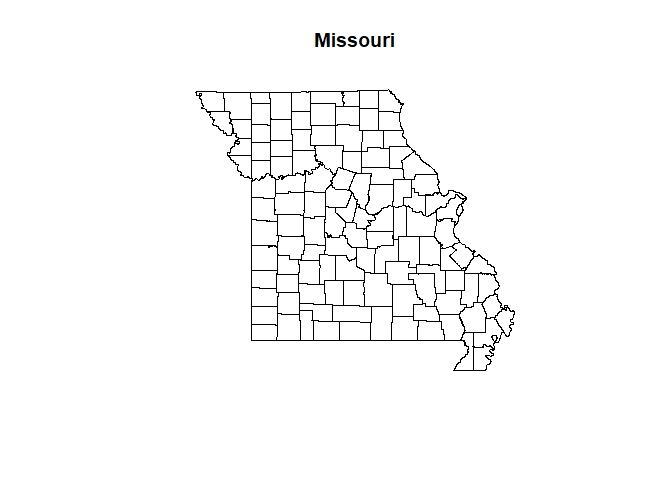
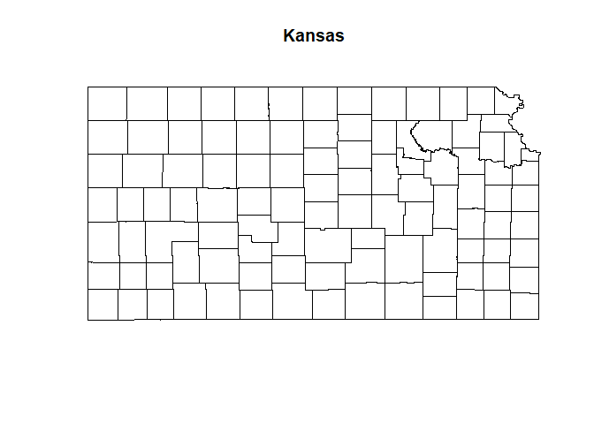
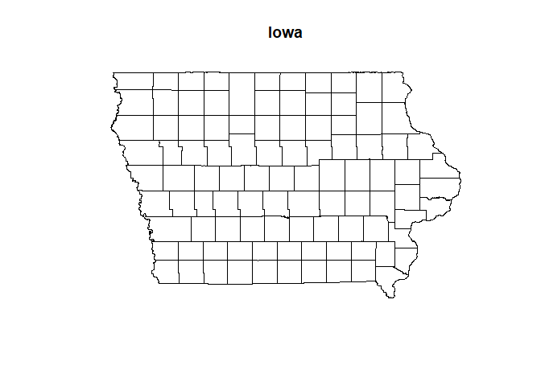
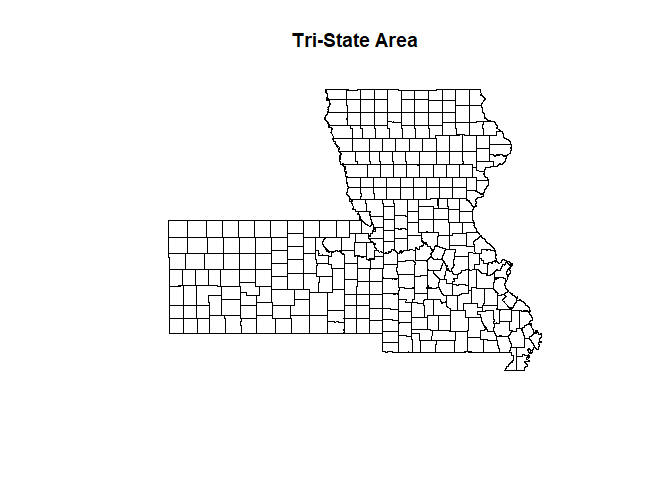
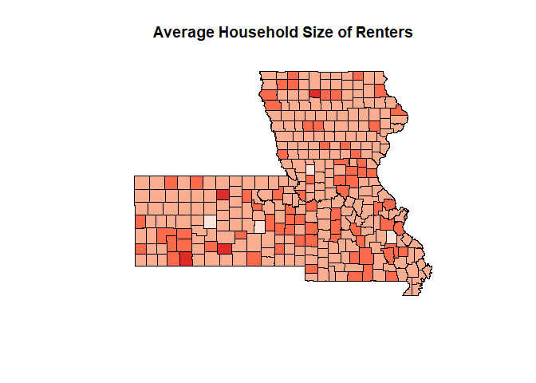
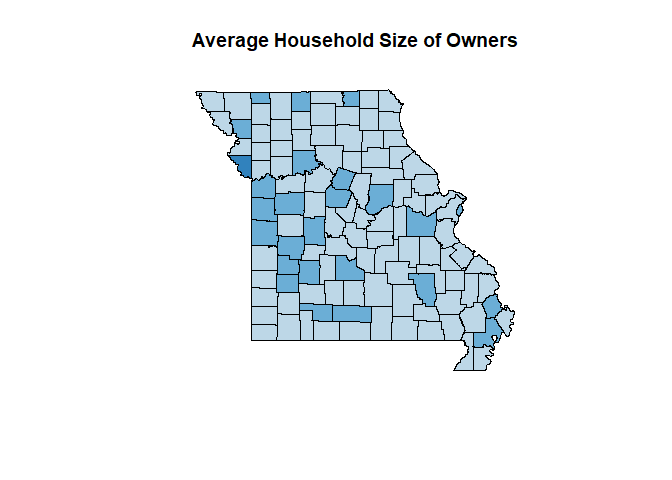
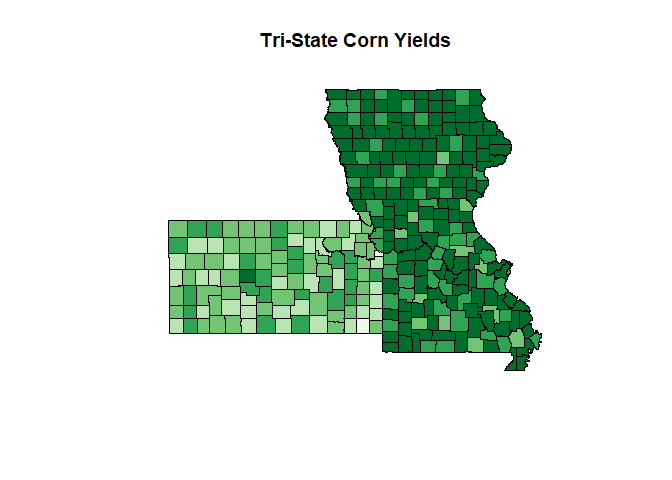

#### A noticeable pattern in the choropleth map titled Average Household Size of Renters is that renter household size typically tends to be larger in Missouri and Kansas and smaller in Iowa. Another pattern within Average Household Size of Renters is that renter household size in northern and southern Missouri are greater than anywhere else in the state. In the map Average Household Size of Owners the state of Missouri choropleth reveals that there is a larger population of home owners with large household sizes on the east side of the state. 


```r
knitr::opts_chunk$set(echo = TRUE)
#Set working directory manually
setwd('E:/Rockhurst University/WS19/A Term/BIA 6313 Spatial and GIS Analytics/Homework 1/County_2010Census_DP1/')
library(rgdal)
library(GISTools)
#Load in the layer files
county <- readOGR(".","County_2010Census_DP1")
```

```
## OGR data source with driver: ESRI Shapefile 
## Source: "E:\Rockhurst University\WS19\A Term\BIA 6313 Spatial and GIS Analytics\Homework 1\County_2010Census_DP1", layer: "County_2010Census_DP1"
## with 3221 features
## It has 195 fields
```

```r
#Shapefile of the United States
plot(county, main="US Map")
```

![]https://github.com/apierson3/GIS-and-Spatial-Analysis/blob/master/Working_with_Geospatial_Data_and_Shapefiles_files/figure-html/Part%20A%20Task%201-1.png<!-- -->

```r
#Print out headers for data attached to the shapefile
head(county@data)
```

```
##   GEOID10                 NAMELSAD10 FUNCSTAT10     ALAND10    AWATER10
## 0   02013     Aleutians East Borough          A 18083148800 20792209033
## 1   02016 Aleutians West Census Area          S 11370762625 25190643524
## 2   28107              Panola County          A  1774515519    51767046
## 3   28101              Newton County          A  1497282694     3879399
## 4   28027             Coahoma County          A  1430818231    79539470
## 5   22065             Madison Parish          A  1617283455    68538668
##    INTPTLAT10   INTPTLON10 DP0010001 DP0010002 DP0010003 DP0010004
## 0 +55.2437223 -161.9507485      3141       123       105        88
## 1 +51.9594469 +178.3388130      5561       205       227       226
## 2 +34.3652052 -089.9630654     34707      2552      2485      2626
## 3 +32.4019702 -089.1184115     21720      1528      1609      1510
## 4 +34.2286699 -090.6031650     26151      2115      2015      2156
## 5 +32.3658243 -091.2407290     12093       808       838       820
##   DP0010005 DP0010006 DP0010007 DP0010008 DP0010009 DP0010010 DP0010011
## 0       104       249       301       213       242       355       431
## 1       249       334       517       455       477       660       627
## 2      2733      2200      2094      2062      2168      2163      2558
## 3      1867      1275      1218      1282      1400      1368      1397
## 4      2327      1905      1651      1493      1473      1454      1705
## 5       863       850      1021       904       742       720       879
##   DP0010012 DP0010013 DP0010014 DP0010015 DP0010016 DP0010017 DP0010018
## 0       340       264       171        75        33        25        15
## 1       605       458       328       110        47        17        14
## 2      2531      2203      1921      1419      1139       803       564
## 3      1475      1315      1243       958       754       612       486
## 4      1785      1582      1304       955       761       617       428
## 5       844       775       595       457       307       262       227
##   DP0010019 DP0010020 DP0010021 DP0010022 DP0010023 DP0010024 DP0010025
## 0         7      2093        68        55        40        63       187
## 1         5      3723       106       113       129       149       233
## 2       486     16683      1333      1263      1353      1398      1067
## 3       423     10412       742       820       808       948       627
## 4       425     12003      1084       989      1094      1134       957
## 5       181      5986       381       435       422       440       475
##   DP0010026 DP0010027 DP0010028 DP0010029 DP0010030 DP0010031 DP0010032
## 0       208       144       182       251       299       223       174
## 1       375       319       344       464       432       420       299
## 2       987       941      1047       998      1228      1251      1048
## 3       538       615       665       672       706       688       623
## 4       708       612       653       633       752       783       746
## 5       546       514       359       318       445       390       380
##   DP0010033 DP0010034 DP0010035 DP0010036 DP0010037 DP0010038 DP0010039
## 0       104        46        18        14        12         5      1048
## 1       222        70        34         8         6         0      1838
## 2       917       635       523       338       220       136     18024
## 3       593       459       333       262       188       125     11308
## 4       636       395       307       247       138       135     14148
## 5       267       219       142       110        80        63      6107
##   DP0010040 DP0010041 DP0010042 DP0010043 DP0010044 DP0010045 DP0010046
## 0        55        50        48        41        62        93        69
## 1        99       114        97       100       101       142       136
## 2      1219      1222      1273      1335      1133      1107      1121
## 3       786       789       702       919       648       680       667
## 4      1031      1026      1062      1193       948       943       881
## 5       427       403       398       423       375       475       390
##   DP0010047 DP0010048 DP0010049 DP0010050 DP0010051 DP0010052 DP0010053
## 0        60       104       132       117        90        67        29
## 1       133       196       195       185       159       106        40
## 2      1121      1165      1330      1280      1155      1004       784
## 3       735       696       691       787       692       650       499
## 4       820       821       953      1002       836       668       560
## 5       383       402       434       454       395       328       238
##   DP0010054 DP0010055 DP0010056 DP0010057 DP0020001 DP0020002 DP0020003
## 0        15        11         3         2      42.1      42.1      42.3
## 1        13         9         8         5      40.7      41.1      39.9
## 2       616       465       344       350      36.5      35.0      37.9
## 3       421       350       298       298      37.1      35.7      38.3
## 4       454       370       290       290      32.8      30.3      34.9
## 5       165       152       147       118      34.6      32.5      37.1
##   DP0030001 DP0030002 DP0030003 DP0040001 DP0040002 DP0040003 DP0050001
## 0      2811      1922       889      2770      1898       872      2684
## 1      4853      3350      1503      4746      3294      1452      4600
## 2     26512     12464     14048     25363     11858     13505     23849
## 3     16739      7859      8880     16067      7518      8549     14821
## 4     19438      8620     10818     18487      8159     10328     17077
## 5      9463      4659      4804      9071      4465      4606      8587
##   DP0050002 DP0050003 DP0060001 DP0060002 DP0060003 DP0070001 DP0070002
## 0      1844       840       247       149        98       155        95
## 1      3190      1410       366       235       131       193       118
## 2     11095     12754      5526      2401      3125      4411      1852
## 3      6914      7907      3926      1704      2222      3233      1367
## 4      7454      9623      3907      1576      2331      3186      1222
## 5      4200      4387      1765       774       991      1434       614
##   DP0070003 DP0080001 DP0080002 DP0080003 DP0080004 DP0080005 DP0080006
## 0        60      3141      2988       660       219       876      1130
## 1        75      5561      5250      2004       332       857      1606
## 2      2559     34707     34402     17161     16875        76        68
## 3      1866     21720     21531     13734      6567      1092        52
## 4      1964     26151     26019      5989     19752        23       123
## 5       820     12093     11982      4498      7381        24        27
##   DP0080007 DP0080008 DP0080009 DP0080010 DP0080011 DP0080012 DP0080013
## 0         4         3      1041        15         2        28        37
## 1         9         8      1395        26        17       123        28
## 2        15        21         7         2         7         3        13
## 3         5        12        18         1         5        11         0
## 4        21        65        15         0         2         7        13
## 5         1         7         3         0         2        11         3
##   DP0080014 DP0080015 DP0080016 DP0080017 DP0080018 DP0080019 DP0080020
## 0        19         3         0         5        11        84       153
## 1       103        10         1        70        22       348       311
## 2         0         0         0         0         0       222       305
## 3         0         0         0         0         0        86       189
## 4         4         2         0         2         0       128       132
## 5         0         0         0         0         0        52       111
##   DP0080021 DP0080022 DP0080023 DP0080024 DP0090001 DP0090002 DP0090003
## 0        59        19         1        25       780       235       964
## 1        90        58         5        27      2221       362      1000
## 2        79        28        98        16     17403     17048       211
## 3        59        14        66        14     13895      6660      1181
## 4         4        10        39        12      6065     19851        54
## 5        29         6        29         3      4576      7452        84
##   DP0090004 DP0090005 DP0090006 DP0100001 DP0100002 DP0100003 DP0100004
## 0      1179        28       125      3141       385       305         6
## 1      1743       148       425      5561       726       605         8
## 2       109        15       244     34707       494       378        10
## 3        72         3       105     21720       287       196        18
## 4       160        15       157     26151       293       165        36
## 5        41         2        62     12093       188       118        10
##   DP0100005 DP0100006 DP0100007 DP0110001 DP0110002 DP0110003 DP0110004
## 0        10        64      2756      3141       385       235         7
## 1         8       105      4835      5561       726       259        14
## 2        13        93     34213     34707       494       180        74
## 3         8        65     21433     21720       287       135        31
## 4         9        83     25858     26151       293        71        54
## 5         8        52     11905     12093       188       102        24
##   DP0110005 DP0110006 DP0110007 DP0110008 DP0110009 DP0110010 DP0110011
## 0         7        17         0        83        36      2756       425
## 1        16        31         1       343        62      4835      1745
## 2         6         7         0       208        19     34213     16981
## 3        20         1         0        77        23     21433     13599
## 4         3         9         0       121        35     25858      5918
## 5         1         1         0        44        16     11905      4396
##   DP0110012 DP0110013 DP0110014 DP0110015 DP0110016 DP0110017 DP0120001
## 0       212       869      1113        19         1       117      3141
## 1       318       841      1575       102         5       249      5561
## 2     16801        70        61         0        14       286     34707
## 3      6536      1072        51         0         9       166     21720
## 4     19698        20       114         4         7        97     26151
## 5      7357        23        26         0         8        95     12093
##   DP0120002 DP0120003 DP0120004 DP0120005 DP0120006 DP0120007 DP0120008
## 0      1415       553       235       440       335        66        26
## 1      3018      1212       508       887       729       156        64
## 2     34392     12839      5592     10790      7036      3765      2135
## 3     21120      8214      4017      6580      4761      1560       813
## 4     25484      9461      3004      8740      5812      3117      1718
## 5     10502      4025      1500      3378      2336      1132       644
##   DP0120009 DP0120010 DP0120011 DP0120012 DP0120013 DP0120014 DP0120015
## 0         5       121         7         2        68      1726         0
## 1         6       255        12         3       109      2543         4
## 2       262      1406       142        57       774       315       139
## 3       146       749        77        50       404       600       159
## 4       197      1162        94        58       651       667       256
## 5        59       467        41        29       296      1591      1544
##   DP0120016 DP0120017 DP0120018 DP0120019 DP0120020 DP0130001 DP0130002
## 0         0         0      1726      1319       407       553       363
## 1         1         3      2539      2047       492      1212       711
## 2        97        42       176        66       110     12839      9086
## 3        79        80       441       219       222      8214      5802
## 4       147       109       411       248       163      9461      6393
## 5       995       549        47        32        15      4025      2778
##   DP0130003 DP0130004 DP0130005 DP0130006 DP0130007 DP0130008 DP0130009
## 0       198       235       114        54        36        74        48
## 1       408       508       277        87        56       116        75
## 2      3706      5592      1984       768       327      2726      1395
## 3      2500      4017      1557       417       191      1368       752
## 4      2882      3004      1079       531       223      2858      1580
## 5      1208      1500       523       217        89      1061       596
##   DP0130010 DP0130011 DP0130012 DP0130013 DP0130014 DP0130015 DP0140001
## 0       190       147       109        20        38        13       214
## 1       501       393       288        14       105        22       437
## 2      3753      3306      1548       366      1758       895      4719
## 3      2412      2156       942       264      1214       684      2934
## 4      3068      2691      1166       286      1525       749      3661
## 5      1247      1099       508       138       591       289      1534
##   DP0150001 DP0160001 DP0170001 DP0180001 DP0180002 DP0180003 DP0180004
## 0        90      2.56      3.04       747       553       194        45
## 1        95      2.49      3.18      1929      1212       717        85
## 2      3370      2.68      3.22     14697     12839      1858       384
## 3      2369      2.57      3.10      9373      8214      1159       205
## 4      2439      2.69      3.32     10792      9461      1331       488
## 5      1047      2.61      3.16      4804      4025       779       177
##   DP0180005 DP0180006 DP0180007 DP0180008 DP0180009 DP0190001 DP0200001
## 0         1         0         5       111        32       0.0      14.3
## 1        34        45       187        92       274       7.2       9.0
## 2         9       173        51       488       753       1.8      10.2
## 3        18        89        29       121       697       1.4      10.3
## 4        20       112        35       280       396       2.1      10.3
## 5         6        22        10       232       332       0.9      10.2
##   DP0210001 DP0210002 DP0210003 DP0220001 DP0220002 DP0230001 DP0230002
## 0       553       285       268       744       671      2.61      2.50
## 1      1212       391       821      1091      1927      2.79      2.35
## 2     12839      9472      3367     25169      9223      2.66      2.74
## 3      8214      6442      1772     16647      4473      2.58      2.52
## 4      9461      5253      4208     14205     11279      2.70      2.68
## 5      4025      2471      1554      6180      4322      2.50      2.78
##   Shape_Leng Shape_Area
## 0  31.272921  5.4877261
## 1  53.175472  4.8588727
## 2   1.733565  0.1789733
## 3   1.523373  0.1438871
## 4   2.517210  0.1477802
## 5   3.064951  0.1615239
```

```r
#Delimit firsdt two digits of column to represent state code
county@data$STATE <- substr(county@data$GEOID10,1,2)
#Print out headers for data attached to the shapefile
head(county@data)
```

```
##   GEOID10                 NAMELSAD10 FUNCSTAT10     ALAND10    AWATER10
## 0   02013     Aleutians East Borough          A 18083148800 20792209033
## 1   02016 Aleutians West Census Area          S 11370762625 25190643524
## 2   28107              Panola County          A  1774515519    51767046
## 3   28101              Newton County          A  1497282694     3879399
## 4   28027             Coahoma County          A  1430818231    79539470
## 5   22065             Madison Parish          A  1617283455    68538668
##    INTPTLAT10   INTPTLON10 DP0010001 DP0010002 DP0010003 DP0010004
## 0 +55.2437223 -161.9507485      3141       123       105        88
## 1 +51.9594469 +178.3388130      5561       205       227       226
## 2 +34.3652052 -089.9630654     34707      2552      2485      2626
## 3 +32.4019702 -089.1184115     21720      1528      1609      1510
## 4 +34.2286699 -090.6031650     26151      2115      2015      2156
## 5 +32.3658243 -091.2407290     12093       808       838       820
##   DP0010005 DP0010006 DP0010007 DP0010008 DP0010009 DP0010010 DP0010011
## 0       104       249       301       213       242       355       431
## 1       249       334       517       455       477       660       627
## 2      2733      2200      2094      2062      2168      2163      2558
## 3      1867      1275      1218      1282      1400      1368      1397
## 4      2327      1905      1651      1493      1473      1454      1705
## 5       863       850      1021       904       742       720       879
##   DP0010012 DP0010013 DP0010014 DP0010015 DP0010016 DP0010017 DP0010018
## 0       340       264       171        75        33        25        15
## 1       605       458       328       110        47        17        14
## 2      2531      2203      1921      1419      1139       803       564
## 3      1475      1315      1243       958       754       612       486
## 4      1785      1582      1304       955       761       617       428
## 5       844       775       595       457       307       262       227
##   DP0010019 DP0010020 DP0010021 DP0010022 DP0010023 DP0010024 DP0010025
## 0         7      2093        68        55        40        63       187
## 1         5      3723       106       113       129       149       233
## 2       486     16683      1333      1263      1353      1398      1067
## 3       423     10412       742       820       808       948       627
## 4       425     12003      1084       989      1094      1134       957
## 5       181      5986       381       435       422       440       475
##   DP0010026 DP0010027 DP0010028 DP0010029 DP0010030 DP0010031 DP0010032
## 0       208       144       182       251       299       223       174
## 1       375       319       344       464       432       420       299
## 2       987       941      1047       998      1228      1251      1048
## 3       538       615       665       672       706       688       623
## 4       708       612       653       633       752       783       746
## 5       546       514       359       318       445       390       380
##   DP0010033 DP0010034 DP0010035 DP0010036 DP0010037 DP0010038 DP0010039
## 0       104        46        18        14        12         5      1048
## 1       222        70        34         8         6         0      1838
## 2       917       635       523       338       220       136     18024
## 3       593       459       333       262       188       125     11308
## 4       636       395       307       247       138       135     14148
## 5       267       219       142       110        80        63      6107
##   DP0010040 DP0010041 DP0010042 DP0010043 DP0010044 DP0010045 DP0010046
## 0        55        50        48        41        62        93        69
## 1        99       114        97       100       101       142       136
## 2      1219      1222      1273      1335      1133      1107      1121
## 3       786       789       702       919       648       680       667
## 4      1031      1026      1062      1193       948       943       881
## 5       427       403       398       423       375       475       390
##   DP0010047 DP0010048 DP0010049 DP0010050 DP0010051 DP0010052 DP0010053
## 0        60       104       132       117        90        67        29
## 1       133       196       195       185       159       106        40
## 2      1121      1165      1330      1280      1155      1004       784
## 3       735       696       691       787       692       650       499
## 4       820       821       953      1002       836       668       560
## 5       383       402       434       454       395       328       238
##   DP0010054 DP0010055 DP0010056 DP0010057 DP0020001 DP0020002 DP0020003
## 0        15        11         3         2      42.1      42.1      42.3
## 1        13         9         8         5      40.7      41.1      39.9
## 2       616       465       344       350      36.5      35.0      37.9
## 3       421       350       298       298      37.1      35.7      38.3
## 4       454       370       290       290      32.8      30.3      34.9
## 5       165       152       147       118      34.6      32.5      37.1
##   DP0030001 DP0030002 DP0030003 DP0040001 DP0040002 DP0040003 DP0050001
## 0      2811      1922       889      2770      1898       872      2684
## 1      4853      3350      1503      4746      3294      1452      4600
## 2     26512     12464     14048     25363     11858     13505     23849
## 3     16739      7859      8880     16067      7518      8549     14821
## 4     19438      8620     10818     18487      8159     10328     17077
## 5      9463      4659      4804      9071      4465      4606      8587
##   DP0050002 DP0050003 DP0060001 DP0060002 DP0060003 DP0070001 DP0070002
## 0      1844       840       247       149        98       155        95
## 1      3190      1410       366       235       131       193       118
## 2     11095     12754      5526      2401      3125      4411      1852
## 3      6914      7907      3926      1704      2222      3233      1367
## 4      7454      9623      3907      1576      2331      3186      1222
## 5      4200      4387      1765       774       991      1434       614
##   DP0070003 DP0080001 DP0080002 DP0080003 DP0080004 DP0080005 DP0080006
## 0        60      3141      2988       660       219       876      1130
## 1        75      5561      5250      2004       332       857      1606
## 2      2559     34707     34402     17161     16875        76        68
## 3      1866     21720     21531     13734      6567      1092        52
## 4      1964     26151     26019      5989     19752        23       123
## 5       820     12093     11982      4498      7381        24        27
##   DP0080007 DP0080008 DP0080009 DP0080010 DP0080011 DP0080012 DP0080013
## 0         4         3      1041        15         2        28        37
## 1         9         8      1395        26        17       123        28
## 2        15        21         7         2         7         3        13
## 3         5        12        18         1         5        11         0
## 4        21        65        15         0         2         7        13
## 5         1         7         3         0         2        11         3
##   DP0080014 DP0080015 DP0080016 DP0080017 DP0080018 DP0080019 DP0080020
## 0        19         3         0         5        11        84       153
## 1       103        10         1        70        22       348       311
## 2         0         0         0         0         0       222       305
## 3         0         0         0         0         0        86       189
## 4         4         2         0         2         0       128       132
## 5         0         0         0         0         0        52       111
##   DP0080021 DP0080022 DP0080023 DP0080024 DP0090001 DP0090002 DP0090003
## 0        59        19         1        25       780       235       964
## 1        90        58         5        27      2221       362      1000
## 2        79        28        98        16     17403     17048       211
## 3        59        14        66        14     13895      6660      1181
## 4         4        10        39        12      6065     19851        54
## 5        29         6        29         3      4576      7452        84
##   DP0090004 DP0090005 DP0090006 DP0100001 DP0100002 DP0100003 DP0100004
## 0      1179        28       125      3141       385       305         6
## 1      1743       148       425      5561       726       605         8
## 2       109        15       244     34707       494       378        10
## 3        72         3       105     21720       287       196        18
## 4       160        15       157     26151       293       165        36
## 5        41         2        62     12093       188       118        10
##   DP0100005 DP0100006 DP0100007 DP0110001 DP0110002 DP0110003 DP0110004
## 0        10        64      2756      3141       385       235         7
## 1         8       105      4835      5561       726       259        14
## 2        13        93     34213     34707       494       180        74
## 3         8        65     21433     21720       287       135        31
## 4         9        83     25858     26151       293        71        54
## 5         8        52     11905     12093       188       102        24
##   DP0110005 DP0110006 DP0110007 DP0110008 DP0110009 DP0110010 DP0110011
## 0         7        17         0        83        36      2756       425
## 1        16        31         1       343        62      4835      1745
## 2         6         7         0       208        19     34213     16981
## 3        20         1         0        77        23     21433     13599
## 4         3         9         0       121        35     25858      5918
## 5         1         1         0        44        16     11905      4396
##   DP0110012 DP0110013 DP0110014 DP0110015 DP0110016 DP0110017 DP0120001
## 0       212       869      1113        19         1       117      3141
## 1       318       841      1575       102         5       249      5561
## 2     16801        70        61         0        14       286     34707
## 3      6536      1072        51         0         9       166     21720
## 4     19698        20       114         4         7        97     26151
## 5      7357        23        26         0         8        95     12093
##   DP0120002 DP0120003 DP0120004 DP0120005 DP0120006 DP0120007 DP0120008
## 0      1415       553       235       440       335        66        26
## 1      3018      1212       508       887       729       156        64
## 2     34392     12839      5592     10790      7036      3765      2135
## 3     21120      8214      4017      6580      4761      1560       813
## 4     25484      9461      3004      8740      5812      3117      1718
## 5     10502      4025      1500      3378      2336      1132       644
##   DP0120009 DP0120010 DP0120011 DP0120012 DP0120013 DP0120014 DP0120015
## 0         5       121         7         2        68      1726         0
## 1         6       255        12         3       109      2543         4
## 2       262      1406       142        57       774       315       139
## 3       146       749        77        50       404       600       159
## 4       197      1162        94        58       651       667       256
## 5        59       467        41        29       296      1591      1544
##   DP0120016 DP0120017 DP0120018 DP0120019 DP0120020 DP0130001 DP0130002
## 0         0         0      1726      1319       407       553       363
## 1         1         3      2539      2047       492      1212       711
## 2        97        42       176        66       110     12839      9086
## 3        79        80       441       219       222      8214      5802
## 4       147       109       411       248       163      9461      6393
## 5       995       549        47        32        15      4025      2778
##   DP0130003 DP0130004 DP0130005 DP0130006 DP0130007 DP0130008 DP0130009
## 0       198       235       114        54        36        74        48
## 1       408       508       277        87        56       116        75
## 2      3706      5592      1984       768       327      2726      1395
## 3      2500      4017      1557       417       191      1368       752
## 4      2882      3004      1079       531       223      2858      1580
## 5      1208      1500       523       217        89      1061       596
##   DP0130010 DP0130011 DP0130012 DP0130013 DP0130014 DP0130015 DP0140001
## 0       190       147       109        20        38        13       214
## 1       501       393       288        14       105        22       437
## 2      3753      3306      1548       366      1758       895      4719
## 3      2412      2156       942       264      1214       684      2934
## 4      3068      2691      1166       286      1525       749      3661
## 5      1247      1099       508       138       591       289      1534
##   DP0150001 DP0160001 DP0170001 DP0180001 DP0180002 DP0180003 DP0180004
## 0        90      2.56      3.04       747       553       194        45
## 1        95      2.49      3.18      1929      1212       717        85
## 2      3370      2.68      3.22     14697     12839      1858       384
## 3      2369      2.57      3.10      9373      8214      1159       205
## 4      2439      2.69      3.32     10792      9461      1331       488
## 5      1047      2.61      3.16      4804      4025       779       177
##   DP0180005 DP0180006 DP0180007 DP0180008 DP0180009 DP0190001 DP0200001
## 0         1         0         5       111        32       0.0      14.3
## 1        34        45       187        92       274       7.2       9.0
## 2         9       173        51       488       753       1.8      10.2
## 3        18        89        29       121       697       1.4      10.3
## 4        20       112        35       280       396       2.1      10.3
## 5         6        22        10       232       332       0.9      10.2
##   DP0210001 DP0210002 DP0210003 DP0220001 DP0220002 DP0230001 DP0230002
## 0       553       285       268       744       671      2.61      2.50
## 1      1212       391       821      1091      1927      2.79      2.35
## 2     12839      9472      3367     25169      9223      2.66      2.74
## 3      8214      6442      1772     16647      4473      2.58      2.52
## 4      9461      5253      4208     14205     11279      2.70      2.68
## 5      4025      2471      1554      6180      4322      2.50      2.78
##   Shape_Leng Shape_Area STATE
## 0  31.272921  5.4877261    02
## 1  53.175472  4.8588727    02
## 2   1.733565  0.1789733    28
## 3   1.523373  0.1438871    28
## 4   2.517210  0.1477802    28
## 5   3.064951  0.1615239    22
```

```r
#Define the polygon associated with only missouri which is state 29
mo <- county[county@data$STATE==29,]
#Print out headers for data attached to the shapefile
head(mo@data)
```

```
##    GEOID10       NAMELSAD10 FUNCSTAT10    ALAND10 AWATER10  INTPTLAT10
## 72   29099 Jefferson County          A 1700660922 19828021 +38.2574144
## 73   29079    Grundy County          A 1127360747  7123002 +40.1125409
## 74   29510   St. Louis city          F  160343174 10683076 +38.6356988
## 75   29093      Iron County          A 1425165244  4675092 +37.6259598
## 76   29185 St. Clair County          A 1735247885 83056509 +38.0390688
## 77   29037      Cass County          A 1804797172 14638089 +38.6471588
##      INTPTLON10 DP0010001 DP0010002 DP0010003 DP0010004 DP0010005
## 72 -090.5431382    218733     14971     15086     15450     15192
## 73 -093.5650538     10261       714       689       674       717
## 74 -090.2445816    319294     21089     17379     16911     22551
## 75 -090.6996270     10630       614       644       695       715
## 76 -093.7730765      9805       488       518       590       590
## 77 -094.3542424     99478      6756      7370      7728      6979
##    DP0010006 DP0010007 DP0010008 DP0010009 DP0010010 DP0010011 DP0010012
## 72     12457     14017     14384     14755     15414     18515     17497
## 73       624       540       476       506       560       693       722
## 74     28852     31991     25670     20813     19431     21641     23170
## 75       560       538       592       620       651       771       844
## 76       415       415       404       507       556       736       789
## 77      5141      5726      6375      6465      6794      7661      7595
##    DP0010013 DP0010014 DP0010015 DP0010016 DP0010017 DP0010018 DP0010019
## 72     14664     11937      8816      6011      4351      2879      2337
## 73       624       622       585       504       368       305       338
## 74     19877     14744     10045      7644      6646      5462      5378
## 75       773       714       644       468       354       225       208
## 76       737       765       715       595       410       267       308
## 77      6152      5246      4275      3193      2556      1834      1632
##    DP0010020 DP0010021 DP0010022 DP0010023 DP0010024 DP0010025 DP0010026
## 72    108846      7700      7756      7914      7873      6374      6964
## 73      4895       373       310       312       359       328       272
## 74    154171     10779      8851      8521     11347     13596     15386
## 75      5250       297       346       343       360       309       272
## 76      4947       251       266       313       307       223       222
## 77     48595      3498      3684      3941      3596      2622      2777
##    DP0010027 DP0010028 DP0010029 DP0010030 DP0010031 DP0010032 DP0010033
## 72      7260      7309      7643      9216      8825      7208      5875
## 73       224       244       281       345       362       308       307
## 74     12772     10428      9878     11021     11430      9707      6962
## 75       290       321       330       390       418       367       365
## 76       195       269       272       402       398       384       364
## 77      3075      3194      3327      3790      3735      2954      2477
##    DP0010034 DP0010035 DP0010036 DP0010037 DP0010038 DP0010039 DP0010040
## 72      4233      2809      1934      1178       775    109887      7271
## 73       262       239       158       115        96      5366       341
## 74      4523      3139      2459      1850      1522    165123     10310
## 75       301       211       179        92        59      5380       317
## 76       360       305       197       123        96      4858       237
## 77      1976      1497      1138       774       540     50883      3258
##    DP0010041 DP0010042 DP0010043 DP0010044 DP0010045 DP0010046 DP0010047
## 72      7330      7536      7319      6083      7053      7124      7446
## 73       379       362       358       296       268       252       262
## 74      8528      8390     11204     15256     16605     12898     10385
## 75       298       352       355       251       266       302       299
## 76       252       277       283       192       193       209       238
## 77      3686      3787      3383      2519      2949      3300      3271
##    DP0010048 DP0010049 DP0010050 DP0010051 DP0010052 DP0010053 DP0010054
## 72      7771      9299      8672      7456      6062      4583      3202
## 73       279       348       360       316       315       323       265
## 74      9553     10620     11740     10170      7782      5522      4505
## 75       321       381       426       406       349       343       257
## 76       284       334       391       353       401       355       290
## 77      3467      3871      3860      3198      2769      2299      1696
##    DP0010055 DP0010056 DP0010057 DP0020001 DP0020002 DP0020003 DP0030001
## 72      2417      1701      1562      37.8      36.9      38.7    170082
## 73       210       190       242      41.6      40.4      42.8      8054
## 74      4187      3612      3856      33.9      33.1      34.7    260218
## 75       175       133       149      42.7      41.3      43.9      8543
## 76       213       144       212      48.1      47.3      49.1      8108
## 77      1418      1060      1092      37.9      36.8      39.0     76082
##    DP0030002 DP0030003 DP0040001 DP0040002 DP0040003 DP0050001 DP0050002
## 72     83834     86248    163745     80524     83221    155453     76277
## 73      3840      4214      7794      3714      4080      7318      3463
## 74    124156    136062    251755    119837    131918    235841    112002
## 75      4183      4360      8227      4023      4204      7842      3828
## 76      4080      4028      7845      3952      3893      7536      3757
## 77     36655     39427     73093     35178     37915     69618     33340
##    DP0050003 DP0060001 DP0060002 DP0060003 DP0070001 DP0070002 DP0070003
## 72     79176     31233     14239     16994     24394     10929     13465
## 73      3855      2449      1029      1420      2100       870      1230
## 74    123839     43391     17377     26014     35175     13493     21682
## 75      4014      2314      1057      1257      1899       842      1057
## 76      3779      2727      1276      1451      2295      1081      1214
## 77     36278     16583      7374      9209     13490      5925      7565
##    DP0080001 DP0080002 DP0080003 DP0080004 DP0080005 DP0080006 DP0080007
## 72    218733    215784    211007      1798       677      1417       132
## 73     10261     10156      9947        59        43        37         7
## 74    319294    311732    140267    157160       838      9291      1613
## 75     10630     10474     10250       138        51        11         2
## 76      9805      9629      9464        53        68        12         1
## 77     99478     97441     91261      3517       544       641       109
##    DP0080008 DP0080009 DP0080010 DP0080011 DP0080012 DP0080013 DP0080014
## 72       273       390        46       113       257       206        49
## 73         7        16         1         0         1         5         3
## 74      1931       562       212       515      2835      1623        74
## 75         0         3         1         2         0         3         0
## 76         1         7         0         1         0         2         1
## 77       120       123        45        84        55       105        68
##    DP0080015 DP0080016 DP0080017 DP0080018 DP0080019 DP0080020 DP0080021
## 72        27         9         2        11       836      2949      1056
## 73         2         1         0         0        67       105        58
## 74        31        11        10        22      4102      7562       819
## 75         0         0         0         0        24       156        92
## 76         0         1         0         0        31       176       102
## 77        13        24        21        10      1410      2037       680
##    DP0080022 DP0080023 DP0080024 DP0090001 DP0090002 DP0090003 DP0090004
## 72       548       865       219    213865      2768      1858      2099
## 73        10        14        12     10048        74       106        55
## 74      1257      2576       460    146158    161796      3081     11185
## 75        12        27        12     10404       169       147        24
## 76        13        24        24      9633        82       176        30
## 77       321       545       242     93182      4194      1321      1061
##    DP0090005 DP0090006 DP0100001 DP0100002 DP0100003 DP0100004 DP0100005
## 72       145      1105    218733      3408      2274       276        63
## 73         5        86     10261       178       147         6         0
## 74       362      5103    319294     11130      7163       700       474
## 75         9        36     10630       133        70        38         4
## 76         7        59      9805       170       122         9         1
## 77       147      1712     99478      3988      2972       228        53
##    DP0100006 DP0100007 DP0110001 DP0110002 DP0110003 DP0110004 DP0110005
## 72       795    215325    218733      3408      2265        22        69
## 73        25     10083     10261       178        93         1         5
## 74      2793    308164    319294     11130      5565       771       154
## 75        21     10497     10630       133        88         7         0
## 76        38      9635      9805       170        98         6        10
## 77       735     95490     99478      3988      2182        73        40
##    DP0110006 DP0110007 DP0110008 DP0110009 DP0110010 DP0110011 DP0110012
## 72        14         1       716       321    215325    208742      1776
## 73         1         1        61        16     10083      9854        58
## 74        58        12      3624       946    308164    134702    156389
## 75         0         0        22        16     10497     10162       131
## 76         0         0        30        26      9635      9366        47
## 77        18         6      1344       325     95490     89079      3444
##    DP0110013 DP0110014 DP0110015 DP0110016 DP0110017 DP0120001 DP0120002
## 72       608      1403        48       120      2628    218733    216750
## 73        38        36         2         6        89     10261      9911
## 74       684      9233        62       478      6616    319294    307316
## 75        51        11         0         2       140     10630     10354
## 76        58        12         1         1       150      9805      9598
## 77       504       623        62        66      1712     99478     98434
##    DP0120003 DP0120004 DP0120005 DP0120006 DP0120007 DP0120008 DP0120009
## 72     81700     46193     66944     48869     10600      4704      1488
## 73      4204      2146      2736      2211       345       174        37
## 74    142057     32966     81820     55348     25258     10487      2127
## 75      4378      2187      2739      2068       520       239        69
## 76      4161      2217      2267      1670       518       243        68
## 77     37150     21777     30760     23903      4458      1892       662
##    DP0120010 DP0120011 DP0120012 DP0120013 DP0120014 DP0120015 DP0120016
## 72     11313      1346       389      6313      1983      1460       670
## 73       480        74        30       286       350       190        60
## 74     25215      1017       886     12267     11978      4822      3377
## 75       530        66        32       289       276       248       127
## 76       435        46        42       247       207       207       122
## 77      4289       558       170      2226      1044       831       302
##    DP0120017 DP0120018 DP0120019 DP0120020 DP0130001 DP0130002 DP0130003
## 72       790       523       287       236     81700     60031     26958
## 73       130       160        80        80      4204      2694      1084
## 74      1445      7156      3717      3439    142057     67488     29701
## 75       121        28        17        11      4378      2854      1127
## 76        85         0         0         0      4161      2737       869
## 77       529       213       122        91     37150     27533     12595
##    DP0130004 DP0130005 DP0130006 DP0130007 DP0130008 DP0130009 DP0130010
## 72     46193     19232      4581      2612      9257      5114     21669
## 73      2146       735       183       109       365       240      1510
## 74     32966     11931      7031      2879     27491     14891     74569
## 75      2187       743       208       110       459       274      1524
## 76      2217       624       175        87       345       158      1424
## 77     21777      9064      1753      1048      4003      2483      9617
##    DP0130011 DP0130012 DP0130013 DP0130014 DP0130015 DP0140001 DP0150001
## 72     17093      8357      1699      8736      4047     30149     17397
## 73      1309       529       138       780       508      1189      1435
## 74     60468     29423      4691     31045      9733     35204     28171
## 75      1313       606       167       707       390      1270      1343
## 76      1234       636       241       598       391      1018      1605
## 77      8053      3393       903      4660      2432     13784      9265
##    DP0160001 DP0170001 DP0180001 DP0180002 DP0180003 DP0180004 DP0180005
## 72      2.65      3.06     87626     81700      5926      1422        72
## 73      2.36      2.94      5023      4204       819       128         8
## 74      2.16      3.08    176002    142057     33945     13869       558
## 75      2.37      2.91      5329      4378       951       159        10
## 76      2.31      2.83      5640      4161      1479       110        13
## 77      2.65      3.07     40030     37150      2880       804        47
##    DP0180006 DP0180007 DP0180008 DP0180009 DP0190001 DP0200001 DP0210001
## 72      1385       282       764      2001       2.0       8.7     81700
## 73        68        35       153       427       2.2       9.1      4204
## 74      3233      1041       660     14584       4.7      15.1    142057
## 75        63        32       414       273       1.9      12.0      4378
## 76       111       208       767       270       3.1      11.0      4161
## 77       759       112       185       973       2.6       8.6     37150
##    DP0210002 DP0210003 DP0220001 DP0220002 DP0230001 DP0230002 Shape_Leng
## 72     66836     14864    180656     36094      2.70      2.43  2.0876139
## 73      2930      1274      7174      2737      2.45      2.15  1.4070820
## 74     64425     77632    149155    158161      2.32      2.04  0.6568396
## 75      3220      1158      7872      2482      2.44      2.14  2.2029867
## 76      3281       880      7678      1920      2.34      2.18  1.9093923
## 77     28699      8451     77392     21042      2.70      2.49  2.0371997
##    Shape_Area STATE
## 72 0.17709908    29
## 73 0.11984731    29
## 74 0.01769475    29
## 75 0.14579915    29
## 76 0.18660345    29
## 77 0.18827191    29
```

```r
#Define the polygon associated with only kansas which is state 20
ks <- county[county@data$STATE==20,]
#Define the polygon associated with only iowa which is state 19
ia <- county[county@data$STATE==19,]
#Check the class information of the states
class(mo)
```

```
## [1] "SpatialPolygonsDataFrame"
## attr(,"package")
## [1] "sp"
```

```r
class(ks)
```

```
## [1] "SpatialPolygonsDataFrame"
## attr(,"package")
## [1] "sp"
```

```r
class(ia)
```

```
## [1] "SpatialPolygonsDataFrame"
## attr(,"package")
## [1] "sp"
```

```r
#Plot missouri
plot(mo)
title(main = "Missouri")
```

<!-- -->

```r
#Plot kansas
plot(ks)
title(main = "Kansas")
```

<!-- -->

```r
#Plot iowa
plot(ia)
title(main = "Iowa")
```

<!-- -->

```r
#Combine spatial polygon dataframes 
tri_state <- rbind(ia,ks,mo)
#Plot the tri state spatial polygon
plot(tri_state)
title(main = "Tri-State Area")
```

<!-- -->

```r
#Plot choropleth of household renter size in the tri-state
vacant.shades <- auto.shading(county$DP0230002, cols=brewer.pal(5,"Reds"), cutter=rangeCuts, n=5)
choropleth(tri_state, county$DP0230002, shading=vacant.shades)
choro.legend(533000,161000,vacant.shades)
title(main = "Average Household Size of Renters")
```

<!-- -->

```r
#Plot choropleth of household owner size in the tri state
vacant.shades <- auto.shading(county$DP0230002, cols=brewer.pal(5,"Blues"), cutter=rangeCuts, n=5)
choropleth(mo, county$DP0230002, shading=vacant.shades)
choro.legend(533000,161000,vacant.shades)
title(main = "Average Household Size of Owners")
```

<!-- -->


#### The choropleth map of county corn yields in the tri-state area reveals that Kansas and Missouri both have much higher corn yields than Kansas. 


```r
#Remove all census data attached to the tri-state shapefile 
tri_state_shapefile <- tri_state[,1:2]
#The resulting data frame from the shapefile
head(tri_state_shapefile@data)
```

```
##      GEOID10      NAMELSAD10
## 2474   19127 Marshall County
## 2490   19011   Benton County
## 2491   19041     Clay County
## 2492   19165   Shelby County
## 2493   19043  Clayton County
## 2496   19097  Jackson County
```

```r
#Set working directory manually
setwd('E:/Rockhurst University/WS19/A Term/BIA 6313 Spatial and GIS Analytics/Homework 1/County_2010Census_DP1/')
#Load in the corn csv
corn <- read.csv('corn.csv')
#The head of the corn data fram
head(corn)
```

```
##   GEOID10 CORN_YIELD
## 1   19015      208.4
## 2   19049      204.0
## 3   19075      198.5
## 4   19079      209.0
## 5   19083      208.0
## 6   19099      214.7
```

```r
#Merge the corn csv with the tri_state_shapefile on the GEOID10
tri_state_corn <- merge(corn, tri_state_shapefile)
#Resulting data frame
head(tri_state_corn)
```

```
##   GEOID10 CORN_YIELD       NAMELSAD10
## 1   19001      190.3     Adair County
## 2   19003      187.4     Adams County
## 3   19005      205.1 Allamakee County
## 4   19007      186.3 Appanoose County
## 5   19009      206.1   Audubon County
## 6   19011      199.9    Benton County
```

```r
#Plot choropleth
vacant.shades <- auto.shading(tri_state_corn$CORN_YIELD, cols=brewer.pal(5,"Greens"), cutter=rangeCuts, n=5)
choropleth(tri_state, tri_state_corn$CORN_YIELD, shading=vacant.shades)
choro.legend(533000,161000,vacant.shades)
title(main = "Tri-State Corn Yields")
```

<!-- -->


### Task 3


```r
#Load in leaflet package
library(leaflet)
#Use the leaflet function producing an empty map and add layering using pipes
imap <- leaflet() %>% addTiles() %>% setView(lng = -94.397041, lat = 38.882149, zoom = 9)
#Plot the view of the map
imap
```

<!--html_preserve--><div id="htmlwidget-8a9968e6be4a73311fa0" style="width:672px;height:480px;" class="leaflet html-widget"></div>
<script type="application/json" data-for="htmlwidget-8a9968e6be4a73311fa0">{"x":{"options":{"crs":{"crsClass":"L.CRS.EPSG3857","code":null,"proj4def":null,"projectedBounds":null,"options":{}}},"calls":[{"method":"addTiles","args":["//{s}.tile.openstreetmap.org/{z}/{x}/{y}.png",null,null,{"minZoom":0,"maxZoom":18,"tileSize":256,"subdomains":"abc","errorTileUrl":"","tms":false,"noWrap":false,"zoomOffset":0,"zoomReverse":false,"opacity":1,"zIndex":1,"detectRetina":false,"attribution":"&copy; <a href=\"http://openstreetmap.org\">OpenStreetMap<\/a> contributors, <a href=\"http://creativecommons.org/licenses/by-sa/2.0/\">CC-BY-SA<\/a>"}]}],"setView":[[38.882149,-94.397041],9,[]]},"evals":[],"jsHooks":[]}</script><!--/html_preserve-->

```r
#Overlay raster data with real-time weather to the map
imap %>% addWMSTiles("http://mesonet.agron.iastate.edu/cgi-bin/wms/nexrad/n0r.cgi", layers = "nexrad-n0r-900913", group = "base_reflect", options = WMSTileOptions(format = "image/png", transparent = TRUE), attribution = "Weather data ? 2012 IEM Nexrad")
```

<!--html_preserve--><div id="htmlwidget-dc0566bfe1c7966c4c31" style="width:672px;height:480px;" class="leaflet html-widget"></div>
<script type="application/json" data-for="htmlwidget-dc0566bfe1c7966c4c31">{"x":{"options":{"crs":{"crsClass":"L.CRS.EPSG3857","code":null,"proj4def":null,"projectedBounds":null,"options":{}}},"calls":[{"method":"addTiles","args":["//{s}.tile.openstreetmap.org/{z}/{x}/{y}.png",null,null,{"minZoom":0,"maxZoom":18,"tileSize":256,"subdomains":"abc","errorTileUrl":"","tms":false,"noWrap":false,"zoomOffset":0,"zoomReverse":false,"opacity":1,"zIndex":1,"detectRetina":false,"attribution":"&copy; <a href=\"http://openstreetmap.org\">OpenStreetMap<\/a> contributors, <a href=\"http://creativecommons.org/licenses/by-sa/2.0/\">CC-BY-SA<\/a>"}]},{"method":"addWMSTiles","args":["http://mesonet.agron.iastate.edu/cgi-bin/wms/nexrad/n0r.cgi",null,"base_reflect",{"styles":"","format":"image/png","transparent":true,"version":"1.1.1","attribution":"Weather data ? 2012 IEM Nexrad","layers":"nexrad-n0r-900913"}]}],"setView":[[38.882149,-94.397041],9,[]]},"evals":[],"jsHooks":[]}</script><!--/html_preserve-->


#### In this choropleth map of the overdoses in the United States there are a couple patterns that are noticeable in the New England region and the noth-west region of the United States. These trends show that there were a higher number of total deaths in those areas during May of 2017.


```r
#Load packages
library(tidyr)
library(tidyverse)
#Set the working directory of the file
setwd('E:/Rockhurst University/WS19/A Term/BIA 6313 Spatial and GIS Analytics/Homework 1/')
#Read in the overdose dataset
overdose <- read.csv('VSRR_Provisional_Drug_Overdose_Death_Counts.csv')
#View the head of the data frame
head(overdose)
```

```
##   ï..State State.Name Year    Month        Indicator Data.Value
## 1       AK         AK 2015  January Number of Deaths      4,034
## 2       AK         AK 2015 February Number of Deaths      4,084
## 3       AK         AK 2015    March Number of Deaths      4,101
## 4       NM         NM 2018  January Number of Deaths     18,147
## 5       AK         AK 2015    April Number of Deaths      4,133
## 6       AK         AK 2015      May Number of Deaths      4,196
##   Predicted.Value Percent.Complete Percent.Pending.Investigation
## 1                              100                     0.0000000
## 2                              100                     0.0000000
## 3                              100                     0.0000000
## 4                              100                     0.1708271
## 5                              100                     0.0000000
## 6                              100                     0.0000000
##                                                                           Footnote
## 1 Numbers may differ from published reports using final data. See Technical Notes.
## 2 Numbers may differ from published reports using final data. See Technical Notes.
## 3 Numbers may differ from published reports using final data. See Technical Notes.
## 4                                            Underreported due to incomplete data.
## 5 Numbers may differ from published reports using final data. See Technical Notes.
## 6 Numbers may differ from published reports using final data. See Technical Notes.
```

```r
#See the different categorical variables in the Indicator dimension
levels(overdose$Indicator)
```

```
##  [1] "Cocaine (T40.5)"                                                            
##  [2] "Heroin (T40.1)"                                                             
##  [3] "Methadone (T40.3)"                                                          
##  [4] "Natural & semi-synthetic opioids (T40.2)"                                   
##  [5] "Natural & semi-synthetic opioids, incl. methadone (T40.2, T40.3)"           
##  [6] "Natural, semi-synthetic, & synthetic opioids, incl. methadone (T40.2-T40.4)"
##  [7] "Number of Deaths"                                                           
##  [8] "Number of Drug Overdose Deaths"                                             
##  [9] "Opioids (T40.0-T40.4,T40.6)"                                                
## [10] "Percent with drugs specified"                                               
## [11] "Psychostimulants with abuse potential (T43.6)"                              
## [12] "Synthetic opioids, excl. methadone (T40.4)"
```

```r
#Filter data down to May 2017
overdose <- overdose %>% filter(overdose$Month == 'May' & overdose$Year == '2017' & overdose$State.Name != 'US' & overdose$State.Name != 'DC' & overdose$State.Name != 'YC')
#Check to make sure the extra regions were omitted
levels(overdose$State.Name)
```

```
##  [1] "AK" "AL" "AR" "AZ" "CA" "CO" "CT" "DC" "DE" "FL" "GA" "HI" "IA" "ID"
## [15] "IL" "IN" "KS" "KY" "LA" "MA" "MD" "ME" "MI" "MN" "MO" "MS" "MT" "NC"
## [29] "ND" "NE" "NH" "NJ" "NM" "NV" "NY" "OH" "OK" "OR" "PA" "RI" "SC" "SD"
## [43] "TN" "TX" "US" "UT" "VA" "VT" "WA" "WI" "WV" "WY" "YC"
```

```r
#Use the spread function to get a 'Cocaine (T40.5)' dimension
#overdose <- overdose %>% gather(key = Indicator, value = Data.Value) 
overdose <- overdose %>% mutate(row = row_number()) %>% spread(key = Indicator, value = Data.Value)
#Rename the column to more user friendly names
overdose <- overdose %>% rename("Abbv State" = "ï..State", "State Name" = "State.Name", "Year" = "Year", "Month" = "Month", "Predicted Value" = "Predicted.Value", "Percent Complete" = "Percent.Complete", "Percent Pending Investigation" = "Percent.Pending.Investigation", "Cocaine" = "Cocaine (T40.5)", "Heroin" = "Heroin (T40.1)", "Methadone" = "Methadone (T40.3)", "Natural & Semi-Synthetic Opioids" = "Natural & semi-synthetic opioids (T40.2)", "Number of Deaths" = "Number of Deaths", "Number of Drug Overdose Deaths" = "Number of Drug Overdose Deaths", "Opioids" = "Opioids (T40.0-T40.4,T40.6)", "Percent With Drugs Specified" = "Percent with drugs specified", "Psychostimulants" = "Psychostimulants with abuse potential (T43.6)", "Synthetic Opioids" = "Synthetic opioids, excl. methadone (T40.4)")
#Determine the number of columns to change
colnames(overdose)
```

```
##  [1] "Abbv State"                                                                 
##  [2] "State Name"                                                                 
##  [3] "Year"                                                                       
##  [4] "Month"                                                                      
##  [5] "Predicted Value"                                                            
##  [6] "Percent Complete"                                                           
##  [7] "Percent Pending Investigation"                                              
##  [8] "Footnote"                                                                   
##  [9] "row"                                                                        
## [10] "Cocaine"                                                                    
## [11] "Heroin"                                                                     
## [12] "Methadone"                                                                  
## [13] "Natural & Semi-Synthetic Opioids"                                           
## [14] "Natural & semi-synthetic opioids, incl. methadone (T40.2, T40.3)"           
## [15] "Natural, semi-synthetic, & synthetic opioids, incl. methadone (T40.2-T40.4)"
## [16] "Number of Deaths"                                                           
## [17] "Number of Drug Overdose Deaths"                                             
## [18] "Opioids"                                                                    
## [19] "Percent With Drugs Specified"                                               
## [20] "Psychostimulants"                                                           
## [21] "Synthetic Opioids"
```

```r
#Change columns 9, 10, 11, 12, 17, 18 to numeric format 
overdose[, c(9:18)] <- sapply(overdose[, c(9:18)], as.numeric)
#Replace NA values with 0
overdose[is.na(overdose)] <- 0
#Check the data types of the new columns
sapply(overdose, class)
```

```
##                                                                  Abbv State 
##                                                                    "factor" 
##                                                                  State Name 
##                                                                    "factor" 
##                                                                        Year 
##                                                                   "integer" 
##                                                                       Month 
##                                                                    "factor" 
##                                                             Predicted Value 
##                                                                    "factor" 
##                                                            Percent Complete 
##                                                                    "factor" 
##                                               Percent Pending Investigation 
##                                                                   "numeric" 
##                                                                    Footnote 
##                                                                    "factor" 
##                                                                         row 
##                                                                   "numeric" 
##                                                                     Cocaine 
##                                                                   "numeric" 
##                                                                      Heroin 
##                                                                   "numeric" 
##                                                                   Methadone 
##                                                                   "numeric" 
##                                            Natural & Semi-Synthetic Opioids 
##                                                                   "numeric" 
##            Natural & semi-synthetic opioids, incl. methadone (T40.2, T40.3) 
##                                                                   "numeric" 
## Natural, semi-synthetic, & synthetic opioids, incl. methadone (T40.2-T40.4) 
##                                                                   "numeric" 
##                                                            Number of Deaths 
##                                                                   "numeric" 
##                                              Number of Drug Overdose Deaths 
##                                                                   "numeric" 
##                                                                     Opioids 
##                                                                   "numeric" 
##                                                Percent With Drugs Specified 
##                                                                    "factor" 
##                                                            Psychostimulants 
##                                                                    "factor" 
##                                                           Synthetic Opioids 
##                                                                    "factor"
```

```r
#Create new column representing the sum of cocaine, heroin, methadone, natural & semi-synthetic opioids, psychostimulants, and synthetic opioids excluding methadone
overdose <- overdose %>% mutate("Total Deaths" = overdose$Cocaine + overdose$Heroin + overdose$Methadone + overdose$`Natural & Semi-Synthetic Opioids` + overdose$Psychostimulants + overdose$`Synthetic Opioids`)
#print(overdose)
```


```r
#Load packages
library(plotly)
#Set authentication credential
Sys.setenv("plotly_username"="piersonas")
Sys.setenv("plotly_api_key"="KF30YaLIaAg4AtXGqgSv")
#Read in only the data that will be used
overdose <- select(overdose, -c(5, 6, 7, 14, 15))
#Define a tooltip hover feature to show values
overdose$hover <- with(overdose, paste("State:", `State Name`, '<br>', "Cocaine", Cocaine, '<br>', "Heroin", Heroin, '<br>', "Methadone", Methadone, '<br>', "Natural & Semi-Synthetic Opioids", `Natural & Semi-Synthetic Opioids`, '<br>', "Psychostimulants", Psychostimulants, '<br>', "Synthetic Opioids", `Synthetic Opioids`))
#Give state boundaries a white border
l <- list(color = toRGB("white"), width = 2)
#Specify some map projection/options
g <- list(scope = 'usa', projection = list(type = 'albers usa'), showlakes = TRUE, lakecolor = toRGB('white'))
#Create the plot
p <- plot_geo(overdose, locationmode = 'USA-states') %>% add_trace(z = ~`Total Deaths`, text = ~hover, locations = ~`Abbv State`, color = ~`Total Deaths`, colors = 'Blues') %>% colorbar(title = "Number of Deaths") %>% layout(title = 'May 2017 Overdose Deaths<br>(Hover for breakdown)', geo = g)
#Create a shareable link to the chart
chart_link = api_create(p, filename = "choropleth-ag")
chart_link
```

<iframe src="https://plot.ly/~piersonas/1.embed" width="800" height="600" id="igraph" scrolling="no" seamless="seamless" frameBorder="0"> </iframe>
